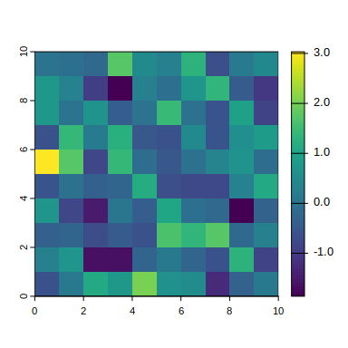
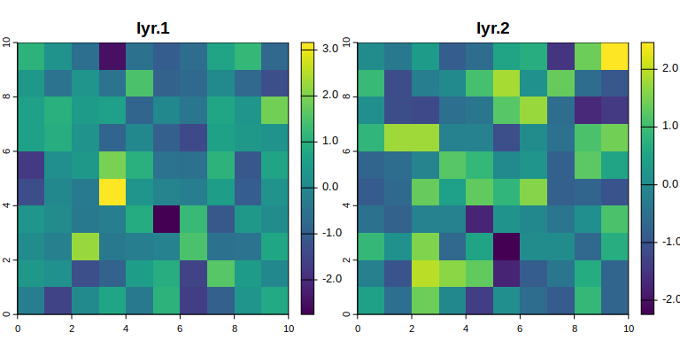
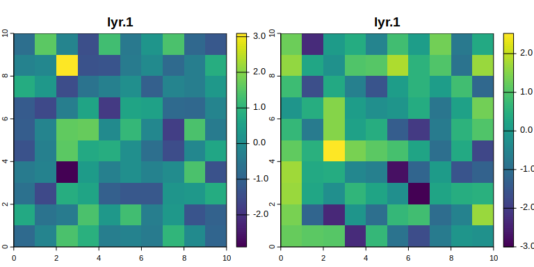
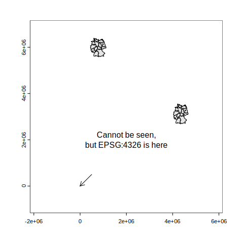
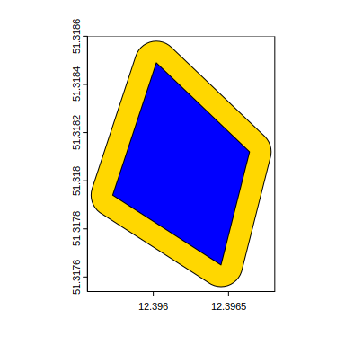

<!-- Page width -->
<style type="text/css">
#content{
  max-width:1000px;
}
</style>
<style>
blockquote.nb {
  border-left: 5px solid #007BFF;
  padding: 15px 20px;
  margin: 20px 0;
  background-color: #e9f5ff;
  font-family: Arial, sans-serif;
  position: relative;
}

blockquote.nb::before {
  content: "NB";
  position: absolute;
  top: 50%;
  left: -43px; /* Move outside the block */
  transform: translateY(-50%);
  background: #007BFF;
  color: white;
  font-weight: bold;
  font-size: 14px;
  padding: 5px 10px;
  border-radius: 3px;
}
</style>


# Introduction {.tabset}

## Set up

  - R installed.
  - `terra` installed.
  - `codetools` installed (optional, used by `terra` to perform code checks).
  - Download the [data archive](https://emilio-berti.github.io/teaching/gis-ydiv/data.zip) and decompress it.

## Data Sets {.tabset}
In this tutorial, we will use data sets for:

  - NDVI for the year 2024 in Leipzig, obtained from Sentinel2 (`ndvi-2024.tif`).
  - Landcover of Leipzig in 2015, obtained from the German Aerospace Center (DLR; `landcover-2015.tif`).

## Program

### What we will cover

  - Two days course
  - First day: get to know geometries and rasters
  - Second day: GIS operations + individual/group project

### What to expect

  - Familiarize yourself with basic GIS data and operations
  - Start a project of your interest
  - Getting some simple figures/analyses started

### What not to expect

  - To become a world-leading GIS expert

## Lecturers {.tabset}

### Emilio Berti (TiBS)


 - Theory in Biodiversity Science
 - Macroecologist / biogeographer
 - Theoretical ecologists

### Guilherme Pinto (BioEcon)


``` r
library(terra)
```

```
## terra 1.7.78
```

# Data Types

There are two main data types used in GIS:

  1. Geometries, also called vectors or shapes
  2. Rasters

They fill two different needs, namely to represent structures that can be well approximated using geometric objects, such as lines, circles, etc., 
and to represent grid data over an area.

## Geometries {.tabset}

### Overview
Structures such as a street or a building can be represented by a geometric objects.
For instance, a street can be represented by a straight line, whereas a building by a polygon.
It makes sense to store the data of these type of structures as their geometric representation.
For example, the building we are in and the adjacent street:


```{.r .fold-hide}
# This code in incomprehensible to you FOR NOW
# Just an example of geometries
r <- rast("data/idiv-building.tif")
plotRGB(r)
l <- vect(
  rbind(
    c(12.39585, 51.31866),
    c(12.39846, 51.31722)
  ),
  crs = "EPSG:4326"
)
lines(l, col = "green", lw = 5)
idiv <- vect(
  rbind(
    c(12.39573, 51.31794),
    c(12.39645, 51.31765),
    c(12.39664, 51.31812),
    c(12.39602, 51.31849),
    c(12.39573, 51.31794)
  ),
  crs = "EPSG:4326"
) |>
  as.lines() |>
  as.polygons()
idiv$name <- "iDiv building"
idiv$perimeter <- perim(idiv)
idiv$area <- expanse(idiv)
plot(idiv, add = TRUE, col = adjustcolor("blue", alpha.f = .5))
```


Geometries are saved in _vector_ or _shape_ files.
In addition to the geometric representation of the structure, 
shapefiles also contain metadata for the geometric representation, 
such as the its extent and coordinate reference system (we will talk about this later),
and for the structure, such as their name, length, etc.
For instance, the geometry of the iDiv building above is:

```{.r .fold-hide}
idiv
```

```
##  class       : SpatVector 
##  geometry    : polygons 
##  dimensions  : 1, 3  (geometries, attributes)
##  extent      : 12.39573, 12.39664, 51.31765, 51.31849  (xmin, xmax, ymin, ymax)
##  coord. ref. : lon/lat WGS 84 (EPSG:4326) 
##  names       :          name perimeter  area
##  type        :         <chr>     <num> <num>
##  values      : iDiv building     237.7  3265
```

Note that this structure has one geometry and three attributes/variables (`dimensions : 1, 3 (geometries, attributes)`): `name`, `perimeter` ($m$), and `area` ($m^2$).

### Geometry Types

In `terra`, there are three main geometry types:

  1. Points: they are defined by a vector with two values for coordinates (e.g., longitude and latitude)
  2. Lines: they are a series of points connected pairwise by straight lines
  3. Polygons: they are a series of lines inscribing a closed area

In `terra`, geometries are created with the function `vect()`.
To create a point geometry, you need to pass a matrix with the coordinates:

``` r
xy <- cbind(12.39585, 51.31866)  # cbind force it to be a matrix
vect(xy)
```

```
##  class       : SpatVector 
##  geometry    : points 
##  dimensions  : 1, 0  (geometries, attributes)
##  extent      : 12.39585, 12.39585, 51.31866, 51.31866  (xmin, xmax, ymin, ymax)
##  coord. ref. :
```
To create a geometry of multiple points, simply pass a matrix that has multiple rows:

``` r
xy <- rbind(
  cbind(12.39585, 51.31866),
  cbind(12.39584, 51.31865)
)
poi <- vect(xy)
```

In order to create lines, first create a multi-point geometry, then convert it using `as.lines()`:

``` r
xy <- rbind(
  cbind(12.39585, 51.31866),
  cbind(12.39584, 51.31865)
)
lin <- vect(xy) |> as.lines()
```

In order to create polygons, first create a mutli-point geometry, then covert it to lines, and finally to polygons using `as.polygons()`.
The last point should be the same as the first to close the geometry.


``` r
xy <- rbind(
  cbind(12.39585, 51.31866),
  cbind(12.39584, 51.31865),
  cbind(12.39584, 51.31866),
  cbind(12.39585, 51.31866)
)
pol <- vect(xy) |> as.lines() |> as.polygons()
```


``` r
plot(pol, col = "gold")
lines(lin, col = "red", lw = 5)
points(poi, col = "blue", cex = 1)
```


### Reading & Writing Geometries
`vect()` is also used to read geometries from a file.
For instance, to read the shapefile with the country boundary of Germany:

``` r
ger <- vect("data/germany.shp")
ger
```

```
##  class       : SpatVector 
##  geometry    : polygons 
##  dimensions  : 1, 5  (geometries, attributes)
##  extent      : 5.866755, 15.04179, 47.27012, 55.05866  (xmin, xmax, ymin, ymax)
##  source      : germany.shp
##  coord. ref. : lon/lat WGS 84 (EPSG:4326) 
##  names       :            shapeName shapeISO              shapeID shapeGroup
##  type        :                <chr>    <chr>                <chr>      <chr>
##  values      : the Federal Republi~      DEU 19620994B6459175825~        DEU
##  shapeType
##      <chr>
##       ADM0
```

To write geometries to disk, use `writeVector()`.


``` r
writeVector(ger, "data/germany.shp", overwrite = TRUE)
```

## Rasters {.tabset}

### Overview

Rasters are gridded areas where each grid pixel assumes a value.
When the data we are interested in are values on a gridded area, 
rasters are a better options than to using geometries.
For example, if we want to represent landcover type over a large area(forest, agriculture, build-up, etc.),
it is easier to grid the area into pixels and save the landcover type of each pixel rather
than to create a geometry for each different structure.

```{.r .fold-hide}
r <- rast("data/landcover-2015.tif")
plot(r)  # from EOC of DLR
```


Rasters are saved in raster files. 
In addition to the values of each grid, rasterfiles also contain metadata for the grid, 
such as the its extent and coordinate reference system (we will talk about this later).
For instance, some of the metadata of the landcover raster:

```{.r .fold-hide}
r
```

```
## class       : SpatRaster 
## dimensions  : 2042, 2032, 1  (nrow, ncol, nlyr)
## resolution  : 10, 10  (x, y)
## extent      : 4477870, 4498190, 3126660, 3147080  (xmin, xmax, ymin, ymax)
## coord. ref. : ETRS89-extended / LAEA Europe (EPSG:3035) 
## source      : landcover-2015.tif 
## color table : 1 
## categories  : category 
## name        :        category 
## min value   : Artificial Land 
## max value   :           Water
```
Note the metadata `dimensions` (grid size), `resolution` (spatial resolution, in $m$), 
and `extent` (spatial extent).

### Creating Rasters from Scratch
Simply put, rasters are array associated spatial metadata.
In `terra`, use `rast()` to create a raster from a matrix.

``` r
m <- matrix(rnorm(100), nrow = 10, ncol = 10)  # 10x10 matrix
r <- rast(m)
plot(r)
```


Usually, you will not create rasters from scratch.
However, if you are familiar with R arrays, you will notice a nice properties that is inherited by rasters: rasters can have multiple layers, with each layers being a matrix.

``` r
r <- rast(array(rnorm(200), dim = c(10, 10, 2)))
plot(r)
```



When an area has multiple rasters, it is possible to stack them to create a single raster object.
The rasters in the stack need to have all the same extent and coordinate reference system.
Use `c()` to stack rasters using `terra`.

``` r
r1 <- rast(matrix(rnorm(100), nrow = 10, ncol = 10))
r2 <- rast(matrix(rnorm(100), nrow = 10, ncol = 10))
r <- c(r1, r2)  # a stack
plot(r)
```



### Reading & Writing Rasters
To read rasters into memory, use `rast()`.

``` r
r <- rast("data/landcover-2015.tif")
r
```

```
## class       : SpatRaster 
## dimensions  : 2042, 2032, 1  (nrow, ncol, nlyr)
## resolution  : 10, 10  (x, y)
## extent      : 4477870, 4498190, 3126660, 3147080  (xmin, xmax, ymin, ymax)
## coord. ref. : ETRS89-extended / LAEA Europe (EPSG:3035) 
## source      : landcover-2015.tif 
## color table : 1 
## categories  : category 
## name        :        category 
## min value   : Artificial Land 
## max value   :           Water
```

To write rasters to disk, use `writeRaster()`.


``` r
writeRaster(r, "data/landcover-2015.tif", overwrite = TRUE, datatype = "INT1U")
```
Here, the argument `datatype = "INTU1"` (specifying the values in the grid are 1-byte unsigned integers) 
is needed because the rasters contains classes (levels).
In most cases, this argument is best left unspecified, as `terra` picks the optimal value by default.

## Spatial metadata {.tabset}

Spatial objects, being geometries or rasters, always need certain metadata to be useful.
For example, a raster is of little help if there is not information of the area it covers.
The most important metadata are:

  1. Spatial extent: the four corners of the quadrilateral polygon that inscribe the object represented
  2. Coordinate reference system: how is the earth surface represented
  3. Resolution (for rasters only)

We will cover each one of these three metadata in detail.

### Spatial extent
The spatial extent is the quadrilateral that inscribe the area of the spatial data.
The extent is usually represented by the coordinates of the four vertices of the quadrilateral, i.e. `xmin`, `xmax`, `ymin`, and `ymax`.
To get the spatial extent of an object, use `ext()`.

``` r
r <- rast("data/landcover-2015.tif")
ext(r)
```

```
## SpatExtent : 4477870, 4498190, 3126660, 3147080 (xmin, xmax, ymin, ymax)
```
### Coordinate reference system

GIS try to represent the surface of the Earth, a 3D spheroid, onto a plane.
The coordinate reference system (CRS), also known as spatial reference system (SRS), defines how this _projection_ of a 3D object to a 2D one is achieved.
It is not possible to achieve this projection accurately and some distortions will always be present.
In particular, at least one of distance, angular conformity, and area will be distorted.
Projections can be grouped into types, depending on which property of the Earth surface they do not distort:

  - Conformal projections: they correctly represent the angles between points and, thus, shapes (e.g. ESRI:54004^[ESRI stands for Environmental Systems Research Institute, Inc., which is the company that developed ArcGIS and created a code standard for projections. The other commonly used standard is maintained by the European Petroleum Survey Group (EPSG).]).
  - Equidistant: they correctly represent distances (e.g. ESRI:54002).
  - Equal-area: they correctly represent areas (e.g. ESRI:54034).

An overview of ESRI and EPSG projections can be found at <https://spatialreference.org/>.
Wikipedia also has a nice list with the property of each projection: <https://en.wikipedia.org/wiki/List_of_map_projections>.

To know the CRS of an object, use `crs()`.
By default, `crs()` displays the CRS in Well Known Text (WKT) format.


``` r
crs(idiv, parse = TRUE)
```

```
##  [1] "GEOGCRS[\"WGS 84\","                                      
##  [2] "    ENSEMBLE[\"World Geodetic System 1984 ensemble\","    
##  [3] "        MEMBER[\"World Geodetic System 1984 (Transit)\"],"
##  [4] "        MEMBER[\"World Geodetic System 1984 (G730)\"],"   
##  [5] "        MEMBER[\"World Geodetic System 1984 (G873)\"],"   
##  [6] "        MEMBER[\"World Geodetic System 1984 (G1150)\"],"  
##  [7] "        MEMBER[\"World Geodetic System 1984 (G1674)\"],"  
##  [8] "        MEMBER[\"World Geodetic System 1984 (G1762)\"],"  
##  [9] "        MEMBER[\"World Geodetic System 1984 (G2139)\"],"  
## [10] "        MEMBER[\"World Geodetic System 1984 (G2296)\"],"  
## [11] "        ELLIPSOID[\"WGS 84\",6378137,298.257223563,"      
## [12] "            LENGTHUNIT[\"metre\",1]],"                    
## [13] "        ENSEMBLEACCURACY[2.0]],"                          
## [14] "    PRIMEM[\"Greenwich\",0,"                              
## [15] "        ANGLEUNIT[\"degree\",0.0174532925199433]],"       
## [16] "    CS[ellipsoidal,2],"                                   
## [17] "        AXIS[\"geodetic latitude (Lat)\",north,"          
## [18] "            ORDER[1],"                                    
## [19] "            ANGLEUNIT[\"degree\",0.0174532925199433]],"   
## [20] "        AXIS[\"geodetic longitude (Lon)\",east,"          
## [21] "            ORDER[2],"                                    
## [22] "            ANGLEUNIT[\"degree\",0.0174532925199433]],"   
## [23] "    USAGE["                                               
## [24] "        SCOPE[\"Horizontal component of 3D system.\"],"   
## [25] "        AREA[\"World.\"],"                                
## [26] "        BBOX[-90,-180,90,180]],"                          
## [27] "    ID[\"EPSG\",4326]]"
```
Notice, among the others, the attributes `AREA` (the area of usage for the CRS) and `ID` (in this case, the EPSG code).

WKT is not very nice for humans; use the extra argument `proj = TRUE` to see the PROJ4 format of the CRS.


``` r
crs(idiv, proj = TRUE)
```

```
## [1] "+proj=longlat +datum=WGS84 +no_defs"
```

### Resolution

Resolution applies only to rasters, as geometries are geometric representation of structure and can be scaled at any level.
To get the resolution of a raster, use `res()`.

``` r
r <- rast("data/landcover-2015.tif")
res(r)
```

```
## [1] 10 10
```
The unit of the output of `res()` is the same as the unit of the CRS, in this case meters:

``` r
crs(r, proj = TRUE)
```

```
## [1] "+proj=laea +lat_0=52 +lon_0=10 +x_0=4321000 +y_0=3210000 +ellps=GRS80 +units=m +no_defs"
```

## Data Conversion

### Geometries to Rasters

To convert geometries to raster, use `rasterize()`.
In addition to the geometry to rasterize, you need to pass a raster to function as template, i.e. from which extent, CRS, and resolution are extracted from.

``` r
r <- rast("data/landcover-2015.tif")
idiv <- project(idiv, crs(r))
idiv_r <- rasterize(idiv, r, touches = TRUE)
```
I specified `touches = TRUE` assign a value of 1 to all cells that are touched by the polygon.
The extent of this new raster is the same as the landcover one, which is too big to actually see the raterized polygon.
Use `trim()` to trim the raster to the smallest raster containing all values that are not `NA`.

``` r
plot(trim(idiv_r))
lines(idiv)
```


### Rasters to Geometries

To convert rasters to geometries, use `as.points()` or `as.polygons()`.

``` r
r <- rast("data/landcover-2015.tif")
r <- crop(r, buffer(idiv, 1e2))  # restrict the area to something that can be plotted
poi <- as.points(r)
pol <- as.polygons(r)
```

```{.r .fold-hide}
op <- par(no.readonly = TRUE)
par(mfrow = c(1, 2))
plot(poi, "category")
lines(idiv)
plot(pol, "category")
lines(idiv)
```



```{.r .fold-hide}
par(op)
```

# Reprojecting

It is quite common that data are obtained from a source that uses a CRS that is not ideal for analyses.
It is even more common that data are gathered from multiple sources that do not use the same CRS.
In such cases, the spatial data should be reprojected to one common CRS that is ideal for analyses.

In `terra`, use `project()`, which can take three types of arguments:

  1. A spatial object with known CRS.
  2. A string with the WKT or PROJ4 CRS.
  3. A code of a known CRS, e.g. from the EPSG standard.


``` r
r <- rast("data/landcover-2015.tif")
germany <- vect("data/germany.shp")

germany <- project(germany, r)  # a spatial object
germany_mollweide <- project(germany, "+proj=moll")  # a proj4
germany_4326 <- project(germany, "EPSG:4326")  # a CRS code
```

<blockquote class="nb">
CRS have a big influence on analyses and visualization.
</blockquote>


```{.r .fold-hide}
plot(buffer(vect(cbind(2e6, 3e6)), 4e6), col = "white", lw = 1e-6)
polys(germany, col = "grey90")
polys(germany_mollweide, col = "grey90")
polys(germany_4326, col = "grey90")
l <- vect(
  rbind(
    cbind(5e5, 5e5),
    cbind(0, 0)
  )
)
lines(l[1], l[2], arrows = TRUE, length = .1)
l <- vect(
  rbind(
    cbind(2e6, 2e6),
    cbind(0, 0)
  )
)
text(l[1], labels = "Cannot be seen,\nbut EPSG:4326 is here")
```


# Geometry Operations {.tabset}
Commonly operations on geometries are to calculate their length and area, find their centroids, calculate distance, and buffering them.

## Length
Use `perim()` to obtain the length of lines or the perimeter of polygons.

``` r
perim(idiv)
```

```
## [1] 237.7479
```

``` r
idiv |> disagg(segments = TRUE) |> perim() |> sum()  # disagg(segments = TRUE) split the polygon into lines
```

```
## [1] 237.7479
```
The units are defined by the CRS.
<blockquote class="nb">
It is best to project the geometry to a longitude/latitude CRS to get more accurate results.
</blockquote>

``` r
idiv |> project("EPSG:4326") |> perim()  # difference of 3 mm 
```

```
## [1] 237.7449
```

## Area
Use `expanse()` to obtain the area of polygons.

``` r
expanse(idiv)
```

```
## [1] 3264.621
```
The units are defined by the CRS.
<blockquote class="nb">
It is best to project the geometry to a longitude/latitude CRS to get more accurate results.
</blockquote>

``` r
idiv |> project("EPSG:4326") |> expanse()  # same result, as CRS was equal-area
```

```
## [1] 3264.621
```

## Centroid
The centroid of a geometry is the point defined as the arithmetic mean position of all the points on the surface of the geometry.
Use `centroids()` to get the centroids of the geometries.

``` r
centr <- centroids(idiv)
plot(idiv, col = "blue")
points(centr, bg = "gold", cex = 2, pch = 21)
```


For concave polygons, the centroid may lay outside of the polygon itself

``` r
p <- vect(matrix(c(0, 0, 1, 0, 1, 1, 0.9, 0.1, 0, 0), byrow = TRUE, ncol = 2)) |> 
  as.lines() |> 
  as.polygons()
centr <- centroids(p)
plot(p, col = "blue")
points(centr, bg = "gold", cex = 2, pch = 21)
```


Specify `centroids(inside = TRUE)` to force the "centroid" to be inside the polygon.

``` r
p <- vect(matrix(c(0, 0, 1, 0, 1, 1, 0.9, 0.1, 0, 0), byrow = TRUE, ncol = 2)) |> 
  as.lines() |> 
  as.polygons()
centr <- centroids(p, inside = TRUE)
plot(p, col = "blue")
points(centr, bg = "gold", cex = 2, pch = 21)
```


## Distance
Use `distance()` to get the distances between geometries
When passing only an object will multiple geometries, distances will be calculated among each geometry and a (symmetric) matrix is returned.

``` r
poi <- vect(matrix(rnorm(10), ncol = 2), crs = "EPSG:4326")  # 5 random points
poi |> distance() |> as.matrix()
```

```
##          1         2        3         4        5
## 1      0.0 202997.26 323497.9 279235.08 195870.6
## 2 202997.3      0.00 204472.4  86717.62 224557.2
## 3 323497.9 204472.42      0.0 150282.42 185088.3
## 4 279235.1  86717.62 150282.4      0.00 243395.7
## 5 195870.6 224557.19 185088.3 243395.69      0.0
```

When passing also a second geometry, distances will be calculated among each geometry of the first object and each geometry of the second object.

``` r
distance(
  poi,
  idiv |> project("EPSG:4326") |> centroids()
)
```

```
##         [,1]
## [1,] 6027191
## [2,] 5853051
## [3,] 5706223
## [4,] 5766420
## [5,] 5873531
```

## Buffer
The buffer of a geometry is obtained by extending the geometry perpendicular to the tangent line of its side.
It is easier to see it than to explain it.
Use `buffer()` to buffer geometries.

``` r
b <- buffer(idiv, 10)  # 10 meters
plot(b, col = "gold")
polys(idiv, col = "blue")
```



## Example
Let us see an example where all operation are combined.
I want to find the centroid of Germany, how far is from the centroid of the main iDiv bulding, 
and plot the circle centered at the centroid with the smallest area that is touching the centroid of the iDiv building.


``` r
ger <- vect("data/germany.shp")
centr <- centroids(ger)  # centroid of Germany
idiv_centr <- idiv |> project(crs(centr)) |> centroids()
d <- distance(centr, idiv_centr)  # distance between centroids
b <- buffer(centr, d)  # circle with the smallest area touching iDiv
l <- as.lines(rbind(centr, idiv_centr))  # line connecting centroids

plot(ger)
polys(b, col = adjustcolor("blue", alpha.f = .5))
lines(l)
points(centr, pch = 21, cex = 2, bg = "gold")
points(idiv_centr, pch = 21, cex = 2, bg = "green")
text(centr, "Germany\ncentroid", pos = 2)
text(idiv_centr, "iDiv\ncentroid", pos = 4, adj = 0.5)
text(l, paste(round(d) / 1e3, "km"), pos = 3)
```


``` r
message("Distance between Germany centroid and iDiv: ", round(d / 1e3), " km")
```

```
## Distance between Germany centroid and iDiv: 142 km
```

``` r
message("Area of the smallest circle centered at the centroid of Germany and touching iDiv: ", round(expanse(b) / 1e6), " km^2")
```

```
## Area of the smallest circle centered at the centroid of Germany and touching iDiv: 62854 km^2
```

# Raster Operations {.tabset}

Commonly operations on rasters are to calculate summary statistics, 
aggregate of disaggregate to different resolutions, 
resampling, and interpolation.

## Summary Statistics
Raster stacks can be summarized using common function, such as `mean`, `sd`, `sum`, etc.
The output is a single raster layer with the summary.
Mean, sum, minimum, and maximum, can be calculated simply using `mean()`, `sum()`, etc.
For other function, use `app()`.

``` r
ndvi <- rast("data/ndvi-2024.tif")
avg_ndvi <- mean(ndvi, na.rm = TRUE)  # equivalent to app(ndvi, "mean")
std_ndvi <- app(ndvi, "sd", na.rm = TRUE)
month_max_ndvi <- app(ndvi, "which.max", na.rm = TRUE)  # month with the maximum NDVI

plot(avg_ndvi, col = colorRampPalette(c("dodgerblue3", "gold", "darkgreen"))(100))
```


``` r
plot(std_ndvi, col = hcl.colors(100, "Reds", rev = TRUE))
```


This is called a local summary, because it is calculated across pixels with the same coordinates.

To get global summaries, i.e. calculated across all pixels of a layer, use `global()`

``` r
global(ndvi, "mean", na.rm = TRUE)
```

<div data-pagedtable="false">
  <script data-pagedtable-source type="application/json">
{"columns":[{"label":[""],"name":["_rn_"],"type":[""],"align":["left"]},{"label":["mean"],"name":[1],"type":["dbl"],"align":["right"]}],"data":[{"1":"0.3887426","_rn_":"january"},{"1":"0.4403890","_rn_":"march"},{"1":"0.5492637","_rn_":"april"},{"1":"0.5802602","_rn_":"may"},{"1":"0.5067746","_rn_":"june"},{"1":"0.4962943","_rn_":"july"},{"1":"0.4762506","_rn_":"august"},{"1":"0.4215684","_rn_":"september"},{"1":"0.4762810","_rn_":"october"},{"1":"0.4690120","_rn_":"december"}],"options":{"columns":{"min":{},"max":[10]},"rows":{"min":[10],"max":[10]},"pages":{}}}
  </script>
</div>

Zonal statistics summarize the values of a raster using categories from another raster of geometry.
Use `zonal()` to obtain zonal statistics.

``` r
landcover <- rast("data/landcover-2015.tif")
avg_ndvi <- project(avg_ndvi, landcover)  # using classes from landcover
zonal(avg_ndvi, r, fun = "mean", na.rm = TRUE)
```

<div data-pagedtable="false">
  <script data-pagedtable-source type="application/json">
{"columns":[{"label":["category"],"name":[1],"type":["chr"],"align":["left"]},{"label":["mean"],"name":[2],"type":["dbl"],"align":["right"]}],"data":[{"1":"Artificial Land","2":"0.3970607"},{"1":"Open Soil","2":"0.1908845"},{"1":"High Seasonal Vegetation","2":"0.7300929"},{"1":"High Perennial Vegetation","2":"0.7497878"},{"1":"Low Seasonal Vegetation","2":"0.5194090"},{"1":"Low Perennial Vegetation","2":"0.6485347"},{"1":"Water","2":"-0.2468592"}],"options":{"columns":{"min":{},"max":[10]},"rows":{"min":[10],"max":[10]},"pages":{}}}
  </script>
</div>

``` r
zonal(avg_ndvi, r, fun = "sd", na.rm = TRUE)  # spatial sd
```

<div data-pagedtable="false">
  <script data-pagedtable-source type="application/json">
{"columns":[{"label":["category"],"name":[1],"type":["fct"],"align":["left"]},{"label":["mean"],"name":[2],"type":["dbl"],"align":["right"]}],"data":[{"1":"Artificial Land","2":"0.14935005"},{"1":"Open Soil","2":"0.18391683"},{"1":"High Seasonal Vegetation","2":"0.04638678"},{"1":"High Perennial Vegetation","2":"0.05891285"},{"1":"Low Seasonal Vegetation","2":"0.09866564"},{"1":"Low Perennial Vegetation","2":"0.09358618"},{"1":"Water","2":"0.26917867"}],"options":{"columns":{"min":{},"max":[10]},"rows":{"min":[10],"max":[10]},"pages":{}}}
  </script>
</div>

## Aggregate and disaggregate
