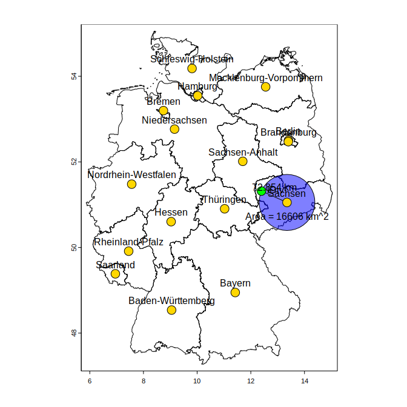
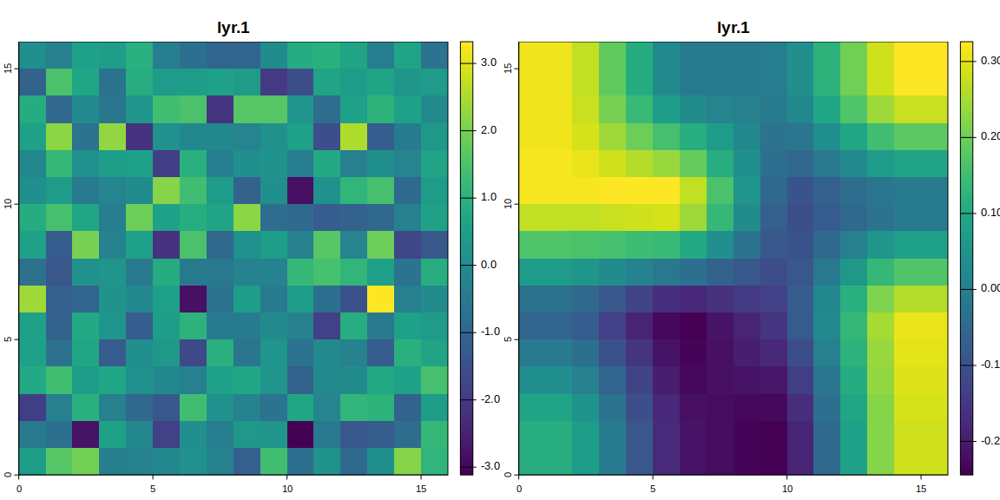
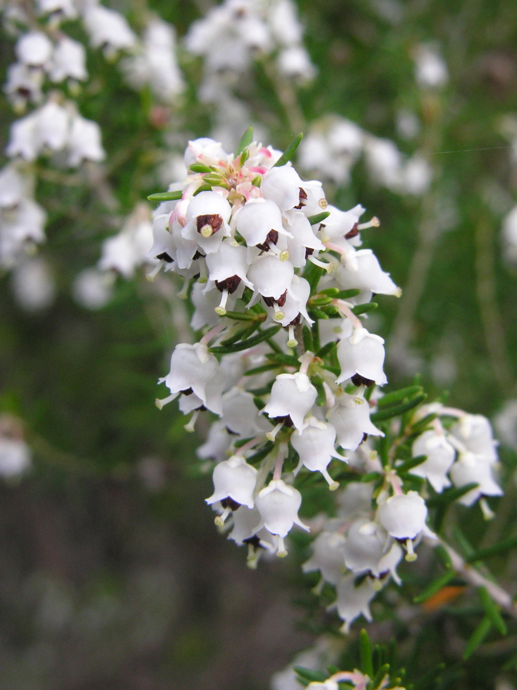
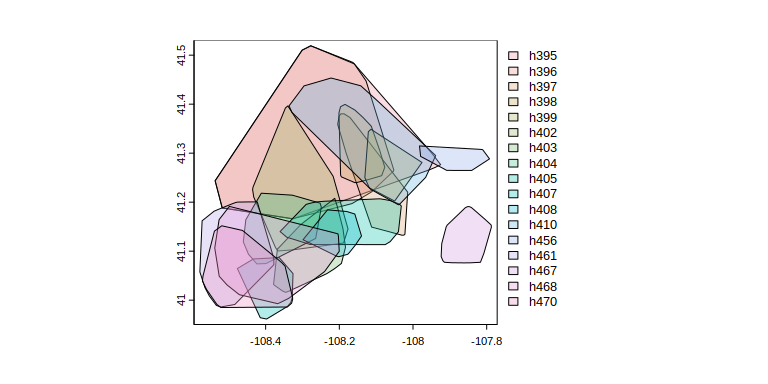

<style type="text/css">
#content{
  max-width:1000px;
}
</style>
<style>
blockquote.nb {
  border-left: 5px solid #a82020;
  padding: 5px 10px;
  margin: 20px 0;
  background-color: #ffe0e0;
  font-size: 14px;
  font-weight: bold;
  font-style: normal;
  position: relative;
}

blockquote.nb::before {
  content: "NB";
  position: absolute;
  top: 50%;
  left: -40px; /* Move outside the block */
  transform: translateY(-50%);
  background: #a82020;
  color: white;
  font-weight: bold;
  font-size: 14px;
  padding: 5px 10px;
  border-radius: 3px;
}
</style>


# Introduction {.tabset}

This document is a living tutorial that mirrors the lectures of the yDiv course "An Introduction to GIS for Ecology", held at iDiv in Leipzig.
In this two day course we will cover the very basics of GIS, focusing especially on applications to ecology.
During the first day, we will get to know the main data types of GIS, that is geometries and rasters.
During the second day, we will learn some of the most used GIS operations.
You will also start your own individual/group project.
The aims of this course are to

  - Familiarize yourself with basic GIS data and operations
  - Start a project of your interest
  - Getting some simple figures/analyses started

Do **not** expect to become a world-leading GIS expert by the end of the course; this is a basic introductory course (and GIS is quite hard to master).

At the end of each section, you will find multiple exercises; they are not mandatory, but they will help you.
Before starting, be sure to have your machine set up properly.
Also, you can download all data used in this tutorial by clicking [here](teaching/gis-ydiv/data.zip).

## Set up

You are strongly encouraged to run the examples as we progress through the lectures. 
For this you will need to following set up:

  - R installed.
  - `terra` installed.
  - `codetools` installed (optional, used by `terra` to perform code checks).
  - Download the [data archive](https://emilio-berti.github.io/teaching/gis-ydiv/data.zip) and decompress it.

Try run `library(terra)`. If it works, good news. If it does not, contact me some days before the course starts.

For the final exercise of the course, you will perform a simple  species' distribution modeling.
For this, you will need to:

  - Download [WorldClim bioclimatic variables at 5 arc-minute resolution](https://geodata.ucdavis.edu/climate/worldclim/2_1/base/wc2.1_5m_bio.zip).
  - Download the presence records for a species of your choosing from [GBIF](https://www.gbif.org/).


## Data Sets {.tabset}
In this tutorial, we will use data sets for:

  - NDVI for the year 2024 in Leipzig, obtained from Sentinel2 (`ndvi-2024.tif`).
  - Landcover of Leipzig in 2015, obtained from the German Aerospace Center (DLR; `landcover_4326-2015.tif`).
  - Average annual surface temperature from WorldClim (`wc2-bio1.tif`)
  - Bioclimatic variables from WorldClim (`bios.tif`)
  - Digital elevation model from WorldClim (`wc2-elevation.tif`)

All these files can be downloaded from <https://emilio-berti.github.io/teaching/gis-ydiv/data.zip>. 

## Lecturers {.tabset}

Emilio Berti (TiBS)

{width=200px}

 - Theory in Biodiversity Science
 - Macroecologist / biogeographer
 - Theoretical ecologist

Guilherme Pinto (BioEcon)

{width=200px}

 - Geoinformatics
 - Data scientist
 - Marine heatwaves / fisheries
 
# Data Types

There are two main data types used in GIS:

  1. Geometries (also called vectors or shapes). This usually has extension `.shp`.
  2. Rasters. This usually has extension `.tif`.

They fill two different needs, namely to represent structures that can be well approximated using geometric objects, such as lines, circles, etc., and to represent grid data over an area.

If you have produced figures for a manuscript, you are actually already familiar with these type of data.
Images can be saved as vector graphics, where each element is represented by a vector/geometry, or as a matrix/raster of pixels.
This is an old topic in computer graphics, and a nice summary can be found on Adobe website: <https://www.adobe.com/creativecloud/file-types/image/comparison/raster-vs-vector.html>.
This analogy is a useful one; remember it.

## Geometries

Structures such as trees, streets, or buildings can be represented by geometric objects.
For instance, a tree can be represented by a point, a street by straight line, and a building by a polygon.
It makes sense to store the data of these types of structures as their geometric representation.
For example, the building we are in and the adjacent street:


```{.r .fold-hide}
# This code in incomprehensible to you FOR NOW
# Just an example of geometries to show you how they look on a map
idiv <- rast("data/idiv-building.tif")
plotRGB(idiv)
l <- vect(
  rbind(
    c(12.39585, 51.31866),
    c(12.39846, 51.31722)
  ),
  crs = "EPSG:4326"
)
lines(l, col = "green", lw = 5)
idiv <- vect(
  rbind(
    c(12.39573, 51.31794),
    c(12.39645, 51.31765),
    c(12.39664, 51.31812),
    c(12.39602, 51.31849),
    c(12.39573, 51.31794)
  ),
  crs = "EPSG:4326"
) |>
  as.lines() |>
  as.polygons()
```

```
## Warning: [as.polygons] dropped attributes
```

```{.r .fold-hide}
idiv$name <- "iDiv building"
idiv$perimeter <- perim(idiv)
idiv$area <- expanse(idiv)
writeVector(idiv, "data/idiv.shp", overwrite = TRUE)
plot(idiv, add = TRUE, col = adjustcolor("blue", alpha.f = .5))
```


Geometries are saved in *vector-* or *shape-*files (usually with extension `.shp`).
In addition to the geometric representation of the structure, shapefiles also contain metadata for the geometric representation, such as its extent and coordinate reference system (we will talk about this later), and for the structure, such as their name, length, etc.
For instance, the geometry of the iDiv building above is:

```{.r .fold-hide}
idiv
```

```
##  class       : SpatVector 
##  geometry    : polygons 
##  dimensions  : 1, 3  (geometries, attributes)
##  extent      : 12.39573, 12.39664, 51.31765, 51.31849  (xmin, xmax, ymin, ymax)
##  coord. ref. : lon/lat WGS 84 (EPSG:4326) 
##  names       :          name perimeter  area
##  type        :         <chr>     <num> <num>
##  values      : iDiv building     237.7  3265
```

Note that this structure has one geometry and three attributes/variables (`dimensions: 1, 3 (geometries, attributes)`): `name`, `perimeter` ($m$), and `area` ($m^2$).

### Geometry Types

In `terra`, there are three main geometry types:

  1. Points: they are defined by a vector with two values for coordinates (e.g., longitude and latitude)
  2. Lines: they are a series of points connected by straight lines
  3. Polygons: they are a series of lines inscribing a closed area

In `terra`, geometries are created with the function `vect()`.
To create a point geometry, you need to pass a matrix with the coordinates:

```r
xy <- cbind(12.39585, 51.31866)  # cbind force it to be a matrix
vect(xy)
```

```
##  class       : SpatVector 
##  geometry    : points 
##  dimensions  : 1, 0  (geometries, attributes)
##  extent      : 12.39585, 12.39585, 51.31866, 51.31866  (xmin, xmax, ymin, ymax)
##  coord. ref. :
```
To create a geometry of multiple points, simply pass a matrix that has multiple rows:

```r
xy <- rbind(
  cbind(12.39585, 51.31866),
  cbind(12.39584, 51.31865)
)
poi <- vect(xy)
```

In order to create lines, first create a multi-point geometry, then convert it using `as.lines()`:

```r
xy <- rbind(
  cbind(12.39585, 51.31866),
  cbind(12.39584, 51.31865)
)
lin <- vect(xy) |> as.lines()
```

In order to create polygons, first create a mutli-point geometry, then covert it to lines, and finally to polygons using `as.polygons()`.
The last point should be the same as the first to close the geometry.
A geometry that is not closed does not inscribe an area and is not a polygon.


```r
xy <- rbind(
  cbind(12.39585, 51.31866),
  cbind(12.39584, 51.31865),
  cbind(12.39584, 51.31866),
  cbind(12.39585, 51.31866)
)
pol <- vect(xy) |> as.lines() |> as.polygons()
```

```
## Warning: [as.polygons] dropped attributes
```


```r
plot(pol, col = "gold")
lines(lin, col = "red", lw = 5)
points(poi, col = "blue", cex = 1)
```


### Reading, Subsetting & Writing Geometries

In most cases, you will not create your own geometry by hands, but load geometries from files.
To read geometries from a file, use `vect()`.

```r
ger <- vect("data/germany_bundes.shp")  # shapefile with the country boundary of Germany
ger
```

```
##  class       : SpatVector 
##  geometry    : polygons 
##  dimensions  : 16, 11  (geometries, attributes)
##  extent      : 5.866251, 15.04181, 47.2707, 55.05653  (xmin, xmax, ymin, ymax)
##  source      : germany_bundes.shp
##  coord. ref. : lon/lat WGS 84 (EPSG:4326) 
##  names       :   GID_1 GID_0 COUNTRY            NAME_1 VARNAME_1 NL_NAME_1
##  type        :   <chr> <chr>   <chr>             <chr>     <chr>     <chr>
##  values      : DEU.1_1   DEU Germany Baden-Württemberg        NA        NA
##                DEU.2_1   DEU Germany            Bayern   Bavaria        NA
##                DEU.3_1   DEU Germany            Berlin        NA        NA
##     TYPE_1  ENGTYPE_1  CC_1 HASC_1 ISO_1
##      <chr>      <chr> <chr>  <chr> <chr>
##       Land      State    08  DE.BW    NA
##  Freistaat Free State    09  DE.BY DE-BY
##       Land      State    11  DE.BE DE-BE
```

```r
plot(ger)
```


To subset a geometry, use `subset()`

```r
sn <- subset(ger, ger$NAME_1 == "Sachsen")
sn
plot(sn)
```

To load a geometry from a .csv file (or any data xy coordinates), use `vect()` with the `geom` parameter

```r
coo <- read.csv2("data/points.csv")
poi <- vect(coo, geom=c("x", "y"))
poi
```

```
##  class       : SpatVector 
##  geometry    : points 
##  dimensions  : 5, 1  (geometries, attributes)
##  extent      : 12.31867, 12.54047, 51.26761, 51.38168  (xmin, xmax, ymin, ymax)
##  coord. ref. :  
##  names       :  geom
##  type        : <int>
##  values      :     1
##                    2
##                    3
```

```r
plot(poi)
```


To write geometries to a file, use `writeVector()`.

```r
writeVector(sn, "data/sachsen.shp", overwrite = TRUE)  # if already exists you need overwrite = TRUE
```

## Rasters

Rasters are gridded areas where each grid pixel takes a value.
Rasters are useful because:

  - they compress the information of geometries to a manageable size. Imagine to have to work with building geometries *globally*. 
  - the data they represent is obtained in a gridded format. This is common for satellite data, for example.

When the data we are interested in are values on a gridded area, rasters are a better options than to using geometries, as they save a lot of memory and space on disk.
For example, if we want to represent landcover type over a large area(forest, agriculture, build-up, etc.), it is easier to grid the area into pixels and save the landcover type of each pixel rather than to create a geometry for each different structure.

```{.r .fold-hide}
landcover <- rast("data/landcover_4326-2015.tif")
plot(landcover)  # from EOC of DLR
```


Rasters are saved in raster files (usually with extension `.tif`). 
In addition to the values of each grid, rasterfiles also contain metadata for the grid,  such as the its extent and coordinate reference system (we will talk about this later).
For instance, some of the metadata of the landcover raster:

```{.r .fold-hide}
landcover
```

```
## class       : SpatRaster 
## dimensions  : 1607, 2553, 1  (nrow, ncol, nlyr)
## resolution  : 0.0001178543, 0.0001178543  (x, y)
## extent      : 12.24617, 12.54705, 51.22333, 51.41272  (xmin, xmax, ymin, ymax)
## coord. ref. : lon/lat WGS 84 (EPSG:4326) 
## source      : landcover_4326-2015.tif 
## color table : 1 
## categories  : category 
## name        :        category 
## min value   : Artificial Land 
## max value   :           Water
```
Note the metadata `dimensions` (grid size), `resolution` (spatial resolution, in $m$ for this raster), 
and `extent` (spatial extent).

### Creating Rasters from Scratch
Simply put, rasters are matrices/arrays with associated spatial metadata.
In `terra`, use `rast()` to create a raster from a matrix.

```r
m <- matrix(rnorm(100), nrow = 10, ncol = 10)  # 10x10 matrix
r <- rast(m)
plot(r)
```


Usually, you will not create rasters from scratch.
However, if you are familiar with R arrays, you will notice a nice properties that is inherited by rasters: rasters can have multiple layers, with each layer being a matrix.

```r
r <- rast(array(rnorm(200), dim = c(10, 10, 2)))  # 10x10x2 array
plot(r)
```


When an area has multiple rasters (e.g.: multiple observation dates), it is possible to stack them to create a single raster object.
The rasters in the stack need to have all the same extent and coordinate reference system.
Use `c()` to stack rasters using `terra`.

```r
r1 <- rast(matrix(rnorm(100), nrow = 10, ncol = 10))
r2 <- rast(matrix(rnorm(100), nrow = 10, ncol = 10))
r <- c(r1, r2)  # a stack
plot(r)
```


### Reading & Writing Rasters
To read rasters into memory, use `rast()`.

```r
landcover <- rast("data/landcover_4326-2015.tif")
landcover
```

```
## class       : SpatRaster 
## dimensions  : 1607, 2553, 1  (nrow, ncol, nlyr)
## resolution  : 0.0001178543, 0.0001178543  (x, y)
## extent      : 12.24617, 12.54705, 51.22333, 51.41272  (xmin, xmax, ymin, ymax)
## coord. ref. : lon/lat WGS 84 (EPSG:4326) 
## source      : landcover_4326-2015.tif 
## color table : 1 
## categories  : category 
## name        :        category 
## min value   : Artificial Land 
## max value   :           Water
```

To write rasters to disk, use `writeRaster()`.


```r
writeRaster(landcover, "data/landcover_4326-2015.tif", overwrite = TRUE, datatype = "INT1U")
```
Here, the argument `datatype = "INT1U"` (specifying the values in the grid are 1-byte unsigned integers) 
is needed because the rasters contains classes (levels).
In most cases, this argument is best left unspecified, as `terra` picks the optimal value by default.
Once you have used GIS for some time, you will notice that some of the rasters you downloaded have been scaled up to weird numbers, e.g. 65535.
This is because the creator of those rasters decided to save them as, e.g., 2-bytes unsigned integers, to make them smaller and, thus, easier to move around the internet.
If you need to deal with extremely big rasters, this trick may come in handy.

## Spatial metadata

Spatial objects always need certain metadata to be useful.
For example, a raster is of little help if there is not information of the area it covers.
The most important metadata are:

  1. Spatial extent: the four corners of the quadrilateral polygon that inscribe the object represented.
  2. Coordinate reference system: how the earth surface is represented.
  3. Resolution (for rasters only): the size of a pixel.

### Spatial extent
The spatial extent is the quadrilateral that inscribe the area of the spatial data.
The extent is usually represented by the coordinates of the four vertices of the quadrilateral, i.e. `xmin`, `xmax`, `ymin`, and `ymax`.
Use `ext()` to get the spatial extent of an object.

```r
landcover <- rast("data/landcover_4326-2015.tif")
ext(landcover)
```

```
## SpatExtent : 12.2461656680878, 12.547047594374, 51.2233274363786, 51.4127192325172 (xmin, xmax, ymin, ymax)
```
### Coordinate reference system

GIS try to represent the surface of the Earth, a 3D spheroid, onto a plane.
The coordinate reference system (CRS), also known as spatial reference system (SRS), defines how this _projection_ of a 3D object to a 2D one is achieved.
It is not possible to achieve this projection accurately and some distortions will always be present.
In particular, at least one of distance, angular conformity, and area will be distorted.
Projections can be grouped into types, depending on which property of the Earth surface they do not distort:

  - Conformal: they correctly represent the angles between points and, thus, shapes (e.g. ESRI:54004).
  - Equidistant: they correctly represent distances (e.g. ESRI:54002).
  - Equal-area: they correctly represent areas (e.g. ESRI:54034).

An overview of ESRI and EPSG^[ESRI stands for Environmental Systems Research Institute, Inc., which is the company that developed ArcGIS and created a code standard for projections. The other commonly used standard is maintained by the European Petroleum Survey Group (EPSG).] projections can be found at <https://spatialreference.org/>.
Wikipedia also has a nice list with the property of some projection: <https://en.wikipedia.org/wiki/List_of_map_projections>.

Use `crs()` to know the CRS of an object.
By default, `crs()` displays the CRS in Well Known Text (WKT) format.

```r
crs(idiv, parse = TRUE)
```

```
##  [1] "GEOGCRS[\"WGS 84\","                                      
##  [2] "    ENSEMBLE[\"World Geodetic System 1984 ensemble\","    
##  [3] "        MEMBER[\"World Geodetic System 1984 (Transit)\"],"
##  [4] "        MEMBER[\"World Geodetic System 1984 (G730)\"],"   
##  [5] "        MEMBER[\"World Geodetic System 1984 (G873)\"],"   
##  [6] "        MEMBER[\"World Geodetic System 1984 (G1150)\"],"  
##  [7] "        MEMBER[\"World Geodetic System 1984 (G1674)\"],"  
##  [8] "        MEMBER[\"World Geodetic System 1984 (G1762)\"],"  
##  [9] "        MEMBER[\"World Geodetic System 1984 (G2139)\"],"  
## [10] "        ELLIPSOID[\"WGS 84\",6378137,298.257223563,"      
## [11] "            LENGTHUNIT[\"metre\",1]],"                    
## [12] "        ENSEMBLEACCURACY[2.0]],"                          
## [13] "    PRIMEM[\"Greenwich\",0,"                              
## [14] "        ANGLEUNIT[\"degree\",0.0174532925199433]],"       
## [15] "    CS[ellipsoidal,2],"                                   
## [16] "        AXIS[\"geodetic latitude (Lat)\",north,"          
## [17] "            ORDER[1],"                                    
## [18] "            ANGLEUNIT[\"degree\",0.0174532925199433]],"   
## [19] "        AXIS[\"geodetic longitude (Lon)\",east,"          
## [20] "            ORDER[2],"                                    
## [21] "            ANGLEUNIT[\"degree\",0.0174532925199433]],"   
## [22] "    USAGE["                                               
## [23] "        SCOPE[\"Horizontal component of 3D system.\"],"   
## [24] "        AREA[\"World.\"],"                                
## [25] "        BBOX[-90,-180,90,180]],"                          
## [26] "    ID[\"EPSG\",4326]]"
```
Notice, among the others, the attributes `AREA` (the area of usage for the CRS) and `ID` (in this case, the EPSG code).
WKT is not very nice for humans; use the extra argument `proj = TRUE` to see the PROJ4 format of the CRS.

```r
crs(idiv, proj = TRUE)
```

```
## [1] "+proj=longlat +datum=WGS84 +no_defs"
```
Use `project()` to project a spatial object from one CRS to another.

```r
landcover <- project(landcover, crs("EPSG:3035"))
crs(landcover)
```

```
## [1] "PROJCRS[\"ETRS89-extended / LAEA Europe\",\n    BASEGEOGCRS[\"ETRS89\",\n        ENSEMBLE[\"European Terrestrial Reference System 1989 ensemble\",\n            MEMBER[\"European Terrestrial Reference Frame 1989\"],\n            MEMBER[\"European Terrestrial Reference Frame 1990\"],\n            MEMBER[\"European Terrestrial Reference Frame 1991\"],\n            MEMBER[\"European Terrestrial Reference Frame 1992\"],\n            MEMBER[\"European Terrestrial Reference Frame 1993\"],\n            MEMBER[\"European Terrestrial Reference Frame 1994\"],\n            MEMBER[\"European Terrestrial Reference Frame 1996\"],\n            MEMBER[\"European Terrestrial Reference Frame 1997\"],\n            MEMBER[\"European Terrestrial Reference Frame 2000\"],\n            MEMBER[\"European Terrestrial Reference Frame 2005\"],\n            MEMBER[\"European Terrestrial Reference Frame 2014\"],\n            ELLIPSOID[\"GRS 1980\",6378137,298.257222101,\n                LENGTHUNIT[\"metre\",1]],\n            ENSEMBLEACCURACY[0.1]],\n        PRIMEM[\"Greenwich\",0,\n            ANGLEUNIT[\"degree\",0.0174532925199433]],\n        ID[\"EPSG\",4258]],\n    CONVERSION[\"Europe Equal Area 2001\",\n        METHOD[\"Lambert Azimuthal Equal Area\",\n            ID[\"EPSG\",9820]],\n        PARAMETER[\"Latitude of natural origin\",52,\n            ANGLEUNIT[\"degree\",0.0174532925199433],\n            ID[\"EPSG\",8801]],\n        PARAMETER[\"Longitude of natural origin\",10,\n            ANGLEUNIT[\"degree\",0.0174532925199433],\n            ID[\"EPSG\",8802]],\n        PARAMETER[\"False easting\",4321000,\n            LENGTHUNIT[\"metre\",1],\n            ID[\"EPSG\",8806]],\n        PARAMETER[\"False northing\",3210000,\n            LENGTHUNIT[\"metre\",1],\n            ID[\"EPSG\",8807]]],\n    CS[Cartesian,2],\n        AXIS[\"northing (Y)\",north,\n            ORDER[1],\n            LENGTHUNIT[\"metre\",1]],\n        AXIS[\"easting (X)\",east,\n            ORDER[2],\n            LENGTHUNIT[\"metre\",1]],\n    USAGE[\n        SCOPE[\"Statistical analysis.\"],\n        AREA[\"Europe - European Union (EU) countries and candidates. Europe - onshore and offshore: Albania; Andorra; Austria; Belgium; Bosnia and Herzegovina; Bulgaria; Croatia; Cyprus; Czechia; Denmark; Estonia; Faroe Islands; Finland; France; Germany; Gibraltar; Greece; Hungary; Iceland; Ireland; Italy; Kosovo; Latvia; Liechtenstein; Lithuania; Luxembourg; Malta; Monaco; Montenegro; Netherlands; North Macedonia; Norway including Svalbard and Jan Mayen; Poland; Portugal including Madeira and Azores; Romania; San Marino; Serbia; Slovakia; Slovenia; Spain including Canary Islands; Sweden; Switzerland; Türkiye (Turkey); United Kingdom (UK) including Channel Islands and Isle of Man; Vatican City State.\"],\n        BBOX[24.6,-35.58,84.73,44.83]],\n    ID[\"EPSG\",3035]]"
```

### Resolution

Resolution applies only to rasters, as geometries can be scaled at any level.
Use `res()` to get the resolution of a raster.

```r
res(landcover)
```

```
## [1] 9.855366 9.855366
```
The first value is the "horizontal" and the second is the "vertical" resolution.Basically, it is the size of the pixel. The units of the output of `res()` is the same as the unit of the CRS, in this case $m$:

```r
crs(landcover, proj = TRUE)
```

```
## [1] "+proj=laea +lat_0=52 +lon_0=10 +x_0=4321000 +y_0=3210000 +ellps=GRS80 +units=m +no_defs"
```

# Reprojecting

It is quite common that data are obtained from a source that uses a CRS that is not ideal for analyses.
It is even more common that data are gathered from multiple sources that do not use the same CRS.
In such cases, the spatial data should be reprojected to one common CRS that is ideal for analyses.

Use `project()` to project a spatial object from one CRS to another.
Three types of arguments can be passed to `project()`:

  1. A spatial object with known CRS.
  2. A string with the WKT or PROJ4 CRS.
  3. A code of a known CRS, e.g. from the EPSG standard.


```r
r <- rast("data/landcover_4326-2015.tif")
germany <- vect("data/germany_bundes.shp")

germany <- project(germany, crs(r))  # a spatial object
germany_mollweide <- project(germany, "+proj=moll")  # a proj4
germany_3035 <- project(germany, "EPSG:3035")  # a CRS code
```
<blockquote class="nb">
When using an existing spatial object (`<obj>`) as CRS target, remember to use `project(<x>, crs(<obj>))` and not `project(<x>, <obj>)` if you are interested in reprojecting only. See section 5.3 about resampling for details.
</blockquote>

CRS have a big influence on analyses and visualization.

```{.r .fold-hide}
plot(buffer(vect(cbind(2e6, 3e6)), 4e6), col = "white", lw = 1e-6)
polys(germany, col = "grey90")
polys(germany_mollweide, col = "grey90")
polys(germany_3035, col = "grey90")
l <- vect(
  rbind(
    cbind(5e5, 5e5),
    cbind(0, 0)
  )
)
lines(l[1], l[2], arrows = TRUE, length = .1)
l <- vect(
  rbind(
    cbind(2e6, 2e6),
    cbind(0, 0)
  )
)
text(l[1], labels = "Cannot be seen,\nbut EPSG:4326 is here")
```


<blockquote class="nb">
Be sure to use the CRS that is best for your analyses or visualization.
</blockquote>

# Data Conversion

Sometimes is needed to create a raster from a geometry or *vice versa*.

## Geometries to Rasters

Use `rasterize()` to convert geometries to raster.
In addition to the geometry to rasterize, you need to pass a raster to function as template, i.e. from which extent, CRS, and resolution are extracted from.

```r
landcover <- rast("data/landcover_4326-2015.tif")
idiv <- vect("data/idiv.shp")
idiv <- project(idiv, crs(landcover))  # CRS needs to be the same
idiv_r <- rasterize(idiv, landcover, touches = TRUE)
```
If specified, `touches = TRUE` assigns a value of 1 to all cells that are touched by the polygon.
The extent of this new raster is the same as the landcover one, which is too big to actually see the raterized polygon.
Use `trim()` to trim the raster to the smallest raster containing all values that are not `NA`.

```r
plot(trim(idiv_r))
lines(idiv)
```


## Rasters to Geometries

Use `as.points()` or `as.polygons()` to convert rasters to geometries.

```r
landcover <- crop(landcover, buffer(idiv, 1e2))  # restrict the area to something that can be plotted
poi <- as.points(landcover)
pol <- as.polygons(landcover)
```

```{.r .fold-hide}
op <- par(no.readonly = TRUE)
par(mfrow = c(1, 2))
plot(poi, "category")
lines(idiv)
plot(pol, "category")
lines(idiv)
```


```{.r .fold-hide}
par(op)
```

# Geometry Operations
Commonly operations on geometries are to calculate their length and area, find their centroids, calculate distance, and buffering them.

## Length
Use `perim()` to obtain the length of lines or the perimeter of polygons.

```r
perim(idiv)
```

```
## [1] 237.7449
```

```r
idiv |> disagg(segments = TRUE) |> perim() |> sum()  # disagg(segments = TRUE) split the polygon into lines
```

```
## [1] 237.7449
```
The output units are in "m", though you may get more accurate results by first transforming the data to longitude/latitude.
<blockquote class="nb">
It is best to project the geometry to a longitude/latitude CRS to get more accurate results.
</blockquote>

```r
idiv |> project("EPSG:4326") |> perim()  # difference of 3 mm 
```

```
## [1] 237.7449
```

## Area
Use `expanse()` to obtain the area of polygons and rasters (please read the function's help to see tips on how the calculations work for both).

```r
expanse(idiv)
```

```
## [1] 3264.621
```
The output units can be in "m", "km", or "ha".
<blockquote class="nb">
It is best to project the geometry to a longitude/latitude CRS to get more accurate results.
</blockquote>

```r
idiv |> project("EPSG:4326") |> expanse()  # same result, as CRS was equal-area
```

```
## [1] 3264.621
```

## Centroid
The centroid of a geometry is the point defined as the arithmetic mean position of all the points on the surface of the geometry.
Use `centroids()` to get the centroids of the geometries.

```r
centr <- centroids(idiv)
plot(idiv, col = "blue")
points(centr, bg = "gold", cex = 2, pch = 21)
```


For concave polygons, the centroid may lay outside of the polygon itself

```r
p <- vect(matrix(c(0, 0, 1, 0, 1, 1, 0.9, 0.1, 0, 0), byrow = TRUE, ncol = 2)) |> 
  as.lines() |> 
  as.polygons()
```

```
## Warning: [as.polygons] dropped attributes
```

```r
centr <- centroids(p)
plot(p, col = "blue")
points(centr, bg = "gold", cex = 2, pch = 21)
```


Specify `centroids(inside = TRUE)` to force the "centroid" to be inside the polygon.

```r
p <- vect(matrix(c(0, 0, 1, 0, 1, 1, 0.9, 0.1, 0, 0), byrow = TRUE, ncol = 2)) |> 
  as.lines() |> 
  as.polygons()
```

```
## Warning: [as.polygons] dropped attributes
```

```r
centr <- centroids(p, inside = TRUE)
plot(p, col = "blue")
points(centr, bg = "gold", cex = 2, pch = 21)
```


## Distance
Use `distance()` to get the distances between geometries.
When passing only one object with multiple geometries, distances will be calculated among each geometry and a (symmetric) matrix is returned. 

```r
poi <- vect(matrix(rnorm(10), ncol = 2), crs = "EPSG:4326")  # 5 random points
poi |> distance(unit = "km") |> as.matrix()
```

```
##          1        2        3         4         5
## 1   0.0000 249.3231 219.8547 144.15574 141.23091
## 2 249.3231   0.0000 333.1207 225.05815 215.19348
## 3 219.8547 333.1207   0.0000 112.29506 122.23561
## 4 144.1557 225.0582 112.2951   0.00000  10.04541
## 5 141.2309 215.1935 122.2356  10.04541   0.00000
```

When passing a second geometry, distances will be calculated among each geometry of the first object and each geometry of the second object.

```r
distance(
  poi,
  idiv |> project("EPSG:4326") |> centroids(),
  unit = "km"
)
```

```
##          [,1]
## [1,] 5893.045
## [2,] 5649.156
## [3,] 5941.702
## [4,] 5857.176
## [5,] 5848.732
```

## Buffer
The buffer of a geometry is obtained by extending the geometry perpendicular to the tangent line of its side, i.e., a buffer around all cells/geometries.
It is easier to see it than to explain it.
Use `buffer()` to buffer geometries. The distance unit of the buffer `width` parameter generally is meters.

```r
b <- buffer(idiv, width = 10)  # 10 meters
plot(b, col = "gold")
polys(idiv, col = "blue")
```


## Exercise

  1. Find the centroid of each German state and how far is from the centroid of the main iDiv bulding. 
  2. Find the state which centroid is closest to iDiv.
  3. Plot the circle centered at the centroid with the smallest area that is touching the centroid of the iDiv building.

The geometry of Germany is saved in `data/germany_bundes.shp`.
The geometry of the iDiv building is saved in `data/idiv.shp`.
Click on the "Code" button below to see a solution to this problem.


```{.r .fold-hide}
ger <- vect("data/germany_bundes.shp")
idiv <- vect("data/idiv.shp")

centr <- centroids(ger)  # centroids of German states
idiv_centr <- idiv |> project(crs(ger)) |> centroids()  # centroid of iDiv
d <- distance(idiv_centr, centr)
closest_state_id <- which.min(d)
closest <- centr[closest_state_id]  # closest centroid state
b <- buffer(centr[closest_state_id], d[closest_state_id])  # circle with the smallest area touching iDiv
l <- as.lines(rbind(centr[closest_state_id], idiv_centr))  # line connecting centroids

plot(ger)
polys(b, col = adjustcolor("blue", alpha.f = .5))
lines(l)
points(centr, pch = 21, cex = 2, bg = "gold")
points(idiv_centr, pch = 21, cex = 2, bg = "green")
text(centr, centr$NAME_1, pos = 3)
text(idiv_centr, "iDiv", pos = 4)
text(l, paste(round(d[closest_state_id]) / 1e3, "km"), pos = 3)
text(b, paste("Area =", round(expanse(b) / 1e6), "km^2"), pos = 1, offset = 1)
```



# Raster Operations

Commonly operations on rasters are to calculate summary statistics, aggregate or disaggregate to different resolutions, resampling, and interpolation.

## Summary Statistics {.tabset}

### Local Summary
A local summary is calculated across pixels with the same coordinates i.e. locally.
Raster stacks can be summarized using common function, such as `mean`, `sd`, `sum`, etc.
The output is a single raster layer with the summary.
Mean, sum, minimum, and maximum, can be calculated simply using `mean()`, `sum()`, etc.
For other function, use `app()`.

```r
ndvi <- rast("data/ndvi-2024.tif")
avg_ndvi <- mean(ndvi, na.rm = TRUE)
std_ndvi <- app(ndvi, "sd", na.rm = TRUE)
month_max_ndvi <- app(ndvi, "which.max", na.rm = TRUE)  # month with the maximum NDVI
plot(avg_ndvi, col = colorRampPalette(c("dodgerblue3", "orange", "darkgreen"))(100))
```


```r
plot(std_ndvi, col = hcl.colors(100, "Reds", rev = TRUE))
```


### Global Summary
Global summaries are calculated across all pixels of a layer.
Use `global()` to get global summaries.
When the input is a raster stack, the global summary is calculated for each layer separately.

```r
global(ndvi, "mean", na.rm = TRUE)
```

<div data-pagedtable="false">
  <script data-pagedtable-source type="application/json">
{"columns":[{"label":[""],"name":["_rn_"],"type":[""],"align":["left"]},{"label":["mean"],"name":[1],"type":["dbl"],"align":["right"]}],"data":[{"1":"0.3887426","_rn_":"january"},{"1":"0.4403890","_rn_":"march"},{"1":"0.5492637","_rn_":"april"},{"1":"0.5802602","_rn_":"may"},{"1":"0.5067746","_rn_":"june"},{"1":"0.4962943","_rn_":"july"},{"1":"0.4762506","_rn_":"august"},{"1":"0.4215684","_rn_":"september"},{"1":"0.4762810","_rn_":"october"},{"1":"0.4690120","_rn_":"december"}],"options":{"columns":{"min":{},"max":[10]},"rows":{"min":[10],"max":[10]},"pages":{}}}
  </script>
</div>

### Zonal Summary
Zonal statistics summarize the values of a raster using categories from another raster of geometry.
Use `zonal()` to obtain zonal statistics.
Two arguments (`<x>`, `<y>`) are always required for `zonal(<x>, <y>)`, with `<x>` being the raster with the values to summarize and `<y>` the raster/geometry specifying the categories for the summary.

```r
landcover <- rast("data/landcover_4326-2015.tif")
avg_ndvi <- project(avg_ndvi, landcover)  # this will also resample avg_ndvi (see the section Resampling)
zonal(avg_ndvi, landcover, fun = "mean", na.rm = TRUE)
```

<div data-pagedtable="false">
  <script data-pagedtable-source type="application/json">
{"columns":[{"label":["category"],"name":[1],"type":["chr"],"align":["left"]},{"label":["mean"],"name":[2],"type":["dbl"],"align":["right"]}],"data":[{"1":"Artificial Land","2":"0.3972677"},{"1":"Open Soil","2":"0.1917675"},{"1":"High Seasonal Vegetation","2":"0.7299292"},{"1":"High Perennial Vegetation","2":"0.7495042"},{"1":"Low Seasonal Vegetation","2":"0.5193868"},{"1":"Low Perennial Vegetation","2":"0.6483166"},{"1":"Water","2":"-0.2462283"}],"options":{"columns":{"min":{},"max":[10]},"rows":{"min":[10],"max":[10]},"pages":{}}}
  </script>
</div>

## Aggregate and Disaggregate {.tabset}

### Aggregate
Aggregating creates a raster that is at coarser resolution compared to the original raster.
Use `aggregate()` to aggregate rasters.
The arguments `fact`, number of cells in each direction to be aggregated, and `fun`, the function used for aggregatation, need to be specified.

```r
r <- rast(matrix(rnorm(16^2), 16, 16))
r_aggr <- aggregate(r, 4, "max")  # maximum values in the 4x4 grid

par(mfrow = c(1, 2))  # cannot stack rasters with different resolution
plot(r)
plot(r_aggr)
```


```r
par(mfrow = c(1, 1))
```

### Disaggregate
Disaggregating creates a raster that is at finer resolution compared to the original raster.
Use `disagg()` to disaggregate rasters.
The arguments `fact`, number of cells in each direction to create for each cell of the original raster, and `method`, the method used for disaggregation, need to be specified.
Available methods are `near`, for nearest neighbor, or `bilinear`, for bilinear interpolation.

```r
r_disagg <- disagg(r, 4, method = "bilinear")

par(mfrow = c(1, 2))  # cannot stack rasters with different resolution
plot(r)
plot(r_disagg)
```


```r
par(mfrow = c(1, 1))
```

<blockquote class="nb">
Aggregating and disaggregating a raster does not give, in general, the same raster back. Some of the original information is lost during aggregation.
</blockquote>

```r
plot(c(r, r |> aggregate(4, "mean") |> disagg(4, "bilinear")))
```



### Exercise
Assess how global average of NDVI is affected by the resolution of the NDVI layers.
Aggregate the NDVI layer by a factor `seq(2, 20, by = 1)` and see if the global average change.
Click on the "Code" button below to see a solution to this problem.


```{.r .fold-hide}
ndvi <- rast("data/ndvi-2024.tif") |> mean()
global_avg_ndvi <- rep(NA, 20)
global_avg_ndvi[1] <- (ndvi |> global("mean", na.rm = TRUE))[1, 1]
for (f in 2:20) {
  global_avg_ndvi[f] <- (ndvi |> aggregate(fact = f) |> global("mean", na.rm = TRUE))[1, 1]
}
global_avg_ndvi <- data.frame(
  fact = 1:20,
  avg_ndvi = global_avg_ndvi
)
scatter.smooth(global_avg_ndvi, ylim = c(0, .5))
```


The average NDVI is not changing.
This is a property of the average.
Try instead to see if the standard deviation changes.


```{.r .fold-hide}
ndvi <- rast("data/ndvi-2024.tif") |> mean()
global_std_ndvi <- rep(NA, 20)
global_std_ndvi[1] <- (ndvi |> global("sd", na.rm = TRUE))[1, 1]
for (f in 2:20) {
  global_std_ndvi[f] <- (ndvi |> aggregate(fact = f) |> global("sd", na.rm = TRUE))[1, 1]
}
global_std_ndvi <- data.frame(
  fact = 1:20,
  std_ndvi = global_std_ndvi
)
scatter.smooth(global_std_ndvi, ylim = c(0.1, .3))
```


The standard deviation decreases for increasing aggregation factor.
This is because aggregating is done here (implicitly) using `mean` as the aggregating function.
This reduces spatial heterogeneity and, therefore, the global standard deviation.
Scale is important for some processes, but not others.

## Resampling
When two rasters do not align, i.e. they have different origin or resolution, to make them comparable one of them must be resampled.
Resampling transform one of the two rasters to a raster that align with the other.
Use `resample()` to resample rasters.
The argument `method` is used to specify the algorithm used for resampling.
Among the available algorithms are:

  - `near`, for nearest neighbor.
  - `bilinear`, for bilinear interpolation.
  - `cubic`, for cubic interpolation.
  - `cubicspline`, for cubic-spline interpolation.
  - `lanczos`, for Lanczos resampling.


```r
landcover <- rast("data/landcover_4326-2015.tif")
ndvi <- rast("data/ndvi-2024.tif") |>
  mean(na.rm = TRUE) |>
  project(crs(landcover))

ndvi_resampled <- resample(ndvi, landcover, method = "lanczos")

plot(ndvi_resampled, col = colorRampPalette(c("dodgerblue3", "orange", "darkgreen"))(100))
```


<blockquote class="nb">
The difference between `project(x, crs(y))` and `project(x, y)` is that the first only project the CRS, whereas the second actually resample `x` to `y`.
In many cases `resample(x, y, method = <method>)` can be avoided by using `project(x, y, method = <method>)`
</blockquote>

## Raster and vector techniques

### Mask
Create a new raster (or vector) where values outside a specified mask are set to NA (or another specified value). Essentially, it "masks out" or hides portions of a raster based on a separate "mask" object, which can be another raster, a polygon, or an extent.


```r
landcover <- rast("data/landcover_4326-2015.tif")
idiv <- vect("data/idiv.shp")
landcover_idiv <- mask(landcover, idiv)
landcover_idiv <- trim(landcover_idiv) # remove rows and columns with all NAs
plot(landcover_idiv)
lines(idiv)
```


### point in raster
Extract the values from a raster or a polygon based on a set of locations (ex.: points or polygons).  

```r
landcover <- rast("data/landcover_4326-2015.tif")
coo <- read.csv2("data/points.csv")
poi <- vect(coo, geom=c("x", "y"))
landcover_ex <- extract(landcover, poi)
landcover_ex
```

<div data-pagedtable="false">
  <script data-pagedtable-source type="application/json">
{"columns":[{"label":["ID"],"name":[1],"type":["dbl"],"align":["right"]},{"label":["category"],"name":[2],"type":["fct"],"align":["left"]}],"data":[{"1":"1","2":"Low Seasonal Vegetation"},{"1":"2","2":"Low Seasonal Vegetation"},{"1":"3","2":"Low Seasonal Vegetation"},{"1":"4","2":"Artificial Land"},{"1":"5","2":"Artificial Land"}],"options":{"columns":{"min":{},"max":[10]},"rows":{"min":[10],"max":[10]},"pages":{}}}
  </script>
</div>

### exercise
Get the mean, min and max ndvi values for the month of August, using a 100 meters buffer of around the points given. 

```r
coo <- read.csv2("data/points.csv")
poi <- vect(coo, geom=c("x", "y"))
ndvi <- rast("data/ndvi-2024.tif") 
poi_b <- buffer(poi, 100)
ndvi.mean <- extract(ndvi[["august"]], poi_b, fun = mean, na.rm = T)
ndvi.mean
```

<div data-pagedtable="false">
  <script data-pagedtable-source type="application/json">
{"columns":[{"label":["ID"],"name":[1],"type":["int"],"align":["right"]},{"label":["august"],"name":[2],"type":["dbl"],"align":["right"]}],"data":[{"1":"1","2":"0.4762506"},{"1":"2","2":"0.4762506"},{"1":"3","2":"0.4762506"},{"1":"4","2":"0.4762506"},{"1":"5","2":"0.4762506"}],"options":{"columns":{"min":{},"max":[10]},"rows":{"min":[10],"max":[10]},"pages":{}}}
  </script>
</div>

```r
ndvi.min <- extract(ndvi[["august"]], poi_b, fun = min, na.rm = T)
ndvi.min
```

<div data-pagedtable="false">
  <script data-pagedtable-source type="application/json">
{"columns":[{"label":["ID"],"name":[1],"type":["int"],"align":["right"]},{"label":["august"],"name":[2],"type":["dbl"],"align":["right"]}],"data":[{"1":"1","2":"-0.6882937"},{"1":"2","2":"-0.6882937"},{"1":"3","2":"-0.6882937"},{"1":"4","2":"-0.6882937"},{"1":"5","2":"-0.6882937"}],"options":{"columns":{"min":{},"max":[10]},"rows":{"min":[10],"max":[10]},"pages":{}}}
  </script>
</div>

```r
ndvi.max <- extract(ndvi[["august"]], poi_b, fun = max, na.rm = T)
ndvi.max 
```

<div data-pagedtable="false">
  <script data-pagedtable-source type="application/json">
{"columns":[{"label":["ID"],"name":[1],"type":["int"],"align":["right"]},{"label":["august"],"name":[2],"type":["dbl"],"align":["right"]}],"data":[{"1":"1","2":"0.9264064"},{"1":"2","2":"0.9264064"},{"1":"3","2":"0.9264064"},{"1":"4","2":"0.9264064"},{"1":"5","2":"0.9264064"}],"options":{"columns":{"min":{},"max":[10]},"rows":{"min":[10],"max":[10]},"pages":{}}}
  </script>
</div>

# Examples
I provide three examples below of some of the most common applications of GIS in Ecology:

  1. Species distribution modelling (SDM).
  2. Analysis of telemetry (GPS) data.
  3. Count points inside polygons, e.g. number of trees in Leipzig districts.

These examples are not _reserach-ready_, i.e. the analysis can be largely improved.
However, they provide a good starting point to start similar projects using GIS.

## Species Distribution Model (SDM)
I will show how to perform a simple species distribution model (SDM) for the species _Erica arborea_.




I load the libraries.

```r
library(tibble)
library(dplyr)
library(readr)
library(terra)
```

I load the file downloaded from GBIF and convert it to a geometry (points).

```r
gbif <- read_tsv("data/erica-arborea-gbif.tsv") |> 
  select("decimalLongitude", "decimalLatitude") |>
  vect(
    geom = c("decimalLongitude", "decimalLatitude"),
    crs = "+proj=longlat +datum=WGS84"  # I know this is GBIF CRS
  )
```

```
## Warning: One or more parsing issues, call `problems()` on your data frame for details, e.g.:
##   dat <- vroom(...)
##   problems(dat)
```

```
## Rows: 13228 Columns: 50
## ── Column specification ─────────────────────────────────────────────────────────────────────────────────────────────────────────────────────────────────────────────────────────────────
## Delimiter: "\t"
## chr  (31): datasetKey, occurrenceID, kingdom, phylum, class, order, family, ...
## dbl  (13): gbifID, individualCount, decimalLatitude, decimalLongitude, coord...
## lgl   (4): infraspecificEpithet, depth, depthAccuracy, typeStatus
## dttm  (2): dateIdentified, lastInterpreted
## 
## ℹ Use `spec()` to retrieve the full column specification for this data.
## ℹ Specify the column types or set `show_col_types = FALSE` to quiet this message.
```

I load the bioclimatic variables from WorldClim.

```r
bios <- rast("data/bios.tif")

# I also create a template of the land
land <- bios[[1]]
land[!is.na(land)] <- 1
names(land) <- "land"
```

I thin the GBIF data retaining only one point per grid cell.

```r
gbif <- extract(land, gbif, cells = TRUE, xy = TRUE) |> 
  as_tibble() |> 
  filter(!is.na(land)) |> 
  group_by(cell) |> 
  slice_sample(n = 1) |> 
  ungroup() |> 
  select("x", "y") |> 
  vect(geom = c("x", "y"), crs = "+proj=longlat +datum=WGS84")
```

I sample pseudo-absences randomly in the polygon that contains all GBIF observation, buffered to 100 km.

```r
range <- gbif |> convHull()
abs <- spatSample(buffer(range, 1e5), length(gbif) * 2)
abs <- extract(land, abs, cells = TRUE, xy = TRUE) |> 
  as_tibble() |> 
  filter(!is.na(land)) |> 
  group_by(cell) |> 
  slice_sample(n = 1) |> 
  ungroup() |> 
  select("x", "y") |> 
  slice_sample(n = length(gbif)) |> 
  vect(geom = c("x", "y"), crs = "+proj=longlat +datum=WGS84")
```

I prepare the data frame to be used for fitting the SDM.

```r
gbif$occ <- 1
abs$occ <- 0
p <- rbind(gbif, abs)
d <- extract(bios, p, ID = FALSE) |> as_tibble()
d
```

<div data-pagedtable="false">
  <script data-pagedtable-source type="application/json">
{"columns":[{"label":["BIO01"],"name":[1],"type":["dbl"],"align":["right"]},{"label":["BIO02"],"name":[2],"type":["dbl"],"align":["right"]},{"label":["BIO03"],"name":[3],"type":["dbl"],"align":["right"]},{"label":["BIO04"],"name":[4],"type":["dbl"],"align":["right"]},{"label":["BIO05"],"name":[5],"type":["dbl"],"align":["right"]},{"label":["BIO06"],"name":[6],"type":["dbl"],"align":["right"]},{"label":["BIO07"],"name":[7],"type":["dbl"],"align":["right"]},{"label":["BIO08"],"name":[8],"type":["dbl"],"align":["right"]},{"label":["BIO09"],"name":[9],"type":["dbl"],"align":["right"]},{"label":["BIO10"],"name":[10],"type":["dbl"],"align":["right"]},{"label":["BIO11"],"name":[11],"type":["dbl"],"align":["right"]},{"label":["BIO12"],"name":[12],"type":["dbl"],"align":["right"]},{"label":["BIO13"],"name":[13],"type":["dbl"],"align":["right"]},{"label":["BIO14"],"name":[14],"type":["dbl"],"align":["right"]},{"label":["BIO15"],"name":[15],"type":["dbl"],"align":["right"]},{"label":["BIO16"],"name":[16],"type":["dbl"],"align":["right"]},{"label":["BIO17"],"name":[17],"type":["dbl"],"align":["right"]},{"label":["BIO18"],"name":[18],"type":["dbl"],"align":["right"]},{"label":["BIO19"],"name":[19],"type":["dbl"],"align":["right"]}],"data":[{"1":"7.97949982","2":"6.928166","3":"37.72073","4":"426.4392","5":"18.33275","6":"-0.034249999","7":"18.36700","8":"3.81904149","9":"9.37991714","10":"13.474250","11":"3.12454152","12":"798","13":"86","14":"49","15":"16.932779","16":"236","17":"165","18":"181","19":"221"},{"1":"8.20994759","2":"6.001271","3":"37.69465","4":"387.6683","5":"17.11025","6":"1.189499974","7":"15.92075","8":"4.63287497","9":"9.38187504","10":"13.136875","11":"3.89612508","12":"1560","13":"190","14":"79","15":"31.218904","16":"531","17":"243","18":"281","19":"487"},{"1":"8.28932381","2":"7.014203","3":"38.03200","4":"428.9179","5":"18.74058","6":"0.297681153","7":"18.44290","8":"4.10951710","9":"9.75685978","10":"13.825217","11":"3.41086960","12":"852","13":"91","14":"50","15":"18.577347","16":"257","17":"170","18":"186","19":"238"},{"1":"8.15078259","2":"6.946179","3":"37.96987","4":"424.0436","5":"18.52486","6":"0.230939224","7":"18.29392","8":"6.01975155","9":"9.52587509","10":"13.636234","11":"3.35059857","12":"763","13":"78","14":"47","15":"14.960662","16":"220","17":"159","18":"183","19":"201"},{"1":"8.18603134","2":"6.484104","3":"37.85730","4":"411.0128","5":"17.98125","6":"0.853500009","7":"17.12775","8":"4.21854162","9":"9.65758324","10":"13.490167","11":"3.54370832","12":"1363","13":"160","14":"69","15":"31.291111","16":"463","17":"212","18":"243","19":"423"},{"1":"8.39756203","2":"6.544375","3":"37.69367","4":"417.1435","5":"18.34450","6":"0.982500017","7":"17.36200","8":"4.34658337","9":"9.93691635","10":"13.796166","11":"3.67724991","12":"1333","13":"156","14":"68","15":"31.177965","16":"453","17":"208","18":"238","19":"414"},{"1":"8.59797955","2":"7.141500","3":"38.69526","4":"422.6108","5":"19.24625","6":"0.790499985","7":"18.45575","8":"4.65474987","9":"5.24625015","10":"14.044833","11":"3.87962508","12":"744","13":"72","14":"49","15":"13.106711","16":"213","17":"163","18":"181","19":"192"},{"1":"9.14554501","2":"6.643526","3":"38.90528","4":"396.0043","5":"18.75231","6":"1.676153898","7":"17.07615","8":"7.21256399","9":"12.79166698","10":"14.152693","11":"4.54705143","12":"822","13":"96","14":"48","15":"25.573858","16":"276","17":"147","18":"169","19":"227"},{"1":"8.72411442","2":"6.979812","3":"36.66494","4":"448.8028","5":"19.67050","6":"0.633750021","7":"19.03675","8":"4.50691652","9":"12.84200001","10":"14.482250","11":"3.61770821","12":"815","13":"87","14":"53","15":"16.187057","16":"251","17":"173","18":"183","19":"234"},{"1":"9.99856281","2":"6.918541","3":"36.39709","4":"457.8857","5":"20.77200","6":"1.763499975","7":"19.00850","8":"7.59087515","9":"8.94120884","10":"15.881000","11":"4.74654150","12":"828","13":"87","14":"52","15":"18.131657","16":"256","17":"169","18":"201","19":"213"},{"1":"8.38051033","2":"6.765146","3":"35.79442","4":"450.4272","5":"19.22300","6":"0.323000014","7":"18.90000","8":"4.22995853","9":"12.57241631","10":"14.190916","11":"3.30529165","12":"1054","13":"117","14":"65","15":"19.778358","16":"337","17":"209","18":"223","19":"314"},{"1":"9.16501904","2":"6.737209","3":"38.02149","4":"408.2629","5":"19.04215","6":"1.322674394","7":"17.71948","8":"7.40993214","9":"10.25804234","10":"14.361870","11":"4.59055233","12":"1054","13":"123","14":"59","15":"23.931984","16":"348","17":"192","18":"221","19":"293"},{"1":"9.41262245","2":"7.378445","3":"38.71763","4":"442.9305","5":"20.09013","6":"1.033066630","7":"19.05707","8":"7.22013330","9":"5.91919994","10":"15.068400","11":"4.36244440","12":"743","13":"79","14":"46","15":"17.443443","16":"229","17":"152","18":"179","19":"181"},{"1":"9.41479301","2":"6.215741","3":"37.46512","4":"394.3054","5":"18.58280","6":"1.992063522","7":"16.59074","8":"7.79254818","9":"10.45727539","10":"14.354321","11":"4.93800688","12":"1191","13":"140","14":"67","15":"25.005123","16":"397","17":"213","18":"242","19":"335"},{"1":"8.57246876","2":"6.658854","3":"35.36207","4":"453.4139","5":"19.25075","6":"0.420249999","7":"18.83050","8":"6.38024998","9":"4.93625021","10":"14.377000","11":"3.41854167","12":"896","13":"91","14":"61","15":"14.698565","16":"266","17":"192","18":"216","19":"233"},{"1":"9.37080193","2":"7.636271","3":"38.45922","4":"454.9596","5":"20.76000","6":"0.904500008","7":"19.85550","8":"5.08191681","9":"5.80783319","10":"15.224792","11":"4.21366644","12":"696","13":"68","14":"48","15":"12.948491","16":"200","17":"147","18":"176","19":"182"},{"1":"9.32324982","2":"8.005583","3":"38.58159","4":"468.6645","5":"21.31325","6":"0.563499987","7":"20.74975","8":"4.86049986","9":"5.69875002","10":"15.346625","11":"3.98224998","12":"651","13":"62","14":"44","15":"10.697402","16":"181","17":"141","18":"164","19":"165"},{"1":"9.62549973","2":"7.665417","3":"37.36129","4":"477.5581","5":"21.41650","6":"0.899499953","7":"20.51700","8":"7.32775021","9":"5.81737518","10":"15.683750","11":"4.19566679","12":"614","13":"64","14":"39","15":"14.572206","16":"180","17":"127","18":"156","19":"150"},{"1":"9.61443710","2":"7.530792","3":"36.83710","4":"476.7725","5":"21.36800","6":"0.924499989","7":"20.44350","8":"7.38800001","9":"5.77687502","10":"15.675459","11":"4.20812511","12":"607","13":"64","14":"38","15":"16.123629","16":"181","17":"123","18":"158","19":"150"},{"1":"9.62794781","2":"8.054729","3":"38.03258","4":"489.8063","5":"21.90175","6":"0.723249972","7":"21.17850","8":"10.33329201","9":"5.82795858","10":"15.847250","11":"4.04250002","12":"581","13":"58","14":"35","15":"14.242796","16":"167","17":"121","18":"144","19":"141"},{"1":"9.82201099","2":"8.218411","3":"38.20098","4":"496.2264","5":"22.34791","6":"0.834293187","7":"21.51361","8":"7.37862110","9":"5.94157934","10":"16.093107","11":"4.17530537","12":"572","13":"60","14":"35","15":"16.815414","16":"173","17":"118","18":"139","19":"141"},{"1":"10.34948921","2":"8.034354","3":"37.97582","4":"488.5439","5":"22.57925","6":"1.422749996","7":"21.15650","8":"5.71854162","9":"6.53741646","10":"16.648666","11":"4.81524992","12":"611","13":"61","14":"39","15":"15.397449","16":"180","17":"128","18":"141","19":"158"},{"1":"10.41880226","2":"7.910104","3":"38.11777","4":"476.6299","5":"22.38200","6":"1.630249977","7":"20.75175","8":"7.97450018","9":"6.68966675","10":"16.585375","11":"5.02341652","12":"642","13":"66","14":"40","15":"16.062788","16":"192","17":"137","18":"143","19":"168"},{"1":"10.67322922","2":"8.144583","3":"38.23120","4":"487.9016","5":"23.01900","6":"1.715499997","7":"21.30350","8":"6.02870846","9":"6.88741684","10":"16.984583","11":"5.16362476","12":"633","13":"63","14":"40","15":"15.669028","16":"187","17":"132","18":"146","19":"165"},{"1":"10.48514557","2":"8.155875","3":"38.22409","4":"489.9215","5":"22.87425","6":"1.537250042","7":"21.33700","8":"5.82958364","9":"6.67754173","10":"16.821709","11":"4.94995832","12":"661","13":"68","14":"43","15":"16.769020","16":"200","17":"140","18":"148","19":"177"},{"1":"10.09173965","2":"7.905938","3":"37.95321","4":"483.2632","5":"22.12575","6":"1.294999957","7":"20.83075","8":"5.53849983","9":"6.27966642","10":"16.291834","11":"4.62054157","12":"645","13":"68","14":"42","15":"18.066587","16":"199","17":"135","18":"143","19":"174"},{"1":"9.76217747","2":"7.700938","3":"37.98992","4":"471.4394","5":"21.36650","6":"1.095499992","7":"20.27100","8":"5.33891678","9":"14.04154205","10":"15.771875","11":"4.40004158","12":"720","13":"79","14":"44","15":"21.613134","16":"232","17":"148","18":"150","19":"203"},{"1":"9.90389538","2":"8.005375","3":"40.37104","4":"444.4326","5":"21.22000","6":"1.390499949","7":"19.82950","8":"5.84087515","9":"13.93645859","10":"15.595959","11":"4.92237473","12":"792","13":"94","14":"41","15":"25.599596","16":"266","17":"145","18":"151","19":"244"},{"1":"10.33893871","2":"8.042644","3":"40.10479","4":"447.2959","5":"21.83550","6":"1.781433225","7":"20.05407","8":"6.24180222","9":"14.44896793","10":"16.089142","11":"5.32915306","12":"805","13":"98","14":"39","15":"28.074844","16":"277","17":"142","18":"146","19":"252"},{"1":"10.31274986","2":"7.635917","3":"34.49469","4":"539.2862","5":"22.92050","6":"0.783999979","7":"22.13650","8":"10.86549950","9":"6.34220839","10":"17.047417","11":"3.94674993","12":"735","13":"77","14":"43","15":"16.225912","16":"215","17":"148","18":"185","19":"170"},{"1":"10.39276028","2":"7.704521","3":"34.41131","4":"547.9506","5":"23.20725","6":"0.817749977","7":"22.38950","8":"7.39116669","9":"6.39495850","10":"17.265125","11":"3.93666673","12":"754","13":"78","14":"45","15":"15.520331","16":"220","17":"154","18":"190","19":"176"},{"1":"10.19445801","2":"7.645292","3":"34.49341","4":"542.7530","5":"22.92775","6":"0.763249993","7":"22.16450","8":"7.21787500","9":"6.27145815","10":"16.965000","11":"3.77333331","12":"731","13":"74","14":"44","15":"14.171520","16":"209","17":"152","18":"185","19":"170"},{"1":"10.29459858","2":"6.296120","3":"37.48989","4":"393.6222","5":"19.60265","6":"2.808465719","7":"16.79418","8":"6.83134890","9":"13.73893356","10":"15.277954","11":"5.90273380","12":"1057","13":"129","14":"56","15":"28.681189","16":"368","17":"183","18":"212","19":"345"},{"1":"10.06679153","2":"8.188916","3":"35.65631","4":"550.7036","5":"23.27825","6":"0.312000006","7":"22.96625","8":"7.00950003","9":"6.14324999","10":"16.993708","11":"3.53608346","12":"777","13":"75","14":"52","15":"11.439060","16":"217","17":"173","18":"198","19":"188"},{"1":"10.65138435","2":"5.603989","3":"37.80327","4":"342.4400","5":"18.97317","6":"4.149085522","7":"14.82409","8":"7.91925812","9":"13.38490868","10":"15.132774","11":"6.93353653","12":"1090","13":"132","14":"54","15":"30.889853","16":"385","17":"178","18":"216","19":"325"},{"1":"11.87843132","2":"3.760785","3":"31.85517","4":"292.6018","5":"18.56471","6":"6.758823395","7":"11.80588","8":"9.76862717","9":"13.94215679","10":"15.769608","11":"8.70784283","12":"1021","13":"125","14":"50","15":"31.435120","16":"358","17":"162","18":"206","19":"312"},{"1":"10.57261848","2":"6.345378","3":"33.81625","4":"463.0202","5":"20.92059","6":"2.156302452","7":"18.76429","8":"8.46841717","9":"16.18340302","10":"16.343487","11":"5.06743717","12":"738","13":"83","14":"47","15":"20.889318","16":"238","17":"150","18":"165","19":"205"},{"1":"10.40380192","2":"8.589146","3":"33.04344","4":"668.0008","5":"25.15350","6":"-0.839999974","7":"25.99350","8":"17.18916702","9":"3.55075002","10":"18.807875","11":"2.36837506","12":"579","13":"65","14":"36","15":"18.184160","16":"183","17":"116","18":"171","19":"123"},{"1":"10.91895962","2":"5.630967","3":"33.94410","4":"402.8508","5":"20.12412","6":"3.535175800","7":"16.58895","8":"7.42864323","9":"15.78613853","10":"16.106113","11":"6.34970713","12":"930","13":"119","14":"46","15":"32.352676","16":"333","17":"148","18":"176","19":"290"},{"1":"10.00137520","2":"8.382584","3":"35.86554","4":"562.8122","5":"23.37950","6":"0.007250000","7":"23.37225","8":"6.81620836","9":"6.08366680","10":"17.080750","11":"3.31354165","12":"662","13":"61","14":"47","15":"8.549815","16":"178","17":"148","18":"168","19":"162"},{"1":"10.32469749","2":"7.368604","3":"35.71012","4":"492.1630","5":"22.12575","6":"1.491250038","7":"20.63450","8":"7.85920811","9":"16.44620895","10":"16.446209","11":"4.53633308","12":"708","13":"74","14":"48","15":"15.827352","16":"217","17":"153","18":"153","19":"199"},{"1":"10.82288551","2":"8.032229","3":"35.13546","4":"553.8163","5":"24.02275","6":"1.161999941","7":"22.86075","8":"7.70720863","9":"6.98370838","10":"17.782583","11":"4.25799990","12":"641","13":"62","14":"44","15":"10.467793","16":"175","17":"144","18":"153","19":"163"},{"1":"11.60487461","2":"7.829500","3":"34.36969","4":"565.9734","5":"24.65675","6":"1.876500010","7":"22.78025","8":"17.05400085","9":"5.77404165","10":"18.772291","11":"4.93349981","12":"632","13":"62","14":"42","15":"10.699238","16":"174","17":"145","18":"154","19":"155"},{"1":"11.44812489","2":"8.167292","3":"35.27340","4":"566.3914","5":"24.82925","6":"1.674999952","7":"23.15425","8":"16.89695740","9":"7.54554176","10":"18.620543","11":"4.78020859","12":"641","13":"63","14":"44","15":"10.109729","16":"178","17":"146","18":"159","19":"155"},{"1":"11.43546486","2":"5.810853","3":"36.21256","4":"375.1130","5":"20.56512","6":"4.518604755","7":"16.04651","8":"8.19031048","9":"16.07635689","10":"16.311241","11":"7.31899261","12":"990","13":"124","14":"43","15":"34.447819","16":"361","17":"147","18":"171","19":"345"},{"1":"11.45092964","2":"5.952621","3":"35.97510","4":"392.7458","5":"20.71048","6":"4.163978577","7":"16.54650","8":"7.96877241","9":"16.23337936","10":"16.531227","11":"6.99130821","12":"931","13":"111","14":"44","15":"30.615250","16":"329","17":"147","18":"168","19":"305"},{"1":"11.19085217","2":"7.278067","3":"37.49374","4":"460.1756","5":"22.10660","6":"2.695177794","7":"19.41142","8":"9.00638771","9":"16.90465355","10":"16.931303","11":"5.82415390","12":"769","13":"88","14":"45","15":"23.112082","16":"251","17":"138","18":"153","19":"223"},{"1":"10.46465588","2":"7.879354","3":"34.59157","4":"554.5563","5":"23.62625","6":"0.847999990","7":"22.77825","8":"7.35733318","9":"6.61166668","10":"17.437000","11":"3.89279175","12":"635","13":"60","14":"42","15":"10.080141","16":"173","17":"146","18":"150","19":"160"},{"1":"11.13831234","2":"7.707708","3":"33.67319","4":"568.3486","5":"24.24950","6":"1.359750032","7":"22.88975","8":"16.54045868","9":"7.24191666","10":"18.309208","11":"4.41395807","12":"643","13":"63","14":"43","15":"10.139227","16":"176","17":"148","18":"156","19":"158"},{"1":"11.43725014","2":"8.127666","3":"34.85352","4":"573.8506","5":"24.82025","6":"1.500749946","7":"23.31950","8":"16.94775009","9":"7.49512482","10":"18.694792","11":"4.67583323","12":"632","13":"61","14":"44","15":"9.311122","16":"173","17":"145","18":"156","19":"153"},{"1":"11.08922863","2":"6.563083","3":"37.76228","4":"403.4231","5":"20.85850","6":"3.478499889","7":"17.38000","8":"7.37608337","9":"16.03804207","10":"16.218208","11":"6.42875004","12":"969","13":"116","14":"46","15":"30.189880","16":"341","17":"153","18":"176","19":"315"},{"1":"11.82359600","2":"6.965483","3":"36.55379","4":"458.3676","5":"22.62145","6":"3.566016674","7":"19.05543","8":"7.36982346","9":"17.51741028","10":"17.575626","11":"6.49572849","12":"743","13":"87","14":"42","15":"24.933050","16":"247","17":"130","18":"145","19":"221"},{"1":"11.26568508","2":"6.145569","3":"38.25235","4":"369.8609","5":"20.34653","6":"4.280664444","7":"16.06586","8":"8.02900314","9":"15.84149075","10":"16.034290","11":"7.17739153","12":"1108","13":"136","14":"48","15":"33.295357","16":"393","17":"162","18":"194","19":"384"},{"1":"10.53116703","2":"6.605250","3":"37.62817","4":"408.5437","5":"20.44125","6":"2.887249947","7":"17.55400","8":"6.77624989","9":"15.59375000","10":"15.725000","11":"5.85891676","12":"1085","13":"130","14":"51","15":"31.162266","16":"386","17":"169","18":"194","19":"359"},{"1":"10.37557316","2":"7.995271","3":"37.17736","4":"508.7591","5":"22.80950","6":"1.303750038","7":"21.50575","8":"5.29762506","9":"16.79791641","10":"16.797916","11":"4.47445822","12":"771","13":"82","14":"44","15":"17.718164","16":"234","17":"148","18":"148","19":"229"},{"1":"10.64430237","2":"8.301938","3":"35.47685","4":"566.2214","5":"23.92250","6":"0.521499991","7":"23.40100","8":"16.07595825","9":"6.72941685","10":"17.754917","11":"3.88141680","12":"633","13":"61","14":"45","15":"9.390700","16":"172","17":"142","18":"156","19":"155"},{"1":"9.46107292","2":"8.830895","3":"34.56285","4":"633.2864","5":"23.80625","6":"-1.743999958","7":"25.55025","8":"5.67779160","9":"5.32875013","10":"17.411583","11":"1.84966660","12":"828","13":"84","14":"53","15":"12.483756","16":"232","17":"177","18":"208","19":"216"},{"1":"8.05518723","2":"8.379917","3":"31.81079","4":"684.5296","5":"22.40200","6":"-3.940999985","7":"26.34300","8":"16.52445793","9":"0.92129183","10":"16.524458","11":"-0.27937499","12":"906","13":"111","14":"49","15":"29.544167","16":"325","17":"156","18":"325","19":"161"},{"1":"11.44257259","2":"8.515771","3":"38.69706","4":"511.2523","5":"24.22800","6":"2.221750021","7":"22.00625","8":"6.32220840","9":"17.91462517","10":"17.914625","11":"5.55162477","12":"747","13":"79","14":"44","15":"20.034071","16":"232","17":"138","18":"138","19":"222"},{"1":"10.30968761","2":"8.792125","3":"35.78544","4":"587.4985","5":"24.47150","6":"-0.097500004","7":"24.56900","8":"15.94062519","9":"6.22229195","10":"17.729916","11":"3.31362510","12":"671","13":"63","14":"47","15":"9.340846","16":"179","17":"147","18":"168","19":"168"},{"1":"11.86643219","2":"6.042157","3":"35.85822","4":"397.9154","5":"21.39847","6":"4.548337460","7":"16.85013","8":"8.28776646","9":"16.83644485","10":"16.915899","11":"7.36491919","12":"1046","13":"135","14":"44","15":"34.867870","16":"391","17":"156","18":"183","19":"356"},{"1":"11.92855358","2":"6.196078","3":"35.90705","4":"411.8663","5":"21.71676","6":"4.460882187","7":"17.25588","8":"8.14926529","9":"17.10054016","10":"17.142500","11":"7.26627445","12":"1027","13":"133","14":"44","15":"33.925282","16":"381","17":"156","18":"181","19":"345"},{"1":"11.59598923","2":"6.306813","3":"35.98495","4":"416.8422","5":"21.48150","6":"3.955250025","7":"17.52625","8":"7.76783371","9":"16.73600006","10":"16.879583","11":"6.82629156","12":"912","13":"110","14":"46","15":"28.875700","16":"317","17":"147","18":"168","19":"290"},{"1":"10.76212502","2":"8.921166","3":"37.20486","4":"577.1533","5":"24.46400","6":"0.485500008","7":"23.97850","8":"7.43287516","9":"18.01650047","10":"18.016500","11":"3.86358333","12":"652","13":"66","14":"42","15":"10.961388","16":"176","17":"148","18":"148","19":"165"},{"1":"6.93320847","2":"7.254667","3":"31.12389","4":"607.6489","5":"19.88000","6":"-3.428999901","7":"23.30900","8":"0.79516667","9":"2.49916673","10":"14.532625","11":"-0.22587498","12":"1273","13":"131","14":"90","15":"11.639711","16":"362","17":"288","18":"305","19":"348"},{"1":"11.90450764","2":"6.729036","3":"37.05339","4":"426.1502","5":"22.15912","6":"3.998742104","7":"18.16038","8":"7.92872143","9":"17.24612236","10":"17.270021","11":"7.02777767","12":"964","13":"123","14":"43","15":"33.459934","16":"354","17":"146","18":"171","19":"322"},{"1":"12.04186344","2":"7.054714","3":"37.94299","4":"432.1039","5":"22.57407","6":"3.981144667","7":"18.59293","8":"7.98035908","9":"17.47177315","10":"17.471773","11":"7.10364771","12":"939","13":"120","14":"42","15":"32.909439","16":"343","17":"143","18":"143","19":"311"},{"1":"11.07713509","2":"9.420563","3":"38.56974","4":"578.7162","5":"25.14450","6":"0.719749987","7":"24.42475","8":"7.67804193","9":"18.36975098","10":"18.369751","11":"4.18037510","12":"643","13":"67","14":"43","15":"12.012569","16":"176","17":"142","18":"142","19":"163"},{"1":"10.97808361","2":"9.215458","3":"38.09182","4":"577.3882","5":"24.82600","6":"0.633249998","7":"24.19275","8":"7.59704161","9":"18.24558258","10":"18.245583","11":"4.08479166","12":"652","13":"68","14":"42","15":"12.119178","16":"177","17":"143","18":"143","19":"166"},{"1":"10.87353134","2":"9.136230","3":"37.75769","4":"580.2255","5":"24.74275","6":"0.545750022","7":"24.19700","8":"7.49241686","9":"18.17024994","10":"18.170250","11":"3.94437504","12":"661","13":"69","14":"42","15":"12.128112","16":"180","17":"146","18":"146","19":"167"},{"1":"12.32995892","2":"5.886689","3":"34.84181","4":"408.0948","5":"21.77557","6":"4.880090714","7":"16.89548","8":"8.68378639","9":"17.33438873","10":"17.524359","11":"7.69411755","12":"873","13":"109","14":"41","15":"31.237982","16":"311","17":"134","18":"158","19":"283"},{"1":"12.47945786","2":"5.603846","3":"33.50896","4":"412.0508","5":"21.88217","6":"5.158741474","7":"16.72343","8":"8.80122375","9":"17.53776169","10":"17.749067","11":"7.82587433","12":"850","13":"104","14":"42","15":"29.968386","16":"299","17":"134","18":"156","19":"273"},{"1":"10.20014572","2":"8.887167","3":"33.77128","4":"656.5446","5":"24.82550","6":"-1.490249991","7":"26.31575","8":"16.65895844","9":"3.50625014","10":"18.377750","11":"2.24274993","12":"805","13":"86","14":"49","15":"18.350060","16":"252","17":"154","18":"243","19":"170"},{"1":"12.61517811","2":"5.507143","3":"32.18535","4":"426.8790","5":"22.26429","6":"5.153571129","7":"17.11071","8":"8.77321434","9":"17.87678528","10":"18.050594","11":"7.79285717","12":"809","13":"100","14":"39","15":"31.444141","16":"288","17":"124","18":"146","19":"264"},{"1":"12.60758400","2":"6.831129","3":"34.83859","4":"477.4099","5":"23.83545","6":"4.227513313","7":"19.60794","8":"7.96604919","9":"18.60291100","10":"18.602911","11":"7.07072306","12":"801","13":"95","14":"41","15":"28.931566","16":"276","17":"126","18":"126","19":"255"},{"1":"11.91419792","2":"8.394813","3":"38.72682","4":"506.4790","5":"24.35625","6":"2.679250002","7":"21.67700","8":"6.79991674","9":"18.30362511","10":"18.303625","11":"6.03141689","12":"794","13":"88","14":"42","15":"24.935862","16":"260","17":"133","18":"133","19":"247"},{"1":"11.44191647","2":"8.847000","3":"38.73213","4":"524.0658","5":"24.67425","6":"1.832749963","7":"22.84150","8":"6.12541676","9":"18.04825020","10":"18.048250","11":"5.31616688","12":"773","13":"85","14":"44","15":"22.957327","16":"249","17":"135","18":"135","19":"235"},{"1":"12.61564350","2":"6.349708","3":"33.48754","4":"468.3797","5":"23.38597","6":"4.424561501","7":"18.96140","8":"8.13976574","9":"18.44678307","10":"18.473099","11":"7.18976593","12":"785","13":"95","14":"39","15":"31.702919","16":"278","17":"119","18":"142","19":"258"},{"1":"12.59060192","2":"7.731250","3":"37.44395","4":"485.2942","5":"24.31429","6":"3.666758299","7":"20.64753","8":"7.79913044","9":"18.63095284","10":"18.630953","11":"6.88910246","12":"762","13":"89","14":"37","15":"30.370478","16":"263","17":"115","18":"115","19":"246"},{"1":"11.44456291","2":"9.173000","3":"39.11560","4":"547.8611","5":"25.03500","6":"1.583999991","7":"23.45100","8":"8.30820847","9":"18.36266708","10":"18.362667","11":"5.04670811","12":"683","13":"69","14":"42","15":"16.087288","16":"199","17":"137","18":"137","19":"188"},{"1":"11.62533379","2":"9.017166","3":"38.11184","4":"560.7171","5":"25.26625","6":"1.606500030","7":"23.65975","8":"8.35408306","9":"18.69733429","10":"18.697334","11":"5.04233360","12":"716","13":"71","14":"47","15":"13.267734","16":"202","17":"147","18":"147","19":"191"},{"1":"11.65368748","2":"8.807459","3":"37.70760","4":"559.5591","5":"24.97925","6":"1.621999979","7":"23.35725","8":"8.36862469","9":"18.69245911","10":"18.692459","11":"5.04941654","12":"729","13":"73","14":"48","15":"13.194790","16":"203","17":"149","18":"149","19":"193"},{"1":"11.07670784","2":"8.511541","3":"33.35374","4":"643.1609","5":"25.42575","6":"-0.093249999","7":"25.51900","8":"11.22099972","9":"4.65054178","10":"19.132500","11":"3.32216668","12":"848","13":"88","14":"52","15":"14.541521","16":"240","17":"179","18":"206","19":"196"},{"1":"1.39739585","2":"7.214708","3":"31.03200","4":"608.7217","5":"13.93700","6":"-9.312250137","7":"23.24925","8":"8.94925022","9":"-5.64249992","10":"8.949250","11":"-5.64249992","12":"799","13":"97","14":"42","15":"26.711826","16":"278","17":"138","18":"278","19":"138"},{"1":"11.67501068","2":"8.957230","3":"37.75161","4":"560.5920","5":"25.34475","6":"1.618000031","7":"23.72675","8":"8.43762493","9":"18.75275040","10":"18.752750","11":"5.12170839","12":"742","13":"73","14":"50","15":"13.191030","16":"210","17":"153","18":"153","19":"199"},{"1":"9.61105251","2":"8.700771","3":"33.12056","4":"656.3073","5":"24.46725","6":"-1.802749991","7":"26.27000","8":"17.86333275","9":"2.89679170","10":"17.863333","11":"1.81579161","12":"1181","13":"123","14":"79","15":"11.982138","16":"331","17":"251","18":"331","19":"268"},{"1":"11.47389603","2":"9.254375","3":"39.19062","4":"546.4876","5":"25.12975","6":"1.516000032","7":"23.61375","8":"5.80333328","9":"18.36908340","10":"18.369083","11":"5.11987495","12":"737","13":"78","14":"44","15":"18.067539","16":"224","17":"142","18":"142","19":"210"},{"1":"9.73855209","2":"9.169354","3":"33.96403","4":"658.2173","5":"25.07200","6":"-1.925249934","7":"26.99725","8":"9.98787498","9":"5.46600008","10":"18.024584","11":"1.86291659","12":"1039","13":"103","14":"71","15":"13.140126","16":"300","17":"228","18":"249","19":"262"},{"1":"8.08045864","2":"9.311292","3":"35.37926","4":"641.5131","5":"22.06575","6":"-4.252749920","7":"26.31850","8":"16.19208336","9":"0.52337509","10":"16.192083","11":"0.52337509","12":"1216","13":"135","14":"51","15":"30.795740","16":"390","17":"183","18":"390","19":"183"},{"1":"9.37047863","2":"8.543000","3":"33.19991","4":"642.0792","5":"23.19150","6":"-2.540499926","7":"25.73200","8":"14.21270847","9":"1.77941668","10":"17.487125","11":"1.77941668","12":"1310","13":"146","14":"53","15":"30.954018","16":"417","17":"192","18":"403","19":"192"},{"1":"12.93558121","2":"7.810028","3":"36.57631","4":"513.5697","5":"24.86473","6":"3.512033224","7":"21.35270","8":"10.30331993","9":"19.25712395","10":"19.306986","11":"6.88430166","12":"791","13":"96","14":"36","15":"30.329300","16":"273","17":"120","18":"147","19":"245"},{"1":"8.27182293","2":"8.939813","3":"33.93974","4":"647.0358","5":"22.36950","6":"-3.970750093","7":"26.34025","8":"13.15808296","9":"0.62741667","10":"16.452917","11":"0.62741667","12":"1151","13":"130","14":"46","15":"31.396694","16":"373","17":"167","18":"345","19":"167"},{"1":"6.98786449","2":"9.432896","3":"34.21652","4":"670.7700","5":"21.51425","6":"-6.053999901","7":"27.56825","8":"12.10537529","9":"-1.05624998","10":"15.365499","11":"-1.05624998","12":"717","13":"83","14":"25","15":"36.721439","16":"243","17":"95","18":"237","19":"95"},{"1":"7.54531240","2":"9.166208","3":"33.23197","4":"682.0517","5":"22.17800","6":"-5.404500008","7":"27.58250","8":"12.71879196","9":"-0.64720827","10":"16.061790","11":"-0.64720827","12":"654","13":"75","14":"24","15":"35.653168","16":"221","17":"91","18":"217","19":"91"},{"1":"12.60685444","2":"8.777667","3":"38.98673","4":"523.8640","5":"25.14550","6":"2.631000042","7":"22.51450","8":"9.79454136","9":"19.08629227","10":"19.086292","11":"6.41708326","12":"848","13":"101","14":"41","15":"26.309456","16":"280","17":"138","18":"138","19":"253"},{"1":"10.47763538","2":"9.954771","3":"38.80133","4":"583.8594","5":"24.94875","6":"-0.707000017","7":"25.65575","8":"15.93058300","9":"4.56833363","10":"17.854916","11":"3.64587498","12":"646","13":"82","14":"33","15":"30.584105","16":"210","17":"105","18":"202","19":"110"},{"1":"11.89462471","2":"8.747875","3":"32.83213","4":"660.7223","5":"26.92525","6":"0.281000018","7":"26.64425","8":"12.08416653","9":"5.27495813","10":"20.270750","11":"4.07133341","12":"844","13":"95","14":"53","15":"20.553988","16":"257","17":"162","18":"209","19":"163"},{"1":"11.35710430","2":"10.471916","3":"34.28217","4":"737.8028","5":"27.59600","6":"-2.950249910","7":"30.54625","8":"14.88404179","9":"2.31091666","10":"20.538834","11":"2.31091666","12":"1211","13":"146","14":"59","15":"24.929619","16":"374","17":"202","18":"311","19":"202"},{"1":"10.96809387","2":"9.122355","3":"32.11023","4":"712.2318","5":"26.15325","6":"-2.256249905","7":"28.40950","8":"16.23929214","9":"2.37004161","10":"19.869249","11":"2.37004161","12":"1017","13":"113","14":"41","15":"29.110489","16":"322","17":"158","18":"300","19":"158"},{"1":"10.24919796","2":"8.969021","3":"31.94153","4":"704.4537","5":"25.22725","6":"-2.852250099","7":"28.07950","8":"15.46549988","9":"1.76291656","10":"19.062584","11":"1.76291656","12":"922","13":"103","14":"37","15":"29.784683","16":"297","17":"141","18":"276","19":"141"},{"1":"10.34715652","2":"8.707355","3":"31.23911","4":"708.6060","5":"25.18625","6":"-2.687000036","7":"27.87325","8":"15.59879208","9":"1.77029169","10":"19.179251","11":"1.77029169","12":"850","13":"96","14":"35","15":"29.042873","16":"275","17":"134","18":"255","19":"134"},{"1":"8.85381222","2":"8.599083","3":"31.80134","4":"687.4646","5":"23.37125","6":"-3.668750048","7":"27.04000","8":"13.99808311","9":"0.65924996","10":"17.492584","11":"0.65924996","12":"629","13":"73","14":"24","15":"35.236069","16":"213","17":"87","18":"207","19":"87"},{"1":"11.27805233","2":"9.328855","3":"35.31984","4":"628.3124","5":"26.40625","6":"-0.006250000","7":"26.41250","8":"16.02629089","9":"5.03550005","10":"19.280624","11":"3.95379162","12":"741","13":"82","14":"39","15":"24.074009","16":"228","17":"130","18":"213","19":"131"},{"1":"10.39569759","2":"10.025520","3":"34.94461","4":"697.3559","5":"25.79025","6":"-2.899500132","7":"28.68975","8":"13.44291687","9":"2.05608320","10":"19.189835","11":"2.05608320","12":"882","13":"119","14":"42","15":"29.847427","16":"298","17":"140","18":"239","19":"140"},{"1":"12.38266659","2":"9.335875","3":"31.25424","4":"767.8513","5":"28.15775","6":"-1.712999940","7":"29.87075","8":"17.98954201","9":"2.89012480","10":"21.792334","11":"2.89012480","12":"956","13":"110","14":"43","15":"24.219503","16":"298","17":"170","18":"263","19":"170"},{"1":"12.18790627","2":"9.286396","3":"30.89698","4":"772.2133","5":"28.15775","6":"-1.898249984","7":"30.05600","8":"17.76099968","9":"2.68612504","10":"21.707916","11":"2.68612504","12":"912","13":"107","14":"41","15":"24.447466","16":"287","17":"163","18":"254","19":"163"},{"1":"11.45104122","2":"9.078792","3":"30.81108","4":"755.3576","5":"27.29500","6":"-2.171000004","7":"29.46600","8":"16.88750076","9":"2.26358342","10":"20.865583","11":"2.26358342","12":"856","13":"102","14":"37","15":"26.699203","16":"275","17":"145","18":"248","19":"145"},{"1":"13.14666653","2":"8.988375","3":"30.36100","4":"777.2812","5":"28.60950","6":"-0.995500028","7":"29.60500","8":"17.05533409","9":"5.25654173","10":"22.658501","11":"3.55033326","12":"957","13":"96","14":"59","15":"14.644502","16":"269","17":"200","18":"250","19":"202"},{"1":"12.51603127","2":"9.657104","3":"40.69019","4":"539.2697","5":"25.90150","6":"2.168250084","7":"23.73325","8":"6.85870838","9":"19.23974991","10":"19.239750","11":"6.22283363","12":"893","13":"101","14":"47","15":"22.990475","16":"288","17":"155","18":"155","19":"264"},{"1":"10.89260387","2":"9.156750","3":"37.85463","4":"561.0465","5":"24.48250","6":"0.293249995","7":"24.18925","8":"11.34954166","9":"17.97949982","10":"17.979500","11":"4.30187511","12":"967","13":"95","14":"62","15":"12.329162","16":"267","17":"211","18":"211","19":"246"},{"1":"13.26662540","2":"8.537583","3":"28.99527","4":"783.7314","5":"28.81275","6":"-0.632000029","7":"29.44475","8":"17.17366600","9":"3.61141658","10":"22.880083","11":"3.61141658","12":"918","13":"90","14":"58","15":"13.793344","16":"254","17":"195","18":"240","19":"195"},{"1":"13.24559402","2":"8.368563","3":"28.93269","4":"775.1928","5":"28.44275","6":"-0.481500000","7":"28.92425","8":"17.12700081","9":"5.34979153","10":"22.730209","11":"3.66799998","12":"872","13":"88","14":"53","15":"14.555284","16":"246","17":"182","18":"227","19":"188"},{"1":"13.58461475","2":"8.674230","3":"29.25048","4":"795.9202","5":"29.22750","6":"-0.427500010","7":"29.65500","8":"19.33225060","9":"5.54987526","10":"23.273251","11":"3.71658349","12":"803","13":"78","14":"49","15":"14.281703","16":"221","17":"168","18":"209","19":"170"},{"1":"13.31715584","2":"8.041020","3":"28.05709","4":"776.8917","5":"28.50675","6":"-0.152750000","7":"28.65950","8":"18.93754196","9":"5.41508341","10":"22.830833","11":"3.72825003","12":"772","13":"76","14":"45","15":"15.268971","16":"214","17":"157","18":"202","19":"163"},{"1":"13.57701588","2":"8.693324","3":"32.31267","4":"672.2621","5":"28.10161","6":"1.197849512","7":"26.90376","8":"14.47432804","9":"6.22948027","10":"22.100895","11":"5.51281357","12":"844","13":"99","14":"48","15":"21.827074","16":"273","17":"174","18":"192","19":"190"},{"1":"12.60222912","2":"8.693833","3":"32.52007","4":"667.8538","5":"27.22150","6":"0.487749994","7":"26.73375","8":"9.35929203","9":"5.35195827","10":"21.104916","11":"4.69725037","12":"956","13":"116","14":"56","15":"21.841562","16":"310","17":"201","18":"215","19":"220"},{"1":"13.18364620","2":"7.784305","3":"30.71077","4":"654.0920","5":"27.20984","6":"1.862694263","7":"25.34715","8":"9.95677853","9":"19.36593246","10":"21.537479","11":"5.51334190","12":"1016","13":"126","14":"54","15":"24.804148","16":"343","17":"201","18":"213","19":"245"},{"1":"12.97198677","2":"7.156920","3":"29.41776","4":"641.0120","5":"26.61429","6":"2.285714388","7":"24.32857","8":"9.81815529","9":"19.02678680","10":"21.200298","11":"5.58452368","12":"1184","13":"150","14":"57","15":"27.691162","16":"413","17":"224","18":"231","19":"298"},{"1":"13.74632549","2":"7.913813","3":"30.97750","4":"658.0634","5":"27.98303","6":"2.436060667","7":"25.54697","8":"14.20323181","9":"22.21025276","10":"22.210253","11":"6.05328274","12":"1219","13":"159","14":"51","15":"33.391666","16":"451","17":"215","18":"215","19":"305"},{"1":"13.10156250","2":"9.905292","3":"41.23511","4":"536.2656","5":"26.39025","6":"2.368750095","7":"24.02150","8":"10.03779221","9":"19.81445694","10":"19.814457","11":"6.84908342","12":"921","13":"103","14":"49","15":"21.613319","16":"291","17":"165","18":"165","19":"267"},{"1":"12.76115608","2":"9.516479","3":"40.14968","4":"538.3279","5":"26.09575","6":"2.393249989","7":"23.70250","8":"7.15066671","9":"19.50808334","10":"19.508083","11":"6.52754164","12":"983","13":"107","14":"54","15":"20.314348","16":"305","17":"179","18":"179","19":"284"},{"1":"11.65582275","2":"9.848604","3":"39.08370","4":"570.3703","5":"25.79400","6":"0.595250010","7":"25.19875","8":"13.87508392","9":"5.87245846","10":"18.845375","11":"4.90358353","12":"809","13":"85","14":"53","15":"13.431673","16":"228","17":"182","18":"187","19":"195"},{"1":"14.10485458","2":"8.063991","3":"31.09435","4":"660.3843","5":"28.20917","6":"2.275229454","7":"25.93394","8":"15.03165150","9":"20.41605377","10":"22.482569","11":"6.25229359","12":"766","13":"94","14":"39","15":"23.702656","16":"252","17":"154","18":"164","19":"182"},{"1":"13.71127892","2":"8.455849","3":"31.74963","4":"668.7473","5":"28.36144","6":"1.728534698","7":"26.63290","8":"10.42219353","9":"20.09404373","10":"22.225407","11":"5.78534698","12":"824","13":"103","14":"42","15":"24.576557","16":"275","17":"161","18":"172","19":"200"},{"1":"13.76222420","2":"7.666184","3":"30.37057","4":"653.5718","5":"27.76116","6":"2.519008160","7":"25.24215","8":"10.54889774","9":"19.98112869","10":"22.118732","11":"6.10413218","12":"920","13":"116","14":"45","15":"26.331728","16":"314","17":"176","18":"185","19":"227"},{"1":"13.15830517","2":"7.911881","3":"30.47149","4":"670.0632","5":"27.76757","6":"1.802702665","7":"25.96486","8":"13.61171150","9":"21.76959419","10":"21.769594","11":"5.29977465","12":"1178","13":"151","14":"51","15":"32.357117","16":"434","17":"208","18":"208","19":"289"},{"1":"12.75985432","2":"9.944750","3":"40.67798","4":"547.6078","5":"26.43625","6":"1.988749981","7":"24.44750","8":"7.01837492","9":"19.63079071","10":"19.630791","11":"6.40270853","12":"958","13":"103","14":"53","15":"19.616119","16":"297","17":"177","18":"177","19":"278"},{"1":"8.94725037","2":"9.740334","3":"37.90824","4":"580.3534","5":"23.42075","6":"-2.273750067","7":"25.69450","8":"9.64358330","9":"4.78141689","10":"16.289249","11":"2.12070847","12":"808","13":"87","14":"50","15":"16.548805","16":"227","17":"177","18":"183","19":"195"},{"1":"10.69101048","2":"9.064813","3":"32.20554","4":"697.2018","5":"26.20850","6":"-1.938249946","7":"28.14675","8":"11.15620804","9":"19.45733261","10":"19.457333","11":"2.30266666","12":"1187","13":"182","14":"53","15":"33.255463","16":"415","17":"211","18":"211","19":"277"},{"1":"12.21736431","2":"9.817020","3":"32.10144","4":"756.4966","5":"29.12800","6":"-1.453250051","7":"30.58125","8":"12.57541656","9":"19.52254105","10":"21.684542","11":"3.02445841","12":"870","13":"111","14":"40","15":"26.019045","16":"286","17":"171","18":"176","19":"188"},{"1":"14.31801128","2":"7.732258","3":"30.17182","4":"660.2431","5":"28.46290","6":"2.835483789","7":"25.62742","8":"11.12607574","9":"20.64731216","10":"22.727150","11":"6.52096748","12":"771","13":"99","14":"36","15":"26.569965","16":"262","17":"144","18":"154","19":"192"},{"1":"14.72529316","2":"7.131576","3":"28.40558","4":"665.3594","5":"28.89766","6":"3.791406155","7":"25.10625","8":"15.27467442","9":"21.24824142","10":"23.368555","11":"6.97975254","12":"992","13":"129","14":"40","15":"32.153328","16":"359","17":"175","18":"175","19":"254"},{"1":"14.35741425","2":"7.532108","3":"29.82231","4":"657.6860","5":"28.62794","6":"3.371323586","7":"25.25662","8":"14.82083321","9":"22.86764717","10":"22.867647","11":"6.71997547","12":"1047","13":"134","14":"42","15":"33.128735","16":"386","17":"179","18":"179","19":"264"},{"1":"12.94166660","2":"10.417529","3":"44.10388","4":"495.6954","5":"25.76267","6":"2.142234325","7":"23.62044","8":"7.79050875","9":"19.02570343","10":"19.061216","11":"7.08501339","12":"944","13":"111","14":"44","15":"25.776480","16":"315","17":"161","18":"189","19":"287"},{"1":"10.79982281","2":"9.992937","3":"38.25560","4":"588.5103","5":"25.39750","6":"-0.723999977","7":"26.12150","8":"12.98170853","9":"4.76066685","10":"18.261667","11":"3.85466671","12":"709","13":"77","14":"44","15":"16.221479","16":"201","17":"155","18":"164","19":"169"},{"1":"8.52039623","2":"9.130750","3":"36.53506","4":"578.5608","5":"22.62325","6":"-2.368499994","7":"24.99175","8":"5.55054140","9":"15.86095810","10":"15.860958","11":"1.85187495","12":"889","13":"103","14":"48","15":"19.085793","16":"261","17":"180","18":"180","19":"228"},{"1":"8.65425014","2":"8.128333","3":"33.84267","4":"585.0765","5":"22.50375","6":"-1.514250040","7":"24.01800","8":"9.31979179","9":"16.16729164","10":"16.167292","11":"2.10695839","12":"1050","13":"141","14":"52","15":"26.104563","16":"338","17":"194","18":"194","19":"255"},{"1":"11.14594841","2":"8.866688","3":"34.73489","4":"607.5594","5":"25.73450","6":"0.207750008","7":"25.52675","8":"11.63516712","9":"18.93770790","10":"18.937708","11":"4.19491673","12":"868","13":"121","14":"46","15":"27.416973","16":"286","17":"172","18":"172","19":"192"},{"1":"12.28473949","2":"9.611688","3":"35.44067","4":"635.2470","5":"27.79150","6":"0.671000004","7":"27.12050","8":"12.67866611","9":"20.42720795","10":"20.427208","11":"4.91866684","12":"858","13":"124","14":"45","15":"30.095873","16":"292","17":"167","18":"167","19":"183"},{"1":"12.32521820","2":"9.922521","3":"35.12894","4":"663.4823","5":"28.29675","6":"0.050750002","7":"28.24600","8":"12.73966694","9":"20.74929047","10":"20.749290","11":"4.45879173","12":"932","13":"131","14":"46","15":"30.176027","16":"324","17":"172","18":"172","19":"200"},{"1":"12.87682247","2":"7.580729","3":"29.22184","4":"679.1280","5":"26.81150","6":"0.869499981","7":"25.94200","8":"13.42370796","9":"21.39787483","10":"21.397875","11":"4.70229149","12":"806","13":"121","14":"27","15":"32.944794","16":"273","17":"132","18":"132","19":"182"},{"1":"12.39080238","2":"7.560854","3":"29.36682","4":"673.7624","5":"26.30675","6":"0.560500026","7":"25.74625","8":"12.97624969","9":"20.84408379","10":"20.844084","11":"4.29179192","12":"962","13":"151","14":"32","15":"35.536613","16":"338","17":"153","18":"153","19":"223"},{"1":"11.73478127","2":"7.742021","3":"30.05647","4":"665.5150","5":"25.79525","6":"0.037000000","7":"25.75825","8":"12.33466721","9":"20.10395813","10":"20.103958","11":"3.77512503","12":"1155","13":"184","14":"40","15":"36.867405","16":"412","17":"181","18":"181","19":"277"},{"1":"11.83603096","2":"8.180604","3":"31.31601","4":"660.9046","5":"26.17350","6":"0.050749999","7":"26.12275","8":"12.44183350","9":"20.14575005","10":"20.145750","11":"3.95058322","12":"1258","13":"206","14":"45","15":"38.705223","16":"457","17":"198","18":"198","19":"307"},{"1":"10.51912498","2":"9.485250","3":"33.94044","4":"676.9717","5":"26.26400","6":"-1.682749987","7":"27.94675","8":"6.52537489","9":"19.14066696","10":"19.140667","11":"2.51658344","12":"1256","13":"165","14":"50","15":"29.525196","16":"427","17":"222","18":"222","19":"298"},{"1":"15.44970226","2":"6.408333","3":"27.19099","4":"634.3920","5":"28.61786","6":"5.050000191","7":"23.56786","8":"16.19880867","9":"21.55119133","10":"23.681547","11":"8.17678547","12":"857","13":"111","14":"34","15":"31.204277","16":"306","17":"150","18":"153","19":"221"},{"1":"15.40386391","2":"6.555713","3":"27.28430","4":"649.8191","5":"28.91129","6":"4.883871078","7":"24.02742","8":"16.00766182","9":"23.87150574","10":"23.871506","11":"7.88413954","12":"918","13":"119","14":"36","15":"32.356449","16":"333","17":"160","18":"160","19":"236"},{"1":"12.91800022","2":"10.251000","3":"43.78664","4":"491.0387","5":"25.52150","6":"2.110249996","7":"23.41125","8":"7.83487463","9":"18.93354225","10":"18.990625","11":"7.11691666","12":"977","13":"114","14":"44","15":"25.819227","16":"327","17":"168","18":"197","19":"299"},{"1":"12.45911407","2":"10.689980","3":"43.18355","4":"529.3700","5":"25.82625","6":"1.071500063","7":"24.75475","8":"6.81004143","9":"18.98995781","10":"18.989958","11":"6.15929174","12":"901","13":"104","14":"45","15":"21.255816","16":"286","17":"168","18":"168","19":"270"},{"1":"12.67508316","2":"10.067417","3":"40.16243","4":"561.4575","5":"26.72425","6":"1.657500029","7":"25.06675","8":"9.44929218","9":"19.71020889","10":"19.710209","11":"6.13316679","12":"930","13":"92","14":"56","15":"15.048326","16":"267","17":"184","18":"184","19":"256"},{"1":"12.31836414","2":"10.132812","3":"39.62503","4":"571.0911","5":"26.77225","6":"1.200500011","7":"25.57175","8":"9.01395798","9":"19.50925064","10":"19.509251","11":"5.65579176","12":"871","13":"87","14":"57","15":"12.161625","16":"235","17":"185","18":"185","19":"235"},{"1":"8.99515629","2":"8.046979","3":"33.71981","4":"581.7496","5":"22.69125","6":"-1.172999978","7":"23.86425","8":"5.96591663","9":"16.46033287","10":"16.460333","11":"2.48674989","12":"1043","13":"146","14":"46","15":"29.162794","16":"342","17":"177","18":"177","19":"269"},{"1":"11.40380192","2":"8.671854","3":"34.50283","4":"601.1218","5":"25.74150","6":"0.607749999","7":"25.13375","8":"11.91466618","9":"19.12566757","10":"19.125668","11":"4.55466652","12":"837","13":"121","14":"41","15":"28.791344","16":"277","17":"158","18":"158","19":"196"},{"1":"12.81510448","2":"9.666708","3":"35.53382","4":"635.0723","5":"28.23300","6":"1.028750062","7":"27.20425","8":"13.21583366","9":"20.95258331","10":"20.952583","11":"5.42687511","12":"796","13":"120","14":"39","15":"31.103352","16":"271","17":"150","18":"150","19":"179"},{"1":"12.61240673","2":"9.352979","3":"34.84002","4":"634.5259","5":"27.90500","6":"1.059499979","7":"26.84550","8":"13.04833317","9":"20.73512459","10":"20.735125","11":"5.23608351","12":"856","13":"129","14":"41","15":"31.587990","16":"295","17":"157","18":"157","19":"192"},{"1":"12.54551029","2":"9.505396","3":"34.81288","4":"644.4742","5":"28.10325","6":"0.799000025","7":"27.30425","8":"12.97129154","9":"20.79050064","10":"20.790501","11":"5.02549982","12":"904","13":"135","14":"42","15":"32.022869","16":"315","17":"162","18":"162","19":"202"},{"1":"13.29239559","2":"9.947708","3":"35.14532","4":"663.7144","5":"29.34200","6":"1.037500024","7":"28.30450","8":"13.67570877","9":"21.75591660","10":"21.755917","11":"5.46049976","12":"889","13":"135","14":"41","15":"33.571060","16":"316","17":"156","18":"156","19":"196"},{"1":"11.48381233","2":"10.218917","3":"35.90246","4":"658.1085","5":"27.60075","6":"-0.862250030","7":"28.46300","8":"11.91795826","9":"19.90929222","10":"19.909292","11":"3.78666663","12":"957","13":"126","14":"44","15":"26.754673","16":"321","17":"176","18":"176","19":"217"},{"1":"11.28278160","2":"7.862312","3":"30.35935","4":"664.1226","5":"25.08850","6":"-0.809000015","7":"25.89750","8":"11.65237522","9":"19.68687439","10":"19.686874","11":"3.38420820","12":"808","13":"107","14":"35","15":"27.486803","16":"257","17":"153","18":"153","19":"171"},{"1":"12.66208363","2":"7.096083","3":"28.69684","4":"654.7847","5":"25.94875","6":"1.220999956","7":"24.72775","8":"13.20016670","9":"20.93066597","10":"20.930666","11":"4.86275005","12":"798","13":"117","14":"24","15":"33.507217","16":"270","17":"122","18":"122","19":"182"},{"1":"12.71667671","2":"6.875771","3":"28.71155","4":"635.4977","5":"25.69075","6":"1.743000031","7":"23.94775","8":"13.36545849","9":"20.74183273","10":"20.741833","11":"5.22533321","12":"911","13":"139","14":"27","15":"35.286118","16":"317","17":"136","18":"136","19":"216"},{"1":"12.11730194","2":"6.981672","3":"29.60764","4":"620.6150","5":"25.04751","6":"1.466862202","7":"23.58065","8":"12.80029297","9":"19.99916840","10":"19.999168","11":"4.91842604","12":"1102","13":"170","14":"35","15":"35.914639","16":"388","17":"165","18":"165","19":"266"},{"1":"12.97791672","2":"7.295500","3":"30.43850","4":"621.4477","5":"26.13050","6":"2.162499905","7":"23.96800","8":"13.69466686","9":"20.84991646","10":"20.849916","11":"5.75858307","12":"1205","13":"194","14":"38","15":"38.386108","16":"437","17":"181","18":"181","19":"293"},{"1":"14.13993073","2":"7.546042","3":"31.01166","4":"623.4698","5":"27.49625","6":"3.163333416","7":"24.33292","8":"14.90652752","9":"19.72006989","10":"22.009167","11":"6.88368034","12":"1245","13":"212","14":"34","15":"42.647064","16":"471","17":"183","18":"183","19":"306"},{"1":"12.39110374","2":"8.348070","3":"32.95947","4":"626.4077","5":"26.47363","6":"1.145337582","7":"25.32829","8":"13.11077213","9":"20.31623840","10":"20.316238","11":"5.09764194","12":"1501","13":"241","14":"49","15":"40.353127","16":"557","17":"219","18":"219","19":"378"},{"1":"11.85454559","2":"8.772096","3":"34.00170","4":"627.3924","5":"26.29950","6":"0.500505030","7":"25.79899","8":"8.40450382","9":"19.80744934","10":"19.807449","11":"4.55589247","12":"1607","13":"245","14":"52","15":"39.057777","16":"595","17":"231","18":"231","19":"408"},{"1":"10.53587532","2":"9.137584","3":"34.84801","4":"628.1321","5":"25.34025","6":"-0.880999982","7":"26.22125","8":"7.11620808","9":"18.53570747","10":"18.535707","11":"3.26274991","12":"1649","13":"236","14":"56","15":"36.593239","16":"600","17":"244","18":"244","19":"416"},{"1":"9.82018757","2":"9.630083","3":"35.53864","4":"637.6804","5":"25.18275","6":"-1.914749980","7":"27.09750","8":"6.33229160","9":"17.94412422","10":"17.944124","11":"2.39424992","12":"1649","13":"225","14":"56","15":"35.407005","16":"597","17":"248","18":"248","19":"423"},{"1":"9.95737457","2":"9.141583","3":"34.70444","4":"632.1608","5":"24.88750","6":"-1.453750014","7":"26.34125","8":"6.43433332","9":"18.05545807","10":"18.055458","11":"2.63120842","12":"1482","13":"193","14":"51","15":"32.629356","16":"524","17":"232","18":"232","19":"385"},{"1":"8.27017689","2":"8.112604","3":"32.38532","4":"624.8235","5":"22.44125","6":"-2.608999968","7":"25.05025","8":"4.88724995","9":"16.35208321","10":"16.352083","11":"1.12270832","12":"1488","13":"186","14":"57","15":"29.929371","16":"512","17":"246","18":"246","19":"376"},{"1":"11.92457294","2":"10.552730","3":"34.66247","4":"731.3614","5":"28.76050","6":"-1.683750033","7":"30.44425","8":"12.50541687","9":"3.13587523","10":"21.102125","11":"3.13587523","12":"843","13":"90","14":"49","15":"20.541372","16":"263","17":"166","18":"193","19":"166"},{"1":"12.96505260","2":"9.415313","3":"31.68405","4":"753.3693","5":"29.28200","6":"-0.434249997","7":"29.71625","8":"13.54466629","9":"3.80608344","10":"22.316833","11":"3.80608344","12":"822","13":"97","14":"49","15":"21.284180","16":"262","17":"170","18":"176","19":"170"},{"1":"15.83749962","2":"6.358333","3":"26.71568","4":"650.3570","5":"29.20000","6":"5.400000095","7":"23.80000","8":"16.43333244","9":"24.33333397","10":"24.333334","11":"8.31666660","12":"884","13":"115","14":"33","15":"33.133739","16":"323","17":"150","18":"150","19":"228"},{"1":"15.57627296","2":"6.506713","3":"27.48348","4":"636.7475","5":"28.87222","6":"5.197222233","7":"23.67500","8":"16.22870255","9":"23.87916756","10":"23.879168","11":"8.27824116","12":"888","13":"114","14":"33","15":"32.748814","16":"323","17":"149","18":"149","19":"229"},{"1":"10.57015610","2":"10.025271","3":"38.09609","4":"597.1631","5":"25.48925","6":"-0.826499999","7":"26.31575","8":"12.59937477","9":"18.19233322","10":"18.192333","11":"3.63454175","12":"795","13":"84","14":"45","15":"15.878279","16":"220","17":"171","18":"171","19":"204"},{"1":"8.78383350","2":"8.411625","3":"34.32896","4":"590.8556","5":"22.80600","6":"-1.697000027","7":"24.50300","8":"5.73120832","9":"16.34645844","10":"16.346458","11":"2.11812496","12":"1028","13":"144","14":"40","15":"30.600498","16":"343","17":"164","18":"164","19":"283"},{"1":"9.56361485","2":"8.102104","3":"34.09977","4":"577.5698","5":"23.06000","6":"-0.699999988","7":"23.76000","8":"6.53729153","9":"16.96104240","10":"16.961042","11":"3.07179165","12":"974","13":"139","14":"39","15":"30.844984","16":"324","17":"158","18":"158","19":"260"},{"1":"11.14864635","2":"8.390417","3":"34.41975","4":"586.0818","5":"24.91575","6":"0.538999975","7":"24.37675","8":"11.73420811","9":"18.65708351","10":"18.657084","11":"4.49650002","12":"842","13":"122","14":"37","15":"29.698183","16":"277","17":"147","18":"147","19":"212"},{"1":"12.42955208","2":"8.874854","3":"34.70502","4":"608.3664","5":"26.90150","6":"1.329249978","7":"25.57225","8":"12.92308331","9":"20.23295784","10":"20.232958","11":"5.45416641","12":"791","13":"119","14":"35","15":"30.919315","16":"265","17":"142","18":"142","19":"191"},{"1":"13.10271835","2":"9.714604","3":"35.65712","4":"632.7322","5":"28.50375","6":"1.259250045","7":"27.24450","8":"13.53899956","9":"21.21370888","10":"21.213709","11":"5.76554155","12":"796","13":"125","14":"35","15":"33.174698","16":"274","17":"140","18":"140","19":"189"},{"1":"12.90235424","2":"9.507209","3":"35.13998","4":"633.8931","5":"28.18150","6":"1.126250029","7":"27.05525","8":"13.35570908","9":"21.01779175","10":"21.017792","11":"5.53279161","12":"850","13":"134","14":"36","15":"34.134911","16":"297","17":"146","18":"146","19":"199"},{"1":"13.51136494","2":"9.836562","3":"35.32994","4":"651.1604","5":"29.15650","6":"1.314499974","7":"27.84200","8":"13.91779137","9":"21.82462502","10":"21.824625","11":"5.84674978","12":"847","13":"134","14":"36","15":"34.551292","16":"299","17":"145","18":"145","19":"195"},{"1":"13.83964634","2":"10.266708","3":"35.56925","4":"670.3648","5":"30.05175","6":"1.187749982","7":"28.86400","8":"14.21574974","9":"22.38825035","10":"22.388250","11":"5.88858366","12":"841","13":"131","14":"36","15":"34.247082","16":"298","17":"143","18":"143","19":"192"},{"1":"13.60586452","2":"11.013604","3":"36.45440","4":"690.3146","5":"30.45550","6":"0.243500009","7":"30.21200","8":"13.91883373","9":"22.40049934","10":"22.400499","11":"5.33866644","12":"850","13":"126","14":"37","15":"31.899120","16":"296","17":"147","18":"147","19":"192"},{"1":"12.79280186","2":"11.012646","3":"36.77594","4":"681.5110","5":"29.53725","6":"-0.407999992","7":"29.94525","8":"13.15279198","9":"21.49166679","10":"21.491667","11":"4.68762493","12":"872","13":"122","14":"38","15":"29.276976","16":"298","17":"156","18":"156","19":"197"},{"1":"12.18599987","2":"6.320667","3":"27.91783","4":"610.5160","5":"24.49675","6":"1.856500030","7":"22.64025","8":"12.85304165","9":"19.94020844","10":"19.940208","11":"5.08079195","12":"906","13":"133","14":"27","15":"34.438698","16":"312","17":"132","18":"132","19":"215"},{"1":"14.48275375","2":"6.316924","3":"28.19715","4":"596.8657","5":"26.75792","6":"4.355212212","7":"22.40270","8":"15.34118366","9":"22.02277946","10":"22.025419","11":"7.60900879","12":"866","13":"135","14":"22","15":"38.219208","16":"313","17":"118","18":"159","19":"210"},{"1":"13.67395878","2":"7.589583","3":"31.85555","4":"599.4445","5":"27.00000","6":"3.174999952","7":"23.82500","8":"14.54583359","9":"21.25000000","10":"21.250000","11":"6.82499981","12":"1340","13":"220","14":"36","15":"42.807026","16":"510","17":"186","18":"186","19":"345"},{"1":"14.02611160","2":"7.958889","3":"32.46759","4":"611.3305","5":"27.69333","6":"3.180000067","7":"24.51333","8":"14.87277794","9":"21.72777748","10":"21.727777","11":"6.95166683","12":"1227","13":"199","14":"32","15":"42.085690","16":"464","17":"171","18":"171","19":"318"},{"1":"13.12133789","2":"9.100454","3":"34.82478","4":"627.4746","5":"27.86182","6":"1.729696989","7":"26.13212","8":"9.74676800","9":"21.04808044","10":"21.048080","11":"5.83767700","12":"1294","13":"196","14":"37","15":"39.588226","16":"483","17":"182","18":"182","19":"341"},{"1":"11.86562824","2":"9.557177","3":"35.77872","4":"627.2826","5":"26.99915","6":"0.287252128","7":"26.71190","8":"8.51501465","9":"19.78956604","10":"19.789566","11":"4.54721451","12":"1398","13":"199","14":"40","15":"38.684486","16":"522","17":"193","18":"193","19":"380"},{"1":"11.55277061","2":"9.535583","3":"35.71580","4":"630.0012","5":"26.64875","6":"-0.049750000","7":"26.69850","8":"8.15462494","9":"19.52979279","10":"19.529793","11":"4.19004154","12":"1367","13":"185","14":"39","15":"36.581093","16":"500","17":"191","18":"191","19":"376"},{"1":"11.98418713","2":"9.651875","3":"35.64899","4":"640.9437","5":"27.18900","6":"0.114250004","7":"27.07475","8":"8.43645859","9":"20.07200050","10":"20.072001","11":"4.41833353","12":"1264","13":"166","14":"36","15":"35.581852","16":"456","17":"177","18":"177","19":"353"},{"1":"11.19415665","2":"9.598063","3":"35.69214","4":"637.0753","5":"26.31625","6":"-0.574999988","7":"26.89125","8":"7.66837502","9":"19.26166725","10":"19.261667","11":"3.70691657","12":"1388","13":"179","14":"42","15":"34.094925","16":"496","17":"201","18":"201","19":"383"},{"1":"8.62384415","2":"8.127146","3":"32.93877","4":"615.1184","5":"22.49775","6":"-2.175750017","7":"24.67350","8":"5.41079187","9":"16.52908325","10":"16.529083","11":"1.57858324","12":"1598","13":"209","14":"56","15":"32.489983","16":"567","17":"244","18":"244","19":"429"},{"1":"9.26510429","2":"8.522083","3":"32.69017","4":"652.2711","5":"23.73700","6":"-2.332249880","7":"26.06925","8":"9.96791649","9":"17.60541725","10":"17.605417","11":"1.70358336","12":"1182","13":"136","14":"60","15":"23.391994","16":"384","17":"229","18":"229","19":"266"},{"1":"11.75227070","2":"9.801126","3":"34.08820","4":"692.4142","5":"27.88200","6":"-0.870249987","7":"28.75225","8":"12.44400024","9":"18.16879272","10":"20.463501","11":"3.55995846","12":"1049","13":"128","14":"51","15":"24.192425","16":"340","17":"198","18":"201","19":"245"},{"1":"11.61072922","2":"9.077500","3":"32.27297","4":"699.2482","5":"27.42600","6":"-0.701250017","7":"28.12725","8":"7.68837500","9":"20.40316582","10":"20.403166","11":"3.31983352","12":"1061","13":"138","14":"48","15":"26.480076","16":"352","17":"195","18":"195","19":"254"},{"1":"11.86008358","2":"9.106167","3":"32.02140","4":"708.8191","5":"27.82150","6":"-0.616249979","7":"28.43775","8":"7.85949993","9":"20.75300026","10":"20.753000","11":"3.40916681","12":"1043","13":"138","14":"46","15":"27.261751","16":"349","17":"192","18":"192","19":"247"},{"1":"12.57327080","2":"9.249541","3":"31.90790","4":"726.0525","5":"28.63200","6":"-0.356250018","7":"28.98825","8":"13.27550030","9":"21.61629105","10":"21.616291","11":"3.78758335","12":"909","13":"116","14":"45","15":"24.846706","16":"299","17":"180","18":"180","19":"200"},{"1":"14.88645840","2":"7.605834","3":"31.07910","4":"623.0987","5":"28.63750","6":"4.164999962","7":"24.47250","8":"15.63624954","9":"22.90791702","10":"22.907917","11":"7.78458309","12":"852","13":"106","14":"30","15":"32.936398","16":"308","17":"136","18":"136","19":"223"},{"1":"14.42422867","2":"8.910186","3":"33.14923","4":"657.5358","5":"29.43210","6":"2.553086519","7":"26.87901","8":"15.08250999","9":"22.81316757","10":"22.813168","11":"6.75144053","12":"902","13":"112","14":"33","15":"32.202618","16":"324","17":"143","18":"143","19":"234"},{"1":"14.08487797","2":"9.853905","3":"34.79452","4":"672.2549","5":"29.84720","6":"1.526923060","7":"28.32028","8":"14.71456909","9":"22.62500000","10":"22.625000","11":"6.18362474","12":"908","13":"110","14":"34","15":"30.646917","16":"319","17":"144","18":"144","19":"235"},{"1":"13.15166378","2":"10.054950","3":"35.10115","4":"678.2035","5":"29.10772","6":"0.462080538","7":"28.64564","8":"13.73931694","9":"21.74127579","10":"21.741276","11":"5.14619684","12":"948","13":"114","14":"38","15":"29.071815","16":"328","17":"155","18":"155","19":"244"},{"1":"12.32807255","2":"10.430687","3":"41.82480","4":"542.1091","5":"25.74725","6":"0.808250010","7":"24.93900","8":"6.53333330","9":"19.04479218","10":"19.044792","11":"5.88175011","12":"993","13":"112","14":"55","15":"17.423502","16":"302","17":"201","18":"201","19":"293"},{"1":"11.88247967","2":"10.308583","3":"38.42615","4":"607.9385","5":"27.01600","6":"0.189000010","7":"26.82700","8":"14.12458324","9":"19.64454269","10":"19.644543","11":"4.74100018","12":"744","13":"78","14":"42","15":"15.478503","16":"207","17":"159","18":"159","19":"192"},{"1":"10.71392727","2":"9.580688","3":"37.04650","4":"595.7033","5":"25.32150","6":"-0.539749980","7":"25.86125","8":"7.49633360","9":"18.30604172","10":"18.306042","11":"3.83599997","12":"781","13":"80","14":"42","15":"16.405785","16":"219","17":"163","18":"163","19":"205"},{"1":"10.34811497","2":"9.257021","3":"36.34266","4":"592.6940","5":"24.71925","6":"-0.752250016","7":"25.47150","8":"7.19654179","9":"17.89262581","10":"17.892626","11":"3.54679155","12":"797","13":"86","14":"41","15":"17.961489","16":"230","17":"161","18":"161","19":"210"},{"1":"10.69764614","2":"9.230458","3":"36.21385","4":"594.5938","5":"25.08300","6":"-0.405750006","7":"25.48875","8":"7.49312496","9":"18.27645874","10":"18.276459","11":"3.89854169","12":"753","13":"84","14":"38","15":"18.392267","16":"218","17":"153","18":"153","19":"197"},{"1":"8.65268707","2":"7.326833","3":"32.26898","4":"568.0608","5":"21.59550","6":"-1.110000014","7":"22.70550","8":"5.83808327","9":"15.94254208","10":"15.942542","11":"2.37595820","12":"1170","13":"166","14":"41","15":"33.825409","16":"404","17":"170","18":"170","19":"336"},{"1":"11.25657272","2":"8.143437","3":"33.93170","4":"582.1647","5":"24.81375","6":"0.814249992","7":"23.99950","8":"8.09574986","9":"18.73254204","10":"18.732542","11":"4.69120836","12":"832","13":"121","14":"33","15":"30.992374","16":"275","17":"137","18":"137","19":"222"},{"1":"12.52587509","2":"8.625542","3":"34.56854","4":"595.9984","5":"26.54200","6":"1.590000033","7":"24.95200","8":"13.06287479","9":"20.17575073","10":"20.175751","11":"5.72529173","12":"763","13":"115","14":"30","15":"31.941011","16":"254","17":"128","18":"128","19":"197"},{"1":"13.48961449","2":"9.474813","3":"35.57546","4":"620.8341","5":"28.43425","6":"1.801249981","7":"26.63300","8":"13.93783379","9":"21.46141624","10":"21.461416","11":"6.32762480","12":"747","13":"117","14":"29","15":"33.539509","16":"254","17":"126","18":"126","19":"189"},{"1":"13.32164574","2":"9.690208","3":"35.62838","4":"630.3230","5":"28.63425","6":"1.436249971","7":"27.19800","8":"13.77175045","9":"21.41579247","10":"21.415792","11":"6.04008341","12":"800","13":"128","14":"31","15":"34.831581","16":"276","17":"132","18":"132","19":"201"},{"1":"13.32070827","2":"9.697125","3":"35.40034","4":"637.2818","5":"28.74100","6":"1.348250031","7":"27.39275","8":"13.76858330","9":"21.49341583","10":"21.493416","11":"5.92420816","12":"831","13":"134","14":"32","15":"35.205326","16":"289","17":"138","18":"138","19":"205"},{"1":"13.61625004","2":"9.804084","3":"35.21202","4":"650.9498","5":"29.23400","6":"1.391000032","7":"27.84300","8":"14.01970863","9":"21.95070839","10":"21.950708","11":"5.98129177","12":"837","13":"135","14":"32","15":"35.559204","16":"295","17":"137","18":"137","19":"202"},{"1":"11.26270866","2":"10.410167","3":"36.61748","4":"649.4256","5":"27.28725","6":"-1.142250061","7":"28.42950","8":"11.79395866","9":"19.58587456","10":"19.585875","11":"3.69187498","12":"922","13":"121","14":"37","15":"27.220676","16":"306","17":"160","18":"160","19":"222"},{"1":"7.92471886","2":"7.821271","3":"32.48238","4":"603.1658","5":"21.45875","6":"-2.619750023","7":"24.07850","8":"4.92600012","9":"15.65024948","10":"15.650249","11":"1.21583331","12":"955","13":"119","14":"36","15":"27.179943","16":"310","17":"153","18":"153","19":"253"},{"1":"5.82391691","2":"6.845375","3":"29.79035","4":"599.3947","5":"18.85300","6":"-4.125500202","7":"22.97850","8":"3.08541679","9":"13.49925041","10":"13.554125","11":"-0.71829170","12":"989","13":"118","14":"37","15":"26.783865","16":"315","17":"156","18":"174","19":"263"},{"1":"7.55794764","2":"6.749354","3":"29.36193","4":"605.2321","5":"20.47375","6":"-2.513000011","7":"22.98675","8":"4.62216663","9":"15.29729176","10":"15.297292","11":"0.80575001","12":"954","13":"121","14":"34","15":"28.270330","16":"304","17":"149","18":"149","19":"242"},{"1":"13.53851032","2":"6.220938","3":"28.19177","4":"586.7795","5":"25.59950","6":"3.532999992","7":"22.06650","8":"14.33429146","9":"20.98875046","10":"20.988750","11":"6.80904150","12":"805","13":"117","14":"22","15":"35.876602","16":"284","17":"110","18":"110","19":"195"},{"1":"14.82994652","2":"6.256481","3":"28.57909","4":"578.7135","5":"26.84269","6":"4.950877190","7":"21.89181","8":"15.77231979","9":"22.13226128","10":"22.190838","11":"8.21198845","12":"788","13":"119","14":"19","15":"38.489670","16":"287","17":"102","18":"140","19":"194"},{"1":"13.16746044","2":"8.845239","3":"34.64839","4":"614.1641","5":"27.54762","6":"2.019047737","7":"25.52857","8":"9.97777843","9":"20.89603233","10":"20.896032","11":"6.03412724","12":"1101","13":"157","14":"26","15":"39.539959","16":"409","17":"144","18":"144","19":"309"},{"1":"12.55716324","2":"9.169980","3":"35.20423","4":"621.7413","5":"27.28304","6":"1.235087752","7":"26.04795","8":"9.28391838","9":"20.40341187","10":"20.403412","11":"5.31354761","12":"1166","13":"159","14":"28","15":"38.726326","16":"431","17":"151","18":"151","19":"333"},{"1":"13.60450935","2":"9.694754","3":"35.84476","4":"641.6981","5":"28.77037","6":"1.723868251","7":"27.04650","8":"10.10617256","9":"21.67784691","10":"21.677847","11":"6.05054855","12":"1072","13":"140","14":"26","15":"37.294441","16":"383","17":"136","18":"136","19":"320"},{"1":"12.11001682","2":"9.395786","3":"35.58706","4":"630.7974","5":"26.98757","6":"0.585310757","7":"26.40226","8":"8.72203350","9":"20.09326744","10":"20.093267","11":"4.74943495","12":"1331","13":"173","14":"37","15":"36.022968","16":"480","17":"179","18":"179","19":"379"},{"1":"9.76356220","2":"8.213083","3":"33.37804","4":"609.9316","5":"23.67200","6":"-0.934249997","7":"24.60625","8":"6.62137508","9":"17.58366776","10":"17.583668","11":"2.80774999","12":"1690","13":"227","14":"52","15":"35.334377","16":"612","17":"236","18":"236","19":"473"},{"1":"10.83608341","2":"9.027125","3":"34.95736","4":"623.2379","5":"25.26400","6":"-0.559249997","7":"25.82325","8":"7.51449966","9":"18.74979210","10":"18.749792","11":"3.58875012","12":"1471","13":"197","14":"48","15":"33.940399","16":"525","17":"214","18":"214","19":"403"},{"1":"9.37959385","2":"7.884604","3":"32.34908","4":"615.5544","5":"22.99250","6":"-1.381000042","7":"24.37350","8":"6.24754143","9":"17.22758293","10":"17.227583","11":"2.31079173","12":"1514","13":"196","14":"57","15":"31.381124","16":"529","17":"232","18":"232","19":"403"},{"1":"8.80933285","2":"7.234125","3":"30.49157","4":"613.0588","5":"22.12775","6":"-1.597249985","7":"23.72500","8":"5.80224991","9":"16.62333298","10":"16.623333","11":"1.82966673","12":"1636","13":"207","14":"61","15":"31.162285","16":"569","17":"249","18":"249","19":"442"},{"1":"9.67256260","2":"7.617458","3":"31.00183","4":"625.0319","5":"23.65625","6":"-0.914749980","7":"24.57100","8":"6.53895807","9":"17.62033272","10":"17.620333","11":"2.53275013","12":"1635","13":"207","14":"58","15":"31.818224","16":"569","17":"245","18":"245","19":"447"},{"1":"11.17794800","2":"8.673521","3":"32.19181","4":"667.5779","5":"26.56425","6":"-0.379000008","7":"26.94325","8":"7.58733368","9":"19.60170746","10":"19.601707","11":"3.39591670","12":"1386","13":"187","14":"47","15":"33.174908","16":"494","17":"209","18":"209","19":"376"},{"1":"11.27018738","2":"8.717208","3":"32.09280","4":"675.1976","5":"26.75275","6":"-0.409750015","7":"27.16250","8":"7.60712481","9":"19.79279137","10":"19.792791","11":"3.37158346","12":"1359","13":"184","14":"47","15":"32.448769","16":"482","17":"210","18":"210","19":"364"},{"1":"14.49827003","2":"8.263771","3":"32.61287","4":"628.2480","5":"28.72712","6":"3.388135672","7":"25.33898","8":"15.27584743","9":"22.53658295","10":"22.536583","11":"7.32838964","12":"840","13":"102","14":"29","15":"32.072666","16":"298","17":"130","18":"130","19":"222"},{"1":"14.17744827","2":"9.869985","3":"35.10910","4":"663.4406","5":"29.84313","6":"1.730805635","7":"28.11232","8":"14.88436031","9":"22.61461258","10":"22.614613","11":"6.44818306","12":"864","13":"104","14":"31","15":"31.144705","16":"303","17":"134","18":"134","19":"227"},{"1":"12.71072960","2":"10.072666","3":"38.91916","4":"586.1853","5":"27.18875","6":"1.307749987","7":"25.88100","8":"14.80658340","9":"19.88929176","10":"20.101208","11":"5.85170841","12":"716","13":"77","14":"45","15":"13.211764","16":"205","17":"155","18":"157","19":"181"},{"1":"12.67985439","2":"10.184125","3":"38.88035","4":"594.3544","5":"27.28725","6":"1.093750000","7":"26.19350","8":"14.89900017","9":"20.18774986","10":"20.187750","11":"5.68070841","12":"720","13":"77","14":"42","15":"14.308557","16":"204","17":"154","18":"154","19":"185"},{"1":"12.52378082","2":"10.373729","3":"38.33567","4":"613.8790","5":"27.69525","6":"0.634999990","7":"27.06025","8":"8.97516632","9":"20.36670876","10":"20.366709","11":"5.29504204","12":"724","13":"75","14":"38","15":"16.397953","16":"200","17":"148","18":"148","19":"191"},{"1":"11.63515663","2":"9.699688","3":"37.17424","4":"599.1990","5":"26.25100","6":"0.158500001","7":"26.09250","8":"8.30541611","9":"19.27050018","10":"19.270500","11":"4.63191652","12":"759","13":"78","14":"39","15":"16.791052","16":"212","17":"154","18":"154","19":"202"},{"1":"11.31668758","2":"9.292125","3":"36.20191","4":"596.3078","5":"25.68800","6":"0.020500001","7":"25.66750","8":"8.05375004","9":"18.89983368","10":"18.899834","11":"4.37920809","12":"761","13":"78","14":"38","15":"17.779766","16":"217","17":"152","18":"152","19":"203"},{"1":"11.88654137","2":"9.428708","3":"36.04556","4":"606.7914","5":"26.56550","6":"0.407750010","7":"26.15775","8":"8.54058361","9":"19.62329102","10":"19.623291","11":"4.86520815","12":"706","13":"75","14":"34","15":"18.416601","16":"202","17":"140","18":"140","19":"188"},{"1":"11.45598984","2":"9.066313","3":"35.43501","4":"599.8393","5":"25.81975","6":"0.233999997","7":"25.58575","8":"8.19491673","9":"19.10687447","10":"19.106874","11":"4.58354139","12":"730","13":"81","14":"35","15":"19.368172","16":"214","17":"142","18":"142","19":"195"},{"1":"10.67797947","2":"8.722292","3":"34.88184","4":"592.5672","5":"24.79725","6":"-0.208000004","7":"25.00525","8":"7.53304195","9":"18.24233437","10":"18.242334","11":"3.96383333","12":"795","13":"95","14":"36","15":"22.355469","16":"243","17":"147","18":"147","19":"216"},{"1":"11.71837521","2":"8.505876","3":"34.43709","4":"591.3582","5":"25.67900","6":"0.979250014","7":"24.69975","8":"8.48729134","9":"19.32541656","10":"19.325417","11":"5.03879166","12":"783","13":"110","14":"29","15":"30.415102","16":"258","17":"127","18":"127","19":"216"},{"1":"12.87080193","2":"8.661938","3":"34.57376","4":"597.5096","5":"26.88850","6":"1.835000038","7":"25.05350","8":"9.52337551","9":"20.55400085","10":"20.554001","11":"6.05295849","12":"723","13":"106","14":"27","15":"31.850052","16":"240","17":"116","18":"116","19":"197"},{"1":"13.46032333","2":"9.181896","3":"35.30005","4":"609.8410","5":"27.95100","6":"1.939999938","7":"26.01100","8":"13.95825005","9":"21.29916573","10":"21.299166","11":"6.44929171","12":"718","13":"109","14":"26","15":"33.364990","16":"240","17":"114","18":"114","19":"193"},{"1":"13.90281296","2":"9.559292","3":"35.78952","4":"619.2968","5":"28.76450","6":"2.054749966","7":"26.70975","8":"14.36758327","9":"21.85283279","10":"21.852833","11":"6.73579168","12":"729","13":"116","14":"26","15":"35.352943","16":"249","17":"115","18":"115","19":"193"},{"1":"13.98965645","2":"9.674937","3":"35.58630","4":"629.8129","5":"29.19925","6":"2.012000084","7":"27.18725","8":"14.42645836","9":"22.08141708","10":"22.081417","11":"6.70204163","12":"765","13":"127","14":"27","15":"37.380928","16":"267","17":"120","18":"120","19":"200"},{"1":"14.20607281","2":"9.692729","3":"35.28671","4":"639.7822","5":"29.66675","6":"2.198250055","7":"27.46850","8":"14.61108303","9":"22.43929100","10":"22.439291","11":"6.80883312","12":"791","13":"134","14":"27","15":"38.298855","16":"278","17":"125","18":"125","19":"204"},{"1":"14.52684402","2":"10.754937","3":"36.18906","4":"679.8497","5":"30.87275","6":"1.154000044","7":"29.71875","8":"14.89891624","9":"23.17824936","10":"23.178249","11":"6.37416649","12":"747","13":"118","14":"28","15":"34.829128","16":"264","17":"122","18":"122","19":"178"},{"1":"12.96635437","2":"10.962916","3":"37.06694","4":"668.5632","5":"29.44550","6":"-0.130500004","7":"29.57600","8":"13.42650032","9":"21.51166725","10":"21.511667","11":"5.06833315","12":"789","13":"111","14":"29","15":"30.335608","16":"269","17":"132","18":"132","19":"189"},{"1":"11.81264591","2":"10.947166","3":"38.24571","4":"639.4376","5":"27.95750","6":"-0.665750027","7":"28.62325","8":"12.36370850","9":"20.00724983","10":"20.007250","11":"4.40666676","12":"814","13":"105","14":"31","15":"26.418995","16":"266","17":"143","18":"143","19":"198"},{"1":"11.51228142","2":"7.842021","3":"32.32590","4":"601.6415","5":"24.82600","6":"0.566749990","7":"24.25925","8":"8.26924992","9":"19.19841576","10":"19.198416","11":"4.65229177","12":"836","13":"119","14":"26","15":"33.824406","16":"293","17":"121","18":"121","19":"225"},{"1":"11.59845829","2":"7.424583","3":"31.38529","4":"597.6125","5":"24.59825","6":"0.941999972","7":"23.65625","8":"8.40212536","9":"19.25733376","10":"19.257334","11":"4.83462524","12":"836","13":"118","14":"25","15":"33.727390","16":"289","17":"119","18":"119","19":"221"},{"1":"10.48432255","2":"6.941021","3":"30.51099","4":"585.2900","5":"23.11625","6":"0.367000014","7":"22.74925","8":"11.18150043","9":"18.02366638","10":"18.023666","11":"3.97475004","12":"894","13":"120","14":"28","15":"31.447605","16":"298","17":"131","18":"131","19":"231"},{"1":"12.17383289","2":"6.487083","3":"29.07604","4":"586.1837","5":"24.43375","6":"2.122999907","7":"22.31075","8":"12.87733364","9":"19.69191742","10":"19.691917","11":"5.57875013","12":"843","13":"118","14":"24","15":"34.576824","16":"294","17":"116","18":"116","19":"216"},{"1":"12.21396923","2":"6.180729","3":"28.33118","4":"582.1772","5":"24.25750","6":"2.441499949","7":"21.81600","8":"12.91312504","9":"19.68841743","10":"19.688417","11":"5.69183350","12":"864","13":"121","14":"24","15":"34.541691","16":"301","17":"119","18":"119","19":"218"},{"1":"13.77296066","2":"6.140058","3":"28.29968","4":"576.8887","5":"25.72619","6":"4.029629707","7":"21.69656","8":"14.60264587","9":"21.12993813","10":"21.129938","11":"7.27279568","12":"817","13":"117","14":"20","15":"37.980614","16":"297","17":"104","18":"104","19":"207"},{"1":"14.91042614","2":"6.079833","3":"28.32280","4":"568.9800","5":"26.84384","6":"5.377625465","7":"21.46621","8":"15.89002991","9":"22.12549400","10":"22.214155","11":"8.52085209","12":"766","13":"114","14":"17","15":"40.434925","16":"284","17":"91","18":"129","19":"197"},{"1":"13.45506573","2":"9.829957","3":"36.97653","4":"624.4601","5":"28.22941","6":"1.645098090","7":"26.58431","8":"10.15615463","9":"21.31666565","10":"21.316666","11":"6.15081692","12":"1117","13":"149","14":"31","15":"36.526737","16":"404","17":"151","18":"151","19":"297"},{"1":"12.42947865","2":"9.282750","3":"35.87294","4":"615.9786","5":"26.88650","6":"1.009750009","7":"25.87675","8":"9.21191692","9":"20.22070885","10":"20.220709","11":"5.28670835","12":"1272","13":"170","14":"39","15":"35.417747","16":"459","17":"178","18":"178","19":"339"},{"1":"12.75323963","2":"9.739104","3":"36.35181","4":"631.8009","5":"27.71675","6":"0.925499976","7":"26.79125","8":"9.36166668","9":"20.74641609","10":"20.746416","11":"5.39908314","12":"1228","13":"161","14":"40","15":"33.633434","16":"435","17":"179","18":"179","19":"323"},{"1":"12.83490658","2":"9.664938","3":"36.07969","4":"633.1663","5":"27.83200","6":"1.044250011","7":"26.78775","8":"9.43654156","9":"20.83737564","10":"20.837376","11":"5.48458338","12":"1263","13":"164","14":"43","15":"32.620903","16":"444","17":"187","18":"187","19":"338"},{"1":"13.80637455","2":"10.237333","3":"36.35998","4":"661.9128","5":"29.55950","6":"1.404000044","7":"28.15550","8":"10.06299973","9":"22.17362595","10":"22.173626","11":"6.06070852","12":"1061","13":"137","14":"42","15":"29.606144","16":"365","17":"176","18":"176","19":"263"},{"1":"13.72501087","2":"10.095229","3":"35.66998","4":"671.3613","5":"29.71900","6":"1.417250037","7":"28.30175","8":"9.90104198","9":"22.23158264","10":"22.231583","11":"5.89866638","12":"1125","13":"147","14":"44","15":"29.967009","16":"391","17":"184","18":"184","19":"288"},{"1":"12.80384350","2":"9.606937","3":"34.33655","4":"674.8007","5":"28.63475","6":"0.656000018","7":"27.97875","8":"9.01970863","9":"21.29733276","10":"21.297333","11":"4.83970833","12":"1182","13":"161","14":"44","15":"31.326256","16":"416","17":"188","18":"188","19":"311"},{"1":"12.70792675","2":"9.114354","3":"33.02182","4":"684.4864","5":"28.16925","6":"0.568250000","7":"27.60100","8":"13.45570755","9":"19.07891655","10":"21.350042","11":"4.61329174","12":"940","13":"119","14":"60","15":"21.420706","16":"298","17":"195","18":"210","19":"208"},{"1":"12.84743786","2":"8.509000","3":"31.38665","4":"695.1110","5":"27.96150","6":"0.851249993","7":"27.11025","8":"13.55729198","9":"5.58495808","10":"21.652958","11":"4.64404154","12":"896","13":"106","14":"54","15":"20.422153","16":"284","17":"187","18":"205","19":"194"},{"1":"14.46864319","2":"8.328739","3":"32.74073","4":"630.4550","5":"28.72179","6":"3.283333302","7":"25.43846","8":"15.27606773","9":"22.53717995","10":"22.537180","11":"7.28632450","12":"804","13":"98","14":"27","15":"32.188450","16":"285","17":"124","18":"124","19":"213"},{"1":"14.64510250","2":"8.265790","3":"32.88546","4":"621.1978","5":"28.75000","6":"3.614912271","7":"25.13509","8":"15.49809933","9":"22.56900597","10":"22.569006","11":"7.60833359","12":"785","13":"94","14":"27","15":"31.468027","16":"275","17":"121","18":"121","19":"209"},{"1":"14.46233273","2":"9.253688","3":"34.29116","4":"649.3918","5":"29.52988","6":"2.544252872","7":"26.98563","8":"15.24099636","9":"22.71072769","10":"22.710728","11":"6.94913816","12":"800","13":"95","14":"29","15":"29.739693","16":"275","17":"126","18":"126","19":"212"},{"1":"13.44336987","2":"7.068416","3":"44.31839","4":"330.2030","5":"22.19282","6":"6.243646622","7":"15.94917","8":"10.59290981","9":"17.36565399","10":"17.830479","11":"9.82292843","12":"1106","13":"142","14":"36","15":"37.517799","16":"396","17":"129","18":"159","19":"383"},{"1":"13.86271572","2":"7.339511","3":"45.21900","4":"332.2217","5":"22.72759","6":"6.496551514","7":"16.23104","8":"10.95977020","9":"17.84281540","10":"18.266954","11":"10.23390770","12":"1073","13":"136","14":"35","15":"37.385578","16":"381","17":"124","18":"154","19":"365"},{"1":"12.93875027","2":"10.155416","3":"38.86423","4":"594.6401","5":"27.49150","6":"1.360999942","7":"26.13050","8":"15.12391663","9":"20.44445801","10":"20.444458","11":"5.94954157","12":"707","13":"76","14":"40","15":"14.969497","16":"202","17":"148","18":"148","19":"181"},{"1":"12.83435440","2":"10.149000","3":"38.57689","4":"601.0857","5":"27.48125","6":"1.172749996","7":"26.30850","8":"15.08312511","9":"20.45108414","10":"20.451084","11":"5.76016665","12":"731","13":"77","14":"39","15":"16.024837","16":"204","17":"149","18":"149","19":"192"},{"1":"10.26740646","2":"8.165521","3":"33.92089","4":"581.3441","5":"23.77775","6":"-0.294499993","7":"24.07225","8":"7.25899982","9":"17.67820930","10":"17.678209","11":"3.68616676","12":"867","13":"101","14":"37","15":"23.088337","16":"268","17":"154","18":"154","19":"240"},{"1":"11.12008286","2":"7.881625","3":"33.42398","4":"575.5421","5":"24.30900","6":"0.728250027","7":"23.58075","8":"8.08908367","9":"18.46525002","10":"18.465250","11":"4.60566664","12":"783","13":"96","14":"32","15":"24.828613","16":"246","17":"135","18":"135","19":"219"},{"1":"11.81745815","2":"8.089375","3":"33.76764","4":"580.1133","5":"25.28725","6":"1.331249952","7":"23.95600","8":"8.71929169","9":"19.25379181","10":"19.253792","11":"5.27558327","12":"746","13":"97","14":"28","15":"27.609404","16":"241","17":"123","18":"123","19":"211"},{"1":"12.34913540","2":"8.406688","3":"34.24243","4":"588.7198","5":"26.20875","6":"1.658249974","7":"24.55050","8":"9.16179180","9":"19.92979240","10":"19.929792","11":"5.71416664","12":"741","13":"102","14":"26","15":"30.443329","16":"245","17":"117","18":"117","19":"211"},{"1":"13.00978088","2":"8.321271","3":"34.03174","4":"589.8025","5":"26.74400","6":"2.292500019","7":"24.45150","8":"9.76779175","9":"20.60087585","10":"20.600876","11":"6.32220840","12":"709","13":"101","14":"24","15":"31.860424","16":"236","17":"110","18":"110","19":"201"},{"1":"13.53466702","2":"8.652750","3":"34.56744","4":"596.7281","5":"27.47875","6":"2.447249889","7":"25.03150","8":"10.19883347","9":"21.21433258","10":"21.214333","11":"6.71925020","12":"694","13":"102","14":"23","15":"33.557587","16":"234","17":"105","18":"105","19":"196"},{"1":"14.09598923","2":"9.231896","3":"35.52916","4":"606.5333","5":"28.45725","6":"2.473249912","7":"25.98400","8":"10.65962505","9":"21.89312553","10":"21.893126","11":"7.10670853","12":"685","13":"104","14":"22","15":"35.064964","16":"233","17":"102","18":"102","19":"193"},{"1":"14.48986435","2":"9.661062","3":"35.99468","4":"618.8395","5":"29.29625","6":"2.456000090","7":"26.84025","8":"10.91629124","9":"22.43912506","10":"22.439125","11":"7.30733347","12":"699","13":"111","14":"22","15":"36.505707","16":"239","17":"105","18":"105","19":"192"},{"1":"14.87469769","2":"9.725062","3":"35.25266","4":"641.8480","5":"30.20900","6":"2.622250080","7":"27.58675","8":"15.19833374","9":"23.12879181","10":"23.128792","11":"7.40308332","12":"744","13":"127","14":"24","15":"39.215141","16":"262","17":"113","18":"113","19":"196"},{"1":"10.22471905","2":"8.306812","3":"34.01016","4":"589.4377","5":"23.87000","6":"-0.554499984","7":"24.42450","8":"7.25850010","9":"17.78495789","10":"17.784958","11":"3.61658335","12":"921","13":"124","14":"28","15":"32.353085","16":"316","17":"132","18":"132","19":"255"},{"1":"12.14684391","2":"7.895730","3":"33.33747","4":"578.0953","5":"25.12675","6":"1.442499995","7":"23.68425","8":"9.18262482","9":"19.54012489","10":"19.540125","11":"5.62920809","12":"875","13":"129","14":"23","15":"37.462925","16":"315","17":"114","18":"114","19":"243"},{"1":"14.19241428","2":"7.200543","3":"31.62996","4":"571.0655","5":"26.43179","6":"3.666847944","7":"22.76495","8":"11.25167561","9":"21.45240021","10":"21.461548","11":"7.70932961","12":"807","13":"132","14":"17","15":"44.643860","16":"312","17":"92","18":"125","19":"227"},{"1":"13.43725491","2":"6.606443","3":"29.82875","4":"572.9850","5":"25.49664","6":"3.348739386","7":"22.14790","8":"10.51120472","9":"20.75483131","10":"20.754831","11":"6.97976160","12":"813","13":"123","14":"19","15":"39.888046","16":"300","17":"99","18":"99","19":"220"},{"1":"14.73496342","2":"5.967029","3":"28.05622","4":"568.7404","5":"26.35217","6":"5.084057808","7":"21.26812","8":"11.92922688","9":"21.95434761","10":"21.985991","11":"8.32294655","12":"813","13":"119","14":"19","15":"43.118134","16":"320","17":"97","18":"131","19":"213"},{"1":"14.07058144","2":"9.719575","3":"37.30402","4":"608.0847","5":"28.35369","6":"2.298657656","7":"26.05503","8":"15.08467579","9":"21.68299866","10":"21.682999","11":"6.93131971","12":"906","13":"137","14":"21","15":"42.311916","16":"352","17":"117","18":"117","19":"221"},{"1":"14.06438541","2":"10.297895","3":"38.11988","4":"623.3283","5":"29.04700","6":"2.032500029","7":"27.01450","8":"14.98995781","9":"21.90558434","10":"21.905584","11":"6.77033329","12":"953","13":"138","14":"27","15":"39.167694","16":"363","17":"134","18":"134","19":"225"},{"1":"13.77810383","2":"9.909750","3":"36.98979","4":"627.4673","5":"28.67075","6":"1.880249977","7":"26.79050","8":"14.64508343","9":"21.68491554","10":"21.684916","11":"6.44274998","12":"986","13":"132","14":"32","15":"35.227245","16":"360","17":"147","18":"147","19":"240"},{"1":"14.38548946","2":"10.597688","3":"37.78782","4":"646.1000","5":"29.90550","6":"1.860249996","7":"28.04525","8":"15.16362572","9":"22.51749992","10":"22.517500","11":"6.76424980","12":"876","13":"116","14":"32","15":"33.475250","16":"320","17":"141","18":"141","19":"203"},{"1":"14.40642738","2":"10.435312","3":"36.97417","4":"655.5745","5":"30.22950","6":"2.006249905","7":"28.22325","8":"15.12095833","9":"22.70529175","10":"22.705292","11":"6.73379183","12":"904","13":"118","14":"35","15":"30.952604","16":"319","17":"149","18":"149","19":"216"},{"1":"14.54971886","2":"10.292562","3":"36.35631","4":"664.6492","5":"30.45800","6":"2.147749901","7":"28.31025","8":"15.18845844","9":"22.98183441","10":"22.981834","11":"6.78366661","12":"875","13":"114","14":"37","15":"29.001354","16":"303","17":"151","18":"151","19":"208"},{"1":"14.58180237","2":"10.356688","3":"36.14111","4":"675.4972","5":"30.76825","6":"2.111999989","7":"28.65625","8":"10.64799976","9":"23.16862488","10":"23.168625","11":"6.69675016","12":"880","13":"115","14":"39","15":"28.139277","16":"302","17":"155","18":"155","19":"210"},{"1":"13.68195820","2":"9.875875","3":"35.32586","4":"666.4068","5":"29.52100","6":"1.564499974","7":"27.95650","8":"9.90958309","9":"22.10720825","10":"22.107208","11":"5.85604191","12":"1004","13":"136","14":"41","15":"29.749346","16":"351","17":"168","18":"168","19":"255"},{"1":"10.57117748","2":"7.811646","3":"31.17208","4":"639.6135","5":"24.92075","6":"-0.138999999","7":"25.05975","8":"7.34604168","9":"18.67604065","10":"18.676041","11":"3.19845843","12":"1466","13":"197","14":"56","15":"31.885698","16":"520","17":"223","18":"223","19":"413"},{"1":"13.45888615","2":"7.311417","3":"44.67415","4":"333.7119","5":"22.38983","6":"6.023728848","7":"16.36610","8":"10.52118683","9":"17.43305016","10":"17.899717","11":"9.76939774","12":"1112","13":"146","14":"34","15":"39.647968","16":"409","17":"124","18":"153","19":"395"},{"1":"12.84487534","2":"7.581125","3":"44.45234","4":"350.8396","5":"22.27500","6":"5.220499992","7":"17.05450","8":"9.72633362","9":"17.05770874","10":"17.509251","11":"8.95874977","12":"1200","13":"156","14":"37","15":"38.991665","16":"436","17":"135","18":"166","19":"424"},{"1":"13.07896614","2":"7.989150","3":"45.52946","4":"357.5648","5":"22.82792","6":"5.280710697","7":"17.54721","8":"9.86074448","9":"17.41725922","10":"17.801437","11":"9.13172531","12":"1179","13":"148","14":"39","15":"36.679707","16":"415","17":"139","18":"169","19":"398"},{"1":"13.60252094","2":"8.095555","3":"45.93724","4":"353.8532","5":"23.35385","6":"5.730769157","7":"17.62308","8":"10.40341854","9":"17.88786316","10":"18.276752","11":"9.69136715","12":"1119","13":"141","14":"36","15":"37.768211","16":"397","17":"129","18":"157","19":"377"},{"1":"13.16032696","2":"8.196845","3":"46.02199","4":"362.0822","5":"22.85714","6":"5.046428680","7":"17.81071","8":"11.74666691","9":"17.58702469","10":"17.902143","11":"9.15357113","12":"1058","13":"126","14":"40","15":"34.774029","16":"372","17":"137","18":"153","19":"329"},{"1":"12.87354946","2":"7.862161","3":"44.88104","4":"363.6429","5":"22.35778","6":"4.840000153","7":"17.51778","8":"11.45506191","9":"17.31629562","10":"17.658890","11":"8.87061691","12":"1051","13":"123","14":"43","15":"32.952549","16":"360","17":"142","18":"155","19":"320"},{"1":"13.47452641","2":"7.625442","3":"42.86876","4":"377.7479","5":"22.77386","6":"4.985984802","7":"17.78788","8":"11.96717167","9":"18.09356117","10":"18.474243","11":"9.29577065","12":"981","13":"107","14":"46","15":"28.327410","16":"315","17":"147","18":"157","19":"289"},{"1":"13.46968746","2":"7.474097","3":"40.98765","4":"397.1707","5":"22.83750","6":"4.602499962","7":"18.23500","8":"11.75125027","9":"18.35277748","10":"18.654722","11":"8.95986080","12":"959","13":"106","14":"45","15":"27.384159","16":"311","17":"148","18":"160","19":"282"},{"1":"13.24252892","2":"7.564942","3":"40.99091","4":"402.6615","5":"22.65862","6":"4.203448296","7":"18.45517","8":"11.46379280","9":"18.17701149","10":"18.453449","11":"8.58908081","12":"911","13":"102","14":"45","15":"27.002098","16":"298","17":"143","18":"154","19":"268"},{"1":"14.05221558","2":"8.349306","3":"41.29032","4":"443.6960","5":"24.64598","6":"4.425000191","7":"20.22098","8":"9.65325642","9":"17.72409058","10":"19.719061","11":"8.96111107","12":"1249","13":"149","14":"58","15":"25.712978","16":"412","17":"211","18":"257","19":"371"},{"1":"12.91029167","2":"9.057584","3":"40.51296","4":"498.2280","5":"24.84725","6":"2.490000010","7":"22.35725","8":"7.84545851","9":"19.08966637","10":"19.220291","11":"7.19383335","12":"1390","13":"144","14":"77","15":"17.086599","16":"413","17":"264","18":"278","19":"390"},{"1":"12.98372936","2":"9.999792","3":"38.16241","4":"599.4183","5":"27.58025","6":"1.376999974","7":"26.20325","8":"9.55420876","9":"20.59187508","10":"20.591875","11":"5.96383333","12":"745","13":"77","14":"35","15":"18.859133","16":"209","17":"140","18":"140","19":"203"},{"1":"9.59896851","2":"8.026229","3":"33.98892","4":"571.4756","5":"22.80125","6":"-0.813000023","7":"23.61425","8":"6.72424984","9":"16.88004112","10":"16.880041","11":"3.12945843","12":"948","13":"109","14":"39","15":"23.824644","16":"295","17":"163","18":"163","19":"265"},{"1":"10.75471878","2":"7.819687","3":"33.46609","4":"571.0106","5":"23.90025","6":"0.534250021","7":"23.36600","8":"7.79766655","9":"18.06508255","10":"18.065083","11":"4.32962513","12":"857","13":"104","14":"33","15":"26.091015","16":"274","17":"142","18":"142","19":"244"},{"1":"12.58540630","2":"7.917104","3":"33.58014","4":"574.0908","5":"25.79650","6":"2.219749928","7":"23.57675","8":"9.48633385","9":"19.94650078","10":"19.946501","11":"6.08262491","12":"694","13":"88","14":"25","15":"27.251745","16":"222","17":"114","18":"114","19":"198"},{"1":"13.39439583","2":"8.197500","3":"34.13491","4":"580.9147","5":"26.90800","6":"2.892999887","7":"24.01500","8":"10.22254181","9":"20.86879158","10":"20.868792","11":"6.82616663","12":"651","13":"87","14":"22","15":"29.530817","16":"213","17":"103","18":"103","19":"187"},{"1":"14.40874958","2":"8.610958","3":"34.87383","4":"591.3542","5":"28.21250","6":"3.520750046","7":"24.69175","8":"11.09479141","9":"22.03004074","10":"22.030041","11":"7.67508316","12":"616","13":"86","14":"20","15":"31.412201","16":"203","17":"94","18":"94","19":"176"},{"1":"14.24728107","2":"8.674854","3":"34.94402","4":"593.8109","5":"28.07975","6":"3.254750013","7":"24.82500","8":"10.92024994","9":"21.89854050","10":"21.898540","11":"7.47074986","12":"644","13":"92","14":"20","15":"33.049782","16":"216","17":"95","18":"95","19":"185"},{"1":"14.54993725","2":"8.765500","3":"35.02837","4":"596.0712","5":"28.40225","6":"3.378249884","7":"25.02400","8":"11.20829201","9":"22.22016716","10":"22.220167","11":"7.72658348","12":"642","13":"95","14":"19","15":"34.958824","16":"218","17":"93","18":"93","19":"185"},{"1":"14.81810665","2":"9.076786","3":"35.29900","4":"603.9609","5":"28.85343","6":"3.139428616","7":"25.71400","8":"11.39785671","9":"22.56466675","10":"22.564667","11":"7.81519032","12":"645","13":"97","14":"19","15":"35.944881","16":"220","17":"92","18":"92","19":"186"},{"1":"14.83069038","2":"9.065464","3":"34.87527","4":"609.6006","5":"28.97483","6":"2.980872393","7":"25.99396","8":"11.36884785","9":"22.62158775","10":"22.621588","11":"7.70682335","12":"661","13":"104","14":"19","15":"37.805008","16":"229","17":"93","18":"93","19":"188"},{"1":"12.66272926","2":"9.583792","3":"37.64143","4":"582.6276","5":"26.88925","6":"1.428500056","7":"25.46075","8":"9.62224960","9":"20.12199974","10":"20.122000","11":"6.06300020","12":"781","13":"108","14":"21","15":"33.156322","16":"271","17":"114","18":"114","19":"218"},{"1":"12.43208313","2":"9.198084","3":"36.93676","4":"575.3793","5":"26.31350","6":"1.411249995","7":"24.90225","8":"9.46883297","9":"19.79695892","10":"19.796959","11":"5.94383335","12":"818","13":"112","14":"21","15":"33.793407","16":"286","17":"116","18":"116","19":"233"},{"1":"12.96171856","2":"8.908021","3":"36.33072","4":"569.6480","5":"26.49350","6":"1.974249959","7":"24.51925","8":"10.04445839","9":"20.23624992","10":"20.236958","11":"6.51629162","12":"829","13":"114","14":"20","15":"35.364147","16":"295","17":"113","18":"136","19":"240"},{"1":"13.68820858","2":"8.567833","3":"35.52832","4":"564.8527","5":"26.81675","6":"2.701250076","7":"24.11550","8":"10.82124996","9":"20.87279129","10":"20.901209","11":"7.27174997","12":"836","13":"117","14":"18","15":"37.558006","16":"303","17":"108","18":"133","19":"247"},{"1":"14.29378986","2":"8.029768","3":"34.37048","4":"558.8878","5":"26.92289","6":"3.560490370","7":"23.36240","8":"11.48628521","9":"21.39632034","10":"21.445730","11":"7.97329712","12":"851","13":"126","14":"17","15":"41.552231","16":"321","17":"100","18":"130","19":"254"},{"1":"14.75553131","2":"7.546534","3":"33.31348","4":"551.9865","5":"26.83407","6":"4.180973530","7":"22.65310","8":"12.02949905","9":"21.74314117","10":"21.819838","11":"8.50789070","12":"854","13":"141","14":"16","15":"48.055317","16":"344","17":"89","18":"123","19":"257"},{"1":"14.31642723","2":"9.853604","3":"37.28048","4":"614.5800","5":"29.05700","6":"2.625999928","7":"26.43100","8":"15.30920792","9":"22.07058334","10":"22.070583","11":"7.18370819","12":"817","13":"126","14":"20","15":"42.738094","16":"326","17":"112","18":"112","19":"187"},{"1":"14.29983330","2":"10.107750","3":"37.36139","4":"626.6837","5":"29.38875","6":"2.334749937","7":"27.05400","8":"15.23208332","9":"22.20620728","10":"22.206207","11":"6.97954178","12":"823","13":"118","14":"25","15":"38.187634","16":"316","17":"122","18":"122","19":"189"},{"1":"14.12117672","2":"9.792937","3":"36.24698","4":"635.7039","5":"29.30225","6":"2.285000086","7":"27.01725","8":"14.95050049","9":"22.16112518","10":"22.161125","11":"6.69466686","12":"840","13":"109","14":"33","15":"30.481283","16":"296","17":"138","18":"138","19":"203"},{"1":"13.67983341","2":"9.492500","3":"35.42870","4":"640.0715","5":"28.84625","6":"2.052999973","7":"26.79325","8":"10.18437481","9":"21.77945900","10":"21.779459","11":"6.18954182","12":"929","13":"122","14":"38","15":"29.224247","16":"322","17":"151","18":"151","19":"240"},{"1":"13.03950024","2":"8.995625","3":"34.11213","4":"643.2423","5":"27.97850","6":"1.607750058","7":"26.37075","8":"9.57195854","9":"21.15999985","10":"21.160000","11":"5.49412489","12":"1035","13":"137","14":"41","15":"30.055305","16":"363","17":"165","18":"165","19":"276"},{"1":"13.03229141","2":"9.464084","3":"34.81074","4":"655.8975","5":"28.38475","6":"1.197499990","7":"27.18725","8":"9.44808292","9":"21.30433273","10":"21.304333","11":"5.31479168","12":"1005","13":"133","14":"41","15":"29.203674","16":"351","17":"167","18":"167","19":"258"},{"1":"11.92059326","2":"8.833813","3":"33.49662","4":"649.5721","5":"26.83600","6":"0.463750005","7":"26.37225","8":"8.54087448","9":"20.12166595","10":"20.121666","11":"4.35116673","12":"1111","13":"149","14":"51","15":"28.269619","16":"384","17":"190","18":"190","19":"283"},{"1":"12.78896523","2":"7.956114","3":"44.55325","4":"362.9037","5":"22.69422","6":"4.836683273","7":"17.85754","8":"9.51842499","9":"17.20305634","10":"17.618383","11":"8.76520061","12":"1274","13":"171","14":"36","15":"41.376026","16":"474","17":"137","18":"167","19":"465"},{"1":"12.01848984","2":"8.414771","3":"44.39868","4":"387.7143","5":"22.72325","6":"3.770499945","7":"18.95275","8":"8.47500038","9":"16.78458405","10":"17.162083","11":"7.69670820","12":"1359","13":"182","14":"39","15":"41.093178","16":"504","17":"147","18":"179","19":"495"},{"1":"11.59861469","2":"8.738229","3":"44.34074","4":"403.4549","5":"22.80775","6":"3.100749969","7":"19.70700","8":"7.86545849","9":"16.59516716","10":"16.925791","11":"7.07991648","12":"1382","13":"183","14":"41","15":"40.582691","16":"509","17":"151","18":"183","19":"498"},{"1":"12.65888977","2":"8.633564","3":"45.53156","4":"386.7017","5":"23.28665","6":"4.324936867","7":"18.96171","8":"9.01410580","9":"17.40491104","10":"17.708145","11":"8.30256081","12":"1186","13":"149","14":"40","15":"37.675251","16":"423","17":"140","18":"165","19":"394"},{"1":"11.61160469","2":"8.839458","3":"44.38203","4":"413.5839","5":"22.92550","6":"3.008749962","7":"19.91675","8":"9.74524975","9":"16.76354218","10":"17.015417","11":"6.97170830","12":"1230","13":"151","14":"44","15":"36.276653","16":"435","17":"153","18":"174","19":"399"},{"1":"11.61312485","2":"9.104292","3":"44.89905","4":"417.9900","5":"23.06425","6":"2.786999941","7":"20.27725","8":"9.68837547","9":"16.81529236","10":"17.056625","11":"6.91145849","12":"1147","13":"139","14":"45","15":"34.648762","16":"404","17":"152","18":"165","19":"357"},{"1":"11.50860405","2":"8.920542","3":"44.15454","4":"420.7759","5":"22.78250","6":"2.579499960","7":"20.20300","8":"9.58408356","9":"16.73854065","10":"16.993958","11":"6.77050018","12":"1116","13":"132","14":"47","15":"32.902203","16":"383","17":"153","18":"164","19":"341"},{"1":"11.91570854","2":"8.647583","3":"44.01926","4":"411.0701","5":"22.75700","6":"3.111999989","7":"19.64500","8":"10.05891609","9":"17.00804138","10":"17.305916","11":"7.31404161","12":"1071","13":"121","14":"49","15":"30.433346","16":"353","17":"155","18":"163","19":"319"},{"1":"12.86998463","2":"8.242249","3":"41.38231","4":"434.1674","5":"23.17660","6":"3.259270430","7":"19.91733","8":"10.73915863","9":"18.22066879","10":"18.411955","11":"7.76874352","12":"872","13":"96","14":"46","15":"25.463936","16":"278","17":"142","18":"151","19":"252"},{"1":"13.74954700","2":"9.071993","3":"45.84935","4":"396.6340","5":"24.07609","6":"4.289565086","7":"19.78652","8":"12.06579685","9":"18.59014511","10":"18.910362","11":"9.23239136","12":"1006","13":"119","14":"49","15":"26.600864","16":"328","17":"161","18":"179","19":"280"},{"1":"14.06116867","2":"9.089952","3":"47.60321","4":"377.1910","5":"24.36297","6":"5.267721653","7":"19.09525","8":"12.70590687","9":"18.62795448","10":"19.030643","11":"9.94662476","12":"1168","13":"142","14":"54","15":"26.661400","16":"381","17":"193","18":"213","19":"320"},{"1":"13.68339062","2":"8.873631","3":"46.30603","4":"389.5433","5":"24.09315","6":"4.930137157","7":"19.16301","8":"12.25350094","9":"18.39566231","10":"18.804338","11":"9.43424702","12":"1165","13":"137","14":"55","15":"25.617807","16":"371","17":"199","18":"211","19":"324"},{"1":"13.26646519","2":"8.498788","3":"44.08851","4":"409.4957","5":"23.72775","6":"4.451101303","7":"19.27665","8":"9.47320080","9":"18.20638847","10":"18.593319","11":"8.71093941","12":"1220","13":"140","14":"59","15":"25.120647","16":"386","17":"213","18":"222","19":"346"},{"1":"13.29574203","2":"8.028224","3":"42.57109","4":"409.1543","5":"23.48540","6":"4.627007484","7":"18.85839","8":"9.47627735","9":"18.22116852","10":"18.598661","11":"8.69951344","12":"1205","13":"141","14":"59","15":"24.740108","16":"383","17":"212","18":"221","19":"339"},{"1":"13.63809490","2":"7.648809","3":"41.34492","4":"406.7990","5":"23.55000","6":"5.050000191","7":"18.50000","8":"12.04047680","9":"18.52261925","10":"18.901190","11":"9.02857208","12":"1176","13":"139","14":"57","15":"25.062647","16":"375","17":"204","18":"216","19":"329"},{"1":"13.82035446","2":"9.134833","3":"43.85738","4":"442.1600","5":"25.09100","6":"4.262499809","7":"20.82850","8":"9.53170872","9":"19.22133255","10":"19.524876","11":"8.85750008","12":"1252","13":"146","14":"63","15":"22.965099","16":"402","17":"223","18":"249","19":"364"},{"1":"12.53369808","2":"10.195646","3":"41.21951","4":"545.9483","5":"26.00875","6":"1.273749948","7":"24.73500","8":"11.20737457","9":"19.38845825","10":"19.388458","11":"6.25379133","12":"1012","13":"108","14":"62","15":"14.851224","16":"296","17":"205","18":"205","19":"252"},{"1":"12.84956264","2":"9.763291","3":"37.92048","4":"586.6229","5":"27.29850","6":"1.551749945","7":"25.74675","8":"14.70704174","9":"20.27816582","10":"20.278166","11":"6.06170845","12":"776","13":"82","14":"38","15":"18.045797","16":"216","17":"149","18":"149","19":"208"},{"1":"11.86017704","2":"9.067437","3":"36.51770","4":"576.5741","5":"25.72325","6":"0.893000007","7":"24.83025","8":"8.74662495","9":"19.19274902","10":"19.192749","11":"5.22924995","12":"844","13":"88","14":"39","15":"19.243137","16":"239","17":"158","18":"158","19":"229"},{"1":"10.71065617","2":"8.639854","3":"35.53119","4":"571.3234","5":"24.37100","6":"0.054749999","7":"24.31625","8":"7.73204184","9":"18.01762390","10":"18.017624","11":"4.23108339","12":"910","13":"93","14":"42","15":"19.438456","16":"265","17":"170","18":"170","19":"248"},{"1":"10.88557243","2":"8.304396","3":"34.72681","4":"569.8484","5":"24.32025","6":"0.406749994","7":"23.91350","8":"7.92458344","9":"18.17708397","10":"18.177084","11":"4.43787479","12":"883","13":"93","14":"38","15":"21.249355","16":"264","17":"158","18":"158","19":"244"},{"1":"11.24263573","2":"8.047771","3":"34.09639","4":"569.1594","5":"24.48175","6":"0.878750026","7":"23.60300","8":"8.26595879","9":"18.52849960","10":"18.528500","11":"4.80999994","12":"835","13":"93","14":"33","15":"23.392879","16":"257","17":"143","18":"143","19":"235"},{"1":"12.11527061","2":"8.109375","3":"34.02868","4":"574.8639","5":"25.51225","6":"1.681249976","7":"23.83100","8":"9.06341648","9":"19.48766708","10":"19.487667","11":"5.61462498","12":"749","13":"88","14":"27","15":"25.730827","16":"236","17":"123","18":"123","19":"215"},{"1":"13.27191639","2":"8.371583","3":"34.53695","4":"581.2409","5":"26.88750","6":"2.648000002","7":"24.23950","8":"10.10045815","9":"20.73991776","10":"20.739918","11":"6.68029165","12":"667","13":"83","14":"22","15":"28.069851","16":"214","17":"105","18":"105","19":"193"},{"1":"14.39044762","2":"8.809396","3":"35.49027","4":"586.2708","5":"28.23850","6":"3.416500092","7":"24.82200","8":"11.10424995","9":"21.92587471","10":"21.925875","11":"7.68362522","12":"601","13":"79","14":"19","15":"29.646667","16":"195","17":"93","18":"93","19":"173"},{"1":"14.76467705","2":"8.964854","3":"35.78177","4":"591.2538","5":"28.76500","6":"3.710750103","7":"25.05425","8":"11.41845798","9":"22.38145828","10":"22.381458","11":"8.01975060","12":"595","13":"82","14":"18","15":"31.624887","16":"197","17":"89","18":"89","19":"171"},{"1":"15.05130196","2":"8.867938","3":"35.61671","4":"591.5747","5":"28.91300","6":"4.014750004","7":"24.89825","8":"11.70466614","9":"22.66866684","10":"22.668667","11":"8.28741646","12":"590","13":"84","14":"17","15":"33.385887","16":"198","17":"86","18":"86","19":"171"},{"1":"14.22227764","2":"9.715117","3":"36.79233","4":"609.0676","5":"29.11734","6":"2.712060213","7":"26.40528","8":"14.83442211","9":"22.03973961","10":"22.039740","11":"7.25954771","12":"650","13":"96","14":"13","15":"37.666779","16":"228","17":"85","18":"85","19":"176"},{"1":"13.68107319","2":"9.641521","3":"37.08527","4":"598.1947","5":"28.39300","6":"2.394749880","7":"25.99825","8":"14.34362507","9":"21.36529160","10":"21.365292","11":"6.87216663","12":"683","13":"100","14":"13","15":"37.572823","16":"237","17":"89","18":"89","19":"189"},{"1":"12.92286491","2":"9.442020","3":"37.01918","4":"588.0097","5":"27.34475","6":"1.838999987","7":"25.50575","8":"9.85358334","9":"20.46845818","10":"20.468458","11":"6.24566650","12":"731","13":"104","14":"15","15":"36.398392","16":"252","17":"97","18":"97","19":"206"},{"1":"13.17073917","2":"9.543563","3":"37.59084","4":"581.5950","5":"27.40650","6":"2.018500090","7":"25.38800","8":"10.13208389","9":"20.62524986","10":"20.625250","11":"6.55341673","12":"725","13":"105","14":"15","15":"37.235867","16":"255","17":"95","18":"95","19":"208"},{"1":"13.54585457","2":"9.383708","3":"37.47188","4":"573.8245","5":"27.53825","6":"2.496249914","7":"25.04200","8":"10.57908344","9":"20.90024948","10":"20.900249","11":"7.03474998","12":"731","13":"105","14":"15","15":"37.318401","16":"260","17":"95","18":"95","19":"213"},{"1":"13.94205189","2":"9.224688","3":"37.25453","4":"569.0070","5":"27.69475","6":"2.933500051","7":"24.76125","8":"11.02087498","9":"21.22075081","10":"21.220751","11":"7.47983360","12":"746","13":"106","14":"14","15":"37.945721","16":"268","17":"95","18":"95","19":"221"},{"1":"14.45778084","2":"9.154604","3":"36.87247","4":"572.6322","5":"28.17775","6":"3.349999905","7":"24.82775","8":"11.51904202","9":"21.76954079","10":"21.769541","11":"7.92508364","12":"769","13":"107","14":"14","15":"38.260906","16":"278","17":"97","18":"97","19":"232"},{"1":"14.46726036","2":"8.536104","3":"35.74358","4":"560.2476","5":"27.67675","6":"3.795249939","7":"23.88150","8":"11.67991638","9":"21.60554123","10":"21.650249","11":"8.13658333","12":"806","13":"109","14":"14","15":"39.063362","16":"294","17":"100","18":"124","19":"247"},{"1":"14.90725613","2":"8.241508","3":"35.21096","4":"555.4760","5":"27.65779","6":"4.251710892","7":"23.40608","8":"12.17427158","9":"21.95329475","10":"22.016476","11":"8.60937881","12":"833","13":"110","14":"13","15":"40.342171","16":"306","17":"101","18":"126","19":"259"},{"1":"14.61941624","2":"7.602500","3":"33.78739","4":"545.7042","5":"26.86400","6":"4.362999916","7":"22.50100","8":"11.99616623","9":"21.53916740","10":"21.640333","11":"8.49349976","12":"853","13":"119","14":"14","15":"42.448715","16":"322","17":"97","18":"127","19":"266"},{"1":"14.43810272","2":"8.934745","3":"35.82840","4":"594.7222","5":"28.40289","6":"3.465289354","7":"24.93760","8":"15.51962852","9":"21.94249344","10":"21.950689","11":"7.61136341","12":"749","13":"113","14":"18","15":"41.641262","16":"295","17":"103","18":"139","19":"178"},{"1":"13.95509434","2":"8.976645","3":"35.19184","4":"609.0211","5":"28.38800","6":"2.880249977","7":"25.50775","8":"14.98125076","9":"21.66512489","10":"21.665125","11":"6.94887495","12":"810","13":"109","14":"26","15":"34.972847","16":"298","17":"121","18":"121","19":"197"},{"1":"13.60033321","2":"9.049459","3":"34.91674","4":"619.8505","5":"28.35800","6":"2.440749884","7":"25.91725","8":"14.57191658","9":"21.44975090","10":"21.449751","11":"6.42195845","12":"801","13":"101","14":"34","15":"27.585901","16":"274","17":"134","18":"134","19":"197"},{"1":"13.99745846","2":"9.589750","3":"36.05169","4":"629.6919","5":"28.96200","6":"2.361999989","7":"26.60000","8":"14.87379169","9":"21.95224953","10":"21.952250","11":"6.60620832","12":"772","13":"100","14":"32","15":"28.413624","16":"264","17":"127","18":"127","19":"191"},{"1":"13.16205215","2":"8.795688","3":"34.16962","4":"630.4146","5":"27.78875","6":"2.047499895","7":"25.74125","8":"9.85258293","9":"21.11050034","10":"21.110500","11":"5.75395823","12":"906","13":"119","14":"36","15":"29.795477","16":"317","17":"145","18":"145","19":"240"},{"1":"13.11930180","2":"9.019604","3":"34.42072","4":"639.1917","5":"27.95675","6":"1.752750039","7":"26.20400","8":"9.74304199","9":"21.15795898","10":"21.157959","11":"5.60112524","12":"886","13":"115","14":"36","15":"28.997427","16":"308","17":"146","18":"146","19":"228"},{"1":"12.78860378","2":"9.200125","3":"34.11971","4":"657.9360","5":"28.10950","6":"1.145249963","7":"26.96425","8":"9.31866646","9":"21.08195877","10":"21.081959","11":"5.09783316","12":"902","13":"114","14":"41","15":"26.167538","16":"303","17":"160","18":"160","19":"220"},{"1":"12.18637466","2":"8.561417","3":"32.71025","4":"654.9542","5":"26.96475","6":"0.791249990","7":"26.17350","8":"8.77662468","9":"20.43654251","10":"20.436543","11":"4.54429150","12":"962","13":"125","14":"46","15":"26.181961","16":"325","17":"173","18":"173","19":"235"},{"1":"12.63006210","2":"8.591000","3":"32.14052","4":"676.4621","5":"27.66825","6":"0.938750029","7":"26.72950","8":"13.39070797","9":"5.45200014","10":"21.237875","11":"4.75091648","12":"870","13":"99","14":"55","15":"17.753550","16":"270","17":"181","18":"198","19":"188"},{"1":"13.98268604","2":"9.816294","3":"35.46518","4":"664.2078","5":"29.24947","6":"1.570789456","7":"27.67868","8":"14.93192959","9":"6.88907909","10":"22.358290","11":"6.16166687","12":"693","13":"77","14":"43","15":"19.121838","16":"219","17":"144","18":"164","19":"149"},{"1":"13.15427494","2":"8.370617","3":"31.93942","4":"665.3967","5":"27.65682","6":"1.449025989","7":"26.20779","8":"9.79837704","9":"21.55189323","10":"21.551893","11":"5.21363640","12":"889","13":"115","14":"39","15":"28.437536","16":"311","17":"149","18":"149","19":"244"},{"1":"13.26537132","2":"7.275094","3":"43.96534","4":"344.0714","5":"22.47871","6":"5.931372643","7":"16.54734","8":"10.16400623","9":"17.41260529","10":"17.789869","11":"9.37292290","12":"1260","13":"173","14":"33","15":"42.262772","16":"482","17":"137","18":"164","19":"464"},{"1":"13.31339836","2":"7.660004","3":"44.54140","4":"351.5127","5":"22.86015","6":"5.662656784","7":"17.19749","8":"10.12481213","9":"17.56900597","10":"17.963326","11":"9.36453629","12":"1273","13":"174","14":"34","15":"42.553818","16":"484","17":"136","18":"164","19":"472"},{"1":"12.47834396","2":"8.516562","3":"44.86947","4":"382.4872","5":"23.14575","6":"4.164999962","7":"18.98075","8":"8.95758343","9":"17.17454147","10":"17.551167","11":"8.20812511","12":"1410","13":"193","14":"37","15":"42.998848","16":"532","17":"146","18":"178","19":"526"},{"1":"11.95961475","2":"9.294771","3":"45.06829","4":"414.1955","5":"23.70775","6":"3.083999872","7":"20.62375","8":"8.05904198","9":"17.09300041","10":"17.424208","11":"7.28791666","12":"1410","13":"190","14":"38","15":"42.485378","16":"527","17":"145","18":"180","19":"517"},{"1":"10.82308388","2":"8.948084","3":"41.71795","4":"465.2415","5":"22.77975","6":"1.330749989","7":"21.44900","8":"8.54095840","9":"16.67158318","10":"16.863375","11":"5.55308342","12":"1057","13":"116","14":"48","15":"28.657213","16":"338","17":"160","18":"163","19":"316"},{"1":"11.03747940","2":"8.580625","3":"40.78535","4":"463.8010","5":"22.63700","6":"1.598500013","7":"21.03850","8":"6.49729156","9":"16.86658287","10":"17.051208","11":"5.76816654","12":"1027","13":"108","14":"49","15":"26.772984","16":"317","17":"163","18":"163","19":"302"},{"1":"12.06880188","2":"8.484188","3":"41.25998","4":"451.3204","5":"23.14425","6":"2.581500053","7":"20.56275","8":"9.80129147","9":"17.89762497","10":"17.897625","11":"6.88912487","12":"933","13":"101","14":"47","15":"25.299234","16":"279","17":"153","18":"153","19":"268"},{"1":"11.43540668","2":"8.394771","3":"40.03706","4":"468.5302","5":"22.78450","6":"1.817000031","7":"20.96750","8":"6.76933336","9":"17.48045921","10":"17.480459","11":"6.06575012","12":"920","13":"97","14":"47","15":"24.597656","16":"278","17":"154","18":"154","19":"266"},{"1":"10.61556244","2":"8.197375","3":"38.34984","4":"485.6779","5":"22.36025","6":"0.985000014","7":"21.37525","8":"5.78745842","9":"16.72429276","10":"16.849958","11":"5.03908348","12":"902","13":"96","14":"46","15":"24.688511","16":"279","17":"153","18":"155","19":"263"},{"1":"8.17262459","2":"7.866292","3":"35.21681","4":"524.8747","5":"20.90475","6":"-1.432000041","7":"22.33675","8":"3.09508324","9":"14.82849979","10":"14.933917","11":"2.19079161","12":"1058","13":"118","14":"50","15":"27.307405","16":"340","17":"171","18":"171","19":"320"},{"1":"11.17676067","2":"8.658438","3":"40.37132","4":"472.2106","5":"22.86100","6":"1.414000034","7":"21.44700","8":"8.83541679","9":"17.07116699","10":"17.250376","11":"5.72970819","12":"880","13":"94","14":"46","15":"24.887617","16":"274","17":"148","18":"153","19":"253"},{"1":"13.07387257","2":"9.055555","3":"44.36055","4":"426.0516","5":"24.35739","6":"3.943859577","7":"20.41353","8":"9.05045986","9":"18.26052666","10":"18.626942","11":"8.34331703","12":"1138","13":"128","14":"56","15":"24.369724","16":"354","17":"201","18":"205","19":"319"},{"1":"13.53521919","2":"9.264979","3":"44.96690","4":"430.2747","5":"24.89750","6":"4.293499947","7":"20.60400","8":"9.45504189","9":"18.79004097","10":"19.124500","11":"8.74408340","12":"1158","13":"129","14":"57","15":"24.265186","16":"358","17":"207","18":"210","19":"324"},{"1":"12.71055126","2":"7.699910","3":"40.36935","4":"426.6272","5":"23.20296","6":"4.129301071","7":"19.07366","8":"8.65461445","9":"17.84457779","10":"18.235394","11":"7.87912178","12":"1203","13":"136","14":"64","15":"22.141266","16":"370","17":"220","18":"226","19":"330"},{"1":"13.26564312","2":"7.430190","3":"39.07138","4":"434.3008","5":"23.52861","6":"4.511645794","7":"19.01696","8":"11.55506325","9":"18.44902992","10":"18.905401","11":"8.36038017","12":"1330","13":"147","14":"74","15":"20.124493","16":"403","17":"249","18":"264","19":"360"},{"1":"13.51113510","2":"8.579104","3":"40.33240","4":"469.7559","5":"25.15850","6":"3.887500048","7":"21.27100","8":"8.89379120","9":"19.37308311","10":"19.664333","11":"8.33779144","12":"1304","13":"142","14":"72","15":"19.073128","16":"391","17":"241","18":"251","19":"361"},{"1":"13.16643715","2":"9.438625","3":"37.18849","4":"584.1945","5":"27.43975","6":"2.059249878","7":"25.38050","8":"9.96612549","9":"20.57604218","10":"20.576042","11":"6.44037485","12":"754","13":"77","14":"32","15":"20.695171","16":"217","17":"133","18":"133","19":"211"},{"1":"13.21812534","2":"9.003167","3":"35.96627","4":"583.6520","5":"27.40400","6":"2.371750116","7":"25.03225","8":"10.03187466","9":"20.65604210","10":"20.656042","11":"6.51249981","12":"734","13":"80","14":"27","15":"24.297081","16":"221","17":"120","18":"120","19":"212"},{"1":"13.53319836","2":"8.825230","3":"35.40465","4":"584.9523","5":"27.68550","6":"2.758749962","7":"24.92675","8":"10.32633305","9":"21.01575089","10":"21.015751","11":"6.83637524","12":"694","13":"79","14":"24","15":"25.601976","16":"212","17":"111","18":"111","19":"201"},{"1":"13.96104145","2":"8.838834","3":"35.42583","4":"586.4907","5":"28.02350","6":"3.073250055","7":"24.95025","8":"10.71020794","9":"21.47454262","10":"21.474543","11":"7.21437502","12":"644","13":"77","14":"21","15":"27.348335","16":"202","17":"100","18":"100","19":"187"},{"1":"14.31777096","2":"8.775500","3":"35.31744","4":"586.6154","5":"28.26750","6":"3.420000076","7":"24.84750","8":"11.05908394","9":"21.85741615","10":"21.857416","11":"7.57816696","12":"611","13":"76","14":"19","15":"28.774994","16":"195","17":"93","18":"93","19":"179"},{"1":"14.85357285","2":"8.665188","3":"35.22828","4":"582.0841","5":"28.57325","6":"3.976000071","7":"24.59725","8":"11.62679100","9":"22.33787537","10":"22.337875","11":"8.17937469","12":"569","13":"77","14":"16","15":"31.893415","16":"188","17":"83","18":"83","19":"167"},{"1":"15.04688644","2":"8.429609","3":"34.71906","4":"580.4882","5":"28.57473","6":"4.295238018","7":"24.27949","8":"11.83730125","9":"22.50610542","10":"22.506105","11":"8.40317440","12":"566","13":"79","14":"16","15":"32.895969","16":"189","17":"82","18":"82","19":"165"},{"1":"15.17863750","2":"8.392461","3":"34.60129","4":"581.8491","5":"28.64683","6":"4.392063618","7":"24.25476","8":"11.96375656","9":"22.65502739","10":"22.655027","11":"8.51957703","12":"572","13":"82","14":"16","15":"33.869656","16":"193","17":"83","18":"83","19":"166"},{"1":"15.37785721","2":"7.811429","3":"33.24416","4":"577.2894","5":"28.46286","6":"4.965714455","7":"23.49714","8":"12.19904709","9":"22.80237961","10":"22.802380","11":"8.78999996","12":"573","13":"83","14":"16","15":"34.812786","16":"195","17":"81","18":"81","19":"168"},{"1":"14.95499325","2":"8.699109","3":"35.91558","4":"573.4001","5":"28.62634","6":"4.405343533","7":"24.22099","8":"15.65006351","9":"22.29809189","10":"22.298092","11":"8.47010136","12":"602","13":"95","14":"9","15":"42.360764","16":"217","17":"70","18":"70","19":"171"},{"1":"14.44796944","2":"8.956752","3":"36.63145","4":"572.9906","5":"28.31218","6":"3.861189842","7":"24.45099","8":"11.48942375","9":"21.80080223","10":"21.800802","11":"7.99353170","12":"647","13":"100","14":"9","15":"41.974800","16":"231","17":"75","18":"75","19":"188"},{"1":"13.58121872","2":"9.015552","3":"37.03637","4":"566.3264","5":"27.39823","6":"3.055808067","7":"24.34242","8":"10.73901558","9":"20.86540413","10":"20.865404","11":"7.26056385","12":"715","13":"108","14":"12","15":"40.830772","16":"258","17":"85","18":"85","19":"210"},{"1":"12.74806213","2":"8.566792","3":"36.21633","4":"556.2127","5":"26.15500","6":"2.500499964","7":"23.65450","8":"10.04566669","9":"19.89533234","10":"19.901291","11":"6.57716656","12":"769","13":"113","14":"14","15":"39.730381","16":"278","17":"94","18":"120","19":"228"},{"1":"14.07954216","2":"8.993709","3":"37.40443","4":"553.0516","5":"27.60500","6":"3.560499907","7":"24.04450","8":"11.35999966","9":"21.18225098","10":"21.182251","11":"7.89716673","12":"732","13":"109","14":"12","15":"41.247459","16":"269","17":"85","18":"85","19":"222"},{"1":"13.94689560","2":"8.624708","3":"36.74232","4":"544.1052","5":"27.12650","6":"3.652999878","7":"23.47350","8":"11.35091686","9":"20.90816689","10":"20.958708","11":"7.87874985","12":"756","13":"109","14":"12","15":"40.837513","16":"278","17":"88","18":"111","19":"233"},{"1":"13.79361439","2":"7.999979","3":"35.33755","4":"536.8168","5":"26.45025","6":"3.811500072","7":"22.63875","8":"11.28129196","9":"20.64125061","10":"20.733334","11":"7.83241653","12":"799","13":"113","14":"13","15":"40.690914","16":"294","17":"93","18":"117","19":"247"},{"1":"14.82885265","2":"7.927385","3":"35.44254","4":"530.3156","5":"27.19548","6":"4.828614235","7":"22.36687","8":"12.38237953","9":"21.56591415","10":"21.688404","11":"8.92951775","12":"802","13":"110","14":"11","15":"42.171783","16":"299","17":"91","18":"115","19":"254"},{"1":"15.19062519","2":"6.967361","3":"33.74025","4":"507.8743","5":"26.55833","6":"5.908333302","7":"20.65000","8":"13.02083302","9":"21.60000038","10":"21.798611","11":"9.62222195","12":"809","13":"108","14":"10","15":"43.177040","16":"304","17":"91","18":"115","19":"260"},{"1":"14.77578354","2":"8.929107","3":"35.50723","4":"601.9725","5":"28.86980","6":"3.722507238","7":"25.14729","8":"15.86918354","9":"22.36994362","10":"22.369944","11":"7.83433056","12":"673","13":"95","14":"19","15":"38.296570","16":"258","17":"95","18":"95","19":"163"},{"1":"13.84190655","2":"8.422271","3":"33.95940","4":"605.9299","5":"27.82100","6":"3.019999981","7":"24.80100","8":"14.90700054","9":"21.48570824","10":"21.485708","11":"6.82079172","12":"713","13":"92","14":"27","15":"31.503334","16":"256","17":"112","18":"112","19":"174"},{"1":"13.18846893","2":"8.275479","3":"33.46670","4":"610.3939","5":"27.15800","6":"2.430500031","7":"24.72750","8":"14.23837471","9":"20.88954163","10":"20.889542","11":"6.08120823","12":"740","13":"92","14":"31","15":"27.057880","16":"250","17":"122","18":"122","19":"186"},{"1":"13.31864548","2":"8.502708","3":"34.06466","4":"612.2311","5":"27.39975","6":"2.439249992","7":"24.96050","8":"14.33308315","9":"21.02750015","10":"21.027500","11":"6.13308334","12":"728","13":"92","14":"30","15":"27.531412","16":"243","17":"116","18":"116","19":"187"},{"1":"13.58778095","2":"9.368479","3":"34.83062","4":"645.6877","5":"28.93775","6":"2.040499926","7":"26.89725","8":"10.19616699","9":"21.72629166","10":"21.726292","11":"6.00616646","12":"734","13":"94","14":"29","15":"29.203844","16":"256","17":"121","18":"121","19":"186"},{"1":"12.56295872","2":"8.460250","3":"32.30336","4":"656.7748","5":"27.38575","6":"1.195749998","7":"26.19000","8":"9.16741657","9":"20.82149887","10":"20.821499","11":"4.91095829","12":"822","13":"104","14":"37","15":"26.220665","16":"276","17":"146","18":"146","19":"199"},{"1":"12.75238514","2":"9.061480","3":"33.48229","4":"665.3335","5":"28.06125","6":"0.997749984","7":"27.06350","8":"9.23070812","9":"21.12437630","10":"21.124376","11":"4.96675014","12":"821","13":"102","14":"37","15":"25.426798","16":"270","17":"150","18":"150","19":"192"},{"1":"13.00233364","2":"9.472917","3":"34.35421","4":"672.1313","5":"28.49350","6":"0.919250011","7":"27.57425","8":"13.80966663","9":"5.89949989","10":"21.551125","11":"5.19862509","12":"771","13":"82","14":"49","15":"16.494930","16":"236","17":"158","18":"182","19":"164"},{"1":"14.68806458","2":"7.276312","3":"29.98661","4":"627.5324","5":"28.23773","6":"3.972527504","7":"24.26520","8":"11.80134296","9":"22.72063446","10":"22.720634","11":"7.52326012","12":"768","13":"101","14":"28","15":"31.794121","16":"274","17":"117","18":"117","19":"220"},{"1":"11.57682323","2":"9.373521","3":"44.43427","4":"426.9294","5":"23.74200","6":"2.646749973","7":"21.09525","8":"7.55870819","9":"16.90550041","10":"17.232124","11":"6.80920839","12":"1569","13":"216","14":"40","15":"44.020538","16":"595","17":"157","18":"192","19":"590"},{"1":"11.19087505","2":"9.505000","3":"43.30790","4":"457.1039","5":"23.84675","6":"1.899250031","7":"21.94750","8":"6.75841665","9":"16.94912529","10":"17.146292","11":"6.03045845","12":"1371","13":"180","14":"40","15":"41.798069","16":"510","17":"145","18":"173","19":"482"},{"1":"11.33346844","2":"9.584479","3":"42.59627","4":"477.5274","5":"24.29225","6":"1.791499972","7":"22.50075","8":"8.85666656","9":"17.37704086","10":"17.485083","11":"5.88675022","12":"1238","13":"159","14":"38","15":"41.164829","16":"461","17":"137","18":"160","19":"416"},{"1":"9.81772900","2":"9.274208","3":"40.48414","4":"506.0503","5":"23.12225","6":"0.214000002","7":"22.90825","8":"7.21195841","9":"16.27375031","10":"16.365208","11":"4.10774994","12":"1267","13":"158","14":"44","15":"37.804363","16":"456","17":"155","18":"170","19":"417"},{"1":"9.93999958","2":"9.677125","3":"41.64981","4":"501.8605","5":"23.34675","6":"0.112250000","7":"23.23450","8":"7.36199999","9":"16.32416725","10":"16.433250","11":"4.25420856","12":"1201","13":"149","14":"44","15":"36.615513","16":"430","17":"152","18":"165","19":"386"},{"1":"7.82929182","2":"8.642125","3":"36.72226","4":"547.5187","5":"21.66675","6":"-1.866999984","7":"23.53375","8":"2.63737488","9":"14.84312534","10":"14.980750","11":"1.71366656","12":"1265","13":"150","14":"52","15":"32.457062","16":"435","17":"178","18":"182","19":"406"},{"1":"7.57623959","2":"8.599521","3":"36.01743","4":"557.8726","5":"21.59350","6":"-2.282500029","7":"23.87600","8":"2.28091669","9":"14.72025013","10":"14.863958","11":"1.33595836","12":"1242","13":"146","14":"52","15":"31.205030","16":"422","17":"181","18":"183","19":"396"},{"1":"8.76069832","2":"8.639396","3":"37.39189","4":"531.2790","5":"22.03425","6":"-1.070749998","7":"23.10500","8":"3.64691663","9":"15.54687500","10":"15.672417","11":"2.79033327","12":"1118","13":"126","14":"50","15":"28.393505","16":"366","17":"173","18":"174","19":"345"},{"1":"9.59984398","2":"8.664521","3":"38.05611","4":"519.9279","5":"22.49100","6":"-0.276749998","7":"22.76775","8":"4.51358318","9":"16.33104134","10":"16.331041","11":"3.71000004","12":"1009","13":"111","14":"46","15":"27.401253","16":"323","17":"159","18":"159","19":"305"},{"1":"8.79819775","2":"8.389729","3":"36.33569","4":"540.0585","5":"22.03025","6":"-1.059249997","7":"23.08950","8":"3.55749989","9":"15.79625034","10":"15.796250","11":"2.70237494","12":"1021","13":"114","14":"47","15":"27.227507","16":"329","17":"163","18":"163","19":"311"},{"1":"7.62158298","2":"8.154625","3":"34.40334","4":"566.1528","5":"21.48575","6":"-2.217250109","7":"23.70300","8":"2.20050001","9":"14.95825005","10":"14.958250","11":"1.25291669","12":"1069","13":"122","14":"48","15":"28.323278","16":"350","17":"167","18":"167","19":"330"},{"1":"7.93921852","2":"8.245021","3":"34.78765","4":"562.3948","5":"21.72375","6":"-1.977249980","7":"23.70100","8":"2.51079154","9":"15.20754147","10":"15.207541","11":"1.57083333","12":"998","13":"114","14":"45","15":"28.215500","16":"326","17":"157","18":"157","19":"308"},{"1":"7.02891684","2":"8.286667","3":"34.36668","4":"572.8711","5":"21.19225","6":"-2.920249939","7":"24.11250","8":"1.56158340","9":"14.46404171","10":"14.464042","11":"0.57254171","12":"1039","13":"121","14":"45","15":"29.779516","16":"346","17":"159","18":"159","19":"325"},{"1":"7.56485415","2":"8.361083","3":"35.27325","4":"555.9473","5":"21.52675","6":"-2.177000046","7":"23.70375","8":"2.26733327","9":"14.80808353","10":"14.808084","11":"1.34337497","12":"1021","13":"118","14":"46","15":"28.628765","16":"336","17":"161","18":"161","19":"316"},{"1":"9.66088581","2":"8.822979","3":"38.35452","4":"517.0245","5":"22.77350","6":"-0.230250001","7":"23.00375","8":"4.58662510","9":"16.20075035","10":"16.373625","11":"3.80383325","12":"859","13":"98","14":"41","15":"27.032684","16":"276","17":"141","18":"142","19":"260"},{"1":"8.22010422","2":"8.638750","3":"37.37777","4":"529.0911","5":"21.70175","6":"-1.410249949","7":"23.11200","8":"3.16970825","9":"15.10741615","10":"15.107416","11":"2.28675008","12":"968","13":"110","14":"46","15":"27.486422","16":"312","17":"158","18":"158","19":"293"},{"1":"9.46701050","2":"9.029896","3":"39.55146","4":"505.7939","5":"22.63500","6":"-0.195749998","7":"22.83075","8":"4.59033346","9":"15.85404205","10":"16.041500","11":"3.77545834","12":"906","13":"100","14":"46","15":"25.685225","16":"284","17":"155","18":"155","19":"267"},{"1":"10.69459343","2":"9.174729","3":"41.30528","4":"482.2991","5":"23.29200","6":"1.080000043","7":"22.21200","8":"8.38062477","9":"16.74458313","10":"16.984375","11":"5.27662516","12":"871","13":"93","14":"46","15":"24.873566","16":"268","17":"149","18":"151","19":"249"},{"1":"10.16592693","2":"9.367521","3":"41.65935","4":"489.1503","5":"23.05825","6":"0.572250009","7":"22.48600","8":"5.45341682","9":"16.30704117","10":"16.517250","11":"4.67129135","12":"944","13":"101","14":"49","15":"25.620415","16":"294","17":"159","18":"160","19":"271"},{"1":"9.90087509","2":"9.516208","3":"41.20686","4":"503.6701","5":"23.31725","6":"0.223499998","7":"23.09375","8":"5.04962492","9":"16.22958374","10":"16.470707","11":"4.25908327","12":"965","13":"104","14":"50","15":"25.277424","16":"302","17":"164","18":"164","19":"278"},{"1":"11.01589584","2":"8.724459","3":"41.20412","4":"465.3517","5":"23.00250","6":"1.828750014","7":"21.17375","8":"6.50925016","9":"17.04045868","10":"17.040459","11":"5.75974989","12":"1046","13":"115","14":"54","15":"23.409111","16":"322","17":"183","18":"183","19":"293"},{"1":"11.66927052","2":"8.538750","3":"40.83963","4":"461.9857","5":"23.44200","6":"2.533999920","7":"20.90800","8":"7.16883326","9":"17.64141655","10":"17.641417","11":"6.41729164","12":"1052","13":"116","14":"56","15":"22.336592","16":"321","17":"189","18":"189","19":"290"},{"1":"12.02936459","2":"7.720438","3":"37.97139","4":"460.9459","5":"23.45725","6":"3.125000000","7":"20.33225","8":"10.16995811","9":"17.57129097","10":"18.070709","11":"6.83295822","12":"1191","13":"127","14":"67","15":"19.621529","16":"352","17":"226","18":"228","19":"319"},{"1":"11.24920845","2":"9.095291","3":"39.37739","4":"516.6141","5":"24.35950","6":"1.261749983","7":"23.09775","8":"6.18837500","9":"17.98320770","10":"17.983208","11":"5.53879166","12":"1108","13":"112","14":"63","15":"16.912001","16":"319","17":"212","18":"212","19":"302"},{"1":"11.77848911","2":"9.487354","3":"40.21215","4":"520.1839","5":"24.85900","6":"1.265750051","7":"23.59325","8":"6.58220863","9":"18.49912453","10":"18.499125","11":"5.94816685","12":"1049","13":"107","14":"60","15":"16.499186","16":"296","17":"200","18":"200","19":"284"},{"1":"12.48391628","2":"9.234000","3":"37.05792","4":"574.3950","5":"26.39125","6":"1.473500013","7":"24.91775","8":"11.03445816","9":"19.77920914","10":"19.779209","11":"5.91808319","12":"785","13":"82","14":"37","15":"18.072981","16":"219","17":"150","18":"150","19":"210"},{"1":"12.88298988","2":"8.852604","3":"35.85792","4":"575.9094","5":"26.69800","6":"2.009999990","7":"24.68800","8":"9.78616619","9":"20.20870781","10":"20.208708","11":"6.28583336","12":"752","13":"79","14":"31","15":"21.351315","16":"219","17":"132","18":"132","19":"209"},{"1":"12.20602036","2":"8.187792","3":"34.48326","4":"566.2614","5":"25.51825","6":"1.774000049","7":"23.74425","8":"9.24933338","9":"19.43216705","10":"19.432167","11":"5.78416681","12":"782","13":"85","14":"31","15":"22.396643","16":"234","17":"135","18":"135","19":"217"},{"1":"13.08497906","2":"8.262375","3":"34.47145","4":"571.9912","5":"26.55750","6":"2.588749886","7":"23.96875","8":"10.04475021","9":"20.41758347","10":"20.417583","11":"6.58179188","12":"696","13":"82","14":"23","15":"26.603348","16":"218","17":"111","18":"111","19":"200"},{"1":"13.81567669","2":"8.318645","3":"34.55807","4":"573.7733","5":"27.30075","6":"3.229249954","7":"24.07150","8":"10.73187542","9":"21.19545746","10":"21.195457","11":"7.27825022","12":"634","13":"79","14":"19","15":"29.347851","16":"204","17":"96","18":"96","19":"186"},{"1":"14.37148476","2":"8.060894","3":"33.98245","4":"568.9193","5":"27.58113","6":"3.860377312","7":"23.72076","8":"11.32780743","9":"21.68611908","10":"21.686119","11":"7.88863468","12":"587","13":"77","14":"16","15":"31.784327","16":"194","17":"85","18":"85","19":"174"},{"1":"15.45416641","2":"8.558333","3":"36.57407","4":"550.4067","5":"28.60000","6":"5.199999809","7":"23.40000","8":"12.69999981","9":"22.48333359","10":"22.483334","11":"9.25000000","12":"589","13":"96","14":"7","15":"45.836239","16":"218","17":"61","18":"61","19":"176"},{"1":"15.04393196","2":"8.291748","3":"36.68285","4":"534.1259","5":"27.67282","6":"5.068932056","7":"22.60388","8":"12.50663471","9":"21.86488724","10":"21.881392","11":"9.08786392","12":"638","13":"104","14":"7","15":"46.882088","16":"242","17":"65","18":"92","19":"197"},{"1":"14.88878059","2":"8.324523","3":"36.62317","4":"535.3013","5":"27.63490","6":"4.904687405","7":"22.73021","8":"12.35833359","9":"21.73506927","10":"21.764669","11":"8.93046856","12":"675","13":"109","14":"8","15":"46.573460","16":"258","17":"70","18":"95","19":"210"},{"1":"14.98821354","2":"8.507433","3":"37.29930","4":"526.9800","5":"27.73063","6":"4.922071934","7":"22.80856","8":"12.57267284","9":"21.71381378","10":"21.777927","11":"9.12027073","12":"696","13":"109","14":"8","15":"46.015965","16":"266","17":"71","18":"94","19":"220"},{"1":"14.94660759","2":"8.428333","3":"37.29587","4":"521.3281","5":"27.57071","6":"4.972142696","7":"22.59857","8":"12.62011909","9":"21.58523750","10":"21.687143","11":"9.16642857","12":"725","13":"108","14":"9","15":"44.289494","16":"275","17":"77","18":"101","19":"230"},{"1":"14.78554726","2":"7.503385","3":"35.41073","4":"503.1130","5":"26.57292","6":"5.383333206","7":"21.18958","8":"12.66718769","9":"21.16388893","10":"21.349827","11":"9.30572891","12":"755","13":"109","14":"9","15":"44.504807","16":"287","17":"79","18":"103","19":"243"},{"1":"14.94895840","2":"7.264583","3":"34.75877","4":"504.1953","5":"26.52500","6":"5.625000000","7":"20.90000","8":"12.81250000","9":"21.31666565","10":"21.516666","11":"9.42083359","12":"774","13":"109","14":"9","15":"44.408615","16":"294","17":"82","18":"106","19":"250"},{"1":"16.80925941","2":"5.403704","3":"27.44545","4":"534.0602","5":"27.91111","6":"8.222222328","7":"19.68889","8":"14.70740700","9":"23.58148193","10":"23.679630","11":"10.98518562","12":"831","13":"127","14":"12","15":"46.274292","16":"327","17":"84","18":"125","19":"245"},{"1":"15.58472252","2":"5.520679","3":"27.79902","4":"535.4647","5":"26.72222","6":"6.862963200","7":"19.85926","8":"13.44259262","9":"22.33827209","10":"22.497530","11":"9.70246887","12":"744","13":"110","14":"12","15":"45.078960","16":"292","17":"79","18":"116","19":"218"},{"1":"16.04791641","2":"5.751389","3":"28.80495","4":"535.3143","5":"27.20000","6":"7.233333588","7":"19.96667","8":"13.87500000","9":"22.78055573","10":"22.941668","11":"10.12500000","12":"699","13":"104","14":"11","15":"44.920723","16":"274","17":"75","18":"110","19":"201"},{"1":"14.88510418","2":"8.124531","3":"33.63455","4":"594.8486","5":"28.42625","6":"4.270937443","7":"24.15531","8":"16.03437424","9":"22.39546967","10":"22.404375","11":"8.06161404","12":"640","13":"89","14":"17","15":"38.320908","16":"243","17":"86","18":"122","19":"162"},{"1":"13.20271873","2":"7.873396","3":"32.81094","4":"601.3662","5":"26.75450","6":"2.758249998","7":"23.99625","8":"14.31966686","9":"20.78849983","10":"20.788500","11":"6.25099993","12":"698","13":"88","14":"27","15":"29.299221","16":"240","17":"108","18":"108","19":"180"},{"1":"12.84475994","2":"7.799562","3":"32.70257","4":"601.5265","5":"26.25075","6":"2.400749922","7":"23.85000","8":"13.94204140","9":"20.40408325","10":"20.404083","11":"5.81287479","12":"691","13":"86","14":"28","15":"28.033817","16":"230","17":"106","18":"106","19":"183"},{"1":"13.45291710","2":"8.209666","3":"33.53896","4":"608.7610","5":"27.28050","6":"2.802500010","7":"24.47800","8":"14.49687481","9":"21.10379219","10":"21.103792","11":"6.31983328","12":"663","13":"86","14":"25","15":"30.094799","16":"226","17":"99","18":"99","19":"174"},{"1":"13.76935387","2":"8.873208","3":"34.37363","4":"629.1052","5":"28.41550","6":"2.601500034","7":"25.81400","8":"10.54520798","9":"21.68970871","10":"21.689709","11":"6.40299988","12":"653","13":"86","14":"24","15":"30.579638","16":"227","17":"100","18":"100","19":"169"},{"1":"13.48728085","2":"9.129313","3":"34.24541","4":"644.7704","5":"28.73775","6":"2.079250097","7":"26.65850","8":"10.17004204","9":"21.62416649","10":"21.624166","11":"5.96487522","12":"650","13":"83","14":"24","15":"29.400259","16":"224","17":"103","18":"103","19":"166"},{"1":"13.43852043","2":"9.629875","3":"34.86085","4":"663.0452","5":"29.10000","6":"1.476250052","7":"27.62375","8":"14.37924957","9":"21.77154160","10":"21.771542","11":"5.66287518","12":"652","13":"81","14":"26","15":"27.916046","16":"221","17":"111","18":"111","19":"157"},{"1":"13.35248947","2":"9.773063","3":"34.76783","4":"673.2129","5":"29.29250","6":"1.182999969","7":"28.10950","8":"14.24554157","9":"21.81450081","10":"21.814501","11":"5.47254133","12":"689","13":"85","14":"29","15":"26.544397","16":"230","17":"123","18":"123","19":"161"},{"1":"13.41823959","2":"10.309855","3":"35.81551","4":"679.5625","5":"29.80450","6":"1.018499970","7":"28.78600","8":"14.27287483","9":"21.95787430","10":"21.957874","11":"5.46662474","12":"720","13":"88","14":"32","15":"25.616915","16":"239","17":"134","18":"134","19":"166"},{"1":"15.61076736","2":"6.285393","3":"27.57567","4":"599.2294","5":"28.26854","6":"5.475280762","7":"22.79326","8":"13.03501892","9":"23.36329651","10":"23.363297","11":"8.99101162","12":"590","13":"78","14":"20","15":"32.851444","16":"210","17":"86","18":"86","19":"170"},{"1":"15.12465763","2":"7.030594","3":"29.32092","4":"623.6765","5":"28.54658","6":"4.568493366","7":"23.97808","8":"12.29703236","9":"23.12739754","10":"23.127398","11":"8.04931545","12":"732","13":"96","14":"25","15":"33.161827","16":"262","17":"106","18":"106","19":"215"},{"1":"15.54321098","2":"7.117169","3":"28.78933","4":"652.0685","5":"29.40172","6":"4.680172443","7":"24.72155","8":"12.36767197","9":"23.88045883","10":"23.880459","11":"7.92772961","12":"812","13":"104","14":"28","15":"33.199314","16":"286","17":"115","18":"115","19":"246"},{"1":"13.40018082","2":"6.575543","3":"40.05297","4":"360.3865","5":"22.58696","6":"6.169836998","7":"16.41712","8":"10.08324242","9":"17.77934837","10":"18.062319","11":"9.20076942","12":"1156","13":"163","14":"28","15":"43.756496","16":"456","17":"127","18":"151","19":"414"},{"1":"13.06929207","2":"6.983541","3":"41.05611","4":"373.9467","5":"22.68375","6":"5.673999786","7":"17.00975","8":"9.56829166","9":"17.66250038","10":"17.897333","11":"8.72850037","12":"1327","13":"187","14":"32","15":"44.183487","16":"521","17":"140","18":"168","19":"492"},{"1":"13.20446873","2":"7.736938","3":"43.03140","4":"383.6966","5":"23.36200","6":"5.382249832","7":"17.97975","8":"9.53387451","9":"17.94837570","10":"18.191584","11":"8.78608322","12":"1585","13":"227","14":"35","15":"46.327110","16":"621","17":"155","18":"190","19":"616"},{"1":"12.62927055","2":"9.187208","3":"45.07842","4":"407.7125","5":"24.24175","6":"3.861249924","7":"20.38050","8":"8.03899956","9":"17.68704224","10":"18.015875","11":"8.03899956","12":"1701","13":"247","14":"37","15":"47.172821","16":"669","17":"161","18":"199","19":"669"},{"1":"11.77543736","2":"9.934500","3":"44.07742","4":"455.0166","5":"24.84100","6":"2.302249908","7":"22.53875","8":"7.39808321","9":"17.47162437","10":"17.787458","11":"6.66229153","12":"1580","13":"218","14":"39","15":"44.830769","16":"601","17":"153","18":"187","19":"592"},{"1":"10.26269817","2":"9.553104","3":"40.54626","4":"513.2252","5":"23.90750","6":"0.346500009","7":"23.56100","8":"5.16241646","9":"16.80308342","10":"16.882208","11":"4.41862488","12":"1280","13":"164","14":"40","15":"40.314953","16":"472","17":"145","18":"164","19":"434"},{"1":"8.72162533","2":"9.097959","3":"38.15297","4":"541.3428","5":"22.68600","6":"-1.159999967","7":"23.84600","8":"3.48224998","9":"15.67762566","10":"15.761458","11":"2.64395833","12":"1316","13":"165","14":"46","15":"37.834927","16":"475","17":"160","18":"173","19":"440"},{"1":"8.38385391","2":"9.141916","3":"37.72079","4":"554.2523","5":"22.54275","6":"-1.692999959","7":"24.23575","8":"3.01620841","9":"15.51274967","10":"15.583083","11":"2.15149999","12":"1275","13":"158","14":"47","15":"36.607601","16":"456","17":"161","18":"172","19":"422"},{"1":"7.69509363","2":"9.006063","3":"36.45700","4":"573.3160","5":"22.16475","6":"-2.538500071","7":"24.70325","8":"2.17950010","9":"15.06241608","10":"15.134208","11":"1.22270834","12":"1271","13":"156","14":"48","15":"35.468811","16":"451","17":"166","18":"174","19":"420"},{"1":"7.19836473","2":"9.194979","3":"36.23709","4":"589.1144","5":"22.19950","6":"-3.174999952","7":"25.37450","8":"1.56966674","9":"14.76900005","10":"14.872541","11":"0.56204176","12":"1259","13":"153","14":"49","15":"34.237129","16":"443","17":"171","18":"176","19":"414"},{"1":"7.10715628","2":"9.470187","3":"36.35703","4":"599.9333","5":"22.54550","6":"-3.502249956","7":"26.04775","8":"1.38279176","9":"14.84641647","10":"14.963125","11":"0.38787499","12":"1237","13":"149","14":"49","15":"33.106197","16":"431","17":"174","18":"176","19":"405"},{"1":"7.78605223","2":"9.038354","3":"35.75652","4":"590.6478","5":"22.63775","6":"-2.639750004","7":"25.27750","8":"2.08533335","9":"15.38929176","10":"15.460125","11":"1.11866665","12":"1064","13":"126","14":"45","15":"30.705837","16":"361","17":"159","18":"159","19":"340"},{"1":"8.14470863","2":"9.100792","3":"35.72195","4":"590.6511","5":"23.00375","6":"-2.473000050","7":"25.47675","8":"2.36400008","9":"15.79408360","10":"15.794084","11":"1.44200003","12":"939","13":"111","14":"40","15":"29.793005","16":"315","17":"144","18":"144","19":"297"},{"1":"8.79342651","2":"9.273729","3":"36.23187","4":"586.8478","5":"23.63700","6":"-1.958500028","7":"25.59550","8":"2.98799992","9":"16.37549973","10":"16.375500","11":"2.10420847","12":"845","13":"99","14":"37","15":"29.277077","16":"281","17":"131","18":"131","19":"265"},{"1":"8.56518745","2":"8.991375","3":"35.61046","4":"583.8593","5":"23.24300","6":"-2.006249905","7":"25.24925","8":"2.80358338","9":"16.11158371","10":"16.111584","11":"1.92054164","12":"850","13":"100","14":"36","15":"29.761915","16":"283","17":"131","18":"131","19":"266"},{"1":"8.24296856","2":"8.946354","3":"35.72896","4":"578.6009","5":"22.79025","6":"-2.249249935","7":"25.03950","8":"2.55591655","9":"15.71133327","10":"15.711333","11":"1.65083325","12":"851","13":"101","14":"36","15":"30.107117","16":"285","17":"131","18":"131","19":"268"},{"1":"7.93946886","2":"9.285645","3":"36.67063","4":"575.6733","5":"22.89125","6":"-2.430500031","7":"25.32175","8":"2.36112499","9":"15.40987492","10":"15.409875","11":"1.42962503","12":"883","13":"105","14":"38","15":"29.961487","16":"295","17":"137","18":"137","19":"277"},{"1":"8.60738564","2":"9.734813","3":"38.27819","4":"564.3696","5":"23.45600","6":"-1.975749969","7":"25.43175","8":"3.07424998","9":"15.91795826","10":"15.917958","11":"2.17933321","12":"828","13":"98","14":"37","15":"29.384535","16":"275","17":"131","18":"131","19":"258"},{"1":"9.21187496","2":"9.827209","3":"39.18735","4":"551.4727","5":"23.92225","6":"-1.155249953","7":"25.07750","8":"3.81187510","9":"16.21949959","10":"16.385666","11":"2.97154164","12":"808","13":"94","14":"38","15":"28.358360","16":"264","17":"132","18":"132","19":"247"},{"1":"10.07716656","2":"9.733625","3":"39.94716","4":"531.9246","5":"24.19225","6":"-0.173999995","7":"24.36625","8":"4.82108307","9":"16.79433441","10":"16.981125","11":"4.03200006","12":"773","13":"87","14":"38","15":"27.279106","16":"247","17":"128","18":"129","19":"230"},{"1":"10.25519753","2":"9.786354","3":"40.54461","4":"526.0057","5":"24.20050","6":"0.063250005","7":"24.13725","8":"5.05962515","9":"16.89058304","10":"17.068083","11":"4.28629160","12":"787","13":"87","14":"40","15":"27.052433","16":"250","17":"131","18":"131","19":"231"},{"1":"11.08205223","2":"10.227854","3":"41.88439","4":"521.3688","5":"25.24700","6":"0.827749968","7":"24.41925","8":"5.93145847","9":"17.85908318","10":"17.859083","11":"5.20191669","12":"821","13":"89","14":"41","15":"25.655779","16":"256","17":"138","18":"138","19":"234"},{"1":"11.06197929","2":"9.378458","3":"40.41525","4":"507.3777","5":"24.35475","6":"1.149500012","7":"23.20525","8":"5.99149990","9":"17.61779213","10":"17.617792","11":"5.23579168","12":"888","13":"98","14":"46","15":"23.701851","16":"272","17":"151","18":"151","19":"247"},{"1":"10.44288540","2":"9.223729","3":"39.42986","4":"511.9432","5":"24.01175","6":"0.619000018","7":"23.39275","8":"5.41770840","9":"17.12362480","10":"17.123625","11":"4.61350012","12":"933","13":"100","14":"50","15":"22.684130","16":"282","17":"163","18":"163","19":"258"},{"1":"10.45293713","2":"8.553291","3":"37.94296","4":"503.6152","5":"23.49000","6":"0.947499990","7":"22.54250","8":"5.57870817","9":"17.03462410","10":"17.034624","11":"4.71425009","12":"970","13":"103","14":"53","15":"21.444887","16":"288","17":"174","18":"174","19":"264"},{"1":"10.12053108","2":"8.569854","3":"37.35769","4":"510.3802","5":"23.40775","6":"0.467750013","7":"22.94000","8":"5.24629164","9":"16.82737541","10":"16.827375","11":"4.31408310","12":"992","13":"104","14":"54","15":"21.624329","16":"295","17":"177","18":"177","19":"272"},{"1":"11.04058361","2":"8.805417","3":"35.98748","4":"535.6993","5":"25.26000","6":"0.791999996","7":"24.46800","8":"8.93816662","9":"18.19266701","10":"18.192667","11":"4.98266697","12":"956","13":"101","14":"46","15":"23.946856","16":"290","17":"161","18":"161","19":"272"},{"1":"7.64172935","2":"9.584084","3":"37.00704","4":"589.5478","5":"22.70050","6":"-3.197499990","7":"25.89800","8":"4.80558348","9":"15.33012486","10":"15.330125","11":"1.04424989","12":"1138","13":"117","14":"62","15":"17.979309","16":"331","17":"216","18":"216","19":"310"},{"1":"4.91464567","2":"9.499583","3":"35.25317","4":"624.1982","5":"20.83400","6":"-6.112750053","7":"26.94675","8":"2.09479165","9":"13.08020878","10":"13.080209","11":"-2.02166677","12":"1300","13":"135","14":"70","15":"18.737659","16":"381","17":"244","18":"244","19":"355"},{"1":"10.43004131","2":"9.415250","3":"38.19070","4":"561.1893","5":"24.00900","6":"-0.644249976","7":"24.65325","8":"11.89804173","9":"17.59195900","10":"17.591959","11":"4.06170845","12":"926","13":"102","14":"61","15":"13.592038","16":"275","17":"210","18":"210","19":"213"},{"1":"10.97847939","2":"8.706750","3":"36.11448","4":"562.1213","5":"24.36850","6":"0.259750009","7":"24.10875","8":"12.43233299","9":"18.16729164","10":"18.167292","11":"4.62333345","12":"856","13":"93","14":"47","15":"15.499722","16":"243","17":"181","18":"181","19":"212"},{"1":"11.95377064","2":"8.652208","3":"35.62779","4":"568.9092","5":"25.43975","6":"1.154749990","7":"24.28500","8":"8.97941685","9":"19.19066620","10":"19.196375","11":"5.48095846","12":"791","13":"83","14":"38","15":"17.675713","16":"222","17":"156","18":"158","19":"205"},{"1":"11.25493717","2":"8.227041","3":"34.77672","4":"562.5101","5":"24.48975","6":"0.833000004","7":"23.65675","8":"8.38837528","9":"18.45649910","10":"18.463709","11":"4.94374990","12":"834","13":"89","14":"37","15":"19.705595","16":"245","17":"158","18":"163","19":"219"},{"1":"12.10841656","2":"8.144625","3":"34.36333","4":"565.3458","5":"25.40375","6":"1.702250004","7":"23.70150","8":"9.20287514","9":"19.37087440","10":"19.370874","11":"5.76933336","12":"761","13":"87","14":"29","15":"23.285507","16":"234","17":"133","18":"133","19":"209"},{"1":"13.33326054","2":"8.179313","3":"34.32756","4":"567.6027","5":"26.63975","6":"2.812500000","7":"23.82725","8":"10.36087513","9":"20.64295769","10":"20.642958","11":"6.93812513","12":"663","13":"82","14":"21","15":"28.314095","16":"214","17":"104","18":"104","19":"191"},{"1":"14.08343124","2":"8.019350","3":"33.94114","4":"565.5160","5":"27.20314","6":"3.575916290","7":"23.62723","8":"11.11308861","9":"21.37447739","10":"21.374477","11":"7.68939781","12":"606","13":"80","14":"16","15":"32.264046","16":"203","17":"88","18":"88","19":"179"},{"1":"14.94666672","2":"6.765000","3":"34.34010","4":"472.5116","5":"25.77000","6":"6.069999695","7":"19.70000","8":"13.18166637","9":"20.87000084","10":"21.129999","11":"9.85333347","12":"700","13":"108","14":"7","15":"47.400311","16":"272","17":"68","18":"91","19":"228"},{"1":"14.99305534","2":"6.263889","3":"33.02578","4":"464.6963","5":"25.40000","6":"6.433333397","7":"18.96667","8":"13.33333302","9":"20.80555534","10":"21.111111","11":"10.03333282","12":"736","13":"109","14":"8","15":"46.829002","16":"286","17":"72","18":"96","19":"217"},{"1":"15.84027767","2":"5.995370","3":"29.34113","4":"539.1469","5":"27.23333","6":"6.799999714","7":"20.43333","8":"13.75185204","9":"22.66481400","10":"22.737038","11":"9.89259243","12":"861","13":"129","14":"14","15":"45.272224","16":"336","17":"89","18":"128","19":"255"},{"1":"15.31192398","2":"5.805647","3":"28.30660","4":"546.0963","5":"26.88684","6":"6.376973629","7":"20.50987","8":"13.11913395","9":"22.25263214","10":"22.322643","11":"9.30882645","12":"890","13":"132","14":"15","15":"44.914516","16":"346","17":"92","18":"132","19":"265"},{"1":"15.48437500","2":"6.076562","3":"28.82876","4":"559.7542","5":"27.26875","6":"6.190625191","7":"21.07812","8":"13.09687519","9":"22.51770782","10":"22.647917","11":"9.17187500","12":"572","13":"82","14":"12","15":"41.885319","16":"218","17":"67","18":"99","19":"159"},{"1":"15.52832031","2":"8.196742","3":"33.90876","4":"593.3903","5":"29.04286","6":"4.869925022","7":"24.17293","8":"16.72581482","9":"23.00914764","10":"23.046492","11":"8.71854591","12":"586","13":"83","14":"14","15":"40.630852","16":"227","17":"75","18":"111","19":"151"},{"1":"15.01540947","2":"8.722624","3":"35.21706","4":"596.7756","5":"28.89380","6":"4.125619888","7":"24.76818","8":"16.18836021","9":"22.54531670","10":"22.557024","11":"8.17369175","12":"610","13":"83","14":"17","15":"37.991634","16":"232","17":"81","18":"121","19":"156"},{"1":"14.56138515","2":"8.919562","3":"35.49156","4":"604.6907","5":"28.72425","6":"3.592750072","7":"25.13150","8":"15.69379139","9":"22.21391678","10":"22.213917","11":"7.64062500","12":"628","13":"85","14":"19","15":"36.492138","16":"236","17":"86","18":"86","19":"160"},{"1":"14.65509415","2":"9.919354","3":"37.44106","4":"616.4975","5":"29.60725","6":"3.114000082","7":"26.49325","8":"15.76508331","9":"22.45945930","10":"22.459459","11":"7.59249973","12":"634","13":"87","14":"20","15":"36.554443","16":"239","17":"87","18":"87","19":"160"},{"1":"14.30025005","2":"9.504333","3":"36.28093","4":"621.0906","5":"29.17475","6":"2.978250027","7":"26.19650","8":"15.37825012","9":"22.15683365","10":"22.156834","11":"7.15000010","12":"616","13":"83","14":"20","15":"34.175457","16":"224","17":"87","18":"87","19":"160"},{"1":"12.79923916","2":"8.692688","3":"32.82241","4":"655.6659","5":"27.83325","6":"1.349249959","7":"26.48400","8":"13.76316643","9":"21.05633354","10":"21.056334","11":"5.17100000","12":"584","13":"72","14":"24","15":"26.990154","16":"196","17":"100","18":"100","19":"141"},{"1":"7.56426048","2":"6.401188","3":"26.72981","4":"651.6357","5":"21.10350","6":"-2.844249964","7":"23.94775","8":"8.65758324","9":"0.47687504","10":"15.847250","11":"0.15575002","12":"939","13":"103","14":"50","15":"21.475552","16":"297","17":"171","18":"236","19":"173"},{"1":"11.66662502","2":"8.629958","3":"33.30552","4":"649.0131","5":"26.11275","6":"0.201250002","7":"25.91150","8":"12.53908348","9":"4.75737476","10":"19.912083","11":"4.15537500","12":"809","13":"87","14":"46","15":"19.505169","16":"251","17":"149","18":"209","19":"157"},{"1":"12.86537552","2":"9.566916","3":"35.19837","4":"657.4167","5":"27.98825","6":"0.808250010","7":"27.18000","8":"13.72695827","9":"5.88112497","10":"21.213709","11":"5.23233318","12":"756","13":"80","14":"47","15":"18.038095","16":"236","17":"148","18":"187","19":"157"},{"1":"15.56132221","2":"6.475632","3":"27.66712","4":"623.1625","5":"28.78690","6":"5.381379128","7":"23.40552","8":"12.74770164","9":"23.54310226","10":"23.543102","11":"8.44091988","12":"731","13":"93","14":"21","15":"35.514660","16":"257","17":"96","18":"96","19":"226"},{"1":"15.43843746","2":"6.921979","3":"28.51925","4":"640.3171","5":"29.05187","6":"4.780624866","7":"24.27125","8":"12.41437531","9":"23.64572906","10":"23.645729","11":"8.03374958","12":"793","13":"101","14":"25","15":"34.672165","16":"279","17":"107","18":"107","19":"243"},{"1":"15.18325424","2":"7.413333","3":"29.20716","4":"665.4150","5":"29.37714","6":"3.995238066","7":"25.38190","8":"11.88095284","9":"23.70301628","10":"23.703016","11":"7.36492062","12":"856","13":"110","14":"29","15":"34.395073","16":"304","17":"117","18":"117","19":"262"},{"1":"13.68626690","2":"6.376700","3":"39.60683","4":"365.2489","5":"22.70546","6":"6.605459690","7":"16.10000","8":"10.22777748","9":"18.16316986","10":"18.384291","11":"9.42753792","12":"1332","13":"185","14":"31","15":"45.034000","16":"522","17":"134","18":"162","19":"497"},{"1":"13.43859673","2":"6.827694","3":"40.53159","4":"379.9946","5":"22.95514","6":"6.109774590","7":"16.84536","8":"9.78312492","9":"18.13224792","10":"18.329990","11":"9.02848816","12":"1506","13":"210","14":"34","15":"45.991455","16":"587","17":"146","18":"177","19":"577"},{"1":"13.20072937","2":"8.358833","3":"43.10287","4":"409.0862","5":"24.22075","6":"4.828000069","7":"19.39275","8":"8.49216652","9":"18.27120781","10":"18.518625","11":"8.49216652","12":"1693","13":"243","14":"36","15":"47.371666","16":"665","17":"158","18":"192","19":"665"},{"1":"12.04308319","2":"9.987208","3":"44.08196","4":"454.3451","5":"25.15250","6":"2.496500015","7":"22.65600","8":"6.91816664","9":"17.71904182","10":"18.057083","11":"6.91816664","12":"1716","13":"245","14":"37","15":"46.910175","16":"666","17":"159","18":"193","19":"666"},{"1":"12.01846886","2":"10.210396","3":"42.94593","4":"483.9887","5":"25.92600","6":"2.151000023","7":"23.77500","8":"7.31229162","9":"18.11470795","10":"18.417709","11":"6.59120846","12":"1572","13":"216","14":"38","15":"45.801022","16":"603","17":"148","18":"181","19":"587"},{"1":"12.10121918","2":"10.268520","3":"43.27916","4":"485.8523","5":"25.85350","6":"2.127249956","7":"23.72625","8":"7.31020832","9":"18.24024963","10":"18.467958","11":"6.61674976","12":"1509","13":"205","14":"38","15":"45.553783","16":"578","17":"143","18":"175","19":"556"},{"1":"10.53716660","2":"9.726250","3":"40.98585","4":"507.4073","5":"24.31025","6":"0.579500020","7":"23.73075","8":"5.56133318","9":"17.00420761","10":"17.155874","11":"4.81741667","12":"1432","13":"189","14":"40","15":"43.024498","16":"539","17":"148","18":"172","19":"511"},{"1":"9.94293785","2":"9.580042","3":"40.00978","4":"522.5524","5":"23.82225","6":"-0.122000001","7":"23.94425","8":"4.78350019","9":"16.62125015","10":"16.715042","11":"4.00883341","12":"1352","13":"176","14":"40","15":"41.625141","16":"504","17":"147","18":"166","19":"473"},{"1":"9.28422928","2":"9.522625","3":"38.93579","4":"543.8843","5":"23.52650","6":"-0.930750012","7":"24.45725","8":"3.93670821","9":"16.26333237","10":"16.338833","11":"3.12812495","12":"1309","13":"168","14":"41","15":"40.139137","16":"482","17":"149","18":"165","19":"450"},{"1":"10.59326077","2":"10.397271","3":"39.58566","4":"573.8870","5":"25.86400","6":"-0.401250005","7":"26.26525","8":"7.31374979","9":"17.97916603","10":"17.979166","11":"4.00654173","12":"1074","13":"138","14":"35","15":"40.014095","16":"401","17":"127","18":"127","19":"357"},{"1":"8.22576046","2":"9.585938","3":"37.01992","4":"589.0461","5":"23.37200","6":"-2.522000074","7":"25.89400","8":"2.51120830","9":"15.84799957","10":"15.900917","11":"1.61858344","12":"1162","13":"143","14":"44","15":"35.184399","16":"412","17":"155","18":"160","19":"384"},{"1":"8.39329147","2":"9.890667","3":"37.41186","4":"594.6598","5":"23.78925","6":"-2.648000002","7":"26.43725","8":"2.60662508","9":"16.09204102","10":"16.127874","11":"1.70279169","12":"1076","13":"132","14":"43","15":"33.583637","16":"379","17":"151","18":"155","19":"354"},{"1":"10.45035362","2":"10.197500","3":"37.83332","4":"598.6291","5":"25.90350","6":"-1.050250053","7":"26.95375","8":"4.34329176","9":"18.09095764","10":"18.169292","11":"3.57383323","12":"702","13":"84","14":"31","15":"29.395390","16":"235","17":"112","18":"113","19":"220"},{"1":"10.11641693","2":"9.952916","3":"37.85423","4":"584.8310","5":"25.07500","6":"-1.217749953","7":"26.29275","8":"4.14337492","9":"17.57370758","10":"17.609751","11":"3.36416674","12":"666","13":"79","14":"29","15":"29.688314","16":"221","17":"105","18":"108","19":"207"},{"1":"9.74348927","2":"10.339854","3":"38.82565","4":"580.1340","5":"25.19300","6":"-1.438500047","7":"26.63150","8":"3.89870834","9":"17.20587540","10":"17.205875","11":"3.10587502","12":"673","13":"81","14":"29","15":"29.743135","16":"223","17":"107","18":"107","19":"209"},{"1":"11.02750015","2":"10.227417","3":"40.86594","4":"536.9066","5":"25.56075","6":"0.533999979","7":"25.02675","8":"5.56491661","9":"17.96666718","10":"17.966667","11":"4.87274981","12":"737","13":"81","14":"38","15":"24.512335","16":"225","17":"122","18":"122","19":"205"},{"1":"10.32667732","2":"9.914271","3":"40.29864","4":"532.7203","5":"24.67250","6":"0.070500001","7":"24.60200","8":"4.98116684","9":"17.22579193","10":"17.225792","11":"4.22491693","12":"765","13":"84","14":"40","15":"24.517719","16":"232","17":"128","18":"128","19":"212"},{"1":"10.14388561","2":"9.721021","3":"39.41860","4":"536.0403","5":"24.58325","6":"-0.077749997","7":"24.66100","8":"4.82975006","9":"17.12949944","10":"17.129499","11":"4.02583313","12":"780","13":"86","14":"42","15":"23.921778","16":"234","17":"133","18":"133","19":"214"},{"1":"10.01903152","2":"9.495770","3":"38.48298","4":"539.2332","5":"24.51100","6":"-0.164250001","7":"24.67525","8":"4.76304150","9":"17.09791565","10":"17.097916","11":"3.90700006","12":"807","13":"88","14":"43","15":"23.659714","16":"240","17":"139","18":"139","19":"220"},{"1":"10.45118713","2":"9.393583","3":"37.73281","4":"545.3875","5":"25.06525","6":"0.170249999","7":"24.89500","8":"5.18162489","9":"17.65312576","10":"17.653126","11":"4.28791666","12":"810","13":"87","14":"43","15":"22.875751","16":"239","17":"140","18":"140","19":"221"},{"1":"11.98645878","2":"9.326500","3":"35.96071","4":"563.9628","5":"27.09700","6":"1.161749959","7":"25.93525","8":"9.64987469","9":"19.52291679","10":"19.522917","11":"5.58787489","12":"792","13":"84","14":"39","15":"24.074854","16":"237","17":"131","18":"131","19":"219"},{"1":"11.67131233","2":"9.477292","3":"35.96047","4":"569.7310","5":"27.09600","6":"0.741249979","7":"26.35475","8":"9.32379150","9":"19.30795860","10":"19.307959","11":"5.21666670","12":"809","13":"84","14":"39","15":"24.238092","16":"243","17":"132","18":"132","19":"227"},{"1":"5.75815630","2":"9.227479","3":"35.12888","4":"615.6169","5":"20.89400","6":"-5.373499870","7":"26.26750","8":"2.96566653","9":"13.75904179","10":"13.759042","11":"-1.11762500","12":"1246","13":"132","14":"74","15":"15.401698","16":"350","17":"256","18":"256","19":"307"},{"1":"7.91393757","2":"8.564375","3":"35.04639","4":"578.6182","5":"21.74275","6":"-2.694499969","7":"24.43725","8":"5.16550016","9":"15.39966679","10":"15.399667","11":"1.49054170","12":"1057","13":"112","14":"61","15":"15.631266","16":"299","17":"223","18":"223","19":"259"},{"1":"8.82796860","2":"8.119312","3":"34.24895","4":"568.5484","5":"22.21625","6":"-1.490499973","7":"23.70675","8":"6.09299994","9":"16.18137550","10":"16.181376","11":"2.53937507","12":"995","13":"106","14":"54","15":"16.779345","16":"285","17":"206","18":"206","19":"247"},{"1":"11.08775043","2":"8.494041","3":"35.46240","4":"563.1918","5":"24.53250","6":"0.580250025","7":"23.95225","8":"8.23108292","9":"18.32308388","10":"18.355459","11":"4.83295822","12":"824","13":"89","14":"39","15":"18.898006","16":"240","17":"165","18":"167","19":"209"},{"1":"13.32324982","2":"8.758083","3":"35.79037","4":"568.4007","5":"26.97275","6":"2.502249956","7":"24.47050","8":"10.32304192","9":"20.65079117","10":"20.650791","11":"6.93987513","12":"670","13":"79","14":"25","15":"23.664139","16":"206","17":"119","18":"119","19":"181"},{"1":"14.48292732","2":"8.821980","3":"35.98348","4":"568.0677","5":"28.06650","6":"3.549750090","7":"24.51675","8":"11.44033337","9":"21.82408333","10":"21.824083","11":"8.07195854","12":"594","13":"76","14":"18","15":"29.218979","16":"193","17":"93","18":"93","19":"169"},{"1":"15.28798676","2":"8.856753","3":"36.02132","4":"569.1548","5":"28.78493","6":"4.197402477","7":"24.58753","8":"12.23025990","9":"22.65077972","10":"22.650780","11":"8.83290100","12":"540","13":"73","14":"13","15":"33.228626","16":"181","17":"78","18":"78","19":"157"},{"1":"15.68566418","2":"7.398314","3":"33.32574","4":"548.3375","5":"28.14762","6":"5.947618961","7":"22.20000","8":"13.51249981","9":"22.65436554","10":"22.726587","11":"9.65436554","12":"839","13":"126","14":"13","15":"46.440002","16":"331","17":"83","18":"120","19":"253"},{"1":"15.91666698","2":"7.553704","3":"33.71771","4":"551.4265","5":"28.51852","6":"6.115740776","7":"22.40278","8":"13.69351864","9":"22.92855072","10":"23.005865","11":"9.84367275","12":"834","13":"125","14":"13","15":"45.597126","16":"326","17":"84","18":"121","19":"249"},{"1":"14.37842846","2":"6.355643","3":"30.03998","4":"548.6528","5":"26.30317","6":"5.145885944","7":"21.15728","8":"12.20026398","9":"21.34762573","10":"21.457596","11":"8.36381817","12":"897","13":"128","14":"17","15":"43.668335","16":"343","17":"93","18":"133","19":"270"},{"1":"14.76899719","2":"5.118220","3":"25.19818","4":"564.1380","5":"26.21017","6":"5.898304939","7":"20.31186","8":"12.41214657","9":"21.87231636","10":"22.005367","11":"8.39915276","12":"631","13":"86","14":"13","15":"42.530735","16":"241","17":"68","18":"99","19":"192"},{"1":"15.60053730","2":"5.328272","3":"26.44263","4":"554.3649","5":"26.87791","6":"6.727607250","7":"20.15031","8":"13.28926373","9":"22.55204582","10":"22.714008","11":"9.33404922","12":"563","13":"79","14":"10","15":"42.848114","16":"216","17":"60","18":"90","19":"164"},{"1":"15.69688416","2":"5.916177","3":"27.99193","4":"569.0828","5":"27.56891","6":"6.433613300","7":"21.13529","8":"13.23669529","9":"22.85602188","10":"22.974089","11":"9.24439812","12":"554","13":"79","14":"11","15":"42.583939","16":"212","17":"61","18":"92","19":"159"},{"1":"14.94187164","2":"7.894126","3":"33.76397","4":"581.1707","5":"28.04262","6":"4.662294865","7":"23.38033","8":"16.19071007","9":"22.25819778","10":"22.330875","11":"8.36147499","12":"589","13":"82","14":"15","15":"39.973888","16":"225","17":"73","18":"114","19":"159"},{"1":"14.78921795","2":"8.964692","3":"35.79837","4":"600.7209","5":"28.86825","6":"3.826066256","7":"25.04218","8":"15.99786758","9":"22.37140656","10":"22.407503","11":"7.95924187","12":"612","13":"85","14":"16","15":"39.530598","16":"235","17":"77","18":"123","19":"161"},{"1":"14.30755234","2":"9.532521","3":"36.14089","4":"625.0066","5":"29.33300","6":"2.957000017","7":"26.37600","8":"15.42991638","9":"22.23925018","10":"22.239250","11":"7.17945814","12":"582","13":"79","14":"16","15":"36.307476","16":"213","17":"76","18":"76","19":"157"},{"1":"13.18696880","2":"8.294479","3":"33.06912","4":"623.2042","5":"27.46975","6":"2.387500048","7":"25.08225","8":"10.22679138","9":"21.06562424","10":"21.065624","11":"6.05862474","12":"542","13":"69","14":"17","15":"31.617174","16":"186","17":"76","18":"76","19":"150"},{"1":"12.33301067","2":"7.583938","3":"31.03306","4":"625.7420","5":"26.21675","6":"1.778499961","7":"24.43825","8":"9.41620827","9":"20.21845818","10":"20.219250","11":"5.17279148","12":"539","13":"66","14":"21","15":"27.835388","16":"180","17":"83","18":"105","19":"144"},{"1":"12.35389614","2":"9.050666","3":"33.22504","4":"668.7882","5":"27.74375","6":"0.503250003","7":"27.24050","8":"13.20899963","9":"5.36858320","10":"20.838875","11":"4.60795832","12":"685","13":"78","14":"40","15":"22.004732","16":"225","17":"133","18":"151","19":"145"},{"1":"9.59658337","2":"7.131042","3":"29.40696","4":"638.9423","5":"23.05800","6":"-1.191499949","7":"24.24950","8":"10.59720802","9":"2.69854164","10":"17.707001","11":"2.28120828","12":"856","13":"96","14":"44","15":"22.665556","16":"271","17":"149","18":"226","19":"156"},{"1":"10.57969761","2":"7.942438","3":"31.67062","4":"638.7678","5":"24.52025","6":"-0.558000028","7":"25.07825","8":"11.50341606","9":"3.71087503","10":"18.721167","11":"3.28670835","12":"841","13":"93","14":"45","15":"21.372734","16":"264","17":"150","18":"222","19":"157"},{"1":"16.31884575","2":"6.053077","3":"26.86032","4":"611.6160","5":"29.08769","6":"6.552307606","7":"22.53539","8":"10.76923084","9":"24.15256310","10":"24.152563","11":"9.38384628","12":"661","13":"83","14":"17","15":"37.613392","16":"232","17":"82","18":"82","19":"213"},{"1":"16.39267921","2":"6.556548","3":"27.45623","4":"640.5714","5":"29.51571","6":"5.635714054","7":"23.88000","8":"13.35404778","9":"24.61499977","10":"24.615000","11":"8.95714283","12":"865","13":"113","14":"26","15":"37.651264","16":"313","17":"108","18":"108","19":"276"},{"1":"13.99607086","2":"6.265770","3":"39.62344","4":"361.3389","5":"22.83418","6":"7.020885944","7":"15.81329","8":"10.54968357","9":"18.43807983","10":"18.626371","11":"9.78924084","12":"1353","13":"186","14":"31","15":"45.717552","16":"528","17":"131","18":"160","19":"507"},{"1":"14.11679268","2":"6.557100","3":"39.96023","4":"380.1854","5":"23.27915","6":"6.870090485","7":"16.40906","8":"10.35125923","9":"18.80906296","10":"18.942095","11":"9.65402794","12":"1504","13":"203","14":"34","15":"46.209972","16":"578","17":"141","18":"171","19":"573"},{"1":"13.34360409","2":"7.233500","3":"40.56358","4":"402.3134","5":"23.39375","6":"5.561250210","7":"17.83250","8":"8.66720867","9":"18.34129143","10":"18.496082","11":"8.66720867","12":"1681","13":"233","14":"36","15":"47.181831","16":"655","17":"154","18":"185","19":"655"},{"1":"11.19219780","2":"9.885396","3":"41.77972","4":"493.2866","5":"25.09875","6":"1.437999964","7":"23.66075","8":"6.41050005","9":"17.40829086","10":"17.698708","11":"5.62433338","12":"1690","13":"233","14":"38","15":"46.152046","16":"647","17":"158","18":"186","19":"641"},{"1":"12.74431229","2":"10.301875","3":"43.21120","4":"488.5349","5":"26.42325","6":"2.582499981","7":"23.84075","8":"7.86204147","9":"18.89525032","10":"19.118834","11":"7.18070841","12":"1586","13":"218","14":"37","15":"47.703373","16":"618","17":"141","18":"174","19":"593"},{"1":"11.00560379","2":"9.702167","3":"40.58635","4":"515.9666","5":"24.82075","6":"0.915750027","7":"23.90500","8":"5.87233353","9":"17.58187485","10":"17.705084","11":"5.16183329","12":"1445","13":"193","14":"38","15":"44.638893","16":"550","17":"142","18":"166","19":"523"},{"1":"9.59510422","2":"9.379375","3":"38.59348","4":"542.1102","5":"23.73100","6":"-0.572000027","7":"24.30300","8":"4.25895834","9":"16.55441666","10":"16.626625","11":"3.45608330","12":"1344","13":"176","14":"39","15":"42.267849","16":"503","17":"144","18":"160","19":"475"},{"1":"12.31437492","2":"10.586458","3":"40.35319","4":"563.6298","5":"27.44350","6":"1.208999991","7":"26.23450","8":"8.93820858","9":"19.54800034","10":"19.548000","11":"5.75483322","12":"1067","13":"143","14":"29","15":"44.393177","16":"415","17":"112","18":"112","19":"368"},{"1":"12.07896900","2":"10.731812","3":"39.47224","4":"587.9813","5":"27.82325","6":"0.634999990","7":"27.18825","8":"8.51020813","9":"19.62454224","10":"19.624542","11":"5.22004175","12":"966","13":"128","14":"28","15":"42.947971","16":"375","17":"107","18":"107","19":"325"},{"1":"9.37716675","2":"10.072917","3":"37.61217","4":"598.2985","5":"24.97200","6":"-1.809000015","7":"26.78100","8":"3.43799996","9":"17.12733269","10":"17.127333","11":"2.61408329","12":"1024","13":"129","14":"38","15":"36.325535","16":"369","17":"134","18":"134","19":"342"},{"1":"9.95597935","2":"10.821709","3":"38.73715","4":"609.5677","5":"26.18675","6":"-1.749500036","7":"27.93625","8":"3.88629174","9":"17.87375069","10":"17.873751","11":"3.07120824","12":"956","13":"119","14":"38","15":"34.400784","16":"339","17":"131","18":"131","19":"316"},{"1":"11.83608341","2":"10.985042","3":"38.52035","4":"624.3155","5":"28.32125","6":"-0.196250007","7":"28.51750","8":"5.33591652","9":"19.75837517","10":"19.925041","11":"4.66958332","12":"565","13":"69","14":"24","15":"30.519962","16":"191","17":"90","18":"91","19":"179"},{"1":"10.82769775","2":"11.191605","3":"40.39816","4":"591.5384","5":"27.12000","6":"-0.583249986","7":"27.70325","8":"4.81479168","9":"18.45733452","10":"18.457335","11":"4.09008312","12":"593","13":"68","14":"26","15":"29.594877","16":"193","17":"94","18":"94","19":"178"},{"1":"11.33057308","2":"10.322938","3":"39.68758","4":"565.8426","5":"26.57650","6":"0.565999985","7":"26.01050","8":"12.64725018","9":"18.66620827","10":"18.666208","11":"4.89462519","12":"597","13":"67","14":"33","15":"23.751442","16":"183","17":"104","18":"104","19":"157"},{"1":"12.02400017","2":"10.268291","3":"38.97588","4":"576.5722","5":"27.50275","6":"1.157500029","7":"26.34525","8":"13.26637459","9":"19.54450035","10":"19.544500","11":"5.48820829","12":"578","13":"64","14":"33","15":"22.761715","16":"179","17":"103","18":"103","19":"148"},{"1":"11.62890625","2":"9.789104","3":"36.60710","4":"580.5566","5":"27.29700","6":"0.555999994","7":"26.74100","8":"9.02129173","9":"19.36037445","10":"19.360374","11":"5.05616665","12":"686","13":"73","14":"34","15":"23.887608","16":"203","17":"113","18":"113","19":"189"},{"1":"12.60437489","2":"9.877750","3":"37.21625","4":"581.4573","5":"28.10725","6":"1.565750003","7":"26.54150","8":"9.78716660","9":"20.28654099","10":"20.286541","11":"6.00895834","12":"692","13":"73","14":"34","15":"23.239325","16":"210","17":"118","18":"118","19":"190"},{"1":"7.56404161","2":"8.690541","3":"35.25682","4":"583.2783","5":"21.72575","6":"-2.923500061","7":"24.64925","8":"4.83150005","9":"15.20633316","10":"15.206333","11":"1.23633337","12":"1074","13":"115","14":"56","15":"18.630264","16":"321","17":"215","18":"215","19":"272"},{"1":"10.11279202","2":"8.732583","3":"35.58474","4":"572.9408","5":"23.93425","6":"-0.606000006","7":"24.54025","8":"7.26216650","9":"17.48633385","10":"17.548292","11":"3.79466653","12":"898","13":"96","14":"44","15":"18.774288","16":"264","17":"182","18":"183","19":"225"},{"1":"11.40973949","2":"8.454145","3":"35.14726","4":"563.5495","5":"24.81825","6":"0.764750004","7":"24.05350","8":"8.56441689","9":"18.66379166","10":"18.679625","11":"5.14766693","12":"803","13":"90","14":"37","15":"20.290272","16":"239","17":"159","18":"164","19":"202"},{"1":"14.06432247","2":"8.985729","3":"36.48138","4":"563.6838","5":"27.56025","6":"2.929250002","7":"24.63100","8":"11.09187508","9":"21.33462524","10":"21.334625","11":"7.70058346","12":"619","13":"78","14":"22","15":"26.169264","16":"194","17":"107","18":"107","19":"162"},{"1":"14.85138512","2":"8.948979","3":"36.40053","4":"564.6236","5":"28.23350","6":"3.648750067","7":"24.58475","8":"11.86591721","9":"22.12791634","10":"22.127916","11":"8.42975044","12":"559","13":"76","14":"16","15":"30.500292","16":"183","17":"88","18":"88","19":"149"},{"1":"14.84951687","2":"8.223430","3":"35.00411","4":"552.8796","5":"27.64638","6":"4.153623104","7":"23.49275","8":"11.99855042","9":"21.96280289","10":"21.962803","11":"8.58707714","12":"547","13":"77","14":"15","15":"31.964769","16":"182","17":"85","18":"85","19":"145"},{"1":"15.30807114","2":"7.568473","3":"34.12770","4":"540.7585","5":"27.66853","6":"5.491608620","7":"22.17692","8":"13.21678352","9":"22.15104866","10":"22.234966","11":"9.32820511","12":"792","13":"118","14":"11","15":"48.476662","16":"319","17":"71","18":"107","19":"240"},{"1":"14.21917725","2":"7.510831","3":"32.92954","4":"561.8370","5":"27.17459","6":"4.365797997","7":"22.80880","8":"11.94223690","9":"21.38051033","10":"21.439577","11":"8.01639557","12":"854","13":"122","14":"14","15":"46.089962","16":"335","17":"81","18":"118","19":"262"},{"1":"14.28266430","2":"7.742833","3":"33.35231","4":"570.6082","5":"27.51036","6":"4.295077801","7":"23.21528","8":"11.91783237","9":"21.55690765","10":"21.611053","11":"7.95811749","12":"851","13":"121","14":"14","15":"45.755859","16":"333","17":"82","18":"119","19":"264"},{"1":"13.42910385","2":"7.197500","3":"31.73676","4":"570.6930","5":"26.35750","6":"3.678750038","7":"22.67875","8":"11.07933331","9":"20.70129204","10":"20.776251","11":"7.11720848","12":"881","13":"122","14":"16","15":"43.770947","16":"337","17":"89","18":"125","19":"273"},{"1":"14.83961105","2":"7.439160","3":"33.61972","4":"545.4100","5":"27.21436","6":"5.086991787","7":"22.12737","8":"12.66377544","9":"21.73617935","10":"21.892908","11":"8.81878948","12":"841","13":"121","14":"16","15":"42.743893","16":"319","17":"90","18":"125","19":"250"},{"1":"15.98817539","2":"8.619143","3":"37.28178","4":"539.0322","5":"28.82432","6":"5.705405235","7":"23.11892","8":"13.81081104","9":"22.78423309","10":"22.997297","11":"10.04549503","12":"766","13":"113","14":"13","15":"43.421562","16":"293","17":"82","18":"115","19":"226"},{"1":"14.68281269","2":"8.915503","3":"36.08763","4":"593.4186","5":"28.52132","6":"3.816176414","7":"24.70515","8":"15.94632339","9":"22.16188812","10":"22.233334","11":"7.99178934","12":"581","13":"81","14":"14","15":"40.797024","16":"221","17":"68","18":"113","19":"162"},{"1":"14.79092407","2":"9.607817","3":"36.73156","4":"615.9133","5":"29.52972","6":"3.372868299","7":"26.15685","8":"15.97566700","9":"22.59095573","10":"22.619467","11":"7.81856155","12":"565","13":"77","14":"13","15":"39.264755","16":"208","17":"66","18":"104","19":"160"},{"1":"13.27815628","2":"9.194104","3":"33.90719","4":"659.9124","5":"28.66700","6":"1.551499963","7":"27.11550","8":"14.17579174","9":"21.63562393","10":"21.635624","11":"5.68025017","12":"454","13":"54","14":"20","15":"25.700300","16":"153","17":"83","18":"83","19":"107"},{"1":"6.94449997","2":"6.193250","3":"26.43609","4":"639.2515","5":"19.90175","6":"-3.525500059","7":"23.42725","8":"8.18387508","9":"-0.08445833","10":"15.008792","11":"-0.32891670","12":"894","13":"102","14":"45","15":"23.541498","16":"288","17":"157","18":"231","19":"159"},{"1":"10.91971874","2":"8.274563","3":"32.57606","4":"640.6581","5":"25.05575","6":"-0.344999999","7":"25.40075","8":"11.84633350","9":"4.06933355","10":"19.077709","11":"3.58841681","12":"843","13":"96","14":"44","15":"22.528790","16":"269","17":"148","18":"224","19":"156"},{"1":"10.74967384","2":"8.631544","3":"32.74065","4":"653.9847","5":"25.24924","6":"-1.114141464","7":"26.36338","8":"7.67310619","9":"19.03022003","10":"19.030220","11":"3.03893089","12":"1246","13":"167","14":"46","15":"34.197403","16":"448","17":"173","18":"173","19":"379"},{"1":"13.62403488","2":"7.263719","3":"40.09948","4":"411.6939","5":"23.77786","6":"5.663613319","7":"18.11425","8":"8.80971146","9":"18.74707413","10":"18.863953","11":"8.80971146","12":"1700","13":"231","14":"36","15":"48.018631","16":"664","17":"148","18":"179","19":"664"},{"1":"11.87087536","2":"8.519500","3":"40.85650","4":"455.0092","5":"23.85725","6":"3.005000114","7":"20.85225","8":"6.64662504","9":"17.59862518","10":"17.774500","11":"6.64662504","12":"1749","13":"244","14":"36","15":"47.877831","16":"683","17":"156","18":"182","19":"683"},{"1":"11.85836411","2":"9.149771","3":"41.22586","4":"477.0029","5":"24.64600","6":"2.451750040","7":"22.19425","8":"6.32895851","9":"17.82970810","10":"18.030750","11":"6.32895851","12":"1678","13":"236","14":"34","15":"47.537663","16":"646","17":"152","18":"176","19":"646"},{"1":"13.01871872","2":"10.678521","3":"43.12550","4":"497.7240","5":"27.24525","6":"2.483750105","7":"24.76150","8":"8.05170822","9":"19.12737465","10":"19.556999","11":"7.24408340","12":"1632","13":"236","14":"33","15":"48.425884","16":"640","17":"144","18":"173","19":"624"},{"1":"12.63301086","2":"10.249771","3":"42.31508","4":"496.7151","5":"26.58850","6":"2.365999937","7":"24.22250","8":"7.72224998","9":"18.79016685","10":"19.162374","11":"6.93512487","12":"1676","13":"238","14":"35","15":"48.409927","16":"657","17":"146","18":"177","19":"640"},{"1":"12.29777050","2":"10.125792","3":"42.18421","4":"497.0125","5":"26.10250","6":"2.098749876","7":"24.00375","8":"7.37670851","9":"18.52683258","10":"18.792791","11":"6.61404181","12":"1678","13":"233","14":"37","15":"48.180283","16":"656","17":"146","18":"178","19":"637"},{"1":"11.87507343","2":"9.926646","3":"41.31927","4":"506.9804","5":"25.73200","6":"1.707749963","7":"24.02425","8":"6.84279156","9":"18.28725052","10":"18.479084","11":"6.10550022","12":"1597","13":"218","14":"38","15":"47.084568","16":"620","17":"145","18":"173","19":"597"},{"1":"12.02592754","2":"9.843354","3":"40.94914","4":"513.9194","5":"25.83750","6":"1.799499989","7":"24.03800","8":"6.85879135","9":"18.56624985","10":"18.674791","11":"6.16841698","12":"1485","13":"202","14":"36","15":"47.093605","16":"577","17":"135","18":"163","19":"551"},{"1":"11.50752068","2":"9.808875","3":"39.76396","4":"538.7858","5":"25.74275","6":"1.075000048","7":"24.66775","8":"6.05275011","9":"18.41462517","10":"18.455084","11":"5.37633324","12":"1335","13":"181","14":"34","15":"45.843155","16":"515","17":"128","18":"151","19":"487"},{"1":"10.64207268","2":"9.904021","3":"37.59712","4":"586.2972","5":"26.04600","6":"-0.296499997","7":"26.34250","8":"4.65020847","9":"18.21633339","10":"18.216333","11":"3.94375014","12":"1106","13":"148","14":"32","15":"42.595428","16":"418","17":"121","18":"121","19":"389"},{"1":"9.09540653","2":"9.669604","3":"36.56945","4":"599.0067","5":"24.67775","6":"-1.763999939","7":"26.44175","8":"3.15966678","9":"16.85924911","10":"16.864082","11":"2.33825016","12":"1116","13":"146","14":"37","15":"39.649479","16":"412","17":"134","18":"140","19":"386"},{"1":"8.04802132","2":"9.514958","3":"36.22676","4":"601.4190","5":"23.65150","6":"-2.613499880","7":"26.26500","8":"2.26324987","9":"15.87729168","10":"15.926458","11":"1.37683332","12":"1143","13":"148","14":"39","15":"38.096992","16":"418","17":"145","18":"147","19":"393"},{"1":"9.71150017","2":"10.761833","3":"38.34576","4":"614.7562","5":"26.22575","6":"-1.839499950","7":"28.06525","8":"3.61970830","9":"17.70974922","10":"17.709749","11":"2.80462503","12":"959","13":"124","14":"35","15":"37.103100","16":"349","17":"126","18":"126","19":"326"},{"1":"10.85014534","2":"11.353458","3":"39.19818","4":"622.4182","5":"27.77900","6":"-1.185250044","7":"28.96425","8":"4.55133343","9":"18.94958305","10":"18.949583","11":"3.80529165","12":"852","13":"109","14":"32","15":"35.808758","16":"306","17":"115","18":"115","19":"287"},{"1":"10.33823967","2":"11.103229","3":"40.38750","4":"593.7582","5":"26.54650","6":"-0.945249975","7":"27.49175","8":"11.76274967","9":"18.03366661","10":"18.033667","11":"3.62545848","12":"580","13":"67","14":"27","15":"27.020884","16":"176","17":"95","18":"95","19":"163"},{"1":"11.77657318","2":"10.952271","3":"40.69661","4":"586.4557","5":"27.35675","6":"0.444750011","7":"26.91200","8":"13.41204166","9":"19.25395775","10":"19.253958","11":"5.05095863","12":"500","13":"58","14":"26","15":"24.750172","16":"160","17":"87","18":"87","19":"129"},{"1":"10.43133354","2":"8.497625","3":"35.53707","4":"558.7302","5":"23.65875","6":"-0.253250003","7":"23.91200","8":"7.68599987","9":"17.61595917","10":"17.672916","11":"4.25295830","12":"873","13":"95","14":"45","15":"18.887056","16":"253","17":"186","18":"189","19":"206"},{"1":"12.35774994","2":"8.398625","3":"35.25908","4":"556.5363","5":"25.42725","6":"1.607499957","7":"23.81975","8":"13.17483330","9":"19.51895905","10":"19.530416","11":"6.16120815","12":"742","13":"88","14":"32","15":"22.526127","16":"225","17":"143","18":"156","19":"180"},{"1":"13.43993759","2":"8.565750","3":"35.62198","4":"559.4219","5":"26.61850","6":"2.572249889","7":"24.04625","8":"14.23124981","9":"20.65016747","10":"20.650167","11":"7.19362497","12":"664","13":"87","14":"24","15":"26.871748","16":"214","17":"117","18":"117","19":"162"},{"1":"14.13846016","2":"8.390911","3":"35.22104","4":"558.3609","5":"27.20026","6":"3.376683950","7":"23.82357","8":"14.93354893","9":"21.34222794","10":"21.342228","11":"7.90159750","12":"604","13":"83","14":"19","15":"29.849590","16":"201","17":"101","18":"101","19":"149"},{"1":"15.02430534","2":"8.229167","3":"35.02601","4":"552.2209","5":"27.86111","6":"4.366666794","7":"23.49444","8":"15.85277843","9":"22.13981438","10":"22.139814","11":"8.84722233","12":"528","13":"77","14":"15","15":"33.528049","16":"184","17":"86","18":"86","19":"126"},{"1":"14.64243126","2":"6.951070","3":"33.44516","4":"519.7083","5":"26.09450","6":"5.311009407","7":"20.78349","8":"12.77186584","9":"21.16024399","10":"21.337921","11":"8.97110081","12":"776","13":"113","14":"11","15":"49.257366","16":"314","17":"67","18":"101","19":"239"},{"1":"13.74324131","2":"7.343955","3":"33.14745","4":"549.7844","5":"26.19874","6":"4.043324947","7":"22.15541","8":"11.57586098","9":"20.71444130","10":"20.807724","11":"7.68035269","12":"831","13":"116","14":"13","15":"47.083294","16":"328","17":"75","18":"111","19":"259"},{"1":"8.85529137","2":"5.685167","3":"26.35102","4":"582.3683","5":"21.34500","6":"-0.229750007","7":"21.57475","8":"6.57904148","9":"16.29283333","10":"16.375376","11":"2.52091670","12":"959","13":"127","14":"19","15":"43.704506","16":"356","17":"92","18":"125","19":"314"},{"1":"11.37112522","2":"6.606750","3":"29.35159","4":"585.2082","5":"24.40025","6":"1.891250014","7":"22.50900","8":"8.96104145","9":"18.84783363","10":"18.900625","11":"4.91037512","12":"887","13":"119","14":"17","15":"44.199299","16":"338","17":"87","18":"120","19":"287"},{"1":"13.07824993","2":"7.196250","3":"31.60721","4":"575.5601","5":"26.05500","6":"3.287250042","7":"22.76775","8":"10.70083332","9":"20.40654182","10":"20.486542","11":"6.68158340","12":"824","13":"111","14":"15","15":"44.560005","16":"318","17":"80","18":"114","19":"262"},{"1":"13.40761471","2":"6.423521","3":"30.39030","4":"546.5755","5":"25.16750","6":"4.030749798","7":"21.13675","8":"11.26479149","9":"20.29420853","10":"20.451084","11":"7.33062506","12":"800","13":"108","14":"16","15":"43.050507","16":"304","17":"81","18":"117","19":"248"},{"1":"15.70098305","2":"7.713764","3":"35.38606","4":"526.1173","5":"27.70000","6":"5.901123524","7":"21.79888","8":"13.65955067","9":"22.28239822","10":"22.514793","11":"9.86048698","12":"712","13":"103","14":"12","15":"43.171124","16":"272","17":"75","18":"107","19":"212"},{"1":"15.08360195","2":"6.490323","3":"30.48947","4":"556.3596","5":"27.01936","6":"5.732257843","7":"21.28710","8":"12.80268764","9":"22.09946251","10":"22.283333","11":"9.01666641","12":"495","13":"66","14":"8","15":"43.958202","16":"187","17":"50","18":"81","19":"157"},{"1":"14.63828087","2":"7.232031","3":"32.15576","4":"574.8549","5":"27.23750","6":"4.746874809","7":"22.49062","8":"12.18411446","9":"21.88880157","10":"22.009375","11":"8.27265644","12":"500","13":"67","14":"9","15":"42.533306","16":"186","17":"53","18":"84","19":"156"},{"1":"14.99421215","2":"8.461953","3":"34.85271","4":"596.2387","5":"28.56787","6":"4.288687706","7":"24.27919","8":"12.26010513","9":"22.51462936","10":"22.578430","11":"8.26289558","12":"533","13":"73","14":"10","15":"41.950150","16":"197","17":"57","18":"93","19":"160"},{"1":"15.00627136","2":"9.409909","3":"35.83419","4":"627.7246","5":"29.91295","6":"3.653367758","7":"26.25959","8":"11.95315170","9":"22.96541405","10":"22.981995","11":"7.89926624","12":"508","13":"68","14":"10","15":"40.742172","16":"184","17":"54","18":"84","19":"155"},{"1":"13.29459381","2":"8.649438","3":"32.83547","4":"651.7972","5":"28.30525","6":"1.963500023","7":"26.34175","8":"14.20808315","9":"21.58462524","10":"21.584625","11":"5.82204151","12":"324","13":"40","14":"12","15":"28.530815","16":"111","17":"53","18":"53","19":"82"},{"1":"13.45641708","2":"9.162583","3":"34.11714","4":"652.5558","5":"28.62600","6":"1.769749999","7":"26.85625","8":"14.34866714","9":"21.74016762","10":"21.740168","11":"5.95383358","12":"490","13":"60","14":"24","15":"25.539852","16":"168","17":"91","18":"91","19":"117"},{"1":"13.06381512","2":"8.263359","3":"32.26339","4":"643.4291","5":"27.14531","6":"1.533125043","7":"25.61219","8":"10.04739571","9":"21.29369736","10":"21.293697","11":"5.64703131","12":"1314","13":"182","14":"39","15":"39.606216","16":"488","17":"155","18":"155","19":"418"},{"1":"13.56527424","2":"7.858444","3":"40.64694","4":"424.7541","5":"24.36048","6":"5.027055740","7":"19.33342","8":"8.57643700","9":"18.85340500","10":"18.966799","11":"8.57643700","12":"1733","13":"240","14":"35","15":"50.142269","16":"693","17":"141","18":"171","19":"693"},{"1":"12.90977097","2":"8.628458","3":"40.89317","4":"455.9243","5":"24.88650","6":"3.786499977","7":"21.10000","8":"7.56799984","9":"18.60904121","10":"18.727833","11":"7.56799984","12":"1619","13":"228","14":"32","15":"48.355507","16":"627","17":"141","18":"164","19":"627"},{"1":"13.05584335","2":"10.703896","3":"42.85587","4":"505.0890","5":"27.36400","6":"2.387500048","7":"24.97650","8":"7.96824980","9":"19.25474930","10":"19.631084","11":"7.13791656","12":"1613","13":"235","14":"31","15":"48.952065","16":"636","17":"140","18":"166","19":"616"},{"1":"11.20946884","2":"9.958104","3":"40.88437","4":"516.6580","5":"25.29875","6":"0.942000031","7":"24.35675","8":"6.10174990","9":"17.75000000","10":"17.932959","11":"5.31212521","12":"1619","13":"221","14":"35","15":"47.398567","16":"627","17":"143","18":"168","19":"611"},{"1":"9.43443775","2":"9.288292","3":"37.76458","4":"553.0852","5":"23.88800","6":"-0.707249999","7":"24.59525","8":"4.05108356","9":"16.56699944","10":"16.632334","11":"3.21762490","12":"1377","13":"183","14":"35","15":"44.832367","16":"524","17":"136","18":"149","19":"505"},{"1":"7.07462502","2":"9.025291","3":"34.83458","4":"608.0272","5":"22.58250","6":"-3.326499939","7":"25.90900","8":"1.33358335","9":"14.96762466","10":"15.028584","11":"0.31054169","12":"1305","13":"170","14":"39","15":"40.694874","16":"482","17":"151","18":"152","19":"461"},{"1":"8.41832256","2":"9.817688","3":"36.37359","4":"610.9463","5":"24.41400","6":"-2.577250004","7":"26.99125","8":"2.52112508","9":"16.39533234","10":"16.399166","11":"1.63145828","12":"1072","13":"142","14":"35","15":"39.544640","16":"397","17":"133","18":"134","19":"376"},{"1":"9.56802082","2":"10.094250","3":"37.04550","4":"607.3312","5":"25.48150","6":"-1.766749978","7":"27.24825","8":"3.56708336","9":"17.47400093","10":"17.474001","11":"2.75645828","12":"924","13":"123","14":"31","15":"39.009308","16":"341","17":"117","18":"117","19":"323"},{"1":"11.57598972","2":"11.369437","3":"39.70712","4":"614.3583","5":"28.28850","6":"-0.344750017","7":"28.63325","8":"8.02487469","9":"19.42470741","10":"19.458876","11":"4.51499987","12":"449","13":"53","14":"18","15":"32.005104","16":"144","17":"58","18":"80","19":"126"},{"1":"9.47093773","2":"10.944959","3":"39.14121","4":"611.2021","5":"26.06625","6":"-1.896499991","7":"27.96275","8":"3.36616659","9":"17.40183258","10":"17.401833","11":"2.60804176","12":"587","13":"69","14":"24","15":"28.568207","16":"179","17":"92","18":"92","19":"168"},{"1":"8.00510406","2":"10.119166","3":"37.99556","4":"595.8058","5":"23.80700","6":"-2.825500011","7":"26.63250","8":"2.20937514","9":"15.75370789","10":"15.753708","11":"1.35983336","12":"708","13":"83","14":"30","15":"29.050634","16":"219","17":"109","18":"109","19":"204"},{"1":"7.85089588","2":"9.983541","3":"37.83615","4":"592.3382","5":"23.48500","6":"-2.901249886","7":"26.38625","8":"2.07954168","9":"15.55500031","10":"15.555000","11":"1.23891664","12":"723","13":"84","14":"32","15":"27.629313","16":"219","17":"114","18":"114","19":"206"},{"1":"8.16528130","2":"10.143063","3":"38.32850","4":"588.8832","5":"23.84975","6":"-2.613749981","7":"26.46350","8":"9.45441628","9":"15.84083366","10":"15.840834","11":"1.59516668","12":"698","13":"81","14":"32","15":"26.838219","16":"211","17":"113","18":"113","19":"197"},{"1":"9.37806225","2":"10.495167","3":"39.37669","4":"581.4791","5":"25.02350","6":"-1.629750013","7":"26.65325","8":"10.73083305","9":"16.91900063","10":"16.919001","11":"2.81412506","12":"587","13":"69","14":"28","15":"26.168606","16":"183","17":"98","18":"98","19":"160"},{"1":"12.26995850","2":"10.819750","3":"36.59184","4":"655.3174","5":"29.34825","6":"-0.220499992","7":"29.56875","8":"13.66804123","9":"5.66929150","10":"20.909458","11":"4.79412508","12":"713","13":"75","14":"35","15":"21.528332","16":"216","17":"145","18":"158","19":"166"},{"1":"14.68515682","2":"9.810229","3":"38.05328","4":"572.1146","5":"28.58350","6":"2.803250074","7":"25.78025","8":"15.51450062","9":"22.02833366","10":"22.028334","11":"8.22520828","12":"605","13":"84","14":"24","15":"29.848772","16":"208","17":"112","18":"112","19":"132"},{"1":"15.14659405","2":"9.643289","3":"38.18445","4":"565.3262","5":"28.61258","6":"3.358083725","7":"25.25449","8":"16.02395248","9":"22.36067963","10":"22.360680","11":"8.71322346","12":"546","13":"80","14":"18","15":"33.397915","16":"193","17":"95","18":"95","19":"121"},{"1":"14.73040581","2":"8.194778","3":"35.11064","4":"548.8044","5":"27.49937","6":"4.159493446","7":"23.33987","8":"15.60896587","9":"21.79293251","10":"21.809916","11":"8.62362862","12":"547","13":"79","14":"16","15":"33.009300","16":"190","17":"92","18":"119","19":"129"},{"1":"14.39669514","2":"7.742126","3":"35.49638","4":"527.8670","5":"26.48000","6":"4.668965340","7":"21.81104","8":"12.43471241","9":"21.00919533","10":"21.193792","11":"8.59850597","12":"754","13":"110","14":"11","15":"48.949867","16":"303","17":"64","18":"97","19":"232"},{"1":"12.45966530","2":"6.814088","3":"31.63060","4":"547.7953","5":"24.54322","6":"3.000511408","7":"21.54271","8":"10.35311127","9":"19.37792015","10":"19.507076","11":"6.43090391","12":"848","13":"119","14":"14","15":"46.706146","16":"331","17":"75","18":"109","19":"269"},{"1":"9.42346859","2":"5.999646","3":"27.78160","4":"576.4054","5":"21.77850","6":"0.182750002","7":"21.59575","8":"7.22395849","9":"16.71387482","10":"16.822750","11":"3.05275011","12":"927","13":"125","14":"18","15":"44.470856","16":"348","17":"87","18":"118","19":"304"},{"1":"8.86553097","2":"5.537313","3":"25.72563","4":"588.0625","5":"21.31000","6":"-0.214499995","7":"21.52450","8":"6.60195827","9":"16.32329178","10":"16.419624","11":"2.37779164","12":"919","13":"121","14":"19","15":"43.249569","16":"340","17":"89","18":"119","19":"302"},{"1":"13.32779121","2":"7.140042","3":"32.08323","4":"562.6538","5":"25.85225","6":"3.597500086","7":"22.25475","8":"11.05558395","9":"20.44524956","10":"20.578459","11":"7.05983353","12":"766","13":"103","14":"14","15":"44.537868","16":"296","17":"73","18":"106","19":"243"},{"1":"14.12280178","2":"7.028229","3":"32.27289","4":"548.2942","5":"26.27050","6":"4.493000031","7":"21.77750","8":"11.96041679","9":"21.04012489","10":"21.215876","11":"8.05083370","12":"724","13":"98","14":"14","15":"43.784126","16":"278","17":"71","18":"105","19":"226"},{"1":"16.13066101","2":"7.904835","3":"35.28944","4":"540.0988","5":"28.50000","6":"6.099999905","7":"22.40000","8":"14.01017857","9":"22.92977142","10":"23.145292","11":"10.16755676","12":"627","13":"88","14":"11","15":"44.289181","16":"244","17":"62","18":"93","19":"192"},{"1":"15.35999966","2":"6.876667","3":"31.63140","4":"559.0116","5":"27.54000","6":"5.800000191","7":"21.74000","8":"13.04333305","9":"22.41333389","10":"22.583334","11":"9.23999977","12":"501","13":"68","14":"8","15":"44.462627","16":"191","17":"50","18":"82","19":"158"},{"1":"14.63354206","2":"8.828292","3":"34.08245","4":"632.9602","5":"29.43300","6":"3.530250072","7":"25.90275","8":"11.49866676","9":"22.68400002","10":"22.684000","11":"7.46474981","12":"366","13":"47","14":"7","15":"40.462749","16":"131","17":"38","18":"38","19":"116"},{"1":"13.62342739","2":"8.332229","3":"32.65428","4":"635.8436","5":"28.27225","6":"2.755749941","7":"25.51650","8":"10.47066689","9":"21.72024918","10":"21.720249","11":"6.41516685","12":"234","13":"30","14":"7","15":"32.656773","16":"82","17":"32","18":"32","19":"66"},{"1":"14.53476048","2":"10.031229","3":"35.90051","4":"654.6663","5":"30.38425","6":"2.442500114","7":"27.94175","8":"11.13175011","9":"22.86291695","10":"22.862917","11":"7.01916647","12":"344","13":"44","14":"11","15":"32.533157","16":"123","17":"50","18":"50","19":"95"},{"1":"13.41167736","2":"9.471937","3":"34.98956","4":"648.0165","5":"28.66650","6":"1.595749974","7":"27.07075","8":"14.31645775","9":"21.67158318","10":"21.671583","11":"6.01270819","12":"621","13":"77","14":"32","15":"25.855953","16":"214","17":"116","18":"116","19":"149"},{"1":"15.31641293","2":"8.239532","3":"32.83959","4":"633.6506","5":"29.04878","6":"3.958536625","7":"25.09024","8":"12.33069134","9":"23.44898415","10":"23.448984","11":"8.11808968","12":"1377","13":"197","14":"33","15":"44.647343","16":"529","17":"139","18":"139","19":"455"},{"1":"12.73435879","2":"8.465657","3":"33.10029","4":"637.3628","5":"26.78047","6":"1.204687476","7":"25.57578","8":"9.73138046","9":"20.88619804","10":"20.886198","11":"5.41653633","12":"1353","13":"187","14":"40","15":"40.039940","16":"502","17":"157","18":"157","19":"432"},{"1":"13.34033108","2":"7.656432","3":"41.20451","4":"404.4405","5":"23.67949","6":"5.097948551","7":"18.58154","8":"8.62094021","9":"18.35688019","10":"18.490812","11":"8.62094021","12":"1702","13":"240","14":"33","15":"51.034645","16":"688","17":"136","18":"167","19":"688"},{"1":"12.37904167","2":"8.995833","3":"40.36223","4":"483.0958","5":"25.10525","6":"2.817500114","7":"22.28775","8":"7.46462488","9":"18.42612457","10":"18.513416","11":"6.69891644","12":"1428","13":"200","14":"26","15":"47.682400","16":"544","17":"129","18":"142","19":"535"},{"1":"10.77440643","2":"8.870729","3":"39.19941","4":"500.5675","5":"23.91150","6":"1.281749964","7":"22.62975","8":"5.82233334","9":"17.11833382","10":"17.231251","11":"5.02779198","12":"1508","13":"199","14":"29","15":"46.938641","16":"566","17":"134","18":"148","19":"564"},{"1":"10.67736435","2":"9.279354","3":"38.46364","4":"534.4906","5":"24.65200","6":"0.527000010","7":"24.12500","8":"5.43166637","9":"17.52533340","10":"17.627459","11":"4.63983345","12":"1493","13":"204","14":"32","15":"47.812084","16":"583","17":"132","18":"152","19":"568"},{"1":"10.03862476","2":"9.776834","3":"38.06548","4":"569.2123","5":"24.97500","6":"-0.709249973","7":"25.68425","8":"4.42295837","9":"17.38670921","10":"17.437000","11":"3.62500000","12":"1208","13":"165","14":"30","15":"45.654861","16":"467","17":"119","18":"130","19":"449"},{"1":"8.17150021","2":"9.219334","3":"36.01197","4":"589.3342","5":"23.21700","6":"-2.383749962","7":"25.60075","8":"2.53762507","9":"15.81362534","10":"15.871542","11":"1.60749996","12":"1229","13":"164","14":"33","15":"43.433048","16":"464","17":"131","18":"134","19":"446"},{"1":"8.57755184","2":"9.410563","3":"36.22408","4":"594.0966","5":"23.77850","6":"-2.200249910","7":"25.97875","8":"2.84258342","9":"16.27683258","10":"16.307417","11":"1.91854167","12":"1118","13":"152","14":"31","15":"43.159851","16":"424","17":"123","18":"126","19":"406"},{"1":"10.01026058","2":"10.402813","3":"38.30267","4":"593.1066","5":"25.64150","6":"-1.518000007","7":"27.15950","8":"4.08570862","9":"17.67837524","10":"17.678375","11":"3.27199984","12":"928","13":"130","14":"27","15":"43.704727","16":"356","17":"104","18":"104","19":"339"},{"1":"11.47787476","2":"11.282625","3":"39.17782","4":"614.6531","5":"28.17725","6":"-0.621250033","7":"28.79850","8":"5.19274998","9":"19.43495941","10":"19.434959","11":"4.46262503","12":"763","13":"104","14":"24","15":"40.905022","16":"285","17":"92","18":"92","19":"273"},{"1":"11.57550049","2":"11.845750","3":"39.99139","4":"632.1663","5":"29.01950","6":"-0.601249993","7":"29.62075","8":"7.90129185","9":"19.69158363","10":"19.708876","11":"4.35412502","12":"424","13":"49","14":"16","15":"30.362299","16":"133","17":"59","18":"75","19":"120"},{"1":"7.97740602","2":"10.231104","3":"37.60433","4":"610.0125","5":"24.11750","6":"-3.089750051","7":"27.20725","8":"2.03216672","9":"15.93491650","10":"15.934916","11":"1.19199991","12":"662","13":"77","14":"27","15":"28.535500","16":"202","17":"101","18":"101","19":"191"},{"1":"7.73228121","2":"10.429230","3":"37.76073","4":"616.1861","5":"24.19025","6":"-3.428999901","7":"27.61925","8":"9.08466625","9":"15.77775002","10":"15.777750","11":"0.87175000","12":"701","13":"82","14":"30","15":"28.020000","16":"211","17":"109","18":"109","19":"199"},{"1":"7.46509361","2":"10.381771","3":"38.40548","4":"596.1154","5":"23.57550","6":"-3.456500053","7":"27.03200","8":"8.70724964","9":"15.26733398","10":"15.267334","11":"0.84104162","12":"707","13":"84","14":"34","15":"26.584558","16":"215","17":"116","18":"116","19":"198"},{"1":"9.01546860","2":"11.371938","3":"40.16401","4":"599.4468","5":"25.91125","6":"-2.402499914","7":"28.31375","8":"10.26733303","9":"16.88266754","10":"16.882668","11":"2.33012486","12":"589","13":"74","14":"31","15":"26.385462","16":"191","17":"102","18":"102","19":"155"},{"1":"11.58345795","2":"9.882833","3":"37.40911","4":"595.1294","5":"26.12825","6":"-0.289999992","7":"26.41825","8":"12.93654156","9":"4.88075018","10":"19.290751","11":"4.88075018","12":"743","13":"90","14":"38","15":"27.897699","16":"236","17":"121","18":"214","19":"121"},{"1":"10.94530201","2":"9.218813","3":"36.49533","4":"575.8048","5":"24.82475","6":"-0.435499996","7":"25.26025","8":"11.81179142","9":"5.12020826","10":"18.406418","11":"4.53054190","12":"826","13":"91","14":"48","15":"19.575697","16":"240","17":"165","18":"199","19":"177"},{"1":"12.48663521","2":"9.356312","3":"37.23313","4":"565.3937","5":"26.11900","6":"0.990000010","7":"25.12900","8":"13.32808304","9":"6.77666664","10":"19.779333","11":"6.15883350","12":"777","13":"85","14":"40","15":"20.844877","16":"232","17":"160","18":"182","19":"172"},{"1":"13.72297955","2":"9.866250","3":"38.24721","4":"569.7050","5":"27.61050","6":"1.814499974","7":"25.79600","8":"14.56662560","9":"21.02225113","10":"21.047958","11":"7.31479168","12":"727","13":"86","14":"33","15":"23.052347","16":"226","17":"146","18":"163","19":"164"},{"1":"14.57689571","2":"9.985416","3":"38.53030","4":"571.2963","5":"28.40075","6":"2.484999895","7":"25.91575","8":"15.44579124","9":"21.87483215","10":"21.889500","11":"8.08470821","12":"633","13":"84","14":"26","15":"27.846304","16":"212","17":"121","18":"146","19":"138"},{"1":"14.67193031","2":"8.225146","3":"36.92473","4":"525.4625","5":"26.99298","6":"4.717544079","7":"22.27544","8":"12.71929836","9":"21.23011780","10":"21.443567","11":"8.89298248","12":"717","13":"106","14":"10","15":"49.666847","16":"290","17":"59","18":"90","19":"220"},{"1":"14.18166924","2":"8.243669","3":"36.38455","4":"537.4565","5":"26.77147","6":"4.114414215","7":"22.65706","8":"12.12622643","9":"20.90760803","10":"21.089390","11":"8.22167110","12":"729","13":"106","14":"11","15":"48.470612","16":"291","17":"61","18":"93","19":"225"},{"1":"12.67758369","2":"7.218625","3":"32.70230","4":"553.8276","5":"25.03825","6":"2.964499950","7":"22.07375","8":"10.52058315","9":"19.64270782","10":"19.784208","11":"6.50437498","12":"794","13":"112","14":"14","15":"46.194580","16":"309","17":"71","18":"102","19":"252"},{"1":"9.37483311","2":"5.719292","3":"26.87100","4":"575.7253","5":"21.50675","6":"0.222499996","7":"21.28425","8":"7.22333336","9":"16.62383270","10":"16.754707","11":"2.97833323","12":"896","13":"120","14":"18","15":"43.923717","16":"333","17":"84","18":"113","19":"294"},{"1":"11.76938534","2":"5.835854","3":"27.91407","4":"559.3610","5":"23.57175","6":"2.665250063","7":"20.90650","8":"9.60824966","9":"18.83395767","10":"18.973499","11":"5.57937527","12":"793","13":"106","14":"16","15":"43.993908","16":"302","17":"75","18":"106","19":"256"},{"1":"15.97310162","2":"8.395421","3":"35.95911","4":"557.0527","5":"28.84844","6":"5.501302242","7":"23.34714","8":"13.68888950","9":"23.00776863","10":"23.150391","11":"9.74305534","12":"616","13":"87","14":"11","15":"45.557293","16":"243","17":"58","18":"89","19":"189"},{"1":"16.46550179","2":"7.795220","3":"34.61375","4":"551.1754","5":"28.83824","6":"6.317646980","7":"22.52059","8":"14.27034283","9":"23.40147018","10":"23.592648","11":"10.32941151","12":"574","13":"81","14":"9","15":"46.629887","16":"230","17":"53","18":"83","19":"180"},{"1":"14.67914200","2":"8.028224","3":"33.00643","4":"611.4984","5":"28.58601","6":"4.262797832","7":"24.32321","8":"11.80109119","9":"22.44340324","10":"22.495586","11":"7.84375000","12":"376","13":"49","14":"6","15":"43.963306","16":"138","17":"36","18":"56","19":"124"},{"1":"14.57711506","2":"8.374228","3":"33.55362","4":"617.4355","5":"28.84425","6":"3.886499882","7":"24.95775","8":"11.62591648","9":"22.41112518","10":"22.435833","11":"7.62674999","12":"255","13":"34","14":"4","15":"41.684692","16":"94","17":"26","18":"39","19":"80"},{"1":"14.31643772","2":"10.010500","3":"36.01094","4":"649.2720","5":"29.95250","6":"2.154000044","7":"27.79850","8":"10.96758366","9":"22.60816574","10":"22.608166","11":"6.89050007","12":"701","13":"91","14":"28","15":"31.128462","16":"249","17":"110","18":"110","19":"190"},{"1":"13.85322380","2":"8.720834","3":"33.11532","4":"651.5347","5":"28.30632","6":"1.971578956","7":"26.33474","8":"10.68149090","9":"22.15061378","10":"22.150614","11":"6.32701731","12":"1424","13":"198","14":"38","15":"42.842472","16":"532","17":"151","18":"151","19":"470"},{"1":"12.92111301","2":"7.524500","3":"29.49967","4":"686.2053","5":"26.62650","6":"1.119434595","7":"25.50707","8":"10.16213226","9":"21.22502899","10":"21.528091","11":"5.00471163","12":"582","13":"71","14":"29","15":"26.529686","16":"196","17":"99","18":"101","19":"172"},{"1":"13.69254112","2":"7.956292","3":"42.50610","4":"399.8589","5":"24.05250","6":"5.334499836","7":"18.71800","8":"8.98524952","9":"18.60579109","10":"18.725416","11":"8.98524952","12":"1581","13":"229","14":"31","15":"51.084057","16":"634","17":"127","18":"157","19":"634"},{"1":"13.07469749","2":"8.995937","3":"41.55407","4":"456.8004","5":"25.28050","6":"3.631750107","7":"21.64875","8":"8.42412472","9":"18.77983284","10":"18.865959","11":"7.71258354","12":"1490","13":"216","14":"26","15":"50.074368","16":"583","17":"124","18":"141","19":"581"},{"1":"11.61800003","2":"8.772917","3":"39.26999","4":"492.7364","5":"24.49550","6":"2.155499935","7":"22.34000","8":"5.96729183","9":"17.88000107","10":"17.954082","11":"5.96729183","12":"1484","13":"202","14":"27","15":"48.513691","16":"566","17":"127","18":"139","19":"566"},{"1":"11.72470856","2":"9.071292","3":"39.63643","4":"501.5247","5":"24.84925","6":"1.962999940","7":"22.88625","8":"6.70545864","9":"18.07008362","10":"18.162542","11":"5.93408346","12":"1440","13":"196","14":"25","15":"48.797882","16":"552","17":"121","18":"134","19":"547"},{"1":"10.37578106","2":"8.712104","3":"38.06324","4":"515.2213","5":"23.67800","6":"0.789499998","7":"22.88850","8":"4.49508333","9":"16.95637512","10":"17.018583","11":"4.49508333","12":"1395","13":"178","14":"26","15":"47.242111","16":"518","17":"120","18":"130","19":"518"},{"1":"10.30359364","2":"8.808312","3":"37.72660","4":"524.8353","5":"23.98575","6":"0.638000011","7":"23.34775","8":"5.16508341","9":"17.03795815","10":"17.112209","11":"4.36958313","12":"1347","13":"174","14":"26","15":"46.886314","16":"500","17":"117","18":"127","19":"498"},{"1":"11.32455254","2":"10.033521","3":"39.01399","4":"556.8552","5":"26.13525","6":"0.417499989","7":"25.71775","8":"5.81562519","9":"18.49716759","10":"18.570333","11":"5.06058359","12":"1161","13":"166","14":"26","15":"48.667206","16":"463","17":"105","18":"119","19":"447"},{"1":"10.91600037","2":"10.329083","3":"38.07185","4":"591.2580","5":"26.56625","6":"-0.564249992","7":"27.13050","8":"5.07183361","9":"18.56412506","10":"18.594707","11":"4.26404142","12":"904","13":"131","14":"23","15":"46.844021","16":"357","17":"93","18":"98","19":"342"},{"1":"11.31309414","2":"10.643146","3":"38.33813","4":"597.4915","5":"27.29625","6":"-0.465000004","7":"27.76125","8":"5.32720852","9":"19.03554153","10":"19.035542","11":"4.53324986","12":"823","13":"121","14":"21","15":"46.843399","16":"325","17":"86","18":"86","19":"312"},{"1":"10.93157291","2":"10.697437","3":"38.34001","4":"600.6702","5":"27.02425","6":"-0.877250016","7":"27.90150","8":"4.91112518","9":"18.69025040","10":"18.690250","11":"4.09916687","12":"831","13":"119","14":"22","15":"45.260006","16":"323","17":"90","18":"90","19":"312"},{"1":"10.97232342","2":"10.664479","3":"38.18186","4":"603.8917","5":"27.15825","6":"-0.772499979","7":"27.93075","8":"4.90816641","9":"18.78195763","10":"18.781958","11":"4.11545849","12":"813","13":"115","14":"22","15":"44.275757","16":"312","17":"90","18":"90","19":"304"},{"1":"9.34187508","2":"10.669750","3":"38.21612","4":"618.5239","5":"25.75275","6":"-2.166749954","7":"27.91950","8":"10.87329197","9":"17.34654236","10":"17.346542","11":"2.38954163","12":"505","13":"59","14":"20","15":"27.843472","16":"156","17":"79","18":"79","19":"142"},{"1":"8.41482258","2":"10.319688","3":"37.86902","4":"609.2631","5":"24.45225","6":"-2.798749924","7":"27.25100","8":"9.83345795","9":"16.32925034","10":"16.329250","11":"1.62554169","12":"584","13":"69","14":"25","15":"27.261873","16":"178","17":"92","18":"92","19":"164"},{"1":"8.34614563","2":"10.233167","3":"37.88939","4":"603.2889","5":"24.19700","6":"-2.811000109","7":"27.00800","8":"9.70287514","9":"16.20691681","10":"16.206917","11":"1.64370823","12":"594","13":"70","14":"27","15":"26.787622","16":"182","17":"95","18":"95","19":"166"},{"1":"8.71208382","2":"11.126292","3":"39.40777","4":"611.2137","5":"25.31250","6":"-2.921250105","7":"28.23375","8":"10.10299969","9":"16.67729187","10":"16.677292","11":"1.87774992","12":"567","13":"68","14":"28","15":"25.400614","16":"176","17":"95","18":"95","19":"155"},{"1":"12.70580196","2":"11.492938","3":"40.17667","4":"614.4527","5":"29.21575","6":"0.609749973","7":"28.60600","8":"14.23941612","9":"20.64012527","10":"20.640125","11":"5.70958328","12":"420","13":"56","14":"24","15":"27.345116","16":"146","17":"77","18":"77","19":"97"},{"1":"12.36708355","2":"10.141541","3":"37.39472","4":"603.9470","5":"27.27275","6":"0.152500004","7":"27.12025","8":"17.49699974","9":"6.34837532","10":"20.163042","11":"5.52479172","12":"743","13":"86","14":"41","15":"22.897232","16":"223","17":"137","18":"196","19":"143"},{"1":"11.66933346","2":"9.178583","3":"36.05489","4":"582.9433","5":"25.63200","6":"0.174750000","7":"25.45725","8":"16.66858292","9":"5.77533340","10":"19.200542","11":"5.10062504","12":"799","13":"89","14":"45","15":"20.882235","16":"235","17":"157","18":"197","19":"168"},{"1":"12.68107319","2":"9.400979","3":"37.34066","4":"567.1111","5":"26.30350","6":"1.127249956","7":"25.17625","8":"13.57220840","9":"6.93695831","10":"20.007334","11":"6.31537485","12":"806","13":"88","14":"40","15":"21.358210","16":"243","17":"167","18":"188","19":"178"},{"1":"14.28800011","2":"10.902333","3":"40.16369","4":"581.9355","5":"28.71200","6":"1.567250013","7":"27.14475","8":"15.15670776","9":"21.69820786","10":"21.736292","11":"7.65604162","12":"759","13":"87","14":"34","15":"22.991047","16":"230","17":"150","18":"163","19":"177"},{"1":"14.06952095","2":"9.923208","3":"38.63124","4":"568.3298","5":"27.83525","6":"2.148250103","7":"25.68700","8":"14.98329163","9":"21.31870842","10":"21.376041","11":"7.64316654","12":"700","13":"85","14":"29","15":"24.479994","16":"221","17":"136","18":"155","19":"159"},{"1":"14.67177105","2":"9.367539","3":"37.86346","4":"557.5590","5":"27.84241","6":"3.102094173","7":"24.74031","8":"15.64136124","9":"21.76753998","10":"21.838526","11":"8.36077690","12":"581","13":"78","14":"20","15":"30.279943","16":"196","17":"108","18":"135","19":"126"},{"1":"14.88919735","2":"8.552880","3":"36.46804","4":"543.3285","5":"27.40741","6":"3.954320908","7":"23.45309","8":"19.61913490","9":"19.53827286","10":"21.885391","11":"8.76748943","12":"510","13":"72","14":"15","15":"34.118591","16":"178","17":"88","18":"121","19":"109"},{"1":"14.69961452","2":"8.360339","3":"37.66233","4":"516.7527","5":"26.97593","6":"4.777777672","7":"22.19815","8":"12.81172848","9":"21.11203766","10":"21.361111","11":"9.02654362","12":"657","13":"100","14":"9","15":"50.567375","16":"268","17":"52","18":"82","19":"203"},{"1":"14.70977592","2":"9.089333","3":"38.51984","4":"537.4062","5":"27.77860","6":"4.182101250","7":"23.59650","8":"12.60201073","9":"21.42658806","10":"21.611219","11":"8.73300934","12":"665","13":"99","14":"10","15":"49.147594","16":"268","17":"55","18":"84","19":"202"},{"1":"13.38510418","2":"7.779125","3":"34.49799","4":"550.7621","5":"25.99450","6":"3.444999933","7":"22.54950","8":"11.24745846","9":"20.29141617","10":"20.457792","11":"7.24404192","12":"728","13":"105","14":"12","15":"47.556957","16":"288","17":"62","18":"90","19":"231"},{"1":"10.95330238","2":"6.311687","3":"29.40661","4":"563.7047","5":"23.07575","6":"1.612249970","7":"21.46350","8":"8.81279182","9":"18.02879143","10":"18.174084","11":"4.64445829","12":"812","13":"113","14":"15","15":"46.007908","16":"311","17":"72","18":"100","19":"270"},{"1":"11.19299984","2":"5.637416","3":"27.11698","4":"564.1236","5":"23.03400","6":"2.244750023","7":"20.78925","8":"9.05641651","9":"18.30237579","10":"18.449667","11":"4.94779158","12":"799","13":"107","14":"16","15":"43.882126","16":"300","17":"75","18":"103","19":"261"},{"1":"15.89827633","2":"7.610776","3":"33.80679","4":"556.2417","5":"28.33613","6":"5.823560238","7":"22.51257","8":"13.65479946","9":"22.90942383","10":"23.055847","11":"9.67452049","12":"586","13":"81","14":"11","15":"45.662113","16":"233","17":"55","18":"83","19":"182"},{"1":"15.39276028","2":"9.821271","3":"36.91305","4":"619.6973","5":"30.14125","6":"3.534749985","7":"26.60650","8":"12.39416695","9":"23.23912430","10":"23.239124","11":"8.32645798","12":"601","13":"81","14":"12","15":"42.171471","16":"228","17":"65","18":"65","19":"190"},{"1":"15.32139587","2":"10.752542","3":"37.54248","4":"649.9602","5":"31.36550","6":"2.724499941","7":"28.64100","8":"11.95975018","9":"23.62862396","10":"23.628624","11":"7.89108324","12":"843","13":"118","14":"25","15":"38.488468","16":"316","17":"107","18":"107","19":"254"},{"1":"15.05465221","2":"9.182848","3":"33.40307","4":"665.9567","5":"30.15202","6":"2.660986662","7":"27.49103","8":"8.50022411","9":"23.45179367","10":"23.451794","11":"7.22107649","12":"1463","13":"201","14":"35","15":"45.289703","16":"558","17":"145","18":"145","19":"504"},{"1":"12.46386433","2":"8.753271","3":"40.28011","4":"471.0857","5":"24.76125","6":"3.030250072","7":"21.73100","8":"7.73566628","9":"18.40283394","10":"18.490583","11":"7.02612495","12":"1428","13":"201","14":"23","15":"50.185265","16":"557","17":"117","18":"129","19":"556"},{"1":"11.18378162","2":"8.318979","3":"37.76376","4":"500.9332","5":"23.89575","6":"1.866750002","7":"22.02900","8":"5.50408316","9":"17.59033394","10":"17.649042","11":"5.50408316","12":"1410","13":"186","14":"24","15":"49.150398","16":"539","17":"117","18":"125","19":"539"},{"1":"10.74293709","2":"8.570042","3":"37.81012","4":"513.5945","5":"23.88650","6":"1.220499992","7":"22.66600","8":"4.91429186","9":"17.32870865","10":"17.365917","11":"4.91429186","12":"1312","13":"170","14":"22","15":"48.828537","16":"494","17":"107","18":"115","19":"494"},{"1":"10.70537472","2":"8.610583","3":"37.33465","4":"523.7121","5":"24.13650","6":"1.073250055","7":"23.06325","8":"4.77991676","9":"17.43537521","10":"17.476875","11":"4.77991676","12":"1257","13":"165","14":"22","15":"48.386189","16":"472","17":"104","18":"112","19":"472"},{"1":"12.62814617","2":"9.931583","3":"40.27202","4":"523.6794","5":"26.55725","6":"1.896000028","7":"24.66125","8":"7.43987513","9":"19.32133293","10":"19.420542","11":"6.70154142","12":"1197","13":"177","14":"23","15":"51.718861","16":"491","17":"99","18":"117","19":"479"},{"1":"11.18926048","2":"9.828687","3":"37.97499","4":"565.9848","5":"26.00125","6":"0.119250000","7":"25.88200","8":"5.63000011","9":"18.47974968","10":"18.563625","11":"4.83595848","12":"988","13":"145","14":"21","15":"49.509888","16":"398","17":"92","18":"97","19":"386"},{"1":"12.15915585","2":"10.868813","3":"38.97133","4":"592.2664","5":"28.13800","6":"0.248750001","7":"27.88925","8":"6.22570801","9":"19.80612564","10":"19.813417","11":"5.45441675","12":"814","13":"122","14":"18","15":"49.405678","16":"327","17":"79","18":"82","19":"322"},{"1":"10.18937492","2":"11.360250","3":"38.80198","4":"641.3435","5":"27.38225","6":"-1.895249963","7":"29.27750","8":"11.87366676","9":"18.45837593","10":"18.498917","11":"2.96608329","12":"445","13":"52","14":"17","15":"27.481928","16":"137","17":"70","18":"80","19":"123"},{"1":"9.82059383","2":"11.862688","3":"39.98883","4":"636.2418","5":"27.19650","6":"-2.468499899","7":"29.66500","8":"11.40037537","9":"18.06816673","10":"18.068167","11":"2.66879177","12":"488","13":"60","14":"24","15":"25.426685","16":"156","17":"83","18":"83","19":"130"},{"1":"9.13449001","2":"12.191854","3":"40.81092","4":"625.5245","5":"26.90225","6":"-2.971750021","7":"29.87400","8":"10.48070812","9":"17.34366608","10":"17.343666","11":"2.18329167","12":"586","13":"75","14":"31","15":"25.950953","16":"191","17":"102","18":"102","19":"148"},{"1":"9.88287449","2":"11.863167","3":"40.73715","4":"615.7708","5":"27.09050","6":"-2.030750036","7":"29.12125","8":"11.23045826","9":"17.94208336","10":"17.942083","11":"3.04075003","12":"556","13":"74","14":"30","15":"26.849707","16":"187","17":"100","18":"100","19":"135"},{"1":"12.37436485","2":"9.598270","3":"36.97295","4":"588.1078","5":"26.66475","6":"0.704500020","7":"25.96025","8":"17.46941566","9":"6.45233345","10":"20.019875","11":"5.77487516","12":"750","13":"88","14":"40","15":"23.925514","16":"226","17":"137","18":"203","19":"137"},{"1":"12.56185436","2":"9.613625","3":"37.20479","4":"583.6310","5":"26.83725","6":"0.997500002","7":"25.83975","8":"17.61108398","9":"6.70595837","10":"20.173876","11":"6.07220840","12":"779","13":"88","14":"44","15":"21.931585","16":"234","17":"149","18":"201","19":"154"},{"1":"12.11701012","2":"9.266812","3":"36.79679","4":"573.3618","5":"25.98625","6":"0.802500010","7":"25.18375","8":"13.04354191","9":"6.31966686","10":"19.602125","11":"5.78129148","12":"840","13":"92","14":"44","15":"20.577583","16":"257","17":"174","18":"201","19":"182"},{"1":"13.97007275","2":"9.767229","3":"38.50710","4":"563.8085","5":"27.50975","6":"2.144999981","7":"25.36475","8":"14.89966679","9":"21.14333344","10":"21.251167","11":"7.60400009","12":"797","13":"93","14":"36","15":"22.720787","16":"253","17":"154","18":"183","19":"182"},{"1":"14.64120770","2":"10.345364","3":"39.76163","4":"567.9930","5":"28.39923","6":"2.380769253","7":"26.01846","8":"15.59914589","9":"21.84183884","10":"21.945726","11":"8.17850399","12":"743","13":"90","14":"31","15":"24.022985","16":"236","17":"139","18":"162","19":"176"},{"1":"14.32300854","2":"9.759682","3":"38.77981","4":"558.8389","5":"27.73235","6":"2.565441132","7":"25.16691","8":"15.31390953","9":"21.42714500","10":"21.543688","11":"8.02794075","12":"703","13":"87","14":"28","15":"25.072477","16":"225","17":"133","18":"155","19":"164"},{"1":"14.89276695","2":"9.316352","3":"38.19358","4":"549.8461","5":"27.83774","6":"3.445282936","7":"24.39245","8":"15.89088058","9":"21.87798691","10":"21.975786","11":"8.68521976","12":"608","13":"80","14":"22","15":"28.293634","16":"202","17":"114","18":"139","19":"136"},{"1":"15.50416660","2":"7.725000","3":"36.61137","4":"494.4439","5":"27.10000","6":"6.000000000","7":"21.10000","8":"13.86666679","9":"21.58333397","10":"21.916668","11":"10.11666679","12":"586","13":"90","14":"8","15":"51.594177","16":"244","17":"45","18":"72","19":"166"},{"1":"14.71160316","2":"8.091715","3":"36.55831","4":"523.0850","5":"26.98430","6":"4.850581169","7":"22.13372","8":"12.79980564","9":"21.21666718","10":"21.442247","11":"8.95465088","12":"632","13":"95","14":"9","15":"49.963249","16":"258","17":"51","18":"77","19":"199"},{"1":"14.31095695","2":"8.065383","3":"35.22958","4":"550.1049","5":"27.08703","6":"4.193243027","7":"22.89378","8":"12.17815304","9":"21.20193672","10":"21.354143","11":"8.16081047","12":"658","13":"96","14":"11","15":"48.576820","16":"265","17":"55","18":"81","19":"209"},{"1":"12.40064621","2":"6.712083","3":"30.79573","4":"560.5447","5":"24.68950","6":"2.894000053","7":"21.79550","8":"10.26675034","9":"19.43908310","10":"19.598000","11":"6.14550018","12":"737","13":"105","14":"13","15":"47.391621","16":"289","17":"63","18":"89","19":"245"},{"1":"12.76482296","2":"6.063021","3":"28.49164","4":"564.0423","5":"24.83000","6":"3.549999952","7":"21.28000","8":"10.59645844","9":"19.88120842","10":"20.026541","11":"6.50862503","12":"713","13":"98","14":"14","15":"45.637913","16":"277","17":"65","18":"90","19":"235"},{"1":"16.11919785","2":"7.286656","3":"32.30059","4":"564.8460","5":"28.71411","6":"6.155214787","7":"22.55890","8":"13.84560299","9":"23.26819992","10":"23.397852","11":"9.82116604","12":"550","13":"75","14":"10","15":"47.281433","16":"222","17":"49","18":"74","19":"177"},{"1":"15.82255745","2":"8.874330","3":"36.05682","4":"590.6035","5":"29.27931","6":"4.667241573","7":"24.61207","8":"13.16302681","9":"23.23735619","10":"23.286591","11":"9.12787342","12":"727","13":"96","14":"12","15":"44.890953","16":"280","17":"74","18":"116","19":"236"},{"1":"15.57317924","2":"9.192192","3":"36.50974","4":"593.7935","5":"29.32789","6":"4.150526524","7":"25.17737","8":"12.89403534","9":"23.02890396","10":"23.072500","11":"8.82030678","12":"748","13":"103","14":"13","15":"45.659775","16":"290","17":"72","18":"115","19":"244"},{"1":"15.27903080","2":"9.896937","3":"36.90030","4":"622.7886","5":"30.25150","6":"3.430749893","7":"26.82075","8":"12.31500053","9":"23.18712425","10":"23.187124","11":"8.20320797","12":"807","13":"115","14":"18","15":"43.841007","16":"310","17":"83","18":"83","19":"259"},{"1":"14.75450039","2":"6.032208","3":"25.91628","4":"525.1863","5":"26.33950","6":"3.063750029","7":"23.27575","8":"14.98962498","9":"20.86779213","10":"20.867792","11":"7.63816690","12":"153","13":"18","14":"8","15":"21.288332","16":"50","17":"28","18":"28","19":"37"},{"1":"12.11498928","2":"8.859688","3":"39.47771","4":"492.1640","5":"24.88850","6":"2.446249962","7":"22.44225","8":"7.21612501","9":"18.34675026","10":"18.453875","11":"6.48829174","12":"1321","13":"182","14":"19","15":"52.277157","16":"528","17":"100","18":"111","19":"527"},{"1":"12.13527107","2":"9.961500","3":"39.13492","4":"547.5881","5":"26.62700","6":"1.172749996","7":"25.45425","8":"6.77179193","9":"19.17462540","10":"19.272959","11":"5.99775028","12":"1004","13":"149","14":"19","15":"51.638832","16":"411","17":"87","18":"93","19":"405"},{"1":"12.01061440","2":"10.840813","3":"39.04383","4":"589.9335","5":"27.98150","6":"0.215750009","7":"27.76575","8":"5.33424997","9":"19.61383438","10":"19.650084","11":"5.33424997","12":"903","13":"132","14":"18","15":"50.815151","16":"366","17":"82","18":"83","19":"366"},{"1":"11.89556217","2":"11.031875","3":"39.13435","4":"599.6326","5":"28.24100","6":"0.051250000","7":"28.18975","8":"5.10912514","9":"19.66412544","10":"19.664125","11":"5.10912514","12":"886","13":"127","14":"18","15":"50.048012","16":"357","17":"82","18":"82","19":"357"},{"1":"11.07178116","2":"12.328229","3":"41.06159","4":"631.3566","5":"28.69525","6":"-1.328500032","7":"30.02375","8":"12.62191677","9":"19.25950050","10":"19.259501","11":"4.00374985","12":"459","13":"64","14":"26","15":"28.352568","16":"159","17":"86","18":"86","19":"106"},{"1":"12.74771881","2":"12.254395","3":"40.86229","4":"638.6747","5":"30.15275","6":"0.163249999","7":"29.98950","8":"14.45600033","9":"6.52791643","10":"20.979876","11":"5.52049971","12":"388","13":"56","14":"23","15":"30.895720","16":"140","17":"72","18":"90","19":"83"},{"1":"14.89184380","2":"11.924396","3":"38.64499","4":"690.6533","5":"32.12650","6":"1.270249963","7":"30.85625","8":"17.32012558","9":"23.58512497","10":"23.585125","11":"6.68800020","12":"365","13":"49","14":"12","15":"35.064739","16":"118","17":"67","18":"67","19":"71"},{"1":"13.59004116","2":"9.652500","3":"37.33140","4":"587.0718","5":"27.74900","6":"1.892750025","7":"25.85625","8":"14.57437515","9":"6.95937490","10":"21.214041","11":"6.95937490","12":"653","13":"73","14":"29","15":"25.186388","16":"208","17":"129","18":"156","19":"129"},{"1":"14.23418713","2":"9.380709","3":"36.92611","4":"582.8057","5":"28.03700","6":"2.632999897","7":"25.40400","8":"15.20275021","9":"7.63837481","10":"21.795959","11":"7.63837481","12":"646","13":"76","14":"32","15":"25.244104","16":"209","17":"125","18":"163","19":"125"},{"1":"14.47360420","2":"9.639459","3":"37.82331","4":"576.5120","5":"28.29200","6":"2.806499958","7":"25.48550","8":"15.41654205","9":"8.01504135","10":"21.986834","11":"8.01504135","12":"676","13":"81","14":"36","15":"24.456329","16":"216","17":"131","18":"176","19":"131"},{"1":"15.02572918","2":"9.892625","3":"38.42654","4":"576.3477","5":"28.86550","6":"3.121249914","7":"25.74425","8":"15.98412514","9":"9.26333332","10":"22.516541","11":"8.53379154","12":"659","13":"79","14":"32","15":"24.609247","16":"216","17":"137","18":"168","19":"138"},{"1":"14.53166199","2":"9.469115","3":"38.08344","4":"560.6230","5":"27.86384","6":"2.999717474","7":"24.86412","8":"15.52264595","9":"21.65197754","10":"21.823023","11":"8.24938774","12":"720","13":"89","14":"32","15":"24.979530","16":"239","17":"140","18":"173","19":"161"},{"1":"14.39314270","2":"9.399827","3":"38.45657","4":"549.7772","5":"27.46563","6":"3.022916555","7":"24.44271","8":"15.39930534","9":"21.37369728","10":"21.553299","11":"8.26432323","12":"770","13":"96","14":"33","15":"25.085756","16":"254","17":"143","18":"178","19":"178"},{"1":"15.05163670","2":"9.737500","3":"39.21047","4":"552.1749","5":"28.21071","6":"3.376785755","7":"24.83393","8":"16.06934547","9":"22.04077339","10":"22.203274","11":"8.83571434","12":"720","13":"92","14":"29","15":"25.967394","16":"237","17":"131","18":"160","19":"170"},{"1":"15.54729939","2":"8.162808","3":"36.29707","4":"530.1956","5":"27.99630","6":"5.507407188","7":"22.48889","8":"13.57685184","9":"22.16172791","10":"22.336727","11":"9.67685127","12":"559","13":"86","14":"7","15":"51.776985","16":"234","17":"43","18":"67","19":"178"},{"1":"15.41292381","2":"8.308814","3":"35.72713","4":"553.6276","5":"28.40961","6":"5.153296471","7":"23.25632","8":"13.24711514","9":"22.37271118","10":"22.478846","11":"9.22527504","12":"584","13":"87","14":"9","15":"50.407513","16":"241","17":"46","18":"71","19":"187"},{"1":"14.34203148","2":"7.071479","3":"31.87289","4":"559.9561","5":"26.77225","6":"4.585750103","7":"22.18650","8":"12.17904186","9":"21.40024948","10":"21.518250","11":"8.10658360","12":"642","13":"92","14":"11","15":"48.308891","16":"258","17":"54","18":"78","19":"210"},{"1":"16.18352509","2":"7.566524","3":"32.79876","4":"571.6527","5":"29.09339","6":"6.023850441","7":"23.06954","8":"13.87413788","9":"23.42662811","10":"23.522511","11":"9.79693508","12":"545","13":"76","14":"10","15":"48.387569","16":"223","17":"47","18":"70","19":"176"},{"1":"17.18423462","2":"7.444144","3":"32.36965","4":"572.2549","5":"30.05946","6":"7.062162399","7":"22.99730","8":"14.86621666","9":"24.43918991","10":"24.558559","11":"10.81081104","12":"496","13":"68","14":"9","15":"48.172691","16":"203","17":"43","18":"65","19":"161"},{"1":"15.84219646","2":"9.163439","3":"36.14151","4":"599.2313","5":"29.90318","6":"4.548843861","7":"25.35434","8":"13.12890148","9":"23.40948868","10":"23.419365","11":"9.06069374","12":"855","13":"125","14":"16","15":"47.971916","16":"340","17":"78","18":"128","19":"281"},{"1":"12.29396820","2":"7.930687","3":"31.81980","4":"626.2885","5":"26.42575","6":"1.501999974","7":"24.92375","8":"9.36429214","9":"20.26112556","10":"20.261126","11":"5.19520807","12":"883","13":"122","14":"39","15":"34.509109","16":"326","17":"130","18":"130","19":"235"},{"1":"14.35058308","2":"10.449833","3":"36.67863","4":"654.9719","5":"30.20950","6":"1.719249964","7":"28.49025","8":"10.95612526","9":"22.62191582","10":"22.621916","11":"6.73679161","12":"1112","13":"167","14":"39","15":"41.817871","16":"438","17":"138","18":"138","19":"333"},{"1":"14.21514606","2":"9.028417","3":"46.81150","4":"383.7527","5":"24.43575","6":"5.149000168","7":"19.28675","8":"9.67729187","9":"18.87987518","10":"18.972584","11":"9.67729187","12":"1449","13":"215","14":"22","15":"54.063446","16":"598","17":"106","18":"124","19":"598"},{"1":"13.17944813","2":"8.990146","3":"41.69633","4":"458.6333","5":"25.19600","6":"3.634999990","7":"21.56100","8":"7.87583303","9":"18.91883278","10":"19.038000","11":"7.87583303","12":"1289","13":"186","14":"17","15":"53.843822","16":"526","17":"95","18":"103","19":"526"},{"1":"11.12634373","2":"8.532270","3":"37.45633","4":"516.1630","5":"24.38225","6":"1.603000045","7":"22.77925","8":"5.34187508","9":"17.75891685","10":"17.823708","11":"5.34187508","12":"1259","13":"172","14":"18","15":"52.438461","16":"499","17":"95","18":"98","19":"499"},{"1":"12.84621906","2":"9.263938","3":"40.59391","4":"487.4831","5":"25.72450","6":"2.903500080","7":"22.82100","8":"8.05650043","9":"19.03229141","10":"19.163334","11":"7.31304169","12":"1251","13":"178","14":"17","15":"54.133465","16":"515","17":"91","18":"104","19":"512"},{"1":"13.60293770","2":"9.586875","3":"42.14752","4":"475.2609","5":"26.30575","6":"3.559750080","7":"22.74600","8":"8.95162487","9":"19.62095833","10":"19.771084","11":"8.21491718","12":"1250","13":"183","14":"19","15":"53.755539","16":"517","17":"94","18":"111","19":"512"},{"1":"12.66867733","2":"9.650229","3":"39.46036","4":"527.3647","5":"26.51825","6":"2.062750101","7":"24.45550","8":"7.52033329","9":"19.42587471","10":"19.549126","11":"6.75799990","12":"1054","13":"156","14":"18","15":"53.661160","16":"435","17":"84","18":"91","19":"435"},{"1":"13.11657333","2":"10.246854","3":"39.93279","4":"544.5249","5":"27.73150","6":"2.071249962","7":"25.66025","8":"6.99262476","9":"20.11779213","10":"20.188334","11":"6.99262476","12":"1022","13":"152","14":"17","15":"53.950340","16":"426","17":"82","18":"88","19":"426"},{"1":"12.57335377","2":"10.465000","3":"39.16029","4":"570.1483","5":"27.91000","6":"1.186499953","7":"26.72350","8":"6.16933346","9":"19.92691612","10":"19.984291","11":"6.16933346","12":"1001","13":"148","14":"17","15":"53.956280","16":"419","17":"82","18":"84","19":"419"},{"1":"10.90452099","2":"11.753416","3":"38.89027","4":"665.9960","5":"28.66300","6":"-1.559000015","7":"30.22200","8":"7.04133320","9":"19.51637459","10":"19.546499","11":"3.37829161","12":"427","13":"50","14":"15","15":"29.657961","16":"131","17":"64","18":"71","19":"117"},{"1":"12.77078152","2":"12.382521","3":"40.82464","4":"645.4034","5":"30.30950","6":"-0.021500001","7":"30.33100","8":"14.58145905","9":"6.49491692","10":"21.103125","11":"5.44604158","12":"387","13":"57","14":"23","15":"31.805973","16":"140","17":"70","18":"90","19":"81"},{"1":"12.79868793","2":"10.702333","3":"38.22262","4":"624.4442","5":"28.45950","6":"0.459500015","7":"28.00000","8":"13.78433323","9":"20.72870827","10":"20.865042","11":"5.66654205","12":"575","13":"66","14":"20","15":"28.265575","16":"185","17":"112","18":"121","19":"119"},{"1":"13.18946838","2":"10.709896","3":"38.74746","4":"611.0305","5":"28.51650","6":"0.876250029","7":"27.64025","8":"14.18695831","9":"20.94854164","10":"21.110416","11":"6.24537468","12":"592","13":"71","14":"21","15":"28.024494","16":"193","17":"116","18":"128","19":"120"},{"1":"14.70117664","2":"9.104437","3":"37.07698","4":"563.8251","5":"27.95275","6":"3.397249937","7":"24.55550","8":"15.75837517","9":"8.98412514","10":"22.051125","11":"8.35420799","12":"644","13":"80","14":"28","15":"27.811588","16":"218","17":"129","18":"161","19":"131"},{"1":"15.36223888","2":"8.931871","3":"37.08562","4":"555.5140","5":"28.34160","6":"4.257143021","7":"24.08446","8":"20.36879730","9":"9.73095226","10":"22.621929","11":"9.13166237","12":"635","13":"82","14":"27","15":"29.711847","16":"219","17":"124","18":"164","19":"130"},{"1":"15.57114029","2":"9.126022","3":"37.66024","4":"553.9880","5":"28.62086","6":"4.388343334","7":"24.23252","8":"20.54989815","9":"20.13384438","10":"22.815542","11":"9.38108349","12":"615","13":"82","14":"25","15":"29.402931","16":"212","17":"124","18":"155","19":"134"},{"1":"16.44910812","2":"8.532739","3":"35.81959","4":"562.8287","5":"29.77857","6":"5.957142830","7":"23.82143","8":"14.18095207","9":"23.56547546","10":"23.600000","11":"10.14166641","12":"524","13":"78","14":"7","15":"51.535290","16":"220","17":"40","18":"63","19":"169"},{"1":"16.64752579","2":"7.801406","3":"33.83824","4":"559.9229","5":"29.54250","6":"6.487500191","7":"23.05500","8":"14.45750046","9":"23.71447945","10":"23.800417","11":"10.39145851","12":"507","13":"73","14":"8","15":"51.030407","16":"213","17":"40","18":"62","19":"165"},{"1":"16.56918716","2":"6.827017","3":"31.56189","4":"543.9400","5":"28.61401","6":"6.983439445","7":"21.63057","8":"14.56602955","9":"23.38322639","10":"23.604139","11":"10.54373646","12":"496","13":"70","14":"8","15":"50.335506","16":"207","17":"41","18":"61","19":"163"},{"1":"16.11362648","2":"9.216569","3":"36.21358","4":"598.5596","5":"30.22765","6":"4.777059078","7":"25.45059","8":"13.39117622","9":"23.65990257","10":"23.659903","11":"9.29833317","12":"885","13":"134","14":"16","15":"50.759651","16":"363","17":"77","18":"77","19":"297"},{"1":"12.76098824","2":"7.359629","3":"30.33213","4":"651.6106","5":"25.64067","6":"1.377202034","7":"24.26347","8":"6.95703793","9":"20.83967972","10":"20.839680","11":"5.17020702","12":"657","13":"94","14":"25","15":"39.262180","16":"255","17":"91","18":"91","19":"194"},{"1":"14.30391979","2":"8.567963","3":"47.67435","4":"344.5299","5":"23.51630","6":"5.544444561","7":"17.97185","8":"10.20728397","9":"18.44938278","10":"18.570370","11":"10.20728397","12":"1292","13":"184","14":"18","15":"54.588379","16":"538","17":"93","18":"101","19":"538"},{"1":"14.32238579","2":"9.073522","3":"46.24628","4":"385.6564","5":"24.68025","6":"5.060249805","7":"19.62000","8":"9.79379177","9":"19.05416679","10":"19.176332","11":"9.79379177","12":"1340","13":"190","14":"19","15":"54.128563","16":"555","17":"97","18":"105","19":"555"},{"1":"13.86083317","2":"9.203709","3":"44.21140","4":"422.8379","5":"25.18125","6":"4.363749981","7":"20.81750","8":"8.93354225","9":"19.11220932","10":"19.225708","11":"8.93354225","12":"1373","13":"197","14":"20","15":"53.710102","16":"566","17":"102","18":"109","19":"566"},{"1":"13.09711456","2":"8.975854","3":"41.13638","4":"465.0625","5":"25.33675","6":"3.516999960","7":"21.81975","8":"7.74383307","9":"18.93170738","10":"19.058043","11":"7.74383307","12":"1221","13":"176","14":"13","15":"56.559128","16":"512","17":"82","18":"89","19":"512"},{"1":"12.95684338","2":"9.005730","3":"40.68501","4":"474.2002","5":"25.41850","6":"3.283250093","7":"22.13525","8":"7.53404188","9":"18.93720818","10":"19.066042","11":"7.53404188","12":"1211","13":"174","14":"14","15":"55.906067","16":"504","17":"83","18":"92","19":"504"},{"1":"13.16392708","2":"8.984979","3":"40.72512","4":"472.7477","5":"25.49325","6":"3.430749893","7":"22.06250","8":"8.49541664","9":"19.12549973","10":"19.279333","11":"7.77729177","12":"1212","13":"174","14":"15","15":"55.116402","16":"502","17":"86","18":"97","19":"501"},{"1":"13.56964588","2":"9.715792","3":"40.58604","4":"510.0342","5":"27.03525","6":"3.096499920","7":"23.93875","8":"7.83508348","9":"20.07849884","10":"20.211792","11":"7.83508348","12":"1080","13":"158","14":"16","15":"54.788990","16":"451","17":"82","18":"90","19":"451"},{"1":"12.72301006","2":"9.834021","3":"39.15402","4":"542.9799","5":"27.03800","6":"1.921749949","7":"25.11625","8":"6.64120865","9":"19.68654060","10":"19.812374","11":"6.64120865","12":"1051","13":"155","14":"17","15":"54.691601","16":"442","17":"83","18":"86","19":"442"},{"1":"10.33156204","2":"10.934792","3":"37.44984","4":"659.5446","5":"27.37900","6":"-1.819499969","7":"29.19850","8":"6.57975006","9":"18.85358238","10":"18.880249","11":"2.86224985","12":"483","13":"58","14":"17","15":"31.711615","16":"153","17":"69","18":"76","19":"134"},{"1":"8.58823967","2":"10.173396","3":"36.49223","4":"642.7054","5":"25.05075","6":"-2.827500105","7":"27.87825","8":"5.09825039","9":"17.02295876","10":"17.022959","11":"1.49604166","12":"655","13":"77","14":"22","15":"34.009949","16":"214","17":"86","18":"86","19":"189"},{"1":"9.32275009","2":"11.397417","3":"38.26049","4":"658.2490","5":"27.10075","6":"-2.688250065","7":"29.78900","8":"5.64220810","9":"17.96004105","10":"17.960209","11":"2.09862494","12":"558","13":"66","14":"21","15":"31.438284","16":"178","17":"80","18":"89","19":"156"},{"1":"13.81987476","2":"10.979125","3":"38.32991","4":"640.0184","5":"29.84850","6":"1.204749942","7":"28.64375","8":"14.65558338","9":"21.95866776","10":"21.977959","11":"6.43254185","12":"535","13":"64","14":"14","15":"33.991859","16":"180","17":"87","18":"102","19":"117"},{"1":"12.55067730","2":"10.773355","3":"38.67482","4":"618.3368","5":"28.20875","6":"0.352499992","7":"27.85625","8":"13.49804115","9":"20.41962433","10":"20.526625","11":"5.50095844","12":"604","13":"70","14":"20","15":"29.698961","16":"197","17":"108","18":"120","19":"132"},{"1":"13.06141663","2":"10.141042","3":"38.69667","4":"585.8517","5":"27.58700","6":"1.380499959","7":"26.20650","8":"14.08212471","9":"20.50687408","10":"20.671000","11":"6.45854187","12":"606","13":"73","14":"20","15":"30.155397","16":"202","17":"112","18":"130","19":"126"},{"1":"14.70131588","2":"8.892719","3":"37.41484","4":"544.4992","5":"27.51421","6":"3.746315718","7":"23.76789","8":"15.87482452","9":"21.55771828","10":"21.859211","11":"8.65517521","12":"657","13":"86","14":"26","15":"29.584057","16":"228","17":"127","18":"160","19":"138"},{"1":"16.37072372","2":"6.435965","3":"30.84264","4":"534.1607","5":"28.10263","6":"7.235526562","7":"20.86710","8":"14.46546078","9":"23.04747772","10":"23.325001","11":"10.53651333","12":"475","13":"73","14":"7","15":"52.926163","16":"202","17":"37","18":"54","19":"165"},{"1":"16.65186310","2":"5.770102","3":"28.84292","4":"529.9757","5":"27.82719","6":"7.821929932","7":"20.00526","8":"14.78026295","9":"23.30307007","10":"23.576900","11":"10.92909336","12":"451","13":"72","14":"7","15":"52.740486","16":"191","17":"37","18":"53","19":"133"},{"1":"14.74383640","2":"9.164214","3":"35.30026","4":"617.6616","5":"29.13358","6":"3.172830105","7":"25.96075","8":"11.83402538","9":"20.15559769","10":"22.523521","11":"7.65855360","12":"932","13":"141","14":"26","15":"44.619560","16":"371","17":"107","18":"107","19":"287"},{"1":"13.97571850","2":"8.726021","3":"34.14738","4":"623.8064","5":"27.99500","6":"2.440999985","7":"25.55400","8":"11.02333355","9":"21.85224915","10":"21.852249","11":"6.79683304","12":"848","13":"122","14":"28","15":"39.220490","16":"318","17":"106","18":"106","19":"254"},{"1":"14.38959408","2":"8.996938","3":"35.00720","4":"620.9469","5":"28.38375","6":"2.683500051","7":"25.70025","8":"11.45462513","9":"22.22033310","10":"22.220333","11":"7.21150017","12":"828","13":"119","14":"27","15":"39.603790","16":"311","17":"102","18":"102","19":"251"},{"1":"13.11339569","2":"9.045667","3":"32.21735","4":"718.3500","5":"28.41575","6":"0.338750005","7":"28.07700","8":"6.16983366","9":"21.53583336","10":"22.025042","11":"4.44479179","12":"600","13":"82","14":"21","15":"37.530643","16":"216","17":"76","18":"84","19":"199"},{"1":"13.25498962","2":"7.827396","3":"31.52046","4":"658.7167","5":"26.58675","6":"1.753999949","7":"24.83275","8":"7.39150000","9":"21.45041656","10":"21.450417","11":"5.59366655","12":"668","13":"100","14":"24","15":"42.820503","16":"269","17":"87","18":"87","19":"204"},{"1":"13.65575218","2":"7.089643","3":"29.52474","4":"650.9534","5":"26.64454","6":"2.631983757","7":"24.01255","8":"8.00762463","9":"19.49008179","10":"21.776316","11":"6.04790831","12":"732","13":"116","14":"25","15":"46.670429","16":"304","17":"94","18":"94","19":"225"},{"1":"13.61708927","2":"6.810304","3":"28.99920","4":"641.4169","5":"26.22230","6":"2.737837791","7":"23.48446","8":"8.14099121","9":"19.30123901","10":"21.581757","11":"6.06137371","12":"755","13":"120","14":"26","15":"46.900345","16":"313","17":"95","18":"98","19":"232"},{"1":"14.23359394","2":"8.985771","3":"44.24309","4":"407.9721","5":"25.04600","6":"4.736000061","7":"20.31000","8":"9.37475014","9":"19.19720840","10":"19.380583","11":"9.37475014","12":"1277","13":"184","14":"18","15":"54.486977","16":"530","17":"92","18":"98","19":"530"},{"1":"12.89322948","2":"8.991834","3":"40.25443","4":"480.7535","5":"25.61725","6":"3.279750109","7":"22.33750","8":"7.36837530","9":"18.96662521","10":"19.038584","11":"7.36837530","12":"1308","13":"192","14":"15","15":"57.403107","16":"558","17":"88","18":"93","19":"558"},{"1":"12.79731274","2":"9.062458","3":"39.83367","4":"494.2577","5":"25.77575","6":"3.025000095","7":"22.75075","8":"7.21516657","9":"19.08524895","10":"19.204624","11":"7.21516657","12":"1210","13":"176","14":"15","15":"55.958672","16":"506","17":"85","18":"91","19":"506"},{"1":"9.42829132","2":"10.192083","3":"36.14054","4":"652.8353","5":"26.08925","6":"-2.111999989","7":"28.20125","8":"5.82879162","9":"18.02487564","10":"18.024876","11":"2.25408316","12":"607","13":"72","14":"20","15":"35.143368","16":"204","17":"79","18":"79","19":"173"},{"1":"9.10111427","2":"9.968687","3":"35.85762","4":"645.2608","5":"25.51575","6":"-2.285000086","7":"27.80075","8":"5.57695818","9":"17.59358406","10":"17.593584","11":"2.05104160","12":"602","13":"71","14":"21","15":"34.196453","16":"200","17":"81","18":"81","19":"169"},{"1":"10.02478123","2":"10.777937","3":"37.07103","4":"655.9997","5":"27.18500","6":"-1.888749957","7":"29.07375","8":"6.36283350","9":"18.60912514","10":"18.641500","11":"2.79904175","12":"505","13":"60","14":"18","15":"32.487000","16":"164","17":"72","18":"78","19":"138"},{"1":"10.38180256","2":"11.168521","3":"37.73914","4":"657.6154","5":"27.84925","6":"-1.744750023","7":"29.59400","8":"6.68975019","9":"18.98908234","10":"19.007957","11":"3.13712502","12":"476","13":"56","14":"17","15":"32.678658","16":"155","17":"67","18":"73","19":"131"},{"1":"14.71663380","2":"10.032912","3":"38.97001","4":"577.8741","5":"28.92686","6":"3.181648970","7":"25.74521","8":"15.69592190","9":"22.05141830","10":"22.202660","11":"8.19304085","12":"576","13":"75","14":"15","15":"35.911198","16":"209","17":"94","18":"124","19":"121"},{"1":"15.57297707","2":"7.249515","3":"33.37356","4":"536.9993","5":"27.83495","6":"6.112621307","7":"21.72233","8":"13.59999943","9":"22.29271889","10":"22.492718","11":"9.66391563","12":"549","13":"82","14":"7","15":"53.426327","16":"236","17":"42","18":"58","19":"188"},{"1":"15.11837101","2":"6.892298","3":"31.90028","4":"546.2510","5":"27.39303","6":"5.787272930","7":"21.60576","8":"13.08252525","9":"21.98292923","10":"22.172323","11":"9.11070728","12":"590","13":"87","14":"9","15":"52.214939","16":"249","17":"48","18":"63","19":"205"},{"1":"16.03092194","2":"6.897668","3":"31.33489","4":"565.7332","5":"28.57451","6":"6.561772823","7":"22.01274","8":"13.78236389","9":"23.25369263","10":"23.358448","11":"9.86089516","12":"503","13":"81","14":"7","15":"52.615921","16":"208","17":"40","18":"54","19":"181"},{"1":"16.29984856","2":"6.187879","3":"29.72084","4":"550.7298","5":"28.05545","6":"7.235454559","7":"20.82000","8":"14.17227268","9":"23.31469727","10":"23.457424","11":"10.35348511","12":"494","13":"82","14":"6","15":"52.504425","16":"201","17":"41","18":"53","19":"182"},{"1":"13.53579140","2":"8.491875","3":"31.32955","4":"704.7988","5":"28.32625","6":"1.221250057","7":"27.10500","8":"6.89287472","9":"21.83579254","10":"22.288876","11":"5.11020851","12":"597","13":"86","14":"17","15":"42.212204","16":"225","17":"69","18":"76","19":"208"},{"1":"14.21173382","2":"7.945056","3":"31.29379","4":"670.4890","5":"28.21295","6":"2.824352264","7":"25.38860","8":"8.25643349","9":"22.64689064","10":"22.646891","11":"6.46053553","12":"718","13":"113","14":"25","15":"46.493813","16":"297","17":"91","18":"91","19":"223"},{"1":"13.77294827","2":"8.901688","3":"43.31247","4":"421.3113","5":"24.83250","6":"4.280250072","7":"20.55225","8":"8.76158333","9":"18.92766762","10":"19.067249","11":"8.76158333","12":"1307","13":"190","14":"18","15":"54.637043","16":"541","17":"94","18":"97","19":"541"},{"1":"12.83797932","2":"8.611292","3":"39.98928","4":"463.7571","5":"24.99850","6":"3.464499950","7":"21.53400","8":"7.47345829","9":"18.66454124","10":"18.738293","11":"7.47345829","12":"1429","13":"207","14":"20","15":"55.256359","16":"598","17":"102","18":"105","19":"598"},{"1":"12.63087463","2":"8.838708","3":"39.37415","4":"487.3887","5":"25.64725","6":"3.199249983","7":"22.44800","8":"7.08679152","9":"18.82533264","10":"18.877792","11":"7.08679152","12":"1483","13":"217","14":"20","15":"56.158573","16":"628","17":"104","18":"107","19":"628"},{"1":"11.98997974","2":"11.624833","3":"39.58401","4":"625.3370","5":"29.41675","6":"0.049249999","7":"29.36750","8":"5.62720823","9":"20.06362534","10":"20.087791","11":"4.93254185","12":"629","13":"83","14":"15","15":"42.076908","16":"231","17":"67","18":"74","19":"227"},{"1":"10.49208355","2":"9.783542","3":"34.96370","4":"667.3513","5":"26.70325","6":"-1.278749943","7":"27.98200","8":"6.64829159","9":"19.09387589","10":"19.155916","11":"2.90774989","12":"522","13":"64","14":"20","15":"33.019878","16":"170","17":"73","18":"82","19":"142"},{"1":"7.93412495","2":"8.685083","3":"32.83678","4":"648.9402","5":"23.67525","6":"-2.773999929","7":"26.44925","8":"1.85745835","9":"16.54220772","10":"16.542208","11":"0.88245833","12":"875","13":"113","14":"23","15":"41.166130","16":"313","17":"96","18":"96","19":"272"},{"1":"9.52486420","2":"9.656146","3":"34.93730","4":"655.8190","5":"25.78875","6":"-1.849750042","7":"27.63850","8":"5.90812492","9":"18.15029144","10":"18.150291","11":"2.29887509","12":"636","13":"77","14":"21","15":"36.451603","16":"218","17":"81","18":"81","19":"184"},{"1":"11.44996834","2":"10.861646","3":"36.89888","4":"669.9191","5":"28.68200","6":"-0.754249990","7":"29.43625","8":"7.59012461","9":"20.15800095","10":"20.218834","11":"3.96574998","12":"433","13":"51","14":"16","15":"32.592793","16":"144","17":"63","18":"67","19":"115"},{"1":"11.69058323","2":"11.188083","3":"37.42741","4":"669.7913","5":"29.18250","6":"-0.710250020","7":"29.89275","8":"7.84379148","9":"20.41495895","10":"20.468292","11":"4.24641657","12":"422","13":"49","14":"14","15":"33.322552","16":"141","17":"60","18":"63","19":"113"},{"1":"13.34318733","2":"12.046625","3":"40.75933","4":"631.2053","5":"30.10900","6":"0.553499997","7":"29.55550","8":"14.08337498","9":"21.43929100","10":"21.439291","11":"6.10995817","12":"509","13":"65","14":"18","15":"31.936977","16":"159","17":"87","18":"87","19":"112"},{"1":"15.30566692","2":"10.440917","3":"39.50217","4":"587.4405","5":"29.95700","6":"3.525749922","7":"26.43125","8":"16.18799973","9":"22.77612495","10":"22.868292","11":"8.61904144","12":"563","13":"74","14":"14","15":"36.652504","16":"202","17":"86","18":"109","19":"127"},{"1":"13.89516640","2":"6.891334","3":"31.35061","4":"562.5379","5":"26.53275","6":"4.551249981","7":"21.98150","8":"11.71941662","9":"20.98962402","10":"21.142876","11":"7.68466663","12":"722","13":"109","14":"10","15":"53.016582","16":"300","17":"58","18":"70","19":"258"},{"1":"14.12067699","2":"6.497062","3":"29.97007","4":"567.0522","5":"26.58250","6":"4.903999805","7":"21.67850","8":"11.90741634","9":"21.31895828","10":"21.433834","11":"7.89783335","12":"671","13":"100","14":"10","15":"51.987389","16":"276","17":"55","18":"67","19":"242"},{"1":"15.57427120","2":"7.034167","3":"31.37662","4":"576.3818","5":"28.48600","6":"6.067500114","7":"22.41850","8":"13.21929169","9":"22.97937393","10":"23.025457","11":"9.30808353","12":"565","13":"91","14":"7","15":"52.241726","16":"230","17":"46","18":"57","19":"207"},{"1":"16.19173050","2":"6.830652","3":"31.06248","4":"570.3007","5":"28.79808","6":"6.808045864","7":"21.99004","8":"13.86136627","9":"23.52471161","10":"23.592146","11":"10.04074097","12":"530","13":"90","14":"5","15":"53.017590","16":"212","17":"43","18":"54","19":"200"},{"1":"16.14107132","2":"5.557738","3":"27.87331","4":"540.4797","5":"27.42857","6":"7.489285469","7":"19.93929","8":"14.12857151","9":"23.00238037","10":"23.204166","11":"10.38333321","12":"500","13":"84","14":"5","15":"52.639198","16":"201","17":"40","18":"53","19":"157"},{"1":"16.90520859","2":"5.192708","3":"26.34221","4":"534.8719","5":"28.10000","6":"8.387499809","7":"19.71250","8":"15.06562519","9":"21.17916679","10":"23.821875","11":"11.08333302","12":"670","13":"118","14":"10","15":"61.699249","16":"306","17":"47","18":"100","19":"183"},{"1":"15.51288605","2":"9.320121","3":"36.83589","4":"594.2319","5":"29.52580","6":"4.224058151","7":"25.30174","8":"12.79314041","9":"23.02555466","10":"23.025555","11":"8.77405834","12":"914","13":"142","14":"20","15":"49.162872","16":"371","17":"88","18":"88","19":"291"},{"1":"13.15494251","2":"8.499144","3":"30.86296","4":"713.7429","5":"28.25917","6":"0.720833361","7":"27.53833","8":"6.34921312","9":"21.68199158","10":"22.109398","11":"4.76300907","12":"588","13":"85","14":"17","15":"42.202972","16":"225","17":"69","18":"79","19":"204"},{"1":"14.69348145","2":"8.737651","3":"47.09342","4":"363.8768","5":"23.94227","6":"5.388401985","7":"18.55387","8":"10.86769772","9":"18.83277512","10":"19.031013","11":"10.03075600","12":"1032","13":"153","14":"14","15":"55.662228","16":"429","17":"70","18":"77","19":"413"},{"1":"13.97701073","2":"8.893604","3":"43.82813","4":"412.0586","5":"24.84225","6":"4.550250053","7":"20.29200","8":"8.99258327","9":"18.93812561","10":"19.114166","11":"8.99258327","12":"1238","13":"181","14":"18","15":"54.330223","16":"508","17":"90","18":"93","19":"508"},{"1":"13.32868767","2":"8.977083","3":"41.21899","4":"458.9313","5":"25.57525","6":"3.796250105","7":"21.77900","8":"7.96208334","9":"19.04279137","10":"19.142042","11":"7.96208334","12":"1409","13":"208","14":"19","15":"55.985455","16":"595","17":"98","18":"102","19":"595"},{"1":"13.51962471","2":"9.281167","3":"41.30976","4":"470.9909","5":"26.32875","6":"3.861500025","7":"22.46725","8":"8.05362511","9":"19.41829109","10":"19.490499","11":"8.05362511","12":"1492","13":"224","14":"20","15":"57.391708","16":"644","17":"102","18":"107","19":"644"},{"1":"13.43480206","2":"9.469937","3":"40.65180","4":"492.3691","5":"27.00000","6":"3.704750061","7":"23.29525","8":"7.79874992","9":"19.67795753","10":"19.681458","11":"7.79874992","12":"1628","13":"249","14":"22","15":"58.798195","16":"717","17":"109","18":"116","19":"717"},{"1":"13.06888580","2":"9.352229","3":"40.07683","4":"501.1958","5":"26.69650","6":"3.360749960","7":"23.33575","8":"7.37100029","9":"19.44833374","10":"19.454208","11":"7.37100029","12":"1622","13":"248","14":"22","15":"58.930546","16":"714","17":"108","18":"116","19":"714"},{"1":"12.95234394","2":"9.317271","3":"39.64501","4":"511.2752","5":"26.71025","6":"3.208499908","7":"23.50175","8":"7.19312477","9":"19.48745918","10":"19.533583","11":"7.19312477","12":"1450","13":"219","14":"19","15":"58.172546","16":"628","17":"97","18":"102","19":"628"},{"1":"9.05618763","2":"8.260416","3":"31.97127","4":"643.4499","5":"24.29625","6":"-1.540750027","7":"25.83700","8":"5.59320831","9":"17.55937576","10":"17.559376","11":"2.05304170","12":"738","13":"93","14":"21","15":"39.678711","16":"261","17":"86","18":"86","19":"221"},{"1":"9.42247868","2":"8.962334","3":"33.20305","4":"657.9172","5":"25.33825","6":"-1.654250026","7":"26.99250","8":"5.86291695","9":"18.09549904","10":"18.095499","11":"2.22729158","12":"741","13":"94","14":"20","15":"40.670105","16":"263","17":"84","18":"84","19":"225"},{"1":"11.65977097","2":"10.581292","3":"36.27457","4":"672.7302","5":"28.66875","6":"-0.501250029","7":"29.17000","8":"7.78666687","9":"20.41825104","10":"20.470833","11":"4.14454174","12":"462","13":"55","14":"16","15":"35.418369","16":"158","17":"63","18":"66","19":"127"},{"1":"15.57977104","2":"10.951833","3":"40.56310","4":"589.1069","5":"30.51200","6":"3.512500048","7":"26.99950","8":"16.41933250","9":"23.09366608","10":"23.159542","11":"8.87341690","12":"539","13":"72","14":"16","15":"34.727463","16":"188","17":"91","18":"111","19":"117"},{"1":"16.87226105","2":"10.298854","3":"40.59862","4":"563.3891","5":"30.51950","6":"5.151999950","7":"25.36750","8":"17.81341553","9":"23.99179077","10":"24.125668","11":"10.43124962","12":"547","13":"81","14":"14","15":"40.238628","16":"210","17":"86","18":"119","19":"115"},{"1":"15.02091694","2":"8.100166","3":"34.52830","4":"575.0117","5":"28.60800","6":"5.148499966","7":"23.45950","8":"12.70008373","9":"22.30033302","10":"22.415417","11":"8.68045807","12":"668","13":"101","14":"8","15":"53.823311","16":"283","17":"51","18":"64","19":"236"},{"1":"14.21647930","2":"6.826250","3":"30.52031","4":"581.0082","5":"27.18950","6":"4.823249817","7":"22.36625","8":"11.86429119","9":"21.61612511","10":"21.688541","11":"7.82091665","12":"686","13":"104","14":"9","15":"52.810612","16":"282","17":"55","18":"65","19":"251"},{"1":"15.18570995","2":"6.540641","3":"29.98462","4":"573.3241","5":"27.78794","6":"5.974623203","7":"21.81332","8":"12.85368538","9":"22.55092049","10":"22.620058","11":"8.98463154","12":"568","13":"91","14":"7","15":"51.557098","16":"228","17":"46","18":"58","19":"210"},{"1":"16.40037537","2":"6.771723","3":"31.07576","4":"563.6870","5":"28.92697","6":"7.135954857","7":"21.79101","8":"14.13108635","9":"23.61853981","10":"23.747379","11":"10.34850216","12":"487","13":"81","14":"5","15":"52.079117","16":"196","17":"39","18":"53","19":"181"},{"1":"15.25563049","2":"7.304054","3":"32.36333","4":"565.5722","5":"27.85811","6":"5.289189339","7":"22.56892","8":"12.94662189","9":"22.38716316","10":"22.456081","11":"8.98581123","12":"883","13":"140","14":"18","15":"51.645699","16":"367","17":"76","18":"132","19":"281"},{"1":"14.92695618","2":"8.864241","3":"36.16325","4":"586.7632","5":"28.45258","6":"3.940845013","7":"24.51174","8":"12.27464771","9":"22.36283302","10":"22.362833","11":"8.26651001","12":"957","13":"145","14":"25","15":"47.357475","16":"380","17":"88","18":"88","19":"305"},{"1":"14.97663593","2":"9.172729","3":"37.05929","4":"587.0999","5":"28.53150","6":"3.779999971","7":"24.75150","8":"12.25212479","9":"22.39279175","10":"22.392792","11":"8.24125004","12":"972","13":"144","14":"26","15":"46.072273","16":"380","17":"94","18":"94","19":"317"},{"1":"14.07366371","2":"8.469297","3":"35.33744","4":"581.3596","5":"27.21414","6":"3.247222185","7":"23.96692","8":"11.43358612","9":"21.37045479","10":"21.370455","11":"7.36531973","12":"952","13":"138","14":"28","15":"44.660034","16":"366","17":"97","18":"97","19":"315"},{"1":"11.89883327","2":"10.438750","3":"36.22554","4":"652.0274","5":"27.57750","6":"-1.238499999","7":"28.81600","8":"5.67425013","9":"20.09116745","10":"20.091167","11":"4.41104174","12":"1042","13":"140","14":"40","15":"37.424503","16":"380","17":"130","18":"130","19":"341"},{"1":"12.84791660","2":"9.185083","3":"32.06382","4":"735.3192","5":"28.42925","6":"-0.217000008","7":"28.64625","8":"8.85566711","9":"21.43950081","10":"22.044333","11":"3.98216677","12":"500","13":"60","14":"23","15":"25.700417","16":"163","17":"80","18":"95","19":"143"},{"1":"13.37753105","2":"7.041561","3":"27.40650","4":"700.7470","5":"27.54620","6":"1.853164554","7":"25.69304","8":"6.78692007","9":"21.71075821","10":"22.274895","11":"5.21181440","12":"572","13":"81","14":"15","15":"42.594109","16":"226","17":"66","18":"81","19":"202"},{"1":"14.87510395","2":"9.679292","3":"46.45465","4":"402.6676","5":"25.93025","6":"5.094250202","7":"20.83600","8":"10.68550014","9":"19.60629082","10":"19.845333","11":"9.89200020","12":"1091","13":"160","14":"16","15":"53.901226","16":"443","17":"79","18":"83","19":"442"},{"1":"13.32964611","2":"8.990125","3":"40.86142","4":"466.4730","5":"25.83875","6":"3.837249994","7":"22.00150","8":"7.92299986","9":"19.15537453","10":"19.271416","11":"7.92299986","12":"1399","13":"206","14":"19","15":"55.767796","16":"589","17":"98","18":"101","19":"589"},{"1":"13.82906246","2":"9.669375","3":"42.20868","4":"472.9546","5":"26.90800","6":"3.999500036","7":"22.90850","8":"8.34229183","9":"19.73358345","10":"19.838667","11":"8.34229183","12":"1460","13":"219","14":"20","15":"57.118481","16":"627","17":"99","18":"105","19":"627"},{"1":"12.69791698","2":"8.939750","3":"38.30884","4":"519.1524","5":"26.29200","6":"2.956000090","7":"23.33600","8":"6.89470816","9":"19.32483292","10":"19.466667","11":"6.89470816","12":"1269","13":"188","14":"16","15":"57.185596","16":"535","17":"86","18":"89","19":"535"},{"1":"12.44391632","2":"8.962749","3":"37.49320","4":"539.7166","5":"26.38025","6":"2.475250006","7":"23.90500","8":"7.14937496","9":"19.37608337","10":"19.515291","11":"6.44091654","12":"1094","13":"160","14":"14","15":"55.965942","16":"455","17":"77","18":"78","19":"450"},{"1":"11.13106251","2":"9.652083","3":"37.22577","4":"584.1960","5":"26.33450","6":"0.406000018","7":"25.92850","8":"5.55383348","9":"18.87483215","10":"18.874832","11":"4.69474983","12":"977","13":"144","14":"16","15":"52.539352","16":"395","17":"75","18":"75","19":"393"},{"1":"11.67228127","2":"10.486104","3":"38.42506","4":"598.2772","5":"27.65375","6":"0.363999993","7":"27.28975","8":"5.79020834","9":"19.54174995","10":"19.541750","11":"5.00833321","12":"803","13":"115","14":"14","15":"49.854069","16":"317","17":"67","18":"67","19":"313"},{"1":"12.15256214","2":"10.103583","3":"35.47669","4":"666.3892","5":"28.69500","6":"0.215499997","7":"28.47950","8":"8.27095795","9":"20.79012489","10":"20.894417","11":"4.70516634","12":"431","13":"53","14":"16","15":"34.116817","16":"144","17":"62","18":"66","19":"116"},{"1":"13.79266644","2":"12.289375","3":"38.70578","4":"689.4792","5":"32.18875","6":"0.437999994","7":"31.75075","8":"9.70383358","9":"22.77816772","10":"22.778168","11":"5.98925018","12":"400","13":"54","14":"10","15":"40.057972","16":"148","17":"48","18":"48","19":"119"},{"1":"16.33812523","2":"10.966125","3":"41.39957","4":"573.8961","5":"30.72675","6":"4.238249779","7":"26.48850","8":"17.23245811","9":"23.62829208","10":"23.739374","11":"9.80295849","12":"524","13":"75","14":"15","15":"36.853336","16":"191","17":"85","18":"112","19":"116"},{"1":"15.43212223","2":"8.912490","3":"37.88307","4":"544.9518","5":"29.00200","6":"5.475689411","7":"23.52632","8":"13.37147045","9":"22.26691818","10":"22.469090","11":"9.48070145","12":"720","13":"106","14":"7","15":"53.469223","16":"283","17":"50","18":"62","19":"248"},{"1":"15.01662540","2":"6.715875","3":"30.30083","4":"579.6141","5":"27.85475","6":"5.690750122","7":"22.16400","8":"12.64679146","9":"22.44695854","10":"22.515249","11":"8.71300030","12":"562","13":"88","14":"7","15":"50.053970","16":"224","17":"46","18":"60","19":"204"},{"1":"15.47877026","2":"7.121032","3":"32.77266","4":"541.8482","5":"27.52857","6":"5.800000191","7":"21.72857","8":"13.39444447","9":"22.30396843","10":"22.394445","11":"9.55634880","12":"930","13":"148","14":"19","15":"52.555931","16":"384","17":"73","18":"133","19":"266"},{"1":"14.43144894","2":"7.341160","3":"32.91230","4":"563.3974","5":"26.88000","6":"4.574782372","7":"22.30522","8":"12.09811592","9":"21.55028915","10":"21.555073","11":"8.18652153","12":"938","13":"143","14":"23","15":"48.447674","16":"374","17":"83","18":"137","19":"305"},{"1":"12.82052326","2":"7.238741","3":"31.47424","4":"590.6816","5":"25.52660","6":"2.527659655","7":"22.99894","8":"10.23794365","9":"20.23794365","10":"20.237944","11":"6.04326248","12":"919","13":"133","14":"27","15":"43.993965","16":"352","17":"92","18":"92","19":"296"},{"1":"15.27902126","2":"9.113167","3":"37.70523","4":"570.1868","5":"28.52600","6":"4.356500149","7":"24.16950","8":"9.95237541","9":"22.41554260","10":"22.415543","11":"8.70279217","12":"954","13":"138","14":"27","15":"46.145500","16":"368","17":"94","18":"94","19":"325"},{"1":"14.65069485","2":"7.138690","3":"27.93487","4":"702.0679","5":"28.53810","6":"2.983333349","7":"25.55476","8":"7.82896805","9":"22.93968201","10":"23.530556","11":"6.36190462","12":"483","13":"66","14":"15","15":"39.390972","16":"184","17":"61","18":"72","19":"158"},{"1":"14.59062481","2":"6.916667","3":"27.25780","4":"691.9083","5":"28.55000","6":"3.174999952","7":"25.37500","8":"8.13749981","9":"23.34375000","10":"23.343750","11":"6.53333330","12":"570","13":"96","14":"11","15":"56.353199","16":"253","17":"54","18":"54","19":"233"},{"1":"15.15308285","2":"10.298833","3":"46.26038","4":"424.6033","5":"27.29275","6":"5.029999733","7":"22.26275","8":"10.00608349","9":"20.22374916","10":"20.492750","11":"10.00608349","12":"1046","13":"152","14":"15","15":"53.108849","16":"423","17":"78","18":"80","19":"423"},{"1":"14.70448971","2":"9.916688","3":"43.97157","4":"448.9977","5":"27.28025","6":"4.727749825","7":"22.55250","8":"9.35841656","9":"20.16379166","10":"20.384916","11":"9.35841656","12":"1184","13":"175","14":"16","15":"55.152149","16":"495","17":"84","18":"87","19":"495"},{"1":"13.61395836","2":"9.540000","3":"40.44001","4":"503.5908","5":"27.30275","6":"3.712249994","7":"23.59050","8":"7.86341667","9":"19.96345901","10":"20.078917","11":"7.86341667","12":"1452","13":"220","14":"19","15":"58.133190","16":"627","17":"94","18":"101","19":"627"},{"1":"10.27643776","2":"7.557292","3":"33.44452","4":"552.5483","5":"23.72400","6":"1.127500057","7":"22.59650","8":"5.08074999","9":"17.59283257","10":"17.592833","11":"4.27737522","12":"1509","13":"233","14":"18","15":"56.963028","16":"634","17":"102","18":"102","19":"622"},{"1":"12.39452076","2":"8.568167","3":"36.60476","4":"539.5226","5":"26.06925","6":"2.661999941","7":"23.40725","8":"7.11504173","9":"19.34754181","10":"19.463499","11":"6.42483330","12":"1227","13":"185","14":"14","15":"57.388008","16":"516","17":"80","18":"83","19":"511"},{"1":"11.70610428","2":"8.930416","3":"36.37459","4":"566.9655","5":"26.04225","6":"1.491000056","7":"24.55125","8":"6.38233328","9":"19.26712418","10":"19.267124","11":"5.48479176","12":"1040","13":"158","14":"14","15":"55.852959","16":"434","17":"73","18":"73","19":"429"},{"1":"13.08269787","2":"9.604688","3":"37.43204","4":"576.7882","5":"27.83400","6":"2.174999952","7":"25.65900","8":"7.40429163","9":"20.63633347","10":"20.636333","11":"6.62170839","12":"791","13":"115","14":"12","15":"52.284286","16":"320","17":"61","18":"61","19":"316"},{"1":"12.54538536","2":"10.384188","3":"38.45604","4":"592.4806","5":"28.12100","6":"1.118250012","7":"27.00275","8":"6.62954140","9":"20.30541611","10":"20.305416","11":"5.88137484","12":"732","13":"104","14":"13","15":"49.636841","16":"289","17":"61","18":"61","19":"284"},{"1":"10.76119804","2":"9.903770","3":"36.75039","4":"608.1227","5":"26.56900","6":"-0.379750013","7":"26.94875","8":"4.85912514","9":"18.78800011","10":"18.788000","11":"4.03120804","12":"808","13":"114","14":"15","15":"47.972466","16":"313","17":"69","18":"69","19":"303"},{"1":"8.37394810","2":"9.544021","3":"35.08670","4":"633.1029","5":"24.63125","6":"-2.569999933","7":"27.20125","8":"2.37783337","9":"16.76141739","10":"16.761417","11":"1.45104170","12":"846","13":"113","14":"19","15":"43.138718","16":"313","17":"83","18":"83","19":"291"},{"1":"13.15268707","2":"10.455292","3":"36.36876","4":"654.2070","5":"29.75800","6":"1.009999990","7":"28.74800","8":"9.30562496","9":"21.58208275","10":"21.729334","11":"5.83116674","12":"351","13":"43","14":"12","15":"34.242485","16":"115","17":"50","18":"55","19":"93"},{"1":"14.19817734","2":"11.356146","3":"37.31371","4":"683.6921","5":"31.78925","6":"1.355000019","7":"30.43425","8":"10.10958385","9":"22.98241615","10":"23.163000","11":"6.50724983","12":"385","13":"47","14":"11","15":"37.498352","16":"134","17":"51","18":"52","19":"111"},{"1":"14.34475994","2":"11.130062","3":"36.81520","4":"684.6954","5":"31.80750","6":"1.575250030","7":"30.23225","8":"10.19954205","9":"23.32137489","10":"23.321375","11":"6.62958336","12":"405","13":"51","14":"11","15":"39.744537","16":"145","17":"50","18":"50","19":"120"},{"1":"14.22001076","2":"12.081104","3":"38.15437","4":"696.3642","5":"32.51975","6":"0.856000006","7":"31.66375","8":"10.02495861","9":"23.31658363","10":"23.316584","11":"6.34895849","12":"409","13":"54","14":"10","15":"40.737679","16":"149","17":"47","18":"47","19":"125"},{"1":"14.67179203","2":"7.250458","3":"31.56971","4":"589.4766","5":"28.08775","6":"5.121250153","7":"22.96650","8":"12.23845863","9":"22.20045853","10":"22.297916","11":"8.23462486","12":"612","13":"93","14":"8","15":"50.860004","16":"245","17":"48","18":"62","19":"222"},{"1":"16.46280098","2":"7.167021","3":"31.89143","4":"570.1797","5":"29.46255","6":"6.989361763","7":"22.47319","8":"14.14907837","9":"23.77021217","10":"23.890993","11":"10.32042503","12":"445","13":"70","14":"5","15":"50.365231","16":"182","17":"35","18":"53","19":"157"},{"1":"12.83744812","2":"9.090479","3":"32.36457","4":"721.5484","5":"28.21450","6":"0.126749992","7":"28.08775","8":"8.97358322","9":"21.29270935","10":"21.899834","11":"4.21045828","12":"504","13":"59","14":"24","15":"24.830414","16":"164","17":"81","18":"93","19":"142"},{"1":"14.05997086","2":"8.253861","3":"30.55544","4":"711.7524","5":"28.78157","6":"1.768834710","7":"27.01274","8":"10.36025238","9":"22.44376755","10":"23.069016","11":"5.61820221","12":"497","13":"64","14":"18","15":"33.903915","16":"177","17":"68","18":"79","19":"155"},{"1":"15.52575016","2":"10.759292","3":"46.52214","4":"439.6470","5":"28.33075","6":"5.203499794","7":"23.12725","8":"10.30620861","9":"20.84441757","10":"21.127792","11":"10.30620861","12":"987","13":"140","14":"15","15":"52.133503","16":"397","17":"76","18":"77","19":"397"},{"1":"15.11184406","2":"10.453479","3":"44.69209","4":"458.5831","5":"28.24025","6":"4.850249767","7":"23.39000","8":"9.68304157","9":"20.68891716","10":"20.956541","11":"9.68304157","12":"1075","13":"157","14":"15","15":"54.157207","16":"444","17":"78","18":"80","19":"444"},{"1":"14.84945869","2":"10.270124","3":"43.71475","4":"471.3549","5":"28.14200","6":"4.648499966","7":"23.49350","8":"9.29724979","9":"20.63004112","10":"20.841707","11":"9.29724979","12":"1166","13":"174","14":"15","15":"55.813480","16":"489","17":"79","18":"84","19":"489"},{"1":"13.69193745","2":"9.313334","3":"39.92512","4":"502.3559","5":"27.21150","6":"3.884500027","7":"23.32700","8":"7.94729137","9":"20.00695801","10":"20.154499","11":"7.94729137","12":"1325","13":"197","14":"17","15":"56.920086","16":"559","17":"86","18":"92","19":"559"},{"1":"12.99314594","2":"8.907001","3":"37.51027","4":"534.5811","5":"26.95675","6":"3.211250067","7":"23.74550","8":"7.00512505","9":"19.83716774","10":"19.929958","11":"7.00512505","12":"1348","13":"202","14":"16","15":"57.715637","16":"568","17":"85","18":"90","19":"568"},{"1":"12.36222935","2":"8.737959","3":"36.50894","4":"552.3328","5":"26.48825","6":"2.554500103","7":"23.93375","8":"6.98416662","9":"19.49666595","10":"19.608707","11":"6.26670837","12":"1315","13":"199","14":"15","15":"57.446163","16":"553","17":"84","18":"87","19":"545"},{"1":"14.29293728","2":"9.954083","3":"39.92293","4":"540.7996","5":"28.71000","6":"3.776750088","7":"24.93325","8":"8.78187466","9":"21.20795822","10":"21.257500","11":"8.14454174","12":"1060","13":"160","14":"12","15":"58.064610","16":"446","17":"61","18":"71","19":"442"},{"1":"13.83353138","2":"9.463771","3":"37.31808","4":"574.9244","5":"28.44325","6":"3.083499908","7":"25.35975","8":"8.26062489","9":"21.41558266","10":"21.415583","11":"7.44929171","12":"795","13":"118","14":"11","15":"54.506996","16":"330","17":"58","18":"58","19":"320"},{"1":"12.31612492","2":"9.711166","3":"36.75653","4":"597.1387","5":"27.61100","6":"1.190750003","7":"26.42025","8":"6.50883341","9":"20.19941711","10":"20.199417","11":"5.70145845","12":"787","13":"113","14":"13","15":"50.496300","16":"312","17":"62","18":"62","19":"303"},{"1":"9.64573956","2":"8.800313","3":"34.44181","4":"605.2795","5":"24.61600","6":"-0.935249984","7":"25.55125","8":"3.99366665","9":"17.71125031","10":"17.711250","11":"3.07062507","12":"981","13":"139","14":"17","15":"48.960903","16":"381","17":"79","18":"79","19":"367"},{"1":"8.62836456","2":"8.832812","3":"33.83992","4":"622.8776","5":"24.10000","6":"-2.001749992","7":"26.10175","8":"2.82775021","9":"16.90412521","10":"16.904125","11":"1.85195839","12":"989","13":"138","14":"18","15":"47.267269","16":"378","17":"83","18":"83","19":"361"},{"1":"8.75510406","2":"8.826875","3":"33.15040","4":"640.6890","5":"24.53450","6":"-2.092250109","7":"26.62675","8":"2.74495840","9":"17.24812508","10":"17.248125","11":"1.79100001","12":"882","13":"117","14":"18","15":"44.132301","16":"326","17":"81","18":"81","19":"304"},{"1":"11.36375999","2":"9.543062","3":"35.46717","4":"623.3486","5":"26.95300","6":"0.046250004","7":"26.90675","8":"7.91245794","9":"19.51029205","10":"19.510292","11":"4.44099998","12":"584","13":"73","14":"14","15":"39.959152","16":"205","17":"61","18":"61","19":"188"},{"1":"12.08981228","2":"9.917624","3":"36.06343","4":"630.2091","5":"27.99750","6":"0.497000009","7":"27.50050","8":"8.54329109","9":"20.32608414","10":"20.326084","11":"5.10750008","12":"515","13":"63","14":"13","15":"38.489365","16":"179","17":"57","18":"57","19":"160"},{"1":"13.19860458","2":"10.232458","3":"36.07424","4":"645.3294","5":"29.50600","6":"1.141000032","7":"28.36500","8":"9.46358299","9":"21.56166649","10":"21.630041","11":"5.98654175","12":"371","13":"43","14":"11","15":"35.206612","16":"124","17":"48","18":"54","19":"102"},{"1":"8.83421898","2":"12.725604","3":"40.21014","4":"668.6630","5":"27.60775","6":"-4.039999962","7":"31.64775","8":"10.50383377","9":"17.47466660","10":"17.677584","11":"1.46579170","12":"602","13":"77","14":"26","15":"29.165541","16":"194","17":"100","18":"111","19":"150"},{"1":"15.98293209","2":"7.932128","3":"35.68383","4":"538.5945","5":"28.59639","6":"6.367469788","7":"22.22892","8":"14.02128506","9":"22.65903664","10":"22.937752","11":"10.08052158","12":"672","13":"104","14":"6","15":"56.140350","16":"274","17":"41","18":"53","19":"237"},{"1":"14.70896912","2":"8.117729","3":"34.91759","4":"568.0422","5":"28.13050","6":"4.882249832","7":"23.24825","8":"12.46475029","9":"21.79462433","10":"22.002666","11":"8.40083313","12":"813","13":"127","14":"6","15":"57.900558","16":"336","17":"50","18":"61","19":"303"},{"1":"14.21541691","2":"7.056250","3":"30.94236","4":"591.1333","5":"27.49150","6":"4.686999798","7":"22.80450","8":"11.76320839","9":"21.76449966","10":"21.827791","11":"7.73891640","12":"624","13":"93","14":"9","15":"49.503178","16":"243","17":"50","18":"65","19":"227"},{"1":"15.18165398","2":"6.589621","3":"30.17477","4":"572.5826","5":"27.81121","6":"5.973030090","7":"21.83818","8":"12.86419201","9":"22.49474716","10":"22.592222","11":"8.96131325","12":"511","13":"78","14":"7","15":"49.321892","16":"205","17":"42","18":"59","19":"182"},{"1":"16.19964218","2":"7.989285","3":"35.59985","4":"545.5247","5":"28.68667","6":"6.244761944","7":"22.44190","8":"14.04079342","9":"23.04222298","10":"23.130157","11":"10.11206341","12":"917","13":"139","14":"21","15":"51.103058","16":"367","17":"75","18":"127","19":"316"},{"1":"15.46145821","2":"7.648048","3":"33.87129","4":"562.0032","5":"28.08921","6":"5.509473801","7":"22.57974","8":"13.18561363","9":"22.50947380","10":"22.573071","11":"9.12872791","12":"877","13":"128","14":"21","15":"47.940033","16":"339","17":"75","18":"124","19":"293"},{"1":"14.03256226","2":"7.016708","3":"31.24578","4":"581.2379","5":"26.59500","6":"4.138500214","7":"22.45650","8":"11.63187504","9":"21.30720901","10":"21.332417","11":"7.40787506","12":"832","13":"115","14":"21","15":"44.116810","16":"311","17":"78","18":"119","19":"273"},{"1":"16.60398102","2":"7.855185","3":"32.87300","4":"604.9799","5":"29.82333","6":"5.927777767","7":"23.89556","8":"14.06277752","9":"21.93499947","10":"24.321112","11":"9.81185150","12":"514","13":"73","14":"13","15":"48.656776","16":"207","17":"51","18":"52","19":"172"},{"1":"15.41585922","2":"7.781406","3":"29.35065","4":"711.3496","5":"30.01937","6":"3.507499933","7":"26.51188","8":"8.50874996","9":"23.83364487","10":"24.493021","11":"7.08614588","12":"457","13":"62","14":"15","15":"39.419270","16":"173","17":"57","18":"64","19":"152"},{"1":"13.90577984","2":"6.530684","3":"27.15123","4":"667.6889","5":"26.93134","6":"2.878340960","7":"24.05300","8":"7.65437794","9":"21.84139824","10":"22.390860","11":"6.13049126","12":"519","13":"73","14":"14","15":"45.281124","16":"208","17":"58","18":"65","19":"188"},{"1":"13.98849964","2":"5.943000","3":"25.56349","4":"658.6203","5":"26.57200","6":"3.323999882","7":"23.24800","8":"7.87599993","9":"21.82399940","10":"22.347334","11":"6.33799982","12":"532","13":"75","14":"14","15":"46.455441","16":"214","17":"58","18":"64","19":"195"},{"1":"14.07273960","2":"9.554479","3":"41.09233","4":"488.3433","5":"27.36200","6":"4.110750198","7":"23.25125","8":"8.44745827","9":"20.16600037","10":"20.376417","11":"8.44745827","12":"1134","13":"164","14":"15","15":"54.910549","16":"467","17":"79","18":"81","19":"467"},{"1":"13.62740612","2":"9.138104","3":"39.02546","4":"511.6172","5":"27.23425","6":"3.818500042","7":"23.41575","8":"7.81691647","9":"20.11208344","10":"20.241749","11":"7.81691647","12":"1217","13":"179","14":"15","15":"56.665768","16":"509","17":"79","18":"83","19":"509"},{"1":"14.01487541","2":"9.335709","3":"37.56484","4":"559.8817","5":"28.53550","6":"3.683249950","7":"24.85225","8":"8.34770870","9":"21.23404121","10":"21.234041","11":"7.68175030","12":"1097","13":"164","14":"11","15":"58.613731","16":"463","17":"61","18":"61","19":"455"},{"1":"13.61093712","2":"10.123500","3":"37.42376","4":"603.5952","5":"29.12800","6":"2.076999903","7":"27.05100","8":"7.62483311","9":"21.53199959","10":"21.532000","11":"6.85787487","12":"664","13":"94","14":"10","15":"50.659382","16":"264","17":"51","18":"51","19":"254"},{"1":"13.36490631","2":"10.236146","3":"37.89060","4":"599.4980","5":"28.72375","6":"1.708750010","7":"27.01500","8":"7.36158323","9":"21.18158340","10":"21.181583","11":"6.60779190","12":"632","13":"87","14":"10","15":"48.592495","16":"244","17":"51","18":"51","19":"236"},{"1":"14.30274963","2":"10.854750","3":"39.04376","4":"603.7410","5":"30.02425","6":"2.222749949","7":"27.80150","8":"8.11783314","9":"22.08887482","10":"22.088875","11":"7.42049980","12":"509","13":"67","14":"8","15":"45.786541","16":"190","17":"44","18":"44","19":"183"},{"1":"15.04901028","2":"11.494062","3":"40.21293","4":"607.0662","5":"31.19950","6":"2.616500139","7":"28.58300","8":"8.70520782","9":"22.79704094","10":"22.827749","11":"8.06758308","12":"423","13":"54","14":"7","15":"43.587875","16":"154","17":"40","18":"43","19":"148"},{"1":"15.65912533","2":"11.065708","3":"41.75188","4":"568.3744","5":"29.98350","6":"3.480000019","7":"26.50350","8":"16.61554146","9":"22.89729118","10":"23.024918","11":"9.24304199","12":"448","13":"66","14":"16","15":"35.774399","16":"159","17":"73","18":"100","19":"102"},{"1":"16.04780579","2":"10.631376","3":"41.42918","4":"555.3584","5":"29.82776","6":"4.166192055","7":"25.66157","8":"17.06132889","9":"23.08849335","10":"23.264057","11":"9.78665447","12":"460","13":"69","14":"15","15":"37.932175","16":"169","17":"72","18":"104","19":"107"},{"1":"16.55422974","2":"7.240672","3":"34.13369","4":"520.8463","5":"28.34030","6":"7.127612114","7":"21.21268","8":"14.83097076","9":"23.00348282","10":"23.448507","11":"10.96243763","12":"600","13":"88","14":"6","15":"48.521534","16":"237","17":"50","18":"90","19":"168"},{"1":"16.67684937","2":"6.854402","3":"33.15366","4":"515.0367","5":"28.18099","6":"7.506338120","7":"20.67465","8":"15.01103306","9":"23.03321648","10":"23.509743","11":"11.14471817","12":"572","13":"85","14":"4","15":"49.820984","16":"228","17":"44","18":"82","19":"161"},{"1":"15.42364597","2":"7.832167","3":"34.46915","4":"563.4971","5":"28.42150","6":"5.699250221","7":"22.72225","8":"13.24387550","9":"22.44449997","10":"22.676208","11":"9.18958282","12":"724","13":"114","14":"6","15":"57.225212","16":"299","17":"42","18":"55","19":"261"},{"1":"13.81732273","2":"7.317479","3":"31.67637","4":"588.0974","5":"27.21175","6":"4.111000061","7":"23.10075","8":"8.50979137","9":"21.23866653","10":"21.342041","11":"7.28179169","12":"760","13":"113","14":"9","15":"53.655437","16":"303","17":"54","18":"68","19":"285"},{"1":"11.60175037","2":"6.703125","3":"29.48470","4":"596.7800","5":"25.03550","6":"2.301249981","7":"22.73425","8":"6.32529163","9":"19.18400002","10":"19.270042","11":"5.02024984","12":"784","13":"105","14":"14","15":"46.944660","16":"287","17":"63","18":"81","19":"285"},{"1":"15.03364563","2":"6.078542","3":"29.05439","4":"555.5578","5":"27.07250","6":"6.151249886","7":"20.92125","8":"12.90416622","9":"22.09458351","10":"22.269167","11":"9.07625008","12":"467","13":"71","14":"8","15":"47.980709","16":"186","17":"40","18":"62","19":"164"},{"1":"17.06527710","2":"8.013888","3":"35.53831","4":"547.5798","5":"29.50000","6":"6.949999809","7":"22.55000","8":"14.95277786","9":"23.90833282","10":"24.027779","11":"10.94166660","12":"824","13":"125","14":"17","15":"51.824249","16":"330","17":"62","18":"111","19":"280"},{"1":"15.61267948","2":"6.967703","3":"31.59168","4":"563.8016","5":"27.90766","6":"5.852153301","7":"22.05550","8":"13.41945744","9":"22.67392349","10":"22.771610","11":"9.30685806","12":"803","13":"115","14":"17","15":"47.534916","16":"307","17":"65","18":"110","19":"263"},{"1":"15.45978642","2":"6.934650","3":"31.18129","4":"573.1873","5":"27.89918","6":"5.659400463","7":"22.23978","8":"13.15476799","9":"22.63628578","10":"22.703089","11":"8.97652149","12":"813","13":"113","14":"18","15":"46.076668","16":"307","17":"69","18":"111","19":"264"},{"1":"15.12361145","2":"6.832778","3":"30.89425","4":"577.8341","5":"27.46292","6":"5.346250057","7":"22.11667","8":"12.73888874","9":"22.33784676","10":"22.397430","11":"8.54152775","12":"828","13":"113","14":"19","15":"44.733803","16":"311","17":"76","18":"113","19":"271"},{"1":"12.54705715","2":"6.208207","3":"27.94259","4":"607.0793","5":"24.99392","6":"2.776202440","7":"22.21772","8":"9.93092823","9":"20.15324783","10":"20.153248","11":"5.56037951","12":"875","13":"115","14":"21","15":"42.380974","16":"326","17":"91","18":"91","19":"294"},{"1":"14.25122261","2":"9.752645","3":"32.83719","4":"755.3530","5":"30.58802","6":"0.888023973","7":"29.70000","8":"10.15449142","9":"23.04660606","10":"23.732534","11":"5.17495012","12":"445","13":"56","14":"22","15":"28.046337","16":"149","17":"72","18":"73","19":"116"},{"1":"15.58659935","2":"8.183580","3":"30.43086","4":"712.4202","5":"30.38517","6":"3.492796659","7":"26.89237","8":"11.90317822","9":"24.00452042","10":"24.659182","11":"7.22973156","12":"440","13":"59","14":"17","15":"36.548100","16":"162","17":"59","18":"62","19":"140"},{"1":"15.08259392","2":"7.346236","3":"28.67997","4":"695.6133","5":"29.11452","6":"3.500000000","7":"25.61452","8":"8.41048431","9":"23.30913925","10":"23.964380","11":"6.95658588","12":"464","13":"62","14":"15","15":"40.853256","16":"178","17":"56","18":"62","19":"159"},{"1":"14.84521008","2":"7.016767","3":"28.07110","4":"685.3412","5":"28.60569","6":"3.609281540","7":"24.99641","8":"8.32919121","9":"22.98448181","10":"23.609680","11":"6.88383245","12":"489","13":"65","14":"15","15":"40.879951","16":"187","17":"59","18":"65","19":"169"},{"1":"15.43567562","2":"8.418017","3":"45.47652","4":"366.6820","5":"25.07897","6":"6.568275928","7":"18.51069","8":"11.72844791","9":"19.71310425","10":"19.984770","11":"10.92086220","12":"753","13":"109","14":"9","15":"55.568653","16":"313","17":"49","18":"54","19":"302"},{"1":"15.25179195","2":"9.813500","3":"43.82152","4":"445.1339","5":"27.67550","6":"5.281250000","7":"22.39425","8":"10.00137520","9":"20.67408371","10":"20.964834","11":"10.00137520","12":"880","13":"125","14":"11","15":"53.815735","16":"353","17":"61","18":"64","19":"353"},{"1":"14.51039600","2":"9.691875","3":"40.24196","4":"512.4523","5":"28.40200","6":"4.317999840","7":"24.08400","8":"8.64462471","9":"20.98533249","10":"21.128666","11":"8.64462471","12":"1047","13":"154","14":"11","15":"56.887760","16":"434","17":"63","18":"70","19":"434"},{"1":"15.62278175","2":"10.615646","3":"40.03978","4":"569.5283","5":"30.89525","6":"4.382500172","7":"26.51275","8":"9.68437481","9":"22.94445801","10":"22.944458","11":"9.05054188","12":"884","13":"132","14":"6","15":"59.966328","16":"367","17":"42","18":"42","19":"354"},{"1":"15.39533329","2":"10.608791","3":"38.09364","4":"613.9386","5":"31.44275","6":"3.593499899","7":"27.84925","8":"9.22395802","9":"23.35716629","10":"23.357166","11":"8.42716694","12":"589","13":"87","14":"8","15":"52.727123","16":"243","17":"45","18":"45","19":"225"},{"1":"15.33714581","2":"10.640875","3":"37.38822","4":"629.0075","5":"31.87825","6":"3.417750120","7":"28.46050","8":"9.03112507","9":"23.52799988","10":"23.528000","11":"8.24141693","12":"566","13":"82","14":"7","15":"51.837643","16":"231","17":"44","18":"44","19":"216"},{"1":"15.82275009","2":"11.162250","3":"38.90065","4":"619.6562","5":"32.26400","6":"3.569750071","7":"28.69425","8":"9.47074986","9":"23.79612541","10":"23.796125","11":"8.72666645","12":"500","13":"70","14":"6","15":"50.508995","16":"200","17":"40","18":"40","19":"189"},{"1":"11.04132271","2":"13.322688","3":"41.75737","4":"656.8688","5":"29.59250","6":"-2.312500000","7":"31.90500","8":"12.80229187","9":"4.60025024","10":"19.685875","11":"3.71170855","12":"451","13":"62","14":"24","15":"30.735294","16":"155","17":"78","18":"105","19":"85"},{"1":"13.82178116","2":"11.757438","3":"41.82132","4":"596.1190","5":"29.53575","6":"1.422250032","7":"28.11350","8":"14.62087536","9":"7.89162493","10":"21.531000","11":"7.14887476","12":"424","13":"56","14":"19","15":"31.256374","16":"136","17":"77","18":"93","19":"88"},{"1":"15.58013535","2":"10.468937","3":"40.91426","4":"556.8966","5":"29.41075","6":"3.823250055","7":"25.58750","8":"16.57595825","9":"22.66437531","10":"22.821541","11":"9.32649994","12":"431","13":"64","14":"15","15":"36.185295","16":"153","17":"69","18":"93","19":"98"},{"1":"14.99642849","2":"8.511905","3":"37.07737","4":"532.5294","5":"27.61429","6":"4.657142639","7":"22.95714","8":"13.03888893","9":"21.66111183","10":"21.984127","11":"9.24206352","12":"627","13":"92","14":"12","15":"44.325359","16":"240","17":"62","18":"104","19":"184"},{"1":"16.43450165","2":"7.468561","3":"34.50527","4":"529.4012","5":"28.47841","6":"6.833712101","7":"21.64470","8":"14.63446999","9":"23.01824570","10":"23.413826","11":"10.74684334","12":"586","13":"86","14":"4","15":"49.950275","16":"233","17":"44","18":"83","19":"167"},{"1":"16.79207420","2":"7.372786","3":"34.12830","4":"530.8892","5":"28.86958","6":"7.266433716","7":"21.60315","8":"14.98525620","9":"23.39201736","10":"23.796446","11":"11.09533787","12":"556","13":"83","14":"3","15":"51.097492","16":"224","17":"40","18":"78","19":"157"},{"1":"15.58162498","2":"8.254500","3":"34.19428","4":"592.7023","5":"29.45075","6":"5.310750008","7":"24.14000","8":"13.13233376","9":"23.06500053","10":"23.211542","11":"9.02283382","12":"629","13":"97","14":"6","15":"55.243996","16":"261","17":"41","18":"55","19":"225"},{"1":"12.43391705","2":"7.015250","3":"30.62258","4":"591.9490","5":"25.79050","6":"2.881750107","7":"22.90875","8":"7.16491699","9":"19.93174934","10":"20.037041","11":"5.89645863","12":"784","13":"111","14":"13","15":"48.901939","16":"296","17":"62","18":"79","19":"290"},{"1":"12.31367683","2":"6.816270","3":"30.01605","4":"592.1909","5":"25.60100","6":"2.892250061","7":"22.70875","8":"7.07012510","9":"19.83345795","10":"19.932083","11":"5.79637480","12":"731","13":"104","14":"14","15":"46.907764","16":"273","17":"62","18":"81","19":"269"},{"1":"17.33926582","2":"7.673729","3":"33.68174","4":"552.1483","5":"30.33220","6":"7.549152374","7":"22.78305","8":"15.21836185","9":"24.31949234","10":"24.584463","11":"11.40310669","12":"307","13":"44","14":"4","15":"52.036930","16":"130","17":"24","18":"49","19":"98"},{"1":"17.98888969","2":"5.783333","3":"29.30743","4":"515.0176","5":"28.93333","6":"9.199999809","7":"19.73333","8":"16.42222214","9":"24.34444427","10":"24.716667","11":"12.30555534","12":"774","13":"113","14":"14","15":"50.942142","16":"305","17":"56","18":"101","19":"242"},{"1":"16.64013290","2":"7.228559","3":"30.90411","4":"605.7731","5":"29.78389","6":"6.393606186","7":"23.39028","8":"14.15903664","9":"21.95882416","10":"24.372421","11":"9.88755322","12":"570","13":"90","14":"12","15":"56.036835","16":"247","17":"49","18":"50","19":"195"},{"1":"12.76782322","2":"10.845562","3":"36.80829","4":"660.9647","5":"28.85950","6":"-0.605499983","7":"29.46500","8":"6.44691658","9":"21.11933327","10":"21.119333","11":"5.25579166","12":"1356","13":"216","14":"26","15":"59.821262","16":"599","17":"93","18":"93","19":"548"},{"1":"12.92103767","2":"9.465184","3":"33.18806","4":"727.1818","5":"28.77938","6":"0.259536088","7":"28.51984","8":"9.09033489","9":"21.46627998","10":"22.077105","11":"4.28213072","12":"478","13":"58","14":"23","15":"28.152777","16":"159","17":"75","18":"76","19":"131"},{"1":"15.18312740","2":"6.764197","3":"43.10440","4":"323.9322","5":"23.16914","6":"7.476543427","7":"15.69259","8":"12.07263374","9":"18.89547348","10":"19.217901","11":"11.25308609","12":"718","13":"104","14":"8","15":"56.835464","16":"303","17":"44","18":"51","19":"290"},{"1":"15.35476017","2":"8.950645","3":"43.47929","4":"414.0546","5":"26.62225","6":"6.036250114","7":"20.58600","8":"11.21704197","9":"20.33287430","10":"20.627209","11":"10.41516685","12":"804","13":"114","14":"9","15":"55.159981","16":"328","17":"51","18":"56","19":"321"},{"1":"15.23327065","2":"9.479792","3":"42.88625","4":"447.1063","5":"27.55750","6":"5.453000069","7":"22.10450","8":"10.76558304","9":"20.68745804","10":"20.979668","11":"9.97583389","12":"851","13":"122","14":"10","15":"55.377514","16":"347","17":"55","18":"59","19":"344"},{"1":"15.50920868","2":"10.022750","3":"43.00687","4":"469.5927","5":"28.59000","6":"5.284999847","7":"23.30500","8":"10.78895855","9":"21.29191589","10":"21.555208","11":"10.01987457","12":"853","13":"123","14":"9","15":"56.085495","16":"348","17":"52","18":"58","19":"348"},{"1":"14.89810467","2":"9.824917","3":"39.38908","4":"541.0674","5":"29.46800","6":"4.524750233","7":"24.94325","8":"9.46800041","9":"21.81062508","10":"21.905708","11":"8.74937534","12":"946","13":"139","14":"9","15":"57.962708","16":"395","17":"52","18":"61","19":"389"},{"1":"15.76081276","2":"10.357708","3":"40.20850","4":"551.1964","5":"30.64900","6":"4.888999939","7":"25.76000","8":"10.09458351","9":"22.79766655","10":"22.809750","11":"9.41191673","12":"838","13":"124","14":"6","15":"58.768745","16":"349","17":"42","18":"53","19":"338"},{"1":"15.83727074","2":"10.840417","3":"37.32669","4":"642.1770","5":"32.73225","6":"3.690249920","7":"29.04200","8":"9.38254166","9":"24.17637444","10":"24.176374","11":"8.57925034","12":"530","13":"78","14":"6","15":"52.315304","16":"217","17":"40","18":"40","19":"199"},{"1":"15.27121830","2":"10.696396","3":"37.55691","4":"627.6672","5":"31.70950","6":"3.229000092","7":"28.48050","8":"8.94320869","9":"23.42183304","10":"23.421833","11":"8.17825031","12":"501","13":"68","14":"6","15":"50.240444","16":"196","17":"38","18":"38","19":"188"},{"1":"14.73550034","2":"11.418917","3":"38.07448","4":"656.3116","5":"31.97675","6":"1.985749960","7":"29.99100","8":"10.88341618","9":"23.19258308","10":"23.260458","11":"7.31850004","12":"406","13":"51","14":"8","15":"41.418537","16":"143","17":"39","18":"45","19":"133"},{"1":"15.23204231","2":"10.848708","3":"41.04734","4":"573.6476","5":"29.72750","6":"3.297749996","7":"26.42975","8":"16.16429138","9":"22.57637596","10":"22.699501","11":"8.81287479","12":"421","13":"61","14":"15","15":"34.115673","16":"145","17":"70","18":"87","19":"97"},{"1":"16.66946030","2":"9.920811","3":"40.33116","4":"543.9675","5":"29.66054","6":"5.062162399","7":"24.59838","8":"17.74450493","9":"23.53504562","10":"23.759954","11":"10.53432465","12":"425","13":"69","14":"12","15":"41.520756","16":"160","17":"58","18":"85","19":"106"},{"1":"14.56007195","2":"9.050360","3":"38.03247","4":"544.1120","5":"27.82374","6":"4.027338028","7":"23.79640","8":"12.49124718","9":"21.43357277","10":"21.709232","11":"8.71954441","12":"601","13":"88","14":"10","15":"44.838062","16":"232","17":"57","18":"95","19":"179"},{"1":"14.35070133","2":"9.295343","3":"38.16342","4":"554.1016","5":"27.96551","6":"3.608823538","7":"24.35668","8":"12.17557907","9":"21.38150597","10":"21.622993","11":"8.38885880","12":"656","13":"94","14":"11","15":"44.164745","16":"251","17":"63","18":"102","19":"196"},{"1":"15.44580173","2":"9.824354","3":"39.70358","4":"549.9624","5":"29.21825","6":"4.473999977","7":"24.74425","8":"13.30891705","9":"22.40295792","10":"22.671917","11":"9.53699970","12":"651","13":"95","14":"12","15":"44.736713","16":"249","17":"62","18":"105","19":"191"},{"1":"16.14281464","2":"8.822425","3":"38.24254","4":"526.8940","5":"28.95899","6":"5.889325619","7":"23.06966","8":"14.27631092","9":"22.72256660","10":"23.093164","11":"10.51928806","12":"695","13":"100","14":"10","15":"48.357616","16":"272","17":"56","18":"103","19":"196"},{"1":"15.94867706","2":"8.126354","3":"34.34784","4":"581.1104","5":"29.47225","6":"5.813250065","7":"23.65900","8":"13.62633324","9":"23.24250031","10":"23.437626","11":"9.53404140","12":"619","13":"98","14":"6","15":"55.328865","16":"253","17":"37","18":"54","19":"215"},{"1":"14.97489548","2":"8.452666","3":"34.24489","4":"600.9224","5":"29.22575","6":"4.542749882","7":"24.68300","8":"12.47808361","9":"22.60320854","10":"22.728292","11":"8.35316658","12":"620","13":"91","14":"8","15":"52.013683","16":"247","17":"46","18":"63","19":"224"},{"1":"14.15076065","2":"7.854270","3":"32.86993","4":"596.4909","5":"28.00000","6":"4.105000019","7":"23.89500","8":"8.82395840","9":"21.73908424","10":"21.843166","11":"7.59999990","12":"638","13":"97","14":"11","15":"49.667641","16":"248","17":"53","18":"70","19":"236"},{"1":"17.21517944","2":"7.495833","3":"33.30424","4":"548.8566","5":"30.11429","6":"7.607142925","7":"22.50714","8":"15.13452339","9":"24.14999962","10":"24.422619","11":"11.33809566","12":"305","13":"43","14":"4","15":"51.739563","16":"126","17":"23","18":"51","19":"97"},{"1":"13.31873989","2":"5.934604","3":"27.69103","4":"587.9024","5":"25.30775","6":"3.876250029","7":"21.43150","8":"10.89237499","9":"20.64570808","10":"20.666334","11":"6.55891657","12":"943","13":"126","14":"19","15":"45.839092","16":"362","17":"88","18":"119","19":"326"},{"1":"15.15049362","2":"9.814364","3":"36.56242","4":"617.3466","5":"29.87303","6":"3.030263186","7":"26.84276","8":"9.45910072","9":"23.01458359","10":"23.014584","11":"8.22280693","12":"1207","13":"202","14":"15","15":"65.697350","16":"546","17":"62","18":"62","19":"490"},{"1":"15.38342285","2":"7.033226","3":"43.00760","4":"336.5813","5":"23.86077","6":"7.507327557","7":"16.35345","8":"12.11709785","9":"19.27887917","10":"19.616810","11":"11.32126427","12":"693","13":"102","14":"7","15":"58.650475","16":"296","17":"39","18":"45","19":"282"},{"1":"14.58556271","2":"8.554375","3":"40.79631","4":"437.7805","5":"26.39475","6":"5.426249981","7":"20.96850","8":"10.30270863","9":"19.95733261","10":"20.261709","11":"9.49616623","12":"862","13":"124","14":"10","15":"56.512684","16":"357","17":"53","18":"58","19":"349"},{"1":"15.42601013","2":"9.329104","3":"41.99273","4":"455.0515","5":"27.92825","6":"5.712249756","7":"22.21600","8":"10.90533352","9":"21.01858330","10":"21.304209","11":"10.11499977","12":"808","13":"117","14":"8","15":"57.541431","16":"337","17":"46","18":"52","19":"330"},{"1":"16.07213593","2":"10.024062","3":"43.34495","4":"462.9911","5":"29.04050","6":"5.914249897","7":"23.12625","8":"11.40429115","9":"21.74320793","10":"22.023335","11":"10.63779163","12":"768","13":"112","14":"7","15":"57.683449","16":"320","17":"42","18":"49","19":"314"},{"1":"15.79381275","2":"10.253583","3":"41.00367","4":"527.1572","5":"30.26700","6":"5.260499954","7":"25.00650","8":"10.45458317","9":"22.45441628","10":"22.593750","11":"9.72683334","12":"801","13":"117","14":"6","15":"58.281349","16":"335","17":"41","18":"50","19":"326"},{"1":"16.20207214","2":"10.430521","3":"40.76771","4":"542.4907","5":"30.99125","6":"5.406000137","7":"25.58525","8":"10.65412521","9":"23.07912445","10":"23.161875","11":"9.93329144","12":"749","13":"109","14":"5","15":"58.506622","16":"312","17":"36","18":"47","19":"300"},{"1":"16.08930206","2":"10.493063","3":"39.29250","4":"583.9216","5":"31.63475","6":"4.929749966","7":"26.70500","8":"10.13191700","9":"23.60524940","10":"23.605249","11":"9.40849972","12":"698","13":"100","14":"5","15":"58.164753","16":"290","17":"35","18":"35","19":"271"},{"1":"14.49896908","2":"11.316688","3":"38.18013","4":"642.7815","5":"31.73850","6":"2.098249912","7":"29.64025","8":"8.06962490","9":"22.88175011","10":"22.881750","11":"7.28416681","12":"529","13":"69","14":"6","15":"49.458199","16":"201","17":"39","18":"39","19":"196"},{"1":"13.28790665","2":"10.362104","3":"36.53034","4":"636.1180","5":"29.68725","6":"1.321499944","7":"28.36575","8":"6.97804165","9":"21.60154152","10":"21.601542","11":"6.16866684","12":"579","13":"78","14":"8","15":"48.469727","16":"220","17":"44","18":"44","19":"211"},{"1":"13.52474976","2":"10.768791","3":"37.11169","4":"644.1646","5":"30.35725","6":"1.340000033","7":"29.01725","8":"7.10033321","9":"21.93541718","10":"21.935417","11":"6.31816673","12":"536","13":"71","14":"8","15":"46.689400","16":"199","17":"43","18":"43","19":"190"},{"1":"13.00341702","2":"10.494041","3":"35.69888","4":"669.8549","5":"29.99450","6":"0.598500013","7":"29.39600","8":"9.12049961","9":"21.71554184","10":"21.779667","11":"5.52837515","12":"489","13":"63","14":"10","15":"41.925499","16":"174","17":"47","18":"55","19":"157"},{"1":"13.22555256","2":"10.909896","3":"36.09501","4":"683.7690","5":"30.73850","6":"0.513000011","7":"30.22550","8":"9.20904160","9":"22.10704231","10":"22.200041","11":"5.59583330","12":"473","13":"60","14":"10","15":"40.648281","16":"165","17":"48","18":"56","19":"148"},{"1":"13.53302097","2":"11.398334","3":"36.20674","4":"709.4628","5":"31.84700","6":"0.365750015","7":"31.48125","8":"9.31404114","9":"22.72891617","10":"22.875750","11":"5.62195826","12":"451","13":"57","14":"10","15":"40.052261","16":"157","17":"48","18":"56","19":"137"},{"1":"13.99952030","2":"11.878208","3":"36.96404","4":"717.1224","5":"32.65500","6":"0.520500004","7":"32.13450","8":"9.67091656","9":"23.26387405","10":"23.443708","11":"5.99125004","12":"432","13":"55","14":"9","15":"40.433929","16":"151","17":"46","18":"54","19":"130"},{"1":"16.28185463","2":"7.940458","3":"34.03357","4":"574.1457","5":"29.64225","6":"6.310999870","7":"23.33125","8":"14.04208374","9":"23.48670769","10":"23.700792","11":"9.96908283","12":"609","13":"99","14":"5","15":"56.241966","16":"248","17":"34","18":"52","19":"210"},{"1":"15.22019768","2":"8.428729","3":"34.10611","4":"600.3802","5":"29.52375","6":"4.810500145","7":"24.71325","8":"12.71695805","9":"22.87979126","10":"22.977751","11":"8.65179157","12":"529","13":"78","14":"9","15":"48.701801","16":"204","17":"43","18":"64","19":"190"},{"1":"16.12110329","2":"8.015987","3":"34.07963","4":"570.1253","5":"29.67416","6":"6.152809143","7":"23.52135","8":"13.84911060","9":"23.37532806","10":"23.549719","11":"9.96671391","12":"377","13":"53","14":"7","15":"47.105534","16":"145","17":"32","18":"62","19":"128"},{"1":"14.99945831","2":"6.696833","3":"29.77727","4":"590.7794","5":"27.69300","6":"5.203249931","7":"22.48975","8":"12.45775032","9":"22.41833305","10":"22.468292","11":"8.24149990","12":"944","13":"132","14":"16","15":"51.923935","16":"386","17":"76","18":"109","19":"339"},{"1":"16.43059349","2":"7.774437","3":"32.18629","4":"609.1205","5":"30.13300","6":"5.978499889","7":"24.15450","8":"13.75529194","9":"24.14154053","10":"24.167583","11":"9.51437473","12":"862","13":"127","14":"13","15":"57.019867","16":"373","17":"61","18":"93","19":"314"},{"1":"16.37955475","2":"9.865528","3":"37.10665","4":"610.9131","5":"31.05404","6":"4.467080593","7":"26.58696","8":"13.61956501","9":"24.19720459","10":"24.197205","11":"9.48571396","12":"1038","13":"179","14":"11","15":"67.015244","16":"480","17":"48","18":"48","19":"406"},{"1":"15.51183319","2":"7.137000","3":"42.16465","4":"349.4340","5":"24.46525","6":"7.538750172","7":"16.92650","8":"12.09554195","9":"19.58487511","10":"19.953333","11":"11.32037544","12":"687","13":"102","14":"6","15":"59.244431","16":"294","17":"37","18":"43","19":"279"},{"1":"15.27660370","2":"7.873917","3":"40.96305","4":"400.3539","5":"25.88925","6":"6.667250156","7":"19.22200","8":"11.37058353","9":"20.09333420","10":"20.452375","11":"10.57954216","12":"755","13":"112","14":"7","15":"59.157707","16":"322","17":"41","18":"47","19":"309"},{"1":"15.76248932","2":"8.830021","3":"41.69037","4":"433.5880","5":"27.66650","6":"6.486499786","7":"21.18000","8":"11.49566650","9":"21.05137444","10":"21.381458","11":"10.70258331","12":"747","13":"111","14":"7","15":"59.402454","16":"320","17":"39","18":"47","19":"307"},{"1":"16.30054092","2":"9.877584","3":"43.62794","4":"455.8312","5":"28.97625","6":"6.335750103","7":"22.64050","8":"11.68491650","9":"21.84683228","10":"22.129126","11":"10.91491699","12":"726","13":"108","14":"6","15":"59.236595","16":"309","17":"37","18":"44","19":"299"},{"1":"15.92102051","2":"10.648458","3":"41.05865","4":"545.0237","5":"31.07400","6":"5.139249802","7":"25.93475","8":"10.43979168","9":"22.84079170","10":"22.986668","11":"9.68166637","12":"728","13":"106","14":"5","15":"57.778793","16":"304","17":"37","18":"46","19":"291"},{"1":"15.88580227","2":"11.348604","3":"37.45105","4":"668.7025","5":"33.68450","6":"3.381999969","7":"30.30250","8":"9.23041630","9":"24.56104279","10":"24.619875","11":"8.36995792","12":"540","13":"86","14":"7","15":"55.794964","16":"232","17":"40","18":"41","19":"199"},{"1":"13.67580223","2":"10.968104","3":"37.78652","4":"636.7520","5":"30.50350","6":"1.476999998","7":"29.02650","8":"7.36079168","9":"22.02866745","10":"22.028667","11":"6.56029177","12":"596","13":"82","14":"7","15":"50.595329","16":"231","17":"42","18":"42","19":"221"},{"1":"14.76207256","2":"11.606438","3":"38.77084","4":"644.4532","5":"31.99525","6":"2.059249878","7":"29.93600","8":"8.18799973","9":"23.10524940","10":"23.105249","11":"7.44879198","12":"465","13":"63","14":"6","15":"47.709888","16":"175","17":"37","18":"37","19":"165"},{"1":"13.90261459","2":"11.251020","3":"37.27046","4":"667.6631","5":"31.25025","6":"1.062749982","7":"30.18750","8":"10.01541615","9":"22.54520798","10":"22.595167","11":"6.38529158","12":"454","13":"60","14":"8","15":"43.753868","16":"164","17":"41","18":"47","19":"149"},{"1":"16.72069740","2":"10.456229","3":"41.21656","4":"554.4747","5":"30.42025","6":"5.051249981","7":"25.36900","8":"17.80466652","9":"23.74625015","10":"23.999958","11":"10.52045822","12":"406","13":"64","14":"11","15":"39.473488","16":"149","17":"56","18":"74","19":"98"},{"1":"17.45679855","2":"9.516980","3":"40.54145","4":"524.2487","5":"29.80326","6":"6.328571320","7":"23.47469","8":"14.92280674","9":"24.00363541","10":"24.352215","11":"11.57401848","12":"427","13":"72","14":"9","15":"45.088699","16":"167","17":"50","18":"74","19":"112"},{"1":"15.88227081","2":"7.393028","3":"33.56213","4":"548.0864","5":"28.27888","6":"6.250996113","7":"22.02789","8":"13.90265560","9":"22.68957520","10":"22.931606","11":"9.82264328","12":"672","13":"107","14":"5","15":"57.737450","16":"272","17":"34","18":"55","19":"243"},{"1":"14.74263573","2":"7.497938","3":"33.03930","4":"571.0850","5":"27.73875","6":"5.044750214","7":"22.69400","8":"9.70116615","9":"21.92258263","10":"22.088333","11":"8.45554161","12":"754","13":"114","14":"7","15":"56.253609","16":"302","17":"42","18":"63","19":"280"},{"1":"16.14620781","2":"8.644167","3":"35.07188","4":"596.6577","5":"30.28750","6":"5.640500069","7":"24.64700","8":"13.68233299","9":"23.72020912","10":"23.820417","11":"9.58954144","12":"613","13":"97","14":"6","15":"54.934444","16":"247","17":"37","18":"56","19":"213"},{"1":"14.73296928","2":"8.600021","3":"34.85070","4":"597.4608","5":"29.00175","6":"4.324999809","7":"24.67675","8":"9.41183281","9":"22.34804153","10":"22.437042","11":"8.20033360","12":"568","13":"80","14":"10","15":"47.756271","16":"211","17":"45","18":"70","19":"207"},{"1":"15.21469784","2":"8.254604","3":"34.13568","4":"587.9246","5":"29.16825","6":"4.986499786","7":"24.18175","8":"12.81054211","9":"22.70762444","10":"22.823500","11":"8.80145836","12":"464","13":"65","14":"9","15":"46.202511","16":"172","17":"39","18":"69","19":"164"},{"1":"16.67813492","2":"8.470647","3":"35.53042","4":"565.4058","5":"30.30756","6":"6.467010498","7":"23.84055","8":"18.08539581","9":"23.84261131","10":"24.046507","11":"10.55612850","12":"327","13":"44","14":"5","15":"49.675186","16":"125","17":"24","18":"58","19":"107"},{"1":"15.69131279","2":"7.495875","3":"31.76891","4":"599.0630","5":"29.08650","6":"5.491499901","7":"23.59500","8":"13.12941647","9":"23.23416710","10":"23.296707","11":"8.87412548","12":"907","13":"131","14":"14","15":"56.675430","16":"386","17":"63","18":"96","19":"336"},{"1":"9.66574001","2":"5.806521","3":"26.78871","4":"602.8420","5":"22.03375","6":"0.358500004","7":"21.67525","8":"7.20600033","9":"17.27912521","10":"17.279125","11":"2.88545847","12":"847","13":"118","14":"21","15":"49.143642","16":"341","17":"80","18":"80","19":"306"},{"1":"16.63997269","2":"9.930861","3":"37.62943","4":"603.6138","5":"31.26703","6":"4.875823975","7":"26.39121","8":"13.96355247","9":"24.31227112","10":"24.312271","11":"9.78791237","12":"961","13":"167","14":"7","15":"69.101692","16":"445","17":"38","18":"38","19":"391"},{"1":"12.18286896","2":"7.852309","3":"31.26026","4":"665.3982","5":"26.09571","6":"0.976571441","7":"25.11914","8":"9.06638050","9":"20.60257149","10":"20.602571","11":"4.43971443","12":"583","13":"74","14":"22","15":"37.911465","16":"206","17":"73","18":"73","19":"196"},{"1":"15.60607338","2":"6.643063","3":"41.41818","4":"333.8715","5":"24.07825","6":"8.039250374","7":"16.03900","8":"12.37441635","9":"19.48079109","10":"19.876583","11":"11.63258362","12":"661","13":"99","14":"6","15":"60.650089","16":"286","17":"33","18":"40","19":"270"},{"1":"15.55065632","2":"7.390812","3":"41.19624","4":"372.0637","5":"25.27000","6":"7.329500198","7":"17.94050","8":"11.91066647","9":"19.95004082","10":"20.336624","11":"11.14474964","12":"705","13":"106","14":"6","15":"60.399315","16":"305","17":"35","18":"43","19":"288"},{"1":"15.94996834","2":"8.165396","3":"41.76566","4":"400.4915","5":"26.69825","6":"7.147749901","7":"19.55050","8":"11.98958302","9":"20.73466682","10":"21.109875","11":"11.20829201","12":"699","13":"107","14":"6","15":"61.429729","16":"306","17":"33","18":"41","19":"290"},{"1":"15.32811451","2":"9.864354","3":"38.64244","4":"561.4026","5":"30.56800","6":"5.040750027","7":"25.52725","8":"9.95833302","9":"22.52008247","10":"22.805374","11":"9.11004162","12":"697","13":"102","14":"6","15":"56.146095","16":"290","17":"40","18":"47","19":"273"},{"1":"15.17873955","2":"9.640604","3":"37.59436","4":"574.3534","5":"30.43950","6":"4.795750141","7":"25.64375","8":"9.67683315","9":"22.57125092","10":"22.807667","11":"8.81729126","12":"678","13":"98","14":"6","15":"55.397144","16":"279","17":"40","18":"46","19":"261"},{"1":"15.85377121","2":"11.188292","3":"37.65232","4":"650.9670","5":"33.27250","6":"3.557749987","7":"29.71475","8":"9.37699986","9":"24.27675056","10":"24.350042","11":"8.51491642","12":"557","13":"90","14":"7","15":"56.749660","16":"241","17":"38","18":"41","19":"210"},{"1":"15.43669796","2":"12.234729","3":"40.12669","4":"641.9078","5":"32.97400","6":"2.483750105","7":"30.49025","8":"8.85712528","9":"23.72433281","10":"23.724333","11":"8.11937523","12":"463","13":"65","14":"6","15":"49.475681","16":"179","17":"36","18":"36","19":"166"},{"1":"14.65832329","2":"11.518146","3":"38.06833","4":"661.4868","5":"32.05825","6":"1.801749945","7":"30.25650","8":"10.81454182","9":"23.18941689","10":"23.225792","11":"7.15745831","12":"452","13":"63","14":"7","15":"47.230339","16":"170","17":"37","18":"41","19":"156"},{"1":"14.57750034","2":"11.836208","3":"38.05427","4":"677.8565","5":"32.53275","6":"1.429250002","7":"31.10350","8":"10.58920860","9":"23.32225037","10":"23.393000","11":"6.91391706","12":"443","13":"61","14":"7","15":"45.631409","16":"164","17":"38","18":"43","19":"149"},{"1":"15.06977272","2":"8.206043","3":"34.81566","4":"570.8695","5":"28.50992","6":"4.939949036","7":"23.56997","8":"12.84160328","9":"22.28884697","10":"22.450678","11":"8.84779453","12":"463","13":"60","14":"9","15":"46.463966","16":"165","17":"36","18":"71","19":"164"},{"1":"13.69836426","2":"6.787354","3":"30.50942","4":"579.6327","5":"26.21875","6":"3.971999884","7":"22.24675","8":"11.35333347","9":"20.90320778","10":"20.989250","11":"7.03783321","12":"940","13":"135","14":"18","15":"54.461773","16":"389","17":"71","18":"102","19":"352"},{"1":"12.33179188","2":"6.618584","3":"29.62959","4":"594.9964","5":"25.04725","6":"2.709500074","7":"22.33775","8":"9.89791679","9":"19.87841606","10":"19.878416","11":"5.68520832","12":"846","13":"123","14":"17","15":"55.556507","16":"360","17":"66","18":"66","19":"313"},{"1":"15.60422993","2":"7.953409","3":"31.02210","4":"676.8369","5":"29.61970","6":"3.981818199","7":"25.63788","8":"12.43560600","9":"24.23939323","10":"24.239393","11":"7.73787880","12":"481","13":"66","14":"14","15":"46.142044","16":"187","17":"48","18":"48","19":"169"},{"1":"15.06135941","2":"8.487128","3":"32.66600","4":"663.1518","5":"29.53938","6":"3.557846069","7":"25.98154","8":"7.50456429","9":"23.47323036","10":"23.473230","11":"7.50456429","12":"604","13":"116","14":"6","15":"74.847855","16":"303","17":"27","18":"27","19":"303"},{"1":"14.44891644","2":"11.878583","3":"38.42740","4":"669.4250","5":"32.34600","6":"1.434249997","7":"30.91175","8":"10.53999996","9":"23.10366631","10":"23.133583","11":"6.88008308","12":"488","13":"69","14":"7","15":"48.686008","16":"185","17":"38","18":"42","19":"171"},{"1":"14.59047890","2":"11.798666","3":"37.94027","4":"679.4421","5":"32.57825","6":"1.480250001","7":"31.09800","8":"10.58379173","9":"23.34187508","10":"23.417458","11":"6.89191675","12":"461","13":"65","14":"7","15":"47.208965","16":"173","17":"38","18":"42","19":"159"},{"1":"14.57372856","2":"11.898916","3":"37.46009","4":"702.9725","5":"32.93900","6":"1.174749970","7":"31.76425","8":"10.31654167","9":"23.59041595","10":"23.757666","11":"6.62424994","12":"426","13":"59","14":"7","15":"45.312904","16":"156","17":"38","18":"42","19":"142"},{"1":"16.88380814","2":"9.556973","3":"39.32510","4":"545.8504","5":"30.36832","6":"6.065841675","7":"24.30247","8":"14.61419106","9":"23.77689743","10":"24.037046","11":"10.86122131","12":"451","13":"69","14":"6","15":"48.392925","16":"180","17":"40","18":"75","19":"137"},{"1":"17.25293350","2":"7.124648","3":"34.55968","4":"505.8319","5":"28.55352","6":"7.938028336","7":"20.61549","8":"12.92370892","9":"23.45516396","10":"23.764553","11":"11.71361542","12":"652","13":"105","14":"4","15":"61.015827","16":"272","17":"28","18":"50","19":"248"},{"1":"15.61250019","2":"8.724459","3":"36.09473","4":"576.5017","5":"29.32500","6":"5.153999805","7":"24.17100","8":"10.48795795","9":"22.87004280","10":"23.025541","11":"9.25670815","12":"668","13":"95","14":"6","15":"55.296963","16":"260","17":"35","18":"61","19":"249"},{"1":"15.27174950","2":"8.301250","3":"35.28018","4":"567.5447","5":"28.58550","6":"5.056000233","7":"23.52950","8":"10.24808311","9":"22.41262436","10":"22.581167","11":"9.02637482","12":"622","13":"83","14":"7","15":"52.792633","16":"234","17":"36","18":"64","19":"229"},{"1":"13.19021893","2":"6.518521","3":"30.35188","4":"561.3986","5":"25.16325","6":"3.686749935","7":"21.47650","8":"11.08579159","9":"20.08841705","10":"20.256001","11":"6.75950003","12":"948","13":"134","14":"20","15":"52.963322","16":"383","17":"73","18":"104","19":"355"},{"1":"11.29501057","2":"6.623271","3":"30.35448","4":"575.2781","5":"23.40350","6":"1.583750010","7":"21.81975","8":"9.05970860","9":"18.40679169","10":"18.445250","11":"4.66716671","12":"910","13":"130","14":"20","15":"52.668995","16":"369","17":"73","18":"101","19":"341"},{"1":"9.77138519","2":"6.039979","3":"28.12007","4":"586.6747","5":"21.80950","6":"0.330249995","7":"21.47925","8":"7.49900007","9":"17.11691666","10":"17.116917","11":"3.14041662","12":"886","13":"121","14":"22","15":"50.281010","16":"355","17":"78","18":"78","19":"322"},{"1":"15.97069931","2":"7.486559","3":"30.25727","4":"661.9727","5":"29.67312","6":"4.930107594","7":"24.74301","8":"13.00053787","9":"24.42921066","10":"24.429211","11":"8.37419319","12":"494","13":"74","14":"11","15":"51.808407","16":"198","17":"43","18":"43","19":"186"},{"1":"17.23638916","2":"5.958704","3":"25.50330","4":"664.3694","5":"29.80445","6":"6.440000057","7":"23.36444","8":"11.08074093","9":"25.81037140","10":"25.810371","11":"9.59629631","12":"466","13":"71","14":"10","15":"53.606979","16":"189","17":"39","18":"39","19":"181"},{"1":"16.41169167","2":"5.671441","3":"25.23907","4":"644.5470","5":"28.53884","6":"6.067961216","7":"22.47087","8":"10.52944946","9":"24.72378540","10":"24.723785","11":"9.03656960","12":"474","13":"74","14":"11","15":"55.396954","16":"197","17":"39","18":"39","19":"192"},{"1":"15.23639774","2":"8.552503","3":"32.72124","4":"667.1234","5":"29.68595","6":"3.548484802","7":"26.13747","8":"7.57300282","9":"23.67281914","10":"23.672819","11":"7.57300282","12":"644","13":"126","14":"5","15":"77.903999","16":"326","17":"23","18":"23","19":"326"},{"1":"16.46713638","2":"10.722771","3":"44.33691","4":"478.7256","5":"30.34700","6":"6.162250042","7":"24.18475","8":"11.62512493","9":"22.32641602","10":"22.593792","11":"10.82637501","12":"663","13":"104","14":"4","15":"61.153889","16":"289","17":"30","18":"38","19":"275"},{"1":"14.49874973","2":"12.187584","3":"38.56250","4":"682.2444","5":"32.88550","6":"1.280750036","7":"31.60475","8":"10.48329163","9":"23.30845833","10":"23.368876","11":"6.79154158","12":"486","13":"70","14":"7","15":"49.055798","16":"185","17":"38","18":"41","19":"171"},{"1":"14.66295815","2":"12.354625","3":"38.06518","4":"709.3356","5":"33.51700","6":"1.060500026","7":"32.45650","8":"10.36154175","9":"23.75399971","10":"23.928417","11":"6.63416672","12":"439","13":"62","14":"7","15":"46.287083","16":"163","17":"38","18":"42","19":"150"},{"1":"15.82057285","2":"11.338021","3":"40.48968","4":"609.2682","5":"31.06200","6":"3.059750080","7":"28.00225","8":"16.70304108","9":"23.61812401","10":"23.668709","11":"8.86558342","12":"362","13":"54","14":"9","15":"40.442928","16":"130","17":"46","18":"59","19":"81"},{"1":"17.14587021","2":"10.805045","3":"41.26747","4":"567.0508","5":"30.94126","6":"4.758296013","7":"26.18296","8":"18.08475304","9":"24.33864021","10":"24.416965","11":"10.61255550","12":"345","13":"57","14":"8","15":"44.780033","16":"134","17":"38","18":"57","19":"82"},{"1":"17.40512276","2":"9.683304","3":"39.66353","4":"545.5467","5":"30.95305","6":"6.539426327","7":"24.41362","8":"15.14635563","9":"24.28034592","10":"24.562126","11":"11.38231754","12":"445","13":"69","14":"6","15":"48.643227","16":"177","17":"39","18":"75","19":"135"},{"1":"16.14297485","2":"8.855895","3":"37.15650","4":"557.6503","5":"29.52553","6":"5.691489220","7":"23.83404","8":"14.02083302","9":"23.13040733","10":"23.333069","11":"10.00132942","12":"570","13":"77","14":"5","15":"54.731934","16":"217","17":"28","18":"57","19":"211"},{"1":"16.56648064","2":"7.094321","3":"32.18774","4":"555.6252","5":"28.82803","6":"6.787579536","7":"22.04045","8":"14.59007454","9":"23.40069008","10":"23.652706","11":"10.27754784","12":"934","13":"133","14":"18","15":"57.410381","16":"391","17":"62","18":"95","19":"351"},{"1":"15.40651035","2":"6.999521","3":"31.68817","4":"560.9382","5":"27.77900","6":"5.690249920","7":"22.08875","8":"13.39866638","9":"22.31933212","10":"22.544874","11":"9.06179142","12":"970","13":"141","14":"19","15":"58.687813","16":"410","17":"63","18":"92","19":"367"},{"1":"15.83598614","2":"7.113784","3":"31.58305","4":"574.3968","5":"28.57218","6":"6.048120499","7":"22.52406","8":"13.70948219","9":"23.01374245","10":"23.185799","11":"9.42694283","12":"922","13":"139","14":"16","15":"61.784092","16":"400","17":"54","18":"83","19":"352"},{"1":"15.81121826","2":"6.737375","3":"41.07904","4":"341.1553","5":"24.63545","6":"8.234448433","7":"16.40100","8":"12.46153831","9":"19.82814980","10":"20.242476","11":"11.79470444","12":"711","13":"112","14":"8","15":"61.008293","16":"315","17":"39","18":"46","19":"296"},{"1":"16.33472633","2":"7.726033","3":"40.96280","4":"393.1421","5":"26.78905","6":"7.927953720","7":"18.86110","8":"12.43367004","9":"21.05874252","10":"21.472719","11":"11.74106598","12":"722","13":"116","14":"7","15":"62.557327","16":"324","17":"36","18":"44","19":"305"},{"1":"16.86514282","2":"8.052236","3":"40.85406","4":"412.5559","5":"27.74390","6":"8.034146309","7":"19.70975","8":"12.72449207","9":"21.82581329","10":"22.215040","11":"12.00274372","12":"703","13":"115","14":"6","15":"64.425209","16":"321","17":"32","18":"40","19":"301"},{"1":"15.40631294","2":"12.958959","3":"40.38852","4":"671.5554","5":"34.00975","6":"1.924000025","7":"32.08575","8":"8.51420784","9":"24.07166672","10":"24.071667","11":"7.76125002","12":"489","13":"73","14":"6","15":"52.477654","16":"195","17":"36","18":"36","19":"177"},{"1":"15.13240623","2":"12.134146","3":"40.77779","4":"635.4622","5":"31.57575","6":"1.819000006","7":"29.75675","8":"15.89900017","9":"23.32241631","10":"23.322416","11":"7.85500002","12":"365","13":"50","14":"10","15":"38.519451","16":"125","17":"49","18":"49","19":"79"},{"1":"16.83781815","2":"11.805635","3":"42.47275","4":"586.8871","5":"31.65342","6":"3.857631683","7":"27.79579","8":"17.69285011","9":"24.31355286","10":"24.331141","11":"10.05285072","12":"336","13":"54","14":"8","15":"43.889385","16":"129","17":"37","18":"55","19":"78"},{"1":"15.89976406","2":"6.979226","3":"31.88222","4":"551.3277","5":"28.10142","6":"6.210764885","7":"21.89065","8":"14.02195454","9":"22.64480591","10":"22.926394","11":"9.65089703","12":"944","13":"132","14":"19","15":"56.669746","16":"389","17":"65","18":"101","19":"360"},{"1":"14.03462505","2":"6.767541","3":"30.99898","4":"562.5515","5":"26.32450","6":"4.493000031","7":"21.83150","8":"12.02508354","9":"20.98450089","10":"21.170376","11":"7.68745852","12":"952","13":"135","14":"20","15":"57.328613","16":"395","17":"66","18":"98","19":"367"},{"1":"16.93837357","2":"7.091916","3":"31.53977","4":"573.6266","5":"29.71916","6":"7.233532906","7":"22.48563","8":"14.84600830","9":"24.12195587","10":"24.316767","11":"10.58562851","12":"910","13":"137","14":"14","15":"62.615280","16":"395","17":"52","18":"84","19":"351"},{"1":"16.03737068","2":"9.559398","3":"37.14262","4":"599.2889","5":"30.71498","6":"4.977973461","7":"25.73700","8":"10.56255531","9":"23.58472824","10":"23.584728","11":"9.22026443","12":"906","13":"159","14":"11","15":"67.339005","16":"412","17":"44","18":"44","19":"369"},{"1":"16.67378616","2":"8.559381","3":"42.64241","4":"407.4851","5":"27.73824","6":"7.665775299","7":"20.07246","8":"12.53943825","9":"21.56163025","10":"21.881506","11":"11.80641747","12":"687","13":"115","14":"6","15":"65.298141","16":"317","17":"30","18":"39","19":"297"},{"1":"16.69992447","2":"9.317385","3":"43.46706","4":"428.7513","5":"28.70313","6":"7.267623901","7":"21.43551","8":"12.35187149","9":"21.85509109","10":"22.177937","11":"11.59081841","12":"701","13":"116","14":"6","15":"64.777092","16":"321","17":"30","18":"39","19":"300"},{"1":"16.33790588","2":"10.535479","3":"44.04372","4":"470.7110","5":"30.20275","6":"6.282249928","7":"23.92050","8":"11.66970825","9":"22.08675003","10":"22.403000","11":"10.84229183","12":"664","13":"109","14":"4","15":"63.244446","16":"297","17":"28","18":"36","19":"281"},{"1":"15.90137482","2":"12.810875","3":"40.77559","4":"651.3870","5":"34.15900","6":"2.740999937","7":"31.41800","8":"9.32233334","9":"24.26524925","10":"24.339209","11":"8.47924995","12":"609","13":"102","14":"5","15":"60.834702","16":"271","17":"35","18":"38","19":"245"},{"1":"15.46426010","2":"13.247271","3":"40.82018","4":"673.2162","5":"34.33525","6":"1.882499933","7":"32.45275","8":"8.56641674","9":"24.14541626","10":"24.145416","11":"7.79516649","12":"533","13":"81","14":"6","15":"54.748489","16":"219","17":"36","18":"36","19":"198"},{"1":"16.67938042","2":"11.937154","3":"42.91927","4":"581.6258","5":"31.56403","6":"3.750988245","7":"27.81304","8":"17.57496643","9":"24.09314919","10":"24.127140","11":"9.99301720","12":"335","13":"52","14":"8","15":"43.355328","16":"127","17":"38","18":"54","19":"75"},{"1":"16.82942772","2":"6.370313","3":"30.95202","4":"528.0643","5":"28.36250","6":"7.781250000","7":"20.58125","8":"15.23645878","9":"23.30937576","10":"23.701042","11":"10.97916603","12":"626","13":"90","14":"8","15":"56.122482","16":"255","17":"34","18":"79","19":"203"},{"1":"16.77604103","2":"6.293750","3":"30.53871","4":"531.7831","5":"28.37727","6":"7.768181801","7":"20.60909","8":"12.47803020","9":"23.31363678","10":"23.697350","11":"10.89318180","12":"630","13":"91","14":"9","15":"56.269840","16":"257","17":"35","18":"80","19":"206"},{"1":"13.71914577","2":"6.737709","3":"31.24626","4":"554.7720","5":"25.68125","6":"4.118000031","7":"21.56325","8":"8.93837547","9":"20.50895882","10":"20.687374","11":"7.37687492","12":"918","13":"130","14":"21","15":"52.868881","16":"368","17":"71","18":"109","19":"348"},{"1":"16.02414131","2":"8.982271","3":"36.87630","4":"573.4087","5":"29.89608","6":"5.538235188","7":"24.35784","8":"10.94281006","9":"23.22271156","10":"23.222712","11":"9.59477139","12":"915","13":"162","14":"10","15":"68.900055","16":"420","17":"40","18":"40","19":"376"},{"1":"13.53088951","2":"7.403801","3":"30.72915","4":"641.5919","5":"26.94812","6":"2.854385853","7":"24.09373","8":"6.15000010","9":"21.65104485","10":"21.651045","11":"6.15000010","12":"581","13":"93","14":"12","15":"57.911724","16":"246","17":"44","18":"44","19":"246"},{"1":"15.71745300","2":"7.014249","3":"29.98300","4":"629.1920","5":"28.61944","6":"5.225352287","7":"23.39408","8":"8.54629135","9":"23.72863770","10":"23.728638","11":"8.54629135","12":"492","13":"82","14":"8","15":"63.002258","16":"217","17":"31","18":"31","19":"217"},{"1":"16.01079750","2":"8.341197","3":"42.87757","4":"393.0607","5":"26.81620","6":"7.362676144","7":"19.45352","8":"12.07922554","9":"20.70082092","10":"21.040611","11":"11.34213638","12":"703","13":"117","14":"6","15":"64.904366","16":"323","17":"32","18":"40","19":"304"},{"1":"14.25247955","2":"12.355792","3":"38.70589","4":"687.6777","5":"32.85525","6":"0.933000028","7":"31.92225","8":"7.29045820","9":"23.14316559","10":"23.220541","11":"6.51245832","12":"518","13":"75","14":"6","15":"51.002445","16":"200","17":"37","18":"40","19":"186"},{"1":"14.04772949","2":"12.749458","3":"38.52179","4":"720.9654","5":"33.49500","6":"0.398250014","7":"33.09675","8":"9.73404217","9":"23.35612488","10":"23.545500","11":"6.01824999","12":"462","13":"64","14":"6","15":"47.540794","16":"171","17":"36","18":"41","19":"159"},{"1":"14.59498978","2":"13.392063","3":"39.43597","4":"729.2446","5":"34.53675","6":"0.577750027","7":"33.95900","8":"10.22441673","9":"24.00079155","10":"24.203751","11":"6.47054148","12":"433","13":"60","14":"6","15":"47.318085","16":"160","17":"34","18":"39","19":"149"},{"1":"17.40899086","2":"6.562281","3":"31.45193","4":"531.0425","5":"29.13026","6":"8.265789032","7":"20.86447","8":"15.82565784","9":"23.93355179","10":"24.347807","11":"11.53947353","12":"637","13":"91","14":"9","15":"56.658829","16":"260","17":"35","18":"80","19":"210"},{"1":"15.89456272","2":"6.563167","3":"30.73183","4":"550.0432","5":"27.54700","6":"6.190750122","7":"21.35625","8":"11.17958355","9":"22.64783287","10":"22.833126","11":"9.61733341","12":"889","13":"123","14":"18","15":"53.408543","16":"355","17":"66","18":"108","19":"333"},{"1":"13.00952053","2":"6.167792","3":"29.39213","4":"555.1578","5":"24.51275","6":"3.528249979","7":"20.98450","8":"8.23150063","9":"19.83495903","10":"19.961334","11":"6.67529202","12":"891","13":"127","14":"20","15":"53.277195","16":"359","17":"68","18":"107","19":"337"},{"1":"15.49114418","2":"6.739407","3":"30.49823","4":"571.1544","5":"27.77621","6":"5.678516865","7":"22.09770","8":"13.42668343","9":"22.61964989","10":"22.741007","11":"9.07092953","12":"894","13":"126","14":"17","15":"57.859314","16":"373","17":"61","18":"98","19":"340"},{"1":"15.11640835","2":"10.697111","3":"38.90478","4":"626.3166","5":"30.57190","6":"3.076277256","7":"27.49562","8":"9.30279827","9":"22.99586296","10":"22.995863","11":"7.91332102","12":"815","13":"143","14":"13","15":"65.652786","16":"367","17":"43","18":"43","19":"326"},{"1":"15.37654209","2":"13.373542","3":"41.38974","4":"660.4774","5":"34.33075","6":"2.019500017","7":"32.31125","8":"8.76037502","9":"23.88016701","10":"23.967167","11":"7.88979149","12":"640","13":"105","14":"5","15":"60.831612","16":"283","17":"35","18":"38","19":"257"},{"1":"14.90773964","2":"12.888604","3":"40.30460","4":"664.3113","5":"33.60675","6":"1.628749967","7":"31.97800","8":"8.22812462","9":"23.49079132","10":"23.543875","11":"7.39866638","12":"605","13":"95","14":"5","15":"58.900909","16":"259","17":"34","18":"35","19":"236"},{"1":"15.03387547","2":"13.123542","3":"40.53416","4":"671.3093","5":"33.97525","6":"1.598749995","7":"32.37650","8":"8.26475048","9":"23.72495842","10":"23.738667","11":"7.44908333","12":"590","13":"91","14":"5","15":"57.483551","16":"248","17":"35","18":"35","19":"225"},{"1":"15.11495876","2":"13.277583","3":"40.57104","4":"678.3866","5":"34.27950","6":"1.552749991","7":"32.72675","8":"8.25404167","9":"23.90958405","10":"23.909584","11":"7.45641661","12":"569","13":"87","14":"5","15":"56.497974","16":"236","17":"35","18":"35","19":"214"},{"1":"14.88923931","2":"13.236313","3":"40.30423","4":"681.6926","5":"34.17200","6":"1.330999970","7":"32.84100","8":"8.01429176","9":"23.74124908","10":"23.748209","11":"7.21683311","12":"556","13":"83","14":"5","15":"54.968960","16":"226","17":"35","18":"36","19":"207"},{"1":"15.25926018","2":"12.942270","3":"39.74929","4":"688.2121","5":"34.27100","6":"1.711249948","7":"32.55975","8":"8.28866673","9":"24.17033386","10":"24.219917","11":"7.52491665","12":"499","13":"74","14":"5","15":"53.442150","16":"198","17":"33","18":"34","19":"183"},{"1":"17.52499962","2":"6.300000","3":"30.59490","4":"538.0917","5":"28.99167","6":"8.399999619","7":"20.59167","8":"15.85972214","9":"24.15277863","10":"24.525000","11":"11.60555553","12":"479","13":"70","14":"3","15":"58.101982","16":"204","17":"25","18":"61","19":"148"},{"1":"17.80428314","2":"5.780509","3":"27.77756","4":"552.1213","5":"29.30333","6":"8.493333817","7":"20.81000","8":"15.97444439","9":"24.67768478","10":"24.957592","11":"11.69175911","12":"800","13":"107","14":"13","15":"54.146465","16":"318","17":"56","18":"105","19":"271"},{"1":"15.08872986","2":"6.138934","3":"28.96228","4":"557.9852","5":"26.70451","6":"5.508196831","7":"21.19631","8":"10.34815598","9":"21.99897575","10":"22.173840","11":"8.80751419","12":"802","13":"113","14":"16","15":"53.511810","16":"322","17":"58","18":"101","19":"304"},{"1":"13.63506222","2":"5.901709","3":"28.19534","4":"561.6103","5":"25.13750","6":"4.205999851","7":"20.93150","8":"8.80479145","9":"20.57433319","10":"20.681833","11":"7.24054146","12":"826","13":"118","14":"17","15":"53.499157","16":"333","17":"60","18":"103","19":"315"},{"1":"15.15087128","2":"8.102046","3":"34.50482","4":"573.7873","5":"28.60636","6":"5.125454426","7":"23.48091","8":"10.14272690","9":"22.36924171","10":"22.369242","11":"8.72909069","12":"922","13":"160","14":"10","15":"71.189224","16":"436","17":"38","18":"38","19":"392"},{"1":"15.20083332","2":"10.728913","3":"38.44590","4":"641.4182","5":"30.88130","6":"2.974782705","7":"27.90652","8":"9.23644924","9":"23.30695724","10":"23.306957","11":"7.81681156","12":"730","13":"128","14":"11","15":"66.989868","16":"336","17":"38","18":"38","19":"299"},{"1":"14.97350025","2":"12.574917","3":"40.29421","4":"649.9328","5":"33.21450","6":"2.006750107","7":"31.20775","8":"8.49066639","9":"23.35883331","10":"23.448084","11":"7.63670826","12":"616","13":"97","14":"4","15":"60.036243","16":"266","17":"32","18":"34","19":"241"},{"1":"16.05317688","2":"12.880980","3":"40.55947","4":"662.7800","5":"34.45700","6":"2.698750019","7":"31.75825","8":"9.32537460","9":"24.58958435","10":"24.642334","11":"8.54212475","12":"552","13":"87","14":"4","15":"59.102859","16":"236","17":"30","18":"32","19":"213"},{"1":"17.04224014","2":"12.997521","3":"40.68496","4":"670.3574","5":"35.39150","6":"3.444750071","7":"31.94675","8":"10.12816620","9":"25.65845871","10":"25.658459","11":"9.39616680","12":"474","13":"74","14":"4","15":"56.975250","16":"199","17":"29","18":"29","19":"179"},{"1":"12.94575024","2":"12.631333","3":"38.40654","4":"722.2670","5":"32.38350","6":"-0.504999995","7":"32.88850","8":"8.74929142","9":"22.29745865","10":"22.490875","11":"4.96795845","12":"472","13":"60","14":"7","15":"45.696373","16":"167","17":"38","18":"42","19":"158"},{"1":"17.27138138","2":"6.819517","3":"32.67865","4":"528.4185","5":"28.81053","6":"7.942105293","7":"20.86842","8":"15.72412300","9":"23.69736862","10":"24.111404","11":"11.40701771","12":"471","13":"70","14":"3","15":"60.904125","16":"205","17":"21","18":"53","19":"150"},{"1":"16.54918098","2":"6.593989","3":"31.63455","4":"534.3165","5":"28.13770","6":"7.293442726","7":"20.84426","8":"14.93387985","9":"23.08060074","10":"23.456558","11":"10.63360691","12":"487","13":"73","14":"4","15":"59.944725","16":"211","17":"24","18":"56","19":"154"},{"1":"15.24533653","2":"7.097941","3":"32.14275","4":"555.9042","5":"27.54564","6":"5.463081360","7":"22.08256","8":"10.55518436","9":"22.12669563","10":"22.383575","11":"9.10537815","12":"579","13":"87","14":"7","15":"57.840488","16":"242","17":"30","18":"70","19":"189"},{"1":"15.39420414","2":"6.316549","3":"29.04747","4":"567.8564","5":"27.49773","6":"5.752124786","7":"21.74561","8":"10.58984852","9":"22.50490952","10":"22.679415","11":"9.11147308","12":"728","13":"102","14":"13","15":"55.145252","16":"293","17":"46","18":"91","19":"273"},{"1":"11.72280216","2":"6.121937","3":"27.92632","4":"589.4172","5":"24.00100","6":"2.079250097","7":"21.92175","8":"6.65604162","9":"19.14629173","10":"19.146292","11":"5.14295816","12":"802","13":"116","14":"17","15":"53.167336","16":"324","17":"60","18":"60","19":"305"},{"1":"16.35722160","2":"7.997393","3":"31.66288","4":"657.7088","5":"30.51103","6":"5.253077030","7":"25.25795","8":"10.43337631","9":"24.75619698","10":"24.756197","11":"8.89653873","12":"484","13":"84","14":"7","15":"66.203201","16":"214","17":"26","18":"26","19":"212"},{"1":"16.55385590","2":"6.287148","3":"28.12823","4":"612.3286","5":"28.77164","6":"6.419900417","7":"22.35174","8":"11.19817638","9":"24.32993317","10":"24.329933","11":"9.61600304","12":"456","13":"80","14":"6","15":"70.619751","16":"210","17":"21","18":"21","19":"185"},{"1":"15.93785858","2":"9.190377","3":"45.59782","4":"385.3152","5":"27.32923","6":"7.173925400","7":"20.15530","8":"12.15811825","9":"20.48056412","10":"20.729942","11":"11.30530071","12":"600","13":"103","14":"3","15":"66.603722","16":"279","17":"24","18":"30","19":"262"},{"1":"15.02038574","2":"11.218229","3":"40.17019","4":"583.7864","5":"31.23600","6":"3.309250116","7":"27.92675","8":"9.33787537","9":"22.47008324","10":"22.667542","11":"8.40775013","12":"643","13":"104","14":"4","15":"62.037083","16":"285","17":"32","18":"34","19":"263"},{"1":"15.19938564","2":"11.543938","3":"40.11411","4":"599.8975","5":"31.95200","6":"3.174249887","7":"28.77775","8":"9.35116673","9":"22.89216614","10":"23.055334","11":"8.42233372","12":"641","13":"105","14":"4","15":"62.689133","16":"286","17":"31","18":"34","19":"264"},{"1":"15.49112511","2":"12.414541","3":"40.59726","4":"630.9427","5":"33.32525","6":"2.745500088","7":"30.57975","8":"9.26550007","9":"23.60062408","10":"23.752375","11":"8.35720825","12":"637","13":"104","14":"4","15":"62.957138","16":"284","17":"29","18":"33","19":"259"},{"1":"15.00434399","2":"12.184354","3":"40.25956","4":"628.3268","5":"32.65875","6":"2.394249916","7":"30.26450","8":"8.81741714","9":"23.07987404","10":"23.236584","11":"7.90254164","12":"656","13":"106","14":"4","15":"62.395721","16":"290","17":"30","18":"34","19":"265"},{"1":"16.45008278","2":"12.648125","3":"41.20783","4":"635.9836","5":"34.04975","6":"3.356250048","7":"30.69350","8":"10.00208378","9":"24.54041672","10":"24.698334","11":"9.18120861","12":"564","13":"91","14":"4","15":"61.475185","16":"249","17":"28","18":"32","19":"222"},{"1":"17.14621925","2":"13.050771","3":"41.46129","4":"651.5295","5":"35.11325","6":"3.636250019","7":"31.47700","8":"10.45758343","9":"25.42445946","10":"25.579250","11":"9.68516636","12":"540","13":"87","14":"3","15":"61.940052","16":"239","17":"26","18":"30","19":"211"},{"1":"17.07334328","2":"7.715396","3":"34.13250","4":"556.0523","5":"29.90750","6":"7.303249836","7":"22.60425","8":"15.22545815","9":"23.96191597","10":"24.255417","11":"10.96424961","12":"504","13":"74","14":"3","15":"60.073540","16":"215","17":"21","18":"54","19":"161"},{"1":"16.85445786","2":"7.893292","3":"34.22788","4":"566.8116","5":"29.98625","6":"6.925250053","7":"23.06100","8":"14.94233322","9":"23.88599968","10":"24.175209","11":"10.64070892","12":"504","13":"73","14":"3","15":"59.638191","16":"213","17":"21","18":"54","19":"162"},{"1":"15.27014446","2":"7.331764","3":"32.46117","4":"572.2416","5":"28.07735","6":"5.491094112","7":"22.58626","8":"13.30483437","9":"22.38808441","10":"22.620230","11":"8.99609852","12":"522","13":"76","14":"5","15":"57.336407","16":"219","17":"27","18":"61","19":"165"},{"1":"13.27029133","2":"6.810750","3":"30.30266","4":"587.5469","5":"26.10250","6":"3.626749992","7":"22.47575","8":"11.14170837","9":"20.64008331","10":"20.745667","11":"6.81816673","12":"567","13":"83","14":"7","15":"55.955933","16":"234","17":"31","18":"69","19":"179"},{"1":"10.13385391","2":"9.998584","3":"36.66581","4":"655.4629","5":"25.91700","6":"-1.352499962","7":"27.26950","8":"4.10033321","9":"18.43508339","10":"18.435083","11":"2.58541656","12":"878","13":"132","14":"24","15":"54.420166","16":"366","17":"77","18":"77","19":"354"},{"1":"17.11401749","2":"8.006097","3":"31.22783","4":"670.6855","5":"31.48786","6":"5.850159645","7":"25.63770","8":"11.03285408","9":"25.70101166","10":"25.701012","11":"9.53051090","12":"437","13":"73","14":"7","15":"65.737000","16":"192","17":"24","18":"24","19":"183"},{"1":"15.96238041","2":"8.962328","3":"45.83827","4":"372.2939","5":"26.89143","6":"7.339365005","7":"19.55206","8":"12.35190487","9":"20.32984161","10":"20.618465","11":"11.50201035","12":"577","13":"100","14":"3","15":"67.462090","16":"270","17":"22","18":"28","19":"253"},{"1":"16.64125061","2":"12.038709","3":"40.51391","4":"615.7222","5":"33.78450","6":"4.069499969","7":"29.71500","8":"10.54979134","9":"24.54133224","10":"24.658041","11":"9.65262508","12":"579","13":"97","14":"3","15":"64.599312","16":"265","17":"26","18":"30","19":"239"},{"1":"15.92780209","2":"13.290021","3":"40.91598","4":"678.5129","5":"34.76575","6":"2.284499884","7":"32.48125","8":"9.03674984","9":"24.74854279","10":"24.748543","11":"8.28216648","12":"448","13":"64","14":"4","15":"53.024685","16":"177","17":"29","18":"29","19":"163"},{"1":"15.98987484","2":"8.559737","3":"32.32232","4":"675.8473","5":"30.89211","6":"4.409677505","7":"26.48244","8":"8.26618862","9":"24.65537643","10":"24.655376","11":"8.26618862","12":"703","13":"149","14":"3","15":"88.344322","16":"391","17":"13","18":"13","19":"391"},{"1":"17.09337616","2":"8.917379","3":"33.31418","4":"672.2273","5":"32.25513","6":"5.487607002","7":"26.76752","8":"9.47649574","9":"25.73347473","10":"25.733475","11":"9.47649574","12":"705","13":"153","14":"3","15":"90.523315","16":"396","17":"12","18":"12","19":"396"},{"1":"16.93514633","2":"11.649458","3":"41.93168","4":"566.5234","5":"32.73700","6":"4.954999924","7":"27.78200","8":"11.32504177","9":"24.11287498","10":"24.279875","11":"10.44595814","12":"542","13":"90","14":"3","15":"65.066132","16":"249","17":"24","18":"27","19":"224"},{"1":"16.77341652","2":"11.490292","3":"41.28409","4":"571.6166","5":"32.58075","6":"4.748499870","7":"27.83225","8":"11.11466694","9":"24.01774979","10":"24.193501","11":"10.21758366","12":"552","13":"92","14":"3","15":"65.283257","16":"254","17":"24","18":"28","19":"229"},{"1":"17.40733337","2":"12.163584","3":"41.40231","4":"601.8400","5":"34.19675","6":"4.817749977","7":"29.37900","8":"11.41433334","9":"25.07545853","10":"25.228333","11":"10.53529167","12":"552","13":"94","14":"3","15":"65.169685","16":"255","17":"25","18":"29","19":"229"},{"1":"17.76947975","2":"12.466417","3":"41.92259","4":"606.3252","5":"34.65000","6":"4.913249969","7":"29.73675","8":"11.67329121","9":"25.46620941","10":"25.629333","11":"10.80862522","12":"543","13":"93","14":"3","15":"65.355232","16":"251","17":"24","18":"29","19":"225"},{"1":"17.06944466","2":"7.716667","3":"31.34430","4":"637.9572","5":"30.91769","6":"6.298639297","7":"24.61905","8":"11.49127007","9":"25.22086143","10":"25.220861","11":"9.93696117","12":"471","13":"81","14":"6","15":"69.864044","16":"218","17":"23","18":"23","19":"178"},{"1":"14.07464600","2":"10.992458","3":"39.59819","4":"632.6970","5":"29.70475","6":"1.944749951","7":"27.76000","8":"8.17645836","9":"22.11270905","10":"22.112709","11":"6.82229185","12":"781","13":"132","14":"13","15":"67.311646","16":"367","17":"44","18":"44","19":"337"},{"1":"12.44852066","2":"11.056042","3":"38.95441","4":"656.2947","5":"28.88125","6":"0.499249995","7":"28.38200","8":"6.34700012","9":"20.82312584","10":"20.823126","11":"4.93129158","12":"785","13":"127","14":"18","15":"61.537418","16":"352","17":"59","18":"59","19":"336"},{"1":"16.23079681","2":"7.447971","3":"45.03953","4":"319.4622","5":"24.96435","6":"8.427825928","7":"16.53652","8":"13.33159447","9":"19.94362259","10":"20.345942","11":"12.51144981","12":"518","13":"88","14":"2","15":"70.038017","16":"247","17":"18","18":"23","19":"228"},{"1":"16.15754128","2":"8.107583","3":"43.78927","4":"364.5807","5":"26.31975","6":"7.804749966","7":"18.51500","8":"12.80833340","9":"20.52995872","10":"20.903999","11":"11.95833302","12":"546","13":"93","14":"2","15":"69.367912","16":"257","17":"18","18":"24","19":"239"},{"1":"16.15293694","2":"8.585083","3":"42.58157","4":"406.1818","5":"27.44950","6":"7.288000107","7":"20.16150","8":"12.42641640","9":"21.16029167","10":"21.479334","11":"11.53366661","12":"573","13":"100","14":"2","15":"68.716560","16":"269","17":"20","18":"26","19":"251"},{"1":"16.74201012","2":"9.211020","3":"42.97839","4":"430.9319","5":"28.76575","6":"7.334000111","7":"21.43175","8":"12.74245834","9":"22.09837532","10":"22.383249","11":"11.83808327","12":"543","13":"101","14":"2","15":"70.966873","16":"261","17":"17","18":"23","19":"243"},{"1":"16.78266716","2":"9.971250","3":"43.11985","4":"458.9491","5":"29.89350","6":"6.769000053","7":"23.12450","8":"12.49466705","9":"22.52891541","10":"22.789917","11":"11.56245804","12":"552","13":"106","14":"2","15":"71.083633","16":"266","17":"18","18":"25","19":"248"},{"1":"16.18737411","2":"10.105166","3":"42.03043","4":"484.7866","5":"30.02775","6":"5.985249996","7":"24.04250","8":"11.70620823","9":"22.32991600","10":"22.585958","11":"10.75008392","12":"587","13":"112","14":"2","15":"70.298531","16":"281","17":"20","18":"26","19":"263"},{"1":"15.65476036","2":"10.241896","3":"41.48952","4":"503.0918","5":"30.00400","6":"5.318500042","7":"24.68550","8":"11.01804161","9":"22.05287552","10":"22.323166","11":"10.04699993","12":"615","13":"115","14":"3","15":"68.890457","16":"291","17":"23","18":"29","19":"273"},{"1":"16.32440567","2":"10.420688","3":"41.75624","4":"509.9167","5":"30.79100","6":"5.835000038","7":"24.95600","8":"11.60133362","9":"22.80195808","10":"23.086166","11":"10.65329170","12":"579","13":"110","14":"2","15":"70.049423","16":"277","17":"20","18":"26","19":"257"},{"1":"17.17346954","2":"10.774479","3":"42.80811","4":"510.6221","5":"31.65200","6":"6.482749939","7":"25.16925","8":"12.39225006","9":"23.63237572","10":"23.934042","11":"11.48466682","12":"537","13":"102","14":"2","15":"70.194077","16":"258","17":"19","18":"24","19":"236"},{"1":"18.06462669","2":"10.674247","3":"42.48888","4":"517.0512","5":"31.74052","6":"6.618075848","7":"25.12245","8":"12.87346935","9":"24.45825958","10":"24.708162","11":"12.02366352","12":"475","13":"80","14":"2","15":"68.781174","16":"227","17":"18","18":"21","19":"199"},{"1":"18.00751114","2":"11.626688","3":"42.01873","4":"562.7431","5":"33.54875","6":"5.878499985","7":"27.67025","8":"12.34212494","9":"25.07504082","10":"25.258291","11":"11.47620773","12":"526","13":"91","14":"2","15":"67.034927","16":"248","17":"22","18":"26","19":"221"},{"1":"13.00323963","2":"10.292063","3":"38.15656","4":"635.2978","5":"28.42775","6":"1.454499960","7":"26.97325","8":"7.19087505","9":"21.08875084","10":"21.088751","11":"5.75799990","12":"760","13":"127","14":"15","15":"65.326454","16":"351","17":"49","18":"49","19":"333"},{"1":"17.12874222","2":"9.938401","3":"42.56437","4":"469.8840","5":"30.15471","6":"6.805597782","7":"23.34911","8":"12.77213764","9":"23.03880501","10":"23.318914","11":"11.82684517","12":"546","13":"112","14":"2","15":"74.256561","16":"271","17":"17","18":"23","19":"252"},{"1":"18.04821396","2":"10.561508","3":"42.13367","4":"516.1899","5":"31.78095","6":"6.714285851","7":"25.06667","8":"12.92380905","9":"24.38888931","10":"24.715874","11":"12.03253937","12":"476","13":"82","14":"2","15":"69.956024","16":"231","17":"18","18":"21","19":"203"},{"1":"16.28117752","2":"8.701716","3":"35.83250","4":"586.1126","5":"29.52462","6":"5.240200996","7":"24.28442","8":"10.95594597","9":"23.62629890","10":"23.626299","11":"9.57638168","12":"765","13":"143","14":"4","15":"78.647736","16":"390","17":"19","18":"19","19":"354"},{"1":"13.83562469","2":"9.757542","3":"36.63050","4":"642.2416","5":"29.10350","6":"2.465749979","7":"26.63775","8":"8.02699947","9":"22.05591774","10":"22.055918","11":"6.60208321","12":"731","13":"123","14":"13","15":"66.820351","16":"340","17":"44","18":"44","19":"324"},{"1":"16.10342789","2":"10.920771","3":"41.55544","4":"543.8074","5":"31.11800","6":"4.837999821","7":"26.28000","8":"10.95020866","9":"22.95062447","10":"23.304543","11":"9.97566700","12":"671","13":"114","14":"1","15":"70.698036","16":"314","17":"17","18":"22","19":"294"},{"1":"14.71518707","2":"11.772583","3":"41.12836","4":"590.7857","5":"31.37750","6":"2.753499985","7":"28.62400","8":"9.10816669","9":"22.28599930","10":"22.534916","11":"8.11145878","12":"711","13":"115","14":"2","15":"68.459358","16":"326","17":"22","18":"27","19":"310"},{"1":"14.27516651","2":"10.069125","3":"38.76505","4":"557.3619","5":"29.26275","6":"3.288000107","7":"25.97475","8":"9.08137512","9":"21.37545776","10":"21.670042","11":"8.01141644","12":"781","13":"124","14":"2","15":"70.256401","16":"356","17":"21","18":"26","19":"344"},{"1":"13.54653168","2":"11.367479","3":"39.77946","4":"597.6825","5":"30.29225","6":"1.715999961","7":"28.57625","8":"7.89858341","9":"21.26549911","10":"21.431458","11":"6.85308361","12":"783","13":"121","14":"2","15":"68.931358","16":"352","17":"23","18":"29","19":"343"},{"1":"14.63059330","2":"10.790771","3":"40.17899","4":"567.3004","5":"30.20850","6":"3.351749897","7":"26.85675","8":"9.29354191","9":"21.92612457","10":"22.119249","11":"8.30316639","12":"715","13":"115","14":"2","15":"69.008934","16":"328","17":"21","18":"28","19":"314"},{"1":"17.26892662","2":"10.885354","3":"43.09197","4":"523.1589","5":"31.36725","6":"6.106500149","7":"25.26075","8":"12.32695866","9":"23.87491608","10":"24.179916","11":"11.44595814","12":"573","13":"101","14":"2","15":"71.590118","16":"284","17":"20","18":"25","19":"255"},{"1":"17.00036240","2":"10.796740","3":"42.64764","4":"527.0292","5":"31.15342","6":"5.837266922","7":"25.31615","8":"12.04151154","9":"23.68043518","10":"23.975725","11":"11.16231918","12":"556","13":"94","14":"2","15":"69.740616","16":"269","17":"20","18":"23","19":"244"},{"1":"17.52711868","2":"5.362429","3":"27.88501","4":"516.2316","5":"28.43220","6":"9.201694489","7":"19.23051","8":"13.42401123","9":"23.77344704","10":"24.195480","11":"11.79180813","12":"490","13":"81","14":"2","15":"68.306129","16":"220","17":"11","18":"55","19":"163"},{"1":"16.95937538","2":"7.646584","3":"33.20992","4":"579.1097","5":"29.34900","6":"6.323999882","7":"23.02500","8":"11.73433304","9":"24.18299866","10":"24.182999","11":"10.33133316","12":"695","13":"132","14":"2","15":"80.804329","16":"360","17":"13","18":"13","19":"329"},{"1":"15.10838795","2":"8.114370","3":"33.82541","4":"607.8808","5":"28.56982","6":"4.580840111","7":"23.98898","8":"9.72970295","9":"22.84851265","10":"22.848513","11":"8.28403378","12":"705","13":"124","14":"8","15":"74.116257","16":"346","17":"27","18":"27","19":"324"},{"1":"17.81786537","2":"9.470271","3":"40.51236","4":"495.3862","5":"30.68175","6":"7.305500031","7":"23.37625","8":"13.05883312","9":"23.88954163","10":"24.328167","11":"12.13216686","12":"584","13":"103","14":"1","15":"70.625648","16":"283","17":"19","18":"23","19":"257"},{"1":"16.00462532","2":"9.106625","3":"39.33365","4":"497.4360","5":"29.07050","6":"5.918250084","7":"23.15225","8":"11.43445873","9":"22.20129204","10":"22.619791","11":"10.39937496","12":"732","13":"123","14":"1","15":"72.819740","16":"347","17":"17","18":"24","19":"328"},{"1":"15.04644775","2":"9.464063","3":"39.09962","4":"520.7957","5":"28.85950","6":"4.654500008","7":"24.20500","8":"10.26045799","9":"21.62195778","10":"21.977125","11":"9.20016670","12":"773","13":"127","14":"1","15":"72.728638","16":"361","17":"18","18":"24","19":"349"},{"1":"14.91492748","2":"9.686604","3":"39.23370","4":"529.6773","5":"29.07625","6":"4.386750221","7":"24.68950","8":"10.02808380","9":"21.65191650","10":"21.951626","11":"8.97799969","12":"755","13":"125","14":"1","15":"72.986374","16":"354","17":"17","18":"24","19":"342"},{"1":"14.61661434","2":"9.816813","3":"39.38422","4":"534.6568","5":"28.93200","6":"4.006249905","7":"24.92575","8":"9.67525005","9":"21.45733261","10":"21.701792","11":"8.64875031","12":"751","13":"123","14":"2","15":"71.493874","16":"349","17":"20","18":"27","19":"337"},{"1":"15.77064228","2":"9.719303","3":"40.49365","4":"512.1815","5":"29.40867","6":"5.406632423","7":"24.00204","8":"11.03801060","9":"22.28197289","10":"22.563095","11":"10.07563782","12":"680","13":"119","14":"1","15":"73.043510","16":"327","17":"17","18":"24","19":"310"},{"1":"16.61356163","2":"9.694125","3":"41.30169","4":"498.0328","5":"29.78600","6":"6.314499855","7":"23.47150","8":"11.98799992","9":"22.89754105","10":"23.202166","11":"11.06579208","12":"625","13":"114","14":"1","15":"74.016075","16":"310","17":"17","18":"23","19":"287"},{"1":"16.66569328","2":"9.663942","3":"40.99758","4":"504.4716","5":"29.85642","6":"6.284435749","7":"23.57199","8":"11.95687389","9":"23.04254150","10":"23.321920","11":"11.04189396","12":"594","13":"106","14":"1","15":"73.340271","16":"294","17":"17","18":"22","19":"270"},{"1":"17.54962540","2":"8.696834","3":"39.57333","4":"472.5134","5":"29.77025","6":"7.793749809","7":"21.97650","8":"13.21283340","9":"23.36445808","10":"23.812834","11":"12.21808338","12":"693","13":"118","14":"0","15":"73.466713","16":"333","17":"16","18":"24","19":"306"},{"1":"16.31246948","2":"8.381479","3":"38.72024","4":"470.4469","5":"28.40275","6":"6.756499767","7":"21.64625","8":"12.04112530","9":"22.12191582","10":"22.553833","11":"10.99612522","12":"772","13":"130","14":"0","15":"74.657982","16":"368","17":"16","18":"23","19":"350"},{"1":"17.16378212","2":"8.787771","3":"40.37338","4":"461.5087","5":"29.41200","6":"7.645750046","7":"21.76625","8":"12.97850037","9":"22.88429260","10":"23.336124","11":"12.03054142","12":"713","13":"131","14":"0","15":"76.485374","16":"355","17":"14","18":"21","19":"329"},{"1":"16.76986504","2":"8.848450","3":"40.25373","4":"467.8891","5":"29.20581","6":"7.224127769","7":"21.98169","8":"12.53284836","9":"22.60363388","10":"23.027906","11":"11.58008671","12":"706","13":"131","14":"1","15":"75.955887","16":"350","17":"15","18":"22","19":"329"},{"1":"17.38042641","2":"8.818285","3":"41.26242","4":"452.3804","5":"29.34460","6":"7.973381519","7":"21.37122","8":"13.26966381","9":"22.98908997","10":"23.403477","11":"12.36534786","12":"646","13":"129","14":"1","15":"77.692513","16":"331","17":"15","18":"22","19":"305"},{"1":"17.16166687","2":"5.894583","3":"27.90996","4":"577.2166","5":"28.88125","6":"7.761250019","7":"21.12000","8":"12.34979153","9":"24.46812439","10":"24.468124","11":"10.61625004","12":"546","13":"98","14":"4","15":"81.227615","16":"282","17":"14","18":"14","19":"226"},{"1":"17.76712036","2":"8.370544","3":"39.27095","4":"463.3524","5":"29.23366","6":"7.918811798","7":"21.31485","8":"13.47821808","9":"23.38547897","10":"23.863119","11":"12.46039581","12":"660","13":"112","14":"0","15":"72.863029","16":"317","17":"17","18":"21","19":"290"},{"1":"16.74209404","2":"7.977563","3":"38.27821","4":"454.0518","5":"28.31825","6":"7.477250099","7":"20.84100","8":"12.65166664","9":"22.31604195","10":"22.759001","11":"11.59604168","12":"836","13":"140","14":"0","15":"76.186844","16":"397","17":"15","18":"23","19":"383"},{"1":"17.50048065","2":"8.047970","3":"39.64167","4":"435.0067","5":"28.88256","6":"8.580769539","7":"20.30180","8":"13.58273506","9":"22.84260750","10":"23.308077","11":"12.64128208","12":"753","13":"141","14":"1","15":"76.826721","16":"376","17":"16","18":"23","19":"351"},{"1":"17.62205124","2":"7.990169","3":"40.15387","4":"424.2782","5":"28.78090","6":"8.882022858","7":"19.89888","8":"13.80355835","9":"22.81423187","10":"23.292696","11":"12.90112400","12":"688","13":"138","14":"1","15":"78.671722","16":"355","17":"15","18":"21","19":"327"},{"1":"16.88996696","2":"5.680099","3":"27.29381","4":"570.8201","5":"28.49652","6":"7.685572147","7":"20.81095","8":"12.17512417","9":"24.09170723","10":"24.091707","11":"10.40887260","12":"555","13":"102","14":"3","15":"83.010094","16":"291","17":"12","18":"12","19":"234"},{"1":"16.79202080","2":"7.853749","3":"37.71762","4":"455.8912","5":"28.28511","6":"7.462614059","7":"20.82249","8":"12.70547104","9":"22.37679863","10":"22.805471","11":"11.58206749","12":"876","13":"145","14":"0","15":"78.136543","16":"415","17":"14","18":"22","19":"410"},{"1":"17.52499962","2":"7.404971","3":"38.29115","4":"424.2160","5":"28.30877","6":"8.970175743","7":"19.33860","8":"13.72763157","9":"22.70570183","10":"23.151608","11":"12.74005890","12":"792","13":"146","14":"1","15":"77.820404","16":"392","17":"15","18":"22","19":"374"},{"1":"17.43952179","2":"6.560916","3":"31.50566","4":"547.9419","5":"28.79883","6":"7.974268913","7":"20.82456","8":"11.24590683","9":"24.30155945","10":"24.301559","11":"11.16247559","12":"587","13":"116","14":"1","15":"86.168808","16":"308","17":"7","18":"7","19":"284"},{"1":"16.35124016","2":"7.155313","3":"32.94874","4":"561.2719","5":"28.22750","6":"6.511000156","7":"21.71650","8":"9.94412518","9":"23.37270737","10":"23.372707","11":"9.93391705","12":"657","13":"132","14":"2","15":"85.386116","16":"346","17":"9","18":"9","19":"319"},{"1":"15.75884342","2":"7.248854","3":"32.73175","4":"571.4582","5":"27.93025","6":"5.783999920","7":"22.14625","8":"9.17966652","9":"22.91487503","10":"22.914875","11":"9.17966652","12":"692","13":"139","14":"3","15":"84.265228","16":"362","17":"11","18":"11","19":"362"},{"1":"17.74946022","2":"7.513947","3":"33.64714","4":"567.2065","5":"29.95544","6":"7.623834133","7":"22.33161","8":"11.25448990","9":"24.90103531","10":"24.901035","11":"11.25448990","12":"616","13":"124","14":"1","15":"86.394836","16":"324","17":"6","18":"6","19":"324"},{"1":"16.49848747","2":"7.273304","3":"32.95112","4":"571.4136","5":"28.54027","6":"6.467256546","7":"22.07301","8":"10.00553131","9":"23.66895294","10":"23.668953","11":"9.98797989","12":"654","13":"135","14":"2","15":"86.447235","16":"351","17":"10","18":"10","19":"322"},{"1":"16.69022942","2":"7.465075","3":"33.86479","4":"562.7654","5":"28.66233","6":"6.618567467","7":"22.04377","8":"10.26781654","9":"23.74120331","10":"23.741203","11":"10.25636578","12":"730","13":"149","14":"2","15":"85.543053","16":"384","17":"9","18":"9","19":"356"},{"1":"15.63576031","2":"7.484229","3":"33.67141","4":"568.2711","5":"27.76125","6":"5.533999920","7":"22.22725","8":"9.13854218","9":"22.75095749","10":"22.750957","11":"9.13854218","12":"844","13":"171","14":"2","15":"84.055489","16":"442","17":"14","18":"14","19":"442"},{"1":"17.92972946","2":"9.284685","3":"40.11366","4":"499.1218","5":"30.27567","6":"7.129729748","7":"23.14594","8":"13.04414368","9":"24.01351357","10":"24.433332","11":"12.14729691","12":"526","13":"94","14":"1","15":"71.082321","16":"257","17":"18","18":"20","19":"233"},{"1":"8.60467720","2":"6.821729","3":"35.45183","4":"459.6454","5":"19.68875","6":"0.446500003","7":"19.24225","8":"4.26083326","9":"4.98445797","10":"14.416375","11":"3.35308337","12":"681","13":"70","14":"45","15":"12.576484","16":"198","17":"150","18":"164","19":"180"},{"1":"12.31437492","2":"10.586458","3":"40.35319","4":"563.6298","5":"27.44350","6":"1.208999991","7":"26.23450","8":"8.93820858","9":"19.54800034","10":"19.548000","11":"5.75483322","12":"1067","13":"143","14":"29","15":"44.393177","16":"415","17":"112","18":"112","19":"368"},{"1":"5.94207287","2":"10.813937","3":"37.20349","4":"693.2255","5":"21.70875","6":"-7.358250141","7":"29.06700","8":"9.61404133","9":"-2.73629165","10":"14.244333","11":"-2.73629165","12":"689","13":"78","14":"39","15":"20.431009","16":"223","17":"136","18":"195","19":"136"},{"1":"13.21237469","2":"10.951291","3":"37.07621","4":"710.2957","5":"29.63700","6":"0.099750005","7":"29.53725","8":"6.38204145","9":"22.02533340","10":"22.025333","11":"4.80408335","12":"692","13":"120","14":"13","15":"58.599655","16":"306","17":"54","18":"54","19":"299"},{"1":"8.21785450","2":"7.684375","3":"32.18081","4":"610.9193","5":"21.77625","6":"-2.102499962","7":"23.87875","8":"1.95208335","9":"15.92120838","10":"15.921208","11":"0.95795834","12":"935","13":"104","14":"60","15":"16.168608","16":"286","17":"206","18":"206","19":"267"},{"1":"5.88814592","2":"8.150625","3":"31.97515","4":"664.5706","5":"19.66325","6":"-5.827250004","7":"25.49050","8":"14.13883305","9":"1.27579153","10":"14.138833","11":"-2.05037498","12":"1104","13":"128","14":"66","15":"19.457748","16":"341","17":"223","18":"341","19":"280"},{"1":"11.47787476","2":"11.282625","3":"39.17782","4":"614.6531","5":"28.17725","6":"-0.621250033","7":"28.79850","8":"5.19274998","9":"19.43495941","10":"19.434959","11":"4.46262503","12":"763","13":"104","14":"24","15":"40.905022","16":"285","17":"92","18":"92","19":"273"},{"1":"8.26721859","2":"9.066438","3":"32.81642","4":"706.5007","5":"23.10050","6":"-4.527249813","7":"27.62775","8":"16.97387505","9":"-0.38149992","10":"16.973875","11":"-0.38149992","12":"735","13":"94","14":"37","15":"31.688295","16":"266","17":"121","18":"266","19":"121"},{"1":"13.58461475","2":"8.674230","3":"29.25048","4":"795.9202","5":"29.22750","6":"-0.427500010","7":"29.65500","8":"19.33225060","9":"5.54987526","10":"23.273251","11":"3.71658349","12":"803","13":"78","14":"49","15":"14.281703","16":"221","17":"168","18":"209","19":"170"},{"1":"15.92175007","2":"12.241583","3":"42.52691","4":"580.3157","5":"32.68025","6":"3.894749880","7":"28.78550","8":"10.17933369","9":"23.27649879","10":"23.491959","11":"9.31641674","12":"581","13":"93","14":"5","15":"59.465797","16":"251","17":"32","18":"35","19":"232"},{"1":"9.88287449","2":"11.863167","3":"40.73715","4":"615.7708","5":"27.09050","6":"-2.030750036","7":"29.12125","8":"11.23045826","9":"17.94208336","10":"17.942083","11":"3.04075003","12":"556","13":"74","14":"30","15":"26.849707","16":"187","17":"100","18":"100","19":"135"},{"1":"11.50242710","2":"8.927354","3":"31.16930","4":"750.2236","5":"26.71900","6":"-1.922500014","7":"28.64150","8":"7.86041689","9":"3.09708333","10":"20.761917","11":"2.45141673","12":"516","13":"54","14":"35","15":"13.145432","16":"143","17":"114","18":"127","19":"122"},{"1":"16.29537582","2":"10.368167","3":"34.81938","4":"713.4446","5":"33.17725","6":"3.400249958","7":"29.77700","8":"9.35020828","9":"25.36291695","10":"25.514168","11":"8.15391636","12":"719","13":"111","14":"6","15":"59.003609","16":"308","17":"39","18":"50","19":"293"},{"1":"10.96653080","2":"6.826771","3":"37.89388","4":"417.1960","5":"21.19225","6":"3.176749945","7":"18.01550","8":"7.10404158","9":"16.17233276","10":"16.258791","11":"6.21670818","12":"1059","13":"129","14":"49","15":"31.680704","16":"380","17":"164","18":"189","19":"352"},{"1":"8.10354137","2":"6.616375","3":"37.50832","4":"424.0199","5":"18.09950","6":"0.459749997","7":"17.63975","8":"3.90979147","9":"9.64583302","10":"13.527166","11":"3.19683337","12":"1298","13":"146","14":"73","15":"26.073124","16":"428","17":"224","18":"256","19":"394"},{"1":"11.15972900","2":"12.290167","3":"39.61918","4":"667.7384","5":"29.37725","6":"-1.643499970","7":"31.02075","8":"7.32791710","9":"19.82791710","10":"19.973042","11":"3.80483341","12":"547","13":"65","14":"18","15":"33.910770","16":"179","17":"76","18":"82","19":"155"},{"1":"14.74384403","2":"12.318854","3":"37.84449","4":"724.9456","5":"33.37650","6":"0.825250030","7":"32.55125","8":"7.13795853","9":"23.97825050","10":"23.978251","11":"6.20704174","12":"448","13":"54","14":"15","15":"36.763737","16":"149","17":"48","18":"48","19":"135"},{"1":"10.67965603","2":"10.696188","3":"33.90341","4":"796.4276","5":"27.47725","6":"-4.071750164","7":"31.54900","8":"18.67020798","9":"2.17295837","10":"20.197916","11":"0.59729159","12":"617","13":"84","14":"34","15":"28.800777","16":"218","17":"105","18":"207","19":"119"},{"1":"16.72069740","2":"10.456229","3":"41.21656","4":"554.4747","5":"30.42025","6":"5.051249981","7":"25.36900","8":"17.80466652","9":"23.74625015","10":"23.999958","11":"10.52045822","12":"406","13":"64","14":"11","15":"39.473488","16":"149","17":"56","18":"74","19":"98"},{"1":"11.23934364","2":"8.345187","3":"32.57072","4":"637.5367","5":"25.62050","6":"-0.001249999","7":"25.62175","8":"12.29100037","9":"19.31045914","10":"19.310459","11":"3.90249991","12":"829","13":"103","14":"49","15":"26.453764","16":"289","17":"158","18":"158","19":"193"},{"1":"15.96027565","2":"7.083389","3":"32.41224","4":"549.1165","5":"28.10878","6":"6.254729748","7":"21.85405","8":"14.18885136","9":"22.72488785","10":"23.044821","11":"9.90360355","12":"545","13":"82","14":"6","15":"58.903709","16":"230","17":"27","18":"64","19":"177"},{"1":"16.13634300","2":"13.167396","3":"39.97388","4":"702.3325","5":"35.24925","6":"2.309249878","7":"32.94000","8":"11.93520832","9":"25.15858269","10":"25.314291","11":"8.24762535","12":"398","13":"56","14":"5","15":"49.651646","16":"152","17":"30","18":"31","19":"140"},{"1":"11.72470856","2":"9.071292","3":"39.63643","4":"501.5247","5":"24.84925","6":"1.962999940","7":"22.88625","8":"6.70545864","9":"18.07008362","10":"18.162542","11":"5.93408346","12":"1440","13":"196","14":"25","15":"48.797882","16":"552","17":"121","18":"134","19":"547"},{"1":"10.13076782","2":"6.591640","3":"32.23592","4":"507.8813","5":"21.47000","6":"1.021875024","7":"20.44812","8":"7.78588533","9":"6.12208319","10":"16.400885","11":"4.11989594","12":"758","13":"84","14":"44","15":"19.900549","16":"238","17":"142","18":"202","19":"177"},{"1":"12.75882339","2":"10.066063","3":"40.58651","4":"555.5114","5":"26.72825","6":"1.926749945","7":"24.80150","8":"9.58716679","9":"19.72633362","10":"19.726334","11":"6.31941652","12":"957","13":"98","14":"56","15":"16.421675","16":"282","17":"185","18":"185","19":"268"},{"1":"8.68428135","2":"8.783271","3":"32.69775","4":"689.6498","5":"23.19075","6":"-3.671250105","7":"26.86200","8":"17.16270828","9":"1.49566674","10":"17.162708","11":"0.24600001","12":"889","13":"118","14":"45","15":"33.551838","16":"331","17":"144","18":"331","19":"147"},{"1":"11.46618748","2":"7.895625","3":"30.46034","4":"664.1932","5":"25.24525","6":"-0.675750017","7":"25.92100","8":"14.23220825","9":"3.55295825","10":"19.853085","11":"3.55295825","12":"801","13":"100","14":"40","15":"27.064032","16":"245","17":"154","18":"170","19":"154"},{"1":"11.25559330","2":"8.756104","3":"36.37955","4":"575.8979","5":"25.12650","6":"1.057749987","7":"24.06875","8":"11.73579121","9":"18.51524925","10":"18.515249","11":"4.49433327","12":"738","13":"75","14":"54","15":"10.733127","16":"201","17":"167","18":"167","19":"181"},{"1":"10.04720783","2":"9.996542","3":"34.59909","4":"708.0168","5":"25.57700","6":"-3.315500021","7":"28.89250","8":"10.51025009","9":"2.55679154","10":"18.648708","11":"1.13954163","12":"1268","13":"140","14":"80","15":"17.074265","16":"392","17":"256","18":"300","19":"273"},{"1":"11.71837521","2":"8.505876","3":"34.43709","4":"591.3582","5":"25.67900","6":"0.979250014","7":"24.69975","8":"8.48729134","9":"19.32541656","10":"19.325417","11":"5.03879166","12":"783","13":"110","14":"29","15":"30.415102","16":"258","17":"127","18":"127","19":"216"},{"1":"14.06247902","2":"9.102750","3":"34.45042","4":"635.3780","5":"28.66625","6":"2.243499994","7":"26.42275","8":"10.95129204","9":"19.71337509","10":"22.073708","11":"6.71183348","12":"899","13":"131","14":"31","15":"39.298702","16":"343","17":"119","18":"119","19":"267"},{"1":"15.53936768","2":"5.567242","3":"40.84240","4":"290.7532","5":"22.42414","6":"8.793103218","7":"13.63103","8":"12.80574703","9":"18.81724167","10":"19.216667","11":"12.07241440","12":"623","13":"95","14":"6","15":"60.876202","16":"273","17":"33","18":"40","19":"256"},{"1":"11.22528172","2":"6.668688","3":"36.83849","4":"427.6337","5":"21.38100","6":"3.278500080","7":"18.10250","8":"9.45537472","9":"16.48795891","10":"16.624083","11":"6.27037477","12":"814","13":"98","14":"44","15":"27.220259","16":"277","17":"138","18":"159","19":"244"},{"1":"10.08710384","2":"7.842041","3":"38.06678","4":"471.3817","5":"21.99850","6":"1.397750020","7":"20.60075","8":"5.67295837","9":"14.57637501","10":"16.203459","11":"4.77050018","12":"768","13":"81","14":"46","15":"19.426971","16":"239","17":"157","18":"161","19":"214"},{"1":"17.50473404","2":"8.687824","3":"38.57637","4":"490.6593","5":"29.69448","6":"7.173376560","7":"22.52110","8":"11.88051891","9":"23.56872368","10":"23.968615","11":"11.88051891","12":"331","13":"54","14":"1","15":"64.793198","16":"144","17":"10","18":"17","19":"144"},{"1":"11.02750015","2":"10.227417","3":"40.86594","4":"536.9066","5":"25.56075","6":"0.533999979","7":"25.02675","8":"5.56491661","9":"17.96666718","10":"17.966667","11":"4.87274981","12":"737","13":"81","14":"38","15":"24.512335","16":"225","17":"122","18":"122","19":"205"},{"1":"7.94723940","2":"6.852396","3":"27.67806","4":"658.1180","5":"21.88700","6":"-2.870500088","7":"24.75750","8":"9.10674953","9":"0.75683337","10":"16.294750","11":"0.46029165","12":"793","13":"90","14":"51","15":"19.739937","16":"258","17":"163","18":"173","19":"173"},{"1":"14.87469769","2":"9.725062","3":"35.25266","4":"641.8480","5":"30.20900","6":"2.622250080","7":"27.58675","8":"15.19833374","9":"23.12879181","10":"23.128792","11":"7.40308332","12":"744","13":"127","14":"24","15":"39.215141","16":"262","17":"113","18":"113","19":"196"},{"1":"16.25068283","2":"8.648538","3":"34.46195","4":"610.0680","5":"30.02573","6":"4.929824352","7":"25.09591","8":"17.20380211","9":"24.07387924","10":"24.073879","11":"9.46861553","12":"445","13":"57","14":"21","15":"29.356676","16":"151","17":"68","18":"68","19":"124"},{"1":"17.30779266","2":"10.915292","3":"36.17629","4":"701.1643","5":"34.73425","6":"4.561749935","7":"30.17250","8":"9.52041626","9":"26.39295959","10":"26.445333","11":"9.52041626","12":"562","13":"82","14":"3","15":"60.234879","16":"236","17":"24","18":"35","19":"236"},{"1":"16.48837471","2":"12.432458","3":"43.69049","4":"569.2868","5":"32.35250","6":"3.896749973","7":"28.45575","8":"11.09599972","9":"23.65233421","10":"23.943666","11":"10.08354187","12":"412","13":"60","14":"2","15":"61.609692","16":"172","17":"15","18":"20","19":"172"},{"1":"16.99125862","2":"8.934874","3":"34.22895","4":"646.5549","5":"31.65544","6":"5.552174091","7":"26.10326","8":"9.61666679","9":"25.23985481","10":"25.239855","11":"9.61666679","12":"706","13":"153","14":"3","15":"90.710495","16":"399","17":"13","18":"13","19":"399"},{"1":"13.73810387","2":"9.354959","3":"43.94320","4":"436.5283","5":"25.38000","6":"4.091249943","7":"21.28875","8":"8.63770866","9":"19.16374969","10":"19.254917","11":"8.63770866","12":"1371","13":"202","14":"20","15":"53.304188","16":"560","17":"104","18":"114","19":"560"},{"1":"12.42064571","2":"9.052250","3":"38.66913","4":"540.6485","5":"25.85575","6":"2.446249962","7":"23.40950","8":"6.84212494","9":"19.17325020","10":"19.173250","11":"6.09420824","12":"826","13":"103","14":"40","15":"26.508940","16":"275","17":"139","18":"139","19":"242"},{"1":"10.55810452","2":"9.118500","3":"30.82683","4":"784.8099","5":"26.35425","6":"-3.225500107","7":"29.57975","8":"18.40812492","9":"2.37845826","10":"20.002542","11":"0.73870826","12":"604","13":"78","14":"29","15":"27.541265","16":"198","17":"94","18":"198","19":"108"},{"1":"13.72749996","2":"13.249000","3":"39.40838","4":"719.3509","5":"33.16800","6":"-0.451750010","7":"33.61975","8":"15.69712543","9":"22.97329140","10":"23.139124","11":"5.63983297","12":"391","13":"50","14":"13","15":"35.402458","16":"135","17":"59","18":"63","19":"85"},{"1":"7.25075006","2":"9.675417","3":"35.02699","4":"682.6721","5":"21.86350","6":"-5.759250164","7":"27.62275","8":"15.67008305","9":"-1.03929162","10":"15.670083","11":"-1.03929162","12":"978","13":"128","14":"46","15":"33.870453","16":"361","17":"152","18":"361","19":"152"},{"1":"10.59047890","2":"8.545917","3":"35.68493","4":"567.9893","5":"24.41925","6":"0.471000016","7":"23.94825","8":"15.96516705","9":"6.64066648","10":"17.710875","11":"3.82387495","12":"630","13":"59","14":"46","15":"8.415934","16":"170","17":"141","18":"158","19":"153"},{"1":"9.45262527","2":"7.963958","3":"35.55537","4":"557.2323","5":"22.26600","6":"-0.132750005","7":"22.39875","8":"6.34329176","9":"5.45112514","10":"16.367043","11":"2.76304173","12":"791","13":"78","14":"46","15":"16.450188","16":"223","17":"158","18":"209","19":"194"},{"1":"11.20154190","2":"9.815333","3":"32.77650","4":"756.2541","5":"27.17600","6":"-2.770250082","7":"29.94625","8":"20.33566666","9":"3.35837483","10":"20.335667","11":"1.61366665","12":"879","13":"92","14":"50","15":"18.342093","16":"255","17":"161","18":"255","19":"170"},{"1":"10.70306206","2":"8.593833","3":"32.22738","4":"671.6536","5":"25.80675","6":"-0.859499991","7":"26.66625","8":"11.65562534","9":"3.54450011","10":"19.259125","11":"2.98866677","12":"823","13":"95","14":"52","15":"20.096027","16":"270","17":"165","18":"188","19":"179"},{"1":"7.20400000","2":"9.706875","3":"35.47024","4":"663.8498","5":"22.47750","6":"-4.888750076","7":"27.36625","8":"4.02595806","9":"15.38208294","10":"15.382083","11":"-0.82700002","12":"1032","13":"130","14":"58","15":"23.206903","16":"347","17":"205","18":"205","19":"263"},{"1":"13.38381290","2":"10.503833","3":"37.23410","4":"651.2096","5":"29.28150","6":"1.071249962","7":"28.21025","8":"7.00150013","9":"21.59991646","10":"21.599916","11":"5.81441689","12":"1071","13":"169","14":"23","15":"57.139454","16":"461","17":"81","18":"81","19":"417"},{"1":"9.97616673","2":"7.953958","3":"38.26824","4":"480.6271","5":"21.82825","6":"1.043500066","7":"20.78475","8":"10.64233303","9":"6.26029158","10":"16.039875","11":"4.42345810","12":"547","13":"52","14":"32","15":"11.702849","16":"148","17":"117","18":"144","19":"125"},{"1":"11.11828136","2":"10.506437","3":"31.30526","4":"874.3581","5":"28.83175","6":"-4.729499817","7":"33.56125","8":"19.82362556","9":"1.89091671","10":"21.534792","11":"0.08279169","12":"580","13":"73","14":"34","15":"27.797674","16":"208","17":"107","18":"191","19":"113"},{"1":"11.38841629","2":"9.945416","3":"32.54257","4":"770.2691","5":"27.83225","6":"-2.729000092","7":"30.56125","8":"20.75583267","9":"3.40750003","10":"20.755833","11":"1.66012502","12":"876","13":"95","14":"49","15":"18.953987","16":"263","17":"162","18":"263","19":"168"},{"1":"10.78952026","2":"8.858875","3":"36.96126","4":"562.4183","5":"24.86575","6":"0.897749960","7":"23.96800","8":"4.97937489","9":"6.90454149","10":"17.873917","11":"4.15775013","12":"653","13":"68","14":"44","15":"11.372673","16":"185","17":"144","18":"158","19":"167"},{"1":"10.02462482","2":"7.447458","3":"35.48394","4":"498.7416","5":"22.12925","6":"1.141000032","7":"20.98825","8":"7.56099987","9":"16.23812485","10":"16.238125","11":"4.17304182","12":"734","13":"76","14":"50","15":"15.395880","16":"221","17":"156","18":"156","19":"210"},{"1":"16.37725067","2":"10.578250","3":"43.37393","4":"491.5280","5":"30.39550","6":"6.006999969","7":"24.38850","8":"11.42191696","9":"22.44637489","10":"22.692541","11":"10.62679195","12":"674","13":"103","14":"5","15":"59.394871","16":"289","17":"33","18":"41","19":"276"},{"1":"17.70148468","2":"9.873096","3":"35.62272","4":"671.3262","5":"33.30890","6":"5.593174934","7":"27.71573","8":"9.95712185","9":"26.23714066","10":"26.237141","11":"9.95712185","12":"724","13":"153","14":"4","15":"88.687080","16":"412","17":"19","18":"19","19":"412"},{"1":"10.20543766","2":"10.740875","3":"34.87070","4":"767.7514","5":"26.82825","6":"-3.973750114","7":"30.80200","8":"17.98079109","9":"2.05320835","10":"19.504707","11":"0.57587498","12":"665","13":"83","14":"40","15":"22.579025","16":"220","17":"128","18":"198","19":"135"},{"1":"11.89612484","2":"11.235042","3":"32.34013","4":"896.6146","5":"30.00150","6":"-4.738749981","7":"34.74025","8":"20.87908363","9":"2.45220828","10":"22.625292","11":"0.51079160","12":"546","13":"65","14":"33","15":"25.204781","16":"190","17":"104","18":"174","19":"104"},{"1":"16.98831177","2":"8.362077","3":"43.77080","4":"378.3561","5":"27.36780","6":"8.263559341","7":"19.10424","8":"13.52217579","9":"21.58827591","10":"21.910875","11":"12.63714695","12":"506","13":"92","14":"1","15":"72.074623","16":"246","17":"15","18":"21","19":"227"},{"1":"16.11831093","2":"10.334306","3":"35.62120","4":"711.4515","5":"32.28222","6":"3.270555496","7":"29.01167","8":"9.30768490","9":"25.12694550","10":"25.126945","11":"7.85500002","12":"680","13":"138","14":"6","15":"79.240410","16":"347","17":"24","18":"24","19":"347"},{"1":"5.78489590","2":"8.941208","3":"34.68912","4":"637.7038","5":"19.38400","6":"-6.391250134","7":"25.77525","8":"13.57595825","9":"-1.01229167","10":"13.575958","11":"-1.89649999","12":"1540","13":"192","14":"99","15":"26.355419","16":"547","17":"305","18":"547","19":"310"},{"1":"13.31444836","2":"12.514646","3":"34.92614","4":"854.9354","5":"32.73025","6":"-3.101500034","7":"35.83175","8":"7.96891689","9":"4.55100012","10":"23.838625","11":"2.65124989","12":"442","13":"48","14":"27","15":"18.954370","16":"129","17":"91","18":"105","19":"96"},{"1":"10.19134331","2":"7.964521","3":"35.11771","4":"542.2667","5":"23.35625","6":"0.676750004","7":"22.67950","8":"7.19791651","9":"6.33524990","10":"16.987541","11":"3.77775002","12":"661","13":"65","14":"47","15":"10.818142","16":"182","17":"145","18":"160","19":"167"},{"1":"7.52190638","2":"8.654229","3":"33.40692","4":"634.2836","5":"22.02575","6":"-3.879750013","7":"25.90550","8":"4.01062489","9":"15.16650009","10":"15.479083","11":"0.02595830","12":"1244","13":"124","14":"87","15":"12.604971","16":"358","17":"277","18":"282","19":"345"},{"1":"8.58884335","2":"8.080229","3":"33.30405","4":"614.4348","5":"22.18100","6":"-2.081000090","7":"24.26200","8":"4.91504192","9":"4.44854164","10":"16.285042","11":"1.21683335","12":"854","13":"88","14":"57","15":"12.503748","16":"242","17":"186","18":"215","19":"220"},{"1":"17.50821877","2":"11.029104","3":"42.16986","4":"546.9019","5":"31.87450","6":"5.720499992","7":"26.15400","8":"12.62075043","9":"24.19462585","10":"24.727583","11":"11.44641685","12":"685","13":"104","14":"3","15":"60.481243","16":"293","17":"27","18":"43","19":"281"},{"1":"11.38323975","2":"10.167521","3":"32.75012","4":"800.0818","5":"27.84375","6":"-3.201999903","7":"31.04575","8":"19.44404221","9":"2.89566660","10":"20.916124","11":"1.23237491","12":"582","13":"82","14":"33","15":"27.759825","16":"202","17":"103","18":"194","19":"115"},{"1":"17.11874962","2":"5.062500","3":"24.80098","4":"585.3611","5":"28.00000","6":"7.587500095","7":"20.41250","8":"10.48958302","9":"24.55208397","10":"24.552084","11":"10.45208359","12":"443","13":"78","14":"4","15":"75.993813","16":"215","17":"15","18":"15","19":"193"},{"1":"17.01135445","2":"11.789708","3":"37.24232","4":"721.6603","5":"35.09025","6":"3.433500051","7":"31.65675","8":"15.22812462","9":"26.38541794","10":"26.385418","11":"8.65612507","12":"321","13":"36","14":"9","15":"28.545910","16":"98","17":"45","18":"45","19":"90"},{"1":"17.39062500","2":"6.156250","3":"31.77419","4":"495.5851","5":"28.17500","6":"8.800000191","7":"19.37500","8":"16.11249924","9":"23.34166718","10":"23.854166","11":"11.88333321","12":"475","13":"76","14":"4","15":"63.524590","16":"214","17":"18","18":"55","19":"147"},{"1":"10.65200615","2":"6.744136","3":"38.42407","4":"406.8126","5":"20.71482","6":"3.162962914","7":"17.55185","8":"6.99938297","9":"14.32469177","10":"15.899384","11":"6.13456774","12":"856","13":"99","14":"50","15":"24.556791","16":"286","17":"158","18":"166","19":"273"},{"1":"10.39726067","2":"8.066813","3":"36.16472","4":"526.6528","5":"23.27975","6":"0.973999977","7":"22.30575","8":"7.54791689","9":"9.43537521","10":"17.025833","11":"4.20395851","12":"643","13":"75","14":"43","15":"16.871941","16":"198","17":"138","18":"151","19":"174"},{"1":"15.07334423","2":"13.084646","3":"40.77261","4":"660.4519","5":"33.88225","6":"1.790500045","7":"32.09175","8":"8.44895840","9":"23.58587456","10":"23.668751","11":"7.60008335","12":"629","13":"101","14":"5","15":"60.327507","16":"275","17":"34","18":"36","19":"249"},{"1":"15.97082233","2":"11.795771","3":"39.15089","4":"653.0718","5":"32.94000","6":"2.811000109","7":"30.12900","8":"9.47887516","9":"24.41287422","10":"24.412874","11":"8.40087509","12":"304","13":"37","14":"4","15":"43.609554","16":"111","17":"28","18":"28","19":"101"},{"1":"10.62042713","2":"9.209188","3":"38.03681","4":"561.4646","5":"24.14775","6":"-0.063500002","7":"24.21125","8":"12.79174995","9":"4.89345837","10":"17.691084","11":"3.97545838","12":"909","13":"93","14":"60","15":"12.461726","16":"248","17":"207","18":"208","19":"222"},{"1":"13.64652061","2":"8.768042","3":"34.43816","4":"621.1863","5":"28.05300","6":"2.592750072","7":"25.46025","8":"10.42887497","9":"21.46454048","10":"21.464540","11":"6.31891680","12":"723","13":"94","14":"28","15":"29.273123","16":"247","17":"112","18":"112","19":"189"},{"1":"10.52787399","2":"6.153448","3":"32.71910","4":"469.6330","5":"20.93448","6":"2.127586126","7":"18.80690","8":"8.38160896","9":"9.31954002","10":"16.364368","11":"4.97068977","12":"710","13":"81","14":"45","15":"21.598898","16":"232","17":"146","18":"161","19":"195"},{"1":"16.56035423","2":"5.258586","3":"24.68468","4":"617.2103","5":"28.02727","6":"6.724242687","7":"21.30303","8":"11.03080845","9":"24.48686790","10":"24.486868","11":"9.55959606","12":"430","13":"67","14":"10","15":"57.462337","16":"187","17":"36","18":"36","19":"181"},{"1":"10.20923328","2":"6.396030","3":"39.25940","4":"379.1591","5":"19.26302","6":"2.971301794","7":"16.29172","8":"6.61291885","9":"13.60064125","10":"15.035897","11":"5.89689350","12":"1020","13":"114","14":"59","15":"23.250528","16":"326","17":"189","18":"201","19":"316"},{"1":"11.13677120","2":"11.354083","3":"35.55317","4":"769.8219","5":"28.68700","6":"-3.248500109","7":"31.93550","8":"6.78833342","9":"20.05212593","10":"20.594334","11":"1.66654158","12":"639","13":"79","14":"37","15":"23.790100","16":"213","17":"120","18":"122","19":"160"},{"1":"12.29777050","2":"10.125792","3":"42.18421","4":"497.0125","5":"26.10250","6":"2.098749876","7":"24.00375","8":"7.37670851","9":"18.52683258","10":"18.792791","11":"6.61404181","12":"1678","13":"233","14":"37","15":"48.180283","16":"656","17":"146","18":"178","19":"637"},{"1":"15.33138561","2":"13.191021","3":"41.32008","4":"652.4615","5":"34.14750","6":"2.223500013","7":"31.92400","8":"8.85583305","9":"23.74183273","10":"23.835375","11":"7.96145821","12":"653","13":"107","14":"6","15":"60.759254","16":"289","17":"36","18":"40","19":"264"},{"1":"16.26250076","2":"11.254875","3":"36.10601","4":"726.4995","5":"33.81675","6":"2.644999981","7":"31.17175","8":"9.05912495","9":"25.44812584","10":"25.593416","11":"7.88970804","12":"595","13":"88","14":"6","15":"55.363560","16":"251","17":"38","18":"44","19":"238"},{"1":"8.94646835","2":"7.206062","3":"29.40230","4":"645.5688","5":"22.72975","6":"-1.778749943","7":"24.50850","8":"10.03554153","9":"2.00866675","10":"17.118917","11":"1.52558339","12":"804","13":"97","14":"40","15":"25.019653","16":"267","17":"139","18":"205","19":"144"},{"1":"19.10644150","2":"7.529552","3":"33.93924","4":"538.0723","5":"30.65154","6":"8.466154099","7":"22.18538","8":"17.49948692","9":"25.29217911","10":"25.913975","11":"12.83589745","12":"250","13":"43","14":"1","15":"66.396660","16":"115","17":"8","18":"26","19":"95"},{"1":"10.22637463","2":"9.206667","3":"36.58811","4":"593.7742","5":"24.72400","6":"-0.439000010","7":"25.16300","8":"14.72504139","9":"6.15950012","10":"17.723251","11":"3.11941671","12":"682","13":"64","14":"42","15":"11.418136","16":"186","17":"141","18":"180","19":"172"},{"1":"14.10750008","2":"7.781930","3":"30.92104","4":"648.3053","5":"27.97737","6":"2.810263157","7":"25.16711","8":"10.93991280","9":"22.40719223","10":"22.407192","11":"6.56956148","12":"1152","13":"157","14":"37","15":"37.927139","16":"429","17":"147","18":"147","19":"363"},{"1":"11.54531288","2":"8.929125","3":"38.27028","4":"547.4969","5":"24.86650","6":"1.534749985","7":"23.33175","8":"5.86124992","9":"18.45241737","10":"18.452417","11":"5.19741678","12":"844","13":"86","14":"53","15":"15.841554","16":"249","17":"166","18":"166","19":"237"},{"1":"10.63181210","2":"10.248500","3":"32.72373","4":"779.5488","5":"27.00625","6":"-4.311999798","7":"31.31825","8":"18.37441635","9":"2.16845846","10":"20.198250","11":"0.92933339","12":"626","13":"73","14":"39","15":"21.666615","16":"205","17":"127","18":"183","19":"129"},{"1":"10.85005188","2":"10.189354","3":"32.35717","4":"818.5849","5":"27.77950","6":"-3.710750103","7":"31.49025","8":"20.73566628","9":"2.28270841","10":"20.735666","11":"0.59862500","12":"529","13":"73","14":"28","15":"29.342262","16":"185","17":"88","18":"185","19":"100"},{"1":"16.54057312","2":"10.711729","3":"39.59132","4":"602.0507","5":"32.01550","6":"4.959750175","7":"27.05575","8":"9.76483345","9":"23.99475098","10":"24.367167","11":"9.76483345","12":"700","13":"115","14":"4","15":"62.358860","16":"315","17":"35","18":"45","19":"315"},{"1":"15.17137527","2":"12.122499","3":"38.48108","4":"702.5338","5":"33.03475","6":"1.532250047","7":"31.50250","8":"8.12858295","9":"24.16554070","10":"24.165541","11":"7.08391666","12":"309","13":"39","14":"6","15":"37.285343","16":"101","17":"38","18":"38","19":"90"},{"1":"8.12394810","2":"12.928812","3":"40.59537","4":"667.1654","5":"27.08500","6":"-4.763000011","7":"31.84800","8":"9.77887535","9":"16.74399948","10":"16.934292","11":"0.76591676","12":"640","13":"82","14":"28","15":"28.934454","16":"206","17":"106","18":"118","19":"160"},{"1":"13.98375034","2":"11.333959","3":"35.70510","4":"734.8263","5":"32.25450","6":"0.511250019","7":"31.74325","8":"6.68079185","9":"23.50650024","10":"23.506500","11":"5.51220846","12":"369","13":"46","14":"7","15":"37.221245","16":"123","17":"44","18":"44","19":"111"},{"1":"-3.27627087","2":"5.990708","3":"27.84983","4":"570.3770","5":"8.06025","6":"-13.450499535","7":"21.51075","8":"3.66370845","9":"-1.81429148","10":"3.721708","11":"-9.73537445","12":"1123","13":"119","14":"74","15":"14.337652","16":"338","17":"251","18":"311","19":"253"},{"1":"12.37971878","2":"8.883271","3":"30.57740","4":"733.3099","5":"27.79050","6":"-1.261250019","7":"29.05175","8":"15.75237465","9":"3.46195841","10":"21.538584","11":"3.46195841","12":"800","13":"121","14":"35","15":"38.595501","16":"300","17":"113","18":"217","19":"113"},{"1":"6.60959387","2":"8.391562","3":"32.04630","4":"684.9983","5":"21.12775","6":"-5.058000088","7":"26.18575","8":"15.07775021","9":"2.07174993","10":"15.077750","11":"-1.72637498","12":"660","13":"92","14":"39","15":"31.440744","16":"246","17":"120","18":"246","19":"135"},{"1":"5.56685400","2":"7.976542","3":"33.10902","4":"611.8827","5":"18.64375","6":"-5.447999954","7":"24.09175","8":"13.12495804","9":"-1.65775001","10":"13.124958","11":"-1.65775001","12":"1291","13":"177","14":"63","15":"37.271832","16":"506","17":"206","18":"506","19":"206"},{"1":"15.66023254","2":"11.213309","3":"38.65796","4":"654.5319","5":"31.92176","6":"2.915294170","7":"29.00647","8":"9.30284309","9":"23.84700966","10":"23.847010","11":"7.96382332","12":"879","13":"145","14":"16","15":"61.036125","16":"382","17":"57","18":"57","19":"346"},{"1":"11.46121883","2":"10.438354","3":"39.26961","4":"594.5038","5":"26.48900","6":"-0.092250004","7":"26.58125","8":"13.70337486","9":"18.63745880","10":"19.018250","11":"4.46070814","12":"775","13":"83","14":"48","15":"14.206690","16":"219","17":"173","18":"174","19":"193"},{"1":"13.52708340","2":"8.372833","3":"30.10944","4":"724.5715","5":"28.50800","6":"0.699999988","7":"27.80800","8":"14.07733345","9":"5.94833326","10":"22.595333","11":"4.75033331","12":"1005","13":"114","14":"51","15":"22.035221","16":"311","17":"190","18":"251","19":"195"},{"1":"15.29366684","2":"12.343833","3":"40.02215","4":"663.2742","5":"32.78475","6":"1.942250013","7":"30.84250","8":"8.70800018","9":"23.79258347","10":"23.792583","11":"7.66816664","12":"285","13":"39","14":"5","15":"39.816666","16":"93","17":"33","18":"33","19":"81"},{"1":"9.64429188","2":"10.184000","3":"32.67821","4":"797.5226","5":"26.23525","6":"-4.929250240","7":"31.16450","8":"17.58150101","9":"1.19466662","10":"19.273043","11":"-0.34083340","12":"709","13":"89","14":"40","15":"25.720108","16":"242","17":"126","18":"221","19":"136"},{"1":"15.75546837","2":"9.115451","3":"38.58052","4":"534.8621","5":"28.16667","6":"4.539583206","7":"23.62708","8":"16.96458244","9":"22.45902824","10":"22.751041","11":"9.77569389","12":"540","13":"73","14":"19","15":"33.690872","16":"192","17":"102","18":"135","19":"109"},{"1":"7.69436455","2":"8.968688","3":"33.54379","4":"680.4635","5":"22.63825","6":"-4.098999977","7":"26.73725","8":"16.16520882","9":"3.23579168","10":"16.165209","11":"-0.54445833","12":"787","13":"87","14":"51","15":"16.912674","16":"233","17":"163","18":"233","19":"198"},{"1":"14.93299007","2":"11.709312","3":"35.78121","4":"755.9608","5":"33.80325","6":"1.078500032","7":"32.72475","8":"7.45391655","9":"24.83383369","10":"24.833834","11":"6.28508329","12":"400","13":"48","14":"8","15":"38.426804","16":"139","17":"43","18":"43","19":"128"},{"1":"14.25716114","2":"8.598047","3":"47.92606","4":"353.3465","5":"23.61445","6":"5.674218655","7":"17.94023","8":"10.04492188","9":"18.48196602","10":"18.604036","11":"10.04492188","12":"1414","13":"209","14":"22","15":"54.096474","16":"583","17":"104","18":"124","19":"583"},{"1":"12.96515656","2":"11.025437","3":"34.49842","4":"778.4633","5":"30.34100","6":"-1.618250012","7":"31.95925","8":"8.40925026","9":"21.98037529","10":"22.640209","11":"3.45304155","12":"466","13":"51","14":"29","15":"20.021776","16":"139","17":"94","18":"104","19":"102"},{"1":"9.30884361","2":"8.085354","3":"33.12143","4":"623.8608","5":"23.10925","6":"-1.302000046","7":"24.41125","8":"15.59137535","9":"5.14216661","10":"17.153749","11":"1.84954166","12":"667","13":"68","14":"42","15":"12.754424","16":"194","17":"141","18":"189","19":"150"},{"1":"10.38237476","2":"10.411833","3":"37.18578","4":"627.7877","5":"26.68825","6":"-1.311249971","7":"27.99950","8":"7.06404161","9":"18.50995827","10":"18.509958","11":"3.27125001","12":"763","13":"84","14":"36","15":"21.419073","16":"227","17":"148","18":"148","19":"197"},{"1":"13.21268749","2":"12.533667","3":"35.06485","4":"853.6409","5":"32.59625","6":"-3.148000002","7":"35.74425","8":"7.88925028","9":"4.46062517","10":"23.701958","11":"2.56212497","12":"444","13":"49","14":"27","15":"19.174608","16":"132","17":"91","18":"105","19":"97"},{"1":"15.84160805","2":"8.690728","3":"33.25474","4":"665.3617","5":"30.28451","6":"4.150704384","7":"26.13380","8":"8.21572781","9":"24.26455307","10":"24.264553","11":"8.21572781","12":"629","13":"125","14":"4","15":"80.368340","16":"323","17":"19","18":"19","19":"323"},{"1":"17.37028313","2":"11.729812","3":"43.87173","4":"553.0422","5":"31.65509","6":"4.918490410","7":"26.73660","8":"18.49691772","9":"24.36270523","10":"24.569937","11":"11.11584854","12":"327","13":"53","14":"6","15":"46.378315","16":"129","17":"32","18":"51","19":"76"},{"1":"15.99062538","2":"10.302500","3":"41.77310","4":"514.2448","5":"30.20275","6":"5.539750099","7":"24.66300","8":"10.79520798","9":"22.43408394","10":"22.621916","11":"10.03754234","12":"732","13":"108","14":"5","15":"58.623894","16":"308","17":"36","18":"45","19":"297"},{"1":"14.12979126","2":"13.343083","3":"39.62547","4":"725.1610","5":"33.77025","6":"0.097250000","7":"33.67300","8":"9.72179127","9":"23.48387527","10":"23.686333","11":"6.05116653","12":"443","13":"57","14":"9","15":"41.601051","16":"157","17":"46","18":"50","19":"140"},{"1":"11.55156231","2":"9.006750","3":"33.55875","4":"659.7759","5":"26.53600","6":"-0.302749991","7":"26.83875","8":"11.79899979","9":"4.89187479","10":"19.856667","11":"3.65949988","12":"901","13":"101","14":"59","15":"19.409828","16":"275","17":"180","18":"214","19":"181"},{"1":"16.04780579","2":"10.631376","3":"41.42918","4":"555.3584","5":"29.82776","6":"4.166192055","7":"25.66157","8":"17.06132889","9":"23.08849335","10":"23.264057","11":"9.78665447","12":"460","13":"69","14":"15","15":"37.932175","16":"169","17":"72","18":"104","19":"107"},{"1":"8.42283344","2":"8.827666","3":"34.44775","4":"637.1395","5":"22.47175","6":"-3.154500008","7":"25.62625","8":"16.32608414","9":"1.89808333","10":"16.326084","11":"0.72504163","12":"1367","13":"149","14":"94","15":"16.842926","16":"431","17":"289","18":"431","19":"301"},{"1":"11.57305241","2":"11.860812","3":"39.67324","4":"642.1322","5":"29.19175","6":"-0.704500020","7":"29.89625","8":"7.83012486","9":"19.82187462","10":"19.835875","11":"4.23824978","12":"414","13":"49","14":"15","15":"32.641159","16":"132","17":"53","18":"73","19":"115"},{"1":"12.67984390","2":"10.178646","3":"41.32873","4":"542.1014","5":"26.13325","6":"1.504750013","7":"24.62850","8":"6.92279148","9":"19.43633270","10":"19.436333","11":"6.30308342","12":"916","13":"102","14":"49","15":"19.943947","16":"287","17":"172","18":"172","19":"270"},{"1":"9.97988510","2":"7.270146","3":"34.05699","4":"527.2886","5":"21.88200","6":"0.535000026","7":"21.34700","8":"10.77537537","9":"5.86620855","10":"16.504583","11":"3.73716664","12":"863","13":"96","14":"48","15":"21.362120","16":"274","17":"170","18":"213","19":"206"},{"1":"10.24781227","2":"10.342250","3":"34.72389","4":"746.3741","5":"26.13525","6":"-3.648999929","7":"29.78425","8":"17.72533417","9":"2.49041677","10":"19.231041","11":"0.84345835","12":"839","13":"107","14":"49","15":"22.645329","16":"270","17":"155","18":"269","19":"165"},{"1":"15.93657398","2":"7.215741","3":"29.90636","4":"641.2061","5":"29.27778","6":"5.150000095","7":"24.12778","8":"10.19259262","9":"24.16574097","10":"24.165741","11":"8.69907379","12":"493","13":"89","14":"8","15":"65.480591","16":"236","17":"36","18":"36","19":"228"},{"1":"17.86901093","2":"12.076646","3":"41.71373","4":"609.2591","5":"33.72575","6":"4.774499893","7":"28.95125","8":"11.92487526","9":"25.58754158","10":"25.648251","11":"10.85025024","12":"407","13":"68","14":"1","15":"66.647156","16":"194","17":"12","18":"21","19":"169"},{"1":"11.14164543","2":"11.917375","3":"35.80754","4":"788.7000","5":"29.39225","6":"-3.889499903","7":"33.28175","8":"6.60658312","9":"20.22900009","10":"20.837126","11":"1.38720834","12":"604","13":"73","14":"37","15":"21.761395","16":"197","17":"116","18":"120","19":"149"},{"1":"15.02039623","2":"6.270166","3":"28.90676","4":"570.7154","5":"27.01975","6":"5.328750134","7":"21.69100","8":"10.13595867","9":"22.15233421","10":"22.250416","11":"8.59633350","12":"862","13":"121","14":"17","15":"54.534218","16":"348","17":"62","18":"105","19":"324"},{"1":"17.71801186","2":"10.906857","3":"39.06788","4":"622.5198","5":"33.46458","6":"5.546875000","7":"27.91771","8":"11.84357643","9":"25.64479065","10":"25.824306","11":"10.75902748","12":"542","13":"86","14":"2","15":"63.055347","16":"234","17":"15","18":"30","19":"221"},{"1":"9.20891666","2":"7.791334","3":"32.23922","4":"612.9846","5":"23.03775","6":"-1.129500031","7":"24.16725","8":"2.73458338","9":"5.11745834","10":"16.901751","11":"1.93254161","12":"842","13":"83","14":"57","15":"11.799527","16":"224","17":"184","18":"207","19":"220"},{"1":"12.02260399","2":"9.082791","3":"38.52599","4":"546.0486","5":"25.35550","6":"1.779749990","7":"23.57575","8":"8.90854168","9":"18.90837479","10":"18.908375","11":"5.72504187","12":"962","13":"98","14":"58","15":"16.045120","16":"285","17":"189","18":"189","19":"268"},{"1":"15.02038574","2":"11.218229","3":"40.17019","4":"583.7864","5":"31.23600","6":"3.309250116","7":"27.92675","8":"9.33787537","9":"22.47008324","10":"22.667542","11":"8.40775013","12":"643","13":"104","14":"4","15":"62.037083","16":"285","17":"32","18":"34","19":"263"},{"1":"16.08135223","2":"7.083232","3":"29.25334","4":"639.9955","5":"29.63902","6":"5.425609589","7":"24.21342","8":"12.99756050","9":"24.29857635","10":"24.298576","11":"8.78170776","12":"753","13":"99","14":"28","15":"31.330631","16":"267","17":"115","18":"115","19":"215"},{"1":"15.16242695","2":"8.519187","3":"34.04679","4":"621.1680","5":"29.22500","6":"4.203000069","7":"25.02200","8":"12.42020798","9":"23.14712524","10":"23.147125","11":"8.19891644","12":"562","13":"71","14":"19","15":"39.322472","16":"208","17":"69","18":"69","19":"180"},{"1":"15.50533295","2":"12.013166","3":"42.24930","4":"584.1041","5":"31.89475","6":"3.460750103","7":"28.43400","8":"9.96945858","9":"22.99820900","10":"23.242916","11":"9.04112530","12":"622","13":"100","14":"2","15":"66.267357","16":"284","17":"22","18":"27","19":"266"},{"1":"7.52990627","2":"8.819771","3":"31.65264","4":"716.5839","5":"22.65400","6":"-5.210249901","7":"27.86425","8":"16.40033340","9":"-1.24066663","10":"16.400333","11":"-1.24066663","12":"645","13":"90","14":"32","15":"36.322575","16":"248","17":"107","18":"248","19":"107"},{"1":"9.40959358","2":"9.960396","3":"33.44715","4":"752.6489","5":"25.19325","6":"-4.586249828","7":"29.77950","8":"18.55400085","9":"1.71783340","10":"18.554001","11":"-0.05204165","12":"791","13":"101","14":"31","15":"34.606327","16":"289","17":"115","18":"289","19":"115"},{"1":"15.49927044","2":"8.115541","3":"34.53459","4":"575.0875","5":"28.80200","6":"5.302249908","7":"23.49975","8":"13.58912468","9":"22.66712570","10":"22.843458","11":"9.17274952","12":"509","13":"85","14":"3","15":"68.919388","16":"237","17":"20","18":"52","19":"166"},{"1":"7.61030197","2":"9.035854","3":"36.18938","4":"582.1436","5":"22.00025","6":"-2.967999935","7":"24.96825","8":"8.38700008","9":"1.60066664","10":"15.007709","11":"0.97012502","12":"885","13":"103","14":"55","15":"20.047625","16":"263","17":"181","18":"197","19":"197"},{"1":"13.74198818","2":"7.129590","3":"40.48724","4":"391.7619","5":"23.48140","6":"5.871929646","7":"17.60947","8":"9.19298267","9":"18.60853767","10":"18.756199","11":"9.19298267","12":"1695","13":"236","14":"34","15":"50.227631","16":"680","17":"139","18":"172","19":"680"},{"1":"7.96421862","2":"7.534771","3":"32.29580","4":"596.2438","5":"21.05750","6":"-2.273000002","7":"23.33050","8":"1.92354167","9":"10.69554138","10":"15.458667","11":"0.86074996","12":"922","13":"93","14":"62","15":"11.397599","16":"265","17":"208","18":"218","19":"253"},{"1":"10.04540634","2":"9.603604","3":"32.84069","4":"750.4470","5":"25.55650","6":"-3.686500072","7":"29.24300","8":"19.12633324","9":"2.34354162","10":"19.126333","11":"0.59716666","12":"918","13":"106","14":"45","15":"24.816801","16":"294","17":"153","18":"294","19":"155"},{"1":"13.94190598","2":"14.249187","3":"41.27627","4":"711.5475","5":"34.20725","6":"-0.314249992","7":"34.52150","8":"6.82029152","9":"23.11445808","10":"23.292208","11":"5.97004175","12":"439","13":"57","14":"5","15":"48.975986","16":"163","17":"31","18":"33","19":"155"},{"1":"9.69126034","2":"10.431313","3":"34.73255","4":"740.1545","5":"25.65050","6":"-4.382750034","7":"30.03325","8":"13.68695831","9":"1.90599990","10":"18.658916","11":"0.26341662","12":"670","13":"74","14":"42","15":"16.262505","16":"203","17":"136","18":"180","19":"142"},{"1":"14.27516651","2":"10.069125","3":"38.76505","4":"557.3619","5":"29.26275","6":"3.288000107","7":"25.97475","8":"9.08137512","9":"21.37545776","10":"21.670042","11":"8.01141644","12":"781","13":"124","14":"2","15":"70.256401","16":"356","17":"21","18":"26","19":"344"},{"1":"11.39601898","2":"5.707085","3":"37.78007","4":"347.9095","5":"19.89150","6":"4.785425186","7":"15.10607","8":"8.43475056","9":"15.66228104","10":"15.897301","11":"7.57759762","12":"1074","13":"135","14":"46","15":"34.640808","16":"385","17":"155","18":"186","19":"378"},{"1":"15.08583355","2":"11.413208","3":"39.22840","4":"651.3814","5":"31.80925","6":"2.714999914","7":"29.09425","8":"7.70208311","9":"23.31520844","10":"23.493292","11":"7.70208311","12":"755","13":"125","14":"6","15":"60.592274","16":"337","17":"41","18":"52","19":"337"},{"1":"14.72684383","2":"8.897146","3":"34.80172","4":"624.8831","5":"29.13925","6":"3.573999882","7":"25.56525","8":"11.91749954","9":"22.75466728","10":"22.754667","11":"7.68554163","12":"576","13":"69","14":"25","15":"31.676014","16":"198","17":"83","18":"83","19":"176"},{"1":"16.90416718","2":"5.841667","3":"30.42535","4":"498.1487","5":"27.60000","6":"8.399999619","7":"19.20000","8":"15.64999962","9":"22.90000153","10":"23.416668","11":"11.38333321","12":"482","13":"76","14":"4","15":"62.935253","16":"215","17":"19","18":"56","19":"150"},{"1":"11.10751057","2":"14.459354","3":"44.12780","4":"652.1230","5":"30.15350","6":"-2.613500118","7":"32.76700","8":"12.87108326","9":"4.77754164","10":"19.612875","11":"3.82099986","12":"473","13":"70","14":"26","15":"33.186153","16":"168","17":"83","18":"111","19":"97"},{"1":"11.03770828","2":"10.186666","3":"34.08280","4":"757.0662","5":"26.82875","6":"-3.059249878","7":"29.88800","8":"18.69604111","9":"3.05649996","10":"20.190334","11":"1.56141663","12":"707","13":"100","14":"40","15":"27.298891","16":"243","17":"130","18":"233","19":"134"},{"1":"13.68953133","2":"11.516937","3":"37.01618","4":"689.0714","5":"31.54875","6":"0.435499996","7":"31.11325","8":"15.03770828","9":"6.80791664","10":"22.650667","11":"5.67829180","12":"520","13":"60","14":"22","15":"26.045877","16":"160","17":"101","18":"113","19":"110"},{"1":"16.47018242","2":"7.497482","3":"41.39635","4":"374.7945","5":"26.28437","6":"8.172916412","7":"18.11146","8":"12.74618053","9":"20.91996574","10":"21.298958","11":"12.02343750","12":"681","13":"114","14":"6","15":"65.122650","16":"315","17":"31","18":"40","19":"295"},{"1":"13.62342739","2":"8.332229","3":"32.65428","4":"635.8436","5":"28.27225","6":"2.755749941","7":"25.51650","8":"10.47066689","9":"21.72024918","10":"21.720249","11":"6.41516685","12":"234","13":"30","14":"7","15":"32.656773","16":"82","17":"32","18":"32","19":"66"},{"1":"5.18997908","2":"8.656000","3":"34.51665","4":"618.2791","5":"18.49075","6":"-6.586999893","7":"25.07775","8":"12.79429150","9":"-1.39262497","10":"12.794291","11":"-2.18875003","12":"1304","13":"162","14":"82","15":"26.913626","16":"463","17":"251","18":"463","19":"258"},{"1":"9.26963520","2":"9.654396","3":"35.12574","4":"675.3204","5":"25.04825","6":"-2.437000036","7":"27.48525","8":"3.03104162","9":"17.75137520","10":"17.751375","11":"1.39941669","12":"853","13":"118","14":"28","15":"46.046932","16":"326","17":"90","18":"90","19":"317"},{"1":"9.45911121","2":"6.818444","3":"34.70300","4":"475.8590","5":"20.58400","6":"0.935999990","7":"19.64800","8":"4.89844418","9":"5.77177763","10":"15.454444","11":"3.92488885","12":"625","13":"64","14":"41","15":"13.087559","16":"181","17":"134","18":"159","19":"161"},{"1":"5.24739599","2":"10.002000","3":"35.04095","4":"692.5607","5":"20.68975","6":"-7.854000092","7":"28.54375","8":"8.58300018","9":"6.44129181","10":"13.470500","11":"-3.35616684","12":"680","13":"81","14":"41","15":"23.045065","16":"228","17":"135","18":"197","19":"147"},{"1":"9.70508862","2":"7.631662","3":"37.33718","4":"477.5005","5":"21.44219","6":"1.002343774","7":"20.43984","8":"7.34548616","9":"6.00004339","10":"15.757465","11":"4.20876741","12":"618","13":"60","14":"40","15":"12.410886","16":"173","17":"130","18":"159","19":"151"},{"1":"7.67744780","2":"11.234938","3":"37.11544","4":"719.9013","5":"24.03775","6":"-6.232500076","7":"30.27025","8":"11.37637520","9":"-0.14620833","10":"16.406166","11":"-1.25804162","12":"611","13":"69","14":"35","15":"18.969772","16":"194","17":"125","18":"169","19":"126"},{"1":"11.29809380","2":"10.495646","3":"34.80854","4":"757.8796","5":"27.26200","6":"-2.890500069","7":"30.15250","8":"18.96500015","9":"3.33354163","10":"20.448999","11":"1.79679167","12":"816","13":"107","14":"46","15":"23.653116","16":"267","17":"151","18":"262","19":"159"},{"1":"5.57757282","2":"8.040896","3":"30.85117","4":"679.5367","5":"19.47400","6":"-6.589499950","7":"26.06350","8":"13.99012566","9":"-2.60724998","10":"13.990126","11":"-2.60724998","12":"1047","13":"130","14":"45","15":"35.476734","16":"375","17":"144","18":"375","19":"144"},{"1":"17.06698799","2":"8.036538","3":"37.92196","4":"492.9824","5":"28.56923","6":"7.376923084","7":"21.19231","8":"11.74487209","9":"22.94487190","10":"23.506411","11":"11.61666679","12":"874","13":"139","14":"5","15":"67.894295","16":"396","17":"28","18":"57","19":"341"},{"1":"12.50044823","2":"11.066021","3":"34.23204","4":"788.8840","5":"30.45300","6":"-1.873499990","7":"32.32650","8":"8.11645889","9":"21.59770775","10":"22.332375","11":"2.94170833","12":"588","13":"68","14":"31","15":"22.978251","16":"182","17":"97","18":"113","19":"161"},{"1":"10.43891716","2":"8.592916","3":"36.31372","4":"554.1052","5":"24.53300","6":"0.870000005","7":"23.66300","8":"4.78512526","9":"6.53562498","10":"17.430666","11":"3.95254159","12":"665","13":"68","14":"45","15":"11.016614","16":"190","17":"147","18":"158","19":"174"},{"1":"11.10837460","2":"8.158125","3":"38.68381","4":"490.3030","5":"23.20000","6":"2.110749960","7":"21.08925","8":"8.58349991","9":"17.25062561","10":"17.250626","11":"5.40320826","12":"756","13":"87","14":"44","15":"19.730518","16":"236","17":"145","18":"145","19":"210"},{"1":"17.10899925","2":"12.984751","3":"40.36982","4":"695.2266","5":"35.22600","6":"3.061500072","7":"32.16450","8":"10.31029129","9":"26.08833313","10":"26.088333","11":"9.23920822","12":"447","13":"65","14":"2","15":"58.630436","16":"185","17":"19","18":"19","19":"180"},{"1":"9.47013569","2":"7.452479","3":"37.13058","4":"470.2793","5":"20.96350","6":"0.892499983","7":"20.07100","8":"10.22879124","9":"8.12762547","10":"15.432583","11":"4.09154177","12":"690","13":"69","14":"40","15":"15.453527","16":"200","17":"138","18":"177","19":"175"},{"1":"17.29602051","2":"10.732541","3":"36.19500","4":"684.2629","5":"34.43575","6":"4.783750057","7":"29.65200","8":"9.71000004","9":"26.12812424","10":"26.268583","11":"9.71000004","12":"572","13":"84","14":"4","15":"59.529964","16":"240","17":"27","18":"36","19":"240"},{"1":"17.52484322","2":"13.512355","3":"42.04413","4":"660.2930","5":"35.84500","6":"3.706500053","7":"32.13850","8":"10.72408295","9":"25.88908386","10":"26.107918","11":"9.96841717","12":"516","13":"84","14":"4","15":"61.229576","16":"228","17":"27","18":"31","19":"202"},{"1":"11.15279961","2":"6.247436","3":"37.86325","4":"381.5105","5":"20.49333","6":"3.993333340","7":"16.50000","8":"7.76132488","9":"15.87735081","10":"16.057863","11":"6.89478636","12":"1098","13":"134","14":"48","15":"32.860405","16":"391","17":"163","18":"193","19":"377"},{"1":"9.70292664","2":"8.270145","3":"35.61111","4":"553.9353","5":"23.17350","6":"-0.050000001","7":"23.22350","8":"6.60783339","9":"5.80958319","10":"16.635626","11":"3.11575007","12":"748","13":"71","14":"53","15":"9.970998","16":"208","17":"170","18":"185","19":"187"},{"1":"12.67757320","2":"9.946480","3":"41.42554","4":"526.9346","5":"25.35250","6":"1.342000008","7":"24.01050","8":"11.40600014","9":"19.29933357","10":"19.299334","11":"6.59333324","12":"1226","13":"127","14":"74","15":"16.187073","16":"354","17":"235","18":"235","19":"323"},{"1":"13.56527424","2":"7.858444","3":"40.64694","4":"424.7541","5":"24.36048","6":"5.027055740","7":"19.33342","8":"8.57643700","9":"18.85340500","10":"18.966799","11":"8.57643700","12":"1733","13":"240","14":"35","15":"50.142269","16":"693","17":"141","18":"171","19":"693"},{"1":"10.68066692","2":"9.695250","3":"31.71829","4":"804.0247","5":"27.05800","6":"-3.508749962","7":"30.56675","8":"18.83225060","9":"2.34204173","10":"20.326000","11":"0.61570835","12":"546","13":"68","14":"27","15":"28.226389","16":"179","17":"82","18":"178","19":"97"},{"1":"12.19671917","2":"10.119354","3":"41.15985","4":"538.3495","5":"25.44150","6":"0.856000006","7":"24.58550","8":"13.73733330","9":"18.99704170","10":"18.997042","11":"6.02183342","12":"1101","13":"116","14":"68","15":"14.081052","16":"318","17":"223","18":"223","19":"276"},{"1":"10.99580193","2":"10.077520","3":"32.11703","4":"816.0813","5":"27.81175","6":"-3.565749884","7":"31.37750","8":"20.82058334","9":"2.39904165","10":"20.820583","11":"0.71462500","12":"530","13":"75","14":"27","15":"29.836449","16":"185","17":"88","18":"185","19":"100"},{"1":"16.17157555","2":"9.567123","3":"36.39632","4":"614.0802","5":"30.84178","6":"4.555821896","7":"26.28596","8":"13.29537678","9":"23.93070793","10":"23.930708","11":"9.15816212","12":"928","13":"141","14":"18","15":"50.636509","16":"381","17":"81","18":"81","19":"313"},{"1":"14.23760414","2":"12.259708","3":"42.01048","4":"614.0874","5":"30.63575","6":"1.453250051","7":"29.18250","8":"14.96470833","9":"8.18308353","10":"22.208042","11":"7.37716675","12":"399","13":"53","14":"18","15":"31.325846","16":"126","17":"72","18":"79","19":"81"},{"1":"11.24085426","2":"11.178667","3":"31.91238","4":"913.4132","5":"29.77350","6":"-5.255750179","7":"35.02925","8":"20.37129211","9":"-0.35916671","10":"22.123959","11":"-0.35916671","12":"532","13":"68","14":"30","15":"29.510197","16":"194","17":"95","18":"180","19":"95"},{"1":"15.00574970","2":"11.766541","3":"38.67996","4":"680.5931","5":"31.94850","6":"1.528249979","7":"30.42025","8":"17.27704239","9":"23.56045914","10":"23.560459","11":"6.92729139","12":"373","13":"50","14":"12","15":"34.745232","16":"120","17":"67","18":"67","19":"74"},{"1":"9.64414597","2":"9.998417","3":"35.15834","4":"675.1505","5":"25.37625","6":"-3.062000036","7":"28.43825","8":"3.05516672","9":"18.09737396","10":"18.097374","11":"1.60520828","12":"1130","13":"148","14":"49","15":"31.862005","16":"395","17":"163","18":"163","19":"348"},{"1":"10.16913509","2":"8.765229","3":"34.02387","4":"655.2064","5":"24.77600","6":"-0.986000001","7":"25.76200","8":"16.84854126","9":"3.44570827","10":"18.399584","11":"2.27220821","12":"744","13":"87","14":"44","15":"22.539480","16":"243","17":"136","18":"218","19":"149"},{"1":"8.08116627","2":"8.685416","3":"33.53864","4":"636.6911","5":"22.61625","6":"-3.280499935","7":"25.89675","8":"4.43575001","9":"7.16341639","10":"16.074541","11":"0.54749995","12":"1243","13":"118","14":"84","15":"10.958789","16":"347","17":"270","18":"306","19":"332"},{"1":"14.49017715","2":"13.721104","3":"39.79063","4":"741.8715","5":"34.69450","6":"0.211250007","7":"34.48325","8":"9.90987492","9":"23.99324989","10":"24.273750","11":"6.20512486","12":"429","13":"57","14":"8","15":"42.916492","16":"153","17":"41","18":"47","19":"140"},{"1":"11.84121895","2":"6.635604","3":"29.62290","4":"585.5643","5":"24.52700","6":"2.126749992","7":"22.40025","8":"6.82429171","9":"19.16929245","10":"19.284416","11":"5.36129189","12":"614","13":"92","14":"8","15":"55.538952","16":"251","17":"35","18":"76","19":"234"},{"1":"-1.13440621","2":"7.317812","3":"31.33900","4":"589.9221","5":"11.14900","6":"-12.201499939","7":"23.35050","8":"6.04250002","9":"-7.69225025","10":"6.096792","11":"-7.92899990","12":"1157","13":"131","14":"74","15":"18.218676","16":"372","17":"246","18":"348","19":"248"},{"1":"7.84782267","2":"10.298062","3":"35.76523","4":"689.7426","5":"23.77300","6":"-5.020500183","7":"28.79350","8":"4.03804159","9":"16.36087418","10":"16.360874","11":"-0.64683336","12":"1297","13":"160","14":"72","15":"22.676830","16":"426","17":"255","18":"255","19":"317"},{"1":"10.06705189","2":"12.906521","3":"37.79473","4":"748.9219","5":"30.69875","6":"-3.450249910","7":"34.14900","8":"2.78612494","9":"19.76770782","10":"19.997665","11":"1.78337502","12":"601","13":"72","14":"10","15":"44.054245","16":"208","17":"50","18":"57","19":"200"},{"1":"10.69787502","2":"8.978750","3":"36.70902","4":"565.0139","5":"24.22025","6":"-0.238999993","7":"24.45925","8":"12.19512463","9":"17.89229202","10":"17.892292","11":"4.28083324","12":"881","13":"97","14":"53","15":"14.398618","16":"257","17":"194","18":"194","19":"210"},{"1":"14.26163197","2":"8.202431","3":"31.75134","4":"675.1314","5":"28.21250","6":"2.379166603","7":"25.83333","8":"8.23680592","9":"22.66944504","10":"22.669445","11":"6.43611097","12":"652","13":"108","14":"17","15":"53.374249","16":"280","17":"60","18":"60","19":"223"},{"1":"14.15516663","2":"11.290958","3":"36.99891","4":"689.7855","5":"31.82400","6":"1.307000041","7":"30.51700","8":"16.45566750","9":"7.43025017","10":"22.994999","11":"6.09625006","12":"444","13":"59","14":"18","15":"30.109344","16":"148","17":"82","18":"94","19":"88"},{"1":"13.86771870","2":"11.866062","3":"38.57785","4":"684.2563","5":"31.43600","6":"0.677250028","7":"30.75875","8":"7.16358376","9":"22.64324951","10":"22.643250","11":"5.93995857","12":"401","13":"49","14":"8","15":"38.991322","16":"139","17":"42","18":"42","19":"135"},{"1":"10.99562454","2":"8.396042","3":"32.97220","4":"642.6479","5":"25.29400","6":"-0.170000002","7":"25.46400","8":"11.16441631","9":"4.56008339","10":"19.039917","11":"3.23941660","12":"871","13":"88","14":"54","15":"14.199748","16":"249","17":"185","18":"210","19":"202"},{"1":"11.21853161","2":"8.656396","3":"33.13897","4":"650.9066","5":"25.86600","6":"-0.255500019","7":"26.12150","8":"11.40079117","9":"4.68750000","10":"19.395166","11":"3.38904166","12":"865","13":"88","14":"55","15":"15.297607","16":"253","17":"180","18":"207","19":"194"},{"1":"6.31730223","2":"8.569188","3":"33.16698","4":"660.7640","5":"20.47125","6":"-5.365250111","7":"25.83650","8":"14.59395885","9":"-1.48587489","10":"14.593959","11":"-1.48587489","12":"695","13":"94","14":"26","15":"42.905174","16":"273","17":"86","18":"273","19":"86"},{"1":"9.72462559","2":"7.516959","3":"37.98314","4":"461.2708","5":"21.12425","6":"1.333999991","7":"19.79025","8":"5.37445831","9":"6.10245848","10":"15.642250","11":"4.51725006","12":"696","13":"72","14":"44","15":"15.833877","16":"209","17":"150","18":"158","19":"189"},{"1":"9.22329140","2":"9.716917","3":"33.74076","4":"729.6713","5":"24.34025","6":"-4.458499908","7":"28.79875","8":"16.53633308","9":"1.47037506","10":"18.075001","11":"0.13000007","12":"805","13":"110","14":"45","15":"26.955790","16":"277","17":"146","18":"266","19":"150"},{"1":"10.75556278","2":"13.489083","3":"42.43652","4":"652.3083","5":"29.38550","6":"-2.401000023","7":"31.78650","8":"12.52945805","9":"4.36916685","10":"19.243292","11":"3.44354177","12":"460","13":"72","14":"22","15":"38.470539","16":"176","17":"73","18":"124","19":"80"},{"1":"10.16598988","2":"7.555479","3":"35.62855","4":"508.1524","5":"22.22950","6":"1.023249984","7":"21.20625","8":"7.50795841","9":"6.45504141","10":"16.487291","11":"4.14091682","12":"719","13":"75","14":"49","15":"14.872753","16":"218","17":"157","18":"158","19":"193"},{"1":"10.01237297","2":"6.110279","3":"35.39170","4":"418.0791","5":"19.50229","6":"2.237563372","7":"17.26472","8":"6.34598160","9":"11.10702229","10":"15.288367","11":"5.31848574","12":"1206","13":"139","14":"68","15":"24.986237","16":"400","17":"218","18":"248","19":"351"},{"1":"14.49653149","2":"12.508938","3":"38.70938","4":"694.8639","5":"33.35825","6":"1.043249965","7":"32.31500","8":"7.41837502","9":"23.45375061","10":"23.550667","11":"6.65379143","12":"485","13":"70","14":"6","15":"49.476456","16":"185","17":"37","18":"40","19":"172"},{"1":"13.96371841","2":"8.310187","3":"31.47649","4":"691.9051","5":"28.28275","6":"1.881500006","7":"26.40125","8":"7.51929188","9":"22.10454178","10":"22.541666","11":"5.70779181","12":"586","13":"90","14":"14","15":"47.770031","16":"234","17":"61","18":"66","19":"216"},{"1":"12.36753082","2":"11.802480","3":"34.78223","4":"827.1350","5":"30.51475","6":"-3.417750120","7":"33.93250","8":"16.76712608","9":"18.23791695","10":"22.474583","11":"2.09320831","12":"543","13":"59","14":"33","15":"18.716360","16":"162","17":"108","18":"134","19":"136"},{"1":"14.14852047","2":"11.250709","3":"38.22514","4":"638.7357","5":"31.25725","6":"1.824499965","7":"29.43275","8":"7.81024981","9":"22.53350067","10":"22.533501","11":"7.00833321","12":"589","13":"82","14":"6","15":"51.930637","16":"233","17":"40","18":"40","19":"223"},{"1":"12.96599960","2":"10.377000","3":"36.83673","4":"648.3234","5":"28.59800","6":"0.427749991","7":"28.17025","8":"6.70866680","9":"21.14304161","10":"21.143042","11":"5.51674986","12":"1197","13":"188","14":"24","15":"57.649273","16":"517","17":"86","18":"86","19":"470"},{"1":"9.12639618","2":"10.093875","3":"34.40781","4":"734.0905","5":"24.88700","6":"-4.448999882","7":"29.33600","8":"18.06758308","9":"1.58399999","10":"18.067583","11":"-0.02387500","12":"1249","13":"154","14":"55","15":"29.290230","16":"418","17":"192","18":"418","19":"196"},{"1":"14.91425037","2":"9.962333","3":"33.67132","4":"717.3031","5":"31.81825","6":"2.231250048","7":"29.58700","8":"8.00658321","9":"24.01829147","10":"24.263626","11":"6.77174997","12":"844","13":"126","14":"5","15":"59.657227","16":"362","17":"41","18":"54","19":"343"},{"1":"15.13494778","2":"12.594812","3":"38.70028","4":"719.0298","5":"33.71750","6":"1.172999978","7":"32.54450","8":"6.77845812","9":"24.23799896","10":"24.237999","11":"6.77845812","12":"495","13":"70","14":"8","15":"47.144577","16":"188","17":"41","18":"41","19":"188"},{"1":"7.57288551","2":"7.782563","3":"41.31420","4":"419.6779","5":"18.41950","6":"-0.418000013","7":"18.83750","8":"8.14295864","9":"8.91366673","10":"12.948417","11":"2.76920819","12":"819","13":"86","14":"50","15":"16.886665","16":"243","17":"164","18":"200","19":"209"},{"1":"6.55360413","2":"10.332250","3":"35.44086","4":"698.9755","5":"22.19325","6":"-6.960249901","7":"29.15350","8":"7.18249989","9":"-1.07862496","10":"15.116292","11":"-2.11933351","12":"869","13":"89","14":"56","15":"14.420352","16":"243","17":"176","18":"219","19":"193"},{"1":"8.41973591","2":"4.786858","3":"33.95610","4":"369.2272","5":"16.33585","6":"2.238655567","7":"14.09720","8":"4.89042950","9":"9.65746975","10":"13.083800","11":"4.19374418","12":"2248","13":"272","14":"102","15":"33.281441","16":"781","17":"332","18":"398","19":"692"},{"1":"10.95722866","2":"8.976791","3":"34.16054","4":"628.0798","5":"26.05125","6":"-0.226999998","7":"26.27825","8":"11.40295792","9":"18.98583412","10":"18.985834","11":"3.68133330","12":"947","13":"126","14":"52","15":"26.428387","16":"314","17":"191","18":"191","19":"200"},{"1":"14.84945869","2":"10.270124","3":"43.71475","4":"471.3549","5":"28.14200","6":"4.648499966","7":"23.49350","8":"9.29724979","9":"20.63004112","10":"20.841707","11":"9.29724979","12":"1166","13":"174","14":"15","15":"55.813480","16":"489","17":"79","18":"84","19":"489"},{"1":"14.78845787","2":"12.312125","3":"37.89279","4":"726.8372","5":"33.40125","6":"0.909250021","7":"32.49200","8":"12.86891651","9":"24.26654053","10":"24.266541","11":"6.47370815","12":"340","13":"39","14":"9","15":"31.391024","16":"107","17":"46","18":"46","19":"94"},{"1":"18.48776054","2":"7.886979","3":"31.75432","4":"639.3210","5":"32.50000","6":"7.662499905","7":"24.83750","8":"11.18541718","9":"26.67395782","10":"26.673958","11":"11.18541718","12":"657","13":"142","14":"1","15":"95.284309","16":"389","17":"7","18":"7","19":"389"},{"1":"10.94530201","2":"9.218813","3":"36.49533","4":"575.8048","5":"24.82475","6":"-0.435499996","7":"25.26025","8":"11.81179142","9":"5.12020826","10":"18.406418","11":"4.53054190","12":"826","13":"91","14":"48","15":"19.575697","16":"240","17":"165","18":"199","19":"177"},{"1":"6.92017698","2":"9.620937","3":"34.09776","4":"689.4719","5":"21.88475","6":"-6.330999851","7":"28.21575","8":"7.61445856","9":"-0.66366661","10":"15.361250","11":"-1.61220837","12":"992","13":"104","14":"66","15":"14.154263","16":"287","17":"203","18":"245","19":"223"},{"1":"12.00173950","2":"9.878521","3":"37.68127","4":"582.3129","5":"27.43500","6":"1.218999982","7":"26.21600","8":"8.94779205","9":"19.64512444","10":"19.645124","11":"5.46695852","12":"714","13":"74","14":"35","15":"21.728979","16":"216","17":"126","18":"126","19":"195"},{"1":"9.20876026","2":"9.800688","3":"33.26976","4":"742.8859","5":"24.79175","6":"-4.666500092","7":"29.45825","8":"18.26524925","9":"-0.02195831","10":"18.265249","11":"-0.02195831","12":"732","13":"98","14":"29","15":"38.538231","16":"278","17":"99","18":"278","19":"99"},{"1":"10.25522900","2":"13.756833","3":"43.78647","4":"628.6028","5":"28.37025","6":"-3.047749996","7":"31.41800","8":"11.96658325","9":"4.03941679","10":"18.468250","11":"3.20558333","12":"506","13":"72","14":"28","15":"29.746363","16":"175","17":"92","18":"116","19":"100"},{"1":"12.66639137","2":"7.744289","3":"30.51769","4":"670.7873","5":"26.25101","6":"0.874619305","7":"25.37640","8":"6.59851933","9":"20.71336746","10":"21.021109","11":"4.85909462","12":"611","13":"77","14":"26","15":"32.298397","16":"219","17":"91","18":"96","19":"195"},{"1":"8.82333374","2":"8.376291","3":"33.23925","4":"634.8036","5":"23.14550","6":"-2.054500103","7":"25.20000","8":"4.97849989","9":"4.55949974","10":"16.822834","11":"1.23970830","12":"713","13":"71","14":"47","15":"11.433839","16":"199","17":"153","18":"185","19":"179"},{"1":"9.47090626","2":"7.610771","3":"31.41377","4":"629.4041","5":"23.07750","6":"-1.149999976","7":"24.22750","8":"2.75037503","9":"5.36720848","10":"17.333084","11":"1.95020843","12":"825","13":"78","14":"54","15":"11.745220","16":"226","17":"180","18":"204","19":"224"},{"1":"16.53267670","2":"9.895521","3":"43.87868","4":"448.7945","5":"29.23125","6":"6.679249763","7":"22.55200","8":"11.97858334","9":"21.95637512","10":"22.247084","11":"11.18895817","12":"686","13":"110","14":"5","15":"62.974937","16":"306","17":"30","18":"38","19":"289"},{"1":"17.87080193","2":"10.660146","3":"43.69270","4":"500.4758","5":"30.96775","6":"6.569749832","7":"24.39800","8":"12.78937435","9":"23.98116684","10":"24.211292","11":"11.92737484","12":"546","13":"98","14":"1","15":"70.187363","16":"265","17":"19","18":"23","19":"235"},{"1":"10.54904175","2":"8.790667","3":"36.70884","4":"572.2634","5":"24.28250","6":"0.335500002","7":"23.94700","8":"15.06770802","9":"6.60783339","10":"17.785583","11":"3.81716681","12":"749","13":"75","14":"47","15":"15.324652","16":"213","17":"151","18":"204","19":"165"},{"1":"13.55444813","2":"13.811146","3":"40.30333","4":"728.1779","5":"33.63125","6":"-0.636749983","7":"34.26800","8":"15.51375008","9":"22.93912506","10":"23.146458","11":"5.46408319","12":"406","13":"50","14":"11","15":"36.618008","16":"132","17":"51","18":"56","19":"104"},{"1":"15.34897614","2":"8.370214","3":"30.20153","4":"711.6335","5":"30.47924","6":"2.764705896","7":"27.71453","8":"11.49209976","9":"24.40161514","10":"24.401615","11":"6.76868534","12":"941","13":"120","14":"37","15":"31.184923","16":"329","17":"140","18":"140","19":"279"},{"1":"10.56230259","2":"14.416146","3":"43.19638","4":"669.5603","5":"30.06550","6":"-3.308000088","7":"33.37350","8":"12.45499992","9":"4.06541681","10":"19.327833","11":"3.03958344","12":"470","13":"71","14":"22","15":"36.602718","16":"175","17":"75","18":"126","19":"83"},{"1":"10.34424973","2":"9.780251","3":"33.60997","4":"727.9767","5":"25.95100","6":"-3.148250103","7":"29.09925","8":"10.53845882","9":"2.88716674","10":"19.183001","11":"1.22099996","12":"1137","13":"118","14":"60","15":"20.222618","16":"333","17":"202","18":"330","19":"211"},{"1":"19.69395828","2":"12.370625","3":"40.25291","4":"664.9958","5":"36.88675","6":"6.154500008","7":"30.73225","8":"20.86804199","9":"28.16337395","10":"28.163374","11":"12.05562496","12":"271","13":"37","14":"3","15":"43.636097","16":"98","17":"24","18":"24","19":"78"},{"1":"8.11062527","2":"9.120125","3":"34.15489","4":"643.5104","5":"23.02075","6":"-3.681499958","7":"26.70225","8":"4.45383310","9":"16.18179131","10":"16.181791","11":"0.43579164","12":"1199","13":"122","14":"82","15":"13.243807","16":"349","17":"268","18":"268","19":"322"},{"1":"9.61939716","2":"6.775789","3":"35.18229","4":"468.1454","5":"20.48333","6":"1.224242449","7":"19.25909","8":"5.22051764","9":"5.87051773","10":"15.511553","11":"4.25555563","12":"584","13":"57","14":"37","15":"13.501903","16":"169","17":"124","18":"146","19":"149"},{"1":"15.43567562","2":"8.418017","3":"45.47652","4":"366.6820","5":"25.07897","6":"6.568275928","7":"18.51069","8":"11.72844791","9":"19.71310425","10":"19.984770","11":"10.92086220","12":"753","13":"109","14":"9","15":"55.568653","16":"313","17":"49","18":"54","19":"302"},{"1":"16.08698845","2":"9.749861","3":"36.35696","4":"634.2250","5":"31.06201","6":"4.244972229","7":"26.81704","8":"17.08212280","9":"24.23123932","10":"24.231239","11":"9.00814724","12":"465","13":"58","14":"24","15":"25.319658","16":"153","17":"78","18":"78","19":"125"},{"1":"8.41482258","2":"10.319688","3":"37.86902","4":"609.2631","5":"24.45225","6":"-2.798749924","7":"27.25100","8":"9.83345795","9":"16.32925034","10":"16.329250","11":"1.62554169","12":"584","13":"69","14":"25","15":"27.261873","16":"178","17":"92","18":"92","19":"164"},{"1":"14.16788578","2":"10.644062","3":"32.71397","4":"791.1262","5":"33.09425","6":"0.557500005","7":"32.53675","8":"6.29766655","9":"24.54754257","10":"24.547543","11":"5.11474991","12":"408","13":"48","14":"9","15":"36.972637","16":"133","17":"42","18":"42","19":"120"},{"1":"13.22180176","2":"8.375229","3":"29.02649","4":"769.6398","5":"28.44150","6":"-0.412250012","7":"28.85375","8":"17.01312447","9":"5.36445808","10":"22.681625","11":"3.74395823","12":"829","13":"86","14":"48","15":"15.917594","16":"236","17":"167","18":"219","19":"177"},{"1":"10.73358345","2":"9.204375","3":"31.51401","4":"749.3675","5":"26.05650","6":"-3.150749922","7":"29.20725","8":"14.38337517","9":"2.25258327","10":"19.831083","11":"1.50325000","12":"576","13":"62","14":"39","15":"15.784125","16":"173","17":"124","18":"146","19":"133"},{"1":"10.39276028","2":"7.704521","3":"34.41131","4":"547.9506","5":"23.20725","6":"0.817749977","7":"22.38950","8":"7.39116669","9":"6.39495850","10":"17.265125","11":"3.93666673","12":"754","13":"78","14":"45","15":"15.520331","16":"220","17":"154","18":"190","19":"176"},{"1":"13.81567669","2":"8.318645","3":"34.55807","4":"573.7733","5":"27.30075","6":"3.229249954","7":"24.07150","8":"10.73187542","9":"21.19545746","10":"21.195457","11":"7.27825022","12":"634","13":"79","14":"19","15":"29.347851","16":"204","17":"96","18":"96","19":"186"},{"1":"10.59449959","2":"8.451041","3":"34.99215","4":"571.8431","5":"24.78625","6":"0.634999990","7":"24.15125","8":"7.34645844","9":"6.64925003","10":"17.779833","11":"3.83316660","12":"630","13":"61","14":"42","15":"10.097234","16":"169","17":"146","18":"148","19":"157"},{"1":"9.16119766","2":"8.121979","3":"33.28817","4":"621.4940","5":"22.96350","6":"-1.435500026","7":"24.39900","8":"15.46283340","9":"5.09875011","10":"16.987041","11":"1.70358336","12":"825","13":"81","14":"56","15":"13.698731","16":"232","17":"174","18":"212","19":"202"},{"1":"9.07754135","2":"8.110291","3":"32.37868","4":"647.6494","5":"23.20125","6":"-1.847000003","7":"25.04825","8":"15.69158363","9":"4.87562513","10":"17.213209","11":"1.28129160","12":"684","13":"68","14":"45","15":"12.519577","16":"191","17":"145","18":"179","19":"168"},{"1":"9.68356228","2":"8.250750","3":"28.94188","4":"777.2815","5":"24.96925","6":"-3.538749933","7":"28.50800","8":"19.11954117","9":"1.52558339","10":"19.119541","11":"0.02020836","12":"587","13":"66","14":"29","15":"25.173731","16":"185","17":"94","18":"185","19":"109"},{"1":"5.64520836","2":"8.216125","3":"32.83364","4":"624.4678","5":"19.65050","6":"-5.373000145","7":"25.02350","8":"-0.48625001","9":"13.32250023","10":"13.450833","11":"-1.59541667","12":"1427","13":"147","14":"97","15":"14.216404","16":"424","17":"300","18":"312","19":"411"},{"1":"9.04405212","2":"10.345646","3":"34.72567","4":"739.3234","5":"25.08775","6":"-4.704750061","7":"29.79250","8":"12.86562538","9":"14.50720882","10":"18.013666","11":"-0.06595842","12":"601","13":"71","14":"36","15":"21.965256","16":"196","17":"119","18":"170","19":"133"},{"1":"13.49607277","2":"10.497854","3":"38.34062","4":"595.0657","5":"29.20775","6":"1.827250004","7":"27.38050","8":"14.71158314","9":"21.25874901","10":"21.258749","11":"6.65504169","12":"533","13":"59","14":"29","15":"23.044479","16":"163","17":"92","18":"92","19":"136"},{"1":"11.30404186","2":"9.489166","3":"38.84187","4":"572.8533","5":"25.51650","6":"1.086250067","7":"24.43025","8":"5.29300022","9":"18.53350067","10":"18.533501","11":"4.50258350","12":"675","13":"69","14":"47","15":"12.150272","16":"191","17":"143","18":"143","19":"179"},{"1":"10.04975033","2":"10.805875","3":"35.33266","4":"750.8749","5":"26.51500","6":"-4.068250179","7":"30.58325","8":"14.26608372","9":"2.08829165","10":"19.124874","11":"0.59687489","12":"644","13":"74","14":"41","15":"17.534163","16":"199","17":"131","18":"177","19":"137"},{"1":"6.32097912","2":"8.457791","3":"32.10824","4":"689.3055","5":"20.46700","6":"-5.874499798","7":"26.34150","8":"14.78625011","9":"1.74020839","10":"14.786250","11":"-2.08333325","12":"1047","13":"127","14":"69","15":"20.357218","16":"337","17":"218","18":"337","19":"249"},{"1":"1.34397924","2":"7.208125","3":"30.95310","4":"605.1811","5":"13.83850","6":"-9.448749542","7":"23.28725","8":"8.78029156","9":"-5.71070814","10":"8.780292","11":"-5.71070814","12":"1044","13":"126","14":"60","15":"24.948294","16":"361","17":"198","18":"361","19":"198"},{"1":"11.67243290","2":"7.330418","3":"37.33635","4":"464.0479","5":"22.81939","6":"3.185931683","7":"19.63346","8":"9.41894817","9":"17.42762947","10":"17.472750","11":"6.25893497","12":"727","13":"83","14":"42","15":"22.600794","16":"237","17":"133","18":"146","19":"209"},{"1":"7.65273952","2":"8.395021","3":"33.75426","4":"632.6080","5":"21.56200","6":"-3.309000015","7":"24.87100","8":"1.13591671","9":"12.31495857","10":"15.580667","11":"0.13645832","12":"1263","13":"122","14":"84","15":"12.073800","16":"349","17":"272","18":"314","19":"333"},{"1":"15.84027767","2":"5.995370","3":"29.34113","4":"539.1469","5":"27.23333","6":"6.799999714","7":"20.43333","8":"13.75185204","9":"22.66481400","10":"22.737038","11":"9.89259243","12":"861","13":"129","14":"14","15":"45.272224","16":"336","17":"89","18":"128","19":"255"},{"1":"7.70313549","2":"10.088896","3":"34.49903","4":"729.9120","5":"23.40350","6":"-5.840499878","7":"29.24400","8":"14.76791668","9":"-1.34074998","10":"16.449499","11":"-1.34074998","12":"674","13":"85","14":"37","15":"28.498856","16":"239","17":"125","18":"213","19":"125"},{"1":"15.98817539","2":"8.619143","3":"37.28178","4":"539.0322","5":"28.82432","6":"5.705405235","7":"23.11892","8":"13.81081104","9":"22.78423309","10":"22.997297","11":"10.04549503","12":"766","13":"113","14":"13","15":"43.421562","16":"293","17":"82","18":"115","19":"226"},{"1":"15.90666676","2":"7.150000","3":"32.85846","4":"544.6976","5":"28.12000","6":"6.360000134","7":"21.76000","8":"11.28666687","9":"22.66666603","10":"22.763332","11":"9.78333378","12":"933","13":"177","14":"7","15":"79.164886","16":"477","17":"26","18":"55","19":"339"},{"1":"13.70368767","2":"9.337916","3":"34.39855","4":"680.0933","5":"28.62900","6":"1.482750058","7":"27.14625","8":"7.47766638","9":"22.19716644","10":"22.197166","11":"5.76695824","12":"707","13":"121","14":"15","15":"57.957317","16":"314","17":"55","18":"55","19":"302"},{"1":"13.53521919","2":"9.264979","3":"44.96690","4":"430.2747","5":"24.89750","6":"4.293499947","7":"20.60400","8":"9.45504189","9":"18.79004097","10":"19.124500","11":"8.74408340","12":"1158","13":"129","14":"57","15":"24.265186","16":"358","17":"207","18":"210","19":"324"},{"1":"15.18465614","2":"11.313937","3":"36.96308","4":"696.4691","5":"32.36325","6":"1.754500031","7":"30.60875","8":"8.15887451","9":"23.94991684","10":"24.063749","11":"7.04558325","12":"346","13":"48","14":"5","15":"45.486851","16":"133","17":"33","18":"33","19":"122"},{"1":"16.19215965","2":"10.089337","3":"37.71942","4":"606.9685","5":"30.86667","6":"4.118279457","7":"26.74839","8":"13.47240162","9":"23.95000076","10":"23.950001","11":"9.33996391","12":"1060","13":"183","14":"11","15":"67.389938","16":"492","17":"48","18":"48","19":"415"},{"1":"12.24714947","2":"6.218933","3":"36.05820","4":"409.4019","5":"21.85921","6":"4.612280846","7":"17.24693","8":"8.54400635","9":"17.28589249","10":"17.431286","11":"7.56535101","12":"888","13":"112","14":"41","15":"32.146130","16":"320","17":"135","18":"158","19":"291"},{"1":"11.39217663","2":"8.594313","3":"32.87613","4":"645.1796","5":"26.17800","6":"0.036499999","7":"26.14150","8":"11.61837482","9":"4.93849993","10":"19.585083","11":"3.78491664","12":"829","13":"89","14":"50","15":"19.906219","16":"248","17":"158","18":"212","19":"160"},{"1":"16.06301117","2":"11.750771","3":"44.18787","4":"523.7935","5":"31.84025","6":"5.247499943","7":"26.59275","8":"10.97354221","9":"22.60533333","10":"22.914583","11":"10.09175014","12":"586","13":"98","14":"3","15":"61.140930","16":"254","17":"27","18":"32","19":"242"},{"1":"14.22001076","2":"12.081104","3":"38.15437","4":"696.3642","5":"32.51975","6":"0.856000006","7":"31.66375","8":"10.02495861","9":"23.31658363","10":"23.316584","11":"6.34895849","12":"409","13":"54","14":"10","15":"40.737679","16":"149","17":"47","18":"47","19":"125"},{"1":"9.95858383","2":"7.682000","3":"35.17440","4":"531.5367","5":"22.51075","6":"0.671000004","7":"21.83975","8":"7.09583330","9":"6.13512516","10":"16.610167","11":"3.65791678","12":"705","13":"72","14":"48","15":"12.218199","16":"203","17":"157","18":"161","19":"185"},{"1":"12.89032269","2":"10.679021","3":"36.33031","4":"676.3961","5":"29.96675","6":"0.572499990","7":"29.39425","8":"8.88841724","9":"21.63458252","10":"21.769375","11":"5.31495857","12":"418","13":"51","14":"14","15":"35.715248","16":"143","17":"58","18":"60","19":"116"},{"1":"16.40662575","2":"10.921250","3":"44.32146","4":"483.8273","5":"30.84275","6":"6.201749802","7":"24.64100","8":"11.80091667","9":"22.40404129","10":"22.686251","11":"10.85974979","12":"577","13":"103","14":"3","15":"65.991768","16":"266","17":"23","18":"29","19":"250"},{"1":"4.27859354","2":"7.374896","3":"30.59710","4":"621.2243","5":"18.03250","6":"-6.070750237","7":"24.10325","8":"1.42962503","9":"12.15879154","10":"12.252874","11":"-2.58625007","12":"1063","13":"119","14":"46","15":"22.849457","16":"327","17":"182","18":"195","19":"280"},{"1":"14.02016640","2":"12.216750","3":"38.75073","4":"697.6853","5":"32.08150","6":"0.555000007","7":"31.52650","8":"7.17791653","9":"23.02608299","10":"23.026083","11":"6.00054169","12":"414","13":"49","14":"8","15":"37.935581","16":"140","17":"45","18":"45","19":"136"},{"1":"8.81814575","2":"7.578292","3":"31.46772","4":"634.6966","5":"22.35475","6":"-1.728000045","7":"24.08275","8":"15.13125038","9":"4.61279154","10":"16.741251","11":"1.19954169","12":"738","13":"73","14":"50","15":"12.899612","16":"210","17":"158","18":"195","19":"181"},{"1":"10.50317669","2":"10.118104","3":"32.40490","4":"798.9507","5":"26.73425","6":"-4.489749908","7":"31.22400","8":"18.35954094","9":"1.60812509","10":"20.120583","11":"0.45491672","12":"586","13":"72","14":"36","15":"22.587240","16":"195","17":"113","18":"177","19":"121"},{"1":"13.66317749","2":"7.303854","3":"31.27386","4":"595.4927","5":"27.40800","6":"4.053500175","7":"23.35450","8":"11.20312500","9":"21.24300003","10":"21.334959","11":"7.10429192","12":"741","13":"111","14":"9","15":"52.601166","16":"295","17":"56","18":"68","19":"275"},{"1":"8.54991627","2":"9.001166","3":"33.32562","4":"692.4952","5":"23.60150","6":"-3.408250093","7":"27.00975","8":"15.58658314","9":"1.33816671","10":"17.194208","11":"0.19158335","12":"726","13":"83","14":"44","15":"21.047049","16":"238","17":"142","18":"232","19":"152"},{"1":"11.07713509","2":"9.420563","3":"38.56974","4":"578.7162","5":"25.14450","6":"0.719749987","7":"24.42475","8":"7.67804193","9":"18.36975098","10":"18.369751","11":"4.18037510","12":"643","13":"67","14":"43","15":"12.012569","16":"176","17":"142","18":"142","19":"163"},{"1":"13.85528374","2":"9.099432","3":"45.93880","4":"408.3766","5":"24.58727","6":"4.779545307","7":"19.80773","8":"10.08212090","9":"18.80136490","10":"19.174318","11":"9.33643913","12":"1218","13":"139","14":"57","15":"25.820587","16":"386","17":"212","18":"221","19":"348"},{"1":"8.77811432","2":"8.762688","3":"34.63924","4":"629.3359","5":"22.98100","6":"-2.315999985","7":"25.29700","8":"2.14841652","9":"4.57766676","10":"16.657084","11":"1.24299991","12":"1017","13":"105","14":"66","15":"12.920420","16":"292","17":"223","18":"244","19":"277"},{"1":"9.67906284","2":"7.651375","3":"38.42113","4":"455.4541","5":"21.09050","6":"1.175999999","7":"19.91450","8":"5.46245861","9":"13.85083294","10":"15.504916","11":"4.53558350","12":"745","13":"82","14":"44","15":"21.592438","16":"241","17":"150","18":"155","19":"215"},{"1":"2.65990639","2":"7.918687","3":"32.70935","4":"610.7749","5":"15.44675","6":"-8.762499809","7":"24.20925","8":"10.12987518","9":"-4.01275015","10":"10.129875","11":"-4.51154137","12":"1440","13":"175","14":"94","15":"23.903385","16":"496","17":"291","18":"496","19":"300"},{"1":"9.97442722","2":"7.630438","3":"33.57544","4":"572.7147","5":"22.75200","6":"0.025750000","7":"22.72625","8":"15.67325020","9":"5.91679144","10":"17.139959","11":"3.12791657","12":"725","13":"75","14":"46","15":"12.960085","16":"209","17":"155","18":"202","19":"172"},{"1":"16.54807281","2":"11.627604","3":"45.07784","4":"501.6253","5":"31.75050","6":"5.955999851","7":"25.79450","8":"11.64462471","9":"22.73920822","10":"23.046791","11":"10.75975037","12":"585","13":"99","14":"3","15":"62.638584","16":"259","17":"25","18":"32","19":"246"},{"1":"8.00716686","2":"9.243000","3":"33.22699","4":"701.8377","5":"22.78825","6":"-5.029500008","7":"27.81775","8":"16.64612579","9":"-0.57279164","10":"16.646126","11":"-0.57279164","12":"808","13":"102","14":"37","15":"33.085846","16":"294","17":"126","18":"294","19":"126"},{"1":"14.91492748","2":"9.686604","3":"39.23370","4":"529.6773","5":"29.07625","6":"4.386750221","7":"24.68950","8":"10.02808380","9":"21.65191650","10":"21.951626","11":"8.97799969","12":"755","13":"125","14":"1","15":"72.986374","16":"354","17":"17","18":"24","19":"342"},{"1":"12.47501087","2":"10.589979","3":"34.61598","4":"724.5894","5":"30.16025","6":"-0.432500005","7":"30.59275","8":"5.30879164","9":"21.74529076","10":"21.745291","11":"4.09870815","12":"392","13":"49","14":"7","15":"38.568832","16":"133","17":"42","18":"42","19":"120"},{"1":"8.49717712","2":"8.913187","3":"33.22129","4":"689.5564","5":"22.77225","6":"-4.057499886","7":"26.82975","8":"16.92679214","9":"0.01145836","10":"16.926792","11":"0.01145836","12":"1173","13":"150","14":"64","15":"31.660387","16":"435","17":"206","18":"435","19":"206"},{"1":"15.93500042","2":"8.373188","3":"37.81631","4":"509.9671","5":"28.57739","6":"6.435652256","7":"22.14174","8":"14.19275379","9":"22.26913071","10":"22.579130","11":"10.41492748","12":"589","13":"89","14":"5","15":"55.139568","16":"237","17":"39","18":"56","19":"197"},{"1":"10.60688019","2":"5.343217","3":"34.67527","4":"371.5392","5":"19.13256","6":"3.723255873","7":"15.40930","8":"9.42674446","9":"11.16899204","10":"15.401937","11":"6.42984486","12":"965","13":"114","14":"54","15":"25.638363","16":"323","17":"175","18":"220","19":"247"},{"1":"13.76436424","2":"10.465271","3":"38.61688","4":"622.7294","5":"29.04150","6":"1.941249967","7":"27.10025","8":"8.02812481","9":"21.64929199","10":"21.649292","11":"6.63999987","12":"822","13":"136","14":"13","15":"66.622108","16":"382","17":"44","18":"44","19":"348"},{"1":"13.33731270","2":"12.543917","3":"39.01533","4":"693.0233","5":"31.98500","6":"-0.166250005","7":"32.15125","8":"9.28120804","9":"22.37508392","10":"22.375084","11":"5.54129171","12":"415","13":"56","14":"10","15":"40.996803","16":"155","17":"48","18":"48","19":"119"},{"1":"10.87165642","2":"8.504562","3":"36.90416","4":"546.5422","5":"24.47250","6":"1.427500010","7":"23.04500","8":"5.25325012","9":"17.75625038","10":"17.756250","11":"4.48737526","12":"697","13":"70","14":"44","15":"14.242433","16":"205","17":"143","18":"143","19":"198"},{"1":"9.04769707","2":"7.084868","3":"40.34240","4":"391.3520","5":"19.22237","6":"1.660526276","7":"17.56184","8":"5.52478075","9":"5.82916641","10":"14.140571","11":"4.72346497","12":"647","13":"64","14":"40","15":"13.346353","16":"180","17":"138","18":"173","19":"158"},{"1":"15.44936466","2":"10.662063","3":"33.97239","4":"751.6689","5":"33.66950","6":"2.285000086","7":"31.38450","8":"8.10412502","9":"25.27549934","10":"25.275499","11":"6.88191652","12":"500","13":"68","14":"9","15":"43.473915","16":"183","17":"44","18":"44","19":"173"},{"1":"6.98016644","2":"6.833000","3":"27.57660","4":"664.0157","5":"20.96625","6":"-3.812000036","7":"24.77825","8":"8.22279167","9":"-0.29683340","10":"15.349292","11":"-0.66408336","12":"839","13":"98","14":"45","15":"22.859837","16":"276","17":"152","18":"208","19":"157"},{"1":"9.26938534","2":"10.253062","3":"34.38433","4":"744.9064","5":"25.21050","6":"-4.608500004","7":"29.81900","8":"16.53904152","9":"1.14583325","10":"18.283667","11":"0.04866667","12":"605","13":"73","14":"37","15":"23.609135","16":"203","17":"123","18":"177","19":"124"},{"1":"12.21908569","2":"5.863619","3":"33.70738","4":"428.0282","5":"22.03171","6":"4.636061192","7":"17.39565","8":"8.29185867","9":"17.49373436","10":"17.654263","11":"7.34791136","12":"839","13":"100","14":"44","15":"27.609138","16":"286","17":"136","18":"157","19":"262"},{"1":"17.63455963","2":"5.570098","3":"27.23373","4":"563.7568","5":"28.94706","6":"8.494117737","7":"20.45294","8":"12.99901962","9":"24.72647095","10":"24.726471","11":"11.22352982","12":"526","13":"97","14":"2","15":"84.752136","16":"279","17":"9","18":"9","19":"223"},{"1":"16.08182335","2":"12.167979","3":"45.46185","4":"516.2325","5":"31.72525","6":"4.960000038","7":"26.76525","8":"10.97270870","9":"22.46295929","10":"22.800459","11":"10.13162518","12":"572","13":"92","14":"4","15":"59.219666","16":"245","17":"29","18":"34","19":"231"},{"1":"13.24446869","2":"8.051396","3":"31.29703","4":"670.9523","5":"27.27675","6":"1.550999999","7":"25.72575","8":"7.35037518","9":"21.25558281","10":"21.522541","11":"5.34724998","12":"682","13":"105","14":"17","15":"47.701431","16":"277","17":"73","18":"74","19":"264"},{"1":"15.59700012","2":"10.344875","3":"37.30605","4":"655.4587","5":"31.32550","6":"3.595750093","7":"27.72975","8":"12.52816677","9":"23.99395752","10":"23.993958","11":"8.21995831","12":"503","13":"63","14":"27","15":"24.628553","16":"166","17":"87","18":"87","19":"134"},{"1":"10.88782310","2":"9.299854","3":"38.19321","4":"581.0494","5":"24.77950","6":"0.430000007","7":"24.34950","8":"7.47329187","9":"18.17904091","10":"18.179041","11":"3.91683340","12":"679","13":"70","14":"44","15":"11.314270","16":"184","17":"150","18":"150","19":"172"},{"1":"10.04141712","2":"8.478958","3":"33.24691","4":"654.2423","5":"24.40800","6":"-1.095000029","7":"25.50300","8":"16.69066620","9":"5.91804171","10":"18.241501","11":"2.17504168","12":"850","13":"82","14":"57","15":"13.376831","16":"245","17":"184","18":"221","19":"208"},{"1":"17.01666641","2":"11.516216","3":"42.50798","4":"569.6525","5":"31.36486","6":"4.272973061","7":"27.09189","8":"17.94144058","9":"24.25135040","10":"24.301802","11":"10.43964005","12":"320","13":"52","14":"7","15":"44.836586","16":"124","17":"34","18":"51","19":"75"},{"1":"15.05130196","2":"8.867938","3":"35.61671","4":"591.5747","5":"28.91300","6":"4.014750004","7":"24.89825","8":"11.70466614","9":"22.66866684","10":"22.668667","11":"8.28741646","12":"590","13":"84","14":"17","15":"33.385887","16":"198","17":"86","18":"86","19":"171"},{"1":"16.33083344","2":"5.318334","3":"25.56891","4":"567.9263","5":"27.48000","6":"6.679999828","7":"20.80000","8":"17.50000000","9":"21.40333366","10":"23.596666","11":"10.02000046","12":"358","13":"44","14":"18","15":"27.093775","16":"123","17":"62","18":"66","19":"84"},{"1":"11.15874004","2":"10.942729","3":"35.18789","4":"772.6854","5":"27.67375","6":"-3.424250126","7":"31.09800","8":"18.97262573","9":"3.13800001","10":"20.428291","11":"1.36829162","12":"766","13":"97","14":"46","15":"21.851038","16":"243","17":"143","18":"239","19":"155"},{"1":"12.63353157","2":"12.532021","3":"35.33929","4":"845.7402","5":"31.86150","6":"-3.600500107","7":"35.46200","8":"17.01549911","9":"3.95462489","10":"23.005791","11":"2.08412504","12":"449","13":"48","14":"27","15":"19.430532","16":"132","17":"89","18":"110","19":"96"},{"1":"15.36291695","2":"12.155499","3":"36.54058","4":"757.5447","5":"34.54050","6":"1.274749994","7":"33.26575","8":"7.91950035","9":"25.15691566","10":"25.156916","11":"6.79500008","12":"420","13":"57","14":"3","15":"51.628910","16":"162","17":"27","18":"27","19":"162"},{"1":"9.53435421","2":"7.882083","3":"34.26136","4":"578.5597","5":"22.48375","6":"-0.522000015","7":"23.00575","8":"3.67916679","9":"5.41633368","10":"16.738874","11":"2.57241678","12":"810","13":"79","14":"50","15":"13.701716","16":"225","17":"167","18":"220","19":"202"},{"1":"12.98909378","2":"10.862687","3":"39.36612","4":"623.2646","5":"28.46950","6":"0.875500023","7":"27.59400","8":"15.44537449","9":"20.94512558","10":"20.945126","11":"5.62941694","12":"715","13":"75","14":"38","15":"15.979466","16":"198","17":"147","18":"147","19":"187"},{"1":"10.66237450","2":"9.998208","3":"32.39257","4":"775.4211","5":"26.75425","6":"-4.111499786","7":"30.86575","8":"14.85491657","9":"2.17566657","10":"20.154833","11":"0.98179168","12":"624","13":"72","14":"39","15":"20.527369","16":"201","17":"128","18":"179","19":"131"},{"1":"9.99786472","2":"9.006937","3":"30.77953","4":"767.7156","5":"25.76900","6":"-3.493750095","7":"29.26275","8":"17.72583389","9":"2.01395822","10":"19.351126","11":"0.47995830","12":"597","13":"70","14":"33","15":"26.330917","16":"200","17":"103","18":"200","19":"106"},{"1":"3.75634360","2":"7.857771","3":"31.33957","4":"646.5804","5":"17.00025","6":"-8.072750092","7":"25.07300","8":"11.64883327","9":"-4.05008316","10":"11.648833","11":"-4.05008316","12":"1235","13":"167","14":"63","15":"33.240437","16":"464","17":"206","18":"464","19":"206"},{"1":"15.48172760","2":"7.742555","3":"31.79855","4":"626.8508","5":"28.67910","6":"4.330327988","7":"24.34877","8":"16.66536903","9":"21.13258171","10":"23.412363","11":"8.21735001","12":"491","13":"60","14":"27","15":"26.594261","16":"168","17":"86","18":"99","19":"125"},{"1":"16.83473587","2":"7.962925","3":"33.53135","4":"600.4322","5":"30.00969","6":"6.261989594","7":"23.74770","8":"14.27801895","9":"22.15442276","10":"24.501913","11":"10.11232948","12":"533","13":"77","14":"13","15":"48.951359","16":"210","17":"51","18":"53","19":"177"},{"1":"14.19949055","2":"9.858263","3":"35.70197","4":"662.1954","5":"29.44051","6":"1.827848077","7":"27.61266","8":"15.13867760","9":"7.12236309","10":"22.571308","11":"6.45576668","12":"686","13":"75","14":"42","15":"18.986801","16":"217","17":"145","18":"159","19":"152"},{"1":"11.22038555","2":"8.372355","3":"36.22318","4":"560.6446","5":"24.39375","6":"1.280499935","7":"23.11325","8":"7.97333336","9":"18.30608368","10":"18.306084","11":"4.64995861","12":"861","13":"84","14":"57","15":"12.169907","16":"239","17":"181","18":"181","19":"224"},{"1":"11.00661469","2":"10.181021","3":"32.67232","4":"809.0035","5":"27.65950","6":"-3.501499891","7":"31.16100","8":"20.72554207","9":"2.53833342","10":"20.725542","11":"0.83337504","12":"574","13":"79","14":"31","15":"28.116209","16":"197","17":"97","18":"197","19":"109"},{"1":"10.90147972","2":"10.438750","3":"32.43737","4":"825.7740","5":"28.22900","6":"-3.952250004","7":"32.18125","8":"20.82812500","9":"2.18245840","10":"20.828125","11":"0.45979169","12":"527","13":"72","14":"28","15":"28.296301","16":"181","17":"88","18":"181","19":"102"},{"1":"10.07631207","2":"9.923917","3":"38.57619","4":"579.5239","5":"24.43200","6":"-1.293499947","7":"25.72550","8":"12.23987484","9":"4.08112478","10":"17.395708","11":"3.19937491","12":"745","13":"82","14":"47","15":"16.299089","16":"211","17":"161","18":"175","19":"175"},{"1":"10.05648994","2":"9.991146","3":"31.89130","4":"809.5695","5":"26.85900","6":"-4.469749928","7":"31.32875","8":"18.13062477","9":"1.47645831","10":"19.880667","11":"-0.03045833","12":"674","13":"80","14":"40","15":"22.049061","16":"221","17":"126","18":"199","19":"135"},{"1":"14.32975006","2":"13.053499","3":"39.50190","4":"699.2460","5":"33.79400","6":"0.748750031","7":"33.04525","8":"7.26708317","9":"23.38574982","10":"23.459541","11":"6.49112511","12":"518","13":"75","14":"7","15":"50.052433","16":"199","17":"39","18":"42","19":"184"},{"1":"9.33026028","2":"7.838312","3":"33.87819","4":"586.9114","5":"22.30750","6":"-0.829249978","7":"23.13675","8":"16.63529205","9":"5.13504171","10":"16.635292","11":"2.27133346","12":"777","13":"77","14":"45","15":"15.016058","16":"222","17":"155","18":"222","19":"196"},{"1":"2.47143745","2":"9.311292","3":"33.56267","4":"658.3237","5":"18.83375","6":"-8.909250259","7":"27.74300","8":"-0.41016668","9":"11.11954117","10":"11.119541","11":"-4.76358318","12":"1394","13":"150","14":"73","15":"20.104580","16":"420","17":"258","18":"258","19":"373"},{"1":"18.19314194","2":"12.363342","3":"44.26136","4":"556.0654","5":"33.59494","6":"5.662359715","7":"27.93258","8":"12.94419479","9":"25.30346298","10":"25.394287","11":"11.89765930","12":"385","13":"58","14":"1","15":"61.898796","16":"164","17":"12","18":"20","19":"158"},{"1":"15.55370808","2":"9.850000","3":"37.92765","4":"600.9317","5":"29.84025","6":"3.869750023","7":"25.97050","8":"12.68837547","9":"23.18524933","10":"23.185249","11":"8.68062496","12":"954","13":"143","14":"25","15":"46.212334","16":"376","17":"92","18":"92","19":"299"},{"1":"8.65354156","2":"8.314000","3":"33.60414","4":"625.2248","5":"22.84025","6":"-1.900750041","7":"24.74100","8":"2.14879179","9":"15.83766651","10":"16.585333","11":"1.21045840","12":"977","13":"110","14":"63","15":"16.429811","16":"297","17":"211","18":"218","19":"279"},{"1":"11.87767696","2":"11.236521","3":"31.99465","4":"914.4365","5":"30.27650","6":"-4.843500137","7":"35.12000","8":"21.00641632","9":"2.23837495","10":"22.781000","11":"0.24320829","12":"536","13":"65","14":"32","15":"25.898621","16":"188","17":"101","18":"174","19":"101"},{"1":"8.94564915","2":"7.820466","3":"39.11671","4":"461.0598","5":"20.15049","6":"0.157843143","7":"19.99265","8":"4.03496742","9":"13.43692780","10":"14.787418","11":"3.45653605","12":"847","13":"86","14":"54","15":"16.055065","16":"248","17":"172","18":"195","19":"233"},{"1":"14.05497932","2":"7.258740","3":"29.49245","4":"648.6390","5":"27.85366","6":"3.241463423","7":"24.61220","8":"14.57276440","9":"22.43292618","10":"22.432926","11":"6.56788635","12":"1143","13":"148","14":"47","15":"33.608204","16":"424","17":"199","18":"199","19":"287"},{"1":"1.74910414","2":"8.528375","3":"34.26770","4":"604.8848","5":"14.84175","6":"-10.045749664","7":"24.88750","8":"9.25745869","9":"-5.28454161","10":"9.257459","11":"-5.28454161","12":"1287","13":"142","14":"65","15":"24.482746","16":"422","17":"228","18":"422","19":"228"},{"1":"8.35780239","2":"6.429604","3":"35.03012","4":"441.9899","5":"18.79850","6":"0.444000006","7":"18.35450","8":"4.39849997","9":"12.39258289","10":"13.998041","11":"3.40599990","12":"1336","13":"155","14":"70","15":"25.851812","16":"452","17":"235","18":"250","19":"419"},{"1":"9.01066685","2":"6.744625","3":"36.52604","4":"447.4383","5":"19.44750","6":"0.982249975","7":"18.46525","8":"6.74879169","9":"10.54779148","10":"14.740042","11":"3.90758348","12":"1116","13":"123","14":"65","15":"22.708128","16":"363","17":"211","18":"252","19":"300"},{"1":"14.65509415","2":"9.919354","3":"37.44106","4":"616.4975","5":"29.60725","6":"3.114000082","7":"26.49325","8":"15.76508331","9":"22.45945930","10":"22.459459","11":"7.59249973","12":"634","13":"87","14":"20","15":"36.554443","16":"239","17":"87","18":"87","19":"160"},{"1":"13.71927643","2":"9.127105","3":"35.10016","4":"652.3300","5":"27.88990","6":"1.886868715","7":"26.00303","8":"7.67356920","9":"21.78720474","10":"21.787205","11":"6.08063984","12":"642","13":"103","14":"17","15":"51.741226","16":"273","17":"61","18":"61","19":"259"},{"1":"15.23204231","2":"10.848708","3":"41.04734","4":"573.6476","5":"29.72750","6":"3.297749996","7":"26.42975","8":"16.16429138","9":"22.57637596","10":"22.699501","11":"8.81287479","12":"421","13":"61","14":"15","15":"34.115673","16":"145","17":"70","18":"87","19":"97"},{"1":"13.32028103","2":"10.001687","3":"41.78862","4":"498.4738","5":"26.74875","6":"2.814749956","7":"23.93400","8":"8.39649963","9":"19.66658401","10":"19.774208","11":"7.66450024","12":"1208","13":"179","14":"21","15":"52.874657","16":"498","17":"96","18":"113","19":"492"},{"1":"16.06437492","2":"4.990417","3":"24.10247","4":"603.0406","5":"27.16500","6":"6.460000038","7":"20.70500","8":"10.74333286","9":"23.79083252","10":"23.790833","11":"9.27416611","12":"443","13":"69","14":"11","15":"57.633335","16":"193","17":"37","18":"37","19":"187"},{"1":"12.32034397","2":"11.426396","3":"34.49686","4":"808.4899","5":"29.91600","6":"-3.207000017","7":"33.12300","8":"16.52979088","9":"18.05166626","10":"22.315166","11":"2.35520840","12":"578","13":"63","14":"37","15":"17.319830","16":"177","17":"121","18":"148","19":"134"},{"1":"16.96666718","2":"6.333333","3":"27.18169","4":"630.2897","5":"29.70000","6":"6.400000095","7":"23.30000","8":"14.01666641","9":"25.03333282","10":"25.033333","11":"9.64999962","12":"825","13":"107","14":"24","15":"37.848698","16":"297","17":"102","18":"102","19":"265"},{"1":"17.55156326","2":"8.224250","3":"31.97329","4":"666.1958","5":"31.95925","6":"6.236999989","7":"25.72225","8":"11.52500057","9":"26.07154083","10":"26.071541","11":"9.99845886","12":"418","13":"71","14":"6","15":"67.407005","16":"186","17":"21","18":"21","19":"178"},{"1":"13.71111107","2":"7.393651","3":"31.94130","4":"611.3815","5":"25.72857","6":"2.580952406","7":"23.14762","8":"8.53174591","9":"18.99444389","10":"21.200794","11":"6.42142868","12":"841","13":"136","14":"30","15":"47.855473","16":"350","17":"103","18":"111","19":"253"},{"1":"17.15910339","2":"13.227667","3":"41.74873","4":"655.9422","5":"34.87850","6":"3.194499969","7":"31.68400","8":"10.85249996","9":"25.60887527","10":"25.608875","11":"9.75624943","12":"439","13":"72","14":"1","15":"63.468456","16":"199","17":"19","18":"19","19":"185"},{"1":"10.27675343","2":"6.474955","3":"33.73267","4":"473.1519","5":"20.95603","6":"1.761126041","7":"19.19491","8":"8.07484341","9":"16.04012489","10":"16.158266","11":"4.65022326","12":"752","13":"84","14":"49","15":"20.006453","16":"241","17":"156","18":"171","19":"206"},{"1":"17.98132515","2":"8.121577","3":"35.51803","4":"553.0114","5":"30.51786","6":"7.651785851","7":"22.86607","8":"16.18958282","9":"22.30773735","10":"25.088690","11":"11.89107132","12":"487","13":"103","14":"2","15":"78.880013","16":"245","17":"19","18":"48","19":"155"},{"1":"6.80339575","2":"10.740167","3":"36.44410","4":"708.6429","5":"22.75550","6":"-6.714749813","7":"29.47025","8":"10.51191616","9":"-0.97204173","10":"15.334000","11":"-2.04329157","12":"628","13":"71","14":"36","15":"19.425339","16":"201","17":"128","18":"175","19":"129"},{"1":"8.71267700","2":"9.897396","3":"34.29362","4":"720.0225","5":"24.41100","6":"-4.449749947","7":"28.86075","8":"17.50345802","9":"1.28491664","10":"17.503458","11":"-0.26999998","12":"1329","13":"150","14":"65","15":"23.552702","16":"403","17":"225","18":"403","19":"233"},{"1":"9.16370869","2":"7.252875","3":"42.16665","4":"383.2308","5":"18.87375","6":"1.673249960","7":"17.20050","8":"5.50104141","9":"10.20516682","10":"14.082084","11":"4.89750004","12":"871","13":"91","14":"58","15":"16.799536","16":"260","17":"177","18":"197","19":"247"},{"1":"12.82353115","2":"8.998688","3":"41.54902","4":"460.1533","5":"24.93100","6":"3.273000002","7":"21.65800","8":"7.50958347","9":"18.59516716","10":"18.692625","11":"7.50958347","12":"1337","13":"190","14":"18","15":"53.493305","16":"544","17":"99","18":"106","19":"544"},{"1":"7.24470806","2":"8.675792","3":"31.72107","4":"718.0433","5":"22.28425","6":"-5.065999985","7":"27.35025","8":"16.11108398","9":"2.72912502","10":"16.111084","11":"-1.57212496","12":"715","13":"91","14":"42","15":"26.749643","16":"249","17":"134","18":"249","19":"149"},{"1":"15.81121826","2":"6.737375","3":"41.07904","4":"341.1553","5":"24.63545","6":"8.234448433","7":"16.40100","8":"12.46153831","9":"19.82814980","10":"20.242476","11":"11.79470444","12":"711","13":"112","14":"8","15":"61.008293","16":"315","17":"39","18":"46","19":"296"},{"1":"15.52543736","2":"10.813916","3":"37.53464","4":"634.4897","5":"32.20350","6":"3.392999887","7":"28.81050","8":"9.13504124","9":"23.75866699","10":"23.758667","11":"8.34045792","12":"516","13":"73","14":"6","15":"51.261326","16":"207","17":"39","18":"39","19":"194"},{"1":"12.21736431","2":"9.817020","3":"32.10144","4":"756.4966","5":"29.12800","6":"-1.453250051","7":"30.58125","8":"12.57541656","9":"19.52254105","10":"21.684542","11":"3.02445841","12":"870","13":"111","14":"40","15":"26.019045","16":"286","17":"171","18":"176","19":"188"},{"1":"15.84502125","2":"12.675000","3":"39.08990","4":"710.2549","5":"34.44500","6":"2.019749880","7":"32.42525","8":"8.93762493","9":"25.11008263","10":"25.110083","11":"7.85008335","12":"459","13":"63","14":"2","15":"55.363739","16":"182","17":"24","18":"24","19":"180"},{"1":"15.94704151","2":"12.983500","3":"41.58346","4":"643.1805","5":"34.03450","6":"2.811749935","7":"31.22275","8":"9.40641689","9":"24.18295860","10":"24.245083","11":"8.61729145","12":"540","13":"85","14":"5","15":"56.628056","16":"230","17":"35","18":"37","19":"208"},{"1":"9.45238495","2":"8.770395","3":"34.89524","4":"626.6523","5":"23.67200","6":"-1.461499929","7":"25.13350","8":"5.68412495","9":"5.32600021","10":"17.323959","11":"1.97358334","12":"832","13":"82","14":"52","15":"11.745352","16":"227","17":"179","18":"214","19":"219"},{"1":"13.91946888","2":"9.242354","3":"44.47074","4":"436.2525","5":"25.13975","6":"4.356750011","7":"20.78300","8":"9.71774960","9":"19.21183395","10":"19.546749","11":"9.00879192","12":"1242","13":"146","14":"61","15":"24.405752","16":"404","17":"217","18":"246","19":"365"},{"1":"8.55594826","2":"9.481438","3":"33.29127","4":"709.6811","5":"23.46550","6":"-5.014750004","7":"28.48025","8":"4.51808310","9":"0.97745848","10":"17.138792","11":"-0.38812497","12":"1097","13":"116","14":"75","15":"13.690609","16":"315","17":"230","18":"269","19":"250"},{"1":"10.12112522","2":"7.546542","3":"33.75509","4":"553.0135","5":"22.85525","6":"0.498500019","7":"22.35675","8":"7.08879185","9":"6.13262510","10":"17.028625","11":"3.53708339","12":"792","13":"80","14":"51","15":"13.855845","16":"229","17":"169","18":"203","19":"189"},{"1":"11.16020870","2":"9.673375","3":"37.13388","4":"589.1935","5":"25.50575","6":"-0.544250011","7":"26.05000","8":"12.49295807","9":"5.22137499","10":"18.788834","11":"4.54241657","12":"762","13":"90","14":"41","15":"25.160439","16":"235","17":"132","18":"215","19":"134"},{"1":"16.06724739","2":"7.407712","3":"30.74564","4":"623.9048","5":"29.37712","6":"5.283582211","7":"24.09353","8":"17.27131081","9":"21.64867401","10":"24.007048","11":"8.96865654","12":"398","13":"49","14":"23","15":"26.819994","16":"138","17":"71","18":"77","19":"103"},{"1":"16.49594879","2":"12.543229","3":"42.78337","4":"594.1584","5":"33.23850","6":"3.920500040","7":"29.31800","8":"10.40149975","9":"24.01041603","10":"24.118042","11":"9.63595867","12":"533","13":"80","14":"5","15":"54.385025","16":"217","17":"32","18":"38","19":"202"},{"1":"7.79346895","2":"6.417896","3":"34.81176","4":"450.1595","5":"18.34250","6":"-0.093500003","7":"18.43600","8":"3.67341661","9":"12.04025078","10":"13.603458","11":"2.73979163","12":"1237","13":"135","14":"78","15":"20.146832","16":"395","17":"243","18":"260","19":"363"},{"1":"13.67031288","2":"12.086500","3":"37.60316","4":"721.0070","5":"32.05800","6":"-0.084250003","7":"32.14225","8":"12.02608299","9":"22.92879105","10":"22.928791","11":"5.19483328","12":"419","13":"51","14":"16","15":"28.921295","16":"138","17":"59","18":"59","19":"110"},{"1":"16.73114586","2":"10.729625","3":"38.82411","4":"579.8219","5":"31.86700","6":"4.230500221","7":"27.63650","8":"9.79283333","9":"24.00870895","10":"24.192667","11":"9.79283333","12":"947","13":"168","14":"0","15":"83.859329","16":"487","17":"12","18":"17","19":"487"},{"1":"12.02591705","2":"11.863501","3":"40.06281","4":"627.9901","5":"29.51500","6":"-0.097250000","7":"29.61225","8":"5.51183319","9":"20.02933311","10":"20.133625","11":"4.86500025","12":"491","13":"60","14":"14","15":"36.585426","16":"170","17":"62","18":"68","19":"160"},{"1":"19.26836395","2":"12.844438","3":"38.98338","4":"720.3121","5":"37.72475","6":"4.776249886","7":"32.94850","8":"20.04879189","9":"28.54604149","10":"28.546041","11":"10.86458302","12":"239","13":"28","14":"4","15":"36.833252","16":"75","17":"25","18":"25","19":"71"},{"1":"15.61487484","2":"12.420625","3":"37.92152","4":"732.0004","5":"34.52475","6":"1.771250010","7":"32.75350","8":"8.51333332","9":"25.21249962","10":"25.212500","11":"7.42216682","12":"462","13":"64","14":"2","15":"56.511452","16":"186","17":"24","18":"24","19":"182"},{"1":"8.99557304","2":"10.944521","3":"36.32041","4":"729.6458","5":"25.37450","6":"-4.758749962","7":"30.13325","8":"4.55279160","9":"1.49391675","10":"17.797209","11":"-0.18079162","12":"971","13":"110","14":"64","15":"16.603693","16":"291","17":"195","18":"243","19":"220"},{"1":"5.19852066","2":"9.811167","3":"34.60942","4":"690.0868","5":"20.78325","6":"-7.565000057","7":"28.34825","8":"1.71837497","9":"13.13074970","10":"13.634209","11":"-3.27391672","12":"934","13":"103","14":"58","15":"16.748671","16":"275","17":"186","18":"190","19":"241"},{"1":"18.02703094","2":"12.841604","3":"47.12127","4":"506.2915","5":"33.17500","6":"5.922749996","7":"27.25225","8":"12.37566662","9":"24.27275085","10":"24.733707","11":"12.37566662","12":"362","13":"54","14":"1","15":"62.693241","16":"155","17":"12","18":"17","19":"155"},{"1":"10.11504173","2":"7.053167","3":"33.71253","4":"510.0624","5":"21.87475","6":"0.953249991","7":"20.92150","8":"10.99362564","9":"6.24120808","10":"16.374792","11":"4.02395821","12":"703","13":"75","14":"43","15":"15.653661","16":"212","17":"144","18":"171","19":"165"},{"1":"16.44980240","2":"8.963889","3":"36.81628","4":"567.7559","5":"29.67143","6":"5.323809624","7":"24.34762","8":"14.10158730","9":"23.60476303","10":"23.604763","11":"10.08333302","12":"1026","13":"179","14":"11","15":"68.006508","16":"476","17":"49","18":"49","19":"412"},{"1":"12.17484379","2":"8.796562","3":"33.95078","4":"661.0218","5":"26.29150","6":"0.381749988","7":"25.90975","8":"6.11083364","9":"20.33799934","10":"20.337999","11":"4.40412521","12":"734","13":"122","14":"16","15":"53.980988","16":"313","17":"65","18":"65","19":"305"},{"1":"12.18459415","2":"11.307271","3":"34.42065","4":"797.4273","5":"29.93275","6":"-2.917500019","7":"32.85025","8":"16.25270844","9":"3.86658335","10":"22.005167","11":"2.28245831","12":"460","13":"49","14":"28","15":"18.407946","16":"134","17":"96","18":"111","19":"101"},{"1":"15.31375599","2":"7.292808","3":"32.19179","4":"586.5986","5":"27.90438","6":"5.250136852","7":"22.65425","8":"8.55967999","9":"22.68949699","10":"22.689497","11":"8.55967999","12":"729","13":"145","14":"3","15":"83.228394","16":"379","17":"13","18":"13","19":"379"},{"1":"8.80404186","2":"8.438666","3":"30.80536","4":"707.0318","5":"23.61275","6":"-3.780750036","7":"27.39350","8":"17.61279106","9":"0.28012502","10":"17.612791","11":"0.28012502","12":"638","13":"75","14":"26","15":"35.840061","16":"220","17":"87","18":"220","19":"87"},{"1":"12.07913589","2":"7.151979","3":"36.17226","4":"473.5830","5":"23.43075","6":"3.658750057","7":"19.77200","8":"7.46562529","9":"18.01558304","10":"18.015583","11":"6.61804199","12":"796","13":"93","14":"44","15":"25.546228","16":"265","17":"134","18":"134","19":"243"},{"1":"10.75929165","2":"10.055458","3":"34.34828","4":"721.1778","5":"26.36875","6":"-2.906250000","7":"29.27500","8":"11.32179165","9":"3.07008338","10":"19.427584","11":"1.57012498","12":"1156","13":"121","14":"75","15":"13.540495","16":"336","17":"236","18":"290","19":"248"},{"1":"11.39738560","2":"6.379562","3":"36.52404","4":"413.6178","5":"21.36700","6":"3.900249958","7":"17.46675","8":"7.60679197","9":"16.60483360","10":"16.646999","11":"6.74550009","12":"1081","13":"136","14":"47","15":"33.499180","16":"397","17":"164","18":"190","19":"365"},{"1":"12.70906258","2":"9.776667","3":"38.31282","4":"567.1417","5":"27.57125","6":"2.053250074","7":"25.51800","8":"7.20641661","9":"20.16295815","10":"20.162958","11":"6.40179157","12":"839","13":"121","14":"12","15":"53.331963","16":"344","17":"67","18":"67","19":"337"},{"1":"11.99592686","2":"9.303145","3":"32.24102","4":"733.8484","5":"27.59225","6":"-1.262750030","7":"28.85500","8":"8.34087467","9":"20.57916641","10":"21.068251","11":"3.14920831","12":"575","13":"65","14":"31","15":"19.597672","16":"174","17":"104","18":"116","19":"149"},{"1":"16.01885414","2":"10.490250","3":"39.68281","4":"572.6400","5":"31.22375","6":"4.788499832","7":"26.43525","8":"10.04837513","9":"23.36454201","10":"23.364542","11":"9.38720798","12":"791","13":"116","14":"5","15":"59.828320","16":"327","17":"37","18":"37","19":"311"},{"1":"13.59102058","2":"9.620833","3":"31.60719","4":"776.7118","5":"30.10925","6":"-0.329500020","7":"30.43875","8":"14.30408287","9":"3.94312525","10":"23.070333","11":"3.94312525","12":"708","13":"82","14":"42","15":"21.637510","16":"231","17":"141","18":"160","19":"141"},{"1":"9.13026047","2":"9.780147","3":"32.87334","4":"756.9183","5":"25.06875","6":"-4.682250023","7":"29.75100","8":"16.71999931","9":"1.05233335","10":"18.307333","11":"-0.35462502","12":"698","13":"87","14":"42","15":"21.881029","16":"228","17":"134","18":"211","19":"140"},{"1":"10.31444836","2":"11.922646","3":"36.08194","4":"777.5908","5":"28.50475","6":"-4.538499832","7":"33.04325","8":"5.79954195","9":"19.26950073","10":"19.923666","11":"0.75516665","12":"529","13":"58","14":"34","15":"19.278194","16":"158","17":"107","18":"116","19":"117"},{"1":"14.49734402","2":"11.684021","3":"38.86318","4":"671.8533","5":"31.14950","6":"1.085000038","7":"30.06450","8":"15.19833374","9":"7.95929146","10":"22.931999","11":"6.53591681","12":"395","13":"51","14":"12","15":"34.623531","16":"128","17":"73","18":"73","19":"77"},{"1":"9.09540653","2":"9.669604","3":"36.56945","4":"599.0067","5":"24.67775","6":"-1.763999939","7":"26.44175","8":"3.15966678","9":"16.85924911","10":"16.864082","11":"2.33825016","12":"1116","13":"146","14":"37","15":"39.649479","16":"412","17":"134","18":"140","19":"386"},{"1":"13.81247807","2":"10.099564","3":"36.84986","4":"620.9822","5":"28.62304","6":"1.215706825","7":"27.40733","8":"8.05706787","9":"21.66064644","10":"21.660646","11":"6.78088999","12":"1283","13":"204","14":"21","15":"59.908031","16":"565","17":"83","18":"83","19":"509"},{"1":"14.14085388","2":"8.869458","3":"33.77394","4":"622.4291","5":"29.06125","6":"2.799999952","7":"26.26125","8":"11.49791718","9":"22.15916634","10":"22.159166","11":"7.39641666","12":"516","13":"65","14":"26","15":"27.392986","16":"174","17":"82","18":"82","19":"137"},{"1":"12.52119827","2":"10.367771","3":"37.11723","4":"651.4785","5":"28.36675","6":"0.434249997","7":"27.93250","8":"6.33595848","9":"20.69604111","10":"20.696041","11":"4.91041660","12":"909","13":"135","14":"25","15":"51.599815","16":"366","17":"80","18":"80","19":"336"},{"1":"11.84942722","2":"11.624562","3":"33.36940","4":"892.2926","5":"30.24050","6":"-4.595499992","7":"34.83600","8":"20.71970749","9":"0.57795829","10":"22.518625","11":"0.57795829","12":"563","13":"67","14":"35","15":"25.752159","16":"198","17":"107","18":"180","19":"107"},{"1":"14.27355194","2":"9.341687","3":"44.88337","4":"419.2452","5":"25.64200","6":"4.828750134","7":"20.81325","8":"9.99641705","9":"19.45295906","10":"19.525749","11":"9.33666706","12":"1449","13":"219","14":"23","15":"52.964386","16":"591","17":"112","18":"130","19":"586"},{"1":"15.46400833","2":"9.720834","3":"39.09092","4":"561.7527","5":"29.05517","6":"4.187931061","7":"24.86724","8":"16.48764420","9":"22.57241440","10":"22.752586","11":"9.13764381","12":"596","13":"84","14":"16","15":"39.602062","16":"230","17":"94","18":"134","19":"122"},{"1":"12.48556232","2":"9.780541","3":"33.25725","4":"738.1615","5":"28.49875","6":"-0.910000026","7":"29.40875","8":"8.76033306","9":"21.10845757","10":"21.638874","11":"3.53637505","12":"601","13":"76","14":"25","15":"31.636318","16":"205","17":"84","18":"98","19":"185"},{"1":"13.66594791","2":"7.071063","3":"31.22778","4":"580.3788","5":"26.90925","6":"4.265749931","7":"22.64350","8":"11.31900024","9":"21.00799942","10":"21.110374","11":"7.24100018","12":"782","13":"116","14":"9","15":"54.266029","16":"320","17":"58","18":"68","19":"289"},{"1":"9.94604206","2":"8.455916","3":"33.51500","4":"632.8047","5":"24.28950","6":"-0.940750003","7":"25.23025","8":"6.08379173","9":"5.84991646","10":"17.904959","11":"2.37908316","12":"776","13":"80","14":"53","15":"10.930059","16":"218","17":"175","18":"192","19":"205"},{"1":"13.50422859","2":"8.136809","3":"33.23957","4":"623.8432","5":"26.52870","6":"2.049408197","7":"24.47929","8":"8.01321507","9":"19.09408188","10":"21.227760","11":"6.16355991","12":"845","13":"126","14":"36","15":"39.723476","16":"323","17":"124","18":"128","19":"243"},{"1":"13.94951057","2":"10.983438","3":"36.59529","4":"681.7944","5":"30.48600","6":"0.472750008","7":"30.01325","8":"14.35849953","9":"22.62704086","10":"22.627041","11":"5.77941656","12":"755","13":"113","14":"28","15":"32.610260","16":"262","17":"125","18":"125","19":"178"},{"1":"16.52117729","2":"10.506729","3":"45.10632","4":"450.9769","5":"29.91075","6":"6.617499828","7":"23.29325","8":"12.08008289","9":"22.01287460","10":"22.245958","11":"11.19375038","12":"577","13":"101","14":"3","15":"65.561508","16":"265","17":"23","18":"29","19":"249"},{"1":"10.03312492","2":"8.247000","3":"35.53899","4":"565.9175","5":"23.03000","6":"-0.175500005","7":"23.20550","8":"15.64200020","9":"5.95008326","10":"17.108707","11":"3.27483320","12":"720","13":"75","14":"44","15":"13.299739","16":"201","17":"152","18":"198","19":"176"},{"1":"11.79508305","2":"7.762833","3":"30.90823","4":"648.6603","5":"25.81950","6":"0.703750014","7":"25.11575","8":"8.72991657","9":"20.01412582","10":"20.014126","11":"4.35566664","12":"724","13":"94","14":"36","15":"26.384787","16":"244","17":"122","18":"122","19":"197"},{"1":"10.13385391","2":"9.998584","3":"36.66581","4":"655.4629","5":"25.91700","6":"-1.352499962","7":"27.26950","8":"4.10033321","9":"18.43508339","10":"18.435083","11":"2.58541656","12":"878","13":"132","14":"24","15":"54.420166","16":"366","17":"77","18":"77","19":"354"},{"1":"15.11773968","2":"12.916980","3":"38.60741","4":"735.0788","5":"34.55900","6":"1.101750016","7":"33.45725","8":"8.02370834","9":"24.76245880","10":"24.762459","11":"6.91458321","12":"448","13":"60","14":"3","15":"53.234283","16":"175","17":"28","18":"28","19":"172"},{"1":"9.31569767","2":"8.093271","3":"32.61673","4":"621.1025","5":"23.43700","6":"-1.376250029","7":"24.81325","8":"11.66004181","9":"5.16237497","10":"17.121208","11":"1.90012503","12":"868","13":"92","14":"56","15":"13.515998","16":"238","17":"185","18":"211","19":"211"},{"1":"7.52283335","2":"8.722208","3":"31.79400","4":"711.1451","5":"22.08650","6":"-5.347000122","7":"27.43350","8":"16.19929123","9":"-1.22508335","10":"16.199291","11":"-1.22508335","12":"922","13":"128","14":"49","15":"32.539215","16":"343","17":"163","18":"343","19":"163"},{"1":"9.53845882","2":"7.588875","3":"37.53710","4":"473.1097","5":"21.14900","6":"0.931999981","7":"20.21700","8":"4.98841667","9":"5.92558336","10":"15.583334","11":"4.13445854","12":"580","13":"56","14":"37","15":"10.737620","16":"158","17":"126","18":"151","19":"142"},{"1":"12.48171902","2":"8.984021","3":"33.12051","4":"666.1725","5":"27.90125","6":"0.776000023","7":"27.12525","8":"13.35745811","9":"5.54383326","10":"20.931292","11":"4.79358339","12":"618","13":"72","14":"33","15":"23.532589","16":"206","17":"125","18":"126","19":"136"},{"1":"16.54918098","2":"6.593989","3":"31.63455","4":"534.3165","5":"28.13770","6":"7.293442726","7":"20.84426","8":"14.93387985","9":"23.08060074","10":"23.456558","11":"10.63360691","12":"487","13":"73","14":"4","15":"59.944725","16":"211","17":"24","18":"56","19":"154"},{"1":"13.59621906","2":"13.540021","3":"40.57512","4":"704.3956","5":"32.99700","6":"-0.373250008","7":"33.37025","8":"9.58362484","9":"22.71420860","10":"22.856459","11":"5.78470850","12":"397","13":"47","14":"8","15":"40.042736","16":"132","17":"40","18":"43","19":"115"},{"1":"10.56315613","2":"6.599979","3":"28.12032","4":"620.6845","5":"23.92875","6":"0.458250016","7":"23.47050","8":"7.86158323","9":"18.42533302","10":"18.425333","11":"3.57829165","12":"650","13":"77","14":"24","15":"31.318895","16":"218","17":"90","18":"90","19":"201"},{"1":"8.03479195","2":"9.199042","3":"34.18606","4":"677.0899","5":"22.32825","6":"-4.580500126","7":"26.90875","8":"16.32479095","9":"1.00433338","10":"16.324791","11":"-0.26954171","12":"1182","13":"161","14":"59","15":"37.880733","16":"465","17":"188","18":"465","19":"188"},{"1":"13.36383438","2":"8.197078","3":"32.69433","4":"622.9640","5":"27.48095","6":"2.409090996","7":"25.07186","8":"10.49119759","9":"21.24754715","10":"21.247547","11":"6.27330446","12":"930","13":"137","14":"31","15":"41.051033","16":"361","17":"114","18":"114","19":"272"},{"1":"10.34948921","2":"8.034354","3":"37.97582","4":"488.5439","5":"22.57925","6":"1.422749996","7":"21.15650","8":"5.71854162","9":"6.53741646","10":"16.648666","11":"4.81524992","12":"611","13":"61","14":"39","15":"15.397449","16":"180","17":"128","18":"141","19":"158"},{"1":"18.79768562","2":"10.440625","3":"39.34651","4":"598.2808","5":"33.61840","6":"7.083333492","7":"26.53507","8":"13.37129688","9":"26.18483734","10":"26.491146","11":"12.02534771","12":"471","13":"68","14":"4","15":"56.148518","16":"192","17":"23","18":"50","19":"187"},{"1":"9.50693703","2":"8.107542","3":"34.13091","4":"596.7020","5":"22.75375","6":"-1.000499964","7":"23.75425","8":"16.96987534","9":"5.30941677","10":"16.969875","11":"2.35241675","12":"802","13":"78","14":"51","15":"12.506382","16":"217","17":"171","18":"217","19":"198"},{"1":"11.24562454","2":"9.089042","3":"38.31280","4":"561.8509","5":"25.04000","6":"1.316750050","7":"23.72325","8":"5.37745857","9":"18.33195877","10":"18.331959","11":"4.60433340","12":"678","13":"70","14":"46","15":"12.833621","16":"195","17":"142","18":"142","19":"184"},{"1":"12.57011509","2":"9.149813","3":"44.82675","4":"422.5790","5":"23.94275","6":"3.531250000","7":"20.41150","8":"10.84012508","9":"17.74766731","10":"18.116833","11":"7.91650009","12":"1093","13":"123","14":"54","15":"24.390839","16":"339","17":"189","18":"195","19":"304"},{"1":"5.84744787","2":"8.363770","3":"34.54177","4":"597.7656","5":"19.01475","6":"-5.198750019","7":"24.21350","8":"13.45562458","9":"-1.02583337","10":"13.455625","11":"-1.02583337","12":"1513","13":"163","14":"72","15":"26.683434","16":"478","17":"243","18":"478","19":"243"},{"1":"6.66683340","2":"9.447083","3":"35.95841","4":"630.9210","5":"21.17650","6":"-5.095749855","7":"26.27225","8":"0.18045837","9":"11.22558308","10":"14.644292","11":"-0.79616666","12":"1374","13":"150","14":"85","15":"16.047602","16":"415","17":"296","18":"338","19":"405"},{"1":"12.70162487","2":"10.368917","3":"33.78488","4":"769.0671","5":"29.37550","6":"-1.315500021","7":"30.69100","8":"8.72850037","9":"21.76083374","10":"22.214209","11":"3.44745827","12":"553","13":"62","14":"31","15":"18.123001","16":"166","17":"108","18":"118","19":"134"},{"1":"13.61625004","2":"9.804084","3":"35.21202","4":"650.9498","5":"29.23400","6":"1.391000032","7":"27.84300","8":"14.01970863","9":"21.95070839","10":"21.950708","11":"5.98129177","12":"837","13":"135","14":"32","15":"35.559204","16":"295","17":"137","18":"137","19":"202"},{"1":"16.00416756","2":"12.759708","3":"37.84467","4":"751.8987","5":"35.07575","6":"1.359750032","7":"33.71600","8":"8.32870865","9":"25.68933296","10":"25.689333","11":"7.35537529","12":"270","13":"34","14":"5","15":"36.130367","16":"86","17":"34","18":"34","19":"76"},{"1":"10.69232273","2":"10.025729","3":"33.35545","4":"739.1801","5":"27.02775","6":"-3.029500008","7":"30.05725","8":"6.62404156","9":"19.83304214","10":"19.833042","11":"1.60670829","12":"1122","13":"144","14":"52","15":"29.514309","16":"388","17":"170","18":"170","19":"327"},{"1":"15.46881771","2":"10.908107","3":"38.02534","4":"645.8760","5":"31.25897","6":"2.572554350","7":"28.68641","8":"9.25384998","9":"23.65991783","10":"23.659918","11":"8.05942059","12":"1116","13":"185","14":"12","15":"65.668236","16":"505","17":"54","18":"54","19":"460"},{"1":"18.36874962","2":"3.695833","3":"20.36272","4":"549.0002","5":"27.90000","6":"9.750000000","7":"18.15000","8":"13.88333321","9":"25.31666565","10":"25.316666","11":"12.10000038","12":"424","13":"72","14":"3","15":"73.966705","16":"200","17":"14","18":"14","19":"177"},{"1":"7.86718750","2":"8.747416","3":"31.34713","4":"725.0026","5":"23.03125","6":"-4.873750210","7":"27.90500","8":"16.83612442","9":"-0.99100006","10":"16.836124","11":"-0.99100006","12":"610","13":"87","14":"26","15":"41.539898","16":"243","17":"88","18":"243","19":"88"},{"1":"19.07211494","2":"12.134146","3":"34.29129","4":"835.9567","5":"38.73500","6":"3.349499941","7":"35.38550","8":"10.39779186","9":"29.97591782","10":"29.975918","11":"9.27379131","12":"194","13":"28","14":"3","15":"42.938534","16":"67","17":"18","18":"18","19":"53"},{"1":"11.29695797","2":"11.899542","3":"39.51039","4":"655.9731","5":"28.88100","6":"-1.236500025","7":"30.11750","8":"13.11533356","9":"19.71770859","10":"19.789499","11":"3.85654163","12":"392","13":"44","14":"13","15":"28.016954","16":"118","17":"61","18":"67","19":"108"},{"1":"17.65504074","2":"11.925625","3":"37.55215","4":"717.7501","5":"35.90850","6":"4.151000023","7":"31.75750","8":"10.11537457","9":"27.00804138","10":"27.008041","11":"9.39662457","12":"363","13":"40","14":"8","15":"32.722748","16":"114","17":"44","18":"44","19":"114"},{"1":"16.22736549","2":"12.384521","3":"43.86385","4":"559.1699","5":"32.60800","6":"4.374000072","7":"28.23400","8":"10.68641663","9":"23.26162529","10":"23.505917","11":"9.83645821","12":"555","13":"90","14":"4","15":"59.766434","16":"240","17":"29","18":"33","19":"222"},{"1":"10.99393749","2":"10.521292","3":"34.51641","4":"768.7568","5":"27.24350","6":"-3.238499880","7":"30.48200","8":"18.81541634","9":"2.89654160","10":"20.296625","11":"1.37379169","12":"676","13":"93","14":"38","15":"26.277058","16":"230","17":"124","18":"222","19":"128"},{"1":"9.69909382","2":"8.306687","3":"34.67477","4":"600.5635","5":"23.40650","6":"-0.549499989","7":"23.95600","8":"3.41866660","9":"5.64441681","10":"17.273916","11":"2.56495833","12":"833","13":"89","14":"52","15":"13.022054","16":"241","17":"183","18":"205","19":"233"},{"1":"14.28999996","2":"13.372750","3":"39.58895","4":"728.9097","5":"33.96875","6":"0.189750001","7":"33.77900","8":"9.86824989","9":"23.66620827","10":"23.892334","11":"6.15900040","12":"427","13":"55","14":"9","15":"40.551815","16":"148","17":"45","18":"51","19":"135"},{"1":"14.49500370","2":"7.458842","3":"30.16845","4":"640.2747","5":"28.10406","6":"3.380081415","7":"24.72398","8":"11.42608356","9":"22.71348190","10":"22.713482","11":"7.12201881","12":"1079","13":"146","14":"36","15":"37.215454","16":"399","17":"140","18":"140","19":"338"},{"1":"11.67229176","2":"11.624625","3":"34.88417","4":"816.3957","5":"29.39350","6":"-3.930000067","7":"33.32350","8":"19.82641602","9":"17.35587502","10":"21.621416","11":"1.56308329","12":"544","13":"66","14":"33","15":"23.342272","16":"183","17":"109","18":"156","19":"117"},{"1":"10.00648975","2":"7.243229","3":"35.16771","4":"492.9576","5":"21.75425","6":"1.157999992","7":"20.59625","8":"7.55266666","9":"16.09441566","10":"16.127293","11":"4.18195820","12":"776","13":"82","14":"51","15":"16.936924","16":"239","17":"165","18":"176","19":"211"},{"1":"10.19445801","2":"7.645292","3":"34.49341","4":"542.7530","5":"22.92775","6":"0.763249993","7":"22.16450","8":"7.21787500","9":"6.27145815","10":"16.965000","11":"3.77333331","12":"731","13":"74","14":"44","15":"14.171520","16":"209","17":"152","18":"185","19":"170"},{"1":"11.47916698","2":"5.925000","3":"37.65890","4":"361.0955","5":"20.40000","6":"4.666666508","7":"15.73333","8":"8.37777805","9":"15.93333340","10":"16.161110","11":"7.51111126","12":"1018","13":"130","14":"43","15":"35.881134","16":"371","17":"146","18":"175","19":"363"},{"1":"7.00237513","2":"6.596334","3":"36.80271","4":"425.5847","5":"17.30225","6":"-0.621250033","7":"17.92350","8":"2.96862507","9":"8.46954155","10":"12.499875","11":"2.21354175","12":"1100","13":"117","14":"64","15":"21.997326","16":"344","17":"201","18":"230","19":"317"},{"1":"9.22416687","2":"6.276026","3":"30.62625","4":"529.6364","5":"20.53231","6":"0.039999999","7":"20.49231","8":"10.32923031","9":"4.94358969","10":"15.687180","11":"2.93461537","12":"783","13":"91","14":"38","15":"24.220526","16":"258","17":"141","18":"190","19":"189"},{"1":"16.58496857","2":"12.111855","3":"38.44667","4":"710.3777","5":"34.78475","6":"3.281749964","7":"31.50300","8":"8.43887520","9":"25.76708412","10":"25.767084","11":"8.43887520","12":"442","13":"52","14":"10","15":"34.971931","16":"147","17":"52","18":"52","19":"147"},{"1":"12.82254219","2":"9.967792","3":"38.84489","4":"584.9324","5":"27.13300","6":"1.472499967","7":"25.66050","8":"14.86691666","9":"20.02158356","10":"20.188625","11":"5.98624992","12":"695","13":"76","14":"42","15":"14.153784","16":"203","17":"148","18":"152","19":"173"},{"1":"3.73471880","2":"7.642646","3":"31.33291","4":"629.9971","5":"17.03775","6":"-7.354000092","7":"24.39175","8":"11.61187458","9":"-3.62866664","10":"11.611875","11":"-3.62866664","12":"408","13":"54","14":"15","15":"41.991253","16":"158","17":"52","18":"158","19":"52"},{"1":"15.80749989","2":"11.806542","3":"36.95463","4":"729.3150","5":"33.99750","6":"2.048749924","7":"31.94875","8":"14.10158348","9":"25.23400116","10":"25.234001","11":"7.32375002","12":"316","13":"37","14":"10","15":"27.169781","16":"100","17":"48","18":"48","19":"82"},{"1":"10.35624981","2":"8.433291","3":"36.27339","4":"547.5729","5":"24.05350","6":"0.804250002","7":"23.24925","8":"4.76612473","9":"6.48866653","10":"17.257584","11":"3.93679166","12":"685","13":"71","14":"48","15":"11.983447","16":"200","17":"155","18":"155","19":"185"},{"1":"9.60329151","2":"8.491375","3":"33.82614","4":"607.0443","5":"24.03050","6":"-1.072499990","7":"25.10300","8":"3.29200006","9":"5.46141672","10":"17.273500","11":"2.42283320","12":"872","13":"85","14":"59","15":"10.972267","16":"246","17":"200","18":"206","19":"233"},{"1":"8.16614628","2":"8.679875","3":"32.74313","4":"685.2254","5":"23.00625","6":"-3.502749920","7":"26.50900","8":"16.71320915","9":"3.65050006","10":"16.713209","11":"-0.09883334","12":"749","13":"81","14":"48","15":"15.789617","16":"222","17":"155","18":"222","19":"180"},{"1":"15.46308327","2":"12.166250","3":"40.53086","4":"628.7973","5":"32.66725","6":"2.650000095","7":"30.01725","8":"9.03704166","9":"23.58416748","10":"23.584167","11":"8.28425026","12":"509","13":"73","14":"5","15":"52.691692","16":"206","17":"36","18":"36","19":"192"},{"1":"14.72020817","2":"12.544000","3":"38.01126","4":"727.6172","5":"33.40925","6":"0.408500016","7":"33.00075","8":"13.23462486","9":"24.09395790","10":"24.093958","11":"6.12566662","12":"335","13":"42","14":"14","15":"30.735798","16":"112","17":"47","18":"47","19":"82"},{"1":"6.40005207","2":"7.914979","3":"31.08271","4":"675.4949","5":"20.49150","6":"-4.972750187","7":"25.46425","8":"14.77116680","9":"1.87099993","10":"14.771167","11":"-1.76379168","12":"695","13":"89","14":"42","15":"25.978596","16":"243","17":"129","18":"243","19":"151"},{"1":"12.20814610","2":"8.939292","3":"36.14720","4":"572.7225","5":"26.58825","6":"1.858000040","7":"24.73025","8":"6.76858330","9":"19.81079102","10":"19.810791","11":"5.91475010","12":"960","13":"144","14":"14","15":"54.415283","16":"395","17":"70","18":"70","19":"391"},{"1":"7.73373938","2":"9.581062","3":"36.11475","4":"619.5079","5":"22.85050","6":"-3.678999901","7":"26.52950","8":"4.52941656","9":"15.62950039","10":"15.629500","11":"0.71275002","12":"1060","13":"121","14":"47","15":"23.056507","16":"342","17":"192","18":"192","19":"279"},{"1":"10.27795792","2":"7.923584","3":"35.08883","4":"546.0538","5":"23.27100","6":"0.689499974","7":"22.58150","8":"7.23695850","9":"6.38579178","10":"17.113583","11":"3.80658340","12":"722","13":"71","14":"46","15":"12.486582","16":"203","17":"156","18":"184","19":"170"},{"1":"9.72739601","2":"7.502083","3":"36.43513","4":"482.1210","5":"21.59450","6":"1.004250050","7":"20.59025","8":"7.23483324","9":"5.99324989","10":"15.939000","11":"4.26204157","12":"712","13":"71","14":"44","15":"14.472416","16":"209","17":"157","18":"159","19":"188"},{"1":"15.11495876","2":"13.277583","3":"40.57104","4":"678.3866","5":"34.27950","6":"1.552749991","7":"32.72675","8":"8.25404167","9":"23.90958405","10":"23.909584","11":"7.45641661","12":"569","13":"87","14":"5","15":"56.497974","16":"236","17":"35","18":"35","19":"214"},{"1":"15.92860413","2":"12.298166","3":"38.59277","4":"753.9532","5":"33.74300","6":"1.876500010","7":"31.86650","8":"7.04720831","9":"25.36979103","10":"25.369791","11":"7.04720831","12":"661","13":"136","14":"8","15":"74.565437","16":"332","17":"34","18":"34","19":"332"},{"1":"12.37714577","2":"10.335458","3":"37.67974","4":"655.3679","5":"27.32500","6":"-0.104750000","7":"27.42975","8":"6.06891680","9":"20.01537514","10":"20.398750","11":"4.50583363","12":"635","13":"97","14":"16","15":"49.220390","16":"258","17":"61","18":"63","19":"252"},{"1":"8.71371841","2":"8.948605","3":"32.55222","4":"708.0693","5":"23.04750","6":"-4.442500114","7":"27.49000","8":"15.75166607","9":"1.15408337","10":"17.276167","11":"-0.14491673","12":"990","13":"115","14":"61","15":"17.840256","16":"302","17":"192","18":"291","19":"202"},{"1":"9.42639637","2":"7.875875","3":"32.40601","4":"612.6556","5":"23.22200","6":"-1.081750035","7":"24.30375","8":"15.19366646","9":"5.26433325","10":"17.089958","11":"2.03750014","12":"862","13":"84","14":"57","15":"11.995737","16":"229","17":"182","18":"221","19":"211"},{"1":"9.00210381","2":"10.957875","3":"37.43562","4":"656.6762","5":"26.49450","6":"-2.776750088","7":"29.27125","8":"5.36441660","9":"17.62370872","10":"17.623709","11":"1.78425002","12":"586","13":"69","14":"21","15":"32.230305","16":"189","17":"82","18":"82","19":"165"},{"1":"7.43764591","2":"7.177333","3":"30.36418","4":"614.5106","5":"20.64825","6":"-2.989249945","7":"23.63750","8":"4.34424973","9":"15.35287476","10":"15.352875","11":"0.45116663","12":"1527","13":"193","14":"62","15":"29.422079","16":"525","17":"250","18":"250","19":"389"},{"1":"14.73746872","2":"10.911812","3":"37.73070","4":"663.7225","5":"31.04250","6":"2.122250080","7":"28.92025","8":"8.23512459","9":"23.03970909","10":"23.039709","11":"6.90270805","12":"898","13":"142","14":"20","15":"57.068268","16":"380","17":"67","18":"67","19":"345"},{"1":"16.87750053","2":"8.906333","3":"38.29034","4":"531.6877","5":"29.72800","6":"6.467999935","7":"23.26000","8":"14.74600029","9":"23.54866600","10":"23.906000","11":"11.07600021","12":"434","13":"67","14":"7","15":"48.142006","16":"174","17":"39","18":"73","19":"132"},{"1":"15.54399204","2":"8.967910","3":"33.93101","4":"660.5924","5":"30.62321","6":"4.193370342","7":"26.42983","8":"9.61740303","9":"24.01565361","10":"24.015654","11":"8.12099457","12":"555","13":"94","14":"9","15":"66.506142","16":"253","17":"32","18":"32","19":"239"},{"1":"9.65662479","2":"5.997792","3":"35.31905","4":"415.7398","5":"19.02525","6":"2.043499947","7":"16.98175","8":"5.99162483","9":"10.73279190","10":"14.882042","11":"4.97212505","12":"1288","13":"148","14":"72","15":"25.185360","16":"428","17":"231","18":"264","19":"377"},{"1":"14.86679173","2":"12.617542","3":"37.84591","4":"734.7017","5":"33.95750","6":"0.618250012","7":"33.33925","8":"13.30595779","9":"24.35341644","10":"24.353416","11":"6.19525003","12":"392","13":"49","14":"16","15":"33.253178","16":"132","17":"50","18":"50","19":"102"},{"1":"10.44652748","2":"5.059722","3":"34.93479","4":"350.0250","5":"18.43333","6":"3.950000048","7":"14.48333","8":"7.85833311","9":"10.72500038","10":"15.013889","11":"6.53333330","12":"976","13":"119","14":"50","15":"28.855402","16":"337","17":"166","18":"217","19":"260"},{"1":"10.69953156","2":"10.506771","3":"40.22154","4":"585.3596","5":"25.52750","6":"-0.594749987","7":"26.12225","8":"16.17387581","9":"4.78091669","10":"18.070042","11":"3.82275009","12":"701","13":"87","14":"40","15":"26.837072","16":"217","17":"127","18":"213","19":"135"},{"1":"10.57644844","2":"9.769979","3":"41.45003","4":"507.2336","5":"24.19525","6":"0.624750018","7":"23.57050","8":"5.56200027","9":"17.15195847","10":"17.151958","11":"4.82425022","12":"886","13":"97","14":"45","15":"24.632521","16":"274","17":"148","18":"148","19":"251"},{"1":"10.45174980","2":"8.004375","3":"37.45087","4":"504.4310","5":"22.81675","6":"1.443750024","7":"21.37300","8":"5.44345856","9":"16.81712532","10":"16.817125","11":"4.62158346","12":"794","13":"85","14":"45","15":"18.744833","16":"245","17":"150","18":"150","19":"237"},{"1":"11.04670811","2":"9.358125","3":"31.35418","4":"787.8179","5":"26.99575","6":"-2.850749969","7":"29.84650","8":"18.98204231","9":"2.84408331","10":"20.525000","11":"1.13604164","12":"641","13":"82","14":"32","15":"25.994024","16":"207","17":"105","18":"207","19":"117"},{"1":"9.93128109","2":"7.604479","3":"36.48326","4":"498.6271","5":"21.89475","6":"1.050999999","7":"20.84375","8":"4.98483324","9":"16.19404221","10":"16.194042","11":"4.11283350","12":"805","13":"87","14":"46","15":"18.178249","16":"247","17":"155","18":"155","19":"240"},{"1":"18.16988564","2":"8.663258","3":"33.05440","4":"659.5416","5":"32.94545","6":"6.736363411","7":"26.20909","8":"10.60530281","9":"26.60757637","10":"26.607576","11":"10.60530281","12":"677","13":"151","14":"1","15":"95.277084","16":"396","17":"8","18":"8","19":"396"},{"1":"15.72210407","2":"11.937667","3":"42.02146","4":"577.8188","5":"32.25650","6":"3.848000050","7":"28.40850","8":"10.05104160","9":"23.05670929","10":"23.271666","11":"9.15750027","12":"595","13":"97","14":"4","15":"61.128033","16":"261","17":"30","18":"33","19":"241"},{"1":"12.23987484","2":"11.244416","3":"39.13518","4":"621.5973","5":"28.99700","6":"0.264750004","7":"28.73225","8":"5.84454155","9":"20.29674911","10":"20.296749","11":"5.16366673","12":"527","13":"67","14":"17","15":"35.866817","16":"185","17":"68","18":"68","19":"175"},{"1":"13.88114548","2":"9.552958","3":"35.46144","4":"675.7678","5":"28.33950","6":"1.400499940","7":"26.93900","8":"7.49237490","9":"22.22249985","10":"22.222500","11":"5.90591669","12":"683","13":"115","14":"14","15":"56.490967","16":"301","17":"56","18":"56","19":"285"},{"1":"14.88878059","2":"8.324523","3":"36.62317","4":"535.3013","5":"27.63490","6":"4.904687405","7":"22.73021","8":"12.35833359","9":"21.73506927","10":"21.764669","11":"8.93046856","12":"675","13":"109","14":"8","15":"46.573460","16":"258","17":"70","18":"95","19":"210"},{"1":"13.53302097","2":"11.398334","3":"36.20674","4":"709.4628","5":"31.84700","6":"0.365750015","7":"31.48125","8":"9.31404114","9":"22.72891617","10":"22.875750","11":"5.62195826","12":"451","13":"57","14":"10","15":"40.052261","16":"157","17":"48","18":"56","19":"137"},{"1":"11.89443779","2":"10.413959","3":"39.24760","4":"595.2219","5":"26.87175","6":"0.337750018","7":"26.53400","8":"14.13183308","9":"19.46004105","10":"19.460041","11":"4.88783360","12":"776","13":"83","14":"48","15":"13.962117","16":"220","17":"171","18":"171","19":"196"},{"1":"14.70977592","2":"9.089333","3":"38.51984","4":"537.4062","5":"27.77860","6":"4.182101250","7":"23.59650","8":"12.60201073","9":"21.42658806","10":"21.611219","11":"8.73300934","12":"665","13":"99","14":"10","15":"49.147594","16":"268","17":"55","18":"84","19":"202"},{"1":"16.77604103","2":"6.293750","3":"30.53871","4":"531.7831","5":"28.37727","6":"7.768181801","7":"20.60909","8":"12.47803020","9":"23.31363678","10":"23.697350","11":"10.89318180","12":"630","13":"91","14":"9","15":"56.269840","16":"257","17":"35","18":"80","19":"206"},{"1":"13.56336498","2":"9.365355","3":"33.45964","4":"707.7126","5":"28.98450","6":"0.994499981","7":"27.99000","8":"6.95766687","9":"21.99925041","10":"22.322834","11":"5.21449995","12":"586","13":"83","14":"17","15":"41.477947","16":"232","17":"71","18":"79","19":"208"},{"1":"18.24968719","2":"11.880083","3":"39.29769","4":"668.4211","5":"35.17600","6":"4.945000172","7":"30.23100","8":"10.45683384","9":"26.64541626","10":"26.645416","11":"10.45683384","12":"459","13":"63","14":"6","15":"48.158627","16":"177","17":"35","18":"35","19":"177"},{"1":"16.45008278","2":"12.648125","3":"41.20783","4":"635.9836","5":"34.04975","6":"3.356250048","7":"30.69350","8":"10.00208378","9":"24.54041672","10":"24.698334","11":"9.18120861","12":"564","13":"91","14":"4","15":"61.475185","16":"249","17":"28","18":"32","19":"222"},{"1":"16.56533432","2":"9.844000","3":"35.02704","4":"691.7186","5":"32.10800","6":"4.004000187","7":"28.10400","8":"9.97599983","9":"25.32733345","10":"25.327333","11":"8.52533340","12":"656","13":"134","14":"5","15":"81.387474","16":"342","17":"20","18":"20","19":"336"},{"1":"16.70867157","2":"9.692568","3":"38.10295","4":"589.9753","5":"30.65676","6":"5.218918800","7":"25.43784","8":"11.34549522","9":"24.10585594","10":"24.105856","11":"9.97837830","12":"744","13":"138","14":"5","15":"78.555756","16":"379","17":"20","18":"20","19":"337"},{"1":"15.38511944","2":"8.017461","3":"31.80330","4":"657.0392","5":"29.39762","6":"4.188095093","7":"25.20952","8":"9.44126987","9":"23.73730087","10":"23.737301","11":"7.85357141","12":"538","13":"90","14":"9","15":"60.111393","16":"227","17":"37","18":"37","19":"226"},{"1":"9.50713539","2":"7.918729","3":"35.62302","4":"542.3968","5":"21.92875","6":"-0.300500005","7":"22.22925","8":"6.73279190","9":"5.39179182","10":"16.253082","11":"3.06050014","12":"827","13":"86","14":"47","15":"17.103138","16":"250","17":"168","18":"201","19":"207"},{"1":"9.18924999","2":"6.920417","3":"31.37977","4":"566.7465","5":"21.39575","6":"-0.657999992","7":"22.05375","8":"16.24466705","9":"8.43291664","10":"16.244667","11":"2.42733335","12":"871","13":"82","14":"59","15":"8.224922","16":"232","17":"205","18":"232","19":"225"},{"1":"9.67891693","2":"7.844000","3":"35.36360","4":"555.2183","5":"22.35225","6":"0.171250001","7":"22.18100","8":"10.17100048","9":"5.83608341","10":"16.579708","11":"2.95799994","12":"805","13":"78","14":"47","15":"16.240917","16":"228","17":"160","18":"213","19":"193"},{"1":"10.53587532","2":"9.137584","3":"34.84801","4":"628.1321","5":"25.34025","6":"-0.880999982","7":"26.22125","8":"7.11620808","9":"18.53570747","10":"18.535707","11":"3.26274991","12":"1649","13":"236","14":"56","15":"36.593239","16":"600","17":"244","18":"244","19":"416"},{"1":"7.81144810","2":"9.224854","3":"33.71595","4":"695.4578","5":"22.61425","6":"-4.746250153","7":"27.36050","8":"14.70020866","9":"0.43450001","10":"16.247875","11":"-0.83366668","12":"1022","13":"115","14":"63","15":"17.641018","16":"306","17":"194","18":"295","19":"211"},{"1":"16.69166565","2":"11.326191","3":"41.15052","4":"616.5275","5":"31.72381","6":"4.199999809","7":"27.52381","8":"10.86190510","9":"24.36031723","10":"24.360317","11":"9.49285698","12":"707","13":"137","14":"8","15":"72.782272","16":"337","17":"27","18":"27","19":"290"},{"1":"8.68940639","2":"8.079813","3":"31.84288","4":"656.8594","5":"22.49350","6":"-2.880500078","7":"25.37400","8":"16.77108383","9":"1.88137496","10":"16.771084","11":"0.67104161","12":"1323","13":"161","14":"73","15":"26.944834","16":"467","17":"240","18":"467","19":"250"},{"1":"13.00978088","2":"8.321271","3":"34.03174","4":"589.8025","5":"26.74400","6":"2.292500019","7":"24.45150","8":"9.76779175","9":"20.60087585","10":"20.600876","11":"6.32220840","12":"709","13":"101","14":"24","15":"31.860424","16":"236","17":"110","18":"110","19":"201"},{"1":"12.26308346","2":"8.065166","3":"38.12732","4":"494.3469","5":"24.26375","6":"3.110500097","7":"21.15325","8":"7.31420851","9":"18.39837456","10":"18.398375","11":"6.41454172","12":"762","13":"88","14":"36","15":"29.561035","16":"259","17":"116","18":"116","19":"244"},{"1":"9.84315586","2":"8.272146","3":"35.98893","4":"562.5713","5":"22.73875","6":"-0.246500000","7":"22.98525","8":"4.15833330","9":"5.79308319","10":"16.857750","11":"3.12712502","12":"737","13":"72","14":"44","15":"13.166585","16":"200","17":"156","18":"196","19":"180"},{"1":"-0.94691664","2":"8.120750","3":"32.67152","4":"617.0348","5":"12.11900","6":"-12.736749649","7":"24.85575","8":"6.60229158","9":"-7.74204159","10":"6.602292","11":"-8.16220856","12":"887","13":"101","14":"49","15":"22.404238","16":"295","17":"170","18":"295","19":"171"},{"1":"9.05944824","2":"6.880646","3":"35.86705","4":"460.6256","5":"19.93150","6":"0.747749984","7":"19.18375","8":"6.78574991","9":"5.45087481","10":"14.943542","11":"3.77524996","12":"779","13":"78","14":"52","15":"13.956092","16":"226","17":"166","18":"194","19":"197"},{"1":"10.53280163","2":"10.364854","3":"34.99305","4":"722.9479","5":"26.19375","6":"-3.425999880","7":"29.61975","8":"11.11429119","9":"2.85229158","10":"19.221416","11":"1.32158327","12":"1059","13":"105","14":"66","15":"13.292785","16":"293","17":"212","18":"281","19":"223"},{"1":"10.92914581","2":"7.255167","3":"37.51427","4":"451.3894","5":"21.85950","6":"2.519750118","7":"19.33975","8":"8.88666630","9":"16.53824997","10":"16.615499","11":"5.71700001","12":"791","13":"89","14":"45","15":"24.074987","16":"260","17":"141","18":"160","19":"234"},{"1":"8.97536469","2":"9.161604","3":"35.57732","4":"631.5494","5":"23.38525","6":"-2.365999937","7":"25.75125","8":"5.21737480","9":"4.83304167","10":"16.870750","11":"1.39866662","12":"1071","13":"109","14":"73","15":"12.339666","16":"306","17":"237","18":"255","19":"289"},{"1":"10.15832329","2":"9.603312","3":"31.17023","4":"803.0607","5":"26.75850","6":"-4.050749779","7":"30.80925","8":"18.17024994","9":"1.59925008","10":"19.918709","11":"0.15033340","12":"674","13":"80","14":"40","15":"21.538498","16":"219","17":"127","18":"198","19":"135"},{"1":"18.15433311","2":"8.799541","3":"39.84127","4":"464.8405","5":"29.87175","6":"7.785250187","7":"22.08650","8":"12.65666676","9":"23.76424980","10":"24.137249","11":"12.65666676","12":"789","13":"144","14":"0","15":"80.454079","16":"392","17":"8","18":"19","19":"392"},{"1":"7.87809372","2":"8.124437","3":"31.13259","4":"684.2282","5":"22.19500","6":"-3.901249886","7":"26.09625","8":"16.32616615","9":"0.75700003","10":"16.326166","11":"-0.47941664","12":"821","13":"102","14":"49","15":"25.648424","16":"279","17":"148","18":"279","19":"158"},{"1":"17.64821434","2":"5.975000","3":"29.62111","4":"540.5637","5":"28.62857","6":"8.457142830","7":"20.17143","8":"11.56428528","9":"24.40833282","10":"24.408333","11":"11.43452358","12":"553","13":"110","14":"1","15":"87.131233","16":"292","17":"6","18":"6","19":"267"},{"1":"11.92593765","2":"12.725208","3":"39.99908","4":"682.5068","5":"30.57300","6":"-1.240749955","7":"31.81375","8":"13.66674995","9":"20.77524948","10":"20.936790","11":"4.38087511","12":"507","13":"61","14":"16","15":"33.289616","16":"159","17":"71","18":"78","19":"143"},{"1":"15.79480171","2":"11.950854","3":"45.07673","4":"513.8235","5":"31.34500","6":"4.832749844","7":"26.51225","8":"10.72620869","9":"22.15741730","10":"22.497084","11":"9.89470863","12":"594","13":"93","14":"4","15":"58.343330","16":"250","17":"30","18":"36","19":"237"},{"1":"13.07528114","2":"11.013021","3":"38.66253","4":"664.7521","5":"29.46675","6":"0.981750011","7":"28.48500","8":"6.89145851","9":"21.55508423","10":"21.555084","11":"5.46525002","12":"735","13":"116","14":"17","15":"57.636787","16":"315","17":"58","18":"58","19":"300"},{"1":"8.92461491","2":"8.051312","3":"32.85110","4":"627.7839","5":"22.56750","6":"-1.940999985","7":"24.50850","8":"5.23237514","9":"4.78083324","10":"16.710209","11":"1.33887506","12":"1242","13":"117","14":"87","15":"10.262014","16":"343","17":"283","18":"291","19":"313"},{"1":"15.08490658","2":"11.785021","3":"38.96486","4":"647.9761","5":"32.78850","6":"2.543250084","7":"30.24525","8":"8.60345840","9":"23.54995918","10":"23.549959","11":"7.81866693","12":"531","13":"71","14":"6","15":"50.130596","16":"206","17":"40","18":"40","19":"198"},{"1":"15.45915604","2":"11.353271","3":"43.42633","4":"523.3994","5":"30.80250","6":"4.658750057","7":"26.14375","8":"10.34866619","9":"21.99304199","10":"22.345959","11":"9.51283360","12":"611","13":"91","14":"5","15":"56.003223","16":"250","17":"34","18":"40","19":"237"},{"1":"14.77749252","2":"10.455626","3":"33.66286","4":"772.2086","5":"31.74017","6":"0.680341899","7":"31.05983","8":"10.40491486","9":"23.75762177","10":"24.445229","11":"5.47314835","12":"438","13":"56","14":"24","15":"25.941660","16":"147","17":"75","18":"81","19":"115"},{"1":"8.37490654","2":"8.871980","3":"32.48590","4":"701.1392","5":"23.04825","6":"-4.262000084","7":"27.31025","8":"16.98066711","9":"-0.23891675","10":"16.980667","11":"-0.23891675","12":"1001","13":"130","14":"53","15":"33.205162","16":"376","17":"171","18":"376","19":"171"},{"1":"10.06976032","2":"7.744396","3":"34.97367","4":"533.0409","5":"22.85250","6":"0.708999991","7":"22.14350","8":"7.20200014","9":"6.22674990","10":"16.677542","11":"3.73408341","12":"664","13":"63","14":"45","15":"11.260991","16":"184","17":"141","18":"168","19":"162"},{"1":"4.29729176","2":"7.941000","3":"30.15321","4":"701.5880","5":"18.47775","6":"-7.857749939","7":"26.33550","8":"11.24462509","9":"-3.30850005","10":"12.956125","11":"-4.20545816","12":"903","13":"125","14":"46","15":"33.905796","16":"332","17":"147","18":"316","19":"151"},{"1":"17.92016602","2":"11.357625","3":"36.32522","4":"727.2057","5":"35.20325","6":"3.936749935","7":"31.26650","8":"18.61295891","9":"27.28095818","10":"27.280958","11":"9.36637497","12":"196","13":"23","14":"6","15":"31.916967","16":"63","17":"26","18":"26","19":"48"},{"1":"9.57454205","2":"7.816208","3":"38.84747","4":"455.2394","5":"21.18575","6":"1.065500021","7":"20.12025","8":"5.35249996","9":"13.81674957","10":"15.446250","11":"4.45870829","12":"714","13":"79","14":"42","15":"19.878489","16":"227","17":"147","18":"152","19":"206"},{"1":"15.02409172","2":"7.447296","3":"32.03798","4":"580.0474","5":"27.81223","6":"4.567021370","7":"23.24521","8":"11.87500000","9":"22.45753479","10":"22.457535","11":"8.38156033","12":"611","13":"90","14":"17","15":"35.983318","16":"209","17":"85","18":"85","19":"179"},{"1":"10.50155258","2":"9.587355","3":"37.60152","4":"597.1612","5":"25.23525","6":"-0.261999995","7":"25.49725","8":"7.07512522","9":"6.43354177","10":"18.055708","11":"3.40333343","12":"750","13":"74","14":"53","15":"10.326674","16":"203","17":"165","18":"182","19":"190"},{"1":"11.67391682","2":"9.486167","3":"32.79290","4":"718.8574","5":"27.19825","6":"-1.729249954","7":"28.92750","8":"15.00470829","9":"2.93637514","10":"20.677292","11":"2.93637514","12":"1263","13":"147","14":"58","15":"27.595242","16":"391","17":"199","18":"347","19":"199"},{"1":"12.41055202","2":"9.717354","3":"31.77319","4":"769.1057","5":"28.83925","6":"-1.744249940","7":"30.58350","8":"17.88058281","9":"2.94158340","10":"21.948626","11":"2.94158340","12":"1087","13":"124","14":"58","15":"23.660225","16":"330","17":"192","18":"277","19":"192"},{"1":"14.35162544","2":"10.967834","3":"39.50984","4":"613.3428","5":"29.93575","6":"2.176000118","7":"27.75975","8":"16.14324951","9":"22.11254120","10":"22.112875","11":"7.22887516","12":"387","13":"48","14":"22","15":"24.336248","16":"128","17":"72","18":"83","19":"88"},{"1":"11.87162495","2":"11.810708","3":"39.73325","4":"637.3902","5":"29.32150","6":"-0.403499991","7":"29.72500","8":"13.64745808","9":"20.01345825","10":"20.064875","11":"4.55304193","12":"404","13":"49","14":"15","15":"34.447437","16":"131","17":"48","18":"73","19":"108"},{"1":"13.32164574","2":"9.690208","3":"35.62838","4":"630.3230","5":"28.63425","6":"1.436249971","7":"27.19800","8":"13.77175045","9":"21.41579247","10":"21.415792","11":"6.04008341","12":"800","13":"128","14":"31","15":"34.831581","16":"276","17":"132","18":"132","19":"201"},{"1":"14.13276196","2":"8.924408","3":"31.03265","4":"744.1879","5":"29.60863","6":"0.850507617","7":"28.75812","8":"6.75105762","9":"22.83828163","10":"23.451015","11":"5.24327421","12":"546","13":"77","14":"16","15":"38.964081","16":"207","17":"68","18":"83","19":"183"},{"1":"11.45328140","2":"13.529437","3":"39.40135","4":"735.4745","5":"31.95800","6":"-2.379499912","7":"34.33750","8":"4.23216677","9":"20.98550034","10":"21.200832","11":"3.33899999","12":"516","13":"62","14":"8","15":"43.447422","16":"177","17":"44","18":"50","19":"169"},{"1":"9.19490623","2":"8.584687","3":"34.08786","4":"629.6437","5":"23.26200","6":"-1.921999931","7":"25.18400","8":"5.46283340","9":"5.09354162","10":"17.019001","11":"1.59454167","12":"1171","13":"109","14":"82","15":"9.772266","16":"321","17":"264","18":"281","19":"294"},{"1":"13.90281296","2":"9.559292","3":"35.78952","4":"619.2968","5":"28.76450","6":"2.054749966","7":"26.70975","8":"14.36758327","9":"21.85283279","10":"21.852833","11":"6.73579168","12":"729","13":"116","14":"26","15":"35.352943","16":"249","17":"115","18":"115","19":"193"},{"1":"10.03296852","2":"8.916062","3":"36.98805","4":"573.4898","5":"23.81125","6":"-0.294000000","7":"24.10525","8":"4.10745811","9":"6.06925011","10":"17.262333","11":"3.22887492","12":"779","13":"77","14":"53","15":"9.798855","16":"218","17":"170","18":"198","19":"206"},{"1":"8.30188560","2":"11.011479","3":"36.14410","4":"743.0624","5":"24.70850","6":"-5.756999969","7":"30.46550","8":"15.55345821","9":"-0.95341671","10":"17.239250","11":"-0.95341671","12":"657","13":"84","14":"35","15":"28.761908","16":"234","17":"117","18":"207","19":"117"},{"1":"9.25794792","2":"8.309605","3":"33.27935","4":"629.8133","5":"23.44425","6":"-1.524999976","7":"24.96925","8":"5.44079161","9":"5.14766645","10":"17.174334","11":"1.72716677","12":"870","13":"93","14":"58","15":"12.861543","16":"253","17":"194","18":"207","19":"237"},{"1":"17.64103127","2":"11.797021","3":"42.52520","4":"561.8847","5":"33.19700","6":"5.455749989","7":"27.74125","8":"12.01258373","9":"24.68145752","10":"24.912916","11":"11.13991642","12":"518","13":"87","14":"3","15":"65.804535","16":"241","17":"23","18":"27","19":"214"},{"1":"12.88152122","2":"10.752334","3":"37.99344","4":"636.2775","5":"28.84425","6":"0.543749988","7":"28.30050","8":"13.41508293","9":"21.04420853","10":"21.044209","11":"5.51212502","12":"742","13":"100","14":"23","15":"29.973581","16":"248","17":"120","18":"120","19":"186"},{"1":"13.82580185","2":"9.005313","3":"32.49666","4":"714.8238","5":"29.03350","6":"1.322000027","7":"27.71150","8":"7.09341669","9":"22.18420792","10":"22.631334","11":"5.18220854","12":"631","13":"88","14":"20","15":"40.172394","16":"236","17":"77","18":"83","19":"217"},{"1":"9.84283352","2":"7.888250","3":"37.58547","4":"487.7851","5":"21.96175","6":"0.974250019","7":"20.98750","8":"10.56420803","9":"6.03854179","10":"16.035292","11":"4.28420830","12":"563","13":"56","14":"34","15":"14.876151","16":"162","17":"116","18":"141","19":"137"},{"1":"10.82136440","2":"10.539021","3":"32.87486","4":"821.1520","5":"28.02375","6":"-4.034249783","7":"32.05800","8":"20.68604088","9":"2.15525007","10":"20.686041","11":"0.45887503","12":"516","13":"72","14":"26","15":"30.553373","16":"182","17":"83","18":"182","19":"96"},{"1":"10.01880169","2":"8.943229","3":"35.39175","4":"601.6565","5":"24.56000","6":"-0.709249973","7":"25.26925","8":"3.76912498","9":"5.91145849","10":"17.630791","11":"2.85325003","12":"802","13":"76","14":"57","15":"9.467360","16":"223","17":"181","18":"194","19":"213"},{"1":"8.08045864","2":"9.311292","3":"35.37926","4":"641.5131","5":"22.06575","6":"-4.252749920","7":"26.31850","8":"16.19208336","9":"0.52337509","10":"16.192083","11":"0.52337509","12":"1216","13":"135","14":"51","15":"30.795740","16":"390","17":"183","18":"390","19":"183"},{"1":"5.42883348","2":"9.477000","3":"35.81903","4":"608.7054","5":"21.09750","6":"-5.360499859","7":"26.45800","8":"-0.27937499","9":"13.42100048","10":"13.421000","11":"-1.31529164","12":"1254","13":"132","14":"67","15":"19.736259","16":"371","17":"230","18":"230","19":"347"},{"1":"5.73314571","2":"8.486125","3":"32.23660","4":"678.1890","5":"19.90650","6":"-6.418000221","7":"26.32450","8":"14.10479164","9":"-2.47783327","10":"14.104792","11":"-2.47783327","12":"876","13":"126","14":"35","15":"43.777412","16":"354","17":"112","18":"354","19":"112"},{"1":"9.87107277","2":"8.832854","3":"34.61116","4":"646.8746","5":"24.32975","6":"-1.190500021","7":"25.52025","8":"16.43679237","9":"3.20437503","10":"17.978584","11":"2.06716657","12":"727","13":"82","14":"44","15":"20.857815","16":"232","17":"136","18":"210","19":"151"},{"1":"10.59820843","2":"11.249458","3":"35.87114","4":"762.2308","5":"27.29550","6":"-4.065249920","7":"31.36075","8":"18.20866585","9":"2.75204182","10":"19.709375","11":"0.88437504","12":"853","13":"100","14":"54","15":"19.034878","16":"257","17":"163","18":"250","19":"180"},{"1":"10.16338539","2":"12.248938","3":"37.53054","4":"772.8469","5":"27.78750","6":"-4.849750042","7":"32.63725","8":"17.75087547","9":"2.05262518","10":"19.554167","11":"0.53316671","12":"563","13":"62","14":"31","15":"19.383451","16":"176","17":"110","18":"158","19":"116"},{"1":"15.39763546","2":"13.084479","3":"38.43967","4":"748.7849","5":"34.88525","6":"0.846249998","7":"34.03900","8":"7.58437490","9":"24.98012543","10":"24.980125","11":"6.64162493","12":"452","13":"55","14":"11","15":"40.131054","16":"159","17":"45","18":"45","19":"152"},{"1":"16.46111107","2":"5.283334","3":"25.56452","4":"567.1693","5":"27.56667","6":"6.900000095","7":"20.66667","8":"17.63333321","9":"21.52777863","10":"23.716667","11":"10.17222214","12":"358","13":"44","14":"18","15":"26.881180","16":"122","17":"62","18":"65","19":"86"},{"1":"15.65167713","2":"10.408646","3":"38.86071","4":"617.0976","5":"30.60800","6":"3.823499918","7":"26.78450","8":"10.00416660","9":"23.49491692","10":"23.494917","11":"8.65925026","12":"771","13":"138","14":"8","15":"74.136063","16":"380","17":"29","18":"29","19":"344"},{"1":"9.08957291","2":"12.144979","3":"37.95306","4":"754.9968","5":"26.35125","6":"-5.648749828","7":"32.00000","8":"16.45729256","9":"1.05966663","10":"18.192207","11":"-0.36633337","12":"597","13":"69","14":"33","15":"21.357031","16":"193","17":"115","18":"173","19":"119"},{"1":"11.79848766","2":"5.343153","3":"35.60741","4":"356.5858","5":"20.16943","6":"5.163694382","7":"15.00573","8":"8.75360966","9":"16.15785599","10":"16.374735","11":"7.81921482","12":"1047","13":"132","14":"43","15":"36.405598","16":"392","17":"151","18":"179","19":"369"},{"1":"15.56254196","2":"10.901417","3":"33.75391","4":"773.1424","5":"34.11150","6":"1.814749956","7":"32.29675","8":"7.85270834","9":"25.55579185","10":"25.555792","11":"6.70437479","12":"514","13":"66","14":"8","15":"47.155537","16":"194","17":"39","18":"39","19":"179"},{"1":"14.95784378","2":"12.790563","3":"38.46641","4":"732.1914","5":"33.96200","6":"0.710749984","7":"33.25125","8":"7.29404163","9":"24.23200035","10":"24.232000","11":"6.36541653","12":"456","13":"54","14":"12","15":"40.733223","16":"161","17":"43","18":"43","19":"155"},{"1":"14.11711502","2":"8.791021","3":"33.47271","4":"610.1978","5":"28.96825","6":"2.704999924","7":"26.26325","8":"11.63374996","9":"22.02170753","10":"22.021708","11":"7.47937489","12":"499","13":"61","14":"22","15":"28.134785","16":"168","17":"76","18":"76","19":"135"},{"1":"6.93433332","2":"7.628542","3":"30.54349","4":"661.6842","5":"20.77625","6":"-4.199749947","7":"24.97600","8":"15.17120838","9":"2.34854174","10":"15.171208","11":"-1.00812495","12":"914","13":"94","14":"63","15":"12.622774","16":"254","17":"199","18":"254","19":"227"},{"1":"12.22439575","2":"11.394542","3":"39.50916","4":"613.1725","5":"29.21775","6":"0.377499998","7":"28.84025","8":"5.29633331","9":"20.13700104","10":"20.166250","11":"5.29633331","12":"771","13":"105","14":"17","15":"46.149105","16":"297","17":"76","18":"79","19":"297"},{"1":"14.88923931","2":"13.236313","3":"40.30423","4":"681.6926","5":"34.17200","6":"1.330999970","7":"32.84100","8":"8.01429176","9":"23.74124908","10":"23.748209","11":"7.21683311","12":"556","13":"83","14":"5","15":"54.968960","16":"226","17":"35","18":"36","19":"207"},{"1":"12.79986477","2":"7.634479","3":"30.35035","4":"646.9963","5":"26.86575","6":"1.711249948","7":"25.15450","8":"9.78416634","9":"21.06599998","10":"21.066000","11":"5.50291681","12":"573","13":"71","14":"31","15":"21.833916","16":"184","17":"106","18":"106","19":"155"},{"1":"4.78533316","2":"8.242458","3":"34.08721","4":"601.7237","5":"17.77950","6":"-6.401000023","7":"24.18050","8":"12.30783272","9":"-2.24304175","10":"12.307833","11":"-2.24304175","12":"1600","13":"181","14":"84","15":"24.808256","16":"527","17":"280","18":"527","19":"280"},{"1":"13.63836861","2":"9.433904","3":"34.74880","4":"665.6013","5":"28.54072","6":"1.391856670","7":"27.14886","8":"14.60255146","9":"6.50808907","10":"22.000326","11":"5.76563501","12":"722","13":"83","14":"45","15":"19.862654","16":"229","17":"148","18":"173","19":"152"},{"1":"9.92268753","2":"6.698584","3":"37.84831","4":"407.9542","5":"19.84700","6":"2.148499966","7":"17.69850","8":"6.34308338","9":"13.56674957","10":"15.140125","11":"5.39304161","12":"1121","13":"129","14":"66","15":"25.688450","16":"381","17":"203","18":"218","19":"346"},{"1":"17.03955269","2":"9.981646","3":"40.80136","4":"510.4400","5":"30.40950","6":"5.945499897","7":"24.46400","8":"13.34074974","9":"23.46125031","10":"23.717501","11":"11.17416668","12":"365","13":"53","14":"1","15":"65.267281","16":"153","17":"14","18":"17","19":"153"},{"1":"11.45223999","2":"10.380729","3":"33.62098","4":"786.0480","5":"27.84800","6":"-3.027750015","7":"30.87575","8":"19.45941734","9":"3.16845846","10":"20.918209","11":"1.57779157","12":"642","13":"86","14":"38","15":"24.448841","16":"215","17":"120","18":"206","19":"127"},{"1":"7.81947899","2":"10.759000","3":"36.13070","4":"719.5966","5":"24.02150","6":"-5.756499767","7":"29.77800","8":"11.60683346","9":"0.10333338","10":"16.559334","11":"-1.14904165","12":"630","13":"69","14":"37","15":"17.901749","16":"197","17":"127","18":"170","19":"130"},{"1":"10.74190617","2":"12.252563","3":"36.73629","4":"786.2711","5":"28.83475","6":"-4.518000126","7":"33.35275","8":"14.86399937","9":"2.51141667","10":"20.372458","11":"0.97466666","12":"510","13":"55","14":"29","15":"17.493799","16":"153","17":"102","18":"135","19":"108"},{"1":"6.51561451","2":"9.355396","3":"33.58847","4":"701.1615","5":"21.41400","6":"-6.439000130","7":"27.85300","8":"15.10695839","9":"-2.10829163","10":"15.106958","11":"-2.10829163","12":"882","13":"121","14":"49","15":"31.262623","16":"324","17":"163","18":"324","19":"163"},{"1":"14.25084305","2":"8.509624","3":"30.27053","4":"742.2883","5":"29.55714","6":"1.445238113","7":"28.11190","8":"6.91517878","9":"22.98134804","10":"23.622818","11":"5.43313503","12":"546","13":"74","14":"13","15":"42.534016","16":"217","17":"65","18":"84","19":"184"},{"1":"17.81512451","2":"10.548875","3":"42.19677","4":"512.1639","5":"31.74375","6":"6.744500160","7":"24.99925","8":"12.86054134","9":"24.11529160","10":"24.576416","11":"11.95170784","12":"578","13":"104","14":"1","15":"70.268349","16":"281","17":"20","18":"24","19":"255"},{"1":"10.52238560","2":"10.062062","3":"35.19527","4":"667.9691","5":"26.46150","6":"-2.127749920","7":"28.58925","8":"10.88929176","9":"18.92941666","10":"18.929417","11":"2.52437496","12":"1018","13":"106","14":"60","15":"16.845354","16":"311","17":"221","18":"221","19":"229"},{"1":"9.68132305","2":"8.689396","3":"34.54513","4":"629.6229","5":"23.90850","6":"-1.245249987","7":"25.15375","8":"5.87004137","9":"5.57145834","10":"17.595583","11":"2.13499999","12":"800","13":"81","14":"51","15":"12.110250","16":"223","17":"172","18":"202","19":"209"},{"1":"14.59593773","2":"12.874499","3":"39.43245","4":"690.3250","5":"33.67150","6":"1.021999955","7":"32.64950","8":"7.59566641","9":"23.52779198","10":"23.581875","11":"6.81687498","12":"526","13":"77","14":"6","15":"52.394421","16":"207","17":"36","18":"38","19":"191"},{"1":"12.96756268","2":"6.883958","3":"30.52618","4":"581.8839","5":"25.78800","6":"3.236999989","7":"22.55100","8":"10.89712524","9":"20.23370743","10":"20.402374","11":"6.57345819","12":"580","13":"87","14":"7","15":"56.083672","16":"238","17":"32","18":"71","19":"185"},{"1":"10.53535461","2":"8.991834","3":"36.12375","4":"598.9956","5":"24.81800","6":"-0.073750004","7":"24.89175","8":"4.25933361","9":"6.49062490","10":"18.119791","11":"3.44954181","12":"781","13":"75","14":"52","15":"10.170762","16":"212","17":"170","18":"197","19":"209"},{"1":"17.23638916","2":"5.958704","3":"25.50330","4":"664.3694","5":"29.80445","6":"6.440000057","7":"23.36444","8":"11.08074093","9":"25.81037140","10":"25.810371","11":"9.59629631","12":"466","13":"71","14":"10","15":"53.606979","16":"189","17":"39","18":"39","19":"181"},{"1":"14.94863510","2":"13.218854","3":"40.19141","4":"698.9549","5":"34.10475","6":"1.215000033","7":"32.88975","8":"10.90583324","9":"23.96737480","10":"24.096874","11":"7.13204193","12":"405","13":"53","14":"5","15":"48.699146","16":"150","17":"30","18":"31","19":"140"},{"1":"9.38953686","2":"5.440827","3":"36.93181","4":"366.3191","5":"17.62873","6":"2.896641731","7":"14.73209","8":"6.00845766","9":"10.58880615","10":"14.032089","11":"5.27574635","12":"1651","13":"196","14":"80","15":"29.652143","16":"559","17":"260","18":"316","19":"503"},{"1":"14.69991684","2":"10.513250","3":"37.73465","4":"629.7952","5":"30.70075","6":"2.839750051","7":"27.86100","8":"7.50483322","9":"22.55158234","10":"22.839251","11":"7.50483322","12":"853","13":"134","14":"6","15":"62.626297","16":"383","17":"38","18":"57","19":"383"},{"1":"15.30837536","2":"11.627667","3":"35.44993","4":"773.0269","5":"33.15000","6":"0.349750012","7":"32.80025","8":"11.52245808","9":"24.90562439","10":"24.905624","11":"5.92487526","12":"640","13":"87","14":"18","15":"45.519955","16":"244","17":"65","18":"65","19":"221"},{"1":"11.60101032","2":"12.040896","3":"39.17299","4":"664.9551","5":"29.54425","6":"-1.193500042","7":"30.73775","8":"7.75900030","9":"20.32870865","10":"20.328709","11":"4.20858335","12":"520","13":"65","14":"15","15":"39.590199","16":"189","17":"64","18":"64","19":"152"},{"1":"11.27200031","2":"8.592999","3":"37.00370","4":"554.3256","5":"24.54625","6":"1.324249983","7":"23.22200","8":"8.09470844","9":"18.28095818","10":"18.280958","11":"4.83204174","12":"899","13":"87","14":"58","15":"13.705889","16":"256","17":"182","18":"182","19":"245"},{"1":"9.94688511","2":"7.262187","3":"32.57134","4":"559.2236","5":"22.50175","6":"0.205500007","7":"22.29625","8":"6.89645863","9":"5.92395830","10":"16.893126","11":"3.24633336","12":"774","13":"73","14":"52","15":"11.190670","16":"213","17":"167","18":"209","19":"187"},{"1":"7.72507286","2":"7.492188","3":"31.06117","4":"625.9538","5":"21.41175","6":"-2.709000111","7":"24.12075","8":"4.05891657","9":"14.99833393","10":"15.645250","11":"0.28454164","12":"920","13":"97","14":"62","15":"12.655156","16":"267","17":"207","18":"212","19":"250"},{"1":"17.30512428","2":"9.768750","3":"38.74374","4":"585.5419","5":"31.18150","6":"5.967750072","7":"25.21375","8":"15.23066711","9":"24.55150032","10":"24.823917","11":"10.81379128","12":"486","13":"77","14":"4","15":"68.698715","16":"228","17":"20","18":"50","19":"192"},{"1":"8.24149990","2":"9.254583","3":"34.98732","4":"655.3436","5":"23.10850","6":"-3.342750072","7":"26.45125","8":"14.78983307","9":"1.40366673","10":"16.442291","11":"0.39208335","12":"847","13":"92","14":"57","15":"15.686171","16":"260","17":"182","18":"242","19":"200"},{"1":"1.01236451","2":"6.600479","3":"30.89931","4":"550.2669","5":"12.52150","6":"-8.839750290","7":"21.36125","8":"7.89970827","9":"-5.05754185","10":"7.938917","11":"-5.05754185","12":"1720","13":"180","14":"102","15":"16.855814","16":"522","17":"338","18":"508","19":"338"},{"1":"10.17288494","2":"10.192938","3":"33.86921","4":"759.0172","5":"26.13400","6":"-3.960999966","7":"30.09500","8":"19.34104156","9":"2.38166666","10":"19.341042","11":"0.61716664","12":"826","13":"93","14":"39","15":"25.954636","16":"270","17":"135","18":"270","19":"136"},{"1":"10.23867035","2":"6.990468","3":"36.79193","4":"445.8379","5":"20.88973","6":"1.889726043","7":"19.00000","8":"8.37157536","9":"14.08367538","10":"15.909246","11":"5.24714613","12":"805","13":"95","14":"43","15":"29.558517","16":"278","17":"143","18":"167","19":"242"},{"1":"15.18547916","2":"11.340500","3":"34.49450","4":"778.4872","5":"34.30950","6":"1.433249950","7":"32.87625","8":"7.52066660","9":"25.44420815","10":"25.444208","11":"6.31070805","12":"408","13":"45","14":"10","15":"35.789532","16":"130","17":"44","18":"44","19":"118"},{"1":"10.03586483","2":"8.093062","3":"35.10328","4":"549.6831","5":"23.46725","6":"0.412250012","7":"23.05500","8":"6.97766685","9":"6.12883329","10":"16.912500","11":"3.52412510","12":"725","13":"70","14":"48","15":"11.354303","16":"202","17":"159","18":"184","19":"174"},{"1":"11.14594841","2":"8.866688","3":"34.73489","4":"607.5594","5":"25.73450","6":"0.207750008","7":"25.52675","8":"11.63516712","9":"18.93770790","10":"18.937708","11":"4.19491673","12":"868","13":"121","14":"46","15":"27.416973","16":"286","17":"172","18":"172","19":"192"},{"1":"9.98819828","2":"9.602021","3":"38.02705","4":"586.4932","5":"24.36200","6":"-0.888499975","7":"25.25050","8":"15.50616646","9":"4.02412510","10":"17.403084","11":"3.12837505","12":"761","13":"87","14":"45","15":"23.686623","16":"231","17":"143","18":"231","19":"150"},{"1":"13.03456211","2":"7.151816","3":"35.45003","4":"491.8877","5":"24.24744","6":"4.073076725","7":"20.17436","8":"10.68953037","9":"19.05256462","10":"19.114317","11":"7.19722223","12":"759","13":"92","14":"35","15":"31.801184","16":"265","17":"112","18":"136","19":"242"},{"1":"5.81587505","2":"9.446792","3":"34.34417","4":"684.2461","5":"20.25125","6":"-7.255000114","7":"27.50625","8":"14.21787453","9":"-2.53633332","10":"14.217875","11":"-2.53633332","12":"1194","13":"155","14":"47","15":"35.382259","16":"444","17":"171","18":"444","19":"171"},{"1":"12.72552109","2":"8.776667","3":"30.62126","4":"732.3660","5":"27.66875","6":"-0.993250012","7":"28.66200","8":"16.17029190","9":"3.70037508","10":"21.780708","11":"3.70037508","12":"735","13":"105","14":"36","15":"34.488873","16":"260","17":"114","18":"182","19":"114"},{"1":"12.93106270","2":"14.085751","3":"39.71061","4":"761.3729","5":"34.08375","6":"-1.387249947","7":"35.47100","8":"8.34337521","9":"22.76404190","10":"23.037750","11":"4.54154158","12":"469","13":"59","14":"10","15":"40.583988","16":"162","17":"48","18":"55","19":"147"},{"1":"9.15012455","2":"8.056499","3":"40.44986","4":"442.8241","5":"20.49450","6":"0.577250004","7":"19.91725","8":"6.89695835","9":"5.68679142","10":"14.867583","11":"4.11129141","12":"701","13":"71","14":"46","15":"14.198849","16":"206","17":"149","18":"168","19":"177"},{"1":"9.60173988","2":"7.578271","3":"38.16807","4":"453.7487","5":"21.05175","6":"1.196750045","7":"19.85500","8":"5.41770840","9":"13.78524971","10":"15.434916","11":"4.51045847","12":"738","13":"81","14":"43","15":"20.844707","16":"237","17":"149","18":"155","19":"213"},{"1":"6.87938547","2":"9.036271","3":"34.12553","4":"658.6307","5":"21.55625","6":"-4.923250198","7":"26.47950","8":"3.72758317","9":"14.93433285","10":"14.934333","11":"-1.17716670","12":"1145","13":"139","14":"68","15":"21.035694","16":"371","17":"238","18":"238","19":"275"},{"1":"11.25148964","2":"9.090271","3":"33.70106","4":"660.2709","5":"26.20900","6":"-0.764250040","7":"26.97325","8":"11.51395798","9":"4.56329155","10":"19.533709","11":"3.29895830","12":"980","13":"107","14":"67","15":"17.833342","16":"299","17":"205","18":"225","19":"206"},{"1":"17.86139679","2":"10.255671","3":"38.82348","4":"588.7698","5":"32.72509","6":"6.308934689","7":"26.41615","8":"12.48717117","9":"25.31449127","10":"25.606358","11":"11.35544109","12":"665","13":"117","14":"2","15":"68.363861","16":"314","17":"19","18":"35","19":"289"},{"1":"10.89590645","2":"8.977312","3":"30.01969","4":"800.9158","5":"26.83625","6":"-3.068500042","7":"29.90475","8":"18.99525070","9":"2.56854177","10":"20.514000","11":"0.88379169","12":"529","13":"62","14":"26","15":"26.218800","16":"168","17":"81","18":"167","19":"96"},{"1":"14.59151077","2":"11.583729","3":"42.24824","4":"579.1620","5":"29.66200","6":"2.243750095","7":"27.41825","8":"15.47287560","9":"8.79325008","10":"22.090250","11":"8.08108330","12":"434","13":"60","14":"19","15":"31.914553","16":"145","17":"80","18":"98","19":"93"},{"1":"11.02476025","2":"12.862646","3":"42.32386","4":"624.3383","5":"28.43075","6":"-1.960250020","7":"30.39100","8":"12.72320843","9":"4.80512524","10":"19.105249","11":"3.96066666","12":"530","13":"72","14":"26","15":"28.663342","16":"175","17":"104","18":"105","19":"114"},{"1":"17.46382332","2":"10.792157","3":"42.13105","4":"539.0021","5":"31.47177","6":"5.856078625","7":"25.61569","8":"12.59241867","9":"23.99555588","10":"24.554707","11":"11.41751671","12":"711","13":"114","14":"4","15":"61.625019","16":"308","17":"28","18":"48","19":"302"},{"1":"8.91797924","2":"9.032541","3":"35.55664","4":"596.8045","5":"23.43550","6":"-1.967749953","7":"25.40325","8":"5.77400017","9":"16.55545807","10":"16.555458","11":"2.14079165","12":"888","13":"118","14":"41","15":"25.444731","16":"280","17":"160","18":"160","19":"235"},{"1":"9.74488544","2":"7.546438","3":"36.25350","4":"486.5788","5":"21.77700","6":"0.961250007","7":"20.81575","8":"7.20779181","9":"5.98712492","10":"16.013666","11":"4.22337484","12":"712","13":"72","14":"44","15":"14.316265","16":"209","17":"157","18":"159","19":"188"},{"1":"10.95191669","2":"9.388458","3":"35.84373","4":"616.0497","5":"25.83600","6":"-0.356750011","7":"26.19275","8":"18.78758430","9":"4.79404163","10":"18.787584","11":"3.75524998","12":"714","13":"80","14":"38","15":"25.504454","16":"221","17":"123","18":"221","19":"126"},{"1":"9.93442726","2":"11.191895","3":"35.17031","4":"751.0379","5":"27.01500","6":"-4.807000160","7":"31.82200","8":"5.76383305","9":"18.50824928","10":"19.124666","11":"0.63612503","12":"643","13":"77","14":"36","15":"22.211988","16":"207","17":"118","18":"121","19":"166"},{"1":"11.33032322","2":"9.976271","3":"32.14523","4":"799.8215","5":"27.87575","6":"-3.159250021","7":"31.03500","8":"19.41150093","9":"2.87541676","10":"20.956959","11":"1.23016667","12":"570","13":"82","14":"32","15":"28.495413","16":"198","17":"101","18":"193","19":"112"},{"1":"2.91139579","2":"8.620667","3":"34.31555","4":"631.1241","5":"16.24325","6":"-8.878499985","7":"25.12175","8":"10.73304176","9":"-3.82987499","10":"10.733042","11":"-4.54995823","12":"1520","13":"181","14":"70","15":"27.568996","16":"513","17":"247","18":"513","19":"248"},{"1":"11.33717728","2":"9.828313","3":"32.70980","4":"760.4445","5":"27.37950","6":"-2.667500019","7":"30.04700","8":"14.84145832","9":"20.17387390","10":"20.668499","11":"2.10599995","12":"565","13":"58","14":"37","15":"14.903947","16":"164","17":"121","18":"136","19":"133"},{"1":"16.36425972","2":"12.503229","3":"42.43273","4":"613.5116","5":"32.83025","6":"3.364249945","7":"29.46600","8":"13.13454151","9":"24.25066566","10":"24.340292","11":"9.46791649","12":"289","13":"38","14":"3","15":"46.785664","16":"107","17":"22","18":"25","19":"93"},{"1":"10.13566685","2":"8.692958","3":"34.97363","4":"603.2616","5":"24.21625","6":"-0.639500022","7":"24.85575","8":"3.84870839","9":"6.03758335","10":"17.716333","11":"2.84616661","12":"794","13":"76","14":"55","15":"11.156474","16":"211","17":"170","18":"203","19":"198"},{"1":"12.25000000","2":"4.400000","3":"29.33333","4":"387.1457","5":"20.60000","6":"5.599999905","7":"15.00000","8":"9.25000000","9":"16.79999924","10":"17.350000","11":"7.94999981","12":"803","13":"99","14":"38","15":"30.262844","16":"279","17":"127","18":"148","19":"226"},{"1":"8.55994225","2":"6.344236","3":"37.64317","4":"397.5632","5":"17.93941","6":"1.085790873","7":"16.85362","8":"6.72336912","9":"9.84696198","10":"13.630205","11":"4.03748894","12":"1111","13":"127","14":"60","15":"26.267290","16":"365","17":"185","18":"230","19":"310"},{"1":"14.32750034","2":"13.874084","3":"40.79983","4":"723.7567","5":"34.29350","6":"0.288249999","7":"34.00525","8":"10.10829163","9":"23.69379044","10":"23.867916","11":"6.33616686","12":"379","13":"46","14":"8","15":"40.238735","16":"131","17":"39","18":"42","19":"113"},{"1":"10.70549011","2":"10.504812","3":"32.63986","4":"825.1372","5":"27.99800","6":"-4.185999870","7":"32.18400","8":"20.59954262","9":"1.99554169","10":"20.599543","11":"0.27533332","12":"519","13":"70","14":"27","15":"28.958717","16":"179","17":"84","18":"179","19":"99"},{"1":"13.62206936","2":"8.360327","3":"29.17335","4":"766.2275","5":"28.91292","6":"0.255502403","7":"28.65742","8":"14.26459312","9":"5.75502396","10":"22.952074","11":"4.08293438","12":"621","13":"66","14":"32","15":"19.950298","16":"193","17":"118","18":"159","19":"122"},{"1":"14.70173931","2":"13.748979","3":"40.85696","4":"705.6063","5":"34.32325","6":"0.671750009","7":"33.65150","8":"10.64283371","9":"23.78333282","10":"23.926250","11":"6.75504160","12":"379","13":"48","14":"5","15":"47.643776","16":"139","17":"29","18":"30","19":"130"},{"1":"10.86598969","2":"9.605854","3":"31.48402","4":"804.0671","5":"27.22125","6":"-3.289000034","7":"30.51025","8":"19.01120758","9":"2.55070829","10":"20.509251","11":"0.79629171","12":"529","13":"65","14":"26","15":"27.856525","16":"172","17":"79","18":"171","19":"95"},{"1":"17.55167961","2":"9.586781","3":"39.21939","4":"557.1992","5":"31.29215","6":"6.848167419","7":"24.44398","8":"12.74703312","9":"24.39389229","10":"24.774694","11":"11.42539310","12":"580","13":"88","14":"4","15":"62.443279","16":"247","17":"22","18":"51","19":"240"},{"1":"10.18138504","2":"8.364563","3":"35.95496","4":"546.7870","5":"23.99150","6":"0.727500021","7":"23.26400","8":"4.61595821","9":"6.31045818","10":"17.070625","11":"3.77491665","12":"662","13":"64","14":"45","15":"9.893535","16":"186","17":"147","18":"158","19":"175"},{"1":"11.11472893","2":"10.616667","3":"34.25864","4":"789.0417","5":"27.52525","6":"-3.464499950","7":"30.98975","8":"20.54808426","9":"2.85750008","10":"20.548084","11":"1.14095843","12":"665","13":"83","14":"38","15":"22.080170","16":"211","17":"122","18":"211","19":"132"},{"1":"15.51581097","2":"7.535046","3":"29.19785","4":"676.3947","5":"29.78082","6":"3.973972559","7":"25.80685","8":"12.09383583","9":"24.17442894","10":"24.174429","11":"7.51050234","12":"902","13":"117","14":"31","15":"34.812199","16":"322","17":"122","18":"122","19":"278"},{"1":"12.80942726","2":"13.716687","3":"39.55073","4":"745.8514","5":"33.42275","6":"-1.258499980","7":"34.68125","8":"8.36245823","9":"22.42820740","10":"22.689333","11":"4.57716656","12":"443","13":"52","14":"11","15":"37.860931","16":"145","17":"50","18":"57","19":"126"},{"1":"17.41498184","2":"8.428664","3":"35.31144","4":"574.3507","5":"30.50355","6":"6.634042740","7":"23.86950","8":"15.31229305","9":"24.62553215","10":"24.774349","11":"11.02056694","12":"617","13":"91","14":"8","15":"61.704060","16":"268","17":"32","18":"72","19":"230"},{"1":"10.78829193","2":"8.138124","3":"38.46495","4":"494.4906","5":"22.95950","6":"1.802250028","7":"21.15725","8":"5.89166641","9":"17.01712418","10":"17.017124","11":"5.06429195","12":"791","13":"84","14":"47","15":"20.124807","16":"248","17":"147","18":"147","19":"233"},{"1":"16.14775085","2":"10.426791","3":"35.61184","4":"718.3426","5":"32.52750","6":"3.248500109","7":"29.27900","8":"7.80062485","9":"25.28833389","10":"25.288334","11":"7.80062485","12":"714","13":"143","14":"5","15":"80.320435","16":"371","17":"23","18":"23","19":"371"},{"1":"11.09106255","2":"9.551625","3":"38.26428","4":"584.0966","5":"25.25550","6":"0.293249995","7":"24.96225","8":"16.68629265","9":"7.15124989","10":"18.474874","11":"4.17875004","12":"693","13":"74","14":"43","15":"16.424749","16":"198","17":"139","18":"191","19":"152"},{"1":"16.49403763","2":"7.856581","3":"33.51930","4":"592.9650","5":"29.40257","6":"5.963589668","7":"23.43898","8":"14.02820492","9":"21.69726562","10":"24.035427","11":"9.84841919","12":"496","13":"67","14":"15","15":"44.936485","16":"190","17":"53","18":"54","19":"163"},{"1":"3.39504170","2":"9.015125","3":"34.55030","4":"653.1388","5":"17.09775","6":"-8.994999886","7":"26.09275","8":"11.43674946","9":"-4.43754148","10":"11.436749","11":"-4.43754148","12":"1428","13":"174","14":"69","15":"28.322191","16":"493","17":"234","18":"493","19":"234"},{"1":"10.92008305","2":"10.454124","3":"34.21776","4":"755.0353","5":"27.15000","6":"-3.401750088","7":"30.55175","8":"18.49741745","9":"3.07437515","10":"19.995459","11":"1.33329165","12":"871","13":"101","14":"53","15":"18.655853","16":"261","17":"165","18":"256","19":"179"},{"1":"11.62232304","2":"10.427479","3":"36.71809","4":"646.5434","5":"28.20575","6":"-0.193000004","7":"28.39875","8":"8.17108345","9":"19.91875076","10":"19.991209","11":"4.28200006","12":"695","13":"77","14":"31","15":"22.406143","16":"206","17":"141","18":"141","19":"169"},{"1":"13.08180237","2":"11.356730","3":"34.92793","4":"793.7672","5":"31.05150","6":"-1.463250041","7":"32.51475","8":"8.66108322","9":"22.23999977","10":"22.939583","11":"3.43641663","12":"582","13":"70","14":"29","15":"24.689781","16":"186","17":"94","18":"106","19":"164"},{"1":"12.42055225","2":"13.590021","3":"42.89373","4":"647.5309","5":"30.63175","6":"-1.051249981","7":"31.68300","8":"14.25420856","9":"6.07091665","10":"20.797251","11":"5.09020805","12":"422","13":"64","14":"21","15":"34.651749","16":"154","17":"71","18":"99","19":"77"},{"1":"9.59984398","2":"8.664521","3":"38.05611","4":"519.9279","5":"22.49100","6":"-0.276749998","7":"22.76775","8":"4.51358318","9":"16.33104134","10":"16.331041","11":"3.71000004","12":"1009","13":"111","14":"46","15":"27.401253","16":"323","17":"159","18":"159","19":"305"},{"1":"16.50478172","2":"9.051022","3":"35.20428","4":"631.0402","5":"31.02350","6":"5.313499928","7":"25.71000","8":"10.85620880","9":"24.56591606","10":"24.565916","11":"9.40308380","12":"603","13":"108","14":"7","15":"74.598343","16":"298","17":"24","18":"24","19":"276"},{"1":"10.38622952","2":"8.348541","3":"32.56697","4":"664.4399","5":"24.70150","6":"-0.933499992","7":"25.63500","8":"17.08904076","9":"3.57683349","10":"18.674208","11":"2.35841656","12":"691","13":"80","14":"43","15":"19.509466","16":"223","17":"138","18":"202","19":"145"},{"1":"15.05163670","2":"9.737500","3":"39.21047","4":"552.1749","5":"28.21071","6":"3.376785755","7":"24.83393","8":"16.06934547","9":"22.04077339","10":"22.203274","11":"8.83571434","12":"720","13":"92","14":"29","15":"25.967394","16":"237","17":"131","18":"160","19":"170"},{"1":"17.58108330","2":"11.868459","3":"44.27042","4":"525.7149","5":"32.01750","6":"5.208499908","7":"26.80900","8":"12.09508324","9":"24.02337456","10":"24.442417","11":"11.56633282","12":"369","13":"51","14":"2","15":"62.230541","16":"150","17":"11","18":"19","19":"149"},{"1":"1.28977084","2":"7.091125","3":"29.18999","4":"628.0673","5":"15.37525","6":"-8.917750359","7":"24.29300","8":"-1.23800004","9":"9.20133305","10":"9.472750","11":"-5.50895834","12":"1313","13":"146","14":"62","15":"22.158695","16":"410","17":"230","18":"237","19":"371"},{"1":"11.59106255","2":"9.608708","3":"38.84896","4":"563.9147","5":"25.50675","6":"0.773249984","7":"24.73350","8":"13.73225021","9":"18.70287514","10":"18.702875","11":"4.96487474","12":"880","13":"90","14":"57","15":"12.532737","16":"242","17":"199","18":"199","19":"217"},{"1":"10.91617680","2":"9.174812","3":"31.20658","4":"780.5637","5":"26.66950","6":"-2.730750084","7":"29.40025","8":"20.41637421","9":"2.84416676","10":"20.416374","11":"1.09050000","12":"725","13":"84","14":"34","15":"26.505163","16":"236","17":"115","18":"236","19":"124"},{"1":"16.57741165","2":"10.676381","3":"39.23925","4":"608.9532","5":"31.77826","6":"4.569837093","7":"27.20842","8":"10.97178459","9":"24.21118546","10":"24.211185","11":"9.60353279","12":"716","13":"139","14":"6","15":"76.399673","16":"355","17":"21","18":"21","19":"303"},{"1":"11.57550049","2":"11.845750","3":"39.99139","4":"632.1663","5":"29.01950","6":"-0.601249993","7":"29.62075","8":"7.90129185","9":"19.69158363","10":"19.708876","11":"4.35412502","12":"424","13":"49","14":"16","15":"30.362299","16":"133","17":"59","18":"75","19":"120"},{"1":"10.95453072","2":"8.915812","3":"30.22617","4":"787.4747","5":"26.70050","6":"-2.796499968","7":"29.49700","8":"20.47408295","9":"2.73537493","10":"20.474083","11":"1.05745828","12":"654","13":"81","14":"32","15":"26.161404","16":"212","17":"105","18":"212","19":"117"},{"1":"14.58556271","2":"8.554375","3":"40.79631","4":"437.7805","5":"26.39475","6":"5.426249981","7":"20.96850","8":"10.30270863","9":"19.95733261","10":"20.261709","11":"9.49616623","12":"862","13":"124","14":"10","15":"56.512684","16":"357","17":"53","18":"58","19":"349"},{"1":"16.14236069","2":"8.831944","3":"33.01319","4":"673.0844","5":"31.19167","6":"4.438889027","7":"26.75278","8":"9.94722271","9":"24.71157455","10":"24.711575","11":"8.48101807","12":"607","13":"120","14":"5","15":"77.024803","16":"308","17":"24","18":"24","19":"305"},{"1":"1.47355211","2":"7.047062","3":"32.01573","4":"558.9886","5":"13.26500","6":"-8.746250153","7":"22.01125","8":"8.42249966","9":"-4.58187485","10":"8.436000","11":"-4.75787497","12":"1885","13":"206","14":"115","15":"17.661701","16":"589","17":"376","18":"569","19":"384"},{"1":"16.67378616","2":"8.559381","3":"42.64241","4":"407.4851","5":"27.73824","6":"7.665775299","7":"20.07246","8":"12.53943825","9":"21.56163025","10":"21.881506","11":"11.80641747","12":"687","13":"115","14":"6","15":"65.298141","16":"317","17":"30","18":"39","19":"297"},{"1":"14.53681278","2":"13.776626","3":"41.87519","4":"682.9612","5":"33.49250","6":"0.593249977","7":"32.89925","8":"10.69912529","9":"23.48341751","10":"23.483418","11":"6.94120836","12":"370","13":"44","14":"6","15":"41.649746","16":"126","17":"35","18":"35","19":"112"},{"1":"17.99045181","2":"7.360764","3":"29.99802","4":"650.0300","5":"31.59583","6":"7.058333397","7":"24.53750","8":"12.25972176","9":"26.29861069","10":"26.298611","11":"10.71458340","12":"384","13":"64","14":"6","15":"68.470467","16":"172","17":"19","18":"19","19":"160"},{"1":"19.12997818","2":"12.132458","3":"34.78716","4":"834.9172","5":"38.22950","6":"3.353250027","7":"34.87625","8":"19.58591652","9":"30.02775002","10":"30.027750","11":"9.39183331","12":"212","13":"25","14":"6","15":"33.752964","16":"67","17":"29","18":"29","19":"54"},{"1":"9.65942669","2":"11.095688","3":"36.44293","4":"736.3247","5":"26.15475","6":"-4.291999817","7":"30.44675","8":"5.09008360","9":"2.14050007","10":"18.546417","11":"0.38699996","12":"979","13":"109","14":"65","15":"15.893016","16":"290","17":"198","18":"248","19":"221"},{"1":"10.66436481","2":"7.712812","3":"36.01509","4":"512.5291","5":"22.88925","6":"1.473749995","7":"21.41550","8":"7.91354179","9":"6.96045828","10":"17.084625","11":"4.61387491","12":"670","13":"71","14":"47","15":"14.718104","16":"204","17":"148","18":"150","19":"180"},{"1":"9.10111427","2":"9.968687","3":"35.85762","4":"645.2608","5":"25.51575","6":"-2.285000086","7":"27.80075","8":"5.57695818","9":"17.59358406","10":"17.593584","11":"2.05104160","12":"602","13":"71","14":"21","15":"34.196453","16":"200","17":"81","18":"81","19":"169"},{"1":"9.13996887","2":"7.693812","3":"30.71965","4":"649.4241","5":"23.04175","6":"-2.003499985","7":"25.04525","8":"10.17620850","9":"2.14158320","10":"17.344875","11":"1.61170828","12":"845","13":"99","14":"41","15":"25.157896","16":"273","17":"142","18":"226","19":"149"},{"1":"14.24643326","2":"9.967193","3":"37.55188","4":"617.7195","5":"29.41088","6":"2.868421078","7":"26.54246","8":"8.60853767","9":"22.04467773","10":"22.044678","11":"7.21847963","12":"932","13":"153","14":"17","15":"61.559448","16":"407","17":"58","18":"58","19":"369"},{"1":"10.26553059","2":"7.003485","3":"38.08876","4":"428.7498","5":"20.63273","6":"2.245454550","7":"18.38727","8":"6.42060614","9":"14.04575729","10":"15.690606","11":"5.46212149","12":"825","13":"102","14":"40","15":"30.358618","16":"290","17":"140","18":"144","19":"266"},{"1":"13.56964588","2":"9.715792","3":"40.58604","4":"510.0342","5":"27.03525","6":"3.096499920","7":"23.93875","8":"7.83508348","9":"20.07849884","10":"20.211792","11":"7.83508348","12":"1080","13":"158","14":"16","15":"54.788990","16":"451","17":"82","18":"90","19":"451"},{"1":"14.31642723","2":"9.853604","3":"37.28048","4":"614.5800","5":"29.05700","6":"2.625999928","7":"26.43100","8":"15.30920792","9":"22.07058334","10":"22.070583","11":"7.18370819","12":"817","13":"126","14":"20","15":"42.738094","16":"326","17":"112","18":"112","19":"187"},{"1":"3.41914582","2":"8.453917","3":"33.22362","4":"633.1481","5":"16.93425","6":"-8.511249542","7":"25.44550","8":"11.35462475","9":"-4.00754166","10":"11.354625","11":"-4.00754166","12":"469","13":"55","14":"19","15":"34.264164","16":"161","17":"68","18":"161","19":"68"},{"1":"8.36322880","2":"8.641625","3":"33.63187","4":"651.7916","5":"22.64850","6":"-3.046250105","7":"25.69475","8":"14.98070812","9":"4.05291700","10":"16.524124","11":"0.53083330","12":"1081","13":"109","14":"78","15":"11.210647","16":"307","17":"243","18":"289","19":"269"},{"1":"10.01985455","2":"8.296875","3":"32.09219","4":"651.6310","5":"23.96250","6":"-1.890750051","7":"25.85325","8":"14.90704155","9":"2.31104159","10":"18.265499","11":"2.31104159","12":"1258","13":"142","14":"52","15":"30.503029","16":"402","17":"186","18":"373","19":"186"},{"1":"9.64213562","2":"10.329021","3":"39.67817","4":"577.0934","5":"24.26425","6":"-1.767750025","7":"26.03200","8":"11.83729172","9":"3.66758323","10":"16.945749","11":"2.78329158","12":"805","13":"87","14":"51","15":"15.461437","16":"226","17":"175","18":"192","19":"190"},{"1":"12.31055260","2":"10.884272","3":"34.60542","4":"767.2067","5":"29.24850","6":"-2.203999996","7":"31.45250","8":"7.79845858","9":"21.12654114","10":"21.790375","11":"2.87395835","12":"481","13":"52","14":"30","15":"18.724089","16":"141","17":"96","18":"110","19":"110"},{"1":"15.35476017","2":"8.950645","3":"43.47929","4":"414.0546","5":"26.62225","6":"6.036250114","7":"20.58600","8":"11.21704197","9":"20.33287430","10":"20.627209","11":"10.41516685","12":"804","13":"114","14":"9","15":"55.159981","16":"328","17":"51","18":"56","19":"321"},{"1":"11.47860432","2":"9.138000","3":"32.13250","4":"726.2330","5":"26.87225","6":"-1.566249967","7":"28.43850","8":"4.28158331","9":"19.97358322","10":"20.471167","11":"2.75670838","12":"620","13":"82","14":"26","15":"31.360046","16":"210","17":"88","18":"107","19":"196"},{"1":"13.91766167","2":"6.347895","3":"41.75296","4":"325.5749","5":"22.27612","6":"7.072664261","7":"15.20346","8":"11.01776218","9":"17.78114128","10":"18.156343","11":"10.16343689","12":"1048","13":"145","14":"28","15":"41.763763","16":"408","17":"120","18":"142","19":"372"},{"1":"9.91623974","2":"8.693146","3":"36.79560","4":"563.2465","5":"23.21525","6":"-0.410250008","7":"23.62550","8":"4.23154163","9":"5.83812523","10":"16.931667","11":"3.19487500","12":"777","13":"75","14":"48","15":"12.776406","16":"215","17":"165","18":"205","19":"194"},{"1":"12.92349339","2":"9.182371","3":"40.19965","4":"521.1468","5":"25.49192","6":"2.649999857","7":"22.84192","8":"10.08064079","9":"19.37307739","10":"19.373077","11":"6.79423046","12":"897","13":"105","14":"45","15":"24.819790","16":"293","17":"151","18":"151","19":"265"},{"1":"18.89811516","2":"12.396146","3":"41.52708","4":"632.9108","5":"35.31025","6":"5.459499836","7":"29.85075","8":"15.93074989","9":"26.66533279","10":"26.821959","11":"11.47424984","12":"207","13":"31","14":"1","15":"50.281116","16":"77","17":"13","18":"32","19":"66"},{"1":"14.76899719","2":"5.118220","3":"25.19818","4":"564.1380","5":"26.21017","6":"5.898304939","7":"20.31186","8":"12.41214657","9":"21.87231636","10":"22.005367","11":"8.39915276","12":"631","13":"86","14":"13","15":"42.530735","16":"241","17":"68","18":"99","19":"192"},{"1":"10.24834347","2":"9.733188","3":"33.75447","4":"714.9218","5":"25.76325","6":"-3.072000027","7":"28.83525","8":"10.53962517","9":"2.83829165","10":"18.991125","11":"1.32820833","12":"1286","13":"135","14":"71","15":"18.962311","16":"391","17":"239","18":"337","19":"254"},{"1":"15.27121830","2":"10.696396","3":"37.55691","4":"627.6672","5":"31.70950","6":"3.229000092","7":"28.48050","8":"8.94320869","9":"23.42183304","10":"23.421833","11":"8.17825031","12":"501","13":"68","14":"6","15":"50.240444","16":"196","17":"38","18":"38","19":"188"},{"1":"6.19365644","2":"9.169146","3":"33.46770","4":"693.5465","5":"20.91600","6":"-6.480999947","7":"27.39700","8":"14.71862507","9":"-1.11720824","10":"14.718625","11":"-2.29470825","12":"931","13":"123","14":"55","15":"27.584999","16":"330","17":"183","18":"330","19":"186"},{"1":"10.15497875","2":"7.005291","3":"35.04091","4":"481.9946","5":"21.43475","6":"1.442999959","7":"19.99175","8":"7.81833315","9":"16.08975029","10":"16.140375","11":"4.45112514","12":"776","13":"83","14":"51","15":"17.987289","16":"242","17":"162","18":"174","19":"214"},{"1":"17.41466713","2":"13.231042","3":"43.87386","4":"600.6920","5":"34.59125","6":"4.434249878","7":"30.15700","8":"11.46470833","9":"24.93875122","10":"25.329584","11":"10.56029129","12":"555","13":"97","14":"2","15":"67.261070","16":"259","17":"19","18":"26","19":"233"},{"1":"12.37077045","2":"11.818791","3":"40.49473","4":"624.3986","5":"29.28575","6":"0.099749997","7":"29.18600","8":"13.97666645","9":"20.41666603","10":"20.416666","11":"5.28504181","12":"417","13":"58","14":"24","15":"28.802053","16":"148","17":"79","18":"79","19":"92"},{"1":"8.36777115","2":"9.680792","3":"34.49418","4":"706.9162","5":"23.59725","6":"-4.467750072","7":"28.06500","8":"15.37925053","9":"0.96733332","10":"16.932333","11":"-0.45112500","12":"998","13":"110","14":"62","15":"16.778334","16":"293","17":"192","18":"283","19":"210"},{"1":"13.06494808","2":"8.682813","3":"33.72817","4":"647.6653","5":"27.01675","6":"1.273249984","7":"25.74350","8":"7.23874998","9":"21.09604263","10":"21.096043","11":"5.45599985","12":"795","13":"114","14":"35","15":"35.286270","16":"291","17":"126","18":"126","19":"275"},{"1":"15.80059338","2":"10.176312","3":"36.79238","4":"659.3527","5":"31.42175","6":"3.763000011","7":"27.65875","8":"16.90941620","9":"24.24362564","10":"24.243626","11":"8.35804176","12":"455","13":"56","14":"25","15":"23.331985","16":"149","17":"83","18":"83","19":"119"},{"1":"9.29640675","2":"7.318229","3":"36.36568","4":"473.6597","5":"20.89750","6":"0.773499966","7":"20.12400","8":"4.79804182","9":"5.61854172","10":"15.358916","11":"3.89733338","12":"633","13":"60","14":"43","15":"10.255596","16":"173","17":"138","18":"164","19":"158"},{"1":"5.58597898","2":"8.760250","3":"33.03262","4":"677.6625","5":"19.93525","6":"-6.584750175","7":"26.52000","8":"13.96170807","9":"-1.59154165","10":"13.961708","11":"-2.62104177","12":"945","13":"125","14":"54","15":"28.709108","16":"338","17":"181","18":"338","19":"183"},{"1":"15.80237484","2":"13.251083","3":"38.71444","4":"744.0166","5":"35.35850","6":"1.130750060","7":"34.22775","8":"14.02287483","9":"25.52645874","10":"25.526459","11":"7.18787527","12":"346","13":"43","14":"13","15":"30.715635","16":"115","17":"51","18":"51","19":"86"},{"1":"16.73163223","2":"8.107759","3":"44.16962","4":"358.9653","5":"26.66422","6":"8.308257103","7":"18.35596","8":"13.44961739","9":"21.03761482","10":"21.418579","11":"12.60818005","12":"512","13":"88","14":"1","15":"70.924057","16":"244","17":"15","18":"22","19":"225"},{"1":"13.32868767","2":"8.977083","3":"41.21899","4":"458.9313","5":"25.57525","6":"3.796250105","7":"21.77900","8":"7.96208334","9":"19.04279137","10":"19.142042","11":"7.96208334","12":"1409","13":"208","14":"19","15":"55.985455","16":"595","17":"98","18":"102","19":"595"},{"1":"7.23496866","2":"8.377396","3":"31.76143","4":"690.7062","5":"21.92775","6":"-4.448249817","7":"26.37600","8":"15.75154114","9":"2.76837492","10":"15.751541","11":"-1.16916668","12":"726","13":"87","14":"43","15":"20.909559","16":"234","17":"140","18":"234","19":"166"},{"1":"11.91419792","2":"8.394813","3":"38.72682","4":"506.4790","5":"24.35625","6":"2.679250002","7":"21.67700","8":"6.79991674","9":"18.30362511","10":"18.303625","11":"6.03141689","12":"794","13":"88","14":"42","15":"24.935862","16":"260","17":"133","18":"133","19":"247"},{"1":"11.13345814","2":"10.002209","3":"32.25634","4":"810.6226","5":"27.65975","6":"-3.348750114","7":"31.00850","8":"19.42037582","9":"2.59629154","10":"20.864374","11":"0.90129161","12":"548","13":"78","14":"29","15":"29.071915","16":"188","17":"93","18":"188","19":"104"},{"1":"15.10621834","2":"11.630938","3":"38.99237","4":"655.9645","5":"31.52850","6":"1.699749947","7":"29.82875","8":"8.52537537","9":"23.30833244","10":"23.308332","11":"7.33337498","12":"1005","13":"137","14":"35","15":"37.262520","16":"368","17":"126","18":"126","19":"330"},{"1":"13.69314575","2":"9.169666","3":"42.85141","4":"443.8188","5":"25.48750","6":"4.088749886","7":"21.39875","8":"8.51412487","9":"19.20379066","10":"19.328625","11":"8.51412487","12":"1309","13":"193","14":"18","15":"54.536442","16":"544","17":"97","18":"103","19":"544"},{"1":"14.55859375","2":"14.168312","3":"40.28608","4":"748.8956","5":"35.14675","6":"-0.022500001","7":"35.16925","8":"9.91524982","9":"24.13629150","10":"24.438084","11":"6.18183327","12":"432","13":"58","14":"7","15":"44.856277","16":"157","17":"38","18":"43","19":"144"},{"1":"7.83264589","2":"7.949333","3":"32.22790","4":"632.6536","5":"21.55575","6":"-3.110249996","7":"24.66600","8":"14.23016644","9":"3.45858312","10":"15.745334","11":"0.23066664","12":"756","13":"76","14":"47","15":"13.847793","16":"224","17":"158","18":"218","19":"168"},{"1":"16.76671410","2":"7.689436","3":"31.41182","4":"641.9861","5":"30.33183","6":"5.852394581","7":"24.47944","8":"10.98478889","9":"24.95183182","10":"24.951832","11":"9.46084499","12":"455","13":"79","14":"7","15":"66.669640","16":"205","17":"25","18":"25","19":"205"},{"1":"10.74341679","2":"11.529625","3":"39.82599","4":"624.6346","5":"27.88725","6":"-1.062749982","7":"28.95000","8":"12.35941696","9":"18.79270935","10":"18.792709","11":"3.67791677","12":"498","13":"59","14":"21","15":"28.333164","16":"154","17":"80","18":"80","19":"139"},{"1":"17.75506210","2":"10.789541","3":"35.47528","4":"719.2568","5":"34.48125","6":"4.066999912","7":"30.41425","8":"13.75537491","9":"26.95475006","10":"26.954750","11":"9.25737476","12":"193","13":"24","14":"5","15":"34.536884","16":"65","17":"24","18":"24","19":"51"},{"1":"10.90452099","2":"11.753416","3":"38.89027","4":"665.9960","5":"28.66300","6":"-1.559000015","7":"30.22200","8":"7.04133320","9":"19.51637459","10":"19.546499","11":"3.37829161","12":"427","13":"50","14":"15","15":"29.657961","16":"131","17":"64","18":"71","19":"117"},{"1":"3.80770826","2":"7.688625","3":"33.41900","4":"574.1110","5":"16.56025","6":"-6.446499825","7":"23.00675","8":"5.34754181","9":"-2.45166659","10":"11.165000","11":"-2.45166659","12":"1159","13":"121","14":"63","15":"21.112326","16":"343","17":"203","18":"336","19":"203"},{"1":"9.52483273","2":"8.511541","3":"29.74945","4":"762.8149","5":"24.85375","6":"-3.756999969","7":"28.61075","8":"18.79674911","9":"1.53624988","10":"18.796749","11":"0.03404164","12":"618","13":"73","14":"27","15":"29.603300","16":"210","17":"93","18":"210","19":"104"},{"1":"12.17383289","2":"6.487083","3":"29.07604","4":"586.1837","5":"24.43375","6":"2.122999907","7":"22.31075","8":"12.87733364","9":"19.69191742","10":"19.691917","11":"5.57875013","12":"843","13":"118","14":"24","15":"34.576824","16":"294","17":"116","18":"116","19":"216"},{"1":"16.63491821","2":"7.689593","3":"32.46225","4":"603.0167","5":"30.08097","6":"6.393170834","7":"23.68780","8":"14.12585354","9":"24.34430885","10":"24.344309","11":"9.97650433","12":"668","13":"113","14":"6","15":"67.611008","16":"318","17":"36","18":"36","19":"253"},{"1":"15.06449223","2":"7.481159","3":"28.80741","4":"692.3291","5":"29.40000","6":"3.430434704","7":"25.96956","8":"8.68188381","9":"23.89057922","10":"23.890579","11":"7.11449289","12":"556","13":"93","14":"11","15":"55.804127","16":"247","17":"54","18":"54","19":"228"},{"1":"11.74920845","2":"9.946834","3":"30.06562","4":"879.8745","5":"29.40975","6":"-3.674000025","7":"33.08375","8":"20.52412415","9":"2.61408329","10":"22.274668","11":"0.66216666","12":"557","13":"68","14":"35","15":"23.715004","16":"190","17":"111","18":"165","19":"113"},{"1":"15.92318726","2":"11.207084","3":"43.84318","4":"506.4333","5":"31.00800","6":"5.446249962","7":"25.56175","8":"10.91441727","9":"22.20624924","10":"22.499708","11":"10.09416676","12":"671","13":"106","14":"5","15":"60.150574","16":"290","17":"33","18":"39","19":"276"},{"1":"4.61284399","2":"8.425021","3":"32.82849","4":"634.8837","5":"19.10100","6":"-6.562749863","7":"25.66375","8":"1.58754170","9":"12.55700016","10":"12.557000","11":"-2.66487503","12":"1373","13":"149","14":"78","15":"17.195915","16":"416","17":"271","18":"271","19":"383"},{"1":"11.92457294","2":"10.552730","3":"34.66247","4":"731.3614","5":"28.76050","6":"-1.683750033","7":"30.44425","8":"12.50541687","9":"3.13587523","10":"21.102125","11":"3.13587523","12":"843","13":"90","14":"49","15":"20.541372","16":"263","17":"166","18":"193","19":"166"},{"1":"8.28851032","2":"7.012967","3":"38.24113","4":"421.3041","5":"18.62761","6":"0.288805962","7":"18.33881","8":"6.15907955","9":"5.06312180","10":"13.711256","11":"3.50435328","12":"719","13":"74","14":"44","15":"15.279002","16":"206","17":"151","18":"171","19":"190"},{"1":"9.12229156","2":"7.530625","3":"37.49704","4":"453.6297","5":"20.70900","6":"0.625750005","7":"20.08325","8":"4.87608337","9":"13.43979168","10":"14.982417","11":"3.93137503","12":"850","13":"95","14":"49","15":"20.137190","16":"270","17":"168","18":"179","19":"254"},{"1":"8.64330196","2":"7.680146","3":"31.87940","4":"622.1284","5":"22.15800","6":"-1.933249950","7":"24.09125","8":"14.88420868","9":"4.35812473","10":"16.372334","11":"1.12895834","12":"746","13":"73","14":"48","15":"12.679891","16":"206","17":"157","18":"205","19":"186"},{"1":"16.23712540","2":"7.047295","3":"32.82946","4":"553.7758","5":"27.88000","6":"6.413623333","7":"21.46638","8":"9.99062824","9":"23.17642593","10":"23.176426","11":"9.93178749","12":"722","13":"143","14":"2","15":"82.853500","16":"378","17":"12","18":"12","19":"338"},{"1":"10.60368729","2":"9.850792","3":"35.18705","4":"655.8422","5":"26.48025","6":"-1.515249968","7":"27.99550","8":"11.04204178","9":"18.94783401","10":"18.947834","11":"2.91087508","12":"997","13":"115","14":"52","15":"22.084135","16":"320","17":"201","18":"201","19":"216"},{"1":"11.09373951","2":"7.524063","3":"36.86594","4":"473.9986","5":"22.81400","6":"2.404750109","7":"20.40925","8":"8.84341621","9":"16.98379135","10":"17.084167","11":"5.60766649","12":"745","13":"81","14":"45","15":"19.930969","16":"234","17":"142","18":"156","19":"217"},{"1":"11.17160416","2":"14.656542","3":"43.55099","4":"671.4487","5":"30.56200","6":"-3.091749907","7":"33.65375","8":"13.15491676","9":"4.68666649","10":"19.960793","11":"3.58616662","12":"439","13":"65","14":"20","15":"35.885818","16":"160","17":"68","18":"120","19":"75"},{"1":"14.42461491","2":"11.019271","3":"36.18125","4":"694.5803","5":"32.05175","6":"1.595999956","7":"30.45575","8":"15.30533314","9":"7.62141657","10":"23.273500","11":"6.31983328","12":"533","13":"61","14":"21","15":"25.702604","16":"163","17":"106","18":"109","19":"117"},{"1":"10.80663586","2":"10.158479","3":"31.95344","4":"819.1453","5":"27.63900","6":"-4.152500153","7":"31.79150","8":"18.97508240","9":"0.56512499","10":"20.676332","11":"0.56512499","12":"592","13":"74","14":"35","15":"27.533628","16":"211","17":"111","18":"186","19":"111"},{"1":"15.41627121","2":"11.349833","3":"35.93369","4":"732.8276","5":"33.16750","6":"1.582000017","7":"31.58550","8":"8.03504181","9":"24.78987503","10":"24.789875","11":"6.79554176","12":"273","13":"36","14":"5","15":"39.787903","16":"92","17":"29","18":"29","19":"81"},{"1":"13.68107319","2":"9.641521","3":"37.08527","4":"598.1947","5":"28.39300","6":"2.394749880","7":"25.99825","8":"14.34362507","9":"21.36529160","10":"21.365292","11":"6.87216663","12":"683","13":"100","14":"13","15":"37.572823","16":"237","17":"89","18":"89","19":"189"},{"1":"13.90273952","2":"8.263479","3":"31.36760","4":"692.8945","5":"28.19875","6":"1.854750037","7":"26.34400","8":"7.51720810","9":"22.01220894","10":"22.447666","11":"5.58637476","12":"613","13":"90","14":"17","15":"43.939053","16":"236","17":"70","18":"74","19":"219"},{"1":"10.63815594","2":"10.720729","3":"33.87892","4":"802.4938","5":"27.71400","6":"-3.930249929","7":"31.64425","8":"15.34945869","9":"2.20116663","10":"20.384542","11":"0.66437501","12":"604","13":"72","14":"37","15":"21.296686","16":"196","17":"121","18":"168","19":"123"},{"1":"11.20737457","2":"9.076500","3":"39.59215","4":"507.4959","5":"24.34875","6":"1.423750043","7":"22.92500","8":"6.28770828","9":"17.87662506","10":"17.876625","11":"5.65399981","12":"1101","13":"115","14":"63","15":"17.728765","16":"324","17":"209","18":"209","19":"303"},{"1":"16.86367035","2":"9.068526","3":"38.82569","4":"526.1705","5":"29.63967","6":"6.282644749","7":"23.35703","8":"12.16115665","9":"23.21391106","10":"23.766115","11":"10.96170807","12":"839","13":"140","14":"3","15":"68.318947","16":"401","17":"32","18":"54","19":"368"},{"1":"4.86566687","2":"7.590833","3":"32.30486","4":"599.0823","5":"17.92100","6":"-5.576499939","7":"23.49750","8":"6.39316654","9":"12.49445820","10":"12.494458","11":"-1.77862501","12":"1129","13":"116","14":"70","15":"13.642460","16":"315","17":"240","18":"240","19":"269"},{"1":"10.06373978","2":"6.730521","3":"34.33764","4":"479.8730","5":"21.06750","6":"1.466500044","7":"19.60100","8":"7.76837492","9":"15.93833351","10":"16.018000","11":"4.35679150","12":"779","13":"84","14":"52","15":"17.932199","16":"243","17":"164","18":"176","19":"212"},{"1":"17.76429558","2":"9.726381","3":"40.36676","4":"535.4370","5":"31.15801","6":"7.062983513","7":"24.09503","8":"13.03324127","9":"24.25764275","10":"24.698711","11":"11.78554344","12":"898","13":"153","14":"4","15":"69.240952","16":"426","17":"34","18":"56","19":"418"},{"1":"9.74479198","2":"10.409625","3":"35.11457","4":"693.2915","5":"25.63950","6":"-4.005249977","7":"29.64475","8":"6.27258301","9":"18.30062485","10":"18.300625","11":"1.38533330","12":"874","13":"114","14":"43","15":"30.251369","16":"302","17":"134","18":"134","19":"259"},{"1":"13.82427502","2":"8.100000","3":"31.53885","4":"671.5231","5":"27.73913","6":"2.056521654","7":"25.68261","8":"7.84782600","9":"22.14927483","10":"22.149275","11":"5.96159410","12":"693","13":"111","14":"17","15":"50.961212","16":"293","17":"69","18":"69","19":"232"},{"1":"18.29162598","2":"11.018126","3":"32.57752","4":"824.4330","5":"37.06050","6":"3.239249945","7":"33.82125","8":"18.81545830","9":"28.90587616","10":"28.905876","11":"8.59641647","12":"180","13":"23","14":"3","15":"39.618206","16":"62","17":"18","18":"18","19":"50"},{"1":"14.79169178","2":"7.964080","3":"32.46373","4":"641.0872","5":"28.43313","6":"3.900895596","7":"24.53224","8":"7.60840797","9":"22.86268616","10":"22.862686","11":"7.52990055","12":"617","13":"123","14":"4","15":"81.114059","16":"328","17":"19","18":"19","19":"278"},{"1":"6.75509357","2":"8.400187","3":"33.14239","4":"648.3351","5":"20.19150","6":"-5.154250145","7":"25.34575","8":"14.70945835","9":"-0.09170832","10":"14.709458","11":"-1.07970834","12":"1371","13":"180","14":"77","15":"30.739769","16":"509","17":"259","18":"509","19":"264"},{"1":"15.04650021","2":"13.805500","3":"42.43081","4":"654.9155","5":"34.01250","6":"1.475999951","7":"32.53650","8":"8.54691696","9":"23.58562469","10":"23.585625","11":"7.70691681","12":"454","13":"63","14":"3","15":"55.478565","16":"182","17":"25","18":"25","19":"173"},{"1":"17.86701202","2":"5.462686","3":"27.43926","4":"553.9786","5":"28.70828","6":"8.800000191","7":"19.90828","8":"13.11167717","9":"24.81910706","10":"24.819107","11":"11.49352455","12":"428","13":"76","14":"1","15":"82.659584","16":"219","17":"7","18":"7","19":"188"},{"1":"11.31405258","2":"9.793688","3":"38.76884","4":"589.4510","5":"26.04075","6":"0.778999984","7":"25.26175","8":"7.82525015","9":"18.74062538","10":"18.740625","11":"4.32912493","12":"712","13":"73","14":"49","15":"11.425067","16":"193","17":"154","18":"154","19":"181"},{"1":"10.22257137","2":"6.657663","3":"35.25479","4":"454.1361","5":"20.76005","6":"1.875628114","7":"18.88442","8":"8.29773903","9":"14.19103813","10":"15.937102","11":"5.08220243","12":"790","13":"92","14":"47","15":"26.481779","16":"265","17":"152","18":"172","19":"222"},{"1":"15.64963722","2":"8.555072","3":"31.09952","4":"720.0517","5":"30.68261","6":"3.173913002","7":"27.50869","8":"11.89347839","9":"24.12970924","10":"24.790579","11":"7.15869570","12":"428","13":"58","14":"17","15":"36.187592","16":"158","17":"58","18":"61","19":"133"},{"1":"9.32025051","2":"7.944542","3":"38.25975","4":"470.0468","5":"21.35425","6":"0.589500010","7":"20.76475","8":"4.86120844","9":"5.66791677","10":"15.358833","11":"3.96387506","12":"660","13":"63","14":"44","15":"11.293849","16":"185","17":"142","18":"165","19":"168"},{"1":"8.26282310","2":"8.411896","3":"32.31678","4":"679.6430","5":"22.79025","6":"-3.239249945","7":"26.02950","8":"16.70079231","9":"3.85220838","10":"16.700792","11":"0.02641670","12":"722","13":"77","14":"46","15":"16.136848","16":"216","17":"146","18":"216","19":"172"},{"1":"10.20522976","2":"7.600638","3":"38.17654","4":"458.5757","5":"21.57117","6":"1.661989808","7":"19.90918","8":"5.96794224","9":"14.41232967","10":"16.069004","11":"5.03371620","12":"844","13":"95","14":"47","15":"26.445911","16":"285","17":"154","18":"161","19":"252"},{"1":"10.45602036","2":"9.024333","3":"37.62216","4":"568.7072","5":"24.09850","6":"0.111749999","7":"23.98675","8":"14.91416645","9":"4.73616695","10":"17.657667","11":"3.75712514","12":"762","13":"77","14":"45","15":"17.928761","16":"224","17":"149","18":"213","19":"163"},{"1":"10.30856228","2":"9.438958","3":"32.44883","4":"750.5500","5":"25.81425","6":"-3.274499893","7":"29.08875","8":"19.40804100","9":"2.61191654","10":"19.408041","11":"0.86362499","12":"856","13":"97","14":"44","15":"23.210939","16":"264","17":"144","18":"264","19":"151"},{"1":"9.38953114","2":"6.943479","3":"39.13032","4":"412.1264","5":"19.40950","6":"1.664999962","7":"17.74450","8":"5.33041668","9":"13.25166702","10":"14.667750","11":"4.68270826","12":"1020","13":"111","14":"62","15":"20.170618","16":"315","17":"193","18":"217","19":"297"},{"1":"8.37824059","2":"7.313889","3":"38.72058","4":"435.7309","5":"19.01111","6":"0.122222222","7":"18.88889","8":"4.06851864","9":"5.14814806","10":"13.911112","11":"3.28888893","12":"647","13":"64","14":"41","15":"15.184711","16":"188","17":"134","18":"162","19":"170"},{"1":"9.41634369","2":"6.575854","3":"36.00791","4":"434.2146","5":"19.67100","6":"1.408749938","7":"18.26225","8":"5.52649975","9":"13.34920883","10":"14.933917","11":"4.51187515","12":"1211","13":"135","14":"72","15":"23.867823","16":"397","17":"221","18":"244","19":"356"},{"1":"16.42521858","2":"12.080146","3":"39.79557","4":"640.5542","5":"34.08875","6":"3.733249903","7":"30.35550","8":"9.95775032","9":"24.66408348","10":"24.726208","11":"9.14920807","12":"545","13":"87","14":"6","15":"56.438053","16":"233","17":"35","18":"39","19":"208"},{"1":"18.12247276","2":"7.930992","3":"35.08940","4":"542.6556","5":"30.72977","6":"8.127528191","7":"22.60225","8":"13.58426952","9":"24.70739746","10":"25.184551","11":"12.13529968","12":"518","13":"76","14":"4","15":"62.072681","16":"218","17":"19","18":"50","19":"210"},{"1":"10.10647869","2":"6.647125","3":"40.13177","4":"382.1139","5":"19.37050","6":"2.807250023","7":"16.56325","8":"6.46154165","9":"11.20541668","10":"15.036375","11":"5.84720802","12":"961","13":"105","14":"59","15":"21.364334","16":"301","17":"181","18":"198","19":"290"},{"1":"14.19638824","2":"9.795847","3":"35.20833","4":"686.2444","5":"29.78840","6":"1.965870261","7":"27.82253","8":"10.89834976","9":"22.91734886","10":"22.917349","11":"6.22974968","12":"607","13":"86","14":"16","15":"47.099270","16":"233","17":"59","18":"59","19":"219"},{"1":"10.22700024","2":"8.311958","3":"32.39961","4":"664.1553","5":"24.63225","6":"-1.022249937","7":"25.65450","8":"16.91916656","9":"6.09983349","10":"18.533791","11":"2.21274996","12":"684","13":"76","14":"44","15":"16.207230","16":"210","17":"143","18":"195","19":"152"},{"1":"13.40124989","2":"10.768792","3":"36.49757","4":"716.7128","5":"29.90800","6":"0.402500004","7":"29.50550","8":"4.96529150","9":"21.95620918","10":"22.349375","11":"4.96529150","12":"731","13":"141","14":"10","15":"69.686646","16":"352","17":"41","18":"43","19":"352"},{"1":"2.96472931","2":"8.460208","3":"34.40193","4":"601.4785","5":"15.97400","6":"-8.618249893","7":"24.59225","8":"10.43575001","9":"-3.46116662","10":"10.435750","11":"-4.03220844","12":"1395","13":"160","14":"77","15":"24.013489","16":"466","17":"257","18":"466","19":"260"},{"1":"11.12549973","2":"6.508958","3":"36.10622","4":"432.9297","5":"21.34850","6":"3.321249962","7":"18.02725","8":"7.03320837","9":"16.48187447","10":"16.589333","11":"6.13108349","12":"894","13":"106","14":"48","15":"26.792376","16":"304","17":"150","18":"169","19":"277"},{"1":"5.31886482","2":"7.913521","3":"31.90518","4":"654.2335","5":"18.77800","6":"-6.025249958","7":"24.80325","8":"13.40754128","9":"0.65049994","10":"13.407541","11":"-2.48041677","12":"1213","13":"139","14":"71","15":"19.903093","16":"358","17":"251","18":"358","19":"329"},{"1":"12.31367683","2":"6.816270","3":"30.01605","4":"592.1909","5":"25.60100","6":"2.892250061","7":"22.70875","8":"7.07012510","9":"19.83345795","10":"19.932083","11":"5.79637480","12":"731","13":"104","14":"14","15":"46.907764","16":"273","17":"62","18":"81","19":"269"},{"1":"15.03528118","2":"9.718604","3":"36.47337","4":"620.6342","5":"29.94825","6":"3.302500010","7":"26.64575","8":"12.04699993","9":"22.91858292","10":"22.918583","11":"7.98262501","12":"947","13":"138","14":"27","15":"42.988514","16":"370","17":"104","18":"104","19":"291"},{"1":"19.22483444","2":"8.175247","3":"35.28482","4":"547.8153","5":"32.10693","6":"8.937623978","7":"23.16931","8":"17.62805176","9":"25.79026413","10":"26.371122","11":"13.11584187","12":"474","13":"67","14":"3","15":"59.432034","16":"193","17":"18","18":"52","19":"184"},{"1":"11.18472195","2":"3.658333","3":"26.70316","4":"366.4755","5":"18.50000","6":"4.800000191","7":"13.70000","8":"8.26666641","9":"15.51666641","10":"15.900001","11":"7.03888893","12":"848","13":"106","14":"39","15":"34.679317","16":"312","17":"132","18":"152","19":"253"},{"1":"16.95937538","2":"7.646584","3":"33.20992","4":"579.1097","5":"29.34900","6":"6.323999882","7":"23.02500","8":"11.73433304","9":"24.18299866","10":"24.182999","11":"10.33133316","12":"695","13":"132","14":"2","15":"80.804329","16":"360","17":"13","18":"13","19":"329"},{"1":"15.58762550","2":"6.842083","3":"31.42643","4":"554.8505","5":"27.99875","6":"6.227000237","7":"21.77175","8":"13.46787548","9":"22.60808372","10":"22.780584","11":"9.51625061","12":"536","13":"83","14":"8","15":"52.424633","16":"226","17":"43","18":"58","19":"188"},{"1":"13.73838425","2":"8.681314","3":"33.66036","4":"657.3038","5":"27.85151","6":"2.060606003","7":"25.79091","8":"7.78989887","9":"21.94393921","10":"21.943939","11":"6.07626247","12":"634","13":"100","14":"19","15":"49.578156","16":"266","17":"66","18":"66","19":"213"},{"1":"10.40753078","2":"8.506729","3":"35.75383","4":"565.9056","5":"24.08975","6":"0.297250003","7":"23.79250","8":"15.79416656","9":"6.45641661","10":"17.507208","11":"3.65991664","12":"633","13":"59","14":"45","15":"9.014577","16":"172","17":"139","18":"161","19":"155"},{"1":"15.06700039","2":"10.903125","3":"37.86859","4":"630.4617","5":"31.65175","6":"2.859750032","7":"28.79200","8":"8.68249989","9":"23.23845863","10":"23.238459","11":"7.93312502","12":"477","13":"62","14":"6","15":"47.975590","16":"180","17":"38","18":"38","19":"175"},{"1":"14.91010475","2":"11.441833","3":"38.24270","4":"670.8878","5":"31.95525","6":"2.036250114","7":"29.91900","8":"17.17166710","9":"8.41825008","10":"23.480167","11":"7.08145857","12":"391","13":"52","14":"18","15":"27.975048","16":"132","17":"76","18":"82","19":"80"},{"1":"9.87155247","2":"8.279062","3":"33.42949","4":"628.0788","5":"23.96975","6":"-0.796000004","7":"24.76575","8":"6.02974987","9":"5.78612471","10":"17.747875","11":"2.34891653","12":"796","13":"83","14":"53","15":"12.186666","16":"228","17":"175","18":"194","19":"211"},{"1":"9.67646885","2":"7.981021","3":"35.17456","4":"563.4017","5":"22.55400","6":"-0.135749996","7":"22.68975","8":"3.99275017","9":"5.60283327","10":"16.686167","11":"2.94749999","12":"789","13":"77","14":"46","15":"14.982976","16":"219","17":"161","18":"208","19":"195"},{"1":"12.20611477","2":"8.675438","3":"38.89764","4":"488.9884","5":"25.06975","6":"2.766499996","7":"22.30325","8":"6.63045835","9":"18.39987564","10":"18.490875","11":"6.63045835","12":"1370","13":"197","14":"18","15":"55.754902","16":"574","17":"97","18":"100","19":"574"},{"1":"9.34691715","2":"8.728209","3":"34.72670","4":"626.8659","5":"23.38825","6":"-1.745749950","7":"25.13400","8":"5.58420849","9":"5.27891636","10":"17.180916","11":"1.82424998","12":"939","13":"93","14":"62","15":"11.415264","16":"263","17":"206","18":"231","19":"249"},{"1":"11.47776031","2":"9.864312","3":"42.47877","4":"488.7380","5":"24.85925","6":"1.637500048","7":"23.22175","8":"6.56754160","9":"17.67458344","10":"17.779959","11":"5.88841677","12":"1311","13":"173","14":"37","15":"42.975700","16":"494","17":"137","18":"162","19":"457"},{"1":"12.35504150","2":"10.162458","3":"39.90638","4":"568.1763","5":"26.78100","6":"1.315250039","7":"25.46575","8":"9.07583332","9":"19.50704193","10":"19.507042","11":"5.74725008","12":"895","13":"88","14":"57","15":"13.127292","16":"247","17":"185","18":"185","19":"244"},{"1":"13.51838493","2":"9.401104","3":"32.26019","4":"736.7059","5":"29.39150","6":"0.250000000","7":"29.14150","8":"14.22816658","9":"5.89916658","10":"22.672209","11":"4.55287504","12":"795","13":"98","14":"48","15":"21.707676","16":"259","17":"161","18":"186","19":"167"},{"1":"14.12882328","2":"9.652563","3":"38.86677","4":"550.3822","5":"28.44800","6":"3.612999916","7":"24.83500","8":"8.58766651","9":"21.19899940","10":"21.253750","11":"7.91275024","12":"954","13":"141","14":"11","15":"57.129353","16":"401","17":"57","18":"65","19":"391"},{"1":"9.14879131","2":"9.127750","3":"36.49093","4":"576.5228","5":"23.06750","6":"-1.946249962","7":"25.01375","8":"10.34004211","9":"3.26941681","10":"16.652584","11":"2.77683330","12":"930","13":"103","14":"57","15":"17.739012","16":"264","17":"194","18":"213","19":"206"},{"1":"12.67003727","2":"7.736887","3":"37.43478","4":"487.5514","5":"24.28676","6":"3.619117737","7":"20.66765","8":"7.82156897","9":"18.68382263","10":"18.683823","11":"6.87720585","12":"756","13":"90","14":"36","15":"31.434116","16":"262","17":"112","18":"112","19":"245"},{"1":"3.29716659","2":"9.001083","3":"35.04924","4":"636.7455","5":"16.79575","6":"-8.885499954","7":"25.68125","8":"11.13070774","9":"-3.53462505","10":"11.130708","11":"-4.33341646","12":"1495","13":"184","14":"70","15":"29.070480","16":"520","17":"243","18":"520","19":"245"},{"1":"8.44449997","2":"8.763375","3":"31.63616","4":"723.8898","5":"23.44250","6":"-4.257999897","7":"27.70050","8":"17.24462509","9":"4.11991644","10":"17.244625","11":"-0.54808331","12":"891","13":"107","14":"55","15":"23.610361","16":"304","17":"176","18":"304","19":"187"},{"1":"17.72571182","2":"10.528078","3":"42.47042","4":"509.0558","5":"31.35958","6":"6.570383072","7":"24.78920","8":"12.68623734","9":"24.05191612","10":"24.279675","11":"11.80940723","12":"484","13":"84","14":"2","15":"69.005295","16":"232","17":"18","18":"22","19":"205"},{"1":"15.86792660","2":"11.880979","3":"38.51708","4":"666.7239","5":"33.95450","6":"3.108500004","7":"30.84600","8":"9.19295883","9":"24.55704117","10":"24.557041","11":"8.36141682","12":"544","13":"85","14":"6","15":"55.350224","16":"232","17":"39","18":"39","19":"205"},{"1":"10.11569786","2":"7.747646","3":"34.63912","4":"546.9462","5":"22.97375","6":"0.606999993","7":"22.36675","8":"7.08229160","9":"6.18608332","10":"16.961792","11":"3.64262509","12":"766","13":"77","14":"49","15":"13.233004","16":"219","17":"166","18":"196","19":"181"},{"1":"9.84388542","2":"7.971062","3":"39.73561","4":"453.0885","5":"21.21125","6":"1.151000023","7":"20.06025","8":"5.63016653","9":"13.92600060","10":"15.592542","11":"4.71837521","12":"804","13":"95","14":"42","15":"27.633402","16":"276","17":"146","18":"152","19":"247"},{"1":"14.27253151","2":"8.855771","3":"34.34766","4":"620.3754","5":"28.84950","6":"3.066750050","7":"25.78275","8":"11.51837540","9":"22.28783417","10":"22.287834","11":"7.43833351","12":"558","13":"66","14":"26","15":"28.323420","16":"187","17":"86","18":"86","19":"165"},{"1":"7.96947908","2":"10.093250","3":"34.05826","4":"738.0406","5":"23.75725","6":"-5.877999783","7":"29.63525","8":"15.20970821","9":"-1.09945822","10":"16.862207","11":"-1.09945822","12":"687","13":"87","14":"39","15":"28.276480","16":"242","17":"131","18":"217","19":"131"},{"1":"10.49541664","2":"8.505709","3":"29.21368","4":"795.9899","5":"26.01450","6":"-3.101000071","7":"29.11550","8":"20.11012459","9":"2.16970825","10":"20.110125","11":"0.52583337","12":"613","13":"70","14":"28","15":"27.647738","16":"198","17":"92","18":"198","19":"106"},{"1":"6.62902069","2":"7.893125","3":"30.49422","4":"675.9780","5":"20.56175","6":"-5.322249889","7":"25.88400","8":"15.05875015","9":"-1.43162501","10":"15.058750","11":"-1.43162501","12":"965","13":"119","14":"40","15":"37.355606","16":"350","17":"126","18":"350","19":"126"},{"1":"12.84416676","2":"11.390125","3":"33.59969","4":"826.9615","5":"31.20550","6":"-2.694000006","7":"33.89950","8":"7.79054165","9":"4.28216696","10":"23.019251","11":"2.52225018","12":"444","13":"49","14":"27","15":"19.338078","16":"130","17":"92","18":"104","19":"96"},{"1":"9.60227108","2":"7.337542","3":"37.03304","4":"467.5533","5":"20.91875","6":"1.105250001","7":"19.81350","8":"5.13425016","9":"5.99037504","10":"15.542750","11":"4.24237490","12":"603","13":"59","14":"38","15":"11.166364","16":"167","17":"132","18":"155","19":"151"},{"1":"7.13496876","2":"8.058813","3":"32.72614","4":"626.3396","5":"20.86700","6":"-3.757999897","7":"24.62500","8":"3.71512485","9":"2.74749994","10":"14.897750","11":"-0.38587502","12":"1349","13":"128","14":"97","15":"9.342123","16":"372","17":"309","18":"322","19":"354"},{"1":"12.69834328","2":"8.964562","3":"39.49842","4":"521.8683","5":"25.27950","6":"2.583499908","7":"22.69600","8":"9.88808346","9":"19.14054108","10":"19.140541","11":"6.52895832","12":"862","13":"102","14":"42","15":"26.213657","16":"284","17":"140","18":"140","19":"258"},{"1":"11.22358322","2":"10.613000","3":"34.36296","4":"763.0866","5":"27.96725","6":"-2.917749882","7":"30.88500","8":"15.08516693","9":"19.95204163","10":"20.602333","11":"1.80437493","12":"507","13":"55","14":"31","15":"17.967321","16":"151","17":"104","18":"123","19":"117"},{"1":"8.00606251","2":"8.680125","3":"32.55006","4":"687.8461","5":"22.89750","6":"-3.769500017","7":"26.66700","8":"14.98687553","9":"3.54216671","10":"16.587917","11":"-0.31066665","12":"817","13":"86","14":"56","15":"13.041749","16":"236","17":"180","18":"233","19":"201"},{"1":"7.65994787","2":"8.996771","3":"32.95792","4":"703.4707","5":"22.86075","6":"-4.436999798","7":"27.29775","8":"16.38416672","9":"3.12012506","10":"16.384167","11":"-0.94029164","12":"719","13":"95","14":"42","15":"27.641996","16":"255","17":"131","18":"255","19":"153"},{"1":"10.71866703","2":"10.945084","3":"34.36177","4":"781.8004","5":"27.48050","6":"-4.371999741","7":"31.85250","8":"14.91495800","9":"2.26162481","10":"20.323042","11":"1.06495833","12":"619","13":"71","14":"40","15":"20.776583","16":"201","17":"129","18":"174","19":"135"},{"1":"11.07020855","2":"9.955500","3":"32.31807","4":"775.3875","5":"27.58575","6":"-3.219000101","7":"30.80475","8":"6.43908358","9":"20.53112602","10":"20.531126","11":"1.37195826","12":"874","13":"105","14":"49","15":"22.343588","16":"284","17":"157","18":"157","19":"241"},{"1":"3.30420828","2":"7.014083","3":"30.34200","4":"606.0359","5":"15.83075","6":"-7.285999775","7":"23.11675","8":"10.79166698","9":"-3.79441667","10":"10.791667","11":"-3.79441667","12":"1305","13":"169","14":"66","15":"32.240486","16":"484","17":"219","18":"484","19":"219"},{"1":"10.00237465","2":"6.073625","3":"30.45187","4":"513.6677","5":"21.31025","6":"1.365249991","7":"19.94500","8":"11.12783337","9":"5.57049990","10":"16.390375","11":"4.18079185","12":"805","13":"87","14":"45","15":"19.829466","16":"252","17":"160","18":"209","19":"195"},{"1":"9.60032272","2":"7.397729","3":"37.07996","4":"469.8220","5":"21.03925","6":"1.088500023","7":"19.95075","8":"5.09179163","9":"5.99579144","10":"15.573292","11":"4.21400023","12":"574","13":"56","14":"36","15":"11.611394","16":"156","17":"124","18":"151","19":"140"},{"1":"14.64681244","2":"8.766875","3":"35.35030","4":"584.8181","5":"28.50025","6":"3.700249910","7":"24.80000","8":"11.39437485","9":"22.16420937","10":"22.164209","11":"7.93149996","12":"585","13":"76","14":"17","15":"30.400972","16":"190","17":"87","18":"87","19":"172"},{"1":"16.49848747","2":"7.273304","3":"32.95112","4":"571.4136","5":"28.54027","6":"6.467256546","7":"22.07301","8":"10.00553131","9":"23.66895294","10":"23.668953","11":"9.98797989","12":"654","13":"135","14":"2","15":"86.447235","16":"351","17":"10","18":"10","19":"322"},{"1":"10.57794762","2":"9.843145","3":"33.07898","4":"766.6171","5":"26.61725","6":"-3.139250040","7":"29.75650","8":"19.88904190","9":"2.63979173","10":"19.889042","11":"0.93070829","12":"759","13":"86","14":"37","15":"25.420206","16":"242","17":"122","18":"242","19":"131"},{"1":"10.88557243","2":"8.304396","3":"34.72681","4":"569.8484","5":"24.32025","6":"0.406749994","7":"23.91350","8":"7.92458344","9":"18.17708397","10":"18.177084","11":"4.43787479","12":"883","13":"93","14":"38","15":"21.249355","16":"264","17":"158","18":"158","19":"244"},{"1":"11.52499962","2":"8.821417","3":"33.52366","4":"639.9418","5":"26.42750","6":"0.113499999","7":"26.31400","8":"11.82312489","9":"4.00716686","10":"19.651083","11":"4.00716686","12":"848","13":"97","14":"49","15":"22.248812","16":"263","17":"160","18":"205","19":"160"},{"1":"15.40561485","2":"11.406813","3":"37.88568","4":"656.6507","5":"33.00400","6":"2.895499945","7":"30.10850","8":"8.86758327","9":"23.90133286","10":"23.996876","11":"8.01949978","12":"590","13":"96","14":"6","15":"58.319523","16":"259","17":"39","18":"39","19":"230"},{"1":"13.03037453","2":"8.288458","3":"30.87495","4":"691.4373","5":"28.21325","6":"1.368000031","7":"26.84525","8":"13.66112518","9":"5.77250004","10":"21.846624","11":"4.95887518","12":"990","13":"121","14":"57","15":"20.166237","16":"310","17":"211","18":"214","19":"221"},{"1":"9.86011410","2":"8.226188","3":"35.87482","4":"552.7585","5":"22.82650","6":"-0.103749998","7":"22.93025","8":"6.87733316","9":"5.79383326","10":"16.765917","11":"3.29937506","12":"794","13":"77","14":"47","15":"14.193107","16":"224","17":"166","18":"202","19":"196"},{"1":"9.88062477","2":"6.077875","3":"27.04704","4":"621.4298","5":"22.52650","6":"0.055000000","7":"22.47150","8":"7.19425011","9":"17.64691734","10":"17.646917","11":"2.68808341","12":"770","13":"98","14":"30","15":"34.616383","16":"270","17":"97","18":"97","19":"243"},{"1":"17.50022125","2":"9.917011","3":"41.63086","4":"516.8751","5":"30.93254","6":"7.111242771","7":"23.82130","8":"13.00088787","9":"23.70645905","10":"24.284319","11":"11.73860931","12":"745","13":"133","14":"4","15":"72.275787","16":"364","17":"25","18":"43","19":"358"},{"1":"8.28447914","2":"7.154292","3":"31.00619","4":"598.1597","5":"21.17975","6":"-1.893999934","7":"23.07375","8":"2.28625011","9":"3.93162513","10":"15.721666","11":"1.12295830","12":"1018","13":"104","14":"69","15":"12.054769","16":"292","17":"227","18":"258","19":"272"},{"1":"7.91415596","2":"7.209479","3":"30.45798","4":"622.8853","5":"21.38000","6":"-2.290250063","7":"23.67025","8":"4.27341652","9":"3.62175012","10":"15.751249","11":"0.50374997","12":"883","13":"91","14":"62","15":"10.672159","16":"250","17":"199","18":"212","19":"232"},{"1":"15.60119629","2":"8.944059","3":"35.16156","4":"609.6963","5":"29.86574","6":"4.428703785","7":"25.43704","8":"12.76959896","9":"23.30509186","10":"23.305092","11":"8.65910530","12":"947","13":"145","14":"21","15":"49.733917","16":"390","17":"87","18":"87","19":"313"},{"1":"14.13688087","2":"9.232047","3":"36.57457","4":"597.8665","5":"28.59429","6":"3.352571487","7":"25.24171","8":"8.75800037","9":"21.69780922","10":"21.697809","11":"7.38447618","12":"964","13":"162","14":"15","15":"64.023209","16":"429","17":"54","18":"54","19":"387"},{"1":"13.04763508","2":"10.689896","3":"37.78851","4":"628.4391","5":"28.46575","6":"0.177000001","7":"28.28875","8":"7.09875011","9":"20.95883369","10":"20.958834","11":"5.86866665","12":"1096","13":"155","14":"33","15":"43.533283","16":"425","17":"117","18":"117","19":"383"},{"1":"7.40235424","2":"9.278375","3":"36.24188","4":"591.1582","5":"22.12100","6":"-3.480250120","7":"25.60125","8":"8.20354176","9":"14.90970802","10":"14.909708","11":"0.60816664","12":"953","13":"115","14":"52","15":"20.580275","16":"285","17":"192","18":"192","19":"238"},{"1":"6.56113529","2":"10.261646","3":"35.83071","4":"698.0773","5":"22.01725","6":"-6.622000217","7":"28.63925","8":"10.32104206","9":"-2.16858339","10":"14.957666","11":"-2.16858339","12":"688","13":"78","14":"40","15":"19.371958","16":"219","17":"137","18":"194","19":"137"},{"1":"11.68093777","2":"11.865833","3":"39.73457","4":"647.9116","5":"29.13950","6":"-0.723249972","7":"29.86275","8":"7.83375025","9":"19.89395905","10":"20.010834","11":"4.21687508","12":"405","13":"49","14":"15","15":"33.674206","16":"132","17":"58","18":"67","19":"116"},{"1":"18.17842102","2":"7.763309","3":"35.18036","4":"528.6744","5":"30.53731","6":"8.470149040","7":"22.06717","8":"16.66691589","9":"24.56343269","10":"25.072388","11":"12.38706493","12":"519","13":"80","14":"4","15":"66.189651","16":"230","17":"16","18":"51","19":"178"},{"1":"13.84190655","2":"8.422271","3":"33.95940","4":"605.9299","5":"27.82100","6":"3.019999981","7":"24.80100","8":"14.90700054","9":"21.48570824","10":"21.485708","11":"6.82079172","12":"713","13":"92","14":"27","15":"31.503334","16":"256","17":"112","18":"112","19":"174"},{"1":"10.10489559","2":"10.427958","3":"36.60571","4":"651.3039","5":"26.32575","6":"-2.161499977","7":"28.48725","8":"10.59837532","9":"18.44337463","10":"18.443375","11":"2.54754162","12":"1003","13":"115","14":"47","15":"22.229679","16":"320","17":"195","18":"195","19":"232"},{"1":"13.01208305","2":"9.357500","3":"31.65060","4":"762.9963","5":"28.54350","6":"-1.021499991","7":"29.56500","8":"16.84112549","9":"5.22079182","10":"22.377542","11":"3.59679174","12":"881","13":"94","14":"49","15":"18.562267","16":"255","17":"170","18":"237","19":"174"},{"1":"10.80574989","2":"8.254250","3":"35.75203","4":"561.0929","5":"23.94700","6":"0.859499991","7":"23.08750","8":"7.50379181","9":"17.90800095","10":"17.908001","11":"4.20429182","12":"947","13":"91","14":"63","15":"11.324228","16":"262","17":"208","18":"208","19":"242"},{"1":"9.68059349","2":"6.782813","3":"32.83622","4":"510.2436","5":"21.42025","6":"0.763750017","7":"20.65650","8":"7.17616653","9":"5.80791664","10":"15.965959","11":"3.62512517","12":"728","13":"76","14":"47","15":"14.142605","16":"215","17":"152","18":"181","19":"176"},{"1":"11.07670784","2":"8.511541","3":"33.35374","4":"643.1609","5":"25.42575","6":"-0.093249999","7":"25.51900","8":"11.22099972","9":"4.65054178","10":"19.132500","11":"3.32216668","12":"848","13":"88","14":"52","15":"14.541521","16":"240","17":"179","18":"206","19":"196"},{"1":"9.82928085","2":"6.510021","3":"38.18474","4":"393.9091","5":"19.26750","6":"2.218750000","7":"17.04875","8":"6.42354155","9":"13.26729202","10":"14.831125","11":"5.45050001","12":"1112","13":"129","14":"65","15":"26.518372","16":"381","17":"200","18":"214","19":"345"},{"1":"11.74038506","2":"10.291229","3":"33.77662","4":"778.5154","5":"27.83775","6":"-2.630749941","7":"30.46850","8":"19.59483337","9":"3.55095840","10":"21.090584","11":"1.93237495","12":"668","13":"94","14":"37","15":"26.882710","16":"229","17":"122","18":"220","19":"129"},{"1":"9.63314533","2":"8.505292","3":"34.07398","4":"627.1873","5":"23.84825","6":"-1.113000035","7":"24.96125","8":"5.83212519","9":"5.54145813","10":"17.511292","11":"2.12583327","12":"789","13":"81","14":"51","15":"11.953055","16":"222","17":"172","18":"197","19":"208"},{"1":"8.87437534","2":"8.011750","3":"33.18388","4":"610.1331","5":"22.38800","6":"-1.755499959","7":"24.14350","8":"2.59054160","9":"4.70300007","10":"16.538918","11":"1.55937493","12":"865","13":"85","14":"59","15":"11.092500","16":"236","17":"192","18":"226","19":"220"},{"1":"11.22728062","2":"6.752013","3":"36.24810","4":"448.1150","5":"21.62416","6":"2.996941805","7":"18.62722","8":"9.26957226","9":"16.72594261","10":"16.865545","11":"6.01911354","12":"720","13":"80","14":"43","15":"21.680853","16":"231","17":"136","18":"150","19":"213"},{"1":"15.07641697","2":"10.184167","3":"34.96860","4":"683.0589","5":"31.68375","6":"2.559999943","7":"29.12375","8":"8.38949966","9":"23.73237419","10":"23.953959","11":"7.28649998","12":"616","13":"100","14":"2","15":"62.037514","16":"277","17":"32","18":"35","19":"264"},{"1":"17.83749962","2":"6.841667","3":"29.61760","4":"616.8804","5":"30.70000","6":"7.599999905","7":"23.10000","8":"12.51666641","9":"25.68333244","10":"25.683332","11":"10.86666679","12":"430","13":"76","14":"4","15":"75.432602","16":"210","17":"15","18":"15","19":"167"},{"1":"16.94444466","2":"7.481482","3":"32.59116","4":"583.6311","5":"29.66667","6":"6.711111069","7":"22.95555","8":"14.57962990","9":"22.05555534","10":"24.346296","11":"10.40740776","12":"597","13":"95","14":"10","15":"55.948257","16":"244","17":"48","18":"49","19":"205"},{"1":"9.60840607","2":"8.692062","3":"33.95105","4":"651.3189","5":"23.90075","6":"-1.700999975","7":"25.60175","8":"16.22558212","9":"5.51758337","10":"17.747334","11":"1.73979163","12":"783","13":"86","14":"52","15":"17.355507","16":"246","17":"160","18":"227","19":"175"},{"1":"12.03266621","2":"11.072291","3":"36.87936","4":"683.8408","5":"29.33025","6":"-0.692749977","7":"30.02300","8":"5.17849970","9":"20.86508369","10":"20.865084","11":"4.02991676","12":"405","13":"48","14":"11","15":"34.007900","16":"129","17":"50","18":"50","19":"118"},{"1":"10.25364590","2":"7.772875","3":"27.32694","4":"784.7963","5":"25.38475","6":"-3.059250116","7":"28.44400","8":"19.79349899","9":"1.97662497","10":"19.793499","11":"0.50708336","12":"595","13":"69","14":"27","15":"28.355055","16":"195","17":"89","18":"195","19":"101"},{"1":"16.19555473","2":"9.411034","3":"39.23090","4":"538.6277","5":"29.83743","6":"5.848603249","7":"23.98883","8":"10.20907784","9":"22.73170471","10":"23.244368","11":"10.20907784","12":"961","13":"168","14":"4","15":"70.690269","16":"462","17":"33","18":"55","19":"462"},{"1":"17.29375076","2":"7.745833","3":"36.02713","4":"512.2245","5":"29.30000","6":"7.800000191","7":"21.50000","8":"13.22500038","9":"23.46666718","10":"23.825001","11":"11.52499962","12":"836","13":"156","14":"8","15":"73.822845","16":"404","17":"31","18":"57","19":"290"},{"1":"17.74139595","2":"10.287791","3":"40.50272","4":"558.5266","5":"32.23100","6":"6.830749989","7":"25.40025","8":"11.51033306","9":"24.56454086","10":"25.046583","11":"11.51033306","12":"729","13":"124","14":"4","15":"66.992401","16":"339","17":"31","18":"46","19":"339"},{"1":"17.27138138","2":"6.819517","3":"32.67865","4":"528.4185","5":"28.81053","6":"7.942105293","7":"20.86842","8":"15.72412300","9":"23.69736862","10":"24.111404","11":"11.40701771","12":"471","13":"70","14":"3","15":"60.904125","16":"205","17":"21","18":"53","19":"150"},{"1":"9.15468788","2":"8.599375","3":"32.87003","4":"672.6839","5":"23.85500","6":"-2.306750059","7":"26.16175","8":"16.00820732","9":"4.88779163","10":"17.570042","11":"1.04145825","12":"659","13":"70","14":"46","15":"13.841324","16":"192","17":"141","18":"187","19":"162"},{"1":"15.94223976","2":"11.611729","3":"40.91086","4":"611.8345","5":"31.41875","6":"3.035749912","7":"28.38300","8":"16.86187553","9":"23.76391602","10":"23.852291","11":"8.96658325","12":"364","13":"54","14":"9","15":"39.449169","16":"130","17":"48","18":"60","19":"81"},{"1":"14.93504429","2":"9.770609","3":"35.59475","4":"675.3481","5":"30.51615","6":"3.066572189","7":"27.44958","8":"8.74513721","9":"23.56454086","10":"23.564541","11":"7.25500488","12":"609","13":"101","14":"11","15":"59.297516","16":"257","17":"44","18":"44","19":"253"},{"1":"17.82860374","2":"11.102792","3":"42.09709","4":"552.3957","5":"32.42400","6":"6.049749851","7":"26.37425","8":"12.88995838","9":"24.62508392","10":"25.122166","11":"11.71454144","12":"697","13":"107","14":"2","15":"62.034115","16":"308","17":"25","18":"42","19":"281"},{"1":"16.32138824","2":"10.641726","3":"41.65945","4":"552.1710","5":"30.02983","6":"4.485263348","7":"25.54456","8":"17.33193016","9":"23.31497002","10":"23.500235","11":"10.09175491","12":"480","13":"72","14":"15","15":"38.296989","16":"178","17":"74","18":"107","19":"110"},{"1":"11.46953106","2":"8.975771","3":"39.09351","4":"526.3595","5":"24.73550","6":"1.775750041","7":"22.95975","8":"6.10683346","9":"18.08816719","10":"18.088167","11":"5.28933334","12":"781","13":"87","14":"43","15":"24.008591","16":"254","17":"134","18":"134","19":"239"},{"1":"8.66672897","2":"9.274375","3":"34.31078","4":"669.5153","5":"23.68300","6":"-3.347500086","7":"27.03050","8":"5.19649982","9":"16.96412468","10":"16.964125","11":"0.53004164","12":"1143","13":"140","14":"62","15":"22.318983","16":"374","17":"223","18":"223","19":"284"},{"1":"12.96635437","2":"10.962916","3":"37.06694","4":"668.5632","5":"29.44550","6":"-0.130500004","7":"29.57600","8":"13.42650032","9":"21.51166725","10":"21.511667","11":"5.06833315","12":"789","13":"111","14":"29","15":"30.335608","16":"269","17":"132","18":"132","19":"189"},{"1":"10.56740665","2":"9.607479","3":"31.33325","4":"807.8546","5":"26.93550","6":"-3.726749897","7":"30.66225","8":"18.74766731","9":"2.17974997","10":"20.282125","11":"0.45195839","12":"523","13":"63","14":"28","15":"24.560646","16":"169","17":"86","18":"164","19":"101"},{"1":"10.96951008","2":"8.512896","3":"33.89364","4":"643.2021","5":"24.82100","6":"-0.295500010","7":"25.11650","8":"11.15262508","9":"4.54500008","10":"18.894291","11":"3.10450006","12":"1073","13":"106","14":"70","15":"12.884660","16":"302","17":"236","18":"251","19":"257"},{"1":"14.97190094","2":"9.032057","3":"47.11784","4":"371.6064","5":"24.74875","6":"5.579665661","7":"19.16908","8":"11.07845879","9":"19.20937729","10":"19.434355","11":"10.20334244","12":"884","13":"129","14":"12","15":"54.292030","16":"367","17":"62","18":"68","19":"345"},{"1":"15.57474995","2":"7.894111","3":"32.35159","4":"621.8168","5":"29.37667","6":"4.975666523","7":"24.40100","8":"12.75938892","9":"23.52627754","10":"23.526278","11":"8.60883331","12":"710","13":"102","14":"15","15":"50.021568","16":"298","17":"68","18":"68","19":"245"},{"1":"9.90451050","2":"7.717104","3":"35.97718","4":"515.6245","5":"22.29800","6":"0.847999990","7":"21.45000","8":"7.18416691","9":"16.37487602","10":"16.374876","11":"3.84445834","12":"727","13":"74","14":"49","15":"14.315363","16":"214","17":"154","18":"154","19":"208"},{"1":"15.17863750","2":"8.392461","3":"34.60129","4":"581.8491","5":"28.64683","6":"4.392063618","7":"24.25476","8":"11.96375656","9":"22.65502739","10":"22.655027","11":"8.51957703","12":"572","13":"82","14":"16","15":"33.869656","16":"193","17":"83","18":"83","19":"166"},{"1":"15.39234352","2":"9.978771","3":"36.62741","4":"631.2856","5":"30.76850","6":"3.524499893","7":"27.24400","8":"12.56679153","9":"23.53970718","10":"23.539707","11":"8.51108360","12":"494","13":"62","14":"24","15":"26.171749","16":"164","17":"80","18":"80","19":"135"},{"1":"6.72304153","2":"6.167041","3":"36.54218","4":"408.9886","5":"16.37975","6":"-0.496749997","7":"16.87650","8":"2.83562493","9":"10.64249992","10":"11.978875","11":"2.10162497","12":"1797","13":"209","14":"93","15":"31.141018","16":"617","17":"291","18":"314","19":"554"},{"1":"7.83063555","2":"7.132771","3":"38.60090","4":"422.7639","5":"18.48950","6":"0.011250000","7":"18.47825","8":"3.84158325","9":"9.03404140","10":"13.275875","11":"3.07245827","12":"881","13":"89","14":"60","15":"14.957813","16":"263","17":"183","18":"204","19":"239"},{"1":"16.61218452","2":"8.764706","3":"39.99387","4":"490.6398","5":"28.83445","6":"6.919327736","7":"21.91513","8":"12.50644207","9":"22.42324829","10":"23.069328","11":"11.21708679","12":"845","13":"154","14":"3","15":"75.069557","16":"424","17":"24","18":"44","19":"414"},{"1":"14.63828087","2":"7.232031","3":"32.15576","4":"574.8549","5":"27.23750","6":"4.746874809","7":"22.49062","8":"12.18411446","9":"21.88880157","10":"22.009375","11":"8.27265644","12":"500","13":"67","14":"9","15":"42.533306","16":"186","17":"53","18":"84","19":"156"},{"1":"7.64172935","2":"9.584084","3":"37.00704","4":"589.5478","5":"22.70050","6":"-3.197499990","7":"25.89800","8":"4.80558348","9":"15.33012486","10":"15.330125","11":"1.04424989","12":"1138","13":"117","14":"62","15":"17.979309","16":"331","17":"216","18":"216","19":"310"},{"1":"11.90763569","2":"9.245229","3":"45.10088","4":"410.8781","5":"23.59900","6":"3.099999905","7":"20.49900","8":"8.06045818","9":"17.01241684","10":"17.350626","11":"7.31075001","12":"1598","13":"224","14":"39","15":"44.834225","16":"612","17":"159","18":"194","19":"611"},{"1":"9.41312504","2":"6.578875","3":"36.55083","4":"440.2201","5":"19.40400","6":"1.404749990","7":"17.99925","8":"7.28275013","9":"10.82091713","10":"14.976875","11":"4.33033323","12":"1049","13":"117","14":"60","15":"24.502876","16":"346","17":"193","18":"236","19":"276"},{"1":"13.16012478","2":"12.293834","3":"38.84154","4":"690.8475","5":"31.57875","6":"-0.072499998","7":"31.65125","8":"9.06370831","9":"22.22383308","10":"22.223833","11":"5.44954157","12":"449","13":"55","14":"12","15":"39.265141","16":"159","17":"54","18":"54","19":"135"},{"1":"14.70117664","2":"9.104437","3":"37.07698","4":"563.8251","5":"27.95275","6":"3.397249937","7":"24.55550","8":"15.75837517","9":"8.98412514","10":"22.051125","11":"8.35420799","12":"644","13":"80","14":"28","15":"27.811588","16":"218","17":"129","18":"161","19":"131"},{"1":"8.50582314","2":"8.624812","3":"33.71504","4":"637.5595","5":"22.88975","6":"-2.691750050","7":"25.58150","8":"14.98012447","9":"4.18741655","10":"16.505749","11":"0.84154171","12":"671","13":"70","14":"40","15":"14.746593","16":"200","17":"137","18":"192","19":"149"},{"1":"11.01259422","2":"8.377063","3":"33.05539","4":"644.7264","5":"25.14800","6":"-0.194499999","7":"25.34250","8":"11.19170856","9":"4.58120823","10":"19.036291","11":"3.18633342","12":"904","13":"93","14":"56","15":"14.267215","16":"257","17":"193","18":"215","19":"212"},{"1":"13.52156258","2":"14.028209","3":"41.33359","4":"708.0487","5":"33.35250","6":"-0.586499989","7":"33.93900","8":"9.48449993","9":"22.67975044","10":"22.842709","11":"5.66204166","12":"406","13":"47","14":"7","15":"42.135899","16":"138","17":"37","18":"39","19":"127"},{"1":"8.29226017","2":"8.950979","3":"33.00570","4":"679.3629","5":"23.19575","6":"-3.923749924","7":"27.11950","8":"4.50587511","9":"16.77949905","10":"16.779499","11":"0.02150003","12":"1451","13":"180","14":"74","15":"25.238787","16":"489","17":"282","18":"282","19":"347"},{"1":"11.59337521","2":"10.380959","3":"36.88188","4":"658.9572","5":"27.48775","6":"-0.658749998","7":"28.14650","8":"8.36220837","9":"19.86454201","10":"19.864542","11":"3.87700009","12":"961","13":"135","14":"34","15":"43.823418","16":"369","17":"106","18":"106","19":"330"},{"1":"9.57430172","2":"7.716312","3":"37.94737","4":"475.1084","5":"21.20475","6":"0.870499969","7":"20.33425","8":"10.22870827","9":"5.88870811","10":"15.640917","11":"4.13470840","12":"669","13":"68","14":"45","15":"13.422494","16":"192","17":"140","18":"171","19":"165"},{"1":"15.14661503","2":"12.745396","3":"38.87035","4":"708.7753","5":"34.26800","6":"1.478500009","7":"32.78950","8":"10.89141655","9":"24.26287460","10":"24.409668","11":"7.16375017","12":"446","13":"65","14":"5","15":"50.346764","16":"171","17":"33","18":"35","19":"158"},{"1":"11.60175037","2":"6.703125","3":"29.48470","4":"596.7800","5":"25.03550","6":"2.301249981","7":"22.73425","8":"6.32529163","9":"19.18400002","10":"19.270042","11":"5.02024984","12":"784","13":"105","14":"14","15":"46.944660","16":"287","17":"63","18":"81","19":"285"},{"1":"8.99248981","2":"7.431187","3":"38.21006","4":"446.4341","5":"20.09575","6":"0.647500038","7":"19.44825","8":"4.79866648","9":"7.79879141","10":"14.670792","11":"3.88633323","12":"887","13":"91","14":"59","15":"15.992075","16":"267","17":"189","18":"212","19":"239"},{"1":"8.98921871","2":"11.154771","3":"35.84985","4":"764.2048","5":"25.74400","6":"-5.371250153","7":"31.11525","8":"16.42062569","9":"-0.51912504","10":"18.178791","11":"-0.51912504","12":"644","13":"81","14":"35","15":"28.705086","16":"230","17":"116","18":"203","19":"116"},{"1":"13.00062466","2":"12.401042","3":"38.76355","4":"695.6562","5":"31.59475","6":"-0.396750003","7":"31.99150","8":"8.90341663","9":"22.11479187","10":"22.114792","11":"5.21020842","12":"436","13":"55","14":"11","15":"39.272800","16":"156","17":"52","18":"52","19":"126"},{"1":"17.81684494","2":"4.956451","3":"27.09399","4":"514.7739","5":"27.61183","6":"9.318279266","7":"18.29355","8":"12.04551983","9":"24.28548431","10":"24.285484","11":"11.96236515","12":"457","13":"86","14":"1","15":"86.344398","16":"242","17":"6","18":"6","19":"221"},{"1":"7.86729145","2":"9.970917","3":"35.47706","4":"690.5161","5":"23.43400","6":"-4.671249866","7":"28.10525","8":"4.17724991","9":"16.29266739","10":"16.292667","11":"-0.65091664","12":"1022","13":"125","14":"65","15":"20.203445","16":"331","17":"218","18":"218","19":"251"},{"1":"8.31350040","2":"9.704625","3":"36.26338","4":"608.5110","5":"24.19550","6":"-2.565999985","7":"26.76150","8":"2.43350005","9":"16.23779106","10":"16.259375","11":"1.52983344","12":"1134","13":"150","14":"35","15":"40.455132","16":"421","17":"135","18":"137","19":"399"},{"1":"14.05016613","2":"12.130166","3":"39.02351","4":"674.2787","5":"31.86150","6":"0.777249992","7":"31.08425","8":"15.85716629","9":"22.83699989","10":"22.837000","11":"6.43766642","12":"377","13":"46","14":"14","15":"32.472992","16":"124","17":"66","18":"66","19":"80"},{"1":"11.33696842","2":"12.692729","3":"38.00702","4":"736.5790","5":"31.28825","6":"-2.107500076","7":"33.39575","8":"7.11108351","9":"20.88954163","10":"21.105291","11":"3.23662519","12":"520","13":"63","14":"9","15":"42.736458","16":"178","17":"46","18":"53","19":"167"},{"1":"11.52369785","2":"11.870438","3":"39.67293","4":"652.6044","5":"29.00775","6":"-0.912999988","7":"29.92075","8":"7.65420818","9":"19.81920815","10":"19.925417","11":"4.01416683","12":"405","13":"49","14":"15","15":"33.629463","16":"132","17":"57","18":"67","19":"116"},{"1":"18.44404793","2":"6.605952","3":"33.04156","4":"515.0222","5":"29.02143","6":"9.028571129","7":"19.99286","8":"12.68333340","9":"24.79285812","10":"24.792858","11":"12.47261906","12":"551","13":"117","14":"1","15":"89.157341","16":"302","17":"5","18":"5","19":"275"},{"1":"13.23783302","2":"10.523209","3":"38.40937","4":"635.2029","5":"28.76150","6":"1.363999963","7":"27.39750","8":"7.35866642","9":"21.29820824","10":"21.298208","11":"5.95612478","12":"814","13":"132","14":"15","15":"64.128799","16":"371","17":"50","18":"50","19":"342"},{"1":"15.76081276","2":"10.357708","3":"40.20850","4":"551.1964","5":"30.64900","6":"4.888999939","7":"25.76000","8":"10.09458351","9":"22.79766655","10":"22.809750","11":"9.41191673","12":"838","13":"124","14":"6","15":"58.768745","16":"349","17":"42","18":"53","19":"338"},{"1":"6.26877069","2":"6.202167","3":"36.92755","4":"410.7807","5":"15.78575","6":"-1.009750009","7":"16.79550","8":"2.35983348","9":"7.72870827","10":"11.526209","11":"1.69595838","12":"2201","13":"280","14":"106","15":"35.309887","16":"788","17":"323","18":"364","19":"720"},{"1":"11.49626064","2":"10.081646","3":"33.82166","4":"726.0986","5":"27.44975","6":"-2.358500004","7":"29.80825","8":"14.87245846","9":"2.65887499","10":"20.584249","11":"2.65887499","12":"1275","13":"151","14":"63","15":"26.632101","16":"397","17":"203","18":"341","19":"203"},{"1":"11.43209362","2":"10.422188","3":"37.48314","4":"664.5444","5":"26.61075","6":"-1.194249988","7":"27.80500","8":"3.37820840","9":"19.23916626","10":"19.477209","11":"3.37820840","12":"674","13":"113","14":"14","15":"55.023525","16":"284","17":"54","18":"61","19":"284"},{"1":"17.27916718","2":"8.158334","3":"33.57339","4":"614.3607","5":"30.91429","6":"6.614285469","7":"24.30000","8":"11.97619057","9":"25.10238075","10":"25.102381","11":"10.39999962","12":"538","13":"94","14":"7","15":"70.274338","16":"253","17":"26","18":"26","19":"197"},{"1":"14.96341705","2":"9.447250","3":"35.38627","4":"621.0856","5":"30.11325","6":"3.415750027","7":"26.69750","8":"12.26154137","9":"22.98512459","10":"22.985125","11":"8.26208305","12":"526","13":"66","14":"24","15":"28.482197","16":"178","17":"80","18":"80","19":"140"},{"1":"9.07590294","2":"6.848027","3":"32.42762","4":"534.1138","5":"20.80050","6":"-0.317380369","7":"21.11789","8":"10.03228378","9":"4.86339235","10":"15.634047","11":"2.72460127","12":"811","13":"91","14":"42","15":"22.143087","16":"258","17":"150","18":"202","19":"198"},{"1":"12.92103767","2":"9.465184","3":"33.18806","4":"727.1818","5":"28.77938","6":"0.259536088","7":"28.51984","8":"9.09033489","9":"21.46627998","10":"22.077105","11":"4.28213072","12":"478","13":"58","14":"23","15":"28.152777","16":"159","17":"75","18":"76","19":"131"},{"1":"17.55694389","2":"10.041666","3":"40.34148","4":"553.6861","5":"31.32222","6":"6.430555344","7":"24.89167","8":"15.26249981","9":"24.52824020","10":"24.757870","11":"11.37962914","12":"440","13":"69","14":"5","15":"49.633606","16":"177","17":"38","18":"73","19":"134"},{"1":"10.94191647","2":"7.590917","3":"37.30547","4":"471.9763","5":"22.54725","6":"2.199249983","7":"20.34800","8":"8.68358326","9":"16.84116745","10":"16.877584","11":"5.49070835","12":"766","13":"84","14":"45","15":"21.064867","16":"243","17":"143","18":"159","19":"225"},{"1":"10.58767700","2":"9.777479","3":"38.00695","4":"595.7873","5":"25.45175","6":"-0.273750007","7":"25.72550","8":"17.62470818","9":"6.54799986","10":"18.121834","11":"3.46595836","12":"651","13":"63","14":"39","15":"13.008916","16":"183","17":"131","18":"177","19":"161"},{"1":"16.86249924","2":"7.211667","3":"30.39050","4":"631.8282","5":"30.08000","6":"6.349999905","7":"23.73000","8":"9.71333313","9":"24.91333389","10":"24.913334","11":"9.71333313","12":"601","13":"127","14":"2","15":"89.798897","16":"337","17":"8","18":"8","19":"337"},{"1":"12.51603127","2":"9.657104","3":"40.69019","4":"539.2697","5":"25.90150","6":"2.168250084","7":"23.73325","8":"6.85870838","9":"19.23974991","10":"19.239750","11":"6.22283363","12":"893","13":"101","14":"47","15":"22.990475","16":"288","17":"155","18":"155","19":"264"},{"1":"13.27157307","2":"11.325313","3":"38.28188","4":"654.3445","5":"29.91675","6":"0.332749993","7":"29.58400","8":"14.29829216","9":"5.77341652","10":"21.743500","11":"5.77341652","12":"597","13":"67","14":"28","15":"25.980047","16":"187","17":"111","18":"145","19":"111"},{"1":"9.74853134","2":"9.758646","3":"33.04347","4":"755.6107","5":"25.54725","6":"-3.985500097","7":"29.53275","8":"18.90745926","9":"1.94954157","10":"18.907459","11":"0.31733334","12":"693","13":"86","14":"30","15":"33.006477","16":"246","17":"102","18":"246","19":"104"},{"1":"8.15636444","2":"8.293271","3":"33.22824","4":"636.4566","5":"22.13825","6":"-2.820250034","7":"24.95850","8":"14.52099991","9":"12.72470856","10":"16.147375","11":"0.56670833","12":"1020","13":"105","14":"72","15":"13.099295","16":"296","17":"227","18":"270","19":"248"},{"1":"15.98164654","2":"9.831151","3":"36.21368","4":"660.7795","5":"31.31429","6":"4.166666508","7":"27.14762","8":"9.94484138","9":"24.41825294","10":"24.418253","11":"8.50317478","12":"616","13":"102","14":"11","15":"61.473145","16":"270","17":"41","18":"41","19":"254"},{"1":"0.27236453","2":"6.583521","3":"28.06604","4":"615.3386","5":"13.83475","6":"-9.622500420","7":"23.45725","8":"-2.05629182","9":"8.04174995","10":"8.352834","11":"-6.26691675","12":"1113","13":"121","14":"48","15":"23.506853","16":"343","17":"184","18":"195","19":"301"},{"1":"16.31691742","2":"10.648791","3":"39.59026","4":"589.2656","5":"31.72850","6":"4.830999851","7":"26.89750","8":"10.21841621","9":"23.89916611","10":"23.899166","11":"9.53070831","12":"690","13":"98","14":"5","15":"58.322697","16":"286","17":"34","18":"34","19":"266"},{"1":"12.52010441","2":"9.522667","3":"39.98810","4":"548.8895","5":"26.05875","6":"2.244999886","7":"23.81375","8":"6.75379181","9":"19.42283249","10":"19.422832","11":"6.14174986","12":"841","13":"93","14":"46","15":"22.432394","16":"271","17":"147","18":"147","19":"250"},{"1":"15.51288605","2":"9.320121","3":"36.83589","4":"594.2319","5":"29.52580","6":"4.224058151","7":"25.30174","8":"12.79314041","9":"23.02555466","10":"23.025555","11":"8.77405834","12":"914","13":"142","14":"20","15":"49.162872","16":"371","17":"88","18":"88","19":"291"},{"1":"12.63006210","2":"8.591000","3":"32.14052","4":"676.4621","5":"27.66825","6":"0.938750029","7":"26.72950","8":"13.39070797","9":"5.45200014","10":"21.237875","11":"4.75091648","12":"870","13":"99","14":"55","15":"17.753550","16":"270","17":"181","18":"198","19":"188"},{"1":"16.90177155","2":"11.726708","3":"38.69786","4":"683.3869","5":"34.35500","6":"4.051750183","7":"30.30325","8":"9.16337490","9":"25.67741776","10":"25.677418","11":"9.16337490","12":"605","13":"84","14":"7","15":"51.480183","16":"243","17":"43","18":"43","19":"243"},{"1":"12.47613525","2":"12.714063","3":"39.51136","4":"693.8275","5":"31.29925","6":"-0.879000008","7":"32.17825","8":"8.39012527","9":"21.44495773","10":"21.634291","11":"4.79079199","12":"478","13":"56","14":"15","15":"33.462147","16":"150","17":"66","18":"72","19":"135"},{"1":"9.90406227","2":"8.053375","3":"32.67354","4":"631.8899","5":"23.62450","6":"-1.023499966","7":"24.64800","8":"6.02362490","9":"5.88837481","10":"17.771418","11":"2.30783343","12":"891","13":"84","14":"62","15":"10.945594","16":"248","17":"196","18":"211","19":"231"},{"1":"17.93401146","2":"11.765729","3":"40.74183","4":"640.1549","5":"34.03550","6":"5.156750202","7":"28.87875","8":"10.49008369","9":"25.92500114","10":"25.925001","11":"10.49008369","12":"500","13":"72","14":"5","15":"55.014244","16":"206","17":"28","18":"28","19":"206"},{"1":"9.47278118","2":"8.344271","3":"33.32110","4":"633.9668","5":"23.56225","6":"-1.479750037","7":"25.04200","8":"5.64179182","9":"5.35708332","10":"17.437458","11":"1.84954166","12":"791","13":"81","14":"53","15":"12.703698","16":"223","17":"169","18":"199","19":"203"},{"1":"10.34569836","2":"8.899104","3":"35.97997","4":"591.1870","5":"24.60150","6":"-0.131999999","7":"24.73350","8":"14.85637474","9":"6.27708340","10":"17.804667","11":"3.28437495","12":"654","13":"60","14":"42","15":"10.604084","16":"176","17":"137","18":"173","19":"161"},{"1":"11.17430210","2":"7.860312","3":"38.24737","4":"480.1903","5":"22.85075","6":"2.299499989","7":"20.55125","8":"8.76379204","9":"17.16804123","10":"17.168041","11":"5.57095861","12":"742","13":"84","14":"47","15":"19.689814","16":"234","17":"143","18":"143","19":"204"},{"1":"10.66497898","2":"11.342875","3":"40.17345","4":"602.5542","5":"27.31500","6":"-0.919749975","7":"28.23475","8":"12.00699997","9":"18.53179169","10":"18.531792","11":"3.89408326","12":"499","13":"65","14":"27","15":"27.266060","16":"168","17":"88","18":"88","19":"124"},{"1":"13.87091637","2":"8.911625","3":"41.76019","4":"451.5073","5":"25.87125","6":"4.531250000","7":"21.34000","8":"9.21775055","9":"19.46370888","10":"19.545958","11":"8.49487495","12":"1456","13":"211","14":"28","15":"48.739857","16":"564","17":"128","18":"146","19":"558"},{"1":"10.76643753","2":"10.671375","3":"32.57441","4":"840.3789","5":"28.26750","6":"-4.492499828","7":"32.76000","8":"19.19033432","9":"1.96924996","10":"20.892666","11":"0.24962497","12":"647","13":"75","14":"38","15":"21.733137","16":"212","17":"123","18":"187","19":"132"},{"1":"8.64440632","2":"9.051854","3":"36.89589","4":"552.6145","5":"23.17200","6":"-1.361500025","7":"24.53350","8":"6.10404158","9":"15.94116688","10":"15.941167","11":"2.53283334","12":"1044","13":"108","14":"53","15":"20.970310","16":"311","17":"185","18":"185","19":"293"},{"1":"5.79795837","2":"8.747916","3":"33.77248","4":"655.2664","5":"19.67875","6":"-6.223750114","7":"25.90250","8":"13.91570759","9":"-2.03375006","10":"13.915708","11":"-2.03375006","12":"1102","13":"140","14":"57","15":"29.833960","16":"392","17":"188","18":"392","19":"188"},{"1":"11.72891617","2":"11.840458","3":"39.91626","4":"644.6560","5":"29.06025","6":"-0.603000045","7":"29.66325","8":"7.88337517","9":"19.81741714","10":"20.019791","11":"4.26958323","12":"395","13":"49","14":"14","15":"33.344536","16":"127","17":"59","18":"65","19":"110"},{"1":"16.14432335","2":"8.748809","3":"38.70618","4":"513.7501","5":"28.63624","6":"6.033101082","7":"22.60313","8":"11.62740993","9":"22.32781601","10":"22.847677","11":"10.36730576","12":"1179","13":"209","14":"4","15":"71.719002","16":"570","17":"41","18":"64","19":"568"},{"1":"9.50688553","2":"8.511854","3":"35.28815","4":"587.4622","5":"23.02100","6":"-1.100000024","7":"24.12100","8":"16.88966751","9":"5.30858326","10":"16.889668","11":"2.47566676","12":"759","13":"88","14":"39","15":"21.992338","16":"241","17":"141","18":"241","19":"182"},{"1":"13.10441685","2":"9.637083","3":"32.86723","4":"727.4758","5":"29.20075","6":"-0.120500006","7":"29.32125","8":"13.85066700","9":"5.58162498","10":"22.166834","11":"4.28554153","12":"804","13":"102","14":"49","15":"21.938173","16":"262","17":"168","18":"182","19":"171"},{"1":"13.88184357","2":"9.849563","3":"36.70724","4":"656.6382","5":"28.33625","6":"1.503499985","7":"26.83275","8":"7.65724993","9":"21.97066689","10":"21.970667","11":"6.10054159","12":"646","13":"106","14":"16","15":"53.886200","16":"280","17":"58","18":"58","19":"266"},{"1":"11.43485451","2":"12.449375","3":"39.84310","4":"668.8012","5":"29.60450","6":"-1.641499996","7":"31.24600","8":"7.56699991","9":"20.11333275","10":"20.167917","11":"3.95833325","12":"465","13":"57","14":"15","15":"35.433884","16":"158","17":"61","18":"65","19":"129"},{"1":"14.85226059","2":"12.403812","3":"39.30793","4":"672.2404","5":"33.17525","6":"1.619750023","7":"31.55550","8":"7.99508333","9":"23.54025078","10":"23.565666","11":"7.24741650","12":"492","13":"72","14":"6","15":"50.640099","16":"191","17":"37","18":"39","19":"176"},{"1":"7.33963537","2":"9.478896","3":"37.36777","4":"582.7368","5":"21.87675","6":"-3.489749908","7":"25.36650","8":"8.12558365","9":"3.01925015","10":"14.706959","11":"0.55683345","12":"922","13":"100","14":"58","15":"16.642351","16":"262","17":"198","18":"212","19":"218"},{"1":"18.10208321","2":"5.516667","3":"28.21824","4":"519.9505","5":"29.07500","6":"9.524999619","7":"19.55000","8":"16.74166679","9":"24.40416718","10":"24.941666","11":"12.37916660","12":"473","13":"75","14":"3","15":"59.423214","16":"207","17":"26","18":"68","19":"135"},{"1":"15.65912533","2":"11.065708","3":"41.75188","4":"568.3744","5":"29.98350","6":"3.480000019","7":"26.50350","8":"16.61554146","9":"22.89729118","10":"23.024918","11":"9.24304199","12":"448","13":"66","14":"16","15":"35.774399","16":"159","17":"73","18":"100","19":"102"},{"1":"11.40510464","2":"8.629167","3":"38.70015","4":"513.2042","5":"24.44950","6":"2.151999950","7":"22.29750","8":"6.25037479","9":"17.88329124","10":"17.883291","11":"5.47787476","12":"743","13":"79","14":"44","15":"20.086929","16":"230","17":"137","18":"137","19":"222"},{"1":"15.31443119","2":"9.805596","3":"34.09686","4":"685.3123","5":"31.14663","6":"2.388563156","7":"28.75806","8":"11.71837711","9":"23.89056778","10":"23.890568","11":"7.14824057","12":"1520","13":"210","14":"36","15":"45.760281","16":"577","17":"145","18":"145","19":"515"},{"1":"17.84454155","2":"11.690500","3":"37.83333","4":"696.6029","5":"35.54225","6":"4.642250061","7":"30.90000","8":"9.81254196","9":"26.81525040","10":"26.815250","11":"9.81254196","12":"477","13":"63","14":"7","15":"46.267742","16":"182","17":"39","18":"39","19":"182"},{"1":"10.21353149","2":"10.248646","3":"37.03984","4":"662.9036","5":"26.28825","6":"-1.381000042","7":"27.66925","8":"4.11187506","9":"18.60462570","10":"18.604626","11":"2.56454158","12":"855","13":"128","14":"24","15":"53.524429","16":"353","17":"77","18":"77","19":"344"},{"1":"6.76336432","2":"9.483313","3":"33.85870","4":"708.3230","5":"21.76150","6":"-6.247000217","7":"28.00850","8":"15.42241669","9":"-0.67087495","10":"15.422417","11":"-1.98741663","12":"911","13":"119","14":"55","15":"26.134550","16":"318","17":"182","18":"318","19":"189"},{"1":"16.77805138","2":"10.561229","3":"40.73763","4":"568.2487","5":"30.58150","6":"4.656499863","7":"25.92500","8":"17.78949928","9":"23.98016739","10":"24.147041","11":"10.30516624","12":"370","13":"59","14":"8","15":"42.502583","16":"139","17":"44","18":"61","19":"89"},{"1":"13.04063511","2":"9.775645","3":"33.84626","4":"718.1647","5":"28.84750","6":"-0.035000000","7":"28.88250","8":"6.22408342","9":"21.59650040","10":"21.940166","11":"4.54429150","12":"597","13":"78","14":"22","15":"35.865070","16":"221","17":"77","18":"91","19":"198"},{"1":"5.42997932","2":"7.817500","3":"31.53744","4":"658.1877","5":"18.78250","6":"-6.005499840","7":"24.78800","8":"13.52995872","9":"4.79908323","10":"13.529959","11":"-2.43108320","12":"1284","13":"145","14":"76","15":"19.641855","16":"374","17":"266","18":"374","19":"352"},{"1":"15.83217716","2":"8.391271","3":"32.85219","4":"634.9677","5":"30.16075","6":"4.618249893","7":"25.54250","8":"16.92754173","9":"21.54158401","10":"23.974125","11":"8.69933319","12":"423","13":"52","14":"24","15":"25.693705","16":"144","17":"77","18":"80","19":"110"},{"1":"9.44420815","2":"7.684250","3":"33.84163","4":"578.3811","5":"22.23300","6":"-0.473500013","7":"22.70650","8":"16.66262436","9":"5.27837515","10":"16.662624","11":"2.53395844","12":"770","13":"80","14":"44","15":"16.705576","16":"225","17":"150","18":"225","19":"190"},{"1":"18.01245880","2":"12.343124","3":"42.29125","4":"590.9153","5":"34.53125","6":"5.345250130","7":"29.18600","8":"12.08329201","9":"25.45004272","10":"25.710709","11":"11.20754147","12":"526","13":"91","14":"2","15":"66.431740","16":"247","17":"23","18":"28","19":"219"},{"1":"9.90886497","2":"10.505563","3":"34.89553","4":"740.8488","5":"26.26775","6":"-3.838000059","7":"30.10575","8":"13.55679226","9":"15.42191696","10":"18.993250","11":"0.83616662","12":"571","13":"61","14":"32","15":"18.833303","16":"173","17":"109","18":"143","19":"143"},{"1":"9.60826015","2":"9.840188","3":"33.18082","4":"753.6776","5":"25.38500","6":"-4.271250248","7":"29.65625","8":"18.73645782","9":"1.84108341","10":"18.736458","11":"0.17975001","12":"714","13":"90","14":"31","15":"33.642464","16":"256","17":"104","18":"256","19":"106"},{"1":"11.96269798","2":"5.876271","3":"34.02244","4":"422.6613","5":"21.71450","6":"4.442749977","7":"17.27175","8":"8.09695816","9":"17.16225052","10":"17.342251","11":"7.15279150","12":"851","13":"101","14":"45","15":"26.848164","16":"288","17":"140","18":"160","19":"263"},{"1":"8.04517365","2":"6.054800","3":"37.78868","4":"386.9143","5":"17.08006","6":"1.057278514","7":"16.02279","8":"4.45574903","9":"9.30574894","10":"12.967352","11":"3.71302748","12":"1657","13":"198","14":"86","15":"30.352112","16":"562","17":"260","18":"305","19":"513"},{"1":"13.74858284","2":"13.046541","3":"39.18851","4":"721.5925","5":"33.24775","6":"-0.044000000","7":"33.29175","8":"9.41279125","9":"23.07620811","10":"23.269291","11":"5.73600006","12":"449","13":"57","14":"10","15":"40.561512","16":"156","17":"48","18":"53","19":"141"},{"1":"10.66049004","2":"10.546145","3":"32.88503","4":"825.2159","5":"27.77875","6":"-4.290999889","7":"32.06975","8":"19.00858307","9":"1.91012502","10":"20.517876","11":"0.22095835","12":"542","13":"71","14":"29","15":"27.161663","16":"183","17":"91","18":"183","19":"105"},{"1":"12.72738552","2":"12.643146","3":"40.30234","4":"659.6130","5":"31.12650","6":"-0.244250000","7":"31.37075","8":"6.35783339","9":"21.39974976","10":"21.399750","11":"5.41608334","12":"520","13":"69","14":"5","15":"52.207058","16":"199","17":"34","18":"34","19":"193"},{"1":"11.99369812","2":"11.175729","3":"41.30401","4":"582.6375","5":"27.60050","6":"0.543250024","7":"27.05725","8":"13.60466671","9":"19.42662430","10":"19.426624","11":"5.30195808","12":"501","13":"56","14":"26","15":"24.003176","16":"157","17":"86","18":"86","19":"131"},{"1":"8.45903492","2":"4.374029","3":"32.05390","4":"368.5511","5":"16.17435","6":"2.528497458","7":"13.64585","8":"4.94831610","9":"9.70354080","10":"13.115932","11":"4.22810888","12":"2282","13":"277","14":"105","15":"32.455307","16":"783","17":"341","18":"408","19":"697"},{"1":"3.89255214","2":"9.608021","3":"35.63971","4":"646.0333","5":"17.96100","6":"-8.997750282","7":"26.95875","8":"11.94958305","9":"-2.88366675","10":"11.949583","11":"-3.78666687","12":"674","13":"80","14":"27","15":"34.656551","16":"235","17":"99","18":"235","19":"99"},{"1":"10.03709030","2":"6.330055","3":"37.50324","4":"394.2237","5":"19.34645","6":"2.467759609","7":"16.87869","8":"8.45482731","9":"11.03579235","10":"14.977551","11":"5.56789637","12":"994","13":"120","14":"54","15":"26.088469","16":"336","17":"173","18":"204","19":"276"},{"1":"11.51534367","2":"10.413479","3":"40.12940","4":"592.0049","5":"26.55375","6":"0.604000032","7":"25.94975","8":"7.92374992","9":"18.98333359","10":"18.983334","11":"4.41820812","12":"684","13":"69","14":"47","15":"11.365528","16":"187","17":"147","18":"147","19":"176"},{"1":"13.91818714","2":"7.676625","3":"30.81713","4":"631.3868","5":"27.85775","6":"2.947499990","7":"24.91025","8":"11.09120846","9":"21.99591637","10":"21.995916","11":"6.87750006","12":"519","13":"66","14":"27","15":"25.588123","16":"174","17":"90","18":"90","19":"146"},{"1":"18.18724251","2":"9.791216","3":"41.45836","4":"484.9754","5":"30.93822","6":"7.321235657","7":"23.61699","8":"13.09259987","9":"24.18140411","10":"24.562805","11":"12.59697533","12":"313","13":"58","14":"0","15":"70.047028","16":"132","17":"7","18":"16","19":"131"},{"1":"7.20823956","2":"6.927896","3":"29.91481","4":"613.7211","5":"20.34000","6":"-2.818749905","7":"23.15875","8":"0.92833334","9":"14.35958290","10":"14.947124","11":"-0.08124997","12":"1034","13":"114","14":"68","15":"15.004605","16":"310","17":"225","18":"230","19":"292"},{"1":"11.68684387","2":"11.593020","3":"39.81564","4":"624.7394","5":"28.74250","6":"-0.374249995","7":"29.11675","8":"5.22100019","9":"19.78954124","10":"19.789541","11":"4.55154181","12":"479","13":"58","14":"18","15":"32.380623","16":"160","17":"69","18":"69","19":"146"},{"1":"11.92059326","2":"8.833813","3":"33.49662","4":"649.5721","5":"26.83600","6":"0.463750005","7":"26.37225","8":"8.54087448","9":"20.12166595","10":"20.121666","11":"4.35116673","12":"1111","13":"149","14":"51","15":"28.269619","16":"384","17":"190","18":"190","19":"283"},{"1":"14.65884495","2":"7.355840","3":"32.53213","4":"583.5009","5":"27.12583","6":"4.514833927","7":"22.61100","8":"8.05456066","9":"21.98985481","10":"21.989855","11":"8.04049397","12":"793","13":"163","14":"3","15":"83.887337","16":"427","17":"16","18":"16","19":"380"},{"1":"14.81724548","2":"10.518446","3":"34.25447","4":"775.4672","5":"30.92813","6":"0.221355930","7":"30.70678","8":"10.27683640","9":"23.54966164","10":"24.301130","11":"5.22864437","12":"429","13":"55","14":"23","15":"26.461544","16":"143","17":"73","18":"78","19":"110"},{"1":"12.65312481","2":"10.189333","3":"32.00419","4":"795.0991","5":"29.92150","6":"-1.916000009","7":"31.83750","8":"13.04937458","9":"20.31774902","10":"22.451626","11":"2.81887507","12":"774","13":"100","14":"36","15":"24.784861","16":"251","17":"157","18":"161","19":"170"},{"1":"3.53265619","2":"8.365063","3":"32.55585","4":"653.4029","5":"17.19450","6":"-8.500000000","7":"25.69450","8":"4.60704184","9":"-3.55991673","10":"11.635792","11":"-4.25429153","12":"1852","13":"191","14":"87","15":"22.982239","16":"558","17":"308","18":"522","19":"322"},{"1":"9.93715286","2":"5.503472","3":"35.87271","4":"372.0185","5":"18.35833","6":"3.016666651","7":"15.34167","8":"8.53333378","9":"13.07361031","10":"14.654166","11":"5.77777767","12":"829","13":"98","14":"46","15":"25.607630","16":"279","17":"149","18":"192","19":"237"},{"1":"9.69604206","2":"6.459042","3":"31.65886","4":"521.7362","5":"21.06250","6":"0.660499990","7":"20.40200","8":"10.72204208","9":"5.42283344","10":"16.102417","11":"3.57945824","12":"809","13":"90","14":"44","15":"21.977200","16":"259","17":"157","18":"194","19":"197"},{"1":"4.66521883","2":"7.072521","3":"31.67273","4":"580.0095","5":"16.78725","6":"-5.542749882","7":"22.33000","8":"11.92216682","9":"-1.54295826","10":"11.922167","11":"-1.97020841","12":"1722","13":"198","14":"106","15":"20.918978","16":"564","17":"334","18":"564","19":"343"},{"1":"12.06263542","2":"11.218812","3":"39.46430","4":"602.6110","5":"28.94000","6":"0.512250006","7":"28.42775","8":"5.36629152","9":"19.98033333","10":"19.980333","11":"5.36629152","12":"1032","13":"152","14":"17","15":"53.979618","16":"436","17":"83","18":"83","19":"436"},{"1":"10.51291656","2":"9.319750","3":"42.10128","4":"474.5101","5":"23.32825","6":"1.191750050","7":"22.13650","8":"8.12554169","9":"16.52675056","10":"16.676250","11":"5.16412497","12":"1243","13":"154","14":"44","15":"37.550613","16":"448","17":"153","18":"169","19":"405"},{"1":"14.44956207","2":"7.659750","3":"31.65578","4":"624.9197","5":"28.17025","6":"3.973249912","7":"24.19700","8":"11.59054184","9":"22.41016579","10":"22.410166","11":"7.36933327","12":"753","13":"100","14":"19","15":"43.146328","16":"292","17":"83","18":"83","19":"253"},{"1":"11.52184296","2":"6.711162","3":"35.87112","4":"449.6250","5":"22.05515","6":"3.346060514","7":"18.70909","8":"9.53181839","9":"17.08666611","10":"17.195555","11":"6.32555532","12":"761","13":"91","14":"42","15":"26.307192","16":"257","17":"131","18":"148","19":"228"},{"1":"8.59504128","2":"5.813311","3":"37.16563","4":"380.5486","5":"17.36787","6":"1.726244330","7":"15.64163","8":"5.06855202","9":"9.81387615","10":"13.422323","11":"4.31975889","12":"1615","13":"191","14":"83","15":"29.763260","16":"545","17":"255","18":"303","19":"494"},{"1":"8.99836445","2":"8.942771","3":"34.59687","4":"648.4482","5":"23.34125","6":"-2.507250071","7":"25.84850","8":"15.53704166","9":"2.28845835","10":"17.092667","11":"1.16450000","12":"916","13":"100","14":"63","15":"15.432107","16":"282","17":"194","18":"264","19":"207"},{"1":"17.84105492","2":"7.368556","3":"35.06609","4":"513.2047","5":"29.51333","6":"8.500000000","7":"21.01333","8":"16.35022163","9":"24.03644562","10":"24.446222","11":"12.10533333","12":"475","13":"73","14":"2","15":"64.524643","16":"211","17":"14","18":"46","19":"153"},{"1":"7.58003139","2":"6.476479","3":"37.70218","4":"412.2430","5":"17.49800","6":"0.319999993","7":"17.17800","8":"3.64787507","9":"9.02349949","10":"12.910791","11":"2.95612502","12":"1449","13":"167","14":"75","15":"30.233593","16":"490","17":"230","18":"264","19":"448"},{"1":"10.01409340","2":"8.146895","3":"35.66044","4":"550.4168","5":"22.87400","6":"0.028250000","7":"22.84575","8":"7.06541681","9":"5.93004179","10":"16.876375","11":"3.47845840","12":"815","13":"81","14":"48","15":"15.535405","16":"235","17":"167","18":"207","19":"199"},{"1":"5.83978128","2":"8.737813","3":"35.43602","4":"599.7396","5":"19.36175","6":"-5.296249866","7":"24.65800","8":"-0.07583336","9":"10.48141670","10":"13.440166","11":"-1.11591661","12":"1599","13":"173","14":"101","15":"15.358126","16":"480","17":"341","18":"382","19":"464"},{"1":"16.23190689","2":"10.638062","3":"38.61401","4":"607.5311","5":"32.20750","6":"4.657750130","7":"27.54975","8":"10.10033321","9":"24.08641624","10":"24.086416","11":"9.33758354","12":"631","13":"92","14":"6","15":"55.049160","16":"262","17":"38","18":"38","19":"240"},{"1":"12.66266251","2":"7.181031","3":"35.73759","4":"480.5690","5":"24.11284","6":"4.019066334","7":"20.09377","8":"7.98450041","9":"18.65992165","10":"18.659922","11":"7.06134892","12":"769","13":"91","14":"38","15":"31.238657","16":"269","17":"116","18":"116","19":"251"},{"1":"13.80542088","2":"8.735437","3":"29.86722","4":"769.4471","5":"29.44078","6":"0.193203881","7":"29.24757","8":"14.57313919","9":"5.83317137","10":"23.242233","11":"4.32346249","12":"734","13":"88","14":"45","15":"21.382425","16":"242","17":"148","18":"169","19":"154"},{"1":"11.37670803","2":"9.695416","3":"32.81715","4":"741.2207","5":"27.02225","6":"-2.521500111","7":"29.54375","8":"11.65254211","9":"3.85766673","10":"20.545708","11":"2.32404160","12":"1603","13":"185","14":"71","15":"23.144827","16":"490","17":"282","18":"413","19":"292"},{"1":"6.59766674","2":"9.815208","3":"36.54006","4":"617.5267","5":"22.15875","6":"-4.702750206","7":"26.86150","8":"3.69012499","9":"14.70341682","10":"14.703417","11":"-0.16824996","12":"1072","13":"115","14":"63","15":"17.249062","16":"309","17":"226","18":"226","19":"258"},{"1":"13.10271835","2":"9.714604","3":"35.65712","4":"632.7322","5":"28.50375","6":"1.259250045","7":"27.24450","8":"13.53899956","9":"21.21370888","10":"21.213709","11":"5.76554155","12":"796","13":"125","14":"35","15":"33.174698","16":"274","17":"140","18":"140","19":"189"},{"1":"17.12125015","2":"6.815833","3":"32.48213","4":"529.8113","5":"28.74667","6":"7.763333321","7":"20.98333","8":"15.57055569","9":"23.55944443","10":"23.980555","11":"11.24222183","12":"483","13":"73","14":"4","15":"61.373653","16":"211","17":"22","18":"54","19":"155"},{"1":"8.09088516","2":"10.244646","3":"34.88519","4":"706.7242","5":"23.94100","6":"-5.425749779","7":"29.36675","8":"4.28233337","9":"16.21262550","10":"16.736084","11":"-0.61829168","12":"790","13":"95","14":"44","15":"22.528368","16":"252","17":"143","18":"144","19":"212"},{"1":"12.13248920","2":"10.489229","3":"37.84300","4":"615.5522","5":"27.59550","6":"-0.122249998","7":"27.71775","8":"13.49483395","9":"5.15583324","10":"20.132376","11":"5.15583324","12":"731","13":"89","14":"37","15":"27.073210","16":"228","17":"124","18":"194","19":"124"},{"1":"17.40833282","2":"9.900000","3":"40.08097","4":"547.2445","5":"30.30000","6":"5.599999905","7":"24.70000","8":"18.48333359","9":"24.28333282","10":"24.483334","11":"11.13333321","12":"353","13":"60","14":"8","15":"46.609905","16":"141","17":"38","18":"59","19":"86"},{"1":"5.74188519","2":"8.539729","3":"33.98255","4":"625.3805","5":"19.77800","6":"-5.351749897","7":"25.12975","8":"2.48695827","9":"13.53783321","10":"13.648875","11":"-1.36833334","12":"1173","13":"114","14":"76","15":"13.337800","16":"339","17":"240","18":"254","19":"325"},{"1":"18.05294800","2":"12.068062","3":"40.32938","4":"663.5073","5":"34.71625","6":"4.792500019","7":"29.92375","8":"10.27637482","9":"26.37820816","10":"26.378208","11":"10.27637482","12":"454","13":"68","14":"5","15":"53.801575","16":"189","17":"28","18":"28","19":"189"},{"1":"8.46387100","2":"6.118064","3":"37.57429","4":"385.1689","5":"17.47484","6":"1.192258120","7":"16.28258","8":"6.75344086","9":"9.63236523","10":"13.377312","11":"4.14419365","12":"1214","13":"136","14":"62","15":"26.756021","16":"399","17":"198","18":"251","19":"349"},{"1":"10.60465622","2":"14.072437","3":"43.91804","4":"641.8438","5":"29.27150","6":"-2.770999908","7":"32.04250","8":"12.29233360","9":"18.87754250","10":"18.981916","11":"3.47591686","12":"532","13":"69","14":"23","15":"30.526985","16":"167","17":"88","18":"95","19":"134"},{"1":"11.42843723","2":"9.351833","3":"39.40434","4":"548.7041","5":"25.21125","6":"1.478250027","7":"23.73300","8":"8.28987503","9":"18.37579155","10":"18.375792","11":"5.05316639","12":"694","13":"72","14":"42","15":"17.316092","16":"207","17":"138","18":"138","19":"193"},{"1":"15.58013535","2":"10.468937","3":"40.91426","4":"556.8966","5":"29.41075","6":"3.823250055","7":"25.58750","8":"16.57595825","9":"22.66437531","10":"22.821541","11":"9.32649994","12":"431","13":"64","14":"15","15":"36.185295","16":"153","17":"69","18":"93","19":"98"},{"1":"7.41023970","2":"8.779729","3":"33.03413","4":"672.5616","5":"22.15600","6":"-4.421750069","7":"26.57775","8":"15.75033379","9":"0.41424999","10":"15.750334","11":"-0.74979168","12":"884","13":"109","14":"52","15":"23.624313","16":"295","17":"166","18":"295","19":"184"},{"1":"15.43057251","2":"8.024563","3":"31.82361","4":"632.8957","5":"29.63000","6":"4.414249897","7":"25.21575","8":"16.59216690","9":"21.04500008","10":"23.529291","11":"8.34424973","12":"442","13":"54","14":"26","15":"25.146992","16":"149","17":"80","18":"85","19":"116"},{"1":"6.91161442","2":"7.341396","3":"38.49508","4":"437.3647","5":"17.70900","6":"-1.361999989","7":"19.07100","8":"4.61412477","9":"8.42995834","10":"12.594417","11":"1.95200002","12":"850","13":"94","14":"55","15":"19.668030","16":"259","17":"171","18":"182","19":"236"},{"1":"10.60081291","2":"10.731208","3":"32.96079","4":"832.2199","5":"28.16075","6":"-4.396749973","7":"32.55750","8":"20.57058334","9":"1.81608331","10":"20.570583","11":"0.09025002","12":"529","13":"68","14":"28","15":"27.695496","16":"180","17":"87","18":"180","19":"101"},{"1":"16.11032677","2":"8.498550","3":"35.00164","4":"589.8408","5":"29.55652","6":"5.276086807","7":"24.28044","8":"13.48514462","9":"23.55326080","10":"23.565218","11":"9.45797062","12":"841","13":"126","14":"15","15":"50.153782","16":"343","17":"75","18":"127","19":"282"},{"1":"11.57598972","2":"11.369437","3":"39.70712","4":"614.3583","5":"28.28850","6":"-0.344750017","7":"28.63325","8":"8.02487469","9":"19.42470741","10":"19.458876","11":"4.51499987","12":"449","13":"53","14":"18","15":"32.005104","16":"144","17":"58","18":"80","19":"126"},{"1":"9.62549973","2":"7.665417","3":"37.36129","4":"477.5581","5":"21.41650","6":"0.899499953","7":"20.51700","8":"7.32775021","9":"5.81737518","10":"15.683750","11":"4.19566679","12":"614","13":"64","14":"39","15":"14.572206","16":"180","17":"127","18":"156","19":"150"},{"1":"15.25926018","2":"12.942270","3":"39.74929","4":"688.2121","5":"34.27100","6":"1.711249948","7":"32.55975","8":"8.28866673","9":"24.17033386","10":"24.219917","11":"7.52491665","12":"499","13":"74","14":"5","15":"53.442150","16":"198","17":"33","18":"34","19":"183"},{"1":"10.44270802","2":"4.560417","3":"32.98674","4":"342.6586","5":"18.10000","6":"4.274999619","7":"13.82500","8":"9.45416641","9":"13.14583302","10":"14.879167","11":"6.59166622","12":"918","13":"108","14":"52","15":"26.765182","16":"311","17":"162","18":"203","19":"240"},{"1":"12.91800022","2":"10.251000","3":"43.78664","4":"491.0387","5":"25.52150","6":"2.110249996","7":"23.41125","8":"7.83487463","9":"18.93354225","10":"18.990625","11":"7.11691666","12":"977","13":"114","14":"44","15":"25.819227","16":"327","17":"168","18":"197","19":"299"},{"1":"13.07824993","2":"7.196250","3":"31.60721","4":"575.5601","5":"26.05500","6":"3.287250042","7":"22.76775","8":"10.70083332","9":"20.40654182","10":"20.486542","11":"6.68158340","12":"824","13":"111","14":"15","15":"44.560005","16":"318","17":"80","18":"114","19":"262"},{"1":"8.89344788","2":"7.968604","3":"30.46860","4":"691.4631","5":"23.30650","6":"-2.846999884","7":"26.15350","8":"17.48412514","9":"1.76566672","10":"17.484125","11":"0.48520836","12":"1043","13":"124","14":"57","15":"28.411018","16":"363","17":"178","18":"363","19":"187"},{"1":"8.08464622","2":"7.030625","3":"29.22547","4":"630.5703","5":"21.40025","6":"-2.656250000","7":"24.05650","8":"8.79220867","9":"16.11866760","10":"16.118668","11":"0.86120832","12":"928","13":"117","14":"36","15":"26.479513","16":"291","17":"155","18":"155","19":"225"},{"1":"6.87125015","2":"8.981167","3":"35.02420","4":"597.3116","5":"22.13675","6":"-3.506000042","7":"25.64275","8":"1.17837501","9":"14.63749981","10":"14.637500","11":"0.16716671","12":"981","13":"117","14":"41","15":"30.520256","16":"330","17":"149","18":"149","19":"310"},{"1":"15.12086773","2":"8.334650","3":"33.19461","4":"610.0799","5":"28.75858","6":"3.650136232","7":"25.10845","8":"15.73773861","9":"22.86267090","10":"22.862671","11":"7.92093563","12":"655","13":"108","14":"18","15":"39.044724","16":"233","17":"92","18":"92","19":"172"},{"1":"17.18181229","2":"9.603708","3":"43.31067","4":"439.6184","5":"29.45100","6":"7.276999950","7":"22.17400","8":"13.07116699","9":"22.64858246","10":"22.921249","11":"12.15016651","12":"528","13":"104","14":"2","15":"73.269028","16":"260","17":"16","18":"22","19":"241"},{"1":"15.86877251","2":"7.487305","3":"32.24477","4":"602.4137","5":"28.87545","6":"5.655234814","7":"23.22022","8":"10.61077023","9":"23.53441620","10":"23.534416","11":"9.13417625","12":"678","13":"122","14":"6","15":"77.042786","16":"340","17":"22","18":"22","19":"319"},{"1":"13.34044743","2":"9.343771","3":"43.07275","4":"463.3645","5":"24.85425","6":"3.161249876","7":"21.69300","8":"8.63454151","9":"17.33870888","10":"19.148125","11":"7.91145849","12":"1183","13":"139","14":"53","15":"26.823896","16":"396","17":"199","18":"254","19":"361"},{"1":"7.39734364","2":"8.436812","3":"31.93948","4":"680.6460","5":"21.86625","6":"-4.548749924","7":"26.41500","8":"15.93424988","9":"-0.67758328","10":"15.934250","11":"-0.67758328","12":"643","13":"84","14":"24","15":"42.676754","16":"247","17":"79","18":"247","19":"79"},{"1":"16.92055511","2":"6.635555","3":"29.66716","4":"590.6924","5":"29.38000","6":"7.013333321","7":"22.36666","8":"14.60555553","9":"22.02444458","10":"24.421112","11":"10.36555576","12":"560","13":"90","14":"12","15":"58.209839","16":"251","17":"47","18":"48","19":"195"},{"1":"6.09049988","2":"8.973458","3":"32.94947","4":"688.3300","5":"20.51100","6":"-6.723000050","7":"27.23400","8":"14.50850010","9":"-2.30241680","10":"14.508500","11":"-2.30241680","12":"1078","13":"151","14":"55","15":"34.460438","16":"405","17":"179","18":"405","19":"179"},{"1":"8.37265587","2":"9.465854","3":"37.02444","4":"580.1589","5":"23.34350","6":"-2.223000050","7":"25.56650","8":"2.73312497","9":"15.85845852","10":"15.911458","11":"1.83270836","12":"1234","13":"163","14":"35","15":"42.349396","16":"463","17":"135","18":"141","19":"442"},{"1":"13.80477047","2":"10.487333","3":"35.11874","4":"724.2214","5":"30.25725","6":"0.394749999","7":"29.86250","8":"6.82095814","9":"22.33829117","10":"22.750542","11":"5.14591646","12":"598","13":"78","14":"18","15":"38.638985","16":"227","17":"72","18":"85","19":"203"},{"1":"9.69456291","2":"8.631917","3":"30.60150","4":"743.2833","5":"24.82700","6":"-3.380500078","7":"28.20750","8":"18.76595879","9":"1.90429163","10":"18.765959","11":"0.36162499","12":"915","13":"106","14":"51","15":"20.557863","16":"281","17":"165","18":"281","19":"175"},{"1":"15.11120796","2":"10.036959","3":"38.64865","4":"576.8010","5":"30.08250","6":"4.112750053","7":"25.96975","8":"9.36199951","9":"22.55858421","10":"22.619917","11":"8.61458302","12":"740","13":"108","14":"8","15":"55.713425","16":"310","17":"46","18":"52","19":"293"},{"1":"9.34249973","2":"9.813583","3":"32.96855","4":"753.5786","5":"25.01100","6":"-4.755499840","7":"29.76650","8":"18.48116684","9":"-0.08716667","10":"18.481167","11":"-0.08716667","12":"735","13":"98","14":"29","15":"38.323055","16":"279","17":"100","18":"279","19":"100"},{"1":"9.90902042","2":"7.510292","3":"33.18073","4":"570.3344","5":"22.59075","6":"-0.043749999","7":"22.63450","8":"15.52158356","9":"5.81841660","10":"17.036209","11":"3.09450006","12":"782","13":"79","14":"51","15":"11.596853","16":"220","17":"173","18":"214","19":"191"},{"1":"15.59987545","2":"10.859542","3":"35.20853","4":"724.8489","5":"33.39650","6":"2.552999973","7":"30.84350","8":"8.54045868","9":"25.03470802","10":"25.034708","11":"7.45766640","12":"523","13":"73","14":"3","15":"57.817276","16":"214","17":"24","18":"24","19":"209"},{"1":"15.00403118","2":"12.560771","3":"38.35379","4":"722.6146","5":"33.76500","6":"1.015249968","7":"32.74975","8":"13.18108368","9":"24.44887543","10":"24.448875","11":"6.67075014","12":"356","13":"42","14":"12","15":"30.186737","16":"115","17":"51","18":"51","19":"92"},{"1":"9.22442722","2":"7.750021","3":"31.70456","4":"635.3419","5":"23.03825","6":"-1.406250000","7":"24.44450","8":"15.53716660","9":"5.01758337","10":"17.216833","11":"1.63304174","12":"883","13":"92","14":"58","15":"15.098577","16":"264","17":"182","18":"242","19":"205"},{"1":"1.98536456","2":"7.604312","3":"32.30962","4":"598.6629","5":"14.40425","6":"-9.131500244","7":"23.53575","8":"9.27754211","9":"-4.61083317","10":"9.277542","11":"-5.04995823","12":"1294","13":"156","14":"82","15":"23.412161","16":"443","17":"262","18":"443","19":"265"},{"1":"12.60685444","2":"8.777667","3":"38.98673","4":"523.8640","5":"25.14550","6":"2.631000042","7":"22.51450","8":"9.79454136","9":"19.08629227","10":"19.086292","11":"6.41708326","12":"848","13":"101","14":"41","15":"26.309456","16":"280","17":"138","18":"138","19":"253"},{"1":"14.26327038","2":"11.740625","3":"34.62749","4":"816.7839","5":"32.78075","6":"-1.124750018","7":"33.90550","8":"9.36983299","9":"23.69124985","10":"24.428125","11":"4.26404142","12":"439","13":"51","14":"27","15":"20.118931","16":"136","17":"87","18":"98","19":"103"},{"1":"14.85168743","2":"12.548792","3":"38.12889","4":"721.7653","5":"33.81675","6":"0.905250013","7":"32.91150","8":"10.38712502","9":"24.05033302","10":"24.304333","11":"6.67933321","12":"391","13":"54","14":"7","15":"43.364014","16":"141","17":"37","18":"43","19":"128"},{"1":"9.33711433","2":"9.771729","3":"35.08511","4":"644.1304","5":"25.99600","6":"-1.855499983","7":"27.85150","8":"5.79208326","9":"17.82916641","10":"17.829166","11":"2.28925014","12":"665","13":"83","14":"19","15":"38.079941","16":"231","17":"77","18":"77","19":"210"},{"1":"12.88473988","2":"8.681355","3":"31.95022","4":"687.3895","5":"28.27075","6":"1.099249959","7":"27.17150","8":"13.56854153","9":"5.65258312","10":"21.643291","11":"4.86649990","12":"944","13":"110","14":"56","15":"18.705061","16":"293","17":"199","18":"207","19":"209"},{"1":"7.69509363","2":"9.006063","3":"36.45700","4":"573.3160","5":"22.16475","6":"-2.538500071","7":"24.70325","8":"2.17950010","9":"15.06241608","10":"15.134208","11":"1.22270834","12":"1271","13":"156","14":"48","15":"35.468811","16":"451","17":"166","18":"174","19":"420"},{"1":"11.75019836","2":"7.575271","3":"37.13277","4":"481.0934","5":"23.53550","6":"3.134999990","7":"20.40050","8":"7.02549982","9":"17.79791641","10":"17.797916","11":"6.20891666","12":"783","13":"91","14":"44","15":"23.771679","16":"255","17":"137","18":"137","19":"232"},{"1":"13.64335442","2":"10.265958","3":"36.65988","4":"654.5057","5":"29.02300","6":"1.019749999","7":"28.00325","8":"14.57016659","9":"6.65366650","10":"21.945749","11":"6.05524969","12":"738","13":"81","14":"46","15":"20.140596","16":"236","17":"154","18":"171","19":"166"},{"1":"16.14533234","2":"9.458291","3":"35.75779","4":"616.7964","5":"31.15800","6":"4.706999779","7":"26.45100","8":"10.37583351","9":"23.98225021","10":"24.225708","11":"9.25395775","12":"795","13":"126","14":"2","15":"63.519840","16":"359","17":"32","18":"41","19":"329"},{"1":"6.87792730","2":"8.675187","3":"32.51570","4":"690.2567","5":"21.54675","6":"-5.133249760","7":"26.68000","8":"15.47129154","9":"2.29979157","10":"15.471292","11":"-1.47808337","12":"891","13":"108","14":"52","15":"21.976276","16":"292","17":"171","18":"292","19":"207"},{"1":"7.88814592","2":"8.441500","3":"33.54427","4":"626.5460","5":"21.99600","6":"-3.169250011","7":"25.16525","8":"1.47500002","9":"3.58166671","10":"15.782000","11":"0.39900002","12":"875","13":"97","14":"57","15":"15.180047","16":"266","17":"194","18":"205","19":"248"},{"1":"6.69008303","2":"9.128833","3":"34.00286","4":"676.9412","5":"21.46650","6":"-5.380750179","7":"26.84725","8":"3.11441660","9":"-0.68004173","10":"14.980499","11":"-1.60895836","12":"1106","13":"124","14":"78","15":"15.171343","16":"331","17":"236","18":"258","19":"262"},{"1":"15.12119770","2":"13.631145","3":"41.40091","4":"673.8088","5":"34.38175","6":"1.457000017","7":"32.92475","8":"8.26774979","9":"23.81175041","10":"23.819750","11":"7.46212482","12":"588","13":"91","14":"6","15":"56.394714","16":"247","17":"38","18":"38","19":"224"},{"1":"12.61818790","2":"9.466375","3":"34.79422","4":"649.2609","5":"27.90975","6":"0.703000009","7":"27.20675","8":"9.36270809","9":"20.86675072","10":"20.866751","11":"5.16654158","12":"981","13":"133","14":"49","15":"31.844364","16":"356","17":"158","18":"158","19":"256"},{"1":"11.86643219","2":"6.042157","3":"35.85822","4":"397.9154","5":"21.39847","6":"4.548337460","7":"16.85013","8":"8.28776646","9":"16.83644485","10":"16.915899","11":"7.36491919","12":"1046","13":"135","14":"44","15":"34.867870","16":"391","17":"156","18":"183","19":"356"},{"1":"17.88379669","2":"10.887962","3":"42.56805","4":"523.5880","5":"31.78889","6":"6.211111069","7":"25.57778","8":"13.03518486","9":"24.55555534","10":"24.690741","11":"11.97037029","12":"385","13":"58","14":"1","15":"61.535427","16":"163","17":"12","18":"20","19":"156"},{"1":"9.81326008","2":"8.236021","3":"33.51859","4":"614.5832","5":"23.85675","6":"-0.714749992","7":"24.57150","8":"17.54787445","9":"5.72049999","10":"17.547874","11":"2.53162503","12":"770","13":"82","14":"48","15":"18.060225","16":"215","17":"163","18":"215","19":"211"},{"1":"16.17187119","2":"10.423693","3":"38.61815","4":"608.3564","5":"30.98523","6":"3.993538380","7":"26.99169","8":"10.31835938","9":"23.84410286","10":"23.844103","11":"9.04174328","12":"905","13":"144","14":"18","15":"53.959789","16":"387","17":"75","18":"75","19":"337"},{"1":"16.68223953","2":"10.578063","3":"39.68063","4":"592.3806","5":"31.85375","6":"5.195750237","7":"26.65800","8":"10.07258320","9":"24.06587410","10":"24.321875","11":"10.07258320","12":"971","13":"152","14":"6","15":"64.207962","16":"432","17":"39","18":"64","19":"432"},{"1":"9.63018703","2":"8.522250","3":"33.94811","4":"633.2905","5":"23.85650","6":"-1.247249961","7":"25.10375","8":"16.06270790","9":"3.07833338","10":"17.592958","11":"2.01383328","12":"794","13":"84","14":"54","15":"16.319649","16":"237","17":"162","18":"214","19":"180"},{"1":"9.18708324","2":"8.290792","3":"33.50999","4":"626.6833","5":"22.96500","6":"-1.776250005","7":"24.74125","8":"5.46558332","9":"5.10583305","10":"16.956875","11":"1.61708331","12":"1210","13":"113","14":"85","15":"9.969110","16":"333","17":"274","18":"288","19":"301"},{"1":"18.20583344","2":"4.321667","3":"24.19746","4":"516.0554","5":"27.84000","6":"9.980000496","7":"17.86000","8":"12.44999981","9":"24.71333313","10":"24.713333","11":"12.35333347","12":"529","13":"106","14":"1","15":"87.779160","16":"288","17":"6","18":"6","19":"258"},{"1":"9.81576061","2":"9.416521","3":"33.09937","4":"713.1627","5":"24.92050","6":"-3.528749943","7":"28.44925","8":"10.30683327","9":"2.47608328","10":"18.664083","11":"1.16866672","12":"1923","13":"219","14":"86","15":"22.850496","16":"596","17":"338","18":"482","19":"357"},{"1":"10.79698944","2":"7.383938","3":"32.22141","4":"593.4711","5":"23.70475","6":"0.788500011","7":"22.91625","8":"16.78654099","9":"6.62379169","10":"18.245291","11":"3.74812508","12":"819","13":"82","14":"52","15":"12.710639","16":"222","17":"173","18":"221","19":"202"},{"1":"17.16952133","2":"12.834291","3":"43.37778","4":"610.3693","5":"33.27075","6":"3.683500051","7":"29.58725","8":"13.94516659","9":"24.92762566","10":"25.078335","11":"10.24045849","12":"305","13":"43","14":"4","15":"42.963318","16":"104","17":"28","18":"34","19":"81"},{"1":"9.60539627","2":"7.901584","3":"37.63958","4":"478.1858","5":"21.73800","6":"0.745249987","7":"20.99275","8":"5.07770824","9":"5.88533354","10":"15.739375","11":"4.14754152","12":"632","13":"59","14":"40","15":"10.845743","16":"174","17":"137","18":"158","19":"156"},{"1":"7.85089588","2":"9.983541","3":"37.83615","4":"592.3382","5":"23.48500","6":"-2.901249886","7":"26.38625","8":"2.07954168","9":"15.55500031","10":"15.555000","11":"1.23891664","12":"723","13":"84","14":"32","15":"27.629313","16":"219","17":"114","18":"114","19":"206"},{"1":"8.58910465","2":"9.427334","3":"34.63766","4":"686.3931","5":"23.78650","6":"-3.430500031","7":"27.21700","8":"15.70674992","9":"4.13820839","10":"17.179585","11":"0.32850000","12":"745","13":"83","14":"47","15":"17.410484","16":"230","17":"153","18":"226","19":"169"},{"1":"10.17627048","2":"8.414916","3":"35.71962","4":"563.9264","5":"23.80025","6":"0.241999999","7":"23.55825","8":"15.54224968","9":"6.24091673","10":"17.251249","11":"3.46933341","12":"638","13":"59","14":"45","15":"9.375095","16":"174","17":"137","18":"165","19":"156"},{"1":"9.31302071","2":"7.834667","3":"38.88124","4":"459.5825","5":"20.86850","6":"0.718249977","7":"20.15025","8":"6.93545818","9":"5.77462482","10":"15.228042","11":"4.06995821","12":"665","13":"65","14":"45","15":"11.498671","16":"188","17":"144","18":"165","19":"170"},{"1":"4.05569792","2":"9.193937","3":"34.48912","4":"649.1805","5":"18.09000","6":"-8.567500114","7":"26.65750","8":"12.14058304","9":"-3.67041683","10":"12.140583","11":"-3.67041683","12":"523","13":"64","14":"18","15":"39.358032","16":"185","17":"68","18":"185","19":"68"},{"1":"11.69598961","2":"11.750396","3":"39.32265","4":"653.6214","5":"29.18675","6":"-0.695249975","7":"29.88200","8":"7.82641649","9":"20.02170753","10":"20.119041","11":"4.19400024","12":"396","13":"47","14":"14","15":"32.607170","16":"127","17":"54","18":"66","19":"113"},{"1":"8.55798626","2":"6.156837","3":"38.21992","4":"376.6211","5":"17.63910","6":"1.530128241","7":"16.10897","8":"6.89225435","9":"11.97297001","10":"13.332852","11":"4.31725407","12":"1048","13":"116","14":"61","15":"24.358562","16":"344","17":"187","18":"211","19":"299"},{"1":"12.70792675","2":"9.114354","3":"33.02182","4":"684.4864","5":"28.16925","6":"0.568250000","7":"27.60100","8":"13.45570755","9":"19.07891655","10":"21.350042","11":"4.61329174","12":"940","13":"119","14":"60","15":"21.420706","16":"298","17":"195","18":"210","19":"208"},{"1":"10.01775074","2":"7.909756","3":"37.36175","4":"493.9350","5":"22.29024","6":"1.119512200","7":"21.17073","8":"7.62411928","9":"6.11626005","10":"16.273712","11":"4.41991854","12":"548","13":"58","14":"33","15":"18.075291","16":"168","17":"110","18":"135","19":"134"},{"1":"16.42456245","2":"13.525500","3":"40.33820","4":"713.4297","5":"35.91550","6":"2.385250092","7":"33.53025","8":"12.14641666","9":"25.60208321","10":"25.758541","11":"8.43395805","12":"385","13":"55","14":"5","15":"49.775421","16":"148","17":"29","18":"31","19":"135"},{"1":"13.08862495","2":"12.446083","3":"39.22157","4":"725.5889","5":"31.15300","6":"-0.579750001","7":"31.73275","8":"4.46704149","9":"21.78816605","10":"22.124792","11":"4.46704149","12":"692","13":"138","14":"9","15":"68.811661","16":"335","17":"42","18":"47","19":"335"},{"1":"12.03324986","2":"8.875250","3":"31.61996","4":"722.1221","5":"27.28850","6":"-0.779999971","7":"28.06850","8":"4.95229149","9":"20.52841568","10":"21.096251","11":"3.44758320","12":"591","13":"74","14":"22","15":"30.324894","16":"205","17":"86","18":"109","19":"184"},{"1":"8.29840660","2":"8.112229","3":"33.47907","4":"610.1140","5":"21.84475","6":"-2.385999918","7":"24.23075","8":"2.07487512","9":"11.36866665","10":"15.983958","11":"1.04129171","12":"1059","13":"117","14":"68","15":"16.502640","16":"325","17":"226","18":"248","19":"304"},{"1":"10.32561493","2":"8.855604","3":"35.32457","4":"601.3511","5":"24.60900","6":"-0.460250020","7":"25.06925","8":"6.94208336","9":"6.23262501","10":"17.894501","11":"3.08116674","12":"733","13":"70","14":"50","15":"10.912857","16":"199","17":"159","18":"183","19":"182"},{"1":"9.28788280","2":"6.290709","3":"35.74733","4":"435.5640","5":"19.00805","6":"1.410344839","7":"17.59770","8":"7.17796898","9":"10.71321869","10":"14.801149","11":"4.27145576","12":"1249","13":"140","14":"69","15":"26.261040","16":"417","17":"217","18":"265","19":"346"},{"1":"15.62361145","2":"8.530556","3":"37.91358","4":"517.0885","5":"27.93333","6":"5.433333397","7":"22.50000","8":"13.86111069","9":"22.03888893","10":"22.433334","11":"10.05000019","12":"491","13":"78","14":"8","15":"46.555157","16":"192","17":"48","18":"84","19":"121"},{"1":"13.48728085","2":"9.129313","3":"34.24541","4":"644.7704","5":"28.73775","6":"2.079250097","7":"26.65850","8":"10.17004204","9":"21.62416649","10":"21.624166","11":"5.96487522","12":"650","13":"83","14":"24","15":"29.400259","16":"224","17":"103","18":"103","19":"166"},{"1":"12.69541645","2":"10.561167","3":"41.65565","4":"559.5767","5":"26.81075","6":"1.457249999","7":"25.35350","8":"14.60662460","9":"19.62862587","10":"19.697292","11":"6.19362497","12":"912","13":"94","14":"57","15":"13.405306","16":"253","17":"187","18":"192","19":"236"},{"1":"9.02081299","2":"9.068958","3":"37.32082","4":"562.0494","5":"22.62550","6":"-1.674499989","7":"24.30000","8":"10.34408379","9":"16.24674988","10":"16.246750","11":"2.72375011","12":"1059","13":"115","14":"69","15":"13.514169","16":"310","17":"235","18":"235","19":"245"},{"1":"11.83333302","2":"5.172222","3":"31.60217","4":"414.5108","5":"20.90000","6":"4.533333302","7":"16.36667","8":"8.19999981","9":"16.85000038","10":"17.200001","11":"7.18888903","12":"737","13":"92","14":"38","15":"30.340448","16":"260","17":"121","18":"138","19":"232"},{"1":"10.59807301","2":"8.701062","3":"36.48397","4":"558.9013","5":"24.71425","6":"0.865249991","7":"23.84900","8":"4.86875010","9":"6.69754171","10":"17.649208","11":"4.03204155","12":"639","13":"61","14":"41","15":"10.780581","16":"176","17":"135","18":"162","19":"162"},{"1":"11.64541626","2":"8.095792","3":"37.94784","4":"495.3432","5":"23.99275","6":"2.658750057","7":"21.33400","8":"6.73933315","9":"17.88245773","10":"17.882458","11":"5.91879177","12":"769","13":"90","14":"44","15":"22.318430","16":"247","17":"139","18":"139","19":"223"},{"1":"14.18788528","2":"13.223646","3":"39.35462","4":"724.7191","5":"33.66925","6":"0.068000004","7":"33.60125","8":"9.76258278","9":"23.52487564","10":"23.707333","11":"6.06804180","12":"431","13":"54","14":"9","15":"41.298992","16":"154","17":"46","18":"48","19":"135"},{"1":"12.62215614","2":"9.349104","3":"44.09019","4":"429.5518","5":"24.81500","6":"3.610500097","7":"21.20450","8":"7.76091671","9":"17.96570778","10":"18.287582","11":"7.76091671","12":"1734","13":"250","14":"37","15":"47.272125","16":"680","17":"162","18":"196","19":"680"},{"1":"12.08904171","2":"8.084792","3":"31.96012","4":"632.6376","5":"25.95700","6":"0.660499990","7":"25.29650","8":"9.15541649","9":"20.17449951","10":"20.174500","11":"4.79679155","12":"1201","13":"163","14":"40","15":"36.860111","16":"442","17":"156","18":"156","19":"375"},{"1":"15.43567753","2":"8.360895","3":"34.05626","4":"594.5182","5":"29.61775","6":"5.067500114","7":"24.55025","8":"12.97737503","9":"23.02145767","10":"23.122791","11":"8.92554188","12":"459","13":"68","14":"9","15":"46.866959","16":"176","17":"40","18":"65","19":"162"},{"1":"8.27909374","2":"8.087396","3":"32.20979","4":"644.1818","5":"22.16575","6":"-2.942749977","7":"25.10850","8":"14.82995892","9":"3.85808325","10":"16.304001","11":"0.49758333","12":"741","13":"78","14":"47","15":"14.733692","16":"217","17":"155","18":"216","19":"173"},{"1":"10.42797947","2":"8.271958","3":"32.78328","4":"639.7714","5":"24.61925","6":"-0.613000035","7":"25.23225","8":"16.63095856","9":"6.41841650","10":"18.440500","11":"2.73329163","12":"813","13":"89","14":"51","15":"14.796186","16":"226","17":"169","18":"200","19":"189"},{"1":"11.49198914","2":"11.468687","3":"34.90778","4":"807.1366","5":"28.96975","6":"-3.884500027","7":"32.85425","8":"19.53233337","9":"17.15887451","10":"21.302999","11":"1.50612497","12":"548","13":"67","14":"34","15":"23.639217","16":"185","17":"111","18":"158","19":"115"},{"1":"13.73931217","2":"9.609959","3":"40.57660","4":"507.8301","5":"27.04750","6":"3.364000082","7":"23.68350","8":"8.02474976","9":"20.20299911","10":"20.358625","11":"8.02474976","12":"1051","13":"154","14":"15","15":"55.197647","16":"440","17":"78","18":"85","19":"440"},{"1":"10.69459343","2":"9.174729","3":"41.30528","4":"482.2991","5":"23.29200","6":"1.080000043","7":"22.21200","8":"8.38062477","9":"16.74458313","10":"16.984375","11":"5.27662516","12":"871","13":"93","14":"46","15":"24.873566","16":"268","17":"149","18":"151","19":"249"},{"1":"10.70615578","2":"10.867437","3":"35.17454","4":"757.8682","5":"27.30200","6":"-3.593750000","7":"30.89575","8":"14.96229172","9":"2.69950008","10":"19.855625","11":"1.14658332","12":"631","13":"71","14":"40","15":"16.529448","16":"191","17":"130","18":"170","19":"136"},{"1":"7.84290648","2":"8.803687","3":"31.56603","4":"721.1151","5":"22.29875","6":"-5.591000080","7":"27.88975","8":"14.97599983","9":"0.07870837","10":"16.596750","11":"-1.14870834","12":"1000","13":"109","14":"63","15":"16.150665","16":"295","17":"195","18":"282","19":"208"},{"1":"13.73672867","2":"9.966583","3":"43.24507","4":"474.8961","5":"26.58850","6":"3.541749954","7":"23.04675","8":"9.05525017","9":"19.75433350","10":"19.874500","11":"8.33062458","12":"1361","13":"202","14":"22","15":"53.394554","16":"564","17":"104","18":"128","19":"557"},{"1":"11.77871895","2":"12.005187","3":"39.91020","4":"646.7982","5":"29.45825","6":"-0.622250021","7":"30.08050","8":"7.97249985","9":"20.07774925","10":"20.094334","11":"4.37187481","12":"412","13":"49","14":"15","15":"33.667965","16":"134","17":"53","18":"72","19":"115"},{"1":"12.40659332","2":"10.899271","3":"37.39542","4":"687.4127","5":"28.38425","6":"-0.761749983","7":"29.14600","8":"5.73299980","9":"20.87895775","10":"20.878958","11":"4.11183357","12":"569","13":"74","14":"18","15":"36.252605","16":"201","17":"73","18":"73","19":"196"},{"1":"7.97583342","2":"7.801667","3":"39.68295","4":"459.2528","5":"18.82000","6":"-0.839999974","7":"19.66000","8":"11.54333305","9":"4.81333351","10":"13.776667","11":"2.51999998","12":"674","13":"69","14":"37","15":"16.973476","16":"196","17":"133","18":"171","19":"174"},{"1":"8.91193771","2":"8.567583","3":"32.86944","4":"668.7593","5":"23.58875","6":"-2.476750135","7":"26.06550","8":"15.69758320","9":"4.65600014","10":"17.253666","11":"0.82858336","12":"688","13":"73","14":"48","15":"13.856406","16":"202","17":"148","18":"196","19":"168"},{"1":"9.65336418","2":"7.546479","3":"37.69611","4":"462.2661","5":"21.25650","6":"1.237249970","7":"20.01925","8":"5.30958319","9":"6.01866674","10":"15.638792","11":"4.44141674","12":"683","13":"71","14":"45","15":"15.024529","16":"203","17":"148","18":"158","19":"186"},{"1":"12.52442741","2":"10.368771","3":"39.86341","4":"580.0878","5":"27.12725","6":"1.116500020","7":"26.01075","8":"14.63279152","9":"19.62212563","10":"19.828709","11":"5.73370838","12":"798","13":"83","14":"52","15":"11.910628","16":"220","17":"172","18":"174","19":"208"},{"1":"11.64260387","2":"12.387583","3":"35.90552","4":"823.2307","5":"30.34775","6":"-4.152750015","7":"34.50050","8":"15.90920830","9":"3.16316676","10":"21.709084","11":"1.36279166","12":"468","13":"50","14":"28","15":"18.340219","16":"138","17":"93","18":"118","19":"100"},{"1":"17.17346954","2":"10.774479","3":"42.80811","4":"510.6221","5":"31.65200","6":"6.482749939","7":"25.16925","8":"12.39225006","9":"23.63237572","10":"23.934042","11":"11.48466682","12":"537","13":"102","14":"2","15":"70.194077","16":"258","17":"19","18":"24","19":"236"},{"1":"7.59155226","2":"6.620938","3":"30.15068","4":"576.6469","5":"19.80250","6":"-2.157000065","7":"21.95950","8":"1.83274996","9":"10.06570816","10":"14.756375","11":"0.73770833","12":"1093","13":"108","14":"73","15":"11.727943","16":"314","17":"239","18":"261","19":"308"},{"1":"11.48055553","2":"6.095833","3":"37.41688","4":"374.2906","5":"20.79167","6":"4.500000000","7":"16.29167","8":"8.21805573","9":"16.12638855","10":"16.334723","11":"7.34444427","12":"1008","13":"128","14":"43","15":"35.539257","16":"368","17":"146","18":"173","19":"357"},{"1":"8.57682323","2":"11.640062","3":"37.07587","4":"753.2755","5":"25.53775","6":"-5.857500076","7":"31.39525","8":"15.97175026","9":"-0.84825009","10":"17.640541","11":"-0.84825009","12":"643","13":"80","14":"34","15":"27.111559","16":"225","17":"116","18":"199","19":"116"},{"1":"13.75234413","2":"8.553795","3":"30.50695","4":"734.6099","5":"28.93571","6":"0.896875024","7":"28.03884","8":"9.76465797","9":"22.32492638","10":"22.973661","11":"4.91383934","12":"493","13":"63","14":"19","15":"31.335855","16":"172","17":"72","18":"86","19":"148"},{"1":"8.28478146","2":"8.667229","3":"32.38663","4":"689.7869","5":"22.82700","6":"-3.934750080","7":"26.76175","8":"16.80483246","9":"1.09741664","10":"16.804832","11":"-0.12787502","12":"908","13":"114","14":"49","15":"30.566063","16":"330","17":"155","18":"330","19":"160"},{"1":"16.43450165","2":"7.468561","3":"34.50527","4":"529.4012","5":"28.47841","6":"6.833712101","7":"21.64470","8":"14.63446999","9":"23.01824570","10":"23.413826","11":"10.74684334","12":"586","13":"86","14":"4","15":"49.950275","16":"233","17":"44","18":"83","19":"167"},{"1":"14.08343124","2":"8.019350","3":"33.94114","4":"565.5160","5":"27.20314","6":"3.575916290","7":"23.62723","8":"11.11308861","9":"21.37447739","10":"21.374477","11":"7.68939781","12":"606","13":"80","14":"16","15":"32.264046","16":"203","17":"88","18":"88","19":"179"},{"1":"15.91606236","2":"9.763833","3":"34.98735","4":"691.4988","5":"31.56000","6":"3.653249979","7":"27.90675","8":"7.98779154","9":"24.73445892","10":"24.734459","11":"7.98779154","12":"676","13":"140","14":"4","15":"82.938782","16":"360","17":"18","18":"18","19":"360"},{"1":"12.29434395","2":"11.255938","3":"39.43156","4":"613.6649","5":"28.90850","6":"0.363000005","7":"28.54550","8":"5.98512506","9":"20.18174934","10":"20.191208","11":"5.28479195","12":"648","13":"86","14":"18","15":"40.818081","16":"237","17":"75","18":"77","19":"232"},{"1":"13.66093731","2":"9.007552","3":"32.84556","4":"674.7985","5":"28.94583","6":"1.521875024","7":"27.42396","8":"14.22256947","9":"22.27005196","10":"22.270052","11":"5.71371508","12":"986","13":"122","14":"38","15":"31.604696","16":"354","17":"159","18":"159","19":"251"},{"1":"19.00380135","2":"7.678020","3":"34.29219","4":"534.7702","5":"31.09125","6":"8.701250076","7":"22.39000","8":"17.41208267","9":"25.26145935","10":"25.912708","11":"12.95416641","12":"316","13":"46","14":"1","15":"57.600609","16":"128","17":"14","18":"46","19":"112"},{"1":"18.07912445","2":"11.295167","3":"37.49806","4":"681.9417","5":"35.22750","6":"5.105500221","7":"30.12200","8":"10.20945835","9":"26.84712601","10":"26.847126","11":"10.20945835","12":"425","13":"52","14":"6","15":"42.949055","16":"153","17":"37","18":"37","19":"153"},{"1":"13.14391708","2":"8.800125","3":"32.56773","4":"668.6043","5":"28.01375","6":"0.992749989","7":"27.02100","8":"9.80350018","9":"21.62208366","10":"21.622084","11":"5.31699991","12":"1445","13":"200","14":"40","15":"42.231003","16":"539","17":"156","18":"156","19":"473"},{"1":"9.88590717","2":"6.804058","3":"36.29743","4":"443.0276","5":"20.48874","6":"1.743455529","7":"18.74529","8":"5.86509609","9":"13.94947624","10":"15.551134","11":"4.88459873","12":"1066","13":"116","14":"59","15":"23.584518","16":"347","17":"194","18":"213","19":"316"},{"1":"10.01142693","2":"10.732354","3":"34.94657","4":"748.8667","5":"26.20775","6":"-4.502999783","7":"30.71075","8":"17.46766663","9":"2.23291659","10":"19.080084","11":"0.34404162","12":"688","13":"78","14":"44","15":"17.241276","16":"209","17":"138","18":"192","19":"146"},{"1":"0.96273959","2":"7.597021","3":"31.77075","4":"609.9387","5":"13.70475","6":"-10.207249641","7":"23.91200","8":"8.44349957","9":"-6.16616678","10":"8.443500","11":"-6.16616678","12":"891","13":"106","14":"53","15":"22.927309","16":"302","17":"176","18":"302","19":"176"},{"1":"11.63846874","2":"12.626229","3":"37.88702","4":"736.0702","5":"31.52175","6":"-1.804250002","7":"33.32600","8":"7.43512487","9":"21.17554092","10":"21.373541","11":"3.49579167","12":"519","13":"64","14":"8","15":"44.054626","16":"180","17":"44","18":"49","19":"171"},{"1":"9.87158298","2":"7.589250","3":"33.53920","4":"576.0641","5":"22.60825","6":"-0.019750001","7":"22.62800","8":"15.68645859","9":"5.75004148","10":"17.074375","11":"2.99099994","12":"792","13":"78","14":"48","15":"13.885046","16":"215","17":"163","18":"214","19":"192"},{"1":"13.95682240","2":"11.596354","3":"36.57262","4":"711.9700","5":"32.37700","6":"0.669250011","7":"31.70775","8":"9.66324997","9":"23.13624954","10":"23.319584","11":"5.99333334","12":"440","13":"59","14":"8","15":"42.828400","16":"157","17":"42","18":"49","19":"141"},{"1":"7.46177101","2":"8.687625","3":"33.51352","4":"632.4509","5":"21.94000","6":"-3.982749939","7":"25.92275","8":"3.97904158","9":"15.11091709","10":"15.402125","11":"0.01570833","12":"1254","13":"127","14":"85","15":"13.365204","16":"365","17":"272","18":"277","19":"348"},{"1":"12.12749958","2":"10.649959","3":"38.06514","4":"652.3486","5":"28.17125","6":"0.193000004","7":"27.97825","8":"6.03774977","9":"20.42566681","10":"20.425667","11":"4.62545824","12":"822","13":"131","14":"19","15":"60.849098","16":"365","17":"60","18":"60","19":"344"},{"1":"15.52636433","2":"13.363605","3":"41.34139","4":"660.5595","5":"34.46700","6":"2.141999960","7":"32.32500","8":"8.88533306","9":"24.02812576","10":"24.102291","11":"8.03137493","12":"622","13":"101","14":"5","15":"60.781635","16":"274","17":"33","18":"36","19":"248"},{"1":"12.32863522","2":"9.406479","3":"32.95518","4":"710.4251","5":"27.30700","6":"-1.236250043","7":"28.54325","8":"15.48329163","9":"3.70058322","10":"21.194666","11":"3.70058322","12":"789","13":"104","14":"43","15":"30.743151","16":"269","17":"131","18":"198","19":"131"},{"1":"7.74848986","2":"8.510604","3":"32.71925","4":"672.1757","5":"22.16625","6":"-3.844749928","7":"26.01100","8":"14.56937504","9":"3.33295822","10":"16.079208","11":"-0.38875002","12":"825","13":"86","14":"54","15":"15.186616","16":"233","17":"175","18":"232","19":"210"},{"1":"8.37598991","2":"9.925354","3":"34.94535","4":"701.3767","5":"23.75600","6":"-4.646500111","7":"28.40250","8":"4.28633308","9":"0.98849994","10":"16.898001","11":"-0.37037501","12":"1064","13":"114","14":"72","15":"13.964495","16":"306","17":"221","18":"266","19":"243"},{"1":"8.08098984","2":"8.165895","3":"32.26033","4":"635.5907","5":"22.24150","6":"-3.071000099","7":"25.31250","8":"8.64175034","9":"16.01924896","10":"16.019249","11":"0.45774993","12":"1240","13":"119","14":"85","15":"11.633956","16":"351","17":"282","18":"282","19":"311"},{"1":"19.32310486","2":"12.335875","3":"34.50088","4":"842.3741","5":"39.15800","6":"3.402750015","7":"35.75525","8":"10.55445862","9":"30.30554199","10":"30.305542","11":"9.43316650","12":"193","13":"28","14":"3","15":"43.193089","16":"67","17":"18","18":"18","19":"52"},{"1":"10.58625031","2":"8.513458","3":"29.24733","4":"798.3181","5":"26.02500","6":"-3.083499908","7":"29.10850","8":"20.19212532","9":"2.22995830","10":"20.192125","11":"0.57158333","12":"599","13":"67","14":"28","15":"27.038839","16":"190","17":"91","18":"190","19":"105"},{"1":"16.77957344","2":"12.019021","3":"39.54763","4":"704.8729","5":"33.77275","6":"3.381500006","7":"30.39125","8":"8.43854141","9":"25.64183426","10":"25.641834","11":"8.43854141","12":"703","13":"143","14":"6","15":"81.562286","16":"381","17":"27","18":"27","19":"381"},{"1":"16.61457253","2":"9.734771","3":"34.61652","4":"665.1482","5":"32.36825","6":"4.246500015","7":"28.12175","8":"10.23387527","9":"24.89379120","10":"25.276751","11":"8.97937489","12":"897","13":"152","14":"3","15":"67.064133","16":"423","17":"35","18":"50","19":"398"},{"1":"15.50920868","2":"10.022750","3":"43.00687","4":"469.5927","5":"28.59000","6":"5.284999847","7":"23.30500","8":"10.78895855","9":"21.29191589","10":"21.555208","11":"10.01987457","12":"853","13":"123","14":"9","15":"56.085495","16":"348","17":"52","18":"58","19":"348"},{"1":"11.34327793","2":"6.380596","3":"35.86186","4":"426.1888","5":"21.29564","6":"3.503488302","7":"17.79215","8":"7.43241262","9":"16.57698631","10":"16.754215","11":"6.44093990","12":"822","13":"102","14":"42","15":"29.182880","16":"285","17":"136","18":"157","19":"251"},{"1":"9.39627647","2":"5.458156","3":"37.72549","4":"349.6592","5":"17.34468","6":"2.876595736","7":"14.46809","8":"6.22411346","9":"10.34716320","10":"13.773759","11":"5.45390081","12":"1437","13":"172","14":"62","15":"30.463514","16":"480","17":"220","18":"343","19":"426"},{"1":"11.85794830","2":"8.489437","3":"32.64227","4":"649.2637","5":"26.48925","6":"0.481750011","7":"26.00750","8":"12.77704144","9":"5.04387522","10":"20.103500","11":"4.39783335","12":"617","13":"76","14":"37","15":"23.695425","16":"209","17":"118","18":"136","19":"129"},{"1":"11.02568722","2":"7.983541","3":"36.60370","4":"487.6180","5":"23.43800","6":"1.627249956","7":"21.81075","8":"6.45908308","9":"16.85750008","10":"17.473249","11":"5.52279139","12":"1155","13":"122","14":"62","15":"21.264700","16":"345","17":"210","18":"211","19":"320"},{"1":"9.73666668","2":"7.404334","3":"36.68462","4":"479.0821","5":"21.42225","6":"1.238499999","7":"20.18375","8":"7.34824991","9":"5.96600008","10":"15.819250","11":"4.32841682","12":"694","13":"76","14":"44","15":"21.115746","16":"221","17":"143","18":"152","19":"186"},{"1":"11.10715675","2":"9.087396","3":"38.71095","4":"540.7820","5":"24.79350","6":"1.318499923","7":"23.47500","8":"5.56520844","9":"17.93616676","10":"17.936167","11":"4.84391642","12":"825","13":"94","14":"46","15":"22.312433","16":"268","17":"148","18":"148","19":"246"},{"1":"11.79093742","2":"10.434334","3":"31.64916","4":"862.8116","5":"29.39650","6":"-3.572249889","7":"32.96875","8":"20.48783302","9":"2.77729177","10":"22.130041","11":"0.93779171","12":"563","13":"67","14":"36","15":"22.361679","16":"186","17":"114","18":"157","19":"117"},{"1":"17.22466660","2":"11.072792","3":"36.05510","4":"718.0598","5":"34.21225","6":"3.501499891","7":"30.71075","8":"13.21270847","9":"26.43516731","10":"26.435167","11":"8.76412487","12":"213","13":"25","14":"6","15":"32.807980","16":"69","17":"27","18":"27","19":"55"},{"1":"10.30168724","2":"9.222792","3":"36.62709","4":"594.8606","5":"24.73725","6":"-0.443000019","7":"25.18025","8":"4.08891678","9":"6.26720810","10":"17.822332","11":"3.18229175","12":"743","13":"69","14":"51","15":"9.547455","16":"204","17":"163","18":"183","19":"195"},{"1":"9.59510422","2":"9.379375","3":"38.59348","4":"542.1102","5":"23.73100","6":"-0.572000027","7":"24.30300","8":"4.25895834","9":"16.55441666","10":"16.626625","11":"3.45608330","12":"1344","13":"176","14":"39","15":"42.267849","16":"503","17":"144","18":"160","19":"475"},{"1":"13.52410889","2":"7.617621","3":"27.05715","4":"767.3741","5":"28.56908","6":"0.415267169","7":"28.15382","8":"14.30858803","9":"5.60089064","10":"22.873728","11":"3.99230289","12":"627","13":"72","14":"34","15":"20.479975","16":"201","17":"123","18":"152","19":"126"},{"1":"10.41392708","2":"10.963854","3":"35.81291","4":"739.4412","5":"26.65425","6":"-3.960000038","7":"30.61425","8":"17.70195770","9":"2.66533327","10":"19.314333","11":"1.03199995","12":"984","13":"104","14":"58","15":"16.237656","16":"289","17":"189","18":"287","19":"200"},{"1":"17.07616615","2":"11.773625","3":"40.57737","4":"644.6783","5":"33.59100","6":"4.575749874","7":"29.01525","8":"9.80395794","9":"25.20587540","10":"25.226126","11":"9.80395794","12":"753","13":"116","14":"7","15":"61.561474","16":"334","17":"35","18":"56","19":"334"},{"1":"11.18172932","2":"10.832458","3":"34.13195","4":"780.0865","5":"28.19625","6":"-3.540750027","7":"31.73700","8":"15.15733337","9":"20.08383369","10":"20.744541","11":"1.61045837","12":"586","13":"62","14":"33","15":"19.091528","16":"172","17":"113","18":"139","19":"152"},{"1":"10.02970791","2":"8.138500","3":"31.57976","4":"658.4266","5":"24.47550","6":"-1.295750022","7":"25.77125","8":"11.05287552","9":"2.97745824","10":"18.364916","11":"2.42829156","12":"844","13":"100","14":"54","15":"22.176243","16":"283","17":"170","18":"181","19":"186"},{"1":"15.78280163","2":"11.934771","3":"39.07722","4":"653.1282","5":"33.54425","6":"3.002749920","7":"30.54150","8":"9.22445869","9":"24.20854187","10":"24.290833","11":"8.40041637","12":"571","13":"92","14":"6","15":"57.929279","16":"250","17":"38","18":"38","19":"225"},{"1":"16.67938042","2":"11.937154","3":"42.91927","4":"581.6258","5":"31.56403","6":"3.750988245","7":"27.81304","8":"17.57496643","9":"24.09314919","10":"24.127140","11":"9.99301720","12":"335","13":"52","14":"8","15":"43.355328","16":"127","17":"38","18":"54","19":"75"},{"1":"15.58574963","2":"11.142833","3":"42.95411","4":"526.2062","5":"30.84975","6":"4.908500195","7":"25.94125","8":"10.44191647","9":"22.17041779","10":"22.495541","11":"9.60391712","12":"637","13":"95","14":"5","15":"56.823154","16":"265","17":"35","18":"41","19":"252"},{"1":"14.85753155","2":"11.960771","3":"38.44980","4":"726.2972","5":"32.43525","6":"1.327749968","7":"31.10750","8":"6.27504158","9":"23.51874924","10":"23.983042","11":"6.27504158","12":"720","13":"146","14":"8","15":"76.904770","16":"376","17":"34","18":"36","19":"376"},{"1":"13.41031265","2":"10.710834","3":"38.78629","4":"600.9260","5":"29.41325","6":"1.798249960","7":"27.61500","8":"14.71675014","9":"21.23570824","10":"21.235708","11":"6.53149986","12":"512","13":"57","14":"30","15":"22.124239","16":"160","17":"92","18":"92","19":"127"},{"1":"11.69748974","2":"11.988770","3":"35.17728","4":"817.5272","5":"30.18600","6":"-3.894999981","7":"34.08100","8":"6.71666670","9":"3.20058322","10":"21.705708","11":"1.48795831","12":"456","13":"49","14":"28","15":"19.619230","16":"134","17":"94","18":"107","19":"97"},{"1":"9.45346832","2":"9.972771","3":"34.25156","4":"707.9552","5":"25.52500","6":"-3.591249943","7":"29.11625","8":"5.71545839","9":"18.25379181","10":"18.253792","11":"0.85899997","12":"1107","13":"142","14":"51","15":"29.286957","16":"379","17":"169","18":"169","19":"328"},{"1":"10.47243881","2":"5.561933","3":"37.09845","4":"351.1926","5":"18.84751","6":"3.855149508","7":"14.99236","8":"7.61777401","9":"13.31627941","10":"15.046788","11":"6.64811754","12":"1096","13":"132","14":"56","15":"30.089575","16":"385","17":"182","18":"222","19":"322"},{"1":"11.13953114","2":"10.745063","3":"31.23133","4":"900.9944","5":"29.39600","6":"-5.008749962","7":"34.40475","8":"20.09566689","9":"1.57087505","10":"21.882710","11":"-0.22275002","12":"556","13":"71","14":"34","15":"28.463570","16":"201","17":"104","18":"186","19":"107"},{"1":"19.72341728","2":"12.185000","3":"40.54132","4":"652.4909","5":"36.44850","6":"6.392750263","7":"30.05575","8":"21.05608368","9":"27.98154259","10":"27.981543","11":"12.26054192","12":"335","13":"42","14":"4","15":"44.396053","16":"117","17":"27","18":"27","19":"106"},{"1":"5.81592703","2":"8.272813","3":"31.84883","4":"667.6370","5":"19.56550","6":"-6.409749985","7":"25.97525","8":"13.93287468","9":"-2.33258319","10":"13.932875","11":"-2.33258319","12":"1206","13":"168","14":"62","15":"35.786251","16":"468","17":"202","18":"468","19":"202"},{"1":"10.79014587","2":"10.939750","3":"39.65401","4":"588.9990","5":"26.84100","6":"-0.746999979","7":"27.58800","8":"4.75370836","9":"18.33216667","10":"18.332167","11":"4.00704145","12":"553","13":"67","14":"23","15":"30.637367","16":"185","17":"87","18":"87","19":"172"},{"1":"10.08686447","2":"7.839021","3":"35.70860","4":"527.6292","5":"22.69650","6":"0.743749976","7":"21.95275","8":"7.26004171","9":"6.28454161","10":"16.682791","11":"3.83349991","12":"704","13":"72","14":"49","15":"12.790512","16":"206","17":"155","18":"160","19":"185"},{"1":"15.27903080","2":"9.896937","3":"36.90030","4":"622.7886","5":"30.25150","6":"3.430749893","7":"26.82075","8":"12.31500053","9":"23.18712425","10":"23.187124","11":"8.20320797","12":"807","13":"115","14":"18","15":"43.841007","16":"310","17":"83","18":"83","19":"259"},{"1":"9.89151001","2":"8.483979","3":"34.57098","4":"612.1605","5":"23.90275","6":"-0.638000011","7":"24.54075","8":"3.45945835","9":"5.80929184","10":"17.594959","11":"2.59941673","12":"757","13":"77","14":"48","15":"11.818016","16":"209","17":"164","18":"197","19":"204"},{"1":"14.43948936","2":"13.279146","3":"41.23926","4":"665.0084","5":"33.26200","6":"1.061749935","7":"32.20025","8":"7.84800005","9":"23.06016731","10":"23.128876","11":"7.00258350","12":"456","13":"62","14":"4","15":"52.798103","16":"177","17":"28","18":"29","19":"168"},{"1":"5.56782293","2":"8.911104","3":"33.81727","4":"668.9360","5":"19.62225","6":"-6.728499889","7":"26.35075","8":"13.75445843","9":"-2.49391651","10":"13.754458","11":"-2.49391651","12":"1208","13":"169","14":"64","15":"33.319664","16":"446","17":"206","18":"446","19":"206"},{"1":"18.17997360","2":"7.760484","3":"31.49712","4":"637.9241","5":"31.95161","6":"7.312903404","7":"24.63871","8":"10.87903214","9":"26.34838676","10":"26.348387","11":"10.87903214","12":"619","13":"134","14":"1","15":"94.279671","16":"360","17":"7","18":"7","19":"360"},{"1":"15.23284531","2":"9.222656","3":"36.10147","4":"604.5393","5":"29.34180","6":"3.795312405","7":"25.54648","8":"12.44322872","9":"20.51328087","10":"22.853907","11":"8.35032558","12":"892","13":"139","14":"20","15":"48.411499","16":"362","17":"91","18":"144","19":"285"},{"1":"4.74453115","2":"7.874354","3":"32.58747","4":"609.8449","5":"18.25475","6":"-5.908999920","7":"24.16375","8":"-1.10333335","9":"12.26875019","10":"12.350958","11":"-2.23541665","12":"1511","13":"155","14":"105","15":"12.702399","16":"440","17":"327","18":"350","19":"434"},{"1":"17.70109367","2":"5.300000","3":"26.34023","4":"560.2009","5":"28.83279","6":"8.711475372","7":"20.12131","8":"13.14535522","9":"24.75136566","10":"24.751366","11":"11.33688545","12":"513","13":"97","14":"3","15":"84.259865","16":"273","17":"11","18":"11","19":"213"},{"1":"9.91092682","2":"5.954896","3":"26.62953","4":"618.5681","5":"22.66775","6":"0.305750012","7":"22.36200","8":"7.28962517","9":"17.76424980","10":"17.764250","11":"2.96308327","12":"862","13":"118","14":"22","15":"43.504093","16":"332","17":"95","18":"95","19":"299"},{"1":"15.60538387","2":"9.338938","3":"35.10295","4":"656.6062","5":"30.68142","6":"4.076991081","7":"26.60442","8":"9.69631290","9":"24.00014687","10":"24.000147","11":"8.20870209","12":"585","13":"100","14":"10","15":"63.459995","16":"259","17":"38","18":"38","19":"249"},{"1":"10.63596916","2":"9.023021","3":"36.27819","4":"591.5562","5":"24.95950","6":"0.087750003","7":"24.87175","8":"16.33454132","9":"6.57241678","10":"18.104584","11":"3.57954168","12":"640","13":"59","14":"42","15":"10.151812","16":"173","17":"136","18":"166","19":"157"},{"1":"15.40607166","2":"10.414913","3":"37.93978","4":"629.6958","5":"30.46623","6":"3.015064955","7":"27.45117","8":"9.30558491","9":"23.30770493","10":"23.307705","11":"8.00268364","12":"1060","13":"154","14":"30","15":"43.679760","16":"409","17":"115","18":"115","19":"361"},{"1":"12.36697960","2":"8.683167","3":"32.87864","4":"659.7183","5":"27.03500","6":"0.625249982","7":"26.40975","8":"9.05412483","9":"20.76941681","10":"20.769417","11":"4.61241674","12":"1126","13":"149","14":"45","15":"32.407345","16":"403","17":"167","18":"167","19":"337"},{"1":"6.86311483","2":"9.231646","3":"33.89875","4":"682.4725","5":"21.58950","6":"-5.643499851","7":"27.23300","8":"3.11066675","9":"-0.48983330","10":"15.164750","11":"-1.58279169","12":"1092","13":"113","14":"72","15":"14.172179","16":"303","17":"221","18":"284","19":"242"},{"1":"14.90670872","2":"13.762417","3":"39.63830","4":"745.0892","5":"35.16000","6":"0.439999998","7":"34.72000","8":"10.28333378","9":"24.42337418","10":"24.708416","11":"6.53454161","12":"408","13":"56","14":"7","15":"44.430012","16":"149","17":"37","18":"43","19":"135"},{"1":"16.68146896","2":"11.573104","3":"39.99068","4":"642.7682","5":"33.36950","6":"4.429999828","7":"28.93950","8":"9.50716686","9":"24.81791687","10":"24.913834","11":"9.50716686","12":"853","13":"131","14":"6","15":"61.413254","16":"373","17":"39","18":"61","19":"373"},{"1":"14.72065639","2":"11.724479","3":"35.02668","4":"811.6552","5":"32.70100","6":"-0.772000015","7":"33.47300","8":"9.84345818","9":"23.95341682","10":"24.747042","11":"4.69929171","12":"431","13":"52","14":"25","15":"22.261335","16":"137","17":"80","18":"89","19":"103"},{"1":"10.78213501","2":"8.789812","3":"29.65524","4":"803.1277","5":"26.58425","6":"-3.055749893","7":"29.64000","8":"18.94462585","9":"2.40050006","10":"20.460209","11":"0.74783331","12":"537","13":"58","14":"27","15":"24.801762","16":"164","17":"85","18":"163","19":"100"},{"1":"11.51985455","2":"8.886792","3":"38.67901","4":"523.8976","5":"24.96950","6":"1.993749976","7":"22.97575","8":"6.24291658","9":"18.15033340","10":"18.150333","11":"5.43483353","12":"743","13":"79","14":"43","15":"20.893900","16":"233","17":"134","18":"134","19":"223"},{"1":"12.11748981","2":"8.906855","3":"40.44296","4":"478.9474","5":"24.64950","6":"2.626250029","7":"22.02325","8":"9.84129238","9":"18.45395851","10":"18.453959","11":"6.89816666","12":"1088","13":"118","14":"60","15":"19.522165","16":"327","17":"204","18":"204","19":"302"},{"1":"6.68933344","2":"8.831208","3":"33.08653","4":"667.9507","5":"21.32925","6":"-5.361999989","7":"26.69125","8":"3.58908343","9":"14.96587467","10":"14.965875","11":"-1.34854162","12":"1154","13":"137","14":"66","15":"19.649002","16":"366","17":"225","18":"225","19":"303"},{"1":"7.47494793","2":"8.187979","3":"30.71173","4":"706.1086","5":"22.07850","6":"-4.582250118","7":"26.66075","8":"16.18954086","9":"2.99116659","10":"16.189541","11":"-1.12762511","12":"827","13":"98","14":"50","15":"22.798557","16":"277","17":"157","18":"277","19":"183"},{"1":"7.19063568","2":"9.653230","3":"34.04689","4":"704.7691","5":"22.34925","6":"-6.003499985","7":"28.35275","8":"14.12066650","9":"-0.39141670","10":"15.700958","11":"-1.64849997","12":"1084","13":"111","14":"71","15":"14.346700","16":"301","17":"218","18":"287","19":"238"},{"1":"11.01108360","2":"10.579125","3":"36.79600","4":"646.6716","5":"27.81500","6":"-0.935750008","7":"28.75075","8":"12.67987537","9":"19.35937500","10":"19.468208","11":"3.79200006","12":"415","13":"50","14":"17","15":"31.601492","16":"132","17":"64","18":"73","19":"108"},{"1":"13.58778095","2":"9.368479","3":"34.83062","4":"645.6877","5":"28.93775","6":"2.040499926","7":"26.89725","8":"10.19616699","9":"21.72629166","10":"21.726292","11":"6.00616646","12":"734","13":"94","14":"29","15":"29.203844","16":"256","17":"121","18":"121","19":"186"},{"1":"17.86581230","2":"10.903417","3":"40.97104","4":"576.6938","5":"31.98050","6":"5.368000031","7":"26.61250","8":"19.01629066","9":"25.12304115","10":"25.344999","11":"11.27983379","12":"301","13":"47","14":"5","15":"43.450905","16":"111","17":"30","18":"42","19":"73"},{"1":"5.97738552","2":"8.729896","3":"34.46601","4":"624.5457","5":"19.96725","6":"-5.361750126","7":"25.32900","8":"-0.30870834","9":"13.59020805","10":"13.807500","11":"-1.29320836","12":"1046","13":"104","14":"70","15":"12.127800","16":"296","17":"233","18":"254","19":"296"},{"1":"10.48234367","2":"12.221063","3":"40.49156","4":"639.3492","5":"28.05750","6":"-2.124249935","7":"30.18175","8":"12.08995819","9":"18.76245880","10":"18.762459","11":"3.26737499","12":"462","13":"56","14":"23","15":"25.693396","16":"148","17":"78","18":"78","19":"120"},{"1":"17.89027786","2":"5.578703","3":"28.00242","4":"528.5228","5":"29.14444","6":"9.222222328","7":"19.92222","8":"16.44629669","9":"24.34074020","10":"24.838890","11":"12.08888912","12":"478","13":"76","14":"3","15":"58.968452","16":"208","17":"27","18":"70","19":"136"},{"1":"15.73411465","2":"11.364396","3":"43.88687","4":"513.6486","5":"30.98200","6":"5.087249756","7":"25.89475","8":"10.66554165","9":"22.12608337","10":"22.432041","11":"9.84691620","12":"637","13":"98","14":"4","15":"58.382473","16":"269","17":"32","18":"39","19":"256"},{"1":"12.45366669","2":"7.796333","3":"30.97440","4":"628.7290","5":"26.69250","6":"1.522249937","7":"25.17025","8":"9.71241665","9":"20.47358322","10":"20.473583","11":"5.48724985","12":"583","13":"75","14":"26","15":"30.640240","16":"199","17":"84","18":"84","19":"177"},{"1":"8.20585442","2":"8.725458","3":"32.20023","4":"696.7758","5":"23.34050","6":"-3.756999969","7":"27.09750","8":"15.23816681","9":"3.76166677","10":"16.873459","11":"-0.25166664","12":"787","13":"83","14":"56","15":"13.771759","16":"233","17":"170","18":"229","19":"187"},{"1":"7.55619812","2":"8.763187","3":"32.92729","4":"680.8665","5":"22.37050","6":"-4.243249893","7":"26.61375","8":"15.97550011","9":"0.45945841","10":"15.975500","11":"-0.73774993","12":"869","13":"109","14":"50","15":"25.820688","16":"297","17":"156","18":"297","19":"172"},{"1":"14.69939613","2":"10.940541","3":"34.33485","4":"758.4633","5":"33.31850","6":"1.454249978","7":"31.86425","8":"7.29766655","9":"24.64949989","10":"24.649500","11":"6.08258343","12":"525","13":"70","14":"9","15":"43.520691","16":"194","17":"45","18":"45","19":"184"},{"1":"16.61158562","2":"8.713415","3":"39.60204","4":"468.7441","5":"28.63415","6":"6.631707191","7":"22.00244","8":"11.58414650","9":"22.49959373","10":"22.715040","11":"11.22357750","12":"384","13":"59","14":"1","15":"66.841743","16":"168","17":"14","18":"15","19":"164"},{"1":"10.01541710","2":"8.578000","3":"36.67497","4":"562.1435","5":"23.28275","6":"-0.106500000","7":"23.38925","8":"10.42216682","9":"6.13958311","10":"17.126749","11":"3.39979172","12":"888","13":"89","14":"57","15":"13.088664","16":"245","17":"189","18":"221","19":"209"},{"1":"8.06230164","2":"9.073188","3":"30.92429","4":"759.3894","5":"23.71525","6":"-5.624750137","7":"29.34000","8":"15.58741665","9":"-0.20150004","10":"17.236000","11":"-1.48608339","12":"749","13":"97","14":"43","15":"25.287758","16":"253","17":"135","18":"240","19":"144"},{"1":"10.13418770","2":"6.837542","3":"34.70305","4":"477.7895","5":"21.33525","6":"1.632249951","7":"19.70300","8":"11.04145813","9":"6.28424978","10":"16.202541","11":"4.70620823","12":"597","13":"67","14":"36","15":"21.157778","16":"194","17":"120","18":"146","19":"147"},{"1":"15.92016697","2":"12.953542","3":"42.21870","4":"639.3286","5":"33.07600","6":"2.394000053","7":"30.68200","8":"12.47791672","9":"24.15712547","10":"24.207874","11":"8.73233318","12":"326","13":"43","14":"5","15":"41.646961","16":"112","17":"31","18":"34","19":"93"},{"1":"11.09471893","2":"10.234980","3":"32.09539","4":"824.4467","5":"28.16800","6":"-3.721250057","7":"31.88925","8":"19.44879150","9":"2.35683322","10":"20.977375","11":"0.62849998","12":"551","13":"75","14":"30","15":"26.752560","16":"184","17":"95","18":"184","19":"109"},{"1":"6.85094786","2":"9.221437","3":"31.96837","4":"743.4852","5":"22.28600","6":"-6.559500217","7":"28.84550","8":"14.20783329","9":"-1.23929167","10":"15.882208","11":"-2.38770843","12":"800","13":"105","14":"45","15":"28.112974","16":"279","17":"140","18":"262","19":"147"},{"1":"10.31157303","2":"10.295313","3":"33.72941","4":"762.3627","5":"26.64775","6":"-3.875499964","7":"30.52325","8":"14.34020805","9":"15.82041645","10":"19.596876","11":"0.89941669","12":"572","13":"66","14":"35","15":"20.960979","16":"183","17":"113","18":"156","19":"129"},{"1":"16.05484390","2":"10.890270","3":"39.39969","4":"625.0510","5":"31.77450","6":"4.133999825","7":"27.64050","8":"9.02454185","9":"23.94545746","10":"23.985750","11":"9.02454185","12":"946","13":"144","14":"7","15":"61.682327","16":"407","17":"41","18":"66","19":"407"},{"1":"10.17470837","2":"9.647458","3":"32.58836","4":"759.6207","5":"26.14775","6":"-3.456249952","7":"29.60400","8":"17.85245895","9":"2.25012493","10":"19.357584","11":"0.60854173","12":"788","13":"99","14":"47","15":"22.270037","16":"245","17":"144","18":"241","19":"159"},{"1":"10.98836422","2":"8.482271","3":"37.46255","4":"535.1268","5":"24.18050","6":"1.538499951","7":"22.64200","8":"5.49487495","9":"17.72983360","10":"17.729834","11":"4.72579145","12":"690","13":"70","14":"42","15":"15.590439","16":"206","17":"138","18":"138","19":"199"},{"1":"13.51136494","2":"9.836562","3":"35.32994","4":"651.1604","5":"29.15650","6":"1.314499974","7":"27.84200","8":"13.91779137","9":"21.82462502","10":"21.824625","11":"5.84674978","12":"847","13":"134","14":"36","15":"34.551292","16":"299","17":"145","18":"145","19":"195"},{"1":"15.88227081","2":"7.393028","3":"33.56213","4":"548.0864","5":"28.27888","6":"6.250996113","7":"22.02789","8":"13.90265560","9":"22.68957520","10":"22.931606","11":"9.82264328","12":"672","13":"107","14":"5","15":"57.737450","16":"272","17":"34","18":"55","19":"243"},{"1":"16.54028130","2":"12.081104","3":"35.95032","4":"780.2661","5":"35.29600","6":"1.690999985","7":"33.60500","8":"8.47999954","9":"26.56487656","10":"26.564877","11":"7.41349983","12":"273","13":"33","14":"8","15":"32.670143","16":"84","17":"38","18":"38","19":"74"},{"1":"13.26447296","2":"9.015756","3":"31.90707","4":"738.0730","5":"28.09139","6":"-0.164900661","7":"28.25629","8":"13.78973484","9":"5.59227371","10":"22.322075","11":"4.16368675","12":"905","13":"98","14":"47","15":"20.383703","16":"272","17":"171","18":"231","19":"172"},{"1":"11.18467712","2":"11.041020","3":"31.63140","4":"912.6187","5":"29.69075","6":"-5.214499950","7":"34.90525","8":"20.29212570","9":"-0.39916667","10":"22.060833","11":"-0.39916667","12":"517","13":"66","14":"30","15":"29.361759","16":"189","17":"94","18":"175","19":"94"},{"1":"10.77781200","2":"7.983292","3":"35.41322","4":"552.1813","5":"23.56550","6":"1.022250056","7":"22.54325","8":"7.63362503","9":"17.75295830","10":"17.752958","11":"4.34658337","12":"1008","13":"96","14":"64","15":"13.701532","16":"287","17":"204","18":"204","19":"274"},{"1":"16.08423996","2":"11.791687","3":"40.29280","4":"606.8422","5":"33.03825","6":"3.773250103","7":"29.26500","8":"10.12879181","9":"23.87791634","10":"24.009708","11":"9.22066689","12":"605","13":"100","14":"4","15":"64.106247","16":"275","17":"28","18":"31","19":"250"},{"1":"15.42485428","2":"10.772041","3":"36.30098","4":"718.9528","5":"32.35975","6":"2.685499907","7":"29.67425","8":"7.16904163","9":"24.20254135","10":"24.584791","11":"7.16904163","12":"799","13":"160","14":"7","15":"81.138420","16":"432","17":"30","18":"35","19":"432"},{"1":"13.54935455","2":"12.401042","3":"40.34630","4":"649.4968","5":"31.35750","6":"0.620999992","7":"30.73650","8":"7.25195837","9":"22.06008339","10":"22.060083","11":"6.32362509","12":"456","13":"60","14":"5","15":"50.907726","16":"173","17":"31","18":"31","19":"166"},{"1":"10.95270824","2":"8.639626","3":"37.04416","4":"548.4838","5":"24.70300","6":"1.380499959","7":"23.32250","8":"5.32145834","9":"17.87862587","10":"17.878626","11":"4.55420828","12":"680","13":"71","14":"46","15":"13.640995","16":"201","17":"143","18":"143","19":"189"},{"1":"12.48772907","2":"10.102375","3":"41.47542","4":"535.8005","5":"25.64200","6":"1.284500003","7":"24.35750","8":"6.86116648","9":"19.17275047","10":"19.172750","11":"6.22087479","12":"1109","13":"109","14":"65","15":"14.989804","16":"321","17":"221","18":"221","19":"310"},{"1":"8.31526089","2":"7.323312","3":"30.84766","4":"622.0356","5":"21.64050","6":"-2.099750042","7":"23.74025","8":"14.38491631","9":"4.03233337","10":"16.151875","11":"0.93812495","12":"1017","13":"99","14":"71","15":"12.140965","16":"286","17":"219","18":"264","19":"255"},{"1":"15.70187092","2":"7.090816","3":"29.53000","4":"640.1272","5":"28.94490","6":"4.932652950","7":"24.01225","8":"10.00135994","9":"23.93163300","10":"23.931633","11":"8.48571396","12":"493","13":"87","14":"8","15":"63.433918","16":"232","17":"37","18":"37","19":"223"},{"1":"16.67813492","2":"8.470647","3":"35.53042","4":"565.4058","5":"30.30756","6":"6.467010498","7":"23.84055","8":"18.08539581","9":"23.84261131","10":"24.046507","11":"10.55612850","12":"327","13":"44","14":"5","15":"49.675186","16":"125","17":"24","18":"58","19":"107"},{"1":"17.54515648","2":"8.598647","3":"39.50335","4":"467.5529","5":"29.19026","6":"7.423376560","7":"21.76688","8":"12.17976189","9":"23.26645088","10":"23.720238","11":"12.17976189","12":"339","13":"53","14":"1","15":"69.411354","16":"152","17":"10","18":"16","19":"152"},{"1":"13.63809490","2":"7.648809","3":"41.34492","4":"406.7990","5":"23.55000","6":"5.050000191","7":"18.50000","8":"12.04047680","9":"18.52261925","10":"18.901190","11":"9.02857208","12":"1176","13":"139","14":"57","15":"25.062647","16":"375","17":"204","18":"216","19":"329"},{"1":"15.18963242","2":"5.924012","3":"25.97131","4":"522.6882","5":"26.75390","6":"3.944067717","7":"22.80983","8":"15.57033920","9":"21.66841888","10":"21.668419","11":"8.52655411","12":"209","13":"25","14":"11","15":"22.621143","16":"68","17":"37","18":"37","19":"52"},{"1":"15.58402157","2":"7.998935","3":"29.98655","4":"689.5121","5":"30.26667","6":"3.591588736","7":"26.67508","8":"11.99164009","9":"24.40373802","10":"24.403738","11":"7.37995815","12":"968","13":"127","14":"34","15":"34.897797","16":"348","17":"132","18":"132","19":"299"},{"1":"15.55559349","2":"8.791521","3":"35.90134","4":"589.8314","5":"29.48750","6":"4.999499798","7":"24.48800","8":"13.47695827","9":"22.91095734","10":"23.138582","11":"9.13837528","12":"496","13":"78","14":"4","15":"62.077286","16":"219","17":"23","18":"55","19":"158"},{"1":"7.55227089","2":"7.250292","3":"38.59772","4":"432.9094","5":"18.37075","6":"-0.413500011","7":"18.78425","8":"3.41529155","9":"8.94725037","10":"13.140792","11":"2.64100003","12":"1130","13":"124","14":"69","15":"21.566576","16":"363","17":"210","18":"239","19":"333"},{"1":"15.59537506","2":"11.370667","3":"42.91628","4":"538.1141","5":"31.16250","6":"4.667500019","7":"26.49500","8":"10.33983326","9":"22.35395813","10":"22.679333","11":"9.49575043","12":"615","13":"89","14":"5","15":"55.084599","16":"250","17":"35","18":"42","19":"236"},{"1":"0.03806253","2":"6.193542","3":"29.00617","4":"556.0725","5":"11.91525","6":"-9.437250137","7":"21.35250","8":"7.02537489","9":"-5.81125021","10":"7.284167","11":"-5.87762499","12":"1169","13":"111","14":"72","15":"13.392322","16":"327","17":"235","18":"320","19":"242"},{"1":"12.24223995","2":"9.087812","3":"39.07308","4":"537.6713","5":"25.56950","6":"2.311000109","7":"23.25850","8":"6.66687489","9":"18.96274948","10":"18.962749","11":"5.94966650","12":"853","13":"107","14":"42","15":"25.494314","16":"284","17":"147","18":"147","19":"248"},{"1":"9.66619778","2":"9.226021","3":"36.33364","4":"588.1422","5":"24.02875","6":"-1.363749981","7":"25.39250","8":"6.54904175","9":"17.15254211","10":"17.152542","11":"2.91304159","12":"754","13":"91","14":"38","15":"20.358231","16":"223","17":"150","18":"150","19":"196"},{"1":"7.46005201","2":"9.305104","3":"33.64314","4":"704.9704","5":"22.69250","6":"-4.965750217","7":"27.65825","8":"16.19687462","9":"2.94283319","10":"16.196875","11":"-1.16504180","12":"810","13":"101","14":"46","15":"23.444595","16":"271","17":"153","18":"271","19":"185"},{"1":"13.72297955","2":"9.866250","3":"38.24721","4":"569.7050","5":"27.61050","6":"1.814499974","7":"25.79600","8":"14.56662560","9":"21.02225113","10":"21.047958","11":"7.31479168","12":"727","13":"86","14":"33","15":"23.052347","16":"226","17":"146","18":"163","19":"164"},{"1":"16.07462502","2":"11.898250","3":"36.63057","4":"739.5820","5":"34.34250","6":"1.860749960","7":"32.48175","8":"14.61929131","9":"25.60791588","10":"25.607916","11":"7.34562492","12":"253","13":"32","14":"10","15":"31.161844","16":"85","17":"36","18":"36","19":"59"},{"1":"13.78992748","2":"12.765854","3":"40.07268","4":"676.3010","5":"31.90400","6":"0.047250003","7":"31.85675","8":"15.55125046","9":"22.58341599","10":"22.583416","11":"6.13833332","12":"386","13":"48","14":"12","15":"35.647816","16":"126","17":"59","18":"59","19":"82"},{"1":"9.96262360","2":"5.264852","3":"27.69820","4":"507.6764","5":"20.61386","6":"1.605940580","7":"19.00792","8":"11.34125423","9":"5.40131998","10":"16.338943","11":"4.18481827","12":"769","13":"91","14":"41","15":"24.517939","16":"259","17":"145","18":"208","19":"168"},{"1":"9.64588547","2":"7.332229","3":"34.18209","4":"527.7350","5":"21.65550","6":"0.204999998","7":"21.45050","8":"10.42366695","9":"5.54699993","10":"16.163750","11":"3.36575007","12":"826","13":"89","14":"46","15":"19.878090","16":"256","17":"162","18":"204","19":"201"},{"1":"11.41250038","2":"8.697875","3":"33.35426","4":"645.1192","5":"26.07575","6":"-0.001499999","7":"26.07725","8":"11.60037518","9":"4.94833326","10":"19.565624","11":"3.74766660","12":"822","13":"86","14":"52","15":"18.472162","16":"243","17":"159","18":"211","19":"165"},{"1":"9.90379143","2":"9.722417","3":"32.95064","4":"756.9268","5":"25.78050","6":"-3.725500107","7":"29.50600","8":"19.08879089","9":"2.06824994","10":"19.088791","11":"0.46612498","12":"693","13":"85","14":"30","15":"31.512356","16":"241","17":"103","18":"241","19":"107"},{"1":"8.03803158","2":"9.160271","3":"32.93699","4":"715.2792","5":"23.56000","6":"-4.251500130","7":"27.81150","8":"16.88929176","9":"3.51200008","10":"16.889292","11":"-0.77029169","12":"674","13":"91","14":"39","15":"29.722015","16":"245","17":"122","18":"245","19":"137"},{"1":"5.97911453","2":"10.196021","3":"35.67537","4":"700.8823","5":"21.48375","6":"-7.096250057","7":"28.58000","8":"12.80404186","9":"-2.73366666","10":"14.408083","11":"-2.73366666","12":"732","13":"91","14":"40","15":"25.194353","16":"248","17":"136","18":"224","19":"136"},{"1":"10.54897881","2":"9.175667","3":"35.64473","4":"620.4487","5":"25.16700","6":"-0.574999988","7":"25.74200","8":"18.38570786","9":"6.53487492","10":"18.385708","11":"3.14920831","12":"782","13":"85","14":"47","15":"18.065277","16":"226","17":"151","18":"226","19":"168"},{"1":"3.03302097","2":"7.241333","3":"32.33243","4":"565.5775","5":"15.31750","6":"-7.078999996","7":"22.39650","8":"10.26645851","9":"-3.16058326","10":"10.266459","11":"-3.16058326","12":"1433","13":"146","14":"73","15":"22.405245","16":"432","17":"247","18":"432","19":"247"},{"1":"11.78466702","2":"11.109250","3":"38.88840","4":"615.9045","5":"28.28950","6":"-0.277500004","7":"28.56700","8":"5.44512510","9":"19.74891663","10":"19.748917","11":"4.73654175","12":"701","13":"94","14":"22","15":"39.342842","16":"257","17":"87","18":"87","19":"247"},{"1":"9.41479301","2":"6.215741","3":"37.46512","4":"394.3054","5":"18.58280","6":"1.992063522","7":"16.59074","8":"7.79254818","9":"10.45727539","10":"14.354321","11":"4.93800688","12":"1191","13":"140","14":"67","15":"25.005123","16":"397","17":"213","18":"242","19":"335"},{"1":"13.31794834","2":"10.320604","3":"33.72113","4":"763.6503","5":"29.97775","6":"-0.628000021","7":"30.60575","8":"8.98600006","9":"22.19274902","10":"22.844584","11":"4.07325029","12":"479","13":"56","14":"26","15":"22.167040","16":"152","17":"84","18":"98","19":"124"},{"1":"11.65522957","2":"10.434209","3":"36.05867","4":"657.9682","5":"27.33600","6":"-1.600749969","7":"28.93675","8":"5.39866686","9":"19.90591621","10":"19.905916","11":"4.15529156","12":"1181","13":"170","14":"34","15":"48.690372","16":"475","17":"112","18":"112","19":"431"},{"1":"16.20849037","2":"11.249562","3":"37.52230","4":"663.6531","5":"33.75650","6":"3.775500059","7":"29.98100","8":"9.56287479","9":"24.81308365","10":"24.843584","11":"8.72808361","12":"527","13":"81","14":"7","15":"53.764008","16":"222","17":"41","18":"42","19":"192"},{"1":"13.71225739","2":"9.891042","3":"35.71095","4":"679.7180","5":"29.05500","6":"1.357499957","7":"27.69750","8":"7.42590284","9":"22.25173569","10":"22.251736","11":"5.80354166","12":"617","13":"88","14":"20","15":"44.276714","16":"244","17":"69","18":"69","19":"235"}],"options":{"columns":{"min":{},"max":[10]},"rows":{"min":[10],"max":[10]},"pages":{}}}
  </script>
</div>


```r
plot(land, col = "grey90", legend = FALSE)
points(p, col = ifelse(p$occ == 0, "darkblue", "gold2"))
lines(buffer(range, 1e5))
```


I run the SDM, in this case a simple GLM.
I use only some of the bioclimatic variables^[This is just an example, and you should do better than this.].

```r
d <- d[, c("BIO01", "BIO04", "BIO12", "BIO15")]
d$occ <- p$occ
sdm <- glm(occ ~ ., data = d, family = "binomial")
summary(sdm)
```

```
## 
## Call:
## glm(formula = occ ~ ., family = "binomial", data = d)
## 
## Coefficients:
##              Estimate Std. Error z value Pr(>|z|)    
## (Intercept) -0.987248   0.497046  -1.986    0.047 *  
## BIO01        0.193248   0.023100   8.366  < 2e-16 ***
## BIO04       -0.004121   0.000493  -8.359  < 2e-16 ***
## BIO12        0.001432   0.000194   7.380 1.58e-13 ***
## BIO15       -0.003442   0.003508  -0.981    0.326    
## ---
## Signif. codes:  0 '***' 0.001 '**' 0.01 '*' 0.05 '.' 0.1 ' ' 1
## 
## (Dispersion parameter for binomial family taken to be 1)
## 
##     Null deviance: 3410.3  on 2459  degrees of freedom
## Residual deviance: 3113.3  on 2455  degrees of freedom
## AIC: 3123.3
## 
## Number of Fisher Scoring iterations: 4
```

I use the model to predict the suitability of the species in geographic space.

```r
suitability <- predict(bios, sdm, type = "response")
plot(
  suitability,
  col = hcl.colors(100, "Geyser", rev = TRUE),
  breaks = seq(0, 1, by = .02),
  type = "continuous",
  main = "Predicted suitability"
)
```


Zooming on the Mediterranean regions.

```r
plot(
  crop(suitability, ext(-9, 24, 35, 50)),
  col = hcl.colors(100, "Geyser", rev = TRUE),
  breaks = seq(0, 1, by = .02),
  type = "continuous",
  main = "Predicted suitability"
)
points(p[p$occ == 1, ], cex = .3)
```


## Finding Social Groups using GPS
I will show how to find social groups in a population of feral horses (_Equus ferus caballus_) from Wyoming.
The original telemetry data was obtained from MoveBank: <https://www.movebank.org/cms/webapp?gwt_fragment=page%3Dstudies%2Cpath%3Dstudy2478104452>.


The approach I will use is very simple: overlap the home range of individuals and see how much they overlap.
Other, more sophisticated techniques have been developed to achieve this.


```r
library(terra)
library(dplyr)
library(tibble)

pal <- adjustcolor(hcl.colors(17, "Set 2"), alpha.f = .3)
```

I load the data, which is a shapefile containing the timestamp from the GPS collars and the ID of the individual.
The timestamp needs to be converted to a `POSIXct`, which is the proper R class to store dates and times.

```r
p <- vect("data/movebank.shp")
p$timestamp <- as.POSIXct(p$timestamp, format = c("%Y-%m-%d %H:%M:%S"))
plot(p, "individual", col = pal)
```


I calculate the home ranges of the individuals as the minimum convex polygon (`convHull()`) inscribing all GPS locations.

```r
homeranges <- convHull(p, by = "individual")
plot(homeranges, "individual", pal)
```



I calculate the area ($km^2$) of overlap between pairs of home ranges.
I obtain the overlap between home ranges using `terra::intersect()` and then calculate its area using `expanse()`.

```r
overlap_area <- function(shape1, shape2) {
  intersection <- suppressWarnings(terra::intersect(shape1, shape2))
  if (length(intersection) == 1) {
    area <- expanse(intersection, unit = "km")  # km2
  } else {
    area <- 0
  }
  return(area)
}
overlap <- matrix(NA, ncol = length(homeranges), nrow = length(homeranges))
colnames(overlap) <- homeranges$individual
rownames(overlap) <- homeranges$individual
for (i in seq_len(length(homeranges$individual))) {
  for (j in seq(i, length(homeranges$individual))) {
    overlap[i, j] <- overlap_area(homeranges[i], homeranges[j])
    overlap[j, i] <- overlap[i, j]
  }
}
overlap[1:5, 1:5]
```

```
##           h395       h396      h397      h398      h399
## h395 1144.4063  999.46566 111.26179 130.65929 103.98251
## h396  999.4657 1013.01030 105.75089 130.65929  58.52838
## h397  111.2618  105.75089 204.25506  85.05612  59.81245
## h398  130.6593  130.65929  85.05612 130.65929  32.54874
## h399  103.9825   58.52838  59.81245  32.54874 123.05021
```

I use `hclust()` to get an idea of how many groups there are and to which group the individuals belong.

```r
clusters <- hclust(dist(1 / (overlap + 1e-6)), method = "average")
plot(clusters)  # I see 3 major groups
```


I plot the home ranges of the individuals coloring them by which social groups they belong.

```r
groups <- cutree(clusters, 3)  # 3 groups
plot(homeranges, col = hcl.colors(3, "Set 2")[groups], alpha = .5)
text(homeranges, names(homeranges))
```


Finally, I extract the information of the social groups.

```r
tibble(individual = names(groups), group = groups) |> arrange(group)
```

<div data-pagedtable="false">
  <script data-pagedtable-source type="application/json">
{"columns":[{"label":["individual"],"name":[1],"type":["chr"],"align":["left"]},{"label":["group"],"name":[2],"type":["int"],"align":["right"]}],"data":[{"1":"h395","2":"1"},{"1":"h396","2":"1"},{"1":"h397","2":"1"},{"1":"h398","2":"1"},{"1":"h399","2":"1"},{"1":"h410","2":"1"},{"1":"h402","2":"2"},{"1":"h403","2":"2"},{"1":"h404","2":"2"},{"1":"h405","2":"2"},{"1":"h407","2":"2"},{"1":"h408","2":"2"},{"1":"h461","2":"2"},{"1":"h468","2":"2"},{"1":"h470","2":"2"},{"1":"h456","2":"3"},{"1":"h467","2":"3"}],"options":{"columns":{"min":{},"max":[10]},"rows":{"min":[10],"max":[10]},"pages":{}}}
  </script>
</div>

## Density of Planted Trees in Leipzig
I will show how to find the density of planted trees ^[Or better, of planted trees that have been recorded.] for the districts of the city of Leipzig.
The original data was obtained from the Leipzig Bureau for green and water in the city: <https://opendata.leipzig.de/dataset/baumkataster-stadt-leipzig1>.


```r
library(readr)
library(dplyr)
library(terra)
```

I load the shapefile of the districts of Leipzig and the planted tree census (_baumkataster_).
The census is a csv file with the column `geom` representing the geometries in well-known text (WKT) format.

```r
districts <- vect("data/ot.shp")  # Leipzig districts

baumkataster <- read_csv(
  "data/Baumkataster_Stadt_Leipzig.csv",
  show_col_types = FALSE
) |>
  mutate(  # rename the columns
    species = ga_lang_wiss,
    geom,
    .keep = "none"  # keep only species and geom columns
  )

baumkataster
```

<div data-pagedtable="false">
  <script data-pagedtable-source type="application/json">
{"columns":[{"label":["geom"],"name":[1],"type":["chr"],"align":["left"]},{"label":["species"],"name":[2],"type":["chr"],"align":["left"]}],"data":[{"1":"POINT (313410.443817 5681402.041666)","2":"Quercus robur"},{"1":"POINT (313396.245896 5681405.531367)","2":"Quercus robur"},{"1":"POINT (313400.319026 5681393.301092)","2":"Quercus robur"},{"1":"POINT (313395.139418 5681396.270527)","2":"Quercus robur"},{"1":"POINT (313365.211689 5681391.223456)","2":"Quercus robur"},{"1":"POINT (313358.370588 5681397.696545)","2":"Populus tremula"},{"1":"POINT (313346.212486 5681394.451315)","2":"Quercus robur"},{"1":"POINT (313333.98995 5681410.678817)","2":"Quercus robur"},{"1":"POINT (313329.06482 5681412.402191)","2":"Quercus robur"},{"1":"POINT (313468.202285 5681339.662918)","2":"Quercus robur"},{"1":"POINT (313472.520409 5681325.666943)","2":"Quercus robur"},{"1":"POINT (313465.750605 5681312.011113)","2":"Quercus robur"},{"1":"POINT (313459.538363 5681316.060466)","2":"Quercus robur"},{"1":"POINT (313446.862012 5681308.464103)","2":"Quercus robur"},{"1":"POINT (313531.952296 5681247.668704)","2":"Betula pendula"},{"1":"POINT (313493.466041 5681261.751588)","2":"Betula pendula"},{"1":"POINT (313517.812349 5681260.664273)","2":"Quercus robur"},{"1":"POINT (313528.702826 5681260.870867)","2":"Quercus robur"},{"1":"POINT (313537.92724 5681262.502243)","2":"Betula pendula"},{"1":"POINT (313614.83706 5681136.117793)","2":"Quercus robur"},{"1":"POINT (313625.394866 5681132.051785)","2":"Quercus robur"},{"1":"POINT (313632.320264 5681119.465433)","2":"Quercus robur"},{"1":"POINT (313632.77506 5681131.967399)","2":"Quercus robur"},{"1":"POINT (313646.343696 5681154.853892)","2":"Quercus robur"},{"1":"POINT (313701.682764 5681090.993564)","2":"Populus balsamifera"},{"1":"POINT (313694.051167 5681114.116909)","2":"Populus balsamifera"},{"1":"POINT (313710.449827 5681109.184147)","2":"Populus balsamifera"},{"1":"POINT (313730.488968 5681093.5)","2":"Populus balsamifera"},{"1":"POINT (313725.821912 5681067.555934)","2":"Populus balsamifera"},{"1":"POINT (313814.332131 5680970.848124)","2":"Betula pendula"},{"1":"POINT (313816.179859 5680954.522645)","2":"Quercus rubra"},{"1":"POINT (313797.65247 5680950.284693)","2":"Betula pendula"},{"1":"POINT (313819.472739 5680925.237054)","2":"Quercus rubra"},{"1":"POINT (313817.222666 5680933.2618)","2":"Quercus rubra"},{"1":"POINT (313748.919706 5680880.984806)","2":"Quercus rubra"},{"1":"POINT (313748.790851 5680870.664773)","2":"Quercus rubra"},{"1":"POINT (313754.38296 5680856.905981)","2":"Quercus rubra"},{"1":"POINT (313755.491357 5680844.439973)","2":"Quercus rubra"},{"1":"POINT (313758.7854 5680843.381657)","2":"Quercus rubra"},{"1":"POINT (313736.544403 5680794.313301)","2":"Quercus robur"},{"1":"POINT (313781.716812 5680774.454278)","2":"Betula pendula"},{"1":"POINT (313797.514308 5680777.264209)","2":"Quercus rubra"},{"1":"POINT (313770.286296 5680781.848858)","2":"Quercus robur"},{"1":"POINT (313784.216161 5680793.206262)","2":"Quercus rubra"},{"1":"POINT (313908.35816 5680810.010662)","2":"Quercus rubra"},{"1":"POINT (313927.248395 5680810.600468)","2":"Quercus rubra"},{"1":"POINT (313935.283914 5680820.515617)","2":"Quercus rubra"},{"1":"POINT (313930.508209 5680830.901553)","2":"Quercus rubra"},{"1":"POINT (313938.126407 5680822.306762)","2":"Quercus rubra"},{"1":"POINT (314006.325692 5680733.781209)","2":"Quercus rubra"},{"1":"POINT (314015.962743 5680724.948592)","2":"Quercus rubra"},{"1":"POINT (314032.789115 5680725.710722)","2":"Quercus rubra"},{"1":"POINT (314044.155267 5680727.431106)","2":"Quercus rubra"},{"1":"POINT (314031.10967 5680734.150955)","2":"Quercus rubra"},{"1":"POINT (312547.306587 5683135.989907)","2":"Quercus robur"},{"1":"POINT (312556.690576 5683132.881534)","2":"Quercus robur"},{"1":"POINT (312567.570201 5683133.577948)","2":"Quercus robur"},{"1":"POINT (312550.725263 5683149.824809)","2":"Quercus robur"},{"1":"POINT (312546.825321 5683133.242725)","2":"Populus species"},{"1":"POINT (312478.554153 5683073.165434)","2":"Populus species"},{"1":"POINT (312475.316139 5683074.843226)","2":"Tilia cordata"},{"1":"POINT (312496.677497 5683072.293111)","2":"Quercus robur"},{"1":"POINT (312498.482925 5683085.549114)","2":"Populus species"},{"1":"POINT (312506.386918 5683083.886164)","2":"Populus species"},{"1":"POINT (312463.945398 5683040.651781)","2":"Quercus robur"},{"1":"POINT (312465.231518 5683030.596966)","2":"Quercus robur"},{"1":"POINT (312472.108377 5683044.96606)","2":"Quercus robur"},{"1":"POINT (312473.904666 5683018.215668)","2":"Quercus robur"},{"1":"POINT (312479.150203 5683018.435594)","2":"Quercus robur"},{"1":"POINT (312362.606659 5683099.916108)","2":"Acer pseudoplatanus"},{"1":"POINT (312374.138688 5683106.006146)","2":"Acer platanoides"},{"1":"POINT (312369.041923 5683121.24524)","2":"Acer platanoides"},{"1":"POINT (312375.766159 5683128.566842)","2":"Acer platanoides"},{"1":"POINT (312384.665375 5683139.055549)","2":"Quercus robur"},{"1":"POINT (319713.320883 5684748.289299)","2":"Quercus robur"},{"1":"POINT (319719.513427 5684744.60065)","2":"Prunus avium"},{"1":"POINT (319713.624951 5684740.99422)","2":"Acer platanoides"},{"1":"POINT (319699.067205 5684756.152482)","2":"Prunus avium"},{"1":"POINT (319700.080944 5684751.641803)","2":"Quercus robur"},{"1":"POINT (319706.346218 5684773.729058)","2":"Prunus avium"},{"1":"POINT (319722.624572 5684786.675917)","2":"Prunus avium"},{"1":"POINT (319726.335527 5684780.420341)","2":"Quercus robur"},{"1":"POINT (319713.167301 5684793.013822)","2":"Prunus avium"},{"1":"POINT (319702.104228 5684798.019458)","2":"Prunus avium"},{"1":"POINT (319699.610042 5684824.461954)","2":"Quercus robur"},{"1":"POINT (319706.542957 5684841.5103)","2":"Acer platanoides"},{"1":"POINT (319710.363205 5684826.951418)","2":"Prunus avium"},{"1":"POINT (319706.047869 5684826.225228)","2":"Prunus avium"},{"1":"POINT (319700.554221 5684821.223737)","2":"Quercus robur"},{"1":"POINT (319729.760418 5684846.578276)","2":"Fraxinus excelsior"},{"1":"POINT (319746.370115 5684835.442193)","2":"Fraxinus excelsior"},{"1":"POINT (319752.688722 5684838.536815)","2":"Fraxinus excelsior"},{"1":"POINT (319745.069489 5684821.109211)","2":"Tilia cordata"},{"1":"POINT (319694.151182 5684882.892149)","2":"Acer pseudoplatanus"},{"1":"POINT (319687.420559 5684884.256137)","2":"Acer pseudoplatanus"},{"1":"POINT (319685.711972 5684883.887468)","2":"Acer pseudoplatanus"},{"1":"POINT (319685.205643 5684887.353498)","2":"Acer pseudoplatanus"},{"1":"POINT (319677.173295 5684890.374813)","2":"Acer pseudoplatanus"},{"1":"POINT (319750.233907 5684963.009881)","2":"Prunus avium"},{"1":"POINT (319750.8552 5684961.930972)","2":"Prunus avium"},{"1":"POINT (319753.771117 5684951.924214)","2":"Fraxinus excelsior"},{"1":"POINT (319733.262329 5684962.27181)","2":"Tilia cordata"},{"1":"POINT (319719.463812 5684964.318208)","2":"Alnus glutinosa"},{"1":"POINT (319702.751315 5684980.242551)","2":"Alnus glutinosa"},{"1":"POINT (319701.422633 5684981.376494)","2":"Alnus glutinosa"},{"1":"POINT (319692.396768 5684980.450282)","2":"Alnus glutinosa"},{"1":"POINT (319674.868843 5684980.600029)","2":"Acer pseudoplatanus"},{"1":"POINT (319673.969819 5684980.212601)","2":"Fraxinus excelsior"},{"1":"POINT (319670.106388 5684971.796281)","2":"Fraxinus excelsior"},{"1":"POINT (319664.931512 5684967.076667)","2":"Fraxinus excelsior"},{"1":"POINT (319665.204878 5684970.848574)","2":"Acer pseudoplatanus"},{"1":"POINT (319666.454851 5684983.736437)","2":"Fraxinus excelsior"},{"1":"POINT (319673.416617 5684982.8929)","2":"Alnus glutinosa"},{"1":"POINT (319703.163893 5684999.969764)","2":"Alnus glutinosa"},{"1":"POINT (319714.209852 5684989.777021)","2":"Alnus glutinosa"},{"1":"POINT (319734.003119 5684982.671749)","2":"Alnus glutinosa"},{"1":"POINT (319746.637385 5684982.326275)","2":"Alnus glutinosa"},{"1":"POINT (319754.988217 5684973.64103)","2":"Alnus glutinosa"},{"1":"POINT (313046.651039 5683513.807804)","2":"Quercus robur"},{"1":"POINT (311341.087069 5682740.962187)","2":"Quercus robur"},{"1":"POINT (311327.316942 5682748.690322)","2":"Quercus robur"},{"1":"POINT (311328.134424 5682750.626036)","2":"Quercus robur"},{"1":"POINT (311341.257999 5682752.031645)","2":"Quercus robur"},{"1":"POINT (311344.332704 5682772.35212)","2":"Fraxinus excelsior"},{"1":"POINT (311348.003957 5682773.611846)","2":"Carpinus betulus"},{"1":"POINT (311345.496755 5682774.300894)","2":"Prunus avium"},{"1":"POINT (311362.507147 5682782.082639)","2":"Carpinus betulus"},{"1":"POINT (311359.444453 5682784.405078)","2":"Prunus avium"},{"1":"POINT (311417.123496 5682831.980483)","2":"Tilia cordata"},{"1":"POINT (311425.52416 5682849.055257)","2":"Carpinus betulus"},{"1":"POINT (311423.574642 5682857.002835)","2":"Prunus avium"},{"1":"POINT (311434.280519 5682855.507437)","2":"Quercus robur"},{"1":"POINT (311436.9679 5682853.446567)","2":"Prunus avium"},{"1":"POINT (311492.899543 5682902.217594)","2":"Tilia cordata"},{"1":"POINT (311492.687759 5682915.258909)","2":"Tilia cordata"},{"1":"POINT (311495.217258 5682918.501483)","2":"Carpinus betulus"},{"1":"POINT (311505.590911 5682915.756224)","2":"Prunus avium"},{"1":"POINT (311601.427528 5682902.781273)","2":"Prunus species"},{"1":"POINT (311602.333018 5682914.946413)","2":"Tilia cordata"},{"1":"POINT (311604.985138 5682918.052996)","2":"Tilia cordata"},{"1":"POINT (311609.152081 5682919.576618)","2":"Carpinus betulus"},{"1":"POINT (311617.378213 5682923.422618)","2":"Carpinus betulus"},{"1":"POINT (311551.608625 5682877.570615)","2":"Quercus robur"},{"1":"POINT (311548.869696 5682867.126268)","2":"Juglans regia"},{"1":"POINT (311547.122425 5682864.09728)","2":"Tilia cordata"},{"1":"POINT (311540.657508 5682857.913694)","2":"Carpinus betulus"},{"1":"POINT (311528.977612 5682851.851214)","2":"Prunus species"},{"1":"POINT (311490.759614 5682803.017829)","2":"Quercus robur"},{"1":"POINT (311478.861645 5682798.46805)","2":"Fraxinus excelsior"},{"1":"POINT (311470.519755 5682797.418441)","2":"Prunus avium"},{"1":"POINT (311468.281663 5682794.092294)","2":"Tilia cordata"},{"1":"POINT (311460.67766 5682799.728575)","2":"Carpinus betulus"},{"1":"POINT (311534.044768 5682750.235725)","2":"Quercus robur"},{"1":"POINT (311536.627747 5682756.105445)","2":"Quercus robur"},{"1":"POINT (311539.613578 5682760.148784)","2":"Quercus robur"},{"1":"POINT (311541.114771 5682764.87888)","2":"Quercus robur"},{"1":"POINT (311548.002135 5682768.336518)","2":"Quercus robur"},{"1":"POINT (311561.638056 5682785.064592)","2":"Prunus avium"},{"1":"POINT (311564.847509 5682791.179988)","2":"Quercus robur"},{"1":"POINT (311557.487713 5682794.328422)","2":"Quercus robur"},{"1":"POINT (311565.741204 5682795.048864)","2":"Tilia cordata"},{"1":"POINT (311564.333409 5682800.348572)","2":"Fraxinus excelsior"},{"1":"POINT (311665.633757 5682829.303542)","2":"Carpinus betulus"},{"1":"POINT (311672.92641 5682831.737658)","2":"Salix species"},{"1":"POINT (311672.082217 5682843.166407)","2":"Carpinus betulus"},{"1":"POINT (311661.967964 5682840.273223)","2":"Tilia cordata"},{"1":"POINT (311752.843763 5682877.021021)","2":"Tilia cordata"},{"1":"POINT (311746.76594 5682875.625894)","2":"Betula pendula"},{"1":"POINT (311763.36944 5682860.299375)","2":"Tilia cordata"},{"1":"POINT (311768.490389 5682870.590397)","2":"Carpinus betulus"},{"1":"POINT (311773.826478 5682876.889005)","2":"Carpinus betulus"},{"1":"POINT (311791.791894 5682845.60699)","2":"Carpinus betulus"},{"1":"POINT (311795.562432 5682840.044145)","2":"Carpinus betulus"},{"1":"POINT (311797.196099 5682831.421159)","2":"Malus sylvestris"},{"1":"POINT (311804.930909 5682845.619581)","2":"Fraxinus excelsior"},{"1":"POINT (311795.948144 5682847.277213)","2":"Carpinus betulus"},{"1":"POINT (311649.075071 5682916.250206)","2":"Quercus robur"},{"1":"POINT (311648.628859 5682935.808695)","2":"Quercus robur"},{"1":"POINT (311655.718204 5682937.479256)","2":"Quercus robur"},{"1":"POINT (311666.537932 5682936.799954)","2":"Prunus species"},{"1":"POINT (311665.472603 5682940.645355)","2":"Malus sylvestris"},{"1":"POINT (311477.21326 5682760.186603)","2":"Prunus avium"},{"1":"POINT (311482.580171 5682756.838366)","2":"Tilia cordata"},{"1":"POINT (311470.989925 5682759.995204)","2":"Quercus robur"},{"1":"POINT (311474.456435 5682761.767268)","2":"Fraxinus excelsior"},{"1":"POINT (311471.349154 5682769.751834)","2":"Prunus avium"},{"1":"POINT (313082.590838 5683751.428436)","2":"Acer campestre"},{"1":"POINT (313081.590859 5683725.521486)","2":"Acer platanoides"},{"1":"POINT (313064.410935 5683633.63131)","2":"Acer platanoides"},{"1":"POINT (313033.178705 5683497.003625)","2":"Quercus robur"},{"1":"POINT (312925.916922 5683428.088873)","2":"Quercus robur"},{"1":"POINT (312920.838926 5683433.314657)","2":"Acer platanoides"},{"1":"POINT (312923.072678 5683446.524994)","2":"Aesculus hippocastanum"},{"1":"POINT (312914.165507 5683431.224654)","2":"Tilia cordata"},{"1":"POINT (312914.791873 5683417.673819)","2":"Quercus robur"},{"1":"POINT (312904.673873 5683416.315722)","2":"Acer pseudoplatanus"},{"1":"POINT (312893.039551 5683411.579546)","2":"Robinia pseudoacacia"},{"1":"POINT (312895.54057 5683418.777149)","2":"Tilia cordata"},{"1":"POINT (312897.939495 5683443.561832)","2":"Acer platanoides"},{"1":"POINT (312899.724539 5683447.122277)","2":"Quercus robur"},{"1":"POINT (312913.221192 5683470.162434)","2":"Fraxinus excelsior"},{"1":"POINT (312912.211944 5683484.57147)","2":"Fraxinus excelsior"},{"1":"POINT (312892.695423 5683485.968615)","2":"Quercus robur"},{"1":"POINT (312875.795511 5683475.812844)","2":"Carpinus betulus"},{"1":"POINT (312885.85129 5683464.308269)","2":"Acer platanoides"},{"1":"POINT (312869.754224 5683525.02983)","2":"Quercus robur"},{"1":"POINT (312877.395502 5683518.84498)","2":"Fraxinus excelsior"},{"1":"POINT (312890.601945 5683536.20209)","2":"Fraxinus excelsior"},{"1":"POINT (312824.628721 5683506.704115)","2":"Acer pseudoplatanus"},{"1":"POINT (312837.659394 5683494.23121)","2":"Quercus robur"},{"1":"POINT (313086.872349 5683414.697564)","2":"Quercus robur"},{"1":"POINT (313095.294056 5683405.637156)","2":"Quercus robur"},{"1":"POINT (313092.752709 5683428.911752)","2":"Carpinus betulus"},{"1":"POINT (313105.776084 5683434.181029)","2":"Quercus robur"},{"1":"POINT (313114.356306 5683435.405133)","2":"Fagus sylvatica"},{"1":"POINT (313129.816279 5683437.752138)","2":"Fraxinus excelsior"},{"1":"POINT (313130.286804 5683458.276267)","2":"Quercus rubra"},{"1":"POINT (313132.274813 5683465.856033)","2":"Fraxinus excelsior"},{"1":"POINT (313124.96049 5683467.811134)","2":"Quercus robur"},{"1":"POINT (313124.98493 5683483.233324)","2":"Fraxinus excelsior"},{"1":"POINT (313143.14797 5683483.41437)","2":"Fraxinus excelsior"},{"1":"POINT (313163.467386 5683470.247594)","2":"Quercus robur"},{"1":"POINT (313162.453619 5683477.234419)","2":"Quercus robur"},{"1":"POINT (313174.577495 5683493.7305)","2":"Fraxinus excelsior"},{"1":"POINT (313184.67347 5683507.114487)","2":"Carpinus betulus"},{"1":"POINT (313203.445146 5683515.837137)","2":"Tilia cordata"},{"1":"POINT (313206.105748 5683520.220804)","2":"Tilia cordata"},{"1":"POINT (313195.364107 5683535.818458)","2":"Quercus robur"},{"1":"POINT (313190.548859 5683554.013329)","2":"Quercus robur"},{"1":"POINT (313192.055834 5683558.406283)","2":"Carpinus betulus"},{"1":"POINT (313181.496858 5683569.955754)","2":"Prunus avium"},{"1":"POINT (313186.017426 5683586.226934)","2":"Prunus avium"},{"1":"POINT (313187.686586 5683594.812179)","2":"Quercus robur"},{"1":"POINT (313190.979616 5683619.783787)","2":"Ulmus species"},{"1":"POINT (313201.436116 5683629.425567)","2":"Carpinus betulus"},{"1":"POINT (313200.417049 5683628.814571)","2":"Ulmus species"},{"1":"POINT (313193.485955 5683647.21506)","2":"Pyrus pyraster"},{"1":"POINT (313199.055007 5683668.708763)","2":"Ulmus species"},{"1":"POINT (313206.269036 5683668.567575)","2":"Quercus robur"},{"1":"POINT (313206.224377 5683679.814832)","2":"Quercus robur"},{"1":"POINT (313190.557703 5683716.051157)","2":"Carpinus betulus"},{"1":"POINT (313195.125031 5683717.472344)","2":"Tilia cordata"},{"1":"POINT (313205.639283 5683721.506608)","2":"Ulmus species"},{"1":"POINT (313204.058831 5683736.75247)","2":"Ulmus species"},{"1":"POINT (313205.769777 5683741.178645)","2":"Ulmus species"},{"1":"POINT (313250.251832 5683805.220234)","2":"Quercus robur"},{"1":"POINT (313241.936986 5683809.018287)","2":"Quercus robur"},{"1":"POINT (313244.486862 5683817.593374)","2":"Tilia cordata"},{"1":"POINT (313244.292406 5683833.591738)","2":"Quercus robur"},{"1":"POINT (313237.051159 5683851.130915)","2":"Quercus robur"},{"1":"POINT (313237.147793 5683879.52348)","2":"Tilia cordata"},{"1":"POINT (313241.593884 5683885.617663)","2":"Betula pendula"},{"1":"POINT (313236.260218 5683891.255266)","2":"Carpinus betulus"},{"1":"POINT (313225.85546 5683900.813726)","2":"Carpinus betulus"},{"1":"POINT (313217.342859 5683909.943796)","2":"Carpinus betulus"},{"1":"POINT (313214.774758 5683931.526801)","2":"Ulmus species"},{"1":"POINT (313221.279918 5683942.193619)","2":"Quercus robur"},{"1":"POINT (313215.926467 5683952.036554)","2":"Quercus robur"},{"1":"POINT (313222.393551 5683973.27592)","2":"Quercus robur"},{"1":"POINT (313228.473511 5683984.92435)","2":"Quercus robur"},{"1":"POINT (313227.417545 5683989.405599)","2":"Acer pseudoplatanus"},{"1":"POINT (313228.242301 5683241.974589)","2":"Acer campestre"},{"1":"POINT (313229.163954 5683239.719394)","2":"Carpinus betulus"},{"1":"POINT (313219.433902 5683222.244992)","2":"Quercus robur"},{"1":"POINT (313213.013627 5683210.926004)","2":"Quercus robur"},{"1":"POINT (313205.687037 5683201.943745)","2":"Acer pseudoplatanus"},{"1":"POINT (313196.729817 5683193.21279)","2":"Acer pseudoplatanus"},{"1":"POINT (313194.705532 5683177.986377)","2":"Malus sylvestris"},{"1":"POINT (313168.692993 5683194.172648)","2":"Populus species"},{"1":"POINT (313169.151871 5683171.883266)","2":"Fraxinus excelsior"},{"1":"POINT (313141.318429 5683120.644714)","2":"Fraxinus excelsior"},{"1":"POINT (313119.786411 5683112.552063)","2":"Carpinus betulus"},{"1":"POINT (313109.301226 5683108.346086)","2":"Prunus avium"},{"1":"POINT (313111.526598 5683087.494852)","2":"Quercus robur"},{"1":"POINT (313102.976924 5683087.826606)","2":"Fraxinus excelsior"},{"1":"POINT (313100.891688 5683081.168282)","2":"Carpinus betulus"},{"1":"POINT (313087.82388 5683070.339999)","2":"Acer platanoides"},{"1":"POINT (313088.135265 5683058.937478)","2":"Fagus sylvatica"},{"1":"POINT (313072.63679 5683079.109455)","2":"Quercus robur"},{"1":"POINT (313037.184554 5683068.917685)","2":"Fraxinus excelsior"},{"1":"POINT (313027.900215 5683064.659662)","2":"Fagus sylvatica"},{"1":"POINT (313034.207333 5683056.215405)","2":"Quercus robur"},{"1":"POINT (313021.992133 5683060.337362)","2":"Quercus robur"},{"1":"POINT (313014.857804 5683059.813218)","2":"Carpinus betulus"},{"1":"POINT (312983.856595 5683061.828851)","2":"Fraxinus excelsior"},{"1":"POINT (312963.068493 5683072.262511)","2":"Larix species"},{"1":"POINT (312947.987463 5683057.680535)","2":"Quercus rubra"},{"1":"POINT (312959.779185 5683057.249748)","2":"Fraxinus excelsior"},{"1":"POINT (312951.530083 5683043.202843)","2":"Tilia cordata"},{"1":"POINT (312945.997187 5683036.636916)","2":"Fagus sylvatica"},{"1":"POINT (312958.893733 5683016.634194)","2":"Quercus robur"},{"1":"POINT (312974.8457 5683014.100076)","2":"Fagus sylvatica"},{"1":"POINT (312955.510674 5683019.428448)","2":"Fagus sylvatica"},{"1":"POINT (312953.021908 5682999.958799)","2":"Fraxinus excelsior"},{"1":"POINT (312946.705547 5683004.767814)","2":"Fraxinus excelsior"},{"1":"POINT (312939.935252 5682989.972297)","2":"Acer pseudoplatanus"},{"1":"POINT (312952.512356 5682956.379895)","2":"Fagus sylvatica"},{"1":"POINT (312952.22084 5682954.058997)","2":"Fagus sylvatica"},{"1":"POINT (312962.882008 5682961.019505)","2":"Fagus sylvatica"},{"1":"POINT (312915.231929 5682894.358442)","2":"Fagus sylvatica"},{"1":"POINT (313958.05 5694294.01)","2":"Prunus avium"},{"1":"POINT (312916.949922 5682915.470741)","2":"Fagus sylvatica"},{"1":"POINT (312910.672726 5682900.375819)","2":"Fagus sylvatica"},{"1":"POINT (312899.282944 5682889.81703)","2":"Quercus robur"},{"1":"POINT (312904.995212 5682880.895042)","2":"Quercus robur"},{"1":"POINT (312831.453388 5682906.202476)","2":"Fraxinus excelsior"},{"1":"POINT (312811.83039 5682900.122027)","2":"Fraxinus excelsior"},{"1":"POINT (312818.644934 5682922.430605)","2":"Fagus sylvatica"},{"1":"POINT (312835.388796 5682929.65447)","2":"Fraxinus excelsior"},{"1":"POINT (312807.924128 5682929.56715)","2":"Fraxinus excelsior"},{"1":"POINT (312841.698156 5682979.111544)","2":"Quercus robur"},{"1":"POINT (312857.225859 5682975.089645)","2":"Fraxinus excelsior"},{"1":"POINT (312874.579602 5682970.432704)","2":"Fraxinus excelsior"},{"1":"POINT (312864.713786 5682978.283783)","2":"Quercus robur"},{"1":"POINT (312866.871623 5682991.660043)","2":"Fagus sylvatica"},{"1":"POINT (312970.431147 5683113.391488)","2":"Quercus robur"},{"1":"POINT (312983.055575 5683119.479536)","2":"Prunus avium"},{"1":"POINT (312986.134925 5683116.169096)","2":"Prunus avium"},{"1":"POINT (312988.418095 5683113.446596)","2":"Prunus avium"},{"1":"POINT (312985.980774 5683105.26869)","2":"Fagus sylvatica"},{"1":"POINT (313066.764385 5683015.265198)","2":"Quercus robur"},{"1":"POINT (313060.124388 5683023.355128)","2":"Quercus robur"},{"1":"POINT (313056.7629 5683033.025648)","2":"Fagus sylvatica"},{"1":"POINT (313088.130685 5683020.907842)","2":"Carpinus betulus"},{"1":"POINT (313082.933963 5683018.832074)","2":"Quercus robur"},{"1":"POINT (313079.970532 5682974.876844)","2":"Fagus sylvatica"},{"1":"POINT (313083.789203 5682984.590814)","2":"Carpinus betulus"},{"1":"POINT (313073.791703 5682984.492191)","2":"Quercus robur"},{"1":"POINT (313090.03703 5682992.929263)","2":"Fagus sylvatica"},{"1":"POINT (313083.131118 5682987.588457)","2":"Fraxinus excelsior"},{"1":"POINT (313048.442068 5682913.009316)","2":"Acer campestre"},{"1":"POINT (313044.880757 5682922.866641)","2":"Ulmus species"},{"1":"POINT (313032.366377 5682928.873086)","2":"Quercus robur"},{"1":"POINT (312999.37605 5682934.89687)","2":"Quercus robur"},{"1":"POINT (312992.702766 5682935.113535)","2":"Fagus sylvatica"},{"1":"POINT (312903.003564 5682829.649435)","2":"Quercus robur"},{"1":"POINT (312903.503199 5682818.324654)","2":"Quercus robur"},{"1":"POINT (319879.435605587 5687390.62489563)","2":"Pinus nigra"},{"1":"POINT (312896.353636 5682822.545097)","2":"Quercus robur"},{"1":"POINT (312891.25853 5682822.162453)","2":"Fraxinus excelsior"},{"1":"POINT (312837.834712 5682820.336012)","2":"Quercus robur"},{"1":"POINT (312818.167337 5682810.363899)","2":"Fraxinus excelsior"},{"1":"POINT (312809.509751 5682814.182963)","2":"Quercus robur"},{"1":"POINT (312796.14726 5682811.663432)","2":"Quercus robur"},{"1":"POINT (312792.332187 5682815.767703)","2":"Quercus robur"},{"1":"POINT (315939.72458 5687709.869581)","2":"Acer pseudoplatanus"},{"1":"POINT (315942.458938 5687719.586375)","2":"Fraxinus excelsior"},{"1":"POINT (319279.477128 5686611.537166)","2":"NA"},{"1":"POINT (319224.534508 5686438.03567)","2":"NA"},{"1":"POINT (315935.417121 5687711.691992)","2":"Acer pseudoplatanus"},{"1":"POINT (315933.374677 5687717.410607)","2":"Acer pseudoplatanus"},{"1":"POINT (319741.129006373 5687424.9717224)","2":"Taxus baccata"},{"1":"POINT (319742.529141338 5687429.12904622)","2":"Taxus baccata"},{"1":"POINT (319745.415573421 5687429.5167759)","2":"unbekannt"},{"1":"POINT (319743.627708773 5687434.12645102)","2":"Pinus nigra"},{"1":"POINT (319741.150546911 5687434.57880231)","2":"Taxus baccata"},{"1":"POINT (319748.000437973 5687436.84055879)","2":"Pinus nigra"},{"1":"POINT (319748.883600028 5687440.5886124)","2":"Taxus baccata"},{"1":"POINT (319751.748491573 5687444.18588223)","2":"Taxus baccata"},{"1":"POINT (319748.96976218 5687447.6323683)","2":"Pseudotsuga menziesii"},{"1":"POINT (319755.367301945 5687446.25377387)","2":"Pinus nigra"},{"1":"POINT (319756.767436911 5687444.40128761)","2":"Pinus nigra"},{"1":"POINT (319759.718490607 5687447.22309808)","2":"Pinus nigra"},{"1":"POINT (319759.029193394 5687449.5063951)","2":"Pinus nigra"},{"1":"POINT (319755.798112704 5687451.63890835)","2":"Pseudotsuga menziesii"},{"1":"POINT (319758.382977256 5687455.38696195)","2":"Pinus nigra"},{"1":"POINT (319763.294219904 5687452.6297731)","2":"Pinus nigra"},{"1":"POINT (319765.706760152 5687454.8484485)","2":"Pinus nigra"},{"1":"POINT (319770.036408276 5687452.6297731)","2":"Pseudotsuga menziesii"},{"1":"POINT (319767.236138345 5687457.08866445)","2":"Pinus nigra"},{"1":"POINT (319768.420867932 5687458.48879942)","2":"Pinus nigra"},{"1":"POINT (319770.553381187 5687459.07039394)","2":"Pinus nigra"},{"1":"POINT (319873.101634196 5687400.01445121)","2":"Pinus nigra"},{"1":"POINT (319874.533939285 5687398.86860714)","2":"Pinus nigra"},{"1":"POINT (319876.284534393 5687397.24532804)","2":"Pinus nigra"},{"1":"POINT (319874.438452279 5687390.37026361)","2":"Pinus nigra"},{"1":"POINT (319873.1652922 5687384.99116228)","2":"Pinus nigra"},{"1":"POINT (319877.398549462 5687383.36788318)","2":"Pinus nigra"},{"1":"POINT (319881.09071369 5687386.42346737)","2":"Pinus nigra"},{"1":"POINT (320181.12 5693979.31)","2":"Ulmus species"},{"1":"POINT (319880.676936664 5687391.51610768)","2":"Pinus nigra"},{"1":"POINT (319882.332044766 5687394.03059884)","2":"Pinus nigra"},{"1":"POINT (319886.247012008 5687392.59829375)","2":"Pinus nigra"},{"1":"POINT (319890.957704299 5687388.5560105)","2":"Taxus baccata"},{"1":"POINT (319891.562455336 5687386.55078337)","2":"Pinus nigra"},{"1":"POINT (319888.506871147 5687386.35980936)","2":"Pinus nigra"},{"1":"POINT (319886.660789033 5687382.41301312)","2":"Taxus baccata"},{"1":"POINT (319889.971005238 5687379.54840294)","2":"Pinus nigra"},{"1":"POINT (319940.897408383 5687379.42108693)","2":"Tilia platyphyllos"},{"1":"POINT (319936.409519105 5687374.48759163)","2":"Tilia cordata 'Greenspire'"},{"1":"POINT (319929.534454681 5687370.57262439)","2":"Tilia platyphyllos"},{"1":"POINT (319847.23 5687324.83)","2":"Sorbus aucuparia 'Edulis'"},{"1":"POINT (319900.338600908 5687376.27827521)","2":"Pinus nigra"},{"1":"POINT (319899.956333345 5687378.13080263)","2":"Larix decidua"},{"1":"POINT (319903.279120616 5687379.4246313)","2":"Pinus nigra"},{"1":"POINT (319904.220086923 5687381.04191714)","2":"unbekannt"},{"1":"POINT (319907.836926164 5687382.18871982)","2":"Taxus baccata"},{"1":"POINT (319907.101796237 5687385.89377466)","2":"Larix decidua"},{"1":"POINT (319901.632429579 5687382.4533666)","2":"Pinus nigra"},{"1":"POINT (319902.220533521 5687384.39410961)","2":"Pinus nigra"},{"1":"POINT (319901.103136032 5687388.36381121)","2":"Pinus nigra"},{"1":"POINT (319901.338377608 5687390.30455422)","2":"Taxus baccata"},{"1":"POINT (319909.336591216 5687388.74607877)","2":"Pinus nigra"},{"1":"POINT (319913.335698019 5687392.56875439)","2":"Pinus nigra"},{"1":"POINT (319918.128745144 5687389.80466587)","2":"Pinus nigra"},{"1":"POINT (319918.363986721 5687388.09916444)","2":"Pinus strobus"},{"1":"POINT (319911.806627771 5687387.09938774)","2":"Picea pungens 'Glauca'"},{"1":"POINT (319914.83536307 5687382.92384975)","2":"Pinus nigra"},{"1":"POINT (319914.100233143 5687379.18938972)","2":"Pinus nigra"},{"1":"POINT (319911.953653756 5687379.51284689)","2":"Pinus nigra"},{"1":"POINT (319909.924695157 5687378.74831176)","2":"Taxus baccata"},{"1":"POINT (319908.513245697 5687374.80801535)","2":"Pinus nigra"},{"1":"POINT (319915.835139771 5687374.45515299)","2":"Taxus baccata"},{"1":"POINT (319916.746700881 5687375.13147252)","2":"Pinus nigra"},{"1":"POINT (319918.540417903 5687376.395896)","2":"Pinus nigra"},{"1":"POINT (319775.636948139 5687463.50774475)","2":"Pinus nigra"},{"1":"POINT (319776.477029118 5687466.0926093)","2":"Pinus nigra"},{"1":"POINT (319783.283839104 5687462.47379893)","2":"Pinus nigra"},{"1":"POINT (319785.631757739 5687463.76623121)","2":"Pinus nigra"},{"1":"POINT (319782.960731035 5687466.63112275)","2":"Pinus nigra"},{"1":"POINT (319781.129785311 5687468.4189874)","2":"Larix decidua"},{"1":"POINT (319788.539730359 5687473.95490565)","2":"unbekannt"},{"1":"POINT (319786.019487421 5687480.33090488)","2":"Thuja species"},{"1":"POINT (319791.059973297 5687484.91903946)","2":"unbekannt"},{"1":"POINT (319795.978330089 5687481.17465539)","2":"unbekannt"},{"1":"POINT (319797.980846435 5687484.96889689)","2":"Pinus nigra"},{"1":"POINT (319798.051110167 5687490.51973167)","2":"Pinus nigra"},{"1":"POINT (319801.810219798 5687493.50594026)","2":"Tilia tomentosa"},{"1":"POINT (319800.510340767 5687483.77441346)","2":"Pinus nigra"},{"1":"POINT (319802.758780172 5687482.50966629)","2":"unbekannt"},{"1":"POINT (319809.50409839 5687475.62382061)","2":"Pinus nigra"},{"1":"POINT (319818.532987878 5687460.72790955)","2":"Tilia tomentosa"},{"1":"POINT (319822.78394363 5687446.74542699)","2":"Tilia tomentosa"},{"1":"POINT (319829.985976102 5687448.60741588)","2":"Tilia tomentosa"},{"1":"POINT (319818.98674708 5687441.20111882)","2":"Pinus nigra"},{"1":"POINT (319814.140675404 5687434.30767578)","2":"Pinus nigra"},{"1":"POINT (319818.028802679 5687437.55717346)","2":"Pinus nigra"},{"1":"POINT (319823.400566755 5687427.9926785)","2":"Pinus nigra"},{"1":"POINT (319805.723473709 5687418.27932703)","2":"Pinus nigra"},{"1":"POINT (319816.221133061 5687416.74087695)","2":"Pinus nigra"},{"1":"POINT (319816.764115441 5687413.81480523)","2":"Pinus nigra"},{"1":"POINT (319814.200031979 5687411.52221296)","2":"Pinus nigra"},{"1":"POINT (319823.400566755 5687418.18882996)","2":"Taxus baccata"},{"1":"POINT (319822.586093185 5687410.97923058)","2":"Pinus nigra"},{"1":"POINT (319820.293500913 5687406.69570292)","2":"Pinus nigra"},{"1":"POINT (319825.662993339 5687398.67162996)","2":"Taxus baccata"},{"1":"POINT (319808.438385611 5687406.66553723)","2":"Taxus baccata"},{"1":"POINT (319800.685803848 5687406.81636567)","2":"Pinus nigra"},{"1":"POINT (319804.245355008 5687415.02143275)","2":"Taxus baccata"},{"1":"POINT (319793.204713276 5687410.52674527)","2":"Acer campestre"},{"1":"POINT (319779.811147897 5687413.27182286)","2":"Quercus rubra"},{"1":"POINT (319771.606080817 5687415.1420955)","2":"Tilia species"},{"1":"POINT (319769.434151296 5687419.87810848)","2":"Pinus nigra"},{"1":"POINT (319769.434151296 5687421.41655856)","2":"Pinus nigra"},{"1":"POINT (319765.090292254 5687422.26119782)","2":"Larix decidua"},{"1":"POINT (319749.011980662 5687422.62318607)","2":"Pinus nigra"},{"1":"POINT (319762.616705855 5687431.64272672)","2":"Pinus nigra"},{"1":"POINT (319765.42211482 5687431.37123553)","2":"Pinus nigra"},{"1":"POINT (319763.943996118 5687433.15101111)","2":"Pinus nigra"},{"1":"POINT (319771.032932749 5687429.9534482)","2":"Pinus nigra"},{"1":"POINT (319774.803643723 5687432.39686891)","2":"Taxus baccata"},{"1":"POINT (319776.885076181 5687432.90968561)","2":"Pseudotsuga menziesii"},{"1":"POINT (319783.491361807 5687435.38327201)","2":"Pinus nigra"},{"1":"POINT (319769.916802301 5687434.53863275)","2":"Pseudotsuga menziesii"},{"1":"POINT (319774.260661343 5687439.06348592)","2":"Pseudotsuga menziesii"},{"1":"POINT (315930.932232 5687722.574553)","2":"Acer pseudoplatanus"},{"1":"POINT (318680.01 5689158.66)","2":"Pseudotsuga menziesii"},{"1":"POINT (318690.37 5689154.52)","2":"Pseudotsuga menziesii"},{"1":"POINT (318685.28 5689156.39)","2":"Pseudotsuga menziesii"},{"1":"POINT (318664.71 5689137.3)","2":"Larix decidua"},{"1":"POINT (318667.73 5689133.6)","2":"Larix decidua"},{"1":"POINT (315926.057147 5687722.661766)","2":"Acer pseudoplatanus"},{"1":"POINT (315932.146244 5687726.629757)","2":"Quercus robur"},{"1":"POINT (315919.174737 5687732.571751)","2":"Acer pseudoplatanus"},{"1":"POINT (315911.1207 5687737.07461)","2":"Populus species"},{"1":"POINT (315906.585063 5687735.756719)","2":"Populus species"},{"1":"POINT (315939.851309 5687820.97176)","2":"Fraxinus excelsior"},{"1":"POINT (315958.405337 5687818.176273)","2":"Fraxinus excelsior"},{"1":"POINT (315959.121387 5687816.00566)","2":"Populus species"},{"1":"POINT (315959.92082 5687813.564499)","2":"Fraxinus excelsior"},{"1":"POINT (319949.940658585 5687574.49776279)","2":"Pinus nigra"},{"1":"POINT (319947.974507854 5687574.49776279)","2":"Pinus nigra"},{"1":"POINT (319941.695510359 5687573.99036905)","2":"Pinus nigra"},{"1":"POINT (319946.135205557 5687571.32655193)","2":"Pinus nigra"},{"1":"POINT (319939.460647409 5687568.89365449)","2":"Pinus nigra"},{"1":"POINT (319934.207151466 5687570.88803721)","2":"Pinus nigra"},{"1":"POINT (319935.058412382 5687573.92825477)","2":"Pinus nigra"},{"1":"POINT (319924.381168313 5687574.39036784)","2":"Taxus baccata"},{"1":"POINT (319922.435429075 5687573.24724603)","2":"Larix decidua"},{"1":"POINT (319925.354037932 5687570.35295892)","2":"Pinus nigra"},{"1":"POINT (319927.500289077 5687567.74138579)","2":"Pinus nigra"},{"1":"POINT (319928.618429363 5687566.10718076)","2":"Pinus nigra"},{"1":"POINT (319929.793910177 5687562.92478148)","2":"Pinus nigra"},{"1":"POINT (319932.517585233 5687564.04292177)","2":"Pinus nigra"},{"1":"POINT (319931.170082837 5687567.28266157)","2":"Pinus nigra"},{"1":"POINT (319936.445411366 5687564.44430546)","2":"Larix decidua"},{"1":"POINT (319933.549714727 5687559.62770115)","2":"Pinus nigra"},{"1":"POINT (319930.96939099 5687557.04737742)","2":"Pinus nigra"},{"1":"POINT (319928.389067253 5687553.52093497)","2":"Pseudotsuga menziesii"},{"1":"POINT (317498.510735 5685051.878915)","2":"waldartiger Bestand"},{"1":"POINT (319847.830885094 5687235.90919013)","2":"Sorbus aria"},{"1":"POINT (319854.501477417 5687233.53074123)","2":"Ailanthus altissima"},{"1":"POINT (319933.72173631 5687551.94407047)","2":"Pinus nigra"},{"1":"POINT (319936.359400574 5687555.49918317)","2":"Pinus nigra"},{"1":"POINT (319940.172545652 5687558.42355008)","2":"Pinus nigra"},{"1":"POINT (319939.799832224 5687563.26882465)","2":"Pinus nigra"},{"1":"POINT (319942.939969225 5687550.65198263)","2":"Pinus strobus"},{"1":"POINT (319944.438313475 5687552.44464449)","2":"Pinus nigra"},{"1":"POINT (319945.214241747 5687551.8827654)","2":"Taxus baccata"},{"1":"POINT (319946.659073702 5687551.8827654)","2":"Pinus nigra"},{"1":"POINT (319948.933346223 5687551.8827654)","2":"Pinus nigra"},{"1":"POINT (319954.73943019 5687553.06003588)","2":"Pinus nigra"},{"1":"POINT (319953.776208886 5687555.94969979)","2":"Pinus nigra"},{"1":"POINT (319952.117327753 5687557.74236166)","2":"Pinus nigra"},{"1":"POINT (319953.24108594 5687560.39122025)","2":"Larix decidua"},{"1":"POINT (319954.017014212 5687566.65215872)","2":"Pinus nigra"},{"1":"POINT (319955.943456819 5687568.17725912)","2":"Pinus nigra"},{"1":"POINT (319953.64242815 5687571.94987589)","2":"Pinus nigra"},{"1":"POINT (319959.348347933 5687575.05867509)","2":"Pseudotsuga menziesii"},{"1":"POINT (319971.731739521 5687570.99537472)","2":"Pinus strobus"},{"1":"POINT (319976.87858665 5687563.21705688)","2":"Pinus strobus"},{"1":"POINT (319981.406264199 5687556.98666299)","2":"Picea pungens 'Glauca'"},{"1":"POINT (319978.310416302 5687557.33494588)","2":"Pinus strobus"},{"1":"POINT (319975.137172208 5687553.6586265)","2":"Pinus nigra"},{"1":"POINT (319973.357059667 5687551.83981586)","2":"Taxus baccata"},{"1":"POINT (319972.118720508 5687555.24524855)","2":"Pinus strobus"},{"1":"POINT (319962.44419583 5687563.29445308)","2":"Pseudotsuga menziesii"},{"1":"POINT (319959.15485744 5687562.7139816)","2":"Pinus nigra"},{"1":"POINT (319958.613084058 5687558.76677553)","2":"Pinus strobus"},{"1":"POINT (323515.61 5686831.32)","2":"Acer pseudoplatanus"},{"1":"POINT (320072.67 5687479)","2":"Rhododendron 'Boursault'"},{"1":"POINT (319822.035405167 5687494.91513641)","2":"Pinus nigra"},{"1":"POINT (319816.21608329 5687495.66046828)","2":"Pinus nigra"},{"1":"POINT (319812.747423452 5687495.48846862)","2":"Pinus nigra"},{"1":"POINT (319816.531416002 5687489.89847962)","2":"Pinus nigra"},{"1":"POINT (319817.47741414 5687488.32181606)","2":"Pinus nigra"},{"1":"POINT (319823.038736526 5687491.61847623)","2":"Pinus nigra"},{"1":"POINT (319822.436737711 5687489.29648081)","2":"Pinus nigra"},{"1":"POINT (319821.720072455 5687488.00648335)","2":"Pinus nigra"},{"1":"POINT (319819.426743636 5687484.91048944)","2":"Pinus nigra"},{"1":"POINT (319825.088399157 5687484.03615783)","2":"Picea pungens 'Glauca'"},{"1":"POINT (315554.54 5684797.3)","2":"Magnolia kobus"},{"1":"POINT (315569.41 5684800.49)","2":"Magnolia acuminata"},{"1":"POINT (319786.0482249 5687443.37172902)","2":"Pinus nigra"},{"1":"POINT (308665.894854 5689029.806753)","2":"Betula pendula"},{"1":"POINT (308457.045108 5689120.684245)","2":"Prunus species"},{"1":"POINT (319790.749668276 5687444.76007471)","2":"Pinus nigra"},{"1":"POINT (319787.247250728 5687448.23093895)","2":"Pinus nigra"},{"1":"POINT (319781.977847749 5687448.19938564)","2":"Pinus nigra"},{"1":"POINT (319776.582231525 5687450.53433067)","2":"Pinus nigra"},{"1":"POINT (319778.002130531 5687453.46878862)","2":"Pinus nigra"},{"1":"POINT (319784.754539139 5687453.50034193)","2":"Pinus nigra"},{"1":"POINT (319784.28123947 5687455.1095608)","2":"Pinus nigra"},{"1":"POINT (319784.123472914 5687457.09741941)","2":"Pinus nigra"},{"1":"POINT (319786.837057681 5687457.94935882)","2":"Pinus nigra"},{"1":"POINT (319790.84432821 5687456.52945981)","2":"Pinus nigra"},{"1":"POINT (319791.475394435 5687460.34741047)","2":"Pinus nigra"},{"1":"POINT (319797.596736818 5687465.36438696)","2":"Pinus nigra"},{"1":"POINT (319795.64043152 5687458.4542118)","2":"Pinus nigra"},{"1":"POINT (319794.567618938 5687454.825581)","2":"Pinus nigra"},{"1":"POINT (319792.769080197 5687448.9251118)","2":"Taxus baccata"},{"1":"POINT (319794.031212647 5687448.57802537)","2":"Pinus nigra"},{"1":"POINT (319797.565183507 5687449.17753829)","2":"Pinus nigra"},{"1":"POINT (319797.943823242 5687445.04405451)","2":"Pinus nigra"},{"1":"POINT (319800.278768274 5687443.37172902)","2":"Pinus nigra"},{"1":"POINT (319804.948658339 5687442.74066279)","2":"Pinus nigra"},{"1":"POINT (319806.431663968 5687438.19698597)","2":"Pinus nigra"},{"1":"POINT (319799.93168185 5687426.80624061)","2":"Pinus nigra"},{"1":"POINT (319798.985082513 5687420.21159856)","2":"Thuja species"},{"1":"POINT (319791.570054369 5687423.27226975)","2":"Pinus nigra"},{"1":"POINT (319792.453547084 5687429.8669118)","2":"Pinus nigra"},{"1":"POINT (319785.133178874 5687430.65574459)","2":"Pinus nigra"},{"1":"POINT (319720.64839474 5687606.81379794)","2":"Taxus baccata"},{"1":"POINT (319725.87641531 5687594.10230545)","2":"Taxus baccata"},{"1":"POINT (319738.090551866 5687595.44400984)","2":"Pinus nigra"},{"1":"POINT (319750.489751097 5687599.74671704)","2":"Acer pseudoplatanus"},{"1":"POINT (319747.945139315 5687588.41162819)","2":"Pinus nigra"},{"1":"POINT (319743.642432119 5687586.88486112)","2":"Thuja species"},{"1":"POINT (319738.044286197 5687581.61057488)","2":"Thuja species"},{"1":"POINT (319728.421027093 5687581.74937188)","2":"Tilia tomentosa"},{"1":"POINT (319743.179775431 5687579.29729144)","2":"Thuja species"},{"1":"POINT (319745.446793201 5687576.42881997)","2":"Thuja species"},{"1":"POINT (319752.109049504 5687573.05142615)","2":"Thuja species"},{"1":"POINT (319762.333762303 5687591.46516232)","2":"Sophora japonica"},{"1":"POINT (319764.369451729 5687585.82075073)","2":"Tilia cordata"},{"1":"POINT (319768.996018606 5687585.26556271)","2":"Acer pseudoplatanus"},{"1":"POINT (319772.743537777 5687584.94170303)","2":"Tilia cordata"},{"1":"POINT (319751.96525341 5687562.94865653)","2":"Tilia tomentosa"},{"1":"POINT (319740.992497687 5687573.61966147)","2":"Tilia tomentosa"},{"1":"POINT (319776.72004739 5687561.27991145)","2":"Rhododendron species"},{"1":"POINT (319754.271086956 5687567.86955246)","2":"Pinus nigra"},{"1":"POINT (319759.466338802 5687567.11493487)","2":"Larix decidua"},{"1":"POINT (319787.054905852 5687512.09022925)","2":"Tilia tomentosa"},{"1":"POINT (313966.56 5694297.67)","2":"Prunus avium"},{"1":"POINT (319762.078476602 5687566.33129353)","2":"Pinus nigra"},{"1":"POINT (319765.764493275 5687562.03577804)","2":"Pinus nigra"},{"1":"POINT (319767.534942228 5687562.67430061)","2":"Pinus nigra"},{"1":"POINT (319770.756578848 5687561.51335048)","2":"Thuja species"},{"1":"POINT (319775.603545654 5687560.03313906)","2":"Pseudotsuga menziesii"},{"1":"POINT (319767.534942228 5687572.07799669)","2":"Thuja species"},{"1":"POINT (319775.719640667 5687569.29171637)","2":"Pinus nigra"},{"1":"POINT (319647.527678087 5687110.81226329)","2":"Picea omorika"},{"1":"POINT (318753.85 5685837.86)","2":"Salix caprea"},{"1":"POINT (318747.78 5685846.16)","2":"Salix caprea"},{"1":"POINT (319054.39 5686262.67)","2":"Fraxinus excelsior"},{"1":"POINT (320541.55 5688823.91)","2":"Fraxinus excelsior"},{"1":"POINT (320606.43 5688776.09)","2":"Betula pendula"},{"1":"POINT (320606.29 5688774.98)","2":"Betula pendula"},{"1":"POINT (320600.84 5688770.96)","2":"Carpinus betulus"},{"1":"POINT (320599.86 5688771.43)","2":"Carpinus betulus"},{"1":"POINT (320596.84 5688771.61)","2":"Carpinus betulus"},{"1":"POINT (320591.22 5688771.61)","2":"Carpinus betulus"},{"1":"POINT (320589.88 5688771.72)","2":"Carpinus betulus"},{"1":"POINT (320589.17 5688771.82)","2":"Carpinus betulus"},{"1":"POINT (320581.08 5688772.53)","2":"Fraxinus excelsior"},{"1":"POINT (320576 5688773.24)","2":"Carpinus betulus"},{"1":"POINT (320607.42 5688780.4)","2":"Fraxinus excelsior"},{"1":"POINT (320573.96 5688773.69)","2":"Carpinus betulus"},{"1":"POINT (320537.6 5688822.41)","2":"Fraxinus excelsior"},{"1":"POINT (320566.66 5688773.2)","2":"Carpinus betulus"},{"1":"POINT (320567.23 5688780.4)","2":"Fraxinus excelsior"},{"1":"POINT (320598.68 5688824.55)","2":"Ulmus species"},{"1":"POINT (320604.47 5688816.68)","2":"Fraxinus excelsior"},{"1":"POINT (320604.99 5688819.57)","2":"Betula pendula"},{"1":"POINT (320602.08 5688823.29)","2":"Robinia pseudoacacia"},{"1":"POINT (320600.26 5688823.88)","2":"Robinia pseudoacacia"},{"1":"POINT (320566.54 5688824.36)","2":"Robinia pseudoacacia"},{"1":"POINT (320570.54 5688824.25)","2":"Robinia pseudoacacia"},{"1":"POINT (320565.16 5688823.74)","2":"Robinia pseudoacacia"},{"1":"POINT (320564.9 5688799.22)","2":"Fraxinus excelsior"},{"1":"POINT (320555.39 5688807.75)","2":"Robinia pseudoacacia"},{"1":"POINT (320554.72 5688808.15)","2":"Robinia pseudoacacia"},{"1":"POINT (320550.78 5688807.9)","2":"Carpinus betulus"},{"1":"POINT (320541.91 5688810.08)","2":"Carpinus betulus"},{"1":"POINT (320538.4 5688822.4)","2":"Fraxinus excelsior"},{"1":"POINT (320558.56 5688824.72)","2":"Robinia pseudoacacia"},{"1":"POINT (314013.33 5688100.84)","2":"Ulmus laevis"},{"1":"POINT (314012.07 5688098.72)","2":"Salix caprea"},{"1":"POINT (315119.71 5690293.21)","2":"Tilia species"},{"1":"POINT (315091.65 5690454.7)","2":"Acer pseudoplatanus"},{"1":"POINT (315088.82 5690451.54)","2":"Quercus robur"},{"1":"POINT (315078.12 5690457)","2":"Quercus robur"},{"1":"POINT (315080.25 5690459.1)","2":"Acer platanoides"},{"1":"POINT (315082.28 5690460.82)","2":"Sorbus species"},{"1":"POINT (315080.27 5690462.01)","2":"Fraxinus angustifolia"},{"1":"POINT (315083.34 5690470.45)","2":"Acer platanoides"},{"1":"POINT (315095.79 5690463.27)","2":"Fraxinus excelsior"},{"1":"POINT (320142.84 5693915.82)","2":"Aesculus hippocastanum"},{"1":"POINT (320140.29 5693907.06)","2":"Salix species"},{"1":"POINT (320139.22 5693911.89)","2":"Fraxinus excelsior"},{"1":"POINT (320138.97 5693917.06)","2":"Fraxinus excelsior"},{"1":"POINT (320099.71 5693935.55)","2":"Fraxinus excelsior"},{"1":"POINT (320093.75 5693934.45)","2":"Populus species"},{"1":"POINT (320088.9 5693934.06)","2":"Crataegus monogyna"},{"1":"POINT (320082.68 5693933.94)","2":"Fraxinus excelsior"},{"1":"POINT (320074.84 5693933.3)","2":"Fraxinus excelsior"},{"1":"POINT (320062.77 5693932.7)","2":"Fraxinus excelsior"},{"1":"POINT (320057.08 5693932.26)","2":"Acer pseudoplatanus"},{"1":"POINT (319940.08 5693918.19)","2":"Prunus padus"},{"1":"POINT (319939.52 5693919.15)","2":"Prunus padus"},{"1":"POINT (320071.18 5693936.41)","2":"Acer negundo"},{"1":"POINT (320081.75 5693937.31)","2":"Acer pseudoplatanus"},{"1":"POINT (320093.69 5693938.07)","2":"Acer negundo"},{"1":"POINT (319956.14 5693927.22)","2":"Populus species"},{"1":"POINT (319953.26 5693926.99)","2":"Populus species"},{"1":"POINT (320198.57 5694018.38)","2":"Alnus glutinosa"},{"1":"POINT (320175.76 5694023.91)","2":"Fraxinus excelsior"},{"1":"POINT (320161.48 5694017.96)","2":"Salix species"},{"1":"POINT (320216.94 5694008.9)","2":"Salix species"},{"1":"POINT (320220.98 5694003.3)","2":"Alnus glutinosa"},{"1":"POINT (320223.23 5693998.09)","2":"Alnus glutinosa"},{"1":"POINT (320222.29 5693986.16)","2":"Alnus glutinosa"},{"1":"POINT (320222.82 5693985.04)","2":"Alnus glutinosa"},{"1":"POINT (320222.2 5693971.42)","2":"Alnus glutinosa"},{"1":"POINT (320221.59 5693969.05)","2":"Alnus glutinosa"},{"1":"POINT (320220.44 5693964.63)","2":"Alnus glutinosa"},{"1":"POINT (320201.18 5693957.33)","2":"Aesculus hippocastanum"},{"1":"POINT (320198.21 5693957.33)","2":"Fraxinus excelsior"},{"1":"POINT (320194.61 5693956.37)","2":"Alnus glutinosa"},{"1":"POINT (320182.84 5693997.74)","2":"Acer platanoides"},{"1":"POINT (320191.39 5693993.06)","2":"Quercus robur"},{"1":"POINT (320196.75 5693988.05)","2":"Alnus glutinosa"},{"1":"POINT (320192.78 5693979.67)","2":"Alnus glutinosa"},{"1":"POINT (320187.76 5693975.54)","2":"Alnus glutinosa"},{"1":"POINT (320176.55 5693973.61)","2":"Alnus glutinosa"},{"1":"POINT (320170.42 5693975.61)","2":"Alnus glutinosa"},{"1":"POINT (320164.91 5693978.49)","2":"Alnus glutinosa"},{"1":"POINT (320161.96 5693985.46)","2":"Alnus glutinosa"},{"1":"POINT (320164.49 5693996.55)","2":"Alnus glutinosa"},{"1":"POINT (320135.37 5693959.4)","2":"Alnus glutinosa"},{"1":"POINT (320131.79 5694003.82)","2":"Alnus glutinosa"},{"1":"POINT (322802.54 5699673.48)","2":"Betula pendula"},{"1":"POINT (322799.42 5699667.97)","2":"Quercus robur"},{"1":"POINT (322795.33 5699661.67)","2":"Salix babylonica"},{"1":"POINT (317741.22 5693975.8)","2":"Salix species"},{"1":"POINT (319792.85824002 5687516.83357375)","2":"Tilia tomentosa"},{"1":"POINT (319825.569163014 5687434.57142906)","2":"Tilia tomentosa"},{"1":"POINT (319807.680544223 5687483.99071646)","2":"Tilia tomentosa"},{"1":"POINT (319676.213008869 5687426.86205692)","2":"Taxus baccata"},{"1":"POINT (319680.418832375 5687424.84002639)","2":"Taxus baccata"},{"1":"POINT (319685.947574881 5687427.38436303)","2":"Pinus nigra"},{"1":"POINT (319689.66522305 5687424.80311387)","2":"Larix decidua"},{"1":"POINT (319682.42473797 5687420.45232911)","2":"Taxus baccata"},{"1":"POINT (319678.317467285 5687421.39391686)","2":"Pinus nigra"},{"1":"POINT (319678.20788595 5687419.25505159)","2":"Pinus nigra"},{"1":"POINT (319672.672811087 5687415.4793659)","2":"Thuja species"},{"1":"POINT (319670.218189238 5687412.7349623)","2":"Larix decidua"},{"1":"POINT (319673.201236624 5687410.92808789)","2":"Picea pungens 'Glauca'"},{"1":"POINT (319703.675536862 5687443.98585846)","2":"Pinus nigra"},{"1":"POINT (319697.754059931 5687438.03829573)","2":"Taxus baccata"},{"1":"POINT (319682.441694474 5687441.61205053)","2":"Taxus baccata"},{"1":"POINT (319678.215794638 5687444.53366029)","2":"Picea pungens 'Glauca'"},{"1":"POINT (319674.85072625 5687448.18567249)","2":"Thuja species"},{"1":"POINT (319679.1655301 5687453.79315486)","2":"Pinus nigra"},{"1":"POINT (319679.987795733 5687457.86710731)","2":"Pinus nigra"},{"1":"POINT (319682.716222607 5687465.75338225)","2":"Acer pseudoplatanus"},{"1":"POINT (319682.753598317 5687468.93031765)","2":"Acer platanoides"},{"1":"POINT (319683.202106845 5687473.04164582)","2":"Acer pseudoplatanus"},{"1":"POINT (319683.558503891 5687479.22195064)","2":"Acer pseudoplatanus"},{"1":"POINT (319685.978772652 5687492.02211783)","2":"Acer pseudoplatanus"},{"1":"POINT (319704.578058623 5687485.42113032)","2":"Pinus nigra"},{"1":"POINT (319708.210220869 5687491.65990312)","2":"Pinus nigra"},{"1":"POINT (319705.475416355 5687505.88943286)","2":"Fagus sylvatica 'Atropunicea'"},{"1":"POINT (319685.861740226 5687502.89824042)","2":"Pinus nigra"},{"1":"POINT (319686.075396829 5687508.53877473)","2":"Pinus nigra"},{"1":"POINT (319686.331784752 5687514.43569697)","2":"Pinus nigra"},{"1":"POINT (319696.971883567 5687518.62336638)","2":"Fagus sylvatica 'Atropunicea'"},{"1":"POINT (319687.707880805 5687520.83957284)","2":"Pinus nigra"},{"1":"POINT (317709.310413444 5684969.64244823)","2":"Fraxinus excelsior"},{"1":"POINT (317099.649830246 5686690.90472384)","2":"Carpinus betulus"},{"1":"POINT (317098.012081629 5686670.47924386)","2":"Acer pseudoplatanus"},{"1":"POINT (317091.876416036 5686676.48766507)","2":"Acer pseudoplatanus"},{"1":"POINT (319688.366718449 5687524.08298911)","2":"Pinus nigra"},{"1":"POINT (319693.845346714 5687523.31337228)","2":"Pinus nigra"},{"1":"POINT (319692.967678789 5687527.64795484)","2":"Pinus nigra"},{"1":"POINT (319689.528095452 5687529.65878818)","2":"Pinus nigra"},{"1":"POINT (319690.110178786 5687532.33107985)","2":"Pinus nigra"},{"1":"POINT (319695.322470458 5687530.13503818)","2":"Pinus nigra"},{"1":"POINT (319704.106637134 5687529.84399651)","2":"Fagus sylvatica 'Atropunicea'"},{"1":"POINT (319748.181034116 5687525.98916792)","2":"Pinus nigra"},{"1":"POINT (319744.281715434 5687529.36045386)","2":"Pinus nigra"},{"1":"POINT (319744.728512366 5687531.55382062)","2":"Pinus nigra"},{"1":"POINT (319731.9142422 5687528.85071008)","2":"Fagus sylvatica 'Atropunicea'"},{"1":"POINT (319727.761756165 5687523.17392785)","2":"Fagus sylvatica 'Atropunicea'"},{"1":"POINT (319735.445302669 5687513.56949472)","2":"Fagus sylvatica 'Atropunicea'"},{"1":"POINT (319778.505920987 5687565.63472345)","2":"Pinus nigra"},{"1":"POINT (319786.429405646 5687576.0542509)","2":"Acer platanoides"},{"1":"POINT (319786.554340199 5687571.68408245)","2":"Fraxinus excelsior"},{"1":"POINT (319789.309485296 5687576.58211818)","2":"Tilia cordata"},{"1":"POINT (319789.571880068 5687568.09802058)","2":"Pinus nigra"},{"1":"POINT (319795.913087037 5687561.80054607)","2":"Taxus baccata"},{"1":"POINT (319799.586613834 5687577.36930249)","2":"Sophora japonica"},{"1":"POINT (319804.309719715 5687578.41888158)","2":"Sophora japonica"},{"1":"POINT (319806.239663993 5687580.8564136)","2":"Acer pseudoplatanus"},{"1":"POINT (319812.110059465 5687583.82784835)","2":"Acer pseudoplatanus"},{"1":"POINT (319813.739516974 5687571.83037859)","2":"Pinus nigra"},{"1":"POINT (319815.641959951 5687573.09867391)","2":"Taxus baccata"},{"1":"POINT (319817.798061992 5687573.80891929)","2":"Pinus nigra"},{"1":"POINT (319816.377571236 5687578.98356418)","2":"Pinus nigra"},{"1":"POINT (319816.707328019 5687582.2557661)","2":"Pinus nigra"},{"1":"POINT (319818.990259591 5687584.28503861)","2":"Pinus nigra"},{"1":"POINT (319815.768789483 5687588.41968135)","2":"Acer platanoides"},{"1":"POINT (319823.505390924 5687581.95137523)","2":"Larix decidua"},{"1":"POINT (319823.429293205 5687588.11529047)","2":"Pinus nigra"},{"1":"POINT (319823.860513613 5687594.6089625)","2":"Fraxinus excelsior"},{"1":"POINT (319833.347362592 5687591.79334689)","2":"Picea pungens 'Glauca'"},{"1":"POINT (319839.333716494 5687594.88798747)","2":"Pinus nigra"},{"1":"POINT (319843.519091044 5687597.09482132)","2":"Pinus nigra"},{"1":"POINT (319838.217616614 5687604.1719092)","2":"Pinus nigra"},{"1":"POINT (319845.522997646 5687603.43629791)","2":"Pinus nigra"},{"1":"POINT (319849.023492724 5687601.99044125)","2":"Pinus nigra"},{"1":"POINT (319853.868380839 5687610.5387517)","2":"Taxus baccata"},{"1":"POINT (319850.570813012 5687613.20217186)","2":"Pinus nigra"},{"1":"POINT (319851.712278798 5687615.48510344)","2":"Pinus nigra"},{"1":"POINT (319859.804002928 5687615.81486022)","2":"Pinus nigra"},{"1":"POINT (319865.536697766 5687617.18461916)","2":"Pinus nigra"},{"1":"POINT (319852.498621896 5687621.92804365)","2":"Fraxinus excelsior"},{"1":"POINT (319858.865464392 5687627.28024989)","2":"Acer pseudoplatanus"},{"1":"POINT (319863.811816133 5687630.9075745)","2":"Acer pseudoplatanus"},{"1":"POINT (319863.710352508 5687623.729023)","2":"Pseudotsuga menziesii"},{"1":"POINT (319865.460600047 5687625.04805013)","2":"Taxus baccata"},{"1":"POINT (319864.826452388 5687627.17878627)","2":"Pseudotsuga menziesii"},{"1":"POINT (319867.439140743 5687626.59537042)","2":"Pinus nigra"},{"1":"POINT (319867.445552593 5687633.9233024)","2":"Acer pseudoplatanus"},{"1":"POINT (319869.256634519 5687636.31651781)","2":"Acer pseudoplatanus"},{"1":"POINT (319874.14008757 5687636.67226604)","2":"Acer pseudoplatanus"},{"1":"POINT (319876.209895485 5687632.6620132)","2":"Acer pseudoplatanus"},{"1":"POINT (319880.478874311 5687640.48847438)","2":"Tilia cordata"},{"1":"POINT (319886.591275811 5687632.6620132)","2":"Carpinus betulus"},{"1":"POINT (319879.993763081 5687629.39559759)","2":"Taxus baccata"},{"1":"POINT (319891.442388113 5687627.13174518)","2":"Carpinus betulus"},{"1":"POINT (319896.131796671 5687623.57426283)","2":"Carpinus betulus"},{"1":"POINT (319899.398212288 5687621.08402518)","2":"Carpinus betulus"},{"1":"POINT (319898.395649079 5687618.23803929)","2":"Carpinus betulus"},{"1":"POINT (319900.206731005 5687617.17079459)","2":"Carpinus betulus"},{"1":"POINT (319903.699531862 5687616.26525362)","2":"Fraxinus excelsior"},{"1":"POINT (319904.863798815 5687614.71289769)","2":"Acer pseudoplatanus"},{"1":"POINT (319896.810952394 5687612.70777127)","2":"Pinus nigra"},{"1":"POINT (319930.180896553 5687630.1333701)","2":"Carpinus betulus"},{"1":"POINT (319931.334166694 5687641.00706)","2":"Carpinus betulus"},{"1":"POINT (319936.276753013 5687635.52902684)","2":"Carpinus betulus"},{"1":"POINT (319941.960727279 5687629.02128818)","2":"Carpinus betulus"},{"1":"POINT (319946.985690035 5687623.50206679)","2":"Carpinus betulus"},{"1":"POINT (319936.194376574 5687623.79038433)","2":"Carpinus betulus"},{"1":"POINT (319037.535152 5694476.771154)","2":"NA"},{"1":"POINT (318981.209888 5694455.3027)","2":"NA"},{"1":"POINT (318999.503446 5694420.562745)","2":"NA"},{"1":"POINT (319395.956338318 5687276.13178873)","2":"Sorbus intermedia"},{"1":"POINT (319409.816031429 5687277.43035457)","2":"Acer pseudoplatanus"},{"1":"POINT (319413.061474704 5687311.20100098)","2":"Pinus uncinata"},{"1":"POINT (319402.51847846 5687313.03325958)","2":"Pinus uncinata"},{"1":"POINT (319445.865268156 5687233.38488552)","2":"Acer pseudoplatanus"},{"1":"POINT (313969.28 5694310.86)","2":"Quercus robur"},{"1":"POINT (319437.848663 5687230.97024542)","2":"Picea pungens 'Glauca'"},{"1":"POINT (319415.70641322 5687220.32168254)","2":"Quercus robur"},{"1":"POINT (319405.78224238 5687219.2833873)","2":"Taxus baccata"},{"1":"POINT (319417.05861168 5687207.57238278)","2":"Sorbus aucuparia"},{"1":"POINT (319431.072698831 5687214.28456523)","2":"Picea pungens"},{"1":"POINT (319437.645451205 5687211.19998407)","2":"Tilia cordata"},{"1":"POINT (319895.285113091 5687612.83995111)","2":"Taxus baccata"},{"1":"POINT (319895.285113091 5687614.42430789)","2":"Pinus nigra"},{"1":"POINT (319893.595132524 5687614.50352573)","2":"Taxus baccata"},{"1":"POINT (319892.274835207 5687617.77786308)","2":"Pinus nigra"},{"1":"POINT (319890.664072479 5687619.54706148)","2":"Pinus nigra"},{"1":"POINT (319887.785824326 5687620.94657664)","2":"Taxus baccata"},{"1":"POINT (319889.13252759 5687621.28985394)","2":"Pinus nigra"},{"1":"POINT (319886.544744848 5687624.4585675)","2":"Pinus nigra"},{"1":"POINT (319884.590704817 5687625.9373005)","2":"Pinus nigra"},{"1":"POINT (319879.256703654 5687617.9627047)","2":"Taxus baccata"},{"1":"POINT (319878.570149048 5687616.43115981)","2":"Quercus rubra"},{"1":"POINT (319884.485081032 5687615.03164465)","2":"Pinus nigra"},{"1":"POINT (319889.651149429 5687603.43528529)","2":"Quercus rubra"},{"1":"POINT (319881.450813613 5687599.7906916)","2":"Thuja species"},{"1":"POINT (319879.243030893 5687599.08980819)","2":"Picea pungens 'Glauca'"},{"1":"POINT (319869.781104951 5687594.04344769)","2":"Picea pungens 'Glauca'"},{"1":"POINT (319865.505716192 5687598.28379228)","2":"Picea pungens 'Glauca'"},{"1":"POINT (319865.470672022 5687603.22502027)","2":"Pinus nigra"},{"1":"POINT (319433.548040148 5687201.9433963)","2":"Acer pseudoplatanus"},{"1":"POINT (319434.008044841 5687199.1349466)","2":"Picea pungens 'Glauca'"},{"1":"POINT (319432.095393751 5687199.37705433)","2":"Picea pungens 'Glauca'"},{"1":"POINT (319424.989531791 5687202.63340334)","2":"Taxus baccata"},{"1":"POINT (319418.162093723 5687198.42072879)","2":"Picea pungens"},{"1":"POINT (319400.407314269 5687215.91301249)","2":"Tilia x vulgaris"},{"1":"POINT (319411.111024565 5687203.98602101)","2":"Tilia x vulgaris"},{"1":"POINT (319422.984930835 5687194.77670561)","2":"Tilia x vulgaris"},{"1":"POINT (319437.063885001 5687193.60558103)","2":"Tilia x vulgaris"},{"1":"POINT (319449.971714588 5687202.77090382)","2":"Tilia x vulgaris"},{"1":"POINT (319864.279170236 5687603.15493193)","2":"Pinus nigra"},{"1":"POINT (319858.987500543 5687603.61050615)","2":"Pinus nigra"},{"1":"POINT (319853.450521658 5687599.40520573)","2":"Carpinus betulus"},{"1":"POINT (319858.006263778 5687595.26999365)","2":"Picea pungens 'Glauca'"},{"1":"POINT (319851.207694768 5687585.03709596)","2":"Quercus rubra"},{"1":"POINT (319846.056201755 5687592.7468134)","2":"Carpinus betulus"},{"1":"POINT (319843.462933164 5687580.02577963)","2":"Pinus nigra"},{"1":"POINT (319835.017288156 5687573.29729896)","2":"Picea pungens 'Glauca'"},{"1":"POINT (313985.36 5694319.74)","2":"Quercus robur"},{"1":"POINT (319839.608074446 5687568.18085012)","2":"Thuja species"},{"1":"POINT (319841.991078017 5687566.95430416)","2":"unbekannt"},{"1":"POINT (319829.515353442 5687564.46616808)","2":"Taxus baccata"},{"1":"POINT (319824.67925796 5687571.3698696)","2":"Pinus nigra"},{"1":"POINT (319823.978374557 5687572.52632722)","2":"Pinus nigra"},{"1":"POINT (319819.142279075 5687562.60882706)","2":"Taxus baccata"},{"1":"POINT (319822.50651941 5687558.71892418)","2":"Acer platanoides"},{"1":"POINT (319830.566678546 5687553.04176861)","2":"Thuja species"},{"1":"POINT (319825.415185533 5687544.66621194)","2":"Quercus robur"},{"1":"POINT (319815.077155337 5687557.42228988)","2":"Pinus strobus"},{"1":"POINT (319811.082119939 5687557.66759907)","2":"Pinus nigra"},{"1":"POINT (319809.294867262 5687557.35220154)","2":"Acer species"},{"1":"POINT (319812.799284277 5687552.69132691)","2":"Taxus baccata"},{"1":"POINT (319813.815565212 5687551.67504598)","2":"Taxus baccata"},{"1":"POINT (319819.177323246 5687545.40213952)","2":"Pinus strobus"},{"1":"POINT (319821.420150136 5687544.12302731)","2":"Quercus robur"},{"1":"POINT (319820.438913372 5687541.03914034)","2":"Quercus robur"},{"1":"POINT (312585.880419 5686333.441084)","2":"Acer pseudoplatanus"},{"1":"POINT (312586.275979 5686330.019158)","2":"Acer pseudoplatanus"},{"1":"POINT (312591.285837 5686322.235653)","2":"Aesculus hippocastanum"},{"1":"POINT (312591.744005 5686327.432194)","2":"Aesculus hippocastanum"},{"1":"POINT (312592.396064 5686334.25149)","2":"Juglans regia"},{"1":"POINT (312112.528776 5686049.064824)","2":"Acer negundo"},{"1":"POINT (312112.844592 5686054.572376)","2":"Acer negundo"},{"1":"POINT (312118.104405 5686044.514122)","2":"Prunus avium"},{"1":"POINT (312180.130305 5686120.569683)","2":"Acer negundo"},{"1":"POINT (312184.108392 5686121.534194)","2":"Acer negundo"},{"1":"POINT (312124.058558685 5686161.4136273)","2":"waldartiger Bestand"},{"1":"POINT (312117.159116932 5686085.08855291)","2":"waldartiger Bestand"},{"1":"POINT (312446.607460613 5685944.94364231)","2":"waldartiger Bestand"},{"1":"POINT (319813.32494683 5687536.69366324)","2":"Pinus nigra"},{"1":"POINT (319812.203533385 5687537.95525336)","2":"Pinus nigra"},{"1":"POINT (319813.009549299 5687539.35702017)","2":"unbekannt"},{"1":"POINT (319811.432561642 5687543.28196722)","2":"Pinus nigra"},{"1":"POINT (319808.558939689 5687544.3683365)","2":"unbekannt"},{"1":"POINT (319803.247609981 5687549.21196032)","2":"Fagus sylvatica"},{"1":"POINT (319800.392182289 5687553.1414691)","2":"Pinus nigra"},{"1":"POINT (319800.317345468 5687554.9375528)","2":"Pinus nigra"},{"1":"POINT (319790.81306919 5687551.42022221)","2":"Thuja species"},{"1":"POINT (319788.044106809 5687553.59049002)","2":"Pinus nigra"},{"1":"POINT (319784.751286681 5687552.39310089)","2":"Pinus nigra"},{"1":"POINT (319786.509951977 5687550.07315943)","2":"Pinus nigra"},{"1":"POINT (319788.11894363 5687542.06561957)","2":"Pinus nigra"},{"1":"POINT (319788.979567073 5687537.65024713)","2":"Pinus nigra"},{"1":"POINT (319801.028295268 5687543.562356)","2":"Acer pseudoplatanus"},{"1":"POINT (319804.957228376 5687533.04778263)","2":"Fagus sylvatica"},{"1":"POINT (319795.64004415 5687532.18715919)","2":"Pinus nigra"},{"1":"POINT (319786.547370388 5687533.19745628)","2":"Pinus nigra"},{"1":"POINT (319791.711111043 5687527.17309218)","2":"Pinus nigra"},{"1":"POINT (319794.854257528 5687525.15249801)","2":"Pinus nigra"},{"1":"POINT (319797.398709446 5687521.78484106)","2":"Pinus nigra"},{"1":"POINT (319795.303278455 5687520.8493808)","2":"Pinus nigra"},{"1":"POINT (319795.078767992 5687518.26751047)","2":"Pinus nigra"},{"1":"POINT (319788.75505661 5687526.23763192)","2":"Pseudotsuga menziesii"},{"1":"POINT (319783.217131849 5687528.70724701)","2":"Tilia cordata"},{"1":"POINT (319773.2 5687540.53)","2":"Tilia tomentosa"},{"1":"POINT (319779.437872384 5687542.70173255)","2":"Pinus nigra"},{"1":"POINT (319781.944905891 5687546.63066566)","2":"Picea abies"},{"1":"POINT (319780.672679932 5687547.67838116)","2":"Pinus nigra"},{"1":"POINT (319774.985081529 5687556.3594524)","2":"Pinus nigra"},{"1":"POINT (319775.05991835 5687554.33885823)","2":"Thuja species"},{"1":"POINT (319773.076742591 5687552.39310089)","2":"Thuja species"},{"1":"POINT (319762.936353334 5687552.01891678)","2":"Tilia tomentosa"},{"1":"POINT (319811.324837485 5687501.77511167)","2":"Pinus nigra"},{"1":"POINT (319813.665913835 5687504.80473989)","2":"Pinus nigra"},{"1":"POINT (319816.309953006 5687506.56743267)","2":"Pinus nigra"},{"1":"POINT (319815.704027362 5687500.92130736)","2":"Pinus nigra"},{"1":"POINT (319822.479377738 5687500.48063416)","2":"Pinus nigra"},{"1":"POINT (319822.176414917 5687502.76662636)","2":"Pinus nigra"},{"1":"POINT (319820.165843464 5687504.33652462)","2":"Pinus nigra"},{"1":"POINT (319822.341667365 5687506.73268512)","2":"Pinus nigra"},{"1":"POINT (319829.750485459 5687513.0673623)","2":"Pinus nigra"},{"1":"POINT (321602.256223691 5688373.53509268)","2":"waldartiger Bestand"},{"1":"POINT (312232.59 5690023.57)","2":"Alnus glutinosa"},{"1":"POINT (312234.93 5690021.34)","2":"Alnus glutinosa"},{"1":"POINT (312273.13 5689980.13)","2":"Alnus glutinosa"},{"1":"POINT (312330.24 5689927.49)","2":"Alnus glutinosa"},{"1":"POINT (312569.25 5689827.46)","2":"Salix alba 'Liempde'"},{"1":"POINT (312576.03 5689822.91)","2":"Salix alba 'Liempde'"},{"1":"POINT (312588.46 5689814.23)","2":"Salix alba 'Liempde'"},{"1":"POINT (312596.72 5689829.47)","2":"Salix alba 'Liempde'"},{"1":"POINT (312590.58 5689835.53)","2":"Salix alba 'Liempde'"},{"1":"POINT (312585.13 5689840.86)","2":"Salix alba 'Liempde'"},{"1":"POINT (312565.81 5689857.97)","2":"Salix alba 'Liempde'"},{"1":"POINT (312537.68 5689882.19)","2":"Salix alba 'Liempde'"},{"1":"POINT (313983.32 5694302.51)","2":"Quercus robur"},{"1":"POINT (312531.32 5689887.39)","2":"Salix alba 'Liempde'"},{"1":"POINT (312513.12 5689903.58)","2":"Salix alba 'Liempde'"},{"1":"POINT (315829.07 5689810.55)","2":"Populus nigra 'Italica'"},{"1":"POINT (315831.67 5689813.2)","2":"Populus nigra 'Italica'"},{"1":"POINT (315827.45 5689813.92)","2":"Populus nigra 'Italica'"},{"1":"POINT (315826.97 5689819.02)","2":"Populus nigra 'Italica'"},{"1":"POINT (315824.45 5689816.46)","2":"Populus nigra 'Italica'"},{"1":"POINT (316282.64 5690365.87)","2":"Alnus glutinosa"},{"1":"POINT (316281.39 5690369.86)","2":"Alnus glutinosa"},{"1":"POINT (316281.46 5690373.73)","2":"Alnus glutinosa"},{"1":"POINT (316283.14 5690380.33)","2":"Alnus glutinosa"},{"1":"POINT (316220.43 5690353.74)","2":"Salix alba"},{"1":"POINT (316214.73 5690348.66)","2":"Ulmus laevis"},{"1":"POINT (316213.82 5690342.49)","2":"Salix alba 'Tristis'"},{"1":"POINT (320447.08 5689567.32)","2":"Tilia cordata 'Greenspire'"},{"1":"POINT (323483.5 5686890.01)","2":"Rhododendron species"},{"1":"POINT (323459.58 5686900.55)","2":"Pinus nigra"},{"1":"POINT (323462.65 5686891.3)","2":"Betula pendula"},{"1":"POINT (323486 5686884.65)","2":"Prunus padus"},{"1":"POINT (323492.21 5686880.01)","2":"Acer pseudoplatanus"},{"1":"POINT (323493.35 5686872.96)","2":"Betula pendula"},{"1":"POINT (323502.27 5686861.97)","2":"Acer platanoides 'Globosum'"},{"1":"POINT (323504.54 5686881.13)","2":"Acer pseudoplatanus"},{"1":"POINT (323498.42 5686882.42)","2":"Acer pseudoplatanus"},{"1":"POINT (323493.12 5686893.81)","2":"Picea pungens 'Glauca'"},{"1":"POINT (323517.69 5686890.12)","2":"Tilia cordata"},{"1":"POINT (323522.49 5686889.07)","2":"Tilia cordata"},{"1":"POINT (323527.46 5686888.3)","2":"Tilia cordata"},{"1":"POINT (323532.28 5686887.39)","2":"Tilia cordata"},{"1":"POINT (323537.93 5686885.82)","2":"Picea omorika"},{"1":"POINT (323537.57 5686883.06)","2":"Picea pungens 'Glauca'"},{"1":"POINT (323536.79 5686879.14)","2":"Prunus serrulata"},{"1":"POINT (323527.87 5686878.25)","2":"Tilia cordata"},{"1":"POINT (323535.92 5686872.82)","2":"Taxus baccata"},{"1":"POINT (323520.89 5686867.93)","2":"Tilia cordata"},{"1":"POINT (323535.21 5686867.03)","2":"Pinus nigra"},{"1":"POINT (323542.9 5686868.04)","2":"Picea pungens 'Glauca'"},{"1":"POINT (323550.16 5686865.46)","2":"Picea pungens 'Glauca'"},{"1":"POINT (323554.24 5686866.26)","2":"Picea pungens 'Glauca'"},{"1":"POINT (323557.53 5686862.49)","2":"Picea omorika"},{"1":"POINT (323558.83 5686861.26)","2":"Picea omorika"},{"1":"POINT (323560.28 5686862.06)","2":"Picea omorika"},{"1":"POINT (323561.88 5686860.67)","2":"Picea omorika"},{"1":"POINT (323563.46 5686861.85)","2":"Picea omorika"},{"1":"POINT (323563.94 5686864.14)","2":"Picea omorika"},{"1":"POINT (323564.56 5686866.61)","2":"Picea omorika"},{"1":"POINT (323568.35 5686874.04)","2":"Prunus species"},{"1":"POINT (323581.09 5686878.02)","2":"Populus nigra"},{"1":"POINT (323580.6 5686871.68)","2":"Populus nigra"},{"1":"POINT (323577.44 5686862.24)","2":"Populus nigra"},{"1":"POINT (323575.47 5686860.31)","2":"Populus nigra"},{"1":"POINT (323564.54 5686852.91)","2":"Fraxinus excelsior"},{"1":"POINT (323563.06 5686848.38)","2":"Acer negundo"},{"1":"POINT (323560.91 5686839.13)","2":"Acer pseudoplatanus"},{"1":"POINT (323559.89 5686836.08)","2":"Fraxinus excelsior"},{"1":"POINT (323559.22 5686832.26)","2":"Betula pendula"},{"1":"POINT (323558.11 5686828.88)","2":"Fraxinus excelsior"},{"1":"POINT (323556.73 5686824.73)","2":"Acer pseudoplatanus"},{"1":"POINT (323545.92 5686840.5)","2":"Betula pendula"},{"1":"POINT (323551.14 5686825.33)","2":"Acer pseudoplatanus"},{"1":"POINT (323545.13 5686826.23)","2":"Acer pseudoplatanus"},{"1":"POINT (323539.17 5686827.29)","2":"Acer pseudoplatanus"},{"1":"POINT (323533.52 5686828.28)","2":"Acer pseudoplatanus"},{"1":"POINT (323527.56 5686829.27)","2":"Acer pseudoplatanus"},{"1":"POINT (323521.38 5686830.38)","2":"Acer pseudoplatanus"},{"1":"POINT (323509.85 5686832.49)","2":"Acer pseudoplatanus"},{"1":"POINT (323508.84 5686850.52)","2":"Betula pendula"},{"1":"POINT (323491.19 5686849.78)","2":"Pinus nigra"},{"1":"POINT (323482.79 5686839.76)","2":"Chamaecyparis species"},{"1":"POINT (323461.86 5686830.84)","2":"Betula pendula"},{"1":"POINT (323446.51 5686833.57)","2":"Aesculus hippocastanum"},{"1":"POINT (323447.95 5686839.72)","2":"Aesculus hippocastanum"},{"1":"POINT (323458.41 5686849.1)","2":"Tilia cordata"},{"1":"POINT (323460.34 5686860.03)","2":"Acer pseudoplatanus"},{"1":"POINT (323452.51 5686871.27)","2":"Acer pseudoplatanus"},{"1":"POINT (323476.13 5686887.04)","2":"Betula pendula"},{"1":"POINT (323458.95 5686871.44)","2":"Betula pendula"},{"1":"POINT (321510.55 5691654.34)","2":"Tilia cordata 'Greenspire'"},{"1":"POINT (321517.01 5691640.23)","2":"Tilia cordata 'Greenspire'"},{"1":"POINT (321517.16 5691647.12)","2":"Tilia cordata 'Greenspire'"},{"1":"POINT (321508.44 5691612.3)","2":"Tilia cordata 'Greenspire'"},{"1":"POINT (320274.36 5689748.68)","2":"Tilia tomentosa"},{"1":"POINT (321515.28 5691611.78)","2":"Tilia cordata 'Greenspire'"},{"1":"POINT (321582.62 5691556.73)","2":"Tilia tomentosa"},{"1":"POINT (321641.37 5691512.27)","2":"Fagus sylvatica 'Asplenifolia'"},{"1":"POINT (321585.32 5691460.94)","2":"Tilia tomentosa"},{"1":"POINT (321604.51 5691451.93)","2":"Tilia tomentosa"},{"1":"POINT (321603.85 5691443.05)","2":"Tilia tomentosa"},{"1":"POINT (321603.42 5691433.84)","2":"Tilia tomentosa"},{"1":"POINT (321584.16 5691435.33)","2":"Tilia tomentosa"},{"1":"POINT (321500.24 5691466.37)","2":"Tilia cordata 'Greenspire'"},{"1":"POINT (321583.68 5691426.46)","2":"Tilia tomentosa"},{"1":"POINT (321580.01 5691502.61)","2":"Tilia cordata 'Greenspire'"},{"1":"POINT (321650.29 5691527.26)","2":"Acer platanoides 'Globosum'"},{"1":"POINT (321617.86 5691524.14)","2":"Tilia tomentosa"},{"1":"POINT (321513.99 5691590.7)","2":"Tilia cordata 'Greenspire'"},{"1":"POINT (321519.56 5691685.29)","2":"Tilia cordata 'Greenspire'"},{"1":"POINT (321521.04 5691706.59)","2":"Tilia cordata 'Greenspire'"},{"1":"POINT (321513.74 5691706.99)","2":"Tilia cordata 'Greenspire'"},{"1":"POINT (321499.62 5691460.55)","2":"Tilia cordata 'Greenspire'"},{"1":"POINT (321500.73 5691472.8)","2":"Tilia cordata 'Greenspire'"},{"1":"POINT (321501.06 5691478.32)","2":"Tilia cordata 'Greenspire'"},{"1":"POINT (321520.45 5691699.3)","2":"Tilia cordata 'Greenspire'"},{"1":"POINT (321521.18 5691714.04)","2":"Tilia cordata 'Greenspire'"},{"1":"POINT (321513.41 5691699.85)","2":"Tilia cordata 'Greenspire'"},{"1":"POINT (321613.43 5691494)","2":"Tilia tomentosa"},{"1":"POINT (321610.94 5691488.58)","2":"Tilia tomentosa"},{"1":"POINT (321608.09 5691482.53)","2":"Tilia tomentosa"},{"1":"POINT (321606.14 5691476.13)","2":"Tilia tomentosa"},{"1":"POINT (321506.48 5691466.51)","2":"Tilia cordata 'Greenspire'"},{"1":"POINT (321655.42 5691611.07)","2":"Acer platanoides 'Globosum'"},{"1":"POINT (321619.96 5691555.14)","2":"Tilia tomentosa"},{"1":"POINT (321619.35 5691549.3)","2":"Tilia tomentosa"},{"1":"POINT (321618.96 5691542.98)","2":"Tilia tomentosa"},{"1":"POINT (321618.74 5691536.43)","2":"Tilia tomentosa"},{"1":"POINT (321618.31 5691530.1)","2":"Tilia tomentosa"},{"1":"POINT (321617.42 5691518.38)","2":"Tilia tomentosa"},{"1":"POINT (321602.7 5691425.4)","2":"Tilia tomentosa"},{"1":"POINT (320299.546979153 5689840.75093751)","2":"Tilia tomentosa"},{"1":"POINT (320248.48 5689784.77)","2":"Tilia tomentosa"},{"1":"POINT (320234.61 5689736.5)","2":"Tilia tomentosa"},{"1":"POINT (320284.49 5689736.03)","2":"Tilia tomentosa"},{"1":"POINT (320310.67 5689692.36)","2":"Tilia tomentosa"},{"1":"POINT (320311.06 5689699.95)","2":"Tilia tomentosa"},{"1":"POINT (320245.77 5689665.96)","2":"Tilia cordata 'Greenspire'"},{"1":"POINT (320250.64 5689660.68)","2":"Tilia cordata 'Greenspire'"},{"1":"POINT (320244.26 5689639.7)","2":"Tilia cordata 'Greenspire'"},{"1":"POINT (320246.67 5689646.76)","2":"Tilia cordata 'Greenspire'"},{"1":"POINT (320231.55 5689618.06)","2":"Tilia cordata 'Greenspire'"},{"1":"POINT (320278.6 5689656.05)","2":"Tilia cordata 'Greenspire'"},{"1":"POINT (320205.45 5689615.84)","2":"Tilia cordata 'Greenspire'"},{"1":"POINT (320256.85 5689582.77)","2":"Tilia cordata 'Greenspire'"},{"1":"POINT (320225.87 5689578.92)","2":"Tilia platyphyllos"},{"1":"POINT (320222.26 5689588.15)","2":"Rhododendron 'Cunninghams White'"},{"1":"POINT (320219.62 5689590.34)","2":"Rhododendron 'Pink Pearl'"},{"1":"POINT (320213.33 5689592.13)","2":"Malus toringo"},{"1":"POINT (320210.3 5689593.13)","2":"Rhododendron species"},{"1":"POINT (320200.04 5689595.8)","2":"Tilia cordata 'Greenspire'"},{"1":"POINT (320199.46 5689594.51)","2":"Rhododendron 'Catawbiense Grandiflorum'"},{"1":"POINT (320199.02 5689592.57)","2":"Rhododendron 'Catawbiense Grandiflorum'"},{"1":"POINT (320198.1 5689589.46)","2":"Rhododendron 'Pink Pearl'"},{"1":"POINT (320197.49 5689587.18)","2":"Rhododendron 'Nova Zembla'"},{"1":"POINT (320196.4 5689583.45)","2":"Rhododendron species"},{"1":"POINT (320194.83 5689577.63)","2":"Tilia cordata 'Greenspire'"},{"1":"POINT (320201.5 5689574.67)","2":"Prunus serrulata 'Amanogawa'"},{"1":"POINT (320192.16 5689561.35)","2":"Rhododendron species"},{"1":"POINT (320191.45 5689563.65)","2":"Rhododendron species"},{"1":"POINT (320192.13 5689568.82)","2":"Rhododendron 'Album'"},{"1":"POINT (320192.52 5689553.1)","2":"Aesculus parviflora"},{"1":"POINT (320211.12 5689547.99)","2":"Sorbus aucuparia"},{"1":"POINT (320212.42 5689552.44)","2":"Sorbus aucuparia"},{"1":"POINT (320207.39 5689561.33)","2":"Prunus serrulata 'Amanogawa'"},{"1":"POINT (320217.5 5689566.77)","2":"Rhododendron 'Old Port'"},{"1":"POINT (320219.06 5689572.52)","2":"Malus 'Wintergold'"},{"1":"POINT (320221.37 5689580.46)","2":"Fraxinus ornus"},{"1":"POINT (320213.76 5689582.01)","2":"Prunus serrulata 'Amanogawa'"},{"1":"POINT (320178.97 5689518.58)","2":"Malus floribunda"},{"1":"POINT (320251.24 5689541.42)","2":"Rhododendron 'Pink Pearl'"},{"1":"POINT (320259.9 5689538.89)","2":"Prunus cerasifera 'Nigra'"},{"1":"POINT (320268.19 5689536.85)","2":"Ginkgo biloba"},{"1":"POINT (320276.53 5689534.36)","2":"Taxus baccata 'Lutea'"},{"1":"POINT (320327.67 5689606.7)","2":"Sorbus aucuparia"},{"1":"POINT (320249.59 5689537.06)","2":"Pinus nigra"},{"1":"POINT (320205.71 5689550.03)","2":"Magnolia liliiflora 'Nigra'"},{"1":"POINT (320278.73 5689477.92)","2":"Tilia x euchlora"},{"1":"POINT (320180.23 5689506.43)","2":"Malus sylvestris"},{"1":"POINT (320230.09 5689721.34)","2":"Tilia tomentosa"},{"1":"POINT (320236.63 5689744.09)","2":"Tilia tomentosa"},{"1":"POINT (320234.91 5689712.15)","2":"Tilia tomentosa"},{"1":"POINT (320237.12 5689719.91)","2":"Tilia tomentosa"},{"1":"POINT (320241.59 5689735.42)","2":"Tilia tomentosa"},{"1":"POINT (320313.33 5689716.52)","2":"Tilia tomentosa"},{"1":"POINT (320315.35 5689732.49)","2":"Tilia tomentosa"},{"1":"POINT (320241.2 5689760.2)","2":"Tilia tomentosa"},{"1":"POINT (320246 5689776.82)","2":"Tilia tomentosa"},{"1":"POINT (320250.69 5689792.96)","2":"Tilia tomentosa"},{"1":"POINT (320245.94 5689750.6)","2":"Tilia tomentosa"},{"1":"POINT (320250.44 5689766.56)","2":"Tilia tomentosa"},{"1":"POINT (320316.97 5689748.98)","2":"Tilia tomentosa"},{"1":"POINT (320259.32 5689797.64)","2":"Tilia tomentosa"},{"1":"POINT (320263.73 5689813.25)","2":"Tilia tomentosa"},{"1":"POINT (320269.65 5689828.37)","2":"Tilia tomentosa"},{"1":"POINT (320305.568891821 5689839.80687335)","2":"Tilia tomentosa"},{"1":"POINT (320322.31 5689799.2)","2":"Tilia tomentosa"},{"1":"POINT (320321.09 5689723.91)","2":"Tilia tomentosa"},{"1":"POINT (320329.21 5689798.06)","2":"Tilia tomentosa"},{"1":"POINT (320328.55 5689790.14)","2":"Tilia tomentosa"},{"1":"POINT (320325.07 5689757.08)","2":"Tilia tomentosa"},{"1":"POINT (320323.27 5689739.38)","2":"Tilia tomentosa"},{"1":"POINT (320319.49 5689707.58)","2":"Tilia tomentosa"},{"1":"POINT (320386.08 5689551.47)","2":"Rhododendron 'Pink Pearl'"},{"1":"POINT (320388.86 5689548.57)","2":"Rhododendron 'Pink Pearl'"},{"1":"POINT (320401.96 5689541.59)","2":"Rhododendron 'Pink Pearl'"},{"1":"POINT (320366.7 5689551.28)","2":"Rhododendron 'Pink Pearl'"},{"1":"POINT (320364.88 5689550.79)","2":"Rhododendron 'Pink Pearl'"},{"1":"POINT (320362.87 5689550.2)","2":"Rhododendron 'Pink Pearl'"},{"1":"POINT (320332.78 5689546.88)","2":"Rhododendron 'Pink Pearl'"},{"1":"POINT (320453.85 5689601.41)","2":"Pinus nigra"},{"1":"POINT (320456.97 5689595.32)","2":"Quercus rubra"},{"1":"POINT (320459.16 5689599.28)","2":"Pinus peuce"},{"1":"POINT (320462.56 5689596.16)","2":"Pinus peuce"},{"1":"POINT (320465.19 5689601.43)","2":"Tilia cordata"},{"1":"POINT (320468.59 5689596.33)","2":"Pinus peuce"},{"1":"POINT (320471.39 5689601.85)","2":"Pinus peuce"},{"1":"POINT (320473.97 5689606.82)","2":"Pinus species"},{"1":"POINT (320481.22 5689608.36)","2":"Pinus peuce"},{"1":"POINT (320481 5689603.89)","2":"Betula species"},{"1":"POINT (320488.6 5689601.89)","2":"Pinus species"},{"1":"POINT (320483.44 5689599.8)","2":"Ginkgo biloba"},{"1":"POINT (320474.96 5689596.12)","2":"Quercus robur"},{"1":"POINT (320481.37 5689595.05)","2":"Betula species"},{"1":"POINT (320486.1 5689595.41)","2":"Pinus peuce"},{"1":"POINT (320491.4 5689596.7)","2":"Picea pungens 'Glauca'"},{"1":"POINT (320496.02 5689592.31)","2":"Pinus species"},{"1":"POINT (320491.02 5689592.03)","2":"Acer platanoides"},{"1":"POINT (320484.22 5689588.72)","2":"Carpinus betulus"},{"1":"POINT (320489.9 5689583.51)","2":"Acer campestre"},{"1":"POINT (320484.62 5689582.38)","2":"Betula species"},{"1":"POINT (320475.47 5689576.7)","2":"Platanus x acerifolia"},{"1":"POINT (320478.41 5689583.89)","2":"Acer campestre"},{"1":"POINT (320478.9 5689589.18)","2":"Betula species"},{"1":"POINT (320471.32 5689587.58)","2":"Betula species"},{"1":"POINT (320465.61 5689590.33)","2":"Betula species"},{"1":"POINT (320463.74 5689585.07)","2":"Pinus peuce"},{"1":"POINT (320470.97 5689582.24)","2":"Betula species"},{"1":"POINT (320463.92 5689574.28)","2":"Pinus species"},{"1":"POINT (320460.23 5689580.64)","2":"Betula species"},{"1":"POINT (320454.9 5689583.97)","2":"Acer pseudoplatanus"},{"1":"POINT (320455.71 5689573.87)","2":"Pinus species"},{"1":"POINT (320448.94 5689579.86)","2":"Prunus padus"},{"1":"POINT (320449.98 5689576.07)","2":"Pinus peuce"},{"1":"POINT (320443.98 5689574.81)","2":"Pinus species"},{"1":"POINT (320439.45 5689575.53)","2":"Fraxinus species"},{"1":"POINT (320439.17 5689583.03)","2":"Pinus species"},{"1":"POINT (320449.49 5689588.33)","2":"Carpinus betulus"},{"1":"POINT (320441.52 5689591.67)","2":"Pinus species"},{"1":"POINT (320441.17 5689595.65)","2":"Pinus species"},{"1":"POINT (320444 5689598.34)","2":"Pinus species"},{"1":"POINT (320445.97 5689600.14)","2":"Quercus robur"},{"1":"POINT (319387.31 5687577.21)","2":"Rhododendron 'Pink Pearl'"},{"1":"POINT (319754.51 5687337.35)","2":"Taxus baccata"},{"1":"POINT (319265.31 5687383.61)","2":"Platanus x acerifolia"},{"1":"POINT (319725.86 5687334.03)","2":"Fagus sylvatica 'Atropunicea'"},{"1":"POINT (319316.45 5687323.47)","2":"Pinus nigra"},{"1":"POINT (319834.09 5687384.05)","2":"Tilia tomentosa"},{"1":"POINT (319706.23 5687299.89)","2":"Rhododendron 'Nova Zembla'"},{"1":"POINT (319541.07 5687060.47)","2":"Betula pendula"},{"1":"POINT (319351.72 5687331.1)","2":"Rhododendron 'Catawbiense Grandiflorum'"},{"1":"POINT (313985.47 5694293.64)","2":"Quercus species"},{"1":"POINT (319200.07 5687665.38)","2":"Tsuga canadensis"},{"1":"POINT (319297.59 5687660.61)","2":"Tilia x vulgaris"},{"1":"POINT (319250.01 5687702.83)","2":"Fagus sylvatica"},{"1":"POINT (319358.52 5687712.14)","2":"Ginkgo biloba"},{"1":"POINT (319326.16 5687605.09)","2":"Rhododendron 'Dufthecke'"},{"1":"POINT (319444.31 5687603.61)","2":"Tilia x vulgaris"},{"1":"POINT (319395.39 5687579.6)","2":"Pinus nigra"},{"1":"POINT (319402.43 5687575.73)","2":"Pinus nigra"},{"1":"POINT (319401.33 5687580.69)","2":"Pinus nigra"},{"1":"POINT (319395.18 5687610.66)","2":"Acer palmatum"},{"1":"POINT (319378.58 5687661.17)","2":"Rhododendron 'Christiane Herzog'"},{"1":"POINT (319379.24 5687656.47)","2":"Rhododendron 'Christiane Herzog'"},{"1":"POINT (319380.16 5687651.84)","2":"Rhododendron 'Silvia'"},{"1":"POINT (319380.96 5687646.55)","2":"Rhododendron 'Silvia'"},{"1":"POINT (319349.55 5687663.04)","2":"Fagus sylvatica 'Atropunicea'"},{"1":"POINT (319364.9 5687666.49)","2":"Cornus mas"},{"1":"POINT (319361.93 5687665.83)","2":"Cornus mas"},{"1":"POINT (319363.58 5687671.91)","2":"Cornus mas"},{"1":"POINT (319360.71 5687671.34)","2":"Cornus mas"},{"1":"POINT (319348.45 5687668.2)","2":"Fagus sylvatica 'Atropunicea'"},{"1":"POINT (319347.22 5687705.39)","2":"Sorbus domestica"},{"1":"POINT (319360.14 5687719.39)","2":"Taxus baccata"},{"1":"POINT (319369.33 5687718.14)","2":"Pinus cembra"},{"1":"POINT (319463.21 5687646.17)","2":"Tilia cordata 'Greenspire'"},{"1":"POINT (319455.12 5687628.04)","2":"Tilia cordata 'Greenspire'"},{"1":"POINT (319321.5 5687668.26)","2":"Rhododendron 'Ehrengold'"},{"1":"POINT (319327.46 5687670.25)","2":"Rhododendron 'Viscy'"},{"1":"POINT (319353.61 5687614.16)","2":"Crataegus laevigata 'Paul's Scarlet'"},{"1":"POINT (319363.73 5687597.79)","2":"Ginkgo biloba"},{"1":"POINT (319321.45 5687588.14)","2":"Rhododendron 'Simona'"},{"1":"POINT (319215.73 5687591.61)","2":"Aesculus x carnea 'Briotii'"},{"1":"POINT (319216.7 5687585.71)","2":"Aesculus x carnea 'Briotii'"},{"1":"POINT (319209.52 5687590.48)","2":"Aesculus x carnea 'Briotii'"},{"1":"POINT (319233.63 5687595.36)","2":"Magnolia kobus"},{"1":"POINT (319239.28 5687596.5)","2":"Magnolia kobus"},{"1":"POINT (319281.15 5687579.43)","2":"Morus nigra"},{"1":"POINT (319231.91 5687512.31)","2":"Aesculus x carnea 'Briotii'"},{"1":"POINT (319217.05 5687554.06)","2":"Aesculus x carnea 'Briotii'"},{"1":"POINT (319205.73 5687552.64)","2":"Rhododendron 'Humboldt'"},{"1":"POINT (319265.52 5687606.09)","2":"Rhododendron 'Pink Pearl'"},{"1":"POINT (319268.81 5687604.67)","2":"Rhododendron 'Cunninghams White'"},{"1":"POINT (319314.92 5687535.76)","2":"Sophora japonica"},{"1":"POINT (319282.97 5687383.48)","2":"Rhododendron 'Cunninghams White'"},{"1":"POINT (319270.19 5687380.53)","2":"Rhododendron 'Catawbiense Grandiflorum'"},{"1":"POINT (319328.53 5687503.26)","2":"Aesculus x carnea 'Briotii'"},{"1":"POINT (319268.13 5687406.65)","2":"Tilia tomentosa"},{"1":"POINT (319285.21 5687409.14)","2":"Fagus sylvatica"},{"1":"POINT (319282.39 5687391.05)","2":"Tilia tomentosa"},{"1":"POINT (319293.6 5687318.24)","2":"Cornus kousa"},{"1":"POINT (319304.9 5687320.23)","2":"Cornus florida"},{"1":"POINT (319232.44 5687479.81)","2":"Aesculus x carnea 'Briotii'"},{"1":"POINT (319335.95 5687507.83)","2":"Quercus palustris"},{"1":"POINT (319267.91 5687313.34)","2":"Thuja plicata"},{"1":"POINT (319312.81 5687371.86)","2":"Rhododendron 'Catawbiense Grandiflorum'"},{"1":"POINT (319251.57 5687370.15)","2":"Parrotia persica"},{"1":"POINT (319447.86 5687528.17)","2":"Malus 'Wintergold'"},{"1":"POINT (319442.66 5687528.83)","2":"Acer palmatum"},{"1":"POINT (319430.98 5687529.26)","2":"Prunus serrulata 'Amanogawa'"},{"1":"POINT (319426.2 5687534.79)","2":"Prunus serrulata 'Amanogawa'"},{"1":"POINT (319449.97 5687469.53)","2":"Picea pungens 'Glauca'"},{"1":"POINT (319462.84 5687622.2)","2":"Tilia tomentosa"},{"1":"POINT (319457.57 5687546.66)","2":"Sequoiadendron giganteum"},{"1":"POINT (319353.25 5687166.21)","2":"Quercus robur"},{"1":"POINT (319348.87 5687159.44)","2":"Quercus robur"},{"1":"POINT (319433.94 5687290.53)","2":"Acer pseudoplatanus"},{"1":"POINT (319660.69 5687602.25)","2":"Tilia tomentosa"},{"1":"POINT (319575.38 5687501.14)","2":"Rhododendron 'Nova Zembla'"},{"1":"POINT (319625.02 5687617.15)","2":"Tilia tomentosa"},{"1":"POINT (319679 5687607.84)","2":"Tilia cordata 'Greenspire'"},{"1":"POINT (319643.75 5687667.9)","2":"Quercus rubra"},{"1":"POINT (319639.02 5687632.61)","2":"Acer pseudoplatanus"},{"1":"POINT (319518.83 5687725.41)","2":"Rhododendron species"},{"1":"POINT (319693.04 5687618.26)","2":"Fagus sylvatica 'Atropunicea'"},{"1":"POINT (319515 5687728.04)","2":"Rhododendron species"},{"1":"POINT (319529.35 5687670.3)","2":"Tilia tomentosa"},{"1":"POINT (319608.28 5687616.7)","2":"Tilia tomentosa"},{"1":"POINT (319826.72 5687385.29)","2":"Tilia tomentosa"},{"1":"POINT (319820.5 5687349.3)","2":"Tilia tomentosa"},{"1":"POINT (319786.33 5687274.32)","2":"Tilia cordata 'Greenspire'"},{"1":"POINT (319876.69 5687626.96)","2":"Rhododendron 'Kokardia'"},{"1":"POINT (319932.32 5687475.55)","2":"Rhododendron 'Catawbiense Grandiflorum'"},{"1":"POINT (319950.44 5687535.75)","2":"Rhododendron 'Casalp'"},{"1":"POINT (319842.04 5687377.97)","2":"Rhododendron 'Pink Pearl'"},{"1":"POINT (319832.63 5687370.13)","2":"Tilia tomentosa"},{"1":"POINT (319882.57 5687339.83)","2":"Picea pungens 'Glauca'"},{"1":"POINT (319894.19 5687336.38)","2":"Betula pendula 'Dalecarlica'"},{"1":"POINT (319928.23 5687347.89)","2":"Tilia platyphyllos"},{"1":"POINT (319924.9 5687354.02)","2":"Tilia platyphyllos"},{"1":"POINT (319842.24 5687311.63)","2":"Davidia involucrata"},{"1":"POINT (319922.96 5687310.1)","2":"Tilia platyphyllos"},{"1":"POINT (319927.72 5687289.31)","2":"Acer pseudoplatanus"},{"1":"POINT (319929.82 5687308.87)","2":"Tilia platyphyllos"},{"1":"POINT (319922.18 5687273.82)","2":"Tilia platyphyllos"},{"1":"POINT (319923.97 5687265.65)","2":"Tilia platyphyllos"},{"1":"POINT (319929.98 5687243.79)","2":"Tilia platyphyllos"},{"1":"POINT (319934.28 5687230.89)","2":"Tilia platyphyllos"},{"1":"POINT (319911.66 5687229.96)","2":"Tilia platyphyllos"},{"1":"POINT (319897.37 5687233.73)","2":"Tilia cordata 'Greenspire'"},{"1":"POINT (319890.56 5687235.85)","2":"Tilia cordata 'Greenspire'"},{"1":"POINT (319916.69 5687264.49)","2":"Malus species"},{"1":"POINT (319891.49 5687289.56)","2":"Rhododendron species"},{"1":"POINT (319856.66 5687237.95)","2":"Tilia tomentosa"},{"1":"POINT (319844.83 5687261.02)","2":"Rhododendron species"},{"1":"POINT (319918.61 5687357.69)","2":"Rhododendron species"},{"1":"POINT (319846.14 5687263.08)","2":"Rhododendron 'Casalp'"},{"1":"POINT (319847.06 5687260.93)","2":"Rhododendron 'Casalp'"},{"1":"POINT (319887.12 5687365.76)","2":"Rhododendron species"},{"1":"POINT (319839.83 5687362.65)","2":"Pinus nigra"},{"1":"POINT (319876.6 5687371.05)","2":"Acer pseudoplatanus"},{"1":"POINT (319860.07 5687368.87)","2":"Rhododendron 'Nova Zembla'"},{"1":"POINT (320047.48 5687449.27)","2":"Rhododendron 'Catawbiense Grandiflorum'"},{"1":"POINT (319741.02 5687181.98)","2":"Tilia tomentosa 'Brabant'"},{"1":"POINT (319769.85 5687192.25)","2":"Magnolia x soulangeana"},{"1":"POINT (319835.53 5687244.3)","2":"Tilia platyphyllos"},{"1":"POINT (319822.08 5687248.64)","2":"Tilia platyphyllos"},{"1":"POINT (319517.73 5687074.25)","2":"Quercus robur 'Fastigiata'"},{"1":"POINT (319540.84 5687012.44)","2":"Pinus sylvestris"},{"1":"POINT (319551.7 5686998.91)","2":"Fagus sylvatica"},{"1":"POINT (319573.42 5687001.03)","2":"Picea omorika"},{"1":"POINT (319560.31 5687053.5)","2":"Larix decidua"},{"1":"POINT (319637.94 5687038.81)","2":"Pinus nigra"},{"1":"POINT (319791.99 5687079.74)","2":"Laburnum x watereri 'Vossii'"},{"1":"POINT (319782.2 5687079.58)","2":"Laburnum x watereri 'Vossii'"},{"1":"POINT (319744.95 5687071.53)","2":"Laburnum x watereri 'Vossii'"},{"1":"POINT (319739.58 5687124.14)","2":"Rhododendron species"},{"1":"POINT (319903.6 5687102.44)","2":"Laburnum x watereri 'Vossii'"},{"1":"POINT (319928.13 5687107.36)","2":"Laburnum x watereri 'Vossii'"},{"1":"POINT (320053.78 5687096.61)","2":"Malus 'Wintergold'"},{"1":"POINT (319652.23 5687018.34)","2":"Picea omorika"},{"1":"POINT (319654.01 5687011.66)","2":"Picea omorika"},{"1":"POINT (319657.88 5686996.44)","2":"Picea omorika"},{"1":"POINT (319457.41 5687747.26)","2":"Ginkgo biloba"},{"1":"POINT (319454.54 5687752.23)","2":"Magnolia x soulangeana"},{"1":"POINT (319465.41 5687651.2)","2":"Tilia cordata 'Greenspire'"},{"1":"POINT (319390.63 5687690.62)","2":"Ginkgo biloba"},{"1":"POINT (319516.91 5687142.31)","2":"Tilia platyphyllos"},{"1":"POINT (319443.6 5687186.38)","2":"Tilia cordata 'Greenspire'"},{"1":"POINT (319838.82 5687262.91)","2":"Rhododendron 'Casalp'"},{"1":"POINT (319621.29 5687154.9)","2":"Hamamelis x intermedia"},{"1":"POINT (319776.44 5687184.28)","2":"Tilia platyphyllos"},{"1":"POINT (319832.02 5687264.7)","2":"Rhododendron 'Cunninghams White'"},{"1":"POINT (319830.04 5687265.32)","2":"Rhododendron 'Cunninghams White'"},{"1":"POINT (319833.9 5687265.69)","2":"Rhododendron 'Cunninghams White'"},{"1":"POINT (319288.7 5687384.74)","2":"Rhododendron 'Cunninghams White'"},{"1":"POINT (319438.45 5687291.33)","2":"Acer pseudoplatanus"},{"1":"POINT (319262.8 5687608.25)","2":"Rhododendron species"},{"1":"POINT (319271.66 5687603.41)","2":"Rhododendron species"},{"1":"POINT (319299.38 5687579.39)","2":"Acer tataricum ssp. ginnala"},{"1":"POINT (319304.53 5687580.18)","2":"nicht bestimmt"},{"1":"POINT (319292.37 5687569.81)","2":"Cercidiphyllum japonicum"},{"1":"POINT (319444.7 5687564.12)","2":"Acer rubrum 'October Glory'"},{"1":"POINT (319439.1 5687568.2)","2":"nicht bestimmt"},{"1":"POINT (319368.37 5687573.76)","2":"Ginkgo biloba"},{"1":"POINT (319375.44 5687625.46)","2":"Tilia tomentosa"},{"1":"POINT (319368.2 5687623.9)","2":"Tilia tomentosa"},{"1":"POINT (319369.28 5687617.52)","2":"Tilia tomentosa"},{"1":"POINT (319320.79 5687537.07)","2":"Sophora japonica"},{"1":"POINT (319189.58 5687580.03)","2":"Rhododendron 'Nova Zembla'"},{"1":"POINT (319812.54 5687318.56)","2":"Tilia tomentosa"},{"1":"POINT (319819.25 5687316.09)","2":"Tilia tomentosa"},{"1":"POINT (319888.38 5687337.28)","2":"Betula pendula 'Dalecarlica'"},{"1":"POINT (319841.25 5687373.12)","2":"Betula pendula"},{"1":"POINT (319843.59 5687374.08)","2":"Acer platanoides 'Globosum'"},{"1":"POINT (319832.45 5687327.14)","2":"Taxus baccata"},{"1":"POINT (319832.68 5687252.75)","2":"Tilia cordata 'Greenspire'"},{"1":"POINT (319826.05 5687254.83)","2":"Tilia cordata 'Greenspire'"},{"1":"POINT (319687.46 5686946.15)","2":"Picea omorika"},{"1":"POINT (319458.36 5687564.86)","2":"Sequoiadendron giganteum"},{"1":"POINT (319839.75 5687264.75)","2":"Rhododendron 'Cunninghams White'"},{"1":"POINT (319841.88 5687264.25)","2":"Rhododendron 'Casalp'"},{"1":"POINT (319844.15 5687264.01)","2":"Rhododendron 'Cunninghams White'"},{"1":"POINT (319842.97 5687262.14)","2":"Rhododendron 'Cunninghams White'"},{"1":"POINT (319840.96 5687262.42)","2":"Rhododendron 'Cunninghams White'"},{"1":"POINT (319939.01 5687600.33)","2":"Rhododendron 'Boursault'"},{"1":"POINT (319944.49 5687602.69)","2":"Rhododendron 'Boursault'"},{"1":"POINT (319949.82 5687603.48)","2":"Rhododendron 'Boursault'"},{"1":"POINT (319957.97 5687603.78)","2":"Rhododendron 'Boursault'"},{"1":"POINT (319983.63 5687578.02)","2":"Rhododendron 'Boursault'"},{"1":"POINT (319997.92 5687562.14)","2":"Rhododendron 'Boursault'"},{"1":"POINT (320026.03 5687531.45)","2":"Rhododendron 'Boursault'"},{"1":"POINT (320039.92 5687515.45)","2":"Rhododendron 'Boursault'"},{"1":"POINT (320053.95 5687500.23)","2":"Rhododendron 'Boursault'"},{"1":"POINT (320067.57 5687484.36)","2":"Rhododendron 'Boursault'"},{"1":"POINT (319819.04 5687477.97)","2":"Tilia tomentosa"},{"1":"POINT (319828.75 5687270.9)","2":"Rhododendron 'Casalp'"},{"1":"POINT (319828.72 5687268.47)","2":"Rhododendron 'Casalp'"},{"1":"POINT (319831.11 5687267.4)","2":"Rhododendron 'Casalp'"},{"1":"POINT (319828.1 5687266.26)","2":"Rhododendron 'Cunninghams White'"},{"1":"POINT (319826.19 5687267.52)","2":"Rhododendron 'Cunninghams White'"},{"1":"POINT (319327.42 5687596.4)","2":"Rhododendron 'Kokardia'"},{"1":"POINT (319667.11 5687030.79)","2":"Picea omorika"},{"1":"POINT (319669.02 5687022.96)","2":"Picea omorika"},{"1":"POINT (319672.71 5687007.72)","2":"Picea omorika"},{"1":"POINT (319674.59 5686999.69)","2":"Picea omorika"},{"1":"POINT (319667.13 5686958.07)","2":"Picea omorika"},{"1":"POINT (319643.88 5687053.78)","2":"Picea omorika"},{"1":"POINT (319641.82 5687061.46)","2":"Picea omorika"},{"1":"POINT (319639.73 5687069.14)","2":"Picea omorika"},{"1":"POINT (319637.7 5687076.54)","2":"Picea omorika"},{"1":"POINT (319672.89 5686934.87)","2":"Picea omorika"},{"1":"POINT (319615.52 5687613.26)","2":"Tilia tomentosa"},{"1":"POINT (319640.48 5687613)","2":"Tilia tomentosa"},{"1":"POINT (319670.43 5687608.39)","2":"Tilia tomentosa"},{"1":"POINT (319306.22 5687660.43)","2":"Sorbus aucuparia"},{"1":"POINT (319376.91 5687619.05)","2":"Tilia tomentosa"},{"1":"POINT (319468.78 5687752.15)","2":"Tilia tomentosa 'Brabant'"},{"1":"POINT (319632.28 5687615.09)","2":"Tilia tomentosa"},{"1":"POINT (319653.49 5687602.92)","2":"Tilia tomentosa"},{"1":"POINT (319813.79 5687261.25)","2":"Rhododendron 'Graf Lennart'"},{"1":"POINT (319454.19 5687588.94)","2":"Castanea sativa"},{"1":"POINT (319746.49 5687323.11)","2":"Sophora japonica"},{"1":"POINT (319422.64 5687557.29)","2":"Ginkgo biloba"},{"1":"POINT (319951.776985026 5687438.72251636)","2":"Pinus nigra"},{"1":"POINT (319952.609605132 5687441.82330848)","2":"Pinus nigra"},{"1":"POINT (319954.217423267 5687443.9479253)","2":"Taxus baccata"},{"1":"POINT (319953.614491466 5687444.43601295)","2":"Pinus nigra"},{"1":"POINT (319954.47582261 5687447.82391545)","2":"Pinus nigra"},{"1":"POINT (319954.992621297 5687451.29795106)","2":"Pinus nigra"},{"1":"POINT (319953.815468733 5687452.3028374)","2":"Taxus baccata"},{"1":"POINT (319955.25102064 5687455.23136329)","2":"Pinus nigra"},{"1":"POINT (319955.652975174 5687459.85384043)","2":"Pinus nigra"},{"1":"POINT (319957.260793309 5687464.8782721)","2":"Taxus baccata"},{"1":"POINT (319953.3580264 5687467.94243901)","2":"Larix decidua"},{"1":"POINT (319956.401022517 5687468.98063769)","2":"Pinus nigra"},{"1":"POINT (319956.938021832 5687473.92103139)","2":"Pinus nigra"},{"1":"POINT (315985.933504 5687182.861643)","2":"Fraxinus excelsior"},{"1":"POINT (319957.26022142 5687476.31962832)","2":"Pinus nigra"},{"1":"POINT (319957.439221192 5687478.89722504)","2":"Pinus nigra"},{"1":"POINT (319972.833201547 5687479.61322412)","2":"Pinus nigra"},{"1":"POINT (319969.754405476 5687478.82562513)","2":"Picea pungens 'Glauca'"},{"1":"POINT (319969.159534719 5687477.14187956)","2":"Thuja species"},{"1":"POINT (319969.068423614 5687476.40160183)","2":"Thuja species"},{"1":"POINT (319967.587868167 5687474.72743529)","2":"Picea pungens 'Glauca'"},{"1":"POINT (319967.441097635 5687472.52994752)","2":"Picea pungens 'Glauca'"},{"1":"POINT (319969.934551721 5687471.14154695)","2":"Picea abies"},{"1":"POINT (319968.432812328 5687465.84295702)","2":"Thuja species"},{"1":"POINT (319966.052697064 5687462.44279235)","2":"Picea pungens 'Glauca'"},{"1":"POINT (319965.089317076 5687458.39092946)","2":"Pinus nigra"},{"1":"POINT (319964.210941204 5687447.56707195)","2":"Tilia species"},{"1":"POINT (319916.949864556 5687437.83168066)","2":"Pinus nigra"},{"1":"POINT (319918.803913232 5687437.9068448)","2":"Pinus nigra"},{"1":"POINT (319918.403037843 5687434.74995111)","2":"Pinus nigra"},{"1":"POINT (319920.607852484 5687433.72270792)","2":"Betula pendula"},{"1":"POINT (319920.632907196 5687433.34688725)","2":"Taxus baccata"},{"1":"POINT (319924.190676277 5687436.4286168)","2":"Larix decidua"},{"1":"POINT (319926.846475731 5687435.70203016)","2":"Pinus nigra"},{"1":"POINT (319928.249539594 5687436.32839795)","2":"Thuja species"},{"1":"POINT (319929.502275186 5687436.15301497)","2":"Thuja species"},{"1":"POINT (319934.087287451 5687434.44929457)","2":"Pinus nigra"},{"1":"POINT (319938.947901547 5687433.34688725)","2":"unbekannt"},{"1":"POINT (315984.290866 5687179.051744)","2":"Fraxinus excelsior"},{"1":"POINT (315981.16544 5687166.182278)","2":"Quercus robur"},{"1":"POINT (319940.701731376 5687434.04841918)","2":"Pinus nigra"},{"1":"POINT (319944.535102286 5687436.72927334)","2":"Pinus nigra"},{"1":"POINT (319964.379100766 5687554.43258847)","2":"Pinus nigra"},{"1":"POINT (319967.397552465 5687548.82136416)","2":"Pinus nigra"},{"1":"POINT (319968.713287822 5687546.92515732)","2":"Pinus nigra"},{"1":"POINT (319964.649987457 5687545.26113908)","2":"Pinus nigra"},{"1":"POINT (319962.482893929 5687547.04125162)","2":"Pinus nigra"},{"1":"POINT (319959.077461242 5687548.97615655)","2":"Pinus nigra"},{"1":"POINT (319955.788122852 5687549.59532613)","2":"Pinus nigra"},{"1":"POINT (319947.341230012 5687434.57456813)","2":"Pinus nigra"},{"1":"POINT (319945.712673743 5687426.35662264)","2":"Pinus nigra"},{"1":"POINT (319942.305232933 5687424.10169858)","2":"Pinus strobus"},{"1":"POINT (319942.890818268 5687422.15084054)","2":"Pinus nigra"},{"1":"POINT (319939.946252951 5687421.40080975)","2":"Pinus strobus"},{"1":"POINT (319946.863203554 5687418.23401309)","2":"Pinus nigra"},{"1":"POINT (319949.585537526 5687419.95630601)","2":"Pinus nigra"},{"1":"POINT (319956.585824882 5687424.87317451)","2":"Tilia cordata"},{"1":"POINT (316000.626059 5687168.103523)","2":"Quercus robur"},{"1":"POINT (319954.280174682 5687417.31730879)","2":"Tilia platyphyllos"},{"1":"POINT (319951.863408808 5687409.59476956)","2":"Tilia cordata"},{"1":"POINT (319945.140910633 5687411.70596734)","2":"Abies species"},{"1":"POINT (319945.557594404 5687413.78938619)","2":"Pinus nigra"},{"1":"POINT (319940.140705378 5687413.9560597)","2":"Pinus strobus"},{"1":"POINT (319939.757900829 5687411.41536511)","2":"Pinus nigra"},{"1":"POINT (319934.760340194 5687411.79634507)","2":"Pseudotsuga menziesii"},{"1":"POINT (319934.581055508 5687407.3366385)","2":"Pinus nigra"},{"1":"POINT (319936.530776473 5687403.61648125)","2":"Pinus strobus"},{"1":"POINT (319942.245475853 5687404.66977879)","2":"Pinus nigra"},{"1":"POINT (319947.937764647 5687404.62495761)","2":"Picea abies"},{"1":"POINT (319946.63795067 5687394.51778342)","2":"Tilia platyphyllos"},{"1":"POINT (319935.186141325 5687399.06713234)","2":"Pinus nigra"},{"1":"POINT (319930.995361779 5687398.75338413)","2":"Pinus strobus"},{"1":"POINT (319926.983866921 5687399.51534405)","2":"Pinus nigra"},{"1":"POINT (319928.171627968 5687397.56562309)","2":"Pinus nigra"},{"1":"POINT (319939.381425094 5687389.8586475)","2":"Pinus strobus"},{"1":"POINT (319944.074826273 5687386.97926027)","2":"Tilia tomentosa"},{"1":"POINT (319676.485187182 5687291.32269152)","2":"Tilia species"},{"1":"POINT (319668.795444622 5687288.0668708)","2":"Fraxinus excelsior"},{"1":"POINT (319665.165798359 5687281.67749349)","2":"Quercus species"},{"1":"POINT (319650.839438718 5687321.10504432)","2":"Tilia tomentosa 'Brabant'"},{"1":"POINT (319652.229808765 5687314.39154323)","2":"Tilia tomentosa 'Brabant'"},{"1":"POINT (319654.136601971 5687307.36024329)","2":"Tilia tomentosa 'Brabant'"},{"1":"POINT (319655.805046026 5687300.28921848)","2":"Tilia tomentosa 'Brabant'"},{"1":"POINT (319657.235140931 5687293.13874396)","2":"Tilia tomentosa 'Brabant'"},{"1":"POINT (319651.395586737 5687291.74837391)","2":"Tilia tomentosa 'Brabant'"},{"1":"POINT (319645.633016209 5687290.32626687)","2":"Tilia tomentosa 'Brabant'"},{"1":"POINT (319639.431971164 5687289.02837372)","2":"Tilia tomentosa 'Brabant'"},{"1":"POINT (319633.605873028 5687287.64395436)","2":"Tilia tomentosa 'Brabant'"},{"1":"POINT (319627.779774893 5687286.20185086)","2":"Tilia tomentosa 'Brabant'"},{"1":"POINT (319621.751782267 5687284.84627357)","2":"Tilia tomentosa 'Brabant'"},{"1":"POINT (319618.40035863 5687300.32612549)","2":"Fraxinus excelsior"},{"1":"POINT (319940.154090972 5687540.03689575)","2":"Pinus nigra"},{"1":"POINT (319944.023900843 5687537.48282124)","2":"Betula pendula"},{"1":"POINT (319958.883970749 5687538.4889718)","2":"Taxus baccata"},{"1":"POINT (319967.010571478 5687538.4502737)","2":"Pinus nigra"},{"1":"POINT (319971.654343324 5687542.12659308)","2":"Pinus strobus"},{"1":"POINT (319982.87679195 5687552.18809875)","2":"Picea pungens 'Glauca'"},{"1":"POINT (319980.554906028 5687549.32443944)","2":"Pinus strobus"},{"1":"POINT (319980.903188916 5687547.5056288)","2":"Pinus strobus"},{"1":"POINT (319981.67715089 5687543.75191323)","2":"Pinus nigra"},{"1":"POINT (319982.760697654 5687539.72731096)","2":"Pinus nigra"},{"1":"POINT (319979.27786877 5687530.32367297)","2":"Taxus baccata"},{"1":"POINT (319982.721999555 5687529.31752241)","2":"Pinus nigra"},{"1":"POINT (319983.418565332 5687524.40286387)","2":"Pinus strobus"},{"1":"POINT (319983.070282444 5687522.62275133)","2":"Pinus strobus"},{"1":"POINT (319978.852189684 5687519.75909203)","2":"Pinus nigra"},{"1":"POINT (319983.650753924 5687518.90773385)","2":"Pinus nigra"},{"1":"POINT (319982.412414766 5687517.20501751)","2":"Pinus nigra"},{"1":"POINT (319981.057981311 5687513.45130194)","2":"Pinus strobus"},{"1":"POINT (319980.554906027 5687510.35545404)","2":"Pinus strobus"},{"1":"POINT (319977.846039118 5687509.42669967)","2":"Pseudotsuga menziesii"},{"1":"POINT (319979.393963066 5687508.6140396)","2":"Taxus baccata"},{"1":"POINT (319979.510057362 5687506.91132325)","2":"Pinus strobus"},{"1":"POINT (319983.534659628 5687502.84802289)","2":"Tilia cordata 'Greenspire'"},{"1":"POINT (319978.620001092 5687503.62198486)","2":"Pinus strobus"},{"1":"POINT (319974.866285517 5687499.79087309)","2":"Pinus strobus"},{"1":"POINT (319976.723794255 5687498.86211872)","2":"Pinus strobus"},{"1":"POINT (319976.452907564 5687497.04330808)","2":"Pinus strobus"},{"1":"POINT (319976.298115169 5687495.03100695)","2":"Pinus strobus"},{"1":"POINT (319973.703338461 5687493.36562879)","2":"Thuja species"},{"1":"POINT (319973.645792337 5687492.27225242)","2":"Thuja species"},{"1":"POINT (319978.307028429 5687491.58169892)","2":"Picea pungens 'Glauca'"},{"1":"POINT (319974.163707458 5687490.40200337)","2":"Pseudotsuga menziesii"},{"1":"POINT (319973.530700088 5687488.79071188)","2":"Pseudotsuga menziesii"},{"1":"POINT (319968.063818251 5687498.80373756)","2":"Pseudotsuga menziesii"},{"1":"POINT (319968.639279497 5687500.15607149)","2":"Taxus baccata"},{"1":"POINT (313984.3 5694281.47)","2":"Carpinus betulus"},{"1":"POINT (319972.092046973 5687509.93891267)","2":"Pinus strobus"},{"1":"POINT (319970.423209359 5687510.42805473)","2":"Pinus strobus"},{"1":"POINT (319971.315174291 5687520.09580366)","2":"Pinus strobus"},{"1":"POINT (319961.704971483 5687534.16583112)","2":"Pseudotsuga menziesii"},{"1":"POINT (319964.495958526 5687532.61208576)","2":"Pinus strobus"},{"1":"POINT (319960.093679995 5687529.0729991)","2":"Pinus nigra"},{"1":"POINT (319961.388467798 5687527.69189211)","2":"Pinus nigra"},{"1":"POINT (319958.338523194 5687522.54151395)","2":"unbekannt"},{"1":"POINT (319959.431899562 5687521.62077596)","2":"unbekannt"},{"1":"POINT (319961.129510237 5687522.34010252)","2":"Pinus nigra"},{"1":"POINT (319963.460128283 5687521.99482577)","2":"Taxus baccata"},{"1":"POINT (319963.345036034 5687520.61371878)","2":"Taxus baccata"},{"1":"POINT (319961.1582833 5687520.03825753)","2":"Pinus nigra"},{"1":"POINT (319958.137111758 5687519.57788854)","2":"unbekannt"},{"1":"POINT (315123.19 5692188.033)","2":"Robinia pseudoacacia"},{"1":"POINT (316005.142153 5687164.292424)","2":"Quercus robur"},{"1":"POINT (316009.679193 5687175.662359)","2":"Quercus robur"},{"1":"POINT (316017.071696 5687179.94558)","2":"Quercus robur"},{"1":"POINT (316024.79892 5687175.014036)","2":"Fraxinus excelsior"},{"1":"POINT (315217.143 5691999.989)","2":"NA"},{"1":"POINT (315133.654 5691799.46)","2":"NA"},{"1":"POINT (316030.448156 5687175.860966)","2":"Quercus robur"},{"1":"POINT (319823.989545113 5687480.67260602)","2":"Pinus nigra"},{"1":"POINT (319824.844762482 5687478.96217128)","2":"Pinus nigra"},{"1":"POINT (319826.052128179 5687477.62903832)","2":"Pinus strobus"},{"1":"POINT (319830.755823708 5687481.95543207)","2":"Pinus nigra"},{"1":"POINT (319828.894468258 5687479.2640127)","2":"Pseudotsuga menziesii"},{"1":"POINT (319831.912882501 5687477.15112273)","2":"Pseudotsuga menziesii"},{"1":"POINT (319834.780376032 5687479.99346281)","2":"Pinus nigra"},{"1":"POINT (319837.798790276 5687479.892849)","2":"Taxus baccata"},{"1":"POINT (319841.672421888 5687478.98732473)","2":"Pinus nigra"},{"1":"POINT (319836.666884934 5687473.22718422)","2":"Pinus nigra"},{"1":"POINT (316031.438212 5687167.937765)","2":"Quercus robur"},{"1":"POINT (319829.03190536 5687515.10637025)","2":"Taxus baccata"},{"1":"POINT (319832.787990156 5687515.59987044)","2":"Pinus nigra"},{"1":"POINT (319836.297324857 5687518.72537165)","2":"Pinus nigra"},{"1":"POINT (319838.271325625 5687519.16403849)","2":"Taxus baccata"},{"1":"POINT (319837.256908564 5687520.91870584)","2":"Taxus baccata"},{"1":"POINT (319839.806659557 5687523.74262361)","2":"Taxus baccata"},{"1":"POINT (319841.314576811 5687523.00237332)","2":"Pinus nigra"},{"1":"POINT (319838.079408884 5687513.1049528)","2":"Pinus nigra"},{"1":"POINT (319839.477659429 5687513.37911957)","2":"Pinus nigra"},{"1":"POINT (319481.462456302 5687344.72432548)","2":"unbekannt"},{"1":"POINT (316050.021171 5687178.871776)","2":"Fraxinus excelsior"},{"1":"POINT (316054.072138 5687175.527777)","2":"Quercus robur"},{"1":"POINT (316062.787683 5687179.941404)","2":"Quercus robur"},{"1":"POINT (319845.04324493 5687513.18720283)","2":"Pinus nigra"},{"1":"POINT (319847.044662376 5687512.22761912)","2":"Pinus nigra"},{"1":"POINT (319848.826746404 5687513.40653625)","2":"Pinus nigra"},{"1":"POINT (319849.841163466 5687513.07753612)","2":"Taxus baccata"},{"1":"POINT (319855.653499063 5687512.96786941)","2":"Ilex aquifolium"},{"1":"POINT (319858.230666734 5687511.87120232)","2":"Pinus nigra"},{"1":"POINT (319859.738583988 5687520.480039)","2":"Pinus nigra"},{"1":"POINT (319858.559666862 5687524.70220732)","2":"Taxus baccata"},{"1":"POINT (319857.874249928 5687525.19570751)","2":"Pinus nigra"},{"1":"POINT (319859.985334084 5687526.04562451)","2":"Pinus nigra"},{"1":"POINT (319871.143921764 5687531.11770981)","2":"Pinus nigra"},{"1":"POINT (319870.45850483 5687526.70362476)","2":"Pinus nigra"},{"1":"POINT (319872.816339082 5687526.10045786)","2":"Taxus baccata"},{"1":"POINT (319875.091923301 5687523.30395677)","2":"Pinus nigra"},{"1":"POINT (319870.348838121 5687519.90428878)","2":"Picea pungens 'Glauca'"},{"1":"POINT (319870.595588217 5687516.99812098)","2":"Picea pungens 'Glauca'"},{"1":"POINT (319870.814921635 5687515.65470379)","2":"Picea pungens 'Glauca'"},{"1":"POINT (319874.351673013 5687516.31270405)","2":"Pinus nigra"},{"1":"POINT (319874.790339851 5687518.34153817)","2":"Pinus nigra"},{"1":"POINT (319879.972091869 5687516.6142875)","2":"Taxus baccata"},{"1":"POINT (319879.560841709 5687517.79320463)","2":"Pinus nigra"},{"1":"POINT (319879.944675192 5687521.19287262)","2":"Picea pungens 'Glauca'"},{"1":"POINT (319886.031177563 5687525.60695767)","2":"Pinus nigra"},{"1":"POINT (319880.301091997 5687527.9922086)","2":"Pinus nigra"},{"1":"POINT (319881.288092382 5687530.8983764)","2":"Picea abies"},{"1":"POINT (319883.865260052 5687530.4048762)","2":"Larix decidua"},{"1":"POINT (319895.791514698 5687527.30679166)","2":"Pinus nigra"},{"1":"POINT (319902.097350487 5687526.01820783)","2":"Picea abies"},{"1":"POINT (319895.928598085 5687523.33137345)","2":"Taxus baccata"},{"1":"POINT (319902.152183842 5687522.45403977)","2":"Taxus baccata"},{"1":"POINT (319903.742351128 5687521.52187274)","2":"Thuja species"},{"1":"POINT (319903.660101096 5687519.95912214)","2":"Thuja species"},{"1":"POINT (319912.403812024 5687524.77266047)","2":"Pseudotsuga menziesii"},{"1":"POINT (319918.422433002 5687525.00753348)","2":"Betula pendula"},{"1":"POINT (319920.565649253 5687524.74330134)","2":"Pinus nigra"},{"1":"POINT (319919.949107592 5687515.9062042)","2":"Thuja species"},{"1":"POINT (319918.451792129 5687515.93556332)","2":"Thuja species"},{"1":"POINT (319911.523038222 5687515.55389468)","2":"Thuja species"},{"1":"POINT (319935.186494363 5687512.70605938)","2":"Pinus nigra"},{"1":"POINT (319935.891113404 5687513.64555144)","2":"Thuja species"},{"1":"POINT (319939.414208611 5687512.35374986)","2":"Pinus nigra"},{"1":"POINT (319942.673071678 5687509.77014671)","2":"Picea pungens 'Glauca'"},{"1":"POINT (319940.148186779 5687515.64197205)","2":"Pinus nigra"},{"1":"POINT (319940.41241892 5687519.25314464)","2":"Pinus nigra"},{"1":"POINT (319937.770097514 5687517.75582918)","2":"Pinus nigra"},{"1":"POINT (319935.626881264 5687516.4640276)","2":"Pinus nigra"},{"1":"POINT (319934.305720561 5687521.22020613)","2":"unbekannt"},{"1":"POINT (319940.383059793 5687521.27892439)","2":"Pseudotsuga menziesii"},{"1":"POINT (319936.537014192 5687521.89546605)","2":"Pseudotsuga menziesii"},{"1":"POINT (319936.595732446 5687523.80380928)","2":"Picea pungens 'Glauca'"},{"1":"POINT (319934.775466589 5687525.09561086)","2":"unbekannt"},{"1":"POINT (319940.177545906 5687523.97996404)","2":"Pinus nigra"},{"1":"POINT (319922.092323843 5687536.48695203)","2":"Pinus nigra"},{"1":"POINT (319920.183980606 5687536.80990242)","2":"Pinus nigra"},{"1":"POINT (319915.780111597 5687537.63195797)","2":"Taxus baccata"},{"1":"POINT (319904.476847808 5687538.63016828)","2":"Pseudotsuga menziesii"},{"1":"POINT (319901.276702995 5687538.95311867)","2":"Pinus strobus"},{"1":"POINT (319892.703837991 5687540.06876549)","2":"Pinus nigra"},{"1":"POINT (316061.927773 5687184.199826)","2":"Fraxinus excelsior"},{"1":"POINT (316078.898278 5687179.745767)","2":"Prunus avium"},{"1":"POINT (316072.696989 5687168.071418)","2":"Quercus robur"},{"1":"POINT (316081.694495 5687170.006612)","2":"Fraxinus excelsior"},{"1":"POINT (316089.750742 5687185.783475)","2":"Carpinus betulus"},{"1":"POINT (318977.512553 5692417.340774)","2":"Crataegus monogyna"},{"1":"POINT (318995.262912 5692445.388658)","2":"Acer campestre"},{"1":"POINT (319171.972862 5692665.991153)","2":"Acer pseudoplatanus"},{"1":"POINT (319184.397331 5692690.289746)","2":"Acer platanoides"},{"1":"POINT (319188.597746 5692698.383805)","2":"Acer pseudoplatanus"},{"1":"POINT (321186.052762 5695815.856967)","2":"Betula pendula"},{"1":"POINT (321178.331288 5695907.661677)","2":"Fraxinus excelsior"},{"1":"POINT (319450.165607261 5687234.57620342)","2":"Acer pseudoplatanus"},{"1":"POINT (319459.292493288 5687232.13422723)","2":"Fagus sylvatica"},{"1":"POINT (319461.429222459 5687233.20259181)","2":"Fagus sylvatica"},{"1":"POINT (319465.855304312 5687231.15743675)","2":"Fagus sylvatica"},{"1":"POINT (319470.647682594 5687233.20259181)","2":"Fagus sylvatica"},{"1":"POINT (319474.61589391 5687233.75203646)","2":"Fagus sylvatica"},{"1":"POINT (319487.497318337 5687239.73487813)","2":"Picea pungens"},{"1":"POINT (319462.390213924 5687213.39782108)","2":"Tilia x vulgaris"},{"1":"POINT (319474.526521224 5687223.86305051)","2":"Tilia x vulgaris"},{"1":"POINT (319486.751470724 5687234.49944725)","2":"Tilia x vulgaris"},{"1":"POINT (319457.033490681 5687253.41581973)","2":"Taxus baccata"},{"1":"POINT (319476.763607158 5687266.19520007)","2":"Pinus nigra"},{"1":"POINT (319482.218220718 5687262.79775505)","2":"Pinus nigra"},{"1":"POINT (319485.241635092 5687260.89643261)","2":"Taxus baccata"},{"1":"POINT (319480.223390616 5687258.34055654)","2":"Taxus baccata"},{"1":"POINT (319477.761022209 5687253.66517349)","2":"Taxus baccata"},{"1":"POINT (319485.709173397 5687254.56908088)","2":"Fagus sylvatica 'Atropunicea'"},{"1":"POINT (319485.678004176 5687251.85735871)","2":"Acer campestre"},{"1":"POINT (319482.935112786 5687249.48849796)","2":"Acer campestre"},{"1":"POINT (319481.189636447 5687249.20797498)","2":"Acer campestre"},{"1":"POINT (319475.828530548 5687249.0832981)","2":"Acer campestre"},{"1":"POINT (319471.184316717 5687247.5560063)","2":"Taxus baccata"},{"1":"POINT (319470.529763089 5687249.67551329)","2":"Fagus sylvatica 'Atropunicea'"},{"1":"POINT (319449.7087239 5687240.13773186)","2":"Picea pungens 'Glauca'"},{"1":"POINT (319454.384106951 5687244.62609959)","2":"Acer pseudoplatanus"},{"1":"POINT (319450.861985053 5687248.83394433)","2":"Acer pseudoplatanus"},{"1":"POINT (319454.976322138 5687250.54825145)","2":"Taxus baccata"},{"1":"POINT (319453.449030341 5687255.37948061)","2":"Tsuga canadensis"},{"1":"POINT (319448.617801188 5687252.60542)","2":"Thuja plicata"},{"1":"POINT (319450.269769866 5687256.06520346)","2":"Larix decidua"},{"1":"POINT (319445.750232916 5687259.55615613)","2":"Picea pungens 'Glauca'"},{"1":"POINT (319634.37267803 5687346.83130326)","2":"Betula pendula"},{"1":"POINT (319626.90693217 5687336.52001848)","2":"Taxus baccata"},{"1":"POINT (319791.653764046 5687235.97135542)","2":"Pinus nigra"},{"1":"POINT (319788.781367633 5687231.4791866)","2":"Pinus nigra"},{"1":"POINT (319782.792031116 5687222.41919299)","2":"Corylus colurna"},{"1":"POINT (319797.83049618 5687228.95234163)","2":"Pinus nigra"},{"1":"POINT (319794.539928191 5687220.70997026)","2":"Pinus nigra"},{"1":"POINT (319798.5842862 5687219.65073364)","2":"Pinus nigra"},{"1":"POINT (319798.897242474 5687215.75081699)","2":"Pinus nigra"},{"1":"POINT (319802.339761494 5687212.26015085)","2":"Pinus nigra"},{"1":"POINT (319795.912121086 5687211.65831186)","2":"Pinus nigra"},{"1":"POINT (319822.542778952 5687242.03301259)","2":"unbekannt"},{"1":"POINT (319784.645695204 5687216.78598005)","2":"Laburnum alpinum"},{"1":"POINT (319596.564710628 5687181.25091822)","2":"Chionanthus virginicus"},{"1":"POINT (319532.789031979 5687359.58380665)","2":"Taxus baccata"},{"1":"POINT (319534.77690233 5687351.1834513)","2":"Taxus baccata"},{"1":"POINT (319553.950232488 5687356.50581385)","2":"Taxus baccata"},{"1":"POINT (319551.930299712 5687364.45729525)","2":"Taxus baccata"},{"1":"POINT (319775.100228917 5687211.53793232)","2":"Pinus nigra"},{"1":"POINT (319771.448728603 5687207.21264326)","2":"Pinus nigra"},{"1":"POINT (319767.514671717 5687202.21356545)","2":"Pinus nigra"},{"1":"POINT (319751.21333103 5687185.06455505)","2":"Pinus nigra"},{"1":"POINT (319756.90793271 5687193.10654979)","2":"unbekannt"},{"1":"POINT (319863.933257546 5687230.74221493)","2":"unbekannt"},{"1":"POINT (319746.326975684 5687178.13161428)","2":"Tilia platyphyllos"},{"1":"POINT (319761.764807622 5687181.27771274)","2":"Tilia platyphyllos"},{"1":"POINT (319769.46807357 5687182.63427824)","2":"Tilia platyphyllos"},{"1":"POINT (319784.569701597 5687185.52059623)","2":"Tilia platyphyllos"},{"1":"POINT (319792.403993269 5687186.86067243)","2":"Tilia platyphyllos"},{"1":"POINT (319800.057890068 5687188.53576769)","2":"Tilia platyphyllos"},{"1":"POINT (319780.649233065 5687212.54833825)","2":"Pinus nigra"},{"1":"POINT (319780.334996239 5687206.00649887)","2":"Pinus nigra"},{"1":"POINT (319787.333907369 5687207.37771411)","2":"Pinus nigra"},{"1":"POINT (319782.020448307 5687199.46465948)","2":"Pinus nigra"},{"1":"POINT (319787.019670543 5687196.66509503)","2":"Pinus sylvestris"},{"1":"POINT (319795.132694057 5687199.37895853)","2":"Pinus nigra"},{"1":"POINT (319796.303940409 5687200.17883409)","2":"Pinus nigra"},{"1":"POINT (319795.189828025 5687197.6363725)","2":"Pinus nigra"},{"1":"POINT (319797.87512454 5687196.95076487)","2":"Pinus nigra"},{"1":"POINT (319799.246339782 5687196.32229122)","2":"Taxus baccata"},{"1":"POINT (321582.099731291 5691533.55216928)","2":"Tilia tomentosa"},{"1":"POINT (319891.650353849 5687540.724311)","2":"Taxus baccata"},{"1":"POINT (319890.048772009 5687540.91962586)","2":"Taxus baccata"},{"1":"POINT (319888.369064226 5687540.68524803)","2":"Pinus nigra"},{"1":"POINT (319887.333895477 5687542.7946485)","2":"Pinus nigra"},{"1":"POINT (319881.76742201 5687542.71652256)","2":"Taxus baccata"},{"1":"POINT (319878.232223072 5687541.42744449)","2":"Pinus nigra"},{"1":"POINT (319864.970344183 5687542.07198352)","2":"Pinus nigra"},{"1":"POINT (319861.845306447 5687538.7906939)","2":"Pinus nigra"},{"1":"POINT (319860.556228381 5687534.04454284)","2":"Pinus nigra"},{"1":"POINT (319858.597928287 5687533.4355737)","2":"Taxus baccata"},{"1":"POINT (319852.281412097 5687531.36590669)","2":"Taxus baccata"},{"1":"POINT (319850.614926974 5687531.47342186)","2":"Pinus nigra"},{"1":"POINT (319848.088320498 5687531.41966428)","2":"Taxus baccata"},{"1":"POINT (319855.318715627 5687535.61275588)","2":"Pinus nigra"},{"1":"POINT (319854.270442727 5687536.39224085)","2":"Taxus baccata"},{"1":"POINT (319868.704354191 5687547.25127294)","2":"Pinus nigra"},{"1":"POINT (319870.90841516 5687549.72412183)","2":"Pinus nigra"},{"1":"POINT (319871.365354629 5687547.22439415)","2":"Taxus baccata"},{"1":"POINT (319873.999476274 5687546.57930313)","2":"Pinus nigra"},{"1":"POINT (319878.165689081 5687548.83712169)","2":"Pinus nigra"},{"1":"POINT (319875.746597774 5687551.9281828)","2":"Pinus nigra"},{"1":"POINT (319875.128385551 5687553.83657706)","2":"Pinus nigra"},{"1":"POINT (319877.413082896 5687555.66433493)","2":"Pinus nigra"},{"1":"POINT (319878.837658888 5687557.54585039)","2":"Taxus baccata"},{"1":"POINT (319884.132780971 5687557.11578972)","2":"Pinus nigra"},{"1":"POINT (319884.831629571 5687559.31985069)","2":"Pinus nigra"},{"1":"POINT (319881.525538118 5687560.42188117)","2":"Pinus nigra"},{"1":"POINT (319884.079023387 5687561.25512373)","2":"Pinus nigra"},{"1":"POINT (319885.396084209 5687563.24415436)","2":"Pinus nigra"},{"1":"POINT (319891.282539723 5687567.84042784)","2":"Pinus nigra"},{"1":"POINT (319891.820115569 5687569.61442814)","2":"Pinus nigra"},{"1":"POINT (319897.706571082 5687573.51185302)","2":"Pinus nigra"},{"1":"POINT (319900.36757152 5687575.95782312)","2":"Pinus nigra"},{"1":"POINT (319900.125662389 5687577.46303549)","2":"Taxus baccata"},{"1":"POINT (319901.899662681 5687578.72633873)","2":"Pinus nigra"},{"1":"POINT (319910.581512594 5687585.84921869)","2":"Pinus strobus"},{"1":"POINT (319908.511845587 5687579.34455095)","2":"Pinus nigra"},{"1":"POINT (319906.549693749 5687574.90955022)","2":"Pinus nigra"},{"1":"POINT (319908.753754717 5687572.5442165)","2":"Pinus nigra"},{"1":"POINT (319901.684632343 5687573.02803476)","2":"Pinus nigra"},{"1":"POINT (319894.319843253 5687566.38897306)","2":"Pinus nigra"},{"1":"POINT (319895.636904075 5687562.4109118)","2":"Pinus nigra"},{"1":"POINT (319893.271570353 5687562.0614875)","2":"Pinus nigra"},{"1":"POINT (319888.514024116 5687558.13718383)","2":"Pinus nigra"},{"1":"POINT (319893.594115861 5687556.36318353)","2":"Pinus nigra"},{"1":"POINT (319886.820660201 5687553.37963759)","2":"Pinus nigra"},{"1":"POINT (319883.514568748 5687545.18160594)","2":"Pinus nigra"},{"1":"POINT (319886.551872278 5687545.61166661)","2":"Pinus nigra"},{"1":"POINT (319890.476175954 5687545.36975748)","2":"Pinus nigra"},{"1":"POINT (319893.083418807 5687544.83218164)","2":"Pinus nigra"},{"1":"POINT (319889.911721316 5687551.30997058)","2":"Pseudotsuga menziesii"},{"1":"POINT (319891.148145761 5687551.39060696)","2":"Taxus baccata"},{"1":"POINT (319893.00278243 5687548.48769739)","2":"Larix decidua"},{"1":"POINT (319902.174336996 5687548.53186115)","2":"Pinus strobus"},{"1":"POINT (319902.408353253 5687552.65639768)","2":"Pinus strobus"},{"1":"POINT (319905.041036149 5687554.52852774)","2":"Pinus nigra"},{"1":"POINT (319908.668288139 5687553.76797491)","2":"Pinus nigra"},{"1":"POINT (319908.96080846 5687555.52309684)","2":"Pinus nigra"},{"1":"POINT (319902.817881703 5687556.57617)","2":"Pinus strobus"},{"1":"POINT (319902.934889832 5687558.56530818)","2":"Pinus strobus"},{"1":"POINT (319906.211117436 5687564.06469023)","2":"Pinus nigra"},{"1":"POINT (319908.668288139 5687564.79599104)","2":"Pinus nigra"},{"1":"POINT (319909.516597072 5687567.98446255)","2":"Larix decidua"},{"1":"POINT (319915.513263668 5687543.00322707)","2":"Pinus nigra"},{"1":"POINT (319918.23370266 5687545.13862542)","2":"Pinus strobus"},{"1":"POINT (319916.069052279 5687546.65973109)","2":"Pinus strobus"},{"1":"POINT (319918.730987207 5687550.98903185)","2":"Pinus strobus"},{"1":"POINT (319919.140515658 5687553.06592613)","2":"Pinus strobus"},{"1":"POINT (319915.377194915 5687572.53728546)","2":"Pinus nigra"},{"1":"POINT (319917.719955531 5687573.70866577)","2":"Pinus nigra"},{"1":"POINT (319915.230772377 5687575.75858131)","2":"Pinus nigra"},{"1":"POINT (319919.76987107 5687589.7053281)","2":"Pinus nigra"},{"1":"POINT (319922.771533109 5687588.57055343)","2":"Pinus nigra"},{"1":"POINT (319925.187504995 5687588.09468018)","2":"Pinus nigra"},{"1":"POINT (319926.541913476 5687580.59052508)","2":"Pinus strobus"},{"1":"POINT (319932.142575573 5687587.98486327)","2":"Pinus nigra"},{"1":"POINT (319932.215786842 5687587.32596185)","2":"Thuja species"},{"1":"POINT (319935.107631978 5687588.09468018)","2":"Pinus nigra"},{"1":"POINT (319937.962871478 5687588.20449708)","2":"Pinus nigra"},{"1":"POINT (319940.74489971 5687588.35091962)","2":"Pinus nigra"},{"1":"POINT (319943.473950102 5687589.84499082)","2":"Pinus nigra"},{"1":"POINT (319946.616396429 5687584.30829967)","2":"Pinus strobus"},{"1":"POINT (319946.719882042 5687602.74307804)","2":"Pinus nigra"},{"1":"POINT (319956.374462356 5687603.01679037)","2":"Pinus nigra"},{"1":"POINT (319962.471407422 5687588.47027664)","2":"Tilia cordata 'Greenspire'"},{"1":"POINT (319968.428850634 5687581.96849852)","2":"Tilia cordata 'Greenspire'"},{"1":"POINT (319974.658461303 5687575.25503459)","2":"Tilia cordata 'Greenspire'"},{"1":"POINT (319980.434459544 5687568.23916238)","2":"Tilia cordata 'Greenspire'"},{"1":"POINT (319983.30733825 5687559.56004461)","2":"Tilia cordata 'Greenspire'"},{"1":"POINT (319986.029012814 5687546.58672918)","2":"Tilia cordata 'Greenspire'"},{"1":"POINT (319987.873703352 5687537.51448064)","2":"Tilia cordata 'Greenspire'"},{"1":"POINT (319988.474418206 5687528.68132481)","2":"Tilia cordata 'Greenspire'"},{"1":"POINT (319987.566074702 5687518.99232743)","2":"Tilia cordata 'Greenspire'"},{"1":"POINT (319985.840222044 5687510.48417661)","2":"Tilia cordata 'Greenspire'"},{"1":"POINT (319865.682921106 5687226.0946711)","2":"Tilia cordata"},{"1":"POINT (319830.92 5687194.46)","2":"Tilia platyphyllos"},{"1":"POINT (319846.79 5687197.46)","2":"Tilia platyphyllos"},{"1":"POINT (319815.567948342 5687191.37192357)","2":"Tilia platyphyllos"},{"1":"POINT (319823.529380111 5687192.8580575)","2":"Tilia platyphyllos"},{"1":"POINT (319838.709176685 5687195.6887888)","2":"Tilia platyphyllos"},{"1":"POINT (319854.384351236 5687198.66105666)","2":"Tilia platyphyllos"},{"1":"POINT (319861.744252605 5687199.93488574)","2":"Tilia platyphyllos"},{"1":"POINT (319868.96261741 5687201.42101967)","2":"Tilia platyphyllos"},{"1":"POINT (319876.216366355 5687202.7302329)","2":"Tilia platyphyllos"},{"1":"POINT (319883.930109137 5687204.5348241)","2":"Tilia cordata"},{"1":"POINT (319891.077705659 5687205.87942146)","2":"Tilia cordata"},{"1":"POINT (319898.437607028 5687207.3655554)","2":"Tilia cordata"},{"1":"POINT (319920.85 5687211.26)","2":"Tilia platyphyllos"},{"1":"POINT (319909.291986844 5687222.60804865)","2":"Tilia cordata 'Greenspire'"},{"1":"POINT (319900.541152773 5687225.22612606)","2":"Tilia cordata 'Greenspire'"},{"1":"POINT (319891.431677961 5687227.98765976)","2":"Tilia cordata 'Greenspire'"},{"1":"POINT (319489.989593294 5687347.58030438)","2":"unbekannt"},{"1":"POINT (319882.035290556 5687230.67746532)","2":"Tilia cordata 'Greenspire'"},{"1":"POINT (319899.865796592 5687216.04293834)","2":"Fraxinus excelsior"},{"1":"POINT (319901.411047576 5687215.60143805)","2":"unbekannt"},{"1":"POINT (319906.43924522 5687215.92029937)","2":"unbekannt"},{"1":"POINT (319921.155921252 5687215.0618266)","2":"Prunus serrulata 'Kanzan'"},{"1":"POINT (319911.957998732 5687212.24113036)","2":"Pinus nigra"},{"1":"POINT (319904.280799402 5687210.89210173)","2":"unbekannt"},{"1":"POINT (319893.898276683 5687212.68742867)","2":"Betula pendula"},{"1":"POINT (319885.3934128 5687217.89905579)","2":"Betula pendula"},{"1":"POINT (319867.808167928 5687213.71057019)","2":"Corylus colurna"},{"1":"POINT (322433.920188 5695875.310819)","2":"NA"},{"1":"POINT (326727.475738 5697825.582468)","2":"NA"},{"1":"POINT (322366.551835 5696174.406826)","2":"NA"},{"1":"POINT (321805.709479 5694233.576186)","2":"NA"},{"1":"POINT (320611.885111325 5686080.33030825)","2":"waldartiger Bestand"},{"1":"POINT (315403.378303 5692147.167706)","2":"NA"},{"1":"POINT (319640.300765045 5687391.20762788)","2":"Pinus nigra"},{"1":"POINT (319639.335226415 5687389.5447558)","2":"Pinus nigra"},{"1":"POINT (319632.044146454 5687392.00169378)","2":"Pinus nigra"},{"1":"POINT (319631.585849621 5687392.2132154)","2":"Pinus nigra"},{"1":"POINT (319624.640889926 5687395.80908285)","2":"Aesculus hippocastanum"},{"1":"POINT (314040.591345 5694062.162339)","2":"Prunus species"},{"1":"POINT (319468.305632585 5687261.11821273)","2":"Pinus strobus"},{"1":"POINT (319470.287970376 5687268.34273268)","2":"Pinus nigra"},{"1":"POINT (319468.636022217 5687271.42636924)","2":"Pinus nigra"},{"1":"POINT (319464.451086881 5687273.82720056)","2":"Pinus strobus"},{"1":"POINT (319463.019398477 5687272.39551216)","2":"Picea pungens 'Glauca'"},{"1":"POINT (316471.300193 5687064.152936)","2":"Quercus robur"},{"1":"POINT (316493.386286 5687043.91807)","2":"Quercus robur"},{"1":"POINT (316485.985526 5687040.690039)","2":"Fagus sylvatica"},{"1":"POINT (316484.141896 5687046.766578)","2":"Fagus sylvatica"},{"1":"POINT (316484.347823 5687054.737084)","2":"Fagus sylvatica"},{"1":"POINT (316502.943194 5686987.318304)","2":"Quercus robur"},{"1":"POINT (316517.327278 5686984.393767)","2":"Fagus sylvatica"},{"1":"POINT (316525.755802 5686979.033186)","2":"Fagus sylvatica"},{"1":"POINT (316516.995095 5686963.004147)","2":"Fagus sylvatica"},{"1":"POINT (316522.753605 5686957.237656)","2":"Fagus sylvatica"},{"1":"POINT (316526.964741 5686926.179352)","2":"Acer pseudoplatanus"},{"1":"POINT (316522.184885 5686929.569324)","2":"Acer pseudoplatanus"},{"1":"POINT (316545.770412 5686918.817402)","2":"Quercus robur"},{"1":"POINT (316567.698079 5686895.08328)","2":"Fagus sylvatica"},{"1":"POINT (316565.460881 5686888.600985)","2":"Fagus sylvatica"},{"1":"POINT (319597.587192931 5687375.74326886)","2":"Taxus baccata"},{"1":"POINT (319599.286501457 5687367.4711632)","2":"Taxus baccata"},{"1":"POINT (319618.94076799 5687372.4729015)","2":"Taxus baccata"},{"1":"POINT (319616.920835214 5687380.64881988)","2":"Taxus baccata"},{"1":"POINT (316598.137203 5686862.778326)","2":"Fraxinus excelsior"},{"1":"POINT (316604.754651 5686850.500787)","2":"Carpinus betulus"},{"1":"POINT (316619.260378 5686848.812754)","2":"Quercus robur"},{"1":"POINT (316617.524828 5686856.226659)","2":"Acer pseudoplatanus"},{"1":"POINT (316619.048258 5686866.787617)","2":"Ulmus species"},{"1":"POINT (316611.285537 5686876.367193)","2":"Carpinus betulus"},{"1":"POINT (316611.710085 5686889.353297)","2":"Quercus robur"},{"1":"POINT (316660.441767 5686830.145925)","2":"Fraxinus excelsior"},{"1":"POINT (316638.143029 5686813.5699)","2":"Fagus sylvatica"},{"1":"POINT (316630.439999 5686824.658564)","2":"Fagus sylvatica"},{"1":"POINT (316626.655282 5686801.404846)","2":"Fraxinus excelsior"},{"1":"POINT (316664.433095 5686840.974285)","2":"Quercus robur"},{"1":"POINT (316669.048962 5686813.157407)","2":"Fraxinus excelsior"},{"1":"POINT (316658.929335 5686806.024385)","2":"Quercus robur"},{"1":"POINT (316661.692361 5686791.007324)","2":"Tilia cordata"},{"1":"POINT (316676.136938 5686799.379303)","2":"Carpinus betulus"},{"1":"POINT (316682.860659 5686782.398405)","2":"Prunus avium"},{"1":"POINT (316651.685816 5686778.19314)","2":"Fraxinus excelsior"},{"1":"POINT (316637.153013 5686789.391592)","2":"Fagus sylvatica"},{"1":"POINT (316624.810639 5686783.112056)","2":"Quercus robur"},{"1":"POINT (316605.687762 5686790.12992)","2":"Fraxinus excelsior"},{"1":"POINT (316604.818915 5686791.725039)","2":"Fraxinus excelsior"},{"1":"POINT (316612.509616 5686812.3455)","2":"Acer pseudoplatanus"},{"1":"POINT (316591.007357 5686818.58319)","2":"Fraxinus excelsior"},{"1":"POINT (316589.725305 5686820.678518)","2":"Fagus sylvatica"},{"1":"POINT (318264.37 5690026.2)","2":"Corylus avellana"},{"1":"POINT (316587.534785 5686824.966361)","2":"Fagus sylvatica"},{"1":"POINT (316589.79912 5686829.572387)","2":"Fagus sylvatica"},{"1":"POINT (316564.646849 5686830.537848)","2":"Tilia cordata"},{"1":"POINT (316571.952519 5686814.558815)","2":"Quercus robur"},{"1":"POINT (316561.420626 5686804.834227)","2":"Quercus robur"},{"1":"POINT (316564.511746 5686792.243391)","2":"Tilia cordata"},{"1":"POINT (316563.567376 5686787.047491)","2":"Tilia cordata"},{"1":"POINT (319511.024760691 5687584.26092978)","2":"Tilia tomentosa 'Brabant'"},{"1":"POINT (319512.643125637 5687577.45780306)","2":"Tilia tomentosa 'Brabant'"},{"1":"POINT (319548.344380527 5687433.30810012)","2":"Tilia tomentosa 'Brabant'"},{"1":"POINT (316570.436837 5686769.492502)","2":"Quercus robur"},{"1":"POINT (316548.252441 5686762.036734)","2":"Quercus rubra"},{"1":"POINT (316539.790141 5686754.640006)","2":"Quercus rubra"},{"1":"POINT (316517.799828 5686755.673146)","2":"Quercus rubra"},{"1":"POINT (316498.001776 5686747.499072)","2":"Quercus robur"},{"1":"POINT (316500.56365 5686726.145511)","2":"Quercus robur"},{"1":"POINT (316496.900467 5686720.02334)","2":"Quercus robur"},{"1":"POINT (316452.707508 5686743.798517)","2":"Fagus sylvatica"},{"1":"POINT (316410.443492 5686732.030782)","2":"Betula pendula"},{"1":"POINT (316384.58842 5686755.493748)","2":"Acer pseudoplatanus"},{"1":"POINT (316359.109925 5686766.93965)","2":"Quercus rubra"},{"1":"POINT (316354.312234 5686769.575616)","2":"Quercus rubra"},{"1":"POINT (316374.717525 5686845.669671)","2":"Quercus robur"},{"1":"POINT (316373.221693 5686865.097126)","2":"Quercus robur"},{"1":"POINT (316356.795126 5686902.012586)","2":"Fraxinus excelsior"},{"1":"POINT (316364.272433 5686919.408744)","2":"Alnus glutinosa"},{"1":"POINT (316368.685204 5686934.270749)","2":"Tilia cordata"},{"1":"POINT (316434.887047 5686911.208077)","2":"Fraxinus excelsior"},{"1":"POINT (316461.428409 5686908.931686)","2":"Carpinus betulus"},{"1":"POINT (316496.98792 5686885.622719)","2":"Fagus sylvatica"},{"1":"POINT (316468.987292 5686869.020653)","2":"Fagus sylvatica"},{"1":"POINT (316469.046801 5686851.364616)","2":"Fagus sylvatica"},{"1":"POINT (316480.366255 5686860.769821)","2":"Fagus sylvatica"},{"1":"POINT (316511.656776 5686856.47227)","2":"Fagus sylvatica"},{"1":"POINT (316527.677506 5686838.024789)","2":"Fraxinus excelsior"},{"1":"POINT (316548.755766 5686829.257283)","2":"Fraxinus excelsior"},{"1":"POINT (316525.957711 5686802.47795)","2":"Quercus robur"},{"1":"POINT (316527.239803 5686801.078027)","2":"Quercus robur"},{"1":"POINT (322596.968381496 5689196.9766807)","2":"Acer pseudoplatanus"},{"1":"POINT (316517.276553 5686783.894798)","2":"Fagus sylvatica"},{"1":"POINT (316482.67911 5686791.844116)","2":"Prunus avium"},{"1":"POINT (316471.302992 5686791.453235)","2":"Prunus avium"},{"1":"POINT (316455.439301 5686792.870176)","2":"Fagus sylvatica"},{"1":"POINT (316436.86 5686795.06)","2":"Quercus robur"},{"1":"POINT (316410.337258 5687032.109183)","2":"Quercus robur"},{"1":"POINT (316401.939324 5687039.660533)","2":"Quercus robur"},{"1":"POINT (316396.070658 5686982.07362)","2":"Quercus robur"},{"1":"POINT (316397.600979 5686959.670819)","2":"Fraxinus excelsior"},{"1":"POINT (308872.072837644 5687589.23220271)","2":"Populus x canadensis"},{"1":"POINT (316412.150032 5686949.820332)","2":"Fagus sylvatica"},{"1":"POINT (319491.499182139 5687356.22984046)","2":"unbekannt"},{"1":"POINT (316421.013017 5686950.879995)","2":"Fagus sylvatica"},{"1":"POINT (316443.724696 5686973.467708)","2":"Fagus sylvatica"},{"1":"POINT (316450.582133 5686949.330905)","2":"Ulmus species"},{"1":"POINT (316463.847271 5686970.132371)","2":"Quercus robur"},{"1":"POINT (319449.894876646 5687268.81229932)","2":"Taxus baccata"},{"1":"POINT (319448.952959978 5687269.75421599)","2":"Pinus nigra"},{"1":"POINT (319447.281057894 5687271.77933682)","2":"Larix decidua"},{"1":"POINT (319445.091101641 5687270.71968057)","2":"Pinus nigra"},{"1":"POINT (319447.728468311 5687275.78248266)","2":"Acer pseudoplatanus"},{"1":"POINT (319453.003201649 5687275.90022224)","2":"Picea omorika"},{"1":"POINT (319446.786551643 5687279.50305349)","2":"Acer pseudoplatanus"},{"1":"POINT (319444.17273289 5687280.11529933)","2":"Pinus strobus"},{"1":"POINT (319446.927839143 5687283.10588475)","2":"Pinus strobus"},{"1":"POINT (319451.967093315 5687283.20007642)","2":"Taxus baccata"},{"1":"POINT (319475.161791255 5687272.03836391)","2":"Pinus nigra"},{"1":"POINT (319477.375295424 5687282.84685767)","2":"Fagus sylvatica"},{"1":"POINT (319479.847826676 5687290.31154726)","2":"Pinus nigra"},{"1":"POINT (319474.785024588 5687287.41515351)","2":"Fagus sylvatica"},{"1":"POINT (319469.180620416 5687287.53289309)","2":"Fagus sylvatica"},{"1":"POINT (319466.095843329 5687280.23303892)","2":"Pinus nigra"},{"1":"POINT (319465.106830828 5687281.12785975)","2":"Pinus strobus"},{"1":"POINT (319459.714357906 5687281.904941)","2":"Pinus strobus"},{"1":"POINT (319458.089551654 5687288.14513892)","2":"Acer pseudoplatanus"},{"1":"POINT (319454.604459984 5687283.83587017)","2":"Larix decidua"},{"1":"POINT (319499.341437886 5687245.4887044)","2":"Tilia x vulgaris"},{"1":"POINT (319486.807638968 5687295.90752453)","2":"Acer pseudoplatanus"},{"1":"POINT (319495.403836628 5687296.11138692)","2":"Acer pseudoplatanus"},{"1":"POINT (319500.704258901 5687267.9783764)","2":"Acer pseudoplatanus"},{"1":"POINT (319492.651694294 5687265.00538313)","2":"Aesculus hippocastanum"},{"1":"POINT (319502.131295667 5687262.62698853)","2":"Carpinus betulus"},{"1":"POINT (319488.344489965 5687327.99809217)","2":"Acer pseudoplatanus"},{"1":"POINT (319492.97230792 5687307.14386649)","2":"Acer pseudoplatanus"},{"1":"POINT (319485.652997514 5687301.33488998)","2":"Acer pseudoplatanus"},{"1":"POINT (319481.707254494 5687337.54357854)","2":"Tilia x vulgaris"},{"1":"POINT (316480.551343 5686983.078956)","2":"Fraxinus excelsior"},{"1":"POINT (316480.103313 5687015.989638)","2":"Fraxinus excelsior"},{"1":"POINT (316450.449679 5687031.285895)","2":"Fraxinus excelsior"},{"1":"POINT (316454.293253 5687029.444434)","2":"Fagus sylvatica"},{"1":"POINT (316428.174379 5687079.625092)","2":"Fraxinus excelsior"},{"1":"POINT (319532.698430694 5687382.7694245)","2":"Aesculus hippocastanum"},{"1":"POINT (319525.131668454 5687377.19787818)","2":"Aesculus hippocastanum"},{"1":"POINT (319518.506045796 5687369.36759685)","2":"Aesculus hippocastanum"},{"1":"POINT (319515.042652134 5687368.91584985)","2":"Pinus nigra"},{"1":"POINT (319492.605884497 5687366.13007669)","2":"Acer pseudoplatanus"},{"1":"POINT (316405.856045 5687084.201133)","2":"Quercus robur"},{"1":"POINT (316402.29353 5687082.772207)","2":"Quercus robur"},{"1":"POINT (316446.722616 5687104.676016)","2":"Quercus robur"},{"1":"POINT (316090.105625 5687192.646129)","2":"Quercus robur"},{"1":"POINT (316098.607125 5687182.596387)","2":"Fraxinus excelsior"},{"1":"POINT (316102.322695 5687166.889853)","2":"Prunus avium"},{"1":"POINT (316111.7395 5687172.464351)","2":"Acer pseudoplatanus"},{"1":"POINT (316112.375286 5687174.167623)","2":"Acer platanoides"},{"1":"POINT (316108.749506 5687175.381241)","2":"Acer pseudoplatanus"},{"1":"POINT (316113.95545 5687176.883412)","2":"Fraxinus excelsior"},{"1":"POINT (316123.833708 5687175.786164)","2":"Acer platanoides"},{"1":"POINT (316124.483186 5687178.55268)","2":"Fraxinus excelsior"},{"1":"POINT (316128.470636 5687188.49595)","2":"Fraxinus excelsior"},{"1":"POINT (316129.919187 5687187.054118)","2":"Fraxinus excelsior"},{"1":"POINT (316134.342316 5687192.949063)","2":"Acer pseudoplatanus"},{"1":"POINT (317583.503802722 5684311.29505597)","2":"Acer pseudoplatanus"},{"1":"POINT (317595.146309696 5684322.56923878)","2":"Quercus petraea"},{"1":"POINT (318854.970435 5693173.26387)","2":"Carpinus betulus"},{"1":"POINT (310235.920019 5683802.838605)","2":"Carpinus betulus"},{"1":"POINT (310235.502621 5683802.78468)","2":"Carpinus betulus"},{"1":"POINT (320895.593983 5688931.235812)","2":"Betula pendula"},{"1":"POINT (320916.638121 5688937.60865)","2":"Betula pendula"},{"1":"POINT (319179.763741201 5685124.30573918)","2":"Populus x canadensis"},{"1":"POINT (319146.30778759 5685111.90675648)","2":"Salix spec."},{"1":"POINT (319128.7250239 5685108.18667745)","2":"Picea abies"},{"1":"POINT (319134.322958056 5685102.64526204)","2":"Salix spec."},{"1":"POINT (319137.243753381 5685080.61129108)","2":"Salix alba"},{"1":"POINT (319176.229153 5685122.741754)","2":"Populus x canadensis"},{"1":"POINT (319134.824534 5685102.005495)","2":"Salix alba"},{"1":"POINT (319170.955715 5685090.534295)","2":"Salix alba"},{"1":"POINT (319164.345614 5685086.559686)","2":"Salix alba"},{"1":"POINT (319159.42882 5685081.785989)","2":"Salix alba"},{"1":"POINT (319174.771527 5685092.621335)","2":"Salix matsudana 'Tortuosa'"},{"1":"POINT (319008.252861 5684987.851966)","2":"Salix spec."},{"1":"POINT (318965.638178561 5684991.16453311)","2":"Robinia pseudoacacia"},{"1":"POINT (318968.260542 5684986.114957)","2":"Salix alba"},{"1":"POINT (318968.360979 5684980.009325)","2":"Salix spec."},{"1":"POINT (319024.814555 5684943.49259)","2":"Salix spec."},{"1":"POINT (319030.36816 5684952.870337)","2":"Salix alba"},{"1":"POINT (318969.96824 5684951.438978)","2":"Salix alba"},{"1":"POINT (319024.485621 5684979.28852)","2":"Salix spec."},{"1":"POINT (318966.757132 5684973.861861)","2":"Salix alba"},{"1":"POINT (318966.706987 5684971.379314)","2":"Salix alba"},{"1":"POINT (318966.640233 5684970.360806)","2":"Salix alba"},{"1":"POINT (319441.423593513 5684840.69723977)","2":"Fraxinus excelsior"},{"1":"POINT (319467.380181669 5684861.77985414)","2":"Salix alba"},{"1":"POINT (319476.531502309 5684858.00597346)","2":"Fraxinus excelsior"},{"1":"POINT (319475.352314137 5684854.26259383)","2":"Salix alba"},{"1":"POINT (319475.488697714 5684841.22640644)","2":"Fraxinus excelsior"},{"1":"POINT (319443.009976 5684835.853361)","2":"Acer campestre"},{"1":"POINT (319442.249677 5684836.185202)","2":"Fraxinus excelsior"},{"1":"POINT (319440.034531011 5684848.23786478)","2":"Betula pendula"},{"1":"POINT (319441.386587 5684841.993739)","2":"Fraxinus excelsior"},{"1":"POINT (319440.145939 5684847.890272)","2":"Betula pendula"},{"1":"POINT (319471.748181 5684860.908638)","2":"Fraxinus excelsior"},{"1":"POINT (319410.632313608 5684883.70917372)","2":"Alnus glutinosa"},{"1":"POINT (319419.158192 5684879.522957)","2":"Acer campestre"},{"1":"POINT (319410.055474 5684879.90601)","2":"Acer campestre"},{"1":"POINT (319406.821852962 5684894.41935155)","2":"Acer campestre"},{"1":"POINT (319397.971532 5684894.300374)","2":"Salix alba"},{"1":"POINT (319371.490971668 5684900.11937142)","2":"Alnus glutinosa"},{"1":"POINT (319346.557283 5684901.229663)","2":"Alnus glutinosa"},{"1":"POINT (319339.532531 5684901.859502)","2":"Alnus glutinosa"},{"1":"POINT (319312.949295 5684895.751255)","2":"Salix alba"},{"1":"POINT (319311.040996 5684890.852331)","2":"Populus x canadensis"},{"1":"POINT (319308.163034 5684889.386885)","2":"Tilia cordata"},{"1":"POINT (319308.484131 5684883.965653)","2":"Tilia cordata"},{"1":"POINT (319308.98301 5684879.575236)","2":"Tilia cordata"},{"1":"POINT (319309.58718 5684873.783628)","2":"Tilia cordata"},{"1":"POINT (319314.405412 5684873.3926)","2":"Tilia cordata"},{"1":"POINT (319316.624099 5684900.121811)","2":"Tilia cordata"},{"1":"POINT (319317.993752 5684900.645659)","2":"Tilia cordata"},{"1":"POINT (319381.326618 5684899.422555)","2":"Alnus glutinosa"},{"1":"POINT (319422.841931 5684881.46611)","2":"Salix alba"},{"1":"POINT (319421.622503 5684882.9887)","2":"Alnus glutinosa"},{"1":"POINT (319416.826319 5684882.674253)","2":"Alnus glutinosa"},{"1":"POINT (319385.982907 5684900.273382)","2":"Alnus glutinosa"},{"1":"POINT (319365.52296 5684900.619251)","2":"Alnus glutinosa"},{"1":"POINT (319362.805726 5684900.877639)","2":"Alnus glutinosa"},{"1":"POINT (319362.125987 5684900.818984)","2":"Alnus glutinosa"},{"1":"POINT (319362.545147 5684900.462111)","2":"Alnus glutinosa"},{"1":"POINT (319355.807792 5684900.585738)","2":"Alnus glutinosa"},{"1":"POINT (319335.955423 5684901.552478)","2":"Alnus glutinosa"},{"1":"POINT (319333.844269 5684901.625987)","2":"Alnus glutinosa"},{"1":"POINT (319331.110462 5684901.61582)","2":"Alnus glutinosa"},{"1":"POINT (319329.973754 5684901.318605)","2":"Alnus glutinosa"},{"1":"POINT (319323.260344 5684901.139605)","2":"Alnus glutinosa"},{"1":"POINT (319144.553175865 5685070.50742522)","2":"Salix caprea"},{"1":"POINT (319169.386101005 5685087.50190007)","2":"Salix alba"},{"1":"POINT (319137.989713909 5685069.42548462)","2":"Sorbus aucuparia"},{"1":"POINT (319047.742146 5685070.543243)","2":"Pinus nigra"},{"1":"POINT (319046.504014 5685078.570248)","2":"Pseudotsuga menziesii"},{"1":"POINT (319046.14714 5685081.751345)","2":"Pinus sylvestris"},{"1":"POINT (319054.111758 5685098.192686)","2":"Acer platanoides"},{"1":"POINT (319066.077605 5685095.184198)","2":"Pinus sylvestris"},{"1":"POINT (319063.090052 5685093.789246)","2":"Fraxinus excelsior"},{"1":"POINT (319059.301635 5685092.427161)","2":"Betula pendula"},{"1":"POINT (319055.446263 5685087.814732)","2":"Quercus robur"},{"1":"POINT (319063.207185 5685060.953093)","2":"Populus x canadensis"},{"1":"POINT (319058.183395 5685057.667657)","2":"Acer pseudoplatanus"},{"1":"POINT (319064.869358 5685055.789696)","2":"Aesculus x carnea"},{"1":"POINT (319071.097492 5685057.133026)","2":"Tilia cordata"},{"1":"POINT (319098.700271 5685053.882554)","2":"Tilia platyphyllos"},{"1":"POINT (319097.171898 5685064.281891)","2":"Tilia tomentosa"},{"1":"POINT (319096.232263 5685086.897599)","2":"Quercus robur"},{"1":"POINT (319117.933255 5685097.2227)","2":"Fagus sylvatica"},{"1":"POINT (319037.314759 5684980.237898)","2":"Pinus nigra"},{"1":"POINT (319035.150207 5684965.905722)","2":"Salix alba 'Tristis'"},{"1":"POINT (314850.166666 5694645.418918)","2":"Salix species"},{"1":"POINT (318988.532358 5687472.19862)","2":"Tilia cordata"},{"1":"POINT (318988.594233 5687476.729995)","2":"Tilia cordata"},{"1":"POINT (318992.266605 5687473.834369)","2":"Tilia platyphyllos"},{"1":"POINT (318987.42547 5687494.467181)","2":"Tilia platyphyllos"},{"1":"POINT (318992.795465 5687498.151553)","2":"Tilia platyphyllos"},{"1":"POINT (319014.361868 5687466.235078)","2":"Tilia cordata"},{"1":"POINT (310553.394146 5691682.332441)","2":"Fraxinus excelsior"},{"1":"POINT (310549.728222 5691685.456174)","2":"Fraxinus excelsior"},{"1":"POINT (310554.414778 5691684.183902)","2":"Fraxinus excelsior"},{"1":"POINT (326926.557331 5697968.678368)","2":"Fagus sylvatica"},{"1":"POINT (326932.766217 5697964.205405)","2":"Fraxinus excelsior"},{"1":"POINT (327049.892913 5697968.28225)","2":"Acer pseudoplatanus"},{"1":"POINT (326762.86449 5697840.15353)","2":"Acer pseudoplatanus"},{"1":"POINT (325052.997353 5696468.003629)","2":"Quercus rubra"},{"1":"POINT (325006.871333 5696590.137614)","2":"Larix species"},{"1":"POINT (324990.211272 5696589.279893)","2":"Quercus robur"},{"1":"POINT (324996.073499 5696593.421948)","2":"Quercus rubra"},{"1":"POINT (318842.412085 5693164.613947)","2":"Quercus robur 'Fastigiata'"},{"1":"POINT (318845.892837 5693169.378656)","2":"Quercus robur 'Fastigiata'"},{"1":"POINT (318850.136739 5693174.451675)","2":"Quercus robur 'Fastigiata'"},{"1":"POINT (318854.373402 5693179.430901)","2":"Quercus robur 'Fastigiata'"},{"1":"POINT (318857.46692 5693183.888364)","2":"Quercus robur 'Fastigiata'"},{"1":"POINT (318806.565779 5693168.379436)","2":"Tilia cordata 'Greenspire'"},{"1":"POINT (318808.501989 5693161.924872)","2":"Tilia cordata 'Greenspire'"},{"1":"POINT (318809.988076 5693156.18396)","2":"Tilia cordata 'Greenspire'"},{"1":"POINT (318819.326475 5693155.702706)","2":"Tilia cordata 'Greenspire'"},{"1":"POINT (318835.050438 5693159.656524)","2":"Tilia cordata 'Greenspire'"},{"1":"POINT (318787.37 5693240.86)","2":"Pinus nigra"},{"1":"POINT (318783.937264 5693252.707246)","2":"Acer campestre"},{"1":"POINT (318776.001207 5693274.827228)","2":"Acer campestre"},{"1":"POINT (318774.945343 5693278.317196)","2":"Acer campestre"},{"1":"POINT (318776.74 5693301.2)","2":"Aesculus hippocastanum"},{"1":"POINT (318794.63 5693307.47)","2":"Tilia cordata"},{"1":"POINT (318814.11 5693312.15)","2":"Tilia cordata 'Greenspire'"},{"1":"POINT (318816.64 5693305.19)","2":"Tilia cordata"},{"1":"POINT (318805.12 5693296.61)","2":"Quercus robur"},{"1":"POINT (318794.26 5693295.63)","2":"Corylus colurna"},{"1":"POINT (318778.133725 5693266.705741)","2":"Tilia cordata"},{"1":"POINT (318811.800686 5693282.62986)","2":"Picea pungens 'Glauca'"},{"1":"POINT (318820.13 5693292.47)","2":"Tilia cordata"},{"1":"POINT (318823.79 5693279.22)","2":"Tilia cordata"},{"1":"POINT (318817.18 5693273.76)","2":"Quercus robur"},{"1":"POINT (318806 5693271.82)","2":"Acer pseudoplatanus"},{"1":"POINT (318805.07 5693258.14)","2":"Picea abies"},{"1":"POINT (318818.84 5693261.56)","2":"Picea pungens 'Glauca'"},{"1":"POINT (318827.21 5693266.38)","2":"Tilia cordata"},{"1":"POINT (320554.78 5691668.4)","2":"Tilia cordata"},{"1":"POINT (320559.86 5691668.19)","2":"Tilia cordata"},{"1":"POINT (320564.55 5691667.78)","2":"Tilia cordata"},{"1":"POINT (320570.58 5691673.64)","2":"Carpinus betulus"},{"1":"POINT (320570.14 5691667.68)","2":"Tilia cordata"},{"1":"POINT (318828.78 5693259.44)","2":"Tilia cordata 'Greenspire'"},{"1":"POINT (318821.82 5693257.2)","2":"Tilia cordata"},{"1":"POINT (318799.64 5693251.63)","2":"Tilia cordata 'Greenspire'"},{"1":"POINT (318790.64 5693249.6)","2":"Tilia cordata"},{"1":"POINT (318787.28 5693262.54)","2":"Aesculus hippocastanum"},{"1":"POINT (320571.07 5691661.89)","2":"Aesculus hippocastanum"},{"1":"POINT (318830.53 5693252.72)","2":"Tilia cordata 'Greenspire'"},{"1":"POINT (318832.64 5693246.03)","2":"Tilia cordata"},{"1":"POINT (318839.81 5693219.63)","2":"Tilia cordata"},{"1":"POINT (320580.77 5691665.1)","2":"Tilia cordata"},{"1":"POINT (318843.5 5693206.43)","2":"Tilia cordata"},{"1":"POINT (320585.31 5691664.99)","2":"Tilia cordata"},{"1":"POINT (320579.27 5691649.41)","2":"Tilia cordata"},{"1":"POINT (318834.47 5693210.75)","2":"Picea pungens 'Glauca'"},{"1":"POINT (318836.21 5693197.77)","2":"Tilia cordata 'Greenspire'"},{"1":"POINT (318825.87 5693200.23)","2":"Tilia cordata"},{"1":"POINT (318821.7 5693198.37)","2":"Picea pungens 'Glauca'"},{"1":"POINT (318817.8 5693192.63)","2":"Tilia cordata 'Greenspire'"},{"1":"POINT (318797.185365 5693197.585842)","2":"Picea abies"},{"1":"POINT (318811.88 5693190.93)","2":"Acer negundo 'Variegatum'"},{"1":"POINT (318803.46 5693202.52)","2":"Aesculus hippocastanum"},{"1":"POINT (318808.17 5693213.04)","2":"Picea pungens 'Glauca'"},{"1":"POINT (318799.95 5693215.69)","2":"Aesculus hippocastanum"},{"1":"POINT (318796.27 5693229.07)","2":"Tilia cordata"},{"1":"POINT (318792.59 5693242.32)","2":"Tilia cordata"},{"1":"POINT (318801.9 5693244.31)","2":"Tilia cordata 'Greenspire'"},{"1":"POINT (318807.33 5693240.1)","2":"Picea pungens 'Glauca'"},{"1":"POINT (318811.11 5693246.66)","2":"Tilia cordata"},{"1":"POINT (318819.88 5693242.29)","2":"Fagus sylvatica"},{"1":"POINT (318823.82 5693250.25)","2":"Tilia cordata 'Greenspire'"},{"1":"POINT (318751.60194 5693415.534415)","2":"Robinia pseudoacacia"},{"1":"POINT (318756.420211 5693397.375693)","2":"Crataegus x lavallei"},{"1":"POINT (318744.669177 5693389.540375)","2":"Picea orientalis"},{"1":"POINT (318744.959992 5693383.464677)","2":"Quercus rubra"},{"1":"POINT (318745.416601 5693381.761179)","2":"Tilia cordata"},{"1":"POINT (318747.208181 5693377.893961)","2":"Pinus nigra"},{"1":"POINT (318790.077689526 5693402.85472136)","2":"Tilia cordata 'Greenspire'"},{"1":"POINT (318737.634388 5693417.619902)","2":"Pinus nigra"},{"1":"POINT (318755.929251 5693349.479304)","2":"Picea abies"},{"1":"POINT (318744.88 5693425.71)","2":"Picea pungens 'Glauca'"},{"1":"POINT (318763.91 5693422.25)","2":"Aesculus hippocastanum"},{"1":"POINT (318788.25 5693410.73)","2":"Tilia cordata"},{"1":"POINT (318791.73 5693398.03)","2":"Tilia cordata"},{"1":"POINT (318773.57 5693396.29)","2":"Fagus sylvatica 'Pendula'"},{"1":"POINT (318793.52 5693391.49)","2":"Tilia cordata"},{"1":"POINT (318795.18 5693384.99)","2":"Tilia cordata"},{"1":"POINT (318785.69 5693375.37)","2":"Quercus robur"},{"1":"POINT (318770.4 5693372.31)","2":"Fraxinus ornus"},{"1":"POINT (318760.49337 5693368.112132)","2":"Tilia cordata"},{"1":"POINT (318748.017259 5693372.922565)","2":"Prunus padus"},{"1":"POINT (318760.58 5693381.94)","2":"Crataegus x lavallei"},{"1":"POINT (318755.71 5693381.78)","2":"Tilia cordata"},{"1":"POINT (318759.76 5693385.39)","2":"Crataegus x lavallei"},{"1":"POINT (318758.83 5693389.26)","2":"Crataegus x lavallei"},{"1":"POINT (318755.347034 5693401.380339)","2":"Crataegus x lavallei"},{"1":"POINT (318744.805632 5693393.613497)","2":"Picea pungens 'Glauca'"},{"1":"POINT (318754.26 5693405.07)","2":"Crataegus x lavallei"},{"1":"POINT (318784.53 5693362.8)","2":"Tilia cordata"},{"1":"POINT (318798.96 5693371.39)","2":"Tilia cordata"},{"1":"POINT (318802.53 5693358.43)","2":"Tilia cordata"},{"1":"POINT (319486.888816206 5687357.08663413)","2":"unbekannt"},{"1":"POINT (318772.617723 5693353.449988)","2":"Picea pungens"},{"1":"POINT (318791.64 5693337.79)","2":"Acer pseudoplatanus"},{"1":"POINT (318805.85 5693345.63)","2":"Tilia cordata"},{"1":"POINT (318809.31 5693332.69)","2":"Tilia cordata"},{"1":"POINT (318793.98 5693327.53)","2":"Tilia cordata"},{"1":"POINT (318801.43 5693320.6)","2":"Picea pungens 'Glauca'"},{"1":"POINT (318811.11 5693326.09)","2":"Tilia cordata 'Greenspire'"},{"1":"POINT (318812.69 5693317.78)","2":"Tilia cordata"},{"1":"POINT (318799.82 5693314.27)","2":"Tilia cordata"},{"1":"POINT (318786.85 5693311.1)","2":"Tilia cordata"},{"1":"POINT (318774.44 5693309.27)","2":"Aesculus hippocastanum"},{"1":"POINT (318774.13 5693322.71)","2":"Picea pungens 'Glauca'"},{"1":"POINT (318771.57 5693320.16)","2":"Tilia cordata"},{"1":"POINT (318767.77 5693335.03)","2":"Tilia cordata"},{"1":"POINT (318763.2 5693351.76)","2":"Tilia cordata"},{"1":"POINT (318766.03 5693356.3)","2":"Acer pseudoplatanus"},{"1":"POINT (318768.628861 5693358.346989)","2":"Tilia cordata"},{"1":"POINT (318768.51 5693358.9)","2":"Tilia cordata"},{"1":"POINT (318762.014127 5693361.526757)","2":"Tilia cordata 'Greenspire'"},{"1":"POINT (318792.05 5693369.4)","2":"Tilia cordata 'Greenspire'"},{"1":"POINT (318745.05 5693419.79)","2":"Tilia cordata 'Greenspire'"},{"1":"POINT (318746.88 5693413.38)","2":"Tilia cordata 'Greenspire'"},{"1":"POINT (318752.302514 5693392.734038)","2":"Tilia cordata 'Greenspire'"},{"1":"POINT (318753.269466 5693388.830077)","2":"Tilia cordata 'Greenspire'"},{"1":"POINT (318797.1 5693378.53)","2":"Tilia cordata 'Greenspire'"},{"1":"POINT (318847.250451 5693294.710851)","2":"Fraxinus ornus 'Rotterdam'"},{"1":"POINT (318862.049757775 5693309.72056026)","2":"Tilia cordata 'Greenspire'"},{"1":"POINT (318881.848067942 5693259.13660887)","2":"Tilia cordata 'Greenspire'"},{"1":"POINT (318883.630901967 5693251.89147486)","2":"Tilia cordata 'Greenspire'"},{"1":"POINT (318820.94 5693314.76)","2":"Tilia cordata"},{"1":"POINT (318833.23 5693317.73)","2":"Tilia species"},{"1":"POINT (318845.33 5693321.06)","2":"Tilia cordata"},{"1":"POINT (318857.41 5693324.26)","2":"Tilia cordata"},{"1":"POINT (318859.97 5693317.7)","2":"Tilia cordata 'Greenspire'"},{"1":"POINT (318864.55 5693300.31)","2":"Tilia cordata"},{"1":"POINT (318867.03 5693291.12)","2":"Tilia platyphyllos"},{"1":"POINT (318853.988711 5693279.760185)","2":"Pinus nigra"},{"1":"POINT (318850.178737 5693279.142488)","2":"Picea pungens 'Glauca'"},{"1":"POINT (318870.47 5693278.05)","2":"Tilia cordata"},{"1":"POINT (318858.38 5693268.07)","2":"Tilia cordata 'Greenspire'"},{"1":"POINT (318847.45 5693264.09)","2":"Ailanthus altissima"},{"1":"POINT (318835.19 5693260.89)","2":"Tilia cordata 'Greenspire'"},{"1":"POINT (318831.35 5693274.55)","2":"Tilia platyphyllos"},{"1":"POINT (318827.76 5693287.6)","2":"Tilia cordata"},{"1":"POINT (318840.97 5693295.46)","2":"Tilia cordata"},{"1":"POINT (318824.31 5693300.31)","2":"Tilia cordata"},{"1":"POINT (318822.69 5693306.03)","2":"Tilia cordata"},{"1":"POINT (318836.77 5693254.4)","2":"Tilia cordata"},{"1":"POINT (318851.04 5693257.56)","2":"Quercus robur"},{"1":"POINT (318860.49 5693260.49)","2":"Tilia cordata 'Greenspire'"},{"1":"POINT (318874.26 5693264.62)","2":"Tilia cordata"},{"1":"POINT (318877.22 5693252.61)","2":"Tilia cordata 'Greenspire'"},{"1":"POINT (318879.6 5693244.57)","2":"Tilia cordata 'Greenspire'"},{"1":"POINT (318881.28 5693237.97)","2":"Tilia cordata"},{"1":"POINT (318868.38 5693233.05)","2":"Tilia cordata"},{"1":"POINT (318883.12 5693230.81)","2":"Tilia cordata 'Greenspire'"},{"1":"POINT (318883.67 5693222.64)","2":"Tilia cordata"},{"1":"POINT (318874.6 5693211.48)","2":"Tilia cordata"},{"1":"POINT (318869.27 5693205.78)","2":"Tilia cordata"},{"1":"POINT (318856.78 5693201.57)","2":"Aesculus hippocastanum"},{"1":"POINT (318850.19 5693203.79)","2":"Tilia cordata"},{"1":"POINT (318847.39 5693214.78)","2":"Tilia cordata"},{"1":"POINT (318853.49 5693227.89)","2":"Picea abies"},{"1":"POINT (318840.28 5693241.11)","2":"Tilia cordata 'Greenspire'"},{"1":"POINT (318851.14 5693247.81)","2":"Picea pungens 'Glauca'"},{"1":"POINT (318862.96611 5693236.054422)","2":"Malus floribunda"},{"1":"POINT (318843.79 5693227.51)","2":"Tilia cordata 'Greenspire'"},{"1":"POINT (318838.489416 5693324.444639)","2":"Tilia cordata 'Greenspire'"},{"1":"POINT (318804.03 5693424.01)","2":"Tilia cordata"},{"1":"POINT (318813.16 5693409.54)","2":"Fagus sylvatica"},{"1":"POINT (318829.32 5693426.37)","2":"Aesculus hippocastanum"},{"1":"POINT (318833.39 5693416.33)","2":"Tilia cordata"},{"1":"POINT (318836.79 5693403.22)","2":"Tilia cordata"},{"1":"POINT (318840.28 5693390.02)","2":"Tilia cordata"},{"1":"POINT (318825.04 5693390.31)","2":"Quercus robur"},{"1":"POINT (318819.17 5693387.42)","2":"Tilia cordata"},{"1":"POINT (318802.56 5693380.13)","2":"Tilia cordata"},{"1":"POINT (318798.93 5693394.06)","2":"Tilia cordata"},{"1":"POINT (318795.47 5693406.6)","2":"Tilia cordata"},{"1":"POINT (318792.58 5693418.94)","2":"Tilia platyphyllos"},{"1":"POINT (318805.15 5693373.72)","2":"Tilia cordata 'Greenspire'"},{"1":"POINT (318817.6 5693374.79)","2":"Quercus robur 'Fastigiata'"},{"1":"POINT (318823.37 5693376.38)","2":"Quercus robur 'Fastigiata'"},{"1":"POINT (318828.99 5693377.86)","2":"Quercus robur 'Fastigiata'"},{"1":"POINT (318821.86 5693369.93)","2":"Quercus robur 'Fastigiata'"},{"1":"POINT (318827.84 5693371.22)","2":"Quercus robur 'Fastigiata'"},{"1":"POINT (318833.3 5693372.76)","2":"Quercus robur 'Fastigiata'"},{"1":"POINT (318832.41 5693366.38)","2":"Quercus robur 'Fastigiata'"},{"1":"POINT (318847.14 5693364.55)","2":"Tilia cordata 'Greenspire'"},{"1":"POINT (318837.36 5693360.89)","2":"Carpinus betulus"},{"1":"POINT (318839.64 5693351.22)","2":"Quercus robur"},{"1":"POINT (318850.98 5693350.62)","2":"Tilia platyphyllos"},{"1":"POINT (318852.68 5693344.18)","2":"Tilia platyphyllos"},{"1":"POINT (318854.63 5693337.1)","2":"Tilia cordata 'Greenspire'"},{"1":"POINT (318855.71 5693329.74)","2":"Tilia cordata 'Greenspire'"},{"1":"POINT (318850.02 5693327.55)","2":"Tilia cordata"},{"1":"POINT (318844.67 5693332.38)","2":"Quercus robur"},{"1":"POINT (318833.095704 5693331.991972)","2":"Quercus libani"},{"1":"POINT (318825.76 5693321.29)","2":"Tilia cordata"},{"1":"POINT (318819.61 5693319.98)","2":"Tilia cordata 'Greenspire'"},{"1":"POINT (318816.96 5693327.6)","2":"Tilia cordata"},{"1":"POINT (318815.02 5693334.08)","2":"Tilia cordata 'Greenspire'"},{"1":"POINT (318820.26 5693331.63)","2":"Picea pungens 'Glauca'"},{"1":"POINT (318813.38 5693340.54)","2":"Tilia cordata 'Greenspire'"},{"1":"POINT (318811.74 5693347.11)","2":"Tilia cordata 'Greenspire'"},{"1":"POINT (318820.52 5693338.29)","2":"Quercus robur 'Fastigiata'"},{"1":"POINT (318826.28 5693339.82)","2":"Quercus robur 'Fastigiata'"},{"1":"POINT (318831.9 5693341.49)","2":"Quercus robur 'Fastigiata'"},{"1":"POINT (318824.66 5693345.65)","2":"Quercus robur 'Fastigiata'"},{"1":"POINT (318818.94 5693344.11)","2":"Quercus robur 'Fastigiata'"},{"1":"POINT (318817.27 5693349.94)","2":"Quercus robur 'Fastigiata'"},{"1":"POINT (318823.04 5693351.52)","2":"Quercus robur 'Fastigiata'"},{"1":"POINT (318823.05 5693360.12)","2":"Quercus rubra"},{"1":"POINT (318815.65 5693355.69)","2":"Quercus robur 'Fastigiata'"},{"1":"POINT (318814.19 5693361.5)","2":"Quercus robur 'Fastigiata'"},{"1":"POINT (318808.35 5693359.15)","2":"Tilia cordata"},{"1":"POINT (318806.6 5693366.51)","2":"Tilia cordata"},{"1":"POINT (318841.44 5693383.12)","2":"Tilia cordata 'Greenspire'"},{"1":"POINT (315251.191087 5692190.625936)","2":"Corylus avellana"},{"1":"POINT (316451.423906 5691396.955735)","2":"Platanus x acerifolia"},{"1":"POINT (316273.26967 5691460.930876)","2":"Ulmus glabra"},{"1":"POINT (319574.898516 5692879.274938)","2":"Platanus x acerifolia"},{"1":"POINT (318364.555699 5691165.507836)","2":"Sophora japonica"},{"1":"POINT (320172.39724332 5690847.5621186)","2":"Tilia cordata"},{"1":"POINT (313070.323666 5690811.543065)","2":"Prunus species"},{"1":"POINT (313024.495605 5690789.416202)","2":"Prunus species"},{"1":"POINT (312993.085133 5690774.143608)","2":"Prunus species"},{"1":"POINT (312986.167689 5690770.688794)","2":"Prunus species"},{"1":"POINT (312909.244802 5690734.28545)","2":"Prunus species"},{"1":"POINT (312873.813321 5690716.969884)","2":"Tilia platyphyllos"},{"1":"POINT (312844.700088 5690702.918013)","2":"Tilia platyphyllos"},{"1":"POINT (312826.308382 5690694.381366)","2":"Prunus species"},{"1":"POINT (319599.601628 5684746.961194)","2":"Salix alba"},{"1":"POINT (319602.042072 5684747.112957)","2":"Salix alba"},{"1":"POINT (319601.15379 5684745.259254)","2":"Salix alba"},{"1":"POINT (319611.11378 5684740.758993)","2":"Salix alba"},{"1":"POINT (319621.046167 5684739.216461)","2":"Salix alba"},{"1":"POINT (319597.008171 5684749.853987)","2":"Robinia pseudoacacia"},{"1":"POINT (319594.255066 5684744.311382)","2":"Robinia pseudoacacia"},{"1":"POINT (319593.463917 5684743.5485)","2":"Robinia pseudoacacia"},{"1":"POINT (317246.304085 5695483.733022)","2":"Quercus robur"},{"1":"POINT (317508.149623 5694671.607272)","2":"Acer pseudoplatanus"},{"1":"POINT (317511.334527 5694686.714946)","2":"Acer saccharinum"},{"1":"POINT (317517.628399 5694716.4201)","2":"Acer pseudoplatanus"},{"1":"POINT (317518.743639 5694722.812828)","2":"Acer platanoides"},{"1":"POINT (317519.770297 5694729.008271)","2":"Acer saccharinum"},{"1":"POINT (317520.555326 5694731.984997)","2":"Acer saccharinum"},{"1":"POINT (317521.189504 5694734.874159)","2":"Tilia cordata"},{"1":"POINT (317523.397735 5694749.408073)","2":"Acer pseudoplatanus"},{"1":"POINT (317527.776754 5694766.754107)","2":"Acer tataricum ssp. ginnala"},{"1":"POINT (317480.705295 5695558.430343)","2":"Fraxinus excelsior"},{"1":"POINT (317553.749112 5695453.427575)","2":"Alnus glutinosa"},{"1":"POINT (316949.81124 5694499.273179)","2":"Tilia platyphyllos"},{"1":"POINT (316952.530088 5694514.708052)","2":"Tilia cordata"},{"1":"POINT (316968.013302 5694519.56465)","2":"Tilia cordata"},{"1":"POINT (316971.768119 5694511.694417)","2":"Tilia cordata"},{"1":"POINT (316969.963164 5694505.475062)","2":"Tilia cordata"},{"1":"POINT (316966.662248 5694495.774712)","2":"Tilia cordata"},{"1":"POINT (316959.919932 5694480.051407)","2":"Tilia cordata"},{"1":"POINT (316945.177677 5694482.541847)","2":"Tilia cordata"},{"1":"POINT (315995.967146 5692898.673648)","2":"Tilia cordata"},{"1":"POINT (316937.581457 5694502.914054)","2":"Malus domestica"},{"1":"POINT (313169.039301 5687893.658441)","2":"Fraxinus excelsior"},{"1":"POINT (313148.75 5687892.91)","2":"Fraxinus excelsior"},{"1":"POINT (313151.38 5687890.95)","2":"Malus species"},{"1":"POINT (313152.53 5687885.99)","2":"Fraxinus excelsior"},{"1":"POINT (313153.72 5687890.98)","2":"Fraxinus excelsior"},{"1":"POINT (313154.75 5687886.02)","2":"Fraxinus excelsior"},{"1":"POINT (313156.3 5687890.88)","2":"Acer campestre"},{"1":"POINT (313167.93 5687892.49)","2":"Fraxinus excelsior"},{"1":"POINT (313183.43 5687892.35)","2":"Fraxinus excelsior"},{"1":"POINT (313188.6 5687892.39)","2":"Fraxinus excelsior"},{"1":"POINT (313199.390919776 5687886.63676937)","2":"Fraxinus excelsior"},{"1":"POINT (313202.382245 5687893.138543)","2":"Acer campestre"},{"1":"POINT (313249.86 5687891.73)","2":"Malus species"},{"1":"POINT (313255.65 5687891.86)","2":"Crataegus species"},{"1":"POINT (313291.07 5687891.39)","2":"Pyrus species"},{"1":"POINT (313299.110384 5687890.526738)","2":"Acer campestre"},{"1":"POINT (313300.3 5687891.38)","2":"Aesculus hippocastanum"},{"1":"POINT (313306.94 5687891.23)","2":"Malus species"},{"1":"POINT (313212.459573 5687906.835629)","2":"Acer campestre"},{"1":"POINT (313172.034139 5687906.365697)","2":"Fraxinus excelsior"},{"1":"POINT (313166.91 5687909.64)","2":"Quercus robur"},{"1":"POINT (313173.67 5687903.34)","2":"Acer campestre"},{"1":"POINT (313176.86 5687903.2)","2":"Acer campestre"},{"1":"POINT (313184 5687903.28)","2":"Fraxinus excelsior"},{"1":"POINT (313187.92 5687905.83)","2":"Fraxinus excelsior"},{"1":"POINT (313193.71 5687903.01)","2":"Fraxinus excelsior"},{"1":"POINT (313200.69 5687908.14)","2":"Acer campestre"},{"1":"POINT (313206.150026 5687904.891028)","2":"Acer campestre"},{"1":"POINT (313212.04 5687905.83)","2":"Fraxinus excelsior"},{"1":"POINT (313214.2 5687907.46)","2":"Prunus mahaleb"},{"1":"POINT (319207.215566 5686551.470201)","2":"Corylus colurna"},{"1":"POINT (319202.389451 5686534.348319)","2":"Salix matsudana 'Tortuosa'"},{"1":"POINT (313216.02 5687903.82)","2":"Acer campestre"},{"1":"POINT (313220.33 5687906.96)","2":"Prunus mahaleb"},{"1":"POINT (313233.32 5687905.69)","2":"Acer campestre"},{"1":"POINT (313235.65 5687902.4)","2":"Acer campestre"},{"1":"POINT (313241.54 5687902.03)","2":"Acer campestre"},{"1":"POINT (313256.05 5687904.76)","2":"Prunus mahaleb"},{"1":"POINT (313264.34 5687902.82)","2":"Acer platanoides"},{"1":"POINT (313267.91 5687902.8)","2":"Acer campestre"},{"1":"POINT (313269.56 5687904.09)","2":"Acer campestre"},{"1":"POINT (313282.25 5687901.35)","2":"Acer campestre"},{"1":"POINT (313282.55 5687902.82)","2":"Acer campestre"},{"1":"POINT (313285.33 5687901.59)","2":"Acer campestre"},{"1":"POINT (313289.75 5687901.17)","2":"Acer campestre"},{"1":"POINT (313289.8 5687902.52)","2":"Acer campestre"},{"1":"POINT (313295.81 5687902.03)","2":"Acer campestre"},{"1":"POINT (313295.99 5687903.5)","2":"Acer platanoides"},{"1":"POINT (313299.67 5687902.98)","2":"Acer campestre"},{"1":"POINT (313306.72 5687900.97)","2":"Acer campestre"},{"1":"POINT (313314.78 5687902.48)","2":"Acer campestre"},{"1":"POINT (313317.04 5687900.67)","2":"Acer campestre"},{"1":"POINT (313319.75 5687900.56)","2":"Acer platanoides"},{"1":"POINT (313319.95 5687902.39)","2":"Acer platanoides"},{"1":"POINT (313327.01 5687900.63)","2":"Acer platanoides"},{"1":"POINT (313329.77 5687901.87)","2":"Acer campestre"},{"1":"POINT (313332.84 5687901.74)","2":"Acer campestre"},{"1":"POINT (313336.11 5687900.38)","2":"Acer campestre"},{"1":"POINT (321529.236852041 5690015.90031045)","2":"Salix spec."},{"1":"POINT (321784.040597878 5689959.33062129)","2":"Fraxinus excelsior"},{"1":"POINT (321794.632024359 5689954.73434187)","2":"Carpinus betulus"},{"1":"POINT (319202.488236 5686533.238588)","2":"Salix matsudana 'Tortuosa'"},{"1":"POINT (319202.787961 5686531.755604)","2":"Salix matsudana 'Tortuosa'"},{"1":"POINT (319241.441982 5686419.379804)","2":"Betula pendula"},{"1":"POINT (319234.055128 5686424.774149)","2":"Betula pendula"},{"1":"POINT (319231.645123 5686426.927008)","2":"Betula pendula"},{"1":"POINT (319233.936938 5686431.972344)","2":"Fagus sylvatica"},{"1":"POINT (319230.304504 5686435.904479)","2":"Fagus sylvatica"},{"1":"POINT (319222.763258 5686433.719628)","2":"Fraxinus excelsior"},{"1":"POINT (319191.816198 5686602.204815)","2":"Chamaecyparis species"},{"1":"POINT (319196.817988 5686596.432005)","2":"Malus species"},{"1":"POINT (319199.256579 5686585.414643)","2":"Fagus sylvatica"},{"1":"POINT (319204.447898 5686536.699428)","2":"Prunus species"},{"1":"POINT (319205.312888 5686533.902866)","2":"Corylus avellana"},{"1":"POINT (319211.460957 5686521.310936)","2":"Corylus avellana"},{"1":"POINT (319206.136604 5686521.354611)","2":"Acer campestre"},{"1":"POINT (319213.288977 5686514.83882)","2":"Corylus avellana"},{"1":"POINT (319215.816499 5686508.081172)","2":"Acer campestre"},{"1":"POINT (319211.189809 5686602.896894)","2":"Ulmus species"},{"1":"POINT (319207.92831 5686507.590576)","2":"Malus species"},{"1":"POINT (319208.322629 5686501.333079)","2":"Malus species"},{"1":"POINT (319295.113408 5686606.653225)","2":"Populus species"},{"1":"POINT (319209.66216 5686489.825023)","2":"Juglans regia"},{"1":"POINT (319211.951464 5686483.226429)","2":"Corylus colurna"},{"1":"POINT (319212.089199 5686478.479959)","2":"Malus species"},{"1":"POINT (319216.198176 5686473.054538)","2":"Malus species"},{"1":"POINT (319214.959865 5686474.741014)","2":"Acer campestre"},{"1":"POINT (319221.091826 5686475.324589)","2":"Corylus avellana"},{"1":"POINT (319220.999281 5686597.972426)","2":"Acer campestre"},{"1":"POINT (319214.458678 5686470.255598)","2":"Pyrus communis"},{"1":"POINT (319219.800432 5686479.349709)","2":"Cornus alba"},{"1":"POINT (319222.846205 5686467.675767)","2":"Prunus mahaleb"},{"1":"POINT (319222.978172 5686463.739567)","2":"Prunus mahaleb"},{"1":"POINT (319216.993974 5686464.652917)","2":"Malus species"},{"1":"POINT (319219.422308 5686462.184256)","2":"Malus species"},{"1":"POINT (319215.224922 5686462.220621)","2":"Pyrus communis"},{"1":"POINT (319216.79488 5686458.730205)","2":"Malus species"},{"1":"POINT (319217.519043 5686457.114038)","2":"Acer campestre"},{"1":"POINT (319319.951989 5686622.928149)","2":"Acer platanoides"},{"1":"POINT (319325.337613 5686587.926459)","2":"Corylus colurna"},{"1":"POINT (319216.405684 5686456.031248)","2":"Malus species"},{"1":"POINT (319219.404436 5686453.321309)","2":"Malus species"},{"1":"POINT (319223.057341 5686441.855662)","2":"Fraxinus excelsior"},{"1":"POINT (319337.312336 5686432.88543)","2":"Quercus robur"},{"1":"POINT (319336.279285 5686441.85538)","2":"Carpinus betulus"},{"1":"POINT (319333.983413 5686450.893372)","2":"Populus tremula"},{"1":"POINT (319336.022322 5686457.936604)","2":"Populus tremula"},{"1":"POINT (319331.421896 5686462.514746)","2":"Populus tremula"},{"1":"POINT (319329.458596 5686477.356639)","2":"Tilia cordata"},{"1":"POINT (319325.526037 5686490.62354)","2":"Tilia cordata"},{"1":"POINT (319324.174783 5686500.418017)","2":"Tilia cordata"},{"1":"POINT (319323.782743 5686507.883981)","2":"Malus species"},{"1":"POINT (319321.356698 5686515.017903)","2":"Tilia cordata"},{"1":"POINT (319320.344323 5686521.71778)","2":"Tilia cordata"},{"1":"POINT (319312.84824 5686603.631306)","2":"Betula pendula"},{"1":"POINT (319324.147064 5686533.080231)","2":"Ulmus species"},{"1":"POINT (319314.667595 5686600.38083)","2":"Betula pendula"},{"1":"POINT (319323.673481 5686552.385731)","2":"Salix alba"},{"1":"POINT (319320.543919 5686566.583395)","2":"Ulmus species"},{"1":"POINT (315293.857395701 5690072.43119783)","2":"Ginkgo biloba"},{"1":"POINT (319074.41915 5685078.71588)","2":"Populus alba"},{"1":"POINT (314028.870245 5688366.351472)","2":"Fraxinus excelsior"},{"1":"POINT (314037.64738 5688353.334417)","2":"Fraxinus excelsior"},{"1":"POINT (314033.755712 5688353.991701)","2":"Acer pseudoplatanus"},{"1":"POINT (313997.840138 5688366.951433)","2":"Quercus robur"},{"1":"POINT (313982.288614 5688386.264539)","2":"Quercus petraea"},{"1":"POINT (314023.054736 5688357.445585)","2":"Acer pseudoplatanus"},{"1":"POINT (314016.308658 5688359.130273)","2":"Acer pseudoplatanus"},{"1":"POINT (313974.122095 5688392.188955)","2":"Fraxinus excelsior"},{"1":"POINT (313980.925283 5688375.364599)","2":"Prunus padus"},{"1":"POINT (313975.307053 5688400.979824)","2":"Quercus robur"},{"1":"POINT (313968.72242 5688386.941017)","2":"Acer campestre"},{"1":"POINT (313962.362592 5688443.968702)","2":"Quercus robur"},{"1":"POINT (313966.590037 5688452.775227)","2":"Quercus robur"},{"1":"POINT (313968.049708 5688457.00625)","2":"Quercus robur"},{"1":"POINT (312436.834274 5682996.607715)","2":"Acer campestre"},{"1":"POINT (313963.36098 5688459.887508)","2":"Fraxinus excelsior"},{"1":"POINT (313977.490808 5688481.243811)","2":"Fraxinus excelsior"},{"1":"POINT (313981.507938 5688486.832332)","2":"Tilia cordata"},{"1":"POINT (313970.398458 5688441.021989)","2":"Acer pseudoplatanus"},{"1":"POINT (313975.933997 5688445.899981)","2":"Acer platanoides"},{"1":"POINT (313981.009519 5688452.136606)","2":"Aesculus hippocastanum"},{"1":"POINT (313985.348426 5688458.612471)","2":"Aesculus hippocastanum"},{"1":"POINT (313941.887107 5688411.815555)","2":"Fraxinus excelsior"},{"1":"POINT (313946.585197 5688439.212983)","2":"Fraxinus excelsior"},{"1":"POINT (313956.077515 5688453.086026)","2":"Fraxinus excelsior"},{"1":"POINT (313937.311199 5688424.185528)","2":"Malus species"},{"1":"POINT (313961.538602 5688425.600741)","2":"Acer pseudoplatanus"},{"1":"POINT (313957.904901 5688412.908481)","2":"Populus species"},{"1":"POINT (313958.595685 5688409.840116)","2":"Populus species"},{"1":"POINT (313955.614351 5688411.039612)","2":"Populus species"},{"1":"POINT (313941.178185 5688417.626712)","2":"Quercus robur"},{"1":"POINT (313965.223039 5688430.14847)","2":"Fraxinus excelsior"},{"1":"POINT (313955.515432 5688430.937711)","2":"Quercus robur"},{"1":"POINT (313943.657018 5688435.610241)","2":"Prunus padus"},{"1":"POINT (313931.903958 5688404.318789)","2":"Acer pseudoplatanus"},{"1":"POINT (313939.898252 5688401.772078)","2":"Acer pseudoplatanus"},{"1":"POINT (313969.309984 5688417.582365)","2":"Robinia pseudoacacia"},{"1":"POINT (313955.589262 5688398.23488)","2":"Robinia pseudoacacia"},{"1":"POINT (313958.677694 5688401.951753)","2":"Pyrus communis"},{"1":"POINT (313965.699872 5688388.898371)","2":"Acer pseudoplatanus"},{"1":"POINT (313959.220296 5688390.845414)","2":"Robinia pseudoacacia"},{"1":"POINT (313962.219819 5688384.44364)","2":"Acer pseudoplatanus"},{"1":"POINT (313960.980314 5688385.129598)","2":"Fraxinus excelsior"},{"1":"POINT (313949.739277 5688393.580677)","2":"Acer pseudoplatanus"},{"1":"POINT (313943.782343 5688397.256901)","2":"Acer pseudoplatanus"},{"1":"POINT (313961.749651 5688401.372097)","2":"Pyrus communis"},{"1":"POINT (313958.475177 5688397.188634)","2":"Robinia pseudoacacia"},{"1":"POINT (313964.685116 5688383.06988)","2":"Acer pseudoplatanus"},{"1":"POINT (313963.606025 5688383.712433)","2":"Fraxinus excelsior"},{"1":"POINT (319166.29097 5692337.319883)","2":"Robinia pseudoacacia"},{"1":"POINT (319170.406794 5692347.267366)","2":"Robinia pseudoacacia"},{"1":"POINT (319176.292819 5692355.781897)","2":"Crataegus species"},{"1":"POINT (319194.508605 5692369.900083)","2":"Ulmus species"},{"1":"POINT (319192.343629 5692373.606795)","2":"Ulmus species"},{"1":"POINT (319165.684731 5692384.665457)","2":"Populus species"},{"1":"POINT (319153.564735 5692376.526773)","2":"Ailanthus altissima"},{"1":"POINT (319057.281367 5692466.816339)","2":"Robinia pseudoacacia"},{"1":"POINT (319060.391205 5692460.291871)","2":"Robinia pseudoacacia"},{"1":"POINT (318987.508094 5692223.252239)","2":"Quercus robur"},{"1":"POINT (313691.985672 5685521.891808)","2":"Quercus robur"},{"1":"POINT (313678.681972 5685532.444033)","2":"Fraxinus excelsior"},{"1":"POINT (313712.507009 5685515.047658)","2":"Fraxinus excelsior"},{"1":"POINT (313772.488497 5685482.857411)","2":"Acer platanoides"},{"1":"POINT (312807.035724 5685305.093036)","2":"Quercus robur"},{"1":"POINT (313119.388055 5684716.961101)","2":"Aesculus hippocastanum"},{"1":"POINT (313175.741485 5684724.280038)","2":"Aesculus hippocastanum"},{"1":"POINT (313104.325387 5684762.630159)","2":"Fraxinus excelsior"},{"1":"POINT (313082.128407 5684780.795015)","2":"Fraxinus excelsior"},{"1":"POINT (313079.334831 5684865.093607)","2":"Salix species"},{"1":"POINT (313169.405927 5683793.862597)","2":"Fraxinus excelsior"},{"1":"POINT (313223.868369 5683779.646141)","2":"Ulmus species"},{"1":"POINT (313226.227161 5683782.288496)","2":"Fraxinus excelsior"},{"1":"POINT (313086.132898 5683598.753615)","2":"Fraxinus excelsior"},{"1":"POINT (313084.326979 5683594.982535)","2":"Fraxinus excelsior"},{"1":"POINT (313084.284182 5683482.876141)","2":"Acer pseudoplatanus"},{"1":"POINT (313063.734718 5683448.685877)","2":"Fraxinus excelsior"},{"1":"POINT (313064.014476 5683448.491373)","2":"Fraxinus excelsior"},{"1":"POINT (312729.170957 5682832.144405)","2":"Quercus robur"},{"1":"POINT (312773.72895 5682784.874271)","2":"Quercus robur"},{"1":"POINT (312906.324262 5682760.66767)","2":"Acer pseudoplatanus"},{"1":"POINT (312813.72731 5682757.186326)","2":"Quercus robur"},{"1":"POINT (312809.40739 5682759.378276)","2":"Robinia pseudoacacia"},{"1":"POINT (312779.776094 5682773.102935)","2":"Fraxinus excelsior"},{"1":"POINT (312787.453122 5682769.294993)","2":"Fraxinus excelsior"},{"1":"POINT (312774.882084 5682772.370753)","2":"Quercus robur"},{"1":"POINT (312728.235788 5682813.949433)","2":"Fraxinus excelsior"},{"1":"POINT (312718.678987 5682821.161733)","2":"Quercus robur"},{"1":"POINT (312713.687157 5682871.942607)","2":"Fraxinus excelsior"},{"1":"POINT (312316.939878 5683057.78484)","2":"Robinia pseudoacacia"},{"1":"POINT (312342.413593 5683111.446726)","2":"Betula pendula"},{"1":"POINT (312361.05924 5683137.425891)","2":"Fraxinus excelsior"},{"1":"POINT (312397.256336 5683189.396056)","2":"Populus species"},{"1":"POINT (312409.68883 5683057.544532)","2":"Populus species"},{"1":"POINT (312414.680938 5683049.650714)","2":"Salix species"},{"1":"POINT (315768.820478 5685303.708506)","2":"Salix species"},{"1":"POINT (315812.988164 5685272.348546)","2":"Salix species"},{"1":"POINT (315797.283792 5685242.778375)","2":"Salix species"},{"1":"POINT (315734.956654 5684930.606987)","2":"Fraxinus excelsior"},{"1":"POINT (315779.939667 5685212.610558)","2":"Alnus glutinosa"},{"1":"POINT (315737.088817 5685485.121762)","2":"Salix species"},{"1":"POINT (315709.120911 5685519.279648)","2":"Fraxinus excelsior"},{"1":"POINT (315638.431745 5685608.73297)","2":"Acer pseudoplatanus"},{"1":"POINT (315472.207875 5685769.226344)","2":"Populus species"},{"1":"POINT (315434.351996 5685816.633468)","2":"Fraxinus excelsior"},{"1":"POINT (315091.944859 5686164.966206)","2":"Acer pseudoplatanus"},{"1":"POINT (315157.853641 5686059.959905)","2":"Fraxinus excelsior"},{"1":"POINT (315596.933746 5685617.36779)","2":"Populus species"},{"1":"POINT (315916.633603 5685026.101681)","2":"Salix species"},{"1":"POINT (313099.008046 5684779.641956)","2":"Alnus glutinosa"},{"1":"POINT (320859.66 5690558.76)","2":"Populus x canadensis"},{"1":"POINT (320863.02 5690558.21)","2":"Populus x canadensis"},{"1":"POINT (312494.974953 5683674.502415)","2":"Alnus glutinosa"},{"1":"POINT (312435.839101 5683529.299648)","2":"Betula pendula"},{"1":"POINT (312436.705192 5683530.977413)","2":"Betula pendula"},{"1":"POINT (312441.068325 5683536.414566)","2":"Fraxinus excelsior"},{"1":"POINT (312443.303827 5683535.673392)","2":"Alnus glutinosa"},{"1":"POINT (312445.83093 5683534.901495)","2":"Alnus glutinosa"},{"1":"POINT (312457.53989 5683527.506867)","2":"Salix fragilis"},{"1":"POINT (312471.733029 5683547.036968)","2":"Alnus glutinosa"},{"1":"POINT (312468.998402 5683540.642225)","2":"Alnus glutinosa"},{"1":"POINT (312462.797924 5683540.548257)","2":"Alnus glutinosa"},{"1":"POINT (312460.136634 5683539.74566)","2":"Prunus padus"},{"1":"POINT (312434.802334 5683551.762403)","2":"Populus nigra 'Italica'"},{"1":"POINT (312434.508227 5683556.607308)","2":"Populus nigra 'Italica'"},{"1":"POINT (312437.127611 5683558.544073)","2":"Fraxinus excelsior"},{"1":"POINT (312488.032672563 5683646.32940558)","2":"Alnus glutinosa"},{"1":"POINT (312494.097043383 5683672.71552997)","2":"Alnus glutinosa"},{"1":"POINT (320120.93 5691003.67)","2":"Tilia platyphyllos"},{"1":"POINT (320113.09 5691003.91)","2":"Tilia platyphyllos"},{"1":"POINT (320104.99 5691004.89)","2":"Tilia platyphyllos"},{"1":"POINT (320089.99 5691006.76)","2":"Tilia platyphyllos"},{"1":"POINT (320088.27 5690981.07)","2":"Tilia platyphyllos"},{"1":"POINT (320166.26 5690816.13)","2":"Acer platanoides"},{"1":"POINT (320170.28 5690815.15)","2":"Aesculus hippocastanum"},{"1":"POINT (312473.970553095 5683628.47480689)","2":"Salix fragilis"},{"1":"POINT (312481.672552176 5683636.65386841)","2":"Quercus robur"},{"1":"POINT (308273.34 5688890.51)","2":"Betula pendula"},{"1":"POINT (321395.448544 5691002.519807)","2":"Acer pseudoplatanus"},{"1":"POINT (318383.169312 5691181.177523)","2":"Robinia pseudoacacia"},{"1":"POINT (321020.838475474 5694569.59866096)","2":"Robinia pseudoacacia"},{"1":"POINT (321018.476373169 5694569.79286552)","2":"Robinia pseudoacacia"},{"1":"POINT (321014.854515085 5694571.81244506)","2":"Robinia pseudoacacia"},{"1":"POINT (320970.436579 5694588.855466)","2":"Robinia pseudoacacia"},{"1":"POINT (320968.592993 5694591.299497)","2":"Robinia pseudoacacia"},{"1":"POINT (320965.941809 5694592.120855)","2":"Robinia pseudoacacia"},{"1":"POINT (320960.030078948 5694595.88979493)","2":"Robinia pseudoacacia"},{"1":"POINT (321082.799471106 5694631.76970739)","2":"Populus species"},{"1":"POINT (321081.318020819 5694629.26124033)","2":"Populus species"},{"1":"POINT (321084.152220869 5694630.60902723)","2":"Populus species"},{"1":"POINT (320212.604152 5694013.605391)","2":"Salix fragilis"},{"1":"POINT (320199.184365 5694018.872351)","2":"Alnus glutinosa"},{"1":"POINT (322800.616407 5695705.158964)","2":"Salix fragilis"},{"1":"POINT (322803.562539 5695697.498839)","2":"Salix fragilis"},{"1":"POINT (322805.863266 5695689.1242)","2":"Robinia pseudoacacia"},{"1":"POINT (322807.801522 5695681.573578)","2":"Salix fragilis"},{"1":"POINT (322815.737138867 5695637.95765902)","2":"Robinia pseudoacacia"},{"1":"POINT (322808.772117102 5695635.97326097)","2":"Robinia pseudoacacia"},{"1":"POINT (321090.424775 5694720.313946)","2":"Sambucus nigra"},{"1":"POINT (321094.579039 5694883.901106)","2":"Quercus robur"},{"1":"POINT (321104.660174 5694879.850909)","2":"Quercus robur"},{"1":"POINT (321134.29713 5694841.197003)","2":"Fraxinus excelsior"},{"1":"POINT (310559.862614 5689157.920356)","2":"Populus species"},{"1":"POINT (310562.187512 5689154.040993)","2":"Populus species"},{"1":"POINT (310561.75433 5689155.404627)","2":"Populus species"},{"1":"POINT (310560.972633 5689166.225182)","2":"Robinia pseudoacacia"},{"1":"POINT (310557.30211 5689171.478048)","2":"Robinia pseudoacacia"},{"1":"POINT (310554.021544 5689175.875339)","2":"Robinia pseudoacacia"},{"1":"POINT (310545.007068 5689180.474046)","2":"Populus species"},{"1":"POINT (310526.656577 5689173.752757)","2":"Acer pseudoplatanus"},{"1":"POINT (310529.499851 5689179.323086)","2":"Acer pseudoplatanus"},{"1":"POINT (310540.301923 5689183.539997)","2":"Betula pendula"},{"1":"POINT (310568.176895 5689136.163619)","2":"Populus species"},{"1":"POINT (320172.097071 5694024.333573)","2":"Acer campestre"},{"1":"POINT (319487.908808669 5687352.23147001)","2":"unbekannt"},{"1":"POINT (320221.15467 5693968.764364)","2":"Alnus glutinosa"},{"1":"POINT (320222.443127 5693986.853386)","2":"Alnus glutinosa"},{"1":"POINT (320176.151163 5694024.403356)","2":"Fraxinus excelsior"},{"1":"POINT (314083.012882354 5686182.76616221)","2":"Populus x canadensis"},{"1":"POINT (310594.95793 5689136.568472)","2":"Populus species"},{"1":"POINT (310600.400318 5689138.533984)","2":"Populus species"},{"1":"POINT (310584.52799 5689141.766928)","2":"Populus species"},{"1":"POINT (310587.540832 5689145.893733)","2":"Populus species"},{"1":"POINT (310590.079462 5689151.234018)","2":"Populus species"},{"1":"POINT (310597.982986 5689156.338368)","2":"Populus species"},{"1":"POINT (310607.093452 5689143.293169)","2":"Populus species"},{"1":"POINT (310619.195001 5689148.923503)","2":"Populus species"},{"1":"POINT (310628.658989 5689153.711928)","2":"Populus species"},{"1":"POINT (310634.04405 5689156.915222)","2":"Populus species"},{"1":"POINT (310669.90782 5689150.717543)","2":"Betula pendula"},{"1":"POINT (310671.126875 5689148.399629)","2":"Betula pendula"},{"1":"POINT (310672.88279 5689144.781853)","2":"Betula pendula"},{"1":"POINT (310677.699648 5689135.627909)","2":"Betula pendula"},{"1":"POINT (310665.775304 5689150.009732)","2":"Betula pendula"},{"1":"POINT (310668.051269 5689146.087378)","2":"Betula pendula"},{"1":"POINT (310670.468474 5689140.255949)","2":"Betula pendula"},{"1":"POINT (310672.113074 5689137.10191)","2":"Betula pendula"},{"1":"POINT (310673.776495 5689133.953566)","2":"Betula pendula"},{"1":"POINT (310636.26825 5689057.549196)","2":"Betula pendula"},{"1":"POINT (310593.597074 5689045.20341)","2":"Populus species"},{"1":"POINT (310622.411491 5688994.081422)","2":"Quercus petraea"},{"1":"POINT (310638.528385 5689005.866244)","2":"Populus species"},{"1":"POINT (310663.782679 5689018.134315)","2":"Populus species"},{"1":"POINT (310667.305045 5689176.869188)","2":"Betula pendula"},{"1":"POINT (310662.070202 5689190.00942)","2":"Betula pendula"},{"1":"POINT (313959.5099 5694765.202)","2":"Aesculus hippocastanum"},{"1":"POINT (313967.3413 5694765.77)","2":"Fraxinus excelsior"},{"1":"POINT (313966.4499 5694766.907)","2":"Fraxinus excelsior"},{"1":"POINT (313971.7187 5694774.062)","2":"Fraxinus excelsior"},{"1":"POINT (313972.6531 5694773.551)","2":"Fraxinus excelsior"},{"1":"POINT (313973.5517 5694776.366)","2":"Acer pseudoplatanus"},{"1":"POINT (313968.721 5694777.2)","2":"Fraxinus excelsior"},{"1":"POINT (313969.8587 5694779.035)","2":"Prunus avium"},{"1":"POINT (313968.8404 5694779.675)","2":"Tilia platyphyllos"},{"1":"POINT (313962.2402 5694778.811)","2":"Fraxinus excelsior"},{"1":"POINT (319623.20326421 5687272.01523806)","2":"unbekannt"},{"1":"POINT (313960.9867 5694778.195)","2":"Fraxinus excelsior"},{"1":"POINT (313958.8827 5694782.019)","2":"Acer pseudoplatanus"},{"1":"POINT (313954.0689 5694780.692)","2":"Fraxinus excelsior"},{"1":"POINT (313951.692 5694782.692)","2":"Fraxinus excelsior"},{"1":"POINT (313945.6516 5694780.002)","2":"Robinia pseudoacacia"},{"1":"POINT (313928.2392 5694792.407)","2":"Fraxinus excelsior"},{"1":"POINT (313916.4764 5694803.603)","2":"Aesculus hippocastanum"},{"1":"POINT (313908.153 5694808.187)","2":"Acer negundo"},{"1":"POINT (313898.4963 5694810.921)","2":"Acer pseudoplatanus"},{"1":"POINT (313896.5769 5694810.941)","2":"Acer pseudoplatanus"},{"1":"POINT (313894.2816 5694806.413)","2":"Aesculus hippocastanum"},{"1":"POINT (313918.785139 5694798.683461)","2":"Acer pseudoplatanus"},{"1":"POINT (315955.7648 5694012.839)","2":"Prunus serrulata"},{"1":"POINT (315948.1723 5694016.348)","2":"Prunus serrulata"},{"1":"POINT (315948.4096 5694009.403)","2":"Prunus species"},{"1":"POINT (315947.8774 5693997.693)","2":"Prunus species"},{"1":"POINT (318682.74 5689157.42)","2":"Pseudotsuga menziesii"},{"1":"POINT (318697.65 5689138.34)","2":"Betula pendula"},{"1":"POINT (322336.374648013 5699650.88072003)","2":"Populus nigra 'Italica'"},{"1":"POINT (321126.572005 5688453.145235)","2":"Quercus rubra"},{"1":"POINT (321159.348214 5688278.461428)","2":"Fraxinus excelsior"},{"1":"POINT (321145.519 5688284.991)","2":"Fraxinus excelsior"},{"1":"POINT (320945.661697 5689276.423676)","2":"Aesculus hippocastanum"},{"1":"POINT (320968.741294 5689263.787389)","2":"Juglans regia"},{"1":"POINT (312462.473066 5683527.08702)","2":"Fraxinus excelsior"},{"1":"POINT (317199.680733 5693508.838312)","2":"Robinia pseudoacacia"},{"1":"POINT (317853.756417 5685598.252486)","2":"Quercus robur"},{"1":"POINT (326712.490724 5686848.832877)","2":"Salix fragilis"},{"1":"POINT (326708.12588 5686807.30099)","2":"Salix fragilis"},{"1":"POINT (326712.039687 5686771.267472)","2":"Fraxinus excelsior"},{"1":"POINT (326667.185717 5686671.20243)","2":"Salix fragilis"},{"1":"POINT (326626.890427 5686565.897356)","2":"Salix fragilis"},{"1":"POINT (326776.390227 5687036.986111)","2":"Salix fragilis"},{"1":"POINT (327007.529848 5687318.805)","2":"Alnus glutinosa"},{"1":"POINT (327005.278191 5687305.373133)","2":"Fraxinus excelsior"},{"1":"POINT (326991.628663 5687249.128295)","2":"Salix fragilis"},{"1":"POINT (327010.060491 5687335.146774)","2":"Alnus glutinosa"},{"1":"POINT (327009.285533 5687345.894221)","2":"Alnus glutinosa"},{"1":"POINT (327048.964056 5687536.60843)","2":"Salix fragilis"},{"1":"POINT (327049.404799 5687538.526144)","2":"Salix fragilis"},{"1":"POINT (327063.640498 5687593.845941)","2":"Salix fragilis"},{"1":"POINT (327063.886962 5687595.431602)","2":"Salix fragilis"},{"1":"POINT (327064.423641 5687597.247111)","2":"Salix fragilis"},{"1":"POINT (327064.913947 5687598.77247)","2":"Salix fragilis"},{"1":"POINT (327063.524406 5687607.256573)","2":"Aesculus hippocastanum"},{"1":"POINT (327058.518741 5687576.984879)","2":"Betula pendula"},{"1":"POINT (327065.671958 5687612.57973)","2":"Fraxinus excelsior"},{"1":"POINT (327058.124776 5687573.140473)","2":"Betula pendula"},{"1":"POINT (327056.680421 5687569.794624)","2":"Betula pendula"},{"1":"POINT (327057.801978 5687567.627654)","2":"Betula pendula"},{"1":"POINT (327054.680038 5687559.25472)","2":"Betula pendula"},{"1":"POINT (327051.289775 5687549.315137)","2":"Quercus robur"},{"1":"POINT (327049.580878 5687547.239704)","2":"Betula pendula"},{"1":"POINT (327048.06611 5687542.044012)","2":"Betula pendula"},{"1":"POINT (327049.166971 5687540.72535)","2":"Betula pendula"},{"1":"POINT (327046.132293 5687535.419352)","2":"Betula pendula"},{"1":"POINT (327045.90936 5687534.387782)","2":"Betula pendula"},{"1":"POINT (327045.204377 5687531.697805)","2":"Betula pendula"},{"1":"POINT (327044.360107 5687528.447828)","2":"Betula pendula"},{"1":"POINT (327043.327331 5687523.590696)","2":"Betula pendula"},{"1":"POINT (327044.693316 5687523.144744)","2":"Betula pendula"},{"1":"POINT (327039.729702 5687511.373311)","2":"Carpinus betulus"},{"1":"POINT (327034.462825 5687468.133154)","2":"Quercus robur"},{"1":"POINT (327003.932254 5687289.897928)","2":"Populus x canadensis"},{"1":"POINT (326954.783 5687180.79)","2":"Acer negundo"},{"1":"POINT (326949.871 5687167.6)","2":"Salix alba 'Tristis'"},{"1":"POINT (326909.26153 5687136.996718)","2":"Salix fragilis"},{"1":"POINT (326831.91 5687089.78)","2":"Salix species"},{"1":"POINT (326767.835356 5687030.605827)","2":"Fraxinus excelsior"},{"1":"POINT (326752.279337 5687009.719653)","2":"Fraxinus excelsior"},{"1":"POINT (326741.716645 5686992.282551)","2":"Salix species"},{"1":"POINT (326733.328347 5686980.800232)","2":"Fraxinus excelsior"},{"1":"POINT (326738.957172 5686982.327779)","2":"Salix species"},{"1":"POINT (326711.564783 5686958.162536)","2":"Quercus robur"},{"1":"POINT (326708.137072 5686955.310153)","2":"Salix species"},{"1":"POINT (326701.7096 5686953.293919)","2":"Fraxinus excelsior"},{"1":"POINT (326700.812409 5686947.122198)","2":"Salix species"},{"1":"POINT (326695.612288 5686939.194)","2":"Salix species"},{"1":"POINT (326690.892453 5686937.869129)","2":"Fraxinus excelsior"},{"1":"POINT (326691.799758 5686931.966736)","2":"Salix species"},{"1":"POINT (326691.848694 5686925.858979)","2":"Salix species"},{"1":"POINT (326693.912764 5686917.098764)","2":"Salix species"},{"1":"POINT (326653.868435562 5686630.28492926)","2":"Salix fragilis"},{"1":"POINT (326692.097648 5686742.650795)","2":"waldartiger Bestand"},{"1":"POINT (326803.66598 5687057.625631)","2":"waldartiger Bestand"},{"1":"POINT (326929.466073 5687147.794552)","2":"waldartiger Bestand"},{"1":"POINT (313577.313838 5689934.829586)","2":"Tilia species"},{"1":"POINT (313565.507804 5689935.916333)","2":"Salix species"},{"1":"POINT (313566.045048 5689937.24075)","2":"Salix species"},{"1":"POINT (313400.117109 5687862.368753)","2":"Quercus robur"},{"1":"POINT (312494.697455 5683624.301227)","2":"Alnus glutinosa"},{"1":"POINT (312457.555292 5683540.650581)","2":"Alnus glutinosa"},{"1":"POINT (312459.531761 5683606.558613)","2":"Salix fragilis"},{"1":"POINT (312460.265664 5683607.237012)","2":"Salix fragilis"},{"1":"POINT (310252.322446 5683826.935334)","2":"Fraxinus excelsior"},{"1":"POINT (321635.5 5695808.13)","2":"Betula pendula"},{"1":"POINT (308438.30544 5689024.089186)","2":"Tilia cordata"},{"1":"POINT (308440.419618 5689016.174013)","2":"Tilia cordata"},{"1":"POINT (308442.181998 5689005.010177)","2":"Aesculus x carnea"},{"1":"POINT (308460.534347 5689009.899659)","2":"Aesculus x carnea"},{"1":"POINT (308476.778698 5689013.617858)","2":"Aesculus x carnea"},{"1":"POINT (308474.419406 5689026.217117)","2":"Aesculus x carnea"},{"1":"POINT (308472.430416 5689033.073526)","2":"Platanus x acerifolia"},{"1":"POINT (308464.604949 5689031.528845)","2":"Tilia cordata"},{"1":"POINT (308455.864527 5689029.242715)","2":"Tilia cordata"},{"1":"POINT (308445.942735 5689025.970466)","2":"Juglans regia"},{"1":"POINT (308469.526435 5689043.284511)","2":"Aesculus x carnea"},{"1":"POINT (308465.584396 5689060.629859)","2":"Aesculus x carnea"},{"1":"POINT (308463.361618 5689068.068496)","2":"Tilia cordata"},{"1":"POINT (308456.927721 5689074.836268)","2":"Ginkgo biloba"},{"1":"POINT (308449.325246 5689072.922394)","2":"Aesculus x carnea"},{"1":"POINT (308437.147724 5689069.80368)","2":"Aesculus hippocastanum"},{"1":"POINT (308426.729491 5689066.401924)","2":"Tilia cordata"},{"1":"POINT (308431.11401 5689050.058069)","2":"Tilia cordata"},{"1":"POINT (308432.996692 5689039.93918)","2":"Prunus cerasifera"},{"1":"POINT (308429.131683 5689005.996531)","2":"Tamarix species"},{"1":"POINT (308444.037784 5689083.694433)","2":"Ginkgo biloba"},{"1":"POINT (308455.065594 5689087.173756)","2":"Prunus species"},{"1":"POINT (308685.11941 5689027.407108)","2":"Acer platanoides"},{"1":"POINT (319626.497623333 5687267.35839707)","2":"unbekannt"},{"1":"POINT (308441.807483 5688944.318937)","2":"Acer platanoides"},{"1":"POINT (308437.287282 5688943.049996)","2":"Acer platanoides"},{"1":"POINT (308432.112779 5688940.899355)","2":"Acer platanoides"},{"1":"POINT (308427.330017 5688939.483189)","2":"Acer platanoides"},{"1":"POINT (308424.023639 5688938.270817)","2":"Acer platanoides"},{"1":"POINT (308429.578062 5689079.08247)","2":"Prunus avium"},{"1":"POINT (308448.603138 5689009.163127)","2":"Fraxinus excelsior"},{"1":"POINT (308680.879608 5689019.001771)","2":"Prunus domestica 'Hanita'"},{"1":"POINT (308438.168913 5689051.658453)","2":"Acer pseudoplatanus"},{"1":"POINT (308468.181628 5689051.817313)","2":"NA"},{"1":"POINT (308676.69915 5689034.519239)","2":"Prunus serotina"},{"1":"POINT (311302.313659 5690528.328501)","2":"Betula pendula"},{"1":"POINT (309476.768421 5689850.460276)","2":"Juglans regia"},{"1":"POINT (309511.437192 5690124.038747)","2":"Acer pseudoplatanus"},{"1":"POINT (309489.264119 5690136.745769)","2":"Ailanthus altissima"},{"1":"POINT (309461.288847 5690131.071441)","2":"Tilia cordata"},{"1":"POINT (309448.832775 5690129.798977)","2":"Acer negundo"},{"1":"POINT (309498.007364 5689797.548641)","2":"Robinia pseudoacacia"},{"1":"POINT (309498.809936 5689798.359759)","2":"Robinia pseudoacacia"},{"1":"POINT (309542.172122 5689910.941297)","2":"Acer negundo"},{"1":"POINT (309536.956068 5689942.95706)","2":"Acer negundo"},{"1":"POINT (309514.960103 5690106.627991)","2":"Acer platanoides"},{"1":"POINT (309531.402977 5689973.19313)","2":"waldartiger Bestand"},{"1":"POINT (309441.765931 5690123.323795)","2":"waldartiger Bestand"},{"1":"POINT (311453.531712 5690599.609783)","2":"Quercus petraea"},{"1":"POINT (311431.142052 5690607.339684)","2":"Acer pseudoplatanus"},{"1":"POINT (311391.664314 5690622.564965)","2":"Robinia pseudoacacia"},{"1":"POINT (311374.523162 5690551.099893)","2":"waldartiger Bestand"},{"1":"POINT (319418.895909464 5687364.82235557)","2":"Tilia cordata 'Greenspire'"},{"1":"POINT (319422.620010739 5687367.66841671)","2":"Tilia cordata 'Greenspire'"},{"1":"POINT (320049.91 5687050.91)","2":"Quercus coccinea"},{"1":"POINT (319684.712319303 5687061.17925223)","2":"Laburnum x watereri 'Vossii'"},{"1":"POINT (319809.631984026 5687142.17511944)","2":"Quercus robur 'Fastigiata'"},{"1":"POINT (319812.3 5687125.73)","2":"Quercus robur 'Fastigiata'"},{"1":"POINT (319826.494588133 5687145.65695739)","2":"Quercus robur 'Fastigiata'"},{"1":"POINT (319714.89 5687172.57)","2":"Tilia platyphyllos"},{"1":"POINT (319950.94 5687221.45)","2":"Tilia cordata 'Greenspire'"},{"1":"POINT (319651.184842742 5687217.14538623)","2":"Ginkgo biloba"},{"1":"POINT (319643.785408536 5687221.75486984)","2":"Salix alba 'Tristis'"},{"1":"POINT (319632.989512726 5687235.54288658)","2":"Sequoiadendron giganteum"},{"1":"POINT (319579.751486822 5687214.28737236)","2":"Sequoiadendron giganteum"},{"1":"POINT (319689.33 5686938.24)","2":"Picea omorika"},{"1":"POINT (319685.71 5686953.73)","2":"Picea omorika"},{"1":"POINT (319683.99 5686960.88)","2":"Picea omorika"},{"1":"POINT (319682 5686969.3)","2":"Picea omorika"},{"1":"POINT (319678.22 5686984.6)","2":"Picea omorika"},{"1":"POINT (319676.4 5686992.25)","2":"Picea omorika"},{"1":"POINT (319680.12 5686977.26)","2":"Picea omorika"},{"1":"POINT (319670.95 5687015.24)","2":"Picea omorika"},{"1":"POINT (319665.09 5687038.55)","2":"Picea omorika"},{"1":"POINT (319663.15 5687046.21)","2":"Picea omorika"},{"1":"POINT (319646.88 5687043.24)","2":"Picea omorika"},{"1":"POINT (319648.46 5687034.99)","2":"Picea omorika"},{"1":"POINT (319650.14 5687027.4)","2":"Picea omorika"},{"1":"POINT (319656.08 5687004.82)","2":"Picea omorika"},{"1":"POINT (319659.54 5686989.02)","2":"Picea omorika"},{"1":"POINT (319661.58 5686981.9)","2":"Picea omorika"},{"1":"POINT (319663.59 5686973.15)","2":"Picea omorika"},{"1":"POINT (318040.963523 5690120.181527)","2":"Tilia species"},{"1":"POINT (318041.710703 5690118.431426)","2":"Tilia species"},{"1":"POINT (315019.939617693 5687577.45473488)","2":"Tilia cordata"},{"1":"POINT (311372.497914798 5690543.41248073)","2":"Robinia pseudoacacia"},{"1":"POINT (318711.1 5685991.52)","2":"Salix alba"},{"1":"POINT (318736.29 5685996.68)","2":"Salix alba"},{"1":"POINT (318747.19 5685999.26)","2":"Salix alba"},{"1":"POINT (318766.74 5685998.67)","2":"Salix alba"},{"1":"POINT (318770.74 5685998.77)","2":"Salix alba"},{"1":"POINT (318792.71 5685983.47)","2":"Salix alba"},{"1":"POINT (318723.05 5685919.25)","2":"Salix babylonica"},{"1":"POINT (318759.46 5685846.93)","2":"Salix caprea"},{"1":"POINT (318767.43 5685844.99)","2":"Salix caprea"},{"1":"POINT (318770.98 5685833.1)","2":"Salix alba"},{"1":"POINT (318771.07 5685830.96)","2":"Salix alba"},{"1":"POINT (318773.43 5685823.35)","2":"Salix alba"},{"1":"POINT (318770.99 5685807.5)","2":"Salix alba"},{"1":"POINT (318771.67 5685807.43)","2":"Salix alba"},{"1":"POINT (318772.18 5685807.23)","2":"Salix alba"},{"1":"POINT (318772.04 5685806.48)","2":"Salix alba"},{"1":"POINT (318771.49 5685805.23)","2":"Salix alba"},{"1":"POINT (318770.59 5685797.34)","2":"Salix alba"},{"1":"POINT (318769.66 5685796.03)","2":"Salix alba"},{"1":"POINT (318767.59 5685792.21)","2":"Salix alba"},{"1":"POINT (318768.26 5685791.37)","2":"Salix alba"},{"1":"POINT (318704.63 5685988.4)","2":"Salix babylonica"},{"1":"POINT (318769.83 5685817.19)","2":"Salix alba"},{"1":"POINT (318771.07 5685834.47)","2":"Salix alba"},{"1":"POINT (318757.6 5685854.72)","2":"Salix alba"},{"1":"POINT (319676.746801516 5687419.2465286)","2":"Pinus nigra"},{"1":"POINT (313928.991265 5688213.009594)","2":"Ulmus laevis"},{"1":"POINT (320000.777265 5684959.513649)","2":"Alnus glutinosa"},{"1":"POINT (317401.158121 5685769.32024)","2":"Acer platanoides"},{"1":"POINT (317396.213099 5685771.780253)","2":"Fraxinus excelsior"},{"1":"POINT (317391.90509 5685769.672712)","2":"Fraxinus excelsior"},{"1":"POINT (317386.540728 5685770.765589)","2":"Acer platanoides"},{"1":"POINT (317382.75644 5685772.629188)","2":"Crataegus monogyna"},{"1":"POINT (317379.507581 5685774.195458)","2":"Acer pseudoplatanus"},{"1":"POINT (317562.697114 5685252.103992)","2":"Fraxinus excelsior"},{"1":"POINT (317568.585822 5685254.757615)","2":"Fraxinus excelsior"},{"1":"POINT (312634.566068 5686315.867747)","2":"Thuja species"},{"1":"POINT (312607.753671 5686188.570487)","2":"Aesculus hippocastanum"},{"1":"POINT (312612.405618 5686194.524026)","2":"Quercus robur"},{"1":"POINT (312171.572944 5686168.410042)","2":"Acer pseudoplatanus"},{"1":"POINT (312169.414857 5686172.708607)","2":"Prunus avium"},{"1":"POINT (312180.906544 5686175.75121)","2":"Robinia pseudoacacia"},{"1":"POINT (322811.619953 5695671.192682)","2":"Acer platanoides"},{"1":"POINT (313620.902576939 5689975.97743699)","2":"Acer pseudoplatanus"},{"1":"POINT (314562.860591364 5689664.04044392)","2":"Ulmus spec."},{"1":"POINT (317860.942008615 5685058.08960851)","2":"Alnus glutinosa"},{"1":"POINT (320094.8 5690972.82)","2":"Tilia platyphyllos"},{"1":"POINT (320102.4 5690972.17)","2":"Tilia platyphyllos"},{"1":"POINT (320986.007995 5694586.23196)","2":"Robinia pseudoacacia"},{"1":"POINT (321105.730211 5694751.445408)","2":"Acer pseudoplatanus"},{"1":"POINT (320976.230544 5694810.810894)","2":"Salix alba 'Tristis'"},{"1":"POINT (320097.77 5691005.6)","2":"Tilia platyphyllos"},{"1":"POINT (320974.061499 5694816.479755)","2":"Salix alba 'Tristis'"},{"1":"POINT (321058.470921 5694901.818302)","2":"Quercus robur"},{"1":"POINT (321073.131232 5694886.994698)","2":"Populus species"},{"1":"POINT (321134.797516 5694844.091932)","2":"Fraxinus excelsior"},{"1":"POINT (321782.641454963 5689963.37334428)","2":"Fraxinus excelsior"},{"1":"POINT (320139.173323 5693951.220166)","2":"Alnus glutinosa"},{"1":"POINT (320178.943987 5694024.099907)","2":"Alnus glutinosa"},{"1":"POINT (320144.954002 5694019.047281)","2":"Alnus glutinosa"},{"1":"POINT (320139.831973 5694020.417764)","2":"Alnus glutinosa"},{"1":"POINT (318888.943120297 5685774.59277697)","2":"Betula pendula"},{"1":"POINT (318903.386967488 5685778.42304115)","2":"Fraxinus excelsior"},{"1":"POINT (318919.626340637 5685779.74065845)","2":"Quercus robur"},{"1":"POINT (318996.746856965 5685775.67533879)","2":"Salix spec."},{"1":"POINT (319012.571878135 5685777.11923483)","2":"Salix spec."},{"1":"POINT (319044.782401383 5685778.09484146)","2":"Populus x canadensis"},{"1":"POINT (318879.410566303 5685785.2834149)","2":"Betula pendula"},{"1":"POINT (317409.020483 5689662.309058)","2":"Ulmus glabra"},{"1":"POINT (316050.256669 5688777.429816)","2":"Fagus sylvatica"},{"1":"POINT (317762.270099386 5689830.23877623)","2":"Acer campestre"},{"1":"POINT (321172.602849 5683359.348053)","2":"Fraxinus excelsior"},{"1":"POINT (321126.587875 5683366.186012)","2":"Fraxinus excelsior"},{"1":"POINT (316999.141961 5685667.383664)","2":"waldartiger Bestand"},{"1":"POINT (313105.536538 5684782.279238)","2":"Salix species"},{"1":"POINT (312936.042076 5685462.112301)","2":"Tilia cordata"},{"1":"POINT (317950.483075 5689596.664458)","2":"Pyrus salicifolia"},{"1":"POINT (320073.983512 5688628.79186)","2":"Fraxinus excelsior"},{"1":"POINT (319802.898589 5689564.206263)","2":"Tilia x vulgaris"},{"1":"POINT (317573.50602 5685255.992525)","2":"Fraxinus excelsior"},{"1":"POINT (317578.302415 5685258.76228)","2":"Fraxinus excelsior"},{"1":"POINT (317582.01062 5685258.634618)","2":"Fraxinus excelsior"},{"1":"POINT (317583.577801 5685258.690098)","2":"Fraxinus excelsior"},{"1":"POINT (317586.160497 5685259.764813)","2":"Fraxinus excelsior"},{"1":"POINT (317588.238235 5685260.267055)","2":"Fraxinus excelsior"},{"1":"POINT (317590.286125 5685261.051446)","2":"Fraxinus excelsior"},{"1":"POINT (317592.64863 5685261.78822)","2":"Fraxinus excelsior"},{"1":"POINT (326539.787452 5697703.04748)","2":"Ulmus species"},{"1":"POINT (313575.3482 5693279.442571)","2":"Ulmus species"},{"1":"POINT (315475.035525 5688679.772358)","2":"Ulmus species"},{"1":"POINT (315415.799773 5688671.131236)","2":"Acer platanoides"},{"1":"POINT (315324.085578 5688771.470042)","2":"Acer pseudoplatanus"},{"1":"POINT (315301.175187 5688786.877733)","2":"Quercus robur"},{"1":"POINT (315136.277552 5689140.721694)","2":"Fraxinus excelsior"},{"1":"POINT (315147.900829 5689124.354004)","2":"Acer pseudoplatanus"},{"1":"POINT (315098.560336 5689281.047584)","2":"Fraxinus excelsior"},{"1":"POINT (315118.160687 5689407.349052)","2":"Acer pseudoplatanus"},{"1":"POINT (315186.587551 5689267.363088)","2":"Acer campestre"},{"1":"POINT (315730.422437 5688762.551445)","2":"Fraxinus excelsior"},{"1":"POINT (315704.935334 5688767.013854)","2":"Fraxinus excelsior"},{"1":"POINT (315738.159247 5688771.770338)","2":"Alnus glutinosa"},{"1":"POINT (315760.135129 5688777.750029)","2":"Fraxinus excelsior"},{"1":"POINT (315822.847657 5688794.726999)","2":"Fraxinus excelsior"},{"1":"POINT (315845.255633 5688808.208514)","2":"Fraxinus excelsior"},{"1":"POINT (315819.505077 5688795.651558)","2":"Fraxinus excelsior"},{"1":"POINT (315745.232981 5688768.965439)","2":"Fraxinus excelsior"},{"1":"POINT (315441.116719 5688569.079226)","2":"Fraxinus excelsior"},{"1":"POINT (315452.893969 5688586.810452)","2":"Fraxinus excelsior"},{"1":"POINT (315442.566746 5688604.295494)","2":"Fraxinus excelsior"},{"1":"POINT (315645.816551 5689608.3377)","2":"Fraxinus excelsior"},{"1":"POINT (315634.152268 5689618.035397)","2":"Acer pseudoplatanus"},{"1":"POINT (315422.869309 5690070.040574)","2":"Quercus robur"},{"1":"POINT (315395.626913 5690038.067936)","2":"Acer pseudoplatanus"},{"1":"POINT (316390.950159 5691401.824556)","2":"Platanus x acerifolia"},{"1":"POINT (317867.743941904 5691023.97060747)","2":"Juglans nigra"},{"1":"POINT (318259.109928245 5691236.58435032)","2":"Platanus x acerifolia"},{"1":"POINT (317594.686878 5685262.31776)","2":"Fraxinus excelsior"},{"1":"POINT (317596.16788 5685262.574782)","2":"Fraxinus excelsior"},{"1":"POINT (319665.38 5686965.81)","2":"Picea omorika"},{"1":"POINT (319669.03 5686950.37)","2":"Picea omorika"},{"1":"POINT (319670.95 5686942.63)","2":"Picea omorika"},{"1":"POINT (319660.603106572 5687056.76973787)","2":"Picea omorika"},{"1":"POINT (319651.047985756 5687095.33838343)","2":"Picea omorika"},{"1":"POINT (319625.902930978 5687130.25132487)","2":"Picea omorika"},{"1":"POINT (319628.456121156 5687114.87415676)","2":"Picea omorika"},{"1":"POINT (319630.545094937 5687106.88576628)","2":"Picea omorika"},{"1":"POINT (319636.579908084 5687083.19138774)","2":"Picea omorika"},{"1":"POINT (319580.14 5686919.18)","2":"Tilia tomentosa"},{"1":"POINT (319571.71 5686919.63)","2":"Tilia tomentosa"},{"1":"POINT (319563.76 5686920.02)","2":"Tilia tomentosa"},{"1":"POINT (319559.67 5686920.18)","2":"Tilia tomentosa"},{"1":"POINT (319547.34 5686930.55)","2":"Acer campestre"},{"1":"POINT (319546.73 5686935.97)","2":"Liquidambar styraciflua"},{"1":"POINT (319538.26 5686978)","2":"Ulmus 'Lobel'"},{"1":"POINT (319536.55 5687078.05)","2":"Quercus robur 'Fastigiata'"},{"1":"POINT (319535.34 5687084.98)","2":"Quercus robur 'Fastigiata'"},{"1":"POINT (319559.31 5687143.07)","2":"Tilia platyphyllos"},{"1":"POINT (319583.28 5687147.5)","2":"Tilia platyphyllos"},{"1":"POINT (319599.06 5687150.82)","2":"Tilia platyphyllos"},{"1":"POINT (319643.03 5687158.95)","2":"Tilia platyphyllos"},{"1":"POINT (319582.35 5686985.34)","2":"Tilia tomentosa"},{"1":"POINT (319580.04 5686990.84)","2":"Tilia tomentosa"},{"1":"POINT (319577.9 5686996.43)","2":"Tilia tomentosa"},{"1":"POINT (319573.44 5687007.39)","2":"Tilia tomentosa"},{"1":"POINT (319570.97 5687012.95)","2":"Tilia tomentosa"},{"1":"POINT (319568.59 5687018.77)","2":"Sorbus aucuparia"},{"1":"POINT (319566.39 5687023.99)","2":"Sorbus aucuparia"},{"1":"POINT (319563.356158827 5687031.48872067)","2":"Tilia americana 'Nova'"},{"1":"POINT (319568.477472434 5687033.47901682)","2":"Tilia americana 'Nova'"},{"1":"POINT (319560.27 5687039.18)","2":"Tilia americana 'Nova'"},{"1":"POINT (319565.18 5687042.19)","2":"Quercus robur 'Fastigiata'"},{"1":"POINT (319557.38 5687045.3)","2":"Tilia americana 'Nova'"},{"1":"POINT (319554.87 5687051.74)","2":"Tilia tomentosa"},{"1":"POINT (319552.03 5687057.96)","2":"Tilia americana 'Nova'"},{"1":"POINT (319557.87 5687059.98)","2":"Tilia americana 'Nova'"},{"1":"POINT (319554.76 5687066.53)","2":"Tilia americana 'Nova'"},{"1":"POINT (319548.1 5687071.01)","2":"Acer platanoides 'Faassen's Black'"},{"1":"POINT (319750.98 5687203.87)","2":"Tilia platyphyllos"},{"1":"POINT (319756.12 5687209.65)","2":"Tilia platyphyllos"},{"1":"POINT (319774.68182843 5687234.93837108)","2":"Tilia platyphyllos"},{"1":"POINT (319778.648370992 5687241.25916926)","2":"Tilia platyphyllos"},{"1":"POINT (319780.980742645 5687247.93744578)","2":"Tilia platyphyllos"},{"1":"POINT (319837.98 5687251.46)","2":"Tilia cordata 'Greenspire'"},{"1":"POINT (319851.27 5687247.43)","2":"Tilia cordata 'Greenspire'"},{"1":"POINT (319867.44 5687242.76)","2":"Tilia cordata 'Greenspire'"},{"1":"POINT (319809.6 5687260.17)","2":"Tilia platyphyllos"},{"1":"POINT (319750.120555785 5687269.20468975)","2":"Tilia platyphyllos"},{"1":"POINT (319736.37 5687273.73)","2":"Tilia platyphyllos"},{"1":"POINT (319853.28 5687273.73)","2":"Magnolia kobus"},{"1":"POINT (319850.856732398 5687279.20982231)","2":"Prunus serrulata 'Amanogawa'"},{"1":"POINT (319856.47 5687279.09)","2":"Prunus serrulata 'Amanogawa'"},{"1":"POINT (319678.203315347 5687298.28261853)","2":"Tilia platyphyllos"},{"1":"POINT (319705.43 5687297.15)","2":"Rhododendron 'Nova Zembla'"},{"1":"POINT (319743.01 5687359.05)","2":"Sorbus aucuparia"},{"1":"POINT (319746.83 5687360.08)","2":"Sorbus aucuparia"},{"1":"POINT (319744.11 5687353.04)","2":"Sorbus aucuparia"},{"1":"POINT (319748.09 5687354.36)","2":"Sorbus aucuparia"},{"1":"POINT (319668.935090581 5687347.17263619)","2":"Prunus serrulata 'Kanzan'"},{"1":"POINT (319673.47 5687328.77)","2":"Prunus serrulata 'Kanzan'"},{"1":"POINT (319732.85 5687348.85)","2":"Sophora japonica"},{"1":"POINT (319759 5687323.52)","2":"Malus 'Wintergold'"},{"1":"POINT (319753.39 5687343.63)","2":"Taxus baccata"},{"1":"POINT (319773.58 5687353.03)","2":"Tilia cordata"},{"1":"POINT (319779.05 5687331.25)","2":"Picea pungens 'Glauca'"},{"1":"POINT (319821.8 5687355.77)","2":"Tilia tomentosa"},{"1":"POINT (319798.59 5687282.03)","2":"Tilia tomentosa"},{"1":"POINT (319826.18 5687339.37)","2":"Tilia tomentosa"},{"1":"POINT (319811.65 5687293.94)","2":"Tilia tomentosa"},{"1":"POINT (319832.25 5687288.62)","2":"Sorbus aucuparia"},{"1":"POINT (319844.59 5687287.72)","2":"Prunus avium 'Plena'"},{"1":"POINT (319843.41 5687297.62)","2":"Prunus avium 'Plena'"},{"1":"POINT (319828.68 5687301.56)","2":"Acer platanoides 'Schwedleri'"},{"1":"POINT (319869.74 5687295.24)","2":"Aesculus x carnea 'Briotii'"},{"1":"POINT (319852.86 5687305.32)","2":"Prunus serrulata 'Amanogawa'"},{"1":"POINT (319860.07 5687304.92)","2":"Prunus serrulata 'Amanogawa'"},{"1":"POINT (319853.78 5687314.85)","2":"Prunus serrulata 'Amanogawa'"},{"1":"POINT (319860.52 5687314.25)","2":"Prunus serrulata 'Amanogawa'"},{"1":"POINT (319871.9 5687321.33)","2":"Aesculus x carnea 'Briotii'"},{"1":"POINT (319841.777771282 5687328.05590792)","2":"Pinus cembra"},{"1":"POINT (319873.14 5687334.34)","2":"Sorbus aucuparia"},{"1":"POINT (319848.282145612 5687338.53535916)","2":"Acer pseudoplatanus"},{"1":"POINT (319856.04 5687343.31)","2":"Prunus serrulata 'Amanogawa'"},{"1":"POINT (319863.08 5687343.29)","2":"Prunus serrulata 'Amanogawa'"},{"1":"POINT (319860.18 5687349.44)","2":"Magnolia kobus"},{"1":"POINT (319847.641105291 5687354.61049669)","2":"Betula pendula"},{"1":"POINT (319887.45 5687264.82)","2":"Betula pendula 'Dalecarlica'"},{"1":"POINT (319887.92 5687269.65)","2":"Betula pendula 'Dalecarlica'"},{"1":"POINT (319888.31 5687274.81)","2":"Betula pendula 'Dalecarlica'"},{"1":"POINT (319882.82 5687279.97)","2":"Picea abies"},{"1":"POINT (319884.37 5687289.86)","2":"Betula pendula"},{"1":"POINT (319885.19999 5687301.20465058)","2":"Betula pendula"},{"1":"POINT (319886.31 5687315.42)","2":"Betula pendula"},{"1":"POINT (319886.17 5687322.96)","2":"Tilia platyphyllos"},{"1":"POINT (319894.07 5687321.87)","2":"Paulownia tomentosa"},{"1":"POINT (319888.93 5687345.77)","2":"Betula pendula 'Dalecarlica'"},{"1":"POINT (319895.5 5687345.77)","2":"Betula pendula 'Dalecarlica'"},{"1":"POINT (319890.26 5687355.78)","2":"Betula pendula 'Dalecarlica'"},{"1":"POINT (319896.24 5687354.95)","2":"Betula pendula 'Dalecarlica'"},{"1":"POINT (319898.23 5687362.01)","2":"Tilia tomentosa"},{"1":"POINT (319903 5687305.01)","2":"Catalpa bignonioides"},{"1":"POINT (319906.41 5687351.91)","2":"Acer pseudoplatanus"},{"1":"POINT (312432.901615 5683553.786171)","2":"Malus domestica"},{"1":"POINT (318975.678934 5694478.549582)","2":"Robinia pseudoacacia"},{"1":"POINT (318975.419978 5694475.695672)","2":"Robinia pseudoacacia"},{"1":"POINT (318975.924794 5694474.828774)","2":"Fraxinus excelsior"},{"1":"POINT (318975.193911 5694474.607496)","2":"Acer pseudoplatanus"},{"1":"POINT (318976.034783 5694473.657818)","2":"Fraxinus excelsior"},{"1":"POINT (318976.955053 5694472.910926)","2":"Acer pseudoplatanus"},{"1":"POINT (318977.314132 5694469.928983)","2":"Fraxinus excelsior"},{"1":"POINT (318978.000436 5694467.391001)","2":"Acer pseudoplatanus"},{"1":"POINT (318040.24 5690112.35)","2":"Fraxinus excelsior"},{"1":"POINT (318024.46 5690073.71)","2":"Carpinus betulus"},{"1":"POINT (318020.8 5690069.57)","2":"Acer campestre"},{"1":"POINT (318015.29 5690065.19)","2":"Fraxinus excelsior"},{"1":"POINT (318226.81 5690040.81)","2":"Quercus species"},{"1":"POINT (318255.72 5690029.84)","2":"Quercus species"},{"1":"POINT (318982.05722 5694450.745998)","2":"Fraxinus excelsior"},{"1":"POINT (312443.704408 5683582.287163)","2":"Quercus robur"},{"1":"POINT (318269.29 5690023.8)","2":"Quercus robur"},{"1":"POINT (318276.891391 5690020.685954)","2":"Acer campestre"},{"1":"POINT (318280.405411 5690019.128129)","2":"Acer campestre"},{"1":"POINT (318453.93 5689950.81)","2":"Robinia pseudoacacia"},{"1":"POINT (318457.8 5689949.99)","2":"Robinia pseudoacacia"},{"1":"POINT (318455.72 5689934.79)","2":"Ailanthus altissima"},{"1":"POINT (318436.651295 5689950.437045)","2":"Tilia cordata"},{"1":"POINT (318076.88 5688083.81)","2":"Fraxinus excelsior"},{"1":"POINT (318091.97 5688084.26)","2":"Fraxinus excelsior"},{"1":"POINT (318092.28 5688090.15)","2":"Acer campestre"},{"1":"POINT (317597.546183 5685263.073207)","2":"Acer pseudoplatanus"},{"1":"POINT (317600.065532 5685262.974865)","2":"Fraxinus excelsior"},{"1":"POINT (317601.177606 5685264.216712)","2":"Fraxinus excelsior"},{"1":"POINT (317602.666097 5685263.977441)","2":"Fraxinus excelsior"},{"1":"POINT (317609.521846 5685267.320659)","2":"Populus species"},{"1":"POINT (317618.517796 5685269.115639)","2":"Acer campestre"},{"1":"POINT (317623.52149 5685269.981462)","2":"Acer campestre"},{"1":"POINT (317629.399032 5685270.207871)","2":"Fraxinus excelsior"},{"1":"POINT (317635.523275 5685269.846561)","2":"Fraxinus excelsior"},{"1":"POINT (317641.611624 5685270.471721)","2":"Fraxinus excelsior"},{"1":"POINT (317646.4775 5685270.607406)","2":"Fraxinus excelsior"},{"1":"POINT (317650.998882 5685270.457178)","2":"Fraxinus excelsior"},{"1":"POINT (317654.279541 5685270.398589)","2":"Fraxinus excelsior"},{"1":"POINT (317658.015767 5685271.396365)","2":"Fraxinus excelsior"},{"1":"POINT (317667.445611 5685274.777922)","2":"Fraxinus excelsior"},{"1":"POINT (317676.791315 5685278.221781)","2":"Fraxinus excelsior"},{"1":"POINT (317679.33221 5685278.422801)","2":"Acer pseudoplatanus"},{"1":"POINT (317682.931155 5685275.85299)","2":"Fraxinus excelsior"},{"1":"POINT (317686.465856 5685278.845047)","2":"Alnus glutinosa"},{"1":"POINT (317688.075057 5685279.22831)","2":"Alnus glutinosa"},{"1":"POINT (317690.570939 5685279.796068)","2":"Alnus glutinosa"},{"1":"POINT (318983.332218 5694446.829765)","2":"Fraxinus excelsior"},{"1":"POINT (318986.132321 5694446.091833)","2":"Aesculus hippocastanum"},{"1":"POINT (318986.227004 5694436.107789)","2":"Robinia pseudoacacia"},{"1":"POINT (319024.623271 5694451.218672)","2":"Fraxinus excelsior"},{"1":"POINT (319024.220924 5694452.826007)","2":"Betula pendula"},{"1":"POINT (319023.568214 5694455.179581)","2":"Betula pendula"},{"1":"POINT (319022.278459 5694458.441799)","2":"Acer pseudoplatanus"},{"1":"POINT (319029.149728 5694473.738419)","2":"Fraxinus excelsior"},{"1":"POINT (319024.655088 5694472.492334)","2":"Acer pseudoplatanus"},{"1":"POINT (319023.122513 5694475.583476)","2":"Pinus sylvestris"},{"1":"POINT (319025.234008 5694479.830764)","2":"Fraxinus excelsior"},{"1":"POINT (318983.398566 5694482.208502)","2":"Fraxinus excelsior"},{"1":"POINT (318983.699354 5694479.693256)","2":"Fraxinus excelsior"},{"1":"POINT (318985.063814 5694478.539656)","2":"Fraxinus excelsior"},{"1":"POINT (318985.131951 5694477.841535)","2":"Fraxinus excelsior"},{"1":"POINT (318986.035003 5694480.986818)","2":"Fraxinus excelsior"},{"1":"POINT (318987.870364 5694481.534438)","2":"Fraxinus excelsior"},{"1":"POINT (318990.343053 5694479.849743)","2":"Acer pseudoplatanus"},{"1":"POINT (318989.782363 5694481.911726)","2":"Acer pseudoplatanus"},{"1":"POINT (318991.215418 5694482.421066)","2":"Acer pseudoplatanus"},{"1":"POINT (318992.224756 5694482.729669)","2":"Fraxinus excelsior"},{"1":"POINT (318996.361642 5694482.917446)","2":"Acer pseudoplatanus"},{"1":"POINT (319001.791031 5694481.771253)","2":"Acer pseudoplatanus"},{"1":"POINT (319002.42097 5694482.821169)","2":"Populus species"},{"1":"POINT (319003.126063 5694485.867259)","2":"Fraxinus excelsior"},{"1":"POINT (319003.706937 5694484.954076)","2":"Acer pseudoplatanus"},{"1":"POINT (319003.809835 5694482.032928)","2":"Fraxinus excelsior"},{"1":"POINT (319006.55526 5694482.521323)","2":"Acer pseudoplatanus"},{"1":"POINT (319008.532192 5694484.106694)","2":"Fraxinus excelsior"},{"1":"POINT (319011.692542 5694485.001689)","2":"Populus species"},{"1":"POINT (319012.163074 5694485.428319)","2":"Fraxinus excelsior"},{"1":"POINT (319012.571762 5694485.558181)","2":"Fraxinus excelsior"},{"1":"POINT (319013.854799 5694485.367331)","2":"Fraxinus excelsior"},{"1":"POINT (319021.560751 5694487.464063)","2":"Fraxinus excelsior"},{"1":"POINT (319029.614251 5694488.486915)","2":"Populus alba"},{"1":"POINT (319036.105395 5694489.987891)","2":"Populus alba"},{"1":"POINT (319044.031176 5694492.649671)","2":"Populus alba"},{"1":"POINT (319045.93499 5694484.414809)","2":"Fraxinus excelsior"},{"1":"POINT (319049.404934 5694488.183454)","2":"Fraxinus excelsior"},{"1":"POINT (318989.055605 5694482.243532)","2":"Fraxinus excelsior"},{"1":"POINT (318989.784853 5694482.434409)","2":"Acer pseudoplatanus"},{"1":"POINT (318990.095164 5694482.532947)","2":"Fraxinus excelsior"},{"1":"POINT (318977.214776 5694467.956613)","2":"Acer pseudoplatanus"},{"1":"POINT (318977.829056 5694466.643539)","2":"Robinia pseudoacacia"},{"1":"POINT (318978.263399 5694463.331618)","2":"Fraxinus excelsior"},{"1":"POINT (318979.04401 5694462.013779)","2":"Fraxinus excelsior"},{"1":"POINT (317692.228911 5685279.883013)","2":"Alnus glutinosa"},{"1":"POINT (318999.88721 5694483.447827)","2":"Corylus colurna"},{"1":"POINT (318989.361685 5694482.356711)","2":"Fraxinus excelsior"},{"1":"POINT (318979.471166 5694464.300585)","2":"Robinia pseudoacacia"},{"1":"POINT (318979.289996 5694463.113268)","2":"Fraxinus excelsior"},{"1":"POINT (318980.260681 5694459.534497)","2":"Robinia pseudoacacia"},{"1":"POINT (318984.885777 5694448.568347)","2":"Robinia pseudoacacia"},{"1":"POINT (318984.637083 5694443.284052)","2":"Robinia pseudoacacia"},{"1":"POINT (318974.206587 5694480.494423)","2":"Robinia pseudoacacia"},{"1":"POINT (319008.185288 5694485.140692)","2":"Fraxinus excelsior"},{"1":"POINT (319005.469833 5694482.362807)","2":"Acer pseudoplatanus"},{"1":"POINT (318997.805274 5694481.552002)","2":"Acer pseudoplatanus"},{"1":"POINT (319029.604092 5694449.524768)","2":"Fraxinus excelsior"},{"1":"POINT (318985.742918 5694477.985255)","2":"Fraxinus excelsior"},{"1":"POINT (318984.668383 5694477.447952)","2":"Fraxinus excelsior"},{"1":"POINT (318982.790094 5694448.916929)","2":"Fraxinus excelsior"},{"1":"POINT (317693.514714 5685280.626444)","2":"Alnus glutinosa"},{"1":"POINT (317695.148965 5685280.787061)","2":"Alnus glutinosa"},{"1":"POINT (317702.464157 5685282.272513)","2":"Fraxinus excelsior"},{"1":"POINT (317706.881547 5685283.386169)","2":"Alnus glutinosa"},{"1":"POINT (317709.056066 5685283.856628)","2":"Alnus glutinosa"},{"1":"POINT (317712.27258 5685284.777685)","2":"Alnus glutinosa"},{"1":"POINT (317713.855898 5685285.03307)","2":"Alnus glutinosa"},{"1":"POINT (317715.271117 5685285.304407)","2":"Alnus glutinosa"},{"1":"POINT (317716.541164 5685285.593801)","2":"Alnus glutinosa"},{"1":"POINT (317719.828051 5685286.162042)","2":"Alnus glutinosa"},{"1":"POINT (315348.783079 5688623.133594)","2":"Tilia cordata"},{"1":"POINT (315342.214017 5688621.94144)","2":"Ailanthus altissima"},{"1":"POINT (315337.763292 5688620.172959)","2":"Corylus colurna"},{"1":"POINT (315331.080263 5688618.71695)","2":"Corylus colurna"},{"1":"POINT (318481.620536 5686052.501055)","2":"Acer campestre"},{"1":"POINT (318482.543329 5686056.378507)","2":"Acer campestre"},{"1":"POINT (318485.925142 5686109.946573)","2":"Larix decidua"},{"1":"POINT (318487.56661 5686121.699821)","2":"Picea abies"},{"1":"POINT (318488.191426 5686137.471715)","2":"Malus species"},{"1":"POINT (318487.917212 5686144.388468)","2":"Malus species"},{"1":"POINT (318487.715144 5686157.62639)","2":"Tilia cordata"},{"1":"POINT (318486.801265 5686166.504093)","2":"Robinia pseudoacacia"},{"1":"POINT (315257.179709 5688606.426159)","2":"Acer platanoides"},{"1":"POINT (315252.812206 5688608.372364)","2":"Ulmus laevis"},{"1":"POINT (315222.775397 5688603.317483)","2":"Acer platanoides"},{"1":"POINT (315224.157544 5688595.786921)","2":"Acer platanoides"},{"1":"POINT (315245.149317 5688596.479534)","2":"Corylus avellana"},{"1":"POINT (318979.379725 5694460.886677)","2":"Robinia pseudoacacia"},{"1":"POINT (315257.490429 5688602.564422)","2":"Acer platanoides"},{"1":"POINT (315257.512777 5688597.249036)","2":"Acer platanoides"},{"1":"POINT (317721.069201 5685286.347306)","2":"Alnus glutinosa"},{"1":"POINT (315278.297625 5688577.807403)","2":"Juglans regia"},{"1":"POINT (317722.296163 5685286.592351)","2":"Alnus glutinosa"},{"1":"POINT (317723.557643 5685286.797802)","2":"Alnus glutinosa"},{"1":"POINT (317725.641107 5685286.976131)","2":"Alnus glutinosa"},{"1":"POINT (317727.996782 5685287.329449)","2":"Alnus glutinosa"},{"1":"POINT (317730.701693 5685288.024096)","2":"Alnus glutinosa"},{"1":"POINT (317735.65439 5685287.777309)","2":"Alnus glutinosa"},{"1":"POINT (315272.986397 5688577.282325)","2":"Prunus avium"},{"1":"POINT (315236.27549 5688583.133251)","2":"Thuja species"},{"1":"POINT (317626.602974 5684998.889995)","2":"Quercus robur"},{"1":"POINT (317717.948783 5685269.79487)","2":"Fraxinus excelsior"},{"1":"POINT (317744.907039 5685101.785568)","2":"Quercus robur"},{"1":"POINT (317749.530754 5685065.921782)","2":"Aesculus hippocastanum"},{"1":"POINT (317702.474435 5684957.019315)","2":"Aesculus hippocastanum"},{"1":"POINT (317628.871098 5684989.478586)","2":"Fraxinus excelsior"},{"1":"POINT (317640.361917 5685160.616963)","2":"Alnus glutinosa"},{"1":"POINT (317606.58514 5685015.51397)","2":"Quercus robur"},{"1":"POINT (317637.916012 5684947.497417)","2":"Quercus robur"},{"1":"POINT (317636.003761 5684922.471219)","2":"Fraxinus excelsior"},{"1":"POINT (317632.283382 5684905.353676)","2":"Fraxinus excelsior"},{"1":"POINT (317557.482461 5684898.099022)","2":"Quercus robur"},{"1":"POINT (317590.222965 5684827.463117)","2":"Populus species"},{"1":"POINT (317541.312791 5685120.219379)","2":"Quercus robur"},{"1":"POINT (317447.511553 5685005.256356)","2":"Acer pseudoplatanus"},{"1":"POINT (315234.670587 5688582.909907)","2":"Thuja species"},{"1":"POINT (317373.444711 5684820.985742)","2":"Carpinus betulus"},{"1":"POINT (315145.924284 5688564.422537)","2":"Fraxinus excelsior"},{"1":"POINT (317600.857973 5685230.540682)","2":"Acer campestre"},{"1":"POINT (317457.659452 5687901.438775)","2":"Tilia cordata"},{"1":"POINT (318979.419411848 5684602.99936926)","2":"Quercus robur"},{"1":"POINT (319008.495592 5684450.28435)","2":"Tilia cordata"},{"1":"POINT (318127.729063 5685253.101186)","2":"Abies koreana"},{"1":"POINT (317639.387925 5685253.351789)","2":"Quercus robur"},{"1":"POINT (317705.869107 5685058.750653)","2":"Acer pseudoplatanus"},{"1":"POINT (317688.537431 5685049.714508)","2":"Robinia pseudoacacia"},{"1":"POINT (317696.527135 5685118.534557)","2":"Quercus robur"},{"1":"POINT (317666.557269 5685163.474489)","2":"Fraxinus excelsior"},{"1":"POINT (317635.661074 5685147.812513)","2":"Fraxinus excelsior"},{"1":"POINT (317606.7237 5685122.27806)","2":"Fraxinus excelsior"},{"1":"POINT (317606.741812 5685116.252545)","2":"Fraxinus excelsior"},{"1":"POINT (317731.555758 5684605.697624)","2":"Fraxinus excelsior"},{"1":"POINT (317731.191087 5684608.921912)","2":"Fraxinus excelsior"},{"1":"POINT (317569.013203 5684833.263968)","2":"Fraxinus excelsior"},{"1":"POINT (317595.087774 5685200.03984)","2":"Acer pseudoplatanus"},{"1":"POINT (317597.213783 5685083.218788)","2":"Fraxinus excelsior"},{"1":"POINT (317598.172232 5685062.827568)","2":"Acer platanoides"},{"1":"POINT (317599.129346 5685018.748038)","2":"Quercus robur"},{"1":"POINT (317555.589924 5684937.506424)","2":"Quercus robur"},{"1":"POINT (319627.860105193 5687268.98524109)","2":"unbekannt"},{"1":"POINT (317494.007872 5684942.1632)","2":"Quercus robur"},{"1":"POINT (317411.911246 5684898.603906)","2":"Quercus robur"},{"1":"POINT (317423.612762 5684865.262131)","2":"Fraxinus excelsior"},{"1":"POINT (317384.946697 5684837.831478)","2":"Quercus robur"},{"1":"POINT (317321.645958 5684860.848812)","2":"Quercus robur"},{"1":"POINT (317541.224745 5685094.819601)","2":"Quercus robur"},{"1":"POINT (317693.426772 5684753.978582)","2":"Salix species"},{"1":"POINT (317875.484964 5684921.974899)","2":"Fraxinus excelsior"},{"1":"POINT (317911.610005 5684325.972098)","2":"Salix alba"},{"1":"POINT (317593.277276 5685228.239297)","2":"Alnus glutinosa"},{"1":"POINT (317593.078584 5685230.864293)","2":"Acer campestre"},{"1":"POINT (317680.577248 5685178.095347)","2":"Fraxinus excelsior"},{"1":"POINT (313373.012473 5687873.722711)","2":"Aesculus hippocastanum"},{"1":"POINT (313381.541742 5687869.816971)","2":"Aesculus hippocastanum"},{"1":"POINT (315003.048790517 5687590.81510227)","2":"Tilia cordata"},{"1":"POINT (314997.026241482 5687595.52238198)","2":"Acer platanoides"},{"1":"POINT (314998.203061409 5687596.3530784)","2":"Acer pseudoplatanus"},{"1":"POINT (314996.957016781 5687597.11455011)","2":"Corylus avellana"},{"1":"POINT (313396.720052 5687873.048396)","2":"Aesculus hippocastanum"},{"1":"POINT (314223.100253173 5687445.97146354)","2":"Fraxinus excelsior"},{"1":"POINT (312615.128678 5686214.4994)","2":"Prunus avium"},{"1":"POINT (312592.964725 5686178.667747)","2":"waldartiger Bestand"},{"1":"POINT (313845.79 5692089.72)","2":"Tilia species"},{"1":"POINT (313842.06 5692090.54)","2":"Tilia species"},{"1":"POINT (313830.73 5692093.53)","2":"Tilia species"},{"1":"POINT (313826.79 5692094.35)","2":"Tilia species"},{"1":"POINT (313823.03 5692095.31)","2":"Tilia species"},{"1":"POINT (313815.28 5692097.23)","2":"Tilia species"},{"1":"POINT (313811.33 5692098.24)","2":"Tilia species"},{"1":"POINT (313807.65 5692099.13)","2":"Tilia species"},{"1":"POINT (313803.35 5692100.18)","2":"Tilia species"},{"1":"POINT (313799.6 5692101.07)","2":"Tilia species"},{"1":"POINT (313795.85 5692101.96)","2":"Tilia species"},{"1":"POINT (313788.1 5692103.95)","2":"Tilia species"},{"1":"POINT (313784.01 5692104.8)","2":"Tilia species"},{"1":"POINT (313733.93 5692116.02)","2":"Fraxinus excelsior"},{"1":"POINT (313725.87 5692118.85)","2":"Tilia species"},{"1":"POINT (313718.27 5692120.84)","2":"Tilia species"},{"1":"POINT (313714.67 5692121.97)","2":"Tilia species"},{"1":"POINT (313710.95 5692123.33)","2":"Tilia species"},{"1":"POINT (313703.07 5692125.02)","2":"Tilia species"},{"1":"POINT (313164.451357012 5694160.38766836)","2":"Tilia cordata"},{"1":"POINT (313178.660472114 5694163.98664143)","2":"Salix fragilis"},{"1":"POINT (313199.737113196 5694157.20288451)","2":"Quercus robur"},{"1":"POINT (313334.833669708 5694144.91010397)","2":"Populus x canadensis"},{"1":"POINT (313380.855991819 5694132.3158007)","2":"Fraxinus excelsior"},{"1":"POINT (313450.220475938 5694125.32564361)","2":"Ulmus laevis"},{"1":"POINT (313459.432127663 5694123.76416025)","2":"Ulmus laevis"},{"1":"POINT (313465.311756065 5694120.65453091)","2":"Acer campestre"},{"1":"POINT (313479.238758382 5694122.26065944)","2":"Acer platanoides"},{"1":"POINT (313511.832932211 5694127.41507506)","2":"Salix fragilis"},{"1":"POINT (313511.832932211 5694127.41507506)","2":"Acer campestre"},{"1":"POINT (313555.000307791 5694107.24478708)","2":"Tilia cordata"},{"1":"POINT (313571.011677069 5694106.77100711)","2":"Salix fragilis"},{"1":"POINT (313582.080064689 5694112.15584953)","2":"Salix fragilis"},{"1":"POINT (313635.608414669 5694123.7827707)","2":"Populus x canadensis"},{"1":"POINT (313625.750049238 5694124.81089662)","2":"Salix fragilis"},{"1":"POINT (313631.459062117 5694145.64417747)","2":"Salix fragilis"},{"1":"POINT (313656.700827609 5694260.50789042)","2":"Fraxinus excelsior"},{"1":"POINT (313658.184469014 5694268.69229978)","2":"Populus x canadensis"},{"1":"POINT (313666.208888786 5694280.42310449)","2":"Fraxinus excelsior"},{"1":"POINT (313644.959307019 5694347.33079655)","2":"Populus x canadensis"},{"1":"POINT (313633.387800297 5694385.38391099)","2":"Aesculus hippocastanum"},{"1":"POINT (313622.501992934 5694373.53503572)","2":"Salix spec."},{"1":"POINT (313620.013190815 5694387.4311993)","2":"Populus x canadensis"},{"1":"POINT (313519.875886062 5694410.35132131)","2":"Salix fragilis"},{"1":"POINT (313516.732014068 5694410.13225031)","2":"Salix fragilis"},{"1":"POINT (313500.80386969 5694409.04455705)","2":"Robinia pseudoacacia"},{"1":"POINT (313494.286039994 5694411.84350075)","2":"Robinia pseudoacacia"},{"1":"POINT (313477.048100837 5694393.99252681)","2":"Populus x canadensis"},{"1":"POINT (313452.144274142 5694385.66254686)","2":"Salix fragilis"},{"1":"POINT (313373.821661828 5694395.31859846)","2":"Populus x canadensis"},{"1":"POINT (313364.565337226 5694397.54989922)","2":"Acer pseudoplatanus"},{"1":"POINT (313339.245229462 5694400.70297808)","2":"Salix fragilis"},{"1":"POINT (313317.858295354 5694389.46163247)","2":"Salix fragilis"},{"1":"POINT (313298.559065356 5694378.14396352)","2":"Salix fragilis"},{"1":"POINT (313301.426275101 5694370.80238689)","2":"Salix fragilis"},{"1":"POINT (313291.622565247 5694367.59853688)","2":"Acer pseudoplatanus"},{"1":"POINT (313285.664418769 5694357.12864248)","2":"Robinia pseudoacacia"},{"1":"POINT (313289.514076434 5694349.97376675)","2":"Fraxinus excelsior"},{"1":"POINT (313281.520120305 5694363.8489743)","2":"Acer pseudoplatanus"},{"1":"POINT (313278.068108672 5694368.53997715)","2":"Acer platanoides"},{"1":"POINT (313275.537530974 5694352.71198705)","2":"Acer pseudoplatanus"},{"1":"POINT (313270.988704481 5694355.99581229)","2":"Robinia pseudoacacia"},{"1":"POINT (313262.134837166 5694352.08925045)","2":"Ulmus laevis"},{"1":"POINT (313263.220252884 5694349.37752666)","2":"Robinia pseudoacacia"},{"1":"POINT (313265.62428877 5694344.61354158)","2":"Robinia pseudoacacia"},{"1":"POINT (313266.685289336 5694341.23471455)","2":"Acer pseudoplatanus"},{"1":"POINT (313169.801045723 5694289.33813502)","2":"Quercus robur"},{"1":"POINT (313153.747252852 5694279.12678141)","2":"Fraxinus excelsior"},{"1":"POINT (313149.932123625 5694277.70785111)","2":"Quercus robur"},{"1":"POINT (313149.827343002 5694269.13903829)","2":"Quercus robur"},{"1":"POINT (313138.938682975 5694264.86187075)","2":"Quercus robur"},{"1":"POINT (313133.247720299 5694246.47769063)","2":"Acer pseudoplatanus"},{"1":"POINT (313137.518914399 5694239.41858688)","2":"Salix fragilis"},{"1":"POINT (313123.846724689 5694233.35074086)","2":"Quercus robur"},{"1":"POINT (313114.734698603 5694207.18724071)","2":"Ulmus laevis"},{"1":"POINT (312439.216432166 5683529.9948813)","2":"Betula pendula"},{"1":"POINT (320980.21 5690402.32)","2":"Crataegus monogyna"},{"1":"POINT (321006.52 5690381.5)","2":"Acer campestre"},{"1":"POINT (321004.86 5690379.82)","2":"Crataegus monogyna"},{"1":"POINT (321013.63 5690353.26)","2":"Fagus sylvatica 'Atropunicea'"},{"1":"POINT (321023.91 5690346.27)","2":"Crataegus monogyna"},{"1":"POINT (321027.37 5690344.91)","2":"Crataegus monogyna"},{"1":"POINT (321040.8 5690350.16)","2":"Crataegus monogyna"},{"1":"POINT (321041.63 5690350.26)","2":"Quercus robur"},{"1":"POINT (321086.22 5690402.65)","2":"Fraxinus excelsior 'Pendula'"},{"1":"POINT (321073.7 5690417.99)","2":"Crataegus monogyna"},{"1":"POINT (321037.61 5690348.82)","2":"Acer campestre"},{"1":"POINT (318972.449569639 5686280.2756688)","2":"Salix spec."},{"1":"POINT (318744.095669835 5685831.15493724)","2":"Salix spec."},{"1":"POINT (318749.04921794 5685825.19056063)","2":"Salix fragilis"},{"1":"POINT (319003.814932016 5686271.26160077)","2":"Salix spec."},{"1":"POINT (319013.518150051 5686269.3596935)","2":"Salix spec."},{"1":"POINT (315431.571845 5688675.771862)","2":"Acer pseudoplatanus"},{"1":"POINT (315724.339665 5688768.398964)","2":"Quercus robur"},{"1":"POINT (320324 5689815.6)","2":"Tilia tomentosa"},{"1":"POINT (320152.79 5690795.38)","2":"Acer platanoides"},{"1":"POINT (317590.245131 5685163.876887)","2":"Fraxinus excelsior"},{"1":"POINT (317599.575659 5685134.708885)","2":"Fraxinus excelsior"},{"1":"POINT (317599.312735 5685130.014773)","2":"Fraxinus excelsior"},{"1":"POINT (317599.544973 5685123.042393)","2":"Fraxinus excelsior"},{"1":"POINT (317560.445172 5684949.885969)","2":"Quercus robur"},{"1":"POINT (317445.127313 5684976.057671)","2":"NA"},{"1":"POINT (317417.139996 5685005.315157)","2":"Quercus robur"},{"1":"POINT (317513.605826 5685070.5635)","2":"Quercus robur"},{"1":"POINT (317293.23489 5684910.368938)","2":"Quercus robur"},{"1":"POINT (317307.000586 5684885.976941)","2":"Prunus avium"},{"1":"POINT (317357.842071 5684815.304534)","2":"Tilia cordata"},{"1":"POINT (317361.274655 5684800.843732)","2":"Quercus robur"},{"1":"POINT (317371.526663 5684799.161498)","2":"Quercus robur"},{"1":"POINT (317390.927026 5684846.287387)","2":"Quercus robur"},{"1":"POINT (317746.162114 5684625.501987)","2":"Fraxinus species"},{"1":"POINT (317679.08946 5684675.063458)","2":"Fraxinus species"},{"1":"POINT (317411.324061 5685219.110654)","2":"Alnus glutinosa"},{"1":"POINT (317180.876131 5685106.062956)","2":"Betula pendula"},{"1":"POINT (317443.251932 5685196.622941)","2":"Acer pseudoplatanus"},{"1":"POINT (317230.581742 5685278.871384)","2":"Acer pseudoplatanus"},{"1":"POINT (317233.475477 5685258.506897)","2":"Acer pseudoplatanus"},{"1":"POINT (317275.648042 5685288.269357)","2":"Acer pseudoplatanus"},{"1":"POINT (317207.595159 5685384.537431)","2":"Betula pendula"},{"1":"POINT (317219.409886 5685326.888285)","2":"Fraxinus excelsior"},{"1":"POINT (317522.350344 5685225.145988)","2":"Populus species"},{"1":"POINT (317514.596609 5685223.009854)","2":"Populus species"},{"1":"POINT (317059.705687 5685637.302944)","2":"Quercus robur"},{"1":"POINT (316989.735139 5685496.561352)","2":"Quercus robur"},{"1":"POINT (317052.616002 5685484.552603)","2":"Quercus robur"},{"1":"POINT (318761.215113 5684981.255419)","2":"Populus species"},{"1":"POINT (319736.574502 5684684.88776)","2":"Populus species"},{"1":"POINT (319745.077774 5684679.634343)","2":"Populus species"},{"1":"POINT (319737.975947 5684691.651921)","2":"Populus species"},{"1":"POINT (319730.568014 5684689.79786)","2":"Populus species"},{"1":"POINT (319808.808638 5685688.331775)","2":"Salix species"},{"1":"POINT (318862.758283 5685080.350615)","2":"Robinia pseudoacacia"},{"1":"POINT (318865.921096 5685487.231817)","2":"Populus species"},{"1":"POINT (318849.025314 5685073.658059)","2":"Salix species"},{"1":"POINT (318846.839362 5685073.149055)","2":"Salix species"},{"1":"POINT (319628.402379 5684825.298351)","2":"Fraxinus excelsior"},{"1":"POINT (317578.791046 5684965.686184)","2":"Acer pseudoplatanus"},{"1":"POINT (317597.344884 5684972.209145)","2":"Fraxinus excelsior"},{"1":"POINT (317610.93434 5684987.02541)","2":"Aesculus hippocastanum"},{"1":"POINT (318782.507579 5684960.454403)","2":"Salix species"},{"1":"POINT (318792.343393 5684957.758954)","2":"Salix species"},{"1":"POINT (311384.652319 5690597.387605)","2":"Bestandsfläche"},{"1":"POINT (311338.540254 5690317.069976)","2":"Acer pseudoplatanus"},{"1":"POINT (311329.866936 5690292.373905)","2":"Fraxinus excelsior"},{"1":"POINT (311329.597036 5690297.41614)","2":"Bestandsfläche"},{"1":"POINT (315056.553 5692121.523)","2":"Acer campestre"},{"1":"POINT (315055.899 5692125.204)","2":"Acer campestre"},{"1":"POINT (315057.443 5692128.588)","2":"Acer campestre"},{"1":"POINT (315056.078 5692129.716)","2":"Acer campestre"},{"1":"POINT (315052.1 5692138.681)","2":"Populus nigra 'Italica'"},{"1":"POINT (315049.131 5692146.993)","2":"Populus nigra 'Italica'"},{"1":"POINT (315048.537 5692149.368)","2":"Populus nigra 'Italica'"},{"1":"POINT (315063.94 5692158.289)","2":"Populus nigra 'Italica'"},{"1":"POINT (315059.653 5692141.195)","2":"Acer campestre"},{"1":"POINT (315057.687 5692143.354)","2":"Acer campestre"},{"1":"POINT (315059.376 5692147.562)","2":"Acer campestre"},{"1":"POINT (315061.314 5692148.281)","2":"Acer campestre"},{"1":"POINT (315060.981 5692150.302)","2":"Acer campestre"},{"1":"POINT (315061.037 5692151.908)","2":"Fraxinus excelsior"},{"1":"POINT (315063.085 5692150.455)","2":"Fraxinus excelsior"},{"1":"POINT (315062.338 5692153.057)","2":"Acer campestre"},{"1":"POINT (315061.203 5692153.901)","2":"Acer campestre"},{"1":"POINT (315060.981 5692155.105)","2":"Acer campestre"},{"1":"POINT (315063.071 5692155.008)","2":"Acer campestre"},{"1":"POINT (315070.186 5692160.406)","2":"Acer campestre"},{"1":"POINT (315071.57 5692161.583)","2":"Acer campestre"},{"1":"POINT (315072.816 5692162.911)","2":"Acer campestre"},{"1":"POINT (315073.881 5692164.116)","2":"Acer campestre"},{"1":"POINT (315075.944 5692165.278)","2":"Acer campestre"},{"1":"POINT (315076.899 5692166.635)","2":"Acer campestre"},{"1":"POINT (315077.992 5692167.437)","2":"Acer campestre"},{"1":"POINT (315079.252 5692168.462)","2":"Acer campestre"},{"1":"POINT (315080.248 5692169.541)","2":"Acer campestre"},{"1":"POINT (315081.286 5692170.316)","2":"Acer campestre"},{"1":"POINT (315081.051 5692171.867)","2":"Acer campestre"},{"1":"POINT (315082.539 5692171.438)","2":"Acer campestre"},{"1":"POINT (315082.857 5692173.583)","2":"Populus species"},{"1":"POINT (315084.518 5692174.22)","2":"Acer campestre"},{"1":"POINT (315086.926 5692175.078)","2":"Acer campestre"},{"1":"POINT (315089.667 5692177.652)","2":"Fraxinus excelsior"},{"1":"POINT (315087.093 5692180.586)","2":"Acer campestre"},{"1":"POINT (315082.823 5692183.888)","2":"Quercus species"},{"1":"POINT (315080.366 5692186.677)","2":"Betula pendula"},{"1":"POINT (315088.421 5692185.209)","2":"Acer campestre"},{"1":"POINT (315086.124 5692184.974)","2":"Fraxinus excelsior"},{"1":"POINT (315026.593 5692185.403)","2":"Aesculus hippocastanum"},{"1":"POINT (315028.946 5692186.04)","2":"Quercus species"},{"1":"POINT (315030.801 5692186.51)","2":"Acer campestre"},{"1":"POINT (315034.704 5692187.922)","2":"Quercus species"},{"1":"POINT (315035.535 5692186.926)","2":"Fraxinus excelsior"},{"1":"POINT (315036.476 5692188.061)","2":"Quercus species"},{"1":"POINT (315039.812 5692188.628)","2":"Robinia pseudoacacia"},{"1":"POINT (315041.528 5692190.054)","2":"Aesculus hippocastanum"},{"1":"POINT (315044.241 5692189.306)","2":"Quercus species"},{"1":"POINT (315047.424 5692190.137)","2":"Fraxinus excelsior"},{"1":"POINT (315049.127 5692189.791)","2":"Acer campestre"},{"1":"POINT (315055.383 5692190.815)","2":"Acer campestre"},{"1":"POINT (315060.352 5692192.836)","2":"Aesculus hippocastanum"},{"1":"POINT (315061.722 5692193.21)","2":"Fraxinus excelsior"},{"1":"POINT (315068.324 5692194.123)","2":"Quercus species"},{"1":"POINT (315072.919 5692194.732)","2":"Acer campestre"},{"1":"POINT (315074.414 5692195.12)","2":"Quercus species"},{"1":"POINT (315082.553 5692195.618)","2":"Robinia pseudoacacia"},{"1":"POINT (315092.131 5692195.341)","2":"Acer campestre"},{"1":"POINT (315096.781 5692189.971)","2":"Robinia pseudoacacia"},{"1":"POINT (315098.774 5692191.023)","2":"Robinia pseudoacacia"},{"1":"POINT (315098.553 5692189.03)","2":"Robinia pseudoacacia"},{"1":"POINT (315100.601 5692190.303)","2":"Robinia pseudoacacia"},{"1":"POINT (315103.48 5692193.957)","2":"Robinia pseudoacacia"},{"1":"POINT (315102.705 5692192.296)","2":"Robinia pseudoacacia"},{"1":"POINT (315102.539 5692190.746)","2":"Robinia pseudoacacia"},{"1":"POINT (315102.207 5692189.472)","2":"Robinia pseudoacacia"},{"1":"POINT (315104.92 5692192.075)","2":"Prunus padus"},{"1":"POINT (315106.581 5692191.964)","2":"Robinia pseudoacacia"},{"1":"POINT (315108.186 5692192.462)","2":"Robinia pseudoacacia"},{"1":"POINT (315105.141 5692185.984)","2":"Aesculus hippocastanum"},{"1":"POINT (315112.782 5692193.735)","2":"Robinia pseudoacacia"},{"1":"POINT (315112.948 5692184.6)","2":"Fraxinus excelsior"},{"1":"POINT (315114.664 5692188.144)","2":"Aesculus hippocastanum"},{"1":"POINT (315118.484 5692193.735)","2":"Robinia pseudoacacia"},{"1":"POINT (315120.699 5692185.818)","2":"Fraxinus excelsior"},{"1":"POINT (315121.308 5692184.047)","2":"Fraxinus excelsior"},{"1":"POINT (315123.854 5692183.604)","2":"Fraxinus excelsior"},{"1":"POINT (315125.128 5692183.438)","2":"Acer pseudoplatanus"},{"1":"POINT (315126.014 5692189.86)","2":"Robinia pseudoacacia"},{"1":"POINT (315128.45 5692183.936)","2":"Fraxinus excelsior"},{"1":"POINT (315130.055 5692184.102)","2":"Ulmus minor"},{"1":"POINT (315136.588 5692192.462)","2":"Robinia pseudoacacia"},{"1":"POINT (315134.041 5692185.431)","2":"Aesculus hippocastanum"},{"1":"POINT (315136.699 5692182.33)","2":"Fraxinus excelsior"},{"1":"POINT (315139.08 5692188.531)","2":"Robinia pseudoacacia"},{"1":"POINT (315138.913 5692181.611)","2":"Fraxinus excelsior"},{"1":"POINT (315143.121 5692181.168)","2":"Fraxinus excelsior"},{"1":"POINT (315145.446 5692180.946)","2":"Fraxinus excelsior"},{"1":"POINT (315146.609 5692181.611)","2":"Fraxinus excelsior"},{"1":"POINT (315152.865 5692175.853)","2":"Acer campestre"},{"1":"POINT (315160.229 5692176.683)","2":"Fraxinus excelsior"},{"1":"POINT (315161.945 5692176.905)","2":"Acer pseudoplatanus"},{"1":"POINT (315165.931 5692175.133)","2":"Fraxinus excelsior"},{"1":"POINT (315162.886 5692168.656)","2":"Acer pseudoplatanus"},{"1":"POINT (315163.55 5692167.382)","2":"Crataegus species"},{"1":"POINT (315164.602 5692166.219)","2":"Fraxinus excelsior"},{"1":"POINT (315166.097 5692166.053)","2":"Acer pseudoplatanus"},{"1":"POINT (315167.481 5692164.835)","2":"Robinia pseudoacacia"},{"1":"POINT (315172.63 5692181.666)","2":"Robinia pseudoacacia"},{"1":"POINT (315174.402 5692181.5)","2":"Robinia pseudoacacia"},{"1":"POINT (315176.45 5692176.849)","2":"Robinia pseudoacacia"},{"1":"POINT (315176.506 5692173.638)","2":"Robinia pseudoacacia"},{"1":"POINT (315175.564 5692172.365)","2":"Robinia pseudoacacia"},{"1":"POINT (315172.575 5692169.984)","2":"Robinia pseudoacacia"},{"1":"POINT (315170.25 5692167.659)","2":"Robinia pseudoacacia"},{"1":"POINT (315170.637 5692164.116)","2":"Robinia pseudoacacia"},{"1":"POINT (315172.021 5692163.783)","2":"Robinia pseudoacacia"},{"1":"POINT (315174.955 5692160.849)","2":"Robinia pseudoacacia"},{"1":"POINT (315170.416 5692160.185)","2":"Fraxinus excelsior"},{"1":"POINT (315183.869 5692174.137)","2":"Robinia pseudoacacia"},{"1":"POINT (315181.71 5692173.361)","2":"Robinia pseudoacacia"},{"1":"POINT (315179.606 5692172.42)","2":"Robinia pseudoacacia"},{"1":"POINT (315178.776 5692170.649)","2":"Robinia pseudoacacia"},{"1":"POINT (315177.225 5692168.766)","2":"Robinia pseudoacacia"},{"1":"POINT (315181.212 5692165.223)","2":"Robinia pseudoacacia"},{"1":"POINT (315172.326 5692159.742)","2":"Fraxinus excelsior"},{"1":"POINT (315173.793 5692158.718)","2":"Robinia pseudoacacia"},{"1":"POINT (315172.409 5692157.943)","2":"Robinia pseudoacacia"},{"1":"POINT (315173.128 5692155.617)","2":"Robinia pseudoacacia"},{"1":"POINT (315174.402 5692153.956)","2":"Robinia pseudoacacia"},{"1":"POINT (315174.18 5692152.295)","2":"Robinia pseudoacacia"},{"1":"POINT (315175.62 5692150.413)","2":"Acer campestre"},{"1":"POINT (315176.893 5692148.974)","2":"Fraxinus excelsior"},{"1":"POINT (315177.668 5692158.33)","2":"Robinia pseudoacacia"},{"1":"POINT (315178.111 5692156.448)","2":"Robinia pseudoacacia"},{"1":"POINT (315179.44 5692158.828)","2":"Robinia pseudoacacia"},{"1":"POINT (315180.16 5692156.835)","2":"Robinia pseudoacacia"},{"1":"POINT (315189.073 5692172.78)","2":"Robinia pseudoacacia"},{"1":"POINT (315187.246 5692171.507)","2":"Carpinus betulus"},{"1":"POINT (315189.295 5692169.957)","2":"Acer pseudoplatanus"},{"1":"POINT (315187.579 5692168.296)","2":"Acer negundo"},{"1":"POINT (315185.862 5692164.254)","2":"Acer negundo"},{"1":"POINT (315189.461 5692165.029)","2":"Acer pseudoplatanus"},{"1":"POINT (315192.727 5692164.365)","2":"Robinia pseudoacacia"},{"1":"POINT (315198.098 5692169.846)","2":"Robinia pseudoacacia"},{"1":"POINT (315196.603 5692165.029)","2":"Acer negundo"},{"1":"POINT (315204.852 5692165.029)","2":"Acer platanoides"},{"1":"POINT (315203.689 5692163.534)","2":"Acer pseudoplatanus"},{"1":"POINT (315206.845 5692163.922)","2":"Acer platanoides"},{"1":"POINT (315214.596 5692159.327)","2":"Fraxinus excelsior"},{"1":"POINT (315220.133 5692155.728)","2":"Fraxinus excelsior"},{"1":"POINT (315225.005 5692152.517)","2":"Carpinus betulus"},{"1":"POINT (315230.652 5692148.586)","2":"Acer platanoides"},{"1":"POINT (315235.469 5692144.268)","2":"Acer platanoides"},{"1":"POINT (315243.053 5692138.399)","2":"Acer platanoides"},{"1":"POINT (315247.427 5692133.582)","2":"Acer platanoides"},{"1":"POINT (315250.555 5692127.022)","2":"Tilia species"},{"1":"POINT (315255.87 5692127.603)","2":"Carpinus betulus"},{"1":"POINT (315256.922 5692126.025)","2":"Tilia species"},{"1":"POINT (315262.846 5692122.122)","2":"Fraxinus excelsior"},{"1":"POINT (315264.147 5692120.406)","2":"Fraxinus excelsior"},{"1":"POINT (315264.507 5692114.758)","2":"Aesculus hippocastanum"},{"1":"POINT (315267.331 5692111.686)","2":"Ailanthus altissima"},{"1":"POINT (315263.87 5692109.914)","2":"Ailanthus altissima"},{"1":"POINT (315271.566 5692109.969)","2":"Ailanthus altissima"},{"1":"POINT (315270.652 5692109.305)","2":"Ailanthus altissima"},{"1":"POINT (315271.954 5692107.7)","2":"Ailanthus altissima"},{"1":"POINT (315277.794 5692101.831)","2":"Ailanthus altissima"},{"1":"POINT (315280.175 5692101.028)","2":"Quercus species"},{"1":"POINT (315275.58 5692099.173)","2":"Ailanthus altissima"},{"1":"POINT (315270.542 5692098.122)","2":"Ailanthus altissima"},{"1":"POINT (315276.909 5692095.602)","2":"Ailanthus altissima"},{"1":"POINT (315282.473 5692095.353)","2":"Ailanthus altissima"},{"1":"POINT (315279.317 5692093.554)","2":"Tilia species"},{"1":"POINT (315283.884 5692092.53)","2":"Robinia pseudoacacia"},{"1":"POINT (315281.338 5692092.198)","2":"Aesculus hippocastanum"},{"1":"POINT (315280.23 5692091.533)","2":"Ailanthus altissima"},{"1":"POINT (315278.514 5692088.876)","2":"Aesculus hippocastanum"},{"1":"POINT (315280.452 5692086.274)","2":"Acer platanoides"},{"1":"POINT (315283.497 5692079.132)","2":"Tilia species"},{"1":"POINT (315294.072 5692064.515)","2":"Acer negundo"},{"1":"POINT (315293.241 5692062.246)","2":"Acer negundo"},{"1":"POINT (315300.494 5692066.232)","2":"Quercus species"},{"1":"POINT (315296.341 5692061.858)","2":"Tilia species"},{"1":"POINT (315299.276 5692062.412)","2":"Aesculus hippocastanum"},{"1":"POINT (315295.234 5692059.201)","2":"Acer negundo"},{"1":"POINT (315302.653 5692062.024)","2":"Quercus species"},{"1":"POINT (315300.771 5692060.64)","2":"Quercus species"},{"1":"POINT (315297.117 5692058.259)","2":"Tilia species"},{"1":"POINT (315302.93 5692054.771)","2":"Aesculus hippocastanum"},{"1":"POINT (315306.473 5692047.962)","2":"Betula pendula"},{"1":"POINT (315303.428 5692045.692)","2":"Tilia species"},{"1":"POINT (315305.698 5692041.761)","2":"Acer campestre"},{"1":"POINT (315311.677 5692042.204)","2":"Tilia species"},{"1":"POINT (315310.847 5692030.467)","2":"Tilia species"},{"1":"POINT (315182.347 5692134.108)","2":"Populus nigra 'Italica'"},{"1":"POINT (315190.042 5692120.987)","2":"Acer pseudoplatanus"},{"1":"POINT (315191.814 5692114.731)","2":"Carpinus betulus"},{"1":"POINT (315192.81 5692109.582)","2":"Acer pseudoplatanus"},{"1":"POINT (315192.755 5692101.582)","2":"Tilia species"},{"1":"POINT (315232.562 5692117.084)","2":"Acer platanoides"},{"1":"POINT (315226.472 5692113.873)","2":"Tilia species"},{"1":"POINT (315219.275 5692110.302)","2":"Acer platanoides"},{"1":"POINT (315214.126 5692107.617)","2":"Alnus species"},{"1":"POINT (315206.818 5692103.99)","2":"Alnus species"},{"1":"POINT (315200.838 5692100.724)","2":"Acer platanoides"},{"1":"POINT (315194.582 5692097.762)","2":"Acer platanoides"},{"1":"POINT (315196.188 5692090.758)","2":"Carpinus betulus"},{"1":"POINT (315207.51 5692067.256)","2":"Fraxinus excelsior"},{"1":"POINT (315207.067 5692064.045)","2":"Prunus 'Accolade'"},{"1":"POINT (315207.344 5692056.349)","2":"Prunus 'Accolade'"},{"1":"POINT (315210.665 5692051.754)","2":"Acer pseudoplatanus"},{"1":"POINT (315212.326 5692049.539)","2":"Robinia pseudoacacia"},{"1":"POINT (315215.039 5692044.557)","2":"Robinia pseudoacacia"},{"1":"POINT (315224.839 5692037.249)","2":"Carpinus betulus"},{"1":"POINT (315227.109 5692030.051)","2":"Carpinus betulus"},{"1":"POINT (315229.489 5692023.574)","2":"Acer pseudoplatanus"},{"1":"POINT (315219.662 5692000.127)","2":"Carpinus betulus"},{"1":"POINT (315217.641 5691997.248)","2":"Acer pseudoplatanus"},{"1":"POINT (315349.067216 5688622.41874)","2":"Tilia cordata"},{"1":"POINT (315215.759 5691996.418)","2":"Acer pseudoplatanus"},{"1":"POINT (315213.987 5691999.767)","2":"Acer pseudoplatanus"},{"1":"POINT (315211.44 5691998.328)","2":"Acer pseudoplatanus"},{"1":"POINT (315214.375 5691993.317)","2":"Acer pseudoplatanus"},{"1":"POINT (315222.486 5691986.231)","2":"Acer negundo"},{"1":"POINT (315205.738 5691983.767)","2":"Acer pseudoplatanus"},{"1":"POINT (315204.852 5691982.466)","2":"Acer pseudoplatanus"},{"1":"POINT (315204.132 5691977.04)","2":"Acer pseudoplatanus"},{"1":"POINT (315196.852 5691977.677)","2":"Ulmus minor"},{"1":"POINT (315200.894 5691974.383)","2":"Ulmus minor"},{"1":"POINT (315195.274 5691974.742)","2":"Ulmus minor"},{"1":"POINT (315193.613 5691971.864)","2":"Acer platanoides"},{"1":"POINT (315192.617 5691968.791)","2":"Ulmus minor"},{"1":"POINT (315189.046 5691970.258)","2":"Acer pseudoplatanus"},{"1":"POINT (315190.015 5691966.798)","2":"Acer pseudoplatanus"},{"1":"POINT (315188.769 5691967.684)","2":"Acer negundo"},{"1":"POINT (315188.63 5691966.078)","2":"Acer negundo"},{"1":"POINT (315184.312 5691963.448)","2":"Euonymus latifolius"},{"1":"POINT (315183.177 5691962.756)","2":"Acer pseudoplatanus"},{"1":"POINT (315110.678 5691962.424)","2":"Acer pseudoplatanus"},{"1":"POINT (315110.069 5691964.805)","2":"Fraxinus excelsior"},{"1":"POINT (315063.175 5692082.066)","2":"Fraxinus excelsior"},{"1":"POINT (315054.095 5692069.997)","2":"Aesculus hippocastanum"},{"1":"POINT (315055.923 5692064.073)","2":"Aesculus hippocastanum"},{"1":"POINT (315057.805 5692058.425)","2":"Aesculus hippocastanum"},{"1":"POINT (315059.687 5692052.446)","2":"Aesculus hippocastanum"},{"1":"POINT (315061.625 5692046.688)","2":"Aesculus hippocastanum"},{"1":"POINT (315063.895 5692038.827)","2":"Carpinus betulus"},{"1":"POINT (315065.058 5692034.896)","2":"Aesculus hippocastanum"},{"1":"POINT (315066.719 5692029.415)","2":"Aesculus hippocastanum"},{"1":"POINT (315068.213 5692023.435)","2":"Aesculus hippocastanum"},{"1":"POINT (315070.151 5692017.234)","2":"Aesculus hippocastanum"},{"1":"POINT (315072.033 5692011.698)","2":"Aesculus hippocastanum"},{"1":"POINT (315073.418 5692005.774)","2":"Aesculus hippocastanum"},{"1":"POINT (315075.964 5691999.407)","2":"Aesculus hippocastanum"},{"1":"POINT (315077.182 5691993.539)","2":"Aesculus hippocastanum"},{"1":"POINT (315078.843 5691988.224)","2":"Aesculus hippocastanum"},{"1":"POINT (315080.615 5691981.968)","2":"Aesculus hippocastanum"},{"1":"POINT (315082.276 5691977.262)","2":"Aesculus hippocastanum"},{"1":"POINT (315084.269 5691970.341)","2":"Aesculus hippocastanum"},{"1":"POINT (315085.542 5691966.189)","2":"Aesculus hippocastanum"},{"1":"POINT (315118.041 5691934.354)","2":"Carpinus betulus"},{"1":"POINT (315130.332 5691938.396)","2":"Sorbus aucuparia"},{"1":"POINT (315139.91 5691941.109)","2":"Carpinus betulus"},{"1":"POINT (315148.602 5691943.877)","2":"Tilia species"},{"1":"POINT (315156.436 5691946.313)","2":"Carpinus betulus"},{"1":"POINT (315165.903 5691949.358)","2":"Sorbus aucuparia"},{"1":"POINT (315196.077 5691949.69)","2":"Tilia species"},{"1":"POINT (315201.226 5691940.112)","2":"Tilia species"},{"1":"POINT (319643.803176506 5687266.11792852)","2":"unbekannt"},{"1":"POINT (315201.06 5691952.68)","2":"Tilia species"},{"1":"POINT (315206.209 5691943.213)","2":"Tilia species"},{"1":"POINT (315205.987 5691955.836)","2":"Tilia species"},{"1":"POINT (315211.247 5691946.534)","2":"Tilia species"},{"1":"POINT (315211.136 5691958.825)","2":"Tilia species"},{"1":"POINT (315216.174 5691949.358)","2":"Tilia species"},{"1":"POINT (315216.34 5691962.092)","2":"Tilia species"},{"1":"POINT (315221.711 5691952.735)","2":"Tilia species"},{"1":"POINT (315221.489 5691965.414)","2":"Tilia species"},{"1":"POINT (315226.915 5691955.891)","2":"Tilia species"},{"1":"POINT (315230.901 5691964.251)","2":"Tilia species"},{"1":"POINT (315242.915 5691986.009)","2":"Tilia species"},{"1":"POINT (315246.735 5691979.974)","2":"Tilia species"},{"1":"POINT (315247.732 5691988.943)","2":"Tilia species"},{"1":"POINT (315251.496 5691982.853)","2":"Tilia species"},{"1":"POINT (315253.268 5691992.099)","2":"Tilia species"},{"1":"POINT (315256.645 5691985.622)","2":"Tilia species"},{"1":"POINT (315257.808 5691995.033)","2":"Tilia species"},{"1":"POINT (315262.237 5691988.777)","2":"Tilia species"},{"1":"POINT (315263.51 5691998.078)","2":"Tilia species"},{"1":"POINT (315266.943 5691991.656)","2":"Tilia species"},{"1":"POINT (315272.535 5691995.642)","2":"Tilia species"},{"1":"POINT (315274.03 5692004.169)","2":"Tilia species"},{"1":"POINT (315277.241 5691997.912)","2":"Tilia species"},{"1":"POINT (315279.345 5692006.881)","2":"Tilia species"},{"1":"POINT (315287.815 5692004.279)","2":"Tilia species"},{"1":"POINT (315289.421 5692012.971)","2":"Tilia species"},{"1":"POINT (315292.964 5692007.158)","2":"Tilia species"},{"1":"POINT (315297.006 5692009.65)","2":"Tilia species"},{"1":"POINT (315299.553 5692019.394)","2":"Tilia species"},{"1":"POINT (315303.096 5692013.248)","2":"Tilia species"},{"1":"POINT (315304.757 5692022.549)","2":"Tilia species"},{"1":"POINT (315307.802 5692016.127)","2":"Tilia species"},{"1":"POINT (315310.127 5692025.761)","2":"Tilia species"},{"1":"POINT (315313.56 5692019.006)","2":"Tilia species"},{"1":"POINT (315319.318 5692008.985)","2":"Tilia cordata"},{"1":"POINT (315322.363 5692003.061)","2":"Tilia species"},{"1":"POINT (315314.003 5692005.719)","2":"Tilia species"},{"1":"POINT (315318.21 5692000.681)","2":"Tilia species"},{"1":"POINT (315312.342 5691997.525)","2":"Tilia species"},{"1":"POINT (315304.037 5692000.182)","2":"Tilia species"},{"1":"POINT (315307.525 5691994.535)","2":"Tilia species"},{"1":"POINT (315299.165 5691997.027)","2":"Tilia species"},{"1":"POINT (315302.265 5691991.435)","2":"Tilia species"},{"1":"POINT (315293.739 5691993.982)","2":"Tilia species"},{"1":"POINT (315296.729 5691988.556)","2":"Tilia species"},{"1":"POINT (315283.442 5691987.836)","2":"Tilia species"},{"1":"POINT (315286.487 5691982.3)","2":"Tilia species"},{"1":"POINT (315278.791 5691984.902)","2":"Tilia species"},{"1":"POINT (315281.227 5691979.642)","2":"Tilia species"},{"1":"POINT (315273.033 5691981.801)","2":"Tilia species"},{"1":"POINT (315275.912 5691976.154)","2":"Tilia species"},{"1":"POINT (315267.829 5691978.535)","2":"Tilia species"},{"1":"POINT (315270.874 5691973.275)","2":"Tilia species"},{"1":"POINT (315262.791 5691975.822)","2":"Tilia species"},{"1":"POINT (315266.002 5691970.12)","2":"Tilia species"},{"1":"POINT (315257.476 5691972.5)","2":"Tilia species"},{"1":"POINT (315255.538 5691964.583)","2":"Tilia species"},{"1":"POINT (315296.95 5691961.621)","2":"Malus 'Adams'"},{"1":"POINT (315292.687 5691966.715)","2":"Pinus species"},{"1":"POINT (315290.085 5691970.812)","2":"Pinus mugo"},{"1":"POINT (315265.254 5691903.516)","2":"Pinus species"},{"1":"POINT (315260.106 5691901.994)","2":"Malus 'Adams'"},{"1":"POINT (315255.289 5691900.527)","2":"Pinus mugo"},{"1":"POINT (315250.14 5691899.032)","2":"Amelanchier arborea 'Robin Hill'"},{"1":"POINT (315094.954 5691901.191)","2":"Acer platanoides"},{"1":"POINT (315091.632 5691901.136)","2":"Acer platanoides"},{"1":"POINT (315091.854 5691895.489)","2":"Euonymus latifolius"},{"1":"POINT (315104.366 5691876.997)","2":"Acer negundo"},{"1":"POINT (315104.698 5691873.038)","2":"Prunus 'Accolade'"},{"1":"POINT (315105.861 5691873.26)","2":"Acer negundo"},{"1":"POINT (315102.152 5691871.322)","2":"Acer negundo"},{"1":"POINT (315105.141 5691865.066)","2":"Acer pseudoplatanus"},{"1":"POINT (315107.743 5691863.128)","2":"Acer platanoides"},{"1":"POINT (315106.304 5691860.526)","2":"Acer pseudoplatanus"},{"1":"POINT (315108.352 5691849.73)","2":"Fraxinus excelsior"},{"1":"POINT (315116.989 5691831.958)","2":"Acer pseudoplatanus"},{"1":"POINT (315119.591 5691824.152)","2":"Acer pseudoplatanus"},{"1":"POINT (319646.101093672 5687267.17537712)","2":"unbekannt"},{"1":"POINT (315120.477 5691819.28)","2":"Acer campestre"},{"1":"POINT (315121.972 5691815.017)","2":"Acer campestre"},{"1":"POINT (315124.187 5691807.875)","2":"Acer campestre"},{"1":"POINT (315128.948 5691817.287)","2":"Acer campestre"},{"1":"POINT (315131.495 5691817.896)","2":"Acer pseudoplatanus"},{"1":"POINT (315132.823 5691819.169)","2":"Acer pseudoplatanus"},{"1":"POINT (315134.318 5691818.892)","2":"Quercus robur"},{"1":"POINT (315139.246 5691803.778)","2":"Acer pseudoplatanus"},{"1":"POINT (315142.291 5691803.224)","2":"Betula pendula"},{"1":"POINT (315141.239 5691797.799)","2":"Betula pendula"},{"1":"POINT (315140.353 5691792.151)","2":"Betula pendula"},{"1":"POINT (315143.287 5691791.432)","2":"Betula pendula"},{"1":"POINT (315137.64 5691778.034)","2":"Betula pendula"},{"1":"POINT (315141.128 5691776.262)","2":"Betula pendula"},{"1":"POINT (315139.19 5691772.995)","2":"Betula pendula"},{"1":"POINT (315148.159 5691790.823)","2":"Ailanthus altissima"},{"1":"POINT (315150.152 5691791.376)","2":"Ailanthus altissima"},{"1":"POINT (315147.716 5691787.39)","2":"Ailanthus altissima"},{"1":"POINT (315150.595 5691788.165)","2":"Ailanthus altissima"},{"1":"POINT (315156.353 5691788.83)","2":"Betula pendula"},{"1":"POINT (315158.457 5691792.705)","2":"Betula pendula"},{"1":"POINT (315163.329 5691790.38)","2":"Betula pendula"},{"1":"POINT (315164.104 5691792.594)","2":"Betula pendula"},{"1":"POINT (315162.554 5691796.691)","2":"Betula pendula"},{"1":"POINT (315162.609 5691798.242)","2":"Betula pendula"},{"1":"POINT (315164.27 5691797.356)","2":"Betula pendula"},{"1":"POINT (315166.042 5691799.515)","2":"Betula pendula"},{"1":"POINT (315172.741 5691803.058)","2":"Betula pendula"},{"1":"POINT (315176.616 5691805.162)","2":"Betula pendula"},{"1":"POINT (315183.315 5691809.148)","2":"Carpinus betulus"},{"1":"POINT (315191.454 5691809.314)","2":"Betula pendula"},{"1":"POINT (315191.066 5691810.92)","2":"Betula pendula"},{"1":"POINT (315185.807 5691817.01)","2":"Betula pendula"},{"1":"POINT (315189.627 5691819.225)","2":"Betula pendula"},{"1":"POINT (315190.07 5691816.844)","2":"Betula pendula"},{"1":"POINT (315192.118 5691818.339)","2":"Betula pendula"},{"1":"POINT (315195.496 5691833.508)","2":"Populus species"},{"1":"POINT (315223.178 5691861.246)","2":"Tilia species"},{"1":"POINT (315232.645 5691864.125)","2":"Tilia species"},{"1":"POINT (315236.797 5691865.288)","2":"Tilia species"},{"1":"POINT (315241.835 5691867.004)","2":"Tilia species"},{"1":"POINT (315246.209 5691868.388)","2":"Tilia species"},{"1":"POINT (315250.085 5691869.384)","2":"Acer platanoides"},{"1":"POINT (315257.614 5691872.208)","2":"Tilia species"},{"1":"POINT (315261.988 5691873.315)","2":"Tilia species"},{"1":"POINT (315266.971 5691875.087)","2":"Tilia species"},{"1":"POINT (315299.193 5691884.444)","2":"Tilia species"},{"1":"POINT (315302.902 5691885.495)","2":"Tilia species"},{"1":"POINT (315307.996 5691886.99)","2":"Tilia species"},{"1":"POINT (315314.307 5691889.205)","2":"Tilia species"},{"1":"POINT (315320.342 5691890.755)","2":"Tilia species"},{"1":"POINT (315325.546 5691893.191)","2":"Tilia species"},{"1":"POINT (315329.754 5691894.298)","2":"Tilia species"},{"1":"POINT (315353.56 5691901.219)","2":"Acer campestre"},{"1":"POINT (315235.247 5691853.55)","2":"Quercus robur"},{"1":"POINT (315250.14 5691854.879)","2":"Acer campestre"},{"1":"POINT (315251.856 5691850.007)","2":"Quercus robur"},{"1":"POINT (315264.313 5691856.319)","2":"Quercus robur"},{"1":"POINT (315265.919 5691853.606)","2":"Acer campestre"},{"1":"POINT (315276.327 5691866.838)","2":"Populus species"},{"1":"POINT (315277.158 5691862.298)","2":"Acer pseudoplatanus"},{"1":"POINT (315294.431 5691870.713)","2":"Acer pseudoplatanus"},{"1":"POINT (315313.311 5691867.059)","2":"Populus species"},{"1":"POINT (315376.094 5691889.371)","2":"Acer pseudoplatanus"},{"1":"POINT (315379.692 5691890.478)","2":"Acer pseudoplatanus"},{"1":"POINT (315381.796 5691890.866)","2":"Acer campestre"},{"1":"POINT (315381.851 5691896.956)","2":"Acer pseudoplatanus"},{"1":"POINT (315383.291 5691896.679)","2":"Acer pseudoplatanus"},{"1":"POINT (315378.917 5691885.772)","2":"Acer campestre"},{"1":"POINT (315379.692 5691883.17)","2":"Acer campestre"},{"1":"POINT (315380.412 5691885.551)","2":"Acer campestre"},{"1":"POINT (315382.626 5691883.668)","2":"Acer tataricum ssp. ginnala"},{"1":"POINT (315385.395 5691883.613)","2":"Acer campestre"},{"1":"POINT (315387.554 5691883.115)","2":"Acer campestre"},{"1":"POINT (315387.941 5691884.72)","2":"Acer campestre"},{"1":"POINT (315388.052 5691887.101)","2":"Acer campestre"},{"1":"POINT (315387.388 5691888.707)","2":"Acer campestre"},{"1":"POINT (315390.876 5691883.004)","2":"Acer campestre"},{"1":"POINT (315390.599 5691884.886)","2":"Acer campestre"},{"1":"POINT (315393.755 5691882.284)","2":"Acer campestre"},{"1":"POINT (315391.319 5691887.322)","2":"Acer campestre"},{"1":"POINT (315390.488 5691890.534)","2":"Acer campestre"},{"1":"POINT (315389.27 5691890.866)","2":"Acer campestre"},{"1":"POINT (315390.82 5691891.53)","2":"Acer campestre"},{"1":"POINT (315389.824 5691892.195)","2":"Acer campestre"},{"1":"POINT (315393.976 5691885.717)","2":"Acer campestre"},{"1":"POINT (315393.921 5691884.001)","2":"Acer campestre"},{"1":"POINT (315394.953 5691884.033)","2":"Acer campestre"},{"1":"POINT (315397.298 5691883.336)","2":"Acer campestre"},{"1":"POINT (315396.135 5691882.783)","2":"Crataegus species"},{"1":"POINT (315397.464 5691881.177)","2":"Acer campestre"},{"1":"POINT (315398.461 5691879.018)","2":"Tilia species"},{"1":"POINT (315400.841 5691873.703)","2":"Tilia species"},{"1":"POINT (315403.554 5691867.834)","2":"Tilia species"},{"1":"POINT (315406.101 5691862.298)","2":"Tilia species"},{"1":"POINT (315408.537 5691856.485)","2":"Tilia species"},{"1":"POINT (315411.139 5691851.059)","2":"Tilia species"},{"1":"POINT (315413.298 5691845.467)","2":"Tilia species"},{"1":"POINT (315416.233 5691839.931)","2":"Tilia species"},{"1":"POINT (315418.502 5691834.007)","2":"Tilia species"},{"1":"POINT (315408.26 5691838.104)","2":"Acer saccharinum"},{"1":"POINT (315392.426 5691846.796)","2":"Tilia species"},{"1":"POINT (315403.831 5691854.325)","2":"Prunus species"},{"1":"POINT (315399.734 5691854.547)","2":"Taxus baccata"},{"1":"POINT (315396.412 5691852.997)","2":"Prunus species"},{"1":"POINT (315390.267 5691852.166)","2":"Acer platanoides"},{"1":"POINT (315388.55 5691849.453)","2":"Prunus species"},{"1":"POINT (315383.291 5691858.09)","2":"Acer pseudoplatanus"},{"1":"POINT (315382.516 5691860.249)","2":"Acer negundo"},{"1":"POINT (315383.789 5691859.474)","2":"Quercus species"},{"1":"POINT (315384.454 5691861.8)","2":"Acer campestre"},{"1":"POINT (315386.059 5691862.575)","2":"Betula pendula"},{"1":"POINT (315388.661 5691859.64)","2":"Acer campestre"},{"1":"POINT (315388.495 5691860.914)","2":"Quercus species"},{"1":"POINT (315381.132 5691864.014)","2":"Acer pseudoplatanus"},{"1":"POINT (315380.301 5691867.391)","2":"Acer pseudoplatanus"},{"1":"POINT (315383.18 5691868.056)","2":"Quercus robur"},{"1":"POINT (315384.564 5691870.381)","2":"Aesculus hippocastanum"},{"1":"POINT (315378.253 5691870.769)","2":"Quercus robur"},{"1":"POINT (315378.751 5691874.533)","2":"Aesculus hippocastanum"},{"1":"POINT (315376.038 5691880.568)","2":"Aesculus hippocastanum"},{"1":"POINT (315030.455 5691905.205)","2":"Acer campestre"},{"1":"POINT (315029.901 5691903.766)","2":"Populus species"},{"1":"POINT (315031.618 5691902.105)","2":"Populus species"},{"1":"POINT (315034.164 5691890.146)","2":"Acer campestre"},{"1":"POINT (315034.939 5691888.098)","2":"Populus species"},{"1":"POINT (315035.548 5691886.104)","2":"Acer campestre"},{"1":"POINT (315036.158 5691884.277)","2":"Populus species"},{"1":"POINT (315038.095 5691877.855)","2":"Populus species"},{"1":"POINT (315038.483 5691875.585)","2":"Populus species"},{"1":"POINT (315039.535 5691871.876)","2":"Populus species"},{"1":"POINT (315041.251 5691867.613)","2":"Acer campestre"},{"1":"POINT (315041.915 5691864.845)","2":"Populus species"},{"1":"POINT (315042.912 5691862.132)","2":"Acer campestre"},{"1":"POINT (315043.687 5691859.806)","2":"Acer campestre"},{"1":"POINT (315044.739 5691855.71)","2":"Acer campestre"},{"1":"POINT (315045.403 5691851.502)","2":"Populus species"},{"1":"POINT (315047.064 5691852.664)","2":"Acer campestre"},{"1":"POINT (315047.23 5691847.959)","2":"Populus species"},{"1":"POINT (315048.891 5691843.197)","2":"Populus species"},{"1":"POINT (315049.777 5691838.713)","2":"Acer campestre"},{"1":"POINT (315050.774 5691834.339)","2":"Populus species"},{"1":"POINT (315052.545 5691831.183)","2":"Populus species"},{"1":"POINT (315053.044 5691829.079)","2":"Acer campestre"},{"1":"POINT (315053.819 5691826.367)","2":"Populus species"},{"1":"POINT (315054.483 5691824.429)","2":"Acer campestre"},{"1":"POINT (315055.923 5691818.173)","2":"Populus species"},{"1":"POINT (315056.532 5691816.124)","2":"Populus species"},{"1":"POINT (315057.085 5691814.242)","2":"Acer campestre"},{"1":"POINT (315058.414 5691810.532)","2":"Populus species"},{"1":"POINT (315058.691 5691809.259)","2":"Populus species"},{"1":"POINT (315059.3 5691807.986)","2":"Acer campestre"},{"1":"POINT (315059.577 5691806.601)","2":"Acer campestre"},{"1":"POINT (315060.518 5691802.671)","2":"Acer campestre"},{"1":"POINT (315061.736 5691799.902)","2":"Populus species"},{"1":"POINT (315061.348 5691797.411)","2":"Acer campestre"},{"1":"POINT (315076.518 5691789.383)","2":"Populus species"},{"1":"POINT (315078.013 5691783.293)","2":"Populus species"},{"1":"POINT (315079.84 5691777.425)","2":"Populus species"},{"1":"POINT (315081.778 5691771.777)","2":"Populus species"},{"1":"POINT (315083.272 5691765.964)","2":"Populus species"},{"1":"POINT (315084.878 5691760.428)","2":"Sorbus aucuparia"},{"1":"POINT (315086.151 5691756.884)","2":"Populus species"},{"1":"POINT (315087.48 5691753.341)","2":"Populus species"},{"1":"POINT (315088.698 5691748.857)","2":"Populus species"},{"1":"POINT (315089.971 5691744.704)","2":"Populus species"},{"1":"POINT (315091.743 5691740.607)","2":"Populus species"},{"1":"POINT (315093.404 5691732.69)","2":"Populus species"},{"1":"POINT (315095.508 5691727.486)","2":"Populus species"},{"1":"POINT (315096.837 5691723.223)","2":"Populus species"},{"1":"POINT (315098.331 5691717.521)","2":"Populus species"},{"1":"POINT (315100.767 5691710.988)","2":"Populus species"},{"1":"POINT (315103.204 5691701.797)","2":"Populus species"},{"1":"POINT (315104.643 5691697.091)","2":"Populus species"},{"1":"POINT (315106.858 5691690.06)","2":"Populus species"},{"1":"POINT (315112.56 5691672.62)","2":"Populus species"},{"1":"POINT (315114.885 5691664.316)","2":"Populus species"},{"1":"POINT (315116.934 5691657.949)","2":"Populus species"},{"1":"POINT (315119.038 5691651.194)","2":"Populus species"},{"1":"POINT (315175.564 5691475.579)","2":"Taxus baccata"},{"1":"POINT (315176.229 5691471.482)","2":"Populus species"},{"1":"POINT (315177.89 5691466.942)","2":"Populus species"},{"1":"POINT (315179.219 5691461.849)","2":"Carpinus betulus"},{"1":"POINT (315182.097 5691451.773)","2":"Acer pseudoplatanus"},{"1":"POINT (315183.537 5691450.001)","2":"Populus species"},{"1":"POINT (315185.53 5691442.361)","2":"Acer campestre"},{"1":"POINT (315186.194 5691438.264)","2":"Acer pseudoplatanus"},{"1":"POINT (315189.295 5691435.772)","2":"Betula pendula"},{"1":"POINT (315189.572 5691432.45)","2":"Betula pendula"},{"1":"POINT (315187.911 5691429.738)","2":"Betula pendula"},{"1":"POINT (315188.907 5691427.025)","2":"Carpinus betulus"},{"1":"POINT (315191.454 5691423.038)","2":"Acer pseudoplatanus"},{"1":"POINT (315194.001 5691412.464)","2":"Acer pseudoplatanus"},{"1":"POINT (315194.111 5691408.367)","2":"Crataegus species"},{"1":"POINT (315196.935 5691407.924)","2":"Crataegus species"},{"1":"POINT (315198.43 5691405.82)","2":"Carpinus betulus"},{"1":"POINT (315197.932 5691403.827)","2":"Carpinus betulus"},{"1":"POINT (315199.039 5691400.561)","2":"Carpinus betulus"},{"1":"POINT (315197.766 5691398.955)","2":"Carpinus betulus"},{"1":"POINT (315199.593 5691397.848)","2":"Acer negundo"},{"1":"POINT (315201.364 5691394.692)","2":"Acer campestre 'Elsrijk'"},{"1":"POINT (315200.534 5691392.201)","2":"Carpinus betulus"},{"1":"POINT (315199.703 5691390.041)","2":"Acer pseudoplatanus"},{"1":"POINT (315200.035 5691388.159)","2":"Acer campestre"},{"1":"POINT (315202.361 5691386.443)","2":"Acer negundo"},{"1":"POINT (315202.914 5691383.675)","2":"Acer pseudoplatanus"},{"1":"POINT (315201.42 5691383.564)","2":"Tilia species"},{"1":"POINT (315203.745 5691381.128)","2":"Acer pseudoplatanus"},{"1":"POINT (315203.413 5691378.249)","2":"Acer campestre 'Elsrijk'"},{"1":"POINT (315205.849 5691376.643)","2":"Acer negundo"},{"1":"POINT (315204.686 5691374.982)","2":"Acer campestre 'Elsrijk'"},{"1":"POINT (315206.845 5691374.041)","2":"Acer negundo"},{"1":"POINT (315208.063 5691370.498)","2":"Acer campestre"},{"1":"POINT (315205.572 5691370.443)","2":"Acer negundo"},{"1":"POINT (315207.731 5691367.231)","2":"Acer campestre"},{"1":"POINT (315207.233 5691363.799)","2":"Acer negundo"},{"1":"POINT (315209.558 5691364.297)","2":"Acer negundo"},{"1":"POINT (315210.831 5691362.747)","2":"Acer campestre"},{"1":"POINT (315209.835 5691360.477)","2":"Acer campestre"},{"1":"POINT (315214.043 5691357.432)","2":"Carpinus betulus"},{"1":"POINT (315211.607 5691356.103)","2":"Acer negundo"},{"1":"POINT (315217.143 5691356.159)","2":"Tilia species"},{"1":"POINT (315217.973 5691355.383)","2":"Carpinus betulus"},{"1":"POINT (315218.361 5691353.501)","2":"Carpinus betulus"},{"1":"POINT (315216.866 5691353.003)","2":"Carpinus betulus"},{"1":"POINT (315212.049 5691352.892)","2":"Acer campestre"},{"1":"POINT (315219.025 5691351.287)","2":"Tilia species"},{"1":"POINT (315217.254 5691351.508)","2":"Acer campestre"},{"1":"POINT (315211.773 5691350.511)","2":"Acer campestre"},{"1":"POINT (315221.683 5691349.958)","2":"Corylus avellana"},{"1":"POINT (315217.088 5691349.736)","2":"Acer campestre"},{"1":"POINT (315215.648 5691349.183)","2":"Acer campestre"},{"1":"POINT (315213.71 5691348.463)","2":"Acer campestre"},{"1":"POINT (315212.105 5691347.632)","2":"Acer campestre"},{"1":"POINT (315215.704 5691346.691)","2":"Acer campestre"},{"1":"POINT (315228.714 5691349.293)","2":"Quercus species"},{"1":"POINT (315226.389 5691349.515)","2":"Acer campestre"},{"1":"POINT (315223.731 5691348.02)","2":"Acer platanoides"},{"1":"POINT (315218.859 5691345.584)","2":"Acer campestre"},{"1":"POINT (315216.257 5691344.2)","2":"Acer campestre"},{"1":"POINT (315212.935 5691343.037)","2":"Acer pseudoplatanus"},{"1":"POINT (318853.56 5687920.32)","2":"Crataegus laevigata"},{"1":"POINT (315228.437 5691345.75)","2":"Acer campestre"},{"1":"POINT (315226.555 5691346.47)","2":"Ailanthus altissima"},{"1":"POINT (315226.998 5691344.477)","2":"Tilia species"},{"1":"POINT (315225.448 5691342.705)","2":"Acer campestre"},{"1":"POINT (315224.396 5691343.702)","2":"Tilia species"},{"1":"POINT (315223.455 5691342.096)","2":"Ailanthus altissima"},{"1":"POINT (315220.576 5691339.937)","2":"Crataegus species"},{"1":"POINT (315216.479 5691339.439)","2":"Acer campestre"},{"1":"POINT (315213.489 5691338.442)","2":"Crataegus species"},{"1":"POINT (315214.43 5691329.584)","2":"Acer campestre"},{"1":"POINT (315215.371 5691326.649)","2":"Acer platanoides"},{"1":"POINT (315217.06 5691320.781)","2":"Acer campestre"},{"1":"POINT (315215.787 5691320.504)","2":"Acer campestre"},{"1":"POINT (315217.558 5691318.511)","2":"Acer campestre"},{"1":"POINT (315216.285 5691318.234)","2":"Acer campestre"},{"1":"POINT (315217.115 5691315.743)","2":"Acer campestre"},{"1":"POINT (315217.06 5691313.75)","2":"Acer negundo"},{"1":"POINT (315218.112 5691312.587)","2":"Acer campestre"},{"1":"POINT (315218.832 5691311.757)","2":"Acer campestre"},{"1":"POINT (315218.167 5691310.76)","2":"Acer campestre"},{"1":"POINT (315217.614 5691309.653)","2":"Acer campestre"},{"1":"POINT (315217.78 5691307.992)","2":"Acer campestre"},{"1":"POINT (315219.108 5691307.438)","2":"Acer campestre"},{"1":"POINT (315219.053 5691306.109)","2":"Acer campestre"},{"1":"POINT (315219.939 5691304.615)","2":"Acer campestre"},{"1":"POINT (315219.219 5691303.12)","2":"Acer campestre"},{"1":"POINT (315219.717 5691301.237)","2":"Acer campestre"},{"1":"POINT (315220.105 5691299.632)","2":"Acer campestre"},{"1":"POINT (315220.493 5691297.805)","2":"Acer campestre 'Elsrijk'"},{"1":"POINT (315220.548 5691295.369)","2":"Acer campestre"},{"1":"POINT (315220.935 5691293.265)","2":"Acer campestre"},{"1":"POINT (315238.32 5691366.346)","2":"Acer negundo"},{"1":"POINT (315249.559 5691391.204)","2":"Acer campestre"},{"1":"POINT (315247.344 5691393.529)","2":"Acer pseudoplatanus"},{"1":"POINT (315244.797 5691394.028)","2":"Populus species"},{"1":"POINT (315242.694 5691390.595)","2":"Populus species"},{"1":"POINT (315241.752 5691397.128)","2":"Populus species"},{"1":"POINT (315248.673 5691397.35)","2":"Aesculus hippocastanum"},{"1":"POINT (315251.884 5691399.232)","2":"Quercus robur 'Fastigiata'"},{"1":"POINT (315246.68 5691403.495)","2":"Acer campestre"},{"1":"POINT (315243.026 5691401.004)","2":"Acer platanoides"},{"1":"POINT (315237.545 5691399.343)","2":"Crataegus species"},{"1":"POINT (315236.271 5691405.101)","2":"Acer negundo"},{"1":"POINT (315164.243 5691469.877)","2":"Quercus species"},{"1":"POINT (315174.817 5691463.399)","2":"Acer campestre"},{"1":"POINT (315175.26 5691461.738)","2":"Acer campestre"},{"1":"POINT (315168.893 5691461.793)","2":"Acer pseudoplatanus"},{"1":"POINT (315164.852 5691458.97)","2":"Acer campestre"},{"1":"POINT (315169.724 5691458.748)","2":"Acer campestre"},{"1":"POINT (315172.27 5691457.53)","2":"Acer pseudoplatanus"},{"1":"POINT (315171.883 5691441.309)","2":"Acer campestre"},{"1":"POINT (315178.25 5691443.08)","2":"Acer pseudoplatanus"},{"1":"POINT (315178.693 5691430.956)","2":"Quercus species"},{"1":"POINT (315181.295 5691435.44)","2":"Ulmus minor"},{"1":"POINT (315183.731 5691430.457)","2":"Acer tataricum ssp. ginnala"},{"1":"POINT (315175.094 5691429.295)","2":"Sambucus nigra"},{"1":"POINT (315175.481 5691425.475)","2":"Sambucus nigra"},{"1":"POINT (315180.021 5691421.765)","2":"Prunus padus"},{"1":"POINT (315181.35 5691418.388)","2":"Acer negundo"},{"1":"POINT (315183.177 5691414.291)","2":"Acer campestre"},{"1":"POINT (315189.433 5691409.308)","2":"Acer campestre"},{"1":"POINT (315191.205 5691405.654)","2":"Acer campestre"},{"1":"POINT (315191.648 5691403.55)","2":"Acer campestre"},{"1":"POINT (315192.589 5691401.225)","2":"Acer campestre"},{"1":"POINT (315188.603 5691405.433)","2":"Acer pseudoplatanus"},{"1":"POINT (315188.88 5691402.775)","2":"Acer pseudoplatanus"},{"1":"POINT (315191.039 5691397.294)","2":"Quercus species"},{"1":"POINT (315188.713 5691400.007)","2":"Acer campestre"},{"1":"POINT (315183.288 5691404.713)","2":"Acer campestre"},{"1":"POINT (315187.662 5691396.132)","2":"Acer pseudoplatanus"},{"1":"POINT (321374.735251 5690946.721607)","2":"Ailanthus altissima"},{"1":"POINT (322409.882148654 5686649.90607758)","2":"Populus canadensis"},{"1":"POINT (322355.247981 5686676.146336)","2":"Populus x canadensis"},{"1":"POINT (318482.510807 5686096.133141)","2":"Corylus avellana"},{"1":"POINT (318485.356511 5686110.424973)","2":"Acer pseudoplatanus"},{"1":"POINT (318485.56911 5686129.349112)","2":"Acer campestre"},{"1":"POINT (318486.774713 5686154.428934)","2":"Robinia pseudoacacia"},{"1":"POINT (318487.167204 5686162.891078)","2":"Robinia pseudoacacia"},{"1":"POINT (318486.753967 5686163.770543)","2":"Robinia pseudoacacia"},{"1":"POINT (315202.150353973 5688527.34484411)","2":"Acer platanoides"},{"1":"POINT (315324.787033 5688617.623068)","2":"Corylus colurna"},{"1":"POINT (318487.56544 5686170.463667)","2":"Fraxinus excelsior"},{"1":"POINT (318487.581083 5686170.754366)","2":"Fraxinus excelsior"},{"1":"POINT (313377.202397 5687865.286264)","2":"Fraxinus excelsior"},{"1":"POINT (317739.09181 5687332.573146)","2":"Prunus domestica"},{"1":"POINT (315932.28 5690876.79)","2":"Tilia species"},{"1":"POINT (315181.122134569 5688502.58282767)","2":"Acer platanoides"},{"1":"POINT (322397.928890067 5686695.51701006)","2":"Tilia cordata"},{"1":"POINT (322389.929375091 5686696.2401181)","2":"Tilia cordata"},{"1":"POINT (313133.98 5687991.58)","2":"Populus nigra"},{"1":"POINT (310241.525002 5683816.742853)","2":"Carpinus betulus"},{"1":"POINT (310243.039997 5683815.846485)","2":"Carpinus betulus"},{"1":"POINT (310242.785304 5683815.239689)","2":"Carpinus betulus"},{"1":"POINT (310242.061589 5683812.596157)","2":"Populus nigra 'Italica'"},{"1":"POINT (310241.53275 5683811.890788)","2":"Carpinus betulus"},{"1":"POINT (320178.474799 5693268.736986)","2":"Tilia cordata"},{"1":"POINT (319883.425438 5685869.89118)","2":"Tilia species"},{"1":"POINT (319873.2835 5685865.930287)","2":"Tilia species"},{"1":"POINT (318963.229879 5692394.579792)","2":"Salix caprea"},{"1":"POINT (319168.416572 5692658.983199)","2":"Acer pseudoplatanus"},{"1":"POINT (319170.074105 5692663.672877)","2":"Acer platanoides"},{"1":"POINT (319173.581836 5692670.753876)","2":"Acer pseudoplatanus"},{"1":"POINT (319290.595926009 5687152.54002114)","2":"unbekannt"},{"1":"POINT (320599.00479 5695965.538689)","2":"Betula pendula"},{"1":"POINT (320634.079037 5696004.653557)","2":"Acer pseudoplatanus"},{"1":"POINT (320181.850586 5691979.935931)","2":"Prunus avium"},{"1":"POINT (320198.525915 5691985.856559)","2":"Picea abies"},{"1":"POINT (320200.758312645 5691988.07599196)","2":"Taxus baccata"},{"1":"POINT (319160.609151 5694447.201891)","2":"Fraxinus excelsior"},{"1":"POINT (319159.446351 5694454.693077)","2":"Malus domestica"},{"1":"POINT (319156.514671 5694463.879882)","2":"Malus domestica"},{"1":"POINT (319158.414039 5694467.048106)","2":"Prunus cerasus 'Plena'"},{"1":"POINT (319857.827355983 5693017.2106355)","2":"Salix caprea"},{"1":"POINT (321176.764707 5695915.41156)","2":"Rhus typhina"},{"1":"POINT (317552.81757 5695445.349583)","2":"Fraxinus excelsior"},{"1":"POINT (318697.538583 5689132.009197)","2":"Picea species"},{"1":"POINT (321443.316395 5695699.735495)","2":"Acer campestre"},{"1":"POINT (321853.712449 5695838.963966)","2":"Juglans regia"},{"1":"POINT (321844.745767 5695834.190796)","2":"Betula pendula"},{"1":"POINT (321841.092748 5695827.338402)","2":"Prunus avium"},{"1":"POINT (321735.433965 5695740.997324)","2":"Picea pungens 'Glauca'"},{"1":"POINT (321743.374752 5695734.422858)","2":"Pinus nigra"},{"1":"POINT (321744.579867 5695742.600096)","2":"Betula pendula"},{"1":"POINT (321747.211794 5695740.722113)","2":"Betula pendula"},{"1":"POINT (321747.805448 5695747.000177)","2":"Betula pendula"},{"1":"POINT (321749.898271 5695745.510217)","2":"Sorbus aucuparia"},{"1":"POINT (321754.869719 5695747.783958)","2":"Betula pendula"},{"1":"POINT (321758.693143 5695751.206697)","2":"Betula pendula"},{"1":"POINT (321467.336195 5695704.376197)","2":"Fraxinus excelsior"},{"1":"POINT (321469.105173 5695684.041965)","2":"Fraxinus excelsior"},{"1":"POINT (321464.905634 5695686.058185)","2":"Prunus padus"},{"1":"POINT (321453.670034 5695683.711089)","2":"Acer campestre"},{"1":"POINT (321467.486804 5695630.25631)","2":"Acer negundo"},{"1":"POINT (321451.00554 5695675.405346)","2":"Acer campestre"},{"1":"POINT (321455.59148 5695662.12714)","2":"Acer campestre"},{"1":"POINT (321462.002103 5695648.98116)","2":"Acer negundo"},{"1":"POINT (321500.019936 5695633.65037)","2":"Acer negundo"},{"1":"POINT (321679.810166 5695645.9229)","2":"Fraxinus excelsior"},{"1":"POINT (321692.564172 5695645.210225)","2":"Robinia pseudoacacia"},{"1":"POINT (321696.184869 5695645.121667)","2":"Robinia pseudoacacia"},{"1":"POINT (321697.885538 5695645.884058)","2":"Acer pseudoplatanus"},{"1":"POINT (321700.368281 5695645.578548)","2":"Acer pseudoplatanus"},{"1":"POINT (321707.170279 5695644.914402)","2":"Fraxinus excelsior"},{"1":"POINT (321693.204682 5695646.432088)","2":"Fraxinus excelsior"},{"1":"POINT (321690.344989 5695645.590877)","2":"Robinia pseudoacacia"},{"1":"POINT (321444.120043 5695972.195663)","2":"Acer campestre"},{"1":"POINT (321446.278978 5695992.659371)","2":"Ailanthus altissima"},{"1":"POINT (316959.155005 5694521.714739)","2":"Tilia cordata"},{"1":"POINT (320807.007931 5694527.767757)","2":"Ailanthus altissima"},{"1":"POINT (320793.289153 5694513.731818)","2":"Quercus robur"},{"1":"POINT (321060.889936 5694483.88303)","2":"Morus nigra"},{"1":"POINT (321056.288065 5694476.43323)","2":"Morus nigra"},{"1":"POINT (321061.075218 5694473.866776)","2":"Morus nigra"},{"1":"POINT (321064.505874 5694472.202271)","2":"Morus nigra"},{"1":"POINT (321062.89879 5694473.06463)","2":"Morus nigra"},{"1":"POINT (317949.092272 5685029.098828)","2":"Quercus robur"},{"1":"POINT (316372.696656 5690195.836959)","2":"Tilia tomentosa"},{"1":"POINT (317695.299351 5689554.076485)","2":"Salix alba 'Tristis'"},{"1":"POINT (318102.393729 5685000.79291)","2":"Castanea sativa"},{"1":"POINT (316971.886036167 5687194.38946782)","2":"Ulmus minor"},{"1":"POINT (319048.909198516 5686236.04618618)","2":"Salix spec."},{"1":"POINT (319059.897426 5686237.722481)","2":"Salix spec."},{"1":"POINT (319047.145382233 5686225.64414956)","2":"Salix spec."},{"1":"POINT (319062.703389 5686234.751528)","2":"Salix spec."},{"1":"POINT (314002.687839 5688369.49226)","2":"Quercus robur"},{"1":"POINT (318978.33 5692557.15)","2":"Populus nigra 'Italica'"},{"1":"POINT (318971.6 5692563.58)","2":"Populus nigra 'Italica'"},{"1":"POINT (318963.88 5692569.48)","2":"Populus nigra 'Italica'"},{"1":"POINT (318956.78 5692575.01)","2":"Populus nigra 'Italica'"},{"1":"POINT (318983.77 5692597.43)","2":"Aesculus hippocastanum"},{"1":"POINT (318980.72 5692589.56)","2":"Quercus rubra"},{"1":"POINT (319448.57 5693367.44)","2":"Betula pendula"},{"1":"POINT (312669.186925921 5688377.07194422)","2":"Populus species"},{"1":"POINT (312674.042035677 5688375.73055693)","2":"Fraxinus excelsior"},{"1":"POINT (312676.03631059 5688364.59585534)","2":"Fraxinus excelsior"},{"1":"POINT (312681.069480606 5688366.30523383)","2":"Fraxinus excelsior"},{"1":"POINT (312682.850083206 5688343.1811414)","2":"Malus domestica"},{"1":"POINT (312693.011388711 5688346.70673455)","2":"Juglans regia"},{"1":"POINT (312714.87718864 5688328.97193265)","2":"Fraxinus excelsior"},{"1":"POINT (312722.142047248 5688330.01655284)","2":"Fraxinus excelsior"},{"1":"POINT (312736.363126681 5688322.76356492)","2":"Prunus padus"},{"1":"POINT (312740.636572921 5688311.24900144)","2":"Cornus species"},{"1":"POINT (312746.95177681 5688314.90517211)","2":"Abies species"},{"1":"POINT (312749.373396346 5688306.41169771)","2":"Abies species"},{"1":"POINT (319139.289382 5684904.902395)","2":"Quercus robur"},{"1":"POINT (321411.251098523 5690073.74996475)","2":"Crataegus spec."},{"1":"POINT (313866.667494046 5685819.05417259)","2":"Salix alba"},{"1":"POINT (313866.724132842 5685820.61073644)","2":"Salix alba"},{"1":"POINT (320180.924972 5691215.821224)","2":"Tilia cordata"},{"1":"POINT (320175.78053 5691216.198744)","2":"Carpinus betulus"},{"1":"POINT (314559.624018 5693970.617939)","2":"Populus alba"},{"1":"POINT (314579.807413 5693949.188294)","2":"Populus alba"},{"1":"POINT (315983.38 5690890.32)","2":"Tilia cordata"},{"1":"POINT (315905.93 5690821.33)","2":"Tilia cordata 'Greenspire'"},{"1":"POINT (315977.780703 5690861.739895)","2":"Tilia cordata 'Greenspire'"},{"1":"POINT (315950.34 5690929.53)","2":"Tilia cordata 'Greenspire'"},{"1":"POINT (315956.66 5690926.7)","2":"Tilia cordata 'Greenspire'"},{"1":"POINT (315963.13 5690922.31)","2":"Tilia cordata 'Greenspire'"},{"1":"POINT (315968.94 5690920.33)","2":"Tilia cordata 'Greenspire'"},{"1":"POINT (315976.78 5690916.4)","2":"Tilia x vulgaris"},{"1":"POINT (315986 5690906.06)","2":"Tilia cordata 'Greenspire'"},{"1":"POINT (315984.73 5690899.15)","2":"Tilia cordata 'Greenspire'"},{"1":"POINT (315981.56 5690878)","2":"Tilia cordata 'Greenspire'"},{"1":"POINT (315979.29 5690869)","2":"Tilia cordata 'Greenspire'"},{"1":"POINT (315931.263358823 5690890.02636176)","2":"Tilia cordata 'Greenspire'"},{"1":"POINT (315928.48 5690899.51)","2":"Tilia cordata 'Greenspire'"},{"1":"POINT (315931.76 5690906.03)","2":"Tilia x vulgaris"},{"1":"POINT (315935.11 5690913.14)","2":"Tilia cordata 'Greenspire'"},{"1":"POINT (315937.99 5690919.33)","2":"Tilia cordata 'Greenspire'"},{"1":"POINT (315941.07 5690925.94)","2":"Tilia cordata 'Greenspire'"},{"1":"POINT (315925.373661765 5690893.76473235)","2":"Tilia cordata 'Greenspire'"},{"1":"POINT (315912.52 5690818.73)","2":"Tilia cordata 'Greenspire'"},{"1":"POINT (315900.02 5690824.58)","2":"Tilia cordata 'Greenspire'"},{"1":"POINT (315987.12 5690911.98)","2":"Tilia cordata 'Greenspire'"},{"1":"POINT (315899.82 5690838.66)","2":"Tilia species"},{"1":"POINT (315897.09 5690832.99)","2":"Tilia species"},{"1":"POINT (315894.27 5690827.08)","2":"Tilia species"},{"1":"POINT (313310.01 5687891.11)","2":"Acer campestre"},{"1":"POINT (313722.671022 5692867.401164)","2":"Picea species"},{"1":"POINT (311073.110842 5696575.742534)","2":"Acer pseudoplatanus"},{"1":"POINT (316192.027777 5694101.108314)","2":"Fraxinus excelsior"},{"1":"POINT (316171.975597 5694111.38298)","2":"Acer pseudoplatanus"},{"1":"POINT (316059.074311 5694182.092801)","2":"Acer platanoides"},{"1":"POINT (316094.378457 5694161.602484)","2":"Acer platanoides"},{"1":"POINT (313737.404193 5685558.996555)","2":"Acer platanoides"},{"1":"POINT (313742.185196 5685567.299645)","2":"Quercus robur"},{"1":"POINT (313749.858749 5685572.868539)","2":"Quercus robur"},{"1":"POINT (313752.079767 5685573.745878)","2":"Acer pseudoplatanus"},{"1":"POINT (313755.093798 5685575.550478)","2":"Acer pseudoplatanus"},{"1":"POINT (313791.049049 5685599.987743)","2":"Acer platanoides"},{"1":"POINT (317620.418237 5695321.419676)","2":"Fraxinus excelsior"},{"1":"POINT (317610.90582 5695322.227097)","2":"Fraxinus excelsior"},{"1":"POINT (317603.821398 5695328.973921)","2":"Fraxinus excelsior"},{"1":"POINT (317601.743939 5695331.499379)","2":"Fraxinus excelsior"},{"1":"POINT (317598.780188 5695334.827014)","2":"Juglans regia 'Jupiter'"},{"1":"POINT (317593.332704 5695339.90346)","2":"Acer pseudoplatanus"},{"1":"POINT (317590.757078 5695341.605125)","2":"Acer pseudoplatanus"},{"1":"POINT (313726.538873 5692845.151981)","2":"Alnus species"},{"1":"POINT (313704.994253 5692890.498187)","2":"Acer pseudoplatanus"},{"1":"POINT (313702.571259 5692892.742141)","2":"Corylus avellana"},{"1":"POINT (313685.48509 5692906.254439)","2":"Acer pseudoplatanus"},{"1":"POINT (313672.689074 5692914.056742)","2":"Fraxinus excelsior"},{"1":"POINT (313625.228093 5692922.26202)","2":"Acer pseudoplatanus"},{"1":"POINT (313583.419913 5692905.468603)","2":"Acer pseudoplatanus"},{"1":"POINT (313577.932769 5692901.751839)","2":"Prunus padus"},{"1":"POINT (313569.328451 5692895.337539)","2":"Fraxinus excelsior"},{"1":"POINT (313493.394885 5692872.340758)","2":"Alnus species"},{"1":"POINT (313467.206702 5692878.848122)","2":"Acer pseudoplatanus"},{"1":"POINT (313441.131714 5692885.939014)","2":"Prunus padus"},{"1":"POINT (313435.624228 5692887.677771)","2":"Acer negundo"},{"1":"POINT (316063.304049 5694163.064576)","2":"Crataegus monogyna"},{"1":"POINT (316152.205674 5694119.056845)","2":"Acer platanoides"},{"1":"POINT (321592.550288 5688367.316256)","2":"Carpinus betulus"},{"1":"POINT (320920.098215 5695886.177014)","2":"Prunus padus"},{"1":"POINT (320172.005151 5691163.576266)","2":"Cornus alba"},{"1":"POINT (313490.41444 5692872.969411)","2":"Prunus padus"},{"1":"POINT (313443.261266 5692885.278882)","2":"Prunus padus"},{"1":"POINT (313437.761404 5692887.225122)","2":"Acer negundo"},{"1":"POINT (321426.982327 5690069.398308)","2":"Acer pseudoplatanus"},{"1":"POINT (321426.240542 5690069.866324)","2":"Fraxinus excelsior"},{"1":"POINT (321435.453982 5690067.876886)","2":"Acer pseudoplatanus"},{"1":"POINT (321436.821547 5690067.019908)","2":"Acer pseudoplatanus"},{"1":"POINT (321448.468241 5690060.335647)","2":"Crataegus monogyna"},{"1":"POINT (321498.62991 5690024.885237)","2":"Fraxinus excelsior"},{"1":"POINT (320925.521461 5695868.946615)","2":"Prunus padus"},{"1":"POINT (320921.871932 5695872.992638)","2":"Prunus padus"},{"1":"POINT (320921.33032 5695890.196493)","2":"Prunus padus"},{"1":"POINT (320917.091409 5695919.088749)","2":"Prunus padus"},{"1":"POINT (320916.086474 5695921.341983)","2":"Prunus padus"},{"1":"POINT (320914.315368 5695930.354909)","2":"Salix alba"},{"1":"POINT (320915.261363 5695929.051249)","2":"Salix alba"},{"1":"POINT (320910.255123 5695935.59233)","2":"Prunus padus"},{"1":"POINT (320912.906742 5695940.24788)","2":"Prunus species"},{"1":"POINT (320909.192058 5695945.136388)","2":"Prunus padus"},{"1":"POINT (320906.603027 5695951.860752)","2":"Acer campestre"},{"1":"POINT (320905.424599 5695955.86423)","2":"Prunus species"},{"1":"POINT (320908.703285 5695966.584962)","2":"Salix alba"},{"1":"POINT (320905.848063 5695982.685038)","2":"Robinia pseudoacacia"},{"1":"POINT (320899.555782 5695976.934482)","2":"Salix matsudana 'Tortuosa'"},{"1":"POINT (320896.510416 5696001.471241)","2":"Robinia pseudoacacia"},{"1":"POINT (320908.047057 5695976.290724)","2":"Alnus incana"},{"1":"POINT (313197.867705 5694916.54681)","2":"Acer pseudoplatanus"},{"1":"POINT (320185.592123 5691188.60744)","2":"Acer pseudoplatanus"},{"1":"POINT (320186.954374 5691185.306358)","2":"Acer pseudoplatanus"},{"1":"POINT (320185.266457 5691178.21239)","2":"Alnus incana"},{"1":"POINT (320185.922892 5691172.229874)","2":"Fraxinus excelsior"},{"1":"POINT (320185.023947 5691167.453509)","2":"Acer pseudoplatanus"},{"1":"POINT (320184.035575 5691166.073383)","2":"Fraxinus excelsior"},{"1":"POINT (320179.981262 5691165.891123)","2":"Fraxinus excelsior"},{"1":"POINT (320179.828813 5691162.525406)","2":"Prunus padus"},{"1":"POINT (320173.877293 5691163.453069)","2":"Prunus padus"},{"1":"POINT (320172.972836 5691164.523578)","2":"Corylus avellana"},{"1":"POINT (320169.493833 5691170.513133)","2":"Quercus robur"},{"1":"POINT (320175.022658 5691171.147619)","2":"Quercus robur"},{"1":"POINT (320180.763564 5691172.438618)","2":"Alnus incana"},{"1":"POINT (320180.827629 5691168.709309)","2":"Prunus padus"},{"1":"POINT (320181.359876 5691169.642293)","2":"Acer platanoides"},{"1":"POINT (320181.723983 5691175.32421)","2":"NA"},{"1":"POINT (320178.274536 5691174.921706)","2":"Carpinus betulus"},{"1":"POINT (320175.266302 5691176.476556)","2":"Tilia cordata"},{"1":"POINT (320173.482291 5691175.524311)","2":"Picea abies"},{"1":"POINT (320179.25988 5691186.225018)","2":"Prunus padus"},{"1":"POINT (320182.566057 5691185.594546)","2":"Picea abies"},{"1":"POINT (320183.762062 5691182.251861)","2":"Fraxinus excelsior"},{"1":"POINT (320183.392686 5691192.725344)","2":"Quercus robur"},{"1":"POINT (320187.253958 5691190.30241)","2":"Acer pseudoplatanus"},{"1":"POINT (320182.794769 5691188.606138)","2":"Quercus robur"},{"1":"POINT (320180.758214 5691191.183999)","2":"Quercus robur"},{"1":"POINT (320176.065641 5691188.264958)","2":"Tilia cordata"},{"1":"POINT (320175.576602 5691185.033082)","2":"Acer pseudoplatanus"},{"1":"POINT (320170.17853 5691193.564567)","2":"Tilia cordata"},{"1":"POINT (320172.591459 5691190.894217)","2":"Tilia cordata"},{"1":"POINT (320169.318736 5691189.933228)","2":"Aesculus hippocastanum"},{"1":"POINT (320168.422967 5691185.906822)","2":"Acer platanoides"},{"1":"POINT (320168.391673 5691184.232157)","2":"Acer platanoides"},{"1":"POINT (320166.162479 5691182.4004)","2":"Acer platanoides"},{"1":"POINT (320168.148303 5691176.123828)","2":"Acer platanoides"},{"1":"POINT (320166.839551 5691178.144711)","2":"Acer platanoides"},{"1":"POINT (320168.82411 5691177.882331)","2":"Acer platanoides"},{"1":"POINT (320161.42998 5691172.601752)","2":"Acer platanoides"},{"1":"POINT (320159.760707 5691173.277425)","2":"Fraxinus excelsior"},{"1":"POINT (320182.913866 5691222.497887)","2":"Acer pseudoplatanus"},{"1":"POINT (320188.852651 5691201.776857)","2":"Fraxinus excelsior"},{"1":"POINT (320184.220733 5691200.242092)","2":"Acer platanoides"},{"1":"POINT (320178.027984 5691202.950656)","2":"Acer pseudoplatanus"},{"1":"POINT (320175.883784 5691200.929758)","2":"Acer platanoides"},{"1":"POINT (320172.828481 5691201.153685)","2":"Acer pseudoplatanus"},{"1":"POINT (320172.281157 5691201.578919)","2":"Fraxinus excelsior"},{"1":"POINT (320187.804221 5691213.107519)","2":"Carpinus betulus"},{"1":"POINT (320188.407245 5691218.1027)","2":"Carpinus betulus"},{"1":"POINT (320188.804111 5691222.983597)","2":"Acer pseudoplatanus"},{"1":"POINT (320171.560303 5691213.619936)","2":"Tilia cordata"},{"1":"POINT (320174.924349 5691210.440952)","2":"Tilia cordata"},{"1":"POINT (320168.172155 5691218.185862)","2":"Fraxinus excelsior"},{"1":"POINT (312036.787859 5694809.903444)","2":"Salix species"},{"1":"POINT (312031.426118 5694801.163638)","2":"Fraxinus excelsior"},{"1":"POINT (312032.653151 5694802.810287)","2":"Betula pendula"},{"1":"POINT (312029.516864 5694795.366605)","2":"Betula pendula"},{"1":"POINT (312027.56831 5694789.331391)","2":"Prunus domestica"},{"1":"POINT (312025.878821 5694785.617308)","2":"Populus tremula"},{"1":"POINT (312174.526123 5694841.926193)","2":"Acer pseudoplatanus"},{"1":"POINT (319793.54944 5686345.002872)","2":"Tilia cordata"},{"1":"POINT (312798.697589 5687978.754183)","2":"Acer platanoides"},{"1":"POINT (312798.78615 5687976.421889)","2":"Acer platanoides"},{"1":"POINT (312798.89048 5687974.37966)","2":"Acer platanoides"},{"1":"POINT (312810.088338 5687982.479487)","2":"Picea abies"},{"1":"POINT (312821.185873 5687976.321047)","2":"Picea abies"},{"1":"POINT (312819.767766 5687976.556197)","2":"Picea abies"},{"1":"POINT (312817.875426 5687976.634969)","2":"Picea abies"},{"1":"POINT (312816.79901 5687977.01796)","2":"Picea abies"},{"1":"POINT (312809.248274 5695224.452276)","2":"Aesculus hippocastanum"},{"1":"POINT (312806.343278 5695225.414503)","2":"Aesculus hippocastanum"},{"1":"POINT (312807.196696 5695239.851003)","2":"Fraxinus excelsior"},{"1":"POINT (312806.235612 5695238.654372)","2":"Fraxinus excelsior"},{"1":"POINT (312806.434528 5695236.999516)","2":"Acer platanoides"},{"1":"POINT (312805.942737 5695235.667645)","2":"Fraxinus excelsior"},{"1":"POINT (312799.01021 5695236.125294)","2":"Fraxinus excelsior"},{"1":"POINT (312800.251165 5695239.742253)","2":"Fraxinus excelsior"},{"1":"POINT (312806.483685 5695239.789023)","2":"Acer pseudoplatanus"},{"1":"POINT (312798.308376 5695233.885876)","2":"Fraxinus excelsior"},{"1":"POINT (311016.85734 5691863.760892)","2":"Larix species"},{"1":"POINT (311016.576918 5691868.051248)","2":"Quercus rubra"},{"1":"POINT (314552.347795 5693975.428833)","2":"Acer pseudoplatanus"},{"1":"POINT (314568.533385 5693965.701056)","2":"Populus alba"},{"1":"POINT (314561.48514 5693968.671147)","2":"Populus alba"},{"1":"POINT (314553.520287 5693972.00321)","2":"Populus alba"},{"1":"POINT (314573.010387 5693959.635575)","2":"Populus alba"},{"1":"POINT (314574.528516 5693955.848607)","2":"Populus alba"},{"1":"POINT (314577.282746 5693951.873341)","2":"Populus alba"},{"1":"POINT (314578.614054 5693954.833201)","2":"Fraxinus excelsior"},{"1":"POINT (314581.820778 5693950.688155)","2":"Fraxinus excelsior"},{"1":"POINT (314590.147635 5693939.912022)","2":"Populus alba"},{"1":"POINT (321554.265576 5688344.565157)","2":"Carpinus betulus"},{"1":"POINT (321556.927949 5688346.192126)","2":"Carpinus betulus"},{"1":"POINT (321557.765213 5688346.611686)","2":"Carpinus betulus"},{"1":"POINT (321559.053077 5688347.251702)","2":"Carpinus betulus"},{"1":"POINT (321593.961639 5688372.316679)","2":"Betula pendula"},{"1":"POINT (321598.286041 5688376.703738)","2":"Quercus robur"},{"1":"POINT (321637.516478 5688394.286236)","2":"Carpinus betulus"},{"1":"POINT (321635.94241 5688393.2749)","2":"Carpinus betulus"},{"1":"POINT (321635.006421 5688392.884234)","2":"Carpinus betulus"},{"1":"POINT (321634.34861 5688392.445174)","2":"Carpinus betulus"},{"1":"POINT (321633.719665 5688391.897804)","2":"NA"},{"1":"POINT (321633.235463 5688391.607683)","2":"Carpinus betulus"},{"1":"POINT (321632.472993 5688391.208651)","2":"Carpinus betulus"},{"1":"POINT (321630.153222 5688389.621427)","2":"Carpinus betulus"},{"1":"POINT (321629.266375 5688389.256026)","2":"Carpinus betulus"},{"1":"POINT (321628.288173 5688388.846555)","2":"Carpinus betulus"},{"1":"POINT (321625.958567 5688387.317009)","2":"Carpinus betulus"},{"1":"POINT (321624.981758 5688386.783371)","2":"Carpinus betulus"},{"1":"POINT (321623.900239 5688386.16801)","2":"Carpinus betulus"},{"1":"POINT (321623.320555 5688385.724889)","2":"Carpinus betulus"},{"1":"POINT (321622.669427 5688385.296483)","2":"Carpinus betulus"},{"1":"POINT (321622.050904 5688384.960005)","2":"Carpinus betulus"},{"1":"POINT (321620.245947 5688383.936888)","2":"Carpinus betulus"},{"1":"POINT (321619.706341 5688383.562282)","2":"Carpinus betulus"},{"1":"POINT (321618.34147 5688382.789565)","2":"Carpinus betulus"},{"1":"POINT (321617.696342 5688382.325955)","2":"Carpinus betulus"},{"1":"POINT (321616.905385 5688381.868196)","2":"Carpinus betulus"},{"1":"POINT (321616.248254 5688381.474995)","2":"Carpinus betulus"},{"1":"POINT (321615.580317 5688381.07734)","2":"Carpinus betulus"},{"1":"POINT (321614.765209 5688380.616968)","2":"Carpinus betulus"},{"1":"POINT (321615.204321 5688380.722366)","2":"Carpinus betulus"},{"1":"POINT (321614.290241 5688380.363869)","2":"Carpinus betulus"},{"1":"POINT (321610.592175 5688378.167415)","2":"Carpinus betulus"},{"1":"POINT (321607.862004 5688376.53982)","2":"Carpinus betulus"},{"1":"POINT (321606.208713 5688375.520445)","2":"Carpinus betulus"},{"1":"POINT (321604.075915 5688374.181026)","2":"Carpinus betulus"},{"1":"POINT (321602.242005 5688373.084422)","2":"Carpinus betulus"},{"1":"POINT (321601.494145 5688372.605254)","2":"Carpinus betulus"},{"1":"POINT (321600.645387 5688372.153048)","2":"Carpinus betulus"},{"1":"POINT (321598.997814 5688371.097146)","2":"Carpinus betulus"},{"1":"POINT (321597.332845 5688370.155816)","2":"Carpinus betulus"},{"1":"POINT (321596.098636 5688369.366761)","2":"Carpinus betulus"},{"1":"POINT (321594.325368 5688368.28181)","2":"Carpinus betulus"},{"1":"POINT (321593.470499 5688367.83018)","2":"Carpinus betulus"},{"1":"POINT (321592.196359 5688367.051508)","2":"Carpinus betulus"},{"1":"POINT (321591.574414 5688366.684667)","2":"Carpinus betulus"},{"1":"POINT (321590.724384 5688366.205351)","2":"Carpinus betulus"},{"1":"POINT (321589.730964 5688365.56511)","2":"Carpinus betulus"},{"1":"POINT (321589.367356 5688365.355734)","2":"Carpinus betulus"},{"1":"POINT (321588.193647 5688364.65666)","2":"Carpinus betulus"},{"1":"POINT (321587.699356 5688364.322697)","2":"Carpinus betulus"},{"1":"POINT (321587.062894 5688364.038914)","2":"Carpinus betulus"},{"1":"POINT (321586.558046 5688363.691837)","2":"Carpinus betulus"},{"1":"POINT (321586.107912 5688363.411982)","2":"Carpinus betulus"},{"1":"POINT (321585.632329 5688363.096808)","2":"Carpinus betulus"},{"1":"POINT (321584.967625 5688362.760562)","2":"Carpinus betulus"},{"1":"POINT (321582.840064 5688361.463171)","2":"Carpinus betulus"},{"1":"POINT (321581.842133 5688360.836894)","2":"Carpinus betulus"},{"1":"POINT (321581.105216 5688360.469401)","2":"Carpinus betulus"},{"1":"POINT (321580.436376 5688360.058448)","2":"Carpinus betulus"},{"1":"POINT (321579.691188 5688359.541539)","2":"Carpinus betulus"},{"1":"POINT (321584.551529 5688362.458977)","2":"Carpinus betulus"},{"1":"POINT (321578.322445 5688358.857219)","2":"Carpinus betulus"},{"1":"POINT (321575.657301 5688357.237667)","2":"Carpinus betulus"},{"1":"POINT (321574.20712 5688356.396983)","2":"Carpinus betulus"},{"1":"POINT (321572.764087 5688355.452814)","2":"Carpinus betulus"},{"1":"POINT (321570.871718 5688354.300886)","2":"Carpinus betulus"},{"1":"POINT (321569.621705 5688353.586789)","2":"Carpinus betulus"},{"1":"POINT (321568.06673 5688352.714084)","2":"Carpinus betulus"},{"1":"POINT (321566.318732 5688351.611308)","2":"Carpinus betulus"},{"1":"POINT (321565.156947 5688351.095259)","2":"Carpinus betulus"},{"1":"POINT (321564.095767 5688350.303006)","2":"Carpinus betulus"},{"1":"POINT (321563.031973 5688349.696137)","2":"Carpinus betulus"},{"1":"POINT (321560.508925 5688348.084794)","2":"Carpinus betulus"},{"1":"POINT (321554.930132 5688344.941799)","2":"Carpinus betulus"},{"1":"POINT (321551.292517 5688342.899644)","2":"Carpinus betulus"},{"1":"POINT (308130.377507 5689003.915204)","2":"Acer pseudoplatanus"},{"1":"POINT (308155.175683 5689011.020258)","2":"Prunus species"},{"1":"POINT (308181.013032 5689035.01653)","2":"Malus sylvestris"},{"1":"POINT (308183.520862 5689042.57211)","2":"Acer platanoides"},{"1":"POINT (308191.878165 5689047.084528)","2":"Prunus species"},{"1":"POINT (308202.27967 5689055.527556)","2":"Prunus species"},{"1":"POINT (308210.499843 5689079.271296)","2":"Prunus domestica"},{"1":"POINT (308223.935754 5689083.047868)","2":"Acer pseudoplatanus"},{"1":"POINT (308237.161628 5689084.41252)","2":"Prunus species"},{"1":"POINT (308234.726596 5689088.154816)","2":"Acer pseudoplatanus"},{"1":"POINT (308235.830131 5689092.556803)","2":"Prunus padus"},{"1":"POINT (308246.516886 5689099.721614)","2":"Prunus domestica"},{"1":"POINT (308249.020205 5689107.001324)","2":"Prunus species"},{"1":"POINT (308250.57472 5689103.607266)","2":"Malus sylvestris"},{"1":"POINT (308248.32607 5689101.61784)","2":"Prunus domestica"},{"1":"POINT (308265.753804 5689112.349445)","2":"Acer pseudoplatanus"},{"1":"POINT (308259.363958 5689107.534294)","2":"Acer pseudoplatanus"},{"1":"POINT (308259.349561 5689112.246678)","2":"Acer pseudoplatanus"},{"1":"POINT (308272.027032 5689118.063365)","2":"Acer platanoides"},{"1":"POINT (308267.645737 5689117.322815)","2":"Acer pseudoplatanus"},{"1":"POINT (308277.906533 5689122.210575)","2":"Acer pseudoplatanus"},{"1":"POINT (308289.983829 5689130.352163)","2":"Prunus species"},{"1":"POINT (308293.705422 5689132.726321)","2":"Malus sylvestris"},{"1":"POINT (308302.708698 5689139.253831)","2":"Prunus species"},{"1":"POINT (308311.723053 5689151.447146)","2":"Prunus species"},{"1":"POINT (308355.505937 5689192.594329)","2":"Aesculus hippocastanum"},{"1":"POINT (308368.283428 5689200.90272)","2":"Prunus species"},{"1":"POINT (308361.163783 5689197.395172)","2":"Prunus domestica"},{"1":"POINT (308396.143122 5689224.772352)","2":"Juglans regia 'Jupiter'"},{"1":"POINT (308452.925599 5689267.294829)","2":"Acer campestre"},{"1":"POINT (308452.106639 5689265.852336)","2":"Fraxinus excelsior"},{"1":"POINT (308453.512055 5689264.381261)","2":"Acer platanoides"},{"1":"POINT (308459.093418 5689270.371754)","2":"Acer campestre"},{"1":"POINT (308423.093202 5689246.799099)","2":"Tilia cordata"},{"1":"POINT (316142.493634 5695708.791132)","2":"Prunus species"},{"1":"POINT (316130.663422 5695716.287876)","2":"Prunus avium"},{"1":"POINT (316093.256179 5695700.200613)","2":"Juglans regia"},{"1":"POINT (316074.676311 5695683.764558)","2":"Robinia pseudoacacia"},{"1":"POINT (316070.090034 5695690.656819)","2":"Prunus padus"},{"1":"POINT (316066.25038 5695694.538528)","2":"Acer pseudoplatanus"},{"1":"POINT (316062.911071 5695697.998549)","2":"Prunus padus"},{"1":"POINT (313634.07328 5687610.099514)","2":"Larix species"},{"1":"POINT (313634.397452 5687607.539144)","2":"Tilia cordata"},{"1":"POINT (313632.19565 5687607.253098)","2":"Larix species"},{"1":"POINT (313632.098852 5687609.239412)","2":"Larix species"},{"1":"POINT (313632.955644 5687609.490073)","2":"Tilia cordata"},{"1":"POINT (313631.819897 5687611.902891)","2":"Ulmus species"},{"1":"POINT (313631.124615 5687615.630148)","2":"Larix species"},{"1":"POINT (313630.82411 5687617.402833)","2":"Larix species"},{"1":"POINT (313631.492016 5687619.881357)","2":"Tilia cordata"},{"1":"POINT (313630.327793 5687620.362542)","2":"Larix species"},{"1":"POINT (313631.306851 5687623.194052)","2":"Tilia cordata"},{"1":"POINT (313630.02638 5687623.333962)","2":"Larix species"},{"1":"POINT (313629.288452 5687626.87192)","2":"Larix species"},{"1":"POINT (313628.922487 5687629.500542)","2":"Larix species"},{"1":"POINT (313630.142651 5687629.419366)","2":"NA"},{"1":"POINT (313628.772966 5687631.550546)","2":"Larix species"},{"1":"POINT (313629.661413 5687632.780278)","2":"Tilia cordata"},{"1":"POINT (313628.291965 5687633.520891)","2":"Larix species"},{"1":"POINT (313628.875533 5687635.693581)","2":"Tilia cordata"},{"1":"POINT (313627.613198 5687636.352964)","2":"Larix species"},{"1":"POINT (313628.967647 5687638.029145)","2":"Larix species"},{"1":"POINT (313630.822407 5687632.737512)","2":"Larix species"},{"1":"POINT (313631.170653 5687630.421862)","2":"Larix species"},{"1":"POINT (313631.715096 5687627.597752)","2":"Larix species"},{"1":"POINT (313632.633692 5687623.912266)","2":"Larix species"},{"1":"POINT (313632.950449 5687620.373672)","2":"Larix species"},{"1":"POINT (313633.329541 5687617.828082)","2":"Larix species"},{"1":"POINT (313632.577367 5687615.843695)","2":"Tilia cordata"},{"1":"POINT (313633.675346 5687613.080564)","2":"Tilia cordata"},{"1":"POINT (313636.629621 5687636.287558)","2":"Populus tremula"},{"1":"POINT (313636.013064 5687642.911266)","2":"Populus tremula"},{"1":"POINT (313634.763093 5687608.671783)","2":"Larix species"},{"1":"POINT (321598.260922 5688370.733764)","2":"Carpinus betulus"},{"1":"POINT (321576.960841 5688357.988251)","2":"Carpinus betulus"},{"1":"POINT (312808.532029 5695241.657553)","2":"Acer pseudoplatanus"},{"1":"POINT (311078.063841 5696576.092463)","2":"Acer pseudoplatanus"},{"1":"POINT (311068.231001 5696576.251274)","2":"Acer pseudoplatanus"},{"1":"POINT (311064.002579 5696576.790985)","2":"NA"},{"1":"POINT (311057.712973 5696577.983446)","2":"Acer platanoides"},{"1":"POINT (319990.120758 5689892.746004)","2":"Acer pseudoplatanus"},{"1":"POINT (319987.998518 5689888.877709)","2":"Acer pseudoplatanus"},{"1":"POINT (319980.596668 5689891.111185)","2":"Acer pseudoplatanus"},{"1":"POINT (319979.914989 5689896.26353)","2":"Acer pseudoplatanus"},{"1":"POINT (319977.884141 5689896.311879)","2":"Acer pseudoplatanus"},{"1":"POINT (319976.814935 5689896.581397)","2":"Acer pseudoplatanus"},{"1":"POINT (319974.029348 5689892.362585)","2":"Fraxinus excelsior"},{"1":"POINT (319971.362525 5689892.718207)","2":"Acer pseudoplatanus"},{"1":"POINT (319973.591644 5689894.777978)","2":"Acer pseudoplatanus"},{"1":"POINT (319974.334879 5689895.941724)","2":"Acer pseudoplatanus"},{"1":"POINT (319964.037759 5689896.949749)","2":"Populus tremula"},{"1":"POINT (319963.143455 5689895.102311)","2":"Fraxinus excelsior"},{"1":"POINT (319961.580733 5689894.792615)","2":"Acer platanoides"},{"1":"POINT (319961.667412 5689898.008935)","2":"Populus tremula"},{"1":"POINT (319964.572186 5689897.499497)","2":"Acer pseudoplatanus"},{"1":"POINT (319960.846105 5689897.972844)","2":"Populus tremula"},{"1":"POINT (319960.015151 5689898.265572)","2":"Populus tremula"},{"1":"POINT (319957.984415 5689895.255972)","2":"Acer pseudoplatanus"},{"1":"POINT (319954.98719 5689897.083212)","2":"Acer pseudoplatanus"},{"1":"POINT (319951.481624 5689898.087074)","2":"Betula pendula"},{"1":"POINT (319948.774873 5689899.261719)","2":"Juglans regia"},{"1":"POINT (319945.733478 5689898.423819)","2":"Acer platanoides"},{"1":"POINT (319940.817197 5689899.588844)","2":"Acer platanoides"},{"1":"POINT (319938.08523 5689899.904577)","2":"Acer pseudoplatanus"},{"1":"POINT (319937.160513 5689900.087369)","2":"Acer pseudoplatanus"},{"1":"POINT (319935.555841 5689900.320179)","2":"Acer pseudoplatanus"},{"1":"POINT (319933.014307 5689900.851445)","2":"Acer pseudoplatanus"},{"1":"POINT (316052.146799 5694184.563252)","2":"Acer platanoides"},{"1":"POINT (316047.389643 5694188.078745)","2":"Fraxinus excelsior"},{"1":"POINT (316045.641338 5694189.933536)","2":"Tilia cordata"},{"1":"POINT (316041.715777 5694188.326438)","2":"Acer platanoides"},{"1":"POINT (316042.121966 5694189.894765)","2":"Acer negundo"},{"1":"POINT (316056.49833 5694166.825275)","2":"Acer pseudoplatanus"},{"1":"POINT (316052.761176 5694171.407427)","2":"Crataegus monogyna"},{"1":"POINT (316060.794476 5694164.350786)","2":"Crataegus monogyna"},{"1":"POINT (316064.274453 5694165.913682)","2":"Fraxinus excelsior"},{"1":"POINT (316066.038213 5694161.055183)","2":"Crataegus monogyna"},{"1":"POINT (316081.637974 5694152.01995)","2":"Acer platanoides"},{"1":"POINT (316082.942525 5694150.481842)","2":"Acer platanoides"},{"1":"POINT (316094.497397 5694145.223471)","2":"Acer platanoides"},{"1":"POINT (316098.718122 5694142.671948)","2":"Acer platanoides"},{"1":"POINT (316102.416574 5694139.743369)","2":"Acer platanoides"},{"1":"POINT (316116.715207 5694132.393343)","2":"Acer negundo"},{"1":"POINT (316123.827715 5694128.776078)","2":"Crataegus monogyna"},{"1":"POINT (316128.758688 5694134.239536)","2":"Acer platanoides"},{"1":"POINT (316153.911714 5694118.940234)","2":"Acer platanoides"},{"1":"POINT (316156.29879 5694113.030001)","2":"Acer negundo"},{"1":"POINT (316164.993213 5694113.943753)","2":"Acer platanoides"},{"1":"POINT (316179.126546 5694105.64227)","2":"Fraxinus excelsior"},{"1":"POINT (316180.812474 5694104.591473)","2":"Fraxinus excelsior"},{"1":"POINT (316182.326039 5694097.268059)","2":"Prunus species"},{"1":"POINT (316184.298182 5694096.232211)","2":"Fraxinus excelsior"},{"1":"POINT (316186.195858 5694095.183258)","2":"Acer pseudoplatanus"},{"1":"POINT (316190.74564 5694101.679756)","2":"Acer platanoides"},{"1":"POINT (316192.747192 5694100.68507)","2":"Acer platanoides"},{"1":"POINT (316194.151681 5694099.983058)","2":"Fraxinus excelsior"},{"1":"POINT (316196.041764 5694098.999329)","2":"Fraxinus excelsior"},{"1":"POINT (316197.357832 5694098.625457)","2":"Acer platanoides"},{"1":"POINT (316199.50269 5694090.843072)","2":"Acer platanoides"},{"1":"POINT (316201.559516 5694098.994953)","2":"Acer platanoides"},{"1":"POINT (316201.878031 5694100.704581)","2":"Acer platanoides"},{"1":"POINT (316189.996158 5694105.601423)","2":"Fraxinus excelsior"},{"1":"POINT (316192.024388 5694107.104956)","2":"Fraxinus excelsior"},{"1":"POINT (316191.510564 5694107.513238)","2":"Fraxinus excelsior"},{"1":"POINT (316187.268312 5694110.048956)","2":"Acer pseudoplatanus"},{"1":"POINT (316179.545894 5694112.212076)","2":"Acer platanoides"},{"1":"POINT (316180.143571 5694109.399466)","2":"Fraxinus excelsior"},{"1":"POINT (316173.992582 5694115.151427)","2":"Acer platanoides"},{"1":"POINT (316173.662289 5694118.591552)","2":"Acer platanoides"},{"1":"POINT (316169.790775 5694118.072572)","2":"Acer pseudoplatanus"},{"1":"POINT (316165.164403 5694120.750755)","2":"Acer platanoides"},{"1":"POINT (316161.537642 5694121.932205)","2":"Acer platanoides"},{"1":"POINT (316162.962682 5694124.054485)","2":"Acer platanoides"},{"1":"POINT (316163.341672 5694123.389932)","2":"Quercus robur"},{"1":"POINT (316155.28726 5694127.359438)","2":"Acer platanoides"},{"1":"POINT (316149.33039 5694132.172413)","2":"Acer platanoides"},{"1":"POINT (316144.679441 5694134.635326)","2":"Acer pseudoplatanus"},{"1":"POINT (316140.612721 5694132.967633)","2":"Acer platanoides"},{"1":"POINT (316138.991804 5694135.902761)","2":"Fraxinus excelsior"},{"1":"POINT (316134.12798 5694141.524622)","2":"Fraxinus excelsior"},{"1":"POINT (316060.343677 5694180.256979)","2":"Acer platanoides"},{"1":"POINT (316062.812605 5694183.164623)","2":"Acer platanoides"},{"1":"POINT (316068.550388 5694178.603329)","2":"Acer platanoides"},{"1":"POINT (316073.84643 5694178.249109)","2":"Acer platanoides"},{"1":"POINT (316080.010053 5694169.778851)","2":"Acer platanoides"},{"1":"POINT (316078.523448 5694169.714733)","2":"Acer platanoides"},{"1":"POINT (316078.781516 5694167.879292)","2":"Acer pseudoplatanus"},{"1":"POINT (316084.877478 5694168.306184)","2":"Acer pseudoplatanus"},{"1":"POINT (316088.312159 5694169.697954)","2":"Quercus robur"},{"1":"POINT (316087.471847 5694167.403985)","2":"Acer pseudoplatanus"},{"1":"POINT (316089.29861 5694165.707335)","2":"Acer platanoides"},{"1":"POINT (316091.27235 5694167.515743)","2":"Acer platanoides"},{"1":"POINT (316092.010444 5694166.534277)","2":"Acer platanoides"},{"1":"POINT (316129.181312 5694144.488367)","2":"Aesculus hippocastanum"},{"1":"POINT (316127.93714 5694145.732765)","2":"Acer platanoides"},{"1":"POINT (316126.272379 5694146.90782)","2":"Acer pseudoplatanus"},{"1":"POINT (316123.073108 5694147.434715)","2":"Acer platanoides"},{"1":"POINT (316122.322381 5694149.33583)","2":"Acer platanoides"},{"1":"POINT (316120.279736 5694149.347186)","2":"Acer platanoides"},{"1":"POINT (316110.91623 5694150.908958)","2":"Acer pseudoplatanus"},{"1":"POINT (316109.487081 5694153.730238)","2":"Acer negundo"},{"1":"POINT (316099.6531 5694160.543109)","2":"Acer platanoides"},{"1":"POINT (316101.475898 5694159.49972)","2":"Acer platanoides"},{"1":"POINT (316104.492783 5694159.857281)","2":"Acer platanoides"},{"1":"POINT (316108.150751 5694157.172261)","2":"Acer pseudoplatanus"},{"1":"POINT (313631.467543 5687613.250618)","2":"Larix species"},{"1":"POINT (313447.547846 5692883.995859)","2":"Acer pseudoplatanus"},{"1":"POINT (312694.502447915 5684755.17234375)","2":"Fraxinus excelsior"},{"1":"POINT (312815.436127417 5683767.41201863)","2":"Tilia cordata"},{"1":"POINT (318891.757238982 5685254.02799056)","2":"Salix alba"},{"1":"POINT (318901.215185 5685269.526729)","2":"Acer pseudoplatanus"},{"1":"POINT (318899.307856 5685278.120484)","2":"Fraxinus excelsior"},{"1":"POINT (318898.520139 5685287.788449)","2":"Salix alba"},{"1":"POINT (318915.514276 5685224.364489)","2":"Betula pendula"},{"1":"POINT (319014.634988 5684448.432239)","2":"Betula pendula"},{"1":"POINT (319005.743149 5684458.408058)","2":"Betula pendula"},{"1":"POINT (317454.764215 5687909.647662)","2":"Crataegus monogyna"},{"1":"POINT (317489.198719 5687912.732913)","2":"Betula pendula"},{"1":"POINT (317498.441565 5687849.314168)","2":"Picea abies"},{"1":"POINT (317496.286888 5687848.622518)","2":"Larix decidua"},{"1":"POINT (320110.264141 5684948.465224)","2":"Quercus robur"},{"1":"POINT (320013.307584 5684687.052548)","2":"Acer pseudoplatanus"},{"1":"POINT (318579.27626329 5686743.44364787)","2":"Acer pseudoplatanus"},{"1":"POINT (318563.873896902 5686724.42848474)","2":"Picea pungens 'Glauca'"},{"1":"POINT (318584.424908 5686722.753465)","2":"Pyrus communis"},{"1":"POINT (318593.916259 5686721.640645)","2":"Pyrus communis"},{"1":"POINT (318563.73335 5686733.840813)","2":"Pinus nigra"},{"1":"POINT (318574.962637 5686733.513894)","2":"Pinus nigra"},{"1":"POINT (318603.234603 5686743.207744)","2":"Juglans regia"},{"1":"POINT (318604.492661471 5686750.65611469)","2":"Juglans regia"},{"1":"POINT (318599.298228267 5686752.44436219)","2":"Picea omorika"},{"1":"POINT (318596.062351844 5686753.38106326)","2":"Picea omorika"},{"1":"POINT (318557.39696 5686734.315763)","2":"Pinus nigra"},{"1":"POINT (318601.341939691 5686721.19260832)","2":"Juglans regia"},{"1":"POINT (318599.979465408 5686747.24992899)","2":"Picea omorika"},{"1":"POINT (318598.361527197 5686756.53178504)","2":"Quercus robur"},{"1":"POINT (318580.479052229 5686757.46848611)","2":"Abies species"},{"1":"POINT (318579.123647 5686735.418178)","2":"Aesculus hippocastanum"},{"1":"POINT (318563.618432974 5686726.55735081)","2":"Picea pungens 'Glauca'"},{"1":"POINT (318565.662144399 5686725.5354951)","2":"Picea pungens 'Glauca'"},{"1":"POINT (318557.572453342 5686736.94621722)","2":"Picea pungens 'Glauca'"},{"1":"POINT (318559.73496 5686734.412154)","2":"Picea pungens 'Glauca'"},{"1":"POINT (318603.641115044 5686729.70807259)","2":"Pyrus communis"},{"1":"POINT (318718.759935729 5686771.17211562)","2":"Acer pseudoplatanus"},{"1":"POINT (318731.0719765 5686768.97789053)","2":"Acer pseudoplatanus"},{"1":"POINT (318696.324161 5686774.840397)","2":"Betula pendula"},{"1":"POINT (318687.311316 5686775.797061)","2":"Betula pendula"},{"1":"POINT (318644.520145 5686783.75832)","2":"Betula pendula"},{"1":"POINT (318628.016543 5686785.565667)","2":"Betula pendula"},{"1":"POINT (318603.723975 5686786.886258)","2":"Acer pseudoplatanus"},{"1":"POINT (318523.227023 5686694.032422)","2":"Acer platanoides"},{"1":"POINT (315933.36539243 5688891.42280446)","2":"Prunus serrulata 'Kanzan'"},{"1":"POINT (315971.456626937 5688884.18643481)","2":"Tilia cordata"},{"1":"POINT (315955.24242239 5688871.90067547)","2":"Tilia cordata"},{"1":"POINT (315946.741229908 5688869.92255866)","2":"Tilia cordata"},{"1":"POINT (317774.738591 5687349.861754)","2":"Prunus domestica"},{"1":"POINT (317766.464736 5687355.664751)","2":"Malus domestica"},{"1":"POINT (317831.650684 5687389.077357)","2":"Juglans regia"},{"1":"POINT (317801.848372 5687376.739977)","2":"Malus domestica"},{"1":"POINT (317804.841144 5687366.111278)","2":"Acer platanoides"},{"1":"POINT (317787.90829 5687370.887205)","2":"Fraxinus excelsior"},{"1":"POINT (317770.996522 5687350.442112)","2":"Prunus avium"},{"1":"POINT (317730.308848 5687341.082556)","2":"Fraxinus excelsior"},{"1":"POINT (317729.022268 5687325.990292)","2":"Acer pseudoplatanus"},{"1":"POINT (317727.410829 5687325.973694)","2":"Acer pseudoplatanus"},{"1":"POINT (317725.568688 5687325.255877)","2":"Acer platanoides"},{"1":"POINT (317722.722169 5687324.750219)","2":"Acer platanoides"},{"1":"POINT (317722.329754 5687324.857035)","2":"Acer platanoides"},{"1":"POINT (318677.27 5687755.68)","2":"Acer platanoides"},{"1":"POINT (318687.01 5687762.13)","2":"Acer platanoides"},{"1":"POINT (318692.34 5687765.68)","2":"Acer platanoides"},{"1":"POINT (318703.32 5687772.87)","2":"Acer platanoides"},{"1":"POINT (318714.82 5687781.18)","2":"Acer platanoides"},{"1":"POINT (318724.98 5687789.77)","2":"Acer platanoides"},{"1":"POINT (318729.81 5687794.28)","2":"Acer platanoides"},{"1":"POINT (318744.85 5687807.32)","2":"Acer platanoides"},{"1":"POINT (318749.42 5687811.7)","2":"Acer platanoides"},{"1":"POINT (318759.31 5687821.74)","2":"Acer platanoides"},{"1":"POINT (318768.86 5687832.01)","2":"Acer platanoides"},{"1":"POINT (318773.18 5687836.35)","2":"Acer platanoides"},{"1":"POINT (318789.22 5687853.16)","2":"Acer platanoides"},{"1":"POINT (318798.15 5687862.72)","2":"Acer platanoides"},{"1":"POINT (318803.42 5687867.89)","2":"Acer platanoides"},{"1":"POINT (318808.56 5687873.44)","2":"Acer platanoides"},{"1":"POINT (318812.69 5687878.16)","2":"Acer platanoides"},{"1":"POINT (318821.67 5687886.79)","2":"Acer platanoides"},{"1":"POINT (318824.68 5687890.8)","2":"Acer platanoides"},{"1":"POINT (318829.56 5687895.79)","2":"Acer platanoides"},{"1":"POINT (318834.09 5687900.19)","2":"Acer platanoides"},{"1":"POINT (318838.78 5687905.22)","2":"Acer platanoides"},{"1":"POINT (318857.87 5687924.78)","2":"Acer platanoides"},{"1":"POINT (318862.58 5687930.14)","2":"Acer platanoides"},{"1":"POINT (318867.51 5687934.96)","2":"Acer platanoides"},{"1":"POINT (318871.61 5687940.48)","2":"Acer platanoides"},{"1":"POINT (320077.577045 5697914.955925)","2":"Crataegus monogyna"},{"1":"POINT (320081.399552 5697909.7812)","2":"Corylus avellana"},{"1":"POINT (320083.475893 5697907.872959)","2":"Corylus avellana"},{"1":"POINT (322361.450292112 5699641.43413164)","2":"Populus nigra 'Italica'"},{"1":"POINT (322360.40034144 5699645.25572367)","2":"Populus nigra 'Italica'"},{"1":"POINT (317748.952666 5685289.341124)","2":"Alnus glutinosa"},{"1":"POINT (318634.723373 5686783.306098)","2":"Acer species"},{"1":"POINT (317754.820591 5685289.509619)","2":"Acer negundo"},{"1":"POINT (322331.434644746 5699648.93793418)","2":"Acer platanoides"},{"1":"POINT (322320.014985158 5699628.85299105)","2":"Acer platanoides"},{"1":"POINT (322324.570971112 5699619.78822583)","2":"Betula pendula"},{"1":"POINT (322319.252968 5699629.877881)","2":"Crataegus monogyna"},{"1":"POINT (322832.77340642 5699652.62319058)","2":"Betula pendula"},{"1":"POINT (322829.568702749 5699668.5424057)","2":"Betula pendula"},{"1":"POINT (322803.29820398 5699663.66768663)","2":"Quercus robur"},{"1":"POINT (322795.536982 5699660.551624)","2":"Salix alba 'Tristis'"},{"1":"POINT (322795.440413 5699661.674039)","2":"Salix alba 'Tristis'"},{"1":"POINT (322775.370451 5699658.442708)","2":"Acer platanoides"},{"1":"POINT (322784.116622 5699659.956971)","2":"Acer platanoides 'Deborah'"},{"1":"POINT (322754.399516 5699660.256278)","2":"Acer platanoides 'Deborah'"},{"1":"POINT (322749.07901 5699659.400001)","2":"Robinia pseudoacacia"},{"1":"POINT (322495.745687 5689004.42984)","2":"Salix alba 'Tristis'"},{"1":"POINT (322494.636566 5689014.719717)","2":"Ulmus laevis"},{"1":"POINT (322494.95836 5689029.423749)","2":"Salix alba 'Tristis'"},{"1":"POINT (319284.524276838 5687141.94996396)","2":"unbekannt"},{"1":"POINT (322494.888863 5689033.28547)","2":"Salix alba 'Tristis'"},{"1":"POINT (322494.372724 5689037.667906)","2":"Salix alba 'Tristis'"},{"1":"POINT (322493.854539 5689043.795165)","2":"Salix alba 'Tristis'"},{"1":"POINT (322494.270105 5689052.475106)","2":"Salix alba 'Tristis'"},{"1":"POINT (322493.55899 5689056.397935)","2":"Ulmus laevis"},{"1":"POINT (322493.651227 5689058.496973)","2":"Ulmus laevis"},{"1":"POINT (322490.891466 5689062.76184)","2":"Robinia pseudoacacia"},{"1":"POINT (322493.101646 5689078.095369)","2":"Robinia pseudoacacia"},{"1":"POINT (322493.220728 5689083.878316)","2":"Ulmus laevis"},{"1":"POINT (322493.397241 5689086.018047)","2":"Ulmus laevis"},{"1":"POINT (322493.624297 5689054.969668)","2":"Ulmus laevis"},{"1":"POINT (322493.810011 5689050.541071)","2":"Ulmus laevis"},{"1":"POINT (322494.039368 5689048.199818)","2":"Ulmus laevis"},{"1":"POINT (322495.300306 5689024.80849)","2":"Salix alba 'Tristis'"},{"1":"POINT (316217.335 5690349.823)","2":"Salix spec."},{"1":"POINT (322819.497852 5695639.086723)","2":"Acer platanoides"},{"1":"POINT (322819.145937 5695647.118036)","2":"Acer platanoides"},{"1":"POINT (322813.102771 5695667.102517)","2":"Salix fragilis"},{"1":"POINT (322761.006879 5699739.675508)","2":"Fraxinus excelsior"},{"1":"POINT (322757.77477 5699739.202843)","2":"Fraxinus excelsior"},{"1":"POINT (322756.574661 5699738.85457)","2":"Fraxinus excelsior"},{"1":"POINT (322755.261339 5699736.781289)","2":"Fraxinus excelsior"},{"1":"POINT (322750.832719 5699736.466406)","2":"Fraxinus excelsior"},{"1":"POINT (322750.998827 5699734.908264)","2":"Fraxinus excelsior"},{"1":"POINT (322747.564998 5699733.870868)","2":"Crataegus monogyna"},{"1":"POINT (322744.652465 5699730.926797)","2":"Crataegus monogyna"},{"1":"POINT (322742.759176 5699728.529661)","2":"Crataegus monogyna"},{"1":"POINT (322739.579624 5699726.648803)","2":"Crataegus monogyna"},{"1":"POINT (322777.569848819 5699740.3733127)","2":"Salix fragilis"},{"1":"POINT (322770.359405614 5699741.18086122)","2":"Populus nigra 'Italica'"},{"1":"POINT (322763.785951055 5699738.29262096)","2":"Salix fragilis"},{"1":"POINT (322736.680770705 5699723.42831944)","2":"Salix fragilis"},{"1":"POINT (322730.867793363 5699716.39472881)","2":"Salix fragilis"},{"1":"POINT (322721.571638535 5699715.27115059)","2":"Populus nigra 'Italica'"},{"1":"POINT (322729.432359835 5699733.14301749)","2":"Populus nigra 'Italica'"},{"1":"POINT (322738.284877916 5699741.51798908)","2":"Populus x canadensis"},{"1":"POINT (322743.634127056 5699745.228064)","2":"Populus nigra 'Italica'"},{"1":"POINT (322747.423321488 5699752.10946462)","2":"Populus x canadensis"},{"1":"POINT (322768.402411549 5699756.94538577)","2":"Populus x canadensis"},{"1":"POINT (322783.696678336 5699764.42830739)","2":"Populus nigra 'Italica'"},{"1":"POINT (319288.363432515 5687138.38074892)","2":"unbekannt"},{"1":"POINT (322800.16431956 5699761.62881259)","2":"Populus nigra 'Italica'"},{"1":"POINT (322810.383308105 5699761.27323144)","2":"Populus nigra 'Italica'"},{"1":"POINT (322814.99427997 5699755.76933634)","2":"Populus nigra 'Italica'"},{"1":"POINT (322807.045274979 5699741.35141118)","2":"Populus x canadensis"},{"1":"POINT (322799.95427154 5699737.59055752)","2":"Salix fragilis"},{"1":"POINT (320578.452332 5688825.163789)","2":"Acer campestre"},{"1":"POINT (320596.417453 5688824.435338)","2":"Ulmus minor"},{"1":"POINT (320611.230128419 5688803.87227)","2":"Acer campestre"},{"1":"POINT (320604.656451264 5688811.33898742)","2":"Fraxinus excelsior"},{"1":"POINT (320596.66934723 5688816.2949178)","2":"Robinia pseudoacacia"},{"1":"POINT (320566.411070682 5688818.69312146)","2":"Robinia pseudoacacia"},{"1":"POINT (320560.485477612 5688818.78986095)","2":"Robinia pseudoacacia"},{"1":"POINT (320594.515576015 5688770.8396506)","2":"Carpinus betulus"},{"1":"POINT (320597.406485422 5688769.73626181)","2":"Carpinus betulus"},{"1":"POINT (312437.61438 5683557.604278)","2":"Salix fragilis"},{"1":"POINT (312493.416552 5683630.921665)","2":"Alnus glutinosa"},{"1":"POINT (312495.008047 5683628.610836)","2":"Alnus glutinosa"},{"1":"POINT (312470.456895 5683556.071327)","2":"Alnus glutinosa"},{"1":"POINT (312454.191551 5683542.582522)","2":"Salix caprea"},{"1":"POINT (312492.215587657 5683667.10653371)","2":"Quercus robur"},{"1":"POINT (315095.360696067 5693102.0929202)","2":"Acer platanoides"},{"1":"POINT (315108.679282508 5693104.17098053)","2":"Alnus glutinosa"},{"1":"POINT (315117.253418074 5693104.19434557)","2":"Acer saccharinum"},{"1":"POINT (315128.751032307 5693077.16988753)","2":"Salix fragilis"},{"1":"POINT (315148.96221066 5693023.22191306)","2":"Acer platanoides"},{"1":"POINT (315151.15812918 5693028.0409082)","2":"Acer campestre"},{"1":"POINT (315164.170837535 5693021.66910318)","2":"Acer pseudoplatanus"},{"1":"POINT (315173.757610844 5693026.5544263)","2":"Acer platanoides"},{"1":"POINT (315203.053273853 5693055.99802873)","2":"Acer platanoides"},{"1":"POINT (315203.619381405 5693054.30757701)","2":"Acer pseudoplatanus"},{"1":"POINT (315201.282485093 5693059.06806482)","2":"Acer platanoides"},{"1":"POINT (315180.720697692 5693089.87182007)","2":"Juglans nigra"},{"1":"POINT (315180.141363837 5693093.12137742)","2":"Juglans nigra"},{"1":"POINT (320134.122372 5694022.315015)","2":"Ulmus laevis"},{"1":"POINT (320132.642952 5693989.747914)","2":"Alnus glutinosa"},{"1":"POINT (320131.183187843 5693979.25799956)","2":"Alnus glutinosa"},{"1":"POINT (320132.080371 5693963.274195)","2":"Alnus glutinosa"},{"1":"POINT (320135.262965 5693959.880275)","2":"Alnus glutinosa"},{"1":"POINT (320148.988022 5693948.305645)","2":"Tilia cordata"},{"1":"POINT (320154.193133 5693952.559735)","2":"Fraxinus excelsior"},{"1":"POINT (320148.057148 5693945.239175)","2":"Tilia cordata"},{"1":"POINT (320156.696924 5693944.781174)","2":"Tilia cordata"},{"1":"POINT (320163.313692 5693949.210198)","2":"Quercus robur"},{"1":"POINT (320170.498983 5693947.486645)","2":"Quercus robur"},{"1":"POINT (320197.850542 5693957.5725)","2":"Fraxinus excelsior"},{"1":"POINT (320201.707624 5693957.328975)","2":"Aesculus hippocastanum"},{"1":"POINT (320222.981912 5693984.632184)","2":"Alnus glutinosa"},{"1":"POINT (320223.255149 5693993.423265)","2":"Alnus glutinosa"},{"1":"POINT (320223.24566 5693998.335648)","2":"Alnus glutinosa"},{"1":"POINT (320912.81970887 5694612.57574066)","2":"Robinia pseudoacacia"},{"1":"POINT (320977.558525 5694808.730122)","2":"Salix fragilis"},{"1":"POINT (321053.121211654 5694893.97491746)","2":"Salix fragilis"},{"1":"POINT (321054.474513486 5694894.81802238)","2":"Fraxinus excelsior"},{"1":"POINT (321069.897480382 5694889.60136089)","2":"Populus species"},{"1":"POINT (321075.362486 5694888.409386)","2":"Populus species"},{"1":"POINT (321091.951269792 5694874.80100873)","2":"Populus species"},{"1":"POINT (321101.226291868 5694865.12453302)","2":"Salix fragilis"},{"1":"POINT (321119.941900149 5694804.79893709)","2":"Acer pseudoplatanus"},{"1":"POINT (321098.423846 5694733.336482)","2":"Acer pseudoplatanus"},{"1":"POINT (321087.153159089 5694722.12267266)","2":"Fraxinus excelsior"},{"1":"POINT (321076.918227322 5694716.35891693)","2":"Prunus spec."},{"1":"POINT (321075.406211036 5694714.96475578)","2":"Acer pseudoplatanus"},{"1":"POINT (321079.382683451 5694697.23621663)","2":"Acer pseudoplatanus"},{"1":"POINT (321052.484649874 5694689.16263489)","2":"Populus species"},{"1":"POINT (321066.57972277 5694675.86599964)","2":"Acer pseudoplatanus"},{"1":"POINT (321087.524230411 5694633.3851518)","2":"Populus x  canadensis"},{"1":"POINT (321084.111997257 5694625.48957614)","2":"Populus species"},{"1":"POINT (321085.20979845 5694625.00577747)","2":"Populus species"},{"1":"POINT (321091.197867117 5694610.99168358)","2":"Populus species"},{"1":"POINT (321094.209031922 5694609.43886968)","2":"Populus species"},{"1":"POINT (321091.988806369 5694605.7317575)","2":"Populus species"},{"1":"POINT (321091.032250699 5694600.31047748)","2":"Populus species"},{"1":"POINT (321096.082182758 5694603.2504028)","2":"Populus species"},{"1":"POINT (321100.833384011 5694615.55194719)","2":"Populus species"},{"1":"POINT (321102.212562486 5694625.07735936)","2":"Populus species"},{"1":"POINT (319523.902551 5692869.135875)","2":"Fraxinus excelsior"},{"1":"POINT (319614.913165 5692850.099698)","2":"Fagus sylvatica 'Atropunicea'"},{"1":"POINT (322374.775252059 5686645.67069041)","2":"Salix spec."},{"1":"POINT (322356.452378 5686649.190236)","2":"Salix spec."},{"1":"POINT (322364.043089 5686687.34909)","2":"Salix spec."},{"1":"POINT (322377.589624168 5686694.55363558)","2":"Salix spec."},{"1":"POINT (322616.393902 5694167.240443)","2":"Populus species"},{"1":"POINT (322567.326771 5694209.239433)","2":"Populus species"},{"1":"POINT (322607.156498 5694183.039749)","2":"Populus species"},{"1":"POINT (322581.559295 5694204.631192)","2":"Populus species"},{"1":"POINT (322613.111057 5694158.247049)","2":"Populus species"},{"1":"POINT (322616.60472 5694165.517509)","2":"Populus species"},{"1":"POINT (322602.452368 5694188.197339)","2":"Populus species"},{"1":"POINT (322542.630153 5694230.20546)","2":"Populus species"},{"1":"POINT (322542.252829 5694231.218001)","2":"Populus species"},{"1":"POINT (322613.831861 5694165.192766)","2":"Populus species"},{"1":"POINT (322544.059364 5694228.478084)","2":"Populus species"},{"1":"POINT (322547.038453 5694224.858398)","2":"Populus species"},{"1":"POINT (322618.154876 5694163.296153)","2":"Populus species"},{"1":"POINT (322548.719077 5694223.573542)","2":"Populus species"},{"1":"POINT (322545.984304 5694226.929593)","2":"Populus species"},{"1":"POINT (322579.826821 5694206.811619)","2":"Populus species"},{"1":"POINT (322541.242406 5694232.636545)","2":"Populus species"},{"1":"POINT (322563.033828 5694212.030505)","2":"Populus species"},{"1":"POINT (322614.226134 5694166.549558)","2":"Populus species"},{"1":"POINT (322593.447127 5694192.239069)","2":"Populus species"},{"1":"POINT (322551.86656 5694221.483298)","2":"Populus species"},{"1":"POINT (322416.715816022 5686653.78759823)","2":"Salix spec."},{"1":"POINT (322588.209553 5694200.109429)","2":"Populus species"},{"1":"POINT (322602.476523 5694187.109405)","2":"Populus species"},{"1":"POINT (322584.779432 5694202.520888)","2":"Populus species"},{"1":"POINT (322570.138454 5694209.949787)","2":"Populus species"},{"1":"POINT (322590.51373 5694199.225059)","2":"Populus species"},{"1":"POINT (322540.520424 5694234.629935)","2":"Populus species"},{"1":"POINT (312574.650145 5694174.055279)","2":"Prunus avium"},{"1":"POINT (314654.659302 5691622.24198)","2":"Fraxinus species"},{"1":"POINT (318763.810799 5685847.52153)","2":"Quercus robur"},{"1":"POINT (318717.702950545 5685990.39318036)","2":"Salix spec."},{"1":"POINT (318740.805350668 5685897.8433582)","2":"Salix spec."},{"1":"POINT (318742.103420892 5685899.02192591)","2":"Salix spec."},{"1":"POINT (318743.07811318 5685896.98355298)","2":"Salix spec."},{"1":"POINT (318750.234403051 5685870.45748062)","2":"Salix spec."},{"1":"POINT (318739.525705 5685897.587157)","2":"Salix alba"},{"1":"POINT (320897.106332 5694656.666916)","2":"Robinia pseudoacacia"},{"1":"POINT (320940.809173 5694602.39025)","2":"Acer pseudoplatanus"},{"1":"POINT (320945.515045 5694600.679613)","2":"Acer pseudoplatanus"},{"1":"POINT (319295.141941759 5687144.34943626)","2":"unbekannt"},{"1":"POINT (320142.92 5693911.4)","2":"Alnus glutinosa"},{"1":"POINT (320579.710452 5695941.932113)","2":"Betula pendula"},{"1":"POINT (320581.648941 5695945.956923)","2":"Betula pendula"},{"1":"POINT (318925.081776456 5686306.44373646)","2":"Tilia cordata"},{"1":"POINT (318924.350960371 5686301.57135477)","2":"Salix spec."},{"1":"POINT (318969.529426325 5686286.50184361)","2":"Salix spec."},{"1":"POINT (318978.710946806 5686279.72008117)","2":"Salix spec."},{"1":"POINT (319003.609191192 5686277.2803716)","2":"Salix spec."},{"1":"POINT (319017.957185043 5686264.63833458)","2":"Salix spec."},{"1":"POINT (319017.700866208 5686263.31151817)","2":"Salix spec."},{"1":"POINT (319023.826795644 5686262.87210391)","2":"Salix spec."},{"1":"POINT (320975.556186 5694805.418671)","2":"Salix alba 'Tristis'"},{"1":"POINT (318921.242951395 5686176.33058649)","2":"Salix spec."},{"1":"POINT (318913.722850397 5686176.81947824)","2":"Salix spec."},{"1":"POINT (318910.091552269 5686178.72922948)","2":"Salix spec."},{"1":"POINT (318908.238741282 5686175.67775834)","2":"Salix spec."},{"1":"POINT (312436.936833755 5683477.30718388)","2":"Betula pendula"},{"1":"POINT (312435.702537096 5683443.61890811)","2":"Salix spec."},{"1":"POINT (312456.511816875 5683437.84660169)","2":"Alnus glutinosa"},{"1":"POINT (312488.419940751 5683426.21259057)","2":"Alnus glutinosa"},{"1":"POINT (312511.843127019 5683388.83794065)","2":"Salix spec."},{"1":"POINT (312512.618448955 5683389.03220909)","2":"Salix spec."},{"1":"POINT (312513.168253108 5683388.7894105)","2":"Salix spec."},{"1":"POINT (312514.678701958 5683386.17346777)","2":"Salix spec."},{"1":"POINT (312514.507686878 5683381.50380524)","2":"Salix spec."},{"1":"POINT (312482.978004874 5683372.97275114)","2":"Betula pendula"},{"1":"POINT (312481.24357991 5683369.47366978)","2":"Betula pendula"},{"1":"POINT (312471.528340185 5683386.41794846)","2":"Betula pendula"},{"1":"POINT (312470.037769942 5683391.48247268)","2":"Betula pendula"},{"1":"POINT (312458.532224444 5683414.8382669)","2":"Salix spec."},{"1":"POINT (312451.665809025 5683410.41388574)","2":"Betula pendula"},{"1":"POINT (312417.426255279 5683474.68211482)","2":"Aesculus hippocastanum"},{"1":"POINT (312426.55617049 5683498.95188423)","2":"Betula pendula"},{"1":"POINT (312456.830472 5683528.008614)","2":"Salix fragilis"},{"1":"POINT (308925.447 5687138.882)","2":"Betula pendula"},{"1":"POINT (310241.770153 5683822.300868)","2":"Carpinus betulus"},{"1":"POINT (310242.550288 5683820.406906)","2":"Carpinus betulus"},{"1":"POINT (310241.951789 5683819.053183)","2":"Carpinus betulus"},{"1":"POINT (310241.526978 5683817.766316)","2":"Carpinus betulus"},{"1":"POINT (310242.923862 5683816.321179)","2":"Carpinus betulus"},{"1":"POINT (312727.50768144 5689682.66794065)","2":"Robinia pseudoaccacia"},{"1":"POINT (310239.453057 5683806.700273)","2":"Carpinus betulus"},{"1":"POINT (310236.398584 5683803.217585)","2":"Carpinus betulus"},{"1":"POINT (310235.142108 5683802.918286)","2":"Carpinus betulus"},{"1":"POINT (310234.482407 5683802.196245)","2":"Carpinus betulus"},{"1":"POINT (310233.903555 5683801.78387)","2":"Carpinus betulus"},{"1":"POINT (310233.654397 5683801.367763)","2":"Populus nigra 'Italica'"},{"1":"POINT (310229.111433 5683798.274869)","2":"Carpinus betulus"},{"1":"POINT (310228.128566 5683798.486659)","2":"Carpinus betulus"},{"1":"POINT (310227.537941 5683798.695413)","2":"Populus nigra 'Italica'"},{"1":"POINT (310222.190021 5683797.012871)","2":"Populus nigra 'Italica'"},{"1":"POINT (310218.179563 5683798.121636)","2":"Carpinus betulus"},{"1":"POINT (310215.402881 5683798.317735)","2":"Carpinus betulus"},{"1":"POINT (310214.859542 5683797.99367)","2":"Populus nigra 'Italica'"},{"1":"POINT (310212.046905 5683798.849277)","2":"Carpinus betulus"},{"1":"POINT (310209.623365 5683800.687461)","2":"Acer campestre"},{"1":"POINT (310208.129746 5683802.656312)","2":"Acer campestre"},{"1":"POINT (310206.372124 5683810.927589)","2":"Crataegus species"},{"1":"POINT (315882.792379 5692685.934381)","2":"Quercus robur"},{"1":"POINT (317287.638682 5687226.141126)","2":"Acer pseudoplatanus"},{"1":"POINT (312691.118642765 5683736.30920193)","2":"Salix spec."},{"1":"POINT (312694.348355048 5684085.99441332)","2":"Alnus glutinosa"},{"1":"POINT (312690.758811272 5684087.12775995)","2":"Alnus glutinosa"},{"1":"POINT (312654.339343835 5684066.97372743)","2":"Prunus spec."},{"1":"POINT (312657.885785156 5684058.93937896)","2":"Prunus spec."},{"1":"POINT (312644.971243737 5684007.53160555)","2":"Quercus robur"},{"1":"POINT (312667.432605809 5683983.99784377)","2":"Fraxinus excelsior"},{"1":"POINT (312658.944214879 5684072.59441514)","2":"Prunus spec."},{"1":"POINT (312653.858793929 5684069.10661624)","2":"Prunus spec."},{"1":"POINT (312650.036047226 5684025.71591505)","2":"Betula pendula"},{"1":"POINT (312670.830165102 5684008.14376016)","2":"Quercus robur"},{"1":"POINT (312687.295530647 5683981.04427409)","2":"Tilia cordata"},{"1":"POINT (312687.280539199 5683921.48249126)","2":"Aesculus hippocastanum"},{"1":"POINT (312687.739549776 5683909.21923396)","2":"Robinia pseudoaccacia"},{"1":"POINT (312688.52112953 5683901.95408796)","2":"Robinia pseudoaccacia"},{"1":"POINT (312701.335212347 5683904.82511933)","2":"Quercus robur"},{"1":"POINT (312668.19912368 5683819.8671958)","2":"Fraxinus excelsior"},{"1":"POINT (317285.755174 5687229.618169)","2":"Acer pseudoplatanus"},{"1":"POINT (317283.819567 5687232.52349)","2":"Acer pseudoplatanus"},{"1":"POINT (317282.298137 5687234.988012)","2":"Acer pseudoplatanus"},{"1":"POINT (317280.271718 5687237.838219)","2":"Acer pseudoplatanus"},{"1":"POINT (317278.345707 5687240.70205)","2":"Acer pseudoplatanus"},{"1":"POINT (317248.968521 5687264.576113)","2":"Platanus x acerifolia"},{"1":"POINT (317243.681193 5687261.440842)","2":"Platanus x acerifolia"},{"1":"POINT (314231.577966 5691078.91706)","2":"Tilia cordata"},{"1":"POINT (314188.65536 5691073.25055)","2":"Acer platanoides"},{"1":"POINT (314185.937392 5691074.270325)","2":"Acer platanoides"},{"1":"POINT (314187.139163 5691076.578519)","2":"Acer platanoides"},{"1":"POINT (314185.900243 5691079.951503)","2":"Picea pungens 'Glauca'"},{"1":"POINT (314178.658781 5691074.942785)","2":"Picea pungens 'Glauca'"},{"1":"POINT (314178.490616 5691074.708115)","2":"Sambucus nigra"},{"1":"POINT (314172.156803 5691078.271813)","2":"Tilia cordata"},{"1":"POINT (314181.851641 5691066.125642)","2":"Quercus robur"},{"1":"POINT (314175.732874 5691066.81872)","2":"Quercus petraea"},{"1":"POINT (317207.815695742 5687230.76956187)","2":"Acer pseudoplatanus"},{"1":"POINT (317206.716882762 5687228.1502852)","2":"Betula pendula"},{"1":"POINT (321090.802034 5694727.325762)","2":"Acer pseudoplatanus"},{"1":"POINT (317211.952996 5687220.470413)","2":"Acer pseudoplatanus"},{"1":"POINT (322744.868818491 5692769.56512358)","2":"Salix spec."},{"1":"POINT (322850.317614226 5692906.05651615)","2":"Salix spec."},{"1":"POINT (322847.440427843 5692905.48846298)","2":"Salix spec."},{"1":"POINT (322690.044378011 5692700.11290288)","2":"Salix spec."},{"1":"POINT (320605.903036179 5690963.83020328)","2":"Salix spec."},{"1":"POINT (320553.600304522 5690985.37194308)","2":"Acer negundo"},{"1":"POINT (320506.829549992 5690993.69500743)","2":"Salix spec."},{"1":"POINT (320498.040328952 5690995.56246151)","2":"Salix spec."},{"1":"POINT (320635.903173316 5690944.51948892)","2":"Prunus spec."},{"1":"POINT (317214.016195788 5687219.09471138)","2":"Aesculus hippocastanum"},{"1":"POINT (319009.019362 5692464.709901)","2":"Bestandsfläche"},{"1":"POINT (322657.189465239 5686621.95422132)","2":"Salix spec."},{"1":"POINT (322658.520232733 5686630.14570913)","2":"Fraxinus excelsior"},{"1":"POINT (322658.395092259 5686638.61032436)","2":"Fraxinus excelsior"},{"1":"POINT (322664.043735594 5686642.5332597)","2":"Fraxinus excelsior"},{"1":"POINT (322659.482359511 5686643.80463231)","2":"Fraxinus excelsior"},{"1":"POINT (322659.725270346 5686650.80933184)","2":"Fraxinus excelsior"},{"1":"POINT (322660.65415761 5686653.4487857)","2":"Fraxinus excelsior"},{"1":"POINT (322657.265761734 5686656.34927559)","2":"Fraxinus excelsior"},{"1":"POINT (322660.312511769 5686659.69452075)","2":"Fraxinus excelsior"},{"1":"POINT (322661.33779032 5686665.11361745)","2":"Fraxinus excelsior"},{"1":"POINT (322660.275763416 5686672.72016726)","2":"Fraxinus excelsior"},{"1":"POINT (322665.615625689 5686669.75200672)","2":"Acer campestre"},{"1":"POINT (322665.735150085 5686673.19876377)","2":"Tilia cordata"},{"1":"POINT (322661.18478411 5686678.81121209)","2":"Salix spec."},{"1":"POINT (322661.052228301 5686685.04969656)","2":"Salix spec."},{"1":"POINT (322662.60065697 5686687.44502703)","2":"Fraxinus excelsior"},{"1":"POINT (322664.861460086 5686690.26093201)","2":"Fraxinus excelsior"},{"1":"POINT (322666.781495713 5686693.3112936)","2":"Alnus glutinosa"},{"1":"POINT (322663.737745456 5686696.08850991)","2":"Fraxinus excelsior"},{"1":"POINT (322662.056764597 5686699.93166367)","2":"Salix spec."},{"1":"POINT (322657.529274111 5686708.21499018)","2":"Salix spec."},{"1":"POINT (322659.545703794 5686714.04499193)","2":"Carpinus betulus"},{"1":"POINT (322656.815742434 5686715.80945657)","2":"Tilia cordata"},{"1":"POINT (322662.108412634 5686717.51834204)","2":"Fraxinus excelsior"},{"1":"POINT (322657.534091499 5686728.47496021)","2":"Acer campestre"},{"1":"POINT (322656.123618524 5686736.09359687)","2":"Acer campestre"},{"1":"POINT (322651.259842041 5686740.71505251)","2":"Acer campestre"},{"1":"POINT (317216.791933662 5687214.68966199)","2":"Acer pseudoplatanus"},{"1":"POINT (317230.926254113 5687218.58219479)","2":"Acer pseudoplatanus"},{"1":"POINT (322650.116307806 5686749.99422578)","2":"Acer campestre"},{"1":"POINT (322648.055184037 5686758.97126489)","2":"Acer campestre"},{"1":"POINT (322653.115309172 5686762.02403734)","2":"Acer campestre"},{"1":"POINT (322659.234824958 5686775.50410274)","2":"Acer campestre"},{"1":"POINT (322667.245505276 5686777.1187309)","2":"Ulmus laevis"},{"1":"POINT (322774.258683774 5686786.43318444)","2":"Populus x canadensis"},{"1":"POINT (322784.845957977 5686799.98117966)","2":"Populus x canadensis"},{"1":"POINT (322792.859385479 5686807.71846531)","2":"Populus x canadensis"},{"1":"POINT (322811.98666291 5686828.09500552)","2":"Populus x canadensis"},{"1":"POINT (322859.257972374 5686891.46767229)","2":"Acer platanoides"},{"1":"POINT (322862.982124775 5686894.2329614)","2":"Tilia cordata"},{"1":"POINT (322867.747808071 5686896.85085467)","2":"Acer platanoides"},{"1":"POINT (322874.668628776 5686907.29776345)","2":"Aesculus hippocastanum"},{"1":"POINT (322879.812826817 5686914.80060046)","2":"Acer platanoides"},{"1":"POINT (322884.578111543 5686919.42226728)","2":"Acer platanoides"},{"1":"POINT (322655.951525629 5686614.42743108)","2":"Salix spec."},{"1":"POINT (312712.736943961 5689700.24328604)","2":"Salix spec."},{"1":"POINT (312719.734186484 5689685.62486901)","2":"Salix spec."},{"1":"POINT (312719.258438317 5689687.86896193)","2":"Ulmus glabra"},{"1":"POINT (312722.377098567 5689685.41665672)","2":"Salix spec."},{"1":"POINT (312740.277680393 5689671.40060421)","2":"Salix spec."},{"1":"POINT (312745.98223152 5689667.18354653)","2":"Salix spec."},{"1":"POINT (312751.931285018 5689669.63749262)","2":"Alnus glutinosa"},{"1":"POINT (312760.336591775 5689662.98348434)","2":"Salix spec."},{"1":"POINT (312764.47939226 5689661.82966532)","2":"Salix spec."},{"1":"POINT (312768.646641501 5689661.34294945)","2":"Salix spec."},{"1":"POINT (312770.76936575 5689660.2631654)","2":"Salix spec."},{"1":"POINT (312771.941326715 5689659.88621961)","2":"Salix spec."},{"1":"POINT (312777.579937198 5689657.67560272)","2":"Salix spec."},{"1":"POINT (312780.776053584 5689657.33581684)","2":"Salix spec."},{"1":"POINT (312777.769329018 5689653.32669125)","2":"Alnus glutinosa"},{"1":"POINT (312787.149111705 5689650.42232914)","2":"Salix spec."},{"1":"POINT (312787.699025156 5689646.39420576)","2":"Robinia pseudoaccacia"},{"1":"POINT (312790.673952644 5689645.7285338)","2":"Robinia pseudoaccacia"},{"1":"POINT (312793.812239656 5689647.61752701)","2":"Salix spec."},{"1":"POINT (312798.070737219 5689642.0061944)","2":"Salix spec."},{"1":"POINT (312802.299514943 5689641.2945875)","2":"Salix spec."},{"1":"POINT (312818.510727976 5689634.46601267)","2":"Acer pseudoplatanus"},{"1":"POINT (312823.301265475 5689631.95252217)","2":"Salix spec."},{"1":"POINT (312835.663363206 5689632.39030244)","2":"Salix spec."},{"1":"POINT (312842.199020883 5689631.81688612)","2":"Salix spec."},{"1":"POINT (312860.77784173 5689628.68702489)","2":"Fraxinus excelsior"},{"1":"POINT (312865.48159916 5689629.51672828)","2":"Prunus spec."},{"1":"POINT (312930.263811984 5689627.14433059)","2":"Populus spec."},{"1":"POINT (312935.991621702 5689629.27259137)","2":"Fraxinus excelsior"},{"1":"POINT (312947.889598685 5689634.18093018)","2":"Betula pendula"},{"1":"POINT (312951.421354621 5689635.3876172)","2":"Ailanthus altissima"},{"1":"POINT (312960.050365618 5689636.74169536)","2":"Populus spec."},{"1":"POINT (312964.761770247 5689639.68652316)","2":"Populus spec."},{"1":"POINT (312981.182925379 5689646.21067001)","2":"Populus spec."},{"1":"POINT (312991.65604681 5689646.49530561)","2":"Fraxinus excelsior"},{"1":"POINT (313005.724570648 5689655.44362016)","2":"Fraxinus excelsior"},{"1":"POINT (313027.978649275 5689668.87969232)","2":"Tilia cordata"},{"1":"POINT (313038.867700096 5689676.71979374)","2":"Tilia cordata"},{"1":"POINT (313045.48418544 5689680.26297015)","2":"Tilia cordata"},{"1":"POINT (313048.483034227 5689682.15721504)","2":"Tilia cordata"},{"1":"POINT (313084.423286722 5689707.45060208)","2":"Prunus spec."},{"1":"POINT (313086.462668923 5689711.71794654)","2":"Acer pseudoplatanus"},{"1":"POINT (313097.708468598 5689717.87512823)","2":"Salix spec."},{"1":"POINT (313101.24775013 5689721.19694944)","2":"Prunus spec."},{"1":"POINT (313129.231387597 5689742.55107962)","2":"Fraxinus excelsior"},{"1":"POINT (313147.82602019 5689755.11949763)","2":"Prunus spec."},{"1":"POINT (313167.120655115 5689769.66635683)","2":"Acer pseudoplatanus"},{"1":"POINT (313169.704998707 5689773.57980371)","2":"Acer pseudoplatanus"},{"1":"POINT (313192.224006502 5689788.56549681)","2":"Acer pseudoplatanus"},{"1":"POINT (313204.894050917 5689799.34676597)","2":"Acer pseudoplatanus"},{"1":"POINT (313212.148806197 5689805.0934463)","2":"Acer pseudoplatanus"},{"1":"POINT (313212.764613297 5689800.95164509)","2":"Acer pseudoplatanus"},{"1":"POINT (313225.172774131 5689810.29521854)","2":"Populus spec."},{"1":"POINT (313227.810450899 5689813.76141317)","2":"Populus spec."},{"1":"POINT (313236.659108914 5689819.22719058)","2":"Prunus spec."},{"1":"POINT (313252.094316208 5689831.24346528)","2":"Acer pseudoplatanus"},{"1":"POINT (313255.600342134 5689835.56858694)","2":"Tilia cordata"},{"1":"POINT (313255.600342134 5689835.56858694)","2":"Acer pseudoplatanus"},{"1":"POINT (317232.043168556 5687219.47669414)","2":"Acer pseudoplatanus"},{"1":"POINT (313276.20968647 5689849.84510153)","2":"Acer pseudoplatanus"},{"1":"POINT (313279.978045629 5689853.7153219)","2":"Acer pseudoplatanus"},{"1":"POINT (313286.118734212 5689857.61017258)","2":"Acer pseudoplatanus"},{"1":"POINT (313291.755574795 5689861.07811621)","2":"Acer pseudoplatanus"},{"1":"POINT (313305.129905277 5689872.05653603)","2":"Fraxinus excelsior"},{"1":"POINT (313309.615089633 5689876.45723998)","2":"Acer pseudoplatanus"},{"1":"POINT (313315.657047623 5689881.46905068)","2":"Acer pseudoplatanus"},{"1":"POINT (313316.305425578 5689878.21673108)","2":"Acer pseudoplatanus"},{"1":"POINT (313317.226017066 5689882.41370454)","2":"Acer pseudoplatanus"},{"1":"POINT (313317.226017066 5689882.41370454)","2":"Acer pseudoplatanus"},{"1":"POINT (313376.057671653 5689911.99379583)","2":"Acer pseudoplatanus"},{"1":"POINT (313375.846283784 5689919.57208548)","2":"Acer pseudoplatanus"},{"1":"POINT (313185.004107085 5692146.30528416)","2":"Quercus robur"},{"1":"POINT (313198.906267186 5692156.13819395)","2":"Quercus robur"},{"1":"POINT (313381.806286907 5689924.25296601)","2":"Acer pseudoplatanus"},{"1":"POINT (313372.399094112 5689911.12546143)","2":"Robinia pseudoaccacia"},{"1":"POINT (313372.399094112 5689911.12546143)","2":"Robinia pseudoaccacia"},{"1":"POINT (313377.106547343 5689912.06681142)","2":"Acer pseudoplatanus"},{"1":"POINT (313377.063504223 5689918.52563243)","2":"Acer pseudoplatanus"},{"1":"POINT (317234.741542083 5687220.50955323)","2":"Acer pseudoplatanus"},{"1":"POINT (317290.571512 5687224.706889)","2":"Robinia pseudoacacia"},{"1":"POINT (313776.095976 5690773.029342)","2":"Quercus robur"},{"1":"POINT (313860.72547 5690640.661411)","2":"Quercus robur"},{"1":"POINT (313374.481026616 5689922.29392499)","2":"Acer pseudoplatanus"},{"1":"POINT (313376.602537432 5689924.99972067)","2":"Acer pseudoplatanus"},{"1":"POINT (313380.321612482 5689916.06864294)","2":"Acer pseudoplatanus"},{"1":"POINT (313400.890281215 5689927.34114734)","2":"Quercus robur"},{"1":"POINT (313406.715621496 5689930.24566434)","2":"Acer pseudoplatanus"},{"1":"POINT (313412.250775552 5689930.93414976)","2":"Acer pseudoplatanus"},{"1":"POINT (313417.488871592 5689925.39890842)","2":"Acer pseudoplatanus"},{"1":"POINT (313421.745891556 5689925.46609483)","2":"Acer pseudoplatanus"},{"1":"POINT (313423.273597148 5689927.19160903)","2":"Acer pseudoplatanus"},{"1":"POINT (313422.945006891 5689929.65290972)","2":"Acer pseudoplatanus"},{"1":"POINT (313427.759880062 5689927.80708629)","2":"Acer pseudoplatanus"},{"1":"POINT (313433.180086964 5689929.1677831)","2":"Acer pseudoplatanus"},{"1":"POINT (313435.41370377 5689927.30490324)","2":"Robinia pseudoaccacia"},{"1":"POINT (313433.380301199 5689930.83044834)","2":"Acer pseudoplatanus"},{"1":"POINT (313432.079358835 5689937.22387172)","2":"Robinia pseudoaccacia"},{"1":"POINT (313435.487418177 5689927.41354303)","2":"Acer pseudoplatanus"},{"1":"POINT (313447.445716513 5689932.09810841)","2":"Robinia pseudoaccacia"},{"1":"POINT (313452.69970904 5689940.36746531)","2":"Acer pseudoplatanus"},{"1":"POINT (313500.184001286 5689936.18444005)","2":"Acer pseudoplatanus"},{"1":"POINT (313509.321493755 5689934.29222269)","2":"Acer pseudoplatanus"},{"1":"POINT (313565.296881691 5689937.25906585)","2":"Salix spec."},{"1":"POINT (313567.303995132 5689938.7444611)","2":"Salix spec."},{"1":"POINT (313576.50168071 5689940.4127799)","2":"Tilia cordata"},{"1":"POINT (313579.994501484 5689946.2972282)","2":"Acer pseudoplatanus"},{"1":"POINT (313591.440002803 5689952.22547974)","2":"Acer pseudoplatanus"},{"1":"POINT (313588.420598272 5689940.20051148)","2":"Juglans regia"},{"1":"POINT (313592.684338362 5689944.27553142)","2":"Tilia cordata"},{"1":"POINT (313597.758888037 5689949.5456172)","2":"Acer pseudoplatanus"},{"1":"POINT (313597.021095627 5689950.35185897)","2":"Betula pendula"},{"1":"POINT (313602.989650521 5689953.36269705)","2":"Acer pseudoplatanus"},{"1":"POINT (313587.09713366 5689951.71595998)","2":"Salix spec."},{"1":"POINT (313596.932468237 5689957.48031495)","2":"Salix spec."},{"1":"POINT (313602.662968872 5689961.6131543)","2":"Salix spec."},{"1":"POINT (313607.10318771 5689964.79109277)","2":"Acer pseudoplatanus"},{"1":"POINT (313617.485612531 5689964.52361829)","2":"Populus spec."},{"1":"POINT (313612.919551519 5689969.36613615)","2":"Acer pseudoplatanus"},{"1":"POINT (313617.653903067 5689974.87131457)","2":"Acer pseudoplatanus"},{"1":"POINT (313620.097799999 5689980.68272433)","2":"Acer pseudoplatanus"},{"1":"POINT (313622.677636856 5689984.48520718)","2":"Acer pseudoplatanus"},{"1":"POINT (313625.321098289 5689982.38479691)","2":"Acer pseudoplatanus"},{"1":"POINT (313624.534631112 5689981.8568318)","2":"Tilia cordata"},{"1":"POINT (313625.527970063 5689988.05515946)","2":"Acer pseudoplatanus"},{"1":"POINT (313628.19101497 5689988.40333054)","2":"Acer pseudoplatanus"},{"1":"POINT (313631.8798396 5689995.83930038)","2":"Acer pseudoplatanus"},{"1":"POINT (313634.722048291 5689999.18689039)","2":"Acer pseudoplatanus"},{"1":"POINT (313650.87185219 5690013.62750711)","2":"Acer pseudoplatanus"},{"1":"POINT (313655.107799929 5690015.03162998)","2":"Populus spec."},{"1":"POINT (313654.356431324 5690019.28963645)","2":"Acer pseudoplatanus"},{"1":"POINT (313662.627466057 5690022.32788035)","2":"Acer pseudoplatanus"},{"1":"POINT (313671.390114141 5690025.45953721)","2":"Acer pseudoplatanus"},{"1":"POINT (313671.19047737 5690033.3713565)","2":"Crataegus spec."},{"1":"POINT (313672.314451604 5690029.76775163)","2":"Acer pseudoplatanus"},{"1":"POINT (313697.650057632 5690043.65080239)","2":"Acer pseudoplatanus"},{"1":"POINT (313711.098173612 5690050.95357624)","2":"Acer pseudoplatanus"},{"1":"POINT (313710.962628411 5690062.5369921)","2":"Acer pseudoplatanus"},{"1":"POINT (313729.385877778 5690087.69407833)","2":"Acer pseudoplatanus"},{"1":"POINT (313756.929235952 5690112.40737389)","2":"Aesculus hippocastanum"},{"1":"POINT (313792.806142567 5690136.14903317)","2":"Fraxinus excelsior"},{"1":"POINT (313817.867098396 5690148.26134055)","2":"Betula pendula"},{"1":"POINT (313832.796705202 5690148.38520731)","2":"Alnus glutinosa"},{"1":"POINT (313838.384984982 5690148.62687457)","2":"Alnus glutinosa"},{"1":"POINT (313862.922358313 5690148.28936872)","2":"Salix spec."},{"1":"POINT (313861.896910571 5690141.2015317)","2":"Acer pseudoplatanus"},{"1":"POINT (313880.261251299 5690137.9717756)","2":"Salix spec."},{"1":"POINT (313899.64924221 5690126.46628203)","2":"Acer pseudoplatanus"},{"1":"POINT (313904.140034668 5690115.72621272)","2":"Fraxinus excelsior"},{"1":"POINT (313913.628815817 5690115.82587025)","2":"Acer pseudoplatanus"},{"1":"POINT (313964.8301004 5690049.05490134)","2":"Acer pseudoplatanus"},{"1":"POINT (313971.802781741 5690022.19284006)","2":"Fraxinus excelsior"},{"1":"POINT (314153.2647241 5689745.7220097)","2":"Salix alba"},{"1":"POINT (314259.510878164 5689717.47678722)","2":"Fraxinus excelsior"},{"1":"POINT (314264.764362506 5689716.17248846)","2":"Acer pseudoplatanus"},{"1":"POINT (314277.951815561 5689720.31386577)","2":"Fraxinus excelsior"},{"1":"POINT (314287.113564596 5689719.98938419)","2":"Salix spec."},{"1":"POINT (314293.29070256 5689718.02752317)","2":"Salix spec."},{"1":"POINT (314315.426543502 5689712.86665256)","2":"Fraxinus excelsior"},{"1":"POINT (314321.793541262 5689711.43173769)","2":"Fraxinus excelsior"},{"1":"POINT (314353.966244938 5689704.95069457)","2":"Salix spec."},{"1":"POINT (314441.302608792 5689672.12784631)","2":"Fraxinus excelsior"},{"1":"POINT (314444.209030437 5689669.5730171)","2":"Fraxinus excelsior"},{"1":"POINT (314467.768345578 5689663.37355847)","2":"Fraxinus excelsior"},{"1":"POINT (314471.759000009 5689663.78529367)","2":"Salix spec."},{"1":"POINT (314479.849368532 5689659.92893672)","2":"Salix spec."},{"1":"POINT (314479.353692385 5689659.72427498)","2":"Salix spec."},{"1":"POINT (314479.493007108 5689659.71921616)","2":"Salix spec."},{"1":"POINT (314484.242844096 5689657.98811645)","2":"Fraxinus excelsior"},{"1":"POINT (314504.389035736 5689651.91276772)","2":"Acer pseudoplatanus"},{"1":"POINT (314536.547753812 5689640.50288926)","2":"Acer pseudoplatanus"},{"1":"POINT (314555.792379663 5689642.25359819)","2":"Fraxinus excelsior"},{"1":"POINT (314656.603576122 5689602.52448389)","2":"Salix spec."},{"1":"POINT (314680.545424881 5689587.62841212)","2":"Salix spec."},{"1":"POINT (314688.561262698 5689585.55638685)","2":"Salix spec."},{"1":"POINT (314696.938601476 5689581.91264204)","2":"Salix spec."},{"1":"POINT (312720.999113741 5689712.52100941)","2":"Robinia pseudoaccacia"},{"1":"POINT (312727.068937853 5689704.95055678)","2":"Salix spec."},{"1":"POINT (312730.735946962 5689706.0408016)","2":"Robinia pseudoaccacia"},{"1":"POINT (312733.88757981 5689702.58530041)","2":"Robinia pseudoaccacia"},{"1":"POINT (312733.638231414 5689699.58845816)","2":"Salix spec."},{"1":"POINT (312743.001606295 5689696.23927919)","2":"Robinia pseudoaccacia"},{"1":"POINT (312748.485697915 5689687.91099517)","2":"Salix spec."},{"1":"POINT (312779.347140329 5689671.63875085)","2":"Salix spec."},{"1":"POINT (312797.566484428 5689662.50986328)","2":"Salix spec."},{"1":"POINT (312816.95255524 5689658.57092835)","2":"Robinia pseudoaccacia"},{"1":"POINT (312820.755226518 5689657.65228234)","2":"Robinia pseudoaccacia"},{"1":"POINT (312824.812091023 5689656.05633145)","2":"Robinia pseudoaccacia"},{"1":"POINT (312828.311694236 5689654.4807992)","2":"Salix spec."},{"1":"POINT (312900.092851971 5689648.95695518)","2":"Populus spec."},{"1":"POINT (312918.551331524 5689652.06632374)","2":"Ulmus spec."},{"1":"POINT (312945.114070537 5689657.43968096)","2":"Ulmus spec."},{"1":"POINT (312975.073230863 5689664.13616106)","2":"Tilia cordata"},{"1":"POINT (312975.073230863 5689664.13616106)","2":"Tilia cordata"},{"1":"POINT (312997.492045148 5689674.44876839)","2":"Salix spec."},{"1":"POINT (313009.434136933 5689682.47293043)","2":"Salix spec."},{"1":"POINT (313040.309967002 5689708.50804225)","2":"Populus spec."},{"1":"POINT (313061.813775326 5689722.41702824)","2":"Populus spec."},{"1":"POINT (313071.998961401 5689726.27498542)","2":"Salix spec."},{"1":"POINT (313081.31012652 5689734.8408923)","2":"Populus spec."},{"1":"POINT (313085.222604109 5689736.92439421)","2":"Populus spec."},{"1":"POINT (313084.629245647 5689734.05146517)","2":"Salix spec."},{"1":"POINT (313102.154261434 5689747.8835128)","2":"Salix spec."},{"1":"POINT (313107.307310577 5689753.37294516)","2":"Populus spec."},{"1":"POINT (313110.724033156 5689755.25193633)","2":"Populus spec."},{"1":"POINT (313115.976223842 5689757.73178099)","2":"Salix spec."},{"1":"POINT (313123.026238561 5689763.59716572)","2":"Populus spec."},{"1":"POINT (313179.774056496 5689810.50784579)","2":"Populus spec."},{"1":"POINT (313198.077505433 5689822.75307754)","2":"Robinia pseudoaccacia"},{"1":"POINT (313229.149413563 5689844.6627713)","2":"Populus spec."},{"1":"POINT (313263.628948231 5689870.12203691)","2":"Alnus glutinosa"},{"1":"POINT (313288.293788986 5689886.58832581)","2":"Salix spec."},{"1":"POINT (313295.413083894 5689892.45139482)","2":"Salix spec."},{"1":"POINT (313306.552006905 5689897.61091674)","2":"Populus spec."},{"1":"POINT (313727.211269509 5690106.47705837)","2":"Salix spec."},{"1":"POINT (313876.272083797 5690164.39130353)","2":"Salix alba"},{"1":"POINT (313883.660675718 5690160.44816617)","2":"Salix alba"},{"1":"POINT (313911.826185397 5690144.83765588)","2":"Salix alba"},{"1":"POINT (314448.494453078 5689685.78294984)","2":"Salix spec."},{"1":"POINT (314455.423813843 5689684.52931694)","2":"Populus spec."},{"1":"POINT (314478.679194408 5689679.56557737)","2":"Robinia pseudoaccacia"},{"1":"POINT (314481.782488351 5689676.66963022)","2":"Robinia pseudoaccacia"},{"1":"POINT (314485.38043583 5689675.87100104)","2":"Robinia pseudoaccacia"},{"1":"POINT (314492.682324346 5689675.27187526)","2":"Robinia pseudoaccacia"},{"1":"POINT (314496.264126187 5689674.02851865)","2":"Robinia pseudoaccacia"},{"1":"POINT (314499.796456934 5689673.34361269)","2":"Robinia pseudoaccacia"},{"1":"POINT (314499.796456934 5689673.34361269)","2":"Robinia pseudoaccacia"},{"1":"POINT (314521.137845654 5689669.45153858)","2":"Robinia pseudoaccacia"},{"1":"POINT (314521.137845654 5689669.45153858)","2":"Robinia pseudoaccacia"},{"1":"POINT (314566.40609654 5689661.79648278)","2":"Ulmus spec."},{"1":"POINT (314565.129106881 5689659.28223501)","2":"Ulmus spec."},{"1":"POINT (314564.996991639 5689653.72051626)","2":"Ulmus spec."},{"1":"POINT (314567.60765492 5689652.62378964)","2":"Ulmus spec."},{"1":"POINT (314570.038459932 5689658.10207827)","2":"Ulmus spec."},{"1":"POINT (314571.682853588 5689663.05225848)","2":"Ulmus spec."},{"1":"POINT (314575.413123542 5689660.13361638)","2":"Robinia pseudoaccacia"},{"1":"POINT (314577.958163174 5689659.15060693)","2":"Ulmus spec."},{"1":"POINT (314577.958163174 5689659.15060693)","2":"Robinia pseudoaccacia"},{"1":"POINT (314582.293267711 5689651.75680892)","2":"Robinia pseudoaccacia"},{"1":"POINT (314575.439651127 5689649.33361795)","2":"Ulmus spec."},{"1":"POINT (314580.307604002 5689648.93428612)","2":"Ulmus spec."},{"1":"POINT (314600.516341988 5689648.42356597)","2":"Ailanthus altissima"},{"1":"POINT (314603.863935489 5689648.41341884)","2":"Robinia pseudoaccacia"},{"1":"POINT (314605.406364066 5689652.4766663)","2":"Robinia pseudoaccacia"},{"1":"POINT (314608.489570416 5689649.02487911)","2":"Aesculus hippocastanum"},{"1":"POINT (314612.784943817 5689653.99020573)","2":"Populus nigra 'Italica'"},{"1":"POINT (314617.584309844 5689651.7007844)","2":"Ailanthus altissima"},{"1":"POINT (314623.300253058 5689651.60471484)","2":"Aesculus hippocastanum"},{"1":"POINT (314678.104106135 5689614.54752307)","2":"Ailanthus altissima"},{"1":"POINT (311877.498744962 5682909.55481805)","2":"Betula pendula"},{"1":"POINT (312198.212155204 5682834.99026423)","2":"Quercus robur"},{"1":"POINT (312010.525086761 5682815.60329865)","2":"Salix spec."},{"1":"POINT (312031.534407655 5682826.63319868)","2":"Betula pendula"},{"1":"POINT (311614.536961232 5682989.36271797)","2":"Salix spec."},{"1":"POINT (309421.389938768 5681551.13309648)","2":"Ulmus spec."},{"1":"POINT (309419.671621408 5681555.65043463)","2":"Ulmus spec."},{"1":"POINT (309421.502173144 5681556.02767027)","2":"Ulmus spec."},{"1":"POINT (309425.182311042 5681551.66001569)","2":"Prunus spec."},{"1":"POINT (310284.30316455 5681575.77065833)","2":"Quercus robur"},{"1":"POINT (310300.314776144 5681589.31709561)","2":"Salix spec."},{"1":"POINT (310305.699996926 5681595.12970388)","2":"Salix spec."},{"1":"POINT (310301.256075149 5681601.52898304)","2":"Salix spec."},{"1":"POINT (310306.916239906 5681607.22007568)","2":"Salix spec."},{"1":"POINT (310310.671610088 5681608.63968332)","2":"Salix spec."},{"1":"POINT (310317.72234031 5681608.48992158)","2":"Salix spec."},{"1":"POINT (310369.44464647 5681599.67218212)","2":"Salix spec."},{"1":"POINT (310401.966550401 5681613.83240275)","2":"Alnus glutinosa"},{"1":"POINT (310405.303085415 5681613.37490365)","2":"Salix spec."},{"1":"POINT (310418.347136261 5681627.92219527)","2":"Salix spec."},{"1":"POINT (309301.827407525 5681496.12967717)","2":"Betula pendula"},{"1":"POINT (321545.388077543 5684699.71868471)","2":"Fraxinus excelsior"},{"1":"POINT (321534.422595042 5684709.56334221)","2":"Alnus glutinosa"},{"1":"POINT (321416.380011146 5684741.62306974)","2":"Salix spec."},{"1":"POINT (321398.550387997 5684740.79818522)","2":"Salix spec."},{"1":"POINT (321393.580968687 5684744.42257479)","2":"Robinia pseudoacacia"},{"1":"POINT (321385.861071423 5684743.24487117)","2":"Robinia pseudoacacia"},{"1":"POINT (321390.3896734 5684750.99055944)","2":"Alnus glutinosa"},{"1":"POINT (321375.515712567 5684752.8456048)","2":"Alnus glutinosa"},{"1":"POINT (321372.556050601 5684748.05081508)","2":"Alnus glutinosa"},{"1":"POINT (321365.46005866 5684750.74758394)","2":"Alnus glutinosa"},{"1":"POINT (321346.554168094 5684757.08497454)","2":"Quercus robur"},{"1":"POINT (321342.065397123 5684764.47753772)","2":"Alnus glutinosa"},{"1":"POINT (321320.978143466 5684762.31949803)","2":"Quercus robur"},{"1":"POINT (321304.644287711 5684768.34459565)","2":"Quercus robur"},{"1":"POINT (321292.77162665 5684762.19130512)","2":"Quercus robur"},{"1":"POINT (320835.378017281 5684985.02087776)","2":"Aesculus hippocastanum"},{"1":"POINT (320837.587411446 5684972.36420535)","2":"Aesculus hippocastanum"},{"1":"POINT (320789.845785737 5684956.55867143)","2":"Salix spec."},{"1":"POINT (320783.571408476 5684958.7822181)","2":"Populus x canadensis"},{"1":"POINT (320778.028900014 5684959.97824507)","2":"Salix spec."},{"1":"POINT (320775.19964755 5684950.94899241)","2":"Salix spec."},{"1":"POINT (320770.56310269 5684950.10950844)","2":"Salix spec."},{"1":"POINT (320763.508965313 5684946.01507365)","2":"Salix spec."},{"1":"POINT (320712.321996859 5684961.38961306)","2":"Fraxinus excelsior"},{"1":"POINT (320713.132985899 5684968.59709148)","2":"Fraxinus excelsior"},{"1":"POINT (320702.639193374 5684963.95533602)","2":"Salix spec."},{"1":"POINT (320472.26859273 5685086.91720622)","2":"Robinia pseudoacacia"},{"1":"POINT (320443.143413964 5685108.31113389)","2":"Acer platanoides"},{"1":"POINT (320432.728183784 5685107.89740482)","2":"Fraxinus excelsior"},{"1":"POINT (320383.470492552 5685144.35883368)","2":"Acer platanoides"},{"1":"POINT (320259.699036254 5685134.12228409)","2":"Quercus robur"},{"1":"POINT (320244.090515511 5685122.98181988)","2":"Betula pendula"},{"1":"POINT (320229.897915562 5685106.44818901)","2":"Quercus robur"},{"1":"POINT (320217.37157573 5685105.55246128)","2":"Quercus robur"},{"1":"POINT (320201.82331544 5685102.09122573)","2":"Quercus robur"},{"1":"POINT (320181.580923452 5685112.04234665)","2":"Quercus robur"},{"1":"POINT (320162.733250241 5685098.12158159)","2":"Quercus robur"},{"1":"POINT (319620.92319075 5685092.48059564)","2":"Alnus glutinosa"},{"1":"POINT (319611.732172018 5685093.13859773)","2":"Alnus glutinosa"},{"1":"POINT (319342.033141431 5684965.39282082)","2":"Salix spec."},{"1":"POINT (318890.523133447 5685014.75162697)","2":"Salix spec."},{"1":"POINT (318882.979951943 5685018.58099415)","2":"Betula pendula"},{"1":"POINT (318875.943368949 5685020.94523074)","2":"Salix spec."},{"1":"POINT (318788.583072587 5684966.81799219)","2":"Salix spec."},{"1":"POINT (318638.215343954 5685002.20308368)","2":"Robinia pseudoacacia"},{"1":"POINT (318543.96760013 5685007.88241802)","2":"Acer pseudoplatanus"},{"1":"POINT (318513.334398803 5685010.19345101)","2":"Fraxinus excelsior"},{"1":"POINT (321561.575263421 5684695.48062326)","2":"Fraxinus excelsior"},{"1":"POINT (313535.873005403 5696930.12139269)","2":"Betula pendula"},{"1":"POINT (313549.419800703 5696932.9658367)","2":"Betula pendula"},{"1":"POINT (313744.494897777 5697002.98756697)","2":"Salix spec."},{"1":"POINT (313744.699995225 5697000.97607922)","2":"Salix spec."},{"1":"POINT (313747.02285241 5697005.45584883)","2":"Salix spec."},{"1":"POINT (313932.406826684 5697063.92597852)","2":"Salix spec."},{"1":"POINT (313938.56377076 5697066.59586809)","2":"Salix spec."},{"1":"POINT (314194.677804829 5697131.9569776)","2":"Acer platanoides"},{"1":"POINT (314266.634661199 5697130.33627221)","2":"Fraxinus excelsior"},{"1":"POINT (314285.628047377 5697127.86285106)","2":"Fraxinus excelsior"},{"1":"POINT (314293.601939389 5697128.79696462)","2":"Fraxinus excelsior"},{"1":"POINT (314308.09645701 5697132.83348786)","2":"Fraxinus excelsior"},{"1":"POINT (314311.406070369 5697133.82623216)","2":"Fraxinus excelsior"},{"1":"POINT (314320.316570768 5697135.61692163)","2":"Salix spec."},{"1":"POINT (314387.283961374 5697117.47986457)","2":"Alnus glutinosa"},{"1":"POINT (314393.31505701 5697116.70357122)","2":"Alnus glutinosa"},{"1":"POINT (314431.921011994 5697119.19446163)","2":"Tilia cordata"},{"1":"POINT (314446.839035782 5697117.64935094)","2":"Salix spec."},{"1":"POINT (314453.167850411 5697119.31159532)","2":"Salix spec."},{"1":"POINT (314459.874267863 5697117.95413611)","2":"Salix spec."},{"1":"POINT (314471.930917747 5697120.07588793)","2":"Fraxinus excelsior"},{"1":"POINT (314478.223295811 5697120.73750079)","2":"Salix spec."},{"1":"POINT (314482.997590601 5697121.78837322)","2":"Salix spec."},{"1":"POINT (314490.718256162 5697121.50735774)","2":"Fraxinus excelsior"},{"1":"POINT (314502.365640685 5697123.86674019)","2":"Salix spec."},{"1":"POINT (314506.243797809 5697125.17291269)","2":"Salix spec."},{"1":"POINT (314511.447553138 5697126.54217726)","2":"Salix spec."},{"1":"POINT (314516.925480966 5697127.79013729)","2":"Salix spec."},{"1":"POINT (314520.705752323 5697128.32055885)","2":"Salix spec."},{"1":"POINT (314530.695911748 5697131.07430886)","2":"Salix spec."},{"1":"POINT (314548.736737358 5697136.87509925)","2":"Salix spec."},{"1":"POINT (314555.66238455 5697139.62907026)","2":"Salix spec."},{"1":"POINT (314572.831193377 5697136.77778176)","2":"Tilia cordata"},{"1":"POINT (314577.269015728 5697140.06761949)","2":"Acer campestre"},{"1":"POINT (314583.831479504 5697140.49687055)","2":"Aesculus hippocastanum"},{"1":"POINT (314594.075527838 5697142.57351358)","2":"Fraxinus excelsior"},{"1":"POINT (314603.358727975 5697143.12648153)","2":"Betula pendula"},{"1":"POINT (314642.630687281 5697156.28257425)","2":"Salix spec."},{"1":"POINT (314647.344255187 5697155.66582761)","2":"Salix spec."},{"1":"POINT (314652.703217194 5697157.47491485)","2":"Salix spec."},{"1":"POINT (314657.858373929 5697157.51011003)","2":"Salix spec."},{"1":"POINT (314665.376004064 5697153.56279005)","2":"Salix spec."},{"1":"POINT (314669.749061499 5697155.07375032)","2":"Salix spec."},{"1":"POINT (314692.774862133 5697165.81503247)","2":"Salix spec."},{"1":"POINT (314701.281604968 5697164.16977076)","2":"Salix spec."},{"1":"POINT (314709.32488123 5697165.10200258)","2":"Fraxinus excelsior"},{"1":"POINT (314708.303446574 5697161.91051632)","2":"Ulmus laevis"},{"1":"POINT (314711.547435613 5697163.01723157)","2":"Fraxinus excelsior"},{"1":"POINT (314715.994066065 5697164.63688718)","2":"Fraxinus excelsior"},{"1":"POINT (314724.233032039 5697167.12067229)","2":"Fraxinus excelsior"},{"1":"POINT (314730.025445944 5697169.3594084)","2":"Salix spec."},{"1":"POINT (314757.558501551 5697173.81388888)","2":"Salix spec."},{"1":"POINT (314844.53975421 5697188.35523366)","2":"Alnus glutinosa"},{"1":"POINT (314877.648564273 5697191.60556207)","2":"Populus x canadensis"},{"1":"POINT (314880.995255468 5697191.70666764)","2":"Populus x canadensis"},{"1":"POINT (314886.179534174 5697190.62771812)","2":"Populus x canadensis"},{"1":"POINT (314894.740997203 5697194.32470416)","2":"Populus x canadensis"},{"1":"POINT (314899.683399346 5697194.25653645)","2":"Populus x canadensis"},{"1":"POINT (314915.214224365 5697194.24917326)","2":"Populus x canadensis"},{"1":"POINT (315007.151658316 5697209.72632453)","2":"Populus x canadensis"},{"1":"POINT (315009.986049119 5697203.38889005)","2":"Populus x canadensis"},{"1":"POINT (315026.473276522 5697197.11259506)","2":"Populus x canadensis"},{"1":"POINT (315031.598960236 5697190.58068626)","2":"Populus x canadensis"},{"1":"POINT (316382.6987381 5697122.466174)","2":"Salix spec."},{"1":"POINT (316385.311242909 5697119.58881719)","2":"Salix spec."},{"1":"POINT (316388.919010842 5697115.33965291)","2":"Salix spec."},{"1":"POINT (316762.387637692 5696823.68793674)","2":"Salix spec."},{"1":"POINT (315107.273295107 5697197.40937538)","2":"Malus spec."},{"1":"POINT (315129.880493538 5697200.48589493)","2":"Malus spec."},{"1":"POINT (315136.369204485 5697200.80719223)","2":"Malus spec."},{"1":"POINT (315144.665362285 5697210.63742326)","2":"Salix spec."},{"1":"POINT (315144.942579861 5697212.51999871)","2":"Salix spec."},{"1":"POINT (315142.224939531 5697214.3998668)","2":"Salix spec."},{"1":"POINT (315147.228800145 5697214.10704605)","2":"Salix spec."},{"1":"POINT (315155.882715174 5697204.99801877)","2":"Salix spec."},{"1":"POINT (315163.04983353 5697214.42390029)","2":"Salix spec."},{"1":"POINT (315164.234264686 5697210.59568613)","2":"Salix spec."},{"1":"POINT (315179.976674956 5697212.58541174)","2":"Populus x canadensis"},{"1":"POINT (315183.818276903 5697212.8914298)","2":"Populus x canadensis"},{"1":"POINT (315195.008420743 5697212.26300034)","2":"Populus x canadensis"},{"1":"POINT (315196.152560669 5697207.32294486)","2":"Populus x canadensis"},{"1":"POINT (313405.328388808 5696912.52064977)","2":"Salix spec."},{"1":"POINT (322685.702616982 5695782.63131144)","2":"Acer pseudoplatanus"},{"1":"POINT (322675.023349377 5695777.99323394)","2":"Acer negundo"},{"1":"POINT (322674.3006298 5695781.24668751)","2":"Prunus spec."},{"1":"POINT (322653.394356431 5695776.96433193)","2":"Acer pseudoplatanus"},{"1":"POINT (322651.30322966 5695770.91438833)","2":"Salix spec."},{"1":"POINT (322645.466962554 5695771.34002973)","2":"Acer pseudoplatanus"},{"1":"POINT (322639.186150568 5695768.9981059)","2":"Acer pseudoplatanus"},{"1":"POINT (322630.926435628 5695767.8382406)","2":"Acer pseudoplatanus"},{"1":"POINT (322588.676685937 5695752.72120347)","2":"Fraxinus excelsior"},{"1":"POINT (322580.525188542 5695752.6708669)","2":"Carpinus betulus"},{"1":"POINT (322576.424257808 5695750.92109687)","2":"Carpinus betulus"},{"1":"POINT (322570.560745667 5695746.56094719)","2":"Robinia pseudoaccacia"},{"1":"POINT (322550.508587584 5695746.81346062)","2":"Carpinus betulus"},{"1":"POINT (322548.684400146 5695750.43923308)","2":"Carpinus betulus"},{"1":"POINT (322545.885971622 5695748.08755034)","2":"Carpinus betulus"},{"1":"POINT (322694.661869839 5695783.87825923)","2":"Acer pseudoplatanus"},{"1":"POINT (318058.71 5690186.09)","2":"Acer pseudoplatanus"},{"1":"POINT (318061.63 5690181.33)","2":"Carpinus betulus"},{"1":"POINT (318050.41 5690165.05)","2":"Tilia tomentosa 'Petiolaris'"},{"1":"POINT (318045.18 5690149.71)","2":"Tilia tomentosa 'Petiolaris'"},{"1":"POINT (318043.63 5690132.43)","2":"Acer campestre"},{"1":"POINT (318450.49 5689934.87)","2":"Acer platanoides"},{"1":"POINT (318449.95 5689929.73)","2":"Acer platanoides"},{"1":"POINT (318446.04 5689926.25)","2":"Acer pseudoplatanus"},{"1":"POINT (318441.5 5689928.68)","2":"Tilia platyphyllos"},{"1":"POINT (318430.06 5689941.99)","2":"Tilia cordata"},{"1":"POINT (318444.22 5689943.27)","2":"Tilia species"},{"1":"POINT (311317.230729476 5696629.43942875)","2":"Salix spec."},{"1":"POINT (311315.251517899 5696596.66855456)","2":"Alnus glutinosa"},{"1":"POINT (311304.105755295 5696523.2653132)","2":"Salix spec."},{"1":"POINT (311308.781403314 5696476.44245281)","2":"Salix spec."},{"1":"POINT (311310.171923085 5696472.60556064)","2":"Salix spec."},{"1":"POINT (311473.251592497 5696337.08858269)","2":"Salix spec."},{"1":"POINT (311500.067541165 5696335.09499302)","2":"Salix spec."},{"1":"POINT (311516.568610184 5696317.89588542)","2":"Salix spec."},{"1":"POINT (311522.263992982 5696311.78453396)","2":"Salix spec."},{"1":"POINT (311284.543975889 5696854.76897451)","2":"Alnus glutinosa"},{"1":"POINT (316880.456216603 5697376.53491586)","2":"Salix spec."},{"1":"POINT (316873.277529849 5697360.8728147)","2":"Salix spec."},{"1":"POINT (316872.67171821 5697351.76560556)","2":"Populus spec."},{"1":"POINT (316874.006999773 5697340.47339745)","2":"Populus spec."},{"1":"POINT (316875.351004508 5697333.30004932)","2":"Populus spec."},{"1":"POINT (316867.755470225 5697288.59606454)","2":"Salix spec."},{"1":"POINT (316865.326565727 5697253.94869911)","2":"Salix spec."},{"1":"POINT (316865.843968924 5697204.38871302)","2":"Crataegus spec."},{"1":"POINT (316854.065596191 5697194.45835492)","2":"Salix spec."},{"1":"POINT (316854.720450202 5697189.42501893)","2":"Salix spec."},{"1":"POINT (316855.807882123 5697180.92494054)","2":"Salix spec."},{"1":"POINT (316854.359964421 5697185.20747145)","2":"Salix spec."},{"1":"POINT (316853.260719921 5697183.68836641)","2":"Salix spec."},{"1":"POINT (316867.062726394 5697185.97564088)","2":"Fraxinus excelsior"},{"1":"POINT (316853.095796473 5697151.96553388)","2":"Salix caprea"},{"1":"POINT (316849.968382889 5697144.39621636)","2":"Salix caprea"},{"1":"POINT (316834.20525742 5697134.05244233)","2":"Fraxinus excelsior"},{"1":"POINT (316831.928169554 5697146.26913708)","2":"Fraxinus excelsior"},{"1":"POINT (316831.04760662 5697114.01537339)","2":"Fraxinus excelsior"},{"1":"POINT (316810.686911528 5697068.76825426)","2":"Fraxinus excelsior"},{"1":"POINT (316775.546937776 5696937.88378689)","2":"Salix spec."},{"1":"POINT (316781.204373693 5696924.76625645)","2":"Salix spec."},{"1":"POINT (316871.754277252 5696707.87206961)","2":"Populus spec."},{"1":"POINT (316892.944917835 5696698.64984083)","2":"Populus spec."},{"1":"POINT (317116.923079917 5696556.45834975)","2":"Fraxinus excelsior"},{"1":"POINT (317451.208866636 5696193.45931594)","2":"Populus spec."},{"1":"POINT (317453.088669264 5696183.7064723)","2":"Fraxinus excelsior"},{"1":"POINT (317438.901936098 5696166.84728294)","2":"Populus spec."},{"1":"POINT (317443.226038767 5696147.54403041)","2":"Acer pseudoplatanus"},{"1":"POINT (317426.991301908 5696120.18203831)","2":"Acer pseudoplatanus"},{"1":"POINT (317431.573571904 5696096.41641217)","2":"Salix spec."},{"1":"POINT (317419.492082098 5696089.72405417)","2":"Fraxinus excelsior"},{"1":"POINT (317413.669649302 5696080.80366564)","2":"Fraxinus excelsior"},{"1":"POINT (317419.766155374 5696085.70643062)","2":"Acer platanoides"},{"1":"POINT (317418.758238384 5696082.84799646)","2":"Acer pseudoplatanus"},{"1":"POINT (317408.349880085 5696068.41411187)","2":"Fraxinus excelsior"},{"1":"POINT (317406.819133759 5696064.57245129)","2":"Fraxinus excelsior"},{"1":"POINT (317407.377335931 5696058.76340277)","2":"Acer platanoides"},{"1":"POINT (317406.750986106 5696054.88935313)","2":"Fraxinus excelsior"},{"1":"POINT (317409.587620977 5696058.23893443)","2":"Fraxinus excelsior"},{"1":"POINT (317408.412456906 5696050.71071416)","2":"Acer pseudoplatanus"},{"1":"POINT (317407.726605907 5696049.06535589)","2":"Fraxinus excelsior"},{"1":"POINT (317404.128456042 5696041.95789464)","2":"Fraxinus excelsior"},{"1":"POINT (317404.806117169 5696039.48440871)","2":"Acer platanoides"},{"1":"POINT (317402.949529474 5696038.21496298)","2":"Acer pseudoplatanus"},{"1":"POINT (317401.49864183 5696040.49348527)","2":"Fraxinus excelsior"},{"1":"POINT (317404.096372321 5696037.17193835)","2":"Fraxinus excelsior"},{"1":"POINT (317403.044638122 5696033.09046738)","2":"Acer platanoides"},{"1":"POINT (317399.712804773 5696025.63948663)","2":"Fraxinus excelsior"},{"1":"POINT (317392.671984943 5696019.65728125)","2":"Fraxinus excelsior"},{"1":"POINT (317375.211118713 5696006.7006544)","2":"Alnus glutinosa"},{"1":"POINT (317367.237956353 5695999.97257982)","2":"Alnus glutinosa"},{"1":"POINT (317364.52845549 5695996.28448067)","2":"Fraxinus excelsior"},{"1":"POINT (317362.795051268 5695994.56532333)","2":"Acer platanoides"},{"1":"POINT (317348.948491345 5695993.05743276)","2":"Fraxinus excelsior"},{"1":"POINT (317357.221222799 5695990.64584697)","2":"Alnus glutinosa"},{"1":"POINT (317356.077838004 5695984.00712055)","2":"Fraxinus excelsior"},{"1":"POINT (317380.43617797 5696028.11114556)","2":"Fraxinus excelsior"},{"1":"POINT (317363.402294378 5696009.57286138)","2":"Fraxinus excelsior"},{"1":"POINT (317362.060037968 5696001.27133672)","2":"Fraxinus excelsior"},{"1":"POINT (317351.987270423 5695986.49154468)","2":"Fraxinus excelsior"},{"1":"POINT (317345.389249982 5695975.37244392)","2":"Fraxinus excelsior"},{"1":"POINT (317337.048232356 5695968.10094924)","2":"Fraxinus excelsior"},{"1":"POINT (317334.648842558 5695965.29237881)","2":"Fraxinus excelsior"},{"1":"POINT (317336.421549814 5695960.33043356)","2":"Fraxinus excelsior"},{"1":"POINT (317331.694739168 5695960.61110505)","2":"Alnus glutinosa"},{"1":"POINT (317332.535698855 5695962.69621038)","2":"Fraxinus excelsior"},{"1":"POINT (317324.836712062 5695955.84704438)","2":"Fraxinus excelsior"},{"1":"POINT (317324.61790011 5695953.62832169)","2":"Fraxinus excelsior"},{"1":"POINT (317320.82096631 5695948.75459403)","2":"Acer platanoides"},{"1":"POINT (317310.508866075 5695952.57524464)","2":"Fraxinus excelsior"},{"1":"POINT (317294.27071811 5695948.48131184)","2":"Fraxinus excelsior"},{"1":"POINT (317304.926389425 5695940.64050466)","2":"Fraxinus excelsior"},{"1":"POINT (317301.495359445 5695938.20289798)","2":"Fraxinus excelsior"},{"1":"POINT (317298.216023845 5695943.88681226)","2":"Populus spec."},{"1":"POINT (317299.595185466 5695939.60692358)","2":"Populus spec."},{"1":"POINT (317298.4403706 5695940.4276008)","2":"Acer platanoides"},{"1":"POINT (317242.71896331 5695860.93231801)","2":"Fraxinus excelsior"},{"1":"POINT (317249.543315852 5695841.42794176)","2":"Fraxinus excelsior"},{"1":"POINT (317242.945243908 5695834.20544089)","2":"Fraxinus excelsior"},{"1":"POINT (317237.77845355 5695828.0449272)","2":"Fraxinus excelsior"},{"1":"POINT (317235.060805344 5695824.13452273)","2":"Fraxinus excelsior"},{"1":"POINT (317235.278633095 5695814.66381812)","2":"Fraxinus excelsior"},{"1":"POINT (317237.56006975 5695808.34766441)","2":"Alnus glutinosa"},{"1":"POINT (317237.042664051 5695801.68651843)","2":"Alnus glutinosa"},{"1":"POINT (317217.290225551 5695783.13476871)","2":"Fraxinus excelsior"},{"1":"POINT (317205.255555462 5695777.77712176)","2":"Fraxinus excelsior"},{"1":"POINT (317201.827994909 5695771.55428936)","2":"Fraxinus excelsior"},{"1":"POINT (317196.31902618 5695763.62482699)","2":"Fraxinus excelsior"},{"1":"POINT (317207.558002762 5695762.33128652)","2":"Fraxinus excelsior"},{"1":"POINT (317197.655765846 5695752.33275242)","2":"Fraxinus excelsior"},{"1":"POINT (317188.589859773 5695757.89020501)","2":"Fraxinus excelsior"},{"1":"POINT (317189.493570351 5695750.06482804)","2":"Fraxinus excelsior"},{"1":"POINT (317185.576469968 5695759.33418189)","2":"Fraxinus excelsior"},{"1":"POINT (317180.972673503 5695759.1652588)","2":"Fraxinus excelsior"},{"1":"POINT (317281.848561063 5695605.70183779)","2":"Alnus glutinosa"},{"1":"POINT (317342.31817117 5695582.38311007)","2":"Fraxinus excelsior"},{"1":"POINT (317347.552037472 5695578.74446671)","2":"Fraxinus excelsior"},{"1":"POINT (317375.801441361 5695571.94362264)","2":"Salix spec."},{"1":"POINT (317474.696509158 5695569.18210091)","2":"Fraxinus excelsior"},{"1":"POINT (317524.588613822 5695501.37913787)","2":"Fraxinus excelsior"},{"1":"POINT (317530.92176 5695487.57053403)","2":"Betula pendula"},{"1":"POINT (317537.131788814 5695478.10812745)","2":"Betula pendula"},{"1":"POINT (317590.744410161 5695337.03053881)","2":"Acer pseudoplatanus"},{"1":"POINT (317609.498847049 5695323.77973187)","2":"Fraxinus excelsior"},{"1":"POINT (317645.145176872 5695348.44429575)","2":"Fraxinus excelsior"},{"1":"POINT (317679.541094394 5695328.40012623)","2":"Fraxinus excelsior"},{"1":"POINT (317677.924908534 5695324.11613345)","2":"Fraxinus excelsior"},{"1":"POINT (317688.457245764 5695318.61853273)","2":"Fraxinus excelsior"},{"1":"POINT (317698.357649993 5695295.44247304)","2":"Salix spec."},{"1":"POINT (317687.651986208 5695021.29161929)","2":"Fraxinus excelsior"},{"1":"POINT (317729.207194802 5694934.41824977)","2":"Fraxinus excelsior"},{"1":"POINT (317729.505698374 5694923.27484468)","2":"Fraxinus excelsior"},{"1":"POINT (317720.000803189 5694828.87493042)","2":"Salix spec."},{"1":"POINT (317711.294628047 5694828.96341993)","2":"Fraxinus excelsior"},{"1":"POINT (317788.214204219 5694598.77337812)","2":"Fraxinus excelsior"},{"1":"POINT (317782.870003553 5694593.50924915)","2":"Acer platanoides"},{"1":"POINT (317779.563249321 5694600.41833725)","2":"Robinia pseudoacacia"},{"1":"POINT (317786.766988435 5694593.37004074)","2":"Fraxinus excelsior"},{"1":"POINT (317793.829323968 5694592.11582201)","2":"Fraxinus excelsior"},{"1":"POINT (317786.810677468 5694594.59307962)","2":"Fraxinus excelsior"},{"1":"POINT (317793.294369232 5694594.69545687)","2":"Acer pseudoplatanus"},{"1":"POINT (317785.836431478 5694594.62788144)","2":"Fraxinus excelsior"},{"1":"POINT (317804.289792836 5694586.50980294)","2":"Fraxinus excelsior"},{"1":"POINT (317794.573568948 5694577.83935353)","2":"Fraxinus excelsior"},{"1":"POINT (317806.197414887 5694567.73869667)","2":"Fraxinus excelsior"},{"1":"POINT (317800.191517536 5694553.70333416)","2":"Fraxinus excelsior"},{"1":"POINT (317793.606940912 5694541.02457391)","2":"Acer pseudoplatanus"},{"1":"POINT (317801.611836741 5694538.84608486)","2":"Fraxinus excelsior"},{"1":"POINT (317816.979454633 5694534.06677212)","2":"Fraxinus excelsior"},{"1":"POINT (317822.772693911 5694507.03002182)","2":"Acer pseudoplatanus"},{"1":"POINT (317819.144375004 5694501.03660934)","2":"Fraxinus excelsior"},{"1":"POINT (317816.991838555 5694485.63900957)","2":"Acer pseudoplatanus"},{"1":"POINT (317802.015706948 5694491.62892946)","2":"Acer pseudoplatanus"},{"1":"POINT (317799.30186587 5694487.82941023)","2":"Salix spec."},{"1":"POINT (317788.887658622 5694477.1800028)","2":"Fraxinus excelsior"},{"1":"POINT (317795.616561887 5694466.5862223)","2":"Fraxinus excelsior"},{"1":"POINT (317788.9020853 5694422.96314317)","2":"Acer pseudoplatanus"},{"1":"POINT (317800.243224847 5694387.37867174)","2":"Acer pseudoplatanus"},{"1":"POINT (317828.380981615 5694336.27655493)","2":"Acer platanoides"},{"1":"POINT (317822.792705896 5694318.32979711)","2":"Robinia pseudoacacia"},{"1":"POINT (317842.962465746 5694321.17201212)","2":"Acer platanoides"},{"1":"POINT (317846.016837345 5694316.94384635)","2":"Fraxinus excelsior"},{"1":"POINT (317864.258576293 5694308.72228195)","2":"Fraxinus excelsior"},{"1":"POINT (317867.962178999 5694258.27022191)","2":"Fraxinus excelsior"},{"1":"POINT (317866.321492517 5694231.83295929)","2":"Fraxinus excelsior"},{"1":"POINT (317875.36737168 5694221.71323237)","2":"Fraxinus excelsior"},{"1":"POINT (317874.788918558 5694219.17336138)","2":"Carpinus betulus"},{"1":"POINT (317873.089020167 5694216.45087235)","2":"Carpinus betulus"},{"1":"POINT (317877.187135456 5694216.08191532)","2":"Fraxinus excelsior"},{"1":"POINT (317857.634691605 5694162.22971294)","2":"Fraxinus excelsior"},{"1":"POINT (317843.700162657 5694125.21001555)","2":"Populus spec."},{"1":"POINT (317835.448922791 5694112.70202173)","2":"Fraxinus excelsior"},{"1":"POINT (317832.848913569 5694098.43366861)","2":"Fraxinus excelsior"},{"1":"POINT (317825.333270879 5694087.01269259)","2":"Acer pseudoplatanus"},{"1":"POINT (317824.250095334 5694078.14520542)","2":"Fraxinus excelsior"},{"1":"POINT (317823.592201765 5694073.38163379)","2":"Acer pseudoplatanus"},{"1":"POINT (317822.878723603 5694067.06146809)","2":"Acer pseudoplatanus"},{"1":"POINT (317822.878723603 5694067.06146809)","2":"Acer pseudoplatanus"},{"1":"POINT (322298.072323405 5686785.81550862)","2":"Salix spec."},{"1":"POINT (322289.572789796 5686796.24098978)","2":"Salix spec."},{"1":"POINT (322280.330261548 5686801.34895323)","2":"Fraxinus excelsior"},{"1":"POINT (322273.619915509 5686807.03684617)","2":"Fraxinus excelsior"},{"1":"POINT (322272.237631811 5686807.41884809)","2":"Fraxinus excelsior"},{"1":"POINT (322271.076022883 5686808.12714041)","2":"Fraxinus excelsior"},{"1":"POINT (322266.650265074 5686811.28660224)","2":"Fraxinus excelsior"},{"1":"POINT (322254.456948216 5686823.84429357)","2":"Tilia spec."},{"1":"POINT (322246.964572094 5686829.11412813)","2":"Quercus robur"},{"1":"POINT (321746.058859456 5687966.65962554)","2":"Fraxinus excelsior"},{"1":"POINT (321745.590722375 5687971.24010429)","2":"Quercus robur"},{"1":"POINT (321747.232873578 5687986.32247283)","2":"Fraxinus excelsior"},{"1":"POINT (321747.128749336 5687993.33931628)","2":"Acer pseudoplatanus"},{"1":"POINT (321720.498779815 5688033.89824762)","2":"Sambucus spec."},{"1":"POINT (321692.809752179 5688034.08479599)","2":"Salix spec."},{"1":"POINT (321691.014064324 5688040.60404779)","2":"Salix spec."},{"1":"POINT (321686.736880557 5688043.98155801)","2":"Salix spec."},{"1":"POINT (321678.493258986 5688065.64275456)","2":"Salix spec."},{"1":"POINT (321674.403300361 5688088.38358932)","2":"Salix spec."},{"1":"POINT (322605.036880396 5689160.18358848)","2":"Acer pseudoplatanus"},{"1":"POINT (322602.74154604 5689164.38211697)","2":"Acer pseudoplatanus"},{"1":"POINT (322602.633103626 5689165.27644203)","2":"Acer pseudoplatanus"},{"1":"POINT (322603.554144509 5689165.68974601)","2":"Acer pseudoplatanus"},{"1":"POINT (322600.489214169 5689163.79239248)","2":"Acer pseudoplatanus"},{"1":"POINT (322600.716783765 5689172.3561341)","2":"Acer pseudoplatanus"},{"1":"POINT (322594.978739342 5689201.94384129)","2":"Fraxinus excelsior"},{"1":"POINT (322597.137704196 5689207.88016614)","2":"Acer pseudoplatanus"},{"1":"POINT (322581.228953212 5689288.0263784)","2":"Ulmus laevis"},{"1":"POINT (322585.674257867 5689303.56815668)","2":"Acer pseudoplatanus"},{"1":"POINT (322580.499637917 5689309.20251833)","2":"Acer pseudoplatanus"},{"1":"POINT (322579.346310536 5689310.13312661)","2":"Acer pseudoplatanus"},{"1":"POINT (322584.582028679 5689314.29280927)","2":"Acer pseudoplatanus"},{"1":"POINT (322578.253767933 5689324.86531569)","2":"Fraxinus excelsior"},{"1":"POINT (322578.71049731 5689323.9588955)","2":"Fraxinus excelsior"},{"1":"POINT (322580.79189678 5689331.67902783)","2":"Fraxinus excelsior"},{"1":"POINT (322581.612199977 5689333.20902526)","2":"Acer pseudoplatanus"},{"1":"POINT (322581.291094324 5689331.99565418)","2":"Tilia cordata"},{"1":"POINT (322585.245231598 5689343.43564315)","2":"Tilia cordata"},{"1":"POINT (322588.557315003 5689350.44512458)","2":"Tilia cordata"},{"1":"POINT (322497.398943677 5689380.43933456)","2":"Carpinus betulus"},{"1":"POINT (322506.2963462 5689373.56235119)","2":"Tilia cordata"},{"1":"POINT (322515.584551541 5689367.89633146)","2":"Carpinus betulus"},{"1":"POINT (322560.592516028 5689358.54069071)","2":"Carpinus betulus"},{"1":"POINT (322563.221196729 5689345.87022984)","2":"Acer pseudoplatanus"},{"1":"POINT (322649.208455644 5689540.5892303)","2":"Acer campestre"},{"1":"POINT (322649.091194658 5689553.28378666)","2":"Platanus x acerifolia"},{"1":"POINT (322115.385010529 5689822.19844375)","2":"Fraxinus excelsior"},{"1":"POINT (322111.407059358 5689822.1143165)","2":"Fraxinus excelsior"},{"1":"POINT (322106.121306379 5689828.53233777)","2":"Acer pseudoplatanus"},{"1":"POINT (322103.311928897 5689825.95846782)","2":"Fraxinus excelsior"},{"1":"POINT (322097.325666558 5689826.27824892)","2":"Fraxinus excelsior"},{"1":"POINT (322092.902870879 5689833.44547938)","2":"Fraxinus excelsior"},{"1":"POINT (322091.300949081 5689837.50881492)","2":"Fraxinus excelsior"},{"1":"POINT (322087.249483598 5689837.31594642)","2":"Fraxinus excelsior"},{"1":"POINT (322089.331361795 5689839.02457668)","2":"Fraxinus excelsior"},{"1":"POINT (322086.498840196 5689839.79114605)","2":"Fraxinus excelsior"},{"1":"POINT (322089.026057336 5689856.28993441)","2":"Salix spec."},{"1":"POINT (321849.502525309 5689906.93914694)","2":"Acer saccharinum"},{"1":"POINT (321822.231916082 5689932.82616903)","2":"Acer pseudoplatanus"},{"1":"POINT (318215.276904 5691041.365585)","2":"Ginkgo biloba"},{"1":"POINT (321782.080368447 5689963.28159761)","2":"Fraxinus excelsior"},{"1":"POINT (321774.279635135 5689965.55752913)","2":"Fraxinus excelsior"},{"1":"POINT (321774.477642707 5689973.23178546)","2":"Acer pseudoplatanus"},{"1":"POINT (321763.573499542 5689974.50279638)","2":"Fraxinus excelsior"},{"1":"POINT (321764.00709908 5689976.93673509)","2":"Fraxinus excelsior"},{"1":"POINT (321761.488390126 5689980.698216)","2":"Fraxinus excelsior"},{"1":"POINT (321759.344556326 5689979.21451981)","2":"Fraxinus excelsior"},{"1":"POINT (321757.580731428 5689986.6232651)","2":"Fraxinus excelsior"},{"1":"POINT (321751.319750584 5689985.06058679)","2":"Fraxinus excelsior"},{"1":"POINT (321725.828959595 5689999.97658774)","2":"Populus spec."},{"1":"POINT (321412.139338432 5690087.18883684)","2":"Acer pseudoplatanus"},{"1":"POINT (321404.391722834 5690104.9372134)","2":"Fraxinus excelsior"},{"1":"POINT (323657.17 5692096.5)","2":"Carpinus betulus"},{"1":"POINT (321398.426522938 5690113.82886891)","2":"Fraxinus excelsior"},{"1":"POINT (321394.683643281 5690130.435351)","2":"Fraxinus excelsior"},{"1":"POINT (321384.061800863 5690151.73523875)","2":"Acer pseudoplatanus"},{"1":"POINT (321386.560708834 5690147.41763396)","2":"Acer pseudoplatanus"},{"1":"POINT (321384.789388339 5690152.6003713)","2":"Acer pseudoplatanus"},{"1":"POINT (321365.256899492 5690176.32700421)","2":"Acer campestre"},{"1":"POINT (321341.672625473 5690217.78428223)","2":"Acer pseudoplatanus"},{"1":"POINT (321336.787746298 5690229.64392924)","2":"Tilia cordata"},{"1":"POINT (321320.725211444 5690288.76106777)","2":"Quercus robur"},{"1":"POINT (321312.236965866 5690315.21864033)","2":"Quercus robur"},{"1":"POINT (321310.361139887 5690319.40317173)","2":"Acer pseudoplatanus"},{"1":"POINT (321319.398615069 5690334.56075933)","2":"Acer platanoides"},{"1":"POINT (321168.700634375 5690469.74750101)","2":"Crataegus spec."},{"1":"POINT (321165.4818573 5690471.4187091)","2":"Crataegus spec."},{"1":"POINT (321138.887692846 5690464.66870067)","2":"Fraxinus excelsior"},{"1":"POINT (321133.598619168 5690464.96524043)","2":"Fraxinus excelsior"},{"1":"POINT (321077.876596982 5690488.6247276)","2":"Fraxinus excelsior"},{"1":"POINT (320987.554341666 5690515.83519146)","2":"Fraxinus excelsior"},{"1":"POINT (320841.215278682 5690582.08232681)","2":"Alnus incana"},{"1":"POINT (320837.973830731 5690585.09041682)","2":"Salix spec."},{"1":"POINT (320812.337240668 5690625.50928617)","2":"Salix spec."},{"1":"POINT (320789.405398384 5690665.49943471)","2":"Salix spec."},{"1":"POINT (320650.219326112 5690925.31445798)","2":"Salix spec."},{"1":"POINT (320625.408610328 5690925.62923699)","2":"Prunus avium"},{"1":"POINT (320611.391880218 5690937.47651469)","2":"Prunus avium"},{"1":"POINT (320519.191440814 5690952.62762971)","2":"Salix spec."},{"1":"POINT (320531.804927853 5690978.2339209)","2":"Acer negundo"},{"1":"POINT (320505.222571341 5690989.63253793)","2":"Salix spec."},{"1":"POINT (320499.899577145 5690990.93286534)","2":"Salix spec."},{"1":"POINT (320430.569373837 5690976.33781338)","2":"Aesculus hippocastanum"},{"1":"POINT (320148.429060436 5693932.78448511)","2":"Alnus glutinosa"},{"1":"POINT (320152.369850493 5693918.0621109)","2":"Alnus glutinosa"},{"1":"POINT (320139.01984619 5693920.87052961)","2":"Fraxinus excelsior"},{"1":"POINT (320140.571641118 5693915.47226671)","2":"Fraxinus excelsior"},{"1":"POINT (320139.617925825 5693910.16233052)","2":"Fraxinus excelsior"},{"1":"POINT (320194.319965825 5693896.32254375)","2":"Tilia cordata"},{"1":"POINT (320183.219588715 5693897.71567262)","2":"Tilia cordata"},{"1":"POINT (320146.568271228 5693881.97496583)","2":"Alnus glutinosa"},{"1":"POINT (320136.089471551 5693873.32711462)","2":"Fraxinus excelsior"},{"1":"POINT (320136.942336329 5693869.84600113)","2":"Ulmus spec."},{"1":"POINT (320139.352845905 5693865.08541163)","2":"Fraxinus excelsior"},{"1":"POINT (320139.275408514 5693864.86549328)","2":"Alnus glutinosa"},{"1":"POINT (320139.940138622 5693856.04745592)","2":"Salix spec."},{"1":"POINT (320141.62331837 5693850.42191541)","2":"Salix spec."},{"1":"POINT (320143.724093375 5693844.78165489)","2":"Salix spec."},{"1":"POINT (320148.681385008 5693837.14819206)","2":"Alnus glutinosa"},{"1":"POINT (320153.41164055 5693807.25792278)","2":"Acer platanoides"},{"1":"POINT (320136.57099226 5693715.00728165)","2":"Populus x canadensis"},{"1":"POINT (320105.41943573 5693720.89244758)","2":"Fraxinus excelsior"},{"1":"POINT (320053.460422332 5693709.81105265)","2":"Salix spec."},{"1":"POINT (320044.031993685 5693699.34513272)","2":"Salix spec."},{"1":"POINT (320036.870952577 5693691.91633306)","2":"Salix spec."},{"1":"POINT (320030.483342516 5693684.68291039)","2":"Salix spec."},{"1":"POINT (320020.778251791 5693654.52240189)","2":"Salix spec."},{"1":"POINT (320146.347923151 5693938.98067473)","2":"Fraxinus excelsior"},{"1":"POINT (320119.112856985 5693941.2767265)","2":"Acer platanoides"},{"1":"POINT (320101.30971439 5693938.34207523)","2":"Fraxinus excelsior"},{"1":"POINT (320045.598566915 5693935.40853128)","2":"Acer platanoides"},{"1":"POINT (320030.820408396 5693935.26185719)","2":"Fraxinus excelsior"},{"1":"POINT (320142.293408405 5693958.38267823)","2":"Alnus glutinosa"},{"1":"POINT (319283.508225269 5685832.10796936)","2":"Salix spec."},{"1":"POINT (323123.921 5692807.065)","2":"Salix spec."},{"1":"POINT (322802.606 5692936.99)","2":"Populus x canadensis"},{"1":"POINT (323535.61491717 5696758.03571389)","2":"Populus x canadensis"},{"1":"POINT (323544.216704267 5696759.07377896)","2":"Populus x canadensis"},{"1":"POINT (323552.246352152 5696761.69015032)","2":"Populus x canadensis"},{"1":"POINT (323558.505980538 5696765.48100741)","2":"Populus x canadensis"},{"1":"POINT (323564.71941618 5696767.9376249)","2":"Populus x canadensis"},{"1":"POINT (323575.198945299 5696770.91451381)","2":"Populus x canadensis"},{"1":"POINT (323589.144498929 5696775.44127333)","2":"Populus x canadensis"},{"1":"POINT (323597.52217715 5696776.04190036)","2":"Populus x canadensis"},{"1":"POINT (323624.02619068 5696783.25112381)","2":"Populus x canadensis"},{"1":"POINT (323636.515425451 5696783.93218703)","2":"Populus x canadensis"},{"1":"POINT (323639.988821829 5696787.70822269)","2":"Populus x canadensis"},{"1":"POINT (323644.842756968 5696785.09123443)","2":"Populus x canadensis"},{"1":"POINT (323651.09458969 5696788.65982859)","2":"Populus x canadensis"},{"1":"POINT (314960.998359 5694569.383674)","2":"Prunus species"},{"1":"POINT (314955.436827 5694565.389823)","2":"Prunus species"},{"1":"POINT (323659.131821421 5696791.49874068)","2":"Populus x canadensis"},{"1":"POINT (323669.279482579 5696790.92504682)","2":"Populus x canadensis"},{"1":"POINT (323682.085048299 5696794.71224637)","2":"Populus x canadensis"},{"1":"POINT (323745.178275138 5696808.78293582)","2":"Carpinus betulus"},{"1":"POINT (323813.233146108 5696841.49599087)","2":"Quercus robur"},{"1":"POINT (323886.948043676 5696874.79357904)","2":"Salix spec."},{"1":"POINT (323896.364178551 5696879.25500768)","2":"Fraxinus excelsior"},{"1":"POINT (323916.660494201 5696890.24241837)","2":"Salix spec."},{"1":"POINT (323921.095865177 5696893.65143754)","2":"Salix spec."},{"1":"POINT (323522.824530753 5696754.69362689)","2":"Populus x canadensis"},{"1":"POINT (313727.956587778 5685554.12689651)","2":"Alnus glutinosa"},{"1":"POINT (313725.627701306 5685553.43238103)","2":"Alnus glutinosa"},{"1":"POINT (313720.861508554 5685547.14876026)","2":"Alnus glutinosa"},{"1":"POINT (313678.949797419 5685525.29562745)","2":"Quercus robur"},{"1":"POINT (313666.014522261 5685528.5500139)","2":"Acer pseudoplatanus"},{"1":"POINT (313665.585528143 5685534.02083548)","2":"Alnus glutinosa"},{"1":"POINT (313785.311977705 5685616.72180684)","2":"Fraxinus excelsior"},{"1":"POINT (313790.241344778 5685615.98572535)","2":"Fraxinus excelsior"},{"1":"POINT (313805.919355004 5685630.55600694)","2":"Fraxinus excelsior"},{"1":"POINT (313815.464078545 5685633.88252122)","2":"Fraxinus excelsior"},{"1":"POINT (313825.976670113 5685636.95116822)","2":"Quercus robur"},{"1":"POINT (313831.91250834 5685640.85437219)","2":"Quercus robur"},{"1":"POINT (313837.315844858 5685643.5523269)","2":"Quercus robur"},{"1":"POINT (313859.297201036 5685789.15183718)","2":"Fraxinus excelsior"},{"1":"POINT (313858.015662794 5685801.89012969)","2":"Fraxinus excelsior"},{"1":"POINT (313890.562411716 5685717.98749372)","2":"Fraxinus excelsior"},{"1":"POINT (313865.189581405 5685822.55919034)","2":"Salix spec."},{"1":"POINT (313877.817201298 5686000.78492604)","2":"Prunus spec."},{"1":"POINT (313868.100807486 5686006.14835287)","2":"Fraxinus excelsior"},{"1":"POINT (313868.229877069 5685977.08642788)","2":"Fraxinus excelsior"},{"1":"POINT (313832.074765809 5685998.2190052)","2":"Salix fragilis"},{"1":"POINT (313810.332729529 5686010.70007054)","2":"Salix fragilis"},{"1":"POINT (313797.689583302 5686048.7900016)","2":"Betula pendula"},{"1":"POINT (313787.390523444 5686055.39943869)","2":"Quercus robur"},{"1":"POINT (313784.117032029 5686067.0969843)","2":"Quercus robur"},{"1":"POINT (313788.263491617 5686090.88208689)","2":"Acer pseudoplatanus"},{"1":"POINT (313780.859808188 5686096.49549208)","2":"Acer pseudoplatanus"},{"1":"POINT (313769.692115779 5686119.50218478)","2":"Quercus robur"},{"1":"POINT (313766.905269896 5686125.39284116)","2":"Alnus glutinosa"},{"1":"POINT (313772.996333523 5686146.99185247)","2":"Salix fragilis"},{"1":"POINT (313734.973370371 5685553.20343007)","2":"Populus x canadensis"},{"1":"POINT (308837.222070045 5686938.87824942)","2":"Juglans regia"},{"1":"POINT (308823.843809616 5687185.87900514)","2":"Fraxinus excelsior"},{"1":"POINT (308816.641229339 5687194.83261197)","2":"Salix spec."},{"1":"POINT (308820.916455598 5687193.44805223)","2":"Salix spec."},{"1":"POINT (308819.732654731 5687195.38504736)","2":"Salix spec."},{"1":"POINT (308818.825177477 5687208.44543744)","2":"Salix spec."},{"1":"POINT (308833.709430429 5686932.6633446)","2":"Ulmus glabra"},{"1":"POINT (308834.05983674 5686936.43570935)","2":"Ulmus glabra"},{"1":"POINT (308809.385148455 5687219.15277539)","2":"Ulmus glabra"},{"1":"POINT (308816.389851577 5687216.10742902)","2":"Salix spec."},{"1":"POINT (308814.307153237 5687223.86757448)","2":"Salix spec."},{"1":"POINT (308777.310191436 5687298.28835255)","2":"Salix spec."},{"1":"POINT (308765.008928356 5687308.99146111)","2":"Salix spec."},{"1":"POINT (308765.164640237 5687324.35019285)","2":"Salix spec."},{"1":"POINT (308762.952585933 5687358.50216287)","2":"Salix spec."},{"1":"POINT (308776.619383286 5687449.62165651)","2":"Fraxinus excelsior"},{"1":"POINT (308842.687432099 5687562.94185585)","2":"Fraxinus excelsior"},{"1":"POINT (308852.413158354 5687574.82532744)","2":"Fraxinus excelsior"},{"1":"POINT (308865.019016692 5687583.48369507)","2":"Populus x canadensis"},{"1":"POINT (308867.315520718 5687585.1792363)","2":"Populus x canadensis"},{"1":"POINT (308953.926614081 5687856.16553299)","2":"Populus x canadensis"},{"1":"POINT (308856.276559142 5688073.80622928)","2":"Acer negundo"},{"1":"POINT (308854.408646226 5688076.10282475)","2":"Acer pseudoplatanus"},{"1":"POINT (308853.744927799 5688084.47794933)","2":"Acer negundo"},{"1":"POINT (308845.728337087 5688094.01873147)","2":"Populus x canadensis"},{"1":"POINT (308848.417773448 5688095.031534)","2":"Populus x canadensis"},{"1":"POINT (308848.005846853 5688098.94374772)","2":"Populus x canadensis"},{"1":"POINT (308748.169163062 5688509.61704624)","2":"Salix spec."},{"1":"POINT (308735.424867312 5688506.53114099)","2":"Salix spec."},{"1":"POINT (308742.075271436 5688518.30674155)","2":"Salix spec."},{"1":"POINT (308746.50518922 5688634.82284427)","2":"Acer pseudoplatanus"},{"1":"POINT (308749.551062254 5688636.0449169)","2":"Acer negundo"},{"1":"POINT (308763.848814632 5688669.46789108)","2":"Salix spec."},{"1":"POINT (309018.982723968 5689087.24041676)","2":"Fraxinus excelsior"},{"1":"POINT (309022.485335171 5689100.69267769)","2":"Salix spec."},{"1":"POINT (309011.52464623 5689167.68210794)","2":"Fraxinus excelsior"},{"1":"POINT (309017.433026992 5689252.96843771)","2":"Fraxinus excelsior"},{"1":"POINT (309004.758029569 5689331.93511284)","2":"Salix spec."},{"1":"POINT (309039.990109516 5689391.74254925)","2":"Salix spec."},{"1":"POINT (309073.599682879 5689445.48725459)","2":"Betula pendula"},{"1":"POINT (309081.969054335 5689456.64227644)","2":"Populus tremula"},{"1":"POINT (323650.28 5692099.45)","2":"Carpinus betulus"},{"1":"POINT (309106.037817522 5689477.23110659)","2":"Alnus glutinosa"},{"1":"POINT (309127.949730218 5689503.57881728)","2":"Salix spec."},{"1":"POINT (309194.996605073 5689559.86066599)","2":"Alnus glutinosa"},{"1":"POINT (309069.55357948 5689919.60209623)","2":"Populus x canadensis"},{"1":"POINT (309101.506113483 5690675.61485178)","2":"Salix spec."},{"1":"POINT (309108.134877357 5690675.70111023)","2":"Salix caprea"},{"1":"POINT (308720.282926325 5690896.96685635)","2":"Alnus glutinosa"},{"1":"POINT (308647.019727441 5690907.17101866)","2":"Salix spec."},{"1":"POINT (308458.87079472 5691242.11624286)","2":"Salix spec."},{"1":"POINT (308463.48904541 5691262.98602128)","2":"Populus nigra 'Italica'"},{"1":"POINT (308479.576624679 5691357.24313846)","2":"Alnus glutinosa"},{"1":"POINT (308477.482561869 5691368.34420462)","2":"Alnus glutinosa"},{"1":"POINT (308451.36966211 5691486.45198285)","2":"Populus nigra 'Italica'"},{"1":"POINT (308446.64215211 5691497.98587795)","2":"Populus nigra 'Italica'"},{"1":"POINT (308445.854965795 5691503.02565087)","2":"Populus nigra 'Italica'"},{"1":"POINT (308409.411703776 5691570.63950271)","2":"Salix spec."},{"1":"POINT (308408.346039262 5691575.68973429)","2":"Salix spec."},{"1":"POINT (308367.952867346 5691675.51775885)","2":"Salix spec."},{"1":"POINT (308345.231568324 5691792.83107123)","2":"Populus x canadensis"},{"1":"POINT (308345.231568324 5691792.83107123)","2":"Populus x canadensis"},{"1":"POINT (308209.471607234 5691987.76219721)","2":"Salix spec."},{"1":"POINT (309013.717432835 5690409.34814641)","2":"Salix spec."},{"1":"POINT (309102.239965996 5690676.58946203)","2":"Salix spec."},{"1":"POINT (309089.722046683 5690703.66705399)","2":"Populus spec."},{"1":"POINT (308823.88328475 5690853.22867575)","2":"Fraxinus excelsior"},{"1":"POINT (308609.866492711 5690913.23942413)","2":"Salix spec."},{"1":"POINT (308612.946224894 5690911.67661224)","2":"Salix spec."},{"1":"POINT (308610.293868686 5690915.33883696)","2":"Prunus spec."},{"1":"POINT (308602.702876876 5690915.62331749)","2":"Prunus spec."},{"1":"POINT (308587.979219049 5690915.39576577)","2":"Betula pendula"},{"1":"POINT (308575.053838122 5690927.79343151)","2":"Salix spec."},{"1":"POINT (308553.514842458 5690929.93687092)","2":"Quercus robur"},{"1":"POINT (308535.993222149 5690942.50694318)","2":"Quercus robur"},{"1":"POINT (308531.275982724 5690939.45497981)","2":"Salix spec."},{"1":"POINT (308450.40865281 5691219.16387835)","2":"Salix spec."},{"1":"POINT (308453.038299086 5691237.21343899)","2":"Fraxinus excelsior"},{"1":"POINT (308456.506494891 5691253.45012854)","2":"Salix spec."},{"1":"POINT (308456.886786872 5691252.43381621)","2":"Betula pendula"},{"1":"POINT (308461.299437927 5691265.9629547)","2":"Fraxinus excelsior"},{"1":"POINT (308461.981248561 5691274.8444721)","2":"Salix spec."},{"1":"POINT (308472.134697059 5691346.61107538)","2":"Fraxinus excelsior"},{"1":"POINT (308470.148208795 5691353.14322559)","2":"Alnus glutinosa"},{"1":"POINT (323643.24 5692102.43)","2":"Carpinus betulus"},{"1":"POINT (308478.354874209 5691361.85384601)","2":"Alnus glutinosa"},{"1":"POINT (308473.387076987 5691400.45200722)","2":"Alnus glutinosa"},{"1":"POINT (308455.424975588 5691468.15164905)","2":"Alnus glutinosa"},{"1":"POINT (308434.655695352 5691514.91368828)","2":"Salix spec."},{"1":"POINT (308419.707154187 5691555.11113021)","2":"Populus x canadensis"},{"1":"POINT (308408.671076337 5691565.76838679)","2":"Populus x canadensis"},{"1":"POINT (308397.537913408 5691596.13628018)","2":"Salix spec."},{"1":"POINT (308390.839785355 5691612.75443785)","2":"Salix spec."},{"1":"POINT (308388.360637657 5691617.3010252)","2":"Salix spec."},{"1":"POINT (308383.354886082 5691628.84543953)","2":"Salix spec."},{"1":"POINT (308377.360221367 5691643.76713893)","2":"Salix spec."},{"1":"POINT (308371.58283722 5691658.90337086)","2":"Salix spec."},{"1":"POINT (308368.084289609 5691664.15626324)","2":"Salix spec."},{"1":"POINT (308351.048097473 5691698.86538683)","2":"Salix spec."},{"1":"POINT (308350.404491025 5691704.01113365)","2":"Salix spec."},{"1":"POINT (308348.242831719 5691711.44064013)","2":"Salix spec."},{"1":"POINT (308348.242831719 5691711.44064013)","2":"Alnus glutinosa"},{"1":"POINT (308342.408517153 5691726.91307065)","2":"Salix spec."},{"1":"POINT (308341.433032777 5691743.65052359)","2":"Salix spec."},{"1":"POINT (308340.810100252 5691754.91913691)","2":"Salix spec."},{"1":"POINT (308216.959043026 5692021.88471553)","2":"Betula pendula"},{"1":"POINT (308215.818475997 5692030.50067528)","2":"Fraxinus excelsior"},{"1":"POINT (308201.348519542 5692042.51220711)","2":"Betula pendula"},{"1":"POINT (308837.313795229 5686885.32163971)","2":"Pyrus communis"},{"1":"POINT (315717.656590752 5685706.83839202)","2":"Tilia cordata"},{"1":"POINT (315871.447874553 5687099.24481438)","2":"Tilia cordata"},{"1":"POINT (315723.648340565 5686926.88941365)","2":"Fraxinus excelsior"},{"1":"POINT (315718.859472846 5686927.61863364)","2":"Fagus sylvatica"},{"1":"POINT (315711.310612669 5686909.85551559)","2":"Fraxinus excelsior"},{"1":"POINT (315712.012857169 5686824.77546633)","2":"Fraxinus excelsior"},{"1":"POINT (315653.797441454 5685889.15669602)","2":"Acer pseudoplatanus"},{"1":"POINT (315670.797373606 5685845.68277735)","2":"Alnus glutinosa"},{"1":"POINT (315654.623198445 5685828.78713454)","2":"Fraxinus excelsior"},{"1":"POINT (315657.903498602 5685819.09470948)","2":"Alnus glutinosa"},{"1":"POINT (315660.570043612 5685807.86581254)","2":"Fraxinus excelsior"},{"1":"POINT (315670.079388891 5685812.19891519)","2":"Alnus glutinosa"},{"1":"POINT (320312.605945691 5689835.28041737)","2":"Tilia tomentosa"},{"1":"POINT (321075.76 5690411.3)","2":"Salix alba 'Tristis'"},{"1":"POINT (315161.877106973 5688523.34832409)","2":"Tilia tomentosa 'Szeleste'"},{"1":"POINT (315163.036812107 5688515.84889756)","2":"Tilia tomentosa 'Szeleste'"},{"1":"POINT (319448.431055799 5687609.50628068)","2":"Tilia cordata 'Greenspire'"},{"1":"POINT (319379.619140406 5687326.36742913)","2":"Acer saccharinum 'Laciniatum Wieri'"},{"1":"POINT (319384.017071558 5687327.55390751)","2":"Acer saccharinum 'Laciniatum Wieri'"},{"1":"POINT (319718.044643649 5687373.50271669)","2":"Cedrus atlantica 'Glauca'"},{"1":"POINT (315944.6 5690931.98)","2":"Tilia cordata 'Greenspire'"},{"1":"POINT (321582.166411594 5691547.53083995)","2":"Tilia tomentosa"},{"1":"POINT (321581.750429088 5691541.70708486)","2":"Tilia tomentosa"},{"1":"POINT (316271.485465076 5686448.46735071)","2":"Sorbus torminalis"},{"1":"POINT (320261.606666431 5689830.8979798)","2":"NA"},{"1":"POINT (320307.917721503 5689846.25714835)","2":"NA"},{"1":"POINT (320225.369599499 5689705.50859814)","2":"NA"},{"1":"POINT (320248.400173662 5689758.67945322)","2":"NA"},{"1":"POINT (320275.17553397 5689834.41704417)","2":"NA"},{"1":"POINT (323629.22 5692108.36)","2":"Carpinus betulus"},{"1":"POINT (323622.17 5692111.12)","2":"Carpinus betulus"},{"1":"POINT (322922.67 5692857.2)","2":"Alnus glutinosa"},{"1":"POINT (322915.98 5692855.32)","2":"Alnus glutinosa"},{"1":"POINT (322911.23 5692854.03)","2":"Alnus glutinosa"},{"1":"POINT (322906.47 5692852.57)","2":"Alnus glutinosa"},{"1":"POINT (322901.24 5692850.96)","2":"Alnus glutinosa"},{"1":"POINT (322893.17 5692848.58)","2":"Alnus glutinosa"},{"1":"POINT (322888.67 5692847.04)","2":"Alnus glutinosa"},{"1":"POINT (322877.2 5692842.51)","2":"Alnus glutinosa"},{"1":"POINT (322764.58 5692772.46)","2":"Fraxinus excelsior"},{"1":"POINT (309540.98 5688847.39)","2":"Sorbus 'Joseph Rock'"},{"1":"POINT (309540.94 5688850.66)","2":"Quercus robur"},{"1":"POINT (309536.83 5688850.35)","2":"Sorbus aria"},{"1":"POINT (309533.02 5688853.51)","2":"Sorbus domestica"},{"1":"POINT (309531.01 5688851.2)","2":"Sorbus x thuringiaca 'Fastigiata'"},{"1":"POINT (309528.54 5688852.9)","2":"Quercus robur"},{"1":"POINT (309523.76 5688854.63)","2":"Quercus petraea"},{"1":"POINT (309521.04 5688853)","2":"Sorbus torminalis"},{"1":"POINT (309518.44 5688851.87)","2":"Sorbus decora"},{"1":"POINT (309519.37 5688855.79)","2":"Sorbus aucuparia 'Edulis'"},{"1":"POINT (309516.1 5688854.21)","2":"Sorbus aucuparia 'Edulis'"},{"1":"POINT (309513.82 5688857.64)","2":"Quercus petraea"},{"1":"POINT (309510.81 5688854.25)","2":"Sorbus vilmorinii"},{"1":"POINT (320194.53 5689628.17)","2":"Rhododendron 'Purpureum Grandiflorum'"},{"1":"POINT (320184.71 5689630.83)","2":"Rhododendron 'Purpureum Grandiflorum'"},{"1":"POINT (320182.73 5689631.42)","2":"Rhododendron 'Purpureum Grandiflorum'"},{"1":"POINT (320180.81 5689631.96)","2":"Rhododendron 'Purpureum Grandiflorum'"},{"1":"POINT (313292.768649 5688036.272987)","2":"Malus 'Makamik'"},{"1":"POINT (313309.211250015 5688035.86020833)","2":"Malus 'Makamik'"},{"1":"POINT (313301.628108 5688036.076548)","2":"Malus 'Makamik'"},{"1":"POINT (313295.681055 5687989.605277)","2":"Carpinus betulus"},{"1":"POINT (313288.191196 5687989.498947)","2":"Carpinus betulus"},{"1":"POINT (313287.576104 5687933.044382)","2":"Carpinus betulus"},{"1":"POINT (313287.022958 5687928.756374)","2":"Carpinus betulus"},{"1":"POINT (313293.584039 5687928.475051)","2":"Carpinus betulus"},{"1":"POINT (313293.777601 5687924.907912)","2":"Carpinus betulus"},{"1":"POINT (316116.102898 5687200.097802)","2":"Pinus strobus"},{"1":"POINT (316118.851429 5687204.282291)","2":"Pinus strobus"},{"1":"POINT (315658.416246645 5685804.26960312)","2":"Fraxinus excelsior"},{"1":"POINT (315673.220305683 5685792.82598822)","2":"Alnus glutinosa"},{"1":"POINT (315671.192303951 5685781.09829599)","2":"Fraxinus excelsior"},{"1":"POINT (315676.745065991 5685760.85917027)","2":"Acer pseudoplatanus"},{"1":"POINT (315681.137615605 5685754.91184096)","2":"Acer pseudoplatanus"},{"1":"POINT (315690.196726506 5685758.37058418)","2":"Populus x canadensis"},{"1":"POINT (315691.132160595 5686526.16653508)","2":"Quercus robur"},{"1":"POINT (315752.785380839 5687042.17741903)","2":"Quercus robur"},{"1":"POINT (315712.984725392 5686898.21704907)","2":"Prunus spec."},{"1":"POINT (315671.357737283 5686645.55506549)","2":"Quercus robur"},{"1":"POINT (315657.129839885 5686692.26912822)","2":"Acer platanoides"},{"1":"POINT (315652.81125178 5686704.11426827)","2":"Acer platanoides"},{"1":"POINT (315670.423084817 5686749.34664703)","2":"Acer platanoides"},{"1":"POINT (315691.005803721 5686786.01105109)","2":"Quercus robur"},{"1":"POINT (315675.737118569 5686718.65117307)","2":"Quercus robur"},{"1":"POINT (315685.259260524 5685787.93907339)","2":"Tilia cordata"},{"1":"POINT (315709.020303132 5685726.74323282)","2":"Quercus robur"},{"1":"POINT (316193.906512811 5686934.12243291)","2":"Quercus petraea"},{"1":"POINT (316359.648288361 5686943.97598392)","2":"Acer pseudoplatanus"},{"1":"POINT (316646.953100204 5686959.71662474)","2":"Acer pseudoplatanus"},{"1":"POINT (316653.092323461 5686965.50815313)","2":"Quercus petraea"},{"1":"POINT (316658.763612145 5686971.87310084)","2":"Fraxinus excelsior"},{"1":"POINT (316664.860883264 5686974.54898998)","2":"Acer spec."},{"1":"POINT (316689.321292953 5686975.56461201)","2":"Fraxinus excelsior"},{"1":"POINT (316834.325073386 5686934.52122419)","2":"Acer pseudoplatanus"},{"1":"POINT (316829.896541203 5686939.4669081)","2":"Acer pseudoplatanus"},{"1":"POINT (316812.080874284 5686946.67339565)","2":"Acer pseudoplatanus"},{"1":"POINT (316796.246532285 5686952.69569309)","2":"Fraxinus excelsior"},{"1":"POINT (316785.223044631 5686956.65311042)","2":"Ulmus laevis"},{"1":"POINT (323636.18 5692105.19)","2":"Carpinus betulus"},{"1":"POINT (317025.219348356 5686744.44350764)","2":"Salix caprea"},{"1":"POINT (317041.297350444 5686696.44317807)","2":"Acer pseudoplatanus"},{"1":"POINT (317106.888163108 5686659.14048337)","2":"Acer pseudoplatanus"},{"1":"POINT (320233.66 5693695.2)","2":"NA"},{"1":"POINT (320082.61 5693703.7)","2":"NA"},{"1":"POINT (320221.53 5693746.05)","2":"NA"},{"1":"POINT (320144.51 5693897.23)","2":"NA"},{"1":"POINT (320286.33 5693923.14)","2":"NA"},{"1":"POINT (320278.63 5693927.91)","2":"NA"},{"1":"POINT (320261.92 5693924.82)","2":"NA"},{"1":"POINT (320253.64 5693922.78)","2":"NA"},{"1":"POINT (320246.28 5693921.08)","2":"NA"},{"1":"POINT (320210.69 5693913.58)","2":"NA"},{"1":"POINT (320203.03 5693911.82)","2":"NA"},{"1":"POINT (320195.18 5693910.21)","2":"NA"},{"1":"POINT (320179.55 5693906.74)","2":"NA"},{"1":"POINT (320171.65 5693904.68)","2":"NA"},{"1":"POINT (320913.65 5688973.32)","2":"NA"},{"1":"POINT (319445.33 5693365.48)","2":"NA"},{"1":"POINT (319444.68 5693367.33)","2":"NA"},{"1":"POINT (319444.46 5693368.74)","2":"NA"},{"1":"POINT (319448.71 5693390.23)","2":"NA"},{"1":"POINT (319846.01 5693019.69)","2":"NA"},{"1":"POINT (315483.37 5684749.11)","2":"NA"},{"1":"POINT (315344.23 5685059.25)","2":"NA"},{"1":"POINT (315358.07 5685041.13)","2":"NA"},{"1":"POINT (315352.72 5685041.82)","2":"NA"},{"1":"POINT (315347.24 5685042.42)","2":"NA"},{"1":"POINT (315345.06 5685026.12)","2":"NA"},{"1":"POINT (315332.69 5685016.21)","2":"NA"},{"1":"POINT (315328.97 5685008.24)","2":"NA"},{"1":"POINT (319809.092240333 5687251.51946971)","2":"NA"},{"1":"POINT (319636.60219108 5687250.69271041)","2":"NA"},{"1":"POINT (319586.039182977 5687190.19895924)","2":"NA"},{"1":"POINT (318024.88 5690070.44)","2":"NA"},{"1":"POINT (318021.6 5690066.04)","2":"NA"},{"1":"POINT (318019.59 5690057.54)","2":"NA"},{"1":"POINT (321385.73 5690888.1)","2":"NA"},{"1":"POINT (321350.43 5690938.37)","2":"NA"},{"1":"POINT (320168.2 5690847.41)","2":"NA"},{"1":"POINT (320087.18 5690973.32)","2":"NA"},{"1":"POINT (320088.76 5690988.93)","2":"NA"},{"1":"POINT (318862.03547 5693185.372245)","2":"NA"},{"1":"POINT (318851.64 5693309.82)","2":"NA"},{"1":"POINT (318855.39 5693285.77)","2":"NA"},{"1":"POINT (318836.78 5693290.26)","2":"NA"},{"1":"POINT (318864.75 5693258.68)","2":"NA"},{"1":"POINT (318818.02 5693424.04)","2":"NA"},{"1":"POINT (318811.49 5693418.48)","2":"NA"},{"1":"POINT (318836.28 5693374.23)","2":"NA"},{"1":"POINT (316400.140856686 5688581.96411217)","2":"Quercus robur"},{"1":"POINT (318942.54 5693423.15)","2":"NA"},{"1":"POINT (318940.490888 5693304.549653)","2":"NA"},{"1":"POINT (318923.51 5693314.38)","2":"NA"},{"1":"POINT (318871.14 5693333.07)","2":"NA"},{"1":"POINT (318879.23 5693334.84)","2":"NA"},{"1":"POINT (318887.03 5693336.73)","2":"NA"},{"1":"POINT (318888.74 5693332)","2":"NA"},{"1":"POINT (318880.42 5693330.17)","2":"NA"},{"1":"POINT (318872.27 5693328.34)","2":"NA"},{"1":"POINT (318917.24 5693299.61)","2":"NA"},{"1":"POINT (318915.08 5693296.58)","2":"NA"},{"1":"POINT (315241.83 5694733.67)","2":"NA"},{"1":"POINT (315233.12 5694717.23)","2":"NA"},{"1":"POINT (315250.4 5694681.54)","2":"NA"},{"1":"POINT (315174.39 5694698.98)","2":"NA"},{"1":"POINT (315224.27 5694716.31)","2":"NA"},{"1":"POINT (315221.79 5694720.57)","2":"NA"},{"1":"POINT (320313.24 5694629.96)","2":"NA"},{"1":"POINT (320312.65 5694617.26)","2":"NA"},{"1":"POINT (320281.21 5694629.95)","2":"NA"},{"1":"POINT (320289.57 5694631.17)","2":"NA"},{"1":"POINT (320298.74 5694632.35)","2":"NA"},{"1":"POINT (320307.92 5694633.57)","2":"NA"},{"1":"POINT (318044.35 5690126.84)","2":"NA"},{"1":"POINT (318448.96 5689958.09)","2":"NA"},{"1":"POINT (321450.94 5695769.79)","2":"NA"},{"1":"POINT (321449.11 5695769.6)","2":"NA"},{"1":"POINT (321275.309214 5695831.533774)","2":"NA"},{"1":"POINT (321247.34 5695803.04)","2":"NA"},{"1":"POINT (321430.71 5696087.21)","2":"NA"},{"1":"POINT (321430.63 5696096.85)","2":"NA"},{"1":"POINT (315932.19 5690859.17)","2":"NA"},{"1":"POINT (318110.76 5688085.93)","2":"NA"},{"1":"POINT (318107.16 5688085.85)","2":"NA"},{"1":"POINT (320673.25 5690740.21)","2":"NA"},{"1":"POINT (320674.19 5690748.82)","2":"NA"},{"1":"POINT (320675.12 5690756.96)","2":"NA"},{"1":"POINT (313207.02 5688073.31)","2":"NA"},{"1":"POINT (318752.860307724 5685857.89613545)","2":"NA"},{"1":"POINT (319293.786596279 5687190.35640008)","2":"NA"},{"1":"POINT (322333.755238383 5699619.69045056)","2":"NA"},{"1":"POINT (319757.245132285 5687499.45321161)","2":"NA"},{"1":"POINT (319761.667638703 5687503.65235912)","2":"NA"},{"1":"POINT (319735.176604267 5687481.18712209)","2":"NA"},{"1":"POINT (313521.12 5687426.26)","2":"NA"},{"1":"POINT (313213.24 5687918.22)","2":"NA"},{"1":"POINT (313252.67 5687943.43)","2":"NA"},{"1":"POINT (316386.03 5688295.45)","2":"Salix alba"},{"1":"POINT (313248.97 5687943.34)","2":"NA"},{"1":"POINT (313233.45 5687939.64)","2":"NA"},{"1":"POINT (313229.41 5687954.74)","2":"NA"},{"1":"POINT (313228.24 5687970.85)","2":"NA"},{"1":"POINT (313253.73 5687970.44)","2":"NA"},{"1":"POINT (313266.32 5688012.25)","2":"NA"},{"1":"POINT (313167.287402 5687968.037259)","2":"NA"},{"1":"POINT (313179.65 5687990.78)","2":"NA"},{"1":"POINT (313189.36 5688018.33)","2":"NA"},{"1":"POINT (313209.15 5688174.49)","2":"NA"},{"1":"POINT (319633.18 5695844.12)","2":"NA"},{"1":"POINT (319630.93 5695846.27)","2":"NA"},{"1":"POINT (319342.89 5695893.81)","2":"NA"},{"1":"POINT (319835.651798564 5687406.50830495)","2":"NA"},{"1":"POINT (319815.861287725 5687467.61130776)","2":"NA"},{"1":"POINT (319480.083009321 5687811.22393806)","2":"NA"},{"1":"POINT (319442.145673095 5687840.20992357)","2":"NA"},{"1":"POINT (319435.826339581 5687268.01768658)","2":"NA"},{"1":"POINT (319144.297793233 5685066.89180577)","2":"NA"},{"1":"POINT (318763.46530597 5685808.5377796)","2":"NA"},{"1":"POINT (318761.886845174 5685811.26548322)","2":"NA"},{"1":"POINT (318486.221701 5686123.78817)","2":"NA"},{"1":"POINT (318761.90996569 5685798.12842133)","2":"NA"},{"1":"POINT (318762.164479887 5685809.25181283)","2":"NA"},{"1":"POINT (318770.372781328 5685812.4120421)","2":"NA"},{"1":"POINT (318764.982618373 5685839.54344258)","2":"NA"},{"1":"POINT (318799.9702181 5685972.11546878)","2":"NA"},{"1":"POINT (318788.76459239 5685994.66593453)","2":"NA"},{"1":"POINT (318777.707716185 5685993.83309728)","2":"NA"},{"1":"POINT (318770.314280455 5686005.78408136)","2":"NA"},{"1":"POINT (318744.285813188 5685992.12290056)","2":"NA"},{"1":"POINT (318760.132135837 5685791.28931719)","2":"NA"},{"1":"POINT (318392.76 5684908.91)","2":"Prunus sargentii 'Rancho'"},{"1":"POINT (318386.66 5684921.65)","2":"Prunus subhirtella 'Autumnalis'"},{"1":"POINT (319890.734779912 5690856.99742062)","2":"Aesculus x carnea"},{"1":"POINT (317057.25 5694410.38)","2":"Quercus robur"},{"1":"POINT (319885.236912363 5690862.54309571)","2":"Aesculus hippocastanum"},{"1":"POINT (319901.682707466 5690845.95387798)","2":"Aesculus hippocastanum"},{"1":"POINT (315319.27 5692008.96)","2":"Tilia cordata"},{"1":"POINT (314145.11 5688547.99)","2":"Fraxinus excelsior"},{"1":"POINT (314141.39 5688542.69)","2":"Fraxinus excelsior"},{"1":"POINT (314137.89 5688537.66)","2":"Fraxinus excelsior"},{"1":"POINT (314135.77 5688532.06)","2":"Fraxinus excelsior"},{"1":"POINT (323671.19 5692090.65)","2":"Carpinus betulus"},{"1":"POINT (323664.22 5692093.49)","2":"Carpinus betulus"},{"1":"POINT (322631.22 5692539.79)","2":"Metasequoia glyptostroboides"},{"1":"POINT (322669.29 5692541.04)","2":"Metasequoia glyptostroboides"},{"1":"POINT (319298.14 5687914.22)","2":"Thuja occidentalis 'Smaragd'"},{"1":"POINT (319304.87 5687911.59)","2":"Thuja occidentalis 'Smaragd'"},{"1":"POINT (319302.21 5687904.86)","2":"Thuja occidentalis 'Smaragd'"},{"1":"POINT (319295.6 5687907.48)","2":"Thuja occidentalis 'Smaragd'"},{"1":"POINT (315846.813051256 5691162.65815594)","2":"Prunus avium"},{"1":"POINT (316963.39 5692493.73)","2":"Ginkgo biloba"},{"1":"POINT (316950.71 5692495.65)","2":"Ginkgo biloba"},{"1":"POINT (316958.6 5692491.45)","2":"Ginkgo biloba"},{"1":"POINT (319518.549382259 5687358.75942178)","2":"Taxus baccata"},{"1":"POINT (319518.426983164 5687357.86182841)","2":"Taxus baccata"},{"1":"POINT (319517.223392057 5687358.00462735)","2":"Taxus baccata"},{"1":"POINT (319517.651788892 5687356.92343534)","2":"Taxus baccata"},{"1":"POINT (319509.736647379 5687353.78185855)","2":"Aesculus hippocastanum"},{"1":"POINT (319500.801513402 5687345.94831644)","2":"Acer pseudoplatanus"},{"1":"POINT (319498.720728777 5687343.17393694)","2":"Fraxinus excelsior"},{"1":"POINT (319494.803957719 5687338.7267698)","2":"Pinus nigra"},{"1":"POINT (320203.78 5689627.66)","2":"Rhododendron 'Purpureum Grandiflorum'"},{"1":"POINT (320203.22 5689625.74)","2":"Rhododendron 'Purpureum Grandiflorum'"},{"1":"POINT (320201.3 5689626.27)","2":"Rhododendron 'Purpureum Grandiflorum'"},{"1":"POINT (320199.33 5689626.86)","2":"Rhododendron 'Purpureum Grandiflorum'"},{"1":"POINT (320196.45 5689627.6)","2":"Rhododendron 'Purpureum Grandiflorum'"},{"1":"POINT (320192.52 5689628.69)","2":"Rhododendron 'Purpureum Grandiflorum'"},{"1":"POINT (320190.63 5689629.23)","2":"Rhododendron 'Purpureum Grandiflorum'"},{"1":"POINT (320188.66 5689629.76)","2":"Rhododendron 'Purpureum Grandiflorum'"},{"1":"POINT (320186.68 5689630.28)","2":"Rhododendron 'Purpureum Grandiflorum'"},{"1":"POINT (319238.6 5692780.59)","2":"Acer pseudoplatanus"},{"1":"POINT (319230.31 5692770.09)","2":"Acer pseudoplatanus"},{"1":"POINT (319227.03 5692765.69)","2":"Acer pseudoplatanus"},{"1":"POINT (319224.54 5692761.58)","2":"Acer platanoides"},{"1":"POINT (319221.49 5692757.29)","2":"Acer platanoides"},{"1":"POINT (319219.32 5692753.37)","2":"Acer platanoides"},{"1":"POINT (319214.49 5692745.35)","2":"Acer platanoides"},{"1":"POINT (323535.67 5694951.05)","2":"Betula pendula"},{"1":"POINT (319210.87 5692738.94)","2":"Acer pseudoplatanus"},{"1":"POINT (319192.98 5692706.96)","2":"Acer pseudoplatanus"},{"1":"POINT (319158.4 5692635.54)","2":"Acer campestre"},{"1":"POINT (319152.36 5692623.92)","2":"Acer campestre"},{"1":"POINT (319145.68 5692614.98)","2":"Acer campestre"},{"1":"POINT (319142.65 5692610.64)","2":"Acer campestre"},{"1":"POINT (319139.75 5692605.9)","2":"Acer campestre"},{"1":"POINT (319135.45 5692600.07)","2":"Acer campestre"},{"1":"POINT (319132.361098 5692596.201258)","2":"Acer campestre"},{"1":"POINT (319069.36033 5692528.979324)","2":"Acer campestre"},{"1":"POINT (315000.84 5694719.04)","2":"Prunus avium 'Plena'"},{"1":"POINT (314989.39 5694720.39)","2":"Prunus avium 'Plena'"},{"1":"POINT (314978.72 5694722.7)","2":"Prunus avium 'Plena'"},{"1":"POINT (315044.02 5694700.27)","2":"Sorbus aucuparia"},{"1":"POINT (315038.22 5694705.91)","2":"Sorbus aucuparia"},{"1":"POINT (315031.9 5694705.26)","2":"nicht bestimmt"},{"1":"POINT (315026.89 5694706.55)","2":"Sorbus domestica"},{"1":"POINT (315026.27 5694717.68)","2":"Sorbus aucuparia"},{"1":"POINT (315018.02 5694719.55)","2":"Prunus avium 'Plena'"},{"1":"POINT (315011.96 5694714.15)","2":"Sorbus domestica"},{"1":"POINT (314968.72 5694725.32)","2":"Prunus avium 'Plena'"},{"1":"POINT (314958.98 5694728.71)","2":"Prunus avium 'Plena'"},{"1":"POINT (314949.69 5694732.91)","2":"Prunus avium 'Plena'"},{"1":"POINT (314940.44 5694737.7)","2":"Prunus avium 'Plena'"},{"1":"POINT (314931.72 5694742.59)","2":"Prunus avium 'Plena'"},{"1":"POINT (314923.14 5694747.75)","2":"Prunus avium 'Plena'"},{"1":"POINT (314914.43 5694752.82)","2":"Prunus avium 'Plena'"},{"1":"POINT (314905.93 5694757.68)","2":"Prunus avium 'Plena'"},{"1":"POINT (314897.51 5694762.55)","2":"Prunus avium 'Plena'"},{"1":"POINT (314889.02 5694767.6)","2":"Prunus avium 'Plena'"},{"1":"POINT (314880.33 5694772.86)","2":"Prunus avium 'Plena'"},{"1":"POINT (314878.83 5694766.75)","2":"Picea species"},{"1":"POINT (314877.77 5694765.34)","2":"Picea species"},{"1":"POINT (314871.77 5694777.95)","2":"Prunus avium 'Plena'"},{"1":"POINT (314863.22 5694782.8)","2":"Prunus avium 'Plena'"},{"1":"POINT (314854.49 5694787.98)","2":"Prunus avium 'Plena'"},{"1":"POINT (314845.95 5694793.07)","2":"Prunus avium 'Plena'"},{"1":"POINT (314837.33 5694798.15)","2":"Prunus avium 'Plena'"},{"1":"POINT (314828.53 5694803.23)","2":"Prunus avium 'Plena'"},{"1":"POINT (314820.03 5694808.37)","2":"Prunus avium 'Plena'"},{"1":"POINT (314811.93 5694804.51)","2":"Picea species"},{"1":"POINT (314811.59 5694813.19)","2":"Prunus avium 'Plena'"},{"1":"POINT (314803.06 5694818.3)","2":"Prunus avium 'Plena'"},{"1":"POINT (314794.36 5694823.55)","2":"Prunus avium 'Plena'"},{"1":"POINT (314790.31 5694820.32)","2":"nicht bestimmt"},{"1":"POINT (314785.43 5694828.73)","2":"Prunus avium 'Plena'"},{"1":"POINT (314777.17 5694833.67)","2":"Prunus avium 'Plena'"},{"1":"POINT (314764.46 5694839.69)","2":"Tilia x vulgaris 'Pallida'"},{"1":"POINT (314754.9 5694834.17)","2":"nicht bestimmt"},{"1":"POINT (314731.29 5694852.32)","2":"Morus nigra"},{"1":"POINT (314724.56 5694855.83)","2":"Sorbus aucuparia 'Edulis'"},{"1":"POINT (314718.23 5694854.03)","2":"Mespilus germanica"},{"1":"POINT (314711.67 5694856.98)","2":"Picea species"},{"1":"POINT (314708.46 5694857.34)","2":"Pinus species"},{"1":"POINT (314709.57 5694861.78)","2":"Picea species"},{"1":"POINT (314701.65 5694869.03)","2":"Pinus species"},{"1":"POINT (314685.69 5694875.07)","2":"Prunus domestica syriaca 'Nancymirabelle'"},{"1":"POINT (314682.88 5694880.88)","2":"Prunus avium"},{"1":"POINT (314676.22 5694882.22)","2":"Prunus domestica"},{"1":"POINT (314667.94 5694888.48)","2":"Malus domestica 'Rote Sternrenette'"},{"1":"POINT (314663.4 5694890.87)","2":"Malus domestica 'Klarapfel'"},{"1":"POINT (314656.61 5694889.61)","2":"Malus domestica 'Goldparmäne'"},{"1":"POINT (314658.63 5694894.79)","2":"Malus domestica 'Gravensteiner'"},{"1":"POINT (314669.27 5694896.15)","2":"Acer monspessulanum"},{"1":"POINT (314410.08 5695331.88)","2":"Tilia cordata"},{"1":"POINT (320042.22 5694373.9)","2":"Ulmus minor"},{"1":"POINT (320038.62 5694361.71)","2":"Fraxinus excelsior"},{"1":"POINT (320059.57 5694375.44)","2":"Tilia species"},{"1":"POINT (320049.85 5694350.69)","2":"Aesculus hippocastanum"},{"1":"POINT (319843.14 5693029.36)","2":"Ailanthus altissima"},{"1":"POINT (319840.14 5693003.97)","2":"Tilia species"},{"1":"POINT (319892.51 5686489.41)","2":"Prunus x yedoensis"},{"1":"POINT (314513.01 5694982.29)","2":"Prunus subhirtella 'Fukubana'"},{"1":"POINT (314508.89 5694983.1)","2":"Prunus subhirtella 'Fukubana'"},{"1":"POINT (314503.95 5694988.66)","2":"Pyrus salicifolia"},{"1":"POINT (314482.98 5695000.92)","2":"Pyrus salicifolia"},{"1":"POINT (314475.58 5694988.57)","2":"Pyrus salicifolia"},{"1":"POINT (314471.51 5695002.46)","2":"Pyrus salicifolia"},{"1":"POINT (314424.22 5695005.18)","2":"Prunus cerasifera 'Nigra'"},{"1":"POINT (314410.65 5694995.96)","2":"Prunus cerasifera 'Nigra'"},{"1":"POINT (314411.31 5695001.89)","2":"Prunus cerasifera 'Nigra'"},{"1":"POINT (314411.88 5695007.93)","2":"Prunus cerasifera 'Nigra'"},{"1":"POINT (314418.14 5695006.46)","2":"Prunus cerasifera 'Nigra'"},{"1":"POINT (314415.21 5695047.3)","2":"Prunus avium 'Plena'"},{"1":"POINT (314406.77 5695052.33)","2":"Prunus avium 'Plena'"},{"1":"POINT (314398.32 5695057.71)","2":"Prunus avium 'Plena'"},{"1":"POINT (314389.62 5695062.51)","2":"Prunus avium 'Plena'"},{"1":"POINT (321445.56 5695765.72)","2":"Acer platanoides"},{"1":"POINT (321445.44 5695763.45)","2":"Fraxinus excelsior"},{"1":"POINT (321448.51 5695764.62)","2":"Acer platanoides"},{"1":"POINT (321451.1 5695766.5)","2":"Acer pseudoplatanus"},{"1":"POINT (321451.48 5695764.05)","2":"Fraxinus excelsior"},{"1":"POINT (321454.52 5695765.3)","2":"Tilia species"},{"1":"POINT (321456.64 5695766.57)","2":"Acer negundo"},{"1":"POINT (321443.46 5695721.43)","2":"Acer platanoides"},{"1":"POINT (322378.72 5694894.59)","2":"Fraxinus excelsior"},{"1":"POINT (322375.75 5694900.78)","2":"Betula pendula"},{"1":"POINT (322372.08 5694906)","2":"Fraxinus excelsior"},{"1":"POINT (322706.92 5695131.91)","2":"Salix caprea"},{"1":"POINT (322708.37 5695129.58)","2":"Salix caprea"},{"1":"POINT (322709.69 5695128.03)","2":"Salix caprea"},{"1":"POINT (322710.94 5695125.98)","2":"Salix caprea"},{"1":"POINT (322712.4 5695123.76)","2":"Salix caprea"},{"1":"POINT (315005.36 5694090.76)","2":"Carpinus betulus"},{"1":"POINT (315023.54 5694065.91)","2":"Tilia cordata 'Rancho'"},{"1":"POINT (318058.7 5691020.3)","2":"Tilia cordata 'Roelvo'"},{"1":"POINT (322734.23 5695093.42)","2":"Acer pseudoplatanus"},{"1":"POINT (322771.21 5695042.06)","2":"Acer pseudoplatanus"},{"1":"POINT (314183.66 5691064.03)","2":"Quercus petraea"},{"1":"POINT (314176.89 5691066.57)","2":"Quercus petraea"},{"1":"POINT (317521.9 5685037.86)","2":"Acer pseudoplatanus"},{"1":"POINT (317513.34 5685040.44)","2":"Malus sylvestris"},{"1":"POINT (313362.47 5688787.19)","2":"Sorbus species"},{"1":"POINT (313374.55 5688781.59)","2":"Sorbus species"},{"1":"POINT (313364.48 5688781.3)","2":"Juglans regia"},{"1":"POINT (313366.19 5688746.22)","2":"nicht bestimmt"},{"1":"POINT (313355.31 5688738.94)","2":"Corylus colurna"},{"1":"POINT (313362.73 5688727.7)","2":"nicht bestimmt"},{"1":"POINT (313357.41 5688714.24)","2":"Malus species"},{"1":"POINT (323289.66 5696882.97)","2":"Quercus robur"},{"1":"POINT (314187.93 5684845.88)","2":"Tilia cordata"},{"1":"POINT (314198.91 5684857.39)","2":"Tilia cordata"},{"1":"POINT (314206.45 5684857.26)","2":"Tilia cordata"},{"1":"POINT (315085.23 5693148.76)","2":"Salix alba 'Tristis'"},{"1":"POINT (315413.41 5684786.14)","2":"Celtis occidentalis"},{"1":"POINT (315575.71 5684806.83)","2":"Magnolia acuminata"},{"1":"POINT (315578.39 5684798.73)","2":"Liquidambar styraciflua"},{"1":"POINT (315425.14 5684767.52)","2":"Ginkgo biloba"},{"1":"POINT (315434.19 5684747.24)","2":"Quercus pontica"},{"1":"POINT (315439.34 5684759.7)","2":"Quercus macranthera"},{"1":"POINT (315516.73 5684781.77)","2":"Zelkova serrata"},{"1":"POINT (315429.64 5684789.96)","2":"Morus alba"},{"1":"POINT (315483.47 5684795.02)","2":"Platanus x acerifolia"},{"1":"POINT (315486.67 5684784.93)","2":"Carya illinoensis"},{"1":"POINT (315474.06 5684782.66)","2":"Quercus coccinea"},{"1":"POINT (315575.2 5684786.52)","2":"Betula utilis"},{"1":"POINT (315470.69 5684750.34)","2":"Quercus palustris"},{"1":"POINT (315573.01 5684780.15)","2":"Betula utilis"},{"1":"POINT (315419.89 5684795.63)","2":"Pinus ponderosa"},{"1":"POINT (315541.42 5684807.96)","2":"Liquidambar styraciflua"},{"1":"POINT (315488.52 5684771.66)","2":"Sophora japonica"},{"1":"POINT (315543.82 5684774.25)","2":"Ginkgo biloba"},{"1":"POINT (315517.53 5684769.49)","2":"Catalpa bignonioides"},{"1":"POINT (315445.63 5684797.55)","2":"Liriodendron tulipifera"},{"1":"POINT (315579.27 5684780.83)","2":"Betula ermanii"},{"1":"POINT (315612.29 5684814.77)","2":"Sequoiadendron giganteum"},{"1":"POINT (315494.21 5684795.66)","2":"Liquidambar styraciflua"},{"1":"POINT (315440.91 5684772.79)","2":"Fraxinus ornus"},{"1":"POINT (315494.67 5684763.29)","2":"Sophora japonica"},{"1":"POINT (315608.1 5684809.73)","2":"Liquidambar styraciflua"},{"1":"POINT (315461.63 5684793.89)","2":"Platanus x acerifolia"},{"1":"POINT (315600.74 5684810.69)","2":"Platanus orientalis"},{"1":"POINT (315604.33 5684816.71)","2":"Fraxinus angustifolia"},{"1":"POINT (315602.95 5684828.12)","2":"Liquidambar styraciflua"},{"1":"POINT (315589.72 5684803.12)","2":"Ginkgo biloba"},{"1":"POINT (315609.59 5684828.14)","2":"Alnus cordata"},{"1":"POINT (315581.96 5684789.1)","2":"Liriodendron tulipifera"},{"1":"POINT (315555.2 5684810.65)","2":"Cercidiphyllum japonicum"},{"1":"POINT (315558.67 5684798.26)","2":"Magnolia acuminata"},{"1":"POINT (315552.32 5684793.71)","2":"nicht bestimmt"},{"1":"POINT (315561.9 5684767.84)","2":"Ginkgo biloba"},{"1":"POINT (315568.07 5684772.33)","2":"Betula utilis"},{"1":"POINT (315522.75 5684761.31)","2":"nicht bestimmt"},{"1":"POINT (315507.9 5684779.28)","2":"Pterocarya fraxinifolia"},{"1":"POINT (315502.93 5684784.01)","2":"Pterocarya fraxinifolia"},{"1":"POINT (315500.23 5684778.44)","2":"Pterocarya fraxinifolia"},{"1":"POINT (315530.97 5684810.33)","2":"Cercidiphyllum japonicum"},{"1":"POINT (315501.73 5684798.38)","2":"Betula pendula"},{"1":"POINT (315490.89 5684802.03)","2":"Quercus coccinea"},{"1":"POINT (315497.6 5684804.12)","2":"Laurus nobilis"},{"1":"POINT (315494.67 5684812.57)","2":"Laurus nobilis"},{"1":"POINT (315491.55 5684815.44)","2":"Laurus nobilis"},{"1":"POINT (315507.78 5684806.34)","2":"Taxodium distichum"},{"1":"POINT (315504.08 5684807.93)","2":"Taxodium distichum"},{"1":"POINT (315504.49 5684809.63)","2":"Taxodium distichum"},{"1":"POINT (315475.09 5684765.15)","2":"Carpinus betulus"},{"1":"POINT (315467.24 5684758.8)","2":"Gleditsia triacanthos"},{"1":"POINT (315467.9 5684766.04)","2":"Sorbus aucuparia"},{"1":"POINT (315429.22 5684763.65)","2":"Koelreuteria paniculata"},{"1":"POINT (315427.07 5684765.15)","2":"Fraxinus ornus"},{"1":"POINT (315428.68 5684745.93)","2":"Koelreuteria paniculata"},{"1":"POINT (315423.96 5684758.98)","2":"Pinus species"},{"1":"POINT (315417.85 5684763.47)","2":"Pinus species"},{"1":"POINT (315414.49 5684756.22)","2":"Fraxinus ornus"},{"1":"POINT (315407.67 5684781.31)","2":"Sorbus torminalis"},{"1":"POINT (315420.12 5684789.93)","2":"Betula pendula"},{"1":"POINT (315523.72 5684803.22)","2":"Cercidiphyllum japonicum"},{"1":"POINT (315517.14 5684879)","2":"Acer negundo"},{"1":"POINT (315497 5684852.73)","2":"Cercidiphyllum japonicum"},{"1":"POINT (314257.81 5684940.78)","2":"Tilia cordata"},{"1":"POINT (314248.33 5684938.97)","2":"Quercus species"},{"1":"POINT (314253.66 5684935.3)","2":"Tilia cordata"},{"1":"POINT (314258.96 5684931)","2":"Tilia cordata"},{"1":"POINT (314264.06 5684927.18)","2":"Tilia cordata"},{"1":"POINT (314269.43 5684922.2)","2":"Tilia cordata"},{"1":"POINT (314274.49 5684917.4)","2":"Tilia cordata"},{"1":"POINT (314281.01 5684912.37)","2":"Tilia cordata"},{"1":"POINT (314276.16 5684926.19)","2":"Tilia cordata"},{"1":"POINT (314231.93 5684940.14)","2":"Tilia cordata"},{"1":"POINT (314234.28 5684933.48)","2":"Tilia cordata"},{"1":"POINT (314242.34 5684925.77)","2":"Tilia cordata"},{"1":"POINT (314231.38 5684917.44)","2":"Tilia cordata"},{"1":"POINT (314253.36 5684924.72)","2":"Tilia cordata"},{"1":"POINT (314267.37 5684916.25)","2":"Carpinus betulus"},{"1":"POINT (314283.43 5684902.66)","2":"Tilia cordata"},{"1":"POINT (314220.22 5684897.36)","2":"Tilia cordata"},{"1":"POINT (314236.61 5684873.14)","2":"Tilia cordata"},{"1":"POINT (314248.46 5684868.21)","2":"Tilia cordata"},{"1":"POINT (314238.2 5684863.03)","2":"Tilia cordata"},{"1":"POINT (314201.69 5684851.6)","2":"Tilia cordata"},{"1":"POINT (314219.26 5684842.26)","2":"Tilia cordata"},{"1":"POINT (314232.64 5684839.27)","2":"Tilia cordata"},{"1":"POINT (314226.07 5684836.67)","2":"Tilia cordata"},{"1":"POINT (314215.48 5684830.5)","2":"Tilia cordata"},{"1":"POINT (314230.45 5684859.47)","2":"Tilia cordata"},{"1":"POINT (314204.57 5684834.2)","2":"Tilia cordata"},{"1":"POINT (314184.15 5684818.63)","2":"Tilia cordata"},{"1":"POINT (314181.99 5684822.99)","2":"Tilia cordata"},{"1":"POINT (314187.76 5684823.97)","2":"Tilia cordata"},{"1":"POINT (314170.4 5684823.73)","2":"Tilia cordata"},{"1":"POINT (314170.79 5684815.38)","2":"Tilia cordata"},{"1":"POINT (314186.82 5684834.29)","2":"Quercus species"},{"1":"POINT (314163.4 5684804.77)","2":"Quercus species"},{"1":"POINT (315345.33 5685050.04)","2":"Pseudotsuga menziesii"},{"1":"POINT (315355.82 5685049.08)","2":"Picea orientalis"},{"1":"POINT (315338.57 5685084.6)","2":"Koelreuteria paniculata"},{"1":"POINT (315348.68 5685013.8)","2":"Cedrus deodara"},{"1":"POINT (315224.65 5684534.63)","2":"Quercus robur"},{"1":"POINT (315345.07 5684987.2)","2":"Cornus kousa"},{"1":"POINT (315223.49 5684510.12)","2":"Quercus robur"},{"1":"POINT (315225.43 5684541.14)","2":"Fraxinus excelsior"},{"1":"POINT (315219.19 5684538.06)","2":"Carpinus betulus"},{"1":"POINT (314208.07 5684825.2)","2":"Tilia cordata"},{"1":"POINT (314199.46 5684830.8)","2":"Tilia cordata"},{"1":"POINT (314195.06 5684835.02)","2":"Tilia cordata"},{"1":"POINT (314198.12 5684820.14)","2":"Tilia cordata"},{"1":"POINT (314177.32 5684813.35)","2":"Tilia cordata"},{"1":"POINT (314181.03 5684803.32)","2":"Quercus species"},{"1":"POINT (314170.13 5684804.14)","2":"Tilia cordata"},{"1":"POINT (314166.95 5684810.63)","2":"Tilia cordata"},{"1":"POINT (314159.52 5684808.54)","2":"Tilia cordata"},{"1":"POINT (314169.37 5684794.8)","2":"Quercus species"},{"1":"POINT (314163.57 5684795.86)","2":"Quercus species"},{"1":"POINT (314157.74 5684794.23)","2":"Quercus species"},{"1":"POINT (314164.43 5684789.24)","2":"Quercus species"},{"1":"POINT (314156.37 5684786.42)","2":"Quercus species"},{"1":"POINT (314151.22210684 5684792.77894658)","2":"Quercus species"},{"1":"POINT (314146.88 5684788.76)","2":"Quercus species"},{"1":"POINT (314215.05 5684958.06)","2":"Carpinus betulus"},{"1":"POINT (314214.87 5684951.63)","2":"Carpinus betulus"},{"1":"POINT (314209.36 5684952.97)","2":"Carpinus betulus"},{"1":"POINT (314213.62 5684943.05)","2":"Fraxinus excelsior"},{"1":"POINT (314206.94 5684942.9)","2":"Fraxinus excelsior"},{"1":"POINT (314200.81 5684940.61)","2":"Fraxinus excelsior"},{"1":"POINT (314211.75 5684936.35)","2":"Fraxinus excelsior"},{"1":"POINT (314203.47 5684933.3)","2":"Fraxinus excelsior"},{"1":"POINT (314204.88 5684923.71)","2":"Fraxinus excelsior"},{"1":"POINT (314197.8 5684931.94)","2":"Carpinus betulus"},{"1":"POINT (314196.87 5684927.21)","2":"Carpinus betulus"},{"1":"POINT (314202.37 5684919.25)","2":"Fraxinus excelsior"},{"1":"POINT (314192.88 5684923.03)","2":"Carpinus betulus"},{"1":"POINT (314188.09 5684917.08)","2":"Carpinus betulus"},{"1":"POINT (314191.38 5684909.53)","2":"Fraxinus excelsior"},{"1":"POINT (314186.81 5684904.11)","2":"Carpinus betulus"},{"1":"POINT (314183.14 5684910.19)","2":"Carpinus betulus"},{"1":"POINT (314179.6 5684903.77)","2":"Carpinus betulus"},{"1":"POINT (314184.43 5684897.53)","2":"Tilia cordata"},{"1":"POINT (314183.8 5684887.39)","2":"Tilia cordata"},{"1":"POINT (314182.06 5684878.56)","2":"Tilia cordata"},{"1":"POINT (314178.38 5684868.76)","2":"Tilia cordata"},{"1":"POINT (314153.03 5684818.84)","2":"Tilia cordata"},{"1":"POINT (314168 5684848.21)","2":"Tilia cordata"},{"1":"POINT (314163.73 5684839.59)","2":"Tilia cordata"},{"1":"POINT (314159.09 5684829.61)","2":"Tilia cordata"},{"1":"POINT (314155.09 5684822.47)","2":"Tilia cordata"},{"1":"POINT (314146.04 5684805.78)","2":"Quercus species"},{"1":"POINT (314142.79 5684801.36)","2":"Quercus species"},{"1":"POINT (314139.92 5684796.08)","2":"Quercus species"},{"1":"POINT (314135.02 5684786.17)","2":"Carpinus betulus"},{"1":"POINT (314131.49 5684780.89)","2":"Carpinus betulus"},{"1":"POINT (314125.34 5684772.93)","2":"Tilia cordata"},{"1":"POINT (314118.81 5684771.87)","2":"Tilia cordata"},{"1":"POINT (314121.68 5684767.65)","2":"Tilia cordata"},{"1":"POINT (314115.37 5684759.04)","2":"Tilia cordata"},{"1":"POINT (314112 5684754.41)","2":"Tilia cordata"},{"1":"POINT (314108.53 5684747.14)","2":"Tilia cordata"},{"1":"POINT (314099.63 5684733.46)","2":"Quercus species"},{"1":"POINT (314096.37 5684728.17)","2":"Quercus species"},{"1":"POINT (314091.47 5684721.75)","2":"Quercus species"},{"1":"POINT (314087.93 5684716.2)","2":"Tilia cordata"},{"1":"POINT (314083.94 5684709.21)","2":"Fraxinus excelsior"},{"1":"POINT (314080.01 5684703.81)","2":"Fraxinus excelsior"},{"1":"POINT (314071.57 5684691.71)","2":"Fraxinus excelsior"},{"1":"POINT (314067.75 5684685.51)","2":"Quercus species"},{"1":"POINT (314061.53 5684676.1)","2":"Quercus species"},{"1":"POINT (314059.42 5684672.88)","2":"Quercus species"},{"1":"POINT (314057.52 5684668.59)","2":"Carpinus betulus"},{"1":"POINT (314053.47 5684663.46)","2":"Carpinus betulus"},{"1":"POINT (314051.64 5684660.75)","2":"Carpinus betulus"},{"1":"POINT (314049.26 5684657.67)","2":"Carpinus betulus"},{"1":"POINT (314045.01 5684654.01)","2":"Fraxinus excelsior"},{"1":"POINT (314044.56 5684649.65)","2":"Fraxinus excelsior"},{"1":"POINT (314039.1 5684642.33)","2":"Carpinus betulus"},{"1":"POINT (315350.6 5685089.82)","2":"Ginkgo biloba"},{"1":"POINT (315352.3 5685105.03)","2":"Ginkgo biloba"},{"1":"POINT (315345.37 5685030.89)","2":"Celtis australis"},{"1":"POINT (315350.6 5685029.99)","2":"Acer rubrum"},{"1":"POINT (315335.41 5685062.74)","2":"Taxodium distichum"},{"1":"POINT (315334.49 5685051.98)","2":"Metasequoia glyptostroboides"},{"1":"POINT (315356.01 5685069.37)","2":"Magnolia hypoleuca"},{"1":"POINT (315340.28 5685095.7)","2":"Sequoiadendron giganteum"},{"1":"POINT (315358.85 5685090.56)","2":"Taxus baccata"},{"1":"POINT (315364.21 5685089.81)","2":"Thuja plicata"},{"1":"POINT (315349.59 5685083.49)","2":"Pinus nigra"},{"1":"POINT (315348.08 5685072.67)","2":"Platanus orientalis"},{"1":"POINT (315362.34 5685073.61)","2":"Magnolia sieboldii"},{"1":"POINT (315349.49 5685063.52)","2":"Ilex aquifolium"},{"1":"POINT (315330.11 5685042.28)","2":"Cercidiphyllum japonicum"},{"1":"POINT (315331.4 5685030.16)","2":"Liquidambar styraciflua"},{"1":"POINT (315339.8 5685031.48)","2":"Parrotia persica"},{"1":"POINT (315356.41 5685029.37)","2":"Quercus coccinea"},{"1":"POINT (315355.4 5685024.25)","2":"Nothofagus antarctica"},{"1":"POINT (315350 5685024.51)","2":"Morus alba"},{"1":"POINT (315340.79 5685018.41)","2":"Nyssa sylvatica"},{"1":"POINT (315350.12 5685004.06)","2":"Tetradium daniellii"},{"1":"POINT (315339.22 5685007.09)","2":"Paulownia tomentosa"},{"1":"POINT (315340.78 5684997.85)","2":"Malus floribunda"},{"1":"POINT (315335.75 5684999.05)","2":"Sorbus serotina"},{"1":"POINT (315327.17 5684997.68)","2":"Fraxinus ornus"},{"1":"POINT (315335.17 5684993.26)","2":"Lonicera maackii"},{"1":"POINT (315349.07 5684995.32)","2":"Catalpa bignonioides"},{"1":"POINT (315350.69 5684986.43)","2":"Cornus controversa"},{"1":"POINT (315336.86 5684985.15)","2":"Aesculus flava"},{"1":"POINT (315325.76 5684986.33)","2":"Corylus colurna"},{"1":"POINT (315214.58 5684553.28)","2":"Fraxinus excelsior"},{"1":"POINT (315188.52 5684565.55)","2":"Quercus robur"},{"1":"POINT (315228.88 5684500.17)","2":"Quercus robur"},{"1":"POINT (315220.23 5684492.19)","2":"Quercus robur"},{"1":"POINT (315227.28 5684420.72)","2":"Carpinus betulus"},{"1":"POINT (315227.55 5684442.02)","2":"Fraxinus excelsior"},{"1":"POINT (315236.41 5684459.22)","2":"Quercus robur"},{"1":"POINT (315217.36 5684459.88)","2":"Fraxinus excelsior"},{"1":"POINT (315235.62 5684469.01)","2":"Carpinus betulus"},{"1":"POINT (315213.13 5684467.42)","2":"Quercus robur"},{"1":"POINT (315205.32 5684468.75)","2":"Fraxinus excelsior"},{"1":"POINT (315210.62 5684479.06)","2":"Carpinus betulus"},{"1":"POINT (315207.57 5684487.93)","2":"Carpinus betulus"},{"1":"POINT (315230.33 5684485.15)","2":"Carpinus betulus"},{"1":"POINT (315236.68 5684494.54)","2":"Carpinus betulus"},{"1":"POINT (315234.56 5684499.17)","2":"Carpinus betulus"},{"1":"POINT (315218.29 5684503.8)","2":"Carpinus betulus"},{"1":"POINT (315207.57 5684498.64)","2":"Fraxinus excelsior"},{"1":"POINT (315194.48 5684531.58)","2":"Quercus robur"},{"1":"POINT (315190.11 5684559.63)","2":"Quercus robur"},{"1":"POINT (315185.88 5684561.35)","2":"Carpinus betulus"},{"1":"POINT (315180.85 5684567.44)","2":"Carpinus betulus"},{"1":"POINT (315129.39 5684537.67)","2":"Carpinus betulus"},{"1":"POINT (315120.39 5684538.07)","2":"Carpinus betulus"},{"1":"POINT (315107.43 5684543.23)","2":"Carpinus betulus"},{"1":"POINT (315100.15 5684549.18)","2":"Fraxinus excelsior"},{"1":"POINT (315093.67 5684557.91)","2":"Carpinus betulus"},{"1":"POINT (315101.08 5684561.48)","2":"Fraxinus excelsior"},{"1":"POINT (315104.25 5684569.95)","2":"Carpinus betulus"},{"1":"POINT (315112.46 5684568.76)","2":"Fraxinus excelsior"},{"1":"POINT (315099.62 5684593.23)","2":"Carpinus betulus"},{"1":"POINT (316360.55 5686511.69)","2":"Tilia cordata"},{"1":"POINT (316505.72 5686446.78)","2":"Tilia cordata"},{"1":"POINT (316516.94 5686426.91)","2":"Tilia cordata"},{"1":"POINT (316537.69 5686427.05)","2":"Tilia cordata"},{"1":"POINT (318097.39 5690519.71)","2":"nicht bestimmt"},{"1":"POINT (316122.832387 5687206.594088)","2":"Pinus strobus"},{"1":"POINT (319570.572612533 5687647.19162744)","2":"Tilia tomentosa"},{"1":"POINT (319528.919960316 5687681.14952766)","2":"Tilia tomentosa"},{"1":"POINT (316439.855113 5687107.806483)","2":"Tilia cordata"},{"1":"POINT (316441.322913 5687133.071478)","2":"Tilia cordata"},{"1":"POINT (316437.562144 5687142.808655)","2":"Quercus robur"},{"1":"POINT (316415.938791 5687149.005323)","2":"Quercus robur"},{"1":"POINT (316417.482077 5687155.693382)","2":"Fraxinus excelsior"},{"1":"POINT (316408.58703 5687166.386057)","2":"Quercus robur"},{"1":"POINT (316406.567692 5687189.217589)","2":"Fraxinus excelsior"},{"1":"POINT (316409.961771 5687193.955346)","2":"Quercus robur"},{"1":"POINT (316406.906607 5687219.609113)","2":"Tilia cordata"},{"1":"POINT (316401.115727 5687228.348438)","2":"Tilia cordata"},{"1":"POINT (316398.887552 5687240.50376)","2":"Acer campestre"},{"1":"POINT (316368.868968 5687240.080341)","2":"Quercus robur"},{"1":"POINT (316368.463012 5687231.898623)","2":"Quercus robur"},{"1":"POINT (316121.187623 5687212.7989)","2":"Pinus strobus"},{"1":"POINT (319864.497758339 5687235.77016383)","2":"Tilia cordata 'Greenspire'"},{"1":"POINT (319848.932750196 5687240.32490124)","2":"Tilia cordata 'Greenspire'"},{"1":"POINT (319906.151349809 5687208.53323205)","2":"Tilia cordata"},{"1":"POINT (319913.511251178 5687210.05475013)","2":"Tilia cordata"},{"1":"POINT (319925.14390758 5687215.68628236)","2":"Tilia platyphyllos"},{"1":"POINT (319918.365597582 5687220.02583532)","2":"Tilia platyphyllos"},{"1":"POINT (319872.900283292 5687233.58541822)","2":"Tilia platyphyllos"},{"1":"POINT (319842.499878934 5687242.44308999)","2":"Tilia cordata"},{"1":"POINT (319827.627738673 5687246.81724889)","2":"Tilia cordata"},{"1":"POINT (319814.641954438 5687250.58996094)","2":"Tilia platyphyllos"},{"1":"POINT (319807.670638691 5687248.07481957)","2":"unbekannt"},{"1":"POINT (319807.424592253 5687239.90061013)","2":"Ulmus minor"},{"1":"POINT (319811.142627318 5687242.36107451)","2":"Prunus serotina"},{"1":"POINT (319811.142627318 5687242.90784437)","2":"Taxus baccata"},{"1":"POINT (319816.747018409 5687243.72799917)","2":"Taxus baccata"},{"1":"POINT (321064.904936172 5683372.51296485)","2":"waldartiger Bestand"},{"1":"POINT (316364.290924 5687225.310185)","2":"Quercus robur"},{"1":"POINT (316339.648588 5687228.838195)","2":"Fraxinus excelsior"},{"1":"POINT (316326.140534 5687224.669565)","2":"Fraxinus excelsior"},{"1":"POINT (316329.747376 5687207.142296)","2":"Quercus robur"},{"1":"POINT (316322.794256 5687197.093349)","2":"Fraxinus excelsior"},{"1":"POINT (316122.187833 5687215.732783)","2":"Fraxinus excelsior"},{"1":"POINT (316125.400432 5687213.586262)","2":"Fraxinus excelsior"},{"1":"POINT (316127.557246 5687211.584956)","2":"Pinus strobus"},{"1":"POINT (318931.496773 5695236.79375)","2":"NA"},{"1":"POINT (319473.084013178 5687338.9437774)","2":"Tilia x vulgaris"},{"1":"POINT (319466.149768704 5687339.81055796)","2":"Tilia x vulgaris"},{"1":"POINT (316133.053073 5687209.063541)","2":"Pinus strobus"},{"1":"POINT (316135.677957 5687202.96005)","2":"Pinus strobus"},{"1":"POINT (316132.687421 5687209.373935)","2":"Pinus strobus"},{"1":"POINT (319458.166263554 5687340.95105869)","2":"Tilia x vulgaris"},{"1":"POINT (319450.114328359 5687342.06874941)","2":"Tilia x vulgaris"},{"1":"POINT (319442.153633223 5687343.18644014)","2":"Tilia x vulgaris"},{"1":"POINT (319434.421038235 5687344.3725609)","2":"Tilia x vulgaris"},{"1":"POINT (319426.734063276 5687345.39901156)","2":"Tilia x vulgaris"},{"1":"POINT (319450.72597485 5687292.3445926)","2":"Acer pseudoplatanus"},{"1":"POINT (319458.334671542 5687300.18041456)","2":"Pinus strobus"},{"1":"POINT (319461.372472086 5687299.18674149)","2":"Acer pseudoplatanus"},{"1":"POINT (319479.883181946 5687299.98167995)","2":"Acer pseudoplatanus"},{"1":"POINT (319477.413194588 5687312.13288212)","2":"Aesculus hippocastanum"},{"1":"POINT (319472.615173167 5687309.9184107)","2":"Fraxinus excelsior"},{"1":"POINT (319454.672276493 5687313.43885245)","2":"Aesculus hippocastanum"},{"1":"POINT (319445.331749585 5687309.97519202)","2":"Picea pungens 'Glauca'"},{"1":"POINT (319440.448556186 5687317.98135794)","2":"Betula pendula"},{"1":"POINT (319461.24978388 5687326.30235599)","2":"Acer pseudoplatanus"},{"1":"POINT (319457.984351085 5687333.989127)","2":"Acer pseudoplatanus"},{"1":"POINT (319450.499863528 5687335.11613477)","2":"Acer platanoides"},{"1":"POINT (319445.789548966 5687337.65912669)","2":"Thuja plicata"},{"1":"POINT (319441.339313121 5687334.01802463)","2":"Acer platanoides"},{"1":"POINT (319430.416006957 5687331.27274927)","2":"Acer platanoides 'Schwedleri'"},{"1":"POINT (319766.206473656 5687210.13127343)","2":"Tilia platyphyllos"},{"1":"POINT (319771.84 5687217.48)","2":"Tilia platyphyllos"},{"1":"POINT (319792.491840816 5687244.44175794)","2":"Tilia platyphyllos"},{"1":"POINT (319745.501394637 5687187.58911935)","2":"Tilia platyphyllos"},{"1":"POINT (319751.15074575 5687193.44565938)","2":"Tilia platyphyllos"},{"1":"POINT (319756.606720542 5687199.35744979)","2":"Tilia platyphyllos"},{"1":"POINT (319761.841693823 5687205.2692402)","2":"Tilia platyphyllos"},{"1":"POINT (319776.510669085 5687224.15105676)","2":"Tilia platyphyllos"},{"1":"POINT (319780.847823729 5687230.80872726)","2":"Tilia platyphyllos"},{"1":"POINT (319784.950164269 5687237.35589701)","2":"Tilia platyphyllos"},{"1":"POINT (313933.273338 5694784.858243)","2":"NA"},{"1":"POINT (314976.701706 5693891.911977)","2":"NA"},{"1":"POINT (314110.575912 5694202.798954)","2":"NA"},{"1":"POINT (316031.021311 5694001.468162)","2":"NA"},{"1":"POINT (315273.545015 5693537.737644)","2":"NA"},{"1":"POINT (316325.91065 5687184.178925)","2":"Quercus robur"},{"1":"POINT (316313.297539 5687179.091449)","2":"Quercus robur"},{"1":"POINT (316263.172188 5687188.516517)","2":"Quercus robur"},{"1":"POINT (316230.440104 5687204.585131)","2":"Fraxinus excelsior"},{"1":"POINT (316227.821583 5687216.320958)","2":"Quercus robur"},{"1":"POINT (316228.514487 5687224.222395)","2":"Quercus robur"},{"1":"POINT (316226.601293 5687231.032046)","2":"Fraxinus excelsior"},{"1":"POINT (316268.111436 5687235.036673)","2":"Quercus robur"},{"1":"POINT (316284.781093 5687239.032733)","2":"Quercus robur"},{"1":"POINT (316297.036585 5687232.63526)","2":"Quercus robur"},{"1":"POINT (316304.458268 5687237.128795)","2":"Fraxinus excelsior"},{"1":"POINT (316297.161225 5687158.477007)","2":"Quercus robur"},{"1":"POINT (316293.934009 5687150.453243)","2":"Quercus robur"},{"1":"POINT (316291.932597 5687144.72109)","2":"Quercus robur"},{"1":"POINT (316283.176789 5687141.819985)","2":"Quercus robur"},{"1":"POINT (316275.201799 5687137.367878)","2":"Quercus robur"},{"1":"POINT (316293.396637 5687130.258813)","2":"Quercus robur"},{"1":"POINT (316283.092728 5687125.263964)","2":"Quercus robur"},{"1":"POINT (316267.481654 5687125.540638)","2":"Quercus robur"},{"1":"POINT (316130.824308 5687217.906109)","2":"Acer pseudoplatanus"},{"1":"POINT (316134.452833 5687218.64862)","2":"Acer pseudoplatanus"},{"1":"POINT (316136.263422 5687217.232735)","2":"Acer pseudoplatanus"},{"1":"POINT (316140.635089 5687221.933503)","2":"Acer pseudoplatanus"},{"1":"POINT (319640.12244193 5687262.31518064)","2":"Ginkgo biloba"},{"1":"POINT (319657.066461839 5687253.61208889)","2":"Ginkgo biloba"},{"1":"POINT (319669.20910682 5687253.39593213)","2":"Carpinus betulus"},{"1":"POINT (319676.838825426 5687253.91762229)","2":"Quercus robur"},{"1":"POINT (319689.589813167 5687239.2914554)","2":"Taxus baccata"},{"1":"POINT (319696.361492976 5687231.85817469)","2":"Larix decidua"},{"1":"POINT (319671.462367969 5687246.98737211)","2":"Taxus baccata"},{"1":"POINT (319671.645241674 5687245.52438247)","2":"Taxus baccata"},{"1":"POINT (319665.208715594 5687239.7912015)","2":"Larix decidua"},{"1":"POINT (319665.585272698 5687248.18842493)","2":"Pinus nigra"},{"1":"POINT (319658.167097745 5687246.88930292)","2":"Pinus nigra"},{"1":"POINT (316253.601821 5687125.813221)","2":"Quercus robur"},{"1":"POINT (316250.97898 5687115.269385)","2":"Quercus robur"},{"1":"POINT (316241.476574 5687127.727953)","2":"Quercus robur"},{"1":"POINT (316237.644383 5687119.546166)","2":"Quercus robur"},{"1":"POINT (316220.111741 5687111.963291)","2":"Aesculus hippocastanum"},{"1":"POINT (316196.420436 5687087.067009)","2":"Quercus robur"},{"1":"POINT (316177.503039 5687078.365293)","2":"Quercus robur"},{"1":"POINT (316183.735876 5687041.069494)","2":"Quercus robur"},{"1":"POINT (316199.403724 5687029.567789)","2":"Quercus robur"},{"1":"POINT (319651.85976625 5687242.72834692)","2":"Pinus strobus"},{"1":"POINT (319660.624794495 5687233.88619643)","2":"Larix decidua"},{"1":"POINT (319644.34300237 5687237.38084705)","2":"Picea omorika"},{"1":"POINT (319591.041545688 5687227.6202064)","2":"Picea pungens 'Glauca'"},{"1":"POINT (319581.96925686 5687230.85598941)","2":"Ailanthus altissima"},{"1":"POINT (319573.494627899 5687223.68149812)","2":"Pinus nigra"},{"1":"POINT (319570.843416491 5687222.84194784)","2":"Pinus nigra"},{"1":"POINT (319588.606532926 5687219.94329003)","2":"Salix alba"},{"1":"POINT (319568.793146335 5687207.46492167)","2":"Betula pendula"},{"1":"POINT (319573.618351098 5687187.29804023)","2":"Pinus nigra"},{"1":"POINT (319576.304911992 5687182.95005352)","2":"Pinus nigra"},{"1":"POINT (319590.09373664 5687184.27354423)","2":"Betula pendula 'Youngii'"},{"1":"POINT (319604.142561745 5687187.46645902)","2":"Salix pentandra"},{"1":"POINT (319613.976739319 5687188.59462225)","2":"Prunus padus"},{"1":"POINT (319651.079063412 5687202.32192467)","2":"Fagus sylvatica 'Pendula'"},{"1":"POINT (319653.329917405 5687204.5873946)","2":"Fagus sylvatica 'Pendula'"},{"1":"POINT (319657.101675679 5687220.82377004)","2":"Corylus maxima 'Purpurea'"},{"1":"POINT (319557.421596551 5687204.66196524)","2":"Pinus nigra"},{"1":"POINT (319554.744102705 5687212.65673559)","2":"Pinus nigra"},{"1":"POINT (319552.990532791 5687202.13531611)","2":"Picea abies"},{"1":"POINT (319552.311731534 5687201.90904903)","2":"Picea abies"},{"1":"POINT (319560.258008365 5687194.28235146)","2":"Pinus nigra"},{"1":"POINT (319577.453227575 5687171.69169357)","2":"Pinus nigra"},{"1":"POINT (316215.581676 5687018.313133)","2":"Quercus robur"},{"1":"POINT (316211.6485 5687006.04333)","2":"Fraxinus excelsior"},{"1":"POINT (316224.569808 5687003.662974)","2":"Quercus robur"},{"1":"POINT (316256.759192 5687000.47446)","2":"Fraxinus excelsior"},{"1":"POINT (316249.715185 5687036.807725)","2":"Quercus robur"},{"1":"POINT (316283.483759 5687095.277578)","2":"Quercus robur"},{"1":"POINT (316253.457073 5687094.097677)","2":"Quercus robur"},{"1":"POINT (316224.134338 5687064.273111)","2":"Quercus robur"},{"1":"POINT (316217.19441 5687073.693524)","2":"Quercus robur"},{"1":"POINT (316216.539483 5687050.948159)","2":"Fraxinus excelsior"},{"1":"POINT (316240.035423 5687052.953889)","2":"Quercus robur"},{"1":"POINT (316276.365418 5686958.826317)","2":"Fraxinus excelsior"},{"1":"POINT (316265.409686 5686954.07626)","2":"Fraxinus excelsior"},{"1":"POINT (316241.889621 5686963.466927)","2":"Acer pseudoplatanus"},{"1":"POINT (316216.560855 5686961.554498)","2":"Fraxinus excelsior"},{"1":"POINT (316191.398625 5686952.812197)","2":"Alnus glutinosa 'Imperialis'"},{"1":"POINT (316177.600406 5686957.338822)","2":"Fraxinus excelsior"},{"1":"POINT (316326.95755 5686932.290608)","2":"Acer platanoides"},{"1":"POINT (316319.159342 5686930.889305)","2":"Acer pseudoplatanus"},{"1":"POINT (316304.902992 5686926.353218)","2":"Fraxinus excelsior"},{"1":"POINT (316297.443448 5686924.247385)","2":"Acer pseudoplatanus"},{"1":"POINT (316293.752028 5686921.198818)","2":"Acer platanoides"},{"1":"POINT (316295.009501 5686918.879779)","2":"Acer platanoides"},{"1":"POINT (316293.183139 5686915.01442)","2":"Acer pseudoplatanus"},{"1":"POINT (316272.346578 5686913.268179)","2":"Acer pseudoplatanus"},{"1":"POINT (316263.75397 5686900.561062)","2":"Quercus robur"},{"1":"POINT (316260.657295 5686895.446988)","2":"Quercus robur"},{"1":"POINT (316259.86831 5686891.33414)","2":"Acer campestre"},{"1":"POINT (316249.589926 5686873.809059)","2":"Acer pseudoplatanus"},{"1":"POINT (316242.702348 5686863.392126)","2":"Acer pseudoplatanus"},{"1":"POINT (316228.86299 5686836.605495)","2":"Fraxinus excelsior"},{"1":"POINT (316220.795819 5686822.388693)","2":"Alnus glutinosa"},{"1":"POINT (316274.181046 5686772.603094)","2":"Quercus rubra"},{"1":"POINT (316291.377418 5686784.453599)","2":"Quercus rubra"},{"1":"POINT (316305.498279 5686786.044114)","2":"Quercus rubra"},{"1":"POINT (316304.210039 5686808.673529)","2":"Ulmus species"},{"1":"POINT (316305.889698 5686832.271754)","2":"Quercus rubra"},{"1":"POINT (316303.686942 5686840.347161)","2":"Quercus rubra"},{"1":"POINT (316300.608122 5686850.519535)","2":"Quercus rubra"},{"1":"POINT (316306.262478 5686858.345905)","2":"Fraxinus excelsior"},{"1":"POINT (316321.048192 5686865.758741)","2":"Quercus rubra"},{"1":"POINT (316323.425232 5686881.24454)","2":"Quercus rubra"},{"1":"POINT (316301.898964 5686889.777688)","2":"Acer pseudoplatanus"},{"1":"POINT (316278.505842 5686895.813018)","2":"Fagus sylvatica"},{"1":"POINT (316276.848921 5686886.936477)","2":"Acer pseudoplatanus"},{"1":"POINT (316286.756965 5686875.839632)","2":"Acer pseudoplatanus"},{"1":"POINT (316322.969488 5686748.849025)","2":"Acer pseudoplatanus"},{"1":"POINT (316327.48027 5686763.732905)","2":"Fraxinus excelsior"},{"1":"POINT (316340.846196 5686763.90171)","2":"Fraxinus excelsior"},{"1":"POINT (316342.251879 5686743.678892)","2":"Acer pseudoplatanus"},{"1":"POINT (316352.444062 5686742.736184)","2":"Quercus rubra"},{"1":"POINT (316367.357839 5686717.182032)","2":"Acer pseudoplatanus"},{"1":"POINT (316389.888079 5686703.185772)","2":"Acer pseudoplatanus"},{"1":"POINT (316389.442523 5686703.575458)","2":"Acer pseudoplatanus"},{"1":"POINT (316404.348437 5686687.380256)","2":"Acer platanoides"},{"1":"POINT (316437.016301 5686687.680032)","2":"Ulmus species"},{"1":"POINT (316454.95356 5686678.165656)","2":"Carpinus betulus"},{"1":"POINT (316485.106213 5686689.693185)","2":"Quercus robur"},{"1":"POINT (316489.799837 5686701.338607)","2":"Quercus robur"},{"1":"POINT (316489.519804 5686703.21654)","2":"Quercus robur"},{"1":"POINT (316506.119245 5686701.837713)","2":"Alnus glutinosa"},{"1":"POINT (316539.294792 5686721.493617)","2":"Acer pseudoplatanus"},{"1":"POINT (316553.842657 5686718.865792)","2":"Acer pseudoplatanus"},{"1":"POINT (316555.112981 5686722.360423)","2":"Tilia cordata"},{"1":"POINT (316555.986303 5686728.049267)","2":"Alnus glutinosa"},{"1":"POINT (316560.431937 5686724.359613)","2":"Fraxinus excelsior"},{"1":"POINT (316574.421129 5686712.252534)","2":"Alnus glutinosa"},{"1":"POINT (316576.140935 5686703.452601)","2":"Alnus glutinosa"},{"1":"POINT (316589.980069 5686701.369829)","2":"Fraxinus excelsior"},{"1":"POINT (316592.477279 5686697.16061)","2":"Fraxinus excelsior"},{"1":"POINT (316622.003842 5686679.921843)","2":"Fraxinus excelsior"},{"1":"POINT (316652.055774 5686686.158677)","2":"Carpinus betulus"},{"1":"POINT (316683.311044 5686677.760742)","2":"Carpinus betulus"},{"1":"POINT (316684.61472 5686702.989858)","2":"Quercus robur"},{"1":"POINT (320416.311526 5689133.693688)","2":"Carpinus betulus"},{"1":"POINT (316668.050825 5686727.752538)","2":"Quercus rubra"},{"1":"POINT (316669.889599 5686735.257407)","2":"Quercus rubra"},{"1":"POINT (316660.141127 5686723.709943)","2":"Quercus rubra"},{"1":"POINT (316652.035897 5686726.729716)","2":"Tilia cordata"},{"1":"POINT (316616.261162 5686723.292776)","2":"Fagus sylvatica"},{"1":"POINT (316592.910326 5686734.300478)","2":"Quercus robur"},{"1":"POINT (320405.547994 5689144.157374)","2":"Acer pseudoplatanus"},{"1":"POINT (320395.445649 5689139.996479)","2":"Acer platanoides"},{"1":"POINT (316591.501881 5686732.561039)","2":"Quercus robur"},{"1":"POINT (316144.298825 5687090.54918)","2":"Quercus robur"},{"1":"POINT (316141.242621 5687091.01532)","2":"Fraxinus excelsior"},{"1":"POINT (316141.559598 5687085.501923)","2":"Quercus robur"},{"1":"POINT (316133.002043 5687084.849991)","2":"Quercus robur"},{"1":"POINT (316118.144796 5687095.879684)","2":"Quercus robur"},{"1":"POINT (316113.024933 5687096.013338)","2":"Quercus robur"},{"1":"POINT (316107.919467 5687091.615626)","2":"Quercus robur"},{"1":"POINT (316095.24275 5687101.973036)","2":"Quercus robur"},{"1":"POINT (316091.574536 5687105.513455)","2":"Quercus robur"},{"1":"POINT (320394.990354 5689154.986263)","2":"Carpinus betulus"},{"1":"POINT (320387.896095 5689146.09276)","2":"Carpinus betulus"},{"1":"POINT (320492.796177 5688944.986329)","2":"Carpinus betulus"},{"1":"POINT (320485.283097 5688939.915881)","2":"Carpinus betulus"},{"1":"POINT (320486.796632 5688926.450556)","2":"Carpinus betulus"},{"1":"POINT (320487.864446 5688922.058292)","2":"Carpinus betulus"},{"1":"POINT (320497.046492 5688926.115822)","2":"Ulmus species"},{"1":"POINT (320506.542446 5688925.278862)","2":"Ulmus species"},{"1":"POINT (320506.321849 5688922.279107)","2":"Ulmus species"},{"1":"POINT (320562.544443 5688923.031261)","2":"Acer campestre"},{"1":"POINT (320611.466764 5688918.035718)","2":"Ulmus species"},{"1":"POINT (320614.181564 5688933.154022)","2":"Acer campestre"},{"1":"POINT (320605.698811 5688914.472424)","2":"Carpinus betulus"},{"1":"POINT (320617.537892 5688909.36074)","2":"Carpinus betulus"},{"1":"POINT (320629.264138 5688907.657012)","2":"Carpinus betulus"},{"1":"POINT (320629.423564 5688903.461776)","2":"Quercus rubra"},{"1":"POINT (320634.035721 5688909.880039)","2":"Carpinus betulus"},{"1":"POINT (320662.170008 5688920.294524)","2":"Quercus palustris"},{"1":"POINT (320668.062558 5688917.702977)","2":"Quercus robur"},{"1":"POINT (320684.895473 5688945.866903)","2":"Quercus robur"},{"1":"POINT (320689.769292 5688928.531176)","2":"Carpinus betulus"},{"1":"POINT (320703.270792 5688918.085159)","2":"Quercus robur"},{"1":"POINT (319916.294845246 5687371.70348736)","2":"Pinus nigra"},{"1":"POINT (319918.571481886 5687371.31821039)","2":"Pinus nigra"},{"1":"POINT (319926.697323431 5687370.9679586)","2":"Pinus nigra"},{"1":"POINT (319923.019679628 5687374.8207283)","2":"Pinus nigra"},{"1":"POINT (319926.312046461 5687378.91867425)","2":"Pinus nigra"},{"1":"POINT (319931.425722606 5687378.74354835)","2":"Pinus nigra"},{"1":"POINT (319934.472913186 5687378.95369943)","2":"Pinus nigra"},{"1":"POINT (319934.506254046 5687383.40416452)","2":"Pinus nigra"},{"1":"POINT (319932.006639602 5687381.80557389)","2":"unbekannt"},{"1":"POINT (319928.170022083 5687382.53220599)","2":"Pinus nigra"},{"1":"POINT (319921.97911654 5687380.58483195)","2":"Picea pungens 'Glauca'"},{"1":"POINT (319924.533955025 5687386.92033728)","2":"Pinus nigra"},{"1":"POINT (319930.118849391 5687390.85723003)","2":"Pinus nigra"},{"1":"POINT (319925.60210422 5687394.21427036)","2":"Pinus nigra"},{"1":"POINT (319919.31528324 5687394.51945585)","2":"Larix decidua"},{"1":"POINT (320729.962808 5688924.943461)","2":"Quercus robur"},{"1":"POINT (320745.10334 5688916.78559)","2":"Carpinus betulus"},{"1":"POINT (320769.763226 5688938.802876)","2":"Quercus robur"},{"1":"POINT (320759.88609 5688949.73664)","2":"Quercus robur"},{"1":"POINT (320738.256587 5688948.942027)","2":"Quercus robur"},{"1":"POINT (320736.29047 5688958.10128)","2":"Quercus robur"},{"1":"POINT (320727.274484 5688965.401172)","2":"Tilia cordata"},{"1":"POINT (320742.877175 5688974.956666)","2":"Carpinus betulus"},{"1":"POINT (320751.754576 5688964.89486)","2":"Tilia cordata"},{"1":"POINT (320745.198629 5688991.533339)","2":"Quercus robur"},{"1":"POINT (320182.946569 5689128.931136)","2":"Tilia cordata"},{"1":"POINT (319925.3889908 5687405.03398979)","2":"Pinus nigra"},{"1":"POINT (319920.414044407 5687401.03571999)","2":"Pinus nigra"},{"1":"POINT (319917.05671862 5687403.3553269)","2":"Pinus nigra"},{"1":"POINT (319910.433630476 5687402.71438288)","2":"Pinus nigra"},{"1":"POINT (319908.144544712 5687401.15780456)","2":"Pinus nigra"},{"1":"POINT (319909.090700161 5687398.6550708)","2":"Pinus nigra"},{"1":"POINT (319910.403109332 5687395.96921017)","2":"Pinus nigra"},{"1":"POINT (319901.79614686 5687398.53298622)","2":"Pinus nigra"},{"1":"POINT (319902.742302309 5687402.04291773)","2":"Pinus nigra"},{"1":"POINT (319903.291682892 5687405.76649724)","2":"Pinus nigra"},{"1":"POINT (319907.320473837 5687408.51340015)","2":"Taxus baccata"},{"1":"POINT (319907.381516124 5687409.9478939)","2":"Taxus baccata"},{"1":"POINT (319908.480277291 5687408.84913273)","2":"Pinus nigra"},{"1":"POINT (319915.805351735 5687407.59776585)","2":"Pinus nigra"},{"1":"POINT (319922.489482166 5687413.27469854)","2":"Pinus nigra"},{"1":"POINT (319930.302894907 5687412.20645852)","2":"Pinus nigra"},{"1":"POINT (319931.035402351 5687413.79355798)","2":"Pinus nigra"},{"1":"POINT (319298.351235958 5687142.87975948)","2":"unbekannt"},{"1":"POINT (319933.599178407 5687420.14195583)","2":"Pinus nigra"},{"1":"POINT (319928.532668583 5687422.40052046)","2":"Pinus nigra"},{"1":"POINT (319925.022737078 5687419.89778669)","2":"Pinus nigra"},{"1":"POINT (319922.275834161 5687417.70026435)","2":"Pinus nigra"},{"1":"POINT (319915.530661444 5687418.67694094)","2":"Pinus nigra"},{"1":"POINT (319921.756974722 5687422.15635131)","2":"Pinus nigra"},{"1":"POINT (319916.507338036 5687426.82608627)","2":"Larix decidua"},{"1":"POINT (319911.241029505 5687429.44394232)","2":"Pseudotsuga menziesii"},{"1":"POINT (319908.0102291 5687430.89450577)","2":"Pinus nigra"},{"1":"POINT (319908.142098504 5687428.02634623)","2":"Pinus nigra"},{"1":"POINT (319907.482751483 5687423.47685178)","2":"Pinus nigra"},{"1":"POINT (319904.218983726 5687421.33397396)","2":"Pseudotsuga menziesii"},{"1":"POINT (319902.306877364 5687416.05919779)","2":"Pinus nigra"},{"1":"POINT (319901.383791534 5687428.15821563)","2":"Pinus nigra"},{"1":"POINT (319902.438746768 5687430.63076696)","2":"Pinus nigra"},{"1":"POINT (319908.999249632 5687438.34512711)","2":"Pinus nigra"},{"1":"POINT (319910.054204866 5687440.32316818)","2":"Pinus nigra"},{"1":"POINT (319912.427854144 5687441.37812341)","2":"Taxus baccata"},{"1":"POINT (319908.306935259 5687441.74076427)","2":"Taxus baccata"},{"1":"POINT (319905.405808365 5687439.4989844)","2":"Pseudotsuga menziesii"},{"1":"POINT (319902.834354981 5687442.33417659)","2":"Pseudotsuga menziesii"},{"1":"POINT (320183.041473 5689141.87437)","2":"Quercus robur"},{"1":"POINT (320162.416483 5689155.187134)","2":"Tilia cordata"},{"1":"POINT (320150.396678 5689167.118196)","2":"Quercus robur"},{"1":"POINT (320139.962427 5689162.630521)","2":"Quercus rubra"},{"1":"POINT (320129.191366 5689215.155095)","2":"Tilia cordata"},{"1":"POINT (320128.899902 5689220.331941)","2":"Quercus robur"},{"1":"POINT (320125.468868 5689224.337385)","2":"Quercus robur"},{"1":"POINT (320125.923768 5689247.100168)","2":"Quercus robur"},{"1":"POINT (320150.922048 5689238.081435)","2":"Quercus robur"},{"1":"POINT (320160.129283 5689227.562369)","2":"Ulmus species"},{"1":"POINT (320160.030522 5689235.167841)","2":"Ulmus species"},{"1":"POINT (320156.10604 5689231.943549)","2":"Ulmus species"},{"1":"POINT (320199.114182 5689223.266562)","2":"Quercus robur"},{"1":"POINT (320200.32101 5689217.645977)","2":"Quercus robur"},{"1":"POINT (323691.44009 5691983.823017)","2":"Salix species"},{"1":"POINT (323708.037722 5691972.020009)","2":"Salix species"},{"1":"POINT (323700.533966 5691974.741933)","2":"Salix species"},{"1":"POINT (323718.636009 5691965.40232)","2":"Pinus sylvestris"},{"1":"POINT (323719.856705 5691951.246419)","2":"Pinus sylvestris"},{"1":"POINT (323805.941425 5691978.61378)","2":"Quercus robur"},{"1":"POINT (323798.62596 5691976.791734)","2":"Malus sylvestris"},{"1":"POINT (323837.886028 5691972.032818)","2":"Quercus robur"},{"1":"POINT (323873.563712 5692077.707936)","2":"Quercus robur"},{"1":"POINT (323878.084792 5692071.208136)","2":"Fraxinus excelsior"},{"1":"POINT (323802.695949 5692148.864004)","2":"Betula pendula"},{"1":"POINT (323795.854877 5692136.346942)","2":"Betula pendula"},{"1":"POINT (323797.617689 5692132.813289)","2":"Salix alba"},{"1":"POINT (323789.150075 5692141.513077)","2":"Salix alba"},{"1":"POINT (323803.025372 5692130.026377)","2":"Populus species"},{"1":"POINT (323755.859643 5692233.533055)","2":"Quercus robur"},{"1":"POINT (323755.790433 5692236.570921)","2":"Quercus robur"},{"1":"POINT (323777.084812 5692209.264769)","2":"Quercus robur"},{"1":"POINT (323764.376478 5692210.474444)","2":"Robinia pseudoacacia"},{"1":"POINT (323763.126436 5692202.962845)","2":"Robinia pseudoacacia"},{"1":"POINT (323753.747476 5692222.090223)","2":"Robinia pseudoacacia"},{"1":"POINT (323747.239146 5692221.428831)","2":"Robinia pseudoacacia"},{"1":"POINT (323744.563241 5692220.779672)","2":"Acer campestre"},{"1":"POINT (323736.048907 5692207.975358)","2":"Robinia pseudoacacia"},{"1":"POINT (323728.521608 5692189.279358)","2":"Robinia pseudoacacia"},{"1":"POINT (323593.207723 5692342.959614)","2":"Acer pseudoplatanus"},{"1":"POINT (323592.409395 5692340.55145)","2":"Quercus robur"},{"1":"POINT (323598.343381 5692341.298998)","2":"Quercus robur"},{"1":"POINT (323623.758202 5692317.536167)","2":"Quercus robur"},{"1":"POINT (323621.59823 5692315.976756)","2":"Quercus robur"},{"1":"POINT (323620.024301 5692486.115707)","2":"Quercus robur"},{"1":"POINT (323645.786178 5692505.311422)","2":"Populus species"},{"1":"POINT (323620.312885 5692501.95271)","2":"Quercus robur"},{"1":"POINT (323619.172167 5692507.32417)","2":"Quercus robur"},{"1":"POINT (323600.48975 5692537.987294)","2":"Quercus robur"},{"1":"POINT (323732.227738 5692129.88789)","2":"Robinia pseudoacacia"},{"1":"POINT (323744.279319 5692120.908481)","2":"Robinia pseudoacacia"},{"1":"POINT (323748.84625 5692119.094231)","2":"Salix alba"},{"1":"POINT (323752.916482 5692115.74094)","2":"Salix species"},{"1":"POINT (323763.894182 5692107.436944)","2":"Populus species"},{"1":"POINT (323877.235401 5692009.868286)","2":"Quercus robur"},{"1":"POINT (323868.941963 5692017.787219)","2":"Quercus robur"},{"1":"POINT (323882.142386 5692011.067392)","2":"Quercus robur"},{"1":"POINT (323892.443041 5692029.636432)","2":"Quercus robur"},{"1":"POINT (323905.057449 5692030.07384)","2":"Prunus avium"},{"1":"POINT (323908.506865 5692032.154781)","2":"Quercus robur"},{"1":"POINT (323905.695802 5692032.299789)","2":"Quercus robur"},{"1":"POINT (323876.796729 5692037.668292)","2":"Quercus robur"},{"1":"POINT (323894.565981 5692059.672574)","2":"Quercus robur"},{"1":"POINT (323901.702058 5692063.902299)","2":"Quercus robur"},{"1":"POINT (323636.573079 5692665.752628)","2":"Quercus robur"},{"1":"POINT (323638.526972 5692667.007212)","2":"Quercus robur"},{"1":"POINT (323669.155845 5692650.483186)","2":"Fraxinus excelsior"},{"1":"POINT (323670.12883 5692643.713614)","2":"Aesculus hippocastanum"},{"1":"POINT (323671.0428 5692653.946359)","2":"Carpinus betulus"},{"1":"POINT (323678.304007 5692663.546577)","2":"Quercus robur"},{"1":"POINT (323694.927179 5692664.965916)","2":"Quercus robur"},{"1":"POINT (323703.168607 5692640.959667)","2":"Quercus robur"},{"1":"POINT (323702.958469 5692642.885802)","2":"Aesculus hippocastanum"},{"1":"POINT (323678.254226 5692634.4505)","2":"Carpinus betulus"},{"1":"POINT (323666.192158 5692634.693927)","2":"Quercus robur"},{"1":"POINT (323671.204084 5692610.287619)","2":"Quercus robur"},{"1":"POINT (323655.88983 5692607.627963)","2":"Quercus robur"},{"1":"POINT (323659.831864 5692590.130721)","2":"Quercus robur"},{"1":"POINT (323653.803923 5692584.425994)","2":"Quercus robur"},{"1":"POINT (323737.954528 5692414.290387)","2":"Quercus robur"},{"1":"POINT (323745.405035 5692416.199102)","2":"Quercus robur"},{"1":"POINT (323757.338548 5692409.020927)","2":"Quercus robur"},{"1":"POINT (323754.985202 5692395.59667)","2":"Quercus robur"},{"1":"POINT (323776.596407 5692382.628133)","2":"Acer campestre"},{"1":"POINT (323787.09069 5692368.937861)","2":"Quercus robur"},{"1":"POINT (323860.401256 5692373.346099)","2":"Quercus robur"},{"1":"POINT (323836.745153 5692381.708883)","2":"Quercus robur"},{"1":"POINT (323839.506631 5692344.949497)","2":"Quercus robur"},{"1":"POINT (323843.919245 5692325.982759)","2":"Carpinus betulus"},{"1":"POINT (319582.138929 5686580.006792)","2":"Sorbus aria"},{"1":"POINT (319568.308471 5686579.124251)","2":"Sorbus domestica"},{"1":"POINT (319566.953133 5686576.20653)","2":"Quercus rubra"},{"1":"POINT (319566.891062 5686564.721183)","2":"Prunus avium"},{"1":"POINT (319572.448951 5686568.398815)","2":"Sorbus domestica"},{"1":"POINT (319585.421682 5686574.00841)","2":"Sorbus aria"},{"1":"POINT (319589.854512 5686568.344819)","2":"Sorbus aria"},{"1":"POINT (319598.762518 5686567.700535)","2":"Sorbus aria"},{"1":"POINT (319610.928946 5686573.826663)","2":"Tilia cordata"},{"1":"POINT (319583.230853 5686569.79845)","2":"Prunus avium"},{"1":"POINT (319577.78623 5686562.892111)","2":"Sorbus domestica"},{"1":"POINT (319616.319785 5686488.919048)","2":"Robinia pseudoacacia"},{"1":"POINT (319585.762957 5686513.121051)","2":"Carpinus betulus"},{"1":"POINT (319577.977043 5686501.931641)","2":"Carpinus betulus"},{"1":"POINT (319571.633019 5686496.035565)","2":"Robinia pseudoacacia"},{"1":"POINT (319569.950228 5686494.574978)","2":"Ulmus species"},{"1":"POINT (319549.796713 5686496.070249)","2":"Ulmus species"},{"1":"POINT (319534.452342 5686496.843054)","2":"Carpinus betulus"},{"1":"POINT (319542.494675 5686515.22803)","2":"Ulmus species"},{"1":"POINT (319534.308692 5686514.789075)","2":"Ulmus species"},{"1":"POINT (319523.458628 5686521.169775)","2":"Carpinus betulus"},{"1":"POINT (319506.729085 5686557.444907)","2":"Castanea sativa"},{"1":"POINT (319498.456398 5686570.039435)","2":"Castanea sativa"},{"1":"POINT (319495.350813 5686550.9453)","2":"Prunus avium"},{"1":"POINT (319516.800919 5686533.170738)","2":"Ulmus species"},{"1":"POINT (319538.784664 5686525.629317)","2":"Tilia cordata"},{"1":"POINT (319579.423022 5686477.326978)","2":"Robinia pseudoacacia"},{"1":"POINT (319589.69855 5686472.436048)","2":"Robinia pseudoacacia"},{"1":"POINT (319633.16188 5686486.412196)","2":"Robinia pseudoacacia"},{"1":"POINT (319628.785481 5686493.862944)","2":"Robinia pseudoacacia"},{"1":"POINT (319637.819032 5686480.4688)","2":"Robinia pseudoacacia"},{"1":"POINT (319642.928944 5686491.853161)","2":"Acer campestre"},{"1":"POINT (319645.210271 5686489.917058)","2":"Prunus avium"},{"1":"POINT (319650.425558 5686454.708831)","2":"Acer platanoides"},{"1":"POINT (319652.315116 5686447.894546)","2":"Acer campestre"},{"1":"POINT (319558.585969 5686074.43767)","2":"Tilia cordata"},{"1":"POINT (319564.878391 5686074.030215)","2":"Quercus robur"},{"1":"POINT (319559.021952 5686063.459411)","2":"Carpinus betulus"},{"1":"POINT (319562.071431 5686070.306537)","2":"Ulmus species"},{"1":"POINT (319576.150681 5686066.12249)","2":"Ulmus species"},{"1":"POINT (319579.261258 5686040.132577)","2":"Quercus robur"},{"1":"POINT (319585.518732 5686028.125136)","2":"Quercus robur"},{"1":"POINT (319575.856769 5686016.99527)","2":"Quercus robur"},{"1":"POINT (319563.714533 5686009.136413)","2":"Quercus robur"},{"1":"POINT (319575.107149 5686000.080455)","2":"Ulmus species"},{"1":"POINT (319522.104975 5685996.323346)","2":"Quercus robur"},{"1":"POINT (319510.125082 5685995.429548)","2":"Quercus robur"},{"1":"POINT (319303.030206941 5687145.90909325)","2":"unbekannt"},{"1":"POINT (319508.658314 5685988.078135)","2":"Tilia cordata"},{"1":"POINT (319503.270583 5685973.969677)","2":"Prunus avium"},{"1":"POINT (319506.188396 5685981.071429)","2":"Carpinus betulus"},{"1":"POINT (319490.470965 5686026.960125)","2":"Carpinus betulus"},{"1":"POINT (319481.830435 5686040.344251)","2":"Carpinus betulus"},{"1":"POINT (319479.608275 5686036.284558)","2":"Sorbus aria"},{"1":"POINT (319474.48946 5686052.06366)","2":"Quercus robur"},{"1":"POINT (319463.758597 5686034.513828)","2":"Carpinus betulus"},{"1":"POINT (324588.280938 5681792.699243)","2":"Carpinus betulus"},{"1":"POINT (324590.308571 5681765.275217)","2":"Carpinus betulus"},{"1":"POINT (324609.6963 5681778.747122)","2":"Fagus sylvatica"},{"1":"POINT (324612.765363 5681794.74171)","2":"Quercus robur"},{"1":"POINT (324613.827889 5681807.123787)","2":"Fagus sylvatica"},{"1":"POINT (324633.303234 5681737.199757)","2":"Quercus robur"},{"1":"POINT (324644.662029 5681737.925352)","2":"Fagus sylvatica"},{"1":"POINT (324623.223913 5681741.206765)","2":"Tilia cordata"},{"1":"POINT (324596.420627 5681741.646954)","2":"Tilia cordata"},{"1":"POINT (324583.689115 5681766.825075)","2":"Quercus rubra"},{"1":"POINT (324595.248291 5681717.315466)","2":"Quercus robur"},{"1":"POINT (324618.421738 5681700.277885)","2":"Tilia cordata"},{"1":"POINT (324619.052256 5681695.549815)","2":"Quercus robur"},{"1":"POINT (324633.418728 5681692.25518)","2":"Fagus sylvatica"},{"1":"POINT (324635.523253 5681654.598255)","2":"Tilia cordata"},{"1":"POINT (324631.13763 5681651.576057)","2":"Tilia cordata"},{"1":"POINT (324630.848743 5681656.817638)","2":"Fagus sylvatica"},{"1":"POINT (324683.045736 5681635.945111)","2":"Quercus robur"},{"1":"POINT (324661.902968 5681615.412004)","2":"Quercus robur"},{"1":"POINT (324672.264943 5681653.252944)","2":"Quercus robur"},{"1":"POINT (324713.102282 5681648.913579)","2":"Quercus robur"},{"1":"POINT (324735.532479 5681646.226513)","2":"Carpinus betulus"},{"1":"POINT (324736.922109 5681666.746076)","2":"Pinus sylvestris"},{"1":"POINT (324731.238935 5681653.95478)","2":"Populus tremula"},{"1":"POINT (324728.685688 5681639.561582)","2":"Tilia cordata"},{"1":"POINT (324754.232242 5681695.352332)","2":"Pinus sylvestris"},{"1":"POINT (324750.03488 5681700.900249)","2":"Tilia cordata"},{"1":"POINT (324776.670558 5681705.044027)","2":"Pinus sylvestris"},{"1":"POINT (324758.258154 5681707.81852)","2":"Pinus sylvestris"},{"1":"POINT (324757.294805 5681702.107098)","2":"Pinus sylvestris"},{"1":"POINT (324730.080393 5681794.846733)","2":"Quercus robur"},{"1":"POINT (324727.192538 5681816.702843)","2":"Larix decidua"},{"1":"POINT (324725.968663 5681809.35937)","2":"Larix decidua"},{"1":"POINT (324739.360832 5681816.174711)","2":"Quercus robur"},{"1":"POINT (324764.711804 5681828.654878)","2":"Pinus sylvestris"},{"1":"POINT (324819.207819 5681853.049161)","2":"Pinus sylvestris"},{"1":"POINT (324848.41803 5681822.674424)","2":"Pinus sylvestris"},{"1":"POINT (324862.524317 5681773.085925)","2":"Fagus sylvatica"},{"1":"POINT (324876.175906 5681834.755854)","2":"Carpinus betulus"},{"1":"POINT (324887.659142 5681785.477677)","2":"Carpinus betulus"},{"1":"POINT (324912.197742 5681734.965893)","2":"Carpinus betulus"},{"1":"POINT (324940.892825 5681731.057838)","2":"Quercus robur"},{"1":"POINT (324955.761145 5681747.344254)","2":"Quercus rubra"},{"1":"POINT (324964.732477 5681721.129056)","2":"Quercus rubra"},{"1":"POINT (324961.164774 5681687.562972)","2":"Carpinus betulus"},{"1":"POINT (324655.143649 5681556.145929)","2":"Quercus robur"},{"1":"POINT (324646.95763 5681510.97961)","2":"Quercus robur"},{"1":"POINT (324623.699066 5681509.635831)","2":"Robinia pseudoacacia"},{"1":"POINT (324617.129732 5681492.507236)","2":"Quercus robur"},{"1":"POINT (324609.06267 5681547.225702)","2":"Quercus robur"},{"1":"POINT (318890.584947 5685531.726967)","2":"Carpinus betulus"},{"1":"POINT (318892.073805 5685518.616516)","2":"Prunus avium"},{"1":"POINT (318912.89738 5685474.695721)","2":"Prunus avium"},{"1":"POINT (318902.278396 5685466.11869)","2":"Populus species"},{"1":"POINT (318907.067165 5685448.542041)","2":"Populus species"},{"1":"POINT (318787.907506 5685404.483632)","2":"Populus species"},{"1":"POINT (318799.712204 5685385.389491)","2":"Robinia pseudoacacia"},{"1":"POINT (318796.40867 5685357.776618)","2":"Alnus glutinosa"},{"1":"POINT (318805.175696 5685344.867161)","2":"Alnus glutinosa"},{"1":"POINT (318827.215876 5685335.252563)","2":"Alnus glutinosa"},{"1":"POINT (318777.251698 5685318.156217)","2":"Tilia cordata"},{"1":"POINT (318764.083095 5685290.200125)","2":"Acer campestre"},{"1":"POINT (318776.108186 5685280.910212)","2":"Prunus avium"},{"1":"POINT (318768.780664 5685282.145552)","2":"Acer platanoides"},{"1":"POINT (318784.420755 5685275.504846)","2":"Acer campestre"},{"1":"POINT (318739.945964 5685305.867976)","2":"Tilia cordata"},{"1":"POINT (318745.929055 5685304.107098)","2":"Acer platanoides"},{"1":"POINT (318750.106677 5685309.353331)","2":"Acer platanoides"},{"1":"POINT (318735.167385 5685326.137456)","2":"Salix alba"},{"1":"POINT (318749.547141 5685323.473543)","2":"Salix alba"},{"1":"POINT (318725.660641 5685375.259613)","2":"Tilia cordata"},{"1":"POINT (318742.872315 5685382.420924)","2":"Tilia cordata"},{"1":"POINT (318764.014708 5685403.587446)","2":"Tilia cordata"},{"1":"POINT (318756.584005 5685407.481692)","2":"Ulmus species"},{"1":"POINT (318719.192474 5685395.986146)","2":"Carpinus betulus"},{"1":"POINT (318687.71963 5685384.412193)","2":"Tilia cordata"},{"1":"POINT (318680.287444 5685392.746083)","2":"Tilia cordata"},{"1":"POINT (318669.90857 5685387.044096)","2":"Tilia cordata"},{"1":"POINT (318676.883182 5685369.88799)","2":"Tilia cordata"},{"1":"POINT (318667.623769 5685361.852553)","2":"Quercus robur"},{"1":"POINT (318637.564286 5685379.790025)","2":"Quercus robur"},{"1":"POINT (318640.68484 5685397.909585)","2":"Quercus rubra"},{"1":"POINT (318630.739041 5685400.779007)","2":"Quercus rubra"},{"1":"POINT (318614.53667 5685422.814993)","2":"Quercus rubra"},{"1":"POINT (318608.140676 5685445.756652)","2":"Quercus robur"},{"1":"POINT (318686.004419 5685245.750068)","2":"Populus tremula"},{"1":"POINT (318645.302188 5685197.605246)","2":"Acer platanoides"},{"1":"POINT (318618.771208 5685176.185061)","2":"Acer platanoides"},{"1":"POINT (318625.334201 5685178.969313)","2":"Acer platanoides"},{"1":"POINT (318635.776771 5685160.457253)","2":"Acer platanoides"},{"1":"POINT (318765.338495 5685006.807872)","2":"Tilia cordata"},{"1":"POINT (318737.919174 5685034.959589)","2":"Populus species"},{"1":"POINT (318739.688764 5685063.227937)","2":"Populus species"},{"1":"POINT (318724.230126 5685077.998923)","2":"Populus species"},{"1":"POINT (318728.006921 5685063.151336)","2":"Robinia pseudoacacia"},{"1":"POINT (318747.672066 5685098.125937)","2":"Populus species"},{"1":"POINT (318738.382183 5685120.124748)","2":"Robinia pseudoacacia"},{"1":"POINT (318709.807635 5685127.201689)","2":"Populus species"},{"1":"POINT (318701.819675 5685142.190513)","2":"Salix alba"},{"1":"POINT (318694.629903 5685148.000792)","2":"Salix alba"},{"1":"POINT (323809.351095 5692170.82107)","2":"Quercus robur"},{"1":"POINT (323817.13883 5692176.896964)","2":"Quercus robur"},{"1":"POINT (323835.561515 5692180.34235)","2":"Quercus robur"},{"1":"POINT (323851.548013 5692190.525665)","2":"Quercus robur"},{"1":"POINT (323861.827791 5692198.094293)","2":"Quercus robur"},{"1":"POINT (323861.708897 5692207.990569)","2":"Quercus robur"},{"1":"POINT (323872.319503 5692207.909368)","2":"Quercus robur"},{"1":"POINT (323851.94026 5692209.729127)","2":"Quercus robur"},{"1":"POINT (323830.271132 5692214.414468)","2":"Robinia pseudoacacia"},{"1":"POINT (323817.195891 5692227.73939)","2":"Robinia pseudoacacia"},{"1":"POINT (323815.487814 5692220.048169)","2":"Robinia pseudoacacia"},{"1":"POINT (316098.67775 5687117.779009)","2":"Quercus robur"},{"1":"POINT (316094.239802 5687122.423836)","2":"Quercus robur"},{"1":"POINT (316116.820412 5687149.246059)","2":"Quercus robur"},{"1":"POINT (316110.466316 5687151.366032)","2":"Quercus robur"},{"1":"POINT (316045.862325 5687154.596999)","2":"Quercus robur"},{"1":"POINT (316039.35026 5687129.681029)","2":"Quercus robur"},{"1":"POINT (316036.422569 5687116.149258)","2":"Quercus robur"},{"1":"POINT (316023.387032 5687114.757424)","2":"Quercus robur"},{"1":"POINT (323812.214428 5692218.775228)","2":"Robinia pseudoacacia"},{"1":"POINT (323842.364639 5692205.073608)","2":"Prunus avium"},{"1":"POINT (323835.298969 5692196.47913)","2":"Robinia pseudoacacia"},{"1":"POINT (323832.852139 5692199.53178)","2":"Robinia pseudoacacia"},{"1":"POINT (323821.350174 5692210.801672)","2":"Robinia pseudoacacia"},{"1":"POINT (323802.437582 5692216.047791)","2":"Robinia pseudoacacia"},{"1":"POINT (323809.916499 5692215.66435)","2":"Robinia pseudoacacia"},{"1":"POINT (323811.329192 5692213.440877)","2":"Robinia pseudoacacia"},{"1":"POINT (323765.766771 5692255.660207)","2":"Quercus robur"},{"1":"POINT (323795.472293 5692275.175184)","2":"Robinia pseudoacacia"},{"1":"POINT (323783.301711 5692285.129635)","2":"Fraxinus excelsior"},{"1":"POINT (323777.773919 5692297.140598)","2":"Robinia pseudoacacia"},{"1":"POINT (323768.292088 5692292.784119)","2":"Robinia pseudoacacia"},{"1":"POINT (323768.851384 5692293.954235)","2":"Robinia pseudoacacia"},{"1":"POINT (323762.431786 5692286.365453)","2":"Robinia pseudoacacia"},{"1":"POINT (323754.737866 5692293.963648)","2":"Robinia pseudoacacia"},{"1":"POINT (323755.498958 5692287.933646)","2":"Robinia pseudoacacia"},{"1":"POINT (323906.463057 5692343.657548)","2":"Carpinus betulus"},{"1":"POINT (323893.53194 5692326.908838)","2":"Carpinus betulus"},{"1":"POINT (323886.522274 5692332.292732)","2":"Carpinus betulus"},{"1":"POINT (323918.226818 5692333.391603)","2":"Robinia pseudoacacia"},{"1":"POINT (323921.707199 5692321.103128)","2":"Quercus robur"},{"1":"POINT (323952.792423 5692291.241667)","2":"Prunus avium"},{"1":"POINT (323945.087973 5692256.238119)","2":"Quercus robur"},{"1":"POINT (323949.926629 5692232.824495)","2":"Quercus robur"},{"1":"POINT (323955.357147 5692199.181062)","2":"Quercus robur"},{"1":"POINT (323961.914849 5692198.793651)","2":"Quercus robur"},{"1":"POINT (323998.94954 5692005.836976)","2":"Quercus robur"},{"1":"POINT (323962.52187 5691998.044294)","2":"Quercus robur"},{"1":"POINT (323955.072947 5691996.118202)","2":"Fraxinus excelsior"},{"1":"POINT (323936.973268 5692000.805565)","2":"Quercus robur"},{"1":"POINT (323917.719761 5692004.451351)","2":"Quercus robur"},{"1":"POINT (313012.479578 5694326.233668)","2":"Tilia cordata"},{"1":"POINT (313013.008484 5694317.733991)","2":"Carpinus betulus"},{"1":"POINT (313003.614139 5694318.975015)","2":"Carpinus betulus"},{"1":"POINT (313009.597937 5694294.699459)","2":"Quercus robur"},{"1":"POINT (313015.185174 5694274.17598)","2":"Tilia cordata"},{"1":"POINT (313015.201072 5694269.007184)","2":"Quercus robur"},{"1":"POINT (313010.943232 5694258.313347)","2":"Quercus robur"},{"1":"POINT (313003.595265 5694256.520301)","2":"Carpinus betulus"},{"1":"POINT (312998.138365 5694259.885262)","2":"Carpinus betulus"},{"1":"POINT (312962.873889 5694306.700742)","2":"Tilia cordata"},{"1":"POINT (312962.266612 5694294.56887)","2":"Acer pseudoplatanus"},{"1":"POINT (312982.066546 5694298.380521)","2":"Quercus robur"},{"1":"POINT (312947.035991 5694273.573889)","2":"Prunus avium"},{"1":"POINT (312938.622652 5694285.249439)","2":"Carpinus betulus"},{"1":"POINT (312926.667115 5694275.511124)","2":"Tilia cordata"},{"1":"POINT (312916.015882 5694276.27248)","2":"Quercus robur"},{"1":"POINT (312882.665626 5694258.602284)","2":"Fagus sylvatica"},{"1":"POINT (312905.629712 5694238.904036)","2":"Tilia cordata"},{"1":"POINT (312915.325484 5694246.425019)","2":"Ulmus species"},{"1":"POINT (312965.477873 5694201.036855)","2":"Quercus robur"},{"1":"POINT (312985.610888 5694208.685172)","2":"Quercus robur"},{"1":"POINT (312998.365772 5694209.74797)","2":"Tilia cordata"},{"1":"POINT (313001.929025 5694211.194069)","2":"Quercus robur"},{"1":"POINT (313009.056744 5694231.164742)","2":"Tilia cordata"},{"1":"POINT (312855.029036 5694264.554564)","2":"Prunus avium"},{"1":"POINT (312810.873937 5694304.25343)","2":"Tilia cordata"},{"1":"POINT (312829.610913 5694309.08185)","2":"Tilia cordata"},{"1":"POINT (312840.392423 5694322.135987)","2":"Quercus robur"},{"1":"POINT (312847.350423 5694325.1298)","2":"Carpinus betulus"},{"1":"POINT (313863.738682 5694064.492761)","2":"Populus species"},{"1":"POINT (313884.463392 5694071.394324)","2":"Populus species"},{"1":"POINT (313888.084571 5694084.31955)","2":"Populus species"},{"1":"POINT (313891.08227 5694085.146922)","2":"Populus species"},{"1":"POINT (313910.661419 5694070.794567)","2":"Populus species"},{"1":"POINT (313937.182486 5694067.6255)","2":"Acer campestre"},{"1":"POINT (313950.839327 5694046.534894)","2":"Acer campestre"},{"1":"POINT (313957.089844 5694054.769878)","2":"Acer campestre"},{"1":"POINT (313965.582774 5694027.942166)","2":"Prunus avium"},{"1":"POINT (313967.054671 5694029.64562)","2":"Prunus avium"},{"1":"POINT (313985.112335 5694054.802902)","2":"Tilia cordata"},{"1":"POINT (313985.275652 5694067.811431)","2":"Tilia cordata"},{"1":"POINT (313974.396292 5694077.74167)","2":"Prunus padus"},{"1":"POINT (313960.905523 5694081.801675)","2":"Quercus robur"},{"1":"POINT (313951.332805 5694074.346143)","2":"Prunus cerasifera"},{"1":"POINT (313926.260838 5694106.489434)","2":"Prunus avium"},{"1":"POINT (313913.936903 5694111.598789)","2":"Prunus avium"},{"1":"POINT (313912.56331 5694135.336185)","2":"Prunus avium"},{"1":"POINT (313907.562491 5694128.941213)","2":"Prunus avium"},{"1":"POINT (313880.455805 5694138.362234)","2":"Prunus avium"},{"1":"POINT (313900.360674 5694184.723035)","2":"Prunus avium"},{"1":"POINT (313913.099776 5694199.642134)","2":"Robinia pseudoacacia"},{"1":"POINT (313910.109147 5694199.230584)","2":"Prunus avium"},{"1":"POINT (313924.747106 5694215.84704)","2":"Populus species"},{"1":"POINT (313942.29272 5694214.533321)","2":"Populus species"},{"1":"POINT (313951.654922 5694188.861876)","2":"Populus species"},{"1":"POINT (313951.090788 5694181.304819)","2":"Populus species"},{"1":"POINT (313945.677066 5694191.95904)","2":"Salix alba"},{"1":"POINT (313952.116999 5694197.993857)","2":"Populus species"},{"1":"POINT (313968.781627 5694211.394242)","2":"Salix alba"},{"1":"POINT (313901.406298 5694339.469486)","2":"Prunus avium"},{"1":"POINT (313907.304809 5694337.895189)","2":"Robinia pseudoacacia"},{"1":"POINT (313913.480444 5694332.178996)","2":"Prunus avium"},{"1":"POINT (313936.147422 5694331.412692)","2":"Quercus robur"},{"1":"POINT (313959.889721 5694333.396569)","2":"Robinia pseudoacacia"},{"1":"POINT (313981.895962 5694375.165174)","2":"Fraxinus excelsior"},{"1":"POINT (313995.700841 5694412.74539)","2":"Prunus cerasifera"},{"1":"POINT (313988.724345 5694440.0777)","2":"Salix alba"},{"1":"POINT (313959.918116 5694444.090848)","2":"Salix alba"},{"1":"POINT (313939.820261 5694448.679947)","2":"Salix alba"},{"1":"POINT (314024.838677 5694397.605566)","2":"Prunus padus"},{"1":"POINT (314049.251459 5694394.716318)","2":"Prunus avium"},{"1":"POINT (314053.933897 5694373.272409)","2":"Robinia pseudoacacia"},{"1":"POINT (314064.063062 5694369.229371)","2":"Robinia pseudoacacia"},{"1":"POINT (314069.588871 5694376.233542)","2":"Robinia pseudoacacia"},{"1":"POINT (314081.852402 5694342.408892)","2":"Robinia pseudoacacia"},{"1":"POINT (314065.186419 5694334.044782)","2":"Robinia pseudoacacia"},{"1":"POINT (314068.954381 5694320.734319)","2":"Robinia pseudoacacia"},{"1":"POINT (314064.515579 5694310.502442)","2":"Robinia pseudoacacia"},{"1":"POINT (314077.255331 5694310.308729)","2":"Robinia pseudoacacia"},{"1":"POINT (314060.87972 5694284.729098)","2":"Robinia pseudoacacia"},{"1":"POINT (314057.574585 5694295.203523)","2":"Betula pendula"},{"1":"POINT (314093.499929 5694286.662807)","2":"Salix alba"},{"1":"POINT (314083.395527 5694269.478306)","2":"Robinia pseudoacacia"},{"1":"POINT (314087.401086 5694258.134056)","2":"Robinia pseudoacacia"},{"1":"POINT (317337.029699 5684982.020421)","2":"Quercus robur"},{"1":"POINT (317305.173438 5684993.054212)","2":"Quercus robur"},{"1":"POINT (317316.190675 5684995.708567)","2":"Quercus robur"},{"1":"POINT (317310.318531 5684977.444682)","2":"Quercus robur"},{"1":"POINT (317315.265931 5684972.763526)","2":"Quercus robur"},{"1":"POINT (317324.226937 5684967.147566)","2":"Quercus robur"},{"1":"POINT (317313.662838 5684940.63247)","2":"Quercus robur"},{"1":"POINT (317311.468345 5684944.397142)","2":"Carpinus betulus"},{"1":"POINT (317349.186462 5684942.549612)","2":"Quercus robur"},{"1":"POINT (317339.314165 5684935.235981)","2":"Salix species"},{"1":"POINT (317354.081943 5684925.586349)","2":"Quercus robur"},{"1":"POINT (317351.960482 5684914.170671)","2":"Quercus robur"},{"1":"POINT (317356.375802 5684913.369949)","2":"Carpinus betulus"},{"1":"POINT (317360.333908 5684926.049021)","2":"Carpinus betulus"},{"1":"POINT (317365.103192 5684930.208012)","2":"Fraxinus excelsior"},{"1":"POINT (317366.212742 5684925.981545)","2":"Fraxinus excelsior"},{"1":"POINT (317348.85467 5685025.17695)","2":"Quercus robur"},{"1":"POINT (317346.102233 5685019.597825)","2":"Carpinus betulus"},{"1":"POINT (317334.242129 5685019.271123)","2":"Quercus robur"},{"1":"POINT (317335.407709 5685006.942022)","2":"Fraxinus excelsior"},{"1":"POINT (317336.438796 5685002.537593)","2":"Prunus avium"},{"1":"POINT (317330.282948 5685000.417271)","2":"Carpinus betulus"},{"1":"POINT (317312.720519 5685008.899318)","2":"Fraxinus excelsior"},{"1":"POINT (317310.206147 5685009.364675)","2":"Carpinus betulus"},{"1":"POINT (317308.950955 5685012.938249)","2":"Fraxinus excelsior"},{"1":"POINT (317305.212242 5685023.11149)","2":"Carpinus betulus"},{"1":"POINT (317318.410619 5685033.834179)","2":"Quercus robur"},{"1":"POINT (317341.984059 5685029.329289)","2":"Prunus avium"},{"1":"POINT (317312.51747 5685046.145271)","2":"Carpinus betulus"},{"1":"POINT (317323.311125 5685056.30753)","2":"Acer campestre"},{"1":"POINT (317307.099409 5685055.162618)","2":"Quercus robur"},{"1":"POINT (317308.325455 5685071.012496)","2":"Quercus robur"},{"1":"POINT (317307.354536 5685073.112523)","2":"Carpinus betulus"},{"1":"POINT (317301.091717 5685071.854579)","2":"Quercus robur"},{"1":"POINT (317309.675267 5685080.306861)","2":"Fraxinus excelsior"},{"1":"POINT (317311.637345 5685084.863041)","2":"Quercus robur"},{"1":"POINT (317306.960159 5685088.565894)","2":"Quercus robur"},{"1":"POINT (317321.226764 5685085.652924)","2":"Carpinus betulus"},{"1":"POINT (317318.099877 5685089.403405)","2":"Carpinus betulus"},{"1":"POINT (317328.997048 5685075.76978)","2":"Quercus robur"},{"1":"POINT (317342.965874 5685070.777767)","2":"Carpinus betulus"},{"1":"POINT (317345.231971 5685117.421366)","2":"Carpinus betulus"},{"1":"POINT (317355.998976 5685117.561955)","2":"Quercus robur"},{"1":"POINT (317369.123589 5685099.860613)","2":"Quercus robur"},{"1":"POINT (317359.72947 5685093.906715)","2":"Carpinus betulus"},{"1":"POINT (317363.017327 5685085.516047)","2":"Quercus robur"},{"1":"POINT (317380.312001 5685082.883078)","2":"Quercus robur"},{"1":"POINT (317398.566234 5685074.717778)","2":"Quercus robur"},{"1":"POINT (317388.075629 5685076.201808)","2":"Carpinus betulus"},{"1":"POINT (317407.16887 5685063.511991)","2":"Quercus robur"},{"1":"POINT (317406.723466 5685081.566923)","2":"Quercus robur"},{"1":"POINT (317432.638156 5685092.875591)","2":"Quercus robur"},{"1":"POINT (317450.047641 5685091.102858)","2":"Quercus robur"},{"1":"POINT (317441.631958 5685088.378855)","2":"Prunus avium"},{"1":"POINT (317446.275224 5685077.50874)","2":"Quercus robur"},{"1":"POINT (317443.608568 5685075.350408)","2":"Quercus robur"},{"1":"POINT (317437.122192 5685073.337113)","2":"Carpinus betulus"},{"1":"POINT (317430.196732 5685074.683073)","2":"Quercus robur"},{"1":"POINT (317414.972181 5685097.434199)","2":"Carpinus betulus"},{"1":"POINT (317423.49468 5685112.670622)","2":"Carpinus betulus"},{"1":"POINT (317435.763395 5685126.223825)","2":"Carpinus betulus"},{"1":"POINT (317426.097997 5685128.788301)","2":"Acer pseudoplatanus"},{"1":"POINT (317415.251835 5685119.029889)","2":"Quercus robur"},{"1":"POINT (317418.780153 5685110.687041)","2":"Carpinus betulus"},{"1":"POINT (317451.128416 5685126.642488)","2":"Quercus robur"},{"1":"POINT (317434.843351 5685153.461326)","2":"Quercus robur"},{"1":"POINT (317426.866336 5685157.715018)","2":"Quercus robur"},{"1":"POINT (317436.126917 5685159.306321)","2":"Quercus robur"},{"1":"POINT (317443.115459 5685153.533676)","2":"Acer pseudoplatanus"},{"1":"POINT (317449.558875 5685133.706745)","2":"Quercus robur"},{"1":"POINT (317461.723877 5685135.694275)","2":"Quercus robur"},{"1":"POINT (317459.941016 5685129.286873)","2":"Quercus robur"},{"1":"POINT (317471.613933 5685127.7178)","2":"Fraxinus excelsior"},{"1":"POINT (317480.607834 5685124.354045)","2":"Carpinus betulus"},{"1":"POINT (317483.898888 5685121.685787)","2":"Carpinus betulus"},{"1":"POINT (317482.384605 5685117.527099)","2":"Quercus robur"},{"1":"POINT (317486.843246 5685134.562746)","2":"Alnus glutinosa"},{"1":"POINT (317490.618179 5685128.850216)","2":"Quercus robur"},{"1":"POINT (317481.672855 5685101.221)","2":"Quercus robur"},{"1":"POINT (317512.394028 5685116.323101)","2":"Acer pseudoplatanus"},{"1":"POINT (317540.848342 5685142.374132)","2":"Alnus glutinosa"},{"1":"POINT (317651.432166 5685196.164985)","2":"Alnus glutinosa"},{"1":"POINT (317656.165838 5685197.847016)","2":"Alnus glutinosa"},{"1":"POINT (317651.948705 5685180.94931)","2":"Alnus glutinosa"},{"1":"POINT (317650.621724 5685176.046294)","2":"Alnus glutinosa"},{"1":"POINT (317684.85463 5685208.100336)","2":"Fagus sylvatica"},{"1":"POINT (317685.497184 5685212.634939)","2":"Aesculus hippocastanum"},{"1":"POINT (317678.018091 5685203.372131)","2":"Fagus sylvatica"},{"1":"POINT (317670.859325 5685197.270711)","2":"Quercus robur"},{"1":"POINT (317470.709527 5685294.553002)","2":"Salix alba"},{"1":"POINT (317458.624833 5685284.682885)","2":"Quercus robur"},{"1":"POINT (317449.47809 5685281.518841)","2":"Pyrus pyraster"},{"1":"POINT (317451.377596 5685276.550652)","2":"Carpinus betulus"},{"1":"POINT (317437.834953 5685320.994137)","2":"Robinia pseudoacacia"},{"1":"POINT (317425.49849 5685344.147064)","2":"Robinia pseudoacacia"},{"1":"POINT (317420.94704 5685354.665607)","2":"Acer campestre"},{"1":"POINT (317406.467119 5685355.251622)","2":"Quercus robur"},{"1":"POINT (317408.390253 5685374.139883)","2":"Acer campestre"},{"1":"POINT (317399.362046 5685383.66836)","2":"Robinia pseudoacacia"},{"1":"POINT (317359.883096 5685407.818939)","2":"Alnus glutinosa"},{"1":"POINT (317365.480196 5685392.397276)","2":"Alnus glutinosa"},{"1":"POINT (317364.6849 5685391.510621)","2":"Alnus glutinosa"},{"1":"POINT (317355.91019 5685389.657118)","2":"Salix alba"},{"1":"POINT (317346.030513 5685391.581439)","2":"Alnus glutinosa"},{"1":"POINT (317364.350859 5685348.213464)","2":"Ulmus species"},{"1":"POINT (317373.58115 5685344.626743)","2":"Ulmus species"},{"1":"POINT (317368.097012 5685336.397622)","2":"Quercus robur"},{"1":"POINT (317376.583288 5685311.834999)","2":"Acer pseudoplatanus"},{"1":"POINT (317377.7201 5685306.617651)","2":"Quercus robur"},{"1":"POINT (317376.764056 5685273.872817)","2":"Quercus robur"},{"1":"POINT (317367.053275 5685275.53903)","2":"Acer pseudoplatanus"},{"1":"POINT (317363.229983 5685282.476406)","2":"Quercus robur"},{"1":"POINT (317343.552864 5685287.830779)","2":"Carpinus betulus"},{"1":"POINT (317337.120651 5685284.406214)","2":"Quercus robur"},{"1":"POINT (322550.066766 5689405.950964)","2":"Tilia cordata"},{"1":"POINT (322549.078333 5689409.663925)","2":"Tilia cordata"},{"1":"POINT (322537.063884 5689429.540857)","2":"Tilia cordata"},{"1":"POINT (322533.629388 5689451.390759)","2":"Tilia cordata"},{"1":"POINT (322554.847134 5689465.422386)","2":"Carpinus betulus"},{"1":"POINT (322487.647252 5689432.205518)","2":"Carpinus betulus"},{"1":"POINT (322493.289399 5689446.313203)","2":"Quercus robur"},{"1":"POINT (322488.438985 5689472.556373)","2":"Carpinus betulus"},{"1":"POINT (322468.860363 5689451.119552)","2":"Acer pseudoplatanus"},{"1":"POINT (322442.370238 5689453.706428)","2":"Fagus sylvatica"},{"1":"POINT (322412.623532 5689406.132224)","2":"Tilia cordata"},{"1":"POINT (322393.560778 5689392.288757)","2":"Quercus robur"},{"1":"POINT (322414.267899 5689422.293565)","2":"Quercus robur"},{"1":"POINT (322425.876623 5689417.825894)","2":"Quercus robur"},{"1":"POINT (322434.907023 5689422.356881)","2":"Acer pseudoplatanus"},{"1":"POINT (320938.76276 5689729.624726)","2":"Acer campestre"},{"1":"POINT (320942.668873 5689724.295131)","2":"Acer campestre"},{"1":"POINT (320935.545447 5689723.073082)","2":"Alnus glutinosa"},{"1":"POINT (320937.383377 5689701.264283)","2":"Robinia pseudoacacia"},{"1":"POINT (320947.878631 5689701.457995)","2":"Robinia pseudoacacia"},{"1":"POINT (320948.821866 5689704.721468)","2":"Robinia pseudoacacia"},{"1":"POINT (320989.033641 5689685.588415)","2":"Robinia pseudoacacia"},{"1":"POINT (321012.372846 5689647.172855)","2":"Quercus robur"},{"1":"POINT (321043.216024 5689630.968556)","2":"Carpinus betulus"},{"1":"POINT (321055.046802 5689603.460488)","2":"Acer pseudoplatanus"},{"1":"POINT (321066.780295 5689584.256303)","2":"Tilia cordata"},{"1":"POINT (321076.988005 5689568.758401)","2":"Acer pseudoplatanus"},{"1":"POINT (321086.401816 5689555.035853)","2":"Tilia cordata"},{"1":"POINT (321083.032892 5689534.750243)","2":"Tilia cordata"},{"1":"POINT (321081.26132 5689508.079314)","2":"Acer pseudoplatanus"},{"1":"POINT (321064.995535 5689506.879692)","2":"Carpinus betulus"},{"1":"POINT (321049.371888 5689511.80448)","2":"Betula pendula"},{"1":"POINT (321050.42222 5689522.985321)","2":"Carpinus betulus"},{"1":"POINT (321050.26629 5689517.861521)","2":"Betula pendula"},{"1":"POINT (321049.417185 5689515.075042)","2":"Tilia cordata"},{"1":"POINT (321042.371991 5689543.353712)","2":"Acer pseudoplatanus"},{"1":"POINT (321028.045964 5689541.899092)","2":"Tilia cordata"},{"1":"POINT (321023.106201 5689575.134175)","2":"Tilia cordata"},{"1":"POINT (321020.620895 5689568.912833)","2":"Prunus avium"},{"1":"POINT (320999.904318 5689563.970317)","2":"Betula pendula"},{"1":"POINT (320996.369996 5689583.223754)","2":"Betula pendula"},{"1":"POINT (320945.337658 5689561.467478)","2":"Fraxinus excelsior"},{"1":"POINT (320941.604093 5689558.910936)","2":"Tilia cordata"},{"1":"POINT (320944.653032 5689554.124112)","2":"Acer pseudoplatanus"},{"1":"POINT (320941.947419 5689548.452886)","2":"Tilia cordata"},{"1":"POINT (320790.233178 5689062.869899)","2":"Tilia cordata"},{"1":"POINT (320767.434469 5689032.277837)","2":"Carpinus betulus"},{"1":"POINT (320781.953157 5688986.000541)","2":"Tilia cordata"},{"1":"POINT (320777.012448 5688969.854621)","2":"Tilia cordata"},{"1":"POINT (320770.223648 5688979.498805)","2":"Carpinus betulus"},{"1":"POINT (324117.777495 5692468.77709)","2":"Betula pendula"},{"1":"POINT (324117.517857 5692475.127413)","2":"Quercus robur"},{"1":"POINT (324117.979935 5692464.578554)","2":"Carpinus betulus"},{"1":"POINT (324113.563543 5692462.879182)","2":"Acer pseudoplatanus"},{"1":"POINT (324126.7875 5692458.654194)","2":"Acer pseudoplatanus"},{"1":"POINT (324128.078541 5692423.008366)","2":"Betula pendula"},{"1":"POINT (324151.084437 5692439.533879)","2":"Acer pseudoplatanus"},{"1":"POINT (324194.334501 5692435.121847)","2":"Populus tremula"},{"1":"POINT (324192.162395 5692430.5657)","2":"Carpinus betulus"},{"1":"POINT (324181.952923 5692428.491212)","2":"Quercus robur"},{"1":"POINT (324205.141888 5692428.963824)","2":"Acer pseudoplatanus"},{"1":"POINT (324227.202872 5692430.925021)","2":"Carpinus betulus"},{"1":"POINT (324261.774508 5692459.445464)","2":"Quercus robur"},{"1":"POINT (324265.499724 5692464.089443)","2":"Carpinus betulus"},{"1":"POINT (324281.160403 5692432.315976)","2":"Acer pseudoplatanus"},{"1":"POINT (324276.935819 5692385.737082)","2":"Acer pseudoplatanus"},{"1":"POINT (324286.943973 5692369.892318)","2":"Acer campestre"},{"1":"POINT (324277.125438 5692345.070075)","2":"Salix species"},{"1":"POINT (324251.410256 5692341.664744)","2":"Acer pseudoplatanus"},{"1":"POINT (324236.834577 5692329.828868)","2":"Prunus avium"},{"1":"POINT (324238.592788 5692314.65865)","2":"Prunus avium"},{"1":"POINT (324232.84034 5692312.903868)","2":"Prunus avium"},{"1":"POINT (324237.992346 5692306.330822)","2":"Acer pseudoplatanus"},{"1":"POINT (324228.444099 5692293.31592)","2":"Acer pseudoplatanus"},{"1":"POINT (324221.067742 5692309.551287)","2":"Acer pseudoplatanus"},{"1":"POINT (324211.223721 5692311.729707)","2":"Fraxinus excelsior"},{"1":"POINT (324200.724213 5692316.358524)","2":"Acer pseudoplatanus"},{"1":"POINT (324176.835053 5692319.655749)","2":"Acer pseudoplatanus"},{"1":"POINT (324169.249869 5692333.939246)","2":"Prunus avium"},{"1":"POINT (324149.020456 5692338.043485)","2":"Salix species"},{"1":"POINT (324156.430842 5692338.525989)","2":"Acer pseudoplatanus"},{"1":"POINT (324128.80612 5692327.417905)","2":"Crataegus species"},{"1":"POINT (324104.43442 5692330.51284)","2":"Crataegus species"},{"1":"POINT (324053.392661 5692357.299181)","2":"Quercus robur"},{"1":"POINT (324043.000026 5692351.274382)","2":"Quercus robur"},{"1":"POINT (324035.865167 5692326.299582)","2":"Betula pendula"},{"1":"POINT (324023.248089 5692287.961599)","2":"Populus tremula"},{"1":"POINT (324014.115533 5692282.14127)","2":"Populus tremula"},{"1":"POINT (324024.25053 5692275.049321)","2":"Betula pendula"},{"1":"POINT (324042.98882 5692262.168907)","2":"Carpinus betulus"},{"1":"POINT (324138.112611 5692220.379518)","2":"Prunus avium"},{"1":"POINT (324138.80517 5692220.311358)","2":"Prunus avium"},{"1":"POINT (324159.711304 5692221.605379)","2":"Prunus avium"},{"1":"POINT (324179.734214 5692230.934155)","2":"Acer pseudoplatanus"},{"1":"POINT (324187.327339 5692252.911213)","2":"Prunus avium"},{"1":"POINT (324258.969742 5692243.737062)","2":"Acer pseudoplatanus"},{"1":"POINT (324257.979236 5692245.915979)","2":"Acer pseudoplatanus"},{"1":"POINT (324279.938262 5692238.41387)","2":"Acer pseudoplatanus"},{"1":"POINT (324283.698439 5692233.642264)","2":"Prunus avium"},{"1":"POINT (324284.856721 5692230.644777)","2":"Acer pseudoplatanus"},{"1":"POINT (324359.20281 5692183.728969)","2":"Betula pendula"},{"1":"POINT (324369.371254 5692183.722528)","2":"Prunus species"},{"1":"POINT (324382.353531 5692184.834367)","2":"Acer campestre"},{"1":"POINT (324387.463348 5692183.715354)","2":"Acer pseudoplatanus"},{"1":"POINT (324390.349088 5692170.751418)","2":"Prunus avium"},{"1":"POINT (324371.873359 5692154.116988)","2":"Pyrus pyraster"},{"1":"POINT (324362.21472 5692155.841568)","2":"Prunus avium"},{"1":"POINT (324353.394245 5692161.916933)","2":"Acer pseudoplatanus"},{"1":"POINT (324341.611719 5692160.181286)","2":"Acer pseudoplatanus"},{"1":"POINT (324324.650319 5692172.374556)","2":"Betula pendula"},{"1":"POINT (324190.945657 5692139.148528)","2":"Acer pseudoplatanus"},{"1":"POINT (324173.483217 5692126.346732)","2":"Acer pseudoplatanus"},{"1":"POINT (324162.906166 5692112.20139)","2":"Acer pseudoplatanus"},{"1":"POINT (324123.71684 5692097.403623)","2":"Quercus robur"},{"1":"POINT (324130.182336 5692089.049636)","2":"Quercus robur"},{"1":"POINT (311792.636083 5694982.378177)","2":"Carpinus betulus"},{"1":"POINT (311793.142139 5694992.031295)","2":"Carpinus betulus"},{"1":"POINT (311790.922171 5695000.228689)","2":"Carpinus betulus"},{"1":"POINT (311774.108988 5694998.948427)","2":"Alnus glutinosa"},{"1":"POINT (311793.355954 5695018.442824)","2":"Fraxinus excelsior"},{"1":"POINT (311780.815727 5695046.921148)","2":"Carpinus betulus"},{"1":"POINT (311764.975442 5695047.906051)","2":"Populus species"},{"1":"POINT (311755.831011 5695038.978558)","2":"Fraxinus excelsior"},{"1":"POINT (311748.809336 5695014.799629)","2":"Fraxinus excelsior"},{"1":"POINT (311761.247007 5695011.075846)","2":"Alnus glutinosa"},{"1":"POINT (311738.816285 5694994.209715)","2":"Alnus glutinosa"},{"1":"POINT (311721.261571 5695009.657315)","2":"Tilia cordata"},{"1":"POINT (311728.929466 5694988.579139)","2":"Acer campestre"},{"1":"POINT (311716.268244 5694989.388217)","2":"Alnus glutinosa"},{"1":"POINT (311716.854624 5694999.283532)","2":"Acer campestre"},{"1":"POINT (311720.414253 5695015.506223)","2":"Acer pseudoplatanus"},{"1":"POINT (311705.905786 5695010.418265)","2":"Acer campestre"},{"1":"POINT (311701.267228 5695034.357603)","2":"Fraxinus excelsior"},{"1":"POINT (311708.325846 5695041.565667)","2":"Acer campestre"},{"1":"POINT (311712.630676 5695049.782174)","2":"Acer campestre"},{"1":"POINT (311689.125779 5695024.22035)","2":"Tilia cordata"},{"1":"POINT (311681.009817 5695013.339923)","2":"Fraxinus excelsior"},{"1":"POINT (311663.834788 5695005.038569)","2":"Tilia cordata"},{"1":"POINT (311679.057068 5694983.169068)","2":"Quercus robur"},{"1":"POINT (322580.163631 5689528.429057)","2":"Tilia cordata"},{"1":"POINT (322578.407121 5689539.581878)","2":"Tilia cordata"},{"1":"POINT (322594.270987 5689534.624534)","2":"Acer campestre"},{"1":"POINT (319305.009771587 5687135.8313096)","2":"unbekannt"},{"1":"POINT (322603.409007 5689551.535682)","2":"Tilia cordata"},{"1":"POINT (322589.595599 5689512.608297)","2":"Tilia cordata"},{"1":"POINT (322730.094619 5689499.765502)","2":"Quercus robur"},{"1":"POINT (322739.965886 5689479.997501)","2":"Quercus robur"},{"1":"POINT (322735.971343 5689492.827508)","2":"Quercus robur"},{"1":"POINT (322765.795828 5689527.261771)","2":"Quercus robur"},{"1":"POINT (322768.579596 5689520.04542)","2":"Quercus robur"},{"1":"POINT (322720.921929 5689300.956137)","2":"Quercus robur"},{"1":"POINT (322751.19386 5689291.902701)","2":"Fagus sylvatica"},{"1":"POINT (322769.700839 5689327.853071)","2":"Quercus robur"},{"1":"POINT (322759.742225 5689335.138409)","2":"Fagus sylvatica"},{"1":"POINT (322770.028997 5689339.918906)","2":"Quercus robur"},{"1":"POINT (322827.872975 5689367.642758)","2":"Populus species"},{"1":"POINT (322842.436908 5689373.368128)","2":"Populus species"},{"1":"POINT (322858.657412 5689346.211577)","2":"Populus species"},{"1":"POINT (322884.876637 5689357.273085)","2":"Quercus robur"},{"1":"POINT (322850.326185 5689331.863649)","2":"Populus species"},{"1":"POINT (322774.646877 5689377.030653)","2":"Quercus robur"},{"1":"POINT (322777.19049 5689386.03856)","2":"Acer pseudoplatanus"},{"1":"POINT (322765.426763 5689404.664803)","2":"Quercus robur"},{"1":"POINT (322766.460385 5689414.363836)","2":"Acer platanoides"},{"1":"POINT (322748.307965 5689452.473553)","2":"Acer pseudoplatanus"},{"1":"POINT (322770.519194 5689548.546279)","2":"Quercus robur"},{"1":"POINT (322826.14486 5689567.3758)","2":"Platanus x acerifolia"},{"1":"POINT (322845.115818 5689573.392872)","2":"Platanus x acerifolia"},{"1":"POINT (322837.88944 5689589.148042)","2":"Acer platanoides"},{"1":"POINT (322833.67161 5689612.551105)","2":"Quercus robur"},{"1":"POINT (322806.597158 5689672.417998)","2":"Acer platanoides"},{"1":"POINT (322803.157249 5689688.114913)","2":"Acer pseudoplatanus"},{"1":"POINT (322789.922623 5689683.328445)","2":"Quercus robur"},{"1":"POINT (322768.439666 5689693.452006)","2":"Quercus robur"},{"1":"POINT (322760.611181 5689695.41025)","2":"Quercus robur"},{"1":"POINT (322735.276465 5689691.280694)","2":"Quercus robur"},{"1":"POINT (322711.67576 5689690.291738)","2":"Quercus robur"},{"1":"POINT (322693.914013 5689687.325937)","2":"Quercus robur"},{"1":"POINT (322685.128552 5689667.033147)","2":"Tilia cordata"},{"1":"POINT (322703.985264 5689667.050388)","2":"Quercus robur"},{"1":"POINT (322713.759672 5689646.496925)","2":"Tilia cordata"},{"1":"POINT (322703.346461 5689628.503798)","2":"Quercus robur"},{"1":"POINT (319860.229327159 5687478.08437112)","2":"Taxus baccata"},{"1":"POINT (322682.595949 5689635.980041)","2":"Quercus rubra"},{"1":"POINT (322668.972443 5689585.98442)","2":"Salix alba"},{"1":"POINT (322671.226781 5689581.732628)","2":"Salix alba"},{"1":"POINT (324585.04744 5681810.550933)","2":"Quercus robur"},{"1":"POINT (324592.699061 5681811.364605)","2":"Tilia cordata"},{"1":"POINT (319637.577204939 5687193.98698823)","2":"Alnus glutinosa 'Incisa'"},{"1":"POINT (324601.550587 5681841.867542)","2":"Carpinus betulus"},{"1":"POINT (324593.059189 5681841.225533)","2":"Carpinus betulus"},{"1":"POINT (324601.575135 5681855.453183)","2":"Tilia cordata"},{"1":"POINT (324617.762639 5681847.17904)","2":"Tilia cordata"},{"1":"POINT (324604.310808 5681869.019895)","2":"Tilia cordata"},{"1":"POINT (324624.795014 5681872.41242)","2":"Tilia cordata"},{"1":"POINT (324616.624349 5681859.892034)","2":"Tilia cordata"},{"1":"POINT (324616.474751 5681863.110158)","2":"Tilia cordata"},{"1":"POINT (324621.508549 5681866.427097)","2":"Tilia cordata"},{"1":"POINT (324608.607322 5681889.259503)","2":"Quercus robur"},{"1":"POINT (324596.529815 5681912.021749)","2":"Tilia cordata"},{"1":"POINT (324628.792664 5681908.215349)","2":"Tilia cordata"},{"1":"POINT (324630.067497 5681919.415004)","2":"Quercus robur"},{"1":"POINT (324626.345133 5681920.630742)","2":"Carpinus betulus"},{"1":"POINT (324622.8669 5681927.45135)","2":"Tilia cordata"},{"1":"POINT (324637.414392 5681905.130347)","2":"Tilia cordata"},{"1":"POINT (324655.157121 5681899.867826)","2":"Tilia cordata"},{"1":"POINT (324657.621036 5681897.699304)","2":"Quercus robur"},{"1":"POINT (324660.32037 5681857.824552)","2":"Tilia cordata"},{"1":"POINT (324666.032495 5681837.50667)","2":"Quercus robur"},{"1":"POINT (324727.997225 5681864.87075)","2":"Pinus sylvestris"},{"1":"POINT (324735.386971 5681936.529337)","2":"Quercus robur"},{"1":"POINT (324753.334957 5681919.270249)","2":"Pinus sylvestris"},{"1":"POINT (324745.028281 5681905.864361)","2":"Pinus sylvestris"},{"1":"POINT (324761.882802 5681887.763742)","2":"Pinus sylvestris"},{"1":"POINT (324826.376807 5681908.097043)","2":"Quercus robur"},{"1":"POINT (324820.372752 5681933.210819)","2":"Quercus robur"},{"1":"POINT (324806.29874 5681941.289275)","2":"Carpinus betulus"},{"1":"POINT (324800.997856 5681963.381241)","2":"Quercus robur"},{"1":"POINT (324799.249771 5681975.392924)","2":"Quercus robur"},{"1":"POINT (324844.953289 5681995.883996)","2":"Fagus sylvatica"},{"1":"POINT (324866.053659 5681990.371616)","2":"Quercus robur"},{"1":"POINT (324889.372401 5682000.42721)","2":"Quercus robur"},{"1":"POINT (324890.736448 5682021.692539)","2":"Quercus robur"},{"1":"POINT (324889.424738 5682007.038503)","2":"Quercus robur"},{"1":"POINT (324880.72746 5681993.28273)","2":"Carpinus betulus"},{"1":"POINT (324903.70782 5681989.531322)","2":"Quercus robur"},{"1":"POINT (324936.829123 5681960.164973)","2":"Quercus robur"},{"1":"POINT (324987.6011 5681974.594803)","2":"Quercus robur"},{"1":"POINT (324995.787594 5681948.586217)","2":"Carpinus betulus"},{"1":"POINT (324988.450654 5681910.642483)","2":"Tilia cordata"},{"1":"POINT (324989.880621 5681877.24158)","2":"Tilia cordata"},{"1":"POINT (324998.098582 5681868.813534)","2":"Quercus robur"},{"1":"POINT (325013.328046 5681863.370751)","2":"Quercus robur"},{"1":"POINT (325028.704679 5681830.544825)","2":"Quercus rubra"},{"1":"POINT (325034.635112 5681798.965477)","2":"Quercus robur"},{"1":"POINT (325067.113249 5681794.93847)","2":"Quercus robur"},{"1":"POINT (325079.637242 5681773.649529)","2":"Quercus robur"},{"1":"POINT (324971.507096 5681769.204578)","2":"Tilia cordata"},{"1":"POINT (324931.078949 5681787.290869)","2":"Quercus robur"},{"1":"POINT (324929.099891 5681799.641987)","2":"Quercus robur"},{"1":"POINT (324923.41038 5681802.059569)","2":"Tilia cordata"},{"1":"POINT (324878.98107 5681844.733942)","2":"Quercus robur"},{"1":"POINT (324897.063485 5681860.082515)","2":"Quercus robur"},{"1":"POINT (324922.119834 5681931.510634)","2":"Quercus robur"},{"1":"POINT (317235.647984 5686057.666899)","2":"Quercus robur"},{"1":"POINT (317221.402753 5686033.000233)","2":"Quercus robur"},{"1":"POINT (317204.800317 5686029.9242)","2":"Quercus robur"},{"1":"POINT (317187.470849 5685995.519897)","2":"Quercus robur"},{"1":"POINT (317191.000517 5686025.125725)","2":"Ulmus species"},{"1":"POINT (317186.354175 5686055.016369)","2":"Acer pseudoplatanus"},{"1":"POINT (317260.611111 5686099.650863)","2":"Tilia cordata"},{"1":"POINT (317259.722752 5686102.844966)","2":"Tilia cordata"},{"1":"POINT (317249.880533 5686112.105088)","2":"Tilia cordata"},{"1":"POINT (317254.026335 5686120.484797)","2":"Tilia cordata"},{"1":"POINT (317230.441052 5686163.383411)","2":"Quercus robur"},{"1":"POINT (317221.858517 5686171.700902)","2":"Quercus robur"},{"1":"POINT (317234.115011 5686179.63632)","2":"Quercus robur"},{"1":"POINT (317239.080588 5686186.473171)","2":"Quercus robur"},{"1":"POINT (317251.431153 5686209.380158)","2":"Tilia cordata"},{"1":"POINT (317244.146246 5686247.737501)","2":"Quercus robur"},{"1":"POINT (317255.099036 5686265.087041)","2":"Tilia cordata"},{"1":"POINT (317247.214555 5686316.448398)","2":"Salix alba"},{"1":"POINT (317228.900027 5686347.823455)","2":"Carpinus betulus"},{"1":"POINT (317131.234155 5686508.98297)","2":"Acer pseudoplatanus"},{"1":"POINT (317140.760385 5686535.257908)","2":"Populus species"},{"1":"POINT (317144.281081 5686565.776166)","2":"Acer pseudoplatanus"},{"1":"POINT (317143.024402 5686576.682634)","2":"Prunus avium"},{"1":"POINT (317160.358177 5686582.762496)","2":"Salix species"},{"1":"POINT (317153.815944 5686581.188957)","2":"Salix species"},{"1":"POINT (317151.754868 5686603.829567)","2":"Betula pendula"},{"1":"POINT (317162.60892 5686609.428484)","2":"Aesculus hippocastanum"},{"1":"POINT (317135.777615 5686640.512614)","2":"Salix species"},{"1":"POINT (317114.434558 5686625.09639)","2":"Acer platanoides"},{"1":"POINT (317204.625048 5686540.767815)","2":"Robinia pseudoacacia"},{"1":"POINT (317197.928545 5686523.736178)","2":"Robinia pseudoacacia"},{"1":"POINT (317177.948168 5686511.574844)","2":"Salix species"},{"1":"POINT (317177.523756 5686501.224336)","2":"Populus species"},{"1":"POINT (317199.02957 5686489.574335)","2":"Acer pseudoplatanus"},{"1":"POINT (317252.819504 5686447.517092)","2":"Salix species"},{"1":"POINT (317252.729281 5686458.778578)","2":"Betula pendula"},{"1":"POINT (317260.535784 5686392.603642)","2":"Quercus robur"},{"1":"POINT (317250.204006 5686398.607341)","2":"Fraxinus excelsior"},{"1":"POINT (317252.657342 5686378.35607)","2":"Acer pseudoplatanus"},{"1":"POINT (317202.132627 5686310.37131)","2":"Quercus robur"},{"1":"POINT (317197.58897 5686284.592546)","2":"Quercus robur"},{"1":"POINT (317198.949906 5686287.422502)","2":"Carpinus betulus"},{"1":"POINT (317200.891705 5686243.958293)","2":"Quercus robur"},{"1":"POINT (317194.441885 5686238.061457)","2":"Carpinus betulus"},{"1":"POINT (317202.008833 5686230.688331)","2":"Carpinus betulus"},{"1":"POINT (317197.456574 5686227.260663)","2":"Carpinus betulus"},{"1":"POINT (317200.347707 5686205.643991)","2":"Quercus robur"},{"1":"POINT (317191.524843 5686201.723694)","2":"Carpinus betulus"},{"1":"POINT (317205.393531 5686178.577308)","2":"Quercus robur"},{"1":"POINT (317190.055613 5686164.732557)","2":"Quercus robur"},{"1":"POINT (317193.249188 5686146.510208)","2":"Quercus robur"},{"1":"POINT (317209.948114 5686126.35196)","2":"Quercus robur"},{"1":"POINT (317225.997819 5686228.135516)","2":"Tilia cordata"},{"1":"POINT (317236.801797 5686280.614392)","2":"Tilia cordata"},{"1":"POINT (317231.744031 5685726.995783)","2":"Acer campestre"},{"1":"POINT (317234.261507 5685726.358668)","2":"Acer campestre"},{"1":"POINT (317245.76686 5685749.486654)","2":"Robinia pseudoacacia"},{"1":"POINT (317246.006444 5685749.210635)","2":"Robinia pseudoacacia"},{"1":"POINT (317215.327285 5685777.449209)","2":"Acer pseudoplatanus"},{"1":"POINT (317216.380891 5685777.191575)","2":"Acer pseudoplatanus"},{"1":"POINT (317228.526588 5685787.543685)","2":"Robinia pseudoacacia"},{"1":"POINT (317220.171385 5685806.51434)","2":"Populus species"},{"1":"POINT (317219.665391 5685812.962425)","2":"Acer pseudoplatanus"},{"1":"POINT (320235.242558 5693734.757341)","2":"Aesculus hippocastanum"},{"1":"POINT (320243.621938 5693735.47937)","2":"Aesculus hippocastanum"},{"1":"POINT (320236.754653 5693747.102513)","2":"Aesculus hippocastanum"},{"1":"POINT (320239.108765 5693766.991655)","2":"Aesculus hippocastanum"},{"1":"POINT (320231.752645 5693790.125825)","2":"Aesculus hippocastanum"},{"1":"POINT (320239.125365 5693825.964633)","2":"Ulmus species"},{"1":"POINT (320257.817578 5693815.19836)","2":"Aesculus hippocastanum"},{"1":"POINT (320247.232388 5693829.689902)","2":"Populus species"},{"1":"POINT (320253.164023 5693847.287106)","2":"Populus species"},{"1":"POINT (320240.645931 5693834.115991)","2":"Populus species"},{"1":"POINT (320225.609944 5693911.015643)","2":"Ulmus species"},{"1":"POINT (320234.856003 5693884.482105)","2":"NA"},{"1":"POINT (320234.821079 5693866.979191)","2":"Ulmus species"},{"1":"POINT (320240.503626 5693874.470834)","2":"Alnus glutinosa"},{"1":"POINT (320244.397575 5693882.916719)","2":"Aesculus hippocastanum"},{"1":"POINT (320214.67288 5693899.592926)","2":"Alnus glutinosa"},{"1":"POINT (320205.402075 5693888.005822)","2":"Tilia cordata"},{"1":"POINT (320200.175191 5693870.895747)","2":"Populus species"},{"1":"POINT (320212.310453 5693872.645908)","2":"Aesculus hippocastanum"},{"1":"POINT (320186.941044 5693859.832596)","2":"Populus species"},{"1":"POINT (320168.122022 5693856.762752)","2":"Aesculus hippocastanum"},{"1":"POINT (320146.26324 5693837.787137)","2":"Aesculus hippocastanum"},{"1":"POINT (320145.180784 5693831.691421)","2":"Fraxinus excelsior"},{"1":"POINT (320145.545371 5693823.476062)","2":"Tilia cordata"},{"1":"POINT (320147.733603 5693804.079369)","2":"Tilia cordata"},{"1":"POINT (320157.898386 5693770.873799)","2":"Populus species"},{"1":"POINT (320153.076289 5693759.135766)","2":"Populus species"},{"1":"POINT (320156.458009 5693745.642929)","2":"Populus species"},{"1":"POINT (319886.893484286 5687475.50396882)","2":"Taxus baccata"},{"1":"POINT (320154.085292 5693735.650512)","2":"Aesculus hippocastanum"},{"1":"POINT (320165.094065 5693709.247866)","2":"Aesculus hippocastanum"},{"1":"POINT (320217.639606 5693724.922395)","2":"Alnus glutinosa"},{"1":"POINT (320216.258879 5693739.224592)","2":"Populus species"},{"1":"POINT (320211.303037 5693777.280429)","2":"Populus species"},{"1":"POINT (320201.198079 5693779.829626)","2":"Aesculus hippocastanum"},{"1":"POINT (320193.928751 5693786.266388)","2":"Aesculus hippocastanum"},{"1":"POINT (320237.53045 5693946.522241)","2":"Quercus robur"},{"1":"POINT (320244.310211 5693954.909949)","2":"Quercus robur"},{"1":"POINT (320235.487178 5693983.336749)","2":"Quercus robur"},{"1":"POINT (320241.543252 5693988.919293)","2":"Robinia pseudoacacia"},{"1":"POINT (320232.645171 5694014.412153)","2":"Quercus robur"},{"1":"POINT (319944.412481 5693943.877276)","2":"Salix alba"},{"1":"POINT (319931.805724 5693968.252224)","2":"Aesculus hippocastanum"},{"1":"POINT (319930.57557 5693969.608741)","2":"Aesculus hippocastanum"},{"1":"POINT (319925.24581 5693956.039896)","2":"Salix alba"},{"1":"POINT (319920.178957 5693979.213151)","2":"Salix alba"},{"1":"POINT (319915.964686 5693986.135412)","2":"Salix alba"},{"1":"POINT (319923.363687 5694013.723971)","2":"Salix alba"},{"1":"POINT (319943.01144 5694061.177691)","2":"Salix alba"},{"1":"POINT (319943.747754 5694059.819238)","2":"Salix alba"},{"1":"POINT (319953.204286 5694083.751833)","2":"Salix alba"},{"1":"POINT (320069.491227 5693753.838708)","2":"Salix alba"},{"1":"POINT (320062.383155 5693773.549713)","2":"Ulmus species"},{"1":"POINT (320102.238268 5693744.840614)","2":"Populus species"},{"1":"POINT (320122.199369 5693750.740939)","2":"Populus species"},{"1":"POINT (320127.677528 5693769.537441)","2":"Salix alba"},{"1":"POINT (320114.819881 5693812.309404)","2":"Prunus padus"},{"1":"POINT (320106.99205 5693813.148145)","2":"Populus species"},{"1":"POINT (320103.722319 5693811.67312)","2":"Populus species"},{"1":"POINT (320081.867485 5693811.154255)","2":"Populus species"},{"1":"POINT (320087.937775 5693799.647083)","2":"Acer campestre"},{"1":"POINT (311491.742985 5694654.932577)","2":"Quercus robur"},{"1":"POINT (311479.6387 5694668.49237)","2":"Carpinus betulus"},{"1":"POINT (311469.189391 5694674.710083)","2":"Carpinus betulus"},{"1":"POINT (311444.274754 5694679.97933)","2":"Populus species"},{"1":"POINT (311486.448531 5694681.757618)","2":"Quercus robur"},{"1":"POINT (311422.798541 5694694.155326)","2":"Populus species"},{"1":"POINT (311439.533 5694707.120988)","2":"Quercus robur"},{"1":"POINT (311434.10872 5694708.898795)","2":"Carpinus betulus"},{"1":"POINT (311397.920577 5694742.604748)","2":"Quercus robur"},{"1":"POINT (311349.903591 5694741.454508)","2":"Quercus robur"},{"1":"POINT (311347.034465 5694736.982032)","2":"Carpinus betulus"},{"1":"POINT (311358.569429 5694774.04443)","2":"Carpinus betulus"},{"1":"POINT (311352.948972 5694776.074482)","2":"Carpinus betulus"},{"1":"POINT (311338.021423 5694797.403081)","2":"Quercus robur"},{"1":"POINT (311331.295084 5694815.534243)","2":"Quercus robur"},{"1":"POINT (311543.10417 5694720.248024)","2":"Acer campestre"},{"1":"POINT (311529.250506 5694668.395015)","2":"Carpinus betulus"},{"1":"POINT (311526.082834 5694680.097446)","2":"Carpinus betulus"},{"1":"POINT (311530.769291 5694664.176376)","2":"Quercus robur"},{"1":"POINT (311527.679374 5694652.776591)","2":"Acer campestre"},{"1":"POINT (311440.097017 5694640.344053)","2":"Alnus glutinosa"},{"1":"POINT (311428.430658 5694641.082726)","2":"Carpinus betulus"},{"1":"POINT (311421.288501 5694651.515183)","2":"Quercus robur"},{"1":"POINT (311400.775416 5694657.925737)","2":"Acer pseudoplatanus"},{"1":"POINT (311388.947277 5694655.814077)","2":"Tilia cordata"},{"1":"POINT (311351.967524 5694666.13086)","2":"Ulmus species"},{"1":"POINT (311347.961528 5694674.23083)","2":"Acer platanoides"},{"1":"POINT (311359.613651 5694678.343777)","2":"Acer pseudoplatanus"},{"1":"POINT (311327.342699 5694659.754743)","2":"Acer pseudoplatanus"},{"1":"POINT (311349.823199 5694653.215696)","2":"Salix alba"},{"1":"POINT (311306.390907 5694661.641629)","2":"Quercus robur"},{"1":"POINT (311285.891245 5694674.423104)","2":"Populus species"},{"1":"POINT (311280.223658 5694680.513907)","2":"Carpinus betulus"},{"1":"POINT (311273.500786 5694671.591292)","2":"Populus species"},{"1":"POINT (311249.02719 5694694.087086)","2":"Quercus robur"},{"1":"POINT (311249.359211 5694706.261959)","2":"Quercus robur"},{"1":"POINT (311243.349968 5694723.670362)","2":"Tilia cordata"},{"1":"POINT (311256.23508 5694736.557923)","2":"Quercus robur"},{"1":"POINT (311242.267814 5694735.318473)","2":"Acer pseudoplatanus"},{"1":"POINT (311222.175252 5694729.146618)","2":"Quercus robur"},{"1":"POINT (311210.397925 5694707.889879)","2":"Quercus robur"},{"1":"POINT (311211.100126 5694697.872599)","2":"Quercus robur"},{"1":"POINT (311204.267085 5694691.144219)","2":"Quercus robur"},{"1":"POINT (311173.613656 5694718.329547)","2":"Carpinus betulus"},{"1":"POINT (311160.685117 5694722.462166)","2":"Carpinus betulus"},{"1":"POINT (311572.097336 5694747.673)","2":"Acer campestre"},{"1":"POINT (311539.097423 5694796.668324)","2":"Carpinus betulus"},{"1":"POINT (311524.082126 5694818.738413)","2":"Quercus robur"},{"1":"POINT (311514.988618 5694822.311189)","2":"Quercus robur"},{"1":"POINT (311513.042704 5694825.381231)","2":"Ulmus species"},{"1":"POINT (311504.874818 5694828.670837)","2":"Quercus robur"},{"1":"POINT (311504.99843 5694801.043284)","2":"Acer campestre"},{"1":"POINT (311496.318168 5694794.61701)","2":"Carpinus betulus"},{"1":"POINT (311506.275413 5694770.91323)","2":"Carpinus betulus"},{"1":"POINT (311492.994623 5694770.744542)","2":"Carpinus betulus"},{"1":"POINT (311281.382059 5694710.740561)","2":"Quercus robur"},{"1":"POINT (311282.061147 5694712.941613)","2":"Tilia cordata"},{"1":"POINT (311281.078812 5694733.939676)","2":"Tilia cordata"},{"1":"POINT (311316.855749 5694750.246576)","2":"Quercus robur"},{"1":"POINT (311315.320154 5694764.322486)","2":"Tilia cordata"},{"1":"POINT (311421.463563 5694772.582247)","2":"Carpinus betulus"},{"1":"POINT (311415.110443 5694778.542919)","2":"Carpinus betulus"},{"1":"POINT (311432.291354 5694781.490803)","2":"Carpinus betulus"},{"1":"POINT (311422.773206 5694797.747218)","2":"Carpinus betulus"},{"1":"POINT (311451.174908 5694791.896583)","2":"Quercus robur"},{"1":"POINT (311600.356928 5694946.5856)","2":"Ulmus species"},{"1":"POINT (311586.612452 5694960.691498)","2":"Quercus robur"},{"1":"POINT (311578.945452 5694947.813046)","2":"Acer campestre"},{"1":"POINT (311621.129448 5694973.654829)","2":"Alnus glutinosa"},{"1":"POINT (311612.079173 5694966.767768)","2":"Carpinus betulus"},{"1":"POINT (311656.853435 5694985.798721)","2":"Alnus glutinosa"},{"1":"POINT (311645.287838 5695010.568789)","2":"Tilia cordata"},{"1":"POINT (311630.507065 5695045.318428)","2":"Quercus robur"},{"1":"POINT (311630.082869 5695033.860397)","2":"Acer campestre"},{"1":"POINT (311628.17905 5695035.697304)","2":"Alnus glutinosa"},{"1":"POINT (311628.37149 5695047.672161)","2":"Quercus robur"},{"1":"POINT (311630.862796 5695053.469904)","2":"Ulmus species"},{"1":"POINT (311612.014447 5695052.68241)","2":"Acer campestre"},{"1":"POINT (311611.079799 5695050.406017)","2":"Acer campestre"},{"1":"POINT (311601.51146 5695070.094072)","2":"Quercus robur"},{"1":"POINT (325401.027186 5692836.129035)","2":"Quercus robur"},{"1":"POINT (325407.78689 5692838.222523)","2":"Quercus robur"},{"1":"POINT (325413.401079 5692842.256677)","2":"Carpinus betulus"},{"1":"POINT (319884.586761016 5687448.44884165)","2":"Taxus baccata"},{"1":"POINT (325417.504395 5692844.26106)","2":"Carpinus betulus"},{"1":"POINT (325414.372116 5692851.845652)","2":"Quercus robur"},{"1":"POINT (325409.577157 5692858.883088)","2":"Quercus robur"},{"1":"POINT (325427.108693 5692863.747753)","2":"Quercus robur"},{"1":"POINT (325443.137444 5692864.357399)","2":"Tilia cordata"},{"1":"POINT (325441.854576 5692874.071212)","2":"Tilia cordata"},{"1":"POINT (325445.238363 5692879.836244)","2":"Tilia cordata"},{"1":"POINT (325429.190402 5692882.920377)","2":"Tilia cordata"},{"1":"POINT (325459.342812 5692888.734328)","2":"Quercus robur"},{"1":"POINT (325497.188434 5692882.249213)","2":"Quercus robur"},{"1":"POINT (325496.55061 5692888.168023)","2":"Quercus robur"},{"1":"POINT (325504.583318 5692883.13368)","2":"Quercus robur"},{"1":"POINT (325547.015817 5692876.770113)","2":"Quercus robur"},{"1":"POINT (325560.418718 5692886.210482)","2":"Tilia cordata"},{"1":"POINT (325571.439009 5692883.992607)","2":"Tilia cordata"},{"1":"POINT (325548.578959 5692886.851072)","2":"Tilia cordata"},{"1":"POINT (325590.27852 5692881.631295)","2":"Tilia cordata"},{"1":"POINT (325604.362908 5692870.821407)","2":"Carpinus betulus"},{"1":"POINT (325623.716234 5692877.253971)","2":"Tilia cordata"},{"1":"POINT (325619.223476 5692872.451731)","2":"Tilia cordata"},{"1":"POINT (325620.155062 5692879.638954)","2":"Tilia cordata"},{"1":"POINT (325639.816658 5692870.7169)","2":"Betula pendula"},{"1":"POINT (325681.460548 5692862.058754)","2":"Quercus robur"},{"1":"POINT (325690.374322 5692861.607656)","2":"Tilia cordata"},{"1":"POINT (325696.646805 5692864.99472)","2":"Tilia cordata"},{"1":"POINT (325690.015143 5692868.842595)","2":"Tilia cordata"},{"1":"POINT (325695.454711 5692871.247082)","2":"Tilia cordata"},{"1":"POINT (325761.972972 5692854.393766)","2":"Tilia cordata"},{"1":"POINT (325765.330986 5692861.117419)","2":"Tilia cordata"},{"1":"POINT (325776.367507 5692866.7647)","2":"Tilia cordata"},{"1":"POINT (325797.231897 5692854.928266)","2":"Carpinus betulus"},{"1":"POINT (325808.39042 5692855.137494)","2":"Quercus robur"},{"1":"POINT (325802.292664 5692809.158812)","2":"Quercus robur"},{"1":"POINT (325785.319297 5692801.119622)","2":"Tilia cordata"},{"1":"POINT (325781.58316 5692793.097235)","2":"Tilia cordata"},{"1":"POINT (325790.616102 5692796.704522)","2":"Carpinus betulus"},{"1":"POINT (325783.172023 5692789.661746)","2":"Quercus robur"},{"1":"POINT (325763.570471 5692772.3219)","2":"Quercus robur"},{"1":"POINT (325756.160973 5692770.748519)","2":"Tilia cordata"},{"1":"POINT (325754.911347 5692767.715131)","2":"Quercus robur"},{"1":"POINT (325737.41871 5692768.644912)","2":"Tilia cordata"},{"1":"POINT (325732.497795 5692784.052569)","2":"Quercus robur"},{"1":"POINT (325698.353375 5692766.628385)","2":"Quercus robur"},{"1":"POINT (325696.438495 5692792.594602)","2":"Prunus serotina"},{"1":"POINT (325703.245863 5692795.287327)","2":"Quercus robur"},{"1":"POINT (325660.405708 5692789.161515)","2":"Tilia cordata"},{"1":"POINT (325643.135282 5692802.480592)","2":"Carpinus betulus"},{"1":"POINT (325625.491194 5692799.706724)","2":"Tilia cordata"},{"1":"POINT (325623.008045 5692795.742144)","2":"Carpinus betulus"},{"1":"POINT (325611.800552 5692796.901995)","2":"Tilia cordata"},{"1":"POINT (325615.797251 5692801.651797)","2":"Quercus robur"},{"1":"POINT (325600.984639 5692802.028552)","2":"Tilia cordata"},{"1":"POINT (325555.823751 5692817.254744)","2":"Tilia cordata"},{"1":"POINT (325518.754665 5692822.936905)","2":"Quercus robur"},{"1":"POINT (325511.784626 5692831.312123)","2":"Carpinus betulus"},{"1":"POINT (325503.624343 5692827.42955)","2":"Tilia cordata"},{"1":"POINT (325511.283849 5692848.553182)","2":"Tilia cordata"},{"1":"POINT (325489.270831 5692848.821055)","2":"Betula pendula"},{"1":"POINT (325493.402121 5692851.180272)","2":"Betula pendula"},{"1":"POINT (325482.522231 5692848.249037)","2":"Betula pendula"},{"1":"POINT (325481.23422 5692852.25436)","2":"Betula pendula"},{"1":"POINT (325486.720478 5692851.408739)","2":"Betula pendula"},{"1":"POINT (325497.998254 5692853.628868)","2":"Quercus robur"},{"1":"POINT (325532.634818 5692850.784442)","2":"Carpinus betulus"},{"1":"POINT (325569.236084 5692850.231659)","2":"Tilia cordata"},{"1":"POINT (325571.82247 5692839.76991)","2":"Tilia cordata"},{"1":"POINT (325577.189642 5692845.251894)","2":"Tilia cordata"},{"1":"POINT (325613.518506 5692837.415758)","2":"Tilia cordata"},{"1":"POINT (325677.016022 5692827.078123)","2":"Quercus robur"},{"1":"POINT (325721.858611 5692818.852928)","2":"Tilia cordata"},{"1":"POINT (325738.472256 5692827.611249)","2":"Quercus robur"},{"1":"POINT (325790.926667 5692828.196347)","2":"Prunus avium"},{"1":"POINT (325409.742632 5692710.296012)","2":"Tilia cordata"},{"1":"POINT (325416.004936 5692717.226818)","2":"Tilia cordata"},{"1":"POINT (325408.980213 5692701.708045)","2":"Carpinus betulus"},{"1":"POINT (325404.441361 5692698.190633)","2":"Carpinus betulus"},{"1":"POINT (325430.013913 5692713.809506)","2":"Tilia cordata"},{"1":"POINT (325411.983785 5692633.636885)","2":"Carpinus betulus"},{"1":"POINT (325438.034342 5692609.226432)","2":"Tilia cordata"},{"1":"POINT (325439.044194 5692618.041473)","2":"Tilia cordata"},{"1":"POINT (325441.903492 5692591.913383)","2":"Carpinus betulus"},{"1":"POINT (325443.870004 5692572.368557)","2":"Carpinus betulus"},{"1":"POINT (325481.933851 5692576.701747)","2":"Quercus robur"},{"1":"POINT (325488.550212 5692593.591843)","2":"Carpinus betulus"},{"1":"POINT (325509.104096 5692593.900744)","2":"Prunus avium"},{"1":"POINT (325553.781612 5692603.660747)","2":"Betula pendula"},{"1":"POINT (325583.024812 5692598.634019)","2":"Tilia cordata"},{"1":"POINT (325636.259129 5692627.663742)","2":"Tilia cordata"},{"1":"POINT (325656.147991 5692633.797483)","2":"Prunus cerasifera"},{"1":"POINT (325668.626404 5692656.395695)","2":"Quercus robur"},{"1":"POINT (325679.792806 5692654.086484)","2":"Quercus robur"},{"1":"POINT (325703.365513 5692661.978558)","2":"Ulmus species"},{"1":"POINT (325748.542352 5692651.63285)","2":"Prunus cerasifera"},{"1":"POINT (325755.364214 5692640.41151)","2":"Quercus robur"},{"1":"POINT (325782.751328 5692617.64883)","2":"Ulmus species"},{"1":"POINT (325775.752579 5692612.869987)","2":"Ulmus species"},{"1":"POINT (325787.60664 5692602.229852)","2":"Ulmus species"},{"1":"POINT (325775.873261 5692547.311708)","2":"Acer pseudoplatanus"},{"1":"POINT (325715.378056 5692521.006049)","2":"Quercus robur"},{"1":"POINT (325686.919646 5692488.216717)","2":"Quercus robur"},{"1":"POINT (325706.157439 5692475.641248)","2":"Quercus robur"},{"1":"POINT (325716.449018 5692437.955038)","2":"Quercus robur"},{"1":"POINT (325817.370631 5692449.616211)","2":"Carpinus betulus"},{"1":"POINT (325854.208182 5692468.2798)","2":"Betula pendula"},{"1":"POINT (325901.52414 5692488.104189)","2":"Acer pseudoplatanus"},{"1":"POINT (325989.963016 5692505.277928)","2":"Quercus robur"},{"1":"POINT (325964.509199 5692566.35706)","2":"Tilia cordata"},{"1":"POINT (325931.296419 5692619.783831)","2":"Pyrus pyraster"},{"1":"POINT (325921.427763 5692633.851842)","2":"Quercus robur"},{"1":"POINT (325905.429359 5692657.656815)","2":"Quercus robur"},{"1":"POINT (325861.988284 5692667.679784)","2":"Carpinus betulus"},{"1":"POINT (325604.600729 5692671.288785)","2":"Quercus robur"},{"1":"POINT (325598.705459 5692662.70948)","2":"Quercus robur"},{"1":"POINT (325570.929992 5692666.243452)","2":"Betula pendula"},{"1":"POINT (325554.932679 5692678.76394)","2":"Carpinus betulus"},{"1":"POINT (325521.361911 5692683.332512)","2":"Prunus avium"},{"1":"POINT (324144.013073 5689769.977882)","2":"Pyrus pyraster"},{"1":"POINT (324171.248428 5689762.667697)","2":"Quercus robur"},{"1":"POINT (324210.360944 5689755.468587)","2":"Pyrus pyraster"},{"1":"POINT (324231.04904 5689763.052404)","2":"Carpinus betulus"},{"1":"POINT (324253.208544 5689766.964167)","2":"Quercus robur"},{"1":"POINT (324269.825744 5689722.674664)","2":"Quercus robur"},{"1":"POINT (324285.385868 5689720.489325)","2":"Quercus robur"},{"1":"POINT (324252.885215 5689714.779018)","2":"Betula pendula"},{"1":"POINT (324224.175203 5689716.481705)","2":"Prunus avium"},{"1":"POINT (324219.112577 5689689.294382)","2":"Carpinus betulus"},{"1":"POINT (324181.565355 5689679.221725)","2":"Tilia cordata"},{"1":"POINT (324236.466283 5689655.623556)","2":"Quercus robur"},{"1":"POINT (324224.971553 5689649.25495)","2":"Quercus robur"},{"1":"POINT (324226.115351 5689655.345043)","2":"Quercus robur"},{"1":"POINT (324231.549254 5689640.375516)","2":"Quercus robur"},{"1":"POINT (311311.016076 5694793.245054)","2":"Quercus robur"},{"1":"POINT (311343.687562 5694780.754564)","2":"Carpinus betulus"},{"1":"POINT (311327.762219 5694780.051284)","2":"Quercus robur"},{"1":"POINT (319830.115541548 5687240.58407246)","2":"Fraxinus excelsior"},{"1":"POINT (316141.488929 5687220.169799)","2":"Acer pseudoplatanus"},{"1":"POINT (319837.858548113 5687470.35179612)","2":"Pinus nigra"},{"1":"POINT (319833.733876345 5687470.24325213)","2":"Pinus nigra"},{"1":"POINT (319829.862473897 5687466.11858036)","2":"Pinus nigra"},{"1":"POINT (319837.352009474 5687466.98693231)","2":"Pinus nigra"},{"1":"POINT (319837.243465481 5687463.0431672)","2":"Pinus nigra"},{"1":"POINT (319837.243465481 5687459.13558342)","2":"Pinus nigra"},{"1":"POINT (319833.372063032 5687460.1486607)","2":"Pinus nigra"},{"1":"POINT (316141.31414 5687219.617033)","2":"Acer pseudoplatanus"},{"1":"POINT (316142.017331 5687217.531999)","2":"Acer pseudoplatanus"},{"1":"POINT (316144.599316 5687214.912201)","2":"Fraxinus excelsior"},{"1":"POINT (316148.245042 5687222.744195)","2":"Fraxinus excelsior"},{"1":"POINT (316154.321245 5687221.205405)","2":"Ulmus species"},{"1":"POINT (316160.867363 5687221.489712)","2":"Fraxinus excelsior"},{"1":"POINT (316164.547481 5687220.950306)","2":"Alnus glutinosa"},{"1":"POINT (316164.131556 5687239.506517)","2":"Acer pseudoplatanus"},{"1":"POINT (316167.255455 5687243.801292)","2":"Fraxinus excelsior"},{"1":"POINT (316168.800794 5687264.71857)","2":"Acer platanoides"},{"1":"POINT (316167.460898 5687269.926041)","2":"Acer pseudoplatanus"},{"1":"POINT (316164.290197 5687267.809592)","2":"Acer pseudoplatanus"},{"1":"POINT (316139.583103 5687267.932057)","2":"Acer pseudoplatanus"},{"1":"POINT (319284.70423726 5687133.13190326)","2":"unbekannt"},{"1":"POINT (316127.802178 5687258.64626)","2":"Acer pseudoplatanus"},{"1":"POINT (316193.228327 5687273.079074)","2":"Quercus robur"},{"1":"POINT (316204.553863 5687259.361051)","2":"Quercus robur"},{"1":"POINT (316214.20523 5687262.11868)","2":"Fraxinus excelsior"},{"1":"POINT (316225.585445 5687264.172939)","2":"Quercus robur"},{"1":"POINT (316251.157394 5687277.560027)","2":"Quercus robur"},{"1":"POINT (316298.733281 5687287.042037)","2":"Quercus robur"},{"1":"POINT (316297.755835 5687281.792994)","2":"Fraxinus excelsior"},{"1":"POINT (316276.425301 5687262.542912)","2":"Quercus robur"},{"1":"POINT (316265.788751 5687272.810086)","2":"Quercus robur"},{"1":"POINT (316248.510624 5687248.039409)","2":"Quercus robur"},{"1":"POINT (316199.004105 5687560.527353)","2":"Quercus robur"},{"1":"POINT (316183.225793 5687576.894265)","2":"Acer platanoides"},{"1":"POINT (316179.855679 5687575.620872)","2":"Populus species"},{"1":"POINT (316174.565848 5687572.686102)","2":"Tilia cordata"},{"1":"POINT (316177.508603 5687564.137196)","2":"Quercus robur"},{"1":"POINT (316164.498927 5687557.642175)","2":"Quercus robur"},{"1":"POINT (316154.062415 5687566.889546)","2":"Quercus robur"},{"1":"POINT (316145.068949 5687567.646583)","2":"Quercus robur"},{"1":"POINT (316141.766277 5687591.295414)","2":"Quercus robur"},{"1":"POINT (316112.312245 5687591.332394)","2":"Fagus sylvatica"},{"1":"POINT (319836.736926842 5687456.67525289)","2":"Pinus nigra"},{"1":"POINT (319838.582174738 5687448.60681601)","2":"Pinus nigra"},{"1":"POINT (319834.312777646 5687441.26200576)","2":"Pinus strobus"},{"1":"POINT (319841.512862573 5687443.72233629)","2":"Pinus nigra"},{"1":"POINT (319841.874675886 5687441.80472573)","2":"Pinus nigra"},{"1":"POINT (319851.160030095 5687451.22354503)","2":"Pinus nigra"},{"1":"POINT (319852.681075009 5687450.66479384)","2":"Pinus nigra"},{"1":"POINT (319848.645649726 5687454.85542779)","2":"Pinus nigra"},{"1":"POINT (319850.942737964 5687456.00397191)","2":"Pinus nigra"},{"1":"POINT (319848.58356626 5687457.21459949)","2":"Pinus nigra"},{"1":"POINT (319851.419840721 5687460.68223577)","2":"Pinus nigra"},{"1":"POINT (319851.110312267 5687457.34971907)","2":"Taxus baccata"},{"1":"POINT (319851.15747423 5687462.20740125)","2":"Taxus baccata"},{"1":"POINT (319847.71762747 5687464.25521401)","2":"Pinus nigra"},{"1":"POINT (319848.387394204 5687466.0841924)","2":"Pinus nigra"},{"1":"POINT (319851.890789429 5687466.67667836)","2":"Pinus nigra"},{"1":"POINT (319848.464674981 5687470.12855307)","2":"Pinus nigra"},{"1":"POINT (319852.689357458 5687473.32282519)","2":"Pinus nigra"},{"1":"POINT (319852.663597199 5687475.96325174)","2":"Pinus nigra"},{"1":"POINT (319849.237482751 5687477.71494935)","2":"Pinus nigra"},{"1":"POINT (319857.688021861 5687450.95104994)","2":"Taxus baccata"},{"1":"POINT (319863.787154576 5687456.30733957)","2":"Pinus nigra"},{"1":"POINT (319865.116452732 5687460.33433104)","2":"Taxus baccata"},{"1":"POINT (319864.021736604 5687461.78092021)","2":"Picea pungens 'Glauca'"},{"1":"POINT (319864.373609645 5687465.69062067)","2":"Picea pungens 'Glauca'"},{"1":"POINT (319870.277257338 5687468.31011997)","2":"Pinus nigra"},{"1":"POINT (319869.221638214 5687465.06506859)","2":"Pinus nigra"},{"1":"POINT (319868.752474159 5687461.46814417)","2":"Pinus nigra"},{"1":"POINT (319868.16601909 5687457.16747367)","2":"Pseudotsuga menziesii"},{"1":"POINT (319869.886287292 5687457.91031676)","2":"Pinus nigra"},{"1":"POINT (319868.400601117 5687455.32991445)","2":"Pinus nigra"},{"1":"POINT (319874.30424881 5687457.98851076)","2":"Pinus nigra"},{"1":"POINT (319875.086188902 5687462.83653933)","2":"Pinus nigra"},{"1":"POINT (319876.962845122 5687464.59590454)","2":"Pinus nigra"},{"1":"POINT (319875.398964938 5687468.03644094)","2":"Pinus nigra"},{"1":"POINT (319877.158330144 5687469.28754509)","2":"Pinus strobus"},{"1":"POINT (319879.582344429 5687460.33433104)","2":"Taxus baccata"},{"1":"POINT (316009.524252 5687103.815441)","2":"Quercus robur"},{"1":"POINT (315999.355664 5687066.183105)","2":"Quercus robur"},{"1":"POINT (315970.405319 5687068.160113)","2":"Quercus robur"},{"1":"POINT (315957.497001 5687079.080068)","2":"Quercus robur"},{"1":"POINT (315928.251737 5687081.834614)","2":"Quercus robur"},{"1":"POINT (315922.872617 5687123.54042)","2":"Acer pseudoplatanus"},{"1":"POINT (315985.094054 5687143.743209)","2":"Quercus robur"},{"1":"POINT (315960.858144 5687113.463327)","2":"Quercus robur"},{"1":"POINT (315932.980986 5687047.958346)","2":"Quercus rubra"},{"1":"POINT (316029.201343 5687081.00292)","2":"Quercus robur"},{"1":"POINT (316054.081714 5687087.946768)","2":"Quercus robur"},{"1":"POINT (316074.407627 5687093.925508)","2":"Quercus robur"},{"1":"POINT (316067.104721 5687076.450531)","2":"Quercus robur"},{"1":"POINT (316079.710308 5687063.455473)","2":"Quercus robur"},{"1":"POINT (316086.760748 5687066.158003)","2":"Quercus robur"},{"1":"POINT (316105.228011 5687037.710863)","2":"Quercus robur"},{"1":"POINT (316125.335159 5687031.903994)","2":"Alnus glutinosa"},{"1":"POINT (316120.130578 5686990.940536)","2":"Fraxinus excelsior"},{"1":"POINT (316087.826944 5687001.681009)","2":"Quercus robur"},{"1":"POINT (316054.482649 5686998.130707)","2":"Quercus robur"},{"1":"POINT (316041.454869 5687011.274416)","2":"Fraxinus excelsior"},{"1":"POINT (316014.74915 5687027.700356)","2":"Fraxinus excelsior"},{"1":"POINT (316007.144882 5687043.444092)","2":"Quercus robur"},{"1":"POINT (312137.180094 5689596.544566)","2":"Acer pseudoplatanus"},{"1":"POINT (316005.491752 5687038.893861)","2":"Quercus robur"},{"1":"POINT (316002.15602 5687037.678701)","2":"Fraxinus excelsior"},{"1":"POINT (315999.169301 5687040.060418)","2":"Fraxinus excelsior"},{"1":"POINT (315942.07845 5687171.468186)","2":"Aesculus hippocastanum"},{"1":"POINT (315942.694278 5687171.891701)","2":"Fraxinus excelsior"},{"1":"POINT (315950.014388 5687170.872658)","2":"Fraxinus excelsior"},{"1":"POINT (315958.291146 5687192.179224)","2":"Fraxinus excelsior"},{"1":"POINT (315963.551963 5687196.526296)","2":"Fraxinus excelsior"},{"1":"POINT (315966.636548 5687198.243277)","2":"Ulmus species"},{"1":"POINT (315965.927932 5687201.051424)","2":"Fraxinus excelsior"},{"1":"POINT (316103.893643 5687579.981594)","2":"Fraxinus excelsior"},{"1":"POINT (318727.96 5686129.16)","2":"Salix caprea"},{"1":"POINT (315963.052113 5687809.834349)","2":"Fraxinus excelsior"},{"1":"POINT (315973.147752 5687806.210855)","2":"Quercus robur"},{"1":"POINT (315977.629939 5687799.320466)","2":"Quercus robur"},{"1":"POINT (315984.284417 5687809.630186)","2":"Quercus robur"},{"1":"POINT (315994.490793 5687812.869276)","2":"Quercus robur"},{"1":"POINT (315995.796381 5687803.749789)","2":"Quercus robur"},{"1":"POINT (315995.287976 5687800.59023)","2":"Quercus robur"},{"1":"POINT (316001.898844 5687804.33263)","2":"Quercus robur"},{"1":"POINT (316008.567229 5687815.831604)","2":"Quercus robur"},{"1":"POINT (316000.626668 5687826.289446)","2":"Quercus robur"},{"1":"POINT (316001.477289 5687825.03218)","2":"Quercus robur"},{"1":"POINT (316008.621318 5687828.794548)","2":"Quercus robur"},{"1":"POINT (316008.550469 5687830.212077)","2":"Quercus robur"},{"1":"POINT (316007.253753 5687838.043732)","2":"Quercus robur"},{"1":"POINT (316013.014652 5687826.843488)","2":"Quercus robur"},{"1":"POINT (316018.233067 5687825.733137)","2":"Quercus robur"},{"1":"POINT (316023.626067 5687817.605627)","2":"Quercus robur"},{"1":"POINT (316023.609167 5687811.158303)","2":"Quercus robur"},{"1":"POINT (316025.652842 5687811.970554)","2":"Quercus robur"},{"1":"POINT (316034.501389 5687796.030575)","2":"Quercus robur"},{"1":"POINT (316029.299165 5687783.835888)","2":"Quercus robur"},{"1":"POINT (316026.329736 5687787.034328)","2":"Quercus robur"},{"1":"POINT (316021.807005 5687791.788817)","2":"Quercus robur"},{"1":"POINT (316021.439157 5687781.561178)","2":"Quercus robur"},{"1":"POINT (316028.888802 5687781.768265)","2":"Robinia pseudoacacia"},{"1":"POINT (316038.028875 5687777.705221)","2":"Acer pseudoplatanus"},{"1":"POINT (315975.529911 5687180.268064)","2":"Carpinus betulus"},{"1":"POINT (316164.188093 5687217.579237)","2":"Acer pseudoplatanus"},{"1":"POINT (316166.829025 5687259.390255)","2":"Quercus robur"},{"1":"POINT (316165.541607 5687263.184947)","2":"Quercus robur"},{"1":"POINT (316137.179325 5687267.534593)","2":"Fraxinus excelsior"},{"1":"POINT (316126.695982 5687258.53111)","2":"Ulmus species"},{"1":"POINT (316194.035033 5687270.654302)","2":"Quercus robur"},{"1":"POINT (316232.310167 5687269.012416)","2":"Fraxinus excelsior"},{"1":"POINT (316236.142479 5687266.104105)","2":"Quercus robur"},{"1":"POINT (316243.298614 5687280.284618)","2":"Quercus robur"},{"1":"POINT (316253.701661 5687286.352533)","2":"Quercus robur"},{"1":"POINT (316266.317731 5687285.326562)","2":"Quercus robur"},{"1":"POINT (316268.377059 5687286.31444)","2":"Quercus robur"},{"1":"POINT (316293.455778 5687291.806845)","2":"Fraxinus excelsior"},{"1":"POINT (316188.52239 5687556.745179)","2":"Quercus robur"},{"1":"POINT (316198.164821 5687559.569864)","2":"Quercus robur"},{"1":"POINT (316187.776635 5687553.223605)","2":"Quercus robur"},{"1":"POINT (316186.120764 5687575.46445)","2":"Populus species"},{"1":"POINT (316164.187244 5687562.69653)","2":"Quercus robur"},{"1":"POINT (316138.463945 5687570.076718)","2":"Quercus robur"},{"1":"POINT (316117.312044 5687603.862673)","2":"Quercus robur"},{"1":"POINT (316102.54872 5687541.175625)","2":"Quercus robur"},{"1":"POINT (316089.129998 5687548.62076)","2":"Quercus robur"},{"1":"POINT (316087.214877 5687547.63779)","2":"Ulmus species"},{"1":"POINT (316080.480861 5687558.135562)","2":"Quercus robur"},{"1":"POINT (316079.234588 5687572.91928)","2":"Quercus robur"},{"1":"POINT (316084.149147 5687578.929898)","2":"Fraxinus excelsior"},{"1":"POINT (317059.98 5693148.78)","2":"Ginkgo biloba"},{"1":"POINT (316082.414059 5687584.253858)","2":"Fraxinus excelsior"},{"1":"POINT (316055.883215 5687618.8203)","2":"Quercus robur"},{"1":"POINT (316032.709892 5687626.378526)","2":"Fraxinus excelsior"},{"1":"POINT (316002.226407 5687642.197756)","2":"Quercus rubra"},{"1":"POINT (319854.411408653 5687226.53181236)","2":"Acer pseudoplatanus 'Purpurascens'"},{"1":"POINT (319829.419520122 5687218.09756129)","2":"Corylus colurna"},{"1":"POINT (319828.601680025 5687222.34403872)","2":"Corylus colurna"},{"1":"POINT (319831.71576347 5687229.16985798)","2":"Acer pseudoplatanus 'Purpurascens'"},{"1":"POINT (319823.25426401 5687230.58535046)","2":"Acer pseudoplatanus 'Purpurascens'"},{"1":"POINT (319809.634080866 5687224.32572818)","2":"Malus x purpurea"},{"1":"POINT (319811.741591883 5687216.30460416)","2":"unbekannt"},{"1":"POINT (319811.332671835 5687214.54310241)","2":"Betula pendula"},{"1":"POINT (316002.986521 5687642.098592)","2":"Quercus rubra"},{"1":"POINT (316001.860662 5687642.730636)","2":"Quercus rubra"},{"1":"POINT (315933.958364 5687716.222872)","2":"Acer pseudoplatanus"},{"1":"POINT (314721.783187 5685069.539665)","2":"Salix species"},{"1":"POINT (314821.546713 5685068.044501)","2":"Populus species"},{"1":"POINT (314827.501401 5685067.536577)","2":"Populus species"},{"1":"POINT (314834.039764 5685067.113198)","2":"Quercus robur"},{"1":"POINT (314840.479765 5685062.678135)","2":"Carpinus betulus"},{"1":"POINT (314840.134444 5685063.484344)","2":"Carpinus betulus"},{"1":"POINT (314887.740895 5685100.426613)","2":"Salix species"},{"1":"POINT (314876.943767 5685094.484794)","2":"Salix species"},{"1":"POINT (314877.844374 5685092.569749)","2":"Tilia cordata"},{"1":"POINT (314877.905687 5685089.506491)","2":"Tilia cordata"},{"1":"POINT (314869.682518 5685103.005642)","2":"Carpinus betulus"},{"1":"POINT (319480.978734906 5687791.55306072)","2":"Tilia tomentosa"},{"1":"POINT (319482.648635961 5687784.95052886)","2":"Tilia tomentosa"},{"1":"POINT (319489.431003322 5687757.94951335)","2":"Tilia tomentosa"},{"1":"POINT (319490.972450449 5687751.21852755)","2":"Tilia tomentosa"},{"1":"POINT (319494.389324915 5687737.39688498)","2":"Tilia tomentosa"},{"1":"POINT (319495.956462828 5687730.48606369)","2":"Tilia tomentosa"},{"1":"POINT (319517.729042956 5687643.368359)","2":"Tilia tomentosa 'Brabant'"},{"1":"POINT (319519.746298316 5687636.64417447)","2":"Tilia tomentosa 'Brabant'"},{"1":"POINT (319521.165848384 5687629.62113729)","2":"Tilia tomentosa 'Brabant'"},{"1":"POINT (319522.809537937 5687622.93430933)","2":"Tilia tomentosa 'Brabant'"},{"1":"POINT (319524.677366974 5687616.06069848)","2":"Tilia tomentosa 'Brabant'"},{"1":"POINT (319526.321056527 5687609.33651394)","2":"Tilia tomentosa 'Brabant'"},{"1":"POINT (319527.815319756 5687602.76175573)","2":"Tilia tomentosa 'Brabant'"},{"1":"POINT (319529.571079051 5687595.92550146)","2":"Tilia tomentosa 'Brabant'"},{"1":"POINT (319531.214768604 5687589.12660376)","2":"Tilia tomentosa 'Brabant'"},{"1":"POINT (319533.007884479 5687582.29034949)","2":"Tilia tomentosa 'Brabant'"},{"1":"POINT (319534.824388468 5687575.33428059)","2":"Tilia tomentosa 'Brabant'"},{"1":"POINT (319536.63248355 5687568.4759889)","2":"Tilia tomentosa 'Brabant'"},{"1":"POINT (319538.22236026 5687561.77356748)","2":"Tilia tomentosa 'Brabant'"},{"1":"POINT (319539.936933182 5687555.07114605)","2":"Tilia tomentosa 'Brabant'"},{"1":"POINT (319541.589157999 5687548.18168031)","2":"Tilia tomentosa 'Brabant'"},{"1":"POINT (319544.924781685 5687534.65214125)","2":"Tilia tomentosa 'Brabant'"},{"1":"POINT (319546.577006501 5687527.7626755)","2":"Tilia tomentosa 'Brabant'"},{"1":"POINT (319549.94380424 5687514.38900671)","2":"Tilia tomentosa 'Brabant'"},{"1":"POINT (319551.596029056 5687507.56188907)","2":"Tilia tomentosa 'Brabant'"},{"1":"POINT (319553.341776032 5687500.82829359)","2":"Tilia tomentosa 'Brabant'"},{"1":"POINT (319554.962826795 5687493.93882785)","2":"Tilia tomentosa 'Brabant'"},{"1":"POINT (319563.917132957 5687458.38918347)","2":"Tilia tomentosa 'Brabant'"},{"1":"POINT (319565.527785053 5687451.70971449)","2":"Tilia tomentosa 'Brabant'"},{"1":"POINT (319567.23318139 5687445.0302455)","2":"Tilia tomentosa 'Brabant'"},{"1":"POINT (319568.843833485 5687438.11391592)","2":"Tilia tomentosa 'Brabant'"},{"1":"POINT (319570.643974063 5687431.33970269)","2":"Tilia tomentosa 'Brabant'"},{"1":"POINT (319572.232214999 5687424.67026395)","2":"Tilia tomentosa 'Brabant'"},{"1":"POINT (319573.898894264 5687417.86277165)","2":"Tilia tomentosa 'Brabant'"},{"1":"POINT (319575.625526474 5687410.89229347)","2":"Tilia tomentosa 'Brabant'"},{"1":"POINT (319607.119849476 5687402.29574572)","2":"Aesculus hippocastanum"},{"1":"POINT (319597.460362386 5687401.76694168)","2":"Pinus nigra"},{"1":"POINT (319594.745834993 5687402.0842241)","2":"Taxus baccata"},{"1":"POINT (319589.563555423 5687404.44621547)","2":"Aesculus hippocastanum"},{"1":"POINT (319585.791419954 5687410.01628467)","2":"Pinus nigra"},{"1":"POINT (319587.160547159 5687412.00518937)","2":"Pinus nigra"},{"1":"POINT (319585.333123121 5687415.19856424)","2":"Pinus nigra"},{"1":"POINT (319583.394174983 5687411.10914635)","2":"Pinus nigra"},{"1":"POINT (319577.589789206 5687429.90523995)","2":"Picea pungens 'Glauca'"},{"1":"POINT (319576.378669027 5687451.33980951)","2":"Acer platanoides 'Laciniatum'"},{"1":"POINT (319554.548249061 5687516.63630856)","2":"Pinus nigra"},{"1":"POINT (319553.203364661 5687520.87561808)","2":"Pinus nigra"},{"1":"POINT (319553.291074513 5687528.76950478)","2":"Picea pungens 'Glauca'"},{"1":"POINT (319554.606722296 5687531.51774681)","2":"Picea pungens 'Glauca'"},{"1":"POINT (319551.361457765 5687541.31201364)","2":"Pinus nigra"},{"1":"POINT (319550.367412773 5687548.06567226)","2":"Pinus nigra"},{"1":"POINT (319548.116193234 5687557.59680953)","2":"Betula pendula"},{"1":"POINT (319544.102681214 5687575.78266461)","2":"Pinus nigra"},{"1":"POINT (319558.82391234 5687578.10353752)","2":"Catalpa bignonioides"},{"1":"POINT (319565.126199924 5687598.07987938)","2":"Davidia involucrata"},{"1":"POINT (319532.905857675 5687634.03600426)","2":"Acer pseudoplatanus"},{"1":"POINT (319462.136822085 5687779.56962797)","2":"Tilia tomentosa 'Brabant'"},{"1":"POINT (319463.984468675 5687772.08050046)","2":"Tilia tomentosa 'Brabant'"},{"1":"POINT (319472.31245957 5687738.90123714)","2":"Tilia tomentosa 'Brabant'"},{"1":"POINT (319473.706260701 5687732.35037182)","2":"Tilia tomentosa 'Brabant'"},{"1":"POINT (319475.448512115 5687725.59043634)","2":"Tilia tomentosa 'Brabant'"},{"1":"POINT (319477.95735415 5687715.5550682)","2":"Tilia tomentosa 'Brabant'"},{"1":"POINT (319479.490535394 5687709.77079351)","2":"Tilia tomentosa 'Brabant'"},{"1":"POINT (319550.141714033 5687426.55988204)","2":"Tilia tomentosa 'Brabant'"},{"1":"POINT (319502.552618025 5687617.97439793)","2":"Tilia tomentosa 'Brabant'"},{"1":"POINT (319504.354420787 5687611.47224014)","2":"Tilia tomentosa 'Brabant'"},{"1":"POINT (319509.407302446 5687590.98652612)","2":"Tilia tomentosa 'Brabant'"},{"1":"POINT (319514.342675229 5687570.50081212)","2":"Tilia tomentosa 'Brabant'"},{"1":"POINT (319285.768303166 5687159.4485159)","2":"unbekannt"},{"1":"POINT (319515.98779949 5687563.68529732)","2":"Tilia tomentosa 'Brabant'"},{"1":"POINT (319517.632923751 5687556.90895215)","2":"Tilia tomentosa 'Brabant'"},{"1":"POINT (319519.434726514 5687550.13260698)","2":"Tilia tomentosa 'Brabant'"},{"1":"POINT (319521.079850775 5687543.27792256)","2":"Tilia tomentosa 'Brabant'"},{"1":"POINT (319522.881653537 5687536.57991664)","2":"Tilia tomentosa 'Brabant'"},{"1":"POINT (319524.605117048 5687529.60772334)","2":"Tilia tomentosa 'Brabant'"},{"1":"POINT (319526.289410935 5687522.79220854)","2":"Tilia tomentosa 'Brabant'"},{"1":"POINT (319528.012874446 5687516.13337225)","2":"Tilia tomentosa 'Brabant'"},{"1":"POINT (319529.697168333 5687509.35702708)","2":"Tilia tomentosa 'Brabant'"},{"1":"POINT (319531.459801469 5687502.61985153)","2":"Tilia tomentosa 'Brabant'"},{"1":"POINT (319534.789219617 5687489.02799157)","2":"Tilia tomentosa 'Brabant'"},{"1":"POINT (319546.738949794 5687440.11213281)","2":"Tilia tomentosa 'Brabant'"},{"1":"POINT (319555.417534677 5687406.03214354)","2":"Tilia tomentosa 'Brabant'"},{"1":"POINT (319553.658927796 5687413.00262172)","2":"Tilia tomentosa 'Brabant'"},{"1":"POINT (319542.834223892 5687389.75861834)","2":"Pinus nigra"},{"1":"POINT (319541.425819712 5687390.7126986)","2":"Betula pendula"},{"1":"POINT (319544.628803413 5687390.7126986)","2":"Pinus nigra"},{"1":"POINT (319546.05992379 5687391.73492744)","2":"Pinus nigra"},{"1":"POINT (319546.309801951 5687395.30137028)","2":"Pinus nigra"},{"1":"POINT (319544.038182305 5687399.18583988)","2":"Pinus nigra"},{"1":"POINT (319548.013516686 5687401.63918909)","2":"Pinus nigra"},{"1":"POINT (319545.014978753 5687409.56714166)","2":"Pinus nigra"},{"1":"POINT (319541.039644372 5687414.15581334)","2":"Pinus nigra"},{"1":"POINT (319547.581908953 5687417.67682379)","2":"Pinus nigra"},{"1":"POINT (319538.858889512 5687420.60721314)","2":"Picea abies"},{"1":"POINT (319541.581862519 5687439.28781401)","2":"Fagus sylvatica 'Atropunicea'"},{"1":"POINT (319536.294259903 5687458.39480833)","2":"Pinus nigra"},{"1":"POINT (315921.788775 5683593.720429)","2":"NA"},{"1":"POINT (316646.825609 5686880.217246)","2":"waldartiger Bestand"},{"1":"POINT (315818.718641 5686820.576538)","2":"waldartiger Bestand"},{"1":"POINT (316780.000207 5685890.44023)","2":"waldartiger Bestand"},{"1":"POINT (315170.207794 5686126.789485)","2":"waldartiger Bestand"},{"1":"POINT (315878.885336 5685974.882393)","2":"waldartiger Bestand"},{"1":"POINT (315462.933126 5688261.339955)","2":"waldartiger Bestand"},{"1":"POINT (316400.741388 5688152.375114)","2":"waldartiger Bestand"},{"1":"POINT (316263.091678 5688463.391935)","2":"waldartiger Bestand"},{"1":"POINT (312987.05361 5684735.545417)","2":"waldartiger Bestand"},{"1":"POINT (315228.444996 5685992.785498)","2":"waldartiger Bestand"},{"1":"POINT (313247.001145 5688098.008631)","2":"Abies species"},{"1":"POINT (313165.455622 5688029.62504)","2":"Robinia pseudoacacia"},{"1":"POINT (313191.100295 5687980.296414)","2":"Ginkgo biloba"},{"1":"POINT (313176.957033 5687947.888452)","2":"Fagus sylvatica purpurea"},{"1":"POINT (313342.541603 5687910.761579)","2":"Acer campestre"},{"1":"POINT (315519.540763 5689266.711948)","2":"waldartiger Bestand"},{"1":"POINT (319858.169215764 5687442.70208322)","2":"Pinus nigra"},{"1":"POINT (319861.767353723 5687441.88859116)","2":"Taxus baccata"},{"1":"POINT (319862.455693158 5687441.54442144)","2":"Pinus nigra"},{"1":"POINT (319864.301694372 5687438.50947029)","2":"Taxus baccata"},{"1":"POINT (319866.053831117 5687440.82479385)","2":"Pinus nigra"},{"1":"POINT (319878.162347554 5687438.94750448)","2":"Pinus nigra"},{"1":"POINT (319884.294826163 5687440.38675966)","2":"Pinus nigra"},{"1":"POINT (319883.981944601 5687438.22787688)","2":"Pinus nigra"},{"1":"POINT (319891.600580349 5687442.03306732)","2":"Pinus nigra"},{"1":"POINT (319891.71766044 5687436.21808947)","2":"Pinus nigra"},{"1":"POINT (319891.132259985 5687432.86179353)","2":"Pinus nigra"},{"1":"POINT (319891.015179894 5687426.50044192)","2":"Pinus nigra"},{"1":"POINT (319894.332449138 5687425.40769441)","2":"Taxus baccata"},{"1":"POINT (319890.429779439 5687422.05139847)","2":"Pinus nigra"},{"1":"POINT (319894.371475835 5687418.42191565)","2":"Taxus baccata"},{"1":"POINT (319896.205730593 5687417.99262198)","2":"Pinus nigra"},{"1":"POINT (319894.371475835 5687416.23642062)","2":"Pinus nigra"},{"1":"POINT (319892.537221076 5687408.82134819)","2":"Pinus nigra"},{"1":"POINT (319891.483500258 5687395.04492416)","2":"Pinus nigra"},{"1":"POINT (319883.756214255 5687400.78184861)","2":"Taxus baccata"},{"1":"POINT (319886.644189832 5687409.25064186)","2":"Pinus nigra"},{"1":"POINT (319882.468333255 5687408.23594774)","2":"Pinus nigra"},{"1":"POINT (319880.126731436 5687407.76762737)","2":"Taxus baccata"},{"1":"POINT (319877.160702465 5687405.77726583)","2":"Pinus nigra"},{"1":"POINT (319871.696964887 5687408.43108122)","2":"Pinus nigra"},{"1":"POINT (319875.404501101 5687411.47516359)","2":"unbekannt"},{"1":"POINT (319872.43847213 5687412.80207128)","2":"Pinus nigra"},{"1":"POINT (319878.955930526 5687413.9338455)","2":"Pinus nigra"},{"1":"POINT (319879.931597951 5687411.12392331)","2":"Pinus nigra"},{"1":"POINT (311497.083432 5690778.988414)","2":"waldartiger Bestand"},{"1":"POINT (312127.594172 5689592.000474)","2":"Acer pseudoplatanus"},{"1":"POINT (312116.260101 5689587.096854)","2":"Acer pseudoplatanus"},{"1":"POINT (311998.160998 5689534.404157)","2":"Acer pseudoplatanus"},{"1":"POINT (311963.129669 5689520.798184)","2":"Acer pseudoplatanus"},{"1":"POINT (311927.297526 5689507.82602)","2":"Acer pseudoplatanus"},{"1":"POINT (311876.093204 5689481.895808)","2":"Acer pseudoplatanus"},{"1":"POINT (311865.49851 5689480.41101)","2":"Acer pseudoplatanus"},{"1":"POINT (311829.065178 5689467.319691)","2":"Acer pseudoplatanus"},{"1":"POINT (311820.22514 5689463.137206)","2":"Acer pseudoplatanus"},{"1":"POINT (311811.33889 5689460.534388)","2":"Acer pseudoplatanus"},{"1":"POINT (311702.053918 5689453.504305)","2":"Acer pseudoplatanus"},{"1":"POINT (312099.895401 5689580.564486)","2":"Acer pseudoplatanus"},{"1":"POINT (312071.457881 5689565.528206)","2":"Acer pseudoplatanus"},{"1":"POINT (312020.361326 5689547.062316)","2":"Acer pseudoplatanus"},{"1":"POINT (311955.928495 5689519.491248)","2":"Acer pseudoplatanus"},{"1":"POINT (311940.17761 5689513.17849)","2":"Acer pseudoplatanus"},{"1":"POINT (311902.803736 5689492.341267)","2":"Acer pseudoplatanus"},{"1":"POINT (311887.584173 5689488.276847)","2":"Acer pseudoplatanus"},{"1":"POINT (311848.901577 5689475.490255)","2":"Acer pseudoplatanus"},{"1":"POINT (311841.489822 5689472.679363)","2":"Acer pseudoplatanus"},{"1":"POINT (311784.340926 5689455.991942)","2":"Acer pseudoplatanus"},{"1":"POINT (311718.896136 5689456.858868)","2":"Acer platanoides"},{"1":"POINT (311713.586651 5689451.817721)","2":"Acer pseudoplatanus"},{"1":"POINT (311682.714737 5689449.482802)","2":"Acer pseudoplatanus"},{"1":"POINT (318988.506733 5692434.495073)","2":"Acer campestre"},{"1":"POINT (318974.73 5692412.19)","2":"Acer campestre"},{"1":"POINT (318968.6 5692401.92)","2":"Acer campestre"},{"1":"POINT (320292.28 5694619.42)","2":"nicht bestimmt"},{"1":"POINT (309192.544201 5694765.29172)","2":"waldartiger Bestand"},{"1":"POINT (313038.872834 5693303.384017)","2":"waldartiger Bestand"},{"1":"POINT (314106.062963 5692077.078109)","2":"waldartiger Bestand"},{"1":"POINT (313421.91866 5693402.057397)","2":"waldartiger Bestand"},{"1":"POINT (313442.548306 5693018.71762)","2":"waldartiger Bestand"},{"1":"POINT (318203.91 5690048.22)","2":"Corylus avellana"},{"1":"POINT (313539.999210318 5693763.93511429)","2":"NA"},{"1":"POINT (321400.59 5690883.98)","2":"Betula pendula"},{"1":"POINT (321412.71 5690887.53)","2":"Populus species"},{"1":"POINT (320865.87 5690224.97)","2":"Tilia tomentosa"},{"1":"POINT (320405.1 5690425.54)","2":"Prunus 'Accolade'"},{"1":"POINT (313049.263494 5693458.819195)","2":"Quercus robur"},{"1":"POINT (321445.79 5695803.22)","2":"Betula pendula"},{"1":"POINT (321445.35 5695790.95)","2":"Tilia species"},{"1":"POINT (322783.93 5695013.98)","2":"Salix caprea"},{"1":"POINT (322786.02 5695010.9)","2":"Acer campestre"},{"1":"POINT (322787.95 5695008.11)","2":"Salix caprea"},{"1":"POINT (322789.51 5695005.49)","2":"Salix caprea"},{"1":"POINT (322795.88 5695006.79)","2":"Crataegus species"},{"1":"POINT (322801.63 5694991.47)","2":"Tilia species"},{"1":"POINT (322804.95 5694987.06)","2":"Salix caprea"},{"1":"POINT (322806.35 5694983.46)","2":"Salix caprea"},{"1":"POINT (322811.44 5694983.83)","2":"Acer pseudoplatanus"},{"1":"POINT (322812.69 5694981.26)","2":"Acer pseudoplatanus"},{"1":"POINT (322809.19 5694976.96)","2":"Salix caprea"},{"1":"POINT (322811.03 5694974.39)","2":"Populus nigra"},{"1":"POINT (322816.47 5694970.62)","2":"Acer pseudoplatanus"},{"1":"POINT (322821.16 5694960.51)","2":"Crataegus species"},{"1":"POINT (322823.23 5694969.07)","2":"Crataegus species"},{"1":"POINT (322825.11 5694966.39)","2":"Crataegus species"},{"1":"POINT (322827.42 5694963.08)","2":"Crataegus species"},{"1":"POINT (323536.53 5694944.84)","2":"Betula pendula"},{"1":"POINT (323536.98 5694937.88)","2":"Betula pendula"},{"1":"POINT (323557.57 5694745.04)","2":"Salix caprea"},{"1":"POINT (319530.827646219 5687481.97247471)","2":"Pinus nigra"},{"1":"POINT (319531.593145394 5687484.07212959)","2":"Pinus nigra"},{"1":"POINT (319521.299264795 5687521.98937898)","2":"Pinus nigra"},{"1":"POINT (319516.046082325 5687530.78540544)","2":"Pinus nigra"},{"1":"POINT (319514.409044067 5687533.79071448)","2":"Taxus baccata"},{"1":"POINT (319513.133960036 5687544.58034577)","2":"Pinus nigra"},{"1":"POINT (319511.004947676 5687551.33330685)","2":"Pinus nigra"},{"1":"POINT (319511.418411852 5687560.04029634)","2":"Pinus nigra"},{"1":"POINT (319506.689989597 5687565.34986546)","2":"Pinus nigra"},{"1":"POINT (319502.429396761 5687568.76652178)","2":"Aesculus hippocastanum"},{"1":"POINT (319497.762502722 5687564.73282442)","2":"Aesculus hippocastanum"},{"1":"POINT (319493.799160548 5687569.07139425)","2":"Aesculus hippocastanum"},{"1":"POINT (319498.254989028 5687573.10509161)","2":"Aesculus hippocastanum"},{"1":"POINT (319460.944676465 5687597.09100515)","2":"Aesculus hippocastanum"},{"1":"POINT (319464.504249847 5687614.37299186)","2":"Betula species"},{"1":"POINT (319482.198940718 5687625.77394428)","2":"Tilia tomentosa 'Brabant'"},{"1":"POINT (319477.452842875 5687629.38510569)","2":"Pinus nigra"},{"1":"POINT (319468.839487601 5687713.82234524)","2":"unbekannt"},{"1":"POINT (319451.665968361 5687799.28308749)","2":"unbekannt"},{"1":"POINT (319441.352219883 5687811.44084582)","2":"unbekannt"},{"1":"POINT (319440.430790347 5687819.01704424)","2":"unbekannt"},{"1":"POINT (319439.893289784 5687821.34621334)","2":"unbekannt"},{"1":"POINT (319444.858771174 5687820.0664501)","2":"unbekannt"},{"1":"POINT (319450.438538923 5687823.11228662)","2":"unbekannt"},{"1":"POINT (319507.447937499 5687707.86016067)","2":"unbekannt"},{"1":"POINT (319252.145889337 5687295.84692958)","2":"unbekannt"},{"1":"POINT (319275.268190256 5687306.17888778)","2":"Tilia tomentosa"},{"1":"POINT (319276.81298761 5687202.87046567)","2":"unbekannt"},{"1":"POINT (319282.600190834 5687204.0337226)","2":"unbekannt"},{"1":"POINT (319911.345081785 5687448.9797841)","2":"Thuja species"},{"1":"POINT (319912.275710701 5687453.68767156)","2":"Larix decidua"},{"1":"POINT (319912.111482069 5687458.36818757)","2":"Picea pungens 'Glauca'"},{"1":"POINT (319889.749016645 5687456.58904406)","2":"Pseudotsuga menziesii"},{"1":"POINT (319890.980731387 5687448.67869827)","2":"Pseudotsuga menziesii"},{"1":"POINT (319899.082677245 5687467.72921961)","2":"Picea pungens 'Glauca'"},{"1":"POINT (319906.80142296 5687463.78773244)","2":"Picea abies"},{"1":"POINT (319909.34696676 5687464.74573279)","2":"Picea pungens 'Glauca'"},{"1":"POINT (319913.178968179 5687466.71647638)","2":"Picea pungens 'Glauca'"},{"1":"POINT (319916.025597804 5687477.47345179)","2":"Picea pungens 'Glauca'"},{"1":"POINT (319916.271940753 5687480.32008142)","2":"Pinus nigra"},{"1":"POINT (319912.932625231 5687477.80190906)","2":"Pinus nigra"},{"1":"POINT (312719.347605 5694678.853749)","2":"NA"},{"1":"POINT (318888.543467 5693347.514812)","2":"Salix alba"},{"1":"POINT (318931.258329 5693295.637392)","2":"Fraxinus excelsior"},{"1":"POINT (318920.94 5693306.89)","2":"Corylus colurna"},{"1":"POINT (315179.897719 5694655.923608)","2":"Ailanthus altissima"},{"1":"POINT (315194.437451 5694651.303834)","2":"Acer platanoides"},{"1":"POINT (315185.603257 5694731.552399)","2":"Pterocarya fraxinifolia"},{"1":"POINT (315224.854585 5694827.447183)","2":"Acer pseudoplatanus"},{"1":"POINT (313139.241298 5694692.825275)","2":"NA"},{"1":"POINT (312449.845532 5693954.191116)","2":"waldartiger Bestand"},{"1":"POINT (312144.665585 5694026.776668)","2":"waldartiger Bestand"},{"1":"POINT (315276.606424 5694801.278626)","2":"Picea pungens 'Glauca'"},{"1":"POINT (318992.416448 5692440.411678)","2":"Acer campestre"},{"1":"POINT (319834.55 5693004.75)","2":"Tilia species"},{"1":"POINT (319810.44 5693014.63)","2":"Acer pseudoplatanus"},{"1":"POINT (319804.128066 5693208.864519)","2":"Alnus glutinosa"},{"1":"POINT (319807.380236 5693209.508652)","2":"Alnus glutinosa"},{"1":"POINT (319808.784127 5693209.370609)","2":"Alnus glutinosa"},{"1":"POINT (319809.674646 5693210.133117)","2":"Alnus glutinosa"},{"1":"POINT (319808.168641 5693211.305145)","2":"Alnus glutinosa"},{"1":"POINT (319810.343807 5693218.37476)","2":"Acer pseudoplatanus"},{"1":"POINT (319812.4216 5693220.181815)","2":"Acer pseudoplatanus"},{"1":"POINT (320313.46 5694626.52)","2":"Fraxinus excelsior"},{"1":"POINT (320312.35 5694610.12)","2":"Crataegus species"},{"1":"POINT (320311.75 5694603.18)","2":"Malus species"},{"1":"POINT (320296.82 5694615.22)","2":"nicht bestimmt"},{"1":"POINT (320074.62 5694599.81)","2":"Betula pendula"},{"1":"POINT (320082.67 5694599.62)","2":"Picea pungens"},{"1":"POINT (320085.45 5694598.54)","2":"Thuja species"},{"1":"POINT (320279.37 5694622.98)","2":"nicht bestimmt"},{"1":"POINT (317578.652729 5694692.152983)","2":"Magnolia x soulangeana"},{"1":"POINT (314535.85 5694976.47)","2":"Prunus avium 'Plena'"},{"1":"POINT (314531.87 5694971.06)","2":"Malus domestica 'Professor Sprenger'"},{"1":"POINT (314527 5694982.02)","2":"Prunus avium 'Plena'"},{"1":"POINT (314518.34 5694986.9)","2":"Prunus avium 'Plena'"},{"1":"POINT (314509.41 5694991.9)","2":"Prunus avium 'Plena'"},{"1":"POINT (314492.46 5695001.91)","2":"Prunus avium 'Plena'"},{"1":"POINT (314483.71 5695006.99)","2":"Prunus avium 'Plena'"},{"1":"POINT (314475.24 5695011.96)","2":"Prunus avium 'Plena'"},{"1":"POINT (314466.53 5695017.14)","2":"Prunus avium 'Plena'"},{"1":"POINT (314458.08 5695022.07)","2":"Prunus avium 'Plena'"},{"1":"POINT (314449.58 5695027.09)","2":"Prunus avium 'Plena'"},{"1":"POINT (314441.08 5695032.06)","2":"Prunus avium 'Plena'"},{"1":"POINT (314432.41 5695037.1)","2":"Prunus avium 'Plena'"},{"1":"POINT (314423.9 5695042.16)","2":"Prunus avium 'Plena'"},{"1":"POINT (314380.83 5695067.72)","2":"Prunus avium 'Plena'"},{"1":"POINT (314372.46 5695072.55)","2":"Prunus avium 'Plena'"},{"1":"POINT (314363.78 5695077.48)","2":"Prunus avium 'Plena'"},{"1":"POINT (314355.28 5695082.45)","2":"Prunus avium 'Plena'"},{"1":"POINT (314346.71 5695087.35)","2":"Prunus avium 'Plena'"},{"1":"POINT (314329.37 5695097.43)","2":"Prunus avium 'Plena'"},{"1":"POINT (314320.76 5695102.37)","2":"Prunus avium 'Plena'"},{"1":"POINT (314311.94 5695107.28)","2":"Prunus avium 'Plena'"},{"1":"POINT (314303.28 5695112.08)","2":"Prunus avium 'Plena'"},{"1":"POINT (314294.67 5695116.95)","2":"Prunus avium 'Plena'"},{"1":"POINT (314286 5695121.8)","2":"Prunus avium 'Plena'"},{"1":"POINT (314277.42 5695126.64)","2":"Prunus avium 'Plena'"},{"1":"POINT (314268.71 5695131.58)","2":"Prunus avium 'Plena'"},{"1":"POINT (314260.02 5695136.44)","2":"Prunus avium 'Plena'"},{"1":"POINT (314251.82 5695141.1)","2":"Prunus avium 'Plena'"},{"1":"POINT (314243.66 5695145.74)","2":"Prunus avium 'Plena'"},{"1":"POINT (314234.89 5695150.28)","2":"Prunus avium 'Plena'"},{"1":"POINT (314226.11 5695155.16)","2":"Prunus avium 'Plena'"},{"1":"POINT (314217.66 5695160.28)","2":"Prunus avium 'Plena'"},{"1":"POINT (322100.05 5687938.78)","2":"Prunus sargentii"},{"1":"POINT (321516.04 5688672.04)","2":"Larix decidua"},{"1":"POINT (311891.029614 5694268.099967)","2":"Fraxinus excelsior"},{"1":"POINT (318307.15 5689998.14)","2":"Salix caprea"},{"1":"POINT (318319.89 5689993.4)","2":"Quercus species"},{"1":"POINT (321443.31 5695786.51)","2":"Tilia species"},{"1":"POINT (321444.63 5695782.55)","2":"Ailanthus altissima"},{"1":"POINT (321442.9 5695779.81)","2":"Tilia species"},{"1":"POINT (321443.67 5695777.99)","2":"Tilia species"},{"1":"POINT (321444.77 5695777.1)","2":"Ailanthus altissima"},{"1":"POINT (321447.62 5695788.75)","2":"Fraxinus excelsior"},{"1":"POINT (321449.15 5695794.27)","2":"Fraxinus excelsior"},{"1":"POINT (321447.7 5695798.24)","2":"Acer platanoides"},{"1":"POINT (321456.98 5695764.99)","2":"Fraxinus excelsior"},{"1":"POINT (321451.29 5695760.75)","2":"Acer pseudoplatanus"},{"1":"POINT (321454.61 5695760.43)","2":"Tilia species"},{"1":"POINT (321454.19 5695757.27)","2":"Tilia species"},{"1":"POINT (321448.1 5695758.55)","2":"Populus tremula"},{"1":"POINT (321444.66 5695755.33)","2":"Fraxinus excelsior"},{"1":"POINT (321444.48 5695749.75)","2":"Acer platanoides"},{"1":"POINT (321447.26 5695752.92)","2":"Acer platanoides"},{"1":"POINT (321451.24 5695749.29)","2":"Acer pseudoplatanus"},{"1":"POINT (321453.67 5695749.19)","2":"Aesculus hippocastanum"},{"1":"POINT (321456.66 5695747.1)","2":"Acer pseudoplatanus"},{"1":"POINT (321451.09 5695746.14)","2":"Acer campestre"},{"1":"POINT (321446.19 5695740.46)","2":"Acer platanoides"},{"1":"POINT (321450.9 5695742.26)","2":"Acer pseudoplatanus"},{"1":"POINT (321450.6 5695739.35)","2":"Acer campestre"},{"1":"POINT (321453.159923 5695737.146232)","2":"Aesculus hippocastanum"},{"1":"POINT (321456.63 5695743.82)","2":"Acer pseudoplatanus"},{"1":"POINT (321446.4 5695735.23)","2":"Sorbus aucuparia"},{"1":"POINT (321445.73 5695729.39)","2":"Acer platanoides"},{"1":"POINT (321443.63 5695726.51)","2":"Acer platanoides"},{"1":"POINT (321445.95 5695723.73)","2":"Acer platanoides"},{"1":"POINT (321450.45 5695726.06)","2":"Acer pseudoplatanus"},{"1":"POINT (321452.62 5695723.73)","2":"Prunus avium"},{"1":"POINT (321455.581214 5695729.268305)","2":"Acer pseudoplatanus"},{"1":"POINT (321456.61 5695724.01)","2":"Acer pseudoplatanus"},{"1":"POINT (321456.6 5695720.66)","2":"Acer pseudoplatanus"},{"1":"POINT (321450.64 5695722.03)","2":"Acer pseudoplatanus"},{"1":"POINT (321265.58 5695820.95)","2":"Picea species"},{"1":"POINT (321257.63 5695813.86)","2":"Picea species"},{"1":"POINT (321223.66 5695775.67)","2":"Prunus avium"},{"1":"POINT (321189.24 5695776.26)","2":"Prunus padus"},{"1":"POINT (321187.3 5695803)","2":"Prunus avium"},{"1":"POINT (321185.108874 5695831.659845)","2":"Acer platanoides"},{"1":"POINT (321181.26 5695855.6)","2":"Salix species"},{"1":"POINT (321180.37 5695864.11)","2":"Juglans regia"},{"1":"POINT (321177.532906 5695910.419609)","2":"Crataegus species"},{"1":"POINT (322713.99 5695121.86)","2":"Salix caprea"},{"1":"POINT (322715.72 5695119.58)","2":"Salix caprea"},{"1":"POINT (322716.72 5695118.09)","2":"Salix caprea"},{"1":"POINT (322718.24 5695116.04)","2":"Prunus serotina"},{"1":"POINT (322719.38 5695114.16)","2":"Acer campestre"},{"1":"POINT (322720.26 5695112.57)","2":"Acer campestre"},{"1":"POINT (322721.79 5695110.62)","2":"Prunus avium"},{"1":"POINT (322723.21 5695108.79)","2":"Acer campestre"},{"1":"POINT (322724.57 5695106.79)","2":"Prunus x schmittii"},{"1":"POINT (322774.1 5695038.17)","2":"Salix caprea"},{"1":"POINT (322778.3 5695032.24)","2":"Salix caprea"},{"1":"POINT (322780.23 5695029.33)","2":"Tilia species"},{"1":"POINT (322782.43 5695026.08)","2":"Tilia species"},{"1":"POINT (322785.95 5695020.11)","2":"Salix caprea"},{"1":"POINT (322787.43 5695018.33)","2":"Salix caprea"},{"1":"POINT (316119.614768 5695708.933539)","2":"NA"},{"1":"POINT (315910.25 5690860.39)","2":"Platanus x acerifolia"},{"1":"POINT (314653.457301 5693745.52297)","2":"NA"},{"1":"POINT (314586.051553 5693960.018102)","2":"NA"},{"1":"POINT (314597.987432 5693931.855805)","2":"NA"},{"1":"POINT (314736.314388 5694819.834033)","2":"NA"},{"1":"POINT (321104.495633 5688808.769279)","2":"NA"},{"1":"POINT (316109.51399862 5695707.02200758)","2":"NA"},{"1":"POINT (317564.32182721 5695488.41676578)","2":"NA"},{"1":"POINT (318477.687443 5694048.379448)","2":"NA"},{"1":"POINT (314559.878298 5694906.690994)","2":"NA"},{"1":"POINT (314629.64 5694903.23)","2":"Aesculus flava 'Vestita'"},{"1":"POINT (314630.23 5694910.59)","2":"Aesculus flava 'Vestita'"},{"1":"POINT (314621.99 5694911.43)","2":"Aesculus flava 'Vestita'"},{"1":"POINT (314618.78 5694916.98)","2":"Prunus cerasus 'Morellenfeuer'"},{"1":"POINT (314614.11 5694912.2)","2":"Aesculus flava 'Vestita'"},{"1":"POINT (314611.61 5694917.41)","2":"Prunus cerasus 'Plena'"},{"1":"POINT (314606.24 5694912.97)","2":"Aesculus flava 'Vestita'"},{"1":"POINT (314598.02 5694913.75)","2":"Aesculus flava 'Vestita'"},{"1":"POINT (314600.75 5694921.59)","2":"Prunus domestica 'Ebersweiler Zwetschge'"},{"1":"POINT (314598.75 5694926.56)","2":"Prunus domestica"},{"1":"POINT (314612.26 5694931.51)","2":"Prunus avium 'Plena'"},{"1":"POINT (314603.93 5694936.36)","2":"Prunus avium 'Plena'"},{"1":"POINT (314595.15 5694941.54)","2":"Prunus avium 'Plena'"},{"1":"POINT (314586.77 5694946.5)","2":"Prunus avium 'Plena'"},{"1":"POINT (314578.48 5694951.4)","2":"Prunus avium 'Plena'"},{"1":"POINT (314577.61 5694935.81)","2":"Prunus cerasifera 'Nigra'"},{"1":"POINT (314569.73 5694937.73)","2":"Malus domestica"},{"1":"POINT (314567.57 5694942.34)","2":"Malus domestica 'Cox Orange'"},{"1":"POINT (314569.64 5694956.65)","2":"Prunus avium 'Plena'"},{"1":"POINT (314563.3 5694953.89)","2":"Cydonia oblonga"},{"1":"POINT (314557.82 5694950.52)","2":"Cydonia oblonga"},{"1":"POINT (314556.59 5694955.02)","2":"Cydonia oblonga"},{"1":"POINT (314561.16 5694961.58)","2":"Prunus avium 'Plena'"},{"1":"POINT (314544.12 5694971.64)","2":"Prunus avium 'Plena'"},{"1":"POINT (323047.891326 5694154.355348)","2":"waldartiger Bestand"},{"1":"POINT (321041.057134176 5694487.17876269)","2":"NA"},{"1":"POINT (322354.885932 5693877.779284)","2":"NA"},{"1":"POINT (319294.285687726 5687121.4167961)","2":"unbekannt"},{"1":"POINT (319309.184979488 5687099.94522574)","2":"unbekannt"},{"1":"POINT (319709.389781402 5687443.26672474)","2":"Sequoiadendron giganteum"},{"1":"POINT (319716.534354057 5687450.29606235)","2":"Sequoiadendron giganteum"},{"1":"POINT (319621.55 5687145.75)","2":"Picea omorika"},{"1":"POINT (319622.89884158 5687139.91403331)","2":"Picea omorika"},{"1":"POINT (319628.823625802 5687120.05790651)","2":"Picea omorika"},{"1":"POINT (319632.49867227 5687099.16816869)","2":"Picea omorika"},{"1":"POINT (319636.193061087 5687091.25714761)","2":"Picea omorika"},{"1":"POINT (319656.986087154 5687072.18559068)","2":"Picea omorika"},{"1":"POINT (319659.229799734 5687064.52602015)","2":"Picea omorika"},{"1":"POINT (319655.225933319 5687079.99990001)","2":"Picea omorika"},{"1":"POINT (319653.253013637 5687087.7174976)","2":"Picea omorika"},{"1":"POINT (319649.616651869 5687102.88189986)","2":"Picea omorika"},{"1":"POINT (319645.806208952 5687118.43314913)","2":"Picea omorika"},{"1":"POINT (319643.891316319 5687125.89929616)","2":"Picea omorika"},{"1":"POINT (319642.343928333 5687132.37898335)","2":"Picea omorika"},{"1":"POINT (319640.603116848 5687140.67685143)","2":"Picea omorika"},{"1":"POINT (319639.017044162 5687146.55692578)","2":"Picea omorika"},{"1":"POINT (319582.682413203 5687138.93611277)","2":"unbekannt"},{"1":"POINT (319597.09827727 5687133.43695772)","2":"unbekannt"},{"1":"POINT (319599.179878331 5687128.12421471)","2":"unbekannt"},{"1":"POINT (316043.578309 5691979.711987)","2":"waldartiger Bestand"},{"1":"POINT (315702.738745 5692418.792226)","2":"waldartiger Bestand"},{"1":"POINT (315177.104687 5692416.313595)","2":"waldartiger Bestand"},{"1":"POINT (315585.277281 5692502.236956)","2":"waldartiger Bestand"},{"1":"POINT (315512.330863 5692165.69233)","2":"waldartiger Bestand"},{"1":"POINT (316262.428697 5692558.740753)","2":"waldartiger Bestand"},{"1":"POINT (315432.860884 5692390.867208)","2":"waldartiger Bestand"},{"1":"POINT (319603.995522578 5687132.84665294)","2":"unbekannt"},{"1":"POINT (319607.164527179 5687135.89138285)","2":"unbekannt"},{"1":"POINT (319605.704299569 5687138.34580798)","2":"unbekannt"},{"1":"POINT (319604.710102047 5687140.45847772)","2":"unbekannt"},{"1":"POINT (319605.269338153 5687142.26046073)","2":"unbekannt"},{"1":"POINT (319609.587883639 5687141.70122462)","2":"unbekannt"},{"1":"POINT (319610.519943815 5687134.74184197)","2":"unbekannt"},{"1":"POINT (319610.830630541 5687131.13787595)","2":"unbekannt"},{"1":"POINT (319611.110248594 5687129.42909896)","2":"unbekannt"},{"1":"POINT (319612.912231602 5687125.85620162)","2":"unbekannt"},{"1":"POINT (319606.760634436 5687121.04055737)","2":"unbekannt"},{"1":"POINT (319520.497689 5693197.075317)","2":"NA"},{"1":"POINT (317285.084507 5694968.379784)","2":"Betula pendula"},{"1":"POINT (317265.236189 5694957.183311)","2":"NA"},{"1":"POINT (317329.301637 5695117.824857)","2":"NA"},{"1":"POINT (319700.164345463 5687535.45316319)","2":"Fagus sylvatica 'Atropunicea'"},{"1":"POINT (319691.644762121 5687539.05149652)","2":"Pinus nigra"},{"1":"POINT (319696.566012126 5687542.5969132)","2":"Pinus nigra"},{"1":"POINT (319692.623720455 5687545.2956632)","2":"Pinus nigra"},{"1":"POINT (319693.44392879 5687547.46524653)","2":"Pinus nigra"},{"1":"POINT (319692.914762122 5687549.76712154)","2":"Pinus nigra"},{"1":"POINT (319699.238303795 5687551.27524654)","2":"Pinus nigra"},{"1":"POINT (319706.434970469 5687549.15857987)","2":"Fagus sylvatica 'Atropunicea'"},{"1":"POINT (319693.434576855 5687553.7204616)","2":"Pinus nigra"},{"1":"POINT (319695.445549764 5687555.5262332)","2":"Pinus nigra"},{"1":"POINT (319698.605650049 5687559.95858165)","2":"Pinus nigra"},{"1":"POINT (319696.512596613 5687566.31982248)","2":"Pinus nigra"},{"1":"POINT (319697.374442146 5687570.99841251)","2":"Pinus nigra"},{"1":"POINT (319699.127219435 5687578.2275415)","2":"Taxus baccata"},{"1":"POINT (319705.84601227 5687576.46109831)","2":"Pinus nigra"},{"1":"POINT (319711.681583512 5687576.20874928)","2":"Pinus nigra"},{"1":"POINT (319711.933932539 5687583.17989115)","2":"Tilia tomentosa"},{"1":"POINT (319724.486552499 5687576.06145607)","2":"Tilia tomentosa"},{"1":"POINT (319722.580879444 5687572.01190083)","2":"Taxus baccata"},{"1":"POINT (319722.461774878 5687569.94742168)","2":"Pinus nigra"},{"1":"POINT (319723.533715972 5687567.00950906)","2":"Pinus nigra"},{"1":"POINT (319726.273120988 5687568.27995776)","2":"Pinus nigra"},{"1":"POINT (319736.277904525 5687567.76383797)","2":"Tilia tomentosa"},{"1":"POINT (319731.275512756 5687559.8632351)","2":"Pinus nigra"},{"1":"POINT (319736.99253192 5687560.37935489)","2":"Pinus nigra"},{"1":"POINT (319747.156121546 5687557.75905444)","2":"Tilia tomentosa"},{"1":"POINT (319743.265372392 5687551.68472158)","2":"Pinus nigra"},{"1":"POINT (319738.62536104 5687554.88947518)","2":"Pinus nigra"},{"1":"POINT (319734.732470159 5687555.63659566)","2":"Pinus nigra"},{"1":"POINT (319728.087030171 5687553.04133507)","2":"Pinus nigra"},{"1":"POINT (319716.72293457 5687549.97420892)","2":"Fagus sylvatica 'Atropunicea'"},{"1":"POINT (319729.109405554 5687545.92402952)","2":"Pinus nigra"},{"1":"POINT (319732.097887442 5687542.30639355)","2":"Pinus nigra"},{"1":"POINT (319737.681629917 5687545.53080822)","2":"Pinus nigra"},{"1":"POINT (319741.024010976 5687541.55927308)","2":"Pinus nigra"},{"1":"POINT (319742.47892979 5687544.19385579)","2":"Pinus nigra"},{"1":"POINT (319750.933187763 5687544.27250005)","2":"Pinus nigra"},{"1":"POINT (319752.506072967 5687545.01962053)","2":"Taxus baccata"},{"1":"POINT (319757.48253389 5687546.98862374)","2":"Tilia tomentosa"},{"1":"POINT (319759.838372261 5687538.09330299)","2":"Taxus baccata"},{"1":"POINT (319759.757136455 5687536.50920478)","2":"Pinus strobus"},{"1":"POINT (319767.758863335 5687535.57499301)","2":"Tilia tomentosa"},{"1":"POINT (319777.872721168 5687523.67394745)","2":"Tilia cordata"},{"1":"POINT (319753.380125693 5687522.82097149)","2":"Pinus nigra"},{"1":"POINT (319728.699863587 5687509.63837791)","2":"Fagus sylvatica 'Atropunicea'"},{"1":"POINT (319739.376419485 5687502.08884675)","2":"Fagus sylvatica 'Atropunicea'"},{"1":"POINT (319751.348457061 5687505.03718436)","2":"Pinus nigra"},{"1":"POINT (319763.767212457 5687507.09208633)","2":"Pinus nigra"},{"1":"POINT (319764.526632751 5687510.93385959)","2":"Pinus nigra"},{"1":"POINT (319763.186479291 5687514.8649764)","2":"Pinus nigra"},{"1":"POINT (319773.416317369 5687509.37034722)","2":"Quercus robur"},{"1":"POINT (319779.378852141 5687506.63847056)","2":"Pinus nigra"},{"1":"POINT (319783.033036382 5687512.61584479)","2":"Pinus nigra"},{"1":"POINT (319781.581042644 5687506.80786983)","2":"Pinus nigra"},{"1":"POINT (319782.887837009 5687506.68687035)","2":"Taxus baccata"},{"1":"POINT (319779.620851097 5687503.58928371)","2":"Pseudotsuga menziesii"},{"1":"POINT (319765.222987415 5687493.03514525)","2":"Quercus robur"},{"1":"POINT (319747.856604687 5687490.86056507)","2":"Quercus robur"},{"1":"POINT (319753.818783208 5687484.36604918)","2":"Quercus robur 'Fastigiata'"},{"1":"POINT (319744.891531495 5687473.44085853)","2":"Quercus robur"},{"1":"POINT (319725.162097785 5687476.09427478)","2":"Pinus nigra"},{"1":"POINT (319713.221724672 5687468.98996676)","2":"Pinus nigra"},{"1":"POINT (319713.221724672 5687473.74043778)","2":"Pinus nigra"},{"1":"POINT (319716.431502391 5687485.98039015)","2":"Pinus nigra"},{"1":"POINT (319724.348954096 5687492.57113373)","2":"Pinus nigra"},{"1":"POINT (319738.985540493 5687492.35714855)","2":"Pinus nigra"},{"1":"POINT (316114.059383 5691810.325238)","2":"NA"},{"1":"POINT (315400.090089 5692169.407545)","2":"NA"},{"1":"POINT (315936.0629 5692347.560031)","2":"waldartiger Bestand"},{"1":"POINT (319267.143025557 5687305.70883693)","2":"Picea pungens"},{"1":"POINT (319270.383018919 5687298.54056146)","2":"Quercus robur"},{"1":"POINT (319261.317752519 5687268.86860153)","2":"Quercus robur"},{"1":"POINT (319277.198756249 5687266.33368445)","2":"Quercus robur"},{"1":"POINT (319246.942198824 5687298.05604347)","2":"Taxus baccata"},{"1":"POINT (319249.200404141 5687295.97784003)","2":"Pinus strobus"},{"1":"POINT (319245.142180093 5687289.28504311)","2":"Pinus nigra"},{"1":"POINT (319258.695260934 5687232.91157587)","2":"Pinus cembra"},{"1":"POINT (319276.376766261 5687229.74170074)","2":"Quercus robur"},{"1":"POINT (319271.520168581 5687224.24531175)","2":"Quercus robur"},{"1":"POINT (319290.277686568 5687206.41839931)","2":"Tilia platyphyllos"},{"1":"POINT (319264.220731349 5687201.32915024)","2":"Pinus nigra"},{"1":"POINT (319291.218778938 5687200.81526887)","2":"Tilia platyphyllos"},{"1":"POINT (319282.036106932 5687199.13780438)","2":"Pinus nigra"},{"1":"POINT (319273.186035644 5687197.11327827)","2":"Fraxinus pennsylvanica"},{"1":"POINT (319275.391688549 5687153.63594702)","2":"Pinus nigra"},{"1":"POINT (319275.696883097 5687151.47184022)","2":"Pinus nigra"},{"1":"POINT (319275.11423896 5687149.14126368)","2":"Pinus nigra"},{"1":"POINT (319286.743788714 5687133.13190326)","2":"Larix decidua"},{"1":"POINT (319306.929349426 5687131.33229904)","2":"Pinus nigra"},{"1":"POINT (319307.079316445 5687128.45293228)","2":"Larix decidua"},{"1":"POINT (319284.586791162 5687113.15359146)","2":"Thuja occidentalis"},{"1":"POINT (319293.711410956 5687106.77273845)","2":"Quercus robur"},{"1":"POINT (319311.163043919 5687104.15658872)","2":"Tilia platyphyllos"},{"1":"POINT (319307.111202262 5687099.46666177)","2":"Pinus nigra"},{"1":"POINT (319272.346954922 5687147.13882281)","2":"Tilia x vulgaris"},{"1":"POINT (319275.826189755 5687130.88239798)","2":"Tilia x vulgaris"},{"1":"POINT (319279.258778904 5687114.78070897)","2":"Tilia x vulgaris"},{"1":"POINT (319282.736343791 5687098.47762955)","2":"Tilia x vulgaris"},{"1":"POINT (319295.179007147 5687092.86247891)","2":"Tilia x vulgaris"},{"1":"POINT (319311.769224954 5687095.98909688)","2":"Tilia x vulgaris"},{"1":"POINT (319262.759726168 5687193.70050568)","2":"Tilia x vulgaris"},{"1":"POINT (319265.764187821 5687179.20292662)","2":"Tilia x vulgaris"},{"1":"POINT (319269.121327845 5687163.27732022)","2":"Tilia x vulgaris"},{"1":"POINT (319252.151940707 5687244.39873805)","2":"Tilia x vulgaris"},{"1":"POINT (319255.525385802 5687228.14222246)","2":"Tilia x vulgaris"},{"1":"POINT (319258.898830897 5687211.88570687)","2":"Tilia x vulgaris"},{"1":"POINT (319242.294877737 5687292.52507683)","2":"Tilia x vulgaris"},{"1":"POINT (319245.445142554 5687276.49853409)","2":"Tilia x vulgaris"},{"1":"POINT (319248.771992237 5687260.27493174)","2":"Tilia x vulgaris"},{"1":"POINT (319239.304054239 5687260.67346758)","2":"Pinus nigra"},{"1":"POINT (319235.73195593 5687270.61509058)","2":"Picea pungens 'Glauca'"},{"1":"POINT (319233.278828176 5687286.53890232)","2":"Pinus nigra"},{"1":"POINT (319234.483873389 5687287.01231293)","2":"Picea pungens 'Glauca'"},{"1":"POINT (319233.580089479 5687291.01478453)","2":"Picea pungens 'Glauca'"},{"1":"POINT (319232.418081596 5687290.88567255)","2":"Pinus nigra"},{"1":"POINT (319253.324736362 5687205.91364968)","2":"Fraxinus excelsior"},{"1":"POINT (319248.947537972 5687206.3386204)","2":"Pinus nigra"},{"1":"POINT (319248.735052614 5687212.11822216)","2":"Pinus nigra"},{"1":"POINT (319247.927608251 5687215.17801132)","2":"Pinus nigra"},{"1":"POINT (319246.992672672 5687216.62291177)","2":"Taxus baccata"},{"1":"POINT (319246.185228309 5687220.23516286)","2":"Taxus baccata"},{"1":"POINT (319246.44021074 5687235.87408526)","2":"Quercus robur"},{"1":"POINT (319242.700468426 5687236.89401498)","2":"Picea pungens 'Glauca'"},{"1":"POINT (319241.80802992 5687242.03616066)","2":"Pinus nigra"},{"1":"POINT (319240.788100198 5687245.18094397)","2":"Pinus nigra"},{"1":"POINT (319240.83059727 5687248.155739)","2":"Carpinus betulus"},{"1":"POINT (319240.023152907 5687251.85298424)","2":"Pseudotsuga menziesii"},{"1":"POINT (319239.088217328 5687255.63522362)","2":"Pseudotsuga menziesii"},{"1":"POINT (319262.357895349 5687152.07228316)","2":"Pinus nigra"},{"1":"POINT (319261.441389838 5687155.61332717)","2":"Picea pungens"},{"1":"POINT (319259.816675524 5687156.90476676)","2":"Pinus nigra"},{"1":"POINT (319258.77519199 5687160.23751407)","2":"Pinus nigra"},{"1":"POINT (319564.243851523 5687625.16539134)","2":"unbekannt"},{"1":"POINT (319255.817378752 5687173.48518463)","2":"Fraxinus excelsior"},{"1":"POINT (319252.526290782 5687189.19075633)","2":"Acer platanoides"},{"1":"POINT (319254.609257851 5687196.106207)","2":"Picea pungens 'Glauca'"},{"1":"POINT (319251.443147906 5687196.48114107)","2":"Picea pungens 'Glauca'"},{"1":"POINT (319263.362067148 5687138.08495168)","2":"Fraxinus excelsior"},{"1":"POINT (319264.843035618 5687131.90573841)","2":"Pinus nigra"},{"1":"POINT (319267.651768922 5687121.23255185)","2":"Picea pungens"},{"1":"POINT (319270.35836647 5687103.128989)","2":"Tilia tomentosa"},{"1":"POINT (319274.513722063 5687084.79053521)","2":"Acer pseudoplatanus 'Purpurascens'"},{"1":"POINT (319326.81786779 5687170.04519332)","2":"Rhododendron 'Catawbiense Grandiflorum'"},{"1":"POINT (319664.566215892 5687133.75497905)","2":"Pinus strobus"},{"1":"POINT (319659.907102158 5687135.04750737)","2":"Acer campestre"},{"1":"POINT (319653.234048939 5687133.15380308)","2":"Fraxinus excelsior"},{"1":"POINT (319657.201810313 5687140.57832626)","2":"Quercus robur"},{"1":"POINT (319652.723049368 5687144.98194021)","2":"Pinus nigra"},{"1":"POINT (319661.199630484 5687148.13811402)","2":"Pseudotsuga menziesii"},{"1":"POINT (319654.27107748 5687147.91267304)","2":"Pinus nigra"},{"1":"POINT (319650.363433703 5687150.2873181)","2":"Pinus nigra"},{"1":"POINT (319655.533547008 5687151.18908205)","2":"Pinus nigra"},{"1":"POINT (319660.763777909 5687151.85037561)","2":"Pinus nigra"},{"1":"POINT (319660.113770295 5687104.73078162)","2":"Taxus baccata"},{"1":"POINT (319662.130044804 5687105.99095319)","2":"unbekannt"},{"1":"POINT (319662.331672255 5687108.38527916)","2":"unbekannt"},{"1":"POINT (319658.929209021 5687109.6202473)","2":"Pinus nigra"},{"1":"POINT (319666.565848724 5687117.93737965)","2":"Pseudotsuga menziesii"},{"1":"POINT (319664.09591245 5687117.71054877)","2":"Pinus nigra"},{"1":"POINT (319661.625976177 5687118.69348259)","2":"Pinus nigra"},{"1":"POINT (319665.557711469 5687125.42279877)","2":"Pseudotsuga menziesii"},{"1":"POINT (319665.028439411 5687130.61470563)","2":"Pinus nigra"},{"1":"POINT (319662.155248236 5687131.59763945)","2":"Pseudotsuga menziesii"},{"1":"POINT (319668.405699213 5687100.77384289)","2":"unbekannt"},{"1":"POINT (319663.365012941 5687097.42178652)","2":"Pinus nigra"},{"1":"POINT (319666.31381441 5687094.01932329)","2":"Quercus robur"},{"1":"POINT (319672.488655093 5687088.85261986)","2":"Pseudotsuga menziesii"},{"1":"POINT (319672.740689407 5687082.92981349)","2":"Taxus baccata"},{"1":"POINT (319673.975657544 5687081.82086251)","2":"Pseudotsuga menziesii"},{"1":"POINT (319666.994307057 5687077.83872036)","2":"Taxus baccata"},{"1":"POINT (319675.109811955 5687074.41105369)","2":"Pseudotsuga menziesii"},{"1":"POINT (319670.749618329 5687067.35409291)","2":"unbekannt"},{"1":"POINT (319676.218762935 5687067.05165173)","2":"unbekannt"},{"1":"POINT (319674.857777641 5687065.26220811)","2":"Pseudotsuga menziesii"},{"1":"POINT (319673.16914774 5687064.30447772)","2":"Taxus baccata"},{"1":"POINT (319670.421973722 5687063.37195076)","2":"Taxus baccata"},{"1":"POINT (319671.581331564 5687060.2719287)","2":"Pinus nigra"},{"1":"POINT (319674.504929602 5687059.44021546)","2":"Pinus nigra"},{"1":"POINT (319677.277307052 5687059.69224978)","2":"Pseudotsuga menziesii"},{"1":"POINT (319723.75827606 5687093.0721239)","2":"Betula pendula"},{"1":"POINT (319725.287485552 5687086.41723074)","2":"Acer platanoides"},{"1":"POINT (319733.783093837 5687083.27385568)","2":"Fraxinus ornus"},{"1":"POINT (319742.873394702 5687081.57473402)","2":"Acer platanoides"},{"1":"POINT (319714.781249972 5687076.67559991)","2":"Ailanthus altissima"},{"1":"POINT (319712.827260067 5687074.66497261)","2":"Pseudotsuga menziesii"},{"1":"POINT (319696.855516491 5687071.21009191)","2":"Taxus baccata"},{"1":"POINT (319689.124512951 5687067.44370557)","2":"Betula pendula 'Youngii'"},{"1":"POINT (319686.830698714 5687069.99238806)","2":"Pseudotsuga menziesii"},{"1":"POINT (319683.63068626 5687072.10213078)","2":"Acer pseudoplatanus"},{"1":"POINT (319680.566714847 5687106.8424261)","2":"Prunus serrulata"},{"1":"POINT (319676.607650077 5687101.52525414)","2":"Prunus serrulata 'Kanzan'"},{"1":"POINT (319679.4678382 5687095.49337226)","2":"Picea omorika"},{"1":"POINT (319679.920937309 5687093.28451411)","2":"unbekannt"},{"1":"POINT (319682.752806737 5687086.20484054)","2":"unbekannt"},{"1":"POINT (319684.565203171 5687076.66144056)","2":"Thuja occidentalis"},{"1":"POINT (319689.407699894 5687078.24728744)","2":"Picea pungens 'Glauca'"},{"1":"POINT (319705.634311718 5687085.10041146)","2":"Tilia x vulgaris"},{"1":"POINT (319704.246695698 5687091.16061204)","2":"Tilia x vulgaris"},{"1":"POINT (319733.103445174 5687100.7606494)","2":"Pinus nigra"},{"1":"POINT (320723.154226 5688931.737453)","2":"waldartiger Bestand"},{"1":"POINT (313313.423637 5688037.642189)","2":"Acer campestre"},{"1":"POINT (313298.76 5687911.74)","2":"Quercus robur"},{"1":"POINT (313170.858922 5687987.060628)","2":"Picea omorika"},{"1":"POINT (321165.499 5688408.966)","2":"Paulownia tomentosa"},{"1":"POINT (320571.183611205 5689256.71067275)","2":"NA"},{"1":"POINT (318734.540403 5693322.808895)","2":"Catalpa bignonioides"},{"1":"POINT (319884.933915747 5687415.66710617)","2":"Taxus baccata"},{"1":"POINT (319882.908836971 5687420.20819191)","2":"Pinus nigra"},{"1":"POINT (319873.980080552 5687416.58759652)","2":"Pinus nigra"},{"1":"POINT (319870.021972037 5687419.59453167)","2":"Pinus nigra"},{"1":"POINT (319865.787716415 5687419.4104336)","2":"Pinus nigra"},{"1":"POINT (319874.593740787 5687422.35600273)","2":"Pinus nigra"},{"1":"POINT (319873.274371282 5687425.24020584)","2":"Pinus nigra"},{"1":"POINT (319882.448591795 5687425.82318306)","2":"Pinus nigra"},{"1":"POINT (319877.723407986 5687428.18577496)","2":"Pinus nigra"},{"1":"POINT (319874.716472834 5687427.63348075)","2":"Pinus nigra"},{"1":"POINT (319867.015036885 5687427.94031087)","2":"Pinus nigra"},{"1":"POINT (319995.519145112 5689478.47363074)","2":"NA"},{"1":"POINT (319859.130065178 5687427.32023985)","2":"Taxus baccata"},{"1":"POINT (319860.734484276 5687432.56134224)","2":"Taxus baccata"},{"1":"POINT (319854.958575524 5687429.67338786)","2":"Pinus strobus"},{"1":"POINT (319850.216625746 5687431.31346072)","2":"Pinus strobus"},{"1":"POINT (319843.335450505 5687435.98410298)","2":"Pinus strobus"},{"1":"POINT (319839.199614609 5687431.34911447)","2":"Pinus nigra"},{"1":"POINT (319836.98908163 5687426.92804852)","2":"Picea pungens 'Glauca'"},{"1":"POINT (319844.975523361 5687426.6071647)","2":"Taxus baccata"},{"1":"POINT (319846.686903731 5687429.1385815)","2":"Pinus strobus"},{"1":"POINT (319853.175887638 5687424.11140166)","2":"Pinus strobus"},{"1":"POINT (319853.675040246 5687421.75825365)","2":"Pinus strobus"},{"1":"POINT (319845.902521061 5687420.29644958)","2":"Pinus nigra"},{"1":"POINT (319847.328671371 5687417.58676399)","2":"Thuja species"},{"1":"POINT (319845.474675969 5687415.62580732)","2":"Taxus baccata"},{"1":"POINT (319844.333755722 5687416.73107381)","2":"Pinus nigra"},{"1":"POINT (319841.303186315 5687412.5239304)","2":"Larix decidua"},{"1":"POINT (319854.815960493 5687418.12157036)","2":"Pinus nigra"},{"1":"POINT (319865.797317873 5687408.99420838)","2":"Pinus nigra"},{"1":"POINT (319861.411905672 5687407.99590316)","2":"Pinus strobus"},{"1":"POINT (319859.593564028 5687406.35583031)","2":"Pinus strobus"},{"1":"POINT (319862.838055981 5687403.43222218)","2":"Pinus strobus"},{"1":"POINT (319858.345682508 5687403.14699211)","2":"Pinus strobus"},{"1":"POINT (319852.961965091 5687407.53240431)","2":"Pinus nigra"},{"1":"POINT (319845.367714696 5687403.78875975)","2":"Pinus nigra"},{"1":"POINT (319843.763295598 5687402.57653199)","2":"Pinus nigra"},{"1":"POINT (319842.907605413 5687406.42713782)","2":"Pinus nigra"},{"1":"POINT (319838.058694362 5687404.50183491)","2":"Pinus nigra"},{"1":"POINT (319837.666503027 5687402.29130193)","2":"Taxus baccata"},{"1":"POINT (319848.683514164 5687398.29808106)","2":"Pinus nigra"},{"1":"POINT (319847.613901432 5687392.27259601)","2":"Pinus nigra"},{"1":"POINT (319853.068926364 5687390.22250494)","2":"Pinus nigra"},{"1":"POINT (319855.921226982 5687392.07650034)","2":"Pinus nigra"},{"1":"POINT (319855.778611951 5687395.00010848)","2":"Pinus nigra"},{"1":"POINT (319861.304944399 5687395.3209923)","2":"Pinus nigra"},{"1":"POINT (319861.732789492 5687387.79804942)","2":"Pinus nigra"},{"1":"POINT (319866.332124238 5687394.14441829)","2":"Pinus nigra"},{"1":"POINT (319869.220078614 5687392.71826798)","2":"Pinus nigra"},{"1":"POINT (319869.933153769 5687396.56887382)","2":"Pinus nigra"},{"1":"POINT (313891.666516 5684857.341305)","2":"Alnus glutinosa"},{"1":"POINT (313888.733417 5684857.948514)","2":"Tilia cordata"},{"1":"POINT (313890.169924 5684858.8301)","2":"Quercus robur"},{"1":"POINT (313891.251291 5684857.670169)","2":"Quercus robur"},{"1":"POINT (313889.969345 5684858.463862)","2":"Tilia cordata"},{"1":"POINT (313943.310339 5684897.593078)","2":"Acer campestre"},{"1":"POINT (313943.181183 5684899.176921)","2":"Acer campestre"},{"1":"POINT (313942.481162 5684899.610316)","2":"Acer campestre"},{"1":"POINT (313942.339882 5684901.349206)","2":"Acer campestre"},{"1":"POINT (313942.729842 5684900.825099)","2":"Acer campestre"},{"1":"POINT (314040.314009 5685004.037444)","2":"Prunus avium"},{"1":"POINT (314041.827603 5685006.502581)","2":"Alnus glutinosa"},{"1":"POINT (314042.82434 5685007.837181)","2":"Prunus avium"},{"1":"POINT (314041.711963 5685006.397438)","2":"Alnus glutinosa"},{"1":"POINT (314042.672426 5685006.573984)","2":"Quercus robur"},{"1":"POINT (313959.952658 5685040.509352)","2":"Pyrus pyraster"},{"1":"POINT (313962.960112 5685041.474357)","2":"Acer campestre"},{"1":"POINT (313962.857067 5685042.324587)","2":"Pyrus pyraster"},{"1":"POINT (313962.121713 5685042.562106)","2":"Pyrus pyraster"},{"1":"POINT (313961.813638 5685041.825196)","2":"Alnus glutinosa"},{"1":"POINT (313850.861647 5685000.407677)","2":"Acer campestre"},{"1":"POINT (313850.57906 5685000.82125)","2":"Acer campestre"},{"1":"POINT (313852.361983 5685000.593979)","2":"Acer campestre"},{"1":"POINT (313852.67232 5685002.391258)","2":"Acer campestre"},{"1":"POINT (313851.478926 5685001.968815)","2":"Acer campestre"},{"1":"POINT (315153.025104 5686003.73124)","2":"Quercus robur"},{"1":"POINT (315097.244589 5686040.762684)","2":"Fagus sylvatica"},{"1":"POINT (315028.97594 5686010.705854)","2":"Fraxinus species"},{"1":"POINT (315047.726583 5686061.000685)","2":"Fraxinus species"},{"1":"POINT (315050.553412 5686094.887025)","2":"Prunus avium"},{"1":"POINT (315048.62114 5686099.256108)","2":"Prunus avium"},{"1":"POINT (315137.164815 5685811.294118)","2":"Acer pseudoplatanus"},{"1":"POINT (315067.14438 5685829.805504)","2":"Acer pseudoplatanus"},{"1":"POINT (315015.178861 5685826.160395)","2":"Tilia cordata"},{"1":"POINT (314941.799143 5685843.902543)","2":"Quercus robur"},{"1":"POINT (314886.041685 5685781.427492)","2":"Acer pseudoplatanus"},{"1":"POINT (314859.244392 5685730.107807)","2":"Quercus robur"},{"1":"POINT (314959.145343 5685736.26568)","2":"Ulmus species"},{"1":"POINT (314992.367804 5685755.306689)","2":"Tilia cordata"},{"1":"POINT (315066.308894 5685766.611532)","2":"Quercus robur"},{"1":"POINT (315148.514686 5685798.980047)","2":"Ulmus species"},{"1":"POINT (315209.681033 5685809.718521)","2":"Prunus avium"},{"1":"POINT (315263.72145 5685842.174605)","2":"Quercus robur"},{"1":"POINT (319577.73 5688835.47)","2":"NA"},{"1":"POINT (315297.418954 5685843.956682)","2":"Alnus glutinosa"},{"1":"POINT (315276.951106 5685768.339495)","2":"Betula pendula"},{"1":"POINT (315210.277696 5685747.398125)","2":"Prunus avium"},{"1":"POINT (314962.690295 5685346.104543)","2":"Salix alba"},{"1":"POINT (314874.903747 5685392.186905)","2":"Prunus avium"},{"1":"POINT (314794.614324 5685439.536066)","2":"Malus sylvestris"},{"1":"POINT (314782.011672 5685491.372722)","2":"Salix alba"},{"1":"POINT (314827.459395 5685564.017994)","2":"Ulmus species"},{"1":"POINT (315182.461599 5685745.8596)","2":"Betula pendula"},{"1":"POINT (315171.199609 5685672.322456)","2":"Robinia pseudoacacia"},{"1":"POINT (315261.677606 5685696.643099)","2":"Carpinus betulus"},{"1":"POINT (315306.514954 5685663.284009)","2":"Alnus species"},{"1":"POINT (315158.410625 5685622.175577)","2":"Ulmus species"},{"1":"POINT (315238.031086 5685587.816017)","2":"Acer pseudoplatanus"},{"1":"POINT (315224.270023 5685501.840099)","2":"Alnus glutinosa"},{"1":"POINT (315117.73993 5685624.706274)","2":"Acer pseudoplatanus"},{"1":"POINT (315052.579733 5685644.436859)","2":"Robinia species"},{"1":"POINT (314990.971306 5685652.335164)","2":"Robinia species"},{"1":"POINT (314910.021637 5685672.880562)","2":"Robinia species"},{"1":"POINT (314880.049341 5685686.993094)","2":"Ulmus species"},{"1":"POINT (314853.717955 5685620.104686)","2":"Quercus robur"},{"1":"POINT (314906.592632 5685614.043047)","2":"Acer platanoides"},{"1":"POINT (314995.009736 5685599.317803)","2":"Robinia pseudoacacia"},{"1":"POINT (315084.096744 5685546.411459)","2":"Pyrus pyraster"},{"1":"POINT (315114.75026 5685497.883597)","2":"Quercus robur"},{"1":"POINT (315058.205265 5685434.730749)","2":"Robinia pseudoacacia"},{"1":"POINT (314965.997664 5685407.895641)","2":"Carpinus betulus"},{"1":"POINT (314942.177832 5685527.518011)","2":"Robinia pseudoacacia"},{"1":"POINT (320568.673239 5686325.710186)","2":"Prunus avium"},{"1":"POINT (320553.979439 5686258.328642)","2":"Quercus robur"},{"1":"POINT (320536.875983 5686147.597958)","2":"Quercus robur"},{"1":"POINT (320544.896014 5686053.074627)","2":"Quercus rubra"},{"1":"POINT (320537.349051 5685994.296168)","2":"Tilia cordata"},{"1":"POINT (320526.110019 5685909.201947)","2":"Quercus robur"},{"1":"POINT (320501.858714 5686327.000509)","2":"Juglans nigra"},{"1":"POINT (320487.765475 5686283.695516)","2":"Tilia cordata"},{"1":"POINT (320484.390489 5686211.4826)","2":"Tilia cordata"},{"1":"POINT (320486.080649 5686211.6852)","2":"Quercus robur"},{"1":"POINT (320504.143601 5686141.686902)","2":"Tilia cordata"},{"1":"POINT (320470.596887 5686053.087986)","2":"Tilia cordata"},{"1":"POINT (320499.278499 5685975.558567)","2":"Fraxinus species"},{"1":"POINT (320419.829051 5685802.340467)","2":"Quercus rubra"},{"1":"POINT (320456.754857 5685841.324043)","2":"Fraxinus excelsior"},{"1":"POINT (320442.272675 5685981.979204)","2":"Quercus rubra"},{"1":"POINT (320437.801172 5686052.689458)","2":"Quercus rubra"},{"1":"POINT (320422.746896 5686176.254318)","2":"Acer pseudoplatanus"},{"1":"POINT (320409.300577 5686201.844279)","2":"Acer platanoides"},{"1":"POINT (320427.118919 5686269.285255)","2":"Alnus glutinosa"},{"1":"POINT (320385.122245 5686319.856961)","2":"Robinia pseudoacacia"},{"1":"POINT (320340.834531 5686279.098885)","2":"Robinia pseudoacacia"},{"1":"POINT (320394.864899 5685845.750221)","2":"Prunus avium"},{"1":"POINT (320388.457184 5685898.358319)","2":"Quercus robur"},{"1":"POINT (320427.697124 5685971.282813)","2":"Quercus robur"},{"1":"POINT (320313.050424 5686001.52041)","2":"Fraxinus species"},{"1":"POINT (320149.345407 5685803.10757)","2":"Fraxinus species"},{"1":"POINT (320238.856139 5685822.561989)","2":"Quercus robur"},{"1":"POINT (320237.895605 5685953.459598)","2":"Fraxinus excelsior"},{"1":"POINT (320175.289505 5686108.159807)","2":"Carpinus betulus"},{"1":"POINT (320247.396704 5686217.091083)","2":"Populus species"},{"1":"POINT (320159.514849 5686209.510636)","2":"Ulmus species"},{"1":"POINT (320223.429768 5686279.06958)","2":"Ulmus species"},{"1":"POINT (319703.362815 5685135.621598)","2":"Acer pseudoplatanus"},{"1":"POINT (319689.980285 5685189.764253)","2":"Acer platanoides"},{"1":"POINT (319707.919998 5685273.381336)","2":"Acer pseudoplatanus"},{"1":"POINT (319742.36751 5685369.842754)","2":"Acer pseudoplatanus"},{"1":"POINT (319773.315922 5685471.451891)","2":"Acer pseudoplatanus"},{"1":"POINT (319823.241867 5685553.299825)","2":"Quercus robur"},{"1":"POINT (319904.487326 5685623.72544)","2":"Quercus robur"},{"1":"POINT (319952.713528 5685551.815075)","2":"Quercus rubra"},{"1":"POINT (319957.496044 5685492.392966)","2":"Acer pseudoplatanus"},{"1":"POINT (319937.612623 5685384.94033)","2":"Acer pseudoplatanus"},{"1":"POINT (319944.229491 5685293.358077)","2":"Acer pseudoplatanus"},{"1":"POINT (319824.909401 5685292.536319)","2":"Acer pseudoplatanus"},{"1":"POINT (319884.885208 5685223.322197)","2":"Acer platanoides"},{"1":"POINT (319836.793572 5685149.021218)","2":"Acer pseudoplatanus"},{"1":"POINT (316375.49321 5687056.01164)","2":"NA"},{"1":"POINT (314599.230916 5685140.675817)","2":"Quercus robur"},{"1":"POINT (314600.682605 5685151.053401)","2":"Salix species"},{"1":"POINT (314603.289172 5685135.581867)","2":"Salix species"},{"1":"POINT (314607.090751 5685128.351572)","2":"Salix species"},{"1":"POINT (314609.749083 5685119.255451)","2":"Populus species"},{"1":"POINT (314649.387331 5685085.043957)","2":"Populus species"},{"1":"POINT (314649.408874 5685086.147178)","2":"Salix species"},{"1":"POINT (314654.027661 5685084.833944)","2":"Populus species"},{"1":"POINT (314650.892244 5685082.335777)","2":"Acer pseudoplatanus"},{"1":"POINT (314652.58353 5685082.948718)","2":"Fraxinus excelsior"},{"1":"POINT (314734.696202 5685085.275619)","2":"Ulmus species"},{"1":"POINT (314734.758926 5685094.656639)","2":"Ulmus species"},{"1":"POINT (314728.087733 5685092.27089)","2":"Acer pseudoplatanus"},{"1":"POINT (314726.173616 5685084.073943)","2":"Ulmus species"},{"1":"POINT (314620.467127 5685738.462345)","2":"Quercus robur"},{"1":"POINT (314624.080954 5685718.308991)","2":"Quercus robur"},{"1":"POINT (314634.353704 5685714.243732)","2":"Quercus robur"},{"1":"POINT (314633.220453 5685708.045067)","2":"Quercus robur"},{"1":"POINT (314627.186888 5685709.349041)","2":"Quercus robur"},{"1":"POINT (314585.5215 5685689.430604)","2":"Quercus robur"},{"1":"POINT (314585.383929 5685688.305765)","2":"Quercus robur"},{"1":"POINT (314589.327573 5685684.354025)","2":"Quercus robur"},{"1":"POINT (314594.838543 5685686.230338)","2":"Quercus robur"},{"1":"POINT (314551.704023 5685625.921552)","2":"Quercus robur"},{"1":"POINT (314546.202138 5685623.765713)","2":"Quercus robur"},{"1":"POINT (314542.253348 5685621.374675)","2":"Quercus robur"},{"1":"POINT (314541.373508 5685621.553906)","2":"Quercus robur"},{"1":"POINT (314539.622666 5685618.08135)","2":"Quercus robur"},{"1":"POINT (314554.368205 5685543.331404)","2":"Quercus robur"},{"1":"POINT (314549.101315 5685539.153128)","2":"Tilia cordata"},{"1":"POINT (314550.166678 5685542.386518)","2":"Tilia cordata"},{"1":"POINT (314541.334151 5685544.723881)","2":"Quercus robur"},{"1":"POINT (314534.099704 5685542.107692)","2":"Quercus robur"},{"1":"POINT (314552.91649 5685489.485197)","2":"Quercus robur"},{"1":"POINT (314563.703569 5685481.654688)","2":"Fraxinus excelsior"},{"1":"POINT (314566.95591 5685478.912782)","2":"Tilia cordata"},{"1":"POINT (314567.393312 5685477.870041)","2":"Quercus robur"},{"1":"POINT (314552.849362 5685476.18869)","2":"Quercus robur"},{"1":"POINT (314499.967767 5685437.815759)","2":"Carpinus betulus"},{"1":"POINT (314496.331407 5685436.51184)","2":"Carpinus betulus"},{"1":"POINT (314495.597596 5685444.429706)","2":"Carpinus betulus"},{"1":"POINT (314500.898698 5685430.945626)","2":"Carpinus betulus"},{"1":"POINT (314510.388132 5685432.492313)","2":"Carpinus betulus"},{"1":"POINT (314556.738783 5685336.434311)","2":"Quercus robur"},{"1":"POINT (314553.058635 5685331.59819)","2":"Quercus robur"},{"1":"POINT (314540.879258 5685326.743834)","2":"Pyrus pyraster"},{"1":"POINT (314537.910149 5685315.668894)","2":"Quercus robur"},{"1":"POINT (314534.739581 5685312.373208)","2":"Quercus robur"},{"1":"POINT (314615.002255 5685303.010909)","2":"Ulmus species"},{"1":"POINT (314615.099028 5685300.314948)","2":"Ulmus species"},{"1":"POINT (314615.139563 5685304.7661)","2":"Ulmus species"},{"1":"POINT (314616.578033 5685308.2081)","2":"Tilia cordata"},{"1":"POINT (314612.11764 5685315.030387)","2":"Tilia cordata"},{"1":"POINT (314697.215872 5685314.435581)","2":"Ulmus species"},{"1":"POINT (314718.256294 5685311.126452)","2":"Quercus robur"},{"1":"POINT (314710.605386 5685316.068107)","2":"Tilia cordata"},{"1":"POINT (314713.74485 5685315.625597)","2":"Tilia cordata"},{"1":"POINT (314704.693446 5685318.306412)","2":"Tilia cordata"},{"1":"POINT (314712.896139 5685230.779954)","2":"Quercus robur"},{"1":"POINT (314712.059515 5685224.779246)","2":"Prunus avium"},{"1":"POINT (314708.276029 5685221.423838)","2":"Quercus robur"},{"1":"POINT (314687.340116 5685211.278627)","2":"Quercus robur"},{"1":"POINT (314681.130402 5685203.056327)","2":"Ulmus species"},{"1":"POINT (314609.841233 5685171.628677)","2":"Tilia cordata"},{"1":"POINT (314609.93238 5685172.430483)","2":"Tilia cordata"},{"1":"POINT (314608.554597 5685174.128046)","2":"Tilia cordata"},{"1":"POINT (314608.875131 5685172.692008)","2":"Tilia cordata"},{"1":"POINT (314599.124067 5685184.626509)","2":"Tilia cordata"},{"1":"POINT (314462.51365 5685332.055326)","2":"Tilia cordata"},{"1":"POINT (314464.787574 5685330.903551)","2":"Carpinus betulus"},{"1":"POINT (314463.707128 5685324.873005)","2":"Tilia cordata"},{"1":"POINT (314466.614006 5685332.753341)","2":"Tilia cordata"},{"1":"POINT (314467.135538 5685340.213416)","2":"Carpinus betulus"},{"1":"POINT (319327.713735519 5687099.04393471)","2":"Tilia x vulgaris"},{"1":"POINT (319341.041588096 5687108.48280902)","2":"Tilia x vulgaris"},{"1":"POINT (319353.356685917 5687119.33954)","2":"Tilia x vulgaris"},{"1":"POINT (315587.77 5684821.01)","2":"Liriodendron tulipifera"},{"1":"POINT (319630.35 5695842.36)","2":"Prunus avium"},{"1":"POINT (319634.74 5695850.57)","2":"Prunus avium"},{"1":"POINT (321348.856222921 5684759.73158854)","2":"Alnus species"},{"1":"POINT (315968.461868 5687199.622245)","2":"Tilia cordata"},{"1":"POINT (315971.593355 5687201.592296)","2":"Fraxinus excelsior"},{"1":"POINT (315974.432568 5687199.477671)","2":"Ulmus species"},{"1":"POINT (315985.694984 5687186.84574)","2":"Tilia cordata"},{"1":"POINT (319277.004651 5687699.637226)","2":"Betula pendula"},{"1":"POINT (319262.041854 5687662.310989)","2":"Acer platanoides"},{"1":"POINT (319223.943042 5687738.006299)","2":"Tilia cordata 'Greenspire'"},{"1":"POINT (319804.101759 5687271.095659)","2":"Tilia tomentosa"},{"1":"POINT (319822.842274 5687324.654562)","2":"Tilia tomentosa"},{"1":"POINT (319826.537798285 5687401.02455361)","2":"Tilia tomentosa"},{"1":"POINT (319812.922642349 5687474.46507554)","2":"Tilia tomentosa"},{"1":"POINT (319890.635485 5687366.489018)","2":"Gleditsia triacanthos 'Shademaster'"},{"1":"POINT (319580.332019067 5687632.41663936)","2":"Tilia tomentosa"},{"1":"POINT (319587.057111134 5687628.01054456)","2":"Tilia tomentosa"},{"1":"POINT (319445.762968 5687593.764748)","2":"Tilia cordata 'Greenspire'"},{"1":"POINT (319435.475808791 5687592.84449329)","2":"Tilia cordata 'Greenspire'"},{"1":"POINT (319835.245534 5687394.629919)","2":"Tilia tomentosa"},{"1":"POINT (319835.431924 5687419.463936)","2":"Tilia tomentosa"},{"1":"POINT (319826.100979355 5687415.97229853)","2":"Tilia tomentosa"},{"1":"POINT (319834.436239756 5687435.24758821)","2":"Tilia tomentosa"},{"1":"POINT (319813.68479041 5687451.76928379)","2":"Pinus nigra"},{"1":"POINT (319197.126722 5687699.746015)","2":"Betula pendula"},{"1":"POINT (319212.952371 5687694.938586)","2":"Corylus colurna"},{"1":"POINT (319212.881286 5687690.932912)","2":"Corylus colurna"},{"1":"POINT (319200.345377 5687686.748219)","2":"NA"},{"1":"POINT (319206.030032 5687669.958876)","2":"Corylus colurna"},{"1":"POINT (319376.33606 5687668.336535)","2":"Sorbus intermedia"},{"1":"POINT (319375.226976 5687673.806516)","2":"Sorbus intermedia"},{"1":"POINT (319835.687668235 5687446.21884815)","2":"Picea pungens 'Glauca'"},{"1":"POINT (319573.402903901 5687272.73290406)","2":"Tilia tomentosa 'Brabant'"},{"1":"POINT (319567.433654298 5687271.2103829)","2":"Tilia tomentosa 'Brabant'"},{"1":"POINT (319561.778575727 5687269.85703076)","2":"Tilia tomentosa 'Brabant'"},{"1":"POINT (319555.954328138 5687268.47951163)","2":"Tilia tomentosa 'Brabant'"},{"1":"POINT (319550.154247552 5687266.93282347)","2":"Tilia tomentosa 'Brabant'"},{"1":"POINT (319544.523335983 5687265.48280332)","2":"Tilia tomentosa 'Brabant'"},{"1":"POINT (319537.756575299 5687263.86361416)","2":"Tilia tomentosa 'Brabant'"},{"1":"POINT (319535.919883114 5687271.11371489)","2":"Tilia tomentosa 'Brabant'"},{"1":"POINT (319534.324860953 5687277.46963653)","2":"Tilia tomentosa 'Brabant'"},{"1":"POINT (319532.705671789 5687283.70472316)","2":"Tilia tomentosa 'Brabant'"},{"1":"POINT (319530.772311594 5687291.41399694)","2":"Tilia tomentosa 'Brabant'"},{"1":"POINT (319535.944050116 5687292.33234304)","2":"Prunus species"},{"1":"POINT (319479.079522908 5687826.81811693)","2":"unbekannt"},{"1":"POINT (319435.209401539 5687285.23929958)","2":"Acer pseudoplatanus"},{"1":"POINT (319423.610364081 5687275.78304257)","2":"Fraxinus excelsior"},{"1":"POINT (319421.361324939 5687273.44257907)","2":"Aesculus hippocastanum"},{"1":"POINT (319409.151103924 5687268.34539218)","2":"Acer pseudoplatanus"},{"1":"POINT (319428.059716915 5687266.37915859)","2":"Acer pseudoplatanus"},{"1":"POINT (319425.601924932 5687252.25504733)","2":"Carpinus betulus"},{"1":"POINT (319403.645649882 5687243.37422563)","2":"Aesculus hippocastanum"},{"1":"POINT (319402.49868029 5687236.68903144)","2":"Thuja plicata"},{"1":"POINT (319405.611883469 5687232.75656426)","2":"Picea abies"},{"1":"POINT (319413.083571097 5687234.52617449)","2":"Carpinus betulus"},{"1":"POINT (319420.915734884 5687242.19448548)","2":"unbekannt"},{"1":"POINT (319433.237465359 5687240.06439909)","2":"Taxus baccata"},{"1":"POINT (319730.667529474 5686230.73787543)","2":"NA"},{"1":"POINT (319959.287354578 5687516.98451271)","2":"Pinus strobus"},{"1":"POINT (319960.319449977 5687515.29187625)","2":"Pinus nigra"},{"1":"POINT (319959.399599725 5687507.7339091)","2":"Pinus nigra"},{"1":"POINT (319959.435080391 5687503.88425689)","2":"Pinus nigra"},{"1":"POINT (319959.151235067 5687501.5070523)","2":"Pinus nigra"},{"1":"POINT (319956.525665819 5687492.49496326)","2":"Quercus robur"},{"1":"POINT (319959.009312405 5687491.50150463)","2":"Pinus nigra"},{"1":"POINT (319961.067191004 5687490.01131667)","2":"Thuja species"},{"1":"POINT (319960.818826346 5687488.09536074)","2":"Thuja species"},{"1":"POINT (319955.248361861 5687487.98891874)","2":"Picea pungens 'Glauca'"},{"1":"POINT (319959.151235067 5687498.81052172)","2":"Pinus nigra"},{"1":"POINT (319960.605942353 5687501.71993629)","2":"Taxus baccata"},{"1":"POINT (319948.790880739 5687491.04025597)","2":"Picea species"},{"1":"POINT (319945.065410861 5687490.86285264)","2":"Thuja species"},{"1":"POINT (319942.617244941 5687491.07573664)","2":"Thuja species"},{"1":"POINT (319941.19801832 5687493.09813457)","2":"Pinus strobus"},{"1":"POINT (319950.034978994 5687503.3492032)","2":"Taxus baccata"},{"1":"POINT (319952.198993345 5687529.95856485)","2":"Taxus baccata"},{"1":"POINT (319925.309111317 5687532.24280222)","2":"Taxus baccata"},{"1":"POINT (319922.744353568 5687505.87388661)","2":"Taxus baccata"},{"1":"POINT (319930.518775496 5687497.25790355)","2":"Thuja species"},{"1":"POINT (319925.148813958 5687492.76957748)","2":"Picea pungens 'Glauca'"},{"1":"POINT (319917.319853294 5687491.89867856)","2":"Pinus nigra"},{"1":"POINT (319911.731934511 5687492.60986822)","2":"Pinus nigra"},{"1":"POINT (319908.531581026 5687496.41981285)","2":"Pinus nigra"},{"1":"POINT (319918.005643327 5687495.27682946)","2":"Pinus nigra"},{"1":"POINT (319918.41203742 5687501.19494344)","2":"Pinus nigra"},{"1":"POINT (319914.932287996 5687501.37274086)","2":"Pinus nigra"},{"1":"POINT (317123.984389713 5686651.29287625)","2":"Acer pseudoplatanus"},{"1":"POINT (317131.669132284 5686649.57083172)","2":"Acer pseudoplatanus"},{"1":"POINT (317139.136092661 5686659.32319803)","2":"Acer pseudoplatanus"},{"1":"POINT (317147.754975741 5686654.45063803)","2":"Alnus glutinosa"},{"1":"POINT (317162.967051501 5686652.45950205)","2":"Acer pseudoplatanus"},{"1":"POINT (317162.967051501 5686652.45950205)","2":"Alnus glutinosa"},{"1":"POINT (317175.49300659 5686647.55863077)","2":"Robinia pseudoacacia"},{"1":"POINT (317184.110095401 5686640.68232648)","2":"Alnus glutinosa"},{"1":"POINT (317185.046400152 5686635.63917327)","2":"Alnus glutinosa"},{"1":"POINT (317186.725821211 5686626.0050789)","2":"Alnus glutinosa"},{"1":"POINT (317186.73008161 5686622.21983374)","2":"Alnus glutinosa"},{"1":"POINT (317196.937640943 5686571.98079176)","2":"Ulmus laevis"},{"1":"POINT (317209.25108123 5686537.69749228)","2":"Acer pseudoplatanus"},{"1":"POINT (317237.241634461 5686543.71067336)","2":"Alnus glutinosa"},{"1":"POINT (317238.71707166 5686522.50597287)","2":"Alnus glutinosa"},{"1":"POINT (317250.690823231 5686506.04712292)","2":"Acer pseudoplatanus"},{"1":"POINT (317261.147857111 5686482.29497539)","2":"Alnus glutinosa"},{"1":"POINT (317267.189694394 5686461.9290666)","2":"Acer pseudoplatanus"},{"1":"POINT (317266.525541983 5686429.66822183)","2":"Alnus glutinosa"},{"1":"POINT (317266.525541983 5686429.66822183)","2":"Alnus glutinosa"},{"1":"POINT (317247.779060473 5686330.81250375)","2":"Populus spec."},{"1":"POINT (317245.213469486 5686337.13844185)","2":"Populus spec."},{"1":"POINT (317305.144923267 5686068.92808399)","2":"Robinia pseudoacacia"},{"1":"POINT (317305.136980692 5686068.7057157)","2":"Robinia pseudoacacia"},{"1":"POINT (317578.953428688 5685865.56024839)","2":"Acer pseudoplatanus"},{"1":"POINT (317582.09489988 5685861.66314712)","2":"Acer pseudoplatanus"},{"1":"POINT (317591.679592734 5685856.42302485)","2":"Salix caprea"},{"1":"POINT (317611.971979013 5685836.32879883)","2":"Acer pseudoplatanus"},{"1":"POINT (317630.413822548 5685807.39459604)","2":"Acer pseudoplatanus"},{"1":"POINT (317635.311624894 5685805.7727524)","2":"Fraxinus excelsior"},{"1":"POINT (317634.203255188 5685800.1346653)","2":"Fraxinus excelsior"},{"1":"POINT (317614.081730261 5685717.3579041)","2":"Fraxinus excelsior"},{"1":"POINT (317679.236839412 5685661.48776434)","2":"Alnus glutinosa"},{"1":"POINT (317695.200628456 5685660.91883422)","2":"Fraxinus excelsior"},{"1":"POINT (317704.168484653 5685634.43778535)","2":"Fraxinus excelsior"},{"1":"POINT (317854.271110564 5685431.48886891)","2":"Salix caprea"},{"1":"POINT (317841.433998106 5685404.22596444)","2":"Fraxinus excelsior"},{"1":"POINT (317846.49739298 5685385.67703015)","2":"Alnus glutinosa"},{"1":"POINT (317843.880070701 5685306.28406211)","2":"Robinia pseudoacacia"},{"1":"POINT (317843.968699784 5685310.73391222)","2":"Robinia pseudoacacia"},{"1":"POINT (317843.516318278 5685311.75194519)","2":"Ulmus glabra"},{"1":"POINT (317846.852329122 5685313.30304718)","2":"Fraxinus excelsior"},{"1":"POINT (317846.539603029 5685304.51949541)","2":"Ulmus glabra"},{"1":"POINT (319576.347 5688831.764)","2":"NA"},{"1":"POINT (317866.545444044 5685142.94249287)","2":"Acer negundo"},{"1":"POINT (317849.210494862 5685105.04112584)","2":"Quercus petraea"},{"1":"POINT (317845.495888537 5685094.82013626)","2":"Quercus petraea"},{"1":"POINT (317865.60286476 5685008.60669441)","2":"Acer pseudoplatanus"},{"1":"POINT (317699.883135708 5684705.02428987)","2":"Fraxinus excelsior"},{"1":"POINT (317706.668615726 5684693.65004076)","2":"Fraxinus excelsior"},{"1":"POINT (317742.861626706 5684645.4929519)","2":"Quercus petraea"},{"1":"POINT (317769.093413648 5684594.01715053)","2":"Quercus petraea"},{"1":"POINT (316193.20754352 5686949.62209337)","2":"Aesculus hippocastanum"},{"1":"POINT (316283.353559746 5686947.27316066)","2":"Acer pseudoplatanus"},{"1":"POINT (316299.793303005 5686946.45988664)","2":"Fraxinus excelsior"},{"1":"POINT (316320.876770178 5686946.70446018)","2":"Acer platanoides"},{"1":"POINT (316326.838485428 5686945.59969607)","2":"Fraxinus excelsior"},{"1":"POINT (316340.870896861 5686945.76364417)","2":"Aesculus hippocastanum"},{"1":"POINT (316932.162643404 5686854.64753602)","2":"Aesculus hippocastanum"},{"1":"POINT (316936.669005471 5686849.92181835)","2":"Acer pseudoplatanus"},{"1":"POINT (317067.399429838 5686704.3041817)","2":"Acer pseudoplatanus"},{"1":"POINT (317079.888985094 5686706.19527694)","2":"Aesculus hippocastanum"},{"1":"POINT (317176.558344452 5686648.07717635)","2":"Betula pendula"},{"1":"POINT (317177.979493875 5686601.93729396)","2":"Alnus glutinosa"},{"1":"POINT (317187.091528446 5686581.57282963)","2":"Carpinus betulus"},{"1":"POINT (317206.560942903 5686534.67651048)","2":"Alnus glutinosa"},{"1":"POINT (317218.911056243 5686565.8517406)","2":"Fraxinus excelsior"},{"1":"POINT (317217.2121049 5686520.26871871)","2":"Alnus glutinosa"},{"1":"POINT (317236.06602654 5686481.52135478)","2":"Fraxinus excelsior"},{"1":"POINT (317232.963142529 5686484.52672192)","2":"Acer platanoides"},{"1":"POINT (317236.583892124 5686480.38958652)","2":"Acer platanoides"},{"1":"POINT (317236.751104916 5686481.16289413)","2":"Acer pseudoplatanus"},{"1":"POINT (317237.15623443 5686471.01773538)","2":"Acer platanoides"},{"1":"POINT (317257.44973593 5686460.82984524)","2":"Alnus glutinosa"},{"1":"POINT (317532.037940454 5685892.61582797)","2":"Fraxinus excelsior"},{"1":"POINT (317542.094618044 5685886.91346727)","2":"Carpinus betulus"},{"1":"POINT (317553.632720076 5685883.60745283)","2":"Carpinus betulus"},{"1":"POINT (317556.146789219 5685879.7327116)","2":"Fraxinus excelsior"},{"1":"POINT (317571.529082702 5685874.619746)","2":"Acer platanoides"},{"1":"POINT (317850.64140338 5685460.89661853)","2":"Salix caprea"},{"1":"POINT (317783.385389573 5685559.81068546)","2":"Salix caprea"},{"1":"POINT (317862.492751498 5685329.11100824)","2":"Alnus glutinosa"},{"1":"POINT (317858.902386626 5685298.84707027)","2":"Fraxinus excelsior"},{"1":"POINT (317858.305969133 5685293.85867297)","2":"Unklar"},{"1":"POINT (317868.730764276 5685159.22948691)","2":"Acer negundo"},{"1":"POINT (317870.613439506 5685149.36586199)","2":"Acer negundo"},{"1":"POINT (317875.7485153 5685132.81828612)","2":"Fraxinus excelsior"},{"1":"POINT (317867.305616321 5685103.50635689)","2":"Fraxinus excelsior"},{"1":"POINT (317865.622323012 5685095.43954769)","2":"Fraxinus excelsior"},{"1":"POINT (317867.71144636 5685071.76426725)","2":"Tilia platyphyllos"},{"1":"POINT (317867.017935678 5685030.71000804)","2":"Fraxinus excelsior"},{"1":"POINT (317866.368548313 5685022.27241998)","2":"Fraxinus excelsior"},{"1":"POINT (317862.553465515 5685007.2680175)","2":"Salix spec."},{"1":"POINT (317854.68273432 5684992.07401489)","2":"Fraxinus excelsior"},{"1":"POINT (317827.957386119 5684978.66452809)","2":"Fraxinus excelsior"},{"1":"POINT (317813.749657025 5684973.71546225)","2":"Fraxinus excelsior"},{"1":"POINT (317807.182539732 5684971.61146918)","2":"Fraxinus excelsior"},{"1":"POINT (317800.016519021 5684966.41170696)","2":"Fraxinus excelsior"},{"1":"POINT (317779.46968306 5684963.80364209)","2":"Aesculus hippocastanum"},{"1":"POINT (317769.001308021 5684965.84633827)","2":"Fraxinus excelsior"},{"1":"POINT (317766.691906573 5684959.80570374)","2":"Acer platanoides"},{"1":"POINT (317760.930556722 5684952.88608792)","2":"Acer pseudoplatanus"},{"1":"POINT (317758.386538401 5684953.9786236)","2":"Acer pseudoplatanus"},{"1":"POINT (317755.597718943 5684954.07795317)","2":"Fraxinus excelsior"},{"1":"POINT (317635.48496352 5684939.20950567)","2":"Fraxinus excelsior"},{"1":"POINT (317636.081177041 5684905.01138266)","2":"Fraxinus excelsior"},{"1":"POINT (317629.416312385 5684892.33518596)","2":"Fraxinus excelsior"},{"1":"POINT (317618.84936224 5684877.90554696)","2":"Acer pseudoplatanus"},{"1":"POINT (317606.155918463 5684868.45004141)","2":"Fraxinus excelsior"},{"1":"POINT (317669.753698994 5684709.77148381)","2":"Fraxinus excelsior"},{"1":"POINT (317690.643967806 5684694.55490225)","2":"Fraxinus excelsior"},{"1":"POINT (317698.417521501 5684673.68279905)","2":"Fraxinus excelsior"},{"1":"POINT (317708.284452472 5684654.73999216)","2":"Fraxinus excelsior"},{"1":"POINT (317721.393720522 5684630.78340827)","2":"Fraxinus excelsior"},{"1":"POINT (317744.806931797 5684586.42135562)","2":"Fraxinus excelsior"},{"1":"POINT (319853.83 5693001.92)","2":"Tilia species"},{"1":"POINT (318762.362171 5685845.882918)","2":"Salix species"},{"1":"POINT (318744.212232137 5685889.59597266)","2":"Salix spec."},{"1":"POINT (319368.600914938 5685753.40259009)","2":"Salix spec."},{"1":"POINT (319051.642398 5686263.997798)","2":"Salix spec."},{"1":"POINT (319052.946457 5686260.200686)","2":"Salix spec."},{"1":"POINT (319060.175972034 5686260.58412208)","2":"Fraxinus excelsior"},{"1":"POINT (318966.97 5686289.2)","2":"Salix babylonica"},{"1":"POINT (309189.370001 5694797.496704)","2":"Acer pseudoplatanus"},{"1":"POINT (309233.247161 5694817.736829)","2":"Acer pseudoplatanus"},{"1":"POINT (319496.777430279 5687544.669624)","2":"Liquidambar styraciflua"},{"1":"POINT (319507.652924505 5687533.58697751)","2":"Liriodendron tulipifera"},{"1":"POINT (316195.302422 5691752.737948)","2":"Tilia cordata"},{"1":"POINT (316001.976874 5692108.107085)","2":"Fagus sylvatica"},{"1":"POINT (315922.759548 5692140.225496)","2":"Acer pseudoplatanus"},{"1":"POINT (315780.767242 5692161.751031)","2":"Quercus robur"},{"1":"POINT (315776.779193 5692190.602004)","2":"Acer pseudoplatanus"},{"1":"POINT (316038.033326 5692004.877317)","2":"Fagus sylvatica"},{"1":"POINT (316251.1219 5691752.092796)","2":"Acer pseudoplatanus"},{"1":"POINT (316467.694635 5691704.185602)","2":"Acer platanoides"},{"1":"POINT (316502.486697 5691704.770562)","2":"Quercus rubra"},{"1":"POINT (315681.53499 5692496.061403)","2":"Fraxinus excelsior"},{"1":"POINT (315686.303775 5692508.190843)","2":"Fraxinus excelsior"},{"1":"POINT (315694.08254 5692539.003823)","2":"Fraxinus excelsior"},{"1":"POINT (315703.676937 5692550.792549)","2":"Fraxinus excelsior"},{"1":"POINT (315781.042584 5692630.316074)","2":"Fraxinus excelsior"},{"1":"POINT (315784.761956 5692631.193849)","2":"Fraxinus excelsior"},{"1":"POINT (315798.80432 5692636.493909)","2":"Fraxinus excelsior"},{"1":"POINT (316002.336724 5692712.379326)","2":"Fraxinus excelsior"},{"1":"POINT (316035.037389 5692732.216964)","2":"Fraxinus excelsior"},{"1":"POINT (316016.084436 5692724.567183)","2":"Quercus robur"},{"1":"POINT (315990.573045 5692710.602937)","2":"Fraxinus excelsior"},{"1":"POINT (315993.43118 5692703.906457)","2":"Fraxinus excelsior"},{"1":"POINT (315935.772806 5692683.44835)","2":"Fagus sylvatica"},{"1":"POINT (315939.786313 5692676.910108)","2":"Fraxinus excelsior"},{"1":"POINT (315950.24755 5692666.092495)","2":"Fraxinus excelsior"},{"1":"POINT (315689.271599 5692337.15574)","2":"Fraxinus excelsior"},{"1":"POINT (315672.054429 5692352.382194)","2":"Acer pseudoplatanus"},{"1":"POINT (315703.524196 5692164.09853)","2":"Carpinus betulus"},{"1":"POINT (315392.7049 5692194.144144)","2":"Fraxinus excelsior"},{"1":"POINT (316249.609929 5692586.237093)","2":"Quercus robur"},{"1":"POINT (316248.062621 5692609.517959)","2":"Quercus robur"},{"1":"POINT (316226.423963 5692614.262263)","2":"Fagus sylvatica"},{"1":"POINT (316140.567644 5692678.675528)","2":"Quercus robur"},{"1":"POINT (315213.791098 5692778.866417)","2":"Tilia cordata"},{"1":"POINT (315335.140942 5692833.27251)","2":"Quercus rubra"},{"1":"POINT (315354.033098 5692840.678691)","2":"Quercus rubra"},{"1":"POINT (315357.510249 5692846.216631)","2":"Fraxinus excelsior"},{"1":"POINT (315290.622148 5692900.126164)","2":"Quercus robur"},{"1":"POINT (319575.44 5688830.338)","2":"NA"},{"1":"POINT (315281.378025 5692850.093723)","2":"Fraxinus excelsior"},{"1":"POINT (315232.449758 5692960.578583)","2":"Fraxinus excelsior"},{"1":"POINT (315402.522632 5692832.784106)","2":"Fraxinus excelsior"},{"1":"POINT (315628.337377 5692675.003077)","2":"Fraxinus excelsior"},{"1":"POINT (315517.456829 5692711.85729)","2":"Quercus robur"},{"1":"POINT (315319.213634 5692227.044617)","2":"Fraxinus excelsior"},{"1":"POINT (315222.428416 5692620.773312)","2":"Fraxinus excelsior"},{"1":"POINT (315258.619063 5692670.675182)","2":"Fraxinus excelsior"},{"1":"POINT (315262.222197 5692461.931247)","2":"Fraxinus excelsior"},{"1":"POINT (315388.584781 5692450.856818)","2":"Acer platanoides"},{"1":"POINT (315662.105193 5692554.794761)","2":"Fraxinus excelsior"},{"1":"POINT (315571.628348 5692568.698444)","2":"Fraxinus excelsior"},{"1":"POINT (315604.957444 5692504.350375)","2":"Fagus sylvatica"},{"1":"POINT (315272.900501 5692696.574087)","2":"Fraxinus excelsior"},{"1":"POINT (315264.467261 5692721.277101)","2":"Fraxinus excelsior"},{"1":"POINT (315176.904284 5692829.430005)","2":"Fraxinus excelsior"},{"1":"POINT (315095.249128 5692977.68612)","2":"Fraxinus excelsior"},{"1":"POINT (315134.056716 5692893.777294)","2":"Fraxinus excelsior"},{"1":"POINT (315358.362902 5692613.744895)","2":"Fraxinus excelsior"},{"1":"POINT (315626.538544 5692479.429106)","2":"Fraxinus excelsior"},{"1":"POINT (315748.118788 5692357.293246)","2":"Quercus robur"},{"1":"POINT (316118.259893 5692108.085662)","2":"Fraxinus excelsior"},{"1":"POINT (316443.459417 5691715.422924)","2":"Fagus sylvatica"},{"1":"POINT (316244.811439 5691784.304229)","2":"Quercus robur"},{"1":"POINT (316254.557877 5691787.38439)","2":"Fraxinus excelsior"},{"1":"POINT (316237.706181 5691915.585425)","2":"Fraxinus excelsior"},{"1":"POINT (316240.088384 5691925.262304)","2":"Acer platanoides"},{"1":"POINT (316181.020084 5691961.813886)","2":"Fagus sylvatica"},{"1":"POINT (316127.083759 5692218.485988)","2":"Fraxinus excelsior"},{"1":"POINT (316083.535109 5692270.764547)","2":"Fraxinus excelsior"},{"1":"POINT (316121.058284 5692674.894597)","2":"Fraxinus excelsior"},{"1":"POINT (316059.832617 5692616.832076)","2":"Fraxinus excelsior"},{"1":"POINT (315929.704351 5692535.903858)","2":"Fraxinus excelsior"},{"1":"POINT (315957.292196 5692618.367624)","2":"Fraxinus excelsior"},{"1":"POINT (315947.87898 5692633.247845)","2":"Fraxinus excelsior"},{"1":"POINT (316345.688882 5692427.732974)","2":"Tilia cordata"},{"1":"POINT (316352.66439 5692388.664097)","2":"Fraxinus excelsior"},{"1":"POINT (316343.6252 5692462.538376)","2":"Fraxinus excelsior"},{"1":"POINT (316296.676416 5692443.938487)","2":"Fraxinus excelsior"},{"1":"POINT (316254.84698 5691709.709299)","2":"Fraxinus excelsior"},{"1":"POINT (313038.921344 5693269.37434)","2":"Quercus robur"},{"1":"POINT (313028.392279 5693415.662089)","2":"Carpinus betulus"},{"1":"POINT (313009.552686 5693494.123236)","2":"Fraxinus excelsior"},{"1":"POINT (313003.347464 5693567.198202)","2":"Ulmus species"},{"1":"POINT (312994.745219 5693615.257623)","2":"Carpinus betulus"},{"1":"POINT (312989.052541 5693648.443896)","2":"Carpinus betulus"},{"1":"POINT (312992.453485 5693673.913704)","2":"Ulmus species"},{"1":"POINT (312986.279777 5693698.257699)","2":"Fraxinus excelsior"},{"1":"POINT (312974.623413 5693800.410827)","2":"Fraxinus excelsior"},{"1":"POINT (313002.116464 5694058.223757)","2":"Quercus robur"},{"1":"POINT (313028.333801 5694196.954702)","2":"Fraxinus excelsior"},{"1":"POINT (313039.557417 5694073.830007)","2":"Fraxinus excelsior"},{"1":"POINT (313039.391984 5694065.068143)","2":"Carpinus betulus"},{"1":"POINT (313019.987371 5693615.192199)","2":"Acer pseudoplatanus"},{"1":"POINT (313047.775708 5693548.840786)","2":"Fraxinus excelsior"},{"1":"POINT (313047.573748 5693533.313037)","2":"Quercus robur"},{"1":"POINT (313051.22772 5693307.103083)","2":"Quercus robur"},{"1":"POINT (313065.529191 5693271.734612)","2":"Quercus robur"},{"1":"POINT (313079.369801 5693183.204664)","2":"Quercus robur"},{"1":"POINT (313101.473753 5693157.407449)","2":"Quercus robur"},{"1":"POINT (313080.254275 5693046.97159)","2":"Quercus robur"},{"1":"POINT (315099.57005 5692499.866313)","2":"Fraxinus excelsior"},{"1":"POINT (315150.131232 5692635.023415)","2":"Fraxinus excelsior"},{"1":"POINT (313878.390132 5692067.135305)","2":"Fraxinus excelsior"},{"1":"POINT (313722.098674 5692124.623423)","2":"Fraxinus excelsior"},{"1":"POINT (313799.361757 5692105.791453)","2":"Tilia cordata"},{"1":"POINT (314260.749374 5692109.715618)","2":"Carpinus betulus"},{"1":"POINT (314578.220584 5692133.435116)","2":"Quercus robur"},{"1":"POINT (314723.099803 5692147.871022)","2":"Quercus robur"},{"1":"POINT (314748.180076 5692145.025421)","2":"Ulmus species"},{"1":"POINT (314176.82022 5692043.465935)","2":"Carpinus betulus"},{"1":"POINT (314224.617875 5691850.176974)","2":"Fraxinus excelsior"},{"1":"POINT (314226.618363 5691810.351682)","2":"Quercus robur"},{"1":"POINT (314227.244706 5691790.982511)","2":"Fraxinus excelsior"},{"1":"POINT (314236.392773 5691694.679638)","2":"Fraxinus excelsior"},{"1":"POINT (314767.133073 5691929.757836)","2":"Quercus robur"},{"1":"POINT (317658.624224 5694887.719068)","2":"Fraxinus excelsior"},{"1":"POINT (317666.353652 5694886.716774)","2":"Fraxinus excelsior"},{"1":"POINT (317674.237361 5694887.345025)","2":"Fraxinus excelsior"},{"1":"POINT (317686.640902 5694886.541509)","2":"Fraxinus excelsior"},{"1":"POINT (317720.552086 5694883.531751)","2":"Fraxinus excelsior"},{"1":"POINT (317739.396675 5694884.513637)","2":"Fraxinus excelsior"},{"1":"POINT (313132.018717184 5694165.36085472)","2":"Acer platanoides"},{"1":"POINT (313143.055659476 5694166.06992912)","2":"Salix spec."},{"1":"POINT (313803.448157 5691948.452706)","2":"Quercus rubra"},{"1":"POINT (313889.281421 5691797.11052)","2":"Quercus robur"},{"1":"POINT (316405.033465 5688475.64778)","2":"Quercus robur"},{"1":"POINT (316400.393856 5688461.718591)","2":"Quercus robur"},{"1":"POINT (316387.415718 5688373.984756)","2":"Quercus robur"},{"1":"POINT (316404.032436 5688321.35706)","2":"Quercus robur"},{"1":"POINT (316401.350336 5688263.094233)","2":"Quercus robur"},{"1":"POINT (316370.710587 5688108.277136)","2":"Quercus robur"},{"1":"POINT (316297.427811 5688196.674124)","2":"Quercus robur"},{"1":"POINT (316375.832284 5688277.665238)","2":"Quercus robur"},{"1":"POINT (313155.330903662 5694156.82503002)","2":"Tilia cordata"},{"1":"POINT (314740.481042 5692149.925583)","2":"Fagus sylvatica"},{"1":"POINT (314098.519168 5692964.387926)","2":"Acer pseudoplatanus"},{"1":"POINT (313869.653892 5692702.230497)","2":"Acer platanoides"},{"1":"POINT (313855.493762 5692724.300787)","2":"Fraxinus excelsior"},{"1":"POINT (320926.338401 5688758.024613)","2":"Quercus robur"},{"1":"POINT (320931.620579 5688748.170819)","2":"Quercus robur"},{"1":"POINT (320915.358298 5688768.162772)","2":"Quercus robur"},{"1":"POINT (320906.457511 5688762.109628)","2":"Fraxinus excelsior"},{"1":"POINT (320914.965827 5688775.007767)","2":"Quercus robur"},{"1":"POINT (320907.370981 5688781.630984)","2":"Quercus robur"},{"1":"POINT (320899.488393 5688774.509563)","2":"Quercus robur"},{"1":"POINT (320853.968769 5688903.774951)","2":"Fraxinus excelsior"},{"1":"POINT (320860.815485 5688906.320563)","2":"Fraxinus excelsior"},{"1":"POINT (320855.417068 5688913.263725)","2":"Fraxinus excelsior"},{"1":"POINT (320851.554856 5688931.942457)","2":"Carpinus betulus"},{"1":"POINT (320849.013739 5688957.030442)","2":"Fraxinus excelsior"},{"1":"POINT (320812.795096 5689028.466913)","2":"Fraxinus excelsior"},{"1":"POINT (320817.794896 5689056.555467)","2":"Fraxinus excelsior"},{"1":"POINT (320374.614986 5689120.809924)","2":"Fraxinus excelsior"},{"1":"POINT (320240.962865 5689202.414543)","2":"Quercus robur"},{"1":"POINT (320280.112367 5689094.906948)","2":"Tilia cordata"},{"1":"POINT (320127.330816 5689121.239033)","2":"Fraxinus excelsior"},{"1":"POINT (320121.701517 5689123.727425)","2":"Fraxinus excelsior"},{"1":"POINT (320118.464811 5689137.393548)","2":"Tilia cordata"},{"1":"POINT (320167.882385 5689177.77675)","2":"Fraxinus excelsior"},{"1":"POINT (320167.911343 5689185.839808)","2":"Tilia cordata"},{"1":"POINT (320165.393753 5689185.191147)","2":"Tilia cordata"},{"1":"POINT (320222.574507 5689202.388662)","2":"Tilia cordata"},{"1":"POINT (320231.238333 5689211.028928)","2":"Tilia cordata"},{"1":"POINT (320246.180819 5689197.282543)","2":"Tilia cordata"},{"1":"POINT (320291.847591 5689028.463124)","2":"Tilia cordata"},{"1":"POINT (320464.346917 5688934.817374)","2":"Acer pseudoplatanus"},{"1":"POINT (320471.668752 5688937.449146)","2":"Acer pseudoplatanus"},{"1":"POINT (320614.826502 5688848.525081)","2":"Acer pseudoplatanus"},{"1":"POINT (315414.293003118 5685610.22562417)","2":"Tilia tomentosa"},{"1":"POINT (315414.41215893 5685484.39203226)","2":"Prunus avium"},{"1":"POINT (315407.960166068 5685486.97282941)","2":"Prunus avium"},{"1":"POINT (315399.908805961 5685485.73695472)","2":"Prunus avium"},{"1":"POINT (315394.311020605 5685480.41178878)","2":"Prunus avium"},{"1":"POINT (315392.166414527 5685471.83336447)","2":"Prunus avium"},{"1":"POINT (315395.728641572 5685464.09097303)","2":"Prunus avium"},{"1":"POINT (315403.307461356 5685459.92898327)","2":"Prunus avium"},{"1":"POINT (315411.504218485 5685460.76501615)","2":"Prunus avium"},{"1":"POINT (315385.626071664 5685419.82537573)","2":"Liquidambar styraciflua"},{"1":"POINT (315397.788856358 5685406.15145965)","2":"Liquidambar styraciflua"},{"1":"POINT (315372.404979171 5685330.32049984)","2":"Salix caprea"},{"1":"POINT (315369.700556138 5685321.47949508)","2":"Populus nigra 'Italica'"},{"1":"POINT (315374.5390148 5685319.66999022)","2":"Populus nigra 'Italica'"},{"1":"POINT (315369.798898794 5685316.14932314)","2":"Populus nigra 'Italica'"},{"1":"POINT (315369.779230263 5685237.02282234)","2":"Betula pendula"},{"1":"POINT (315363.878670919 5685230.27651616)","2":"Betula pendula"},{"1":"POINT (313168.61937375 5694158.11969942)","2":"Tilia cordata"},{"1":"POINT (313173.400789138 5694159.28059623)","2":"Tilia cordata"},{"1":"POINT (315753.765925 5685399.787412)","2":"Salix species"},{"1":"POINT (315691.276932 5685554.740716)","2":"Salix species"},{"1":"POINT (315672.98104 5685577.629766)","2":"Salix species"},{"1":"POINT (315658.409262 5685593.637493)","2":"Fraxinus excelsior"},{"1":"POINT (315799.311145 5685318.883493)","2":"Salix species"},{"1":"POINT (323544.21 5692186.85)","2":"Acer platanoides"},{"1":"POINT (323552.45 5692195.53)","2":"Acer platanoides"},{"1":"POINT (323526.18 5692168.43)","2":"Acer platanoides"},{"1":"POINT (323515.39 5692157.05)","2":"Betula species"},{"1":"POINT (323513.44 5692150.74)","2":"Acer platanoides"},{"1":"POINT (323514.61 5692151.63)","2":"Quercus robur"},{"1":"POINT (324730.789471 5696441.070198)","2":"Acer platanoides"},{"1":"POINT (324813.496107 5696503.515825)","2":"Quercus robur"},{"1":"POINT (325409.92416 5697171.334944)","2":"Fraxinus excelsior"},{"1":"POINT (325412.838747 5697167.127279)","2":"Quercus robur"},{"1":"POINT (325632.663882 5697259.847583)","2":"Robinia pseudoacacia"},{"1":"POINT (325889.609594 5698032.196506)","2":"Tilia cordata"},{"1":"POINT (326057.096778 5697674.722092)","2":"Tilia cordata"},{"1":"POINT (326008.01292 5697625.032898)","2":"Tilia cordata"},{"1":"POINT (326741.19061 5697638.39285)","2":"Quercus robur"},{"1":"POINT (326711.269565 5697883.320204)","2":"Fagus sylvatica"},{"1":"POINT (326698.811169 5697877.959756)","2":"Fagus sylvatica"},{"1":"POINT (325851.101129 5697894.549403)","2":"Quercus robur"},{"1":"POINT (313179.317245199 5694155.278612)","2":"Fraxinus excelsior"},{"1":"POINT (313207.46270697 5694155.02735388)","2":"Fraxinus excelsior"},{"1":"POINT (313218.511863054 5694156.0701436)","2":"Quercus robur"},{"1":"POINT (313268.586323853 5694145.66444559)","2":"Tilia cordata"},{"1":"POINT (313274.837805241 5694145.1016358)","2":"Fraxinus excelsior"},{"1":"POINT (313276.163791706 5694147.05709703)","2":"Fraxinus excelsior"},{"1":"POINT (313324.051145116 5694141.63064937)","2":"Fraxinus excelsior"},{"1":"POINT (313352.078678094 5694138.15585479)","2":"Fraxinus excelsior"},{"1":"POINT (313362.866605084 5694135.86852929)","2":"Robinia pseudoacacia"},{"1":"POINT (313368.42575082 5694137.33515362)","2":"Salix fragilis"},{"1":"POINT (313403.212333359 5694133.83605297)","2":"Salix fragilis"},{"1":"POINT (313443.821158728 5694127.56363303)","2":"Salix fragilis"},{"1":"POINT (313494.432681776 5694116.58388837)","2":"Ulmus laevis"},{"1":"POINT (313543.37458376 5694103.77302389)","2":"Ulmus laevis"},{"1":"POINT (313563.622207666 5694106.70704077)","2":"Tilia cordata"},{"1":"POINT (313563.622207666 5694106.70704077)","2":"Acer pseudoplatanus"},{"1":"POINT (313581.99987544 5694106.14682323)","2":"Acer pseudoplatanus"},{"1":"POINT (313607.398173884 5694107.0001568)","2":"Aesculus hippocastanum"},{"1":"POINT (322729.945019112 5692539.38703994)","2":"Ilex aquifolium"},{"1":"POINT (322730.804349592 5692536.31800251)","2":"Ilex aquifolium"},{"1":"POINT (322734.609956008 5692536.93180999)","2":"Ilex aquifolium"},{"1":"POINT (313616.383762222 5694108.78719457)","2":"Salix fragilis"},{"1":"POINT (313628.212173197 5694133.07088745)","2":"Salix fragilis"},{"1":"POINT (313660.309243392 5694254.36413438)","2":"Fraxinus excelsior"},{"1":"POINT (313659.014617148 5694285.69584399)","2":"Fraxinus excelsior"},{"1":"POINT (313642.062077531 5694357.67922425)","2":"Populus x canadensis"},{"1":"POINT (313636.541707185 5694364.89484017)","2":"Populus x canadensis"},{"1":"POINT (313617.735542396 5694378.49647955)","2":"Salix spec."},{"1":"POINT (313620.244735663 5694393.76869432)","2":"Ulmus laevis"},{"1":"POINT (313611.263702139 5694392.09284486)","2":"Tilia cordata"},{"1":"POINT (313578.35118327 5694404.87408083)","2":"Salix fragilis"},{"1":"POINT (313510.551432582 5694406.90687936)","2":"Salix fragilis"},{"1":"POINT (313503.565785173 5694414.06488805)","2":"Robinia pseudoacacia"},{"1":"POINT (313501.410508916 5694421.82563905)","2":"Robinia pseudoacacia"},{"1":"POINT (313489.105767839 5694418.82419284)","2":"Fraxinus excelsior"},{"1":"POINT (313458.288113154 5694405.03244316)","2":"Acer platanoides"},{"1":"POINT (313459.410428499 5694386.17616848)","2":"Populus x canadensis"},{"1":"POINT (313455.97955728 5694387.6376198)","2":"Populus x canadensis"},{"1":"POINT (313442.063575974 5694393.93582007)","2":"Robinia pseudoacacia"},{"1":"POINT (313241.121901468 5694332.03920564)","2":"Quercus robur"},{"1":"POINT (313240.439763164 5694324.82753208)","2":"Acer pseudoplatanus"},{"1":"POINT (313237.557911469 5694324.15370437)","2":"Fraxinus excelsior"},{"1":"POINT (313230.750293368 5694322.84427255)","2":"Fraxinus excelsior"},{"1":"POINT (313224.466858883 5694320.62499364)","2":"Quercus robur"},{"1":"POINT (313220.852032511 5694320.86867542)","2":"Quercus robur"},{"1":"POINT (313209.150317768 5694309.60715412)","2":"Salix fragilis"},{"1":"POINT (326743.556 5686998.37)","2":"Fraxinus excelsior"},{"1":"POINT (313185.110348578 5694296.34813903)","2":"Fraxinus excelsior"},{"1":"POINT (313176.457323667 5694290.31903226)","2":"Quercus robur"},{"1":"POINT (313148.438785805 5694273.08655574)","2":"Quercus robur"},{"1":"POINT (313100.510633 5683664.989381)","2":"Quercus robur"},{"1":"POINT (312848.048894 5682729.857278)","2":"Quercus robur"},{"1":"POINT (313824.839005 5692077.939164)","2":"Tilia cordata"},{"1":"POINT (314760.225963 5691935.607626)","2":"Fraxinus excelsior"},{"1":"POINT (314634.243605 5691777.659548)","2":"Quercus robur"},{"1":"POINT (314659.409516 5691812.223692)","2":"Quercus rubra"},{"1":"POINT (314669.508161 5691826.734215)","2":"Quercus rubra"},{"1":"POINT (314686.278528 5691851.951044)","2":"Quercus rubra"},{"1":"POINT (314711.798916 5691878.068293)","2":"Quercus rubra"},{"1":"POINT (314708.281178 5691908.528997)","2":"Fraxinus excelsior"},{"1":"POINT (314685.662231 5691903.485205)","2":"Fraxinus excelsior"},{"1":"POINT (314714.010515 5691891.601071)","2":"Fraxinus excelsior"},{"1":"POINT (314590.495658 5692121.911457)","2":"Quercus robur"},{"1":"POINT (314722.242293 5692106.21154)","2":"Acer pseudoplatanus"},{"1":"POINT (314563.821079 5692104.957573)","2":"Acer pseudoplatanus"},{"1":"POINT (314549.472265 5692097.290841)","2":"Fraxinus excelsior"},{"1":"POINT (314467.442659 5692090.548242)","2":"Acer pseudoplatanus"},{"1":"POINT (314445.422423 5692086.08642)","2":"Acer pseudoplatanus"},{"1":"POINT (313948.089976 5692734.180129)","2":"Quercus robur"},{"1":"POINT (313946.539889 5692720.411945)","2":"Acer platanoides"},{"1":"POINT (314292.837108 5692109.968323)","2":"Carpinus betulus"},{"1":"POINT (314173.337994 5692106.228184)","2":"Carpinus betulus"},{"1":"POINT (314098.423214 5692102.329529)","2":"Quercus robur"},{"1":"POINT (313992.073223 5692097.345192)","2":"Carpinus betulus"},{"1":"POINT (313961.635667 5692099.79996)","2":"Carpinus betulus"},{"1":"POINT (313805.865713 5692109.949903)","2":"Tilia cordata"},{"1":"POINT (313787.126526 5692113.394498)","2":"Tilia cordata"},{"1":"POINT (313726.769586 5692122.258165)","2":"Tilia cordata"},{"1":"POINT (313800.187888 5692074.383981)","2":"Quercus palustris"},{"1":"POINT (314108.881011 5692071.924823)","2":"Tilia cordata"},{"1":"POINT (313854.48365 5692491.198856)","2":"Quercus robur"},{"1":"POINT (313856.282285 5692508.547827)","2":"Fraxinus excelsior"},{"1":"POINT (313885.96182 5692702.569826)","2":"Quercus robur"},{"1":"POINT (313910.959995 5692744.42757)","2":"Fraxinus excelsior"},{"1":"POINT (313916.130725 5692756.210673)","2":"Acer pseudoplatanus"},{"1":"POINT (313849.419442 5692420.692009)","2":"Acer pseudoplatanus"},{"1":"POINT (313857.234311 5692458.51547)","2":"Acer pseudoplatanus"},{"1":"POINT (313850.245586 5691946.820687)","2":"Quercus robur"},{"1":"POINT (313844.166883 5691940.897567)","2":"Quercus robur"},{"1":"POINT (313838.91582 5691927.1392)","2":"Quercus robur"},{"1":"POINT (313876.559895 5691911.135855)","2":"Quercus robur"},{"1":"POINT (313891.283403 5691913.325427)","2":"Quercus robur"},{"1":"POINT (313819.857157 5691968.895512)","2":"Quercus robur"},{"1":"POINT (314241.279216 5691761.120571)","2":"Fraxinus excelsior"},{"1":"POINT (313143.645613907 5694269.69945601)","2":"Quercus robur"},{"1":"POINT (313142.941883877 5694267.60990251)","2":"Quercus robur"},{"1":"POINT (313134.481615318 5694259.23580502)","2":"Carpinus betulus"},{"1":"POINT (313131.310551759 5694250.66797461)","2":"Fraxinus excelsior"},{"1":"POINT (313136.927759468 5694248.01289138)","2":"Ulmus laevis"},{"1":"POINT (313116.463599263 5694222.04254969)","2":"Quercus robur"},{"1":"POINT (313104.75399293 5694206.77353712)","2":"Robinia pseudoacacia"},{"1":"POINT (313107.72624546 5694206.10798515)","2":"Robinia pseudoacacia"},{"1":"POINT (313442.712900266 5694400.25804182)","2":"Robinia pseudoacacia"},{"1":"POINT (313437.449631935 5694395.44055032)","2":"Quercus robur"},{"1":"POINT (313434.673573852 5694397.65739866)","2":"Robinia pseudoacacia"},{"1":"POINT (313436.498322929 5694401.82130964)","2":"Robinia pseudoacacia"},{"1":"POINT (313429.952979714 5694400.05669874)","2":"Aesculus hippocastanum"},{"1":"POINT (313413.76358272 5694395.63884413)","2":"Robinia pseudoacacia"},{"1":"POINT (313396.416823582 5694403.39865329)","2":"Robinia pseudoacacia"},{"1":"POINT (313389.023697532 5694403.22376551)","2":"Robinia pseudoacacia"},{"1":"POINT (313359.957240905 5694391.5951842)","2":"Salix fragilis"},{"1":"POINT (313304.50411877 5694392.06567091)","2":"Acer pseudoplatanus"},{"1":"POINT (313296.309431827 5694350.94972373)","2":"Salix fragilis"},{"1":"POINT (319573.752 5688827.446)","2":"NA"},{"1":"POINT (313280.829446006 5694377.3455442)","2":"Acer pseudoplatanus"},{"1":"POINT (313275.684832407 5694371.96720094)","2":"Tilia cordata"},{"1":"POINT (313269.746190848 5694365.83859593)","2":"Aesculus hippocastanum"},{"1":"POINT (313256.321926654 5694351.3000406)","2":"Robinia pseudoacacia"},{"1":"POINT (313251.215498336 5694339.35167384)","2":"Robinia pseudoacacia"},{"1":"POINT (315082.417172846 5693137.29697707)","2":"Tilia cordata"},{"1":"POINT (315088.706687267 5693130.05526991)","2":"Acer campestre"},{"1":"POINT (315072.077321089 5693125.09131474)","2":"Populus x canadensis"},{"1":"POINT (315078.760115301 5693103.6963874)","2":"Acer pseudoplatanus"},{"1":"POINT (315083.584021731 5693109.86742645)","2":"Acer pseudoplatanus"},{"1":"POINT (315084.147177447 5693106.17311907)","2":"Ulmus laevis"},{"1":"POINT (315098.977527478 5693099.95793146)","2":"Acer pseudoplatanus"},{"1":"POINT (315101.580174288 5693102.53556393)","2":"Acer platanoides"},{"1":"POINT (315126.09899477 5693088.62164887)","2":"Alnus glutinosa"},{"1":"POINT (315115.966345673 5693085.98280061)","2":"Quercus robur"},{"1":"POINT (315125.49012839 5693052.57268754)","2":"Acer campestre"},{"1":"POINT (315138.423896484 5693034.40266122)","2":"Carpinus betulus"},{"1":"POINT (315140.589308609 5693028.75771145)","2":"Acer campestre"},{"1":"POINT (315095.747740899 5693091.6138444)","2":"Acer campestre"},{"1":"POINT (315134.073454458 5693023.98386998)","2":"Acer pseudoplatanus"},{"1":"POINT (315139.743598299 5693018.87995046)","2":"Fraxinus excelsior"},{"1":"POINT (320605.630402379 5688793.38188683)","2":"Fraxinus excelsior"},{"1":"POINT (320603.653360295 5688782.76433611)","2":"Fraxinus excelsior"},{"1":"POINT (320606.545267 5688776.551989)","2":"Betula pendula"},{"1":"POINT (320606.359747 5688774.995294)","2":"Betula pendula"},{"1":"POINT (320605.273846604 5688765.34115275)","2":"Acer pseudoplatanus"},{"1":"POINT (320593.204193525 5688773.22345908)","2":"Carpinus betulus"},{"1":"POINT (320589.279984127 5688774.69709357)","2":"Carpinus betulus"},{"1":"POINT (320580.706975327 5688774.88674993)","2":"Fraxinus excelsior"},{"1":"POINT (320570.740615873 5688775.12534172)","2":"Carpinus betulus"},{"1":"POINT (320567.248547 5688780.910739)","2":"Fraxinus excelsior"},{"1":"POINT (320568.685137639 5688800.02242193)","2":"Fraxinus excelsior"},{"1":"POINT (320556.637226026 5688802.56058)","2":"Carpinus betulus"},{"1":"POINT (320551.919380748 5688803.2828551)","2":"Robinia pseudoacacia"},{"1":"POINT (320554.381763753 5688805.86813012)","2":"Robinia pseudoacacia"},{"1":"POINT (320549.695155955 5688807.47989057)","2":"Carpinus betulus"},{"1":"POINT (320540.014108141 5688803.92356183)","2":"Aesculus hippocastanum"},{"1":"POINT (320555.385391256 5688822.5312627)","2":"Robinia pseudoacacia"},{"1":"POINT (320576.130507501 5688821.35756994)","2":"Robinia pseudoacacia"},{"1":"POINT (321042.62464 5683342.150355)","2":"Fraxinus excelsior"},{"1":"POINT (321102.012459 5683345.401733)","2":"Quercus robur"},{"1":"POINT (317249.045346 5695477.64796)","2":"Acer pseudoplatanus"},{"1":"POINT (317252.601426 5695465.204558)","2":"Aesculus hippocastanum"},{"1":"POINT (320591.174652799 5688820.71807004)","2":"Robinia pseudoacacia"},{"1":"POINT (320603.633317822 5688819.94673122)","2":"Robinia pseudoacacia"},{"1":"POINT (320606.491799873 5688813.94629744)","2":"Betula pendula"},{"1":"POINT (320610.790465832 5688809.23117971)","2":"Acer campestre"},{"1":"POINT (320289.691249977 5689841.14781251)","2":"Tilia tomentosa"},{"1":"POINT (320222.159692 5693971.525875)","2":"Alnus glutinosa"},{"1":"POINT (320220.373842 5693964.900738)","2":"Alnus glutinosa"},{"1":"POINT (320194.524156 5693956.098379)","2":"Alnus glutinosa"},{"1":"POINT (320163.538883 5693946.928407)","2":"Quercus robur"},{"1":"POINT (320132.117634 5694002.962378)","2":"Alnus glutinosa"},{"1":"POINT (319027.588939 5695125.966683)","2":"Acer negundo"},{"1":"POINT (319066.835482 5695299.229631)","2":"Acer negundo"},{"1":"POINT (319074.353568 5695285.596404)","2":"Acer negundo"},{"1":"POINT (319073.265429 5695281.011761)","2":"Acer pseudoplatanus"},{"1":"POINT (319072.632045 5695277.727837)","2":"Acer pseudoplatanus"},{"1":"POINT (319067.445758 5695249.951375)","2":"Acer pseudoplatanus"},{"1":"POINT (319062.03144 5695220.406696)","2":"Acer pseudoplatanus"},{"1":"POINT (319060.163513 5695212.072541)","2":"Acer negundo"},{"1":"POINT (319058.485418 5695203.984768)","2":"Prunus avium"},{"1":"POINT (319054.568974 5695180.015566)","2":"Prunus avium"},{"1":"POINT (319053.131596 5695173.796043)","2":"Acer pseudoplatanus"},{"1":"POINT (319052.931914 5695171.679122)","2":"Acer pseudoplatanus"},{"1":"POINT (319046.58939 5695138.978327)","2":"Acer pseudoplatanus"},{"1":"POINT (319046.377204 5695137.726549)","2":"Acer pseudoplatanus"},{"1":"POINT (318790.1 5688853.07)","2":"Acer platanoides 'Olmstedt'"},{"1":"POINT (318802.25 5688847.27)","2":"Acer platanoides 'Olmstedt'"},{"1":"POINT (319046.203272 5695136.43087)","2":"Acer pseudoplatanus"},{"1":"POINT (319017.08825 5695127.751405)","2":"Tilia cordata"},{"1":"POINT (319012.668373 5695128.381857)","2":"Acer negundo"},{"1":"POINT (319007.554854 5695129.545982)","2":"Tilia cordata"},{"1":"POINT (319002.004189 5695130.180609)","2":"Acer negundo"},{"1":"POINT (318995.043463 5695131.429585)","2":"Acer negundo"},{"1":"POINT (318982.745565 5695134.412934)","2":"Tilia cordata"},{"1":"POINT (318957.666146 5695151.115275)","2":"Acer negundo"},{"1":"POINT (318955.362408 5695161.197783)","2":"Acer negundo"},{"1":"POINT (319572.464 5688825.193)","2":"NA"},{"1":"POINT (318954.098181 5695165.196137)","2":"Acer negundo"},{"1":"POINT (318945.754935 5695202.01274)","2":"Acer negundo"},{"1":"POINT (318947.471971 5695208.515934)","2":"Acer negundo"},{"1":"POINT (318946.603534 5695212.094297)","2":"Acer negundo"},{"1":"POINT (318944.740884 5695217.573422)","2":"Acer negundo"},{"1":"POINT (318945.672654 5695238.598769)","2":"Acer pseudoplatanus"},{"1":"POINT (318945.504643 5695246.622566)","2":"Acer platanoides"},{"1":"POINT (318946.516406 5695253.801203)","2":"Acer negundo"},{"1":"POINT (318942.362262 5695255.6844)","2":"Robinia pseudoacacia"},{"1":"POINT (318940.160241 5695265.652179)","2":"Acer platanoides"},{"1":"POINT (318944.912732 5695282.266131)","2":"Populus species"},{"1":"POINT (318943.881807 5695292.343447)","2":"Acer platanoides"},{"1":"POINT (318913.572285 5695319.103251)","2":"Populus species"},{"1":"POINT (318930.192934 5695300.022772)","2":"Robinia pseudoacacia"},{"1":"POINT (318933.186107 5695301.853762)","2":"Robinia pseudoacacia"},{"1":"POINT (320864.30212 5700064.83187)","2":"Populus species"},{"1":"POINT (320872.581023 5700064.028286)","2":"Populus species"},{"1":"POINT (320894.178623 5700058.86314)","2":"Populus species"},{"1":"POINT (320876.781053 5700049.348884)","2":"Quercus robur"},{"1":"POINT (320887.332444 5700049.193679)","2":"Quercus robur"},{"1":"POINT (320895.378821 5700048.91816)","2":"Quercus robur"},{"1":"POINT (320902.682579 5700048.609371)","2":"Quercus robur"},{"1":"POINT (320903.380854 5700039.254273)","2":"Quercus robur"},{"1":"POINT (320900.485992 5699985.258398)","2":"Quercus robur"},{"1":"POINT (320891.70397 5699985.308835)","2":"Quercus robur"},{"1":"POINT (320884.237242 5699985.747275)","2":"Quercus robur"},{"1":"POINT (320874.568507 5699985.82784)","2":"Quercus robur"},{"1":"POINT (320900.641154 5699973.511044)","2":"Robinia pseudoacacia"},{"1":"POINT (320885.824756 5699973.897631)","2":"Robinia pseudoacacia"},{"1":"POINT (320879.800794 5699971.572587)","2":"Robinia pseudoacacia"},{"1":"POINT (320876.080395 5699982.671242)","2":"Prunus species"},{"1":"POINT (320866.136663 5700018.017156)","2":"Populus species"},{"1":"POINT (320865.048912 5700022.663993)","2":"Populus species"},{"1":"POINT (320868.31934 5700024.74497)","2":"Prunus avium"},{"1":"POINT (320863.24733 5700026.160075)","2":"Prunus avium"},{"1":"POINT (320866.850295 5700030.879373)","2":"Prunus avium"},{"1":"POINT (317541.240671 5690117.705855)","2":"Prunus species"},{"1":"POINT (317545.428292 5690116.063182)","2":"Prunus species"},{"1":"POINT (317549.692606 5690114.533905)","2":"Prunus species"},{"1":"POINT (317555.746885 5690105.13146)","2":"Platanus x acerifolia"},{"1":"POINT (317563.224332 5690102.116674)","2":"Platanus x acerifolia"},{"1":"POINT (317570.199083 5690098.677824)","2":"Platanus x acerifolia"},{"1":"POINT (317585.956477 5690093.816887)","2":"Acer platanoides"},{"1":"POINT (317587.390074 5690091.868883)","2":"Acer platanoides"},{"1":"POINT (317588.802796 5690090.279281)","2":"Acer pseudoplatanus"},{"1":"POINT (317590.961991 5690091.528755)","2":"Acer tataricum ssp. ginnala"},{"1":"POINT (317596.665777 5690088.619623)","2":"Prunus mahaleb"},{"1":"POINT (317600.204072 5690087.319733)","2":"Koelreuteria paniculata"},{"1":"POINT (317604.443909 5690085.375959)","2":"Prunus cerasifera 'Nigra'"},{"1":"POINT (317607.082176 5690084.544273)","2":"Ailanthus altissima"},{"1":"POINT (317615.365353 5690081.467147)","2":"Acer campestre"},{"1":"POINT (317618.341634 5690080.585235)","2":"Prunus mahaleb"},{"1":"POINT (317624.994453 5690078.080134)","2":"Prunus avium"},{"1":"POINT (317610.071719 5690090.348329)","2":"Acer platanoides"},{"1":"POINT (317608.350733 5690093.218926)","2":"Acer platanoides"},{"1":"POINT (317604.356752 5690094.129369)","2":"Acer platanoides"},{"1":"POINT (317599.183419 5690094.35934)","2":"Acer campestre"},{"1":"POINT (317597.732836 5690098.285493)","2":"Acer campestre"},{"1":"POINT (317625.464043 5690163.352634)","2":"Acer pseudoplatanus"},{"1":"POINT (317630.661058 5690164.324493)","2":"Prunus mahaleb"},{"1":"POINT (317633.672102 5690158.771332)","2":"Cornus sanguinea"},{"1":"POINT (317635.629139 5690162.264872)","2":"Prunus species"},{"1":"POINT (317640.11575 5690161.082792)","2":"Prunus cerasifera 'Nigra'"},{"1":"POINT (317640.479015 5690157.580246)","2":"Prunus cerasifera 'Nigra'"},{"1":"POINT (317644.265087 5690155.631578)","2":"Fraxinus excelsior"},{"1":"POINT (317647.696142 5690156.544228)","2":"Prunus avium"},{"1":"POINT (317647.212177 5690152.907502)","2":"Prunus avium"},{"1":"POINT (317652.049131 5690154.784698)","2":"Acer tataricum ssp. ginnala"},{"1":"POINT (317654.25347 5690154.313965)","2":"Acer pseudoplatanus"},{"1":"POINT (317656.244032 5690153.136246)","2":"Acer pseudoplatanus"},{"1":"POINT (317651.148823 5690150.981867)","2":"Prunus species"},{"1":"POINT (317650.334487 5690148.48943)","2":"Acer platanoides"},{"1":"POINT (317654.408079 5690149.308932)","2":"Acer platanoides"},{"1":"POINT (317629.729152 5690144.761989)","2":"Acer platanoides"},{"1":"POINT (317628.381895 5690142.038294)","2":"Koelreuteria paniculata"},{"1":"POINT (317625.619791 5690134.761498)","2":"Koelreuteria paniculata"},{"1":"POINT (317623.462142 5690128.878487)","2":"Acer platanoides"},{"1":"POINT (317621.403837 5690124.607456)","2":"Acer platanoides"},{"1":"POINT (317620.433489 5690122.854736)","2":"Acer platanoides"},{"1":"POINT (317619.146634 5690118.508061)","2":"Prunus species"},{"1":"POINT (319569.27 5688819.335)","2":"NA"},{"1":"POINT (317645.291717 5690137.273286)","2":"Prunus species"},{"1":"POINT (317649.007759 5690135.669456)","2":"Acer platanoides"},{"1":"POINT (317650.753953 5690132.752511)","2":"Prunus avium"},{"1":"POINT (317643.33756 5690132.777334)","2":"Acer platanoides"},{"1":"POINT (317644.7428 5690129.793465)","2":"Syringa vulgaris"},{"1":"POINT (317647.832995 5690130.397248)","2":"Prunus cerasifera 'Nigra'"},{"1":"POINT (317642.898503 5690128.851256)","2":"Prunus avium"},{"1":"POINT (317640.963255 5690127.339805)","2":"Acer pseudoplatanus"},{"1":"POINT (317642.653118 5690125.078018)","2":"Acer platanoides"},{"1":"POINT (317639.232245 5690123.411231)","2":"Acer platanoides"},{"1":"POINT (317641.002825 5690120.09216)","2":"Crataegus monogyna"},{"1":"POINT (317643.292834 5690118.456934)","2":"Ailanthus altissima"},{"1":"POINT (317639.144735 5690115.925218)","2":"Prunus avium"},{"1":"POINT (320130.670853 5694010.873718)","2":"Alnus glutinosa"},{"1":"POINT (317635.986089 5690118.099734)","2":"Acer pseudoplatanus"},{"1":"POINT (317635.904173 5690113.426772)","2":"Koelreuteria paniculata"},{"1":"POINT (317636.208383 5690110.052249)","2":"Koelreuteria paniculata"},{"1":"POINT (320161.629576 5694018.043837)","2":"Salix fragilis"},{"1":"POINT (315096.557675846 5690461.18925254)","2":"Fraxinus excelsior"},{"1":"POINT (315087.706624331 5690451.71265395)","2":"Quercus robur"},{"1":"POINT (315076.258038112 5690455.24436653)","2":"Quercus robur"},{"1":"POINT (315078.32243879 5690462.18340304)","2":"Fraxinus excelsior"},{"1":"POINT (315084.97018619 5690470.51512387)","2":"Acer platanoides"},{"1":"POINT (321093.238201033 5694633.40738135)","2":"Populus species"},{"1":"POINT (321094.597447 5694726.556415)","2":"Acer negundo"},{"1":"POINT (321100.737768 5694737.146876)","2":"Acer pseudoplatanus"},{"1":"POINT (321117.656079815 5694801.20544185)","2":"Acer pseudoplatanus"},{"1":"POINT (315144.048567605 5693016.4974123)","2":"Populus x canadensis"},{"1":"POINT (317635.459966 5690105.692163)","2":"Acer platanoides"},{"1":"POINT (317633.46335 5690102.798241)","2":"Acer pseudoplatanus"},{"1":"POINT (317635.1428 5690100.07178)","2":"Ailanthus altissima"},{"1":"POINT (317634.299445 5690097.975693)","2":"Ailanthus altissima"},{"1":"POINT (317629.424187 5690095.592725)","2":"Acer negundo"},{"1":"POINT (317631.583249 5690091.858778)","2":"Koelreuteria paniculata"},{"1":"POINT (317628.430248 5690089.309192)","2":"Koelreuteria paniculata"},{"1":"POINT (317629.072315 5690084.852168)","2":"Prunus mahaleb"},{"1":"POINT (317623.683621 5690084.817322)","2":"Syringa vulgaris"},{"1":"POINT (315161.914496068 5693028.65329739)","2":"Acer pseudoplatanus"},{"1":"POINT (315174.353191585 5692996.80768671)","2":"Prunus avium"},{"1":"POINT (315178.326163217 5693008.35348018)","2":"Acer platanoides"},{"1":"POINT (315187.342083169 5693035.97086576)","2":"Carpinus betulus"},{"1":"POINT (315195.715018679 5693030.43514488)","2":"Acer campestre"},{"1":"POINT (315201.674433203 5693041.01837993)","2":"Aesculus hippocastanum"},{"1":"POINT (315196.507639419 5693046.54932271)","2":"Aesculus hippocastanum"},{"1":"POINT (315207.04421685 5693044.94315918)","2":"Aesculus hippocastanum"},{"1":"POINT (315215.602842623 5693050.31110514)","2":"Prunus avium"},{"1":"POINT (315208.077329418 5693056.15010049)","2":"Acer platanoides"},{"1":"POINT (315200.126761918 5693054.10005506)","2":"Acer campestre"},{"1":"POINT (315212.23216751 5693051.54645192)","2":"Fagus sylvatica"},{"1":"POINT (315191.531156591 5693068.88424228)","2":"Acer pseudoplatanus"},{"1":"POINT (315189.266752871 5693075.64605562)","2":"Acer pseudoplatanus"},{"1":"POINT (315186.93793391 5693080.62891949)","2":"Tilia cordata"},{"1":"POINT (315197.001997282 5693094.84873256)","2":"Acer platanoides"},{"1":"POINT (315182.383293093 5693089.58894929)","2":"Juglans nigra"},{"1":"POINT (315182.679546696 5693093.92009972)","2":"Juglans nigra"},{"1":"POINT (315177.416192655 5693096.78263783)","2":"Juglans nigra"},{"1":"POINT (317621.915162 5690087.573881)","2":"Syringa vulgaris"},{"1":"POINT (315183.84333469 5693099.1104748)","2":"Juglans nigra"},{"1":"POINT (326565.469344 5697634.412132)","2":"Fagus sylvatica"},{"1":"POINT (315183.136859589 5693102.69862686)","2":"Juglans nigra"},{"1":"POINT (315188.130363181 5693105.85769897)","2":"Juglans nigra"},{"1":"POINT (315185.300371469 5693133.57008227)","2":"Fraxinus excelsior"},{"1":"POINT (315175.321420609 5693140.94527994)","2":"Acer campestre"},{"1":"POINT (315169.390799788 5693136.92951962)","2":"Fraxinus excelsior"},{"1":"POINT (315088.617979597 5693162.23295986)","2":"Acer campestre"},{"1":"POINT (312459.745393368 5683528.01811336)","2":"Salix spec."},{"1":"POINT (312461.009386675 5683526.30183222)","2":"Salix spec."},{"1":"POINT (312462.8328114 5683518.88714243)","2":"Salix spec."},{"1":"POINT (312457.866348935 5683512.94584608)","2":"Fraxinus excelsior"},{"1":"POINT (312455.401443106 5683510.47552061)","2":"Fraxinus excelsior"},{"1":"POINT (312453.621733866 5683507.64609832)","2":"Salix spec."},{"1":"POINT (312450.943029204 5683506.96491418)","2":"Salix spec."},{"1":"POINT (312446.427581298 5683501.8977574)","2":"Salix spec."},{"1":"POINT (312440.661333629 5683495.09512428)","2":"Salix spec."},{"1":"POINT (312438.878873448 5683471.2241195)","2":"Fraxinus excelsior"},{"1":"POINT (312436.170998902 5683456.4048872)","2":"Salix spec."},{"1":"POINT (312434.990431177 5683452.77419642)","2":"Tilia cordata"},{"1":"POINT (312431.950761329 5683451.77225074)","2":"Fraxinus excelsior"},{"1":"POINT (312432.86296147 5683446.17224418)","2":"Alnus glutinosa"},{"1":"POINT (312441.044709109 5683440.7512207)","2":"Salix spec."},{"1":"POINT (312467.814732096 5683435.65123082)","2":"Salix spec."},{"1":"POINT (312471.230081019 5683427.8442375)","2":"Salix spec."},{"1":"POINT (312471.230081019 5683427.8442375)","2":"Salix spec."},{"1":"POINT (312476.370696704 5683427.0992732)","2":"Salix spec."},{"1":"POINT (312479.554946386 5683424.42200623)","2":"Salix spec."},{"1":"POINT (312481.422226777 5683422.01564442)","2":"Salix spec."},{"1":"POINT (320318.159046325 5689830.49837509)","2":"Tilia tomentosa"},{"1":"POINT (312490.379893942 5683414.89630979)","2":"Salix spec."},{"1":"POINT (312496.407339509 5683411.6695891)","2":"Fraxinus excelsior"},{"1":"POINT (312492.477288072 5683411.14554489)","2":"Salix spec."},{"1":"POINT (312502.5814592 5683397.19301436)","2":"Betula pendula"},{"1":"POINT (312506.783388873 5683393.69917287)","2":"Betula pendula"},{"1":"POINT (312505.791732401 5683389.5048918)","2":"Betula pendula"},{"1":"POINT (312510.259386466 5683389.45260034)","2":"Salix spec."},{"1":"POINT (312475.3677981 5683388.28127569)","2":"Betula pendula"},{"1":"POINT (312476.891465107 5683397.46598733)","2":"Betula pendula"},{"1":"POINT (312481.643170094 5683408.98175294)","2":"Alnus glutinosa"},{"1":"POINT (312458.565698401 5683381.43754958)","2":"Populus x canadensis"},{"1":"POINT (312455.696124316 5683404.14299568)","2":"Alnus glutinosa"},{"1":"POINT (312451.543114367 5683408.97106925)","2":"Alnus glutinosa"},{"1":"POINT (312448.095193057 5683415.88861651)","2":"Alnus glutinosa"},{"1":"POINT (312446.933999637 5683416.59914799)","2":"Alnus glutinosa"},{"1":"POINT (312443.309943949 5683422.52116719)","2":"Salix spec."},{"1":"POINT (312442.214917444 5683421.22530578)","2":"Salix spec."},{"1":"POINT (312437.750868221 5683423.28149613)","2":"Salix spec."},{"1":"POINT (312427.426452346 5683433.12296609)","2":"Salix spec."},{"1":"POINT (312424.40567434 5683438.35490654)","2":"Salix spec."},{"1":"POINT (312418.623224523 5683446.36000245)","2":"Salix spec."},{"1":"POINT (312416.460914155 5683463.58431681)","2":"Betula pendula"},{"1":"POINT (311235.730838 5693895.661732)","2":"Acer platanoides"},{"1":"POINT (311231.346076 5693897.133105)","2":"Acer pseudoplatanus"},{"1":"POINT (311227.718999 5693898.505661)","2":"Betula pendula"},{"1":"POINT (311223.264112 5693900.04066)","2":"Acer pseudoplatanus"},{"1":"POINT (311219.66238 5693901.375831)","2":"Betula pendula"},{"1":"POINT (311213.643075 5693903.301151)","2":"Acer pseudoplatanus"},{"1":"POINT (311208.05829 5693904.928613)","2":"Betula pendula"},{"1":"POINT (311203.810521 5693906.776414)","2":"Acer campestre"},{"1":"POINT (311180.442205 5693841.989617)","2":"Acer pseudoplatanus"},{"1":"POINT (311181.506311 5693843.233581)","2":"Acer pseudoplatanus"},{"1":"POINT (311192.649584 5693866.17741)","2":"Betula pendula"},{"1":"POINT (311195.04052 5693871.357928)","2":"Betula pendula"},{"1":"POINT (311201.161065 5693882.739985)","2":"Betula pendula"},{"1":"POINT (311203.279433 5693886.844677)","2":"Betula pendula"},{"1":"POINT (311205.411216 5693890.713317)","2":"Betula pendula"},{"1":"POINT (311207.822429 5693894.820297)","2":"Betula pendula"}],"options":{"columns":{"min":{},"max":[10]},"rows":{"min":[10],"max":[10]},"pages":{}}}
  </script>
</div>

I create the geometry object, specifying the CRS to be the same of the Leipzig districts.

```r
tree <- vect(baumkataster, geom = "geom", crs = crs(districts))
tree
```

```
##  class       : SpatVector 
##  geometry    : points 
##  dimensions  : 185049, 1  (geometries, attributes)
##  extent      : 308130.4, 328398.8, 5680725, 5701485  (xmin, xmax, ymin, ymax)
##  coord. ref. : ETRS89 / UTM zone 33N (EPSG:25833) 
##  names       :       species
##  type        :         <chr>
##  values      : Quercus robur
##                Quercus robur
##                Quercus robur
```

Next, I want to know in which district each tree is located.
There are several ways of achieving this, but the fastest is probably using `terra::extract(<x>, <y>)`, which returns a data frame with the features of `<x>` for the geometries of `<y>`.
I extract the features of `district` for the locations specified by `tree`.


```r
tab <- extract(districts, tree) |>
  as_tibble() |>
  bind_cols(tree |> as_tibble()) |>  # add the columns from tree
  filter(!is.na(Name))  # remove trees outside Leipzig proper

tab
```

<div data-pagedtable="false">
  <script data-pagedtable-source type="application/json">
{"columns":[{"label":["id.y"],"name":[1],"type":["dbl"],"align":["right"]},{"label":["OT"],"name":[2],"type":["chr"],"align":["left"]},{"label":["Name"],"name":[3],"type":["chr"],"align":["left"]},{"label":["species"],"name":[4],"type":["chr"],"align":["left"]}],"data":[{"1":"55","2":"54","3":"Knautkleeberg-Knauthain","4":"Quercus robur"},{"1":"56","2":"54","3":"Knautkleeberg-Knauthain","4":"Quercus robur"},{"1":"57","2":"54","3":"Knautkleeberg-Knauthain","4":"Quercus robur"},{"1":"58","2":"54","3":"Knautkleeberg-Knauthain","4":"Quercus robur"},{"1":"59","2":"54","3":"Knautkleeberg-Knauthain","4":"Populus species"},{"1":"60","2":"54","3":"Knautkleeberg-Knauthain","4":"Populus species"},{"1":"61","2":"54","3":"Knautkleeberg-Knauthain","4":"Tilia cordata"},{"1":"62","2":"54","3":"Knautkleeberg-Knauthain","4":"Quercus robur"},{"1":"63","2":"54","3":"Knautkleeberg-Knauthain","4":"Populus species"},{"1":"64","2":"54","3":"Knautkleeberg-Knauthain","4":"Populus species"},{"1":"65","2":"54","3":"Knautkleeberg-Knauthain","4":"Quercus robur"},{"1":"66","2":"54","3":"Knautkleeberg-Knauthain","4":"Quercus robur"},{"1":"67","2":"54","3":"Knautkleeberg-Knauthain","4":"Quercus robur"},{"1":"68","2":"54","3":"Knautkleeberg-Knauthain","4":"Quercus robur"},{"1":"69","2":"54","3":"Knautkleeberg-Knauthain","4":"Quercus robur"},{"1":"70","2":"54","3":"Knautkleeberg-Knauthain","4":"Acer pseudoplatanus"},{"1":"71","2":"54","3":"Knautkleeberg-Knauthain","4":"Acer platanoides"},{"1":"72","2":"54","3":"Knautkleeberg-Knauthain","4":"Acer platanoides"},{"1":"73","2":"54","3":"Knautkleeberg-Knauthain","4":"Acer platanoides"},{"1":"74","2":"54","3":"Knautkleeberg-Knauthain","4":"Quercus robur"},{"1":"75","2":"44","3":"Dölitz-Dösen","4":"Quercus robur"},{"1":"76","2":"44","3":"Dölitz-Dösen","4":"Prunus avium"},{"1":"77","2":"44","3":"Dölitz-Dösen","4":"Acer platanoides"},{"1":"78","2":"44","3":"Dölitz-Dösen","4":"Prunus avium"},{"1":"79","2":"44","3":"Dölitz-Dösen","4":"Quercus robur"},{"1":"80","2":"44","3":"Dölitz-Dösen","4":"Prunus avium"},{"1":"81","2":"44","3":"Dölitz-Dösen","4":"Prunus avium"},{"1":"82","2":"44","3":"Dölitz-Dösen","4":"Quercus robur"},{"1":"83","2":"44","3":"Dölitz-Dösen","4":"Prunus avium"},{"1":"84","2":"44","3":"Dölitz-Dösen","4":"Prunus avium"},{"1":"85","2":"44","3":"Dölitz-Dösen","4":"Quercus robur"},{"1":"86","2":"44","3":"Dölitz-Dösen","4":"Acer platanoides"},{"1":"87","2":"44","3":"Dölitz-Dösen","4":"Prunus avium"},{"1":"88","2":"44","3":"Dölitz-Dösen","4":"Prunus avium"},{"1":"89","2":"44","3":"Dölitz-Dösen","4":"Quercus robur"},{"1":"90","2":"44","3":"Dölitz-Dösen","4":"Fraxinus excelsior"},{"1":"91","2":"44","3":"Dölitz-Dösen","4":"Fraxinus excelsior"},{"1":"92","2":"44","3":"Dölitz-Dösen","4":"Fraxinus excelsior"},{"1":"93","2":"44","3":"Dölitz-Dösen","4":"Tilia cordata"},{"1":"94","2":"44","3":"Dölitz-Dösen","4":"Acer pseudoplatanus"},{"1":"95","2":"44","3":"Dölitz-Dösen","4":"Acer pseudoplatanus"},{"1":"96","2":"44","3":"Dölitz-Dösen","4":"Acer pseudoplatanus"},{"1":"97","2":"44","3":"Dölitz-Dösen","4":"Acer pseudoplatanus"},{"1":"98","2":"44","3":"Dölitz-Dösen","4":"Acer pseudoplatanus"},{"1":"99","2":"44","3":"Dölitz-Dösen","4":"Prunus avium"},{"1":"100","2":"44","3":"Dölitz-Dösen","4":"Prunus avium"},{"1":"101","2":"44","3":"Dölitz-Dösen","4":"Fraxinus excelsior"},{"1":"102","2":"44","3":"Dölitz-Dösen","4":"Tilia cordata"},{"1":"103","2":"44","3":"Dölitz-Dösen","4":"Alnus glutinosa"},{"1":"104","2":"44","3":"Dölitz-Dösen","4":"Alnus glutinosa"},{"1":"105","2":"44","3":"Dölitz-Dösen","4":"Alnus glutinosa"},{"1":"106","2":"44","3":"Dölitz-Dösen","4":"Alnus glutinosa"},{"1":"107","2":"44","3":"Dölitz-Dösen","4":"Acer pseudoplatanus"},{"1":"108","2":"44","3":"Dölitz-Dösen","4":"Fraxinus excelsior"},{"1":"109","2":"44","3":"Dölitz-Dösen","4":"Fraxinus excelsior"},{"1":"110","2":"44","3":"Dölitz-Dösen","4":"Fraxinus excelsior"},{"1":"111","2":"44","3":"Dölitz-Dösen","4":"Acer pseudoplatanus"},{"1":"112","2":"44","3":"Dölitz-Dösen","4":"Fraxinus excelsior"},{"1":"113","2":"44","3":"Dölitz-Dösen","4":"Alnus glutinosa"},{"1":"114","2":"44","3":"Dölitz-Dösen","4":"Alnus glutinosa"},{"1":"115","2":"44","3":"Dölitz-Dösen","4":"Alnus glutinosa"},{"1":"116","2":"44","3":"Dölitz-Dösen","4":"Alnus glutinosa"},{"1":"117","2":"44","3":"Dölitz-Dösen","4":"Alnus glutinosa"},{"1":"118","2":"44","3":"Dölitz-Dösen","4":"Alnus glutinosa"},{"1":"119","2":"54","3":"Knautkleeberg-Knauthain","4":"Quercus robur"},{"1":"120","2":"54","3":"Knautkleeberg-Knauthain","4":"Quercus robur"},{"1":"121","2":"54","3":"Knautkleeberg-Knauthain","4":"Quercus robur"},{"1":"122","2":"54","3":"Knautkleeberg-Knauthain","4":"Quercus robur"},{"1":"123","2":"54","3":"Knautkleeberg-Knauthain","4":"Quercus robur"},{"1":"124","2":"54","3":"Knautkleeberg-Knauthain","4":"Fraxinus excelsior"},{"1":"125","2":"54","3":"Knautkleeberg-Knauthain","4":"Carpinus betulus"},{"1":"126","2":"54","3":"Knautkleeberg-Knauthain","4":"Prunus avium"},{"1":"127","2":"54","3":"Knautkleeberg-Knauthain","4":"Carpinus betulus"},{"1":"128","2":"54","3":"Knautkleeberg-Knauthain","4":"Prunus avium"},{"1":"129","2":"54","3":"Knautkleeberg-Knauthain","4":"Tilia cordata"},{"1":"130","2":"54","3":"Knautkleeberg-Knauthain","4":"Carpinus betulus"},{"1":"131","2":"54","3":"Knautkleeberg-Knauthain","4":"Prunus avium"},{"1":"132","2":"54","3":"Knautkleeberg-Knauthain","4":"Quercus robur"},{"1":"133","2":"54","3":"Knautkleeberg-Knauthain","4":"Prunus avium"},{"1":"134","2":"54","3":"Knautkleeberg-Knauthain","4":"Tilia cordata"},{"1":"135","2":"54","3":"Knautkleeberg-Knauthain","4":"Tilia cordata"},{"1":"136","2":"54","3":"Knautkleeberg-Knauthain","4":"Carpinus betulus"},{"1":"137","2":"54","3":"Knautkleeberg-Knauthain","4":"Prunus avium"},{"1":"138","2":"54","3":"Knautkleeberg-Knauthain","4":"Prunus species"},{"1":"139","2":"54","3":"Knautkleeberg-Knauthain","4":"Tilia cordata"},{"1":"140","2":"54","3":"Knautkleeberg-Knauthain","4":"Tilia cordata"},{"1":"141","2":"54","3":"Knautkleeberg-Knauthain","4":"Carpinus betulus"},{"1":"142","2":"54","3":"Knautkleeberg-Knauthain","4":"Carpinus betulus"},{"1":"143","2":"54","3":"Knautkleeberg-Knauthain","4":"Quercus robur"},{"1":"144","2":"54","3":"Knautkleeberg-Knauthain","4":"Juglans regia"},{"1":"145","2":"54","3":"Knautkleeberg-Knauthain","4":"Tilia cordata"},{"1":"146","2":"54","3":"Knautkleeberg-Knauthain","4":"Carpinus betulus"},{"1":"147","2":"54","3":"Knautkleeberg-Knauthain","4":"Prunus species"},{"1":"148","2":"54","3":"Knautkleeberg-Knauthain","4":"Quercus robur"},{"1":"149","2":"54","3":"Knautkleeberg-Knauthain","4":"Fraxinus excelsior"},{"1":"150","2":"54","3":"Knautkleeberg-Knauthain","4":"Prunus avium"},{"1":"151","2":"54","3":"Knautkleeberg-Knauthain","4":"Tilia cordata"},{"1":"152","2":"54","3":"Knautkleeberg-Knauthain","4":"Carpinus betulus"},{"1":"153","2":"54","3":"Knautkleeberg-Knauthain","4":"Quercus robur"},{"1":"154","2":"54","3":"Knautkleeberg-Knauthain","4":"Quercus robur"},{"1":"155","2":"54","3":"Knautkleeberg-Knauthain","4":"Quercus robur"},{"1":"156","2":"54","3":"Knautkleeberg-Knauthain","4":"Quercus robur"},{"1":"157","2":"54","3":"Knautkleeberg-Knauthain","4":"Quercus robur"},{"1":"158","2":"54","3":"Knautkleeberg-Knauthain","4":"Prunus avium"},{"1":"159","2":"54","3":"Knautkleeberg-Knauthain","4":"Quercus robur"},{"1":"160","2":"54","3":"Knautkleeberg-Knauthain","4":"Quercus robur"},{"1":"161","2":"54","3":"Knautkleeberg-Knauthain","4":"Tilia cordata"},{"1":"162","2":"54","3":"Knautkleeberg-Knauthain","4":"Fraxinus excelsior"},{"1":"163","2":"54","3":"Knautkleeberg-Knauthain","4":"Carpinus betulus"},{"1":"164","2":"54","3":"Knautkleeberg-Knauthain","4":"Salix species"},{"1":"165","2":"54","3":"Knautkleeberg-Knauthain","4":"Carpinus betulus"},{"1":"166","2":"54","3":"Knautkleeberg-Knauthain","4":"Tilia cordata"},{"1":"167","2":"54","3":"Knautkleeberg-Knauthain","4":"Tilia cordata"},{"1":"168","2":"54","3":"Knautkleeberg-Knauthain","4":"Betula pendula"},{"1":"169","2":"54","3":"Knautkleeberg-Knauthain","4":"Tilia cordata"},{"1":"170","2":"54","3":"Knautkleeberg-Knauthain","4":"Carpinus betulus"},{"1":"171","2":"54","3":"Knautkleeberg-Knauthain","4":"Carpinus betulus"},{"1":"172","2":"54","3":"Knautkleeberg-Knauthain","4":"Carpinus betulus"},{"1":"173","2":"54","3":"Knautkleeberg-Knauthain","4":"Carpinus betulus"},{"1":"174","2":"54","3":"Knautkleeberg-Knauthain","4":"Malus sylvestris"},{"1":"175","2":"54","3":"Knautkleeberg-Knauthain","4":"Fraxinus excelsior"},{"1":"176","2":"54","3":"Knautkleeberg-Knauthain","4":"Carpinus betulus"},{"1":"177","2":"54","3":"Knautkleeberg-Knauthain","4":"Quercus robur"},{"1":"178","2":"54","3":"Knautkleeberg-Knauthain","4":"Quercus robur"},{"1":"179","2":"54","3":"Knautkleeberg-Knauthain","4":"Quercus robur"},{"1":"180","2":"54","3":"Knautkleeberg-Knauthain","4":"Prunus species"},{"1":"181","2":"54","3":"Knautkleeberg-Knauthain","4":"Malus sylvestris"},{"1":"182","2":"54","3":"Knautkleeberg-Knauthain","4":"Prunus avium"},{"1":"183","2":"54","3":"Knautkleeberg-Knauthain","4":"Tilia cordata"},{"1":"184","2":"54","3":"Knautkleeberg-Knauthain","4":"Quercus robur"},{"1":"185","2":"54","3":"Knautkleeberg-Knauthain","4":"Fraxinus excelsior"},{"1":"186","2":"54","3":"Knautkleeberg-Knauthain","4":"Prunus avium"},{"1":"187","2":"54","3":"Knautkleeberg-Knauthain","4":"Acer campestre"},{"1":"188","2":"54","3":"Knautkleeberg-Knauthain","4":"Acer platanoides"},{"1":"189","2":"54","3":"Knautkleeberg-Knauthain","4":"Acer platanoides"},{"1":"190","2":"54","3":"Knautkleeberg-Knauthain","4":"Quercus robur"},{"1":"191","2":"54","3":"Knautkleeberg-Knauthain","4":"Quercus robur"},{"1":"192","2":"54","3":"Knautkleeberg-Knauthain","4":"Acer platanoides"},{"1":"193","2":"54","3":"Knautkleeberg-Knauthain","4":"Aesculus hippocastanum"},{"1":"194","2":"54","3":"Knautkleeberg-Knauthain","4":"Tilia cordata"},{"1":"195","2":"54","3":"Knautkleeberg-Knauthain","4":"Quercus robur"},{"1":"196","2":"54","3":"Knautkleeberg-Knauthain","4":"Acer pseudoplatanus"},{"1":"197","2":"54","3":"Knautkleeberg-Knauthain","4":"Robinia pseudoacacia"},{"1":"198","2":"54","3":"Knautkleeberg-Knauthain","4":"Tilia cordata"},{"1":"199","2":"54","3":"Knautkleeberg-Knauthain","4":"Acer platanoides"},{"1":"200","2":"54","3":"Knautkleeberg-Knauthain","4":"Quercus robur"},{"1":"201","2":"54","3":"Knautkleeberg-Knauthain","4":"Fraxinus excelsior"},{"1":"202","2":"54","3":"Knautkleeberg-Knauthain","4":"Fraxinus excelsior"},{"1":"203","2":"54","3":"Knautkleeberg-Knauthain","4":"Quercus robur"},{"1":"204","2":"54","3":"Knautkleeberg-Knauthain","4":"Carpinus betulus"},{"1":"205","2":"54","3":"Knautkleeberg-Knauthain","4":"Acer platanoides"},{"1":"206","2":"54","3":"Knautkleeberg-Knauthain","4":"Quercus robur"},{"1":"207","2":"54","3":"Knautkleeberg-Knauthain","4":"Fraxinus excelsior"},{"1":"208","2":"54","3":"Knautkleeberg-Knauthain","4":"Fraxinus excelsior"},{"1":"209","2":"54","3":"Knautkleeberg-Knauthain","4":"Acer pseudoplatanus"},{"1":"210","2":"54","3":"Knautkleeberg-Knauthain","4":"Quercus robur"},{"1":"211","2":"54","3":"Knautkleeberg-Knauthain","4":"Quercus robur"},{"1":"212","2":"54","3":"Knautkleeberg-Knauthain","4":"Quercus robur"},{"1":"213","2":"54","3":"Knautkleeberg-Knauthain","4":"Carpinus betulus"},{"1":"214","2":"54","3":"Knautkleeberg-Knauthain","4":"Quercus robur"},{"1":"215","2":"54","3":"Knautkleeberg-Knauthain","4":"Fagus sylvatica"},{"1":"216","2":"54","3":"Knautkleeberg-Knauthain","4":"Fraxinus excelsior"},{"1":"217","2":"54","3":"Knautkleeberg-Knauthain","4":"Quercus rubra"},{"1":"218","2":"54","3":"Knautkleeberg-Knauthain","4":"Fraxinus excelsior"},{"1":"219","2":"54","3":"Knautkleeberg-Knauthain","4":"Quercus robur"},{"1":"220","2":"54","3":"Knautkleeberg-Knauthain","4":"Fraxinus excelsior"},{"1":"221","2":"54","3":"Knautkleeberg-Knauthain","4":"Fraxinus excelsior"},{"1":"222","2":"54","3":"Knautkleeberg-Knauthain","4":"Quercus robur"},{"1":"223","2":"54","3":"Knautkleeberg-Knauthain","4":"Quercus robur"},{"1":"224","2":"54","3":"Knautkleeberg-Knauthain","4":"Fraxinus excelsior"},{"1":"225","2":"54","3":"Knautkleeberg-Knauthain","4":"Carpinus betulus"},{"1":"226","2":"54","3":"Knautkleeberg-Knauthain","4":"Tilia cordata"},{"1":"227","2":"54","3":"Knautkleeberg-Knauthain","4":"Tilia cordata"},{"1":"228","2":"54","3":"Knautkleeberg-Knauthain","4":"Quercus robur"},{"1":"229","2":"54","3":"Knautkleeberg-Knauthain","4":"Quercus robur"},{"1":"230","2":"54","3":"Knautkleeberg-Knauthain","4":"Carpinus betulus"},{"1":"231","2":"54","3":"Knautkleeberg-Knauthain","4":"Prunus avium"},{"1":"232","2":"54","3":"Knautkleeberg-Knauthain","4":"Prunus avium"},{"1":"233","2":"54","3":"Knautkleeberg-Knauthain","4":"Quercus robur"},{"1":"234","2":"54","3":"Knautkleeberg-Knauthain","4":"Ulmus species"},{"1":"235","2":"54","3":"Knautkleeberg-Knauthain","4":"Carpinus betulus"},{"1":"236","2":"54","3":"Knautkleeberg-Knauthain","4":"Ulmus species"},{"1":"237","2":"54","3":"Knautkleeberg-Knauthain","4":"Pyrus pyraster"},{"1":"238","2":"54","3":"Knautkleeberg-Knauthain","4":"Ulmus species"},{"1":"239","2":"54","3":"Knautkleeberg-Knauthain","4":"Quercus robur"},{"1":"240","2":"54","3":"Knautkleeberg-Knauthain","4":"Quercus robur"},{"1":"241","2":"54","3":"Knautkleeberg-Knauthain","4":"Carpinus betulus"},{"1":"242","2":"54","3":"Knautkleeberg-Knauthain","4":"Tilia cordata"},{"1":"243","2":"54","3":"Knautkleeberg-Knauthain","4":"Ulmus species"},{"1":"244","2":"54","3":"Knautkleeberg-Knauthain","4":"Ulmus species"},{"1":"245","2":"54","3":"Knautkleeberg-Knauthain","4":"Ulmus species"},{"1":"246","2":"54","3":"Knautkleeberg-Knauthain","4":"Quercus robur"},{"1":"247","2":"54","3":"Knautkleeberg-Knauthain","4":"Quercus robur"},{"1":"248","2":"54","3":"Knautkleeberg-Knauthain","4":"Tilia cordata"},{"1":"249","2":"54","3":"Knautkleeberg-Knauthain","4":"Quercus robur"},{"1":"250","2":"54","3":"Knautkleeberg-Knauthain","4":"Quercus robur"},{"1":"251","2":"54","3":"Knautkleeberg-Knauthain","4":"Tilia cordata"},{"1":"252","2":"54","3":"Knautkleeberg-Knauthain","4":"Betula pendula"},{"1":"253","2":"54","3":"Knautkleeberg-Knauthain","4":"Carpinus betulus"},{"1":"254","2":"54","3":"Knautkleeberg-Knauthain","4":"Carpinus betulus"},{"1":"255","2":"54","3":"Knautkleeberg-Knauthain","4":"Carpinus betulus"},{"1":"256","2":"54","3":"Knautkleeberg-Knauthain","4":"Ulmus species"},{"1":"257","2":"54","3":"Knautkleeberg-Knauthain","4":"Quercus robur"},{"1":"258","2":"54","3":"Knautkleeberg-Knauthain","4":"Quercus robur"},{"1":"259","2":"54","3":"Knautkleeberg-Knauthain","4":"Quercus robur"},{"1":"260","2":"54","3":"Knautkleeberg-Knauthain","4":"Quercus robur"},{"1":"261","2":"54","3":"Knautkleeberg-Knauthain","4":"Acer pseudoplatanus"},{"1":"262","2":"54","3":"Knautkleeberg-Knauthain","4":"Acer campestre"},{"1":"263","2":"54","3":"Knautkleeberg-Knauthain","4":"Carpinus betulus"},{"1":"264","2":"54","3":"Knautkleeberg-Knauthain","4":"Quercus robur"},{"1":"265","2":"54","3":"Knautkleeberg-Knauthain","4":"Quercus robur"},{"1":"266","2":"54","3":"Knautkleeberg-Knauthain","4":"Acer pseudoplatanus"},{"1":"267","2":"54","3":"Knautkleeberg-Knauthain","4":"Acer pseudoplatanus"},{"1":"268","2":"54","3":"Knautkleeberg-Knauthain","4":"Malus sylvestris"},{"1":"269","2":"54","3":"Knautkleeberg-Knauthain","4":"Populus species"},{"1":"270","2":"54","3":"Knautkleeberg-Knauthain","4":"Fraxinus excelsior"},{"1":"271","2":"54","3":"Knautkleeberg-Knauthain","4":"Fraxinus excelsior"},{"1":"272","2":"54","3":"Knautkleeberg-Knauthain","4":"Carpinus betulus"},{"1":"273","2":"54","3":"Knautkleeberg-Knauthain","4":"Prunus avium"},{"1":"274","2":"54","3":"Knautkleeberg-Knauthain","4":"Quercus robur"},{"1":"275","2":"54","3":"Knautkleeberg-Knauthain","4":"Fraxinus excelsior"},{"1":"276","2":"54","3":"Knautkleeberg-Knauthain","4":"Carpinus betulus"},{"1":"277","2":"54","3":"Knautkleeberg-Knauthain","4":"Acer platanoides"},{"1":"278","2":"54","3":"Knautkleeberg-Knauthain","4":"Fagus sylvatica"},{"1":"279","2":"54","3":"Knautkleeberg-Knauthain","4":"Quercus robur"},{"1":"280","2":"54","3":"Knautkleeberg-Knauthain","4":"Fraxinus excelsior"},{"1":"281","2":"54","3":"Knautkleeberg-Knauthain","4":"Fagus sylvatica"},{"1":"282","2":"54","3":"Knautkleeberg-Knauthain","4":"Quercus robur"},{"1":"283","2":"54","3":"Knautkleeberg-Knauthain","4":"Quercus robur"},{"1":"284","2":"54","3":"Knautkleeberg-Knauthain","4":"Carpinus betulus"},{"1":"285","2":"54","3":"Knautkleeberg-Knauthain","4":"Fraxinus excelsior"},{"1":"286","2":"54","3":"Knautkleeberg-Knauthain","4":"Larix species"},{"1":"287","2":"54","3":"Knautkleeberg-Knauthain","4":"Quercus rubra"},{"1":"288","2":"54","3":"Knautkleeberg-Knauthain","4":"Fraxinus excelsior"},{"1":"289","2":"54","3":"Knautkleeberg-Knauthain","4":"Tilia cordata"},{"1":"290","2":"54","3":"Knautkleeberg-Knauthain","4":"Fagus sylvatica"},{"1":"291","2":"54","3":"Knautkleeberg-Knauthain","4":"Quercus robur"},{"1":"292","2":"54","3":"Knautkleeberg-Knauthain","4":"Fagus sylvatica"},{"1":"293","2":"54","3":"Knautkleeberg-Knauthain","4":"Fagus sylvatica"},{"1":"294","2":"54","3":"Knautkleeberg-Knauthain","4":"Fraxinus excelsior"},{"1":"295","2":"54","3":"Knautkleeberg-Knauthain","4":"Fraxinus excelsior"},{"1":"296","2":"54","3":"Knautkleeberg-Knauthain","4":"Acer pseudoplatanus"},{"1":"297","2":"54","3":"Knautkleeberg-Knauthain","4":"Fagus sylvatica"},{"1":"298","2":"54","3":"Knautkleeberg-Knauthain","4":"Fagus sylvatica"},{"1":"299","2":"54","3":"Knautkleeberg-Knauthain","4":"Fagus sylvatica"},{"1":"300","2":"54","3":"Knautkleeberg-Knauthain","4":"Fagus sylvatica"},{"1":"301","2":"80","3":"Möckern","4":"Prunus avium"},{"1":"302","2":"54","3":"Knautkleeberg-Knauthain","4":"Fagus sylvatica"},{"1":"303","2":"54","3":"Knautkleeberg-Knauthain","4":"Fagus sylvatica"},{"1":"304","2":"54","3":"Knautkleeberg-Knauthain","4":"Quercus robur"},{"1":"305","2":"54","3":"Knautkleeberg-Knauthain","4":"Quercus robur"},{"1":"306","2":"54","3":"Knautkleeberg-Knauthain","4":"Fraxinus excelsior"},{"1":"307","2":"54","3":"Knautkleeberg-Knauthain","4":"Fraxinus excelsior"},{"1":"308","2":"54","3":"Knautkleeberg-Knauthain","4":"Fagus sylvatica"},{"1":"309","2":"54","3":"Knautkleeberg-Knauthain","4":"Fraxinus excelsior"},{"1":"310","2":"54","3":"Knautkleeberg-Knauthain","4":"Fraxinus excelsior"},{"1":"311","2":"54","3":"Knautkleeberg-Knauthain","4":"Quercus robur"},{"1":"312","2":"54","3":"Knautkleeberg-Knauthain","4":"Fraxinus excelsior"},{"1":"313","2":"54","3":"Knautkleeberg-Knauthain","4":"Fraxinus excelsior"},{"1":"314","2":"54","3":"Knautkleeberg-Knauthain","4":"Quercus robur"},{"1":"315","2":"54","3":"Knautkleeberg-Knauthain","4":"Fagus sylvatica"},{"1":"316","2":"54","3":"Knautkleeberg-Knauthain","4":"Quercus robur"},{"1":"317","2":"54","3":"Knautkleeberg-Knauthain","4":"Prunus avium"},{"1":"318","2":"54","3":"Knautkleeberg-Knauthain","4":"Prunus avium"},{"1":"319","2":"54","3":"Knautkleeberg-Knauthain","4":"Prunus avium"},{"1":"320","2":"54","3":"Knautkleeberg-Knauthain","4":"Fagus sylvatica"},{"1":"321","2":"54","3":"Knautkleeberg-Knauthain","4":"Quercus robur"},{"1":"322","2":"54","3":"Knautkleeberg-Knauthain","4":"Quercus robur"},{"1":"323","2":"54","3":"Knautkleeberg-Knauthain","4":"Fagus sylvatica"},{"1":"324","2":"54","3":"Knautkleeberg-Knauthain","4":"Carpinus betulus"},{"1":"325","2":"54","3":"Knautkleeberg-Knauthain","4":"Quercus robur"},{"1":"326","2":"54","3":"Knautkleeberg-Knauthain","4":"Fagus sylvatica"},{"1":"327","2":"54","3":"Knautkleeberg-Knauthain","4":"Carpinus betulus"},{"1":"328","2":"54","3":"Knautkleeberg-Knauthain","4":"Quercus robur"},{"1":"329","2":"54","3":"Knautkleeberg-Knauthain","4":"Fagus sylvatica"},{"1":"330","2":"54","3":"Knautkleeberg-Knauthain","4":"Fraxinus excelsior"},{"1":"331","2":"54","3":"Knautkleeberg-Knauthain","4":"Acer campestre"},{"1":"332","2":"54","3":"Knautkleeberg-Knauthain","4":"Ulmus species"},{"1":"333","2":"54","3":"Knautkleeberg-Knauthain","4":"Quercus robur"},{"1":"334","2":"54","3":"Knautkleeberg-Knauthain","4":"Quercus robur"},{"1":"335","2":"54","3":"Knautkleeberg-Knauthain","4":"Fagus sylvatica"},{"1":"336","2":"54","3":"Knautkleeberg-Knauthain","4":"Quercus robur"},{"1":"337","2":"54","3":"Knautkleeberg-Knauthain","4":"Quercus robur"},{"1":"338","2":"32","3":"Probstheida","4":"Pinus nigra"},{"1":"339","2":"54","3":"Knautkleeberg-Knauthain","4":"Quercus robur"},{"1":"340","2":"54","3":"Knautkleeberg-Knauthain","4":"Fraxinus excelsior"},{"1":"341","2":"54","3":"Knautkleeberg-Knauthain","4":"Quercus robur"},{"1":"342","2":"54","3":"Knautkleeberg-Knauthain","4":"Fraxinus excelsior"},{"1":"343","2":"54","3":"Knautkleeberg-Knauthain","4":"Quercus robur"},{"1":"344","2":"54","3":"Knautkleeberg-Knauthain","4":"Quercus robur"},{"1":"345","2":"54","3":"Knautkleeberg-Knauthain","4":"Quercus robur"},{"1":"346","2":"41","3":"Connewitz","4":"Acer pseudoplatanus"},{"1":"347","2":"41","3":"Connewitz","4":"Fraxinus excelsior"},{"1":"348","2":"43","3":"Lößnig","4":"NA"},{"1":"349","2":"43","3":"Lößnig","4":"NA"},{"1":"350","2":"41","3":"Connewitz","4":"Acer pseudoplatanus"},{"1":"351","2":"41","3":"Connewitz","4":"Acer pseudoplatanus"},{"1":"352","2":"32","3":"Probstheida","4":"Taxus baccata"},{"1":"353","2":"32","3":"Probstheida","4":"Taxus baccata"},{"1":"354","2":"32","3":"Probstheida","4":"unbekannt"},{"1":"355","2":"32","3":"Probstheida","4":"Pinus nigra"},{"1":"356","2":"32","3":"Probstheida","4":"Taxus baccata"},{"1":"357","2":"32","3":"Probstheida","4":"Pinus nigra"},{"1":"358","2":"32","3":"Probstheida","4":"Taxus baccata"},{"1":"359","2":"32","3":"Probstheida","4":"Taxus baccata"},{"1":"360","2":"32","3":"Probstheida","4":"Pseudotsuga menziesii"},{"1":"361","2":"32","3":"Probstheida","4":"Pinus nigra"},{"1":"362","2":"32","3":"Probstheida","4":"Pinus nigra"},{"1":"363","2":"32","3":"Probstheida","4":"Pinus nigra"},{"1":"364","2":"32","3":"Probstheida","4":"Pinus nigra"},{"1":"365","2":"32","3":"Probstheida","4":"Pseudotsuga menziesii"},{"1":"366","2":"32","3":"Probstheida","4":"Pinus nigra"},{"1":"367","2":"32","3":"Probstheida","4":"Pinus nigra"},{"1":"368","2":"32","3":"Probstheida","4":"Pinus nigra"},{"1":"369","2":"32","3":"Probstheida","4":"Pseudotsuga menziesii"},{"1":"370","2":"32","3":"Probstheida","4":"Pinus nigra"},{"1":"371","2":"32","3":"Probstheida","4":"Pinus nigra"},{"1":"372","2":"32","3":"Probstheida","4":"Pinus nigra"},{"1":"373","2":"32","3":"Probstheida","4":"Pinus nigra"},{"1":"374","2":"32","3":"Probstheida","4":"Pinus nigra"},{"1":"375","2":"32","3":"Probstheida","4":"Pinus nigra"},{"1":"376","2":"32","3":"Probstheida","4":"Pinus nigra"},{"1":"377","2":"32","3":"Probstheida","4":"Pinus nigra"},{"1":"378","2":"32","3":"Probstheida","4":"Pinus nigra"},{"1":"379","2":"32","3":"Probstheida","4":"Pinus nigra"},{"1":"380","2":"10","3":"Schönefeld-Abtnaundorf","4":"Ulmus species"},{"1":"381","2":"32","3":"Probstheida","4":"Pinus nigra"},{"1":"382","2":"32","3":"Probstheida","4":"Pinus nigra"},{"1":"383","2":"32","3":"Probstheida","4":"Pinus nigra"},{"1":"384","2":"32","3":"Probstheida","4":"Taxus baccata"},{"1":"385","2":"32","3":"Probstheida","4":"Pinus nigra"},{"1":"386","2":"32","3":"Probstheida","4":"Pinus nigra"},{"1":"387","2":"32","3":"Probstheida","4":"Taxus baccata"},{"1":"388","2":"32","3":"Probstheida","4":"Pinus nigra"},{"1":"389","2":"32","3":"Probstheida","4":"Tilia platyphyllos"},{"1":"390","2":"32","3":"Probstheida","4":"Tilia cordata 'Greenspire'"},{"1":"391","2":"32","3":"Probstheida","4":"Tilia platyphyllos"},{"1":"392","2":"32","3":"Probstheida","4":"Sorbus aucuparia 'Edulis'"},{"1":"393","2":"32","3":"Probstheida","4":"Pinus nigra"},{"1":"394","2":"32","3":"Probstheida","4":"Larix decidua"},{"1":"395","2":"32","3":"Probstheida","4":"Pinus nigra"},{"1":"396","2":"32","3":"Probstheida","4":"unbekannt"},{"1":"397","2":"32","3":"Probstheida","4":"Taxus baccata"},{"1":"398","2":"32","3":"Probstheida","4":"Larix decidua"},{"1":"399","2":"32","3":"Probstheida","4":"Pinus nigra"},{"1":"400","2":"32","3":"Probstheida","4":"Pinus nigra"},{"1":"401","2":"32","3":"Probstheida","4":"Pinus nigra"},{"1":"402","2":"32","3":"Probstheida","4":"Taxus baccata"},{"1":"403","2":"32","3":"Probstheida","4":"Pinus nigra"},{"1":"404","2":"32","3":"Probstheida","4":"Pinus nigra"},{"1":"405","2":"32","3":"Probstheida","4":"Pinus nigra"},{"1":"406","2":"32","3":"Probstheida","4":"Pinus strobus"},{"1":"407","2":"32","3":"Probstheida","4":"Picea pungens 'Glauca'"},{"1":"408","2":"32","3":"Probstheida","4":"Pinus nigra"},{"1":"409","2":"32","3":"Probstheida","4":"Pinus nigra"},{"1":"410","2":"32","3":"Probstheida","4":"Pinus nigra"},{"1":"411","2":"32","3":"Probstheida","4":"Taxus baccata"},{"1":"412","2":"32","3":"Probstheida","4":"Pinus nigra"},{"1":"413","2":"32","3":"Probstheida","4":"Taxus baccata"},{"1":"414","2":"32","3":"Probstheida","4":"Pinus nigra"},{"1":"415","2":"32","3":"Probstheida","4":"Pinus nigra"},{"1":"416","2":"32","3":"Probstheida","4":"Pinus nigra"},{"1":"417","2":"32","3":"Probstheida","4":"Pinus nigra"},{"1":"418","2":"32","3":"Probstheida","4":"Pinus nigra"},{"1":"419","2":"32","3":"Probstheida","4":"Pinus nigra"},{"1":"420","2":"32","3":"Probstheida","4":"Pinus nigra"},{"1":"421","2":"32","3":"Probstheida","4":"Larix decidua"},{"1":"422","2":"32","3":"Probstheida","4":"unbekannt"},{"1":"423","2":"32","3":"Probstheida","4":"Thuja species"},{"1":"424","2":"32","3":"Probstheida","4":"unbekannt"},{"1":"425","2":"32","3":"Probstheida","4":"unbekannt"},{"1":"426","2":"32","3":"Probstheida","4":"Pinus nigra"},{"1":"427","2":"32","3":"Probstheida","4":"Pinus nigra"},{"1":"428","2":"32","3":"Probstheida","4":"Tilia tomentosa"},{"1":"429","2":"32","3":"Probstheida","4":"Pinus nigra"},{"1":"430","2":"32","3":"Probstheida","4":"unbekannt"},{"1":"431","2":"32","3":"Probstheida","4":"Pinus nigra"},{"1":"432","2":"32","3":"Probstheida","4":"Tilia tomentosa"},{"1":"433","2":"32","3":"Probstheida","4":"Tilia tomentosa"},{"1":"434","2":"32","3":"Probstheida","4":"Tilia tomentosa"},{"1":"435","2":"32","3":"Probstheida","4":"Pinus nigra"},{"1":"436","2":"32","3":"Probstheida","4":"Pinus nigra"},{"1":"437","2":"32","3":"Probstheida","4":"Pinus nigra"},{"1":"438","2":"32","3":"Probstheida","4":"Pinus nigra"},{"1":"439","2":"32","3":"Probstheida","4":"Pinus nigra"},{"1":"440","2":"32","3":"Probstheida","4":"Pinus nigra"},{"1":"441","2":"32","3":"Probstheida","4":"Pinus nigra"},{"1":"442","2":"32","3":"Probstheida","4":"Pinus nigra"},{"1":"443","2":"32","3":"Probstheida","4":"Taxus baccata"},{"1":"444","2":"32","3":"Probstheida","4":"Pinus nigra"},{"1":"445","2":"32","3":"Probstheida","4":"Pinus nigra"},{"1":"446","2":"32","3":"Probstheida","4":"Taxus baccata"},{"1":"447","2":"32","3":"Probstheida","4":"Taxus baccata"},{"1":"448","2":"32","3":"Probstheida","4":"Pinus nigra"},{"1":"449","2":"32","3":"Probstheida","4":"Taxus baccata"},{"1":"450","2":"32","3":"Probstheida","4":"Acer campestre"},{"1":"451","2":"32","3":"Probstheida","4":"Quercus rubra"},{"1":"452","2":"32","3":"Probstheida","4":"Tilia species"},{"1":"453","2":"32","3":"Probstheida","4":"Pinus nigra"},{"1":"454","2":"32","3":"Probstheida","4":"Pinus nigra"},{"1":"455","2":"32","3":"Probstheida","4":"Larix decidua"},{"1":"456","2":"32","3":"Probstheida","4":"Pinus nigra"},{"1":"457","2":"32","3":"Probstheida","4":"Pinus nigra"},{"1":"458","2":"32","3":"Probstheida","4":"Pinus nigra"},{"1":"459","2":"32","3":"Probstheida","4":"Pinus nigra"},{"1":"460","2":"32","3":"Probstheida","4":"Pinus nigra"},{"1":"461","2":"32","3":"Probstheida","4":"Taxus baccata"},{"1":"462","2":"32","3":"Probstheida","4":"Pseudotsuga menziesii"},{"1":"463","2":"32","3":"Probstheida","4":"Pinus nigra"},{"1":"464","2":"32","3":"Probstheida","4":"Pseudotsuga menziesii"},{"1":"465","2":"32","3":"Probstheida","4":"Pseudotsuga menziesii"},{"1":"466","2":"41","3":"Connewitz","4":"Acer pseudoplatanus"},{"1":"467","2":"30","3":"Reudnitz-Thonberg","4":"Pseudotsuga menziesii"},{"1":"468","2":"30","3":"Reudnitz-Thonberg","4":"Pseudotsuga menziesii"},{"1":"469","2":"30","3":"Reudnitz-Thonberg","4":"Pseudotsuga menziesii"},{"1":"470","2":"30","3":"Reudnitz-Thonberg","4":"Larix decidua"},{"1":"471","2":"30","3":"Reudnitz-Thonberg","4":"Larix decidua"},{"1":"472","2":"41","3":"Connewitz","4":"Acer pseudoplatanus"},{"1":"473","2":"41","3":"Connewitz","4":"Quercus robur"},{"1":"474","2":"41","3":"Connewitz","4":"Acer pseudoplatanus"},{"1":"475","2":"41","3":"Connewitz","4":"Populus species"},{"1":"476","2":"41","3":"Connewitz","4":"Populus species"},{"1":"477","2":"41","3":"Connewitz","4":"Fraxinus excelsior"},{"1":"478","2":"41","3":"Connewitz","4":"Fraxinus excelsior"},{"1":"479","2":"41","3":"Connewitz","4":"Populus species"},{"1":"480","2":"41","3":"Connewitz","4":"Fraxinus excelsior"},{"1":"481","2":"32","3":"Probstheida","4":"Pinus nigra"},{"1":"482","2":"32","3":"Probstheida","4":"Pinus nigra"},{"1":"483","2":"32","3":"Probstheida","4":"Pinus nigra"},{"1":"484","2":"32","3":"Probstheida","4":"Pinus nigra"},{"1":"485","2":"32","3":"Probstheida","4":"Pinus nigra"},{"1":"486","2":"32","3":"Probstheida","4":"Pinus nigra"},{"1":"487","2":"32","3":"Probstheida","4":"Pinus nigra"},{"1":"488","2":"32","3":"Probstheida","4":"Taxus baccata"},{"1":"489","2":"32","3":"Probstheida","4":"Larix decidua"},{"1":"490","2":"32","3":"Probstheida","4":"Pinus nigra"},{"1":"491","2":"32","3":"Probstheida","4":"Pinus nigra"},{"1":"492","2":"32","3":"Probstheida","4":"Pinus nigra"},{"1":"493","2":"32","3":"Probstheida","4":"Pinus nigra"},{"1":"494","2":"32","3":"Probstheida","4":"Pinus nigra"},{"1":"495","2":"32","3":"Probstheida","4":"Pinus nigra"},{"1":"496","2":"32","3":"Probstheida","4":"Larix decidua"},{"1":"497","2":"32","3":"Probstheida","4":"Pinus nigra"},{"1":"498","2":"32","3":"Probstheida","4":"Pinus nigra"},{"1":"499","2":"32","3":"Probstheida","4":"Pseudotsuga menziesii"},{"1":"500","2":"44","3":"Dölitz-Dösen","4":"waldartiger Bestand"},{"1":"501","2":"32","3":"Probstheida","4":"Sorbus aria"},{"1":"502","2":"32","3":"Probstheida","4":"Ailanthus altissima"},{"1":"503","2":"32","3":"Probstheida","4":"Pinus nigra"},{"1":"504","2":"32","3":"Probstheida","4":"Pinus nigra"},{"1":"505","2":"32","3":"Probstheida","4":"Pinus nigra"},{"1":"506","2":"32","3":"Probstheida","4":"Pinus nigra"},{"1":"507","2":"32","3":"Probstheida","4":"Pinus strobus"},{"1":"508","2":"32","3":"Probstheida","4":"Pinus nigra"},{"1":"509","2":"32","3":"Probstheida","4":"Taxus baccata"},{"1":"510","2":"32","3":"Probstheida","4":"Pinus nigra"},{"1":"511","2":"32","3":"Probstheida","4":"Pinus nigra"},{"1":"512","2":"32","3":"Probstheida","4":"Pinus nigra"},{"1":"513","2":"32","3":"Probstheida","4":"Pinus nigra"},{"1":"514","2":"32","3":"Probstheida","4":"Pinus nigra"},{"1":"515","2":"32","3":"Probstheida","4":"Larix decidua"},{"1":"516","2":"32","3":"Probstheida","4":"Pinus nigra"},{"1":"517","2":"32","3":"Probstheida","4":"Pinus nigra"},{"1":"518","2":"32","3":"Probstheida","4":"Pinus nigra"},{"1":"519","2":"32","3":"Probstheida","4":"Pseudotsuga menziesii"},{"1":"520","2":"32","3":"Probstheida","4":"Pinus strobus"},{"1":"521","2":"32","3":"Probstheida","4":"Pinus strobus"},{"1":"522","2":"32","3":"Probstheida","4":"Picea pungens 'Glauca'"},{"1":"523","2":"32","3":"Probstheida","4":"Pinus strobus"},{"1":"524","2":"32","3":"Probstheida","4":"Pinus nigra"},{"1":"525","2":"32","3":"Probstheida","4":"Taxus baccata"},{"1":"526","2":"32","3":"Probstheida","4":"Pinus strobus"},{"1":"527","2":"32","3":"Probstheida","4":"Pseudotsuga menziesii"},{"1":"528","2":"32","3":"Probstheida","4":"Pinus nigra"},{"1":"529","2":"32","3":"Probstheida","4":"Pinus strobus"},{"1":"530","2":"35","3":"Holzhausen","4":"Acer pseudoplatanus"},{"1":"531","2":"32","3":"Probstheida","4":"Rhododendron 'Boursault'"},{"1":"532","2":"32","3":"Probstheida","4":"Pinus nigra"},{"1":"533","2":"32","3":"Probstheida","4":"Pinus nigra"},{"1":"534","2":"32","3":"Probstheida","4":"Pinus nigra"},{"1":"535","2":"32","3":"Probstheida","4":"Pinus nigra"},{"1":"536","2":"32","3":"Probstheida","4":"Pinus nigra"},{"1":"537","2":"32","3":"Probstheida","4":"Pinus nigra"},{"1":"538","2":"32","3":"Probstheida","4":"Pinus nigra"},{"1":"539","2":"32","3":"Probstheida","4":"Pinus nigra"},{"1":"540","2":"32","3":"Probstheida","4":"Pinus nigra"},{"1":"541","2":"32","3":"Probstheida","4":"Picea pungens 'Glauca'"},{"1":"544","2":"32","3":"Probstheida","4":"Pinus nigra"},{"1":"545","2":"66","3":"Miltitz","4":"Betula pendula"},{"1":"546","2":"66","3":"Miltitz","4":"Prunus species"},{"1":"547","2":"32","3":"Probstheida","4":"Pinus nigra"},{"1":"548","2":"32","3":"Probstheida","4":"Pinus nigra"},{"1":"549","2":"32","3":"Probstheida","4":"Pinus nigra"},{"1":"550","2":"32","3":"Probstheida","4":"Pinus nigra"},{"1":"551","2":"32","3":"Probstheida","4":"Pinus nigra"},{"1":"552","2":"32","3":"Probstheida","4":"Pinus nigra"},{"1":"553","2":"32","3":"Probstheida","4":"Pinus nigra"},{"1":"554","2":"32","3":"Probstheida","4":"Pinus nigra"},{"1":"555","2":"32","3":"Probstheida","4":"Pinus nigra"},{"1":"556","2":"32","3":"Probstheida","4":"Pinus nigra"},{"1":"557","2":"32","3":"Probstheida","4":"Pinus nigra"},{"1":"558","2":"32","3":"Probstheida","4":"Pinus nigra"},{"1":"559","2":"32","3":"Probstheida","4":"Pinus nigra"},{"1":"560","2":"32","3":"Probstheida","4":"Pinus nigra"},{"1":"561","2":"32","3":"Probstheida","4":"Taxus baccata"},{"1":"562","2":"32","3":"Probstheida","4":"Pinus nigra"},{"1":"563","2":"32","3":"Probstheida","4":"Pinus nigra"},{"1":"564","2":"32","3":"Probstheida","4":"Pinus nigra"},{"1":"565","2":"32","3":"Probstheida","4":"Pinus nigra"},{"1":"566","2":"32","3":"Probstheida","4":"Pinus nigra"},{"1":"567","2":"32","3":"Probstheida","4":"Pinus nigra"},{"1":"568","2":"32","3":"Probstheida","4":"Pinus nigra"},{"1":"569","2":"32","3":"Probstheida","4":"Thuja species"},{"1":"570","2":"32","3":"Probstheida","4":"Pinus nigra"},{"1":"571","2":"32","3":"Probstheida","4":"Pinus nigra"},{"1":"572","2":"32","3":"Probstheida","4":"Pinus nigra"},{"1":"573","2":"32","3":"Probstheida","4":"Taxus baccata"},{"1":"574","2":"32","3":"Probstheida","4":"Taxus baccata"},{"1":"575","2":"32","3":"Probstheida","4":"Pinus nigra"},{"1":"576","2":"32","3":"Probstheida","4":"Acer pseudoplatanus"},{"1":"577","2":"32","3":"Probstheida","4":"Pinus nigra"},{"1":"578","2":"32","3":"Probstheida","4":"Thuja species"},{"1":"579","2":"32","3":"Probstheida","4":"Thuja species"},{"1":"580","2":"32","3":"Probstheida","4":"Tilia tomentosa"},{"1":"581","2":"32","3":"Probstheida","4":"Thuja species"},{"1":"582","2":"32","3":"Probstheida","4":"Thuja species"},{"1":"583","2":"32","3":"Probstheida","4":"Thuja species"},{"1":"584","2":"32","3":"Probstheida","4":"Sophora japonica"},{"1":"585","2":"32","3":"Probstheida","4":"Tilia cordata"},{"1":"586","2":"32","3":"Probstheida","4":"Acer pseudoplatanus"},{"1":"587","2":"32","3":"Probstheida","4":"Tilia cordata"},{"1":"588","2":"32","3":"Probstheida","4":"Tilia tomentosa"},{"1":"589","2":"32","3":"Probstheida","4":"Tilia tomentosa"},{"1":"590","2":"32","3":"Probstheida","4":"Rhododendron species"},{"1":"591","2":"32","3":"Probstheida","4":"Pinus nigra"},{"1":"592","2":"32","3":"Probstheida","4":"Larix decidua"},{"1":"593","2":"32","3":"Probstheida","4":"Tilia tomentosa"},{"1":"594","2":"80","3":"Möckern","4":"Prunus avium"},{"1":"595","2":"32","3":"Probstheida","4":"Pinus nigra"},{"1":"596","2":"32","3":"Probstheida","4":"Pinus nigra"},{"1":"597","2":"32","3":"Probstheida","4":"Pinus nigra"},{"1":"598","2":"32","3":"Probstheida","4":"Thuja species"},{"1":"599","2":"32","3":"Probstheida","4":"Pseudotsuga menziesii"},{"1":"600","2":"32","3":"Probstheida","4":"Thuja species"},{"1":"601","2":"32","3":"Probstheida","4":"Pinus nigra"},{"1":"602","2":"32","3":"Probstheida","4":"Picea omorika"},{"1":"603","2":"43","3":"Lößnig","4":"Salix caprea"},{"1":"604","2":"43","3":"Lößnig","4":"Salix caprea"},{"1":"605","2":"43","3":"Lößnig","4":"Fraxinus excelsior"},{"1":"606","2":"31","3":"Stötteritz","4":"Fraxinus excelsior"},{"1":"607","2":"31","3":"Stötteritz","4":"Betula pendula"},{"1":"608","2":"31","3":"Stötteritz","4":"Betula pendula"},{"1":"609","2":"31","3":"Stötteritz","4":"Carpinus betulus"},{"1":"610","2":"31","3":"Stötteritz","4":"Carpinus betulus"},{"1":"611","2":"31","3":"Stötteritz","4":"Carpinus betulus"},{"1":"612","2":"31","3":"Stötteritz","4":"Carpinus betulus"},{"1":"613","2":"31","3":"Stötteritz","4":"Carpinus betulus"},{"1":"614","2":"31","3":"Stötteritz","4":"Carpinus betulus"},{"1":"615","2":"31","3":"Stötteritz","4":"Fraxinus excelsior"},{"1":"616","2":"31","3":"Stötteritz","4":"Carpinus betulus"},{"1":"617","2":"31","3":"Stötteritz","4":"Fraxinus excelsior"},{"1":"618","2":"31","3":"Stötteritz","4":"Carpinus betulus"},{"1":"619","2":"31","3":"Stötteritz","4":"Fraxinus excelsior"},{"1":"620","2":"31","3":"Stötteritz","4":"Carpinus betulus"},{"1":"621","2":"31","3":"Stötteritz","4":"Fraxinus excelsior"},{"1":"622","2":"31","3":"Stötteritz","4":"Ulmus species"},{"1":"623","2":"31","3":"Stötteritz","4":"Fraxinus excelsior"},{"1":"624","2":"31","3":"Stötteritz","4":"Betula pendula"},{"1":"625","2":"31","3":"Stötteritz","4":"Robinia pseudoacacia"},{"1":"626","2":"31","3":"Stötteritz","4":"Robinia pseudoacacia"},{"1":"627","2":"31","3":"Stötteritz","4":"Robinia pseudoacacia"},{"1":"628","2":"31","3":"Stötteritz","4":"Robinia pseudoacacia"},{"1":"629","2":"31","3":"Stötteritz","4":"Robinia pseudoacacia"},{"1":"630","2":"31","3":"Stötteritz","4":"Fraxinus excelsior"},{"1":"631","2":"31","3":"Stötteritz","4":"Robinia pseudoacacia"},{"1":"632","2":"31","3":"Stötteritz","4":"Robinia pseudoacacia"},{"1":"633","2":"31","3":"Stötteritz","4":"Carpinus betulus"},{"1":"634","2":"31","3":"Stötteritz","4":"Carpinus betulus"},{"1":"635","2":"31","3":"Stötteritz","4":"Fraxinus excelsior"},{"1":"636","2":"31","3":"Stötteritz","4":"Robinia pseudoacacia"},{"1":"637","2":"52","3":"Kleinzschocher","4":"Ulmus laevis"},{"1":"638","2":"52","3":"Kleinzschocher","4":"Salix caprea"},{"1":"639","2":"70","3":"Lindenau","4":"Tilia species"},{"1":"640","2":"70","3":"Lindenau","4":"Acer pseudoplatanus"},{"1":"641","2":"70","3":"Lindenau","4":"Quercus robur"},{"1":"642","2":"70","3":"Lindenau","4":"Quercus robur"},{"1":"643","2":"70","3":"Lindenau","4":"Acer platanoides"},{"1":"644","2":"70","3":"Lindenau","4":"Sorbus species"},{"1":"645","2":"70","3":"Lindenau","4":"Fraxinus angustifolia"},{"1":"646","2":"70","3":"Lindenau","4":"Acer platanoides"},{"1":"647","2":"70","3":"Lindenau","4":"Fraxinus excelsior"},{"1":"648","2":"10","3":"Schönefeld-Abtnaundorf","4":"Aesculus hippocastanum"},{"1":"649","2":"10","3":"Schönefeld-Abtnaundorf","4":"Salix species"},{"1":"650","2":"10","3":"Schönefeld-Abtnaundorf","4":"Fraxinus excelsior"},{"1":"651","2":"10","3":"Schönefeld-Abtnaundorf","4":"Fraxinus excelsior"},{"1":"652","2":"10","3":"Schönefeld-Abtnaundorf","4":"Fraxinus excelsior"},{"1":"653","2":"10","3":"Schönefeld-Abtnaundorf","4":"Populus species"},{"1":"654","2":"10","3":"Schönefeld-Abtnaundorf","4":"Crataegus monogyna"},{"1":"655","2":"10","3":"Schönefeld-Abtnaundorf","4":"Fraxinus excelsior"},{"1":"656","2":"10","3":"Schönefeld-Abtnaundorf","4":"Fraxinus excelsior"},{"1":"657","2":"10","3":"Schönefeld-Abtnaundorf","4":"Fraxinus excelsior"},{"1":"658","2":"10","3":"Schönefeld-Abtnaundorf","4":"Acer pseudoplatanus"},{"1":"659","2":"10","3":"Schönefeld-Abtnaundorf","4":"Prunus padus"},{"1":"660","2":"10","3":"Schönefeld-Abtnaundorf","4":"Prunus padus"},{"1":"661","2":"10","3":"Schönefeld-Abtnaundorf","4":"Acer negundo"},{"1":"662","2":"10","3":"Schönefeld-Abtnaundorf","4":"Acer pseudoplatanus"},{"1":"663","2":"10","3":"Schönefeld-Abtnaundorf","4":"Acer negundo"},{"1":"664","2":"10","3":"Schönefeld-Abtnaundorf","4":"Populus species"},{"1":"665","2":"10","3":"Schönefeld-Abtnaundorf","4":"Populus species"},{"1":"666","2":"10","3":"Schönefeld-Abtnaundorf","4":"Alnus glutinosa"},{"1":"667","2":"10","3":"Schönefeld-Abtnaundorf","4":"Fraxinus excelsior"},{"1":"668","2":"10","3":"Schönefeld-Abtnaundorf","4":"Salix species"},{"1":"669","2":"10","3":"Schönefeld-Abtnaundorf","4":"Salix species"},{"1":"670","2":"10","3":"Schönefeld-Abtnaundorf","4":"Alnus glutinosa"},{"1":"671","2":"10","3":"Schönefeld-Abtnaundorf","4":"Alnus glutinosa"},{"1":"672","2":"10","3":"Schönefeld-Abtnaundorf","4":"Alnus glutinosa"},{"1":"673","2":"10","3":"Schönefeld-Abtnaundorf","4":"Alnus glutinosa"},{"1":"674","2":"10","3":"Schönefeld-Abtnaundorf","4":"Alnus glutinosa"},{"1":"675","2":"10","3":"Schönefeld-Abtnaundorf","4":"Alnus glutinosa"},{"1":"676","2":"10","3":"Schönefeld-Abtnaundorf","4":"Alnus glutinosa"},{"1":"677","2":"10","3":"Schönefeld-Abtnaundorf","4":"Aesculus hippocastanum"},{"1":"678","2":"10","3":"Schönefeld-Abtnaundorf","4":"Fraxinus excelsior"},{"1":"679","2":"10","3":"Schönefeld-Abtnaundorf","4":"Alnus glutinosa"},{"1":"680","2":"10","3":"Schönefeld-Abtnaundorf","4":"Acer platanoides"},{"1":"681","2":"10","3":"Schönefeld-Abtnaundorf","4":"Quercus robur"},{"1":"682","2":"10","3":"Schönefeld-Abtnaundorf","4":"Alnus glutinosa"},{"1":"683","2":"10","3":"Schönefeld-Abtnaundorf","4":"Alnus glutinosa"},{"1":"684","2":"10","3":"Schönefeld-Abtnaundorf","4":"Alnus glutinosa"},{"1":"685","2":"10","3":"Schönefeld-Abtnaundorf","4":"Alnus glutinosa"},{"1":"686","2":"10","3":"Schönefeld-Abtnaundorf","4":"Alnus glutinosa"},{"1":"687","2":"10","3":"Schönefeld-Abtnaundorf","4":"Alnus glutinosa"},{"1":"688","2":"10","3":"Schönefeld-Abtnaundorf","4":"Alnus glutinosa"},{"1":"689","2":"10","3":"Schönefeld-Abtnaundorf","4":"Alnus glutinosa"},{"1":"690","2":"10","3":"Schönefeld-Abtnaundorf","4":"Alnus glutinosa"},{"1":"691","2":"10","3":"Schönefeld-Abtnaundorf","4":"Alnus glutinosa"},{"1":"692","2":"94","3":"Seehausen","4":"Betula pendula"},{"1":"693","2":"94","3":"Seehausen","4":"Quercus robur"},{"1":"694","2":"94","3":"Seehausen","4":"Salix babylonica"},{"1":"695","2":"93","3":"Eutritzsch","4":"Salix species"},{"1":"696","2":"32","3":"Probstheida","4":"Tilia tomentosa"},{"1":"697","2":"32","3":"Probstheida","4":"Tilia tomentosa"},{"1":"698","2":"32","3":"Probstheida","4":"Tilia tomentosa"},{"1":"699","2":"32","3":"Probstheida","4":"Taxus baccata"},{"1":"700","2":"32","3":"Probstheida","4":"Taxus baccata"},{"1":"701","2":"32","3":"Probstheida","4":"Pinus nigra"},{"1":"702","2":"32","3":"Probstheida","4":"Larix decidua"},{"1":"703","2":"32","3":"Probstheida","4":"Taxus baccata"},{"1":"704","2":"32","3":"Probstheida","4":"Pinus nigra"},{"1":"705","2":"32","3":"Probstheida","4":"Pinus nigra"},{"1":"706","2":"32","3":"Probstheida","4":"Thuja species"},{"1":"707","2":"32","3":"Probstheida","4":"Larix decidua"},{"1":"708","2":"32","3":"Probstheida","4":"Picea pungens 'Glauca'"},{"1":"709","2":"32","3":"Probstheida","4":"Pinus nigra"},{"1":"710","2":"32","3":"Probstheida","4":"Taxus baccata"},{"1":"711","2":"32","3":"Probstheida","4":"Taxus baccata"},{"1":"712","2":"32","3":"Probstheida","4":"Picea pungens 'Glauca'"},{"1":"713","2":"32","3":"Probstheida","4":"Thuja species"},{"1":"714","2":"32","3":"Probstheida","4":"Pinus nigra"},{"1":"715","2":"32","3":"Probstheida","4":"Pinus nigra"},{"1":"716","2":"32","3":"Probstheida","4":"Acer pseudoplatanus"},{"1":"717","2":"32","3":"Probstheida","4":"Acer platanoides"},{"1":"718","2":"32","3":"Probstheida","4":"Acer pseudoplatanus"},{"1":"719","2":"32","3":"Probstheida","4":"Acer pseudoplatanus"},{"1":"720","2":"32","3":"Probstheida","4":"Acer pseudoplatanus"},{"1":"721","2":"32","3":"Probstheida","4":"Pinus nigra"},{"1":"722","2":"32","3":"Probstheida","4":"Pinus nigra"},{"1":"723","2":"32","3":"Probstheida","4":"Fagus sylvatica 'Atropunicea'"},{"1":"724","2":"32","3":"Probstheida","4":"Pinus nigra"},{"1":"725","2":"32","3":"Probstheida","4":"Pinus nigra"},{"1":"726","2":"32","3":"Probstheida","4":"Pinus nigra"},{"1":"727","2":"32","3":"Probstheida","4":"Fagus sylvatica 'Atropunicea'"},{"1":"728","2":"32","3":"Probstheida","4":"Pinus nigra"},{"1":"729","2":"44","3":"Dölitz-Dösen","4":"Fraxinus excelsior"},{"1":"730","2":"41","3":"Connewitz","4":"Carpinus betulus"},{"1":"731","2":"41","3":"Connewitz","4":"Acer pseudoplatanus"},{"1":"732","2":"41","3":"Connewitz","4":"Acer pseudoplatanus"},{"1":"733","2":"32","3":"Probstheida","4":"Pinus nigra"},{"1":"734","2":"32","3":"Probstheida","4":"Pinus nigra"},{"1":"735","2":"32","3":"Probstheida","4":"Pinus nigra"},{"1":"736","2":"32","3":"Probstheida","4":"Pinus nigra"},{"1":"737","2":"32","3":"Probstheida","4":"Pinus nigra"},{"1":"738","2":"32","3":"Probstheida","4":"Pinus nigra"},{"1":"739","2":"32","3":"Probstheida","4":"Fagus sylvatica 'Atropunicea'"},{"1":"740","2":"32","3":"Probstheida","4":"Pinus nigra"},{"1":"741","2":"32","3":"Probstheida","4":"Pinus nigra"},{"1":"742","2":"32","3":"Probstheida","4":"Pinus nigra"},{"1":"743","2":"32","3":"Probstheida","4":"Fagus sylvatica 'Atropunicea'"},{"1":"744","2":"32","3":"Probstheida","4":"Fagus sylvatica 'Atropunicea'"},{"1":"745","2":"32","3":"Probstheida","4":"Fagus sylvatica 'Atropunicea'"},{"1":"746","2":"32","3":"Probstheida","4":"Pinus nigra"},{"1":"747","2":"32","3":"Probstheida","4":"Acer platanoides"},{"1":"748","2":"32","3":"Probstheida","4":"Fraxinus excelsior"},{"1":"749","2":"32","3":"Probstheida","4":"Tilia cordata"},{"1":"750","2":"32","3":"Probstheida","4":"Pinus nigra"},{"1":"751","2":"32","3":"Probstheida","4":"Taxus baccata"},{"1":"752","2":"32","3":"Probstheida","4":"Sophora japonica"},{"1":"753","2":"32","3":"Probstheida","4":"Sophora japonica"},{"1":"754","2":"32","3":"Probstheida","4":"Acer pseudoplatanus"},{"1":"755","2":"32","3":"Probstheida","4":"Acer pseudoplatanus"},{"1":"756","2":"32","3":"Probstheida","4":"Pinus nigra"},{"1":"757","2":"32","3":"Probstheida","4":"Taxus baccata"},{"1":"758","2":"32","3":"Probstheida","4":"Pinus nigra"},{"1":"759","2":"32","3":"Probstheida","4":"Pinus nigra"},{"1":"760","2":"32","3":"Probstheida","4":"Pinus nigra"},{"1":"761","2":"32","3":"Probstheida","4":"Pinus nigra"},{"1":"762","2":"32","3":"Probstheida","4":"Acer platanoides"},{"1":"763","2":"32","3":"Probstheida","4":"Larix decidua"},{"1":"764","2":"32","3":"Probstheida","4":"Pinus nigra"},{"1":"765","2":"32","3":"Probstheida","4":"Fraxinus excelsior"},{"1":"766","2":"32","3":"Probstheida","4":"Picea pungens 'Glauca'"},{"1":"767","2":"32","3":"Probstheida","4":"Pinus nigra"},{"1":"768","2":"32","3":"Probstheida","4":"Pinus nigra"},{"1":"769","2":"32","3":"Probstheida","4":"Pinus nigra"},{"1":"770","2":"32","3":"Probstheida","4":"Pinus nigra"},{"1":"771","2":"32","3":"Probstheida","4":"Pinus nigra"},{"1":"772","2":"32","3":"Probstheida","4":"Taxus baccata"},{"1":"773","2":"32","3":"Probstheida","4":"Pinus nigra"},{"1":"774","2":"32","3":"Probstheida","4":"Pinus nigra"},{"1":"775","2":"32","3":"Probstheida","4":"Pinus nigra"},{"1":"776","2":"32","3":"Probstheida","4":"Pinus nigra"},{"1":"777","2":"32","3":"Probstheida","4":"Fraxinus excelsior"},{"1":"778","2":"32","3":"Probstheida","4":"Acer pseudoplatanus"},{"1":"779","2":"32","3":"Probstheida","4":"Acer pseudoplatanus"},{"1":"780","2":"32","3":"Probstheida","4":"Pseudotsuga menziesii"},{"1":"781","2":"32","3":"Probstheida","4":"Taxus baccata"},{"1":"782","2":"32","3":"Probstheida","4":"Pseudotsuga menziesii"},{"1":"783","2":"32","3":"Probstheida","4":"Pinus nigra"},{"1":"784","2":"32","3":"Probstheida","4":"Acer pseudoplatanus"},{"1":"785","2":"32","3":"Probstheida","4":"Acer pseudoplatanus"},{"1":"786","2":"32","3":"Probstheida","4":"Acer pseudoplatanus"},{"1":"787","2":"32","3":"Probstheida","4":"Acer pseudoplatanus"},{"1":"788","2":"32","3":"Probstheida","4":"Tilia cordata"},{"1":"789","2":"32","3":"Probstheida","4":"Carpinus betulus"},{"1":"790","2":"32","3":"Probstheida","4":"Taxus baccata"},{"1":"791","2":"32","3":"Probstheida","4":"Carpinus betulus"},{"1":"792","2":"32","3":"Probstheida","4":"Carpinus betulus"},{"1":"793","2":"32","3":"Probstheida","4":"Carpinus betulus"},{"1":"794","2":"32","3":"Probstheida","4":"Carpinus betulus"},{"1":"795","2":"32","3":"Probstheida","4":"Carpinus betulus"},{"1":"796","2":"32","3":"Probstheida","4":"Fraxinus excelsior"},{"1":"797","2":"32","3":"Probstheida","4":"Acer pseudoplatanus"},{"1":"798","2":"32","3":"Probstheida","4":"Pinus nigra"},{"1":"799","2":"32","3":"Probstheida","4":"Carpinus betulus"},{"1":"800","2":"32","3":"Probstheida","4":"Carpinus betulus"},{"1":"801","2":"32","3":"Probstheida","4":"Carpinus betulus"},{"1":"802","2":"32","3":"Probstheida","4":"Carpinus betulus"},{"1":"803","2":"32","3":"Probstheida","4":"Carpinus betulus"},{"1":"804","2":"32","3":"Probstheida","4":"Carpinus betulus"},{"1":"805","2":"13","3":"Mockau-Nord","4":"NA"},{"1":"806","2":"13","3":"Mockau-Nord","4":"NA"},{"1":"807","2":"13","3":"Mockau-Nord","4":"NA"},{"1":"808","2":"32","3":"Probstheida","4":"Sorbus intermedia"},{"1":"809","2":"32","3":"Probstheida","4":"Acer pseudoplatanus"},{"1":"810","2":"32","3":"Probstheida","4":"Pinus uncinata"},{"1":"811","2":"32","3":"Probstheida","4":"Pinus uncinata"},{"1":"812","2":"32","3":"Probstheida","4":"Acer pseudoplatanus"},{"1":"813","2":"80","3":"Möckern","4":"Quercus robur"},{"1":"814","2":"32","3":"Probstheida","4":"Picea pungens 'Glauca'"},{"1":"815","2":"32","3":"Probstheida","4":"Quercus robur"},{"1":"816","2":"32","3":"Probstheida","4":"Taxus baccata"},{"1":"817","2":"32","3":"Probstheida","4":"Sorbus aucuparia"},{"1":"818","2":"32","3":"Probstheida","4":"Picea pungens"},{"1":"819","2":"32","3":"Probstheida","4":"Tilia cordata"},{"1":"820","2":"32","3":"Probstheida","4":"Taxus baccata"},{"1":"821","2":"32","3":"Probstheida","4":"Pinus nigra"},{"1":"822","2":"32","3":"Probstheida","4":"Taxus baccata"},{"1":"823","2":"32","3":"Probstheida","4":"Pinus nigra"},{"1":"824","2":"32","3":"Probstheida","4":"Pinus nigra"},{"1":"825","2":"32","3":"Probstheida","4":"Taxus baccata"},{"1":"826","2":"32","3":"Probstheida","4":"Pinus nigra"},{"1":"827","2":"32","3":"Probstheida","4":"Pinus nigra"},{"1":"828","2":"32","3":"Probstheida","4":"Pinus nigra"},{"1":"829","2":"32","3":"Probstheida","4":"Taxus baccata"},{"1":"830","2":"32","3":"Probstheida","4":"Quercus rubra"},{"1":"831","2":"32","3":"Probstheida","4":"Pinus nigra"},{"1":"832","2":"32","3":"Probstheida","4":"Quercus rubra"},{"1":"833","2":"32","3":"Probstheida","4":"Thuja species"},{"1":"834","2":"32","3":"Probstheida","4":"Picea pungens 'Glauca'"},{"1":"835","2":"32","3":"Probstheida","4":"Picea pungens 'Glauca'"},{"1":"836","2":"32","3":"Probstheida","4":"Picea pungens 'Glauca'"},{"1":"837","2":"32","3":"Probstheida","4":"Pinus nigra"},{"1":"838","2":"32","3":"Probstheida","4":"Acer pseudoplatanus"},{"1":"839","2":"32","3":"Probstheida","4":"Picea pungens 'Glauca'"},{"1":"840","2":"32","3":"Probstheida","4":"Picea pungens 'Glauca'"},{"1":"841","2":"32","3":"Probstheida","4":"Taxus baccata"},{"1":"842","2":"32","3":"Probstheida","4":"Picea pungens"},{"1":"843","2":"32","3":"Probstheida","4":"Tilia x vulgaris"},{"1":"844","2":"32","3":"Probstheida","4":"Tilia x vulgaris"},{"1":"845","2":"32","3":"Probstheida","4":"Tilia x vulgaris"},{"1":"846","2":"32","3":"Probstheida","4":"Tilia x vulgaris"},{"1":"847","2":"32","3":"Probstheida","4":"Tilia x vulgaris"},{"1":"848","2":"32","3":"Probstheida","4":"Pinus nigra"},{"1":"849","2":"32","3":"Probstheida","4":"Pinus nigra"},{"1":"850","2":"32","3":"Probstheida","4":"Carpinus betulus"},{"1":"851","2":"32","3":"Probstheida","4":"Picea pungens 'Glauca'"},{"1":"852","2":"32","3":"Probstheida","4":"Quercus rubra"},{"1":"853","2":"32","3":"Probstheida","4":"Carpinus betulus"},{"1":"854","2":"32","3":"Probstheida","4":"Pinus nigra"},{"1":"855","2":"32","3":"Probstheida","4":"Picea pungens 'Glauca'"},{"1":"856","2":"80","3":"Möckern","4":"Quercus robur"},{"1":"857","2":"32","3":"Probstheida","4":"Thuja species"},{"1":"858","2":"32","3":"Probstheida","4":"unbekannt"},{"1":"859","2":"32","3":"Probstheida","4":"Taxus baccata"},{"1":"860","2":"32","3":"Probstheida","4":"Pinus nigra"},{"1":"861","2":"32","3":"Probstheida","4":"Pinus nigra"},{"1":"862","2":"32","3":"Probstheida","4":"Taxus baccata"},{"1":"863","2":"32","3":"Probstheida","4":"Acer platanoides"},{"1":"864","2":"32","3":"Probstheida","4":"Thuja species"},{"1":"865","2":"32","3":"Probstheida","4":"Quercus robur"},{"1":"866","2":"32","3":"Probstheida","4":"Pinus strobus"},{"1":"867","2":"32","3":"Probstheida","4":"Pinus nigra"},{"1":"868","2":"32","3":"Probstheida","4":"Acer species"},{"1":"869","2":"32","3":"Probstheida","4":"Taxus baccata"},{"1":"870","2":"32","3":"Probstheida","4":"Taxus baccata"},{"1":"871","2":"32","3":"Probstheida","4":"Pinus strobus"},{"1":"872","2":"32","3":"Probstheida","4":"Quercus robur"},{"1":"873","2":"32","3":"Probstheida","4":"Quercus robur"},{"1":"874","2":"53","3":"Großzschocher","4":"Acer pseudoplatanus"},{"1":"875","2":"53","3":"Großzschocher","4":"Acer pseudoplatanus"},{"1":"876","2":"53","3":"Großzschocher","4":"Aesculus hippocastanum"},{"1":"877","2":"53","3":"Großzschocher","4":"Aesculus hippocastanum"},{"1":"878","2":"53","3":"Großzschocher","4":"Juglans regia"},{"1":"879","2":"53","3":"Großzschocher","4":"Acer negundo"},{"1":"880","2":"53","3":"Großzschocher","4":"Acer negundo"},{"1":"881","2":"53","3":"Großzschocher","4":"Prunus avium"},{"1":"882","2":"53","3":"Großzschocher","4":"Acer negundo"},{"1":"883","2":"53","3":"Großzschocher","4":"Acer negundo"},{"1":"884","2":"53","3":"Großzschocher","4":"waldartiger Bestand"},{"1":"885","2":"53","3":"Großzschocher","4":"waldartiger Bestand"},{"1":"886","2":"53","3":"Großzschocher","4":"waldartiger Bestand"},{"1":"887","2":"32","3":"Probstheida","4":"Pinus nigra"},{"1":"888","2":"32","3":"Probstheida","4":"Pinus nigra"},{"1":"889","2":"32","3":"Probstheida","4":"unbekannt"},{"1":"890","2":"32","3":"Probstheida","4":"Pinus nigra"},{"1":"891","2":"32","3":"Probstheida","4":"unbekannt"},{"1":"892","2":"32","3":"Probstheida","4":"Fagus sylvatica"},{"1":"893","2":"32","3":"Probstheida","4":"Pinus nigra"},{"1":"894","2":"32","3":"Probstheida","4":"Pinus nigra"},{"1":"895","2":"32","3":"Probstheida","4":"Thuja species"},{"1":"896","2":"32","3":"Probstheida","4":"Pinus nigra"},{"1":"897","2":"32","3":"Probstheida","4":"Pinus nigra"},{"1":"898","2":"32","3":"Probstheida","4":"Pinus nigra"},{"1":"899","2":"32","3":"Probstheida","4":"Pinus nigra"},{"1":"900","2":"32","3":"Probstheida","4":"Pinus nigra"},{"1":"901","2":"32","3":"Probstheida","4":"Acer pseudoplatanus"},{"1":"902","2":"32","3":"Probstheida","4":"Fagus sylvatica"},{"1":"903","2":"32","3":"Probstheida","4":"Pinus nigra"},{"1":"904","2":"32","3":"Probstheida","4":"Pinus nigra"},{"1":"905","2":"32","3":"Probstheida","4":"Pinus nigra"},{"1":"906","2":"32","3":"Probstheida","4":"Pinus nigra"},{"1":"907","2":"32","3":"Probstheida","4":"Pinus nigra"},{"1":"908","2":"32","3":"Probstheida","4":"Pinus nigra"},{"1":"909","2":"32","3":"Probstheida","4":"Pinus nigra"},{"1":"910","2":"32","3":"Probstheida","4":"Pseudotsuga menziesii"},{"1":"911","2":"32","3":"Probstheida","4":"Tilia cordata"},{"1":"912","2":"32","3":"Probstheida","4":"Tilia tomentosa"},{"1":"913","2":"32","3":"Probstheida","4":"Pinus nigra"},{"1":"914","2":"32","3":"Probstheida","4":"Picea abies"},{"1":"915","2":"32","3":"Probstheida","4":"Pinus nigra"},{"1":"916","2":"32","3":"Probstheida","4":"Pinus nigra"},{"1":"917","2":"32","3":"Probstheida","4":"Thuja species"},{"1":"918","2":"32","3":"Probstheida","4":"Thuja species"},{"1":"919","2":"32","3":"Probstheida","4":"Tilia tomentosa"},{"1":"920","2":"32","3":"Probstheida","4":"Pinus nigra"},{"1":"921","2":"32","3":"Probstheida","4":"Pinus nigra"},{"1":"922","2":"32","3":"Probstheida","4":"Pinus nigra"},{"1":"923","2":"32","3":"Probstheida","4":"Pinus nigra"},{"1":"924","2":"32","3":"Probstheida","4":"Pinus nigra"},{"1":"925","2":"32","3":"Probstheida","4":"Pinus nigra"},{"1":"926","2":"32","3":"Probstheida","4":"Pinus nigra"},{"1":"927","2":"32","3":"Probstheida","4":"Pinus nigra"},{"1":"928","2":"32","3":"Probstheida","4":"Pinus nigra"},{"1":"929","2":"26","3":"Mölkau","4":"waldartiger Bestand"},{"1":"930","2":"60","3":"Schönau","4":"Alnus glutinosa"},{"1":"931","2":"60","3":"Schönau","4":"Alnus glutinosa"},{"1":"932","2":"60","3":"Schönau","4":"Alnus glutinosa"},{"1":"933","2":"60","3":"Schönau","4":"Alnus glutinosa"},{"1":"934","2":"60","3":"Schönau","4":"Salix alba 'Liempde'"},{"1":"935","2":"60","3":"Schönau","4":"Salix alba 'Liempde'"},{"1":"936","2":"60","3":"Schönau","4":"Salix alba 'Liempde'"},{"1":"937","2":"60","3":"Schönau","4":"Salix alba 'Liempde'"},{"1":"938","2":"60","3":"Schönau","4":"Salix alba 'Liempde'"},{"1":"939","2":"60","3":"Schönau","4":"Salix alba 'Liempde'"},{"1":"940","2":"60","3":"Schönau","4":"Salix alba 'Liempde'"},{"1":"941","2":"60","3":"Schönau","4":"Salix alba 'Liempde'"},{"1":"942","2":"80","3":"Möckern","4":"Quercus robur"},{"1":"943","2":"60","3":"Schönau","4":"Salix alba 'Liempde'"},{"1":"944","2":"60","3":"Schönau","4":"Salix alba 'Liempde'"},{"1":"945","2":"03","3":"Zentrum-Süd","4":"Populus nigra 'Italica'"},{"1":"946","2":"03","3":"Zentrum-Süd","4":"Populus nigra 'Italica'"},{"1":"947","2":"03","3":"Zentrum-Süd","4":"Populus nigra 'Italica'"},{"1":"948","2":"03","3":"Zentrum-Süd","4":"Populus nigra 'Italica'"},{"1":"949","2":"03","3":"Zentrum-Süd","4":"Populus nigra 'Italica'"},{"1":"950","2":"04","3":"Zentrum-West","4":"Alnus glutinosa"},{"1":"951","2":"04","3":"Zentrum-West","4":"Alnus glutinosa"},{"1":"952","2":"04","3":"Zentrum-West","4":"Alnus glutinosa"},{"1":"953","2":"04","3":"Zentrum-West","4":"Alnus glutinosa"},{"1":"954","2":"04","3":"Zentrum-West","4":"Salix alba"},{"1":"955","2":"04","3":"Zentrum-West","4":"Ulmus laevis"},{"1":"956","2":"04","3":"Zentrum-West","4":"Salix alba 'Tristis'"},{"1":"957","2":"22","3":"Anger-Crottendorf","4":"Tilia cordata 'Greenspire'"},{"1":"958","2":"35","3":"Holzhausen","4":"Rhododendron species"},{"1":"959","2":"35","3":"Holzhausen","4":"Pinus nigra"},{"1":"960","2":"35","3":"Holzhausen","4":"Betula pendula"},{"1":"961","2":"35","3":"Holzhausen","4":"Prunus padus"},{"1":"962","2":"35","3":"Holzhausen","4":"Acer pseudoplatanus"},{"1":"963","2":"35","3":"Holzhausen","4":"Betula pendula"},{"1":"964","2":"35","3":"Holzhausen","4":"Acer platanoides 'Globosum'"},{"1":"965","2":"35","3":"Holzhausen","4":"Acer pseudoplatanus"},{"1":"966","2":"35","3":"Holzhausen","4":"Acer pseudoplatanus"},{"1":"967","2":"35","3":"Holzhausen","4":"Picea pungens 'Glauca'"},{"1":"968","2":"35","3":"Holzhausen","4":"Tilia cordata"},{"1":"969","2":"35","3":"Holzhausen","4":"Tilia cordata"},{"1":"970","2":"35","3":"Holzhausen","4":"Tilia cordata"},{"1":"971","2":"35","3":"Holzhausen","4":"Tilia cordata"},{"1":"972","2":"35","3":"Holzhausen","4":"Picea omorika"},{"1":"973","2":"35","3":"Holzhausen","4":"Picea pungens 'Glauca'"},{"1":"974","2":"35","3":"Holzhausen","4":"Prunus serrulata"},{"1":"975","2":"35","3":"Holzhausen","4":"Tilia cordata"},{"1":"976","2":"35","3":"Holzhausen","4":"Taxus baccata"},{"1":"977","2":"35","3":"Holzhausen","4":"Tilia cordata"},{"1":"978","2":"35","3":"Holzhausen","4":"Pinus nigra"},{"1":"979","2":"35","3":"Holzhausen","4":"Picea pungens 'Glauca'"},{"1":"980","2":"35","3":"Holzhausen","4":"Picea pungens 'Glauca'"},{"1":"981","2":"35","3":"Holzhausen","4":"Picea pungens 'Glauca'"},{"1":"982","2":"35","3":"Holzhausen","4":"Picea omorika"},{"1":"983","2":"35","3":"Holzhausen","4":"Picea omorika"},{"1":"984","2":"35","3":"Holzhausen","4":"Picea omorika"},{"1":"985","2":"35","3":"Holzhausen","4":"Picea omorika"},{"1":"986","2":"35","3":"Holzhausen","4":"Picea omorika"},{"1":"987","2":"35","3":"Holzhausen","4":"Picea omorika"},{"1":"988","2":"35","3":"Holzhausen","4":"Picea omorika"},{"1":"989","2":"35","3":"Holzhausen","4":"Prunus species"},{"1":"990","2":"35","3":"Holzhausen","4":"Populus nigra"},{"1":"991","2":"35","3":"Holzhausen","4":"Populus nigra"},{"1":"992","2":"35","3":"Holzhausen","4":"Populus nigra"},{"1":"993","2":"35","3":"Holzhausen","4":"Populus nigra"},{"1":"994","2":"35","3":"Holzhausen","4":"Fraxinus excelsior"},{"1":"995","2":"35","3":"Holzhausen","4":"Acer negundo"},{"1":"996","2":"35","3":"Holzhausen","4":"Acer pseudoplatanus"},{"1":"997","2":"35","3":"Holzhausen","4":"Fraxinus excelsior"},{"1":"998","2":"35","3":"Holzhausen","4":"Betula pendula"},{"1":"999","2":"35","3":"Holzhausen","4":"Fraxinus excelsior"},{"1":"1000","2":"35","3":"Holzhausen","4":"Acer pseudoplatanus"},{"1":"1001","2":"35","3":"Holzhausen","4":"Betula pendula"},{"1":"1002","2":"35","3":"Holzhausen","4":"Acer pseudoplatanus"},{"1":"1003","2":"35","3":"Holzhausen","4":"Acer pseudoplatanus"},{"1":"1004","2":"35","3":"Holzhausen","4":"Acer pseudoplatanus"},{"1":"1005","2":"35","3":"Holzhausen","4":"Acer pseudoplatanus"},{"1":"1006","2":"35","3":"Holzhausen","4":"Acer pseudoplatanus"},{"1":"1007","2":"35","3":"Holzhausen","4":"Acer pseudoplatanus"},{"1":"1008","2":"35","3":"Holzhausen","4":"Acer pseudoplatanus"},{"1":"1009","2":"35","3":"Holzhausen","4":"Betula pendula"},{"1":"1010","2":"35","3":"Holzhausen","4":"Pinus nigra"},{"1":"1011","2":"35","3":"Holzhausen","4":"Chamaecyparis species"},{"1":"1012","2":"35","3":"Holzhausen","4":"Betula pendula"},{"1":"1013","2":"35","3":"Holzhausen","4":"Aesculus hippocastanum"},{"1":"1014","2":"35","3":"Holzhausen","4":"Aesculus hippocastanum"},{"1":"1015","2":"35","3":"Holzhausen","4":"Tilia cordata"},{"1":"1016","2":"35","3":"Holzhausen","4":"Acer pseudoplatanus"},{"1":"1017","2":"35","3":"Holzhausen","4":"Acer pseudoplatanus"},{"1":"1018","2":"35","3":"Holzhausen","4":"Betula pendula"},{"1":"1019","2":"35","3":"Holzhausen","4":"Betula pendula"},{"1":"1020","2":"23","3":"Sellerhausen-Stünz","4":"Tilia cordata 'Greenspire'"},{"1":"1021","2":"23","3":"Sellerhausen-Stünz","4":"Tilia cordata 'Greenspire'"},{"1":"1022","2":"23","3":"Sellerhausen-Stünz","4":"Tilia cordata 'Greenspire'"},{"1":"1023","2":"23","3":"Sellerhausen-Stünz","4":"Tilia cordata 'Greenspire'"},{"1":"1024","2":"22","3":"Anger-Crottendorf","4":"Tilia tomentosa"},{"1":"1025","2":"23","3":"Sellerhausen-Stünz","4":"Tilia cordata 'Greenspire'"},{"1":"1026","2":"23","3":"Sellerhausen-Stünz","4":"Tilia tomentosa"},{"1":"1027","2":"23","3":"Sellerhausen-Stünz","4":"Fagus sylvatica 'Asplenifolia'"},{"1":"1028","2":"23","3":"Sellerhausen-Stünz","4":"Tilia tomentosa"},{"1":"1029","2":"23","3":"Sellerhausen-Stünz","4":"Tilia tomentosa"},{"1":"1030","2":"23","3":"Sellerhausen-Stünz","4":"Tilia tomentosa"},{"1":"1031","2":"23","3":"Sellerhausen-Stünz","4":"Tilia tomentosa"},{"1":"1032","2":"23","3":"Sellerhausen-Stünz","4":"Tilia tomentosa"},{"1":"1033","2":"23","3":"Sellerhausen-Stünz","4":"Tilia cordata 'Greenspire'"},{"1":"1034","2":"23","3":"Sellerhausen-Stünz","4":"Tilia tomentosa"},{"1":"1035","2":"23","3":"Sellerhausen-Stünz","4":"Tilia cordata 'Greenspire'"},{"1":"1036","2":"23","3":"Sellerhausen-Stünz","4":"Acer platanoides 'Globosum'"},{"1":"1037","2":"23","3":"Sellerhausen-Stünz","4":"Tilia tomentosa"},{"1":"1038","2":"23","3":"Sellerhausen-Stünz","4":"Tilia cordata 'Greenspire'"},{"1":"1039","2":"23","3":"Sellerhausen-Stünz","4":"Tilia cordata 'Greenspire'"},{"1":"1040","2":"23","3":"Sellerhausen-Stünz","4":"Tilia cordata 'Greenspire'"},{"1":"1041","2":"23","3":"Sellerhausen-Stünz","4":"Tilia cordata 'Greenspire'"},{"1":"1042","2":"23","3":"Sellerhausen-Stünz","4":"Tilia cordata 'Greenspire'"},{"1":"1043","2":"23","3":"Sellerhausen-Stünz","4":"Tilia cordata 'Greenspire'"},{"1":"1044","2":"23","3":"Sellerhausen-Stünz","4":"Tilia cordata 'Greenspire'"},{"1":"1045","2":"23","3":"Sellerhausen-Stünz","4":"Tilia cordata 'Greenspire'"},{"1":"1046","2":"23","3":"Sellerhausen-Stünz","4":"Tilia cordata 'Greenspire'"},{"1":"1047","2":"23","3":"Sellerhausen-Stünz","4":"Tilia cordata 'Greenspire'"},{"1":"1048","2":"23","3":"Sellerhausen-Stünz","4":"Tilia tomentosa"},{"1":"1049","2":"23","3":"Sellerhausen-Stünz","4":"Tilia tomentosa"},{"1":"1050","2":"23","3":"Sellerhausen-Stünz","4":"Tilia tomentosa"},{"1":"1051","2":"23","3":"Sellerhausen-Stünz","4":"Tilia tomentosa"},{"1":"1052","2":"23","3":"Sellerhausen-Stünz","4":"Tilia cordata 'Greenspire'"},{"1":"1053","2":"23","3":"Sellerhausen-Stünz","4":"Acer platanoides 'Globosum'"},{"1":"1054","2":"23","3":"Sellerhausen-Stünz","4":"Tilia tomentosa"},{"1":"1055","2":"23","3":"Sellerhausen-Stünz","4":"Tilia tomentosa"},{"1":"1056","2":"23","3":"Sellerhausen-Stünz","4":"Tilia tomentosa"},{"1":"1057","2":"23","3":"Sellerhausen-Stünz","4":"Tilia tomentosa"},{"1":"1058","2":"23","3":"Sellerhausen-Stünz","4":"Tilia tomentosa"},{"1":"1059","2":"23","3":"Sellerhausen-Stünz","4":"Tilia tomentosa"},{"1":"1060","2":"23","3":"Sellerhausen-Stünz","4":"Tilia tomentosa"},{"1":"1061","2":"22","3":"Anger-Crottendorf","4":"Tilia tomentosa"},{"1":"1062","2":"22","3":"Anger-Crottendorf","4":"Tilia tomentosa"},{"1":"1063","2":"22","3":"Anger-Crottendorf","4":"Tilia tomentosa"},{"1":"1064","2":"22","3":"Anger-Crottendorf","4":"Tilia tomentosa"},{"1":"1065","2":"22","3":"Anger-Crottendorf","4":"Tilia tomentosa"},{"1":"1066","2":"22","3":"Anger-Crottendorf","4":"Tilia tomentosa"},{"1":"1067","2":"22","3":"Anger-Crottendorf","4":"Tilia cordata 'Greenspire'"},{"1":"1068","2":"22","3":"Anger-Crottendorf","4":"Tilia cordata 'Greenspire'"},{"1":"1069","2":"22","3":"Anger-Crottendorf","4":"Tilia cordata 'Greenspire'"},{"1":"1070","2":"22","3":"Anger-Crottendorf","4":"Tilia cordata 'Greenspire'"},{"1":"1071","2":"22","3":"Anger-Crottendorf","4":"Tilia cordata 'Greenspire'"},{"1":"1072","2":"22","3":"Anger-Crottendorf","4":"Tilia cordata 'Greenspire'"},{"1":"1073","2":"22","3":"Anger-Crottendorf","4":"Tilia cordata 'Greenspire'"},{"1":"1074","2":"22","3":"Anger-Crottendorf","4":"Tilia cordata 'Greenspire'"},{"1":"1075","2":"22","3":"Anger-Crottendorf","4":"Tilia platyphyllos"},{"1":"1076","2":"22","3":"Anger-Crottendorf","4":"Rhododendron 'Cunninghams White'"},{"1":"1077","2":"22","3":"Anger-Crottendorf","4":"Rhododendron 'Pink Pearl'"},{"1":"1078","2":"22","3":"Anger-Crottendorf","4":"Malus toringo"},{"1":"1079","2":"22","3":"Anger-Crottendorf","4":"Rhododendron species"},{"1":"1080","2":"22","3":"Anger-Crottendorf","4":"Tilia cordata 'Greenspire'"},{"1":"1081","2":"22","3":"Anger-Crottendorf","4":"Rhododendron 'Catawbiense Grandiflorum'"},{"1":"1082","2":"22","3":"Anger-Crottendorf","4":"Rhododendron 'Catawbiense Grandiflorum'"},{"1":"1083","2":"22","3":"Anger-Crottendorf","4":"Rhododendron 'Pink Pearl'"},{"1":"1084","2":"22","3":"Anger-Crottendorf","4":"Rhododendron 'Nova Zembla'"},{"1":"1085","2":"22","3":"Anger-Crottendorf","4":"Rhododendron species"},{"1":"1086","2":"22","3":"Anger-Crottendorf","4":"Tilia cordata 'Greenspire'"},{"1":"1087","2":"22","3":"Anger-Crottendorf","4":"Prunus serrulata 'Amanogawa'"},{"1":"1088","2":"22","3":"Anger-Crottendorf","4":"Rhododendron species"},{"1":"1089","2":"22","3":"Anger-Crottendorf","4":"Rhododendron species"},{"1":"1090","2":"22","3":"Anger-Crottendorf","4":"Rhododendron 'Album'"},{"1":"1091","2":"22","3":"Anger-Crottendorf","4":"Aesculus parviflora"},{"1":"1092","2":"22","3":"Anger-Crottendorf","4":"Sorbus aucuparia"},{"1":"1093","2":"22","3":"Anger-Crottendorf","4":"Sorbus aucuparia"},{"1":"1094","2":"22","3":"Anger-Crottendorf","4":"Prunus serrulata 'Amanogawa'"},{"1":"1095","2":"22","3":"Anger-Crottendorf","4":"Rhododendron 'Old Port'"},{"1":"1096","2":"22","3":"Anger-Crottendorf","4":"Malus 'Wintergold'"},{"1":"1097","2":"22","3":"Anger-Crottendorf","4":"Fraxinus ornus"},{"1":"1098","2":"22","3":"Anger-Crottendorf","4":"Prunus serrulata 'Amanogawa'"},{"1":"1099","2":"22","3":"Anger-Crottendorf","4":"Malus floribunda"},{"1":"1100","2":"22","3":"Anger-Crottendorf","4":"Rhododendron 'Pink Pearl'"},{"1":"1101","2":"22","3":"Anger-Crottendorf","4":"Prunus cerasifera 'Nigra'"},{"1":"1102","2":"22","3":"Anger-Crottendorf","4":"Ginkgo biloba"},{"1":"1103","2":"22","3":"Anger-Crottendorf","4":"Taxus baccata 'Lutea'"},{"1":"1104","2":"22","3":"Anger-Crottendorf","4":"Sorbus aucuparia"},{"1":"1105","2":"22","3":"Anger-Crottendorf","4":"Pinus nigra"},{"1":"1106","2":"22","3":"Anger-Crottendorf","4":"Magnolia liliiflora 'Nigra'"},{"1":"1107","2":"22","3":"Anger-Crottendorf","4":"Tilia x euchlora"},{"1":"1108","2":"22","3":"Anger-Crottendorf","4":"Malus sylvestris"},{"1":"1109","2":"22","3":"Anger-Crottendorf","4":"Tilia tomentosa"},{"1":"1110","2":"22","3":"Anger-Crottendorf","4":"Tilia tomentosa"},{"1":"1111","2":"22","3":"Anger-Crottendorf","4":"Tilia tomentosa"},{"1":"1112","2":"22","3":"Anger-Crottendorf","4":"Tilia tomentosa"},{"1":"1113","2":"22","3":"Anger-Crottendorf","4":"Tilia tomentosa"},{"1":"1114","2":"22","3":"Anger-Crottendorf","4":"Tilia tomentosa"},{"1":"1115","2":"22","3":"Anger-Crottendorf","4":"Tilia tomentosa"},{"1":"1116","2":"22","3":"Anger-Crottendorf","4":"Tilia tomentosa"},{"1":"1117","2":"22","3":"Anger-Crottendorf","4":"Tilia tomentosa"},{"1":"1118","2":"22","3":"Anger-Crottendorf","4":"Tilia tomentosa"},{"1":"1119","2":"22","3":"Anger-Crottendorf","4":"Tilia tomentosa"},{"1":"1120","2":"22","3":"Anger-Crottendorf","4":"Tilia tomentosa"},{"1":"1121","2":"22","3":"Anger-Crottendorf","4":"Tilia tomentosa"},{"1":"1122","2":"22","3":"Anger-Crottendorf","4":"Tilia tomentosa"},{"1":"1123","2":"22","3":"Anger-Crottendorf","4":"Tilia tomentosa"},{"1":"1124","2":"22","3":"Anger-Crottendorf","4":"Tilia tomentosa"},{"1":"1125","2":"22","3":"Anger-Crottendorf","4":"Tilia tomentosa"},{"1":"1126","2":"22","3":"Anger-Crottendorf","4":"Tilia tomentosa"},{"1":"1127","2":"22","3":"Anger-Crottendorf","4":"Tilia tomentosa"},{"1":"1128","2":"22","3":"Anger-Crottendorf","4":"Tilia tomentosa"},{"1":"1129","2":"22","3":"Anger-Crottendorf","4":"Tilia tomentosa"},{"1":"1130","2":"22","3":"Anger-Crottendorf","4":"Tilia tomentosa"},{"1":"1131","2":"22","3":"Anger-Crottendorf","4":"Tilia tomentosa"},{"1":"1132","2":"22","3":"Anger-Crottendorf","4":"Tilia tomentosa"},{"1":"1133","2":"22","3":"Anger-Crottendorf","4":"Rhododendron 'Pink Pearl'"},{"1":"1134","2":"22","3":"Anger-Crottendorf","4":"Rhododendron 'Pink Pearl'"},{"1":"1135","2":"22","3":"Anger-Crottendorf","4":"Rhododendron 'Pink Pearl'"},{"1":"1136","2":"22","3":"Anger-Crottendorf","4":"Rhododendron 'Pink Pearl'"},{"1":"1137","2":"22","3":"Anger-Crottendorf","4":"Rhododendron 'Pink Pearl'"},{"1":"1138","2":"22","3":"Anger-Crottendorf","4":"Rhododendron 'Pink Pearl'"},{"1":"1139","2":"22","3":"Anger-Crottendorf","4":"Rhododendron 'Pink Pearl'"},{"1":"1140","2":"22","3":"Anger-Crottendorf","4":"Pinus nigra"},{"1":"1141","2":"22","3":"Anger-Crottendorf","4":"Quercus rubra"},{"1":"1142","2":"22","3":"Anger-Crottendorf","4":"Pinus peuce"},{"1":"1143","2":"22","3":"Anger-Crottendorf","4":"Pinus peuce"},{"1":"1144","2":"22","3":"Anger-Crottendorf","4":"Tilia cordata"},{"1":"1145","2":"22","3":"Anger-Crottendorf","4":"Pinus peuce"},{"1":"1146","2":"22","3":"Anger-Crottendorf","4":"Pinus peuce"},{"1":"1147","2":"22","3":"Anger-Crottendorf","4":"Pinus species"},{"1":"1148","2":"22","3":"Anger-Crottendorf","4":"Pinus peuce"},{"1":"1149","2":"22","3":"Anger-Crottendorf","4":"Betula species"},{"1":"1150","2":"22","3":"Anger-Crottendorf","4":"Pinus species"},{"1":"1151","2":"22","3":"Anger-Crottendorf","4":"Ginkgo biloba"},{"1":"1152","2":"22","3":"Anger-Crottendorf","4":"Quercus robur"},{"1":"1153","2":"22","3":"Anger-Crottendorf","4":"Betula species"},{"1":"1154","2":"22","3":"Anger-Crottendorf","4":"Pinus peuce"},{"1":"1155","2":"22","3":"Anger-Crottendorf","4":"Picea pungens 'Glauca'"},{"1":"1156","2":"22","3":"Anger-Crottendorf","4":"Pinus species"},{"1":"1157","2":"22","3":"Anger-Crottendorf","4":"Acer platanoides"},{"1":"1158","2":"22","3":"Anger-Crottendorf","4":"Carpinus betulus"},{"1":"1159","2":"22","3":"Anger-Crottendorf","4":"Acer campestre"},{"1":"1160","2":"22","3":"Anger-Crottendorf","4":"Betula species"},{"1":"1161","2":"22","3":"Anger-Crottendorf","4":"Platanus x acerifolia"},{"1":"1162","2":"22","3":"Anger-Crottendorf","4":"Acer campestre"},{"1":"1163","2":"22","3":"Anger-Crottendorf","4":"Betula species"},{"1":"1164","2":"22","3":"Anger-Crottendorf","4":"Betula species"},{"1":"1165","2":"22","3":"Anger-Crottendorf","4":"Betula species"},{"1":"1166","2":"22","3":"Anger-Crottendorf","4":"Pinus peuce"},{"1":"1167","2":"22","3":"Anger-Crottendorf","4":"Betula species"},{"1":"1168","2":"22","3":"Anger-Crottendorf","4":"Pinus species"},{"1":"1169","2":"22","3":"Anger-Crottendorf","4":"Betula species"},{"1":"1170","2":"22","3":"Anger-Crottendorf","4":"Acer pseudoplatanus"},{"1":"1171","2":"22","3":"Anger-Crottendorf","4":"Pinus species"},{"1":"1172","2":"22","3":"Anger-Crottendorf","4":"Prunus padus"},{"1":"1173","2":"22","3":"Anger-Crottendorf","4":"Pinus peuce"},{"1":"1174","2":"22","3":"Anger-Crottendorf","4":"Pinus species"},{"1":"1175","2":"22","3":"Anger-Crottendorf","4":"Fraxinus species"},{"1":"1176","2":"22","3":"Anger-Crottendorf","4":"Pinus species"},{"1":"1177","2":"22","3":"Anger-Crottendorf","4":"Carpinus betulus"},{"1":"1178","2":"22","3":"Anger-Crottendorf","4":"Pinus species"},{"1":"1179","2":"22","3":"Anger-Crottendorf","4":"Pinus species"},{"1":"1180","2":"22","3":"Anger-Crottendorf","4":"Pinus species"},{"1":"1181","2":"22","3":"Anger-Crottendorf","4":"Quercus robur"},{"1":"1182","2":"32","3":"Probstheida","4":"Rhododendron 'Pink Pearl'"},{"1":"1183","2":"32","3":"Probstheida","4":"Taxus baccata"},{"1":"1184","2":"32","3":"Probstheida","4":"Platanus x acerifolia"},{"1":"1185","2":"32","3":"Probstheida","4":"Fagus sylvatica 'Atropunicea'"},{"1":"1186","2":"32","3":"Probstheida","4":"Pinus nigra"},{"1":"1187","2":"32","3":"Probstheida","4":"Tilia tomentosa"},{"1":"1188","2":"32","3":"Probstheida","4":"Rhododendron 'Nova Zembla'"},{"1":"1189","2":"32","3":"Probstheida","4":"Betula pendula"},{"1":"1190","2":"32","3":"Probstheida","4":"Rhododendron 'Catawbiense Grandiflorum'"},{"1":"1191","2":"80","3":"Möckern","4":"Quercus species"},{"1":"1192","2":"32","3":"Probstheida","4":"Tsuga canadensis"},{"1":"1193","2":"32","3":"Probstheida","4":"Tilia x vulgaris"},{"1":"1194","2":"32","3":"Probstheida","4":"Fagus sylvatica"},{"1":"1195","2":"32","3":"Probstheida","4":"Ginkgo biloba"},{"1":"1196","2":"32","3":"Probstheida","4":"Rhododendron 'Dufthecke'"},{"1":"1197","2":"32","3":"Probstheida","4":"Tilia x vulgaris"},{"1":"1198","2":"32","3":"Probstheida","4":"Pinus nigra"},{"1":"1199","2":"32","3":"Probstheida","4":"Pinus nigra"},{"1":"1200","2":"32","3":"Probstheida","4":"Pinus nigra"},{"1":"1201","2":"32","3":"Probstheida","4":"Acer palmatum"},{"1":"1202","2":"32","3":"Probstheida","4":"Rhododendron 'Christiane Herzog'"},{"1":"1203","2":"32","3":"Probstheida","4":"Rhododendron 'Christiane Herzog'"},{"1":"1204","2":"32","3":"Probstheida","4":"Rhododendron 'Silvia'"},{"1":"1205","2":"32","3":"Probstheida","4":"Rhododendron 'Silvia'"},{"1":"1206","2":"32","3":"Probstheida","4":"Fagus sylvatica 'Atropunicea'"},{"1":"1207","2":"32","3":"Probstheida","4":"Cornus mas"},{"1":"1208","2":"32","3":"Probstheida","4":"Cornus mas"},{"1":"1209","2":"32","3":"Probstheida","4":"Cornus mas"},{"1":"1210","2":"32","3":"Probstheida","4":"Cornus mas"},{"1":"1211","2":"32","3":"Probstheida","4":"Fagus sylvatica 'Atropunicea'"},{"1":"1212","2":"32","3":"Probstheida","4":"Sorbus domestica"},{"1":"1213","2":"32","3":"Probstheida","4":"Taxus baccata"},{"1":"1214","2":"32","3":"Probstheida","4":"Pinus cembra"},{"1":"1215","2":"32","3":"Probstheida","4":"Tilia cordata 'Greenspire'"},{"1":"1216","2":"32","3":"Probstheida","4":"Tilia cordata 'Greenspire'"},{"1":"1217","2":"32","3":"Probstheida","4":"Rhododendron 'Ehrengold'"},{"1":"1218","2":"32","3":"Probstheida","4":"Rhododendron 'Viscy'"},{"1":"1219","2":"32","3":"Probstheida","4":"Crataegus laevigata 'Paul's Scarlet'"},{"1":"1220","2":"32","3":"Probstheida","4":"Ginkgo biloba"},{"1":"1221","2":"32","3":"Probstheida","4":"Rhododendron 'Simona'"},{"1":"1222","2":"32","3":"Probstheida","4":"Aesculus x carnea 'Briotii'"},{"1":"1223","2":"32","3":"Probstheida","4":"Aesculus x carnea 'Briotii'"},{"1":"1224","2":"32","3":"Probstheida","4":"Aesculus x carnea 'Briotii'"},{"1":"1225","2":"32","3":"Probstheida","4":"Magnolia kobus"},{"1":"1226","2":"32","3":"Probstheida","4":"Magnolia kobus"},{"1":"1227","2":"32","3":"Probstheida","4":"Morus nigra"},{"1":"1228","2":"32","3":"Probstheida","4":"Aesculus x carnea 'Briotii'"},{"1":"1229","2":"32","3":"Probstheida","4":"Aesculus x carnea 'Briotii'"},{"1":"1230","2":"32","3":"Probstheida","4":"Rhododendron 'Humboldt'"},{"1":"1231","2":"32","3":"Probstheida","4":"Rhododendron 'Pink Pearl'"},{"1":"1232","2":"32","3":"Probstheida","4":"Rhododendron 'Cunninghams White'"},{"1":"1233","2":"32","3":"Probstheida","4":"Sophora japonica"},{"1":"1234","2":"32","3":"Probstheida","4":"Rhododendron 'Cunninghams White'"},{"1":"1235","2":"32","3":"Probstheida","4":"Rhododendron 'Catawbiense Grandiflorum'"},{"1":"1236","2":"32","3":"Probstheida","4":"Aesculus x carnea 'Briotii'"},{"1":"1237","2":"32","3":"Probstheida","4":"Tilia tomentosa"},{"1":"1238","2":"32","3":"Probstheida","4":"Fagus sylvatica"},{"1":"1239","2":"32","3":"Probstheida","4":"Tilia tomentosa"},{"1":"1240","2":"32","3":"Probstheida","4":"Cornus kousa"},{"1":"1241","2":"32","3":"Probstheida","4":"Cornus florida"},{"1":"1242","2":"32","3":"Probstheida","4":"Aesculus x carnea 'Briotii'"},{"1":"1243","2":"32","3":"Probstheida","4":"Quercus palustris"},{"1":"1244","2":"32","3":"Probstheida","4":"Thuja plicata"},{"1":"1245","2":"32","3":"Probstheida","4":"Rhododendron 'Catawbiense Grandiflorum'"},{"1":"1246","2":"32","3":"Probstheida","4":"Parrotia persica"},{"1":"1247","2":"32","3":"Probstheida","4":"Malus 'Wintergold'"},{"1":"1248","2":"32","3":"Probstheida","4":"Acer palmatum"},{"1":"1249","2":"32","3":"Probstheida","4":"Prunus serrulata 'Amanogawa'"},{"1":"1250","2":"32","3":"Probstheida","4":"Prunus serrulata 'Amanogawa'"},{"1":"1251","2":"32","3":"Probstheida","4":"Picea pungens 'Glauca'"},{"1":"1252","2":"32","3":"Probstheida","4":"Tilia tomentosa"},{"1":"1253","2":"32","3":"Probstheida","4":"Sequoiadendron giganteum"},{"1":"1254","2":"32","3":"Probstheida","4":"Quercus robur"},{"1":"1255","2":"32","3":"Probstheida","4":"Quercus robur"},{"1":"1256","2":"32","3":"Probstheida","4":"Acer pseudoplatanus"},{"1":"1257","2":"32","3":"Probstheida","4":"Tilia tomentosa"},{"1":"1258","2":"32","3":"Probstheida","4":"Rhododendron 'Nova Zembla'"},{"1":"1259","2":"32","3":"Probstheida","4":"Tilia tomentosa"},{"1":"1260","2":"32","3":"Probstheida","4":"Tilia cordata 'Greenspire'"},{"1":"1261","2":"32","3":"Probstheida","4":"Quercus rubra"},{"1":"1262","2":"32","3":"Probstheida","4":"Acer pseudoplatanus"},{"1":"1263","2":"32","3":"Probstheida","4":"Rhododendron species"},{"1":"1264","2":"32","3":"Probstheida","4":"Fagus sylvatica 'Atropunicea'"},{"1":"1265","2":"32","3":"Probstheida","4":"Rhododendron species"},{"1":"1266","2":"32","3":"Probstheida","4":"Tilia tomentosa"},{"1":"1267","2":"32","3":"Probstheida","4":"Tilia tomentosa"},{"1":"1268","2":"32","3":"Probstheida","4":"Tilia tomentosa"},{"1":"1269","2":"32","3":"Probstheida","4":"Tilia tomentosa"},{"1":"1270","2":"32","3":"Probstheida","4":"Tilia cordata 'Greenspire'"},{"1":"1271","2":"32","3":"Probstheida","4":"Rhododendron 'Kokardia'"},{"1":"1272","2":"32","3":"Probstheida","4":"Rhododendron 'Catawbiense Grandiflorum'"},{"1":"1273","2":"32","3":"Probstheida","4":"Rhododendron 'Casalp'"},{"1":"1274","2":"32","3":"Probstheida","4":"Rhododendron 'Pink Pearl'"},{"1":"1275","2":"32","3":"Probstheida","4":"Tilia tomentosa"},{"1":"1276","2":"32","3":"Probstheida","4":"Picea pungens 'Glauca'"},{"1":"1277","2":"32","3":"Probstheida","4":"Betula pendula 'Dalecarlica'"},{"1":"1278","2":"32","3":"Probstheida","4":"Tilia platyphyllos"},{"1":"1279","2":"32","3":"Probstheida","4":"Tilia platyphyllos"},{"1":"1280","2":"32","3":"Probstheida","4":"Davidia involucrata"},{"1":"1281","2":"32","3":"Probstheida","4":"Tilia platyphyllos"},{"1":"1282","2":"32","3":"Probstheida","4":"Acer pseudoplatanus"},{"1":"1283","2":"32","3":"Probstheida","4":"Tilia platyphyllos"},{"1":"1284","2":"32","3":"Probstheida","4":"Tilia platyphyllos"},{"1":"1285","2":"32","3":"Probstheida","4":"Tilia platyphyllos"},{"1":"1286","2":"32","3":"Probstheida","4":"Tilia platyphyllos"},{"1":"1287","2":"32","3":"Probstheida","4":"Tilia platyphyllos"},{"1":"1288","2":"32","3":"Probstheida","4":"Tilia platyphyllos"},{"1":"1289","2":"32","3":"Probstheida","4":"Tilia cordata 'Greenspire'"},{"1":"1290","2":"32","3":"Probstheida","4":"Tilia cordata 'Greenspire'"},{"1":"1291","2":"32","3":"Probstheida","4":"Malus species"},{"1":"1292","2":"32","3":"Probstheida","4":"Rhododendron species"},{"1":"1293","2":"32","3":"Probstheida","4":"Tilia tomentosa"},{"1":"1294","2":"32","3":"Probstheida","4":"Rhododendron species"},{"1":"1295","2":"32","3":"Probstheida","4":"Rhododendron species"},{"1":"1296","2":"32","3":"Probstheida","4":"Rhododendron 'Casalp'"},{"1":"1297","2":"32","3":"Probstheida","4":"Rhododendron 'Casalp'"},{"1":"1298","2":"32","3":"Probstheida","4":"Rhododendron species"},{"1":"1299","2":"32","3":"Probstheida","4":"Pinus nigra"},{"1":"1300","2":"32","3":"Probstheida","4":"Acer pseudoplatanus"},{"1":"1301","2":"32","3":"Probstheida","4":"Rhododendron 'Nova Zembla'"},{"1":"1302","2":"32","3":"Probstheida","4":"Rhododendron 'Catawbiense Grandiflorum'"},{"1":"1303","2":"32","3":"Probstheida","4":"Tilia tomentosa 'Brabant'"},{"1":"1304","2":"32","3":"Probstheida","4":"Magnolia x soulangeana"},{"1":"1305","2":"32","3":"Probstheida","4":"Tilia platyphyllos"},{"1":"1306","2":"32","3":"Probstheida","4":"Tilia platyphyllos"},{"1":"1307","2":"32","3":"Probstheida","4":"Quercus robur 'Fastigiata'"},{"1":"1308","2":"32","3":"Probstheida","4":"Pinus sylvestris"},{"1":"1309","2":"32","3":"Probstheida","4":"Fagus sylvatica"},{"1":"1310","2":"32","3":"Probstheida","4":"Picea omorika"},{"1":"1311","2":"32","3":"Probstheida","4":"Larix decidua"},{"1":"1312","2":"32","3":"Probstheida","4":"Pinus nigra"},{"1":"1313","2":"32","3":"Probstheida","4":"Laburnum x watereri 'Vossii'"},{"1":"1314","2":"32","3":"Probstheida","4":"Laburnum x watereri 'Vossii'"},{"1":"1315","2":"32","3":"Probstheida","4":"Laburnum x watereri 'Vossii'"},{"1":"1316","2":"32","3":"Probstheida","4":"Rhododendron species"},{"1":"1317","2":"32","3":"Probstheida","4":"Laburnum x watereri 'Vossii'"},{"1":"1318","2":"32","3":"Probstheida","4":"Laburnum x watereri 'Vossii'"},{"1":"1319","2":"32","3":"Probstheida","4":"Malus 'Wintergold'"},{"1":"1320","2":"32","3":"Probstheida","4":"Picea omorika"},{"1":"1321","2":"32","3":"Probstheida","4":"Picea omorika"},{"1":"1322","2":"32","3":"Probstheida","4":"Picea omorika"},{"1":"1323","2":"32","3":"Probstheida","4":"Ginkgo biloba"},{"1":"1324","2":"32","3":"Probstheida","4":"Magnolia x soulangeana"},{"1":"1325","2":"32","3":"Probstheida","4":"Tilia cordata 'Greenspire'"},{"1":"1326","2":"32","3":"Probstheida","4":"Ginkgo biloba"},{"1":"1327","2":"32","3":"Probstheida","4":"Tilia platyphyllos"},{"1":"1328","2":"32","3":"Probstheida","4":"Tilia cordata 'Greenspire'"},{"1":"1329","2":"32","3":"Probstheida","4":"Rhododendron 'Casalp'"},{"1":"1330","2":"32","3":"Probstheida","4":"Hamamelis x intermedia"},{"1":"1331","2":"32","3":"Probstheida","4":"Tilia platyphyllos"},{"1":"1332","2":"32","3":"Probstheida","4":"Rhododendron 'Cunninghams White'"},{"1":"1333","2":"32","3":"Probstheida","4":"Rhododendron 'Cunninghams White'"},{"1":"1334","2":"32","3":"Probstheida","4":"Rhododendron 'Cunninghams White'"},{"1":"1335","2":"32","3":"Probstheida","4":"Rhododendron 'Cunninghams White'"},{"1":"1336","2":"32","3":"Probstheida","4":"Acer pseudoplatanus"},{"1":"1337","2":"32","3":"Probstheida","4":"Rhododendron species"},{"1":"1338","2":"32","3":"Probstheida","4":"Rhododendron species"},{"1":"1339","2":"32","3":"Probstheida","4":"Acer tataricum ssp. ginnala"},{"1":"1340","2":"32","3":"Probstheida","4":"nicht bestimmt"},{"1":"1341","2":"32","3":"Probstheida","4":"Cercidiphyllum japonicum"},{"1":"1342","2":"32","3":"Probstheida","4":"Acer rubrum 'October Glory'"},{"1":"1343","2":"32","3":"Probstheida","4":"nicht bestimmt"},{"1":"1344","2":"32","3":"Probstheida","4":"Ginkgo biloba"},{"1":"1345","2":"32","3":"Probstheida","4":"Tilia tomentosa"},{"1":"1346","2":"32","3":"Probstheida","4":"Tilia tomentosa"},{"1":"1347","2":"32","3":"Probstheida","4":"Tilia tomentosa"},{"1":"1348","2":"32","3":"Probstheida","4":"Sophora japonica"},{"1":"1349","2":"32","3":"Probstheida","4":"Rhododendron 'Nova Zembla'"},{"1":"1350","2":"32","3":"Probstheida","4":"Tilia tomentosa"},{"1":"1351","2":"32","3":"Probstheida","4":"Tilia tomentosa"},{"1":"1352","2":"32","3":"Probstheida","4":"Betula pendula 'Dalecarlica'"},{"1":"1353","2":"32","3":"Probstheida","4":"Betula pendula"},{"1":"1354","2":"32","3":"Probstheida","4":"Acer platanoides 'Globosum'"},{"1":"1355","2":"32","3":"Probstheida","4":"Taxus baccata"},{"1":"1356","2":"32","3":"Probstheida","4":"Tilia cordata 'Greenspire'"},{"1":"1357","2":"32","3":"Probstheida","4":"Tilia cordata 'Greenspire'"},{"1":"1358","2":"32","3":"Probstheida","4":"Picea omorika"},{"1":"1359","2":"32","3":"Probstheida","4":"Sequoiadendron giganteum"},{"1":"1360","2":"32","3":"Probstheida","4":"Rhododendron 'Cunninghams White'"},{"1":"1361","2":"32","3":"Probstheida","4":"Rhododendron 'Casalp'"},{"1":"1362","2":"32","3":"Probstheida","4":"Rhododendron 'Cunninghams White'"},{"1":"1363","2":"32","3":"Probstheida","4":"Rhododendron 'Cunninghams White'"},{"1":"1364","2":"32","3":"Probstheida","4":"Rhododendron 'Cunninghams White'"},{"1":"1365","2":"32","3":"Probstheida","4":"Rhododendron 'Boursault'"},{"1":"1366","2":"32","3":"Probstheida","4":"Rhododendron 'Boursault'"},{"1":"1367","2":"32","3":"Probstheida","4":"Rhododendron 'Boursault'"},{"1":"1368","2":"32","3":"Probstheida","4":"Rhododendron 'Boursault'"},{"1":"1369","2":"32","3":"Probstheida","4":"Rhododendron 'Boursault'"},{"1":"1370","2":"32","3":"Probstheida","4":"Rhododendron 'Boursault'"},{"1":"1371","2":"32","3":"Probstheida","4":"Rhododendron 'Boursault'"},{"1":"1372","2":"32","3":"Probstheida","4":"Rhododendron 'Boursault'"},{"1":"1373","2":"32","3":"Probstheida","4":"Rhododendron 'Boursault'"},{"1":"1374","2":"32","3":"Probstheida","4":"Rhododendron 'Boursault'"},{"1":"1375","2":"32","3":"Probstheida","4":"Tilia tomentosa"},{"1":"1376","2":"32","3":"Probstheida","4":"Rhododendron 'Casalp'"},{"1":"1377","2":"32","3":"Probstheida","4":"Rhododendron 'Casalp'"},{"1":"1378","2":"32","3":"Probstheida","4":"Rhododendron 'Casalp'"},{"1":"1379","2":"32","3":"Probstheida","4":"Rhododendron 'Cunninghams White'"},{"1":"1380","2":"32","3":"Probstheida","4":"Rhododendron 'Cunninghams White'"},{"1":"1381","2":"32","3":"Probstheida","4":"Rhododendron 'Kokardia'"},{"1":"1382","2":"32","3":"Probstheida","4":"Picea omorika"},{"1":"1383","2":"32","3":"Probstheida","4":"Picea omorika"},{"1":"1384","2":"32","3":"Probstheida","4":"Picea omorika"},{"1":"1385","2":"32","3":"Probstheida","4":"Picea omorika"},{"1":"1386","2":"32","3":"Probstheida","4":"Picea omorika"},{"1":"1387","2":"32","3":"Probstheida","4":"Picea omorika"},{"1":"1388","2":"32","3":"Probstheida","4":"Picea omorika"},{"1":"1389","2":"32","3":"Probstheida","4":"Picea omorika"},{"1":"1390","2":"32","3":"Probstheida","4":"Picea omorika"},{"1":"1391","2":"32","3":"Probstheida","4":"Picea omorika"},{"1":"1392","2":"32","3":"Probstheida","4":"Tilia tomentosa"},{"1":"1393","2":"32","3":"Probstheida","4":"Tilia tomentosa"},{"1":"1394","2":"32","3":"Probstheida","4":"Tilia tomentosa"},{"1":"1395","2":"32","3":"Probstheida","4":"Sorbus aucuparia"},{"1":"1396","2":"32","3":"Probstheida","4":"Tilia tomentosa"},{"1":"1397","2":"32","3":"Probstheida","4":"Tilia tomentosa 'Brabant'"},{"1":"1398","2":"32","3":"Probstheida","4":"Tilia tomentosa"},{"1":"1399","2":"32","3":"Probstheida","4":"Tilia tomentosa"},{"1":"1400","2":"32","3":"Probstheida","4":"Rhododendron 'Graf Lennart'"},{"1":"1401","2":"32","3":"Probstheida","4":"Castanea sativa"},{"1":"1402","2":"32","3":"Probstheida","4":"Sophora japonica"},{"1":"1403","2":"32","3":"Probstheida","4":"Ginkgo biloba"},{"1":"1404","2":"32","3":"Probstheida","4":"Pinus nigra"},{"1":"1405","2":"32","3":"Probstheida","4":"Pinus nigra"},{"1":"1406","2":"32","3":"Probstheida","4":"Taxus baccata"},{"1":"1407","2":"32","3":"Probstheida","4":"Pinus nigra"},{"1":"1408","2":"32","3":"Probstheida","4":"Pinus nigra"},{"1":"1409","2":"32","3":"Probstheida","4":"Pinus nigra"},{"1":"1410","2":"32","3":"Probstheida","4":"Taxus baccata"},{"1":"1411","2":"32","3":"Probstheida","4":"Pinus nigra"},{"1":"1412","2":"32","3":"Probstheida","4":"Pinus nigra"},{"1":"1413","2":"32","3":"Probstheida","4":"Taxus baccata"},{"1":"1414","2":"32","3":"Probstheida","4":"Larix decidua"},{"1":"1415","2":"32","3":"Probstheida","4":"Pinus nigra"},{"1":"1416","2":"32","3":"Probstheida","4":"Pinus nigra"},{"1":"1417","2":"41","3":"Connewitz","4":"Fraxinus excelsior"},{"1":"1418","2":"32","3":"Probstheida","4":"Pinus nigra"},{"1":"1419","2":"32","3":"Probstheida","4":"Pinus nigra"},{"1":"1420","2":"32","3":"Probstheida","4":"Pinus nigra"},{"1":"1421","2":"32","3":"Probstheida","4":"Picea pungens 'Glauca'"},{"1":"1422","2":"32","3":"Probstheida","4":"Thuja species"},{"1":"1423","2":"32","3":"Probstheida","4":"Thuja species"},{"1":"1424","2":"32","3":"Probstheida","4":"Picea pungens 'Glauca'"},{"1":"1425","2":"32","3":"Probstheida","4":"Picea pungens 'Glauca'"},{"1":"1426","2":"32","3":"Probstheida","4":"Picea abies"},{"1":"1427","2":"32","3":"Probstheida","4":"Thuja species"},{"1":"1428","2":"32","3":"Probstheida","4":"Picea pungens 'Glauca'"},{"1":"1429","2":"32","3":"Probstheida","4":"Pinus nigra"},{"1":"1430","2":"32","3":"Probstheida","4":"Tilia species"},{"1":"1431","2":"32","3":"Probstheida","4":"Pinus nigra"},{"1":"1432","2":"32","3":"Probstheida","4":"Pinus nigra"},{"1":"1433","2":"32","3":"Probstheida","4":"Pinus nigra"},{"1":"1434","2":"32","3":"Probstheida","4":"Betula pendula"},{"1":"1435","2":"32","3":"Probstheida","4":"Taxus baccata"},{"1":"1436","2":"32","3":"Probstheida","4":"Larix decidua"},{"1":"1437","2":"32","3":"Probstheida","4":"Pinus nigra"},{"1":"1438","2":"32","3":"Probstheida","4":"Thuja species"},{"1":"1439","2":"32","3":"Probstheida","4":"Thuja species"},{"1":"1440","2":"32","3":"Probstheida","4":"Pinus nigra"},{"1":"1441","2":"32","3":"Probstheida","4":"unbekannt"},{"1":"1442","2":"41","3":"Connewitz","4":"Fraxinus excelsior"},{"1":"1443","2":"41","3":"Connewitz","4":"Quercus robur"},{"1":"1444","2":"32","3":"Probstheida","4":"Pinus nigra"},{"1":"1445","2":"32","3":"Probstheida","4":"Pinus nigra"},{"1":"1446","2":"32","3":"Probstheida","4":"Pinus nigra"},{"1":"1447","2":"32","3":"Probstheida","4":"Pinus nigra"},{"1":"1448","2":"32","3":"Probstheida","4":"Pinus nigra"},{"1":"1449","2":"32","3":"Probstheida","4":"Pinus nigra"},{"1":"1450","2":"32","3":"Probstheida","4":"Pinus nigra"},{"1":"1451","2":"32","3":"Probstheida","4":"Pinus nigra"},{"1":"1452","2":"32","3":"Probstheida","4":"Pinus nigra"},{"1":"1453","2":"32","3":"Probstheida","4":"Pinus nigra"},{"1":"1454","2":"32","3":"Probstheida","4":"Pinus nigra"},{"1":"1455","2":"32","3":"Probstheida","4":"Pinus strobus"},{"1":"1456","2":"32","3":"Probstheida","4":"Pinus nigra"},{"1":"1457","2":"32","3":"Probstheida","4":"Pinus strobus"},{"1":"1458","2":"32","3":"Probstheida","4":"Pinus nigra"},{"1":"1459","2":"32","3":"Probstheida","4":"Pinus nigra"},{"1":"1460","2":"32","3":"Probstheida","4":"Tilia cordata"},{"1":"1461","2":"41","3":"Connewitz","4":"Quercus robur"},{"1":"1462","2":"32","3":"Probstheida","4":"Tilia platyphyllos"},{"1":"1463","2":"32","3":"Probstheida","4":"Tilia cordata"},{"1":"1464","2":"32","3":"Probstheida","4":"Abies species"},{"1":"1465","2":"32","3":"Probstheida","4":"Pinus nigra"},{"1":"1466","2":"32","3":"Probstheida","4":"Pinus strobus"},{"1":"1467","2":"32","3":"Probstheida","4":"Pinus nigra"},{"1":"1468","2":"32","3":"Probstheida","4":"Pseudotsuga menziesii"},{"1":"1469","2":"32","3":"Probstheida","4":"Pinus nigra"},{"1":"1470","2":"32","3":"Probstheida","4":"Pinus strobus"},{"1":"1471","2":"32","3":"Probstheida","4":"Pinus nigra"},{"1":"1472","2":"32","3":"Probstheida","4":"Picea abies"},{"1":"1473","2":"32","3":"Probstheida","4":"Tilia platyphyllos"},{"1":"1474","2":"32","3":"Probstheida","4":"Pinus nigra"},{"1":"1475","2":"32","3":"Probstheida","4":"Pinus strobus"},{"1":"1476","2":"32","3":"Probstheida","4":"Pinus nigra"},{"1":"1477","2":"32","3":"Probstheida","4":"Pinus nigra"},{"1":"1478","2":"32","3":"Probstheida","4":"Pinus strobus"},{"1":"1479","2":"32","3":"Probstheida","4":"Tilia tomentosa"},{"1":"1480","2":"32","3":"Probstheida","4":"Tilia species"},{"1":"1481","2":"32","3":"Probstheida","4":"Fraxinus excelsior"},{"1":"1482","2":"32","3":"Probstheida","4":"Quercus species"},{"1":"1483","2":"32","3":"Probstheida","4":"Tilia tomentosa 'Brabant'"},{"1":"1484","2":"32","3":"Probstheida","4":"Tilia tomentosa 'Brabant'"},{"1":"1485","2":"32","3":"Probstheida","4":"Tilia tomentosa 'Brabant'"},{"1":"1486","2":"32","3":"Probstheida","4":"Tilia tomentosa 'Brabant'"},{"1":"1487","2":"32","3":"Probstheida","4":"Tilia tomentosa 'Brabant'"},{"1":"1488","2":"32","3":"Probstheida","4":"Tilia tomentosa 'Brabant'"},{"1":"1489","2":"32","3":"Probstheida","4":"Tilia tomentosa 'Brabant'"},{"1":"1490","2":"32","3":"Probstheida","4":"Tilia tomentosa 'Brabant'"},{"1":"1491","2":"32","3":"Probstheida","4":"Tilia tomentosa 'Brabant'"},{"1":"1492","2":"32","3":"Probstheida","4":"Tilia tomentosa 'Brabant'"},{"1":"1493","2":"32","3":"Probstheida","4":"Tilia tomentosa 'Brabant'"},{"1":"1494","2":"32","3":"Probstheida","4":"Fraxinus excelsior"},{"1":"1495","2":"32","3":"Probstheida","4":"Pinus nigra"},{"1":"1496","2":"32","3":"Probstheida","4":"Betula pendula"},{"1":"1497","2":"32","3":"Probstheida","4":"Taxus baccata"},{"1":"1498","2":"32","3":"Probstheida","4":"Pinus nigra"},{"1":"1499","2":"32","3":"Probstheida","4":"Pinus strobus"},{"1":"1500","2":"32","3":"Probstheida","4":"Picea pungens 'Glauca'"},{"1":"1501","2":"32","3":"Probstheida","4":"Pinus strobus"},{"1":"1502","2":"32","3":"Probstheida","4":"Pinus strobus"},{"1":"1503","2":"32","3":"Probstheida","4":"Pinus nigra"},{"1":"1504","2":"32","3":"Probstheida","4":"Pinus nigra"},{"1":"1505","2":"32","3":"Probstheida","4":"Taxus baccata"},{"1":"1506","2":"32","3":"Probstheida","4":"Pinus nigra"},{"1":"1507","2":"32","3":"Probstheida","4":"Pinus strobus"},{"1":"1508","2":"32","3":"Probstheida","4":"Pinus strobus"},{"1":"1509","2":"32","3":"Probstheida","4":"Pinus nigra"},{"1":"1510","2":"32","3":"Probstheida","4":"Pinus nigra"},{"1":"1511","2":"32","3":"Probstheida","4":"Pinus nigra"},{"1":"1512","2":"32","3":"Probstheida","4":"Pinus strobus"},{"1":"1513","2":"32","3":"Probstheida","4":"Pinus strobus"},{"1":"1514","2":"32","3":"Probstheida","4":"Pseudotsuga menziesii"},{"1":"1515","2":"32","3":"Probstheida","4":"Taxus baccata"},{"1":"1516","2":"32","3":"Probstheida","4":"Pinus strobus"},{"1":"1517","2":"32","3":"Probstheida","4":"Tilia cordata 'Greenspire'"},{"1":"1518","2":"32","3":"Probstheida","4":"Pinus strobus"},{"1":"1519","2":"32","3":"Probstheida","4":"Pinus strobus"},{"1":"1520","2":"32","3":"Probstheida","4":"Pinus strobus"},{"1":"1521","2":"32","3":"Probstheida","4":"Pinus strobus"},{"1":"1522","2":"32","3":"Probstheida","4":"Pinus strobus"},{"1":"1523","2":"32","3":"Probstheida","4":"Thuja species"},{"1":"1524","2":"32","3":"Probstheida","4":"Thuja species"},{"1":"1525","2":"32","3":"Probstheida","4":"Picea pungens 'Glauca'"},{"1":"1526","2":"32","3":"Probstheida","4":"Pseudotsuga menziesii"},{"1":"1527","2":"32","3":"Probstheida","4":"Pseudotsuga menziesii"},{"1":"1528","2":"32","3":"Probstheida","4":"Pseudotsuga menziesii"},{"1":"1529","2":"32","3":"Probstheida","4":"Taxus baccata"},{"1":"1530","2":"80","3":"Möckern","4":"Carpinus betulus"},{"1":"1531","2":"32","3":"Probstheida","4":"Pinus strobus"},{"1":"1532","2":"32","3":"Probstheida","4":"Pinus strobus"},{"1":"1533","2":"32","3":"Probstheida","4":"Pinus strobus"},{"1":"1534","2":"32","3":"Probstheida","4":"Pseudotsuga menziesii"},{"1":"1535","2":"32","3":"Probstheida","4":"Pinus strobus"},{"1":"1536","2":"32","3":"Probstheida","4":"Pinus nigra"},{"1":"1537","2":"32","3":"Probstheida","4":"Pinus nigra"},{"1":"1538","2":"32","3":"Probstheida","4":"unbekannt"},{"1":"1539","2":"32","3":"Probstheida","4":"unbekannt"},{"1":"1540","2":"32","3":"Probstheida","4":"Pinus nigra"},{"1":"1541","2":"32","3":"Probstheida","4":"Taxus baccata"},{"1":"1542","2":"32","3":"Probstheida","4":"Taxus baccata"},{"1":"1543","2":"32","3":"Probstheida","4":"Pinus nigra"},{"1":"1544","2":"32","3":"Probstheida","4":"unbekannt"},{"1":"1545","2":"05","3":"Zentrum-Nordwest","4":"Robinia pseudoacacia"},{"1":"1546","2":"41","3":"Connewitz","4":"Quercus robur"},{"1":"1547","2":"41","3":"Connewitz","4":"Quercus robur"},{"1":"1548","2":"41","3":"Connewitz","4":"Quercus robur"},{"1":"1549","2":"41","3":"Connewitz","4":"Fraxinus excelsior"},{"1":"1550","2":"05","3":"Zentrum-Nordwest","4":"NA"},{"1":"1551","2":"05","3":"Zentrum-Nordwest","4":"NA"},{"1":"1552","2":"41","3":"Connewitz","4":"Quercus robur"},{"1":"1553","2":"32","3":"Probstheida","4":"Pinus nigra"},{"1":"1554","2":"32","3":"Probstheida","4":"Pinus nigra"},{"1":"1555","2":"32","3":"Probstheida","4":"Pinus strobus"},{"1":"1556","2":"32","3":"Probstheida","4":"Pinus nigra"},{"1":"1557","2":"32","3":"Probstheida","4":"Pseudotsuga menziesii"},{"1":"1558","2":"32","3":"Probstheida","4":"Pseudotsuga menziesii"},{"1":"1559","2":"32","3":"Probstheida","4":"Pinus nigra"},{"1":"1560","2":"32","3":"Probstheida","4":"Taxus baccata"},{"1":"1561","2":"32","3":"Probstheida","4":"Pinus nigra"},{"1":"1562","2":"32","3":"Probstheida","4":"Pinus nigra"},{"1":"1563","2":"41","3":"Connewitz","4":"Quercus robur"},{"1":"1564","2":"32","3":"Probstheida","4":"Taxus baccata"},{"1":"1565","2":"32","3":"Probstheida","4":"Pinus nigra"},{"1":"1566","2":"32","3":"Probstheida","4":"Pinus nigra"},{"1":"1567","2":"32","3":"Probstheida","4":"Taxus baccata"},{"1":"1568","2":"32","3":"Probstheida","4":"Taxus baccata"},{"1":"1569","2":"32","3":"Probstheida","4":"Taxus baccata"},{"1":"1570","2":"32","3":"Probstheida","4":"Pinus nigra"},{"1":"1571","2":"32","3":"Probstheida","4":"Pinus nigra"},{"1":"1572","2":"32","3":"Probstheida","4":"Pinus nigra"},{"1":"1573","2":"32","3":"Probstheida","4":"unbekannt"},{"1":"1574","2":"41","3":"Connewitz","4":"Fraxinus excelsior"},{"1":"1575","2":"41","3":"Connewitz","4":"Quercus robur"},{"1":"1576","2":"41","3":"Connewitz","4":"Quercus robur"},{"1":"1577","2":"32","3":"Probstheida","4":"Pinus nigra"},{"1":"1578","2":"32","3":"Probstheida","4":"Pinus nigra"},{"1":"1579","2":"32","3":"Probstheida","4":"Pinus nigra"},{"1":"1580","2":"32","3":"Probstheida","4":"Taxus baccata"},{"1":"1581","2":"32","3":"Probstheida","4":"Ilex aquifolium"},{"1":"1582","2":"32","3":"Probstheida","4":"Pinus nigra"},{"1":"1583","2":"32","3":"Probstheida","4":"Pinus nigra"},{"1":"1584","2":"32","3":"Probstheida","4":"Taxus baccata"},{"1":"1585","2":"32","3":"Probstheida","4":"Pinus nigra"},{"1":"1586","2":"32","3":"Probstheida","4":"Pinus nigra"},{"1":"1587","2":"32","3":"Probstheida","4":"Pinus nigra"},{"1":"1588","2":"32","3":"Probstheida","4":"Pinus nigra"},{"1":"1589","2":"32","3":"Probstheida","4":"Taxus baccata"},{"1":"1590","2":"32","3":"Probstheida","4":"Pinus nigra"},{"1":"1591","2":"32","3":"Probstheida","4":"Picea pungens 'Glauca'"},{"1":"1592","2":"32","3":"Probstheida","4":"Picea pungens 'Glauca'"},{"1":"1593","2":"32","3":"Probstheida","4":"Picea pungens 'Glauca'"},{"1":"1594","2":"32","3":"Probstheida","4":"Pinus nigra"},{"1":"1595","2":"32","3":"Probstheida","4":"Pinus nigra"},{"1":"1596","2":"32","3":"Probstheida","4":"Taxus baccata"},{"1":"1597","2":"32","3":"Probstheida","4":"Pinus nigra"},{"1":"1598","2":"32","3":"Probstheida","4":"Picea pungens 'Glauca'"},{"1":"1599","2":"32","3":"Probstheida","4":"Pinus nigra"},{"1":"1600","2":"32","3":"Probstheida","4":"Pinus nigra"},{"1":"1601","2":"32","3":"Probstheida","4":"Picea abies"},{"1":"1602","2":"32","3":"Probstheida","4":"Larix decidua"},{"1":"1603","2":"32","3":"Probstheida","4":"Pinus nigra"},{"1":"1604","2":"32","3":"Probstheida","4":"Picea abies"},{"1":"1605","2":"32","3":"Probstheida","4":"Taxus baccata"},{"1":"1606","2":"32","3":"Probstheida","4":"Taxus baccata"},{"1":"1607","2":"32","3":"Probstheida","4":"Thuja species"},{"1":"1608","2":"32","3":"Probstheida","4":"Thuja species"},{"1":"1609","2":"32","3":"Probstheida","4":"Pseudotsuga menziesii"},{"1":"1610","2":"32","3":"Probstheida","4":"Betula pendula"},{"1":"1611","2":"32","3":"Probstheida","4":"Pinus nigra"},{"1":"1612","2":"32","3":"Probstheida","4":"Thuja species"},{"1":"1613","2":"32","3":"Probstheida","4":"Thuja species"},{"1":"1614","2":"32","3":"Probstheida","4":"Thuja species"},{"1":"1615","2":"32","3":"Probstheida","4":"Pinus nigra"},{"1":"1616","2":"32","3":"Probstheida","4":"Thuja species"},{"1":"1617","2":"32","3":"Probstheida","4":"Pinus nigra"},{"1":"1618","2":"32","3":"Probstheida","4":"Picea pungens 'Glauca'"},{"1":"1619","2":"32","3":"Probstheida","4":"Pinus nigra"},{"1":"1620","2":"32","3":"Probstheida","4":"Pinus nigra"},{"1":"1621","2":"32","3":"Probstheida","4":"Pinus nigra"},{"1":"1622","2":"32","3":"Probstheida","4":"Pinus nigra"},{"1":"1623","2":"32","3":"Probstheida","4":"unbekannt"},{"1":"1624","2":"32","3":"Probstheida","4":"Pseudotsuga menziesii"},{"1":"1625","2":"32","3":"Probstheida","4":"Pseudotsuga menziesii"},{"1":"1626","2":"32","3":"Probstheida","4":"Picea pungens 'Glauca'"},{"1":"1627","2":"32","3":"Probstheida","4":"unbekannt"},{"1":"1628","2":"32","3":"Probstheida","4":"Pinus nigra"},{"1":"1629","2":"32","3":"Probstheida","4":"Pinus nigra"},{"1":"1630","2":"32","3":"Probstheida","4":"Pinus nigra"},{"1":"1631","2":"32","3":"Probstheida","4":"Taxus baccata"},{"1":"1632","2":"32","3":"Probstheida","4":"Pseudotsuga menziesii"},{"1":"1633","2":"32","3":"Probstheida","4":"Pinus strobus"},{"1":"1634","2":"32","3":"Probstheida","4":"Pinus nigra"},{"1":"1635","2":"41","3":"Connewitz","4":"Fraxinus excelsior"},{"1":"1636","2":"41","3":"Connewitz","4":"Prunus avium"},{"1":"1637","2":"41","3":"Connewitz","4":"Quercus robur"},{"1":"1638","2":"41","3":"Connewitz","4":"Fraxinus excelsior"},{"1":"1639","2":"41","3":"Connewitz","4":"Carpinus betulus"},{"1":"1640","2":"10","3":"Schönefeld-Abtnaundorf","4":"Crataegus monogyna"},{"1":"1641","2":"10","3":"Schönefeld-Abtnaundorf","4":"Acer campestre"},{"1":"1642","2":"10","3":"Schönefeld-Abtnaundorf","4":"Acer pseudoplatanus"},{"1":"1643","2":"10","3":"Schönefeld-Abtnaundorf","4":"Acer platanoides"},{"1":"1644","2":"10","3":"Schönefeld-Abtnaundorf","4":"Acer pseudoplatanus"},{"1":"1645","2":"14","3":"Thekla","4":"Betula pendula"},{"1":"1646","2":"14","3":"Thekla","4":"Fraxinus excelsior"},{"1":"1647","2":"32","3":"Probstheida","4":"Acer pseudoplatanus"},{"1":"1648","2":"32","3":"Probstheida","4":"Fagus sylvatica"},{"1":"1649","2":"32","3":"Probstheida","4":"Fagus sylvatica"},{"1":"1650","2":"32","3":"Probstheida","4":"Fagus sylvatica"},{"1":"1651","2":"32","3":"Probstheida","4":"Fagus sylvatica"},{"1":"1652","2":"32","3":"Probstheida","4":"Fagus sylvatica"},{"1":"1653","2":"32","3":"Probstheida","4":"Picea pungens"},{"1":"1654","2":"32","3":"Probstheida","4":"Tilia x vulgaris"},{"1":"1655","2":"32","3":"Probstheida","4":"Tilia x vulgaris"},{"1":"1656","2":"32","3":"Probstheida","4":"Tilia x vulgaris"},{"1":"1657","2":"32","3":"Probstheida","4":"Taxus baccata"},{"1":"1658","2":"32","3":"Probstheida","4":"Pinus nigra"},{"1":"1659","2":"32","3":"Probstheida","4":"Pinus nigra"},{"1":"1660","2":"32","3":"Probstheida","4":"Taxus baccata"},{"1":"1661","2":"32","3":"Probstheida","4":"Taxus baccata"},{"1":"1662","2":"32","3":"Probstheida","4":"Taxus baccata"},{"1":"1663","2":"32","3":"Probstheida","4":"Fagus sylvatica 'Atropunicea'"},{"1":"1664","2":"32","3":"Probstheida","4":"Acer campestre"},{"1":"1665","2":"32","3":"Probstheida","4":"Acer campestre"},{"1":"1666","2":"32","3":"Probstheida","4":"Acer campestre"},{"1":"1667","2":"32","3":"Probstheida","4":"Acer campestre"},{"1":"1668","2":"32","3":"Probstheida","4":"Taxus baccata"},{"1":"1669","2":"32","3":"Probstheida","4":"Fagus sylvatica 'Atropunicea'"},{"1":"1670","2":"32","3":"Probstheida","4":"Picea pungens 'Glauca'"},{"1":"1671","2":"32","3":"Probstheida","4":"Acer pseudoplatanus"},{"1":"1672","2":"32","3":"Probstheida","4":"Acer pseudoplatanus"},{"1":"1673","2":"32","3":"Probstheida","4":"Taxus baccata"},{"1":"1674","2":"32","3":"Probstheida","4":"Tsuga canadensis"},{"1":"1675","2":"32","3":"Probstheida","4":"Thuja plicata"},{"1":"1676","2":"32","3":"Probstheida","4":"Larix decidua"},{"1":"1677","2":"32","3":"Probstheida","4":"Picea pungens 'Glauca'"},{"1":"1678","2":"32","3":"Probstheida","4":"Betula pendula"},{"1":"1679","2":"32","3":"Probstheida","4":"Taxus baccata"},{"1":"1680","2":"32","3":"Probstheida","4":"Pinus nigra"},{"1":"1681","2":"32","3":"Probstheida","4":"Pinus nigra"},{"1":"1682","2":"32","3":"Probstheida","4":"Corylus colurna"},{"1":"1683","2":"32","3":"Probstheida","4":"Pinus nigra"},{"1":"1684","2":"32","3":"Probstheida","4":"Pinus nigra"},{"1":"1685","2":"32","3":"Probstheida","4":"Pinus nigra"},{"1":"1686","2":"32","3":"Probstheida","4":"Pinus nigra"},{"1":"1687","2":"32","3":"Probstheida","4":"Pinus nigra"},{"1":"1688","2":"32","3":"Probstheida","4":"Pinus nigra"},{"1":"1689","2":"32","3":"Probstheida","4":"unbekannt"},{"1":"1690","2":"32","3":"Probstheida","4":"Laburnum alpinum"},{"1":"1691","2":"32","3":"Probstheida","4":"Chionanthus virginicus"},{"1":"1692","2":"32","3":"Probstheida","4":"Taxus baccata"},{"1":"1693","2":"32","3":"Probstheida","4":"Taxus baccata"},{"1":"1694","2":"32","3":"Probstheida","4":"Taxus baccata"},{"1":"1695","2":"32","3":"Probstheida","4":"Taxus baccata"},{"1":"1696","2":"32","3":"Probstheida","4":"Pinus nigra"},{"1":"1697","2":"32","3":"Probstheida","4":"Pinus nigra"},{"1":"1698","2":"32","3":"Probstheida","4":"Pinus nigra"},{"1":"1699","2":"32","3":"Probstheida","4":"Pinus nigra"},{"1":"1700","2":"32","3":"Probstheida","4":"unbekannt"},{"1":"1701","2":"32","3":"Probstheida","4":"unbekannt"},{"1":"1702","2":"32","3":"Probstheida","4":"Tilia platyphyllos"},{"1":"1703","2":"32","3":"Probstheida","4":"Tilia platyphyllos"},{"1":"1704","2":"32","3":"Probstheida","4":"Tilia platyphyllos"},{"1":"1705","2":"32","3":"Probstheida","4":"Tilia platyphyllos"},{"1":"1706","2":"32","3":"Probstheida","4":"Tilia platyphyllos"},{"1":"1707","2":"32","3":"Probstheida","4":"Tilia platyphyllos"},{"1":"1708","2":"32","3":"Probstheida","4":"Pinus nigra"},{"1":"1709","2":"32","3":"Probstheida","4":"Pinus nigra"},{"1":"1710","2":"32","3":"Probstheida","4":"Pinus nigra"},{"1":"1711","2":"32","3":"Probstheida","4":"Pinus nigra"},{"1":"1712","2":"32","3":"Probstheida","4":"Pinus sylvestris"},{"1":"1713","2":"32","3":"Probstheida","4":"Pinus nigra"},{"1":"1714","2":"32","3":"Probstheida","4":"Pinus nigra"},{"1":"1715","2":"32","3":"Probstheida","4":"Pinus nigra"},{"1":"1716","2":"32","3":"Probstheida","4":"Pinus nigra"},{"1":"1717","2":"32","3":"Probstheida","4":"Taxus baccata"},{"1":"1718","2":"23","3":"Sellerhausen-Stünz","4":"Tilia tomentosa"},{"1":"1719","2":"32","3":"Probstheida","4":"Taxus baccata"},{"1":"1720","2":"32","3":"Probstheida","4":"Taxus baccata"},{"1":"1721","2":"32","3":"Probstheida","4":"Pinus nigra"},{"1":"1722","2":"32","3":"Probstheida","4":"Pinus nigra"},{"1":"1723","2":"32","3":"Probstheida","4":"Taxus baccata"},{"1":"1724","2":"32","3":"Probstheida","4":"Pinus nigra"},{"1":"1725","2":"32","3":"Probstheida","4":"Pinus nigra"},{"1":"1726","2":"32","3":"Probstheida","4":"Pinus nigra"},{"1":"1727","2":"32","3":"Probstheida","4":"Pinus nigra"},{"1":"1728","2":"32","3":"Probstheida","4":"Taxus baccata"},{"1":"1729","2":"32","3":"Probstheida","4":"Taxus baccata"},{"1":"1730","2":"32","3":"Probstheida","4":"Pinus nigra"},{"1":"1731","2":"32","3":"Probstheida","4":"Taxus baccata"},{"1":"1732","2":"32","3":"Probstheida","4":"Pinus nigra"},{"1":"1733","2":"32","3":"Probstheida","4":"Taxus baccata"},{"1":"1734","2":"32","3":"Probstheida","4":"Pinus nigra"},{"1":"1735","2":"32","3":"Probstheida","4":"Pinus nigra"},{"1":"1736","2":"32","3":"Probstheida","4":"Taxus baccata"},{"1":"1737","2":"32","3":"Probstheida","4":"Pinus nigra"},{"1":"1738","2":"32","3":"Probstheida","4":"Pinus nigra"},{"1":"1739","2":"32","3":"Probstheida","4":"Pinus nigra"},{"1":"1740","2":"32","3":"Probstheida","4":"Pinus nigra"},{"1":"1741","2":"32","3":"Probstheida","4":"Pinus nigra"},{"1":"1742","2":"32","3":"Probstheida","4":"Taxus baccata"},{"1":"1743","2":"32","3":"Probstheida","4":"Pinus nigra"},{"1":"1744","2":"32","3":"Probstheida","4":"Pinus nigra"},{"1":"1745","2":"32","3":"Probstheida","4":"Pinus nigra"},{"1":"1746","2":"32","3":"Probstheida","4":"Pinus nigra"},{"1":"1747","2":"32","3":"Probstheida","4":"Pinus nigra"},{"1":"1748","2":"32","3":"Probstheida","4":"Pinus nigra"},{"1":"1749","2":"32","3":"Probstheida","4":"Pinus nigra"},{"1":"1750","2":"32","3":"Probstheida","4":"Pinus nigra"},{"1":"1751","2":"32","3":"Probstheida","4":"Pinus nigra"},{"1":"1752","2":"32","3":"Probstheida","4":"Taxus baccata"},{"1":"1753","2":"32","3":"Probstheida","4":"Pinus nigra"},{"1":"1754","2":"32","3":"Probstheida","4":"Pinus strobus"},{"1":"1755","2":"32","3":"Probstheida","4":"Pinus nigra"},{"1":"1756","2":"32","3":"Probstheida","4":"Pinus nigra"},{"1":"1757","2":"32","3":"Probstheida","4":"Pinus nigra"},{"1":"1758","2":"32","3":"Probstheida","4":"Pinus nigra"},{"1":"1759","2":"32","3":"Probstheida","4":"Pinus nigra"},{"1":"1760","2":"32","3":"Probstheida","4":"Pinus nigra"},{"1":"1761","2":"32","3":"Probstheida","4":"Pinus nigra"},{"1":"1762","2":"32","3":"Probstheida","4":"Pinus nigra"},{"1":"1763","2":"32","3":"Probstheida","4":"Pinus nigra"},{"1":"1764","2":"32","3":"Probstheida","4":"Pinus nigra"},{"1":"1765","2":"32","3":"Probstheida","4":"Pinus nigra"},{"1":"1766","2":"32","3":"Probstheida","4":"Pinus nigra"},{"1":"1767","2":"32","3":"Probstheida","4":"Pinus nigra"},{"1":"1768","2":"32","3":"Probstheida","4":"Pinus nigra"},{"1":"1769","2":"32","3":"Probstheida","4":"Pseudotsuga menziesii"},{"1":"1770","2":"32","3":"Probstheida","4":"Taxus baccata"},{"1":"1771","2":"32","3":"Probstheida","4":"Larix decidua"},{"1":"1772","2":"32","3":"Probstheida","4":"Pinus strobus"},{"1":"1773","2":"32","3":"Probstheida","4":"Pinus strobus"},{"1":"1774","2":"32","3":"Probstheida","4":"Pinus nigra"},{"1":"1775","2":"32","3":"Probstheida","4":"Pinus nigra"},{"1":"1776","2":"32","3":"Probstheida","4":"Pinus nigra"},{"1":"1777","2":"32","3":"Probstheida","4":"Pinus strobus"},{"1":"1778","2":"32","3":"Probstheida","4":"Pinus strobus"},{"1":"1779","2":"32","3":"Probstheida","4":"Pinus nigra"},{"1":"1780","2":"32","3":"Probstheida","4":"Pinus nigra"},{"1":"1781","2":"32","3":"Probstheida","4":"Larix decidua"},{"1":"1782","2":"32","3":"Probstheida","4":"Pinus nigra"},{"1":"1783","2":"32","3":"Probstheida","4":"Pinus strobus"},{"1":"1784","2":"32","3":"Probstheida","4":"Pinus strobus"},{"1":"1785","2":"32","3":"Probstheida","4":"Pinus strobus"},{"1":"1786","2":"32","3":"Probstheida","4":"Pinus strobus"},{"1":"1787","2":"32","3":"Probstheida","4":"Pinus nigra"},{"1":"1788","2":"32","3":"Probstheida","4":"Pinus nigra"},{"1":"1789","2":"32","3":"Probstheida","4":"Pinus nigra"},{"1":"1790","2":"32","3":"Probstheida","4":"Pinus nigra"},{"1":"1791","2":"32","3":"Probstheida","4":"Pinus nigra"},{"1":"1792","2":"32","3":"Probstheida","4":"Pinus nigra"},{"1":"1793","2":"32","3":"Probstheida","4":"Pinus strobus"},{"1":"1794","2":"32","3":"Probstheida","4":"Pinus nigra"},{"1":"1795","2":"32","3":"Probstheida","4":"Thuja species"},{"1":"1796","2":"32","3":"Probstheida","4":"Pinus nigra"},{"1":"1797","2":"32","3":"Probstheida","4":"Pinus nigra"},{"1":"1798","2":"32","3":"Probstheida","4":"Pinus nigra"},{"1":"1799","2":"32","3":"Probstheida","4":"Pinus nigra"},{"1":"1800","2":"32","3":"Probstheida","4":"Pinus strobus"},{"1":"1801","2":"32","3":"Probstheida","4":"Pinus nigra"},{"1":"1802","2":"32","3":"Probstheida","4":"Pinus nigra"},{"1":"1803","2":"32","3":"Probstheida","4":"Tilia cordata 'Greenspire'"},{"1":"1804","2":"32","3":"Probstheida","4":"Tilia cordata 'Greenspire'"},{"1":"1805","2":"32","3":"Probstheida","4":"Tilia cordata 'Greenspire'"},{"1":"1806","2":"32","3":"Probstheida","4":"Tilia cordata 'Greenspire'"},{"1":"1807","2":"32","3":"Probstheida","4":"Tilia cordata 'Greenspire'"},{"1":"1808","2":"32","3":"Probstheida","4":"Tilia cordata 'Greenspire'"},{"1":"1809","2":"32","3":"Probstheida","4":"Tilia cordata 'Greenspire'"},{"1":"1810","2":"32","3":"Probstheida","4":"Tilia cordata 'Greenspire'"},{"1":"1811","2":"32","3":"Probstheida","4":"Tilia cordata 'Greenspire'"},{"1":"1812","2":"32","3":"Probstheida","4":"Tilia cordata 'Greenspire'"},{"1":"1813","2":"32","3":"Probstheida","4":"Tilia cordata"},{"1":"1814","2":"32","3":"Probstheida","4":"Tilia platyphyllos"},{"1":"1815","2":"32","3":"Probstheida","4":"Tilia platyphyllos"},{"1":"1816","2":"32","3":"Probstheida","4":"Tilia platyphyllos"},{"1":"1817","2":"32","3":"Probstheida","4":"Tilia platyphyllos"},{"1":"1818","2":"32","3":"Probstheida","4":"Tilia platyphyllos"},{"1":"1819","2":"32","3":"Probstheida","4":"Tilia platyphyllos"},{"1":"1820","2":"32","3":"Probstheida","4":"Tilia platyphyllos"},{"1":"1821","2":"32","3":"Probstheida","4":"Tilia platyphyllos"},{"1":"1822","2":"32","3":"Probstheida","4":"Tilia platyphyllos"},{"1":"1823","2":"32","3":"Probstheida","4":"Tilia cordata"},{"1":"1824","2":"32","3":"Probstheida","4":"Tilia cordata"},{"1":"1825","2":"32","3":"Probstheida","4":"Tilia cordata"},{"1":"1826","2":"32","3":"Probstheida","4":"Tilia platyphyllos"},{"1":"1827","2":"32","3":"Probstheida","4":"Tilia cordata 'Greenspire'"},{"1":"1828","2":"32","3":"Probstheida","4":"Tilia cordata 'Greenspire'"},{"1":"1829","2":"32","3":"Probstheida","4":"Tilia cordata 'Greenspire'"},{"1":"1830","2":"32","3":"Probstheida","4":"unbekannt"},{"1":"1831","2":"32","3":"Probstheida","4":"Tilia cordata 'Greenspire'"},{"1":"1832","2":"32","3":"Probstheida","4":"Fraxinus excelsior"},{"1":"1833","2":"32","3":"Probstheida","4":"unbekannt"},{"1":"1834","2":"32","3":"Probstheida","4":"unbekannt"},{"1":"1835","2":"32","3":"Probstheida","4":"Prunus serrulata 'Kanzan'"},{"1":"1836","2":"32","3":"Probstheida","4":"Pinus nigra"},{"1":"1837","2":"32","3":"Probstheida","4":"unbekannt"},{"1":"1838","2":"32","3":"Probstheida","4":"Betula pendula"},{"1":"1839","2":"32","3":"Probstheida","4":"Betula pendula"},{"1":"1840","2":"32","3":"Probstheida","4":"Corylus colurna"},{"1":"1841","2":"15","3":"Plaußig-Portitz","4":"NA"},{"1":"1843","2":"15","3":"Plaußig-Portitz","4":"NA"},{"1":"1844","2":"14","3":"Thekla","4":"NA"},{"1":"1845","2":"32","3":"Probstheida","4":"waldartiger Bestand"},{"1":"1846","2":"05","3":"Zentrum-Nordwest","4":"NA"},{"1":"1847","2":"32","3":"Probstheida","4":"Pinus nigra"},{"1":"1848","2":"32","3":"Probstheida","4":"Pinus nigra"},{"1":"1849","2":"32","3":"Probstheida","4":"Pinus nigra"},{"1":"1850","2":"32","3":"Probstheida","4":"Pinus nigra"},{"1":"1851","2":"32","3":"Probstheida","4":"Aesculus hippocastanum"},{"1":"1852","2":"80","3":"Möckern","4":"Prunus species"},{"1":"1853","2":"32","3":"Probstheida","4":"Pinus strobus"},{"1":"1854","2":"32","3":"Probstheida","4":"Pinus nigra"},{"1":"1855","2":"32","3":"Probstheida","4":"Pinus nigra"},{"1":"1856","2":"32","3":"Probstheida","4":"Pinus strobus"},{"1":"1857","2":"32","3":"Probstheida","4":"Picea pungens 'Glauca'"},{"1":"1858","2":"41","3":"Connewitz","4":"Quercus robur"},{"1":"1859","2":"41","3":"Connewitz","4":"Quercus robur"},{"1":"1860","2":"41","3":"Connewitz","4":"Fagus sylvatica"},{"1":"1861","2":"41","3":"Connewitz","4":"Fagus sylvatica"},{"1":"1862","2":"41","3":"Connewitz","4":"Fagus sylvatica"},{"1":"1863","2":"41","3":"Connewitz","4":"Quercus robur"},{"1":"1864","2":"41","3":"Connewitz","4":"Fagus sylvatica"},{"1":"1865","2":"41","3":"Connewitz","4":"Fagus sylvatica"},{"1":"1866","2":"41","3":"Connewitz","4":"Fagus sylvatica"},{"1":"1867","2":"41","3":"Connewitz","4":"Fagus sylvatica"},{"1":"1868","2":"41","3":"Connewitz","4":"Acer pseudoplatanus"},{"1":"1869","2":"41","3":"Connewitz","4":"Acer pseudoplatanus"},{"1":"1870","2":"41","3":"Connewitz","4":"Quercus robur"},{"1":"1871","2":"41","3":"Connewitz","4":"Fagus sylvatica"},{"1":"1872","2":"41","3":"Connewitz","4":"Fagus sylvatica"},{"1":"1873","2":"32","3":"Probstheida","4":"Taxus baccata"},{"1":"1874","2":"32","3":"Probstheida","4":"Taxus baccata"},{"1":"1875","2":"32","3":"Probstheida","4":"Taxus baccata"},{"1":"1876","2":"32","3":"Probstheida","4":"Taxus baccata"},{"1":"1877","2":"41","3":"Connewitz","4":"Fraxinus excelsior"},{"1":"1878","2":"41","3":"Connewitz","4":"Carpinus betulus"},{"1":"1879","2":"41","3":"Connewitz","4":"Quercus robur"},{"1":"1880","2":"41","3":"Connewitz","4":"Acer pseudoplatanus"},{"1":"1881","2":"41","3":"Connewitz","4":"Ulmus species"},{"1":"1882","2":"41","3":"Connewitz","4":"Carpinus betulus"},{"1":"1883","2":"41","3":"Connewitz","4":"Quercus robur"},{"1":"1884","2":"41","3":"Connewitz","4":"Fraxinus excelsior"},{"1":"1885","2":"41","3":"Connewitz","4":"Fagus sylvatica"},{"1":"1886","2":"41","3":"Connewitz","4":"Fagus sylvatica"},{"1":"1887","2":"41","3":"Connewitz","4":"Fraxinus excelsior"},{"1":"1888","2":"41","3":"Connewitz","4":"Quercus robur"},{"1":"1889","2":"41","3":"Connewitz","4":"Fraxinus excelsior"},{"1":"1890","2":"41","3":"Connewitz","4":"Quercus robur"},{"1":"1891","2":"41","3":"Connewitz","4":"Tilia cordata"},{"1":"1892","2":"41","3":"Connewitz","4":"Carpinus betulus"},{"1":"1893","2":"41","3":"Connewitz","4":"Prunus avium"},{"1":"1894","2":"41","3":"Connewitz","4":"Fraxinus excelsior"},{"1":"1895","2":"41","3":"Connewitz","4":"Fagus sylvatica"},{"1":"1896","2":"41","3":"Connewitz","4":"Quercus robur"},{"1":"1897","2":"41","3":"Connewitz","4":"Fraxinus excelsior"},{"1":"1898","2":"41","3":"Connewitz","4":"Fraxinus excelsior"},{"1":"1899","2":"41","3":"Connewitz","4":"Acer pseudoplatanus"},{"1":"1900","2":"41","3":"Connewitz","4":"Fraxinus excelsior"},{"1":"1901","2":"41","3":"Connewitz","4":"Fagus sylvatica"},{"1":"1902","2":"02","3":"Zentrum-Südost","4":"Corylus avellana"},{"1":"1903","2":"41","3":"Connewitz","4":"Fagus sylvatica"},{"1":"1904","2":"41","3":"Connewitz","4":"Fagus sylvatica"},{"1":"1905","2":"41","3":"Connewitz","4":"Tilia cordata"},{"1":"1906","2":"41","3":"Connewitz","4":"Quercus robur"},{"1":"1907","2":"41","3":"Connewitz","4":"Quercus robur"},{"1":"1908","2":"41","3":"Connewitz","4":"Tilia cordata"},{"1":"1909","2":"41","3":"Connewitz","4":"Tilia cordata"},{"1":"1910","2":"32","3":"Probstheida","4":"Tilia tomentosa 'Brabant'"},{"1":"1911","2":"32","3":"Probstheida","4":"Tilia tomentosa 'Brabant'"},{"1":"1912","2":"32","3":"Probstheida","4":"Tilia tomentosa 'Brabant'"},{"1":"1913","2":"41","3":"Connewitz","4":"Quercus robur"},{"1":"1914","2":"41","3":"Connewitz","4":"Quercus rubra"},{"1":"1915","2":"41","3":"Connewitz","4":"Quercus rubra"},{"1":"1916","2":"41","3":"Connewitz","4":"Quercus rubra"},{"1":"1917","2":"41","3":"Connewitz","4":"Quercus robur"},{"1":"1918","2":"41","3":"Connewitz","4":"Quercus robur"},{"1":"1919","2":"41","3":"Connewitz","4":"Quercus robur"},{"1":"1920","2":"41","3":"Connewitz","4":"Fagus sylvatica"},{"1":"1921","2":"41","3":"Connewitz","4":"Betula pendula"},{"1":"1922","2":"41","3":"Connewitz","4":"Acer pseudoplatanus"},{"1":"1923","2":"41","3":"Connewitz","4":"Quercus rubra"},{"1":"1924","2":"41","3":"Connewitz","4":"Quercus rubra"},{"1":"1925","2":"41","3":"Connewitz","4":"Quercus robur"},{"1":"1926","2":"41","3":"Connewitz","4":"Quercus robur"},{"1":"1927","2":"41","3":"Connewitz","4":"Fraxinus excelsior"},{"1":"1928","2":"41","3":"Connewitz","4":"Alnus glutinosa"},{"1":"1929","2":"41","3":"Connewitz","4":"Tilia cordata"},{"1":"1930","2":"41","3":"Connewitz","4":"Fraxinus excelsior"},{"1":"1931","2":"41","3":"Connewitz","4":"Carpinus betulus"},{"1":"1932","2":"41","3":"Connewitz","4":"Fagus sylvatica"},{"1":"1933","2":"41","3":"Connewitz","4":"Fagus sylvatica"},{"1":"1934","2":"41","3":"Connewitz","4":"Fagus sylvatica"},{"1":"1935","2":"41","3":"Connewitz","4":"Fagus sylvatica"},{"1":"1936","2":"41","3":"Connewitz","4":"Fagus sylvatica"},{"1":"1937","2":"41","3":"Connewitz","4":"Fraxinus excelsior"},{"1":"1938","2":"41","3":"Connewitz","4":"Fraxinus excelsior"},{"1":"1939","2":"41","3":"Connewitz","4":"Quercus robur"},{"1":"1940","2":"41","3":"Connewitz","4":"Quercus robur"},{"1":"1941","2":"26","3":"Mölkau","4":"Acer pseudoplatanus"},{"1":"1942","2":"41","3":"Connewitz","4":"Fagus sylvatica"},{"1":"1943","2":"41","3":"Connewitz","4":"Prunus avium"},{"1":"1944","2":"41","3":"Connewitz","4":"Prunus avium"},{"1":"1945","2":"41","3":"Connewitz","4":"Fagus sylvatica"},{"1":"1946","2":"41","3":"Connewitz","4":"Quercus robur"},{"1":"1947","2":"41","3":"Connewitz","4":"Quercus robur"},{"1":"1948","2":"41","3":"Connewitz","4":"Quercus robur"},{"1":"1949","2":"41","3":"Connewitz","4":"Quercus robur"},{"1":"1950","2":"41","3":"Connewitz","4":"Fraxinus excelsior"},{"1":"1951","2":"64","3":"Lausen-Grünau","4":"Populus x canadensis"},{"1":"1952","2":"41","3":"Connewitz","4":"Fagus sylvatica"},{"1":"1953","2":"32","3":"Probstheida","4":"unbekannt"},{"1":"1954","2":"41","3":"Connewitz","4":"Fagus sylvatica"},{"1":"1955","2":"41","3":"Connewitz","4":"Fagus sylvatica"},{"1":"1956","2":"41","3":"Connewitz","4":"Ulmus species"},{"1":"1957","2":"41","3":"Connewitz","4":"Quercus robur"},{"1":"1958","2":"32","3":"Probstheida","4":"Taxus baccata"},{"1":"1959","2":"32","3":"Probstheida","4":"Pinus nigra"},{"1":"1960","2":"32","3":"Probstheida","4":"Larix decidua"},{"1":"1961","2":"32","3":"Probstheida","4":"Pinus nigra"},{"1":"1962","2":"32","3":"Probstheida","4":"Acer pseudoplatanus"},{"1":"1963","2":"32","3":"Probstheida","4":"Picea omorika"},{"1":"1964","2":"32","3":"Probstheida","4":"Acer pseudoplatanus"},{"1":"1965","2":"32","3":"Probstheida","4":"Pinus strobus"},{"1":"1966","2":"32","3":"Probstheida","4":"Pinus strobus"},{"1":"1967","2":"32","3":"Probstheida","4":"Taxus baccata"},{"1":"1968","2":"32","3":"Probstheida","4":"Pinus nigra"},{"1":"1969","2":"32","3":"Probstheida","4":"Fagus sylvatica"},{"1":"1970","2":"32","3":"Probstheida","4":"Pinus nigra"},{"1":"1971","2":"32","3":"Probstheida","4":"Fagus sylvatica"},{"1":"1972","2":"32","3":"Probstheida","4":"Fagus sylvatica"},{"1":"1973","2":"32","3":"Probstheida","4":"Pinus nigra"},{"1":"1974","2":"32","3":"Probstheida","4":"Pinus strobus"},{"1":"1975","2":"32","3":"Probstheida","4":"Pinus strobus"},{"1":"1976","2":"32","3":"Probstheida","4":"Acer pseudoplatanus"},{"1":"1977","2":"32","3":"Probstheida","4":"Larix decidua"},{"1":"1978","2":"32","3":"Probstheida","4":"Tilia x vulgaris"},{"1":"1979","2":"32","3":"Probstheida","4":"Acer pseudoplatanus"},{"1":"1980","2":"32","3":"Probstheida","4":"Acer pseudoplatanus"},{"1":"1981","2":"32","3":"Probstheida","4":"Acer pseudoplatanus"},{"1":"1982","2":"32","3":"Probstheida","4":"Aesculus hippocastanum"},{"1":"1983","2":"32","3":"Probstheida","4":"Carpinus betulus"},{"1":"1984","2":"32","3":"Probstheida","4":"Acer pseudoplatanus"},{"1":"1985","2":"32","3":"Probstheida","4":"Acer pseudoplatanus"},{"1":"1986","2":"32","3":"Probstheida","4":"Acer pseudoplatanus"},{"1":"1987","2":"32","3":"Probstheida","4":"Tilia x vulgaris"},{"1":"1988","2":"41","3":"Connewitz","4":"Fraxinus excelsior"},{"1":"1989","2":"41","3":"Connewitz","4":"Fraxinus excelsior"},{"1":"1990","2":"41","3":"Connewitz","4":"Fraxinus excelsior"},{"1":"1991","2":"41","3":"Connewitz","4":"Fagus sylvatica"},{"1":"1992","2":"41","3":"Connewitz","4":"Fraxinus excelsior"},{"1":"1993","2":"32","3":"Probstheida","4":"Aesculus hippocastanum"},{"1":"1994","2":"32","3":"Probstheida","4":"Aesculus hippocastanum"},{"1":"1995","2":"32","3":"Probstheida","4":"Aesculus hippocastanum"},{"1":"1996","2":"32","3":"Probstheida","4":"Pinus nigra"},{"1":"1997","2":"32","3":"Probstheida","4":"Acer pseudoplatanus"},{"1":"1998","2":"41","3":"Connewitz","4":"Quercus robur"},{"1":"1999","2":"41","3":"Connewitz","4":"Quercus robur"},{"1":"2000","2":"41","3":"Connewitz","4":"Quercus robur"},{"1":"2001","2":"41","3":"Connewitz","4":"Quercus robur"},{"1":"2002","2":"41","3":"Connewitz","4":"Fraxinus excelsior"},{"1":"2003","2":"41","3":"Connewitz","4":"Prunus avium"},{"1":"2004","2":"41","3":"Connewitz","4":"Acer pseudoplatanus"},{"1":"2005","2":"41","3":"Connewitz","4":"Acer platanoides"},{"1":"2006","2":"41","3":"Connewitz","4":"Acer pseudoplatanus"},{"1":"2007","2":"41","3":"Connewitz","4":"Fraxinus excelsior"},{"1":"2008","2":"41","3":"Connewitz","4":"Acer platanoides"},{"1":"2009","2":"41","3":"Connewitz","4":"Fraxinus excelsior"},{"1":"2010","2":"41","3":"Connewitz","4":"Fraxinus excelsior"},{"1":"2011","2":"41","3":"Connewitz","4":"Fraxinus excelsior"},{"1":"2012","2":"41","3":"Connewitz","4":"Acer pseudoplatanus"},{"1":"2015","2":"93","3":"Eutritzsch","4":"Carpinus betulus"},{"1":"2016","2":"55","3":"Hartmannsdorf-Knautnaundorf","4":"Carpinus betulus"},{"1":"2017","2":"55","3":"Hartmannsdorf-Knautnaundorf","4":"Carpinus betulus"},{"1":"2018","2":"31","3":"Stötteritz","4":"Betula pendula"},{"1":"2019","2":"31","3":"Stötteritz","4":"Betula pendula"},{"1":"2020","2":"44","3":"Dölitz-Dösen","4":"Populus x canadensis"},{"1":"2021","2":"44","3":"Dölitz-Dösen","4":"Salix spec."},{"1":"2022","2":"44","3":"Dölitz-Dösen","4":"Picea abies"},{"1":"2023","2":"44","3":"Dölitz-Dösen","4":"Salix spec."},{"1":"2024","2":"44","3":"Dölitz-Dösen","4":"Salix alba"},{"1":"2025","2":"44","3":"Dölitz-Dösen","4":"Populus x canadensis"},{"1":"2026","2":"44","3":"Dölitz-Dösen","4":"Salix alba"},{"1":"2027","2":"44","3":"Dölitz-Dösen","4":"Salix alba"},{"1":"2028","2":"44","3":"Dölitz-Dösen","4":"Salix alba"},{"1":"2029","2":"44","3":"Dölitz-Dösen","4":"Salix alba"},{"1":"2030","2":"44","3":"Dölitz-Dösen","4":"Salix matsudana 'Tortuosa'"},{"1":"2031","2":"44","3":"Dölitz-Dösen","4":"Salix spec."},{"1":"2032","2":"44","3":"Dölitz-Dösen","4":"Robinia pseudoacacia"},{"1":"2033","2":"44","3":"Dölitz-Dösen","4":"Salix alba"},{"1":"2034","2":"44","3":"Dölitz-Dösen","4":"Salix spec."},{"1":"2035","2":"44","3":"Dölitz-Dösen","4":"Salix spec."},{"1":"2036","2":"44","3":"Dölitz-Dösen","4":"Salix alba"},{"1":"2037","2":"44","3":"Dölitz-Dösen","4":"Salix alba"},{"1":"2038","2":"44","3":"Dölitz-Dösen","4":"Salix spec."},{"1":"2039","2":"44","3":"Dölitz-Dösen","4":"Salix alba"},{"1":"2040","2":"44","3":"Dölitz-Dösen","4":"Salix alba"},{"1":"2041","2":"44","3":"Dölitz-Dösen","4":"Salix alba"},{"1":"2042","2":"44","3":"Dölitz-Dösen","4":"Fraxinus excelsior"},{"1":"2043","2":"44","3":"Dölitz-Dösen","4":"Salix alba"},{"1":"2044","2":"44","3":"Dölitz-Dösen","4":"Fraxinus excelsior"},{"1":"2045","2":"44","3":"Dölitz-Dösen","4":"Salix alba"},{"1":"2046","2":"44","3":"Dölitz-Dösen","4":"Fraxinus excelsior"},{"1":"2047","2":"44","3":"Dölitz-Dösen","4":"Acer campestre"},{"1":"2048","2":"44","3":"Dölitz-Dösen","4":"Fraxinus excelsior"},{"1":"2049","2":"44","3":"Dölitz-Dösen","4":"Betula pendula"},{"1":"2050","2":"44","3":"Dölitz-Dösen","4":"Fraxinus excelsior"},{"1":"2051","2":"44","3":"Dölitz-Dösen","4":"Betula pendula"},{"1":"2052","2":"44","3":"Dölitz-Dösen","4":"Fraxinus excelsior"},{"1":"2053","2":"44","3":"Dölitz-Dösen","4":"Alnus glutinosa"},{"1":"2054","2":"44","3":"Dölitz-Dösen","4":"Acer campestre"},{"1":"2055","2":"44","3":"Dölitz-Dösen","4":"Acer campestre"},{"1":"2056","2":"44","3":"Dölitz-Dösen","4":"Acer campestre"},{"1":"2057","2":"44","3":"Dölitz-Dösen","4":"Salix alba"},{"1":"2058","2":"44","3":"Dölitz-Dösen","4":"Alnus glutinosa"},{"1":"2059","2":"44","3":"Dölitz-Dösen","4":"Alnus glutinosa"},{"1":"2060","2":"44","3":"Dölitz-Dösen","4":"Alnus glutinosa"},{"1":"2061","2":"44","3":"Dölitz-Dösen","4":"Salix alba"},{"1":"2062","2":"44","3":"Dölitz-Dösen","4":"Populus x canadensis"},{"1":"2063","2":"44","3":"Dölitz-Dösen","4":"Tilia cordata"},{"1":"2064","2":"44","3":"Dölitz-Dösen","4":"Tilia cordata"},{"1":"2065","2":"44","3":"Dölitz-Dösen","4":"Tilia cordata"},{"1":"2066","2":"44","3":"Dölitz-Dösen","4":"Tilia cordata"},{"1":"2067","2":"44","3":"Dölitz-Dösen","4":"Tilia cordata"},{"1":"2068","2":"44","3":"Dölitz-Dösen","4":"Tilia cordata"},{"1":"2069","2":"44","3":"Dölitz-Dösen","4":"Tilia cordata"},{"1":"2070","2":"44","3":"Dölitz-Dösen","4":"Alnus glutinosa"},{"1":"2071","2":"44","3":"Dölitz-Dösen","4":"Salix alba"},{"1":"2072","2":"44","3":"Dölitz-Dösen","4":"Alnus glutinosa"},{"1":"2073","2":"44","3":"Dölitz-Dösen","4":"Alnus glutinosa"},{"1":"2074","2":"44","3":"Dölitz-Dösen","4":"Alnus glutinosa"},{"1":"2075","2":"44","3":"Dölitz-Dösen","4":"Alnus glutinosa"},{"1":"2076","2":"44","3":"Dölitz-Dösen","4":"Alnus glutinosa"},{"1":"2077","2":"44","3":"Dölitz-Dösen","4":"Alnus glutinosa"},{"1":"2078","2":"44","3":"Dölitz-Dösen","4":"Alnus glutinosa"},{"1":"2079","2":"44","3":"Dölitz-Dösen","4":"Alnus glutinosa"},{"1":"2080","2":"44","3":"Dölitz-Dösen","4":"Alnus glutinosa"},{"1":"2081","2":"44","3":"Dölitz-Dösen","4":"Alnus glutinosa"},{"1":"2082","2":"44","3":"Dölitz-Dösen","4":"Alnus glutinosa"},{"1":"2083","2":"44","3":"Dölitz-Dösen","4":"Alnus glutinosa"},{"1":"2084","2":"44","3":"Dölitz-Dösen","4":"Alnus glutinosa"},{"1":"2085","2":"44","3":"Dölitz-Dösen","4":"Salix caprea"},{"1":"2086","2":"44","3":"Dölitz-Dösen","4":"Salix alba"},{"1":"2087","2":"44","3":"Dölitz-Dösen","4":"Sorbus aucuparia"},{"1":"2088","2":"44","3":"Dölitz-Dösen","4":"Pinus nigra"},{"1":"2089","2":"44","3":"Dölitz-Dösen","4":"Pseudotsuga menziesii"},{"1":"2090","2":"44","3":"Dölitz-Dösen","4":"Pinus sylvestris"},{"1":"2091","2":"44","3":"Dölitz-Dösen","4":"Acer platanoides"},{"1":"2092","2":"44","3":"Dölitz-Dösen","4":"Pinus sylvestris"},{"1":"2093","2":"44","3":"Dölitz-Dösen","4":"Fraxinus excelsior"},{"1":"2094","2":"44","3":"Dölitz-Dösen","4":"Betula pendula"},{"1":"2095","2":"44","3":"Dölitz-Dösen","4":"Quercus robur"},{"1":"2096","2":"44","3":"Dölitz-Dösen","4":"Populus x canadensis"},{"1":"2097","2":"44","3":"Dölitz-Dösen","4":"Acer pseudoplatanus"},{"1":"2098","2":"44","3":"Dölitz-Dösen","4":"Aesculus x carnea"},{"1":"2099","2":"44","3":"Dölitz-Dösen","4":"Tilia cordata"},{"1":"2100","2":"44","3":"Dölitz-Dösen","4":"Tilia platyphyllos"},{"1":"2101","2":"44","3":"Dölitz-Dösen","4":"Tilia tomentosa"},{"1":"2102","2":"44","3":"Dölitz-Dösen","4":"Quercus robur"},{"1":"2103","2":"44","3":"Dölitz-Dösen","4":"Fagus sylvatica"},{"1":"2104","2":"44","3":"Dölitz-Dösen","4":"Pinus nigra"},{"1":"2105","2":"44","3":"Dölitz-Dösen","4":"Salix alba 'Tristis'"},{"1":"2106","2":"80","3":"Möckern","4":"Salix species"},{"1":"2107","2":"42","3":"Marienbrunn","4":"Tilia cordata"},{"1":"2108","2":"42","3":"Marienbrunn","4":"Tilia cordata"},{"1":"2109","2":"42","3":"Marienbrunn","4":"Tilia platyphyllos"},{"1":"2110","2":"42","3":"Marienbrunn","4":"Tilia platyphyllos"},{"1":"2111","2":"42","3":"Marienbrunn","4":"Tilia platyphyllos"},{"1":"2112","2":"42","3":"Marienbrunn","4":"Tilia cordata"},{"1":"2113","2":"75","3":"Burghausen-Rückmarsdorf","4":"Fraxinus excelsior"},{"1":"2114","2":"75","3":"Burghausen-Rückmarsdorf","4":"Fraxinus excelsior"},{"1":"2115","2":"75","3":"Burghausen-Rückmarsdorf","4":"Fraxinus excelsior"},{"1":"2124","2":"93","3":"Eutritzsch","4":"Quercus robur 'Fastigiata'"},{"1":"2125","2":"93","3":"Eutritzsch","4":"Quercus robur 'Fastigiata'"},{"1":"2126","2":"93","3":"Eutritzsch","4":"Quercus robur 'Fastigiata'"},{"1":"2127","2":"93","3":"Eutritzsch","4":"Quercus robur 'Fastigiata'"},{"1":"2128","2":"93","3":"Eutritzsch","4":"Quercus robur 'Fastigiata'"},{"1":"2129","2":"93","3":"Eutritzsch","4":"Tilia cordata 'Greenspire'"},{"1":"2130","2":"93","3":"Eutritzsch","4":"Tilia cordata 'Greenspire'"},{"1":"2131","2":"93","3":"Eutritzsch","4":"Tilia cordata 'Greenspire'"},{"1":"2132","2":"93","3":"Eutritzsch","4":"Tilia cordata 'Greenspire'"},{"1":"2133","2":"93","3":"Eutritzsch","4":"Tilia cordata 'Greenspire'"},{"1":"2134","2":"93","3":"Eutritzsch","4":"Pinus nigra"},{"1":"2135","2":"93","3":"Eutritzsch","4":"Acer campestre"},{"1":"2136","2":"93","3":"Eutritzsch","4":"Acer campestre"},{"1":"2137","2":"93","3":"Eutritzsch","4":"Acer campestre"},{"1":"2138","2":"93","3":"Eutritzsch","4":"Aesculus hippocastanum"},{"1":"2139","2":"93","3":"Eutritzsch","4":"Tilia cordata"},{"1":"2140","2":"93","3":"Eutritzsch","4":"Tilia cordata 'Greenspire'"},{"1":"2141","2":"93","3":"Eutritzsch","4":"Tilia cordata"},{"1":"2142","2":"93","3":"Eutritzsch","4":"Quercus robur"},{"1":"2143","2":"93","3":"Eutritzsch","4":"Corylus colurna"},{"1":"2144","2":"93","3":"Eutritzsch","4":"Tilia cordata"},{"1":"2145","2":"93","3":"Eutritzsch","4":"Picea pungens 'Glauca'"},{"1":"2146","2":"93","3":"Eutritzsch","4":"Tilia cordata"},{"1":"2147","2":"93","3":"Eutritzsch","4":"Tilia cordata"},{"1":"2148","2":"93","3":"Eutritzsch","4":"Quercus robur"},{"1":"2149","2":"93","3":"Eutritzsch","4":"Acer pseudoplatanus"},{"1":"2150","2":"93","3":"Eutritzsch","4":"Picea abies"},{"1":"2151","2":"93","3":"Eutritzsch","4":"Picea pungens 'Glauca'"},{"1":"2152","2":"93","3":"Eutritzsch","4":"Tilia cordata"},{"1":"2153","2":"23","3":"Sellerhausen-Stünz","4":"Tilia cordata"},{"1":"2154","2":"23","3":"Sellerhausen-Stünz","4":"Tilia cordata"},{"1":"2155","2":"23","3":"Sellerhausen-Stünz","4":"Tilia cordata"},{"1":"2156","2":"23","3":"Sellerhausen-Stünz","4":"Carpinus betulus"},{"1":"2157","2":"23","3":"Sellerhausen-Stünz","4":"Tilia cordata"},{"1":"2158","2":"93","3":"Eutritzsch","4":"Tilia cordata 'Greenspire'"},{"1":"2159","2":"93","3":"Eutritzsch","4":"Tilia cordata"},{"1":"2160","2":"93","3":"Eutritzsch","4":"Tilia cordata 'Greenspire'"},{"1":"2161","2":"93","3":"Eutritzsch","4":"Tilia cordata"},{"1":"2162","2":"93","3":"Eutritzsch","4":"Aesculus hippocastanum"},{"1":"2163","2":"23","3":"Sellerhausen-Stünz","4":"Aesculus hippocastanum"},{"1":"2164","2":"93","3":"Eutritzsch","4":"Tilia cordata 'Greenspire'"},{"1":"2165","2":"93","3":"Eutritzsch","4":"Tilia cordata"},{"1":"2166","2":"93","3":"Eutritzsch","4":"Tilia cordata"},{"1":"2167","2":"23","3":"Sellerhausen-Stünz","4":"Tilia cordata"},{"1":"2168","2":"93","3":"Eutritzsch","4":"Tilia cordata"},{"1":"2169","2":"23","3":"Sellerhausen-Stünz","4":"Tilia cordata"},{"1":"2170","2":"23","3":"Sellerhausen-Stünz","4":"Tilia cordata"},{"1":"2171","2":"93","3":"Eutritzsch","4":"Picea pungens 'Glauca'"},{"1":"2172","2":"93","3":"Eutritzsch","4":"Tilia cordata 'Greenspire'"},{"1":"2173","2":"93","3":"Eutritzsch","4":"Tilia cordata"},{"1":"2174","2":"93","3":"Eutritzsch","4":"Picea pungens 'Glauca'"},{"1":"2175","2":"93","3":"Eutritzsch","4":"Tilia cordata 'Greenspire'"},{"1":"2176","2":"93","3":"Eutritzsch","4":"Picea abies"},{"1":"2177","2":"93","3":"Eutritzsch","4":"Acer negundo 'Variegatum'"},{"1":"2178","2":"93","3":"Eutritzsch","4":"Aesculus hippocastanum"},{"1":"2179","2":"93","3":"Eutritzsch","4":"Picea pungens 'Glauca'"},{"1":"2180","2":"93","3":"Eutritzsch","4":"Aesculus hippocastanum"},{"1":"2181","2":"93","3":"Eutritzsch","4":"Tilia cordata"},{"1":"2182","2":"93","3":"Eutritzsch","4":"Tilia cordata"},{"1":"2183","2":"93","3":"Eutritzsch","4":"Tilia cordata 'Greenspire'"},{"1":"2184","2":"93","3":"Eutritzsch","4":"Picea pungens 'Glauca'"},{"1":"2185","2":"93","3":"Eutritzsch","4":"Tilia cordata"},{"1":"2186","2":"93","3":"Eutritzsch","4":"Fagus sylvatica"},{"1":"2187","2":"93","3":"Eutritzsch","4":"Tilia cordata 'Greenspire'"},{"1":"2188","2":"93","3":"Eutritzsch","4":"Robinia pseudoacacia"},{"1":"2189","2":"93","3":"Eutritzsch","4":"Crataegus x lavallei"},{"1":"2190","2":"93","3":"Eutritzsch","4":"Picea orientalis"},{"1":"2191","2":"93","3":"Eutritzsch","4":"Quercus rubra"},{"1":"2192","2":"93","3":"Eutritzsch","4":"Tilia cordata"},{"1":"2193","2":"93","3":"Eutritzsch","4":"Pinus nigra"},{"1":"2194","2":"93","3":"Eutritzsch","4":"Tilia cordata 'Greenspire'"},{"1":"2195","2":"93","3":"Eutritzsch","4":"Pinus nigra"},{"1":"2196","2":"93","3":"Eutritzsch","4":"Picea abies"},{"1":"2197","2":"93","3":"Eutritzsch","4":"Picea pungens 'Glauca'"},{"1":"2198","2":"93","3":"Eutritzsch","4":"Aesculus hippocastanum"},{"1":"2199","2":"93","3":"Eutritzsch","4":"Tilia cordata"},{"1":"2200","2":"93","3":"Eutritzsch","4":"Tilia cordata"},{"1":"2201","2":"93","3":"Eutritzsch","4":"Fagus sylvatica 'Pendula'"},{"1":"2202","2":"93","3":"Eutritzsch","4":"Tilia cordata"},{"1":"2203","2":"93","3":"Eutritzsch","4":"Tilia cordata"},{"1":"2204","2":"93","3":"Eutritzsch","4":"Quercus robur"},{"1":"2205","2":"93","3":"Eutritzsch","4":"Fraxinus ornus"},{"1":"2206","2":"93","3":"Eutritzsch","4":"Tilia cordata"},{"1":"2207","2":"93","3":"Eutritzsch","4":"Prunus padus"},{"1":"2208","2":"93","3":"Eutritzsch","4":"Crataegus x lavallei"},{"1":"2209","2":"93","3":"Eutritzsch","4":"Tilia cordata"},{"1":"2210","2":"93","3":"Eutritzsch","4":"Crataegus x lavallei"},{"1":"2211","2":"93","3":"Eutritzsch","4":"Crataegus x lavallei"},{"1":"2212","2":"93","3":"Eutritzsch","4":"Crataegus x lavallei"},{"1":"2213","2":"93","3":"Eutritzsch","4":"Picea pungens 'Glauca'"},{"1":"2214","2":"93","3":"Eutritzsch","4":"Crataegus x lavallei"},{"1":"2215","2":"93","3":"Eutritzsch","4":"Tilia cordata"},{"1":"2216","2":"93","3":"Eutritzsch","4":"Tilia cordata"},{"1":"2217","2":"93","3":"Eutritzsch","4":"Tilia cordata"},{"1":"2218","2":"32","3":"Probstheida","4":"unbekannt"},{"1":"2219","2":"93","3":"Eutritzsch","4":"Picea pungens"},{"1":"2220","2":"93","3":"Eutritzsch","4":"Acer pseudoplatanus"},{"1":"2221","2":"93","3":"Eutritzsch","4":"Tilia cordata"},{"1":"2222","2":"93","3":"Eutritzsch","4":"Tilia cordata"},{"1":"2223","2":"93","3":"Eutritzsch","4":"Tilia cordata"},{"1":"2224","2":"93","3":"Eutritzsch","4":"Picea pungens 'Glauca'"},{"1":"2225","2":"93","3":"Eutritzsch","4":"Tilia cordata 'Greenspire'"},{"1":"2226","2":"93","3":"Eutritzsch","4":"Tilia cordata"},{"1":"2227","2":"93","3":"Eutritzsch","4":"Tilia cordata"},{"1":"2228","2":"93","3":"Eutritzsch","4":"Tilia cordata"},{"1":"2229","2":"93","3":"Eutritzsch","4":"Aesculus hippocastanum"},{"1":"2230","2":"93","3":"Eutritzsch","4":"Picea pungens 'Glauca'"},{"1":"2231","2":"93","3":"Eutritzsch","4":"Tilia cordata"},{"1":"2232","2":"93","3":"Eutritzsch","4":"Tilia cordata"},{"1":"2233","2":"93","3":"Eutritzsch","4":"Tilia cordata"},{"1":"2234","2":"93","3":"Eutritzsch","4":"Acer pseudoplatanus"},{"1":"2235","2":"93","3":"Eutritzsch","4":"Tilia cordata"},{"1":"2236","2":"93","3":"Eutritzsch","4":"Tilia cordata"},{"1":"2237","2":"93","3":"Eutritzsch","4":"Tilia cordata 'Greenspire'"},{"1":"2238","2":"93","3":"Eutritzsch","4":"Tilia cordata 'Greenspire'"},{"1":"2239","2":"93","3":"Eutritzsch","4":"Tilia cordata 'Greenspire'"},{"1":"2240","2":"93","3":"Eutritzsch","4":"Tilia cordata 'Greenspire'"},{"1":"2241","2":"93","3":"Eutritzsch","4":"Tilia cordata 'Greenspire'"},{"1":"2242","2":"93","3":"Eutritzsch","4":"Tilia cordata 'Greenspire'"},{"1":"2243","2":"93","3":"Eutritzsch","4":"Tilia cordata 'Greenspire'"},{"1":"2244","2":"93","3":"Eutritzsch","4":"Fraxinus ornus 'Rotterdam'"},{"1":"2245","2":"93","3":"Eutritzsch","4":"Tilia cordata 'Greenspire'"},{"1":"2246","2":"93","3":"Eutritzsch","4":"Tilia cordata 'Greenspire'"},{"1":"2247","2":"93","3":"Eutritzsch","4":"Tilia cordata 'Greenspire'"},{"1":"2248","2":"93","3":"Eutritzsch","4":"Tilia cordata"},{"1":"2249","2":"93","3":"Eutritzsch","4":"Tilia species"},{"1":"2250","2":"93","3":"Eutritzsch","4":"Tilia cordata"},{"1":"2251","2":"93","3":"Eutritzsch","4":"Tilia cordata"},{"1":"2252","2":"93","3":"Eutritzsch","4":"Tilia cordata 'Greenspire'"},{"1":"2253","2":"93","3":"Eutritzsch","4":"Tilia cordata"},{"1":"2254","2":"93","3":"Eutritzsch","4":"Tilia platyphyllos"},{"1":"2255","2":"93","3":"Eutritzsch","4":"Pinus nigra"},{"1":"2256","2":"93","3":"Eutritzsch","4":"Picea pungens 'Glauca'"},{"1":"2257","2":"93","3":"Eutritzsch","4":"Tilia cordata"},{"1":"2258","2":"93","3":"Eutritzsch","4":"Tilia cordata 'Greenspire'"},{"1":"2259","2":"93","3":"Eutritzsch","4":"Ailanthus altissima"},{"1":"2260","2":"93","3":"Eutritzsch","4":"Tilia cordata 'Greenspire'"},{"1":"2261","2":"93","3":"Eutritzsch","4":"Tilia platyphyllos"},{"1":"2262","2":"93","3":"Eutritzsch","4":"Tilia cordata"},{"1":"2263","2":"93","3":"Eutritzsch","4":"Tilia cordata"},{"1":"2264","2":"93","3":"Eutritzsch","4":"Tilia cordata"},{"1":"2265","2":"93","3":"Eutritzsch","4":"Tilia cordata"},{"1":"2266","2":"93","3":"Eutritzsch","4":"Tilia cordata"},{"1":"2267","2":"93","3":"Eutritzsch","4":"Quercus robur"},{"1":"2268","2":"93","3":"Eutritzsch","4":"Tilia cordata 'Greenspire'"},{"1":"2269","2":"93","3":"Eutritzsch","4":"Tilia cordata"},{"1":"2270","2":"93","3":"Eutritzsch","4":"Tilia cordata 'Greenspire'"},{"1":"2271","2":"93","3":"Eutritzsch","4":"Tilia cordata 'Greenspire'"},{"1":"2272","2":"93","3":"Eutritzsch","4":"Tilia cordata"},{"1":"2273","2":"93","3":"Eutritzsch","4":"Tilia cordata"},{"1":"2274","2":"93","3":"Eutritzsch","4":"Tilia cordata 'Greenspire'"},{"1":"2275","2":"93","3":"Eutritzsch","4":"Tilia cordata"},{"1":"2276","2":"93","3":"Eutritzsch","4":"Tilia cordata"},{"1":"2277","2":"93","3":"Eutritzsch","4":"Tilia cordata"},{"1":"2278","2":"93","3":"Eutritzsch","4":"Aesculus hippocastanum"},{"1":"2279","2":"93","3":"Eutritzsch","4":"Tilia cordata"},{"1":"2280","2":"93","3":"Eutritzsch","4":"Tilia cordata"},{"1":"2281","2":"93","3":"Eutritzsch","4":"Picea abies"},{"1":"2282","2":"93","3":"Eutritzsch","4":"Tilia cordata 'Greenspire'"},{"1":"2283","2":"93","3":"Eutritzsch","4":"Picea pungens 'Glauca'"},{"1":"2284","2":"93","3":"Eutritzsch","4":"Malus floribunda"},{"1":"2285","2":"93","3":"Eutritzsch","4":"Tilia cordata 'Greenspire'"},{"1":"2286","2":"93","3":"Eutritzsch","4":"Tilia cordata 'Greenspire'"},{"1":"2287","2":"93","3":"Eutritzsch","4":"Tilia cordata"},{"1":"2288","2":"93","3":"Eutritzsch","4":"Fagus sylvatica"},{"1":"2289","2":"93","3":"Eutritzsch","4":"Aesculus hippocastanum"},{"1":"2290","2":"93","3":"Eutritzsch","4":"Tilia cordata"},{"1":"2291","2":"93","3":"Eutritzsch","4":"Tilia cordata"},{"1":"2292","2":"93","3":"Eutritzsch","4":"Tilia cordata"},{"1":"2293","2":"93","3":"Eutritzsch","4":"Quercus robur"},{"1":"2294","2":"93","3":"Eutritzsch","4":"Tilia cordata"},{"1":"2295","2":"93","3":"Eutritzsch","4":"Tilia cordata"},{"1":"2296","2":"93","3":"Eutritzsch","4":"Tilia cordata"},{"1":"2297","2":"93","3":"Eutritzsch","4":"Tilia cordata"},{"1":"2298","2":"93","3":"Eutritzsch","4":"Tilia platyphyllos"},{"1":"2299","2":"93","3":"Eutritzsch","4":"Tilia cordata 'Greenspire'"},{"1":"2300","2":"93","3":"Eutritzsch","4":"Quercus robur 'Fastigiata'"},{"1":"2301","2":"93","3":"Eutritzsch","4":"Quercus robur 'Fastigiata'"},{"1":"2302","2":"93","3":"Eutritzsch","4":"Quercus robur 'Fastigiata'"},{"1":"2303","2":"93","3":"Eutritzsch","4":"Quercus robur 'Fastigiata'"},{"1":"2304","2":"93","3":"Eutritzsch","4":"Quercus robur 'Fastigiata'"},{"1":"2305","2":"93","3":"Eutritzsch","4":"Quercus robur 'Fastigiata'"},{"1":"2306","2":"93","3":"Eutritzsch","4":"Quercus robur 'Fastigiata'"},{"1":"2307","2":"93","3":"Eutritzsch","4":"Tilia cordata 'Greenspire'"},{"1":"2308","2":"93","3":"Eutritzsch","4":"Carpinus betulus"},{"1":"2309","2":"93","3":"Eutritzsch","4":"Quercus robur"},{"1":"2310","2":"93","3":"Eutritzsch","4":"Tilia platyphyllos"},{"1":"2311","2":"93","3":"Eutritzsch","4":"Tilia platyphyllos"},{"1":"2312","2":"93","3":"Eutritzsch","4":"Tilia cordata 'Greenspire'"},{"1":"2313","2":"93","3":"Eutritzsch","4":"Tilia cordata 'Greenspire'"},{"1":"2314","2":"93","3":"Eutritzsch","4":"Tilia cordata"},{"1":"2315","2":"93","3":"Eutritzsch","4":"Quercus robur"},{"1":"2316","2":"93","3":"Eutritzsch","4":"Quercus libani"},{"1":"2317","2":"93","3":"Eutritzsch","4":"Tilia cordata"},{"1":"2318","2":"93","3":"Eutritzsch","4":"Tilia cordata 'Greenspire'"},{"1":"2319","2":"93","3":"Eutritzsch","4":"Tilia cordata"},{"1":"2320","2":"93","3":"Eutritzsch","4":"Tilia cordata 'Greenspire'"},{"1":"2321","2":"93","3":"Eutritzsch","4":"Picea pungens 'Glauca'"},{"1":"2322","2":"93","3":"Eutritzsch","4":"Tilia cordata 'Greenspire'"},{"1":"2323","2":"93","3":"Eutritzsch","4":"Tilia cordata 'Greenspire'"},{"1":"2324","2":"93","3":"Eutritzsch","4":"Quercus robur 'Fastigiata'"},{"1":"2325","2":"93","3":"Eutritzsch","4":"Quercus robur 'Fastigiata'"},{"1":"2326","2":"93","3":"Eutritzsch","4":"Quercus robur 'Fastigiata'"},{"1":"2327","2":"93","3":"Eutritzsch","4":"Quercus robur 'Fastigiata'"},{"1":"2328","2":"93","3":"Eutritzsch","4":"Quercus robur 'Fastigiata'"},{"1":"2329","2":"93","3":"Eutritzsch","4":"Quercus robur 'Fastigiata'"},{"1":"2330","2":"93","3":"Eutritzsch","4":"Quercus robur 'Fastigiata'"},{"1":"2331","2":"93","3":"Eutritzsch","4":"Quercus rubra"},{"1":"2332","2":"93","3":"Eutritzsch","4":"Quercus robur 'Fastigiata'"},{"1":"2333","2":"93","3":"Eutritzsch","4":"Quercus robur 'Fastigiata'"},{"1":"2334","2":"93","3":"Eutritzsch","4":"Tilia cordata"},{"1":"2335","2":"93","3":"Eutritzsch","4":"Tilia cordata"},{"1":"2336","2":"93","3":"Eutritzsch","4":"Tilia cordata 'Greenspire'"},{"1":"2337","2":"05","3":"Zentrum-Nordwest","4":"Corylus avellana"},{"1":"2338","2":"05","3":"Zentrum-Nordwest","4":"Platanus x acerifolia"},{"1":"2339","2":"05","3":"Zentrum-Nordwest","4":"Ulmus glabra"},{"1":"2340","2":"10","3":"Schönefeld-Abtnaundorf","4":"Platanus x acerifolia"},{"1":"2341","2":"01","3":"Zentrum-Ost","4":"Sophora japonica"},{"1":"2342","2":"22","3":"Anger-Crottendorf","4":"Tilia cordata"},{"1":"2343","2":"72","3":"Neulindenau","4":"Prunus species"},{"1":"2344","2":"72","3":"Neulindenau","4":"Prunus species"},{"1":"2345","2":"72","3":"Neulindenau","4":"Prunus species"},{"1":"2346","2":"72","3":"Neulindenau","4":"Prunus species"},{"1":"2347","2":"72","3":"Neulindenau","4":"Prunus species"},{"1":"2348","2":"72","3":"Neulindenau","4":"Tilia platyphyllos"},{"1":"2349","2":"72","3":"Neulindenau","4":"Tilia platyphyllos"},{"1":"2350","2":"72","3":"Neulindenau","4":"Prunus species"},{"1":"2351","2":"44","3":"Dölitz-Dösen","4":"Salix alba"},{"1":"2352","2":"44","3":"Dölitz-Dösen","4":"Salix alba"},{"1":"2353","2":"44","3":"Dölitz-Dösen","4":"Salix alba"},{"1":"2354","2":"44","3":"Dölitz-Dösen","4":"Salix alba"},{"1":"2355","2":"44","3":"Dölitz-Dösen","4":"Salix alba"},{"1":"2356","2":"44","3":"Dölitz-Dösen","4":"Robinia pseudoacacia"},{"1":"2357","2":"44","3":"Dölitz-Dösen","4":"Robinia pseudoacacia"},{"1":"2358","2":"44","3":"Dölitz-Dösen","4":"Robinia pseudoacacia"},{"1":"2359","2":"92","3":"Gohlis-Nord","4":"Quercus robur"},{"1":"2360","2":"92","3":"Gohlis-Nord","4":"Acer pseudoplatanus"},{"1":"2361","2":"92","3":"Gohlis-Nord","4":"Acer saccharinum"},{"1":"2362","2":"92","3":"Gohlis-Nord","4":"Acer pseudoplatanus"},{"1":"2363","2":"92","3":"Gohlis-Nord","4":"Acer platanoides"},{"1":"2364","2":"92","3":"Gohlis-Nord","4":"Acer saccharinum"},{"1":"2365","2":"92","3":"Gohlis-Nord","4":"Acer saccharinum"},{"1":"2366","2":"92","3":"Gohlis-Nord","4":"Tilia cordata"},{"1":"2367","2":"92","3":"Gohlis-Nord","4":"Acer pseudoplatanus"},{"1":"2368","2":"92","3":"Gohlis-Nord","4":"Acer tataricum ssp. ginnala"},{"1":"2369","2":"92","3":"Gohlis-Nord","4":"Fraxinus excelsior"},{"1":"2370","2":"92","3":"Gohlis-Nord","4":"Alnus glutinosa"},{"1":"2371","2":"92","3":"Gohlis-Nord","4":"Tilia platyphyllos"},{"1":"2372","2":"92","3":"Gohlis-Nord","4":"Tilia cordata"},{"1":"2373","2":"92","3":"Gohlis-Nord","4":"Tilia cordata"},{"1":"2374","2":"92","3":"Gohlis-Nord","4":"Tilia cordata"},{"1":"2375","2":"92","3":"Gohlis-Nord","4":"Tilia cordata"},{"1":"2376","2":"92","3":"Gohlis-Nord","4":"Tilia cordata"},{"1":"2377","2":"92","3":"Gohlis-Nord","4":"Tilia cordata"},{"1":"2378","2":"92","3":"Gohlis-Nord","4":"Tilia cordata"},{"1":"2379","2":"90","3":"Gohlis-Süd","4":"Tilia cordata"},{"1":"2380","2":"92","3":"Gohlis-Nord","4":"Malus domestica"},{"1":"2381","2":"52","3":"Kleinzschocher","4":"Fraxinus excelsior"},{"1":"2382","2":"52","3":"Kleinzschocher","4":"Fraxinus excelsior"},{"1":"2383","2":"52","3":"Kleinzschocher","4":"Malus species"},{"1":"2384","2":"52","3":"Kleinzschocher","4":"Fraxinus excelsior"},{"1":"2385","2":"52","3":"Kleinzschocher","4":"Fraxinus excelsior"},{"1":"2386","2":"52","3":"Kleinzschocher","4":"Fraxinus excelsior"},{"1":"2387","2":"52","3":"Kleinzschocher","4":"Acer campestre"},{"1":"2388","2":"52","3":"Kleinzschocher","4":"Fraxinus excelsior"},{"1":"2389","2":"52","3":"Kleinzschocher","4":"Fraxinus excelsior"},{"1":"2390","2":"52","3":"Kleinzschocher","4":"Fraxinus excelsior"},{"1":"2391","2":"52","3":"Kleinzschocher","4":"Fraxinus excelsior"},{"1":"2392","2":"52","3":"Kleinzschocher","4":"Acer campestre"},{"1":"2393","2":"52","3":"Kleinzschocher","4":"Malus species"},{"1":"2394","2":"52","3":"Kleinzschocher","4":"Crataegus species"},{"1":"2395","2":"52","3":"Kleinzschocher","4":"Pyrus species"},{"1":"2396","2":"52","3":"Kleinzschocher","4":"Acer campestre"},{"1":"2397","2":"52","3":"Kleinzschocher","4":"Aesculus hippocastanum"},{"1":"2398","2":"52","3":"Kleinzschocher","4":"Malus species"},{"1":"2399","2":"52","3":"Kleinzschocher","4":"Acer campestre"},{"1":"2400","2":"52","3":"Kleinzschocher","4":"Fraxinus excelsior"},{"1":"2401","2":"52","3":"Kleinzschocher","4":"Quercus robur"},{"1":"2402","2":"52","3":"Kleinzschocher","4":"Acer campestre"},{"1":"2403","2":"52","3":"Kleinzschocher","4":"Acer campestre"},{"1":"2404","2":"52","3":"Kleinzschocher","4":"Fraxinus excelsior"},{"1":"2405","2":"52","3":"Kleinzschocher","4":"Fraxinus excelsior"},{"1":"2406","2":"52","3":"Kleinzschocher","4":"Fraxinus excelsior"},{"1":"2407","2":"52","3":"Kleinzschocher","4":"Acer campestre"},{"1":"2408","2":"52","3":"Kleinzschocher","4":"Acer campestre"},{"1":"2409","2":"52","3":"Kleinzschocher","4":"Fraxinus excelsior"},{"1":"2410","2":"52","3":"Kleinzschocher","4":"Prunus mahaleb"},{"1":"2411","2":"43","3":"Lößnig","4":"Corylus colurna"},{"1":"2412","2":"43","3":"Lößnig","4":"Salix matsudana 'Tortuosa'"},{"1":"2413","2":"52","3":"Kleinzschocher","4":"Acer campestre"},{"1":"2414","2":"52","3":"Kleinzschocher","4":"Prunus mahaleb"},{"1":"2415","2":"52","3":"Kleinzschocher","4":"Acer campestre"},{"1":"2416","2":"52","3":"Kleinzschocher","4":"Acer campestre"},{"1":"2417","2":"52","3":"Kleinzschocher","4":"Acer campestre"},{"1":"2418","2":"52","3":"Kleinzschocher","4":"Prunus mahaleb"},{"1":"2419","2":"52","3":"Kleinzschocher","4":"Acer platanoides"},{"1":"2420","2":"52","3":"Kleinzschocher","4":"Acer campestre"},{"1":"2421","2":"52","3":"Kleinzschocher","4":"Acer campestre"},{"1":"2422","2":"52","3":"Kleinzschocher","4":"Acer campestre"},{"1":"2423","2":"52","3":"Kleinzschocher","4":"Acer campestre"},{"1":"2424","2":"52","3":"Kleinzschocher","4":"Acer campestre"},{"1":"2425","2":"52","3":"Kleinzschocher","4":"Acer campestre"},{"1":"2426","2":"52","3":"Kleinzschocher","4":"Acer campestre"},{"1":"2427","2":"52","3":"Kleinzschocher","4":"Acer campestre"},{"1":"2428","2":"52","3":"Kleinzschocher","4":"Acer platanoides"},{"1":"2429","2":"52","3":"Kleinzschocher","4":"Acer campestre"},{"1":"2430","2":"52","3":"Kleinzschocher","4":"Acer campestre"},{"1":"2431","2":"52","3":"Kleinzschocher","4":"Acer campestre"},{"1":"2432","2":"52","3":"Kleinzschocher","4":"Acer campestre"},{"1":"2433","2":"52","3":"Kleinzschocher","4":"Acer platanoides"},{"1":"2434","2":"52","3":"Kleinzschocher","4":"Acer platanoides"},{"1":"2435","2":"52","3":"Kleinzschocher","4":"Acer platanoides"},{"1":"2436","2":"52","3":"Kleinzschocher","4":"Acer campestre"},{"1":"2437","2":"52","3":"Kleinzschocher","4":"Acer campestre"},{"1":"2438","2":"52","3":"Kleinzschocher","4":"Acer campestre"},{"1":"2439","2":"26","3":"Mölkau","4":"Salix spec."},{"1":"2440","2":"26","3":"Mölkau","4":"Fraxinus excelsior"},{"1":"2441","2":"26","3":"Mölkau","4":"Carpinus betulus"},{"1":"2442","2":"43","3":"Lößnig","4":"Salix matsudana 'Tortuosa'"},{"1":"2443","2":"43","3":"Lößnig","4":"Salix matsudana 'Tortuosa'"},{"1":"2444","2":"43","3":"Lößnig","4":"Betula pendula"},{"1":"2445","2":"43","3":"Lößnig","4":"Betula pendula"},{"1":"2446","2":"43","3":"Lößnig","4":"Betula pendula"},{"1":"2447","2":"43","3":"Lößnig","4":"Fagus sylvatica"},{"1":"2448","2":"43","3":"Lößnig","4":"Fagus sylvatica"},{"1":"2449","2":"43","3":"Lößnig","4":"Fraxinus excelsior"},{"1":"2450","2":"43","3":"Lößnig","4":"Chamaecyparis species"},{"1":"2451","2":"43","3":"Lößnig","4":"Malus species"},{"1":"2452","2":"43","3":"Lößnig","4":"Fagus sylvatica"},{"1":"2453","2":"43","3":"Lößnig","4":"Prunus species"},{"1":"2454","2":"43","3":"Lößnig","4":"Corylus avellana"},{"1":"2455","2":"43","3":"Lößnig","4":"Corylus avellana"},{"1":"2456","2":"43","3":"Lößnig","4":"Acer campestre"},{"1":"2457","2":"43","3":"Lößnig","4":"Corylus avellana"},{"1":"2458","2":"43","3":"Lößnig","4":"Acer campestre"},{"1":"2459","2":"43","3":"Lößnig","4":"Ulmus species"},{"1":"2460","2":"43","3":"Lößnig","4":"Malus species"},{"1":"2461","2":"43","3":"Lößnig","4":"Malus species"},{"1":"2462","2":"43","3":"Lößnig","4":"Populus species"},{"1":"2463","2":"43","3":"Lößnig","4":"Juglans regia"},{"1":"2464","2":"43","3":"Lößnig","4":"Corylus colurna"},{"1":"2465","2":"43","3":"Lößnig","4":"Malus species"},{"1":"2466","2":"43","3":"Lößnig","4":"Malus species"},{"1":"2467","2":"43","3":"Lößnig","4":"Acer campestre"},{"1":"2468","2":"43","3":"Lößnig","4":"Corylus avellana"},{"1":"2469","2":"43","3":"Lößnig","4":"Acer campestre"},{"1":"2470","2":"43","3":"Lößnig","4":"Pyrus communis"},{"1":"2471","2":"43","3":"Lößnig","4":"Cornus alba"},{"1":"2472","2":"43","3":"Lößnig","4":"Prunus mahaleb"},{"1":"2473","2":"43","3":"Lößnig","4":"Prunus mahaleb"},{"1":"2474","2":"43","3":"Lößnig","4":"Malus species"},{"1":"2475","2":"43","3":"Lößnig","4":"Malus species"},{"1":"2476","2":"43","3":"Lößnig","4":"Pyrus communis"},{"1":"2477","2":"43","3":"Lößnig","4":"Malus species"},{"1":"2478","2":"43","3":"Lößnig","4":"Acer campestre"},{"1":"2479","2":"43","3":"Lößnig","4":"Acer platanoides"},{"1":"2480","2":"43","3":"Lößnig","4":"Corylus colurna"},{"1":"2481","2":"43","3":"Lößnig","4":"Malus species"},{"1":"2482","2":"43","3":"Lößnig","4":"Malus species"},{"1":"2483","2":"43","3":"Lößnig","4":"Fraxinus excelsior"},{"1":"2484","2":"43","3":"Lößnig","4":"Quercus robur"},{"1":"2485","2":"43","3":"Lößnig","4":"Carpinus betulus"},{"1":"2486","2":"43","3":"Lößnig","4":"Populus tremula"},{"1":"2487","2":"43","3":"Lößnig","4":"Populus tremula"},{"1":"2488","2":"43","3":"Lößnig","4":"Populus tremula"},{"1":"2489","2":"43","3":"Lößnig","4":"Tilia cordata"},{"1":"2490","2":"43","3":"Lößnig","4":"Tilia cordata"},{"1":"2491","2":"43","3":"Lößnig","4":"Tilia cordata"},{"1":"2492","2":"43","3":"Lößnig","4":"Malus species"},{"1":"2493","2":"43","3":"Lößnig","4":"Tilia cordata"},{"1":"2494","2":"43","3":"Lößnig","4":"Tilia cordata"},{"1":"2495","2":"43","3":"Lößnig","4":"Betula pendula"},{"1":"2496","2":"43","3":"Lößnig","4":"Ulmus species"},{"1":"2497","2":"43","3":"Lößnig","4":"Betula pendula"},{"1":"2498","2":"43","3":"Lößnig","4":"Salix alba"},{"1":"2499","2":"43","3":"Lößnig","4":"Ulmus species"},{"1":"2500","2":"51","3":"Plagwitz","4":"Ginkgo biloba"},{"1":"2501","2":"44","3":"Dölitz-Dösen","4":"Populus alba"},{"1":"2502","2":"52","3":"Kleinzschocher","4":"Fraxinus excelsior"},{"1":"2503","2":"52","3":"Kleinzschocher","4":"Fraxinus excelsior"},{"1":"2504","2":"52","3":"Kleinzschocher","4":"Acer pseudoplatanus"},{"1":"2505","2":"52","3":"Kleinzschocher","4":"Quercus robur"},{"1":"2506","2":"52","3":"Kleinzschocher","4":"Quercus petraea"},{"1":"2507","2":"52","3":"Kleinzschocher","4":"Acer pseudoplatanus"},{"1":"2508","2":"52","3":"Kleinzschocher","4":"Acer pseudoplatanus"},{"1":"2509","2":"52","3":"Kleinzschocher","4":"Fraxinus excelsior"},{"1":"2510","2":"52","3":"Kleinzschocher","4":"Prunus padus"},{"1":"2511","2":"52","3":"Kleinzschocher","4":"Quercus robur"},{"1":"2512","2":"52","3":"Kleinzschocher","4":"Acer campestre"},{"1":"2513","2":"52","3":"Kleinzschocher","4":"Quercus robur"},{"1":"2514","2":"52","3":"Kleinzschocher","4":"Quercus robur"},{"1":"2515","2":"52","3":"Kleinzschocher","4":"Quercus robur"},{"1":"2516","2":"54","3":"Knautkleeberg-Knauthain","4":"Acer campestre"},{"1":"2517","2":"52","3":"Kleinzschocher","4":"Fraxinus excelsior"},{"1":"2518","2":"52","3":"Kleinzschocher","4":"Fraxinus excelsior"},{"1":"2519","2":"52","3":"Kleinzschocher","4":"Tilia cordata"},{"1":"2520","2":"52","3":"Kleinzschocher","4":"Acer pseudoplatanus"},{"1":"2521","2":"52","3":"Kleinzschocher","4":"Acer platanoides"},{"1":"2522","2":"52","3":"Kleinzschocher","4":"Aesculus hippocastanum"},{"1":"2523","2":"52","3":"Kleinzschocher","4":"Aesculus hippocastanum"},{"1":"2524","2":"52","3":"Kleinzschocher","4":"Fraxinus excelsior"},{"1":"2525","2":"52","3":"Kleinzschocher","4":"Fraxinus excelsior"},{"1":"2526","2":"52","3":"Kleinzschocher","4":"Fraxinus excelsior"},{"1":"2527","2":"52","3":"Kleinzschocher","4":"Malus species"},{"1":"2528","2":"52","3":"Kleinzschocher","4":"Acer pseudoplatanus"},{"1":"2529","2":"52","3":"Kleinzschocher","4":"Populus species"},{"1":"2530","2":"52","3":"Kleinzschocher","4":"Populus species"},{"1":"2531","2":"52","3":"Kleinzschocher","4":"Populus species"},{"1":"2532","2":"52","3":"Kleinzschocher","4":"Quercus robur"},{"1":"2533","2":"52","3":"Kleinzschocher","4":"Fraxinus excelsior"},{"1":"2534","2":"52","3":"Kleinzschocher","4":"Quercus robur"},{"1":"2535","2":"52","3":"Kleinzschocher","4":"Prunus padus"},{"1":"2536","2":"52","3":"Kleinzschocher","4":"Acer pseudoplatanus"},{"1":"2537","2":"52","3":"Kleinzschocher","4":"Acer pseudoplatanus"},{"1":"2538","2":"52","3":"Kleinzschocher","4":"Robinia pseudoacacia"},{"1":"2539","2":"52","3":"Kleinzschocher","4":"Robinia pseudoacacia"},{"1":"2540","2":"52","3":"Kleinzschocher","4":"Pyrus communis"},{"1":"2541","2":"52","3":"Kleinzschocher","4":"Acer pseudoplatanus"},{"1":"2542","2":"52","3":"Kleinzschocher","4":"Robinia pseudoacacia"},{"1":"2543","2":"52","3":"Kleinzschocher","4":"Acer pseudoplatanus"},{"1":"2544","2":"52","3":"Kleinzschocher","4":"Fraxinus excelsior"},{"1":"2545","2":"52","3":"Kleinzschocher","4":"Acer pseudoplatanus"},{"1":"2546","2":"52","3":"Kleinzschocher","4":"Acer pseudoplatanus"},{"1":"2547","2":"52","3":"Kleinzschocher","4":"Pyrus communis"},{"1":"2548","2":"52","3":"Kleinzschocher","4":"Robinia pseudoacacia"},{"1":"2549","2":"52","3":"Kleinzschocher","4":"Acer pseudoplatanus"},{"1":"2550","2":"52","3":"Kleinzschocher","4":"Fraxinus excelsior"},{"1":"2551","2":"10","3":"Schönefeld-Abtnaundorf","4":"Robinia pseudoacacia"},{"1":"2552","2":"10","3":"Schönefeld-Abtnaundorf","4":"Robinia pseudoacacia"},{"1":"2553","2":"10","3":"Schönefeld-Abtnaundorf","4":"Crataegus species"},{"1":"2554","2":"10","3":"Schönefeld-Abtnaundorf","4":"Ulmus species"},{"1":"2555","2":"10","3":"Schönefeld-Abtnaundorf","4":"Ulmus species"},{"1":"2556","2":"10","3":"Schönefeld-Abtnaundorf","4":"Populus species"},{"1":"2557","2":"10","3":"Schönefeld-Abtnaundorf","4":"Ailanthus altissima"},{"1":"2558","2":"10","3":"Schönefeld-Abtnaundorf","4":"Robinia pseudoacacia"},{"1":"2559","2":"10","3":"Schönefeld-Abtnaundorf","4":"Robinia pseudoacacia"},{"1":"2560","2":"10","3":"Schönefeld-Abtnaundorf","4":"Quercus robur"},{"1":"2561","2":"53","3":"Großzschocher","4":"Quercus robur"},{"1":"2562","2":"53","3":"Großzschocher","4":"Fraxinus excelsior"},{"1":"2563","2":"53","3":"Großzschocher","4":"Fraxinus excelsior"},{"1":"2564","2":"53","3":"Großzschocher","4":"Acer platanoides"},{"1":"2565","2":"53","3":"Großzschocher","4":"Quercus robur"},{"1":"2566","2":"54","3":"Knautkleeberg-Knauthain","4":"Aesculus hippocastanum"},{"1":"2567","2":"54","3":"Knautkleeberg-Knauthain","4":"Aesculus hippocastanum"},{"1":"2568","2":"54","3":"Knautkleeberg-Knauthain","4":"Fraxinus excelsior"},{"1":"2569","2":"54","3":"Knautkleeberg-Knauthain","4":"Fraxinus excelsior"},{"1":"2570","2":"54","3":"Knautkleeberg-Knauthain","4":"Salix species"},{"1":"2571","2":"54","3":"Knautkleeberg-Knauthain","4":"Fraxinus excelsior"},{"1":"2572","2":"54","3":"Knautkleeberg-Knauthain","4":"Ulmus species"},{"1":"2573","2":"54","3":"Knautkleeberg-Knauthain","4":"Fraxinus excelsior"},{"1":"2574","2":"54","3":"Knautkleeberg-Knauthain","4":"Fraxinus excelsior"},{"1":"2575","2":"54","3":"Knautkleeberg-Knauthain","4":"Fraxinus excelsior"},{"1":"2576","2":"54","3":"Knautkleeberg-Knauthain","4":"Acer pseudoplatanus"},{"1":"2577","2":"54","3":"Knautkleeberg-Knauthain","4":"Fraxinus excelsior"},{"1":"2578","2":"54","3":"Knautkleeberg-Knauthain","4":"Fraxinus excelsior"},{"1":"2579","2":"54","3":"Knautkleeberg-Knauthain","4":"Quercus robur"},{"1":"2580","2":"54","3":"Knautkleeberg-Knauthain","4":"Quercus robur"},{"1":"2581","2":"54","3":"Knautkleeberg-Knauthain","4":"Acer pseudoplatanus"},{"1":"2582","2":"54","3":"Knautkleeberg-Knauthain","4":"Quercus robur"},{"1":"2583","2":"54","3":"Knautkleeberg-Knauthain","4":"Robinia pseudoacacia"},{"1":"2584","2":"54","3":"Knautkleeberg-Knauthain","4":"Fraxinus excelsior"},{"1":"2585","2":"54","3":"Knautkleeberg-Knauthain","4":"Fraxinus excelsior"},{"1":"2586","2":"54","3":"Knautkleeberg-Knauthain","4":"Quercus robur"},{"1":"2587","2":"54","3":"Knautkleeberg-Knauthain","4":"Fraxinus excelsior"},{"1":"2588","2":"54","3":"Knautkleeberg-Knauthain","4":"Quercus robur"},{"1":"2589","2":"54","3":"Knautkleeberg-Knauthain","4":"Fraxinus excelsior"},{"1":"2590","2":"54","3":"Knautkleeberg-Knauthain","4":"Robinia pseudoacacia"},{"1":"2591","2":"54","3":"Knautkleeberg-Knauthain","4":"Betula pendula"},{"1":"2592","2":"54","3":"Knautkleeberg-Knauthain","4":"Fraxinus excelsior"},{"1":"2593","2":"54","3":"Knautkleeberg-Knauthain","4":"Populus species"},{"1":"2594","2":"54","3":"Knautkleeberg-Knauthain","4":"Populus species"},{"1":"2595","2":"54","3":"Knautkleeberg-Knauthain","4":"Salix species"},{"1":"2606","2":"53","3":"Großzschocher","4":"Acer pseudoplatanus"},{"1":"2607","2":"53","3":"Großzschocher","4":"Fraxinus excelsior"},{"1":"2610","2":"54","3":"Knautkleeberg-Knauthain","4":"Alnus glutinosa"},{"1":"2611","2":"22","3":"Anger-Crottendorf","4":"Populus x canadensis"},{"1":"2612","2":"22","3":"Anger-Crottendorf","4":"Populus x canadensis"},{"1":"2613","2":"54","3":"Knautkleeberg-Knauthain","4":"Alnus glutinosa"},{"1":"2614","2":"54","3":"Knautkleeberg-Knauthain","4":"Betula pendula"},{"1":"2615","2":"54","3":"Knautkleeberg-Knauthain","4":"Betula pendula"},{"1":"2616","2":"54","3":"Knautkleeberg-Knauthain","4":"Fraxinus excelsior"},{"1":"2617","2":"54","3":"Knautkleeberg-Knauthain","4":"Alnus glutinosa"},{"1":"2618","2":"54","3":"Knautkleeberg-Knauthain","4":"Alnus glutinosa"},{"1":"2619","2":"54","3":"Knautkleeberg-Knauthain","4":"Salix fragilis"},{"1":"2620","2":"54","3":"Knautkleeberg-Knauthain","4":"Alnus glutinosa"},{"1":"2621","2":"54","3":"Knautkleeberg-Knauthain","4":"Alnus glutinosa"},{"1":"2622","2":"54","3":"Knautkleeberg-Knauthain","4":"Alnus glutinosa"},{"1":"2623","2":"54","3":"Knautkleeberg-Knauthain","4":"Prunus padus"},{"1":"2624","2":"54","3":"Knautkleeberg-Knauthain","4":"Populus nigra 'Italica'"},{"1":"2625","2":"54","3":"Knautkleeberg-Knauthain","4":"Populus nigra 'Italica'"},{"1":"2626","2":"54","3":"Knautkleeberg-Knauthain","4":"Fraxinus excelsior"},{"1":"2627","2":"54","3":"Knautkleeberg-Knauthain","4":"Alnus glutinosa"},{"1":"2628","2":"54","3":"Knautkleeberg-Knauthain","4":"Alnus glutinosa"},{"1":"2629","2":"21","3":"Volkmarsdorf","4":"Tilia platyphyllos"},{"1":"2630","2":"21","3":"Volkmarsdorf","4":"Tilia platyphyllos"},{"1":"2631","2":"21","3":"Volkmarsdorf","4":"Tilia platyphyllos"},{"1":"2632","2":"21","3":"Volkmarsdorf","4":"Tilia platyphyllos"},{"1":"2633","2":"21","3":"Volkmarsdorf","4":"Tilia platyphyllos"},{"1":"2634","2":"22","3":"Anger-Crottendorf","4":"Acer platanoides"},{"1":"2635","2":"22","3":"Anger-Crottendorf","4":"Aesculus hippocastanum"},{"1":"2636","2":"54","3":"Knautkleeberg-Knauthain","4":"Salix fragilis"},{"1":"2637","2":"54","3":"Knautkleeberg-Knauthain","4":"Quercus robur"},{"1":"2638","2":"66","3":"Miltitz","4":"Betula pendula"},{"1":"2639","2":"23","3":"Sellerhausen-Stünz","4":"Acer pseudoplatanus"},{"1":"2640","2":"01","3":"Zentrum-Ost","4":"Robinia pseudoacacia"},{"1":"2641","2":"14","3":"Thekla","4":"Robinia pseudoacacia"},{"1":"2642","2":"14","3":"Thekla","4":"Robinia pseudoacacia"},{"1":"2643","2":"14","3":"Thekla","4":"Robinia pseudoacacia"},{"1":"2644","2":"14","3":"Thekla","4":"Robinia pseudoacacia"},{"1":"2645","2":"14","3":"Thekla","4":"Robinia pseudoacacia"},{"1":"2646","2":"14","3":"Thekla","4":"Robinia pseudoacacia"},{"1":"2647","2":"14","3":"Thekla","4":"Robinia pseudoacacia"},{"1":"2648","2":"14","3":"Thekla","4":"Populus species"},{"1":"2649","2":"14","3":"Thekla","4":"Populus species"},{"1":"2650","2":"14","3":"Thekla","4":"Populus species"},{"1":"2651","2":"10","3":"Schönefeld-Abtnaundorf","4":"Salix fragilis"},{"1":"2652","2":"10","3":"Schönefeld-Abtnaundorf","4":"Alnus glutinosa"},{"1":"2653","2":"15","3":"Plaußig-Portitz","4":"Salix fragilis"},{"1":"2654","2":"15","3":"Plaußig-Portitz","4":"Salix fragilis"},{"1":"2655","2":"15","3":"Plaußig-Portitz","4":"Robinia pseudoacacia"},{"1":"2656","2":"15","3":"Plaußig-Portitz","4":"Salix fragilis"},{"1":"2657","2":"15","3":"Plaußig-Portitz","4":"Robinia pseudoacacia"},{"1":"2658","2":"15","3":"Plaußig-Portitz","4":"Robinia pseudoacacia"},{"1":"2659","2":"14","3":"Thekla","4":"Sambucus nigra"},{"1":"2660","2":"14","3":"Thekla","4":"Quercus robur"},{"1":"2661","2":"14","3":"Thekla","4":"Quercus robur"},{"1":"2662","2":"14","3":"Thekla","4":"Fraxinus excelsior"},{"1":"2663","2":"60","3":"Schönau","4":"Populus species"},{"1":"2664","2":"60","3":"Schönau","4":"Populus species"},{"1":"2665","2":"60","3":"Schönau","4":"Populus species"},{"1":"2666","2":"60","3":"Schönau","4":"Robinia pseudoacacia"},{"1":"2667","2":"60","3":"Schönau","4":"Robinia pseudoacacia"},{"1":"2668","2":"60","3":"Schönau","4":"Robinia pseudoacacia"},{"1":"2669","2":"60","3":"Schönau","4":"Populus species"},{"1":"2670","2":"60","3":"Schönau","4":"Acer pseudoplatanus"},{"1":"2671","2":"60","3":"Schönau","4":"Acer pseudoplatanus"},{"1":"2672","2":"60","3":"Schönau","4":"Betula pendula"},{"1":"2673","2":"60","3":"Schönau","4":"Populus species"},{"1":"2674","2":"10","3":"Schönefeld-Abtnaundorf","4":"Acer campestre"},{"1":"2675","2":"32","3":"Probstheida","4":"unbekannt"},{"1":"2676","2":"10","3":"Schönefeld-Abtnaundorf","4":"Alnus glutinosa"},{"1":"2677","2":"10","3":"Schönefeld-Abtnaundorf","4":"Alnus glutinosa"},{"1":"2678","2":"10","3":"Schönefeld-Abtnaundorf","4":"Fraxinus excelsior"},{"1":"2679","2":"53","3":"Großzschocher","4":"Populus x canadensis"},{"1":"2680","2":"60","3":"Schönau","4":"Populus species"},{"1":"2681","2":"60","3":"Schönau","4":"Populus species"},{"1":"2682","2":"60","3":"Schönau","4":"Populus species"},{"1":"2683","2":"60","3":"Schönau","4":"Populus species"},{"1":"2684","2":"60","3":"Schönau","4":"Populus species"},{"1":"2685","2":"60","3":"Schönau","4":"Populus species"},{"1":"2686","2":"60","3":"Schönau","4":"Populus species"},{"1":"2687","2":"60","3":"Schönau","4":"Populus species"},{"1":"2688","2":"60","3":"Schönau","4":"Populus species"},{"1":"2689","2":"60","3":"Schönau","4":"Populus species"},{"1":"2690","2":"60","3":"Schönau","4":"Betula pendula"},{"1":"2691","2":"60","3":"Schönau","4":"Betula pendula"},{"1":"2692","2":"60","3":"Schönau","4":"Betula pendula"},{"1":"2693","2":"60","3":"Schönau","4":"Betula pendula"},{"1":"2694","2":"60","3":"Schönau","4":"Betula pendula"},{"1":"2695","2":"60","3":"Schönau","4":"Betula pendula"},{"1":"2696","2":"60","3":"Schönau","4":"Betula pendula"},{"1":"2697","2":"60","3":"Schönau","4":"Betula pendula"},{"1":"2698","2":"60","3":"Schönau","4":"Betula pendula"},{"1":"2699","2":"60","3":"Schönau","4":"Betula pendula"},{"1":"2700","2":"60","3":"Schönau","4":"Populus species"},{"1":"2701","2":"60","3":"Schönau","4":"Quercus petraea"},{"1":"2702","2":"60","3":"Schönau","4":"Populus species"},{"1":"2703","2":"60","3":"Schönau","4":"Populus species"},{"1":"2704","2":"60","3":"Schönau","4":"Betula pendula"},{"1":"2705","2":"60","3":"Schönau","4":"Betula pendula"},{"1":"2706","2":"81","3":"Wahren","4":"Aesculus hippocastanum"},{"1":"2707","2":"81","3":"Wahren","4":"Fraxinus excelsior"},{"1":"2708","2":"81","3":"Wahren","4":"Fraxinus excelsior"},{"1":"2709","2":"81","3":"Wahren","4":"Fraxinus excelsior"},{"1":"2710","2":"81","3":"Wahren","4":"Fraxinus excelsior"},{"1":"2711","2":"81","3":"Wahren","4":"Acer pseudoplatanus"},{"1":"2712","2":"81","3":"Wahren","4":"Fraxinus excelsior"},{"1":"2713","2":"81","3":"Wahren","4":"Prunus avium"},{"1":"2714","2":"81","3":"Wahren","4":"Tilia platyphyllos"},{"1":"2715","2":"81","3":"Wahren","4":"Fraxinus excelsior"},{"1":"2716","2":"32","3":"Probstheida","4":"unbekannt"},{"1":"2717","2":"81","3":"Wahren","4":"Fraxinus excelsior"},{"1":"2718","2":"81","3":"Wahren","4":"Acer pseudoplatanus"},{"1":"2719","2":"81","3":"Wahren","4":"Fraxinus excelsior"},{"1":"2720","2":"81","3":"Wahren","4":"Fraxinus excelsior"},{"1":"2721","2":"81","3":"Wahren","4":"Robinia pseudoacacia"},{"1":"2722","2":"81","3":"Wahren","4":"Fraxinus excelsior"},{"1":"2723","2":"81","3":"Wahren","4":"Aesculus hippocastanum"},{"1":"2724","2":"81","3":"Wahren","4":"Acer negundo"},{"1":"2725","2":"81","3":"Wahren","4":"Acer pseudoplatanus"},{"1":"2726","2":"81","3":"Wahren","4":"Acer pseudoplatanus"},{"1":"2727","2":"81","3":"Wahren","4":"Aesculus hippocastanum"},{"1":"2728","2":"81","3":"Wahren","4":"Acer pseudoplatanus"},{"1":"2729","2":"80","3":"Möckern","4":"Prunus serrulata"},{"1":"2730","2":"80","3":"Möckern","4":"Prunus serrulata"},{"1":"2731","2":"80","3":"Möckern","4":"Prunus species"},{"1":"2732","2":"80","3":"Möckern","4":"Prunus species"},{"1":"2733","2":"30","3":"Reudnitz-Thonberg","4":"Pseudotsuga menziesii"},{"1":"2734","2":"30","3":"Reudnitz-Thonberg","4":"Betula pendula"},{"1":"2735","2":"94","3":"Seehausen","4":"Populus nigra 'Italica'"},{"1":"2736","2":"31","3":"Stötteritz","4":"Quercus rubra"},{"1":"2737","2":"31","3":"Stötteritz","4":"Fraxinus excelsior"},{"1":"2738","2":"31","3":"Stötteritz","4":"Fraxinus excelsior"},{"1":"2739","2":"31","3":"Stötteritz","4":"Aesculus hippocastanum"},{"1":"2740","2":"31","3":"Stötteritz","4":"Juglans regia"},{"1":"2741","2":"54","3":"Knautkleeberg-Knauthain","4":"Fraxinus excelsior"},{"1":"2742","2":"91","3":"Gohlis-Mitte","4":"Robinia pseudoacacia"},{"1":"2743","2":"44","3":"Dölitz-Dösen","4":"Quercus robur"},{"1":"2744","2":"29","3":"Althen-Kleinpösna","4":"Salix fragilis"},{"1":"2745","2":"29","3":"Althen-Kleinpösna","4":"Salix fragilis"},{"1":"2746","2":"29","3":"Althen-Kleinpösna","4":"Fraxinus excelsior"},{"1":"2747","2":"29","3":"Althen-Kleinpösna","4":"Salix fragilis"},{"1":"2748","2":"29","3":"Althen-Kleinpösna","4":"Salix fragilis"},{"1":"2749","2":"29","3":"Althen-Kleinpösna","4":"Salix fragilis"},{"1":"2750","2":"29","3":"Althen-Kleinpösna","4":"Alnus glutinosa"},{"1":"2751","2":"29","3":"Althen-Kleinpösna","4":"Fraxinus excelsior"},{"1":"2752","2":"29","3":"Althen-Kleinpösna","4":"Salix fragilis"},{"1":"2753","2":"29","3":"Althen-Kleinpösna","4":"Alnus glutinosa"},{"1":"2754","2":"29","3":"Althen-Kleinpösna","4":"Alnus glutinosa"},{"1":"2755","2":"29","3":"Althen-Kleinpösna","4":"Salix fragilis"},{"1":"2756","2":"29","3":"Althen-Kleinpösna","4":"Salix fragilis"},{"1":"2757","2":"29","3":"Althen-Kleinpösna","4":"Salix fragilis"},{"1":"2758","2":"29","3":"Althen-Kleinpösna","4":"Salix fragilis"},{"1":"2759","2":"29","3":"Althen-Kleinpösna","4":"Salix fragilis"},{"1":"2760","2":"29","3":"Althen-Kleinpösna","4":"Salix fragilis"},{"1":"2761","2":"29","3":"Althen-Kleinpösna","4":"Aesculus hippocastanum"},{"1":"2762","2":"29","3":"Althen-Kleinpösna","4":"Betula pendula"},{"1":"2763","2":"29","3":"Althen-Kleinpösna","4":"Fraxinus excelsior"},{"1":"2764","2":"29","3":"Althen-Kleinpösna","4":"Betula pendula"},{"1":"2765","2":"29","3":"Althen-Kleinpösna","4":"Betula pendula"},{"1":"2766","2":"29","3":"Althen-Kleinpösna","4":"Betula pendula"},{"1":"2767","2":"29","3":"Althen-Kleinpösna","4":"Betula pendula"},{"1":"2768","2":"29","3":"Althen-Kleinpösna","4":"Quercus robur"},{"1":"2769","2":"29","3":"Althen-Kleinpösna","4":"Betula pendula"},{"1":"2770","2":"29","3":"Althen-Kleinpösna","4":"Betula pendula"},{"1":"2771","2":"29","3":"Althen-Kleinpösna","4":"Betula pendula"},{"1":"2772","2":"29","3":"Althen-Kleinpösna","4":"Betula pendula"},{"1":"2773","2":"29","3":"Althen-Kleinpösna","4":"Betula pendula"},{"1":"2774","2":"29","3":"Althen-Kleinpösna","4":"Betula pendula"},{"1":"2775","2":"29","3":"Althen-Kleinpösna","4":"Betula pendula"},{"1":"2776","2":"29","3":"Althen-Kleinpösna","4":"Betula pendula"},{"1":"2777","2":"29","3":"Althen-Kleinpösna","4":"Betula pendula"},{"1":"2778","2":"29","3":"Althen-Kleinpösna","4":"Carpinus betulus"},{"1":"2779","2":"29","3":"Althen-Kleinpösna","4":"Quercus robur"},{"1":"2780","2":"29","3":"Althen-Kleinpösna","4":"Populus x canadensis"},{"1":"2781","2":"29","3":"Althen-Kleinpösna","4":"Acer negundo"},{"1":"2782","2":"29","3":"Althen-Kleinpösna","4":"Salix alba 'Tristis'"},{"1":"2783","2":"29","3":"Althen-Kleinpösna","4":"Salix fragilis"},{"1":"2784","2":"29","3":"Althen-Kleinpösna","4":"Salix species"},{"1":"2785","2":"29","3":"Althen-Kleinpösna","4":"Fraxinus excelsior"},{"1":"2786","2":"29","3":"Althen-Kleinpösna","4":"Fraxinus excelsior"},{"1":"2787","2":"29","3":"Althen-Kleinpösna","4":"Salix species"},{"1":"2788","2":"29","3":"Althen-Kleinpösna","4":"Fraxinus excelsior"},{"1":"2789","2":"29","3":"Althen-Kleinpösna","4":"Salix species"},{"1":"2790","2":"29","3":"Althen-Kleinpösna","4":"Quercus robur"},{"1":"2791","2":"29","3":"Althen-Kleinpösna","4":"Salix species"},{"1":"2792","2":"29","3":"Althen-Kleinpösna","4":"Fraxinus excelsior"},{"1":"2793","2":"29","3":"Althen-Kleinpösna","4":"Salix species"},{"1":"2794","2":"29","3":"Althen-Kleinpösna","4":"Salix species"},{"1":"2795","2":"29","3":"Althen-Kleinpösna","4":"Fraxinus excelsior"},{"1":"2796","2":"29","3":"Althen-Kleinpösna","4":"Salix species"},{"1":"2797","2":"29","3":"Althen-Kleinpösna","4":"Salix species"},{"1":"2798","2":"29","3":"Althen-Kleinpösna","4":"Salix species"},{"1":"2799","2":"29","3":"Althen-Kleinpösna","4":"Salix fragilis"},{"1":"2800","2":"29","3":"Althen-Kleinpösna","4":"waldartiger Bestand"},{"1":"2801","2":"29","3":"Althen-Kleinpösna","4":"waldartiger Bestand"},{"1":"2802","2":"29","3":"Althen-Kleinpösna","4":"waldartiger Bestand"},{"1":"2803","2":"70","3":"Lindenau","4":"Tilia species"},{"1":"2804","2":"70","3":"Lindenau","4":"Salix species"},{"1":"2805","2":"70","3":"Lindenau","4":"Salix species"},{"1":"2806","2":"52","3":"Kleinzschocher","4":"Quercus robur"},{"1":"2807","2":"54","3":"Knautkleeberg-Knauthain","4":"Alnus glutinosa"},{"1":"2808","2":"54","3":"Knautkleeberg-Knauthain","4":"Alnus glutinosa"},{"1":"2809","2":"54","3":"Knautkleeberg-Knauthain","4":"Salix fragilis"},{"1":"2810","2":"54","3":"Knautkleeberg-Knauthain","4":"Salix fragilis"},{"1":"2811","2":"55","3":"Hartmannsdorf-Knautnaundorf","4":"Fraxinus excelsior"},{"1":"2812","2":"14","3":"Thekla","4":"Betula pendula"},{"1":"2813","2":"66","3":"Miltitz","4":"Tilia cordata"},{"1":"2814","2":"66","3":"Miltitz","4":"Tilia cordata"},{"1":"2815","2":"66","3":"Miltitz","4":"Aesculus x carnea"},{"1":"2816","2":"66","3":"Miltitz","4":"Aesculus x carnea"},{"1":"2817","2":"66","3":"Miltitz","4":"Aesculus x carnea"},{"1":"2818","2":"66","3":"Miltitz","4":"Aesculus x carnea"},{"1":"2819","2":"66","3":"Miltitz","4":"Platanus x acerifolia"},{"1":"2820","2":"66","3":"Miltitz","4":"Tilia cordata"},{"1":"2821","2":"66","3":"Miltitz","4":"Tilia cordata"},{"1":"2822","2":"66","3":"Miltitz","4":"Juglans regia"},{"1":"2823","2":"66","3":"Miltitz","4":"Aesculus x carnea"},{"1":"2824","2":"66","3":"Miltitz","4":"Aesculus x carnea"},{"1":"2825","2":"66","3":"Miltitz","4":"Tilia cordata"},{"1":"2826","2":"66","3":"Miltitz","4":"Ginkgo biloba"},{"1":"2827","2":"66","3":"Miltitz","4":"Aesculus x carnea"},{"1":"2828","2":"66","3":"Miltitz","4":"Aesculus hippocastanum"},{"1":"2829","2":"66","3":"Miltitz","4":"Tilia cordata"},{"1":"2830","2":"66","3":"Miltitz","4":"Tilia cordata"},{"1":"2831","2":"66","3":"Miltitz","4":"Prunus cerasifera"},{"1":"2832","2":"66","3":"Miltitz","4":"Tamarix species"},{"1":"2833","2":"66","3":"Miltitz","4":"Ginkgo biloba"},{"1":"2834","2":"66","3":"Miltitz","4":"Prunus species"},{"1":"2835","2":"66","3":"Miltitz","4":"Acer platanoides"},{"1":"2836","2":"32","3":"Probstheida","4":"unbekannt"},{"1":"2837","2":"66","3":"Miltitz","4":"Acer platanoides"},{"1":"2838","2":"66","3":"Miltitz","4":"Acer platanoides"},{"1":"2839","2":"66","3":"Miltitz","4":"Acer platanoides"},{"1":"2840","2":"66","3":"Miltitz","4":"Acer platanoides"},{"1":"2841","2":"66","3":"Miltitz","4":"Acer platanoides"},{"1":"2842","2":"66","3":"Miltitz","4":"Prunus avium"},{"1":"2843","2":"66","3":"Miltitz","4":"Fraxinus excelsior"},{"1":"2844","2":"66","3":"Miltitz","4":"Prunus domestica 'Hanita'"},{"1":"2845","2":"66","3":"Miltitz","4":"Acer pseudoplatanus"},{"1":"2846","2":"66","3":"Miltitz","4":"NA"},{"1":"2847","2":"66","3":"Miltitz","4":"Prunus serotina"},{"1":"2848","2":"60","3":"Schönau","4":"Betula pendula"},{"1":"2849","2":"66","3":"Miltitz","4":"Juglans regia"},{"1":"2850","2":"66","3":"Miltitz","4":"Acer pseudoplatanus"},{"1":"2851","2":"66","3":"Miltitz","4":"Ailanthus altissima"},{"1":"2852","2":"66","3":"Miltitz","4":"Tilia cordata"},{"1":"2853","2":"66","3":"Miltitz","4":"Acer negundo"},{"1":"2854","2":"66","3":"Miltitz","4":"Robinia pseudoacacia"},{"1":"2855","2":"66","3":"Miltitz","4":"Robinia pseudoacacia"},{"1":"2856","2":"66","3":"Miltitz","4":"Acer negundo"},{"1":"2857","2":"66","3":"Miltitz","4":"Acer negundo"},{"1":"2858","2":"66","3":"Miltitz","4":"Acer platanoides"},{"1":"2859","2":"66","3":"Miltitz","4":"waldartiger Bestand"},{"1":"2860","2":"66","3":"Miltitz","4":"waldartiger Bestand"},{"1":"2861","2":"60","3":"Schönau","4":"Quercus petraea"},{"1":"2862","2":"60","3":"Schönau","4":"Acer pseudoplatanus"},{"1":"2863","2":"60","3":"Schönau","4":"Robinia pseudoacacia"},{"1":"2864","2":"60","3":"Schönau","4":"waldartiger Bestand"},{"1":"2865","2":"32","3":"Probstheida","4":"Tilia cordata 'Greenspire'"},{"1":"2866","2":"32","3":"Probstheida","4":"Tilia cordata 'Greenspire'"},{"1":"2867","2":"32","3":"Probstheida","4":"Quercus coccinea"},{"1":"2868","2":"32","3":"Probstheida","4":"Laburnum x watereri 'Vossii'"},{"1":"2869","2":"32","3":"Probstheida","4":"Quercus robur 'Fastigiata'"},{"1":"2870","2":"32","3":"Probstheida","4":"Quercus robur 'Fastigiata'"},{"1":"2871","2":"32","3":"Probstheida","4":"Quercus robur 'Fastigiata'"},{"1":"2872","2":"32","3":"Probstheida","4":"Tilia platyphyllos"},{"1":"2873","2":"32","3":"Probstheida","4":"Tilia cordata 'Greenspire'"},{"1":"2874","2":"32","3":"Probstheida","4":"Ginkgo biloba"},{"1":"2875","2":"32","3":"Probstheida","4":"Salix alba 'Tristis'"},{"1":"2876","2":"32","3":"Probstheida","4":"Sequoiadendron giganteum"},{"1":"2877","2":"32","3":"Probstheida","4":"Sequoiadendron giganteum"},{"1":"2878","2":"32","3":"Probstheida","4":"Picea omorika"},{"1":"2879","2":"32","3":"Probstheida","4":"Picea omorika"},{"1":"2880","2":"32","3":"Probstheida","4":"Picea omorika"},{"1":"2881","2":"32","3":"Probstheida","4":"Picea omorika"},{"1":"2882","2":"32","3":"Probstheida","4":"Picea omorika"},{"1":"2883","2":"32","3":"Probstheida","4":"Picea omorika"},{"1":"2884","2":"32","3":"Probstheida","4":"Picea omorika"},{"1":"2885","2":"32","3":"Probstheida","4":"Picea omorika"},{"1":"2886","2":"32","3":"Probstheida","4":"Picea omorika"},{"1":"2887","2":"32","3":"Probstheida","4":"Picea omorika"},{"1":"2888","2":"32","3":"Probstheida","4":"Picea omorika"},{"1":"2889","2":"32","3":"Probstheida","4":"Picea omorika"},{"1":"2890","2":"32","3":"Probstheida","4":"Picea omorika"},{"1":"2891","2":"32","3":"Probstheida","4":"Picea omorika"},{"1":"2892","2":"32","3":"Probstheida","4":"Picea omorika"},{"1":"2893","2":"32","3":"Probstheida","4":"Picea omorika"},{"1":"2894","2":"32","3":"Probstheida","4":"Picea omorika"},{"1":"2895","2":"02","3":"Zentrum-Südost","4":"Tilia species"},{"1":"2896","2":"02","3":"Zentrum-Südost","4":"Tilia species"},{"1":"2897","2":"50","3":"Schleußig","4":"Tilia cordata"},{"1":"2898","2":"60","3":"Schönau","4":"Robinia pseudoacacia"},{"1":"2899","2":"43","3":"Lößnig","4":"Salix alba"},{"1":"2900","2":"43","3":"Lößnig","4":"Salix alba"},{"1":"2901","2":"43","3":"Lößnig","4":"Salix alba"},{"1":"2902","2":"43","3":"Lößnig","4":"Salix alba"},{"1":"2903","2":"43","3":"Lößnig","4":"Salix alba"},{"1":"2904","2":"43","3":"Lößnig","4":"Salix alba"},{"1":"2905","2":"43","3":"Lößnig","4":"Salix babylonica"},{"1":"2906","2":"43","3":"Lößnig","4":"Salix caprea"},{"1":"2907","2":"43","3":"Lößnig","4":"Salix caprea"},{"1":"2908","2":"43","3":"Lößnig","4":"Salix alba"},{"1":"2909","2":"43","3":"Lößnig","4":"Salix alba"},{"1":"2910","2":"43","3":"Lößnig","4":"Salix alba"},{"1":"2911","2":"43","3":"Lößnig","4":"Salix alba"},{"1":"2912","2":"43","3":"Lößnig","4":"Salix alba"},{"1":"2913","2":"43","3":"Lößnig","4":"Salix alba"},{"1":"2914","2":"43","3":"Lößnig","4":"Salix alba"},{"1":"2915","2":"43","3":"Lößnig","4":"Salix alba"},{"1":"2916","2":"43","3":"Lößnig","4":"Salix alba"},{"1":"2917","2":"43","3":"Lößnig","4":"Salix alba"},{"1":"2918","2":"43","3":"Lößnig","4":"Salix alba"},{"1":"2919","2":"44","3":"Dölitz-Dösen","4":"Salix alba"},{"1":"2920","2":"43","3":"Lößnig","4":"Salix babylonica"},{"1":"2921","2":"43","3":"Lößnig","4":"Salix alba"},{"1":"2922","2":"43","3":"Lößnig","4":"Salix alba"},{"1":"2923","2":"43","3":"Lößnig","4":"Salix alba"},{"1":"2924","2":"32","3":"Probstheida","4":"Pinus nigra"},{"1":"2925","2":"52","3":"Kleinzschocher","4":"Ulmus laevis"},{"1":"2926","2":"44","3":"Dölitz-Dösen","4":"Alnus glutinosa"},{"1":"2927","2":"44","3":"Dölitz-Dösen","4":"Acer platanoides"},{"1":"2928","2":"44","3":"Dölitz-Dösen","4":"Fraxinus excelsior"},{"1":"2929","2":"44","3":"Dölitz-Dösen","4":"Fraxinus excelsior"},{"1":"2930","2":"44","3":"Dölitz-Dösen","4":"Acer platanoides"},{"1":"2931","2":"44","3":"Dölitz-Dösen","4":"Crataegus monogyna"},{"1":"2932","2":"44","3":"Dölitz-Dösen","4":"Acer pseudoplatanus"},{"1":"2933","2":"44","3":"Dölitz-Dösen","4":"Fraxinus excelsior"},{"1":"2934","2":"44","3":"Dölitz-Dösen","4":"Fraxinus excelsior"},{"1":"2935","2":"53","3":"Großzschocher","4":"Thuja species"},{"1":"2936","2":"53","3":"Großzschocher","4":"Aesculus hippocastanum"},{"1":"2937","2":"53","3":"Großzschocher","4":"Quercus robur"},{"1":"2938","2":"53","3":"Großzschocher","4":"Acer pseudoplatanus"},{"1":"2939","2":"53","3":"Großzschocher","4":"Prunus avium"},{"1":"2940","2":"53","3":"Großzschocher","4":"Robinia pseudoacacia"},{"1":"2941","2":"15","3":"Plaußig-Portitz","4":"Acer platanoides"},{"1":"2942","2":"70","3":"Lindenau","4":"Acer pseudoplatanus"},{"1":"2943","2":"51","3":"Plagwitz","4":"Ulmus spec."},{"1":"2944","2":"44","3":"Dölitz-Dösen","4":"Alnus glutinosa"},{"1":"2945","2":"21","3":"Volkmarsdorf","4":"Tilia platyphyllos"},{"1":"2946","2":"21","3":"Volkmarsdorf","4":"Tilia platyphyllos"},{"1":"2947","2":"14","3":"Thekla","4":"Robinia pseudoacacia"},{"1":"2948","2":"14","3":"Thekla","4":"Acer pseudoplatanus"},{"1":"2949","2":"14","3":"Thekla","4":"Salix alba 'Tristis'"},{"1":"2950","2":"21","3":"Volkmarsdorf","4":"Tilia platyphyllos"},{"1":"2951","2":"14","3":"Thekla","4":"Salix alba 'Tristis'"},{"1":"2952","2":"14","3":"Thekla","4":"Quercus robur"},{"1":"2953","2":"14","3":"Thekla","4":"Populus species"},{"1":"2954","2":"14","3":"Thekla","4":"Fraxinus excelsior"},{"1":"2955","2":"26","3":"Mölkau","4":"Fraxinus excelsior"},{"1":"2956","2":"10","3":"Schönefeld-Abtnaundorf","4":"Alnus glutinosa"},{"1":"2957","2":"10","3":"Schönefeld-Abtnaundorf","4":"Alnus glutinosa"},{"1":"2958","2":"10","3":"Schönefeld-Abtnaundorf","4":"Alnus glutinosa"},{"1":"2959","2":"10","3":"Schönefeld-Abtnaundorf","4":"Alnus glutinosa"},{"1":"2960","2":"44","3":"Dölitz-Dösen","4":"Betula pendula"},{"1":"2961","2":"44","3":"Dölitz-Dösen","4":"Fraxinus excelsior"},{"1":"2962","2":"44","3":"Dölitz-Dösen","4":"Quercus robur"},{"1":"2963","2":"44","3":"Dölitz-Dösen","4":"Salix spec."},{"1":"2964","2":"44","3":"Dölitz-Dösen","4":"Salix spec."},{"1":"2965","2":"44","3":"Dölitz-Dösen","4":"Populus x canadensis"},{"1":"2966","2":"44","3":"Dölitz-Dösen","4":"Betula pendula"},{"1":"2967","2":"03","3":"Zentrum-Süd","4":"Ulmus glabra"},{"1":"2968","2":"41","3":"Connewitz","4":"Fagus sylvatica"},{"1":"2969","2":"02","3":"Zentrum-Südost","4":"Acer campestre"},{"1":"2972","2":"44","3":"Dölitz-Dösen","4":"waldartiger Bestand"},{"1":"2973","2":"54","3":"Knautkleeberg-Knauthain","4":"Salix species"},{"1":"2974","2":"53","3":"Großzschocher","4":"Tilia cordata"},{"1":"2975","2":"02","3":"Zentrum-Südost","4":"Pyrus salicifolia"},{"1":"2976","2":"31","3":"Stötteritz","4":"Fraxinus excelsior"},{"1":"2977","2":"30","3":"Reudnitz-Thonberg","4":"Tilia x vulgaris"},{"1":"2978","2":"44","3":"Dölitz-Dösen","4":"Fraxinus excelsior"},{"1":"2979","2":"44","3":"Dölitz-Dösen","4":"Fraxinus excelsior"},{"1":"2980","2":"44","3":"Dölitz-Dösen","4":"Fraxinus excelsior"},{"1":"2981","2":"44","3":"Dölitz-Dösen","4":"Fraxinus excelsior"},{"1":"2982","2":"44","3":"Dölitz-Dösen","4":"Fraxinus excelsior"},{"1":"2983","2":"44","3":"Dölitz-Dösen","4":"Fraxinus excelsior"},{"1":"2984","2":"44","3":"Dölitz-Dösen","4":"Fraxinus excelsior"},{"1":"2985","2":"44","3":"Dölitz-Dösen","4":"Fraxinus excelsior"},{"1":"2987","2":"73","3":"Leutzsch","4":"Ulmus species"},{"1":"2988","2":"50","3":"Schleußig","4":"Ulmus species"},{"1":"2989","2":"50","3":"Schleußig","4":"Acer platanoides"},{"1":"2990","2":"50","3":"Schleußig","4":"Acer pseudoplatanus"},{"1":"2991","2":"50","3":"Schleußig","4":"Quercus robur"},{"1":"2992","2":"50","3":"Schleußig","4":"Fraxinus excelsior"},{"1":"2993","2":"50","3":"Schleußig","4":"Acer pseudoplatanus"},{"1":"2994","2":"50","3":"Schleußig","4":"Fraxinus excelsior"},{"1":"2995","2":"50","3":"Schleußig","4":"Acer pseudoplatanus"},{"1":"2996","2":"50","3":"Schleußig","4":"Acer campestre"},{"1":"2997","2":"40","3":"Südvorstadt","4":"Fraxinus excelsior"},{"1":"2998","2":"40","3":"Südvorstadt","4":"Fraxinus excelsior"},{"1":"2999","2":"40","3":"Südvorstadt","4":"Alnus glutinosa"},{"1":"3000","2":"40","3":"Südvorstadt","4":"Fraxinus excelsior"},{"1":"3001","2":"40","3":"Südvorstadt","4":"Fraxinus excelsior"},{"1":"3002","2":"40","3":"Südvorstadt","4":"Fraxinus excelsior"},{"1":"3003","2":"40","3":"Südvorstadt","4":"Fraxinus excelsior"},{"1":"3004","2":"40","3":"Südvorstadt","4":"Fraxinus excelsior"},{"1":"3005","2":"50","3":"Schleußig","4":"Fraxinus excelsior"},{"1":"3006","2":"50","3":"Schleußig","4":"Fraxinus excelsior"},{"1":"3007","2":"50","3":"Schleußig","4":"Fraxinus excelsior"},{"1":"3008","2":"50","3":"Schleußig","4":"Fraxinus excelsior"},{"1":"3009","2":"50","3":"Schleußig","4":"Acer pseudoplatanus"},{"1":"3010","2":"50","3":"Schleußig","4":"Quercus robur"},{"1":"3011","2":"50","3":"Schleußig","4":"Acer pseudoplatanus"},{"1":"3012","2":"05","3":"Zentrum-Nordwest","4":"Platanus x acerifolia"},{"1":"3013","2":"01","3":"Zentrum-Ost","4":"Juglans nigra"},{"1":"3014","2":"01","3":"Zentrum-Ost","4":"Platanus x acerifolia"},{"1":"3015","2":"44","3":"Dölitz-Dösen","4":"Fraxinus excelsior"},{"1":"3016","2":"44","3":"Dölitz-Dösen","4":"Fraxinus excelsior"},{"1":"3017","2":"32","3":"Probstheida","4":"Picea omorika"},{"1":"3018","2":"32","3":"Probstheida","4":"Picea omorika"},{"1":"3019","2":"32","3":"Probstheida","4":"Picea omorika"},{"1":"3020","2":"32","3":"Probstheida","4":"Picea omorika"},{"1":"3021","2":"32","3":"Probstheida","4":"Picea omorika"},{"1":"3022","2":"32","3":"Probstheida","4":"Picea omorika"},{"1":"3023","2":"32","3":"Probstheida","4":"Picea omorika"},{"1":"3024","2":"32","3":"Probstheida","4":"Picea omorika"},{"1":"3025","2":"32","3":"Probstheida","4":"Picea omorika"},{"1":"3026","2":"32","3":"Probstheida","4":"Tilia tomentosa"},{"1":"3027","2":"32","3":"Probstheida","4":"Tilia tomentosa"},{"1":"3028","2":"32","3":"Probstheida","4":"Tilia tomentosa"},{"1":"3029","2":"32","3":"Probstheida","4":"Tilia tomentosa"},{"1":"3030","2":"32","3":"Probstheida","4":"Acer campestre"},{"1":"3031","2":"32","3":"Probstheida","4":"Liquidambar styraciflua"},{"1":"3032","2":"32","3":"Probstheida","4":"Ulmus 'Lobel'"},{"1":"3033","2":"32","3":"Probstheida","4":"Quercus robur 'Fastigiata'"},{"1":"3034","2":"32","3":"Probstheida","4":"Quercus robur 'Fastigiata'"},{"1":"3035","2":"32","3":"Probstheida","4":"Tilia platyphyllos"},{"1":"3036","2":"32","3":"Probstheida","4":"Tilia platyphyllos"},{"1":"3037","2":"32","3":"Probstheida","4":"Tilia platyphyllos"},{"1":"3038","2":"32","3":"Probstheida","4":"Tilia platyphyllos"},{"1":"3039","2":"32","3":"Probstheida","4":"Tilia tomentosa"},{"1":"3040","2":"32","3":"Probstheida","4":"Tilia tomentosa"},{"1":"3041","2":"32","3":"Probstheida","4":"Tilia tomentosa"},{"1":"3042","2":"32","3":"Probstheida","4":"Tilia tomentosa"},{"1":"3043","2":"32","3":"Probstheida","4":"Tilia tomentosa"},{"1":"3044","2":"32","3":"Probstheida","4":"Sorbus aucuparia"},{"1":"3045","2":"32","3":"Probstheida","4":"Sorbus aucuparia"},{"1":"3046","2":"32","3":"Probstheida","4":"Tilia americana 'Nova'"},{"1":"3047","2":"32","3":"Probstheida","4":"Tilia americana 'Nova'"},{"1":"3048","2":"32","3":"Probstheida","4":"Tilia americana 'Nova'"},{"1":"3049","2":"32","3":"Probstheida","4":"Quercus robur 'Fastigiata'"},{"1":"3050","2":"32","3":"Probstheida","4":"Tilia americana 'Nova'"},{"1":"3051","2":"32","3":"Probstheida","4":"Tilia tomentosa"},{"1":"3052","2":"32","3":"Probstheida","4":"Tilia americana 'Nova'"},{"1":"3053","2":"32","3":"Probstheida","4":"Tilia americana 'Nova'"},{"1":"3054","2":"32","3":"Probstheida","4":"Tilia americana 'Nova'"},{"1":"3055","2":"32","3":"Probstheida","4":"Acer platanoides 'Faassen's Black'"},{"1":"3056","2":"32","3":"Probstheida","4":"Tilia platyphyllos"},{"1":"3057","2":"32","3":"Probstheida","4":"Tilia platyphyllos"},{"1":"3058","2":"32","3":"Probstheida","4":"Tilia platyphyllos"},{"1":"3059","2":"32","3":"Probstheida","4":"Tilia platyphyllos"},{"1":"3060","2":"32","3":"Probstheida","4":"Tilia platyphyllos"},{"1":"3061","2":"32","3":"Probstheida","4":"Tilia cordata 'Greenspire'"},{"1":"3062","2":"32","3":"Probstheida","4":"Tilia cordata 'Greenspire'"},{"1":"3063","2":"32","3":"Probstheida","4":"Tilia cordata 'Greenspire'"},{"1":"3064","2":"32","3":"Probstheida","4":"Tilia platyphyllos"},{"1":"3065","2":"32","3":"Probstheida","4":"Tilia platyphyllos"},{"1":"3066","2":"32","3":"Probstheida","4":"Tilia platyphyllos"},{"1":"3067","2":"32","3":"Probstheida","4":"Magnolia kobus"},{"1":"3068","2":"32","3":"Probstheida","4":"Prunus serrulata 'Amanogawa'"},{"1":"3069","2":"32","3":"Probstheida","4":"Prunus serrulata 'Amanogawa'"},{"1":"3070","2":"32","3":"Probstheida","4":"Tilia platyphyllos"},{"1":"3071","2":"32","3":"Probstheida","4":"Rhododendron 'Nova Zembla'"},{"1":"3072","2":"32","3":"Probstheida","4":"Sorbus aucuparia"},{"1":"3073","2":"32","3":"Probstheida","4":"Sorbus aucuparia"},{"1":"3074","2":"32","3":"Probstheida","4":"Sorbus aucuparia"},{"1":"3075","2":"32","3":"Probstheida","4":"Sorbus aucuparia"},{"1":"3076","2":"32","3":"Probstheida","4":"Prunus serrulata 'Kanzan'"},{"1":"3077","2":"32","3":"Probstheida","4":"Prunus serrulata 'Kanzan'"},{"1":"3078","2":"32","3":"Probstheida","4":"Sophora japonica"},{"1":"3079","2":"32","3":"Probstheida","4":"Malus 'Wintergold'"},{"1":"3080","2":"32","3":"Probstheida","4":"Taxus baccata"},{"1":"3081","2":"32","3":"Probstheida","4":"Tilia cordata"},{"1":"3082","2":"32","3":"Probstheida","4":"Picea pungens 'Glauca'"},{"1":"3083","2":"32","3":"Probstheida","4":"Tilia tomentosa"},{"1":"3084","2":"32","3":"Probstheida","4":"Tilia tomentosa"},{"1":"3085","2":"32","3":"Probstheida","4":"Tilia tomentosa"},{"1":"3086","2":"32","3":"Probstheida","4":"Tilia tomentosa"},{"1":"3087","2":"32","3":"Probstheida","4":"Sorbus aucuparia"},{"1":"3088","2":"32","3":"Probstheida","4":"Prunus avium 'Plena'"},{"1":"3089","2":"32","3":"Probstheida","4":"Prunus avium 'Plena'"},{"1":"3090","2":"32","3":"Probstheida","4":"Acer platanoides 'Schwedleri'"},{"1":"3091","2":"32","3":"Probstheida","4":"Aesculus x carnea 'Briotii'"},{"1":"3092","2":"32","3":"Probstheida","4":"Prunus serrulata 'Amanogawa'"},{"1":"3093","2":"32","3":"Probstheida","4":"Prunus serrulata 'Amanogawa'"},{"1":"3094","2":"32","3":"Probstheida","4":"Prunus serrulata 'Amanogawa'"},{"1":"3095","2":"32","3":"Probstheida","4":"Prunus serrulata 'Amanogawa'"},{"1":"3096","2":"32","3":"Probstheida","4":"Aesculus x carnea 'Briotii'"},{"1":"3097","2":"32","3":"Probstheida","4":"Pinus cembra"},{"1":"3098","2":"32","3":"Probstheida","4":"Sorbus aucuparia"},{"1":"3099","2":"32","3":"Probstheida","4":"Acer pseudoplatanus"},{"1":"3100","2":"32","3":"Probstheida","4":"Prunus serrulata 'Amanogawa'"},{"1":"3101","2":"32","3":"Probstheida","4":"Prunus serrulata 'Amanogawa'"},{"1":"3102","2":"32","3":"Probstheida","4":"Magnolia kobus"},{"1":"3103","2":"32","3":"Probstheida","4":"Betula pendula"},{"1":"3104","2":"32","3":"Probstheida","4":"Betula pendula 'Dalecarlica'"},{"1":"3105","2":"32","3":"Probstheida","4":"Betula pendula 'Dalecarlica'"},{"1":"3106","2":"32","3":"Probstheida","4":"Betula pendula 'Dalecarlica'"},{"1":"3107","2":"32","3":"Probstheida","4":"Picea abies"},{"1":"3108","2":"32","3":"Probstheida","4":"Betula pendula"},{"1":"3109","2":"32","3":"Probstheida","4":"Betula pendula"},{"1":"3110","2":"32","3":"Probstheida","4":"Betula pendula"},{"1":"3111","2":"32","3":"Probstheida","4":"Tilia platyphyllos"},{"1":"3112","2":"32","3":"Probstheida","4":"Paulownia tomentosa"},{"1":"3113","2":"32","3":"Probstheida","4":"Betula pendula 'Dalecarlica'"},{"1":"3114","2":"32","3":"Probstheida","4":"Betula pendula 'Dalecarlica'"},{"1":"3115","2":"32","3":"Probstheida","4":"Betula pendula 'Dalecarlica'"},{"1":"3116","2":"32","3":"Probstheida","4":"Betula pendula 'Dalecarlica'"},{"1":"3117","2":"32","3":"Probstheida","4":"Tilia tomentosa"},{"1":"3118","2":"32","3":"Probstheida","4":"Catalpa bignonioides"},{"1":"3119","2":"32","3":"Probstheida","4":"Acer pseudoplatanus"},{"1":"3120","2":"54","3":"Knautkleeberg-Knauthain","4":"Malus domestica"},{"1":"3121","2":"13","3":"Mockau-Nord","4":"Robinia pseudoacacia"},{"1":"3122","2":"13","3":"Mockau-Nord","4":"Robinia pseudoacacia"},{"1":"3123","2":"13","3":"Mockau-Nord","4":"Fraxinus excelsior"},{"1":"3124","2":"13","3":"Mockau-Nord","4":"Acer pseudoplatanus"},{"1":"3125","2":"13","3":"Mockau-Nord","4":"Fraxinus excelsior"},{"1":"3126","2":"13","3":"Mockau-Nord","4":"Acer pseudoplatanus"},{"1":"3127","2":"13","3":"Mockau-Nord","4":"Fraxinus excelsior"},{"1":"3128","2":"13","3":"Mockau-Nord","4":"Acer pseudoplatanus"},{"1":"3129","2":"02","3":"Zentrum-Südost","4":"Fraxinus excelsior"},{"1":"3130","2":"02","3":"Zentrum-Südost","4":"Carpinus betulus"},{"1":"3131","2":"02","3":"Zentrum-Südost","4":"Acer campestre"},{"1":"3132","2":"02","3":"Zentrum-Südost","4":"Fraxinus excelsior"},{"1":"3133","2":"02","3":"Zentrum-Südost","4":"Quercus species"},{"1":"3134","2":"02","3":"Zentrum-Südost","4":"Quercus species"},{"1":"3135","2":"13","3":"Mockau-Nord","4":"Fraxinus excelsior"},{"1":"3136","2":"54","3":"Knautkleeberg-Knauthain","4":"Quercus robur"},{"1":"3137","2":"02","3":"Zentrum-Südost","4":"Quercus robur"},{"1":"3138","2":"02","3":"Zentrum-Südost","4":"Acer campestre"},{"1":"3139","2":"02","3":"Zentrum-Südost","4":"Acer campestre"},{"1":"3140","2":"02","3":"Zentrum-Südost","4":"Robinia pseudoacacia"},{"1":"3141","2":"02","3":"Zentrum-Südost","4":"Robinia pseudoacacia"},{"1":"3142","2":"02","3":"Zentrum-Südost","4":"Ailanthus altissima"},{"1":"3143","2":"02","3":"Zentrum-Südost","4":"Tilia cordata"},{"1":"3144","2":"02","3":"Zentrum-Südost","4":"Fraxinus excelsior"},{"1":"3145","2":"02","3":"Zentrum-Südost","4":"Fraxinus excelsior"},{"1":"3146","2":"02","3":"Zentrum-Südost","4":"Acer campestre"},{"1":"3147","2":"44","3":"Dölitz-Dösen","4":"Acer pseudoplatanus"},{"1":"3148","2":"44","3":"Dölitz-Dösen","4":"Fraxinus excelsior"},{"1":"3149","2":"44","3":"Dölitz-Dösen","4":"Fraxinus excelsior"},{"1":"3150","2":"44","3":"Dölitz-Dösen","4":"Fraxinus excelsior"},{"1":"3151","2":"44","3":"Dölitz-Dösen","4":"Populus species"},{"1":"3152","2":"44","3":"Dölitz-Dösen","4":"Acer campestre"},{"1":"3153","2":"44","3":"Dölitz-Dösen","4":"Acer campestre"},{"1":"3154","2":"44","3":"Dölitz-Dösen","4":"Fraxinus excelsior"},{"1":"3155","2":"44","3":"Dölitz-Dösen","4":"Fraxinus excelsior"},{"1":"3156","2":"44","3":"Dölitz-Dösen","4":"Fraxinus excelsior"},{"1":"3157","2":"44","3":"Dölitz-Dösen","4":"Fraxinus excelsior"},{"1":"3158","2":"44","3":"Dölitz-Dösen","4":"Fraxinus excelsior"},{"1":"3159","2":"44","3":"Dölitz-Dösen","4":"Fraxinus excelsior"},{"1":"3160","2":"44","3":"Dölitz-Dösen","4":"Fraxinus excelsior"},{"1":"3161","2":"44","3":"Dölitz-Dösen","4":"Fraxinus excelsior"},{"1":"3162","2":"44","3":"Dölitz-Dösen","4":"Fraxinus excelsior"},{"1":"3163","2":"44","3":"Dölitz-Dösen","4":"Acer pseudoplatanus"},{"1":"3164","2":"44","3":"Dölitz-Dösen","4":"Fraxinus excelsior"},{"1":"3165","2":"44","3":"Dölitz-Dösen","4":"Alnus glutinosa"},{"1":"3166","2":"44","3":"Dölitz-Dösen","4":"Alnus glutinosa"},{"1":"3167","2":"44","3":"Dölitz-Dösen","4":"Alnus glutinosa"},{"1":"3168","2":"13","3":"Mockau-Nord","4":"Fraxinus excelsior"},{"1":"3169","2":"13","3":"Mockau-Nord","4":"Aesculus hippocastanum"},{"1":"3170","2":"13","3":"Mockau-Nord","4":"Robinia pseudoacacia"},{"1":"3171","2":"13","3":"Mockau-Nord","4":"Fraxinus excelsior"},{"1":"3172","2":"13","3":"Mockau-Nord","4":"Betula pendula"},{"1":"3173","2":"13","3":"Mockau-Nord","4":"Betula pendula"},{"1":"3174","2":"13","3":"Mockau-Nord","4":"Acer pseudoplatanus"},{"1":"3175","2":"13","3":"Mockau-Nord","4":"Fraxinus excelsior"},{"1":"3176","2":"13","3":"Mockau-Nord","4":"Acer pseudoplatanus"},{"1":"3177","2":"13","3":"Mockau-Nord","4":"Pinus sylvestris"},{"1":"3178","2":"13","3":"Mockau-Nord","4":"Fraxinus excelsior"},{"1":"3179","2":"13","3":"Mockau-Nord","4":"Fraxinus excelsior"},{"1":"3180","2":"13","3":"Mockau-Nord","4":"Fraxinus excelsior"},{"1":"3181","2":"13","3":"Mockau-Nord","4":"Fraxinus excelsior"},{"1":"3182","2":"13","3":"Mockau-Nord","4":"Fraxinus excelsior"},{"1":"3183","2":"13","3":"Mockau-Nord","4":"Fraxinus excelsior"},{"1":"3184","2":"13","3":"Mockau-Nord","4":"Fraxinus excelsior"},{"1":"3185","2":"13","3":"Mockau-Nord","4":"Acer pseudoplatanus"},{"1":"3186","2":"13","3":"Mockau-Nord","4":"Acer pseudoplatanus"},{"1":"3187","2":"13","3":"Mockau-Nord","4":"Acer pseudoplatanus"},{"1":"3188","2":"13","3":"Mockau-Nord","4":"Fraxinus excelsior"},{"1":"3189","2":"13","3":"Mockau-Nord","4":"Acer pseudoplatanus"},{"1":"3190","2":"13","3":"Mockau-Nord","4":"Acer pseudoplatanus"},{"1":"3191","2":"13","3":"Mockau-Nord","4":"Populus species"},{"1":"3192","2":"13","3":"Mockau-Nord","4":"Fraxinus excelsior"},{"1":"3193","2":"13","3":"Mockau-Nord","4":"Acer pseudoplatanus"},{"1":"3194","2":"13","3":"Mockau-Nord","4":"Fraxinus excelsior"},{"1":"3195","2":"13","3":"Mockau-Nord","4":"Acer pseudoplatanus"},{"1":"3196","2":"13","3":"Mockau-Nord","4":"Fraxinus excelsior"},{"1":"3197","2":"13","3":"Mockau-Nord","4":"Populus species"},{"1":"3198","2":"13","3":"Mockau-Nord","4":"Fraxinus excelsior"},{"1":"3199","2":"13","3":"Mockau-Nord","4":"Fraxinus excelsior"},{"1":"3200","2":"13","3":"Mockau-Nord","4":"Fraxinus excelsior"},{"1":"3201","2":"13","3":"Mockau-Nord","4":"Fraxinus excelsior"},{"1":"3202","2":"13","3":"Mockau-Nord","4":"Populus alba"},{"1":"3203","2":"13","3":"Mockau-Nord","4":"Populus alba"},{"1":"3204","2":"13","3":"Mockau-Nord","4":"Populus alba"},{"1":"3205","2":"13","3":"Mockau-Nord","4":"Fraxinus excelsior"},{"1":"3206","2":"13","3":"Mockau-Nord","4":"Fraxinus excelsior"},{"1":"3207","2":"13","3":"Mockau-Nord","4":"Fraxinus excelsior"},{"1":"3208","2":"13","3":"Mockau-Nord","4":"Acer pseudoplatanus"},{"1":"3209","2":"13","3":"Mockau-Nord","4":"Fraxinus excelsior"},{"1":"3210","2":"13","3":"Mockau-Nord","4":"Acer pseudoplatanus"},{"1":"3211","2":"13","3":"Mockau-Nord","4":"Robinia pseudoacacia"},{"1":"3212","2":"13","3":"Mockau-Nord","4":"Fraxinus excelsior"},{"1":"3213","2":"13","3":"Mockau-Nord","4":"Fraxinus excelsior"},{"1":"3214","2":"44","3":"Dölitz-Dösen","4":"Alnus glutinosa"},{"1":"3215","2":"13","3":"Mockau-Nord","4":"Corylus colurna"},{"1":"3216","2":"13","3":"Mockau-Nord","4":"Fraxinus excelsior"},{"1":"3217","2":"13","3":"Mockau-Nord","4":"Robinia pseudoacacia"},{"1":"3218","2":"13","3":"Mockau-Nord","4":"Fraxinus excelsior"},{"1":"3219","2":"13","3":"Mockau-Nord","4":"Robinia pseudoacacia"},{"1":"3220","2":"13","3":"Mockau-Nord","4":"Robinia pseudoacacia"},{"1":"3221","2":"13","3":"Mockau-Nord","4":"Robinia pseudoacacia"},{"1":"3222","2":"13","3":"Mockau-Nord","4":"Robinia pseudoacacia"},{"1":"3223","2":"13","3":"Mockau-Nord","4":"Fraxinus excelsior"},{"1":"3224","2":"13","3":"Mockau-Nord","4":"Acer pseudoplatanus"},{"1":"3225","2":"13","3":"Mockau-Nord","4":"Acer pseudoplatanus"},{"1":"3226","2":"13","3":"Mockau-Nord","4":"Fraxinus excelsior"},{"1":"3227","2":"13","3":"Mockau-Nord","4":"Fraxinus excelsior"},{"1":"3228","2":"13","3":"Mockau-Nord","4":"Fraxinus excelsior"},{"1":"3229","2":"13","3":"Mockau-Nord","4":"Fraxinus excelsior"},{"1":"3230","2":"44","3":"Dölitz-Dösen","4":"Alnus glutinosa"},{"1":"3231","2":"44","3":"Dölitz-Dösen","4":"Alnus glutinosa"},{"1":"3232","2":"44","3":"Dölitz-Dösen","4":"Fraxinus excelsior"},{"1":"3233","2":"44","3":"Dölitz-Dösen","4":"Alnus glutinosa"},{"1":"3234","2":"44","3":"Dölitz-Dösen","4":"Alnus glutinosa"},{"1":"3235","2":"44","3":"Dölitz-Dösen","4":"Alnus glutinosa"},{"1":"3236","2":"44","3":"Dölitz-Dösen","4":"Alnus glutinosa"},{"1":"3237","2":"44","3":"Dölitz-Dösen","4":"Alnus glutinosa"},{"1":"3238","2":"44","3":"Dölitz-Dösen","4":"Alnus glutinosa"},{"1":"3239","2":"44","3":"Dölitz-Dösen","4":"Alnus glutinosa"},{"1":"3240","2":"50","3":"Schleußig","4":"Tilia cordata"},{"1":"3241","2":"50","3":"Schleußig","4":"Ailanthus altissima"},{"1":"3242","2":"50","3":"Schleußig","4":"Corylus colurna"},{"1":"3243","2":"50","3":"Schleußig","4":"Corylus colurna"},{"1":"3244","2":"43","3":"Lößnig","4":"Acer campestre"},{"1":"3245","2":"43","3":"Lößnig","4":"Acer campestre"},{"1":"3246","2":"43","3":"Lößnig","4":"Larix decidua"},{"1":"3247","2":"43","3":"Lößnig","4":"Picea abies"},{"1":"3248","2":"43","3":"Lößnig","4":"Malus species"},{"1":"3249","2":"43","3":"Lößnig","4":"Malus species"},{"1":"3250","2":"43","3":"Lößnig","4":"Tilia cordata"},{"1":"3251","2":"43","3":"Lößnig","4":"Robinia pseudoacacia"},{"1":"3252","2":"50","3":"Schleußig","4":"Acer platanoides"},{"1":"3253","2":"50","3":"Schleußig","4":"Ulmus laevis"},{"1":"3254","2":"50","3":"Schleußig","4":"Acer platanoides"},{"1":"3255","2":"50","3":"Schleußig","4":"Acer platanoides"},{"1":"3256","2":"50","3":"Schleußig","4":"Corylus avellana"},{"1":"3257","2":"13","3":"Mockau-Nord","4":"Robinia pseudoacacia"},{"1":"3258","2":"50","3":"Schleußig","4":"Acer platanoides"},{"1":"3259","2":"50","3":"Schleußig","4":"Acer platanoides"},{"1":"3260","2":"44","3":"Dölitz-Dösen","4":"Alnus glutinosa"},{"1":"3261","2":"50","3":"Schleußig","4":"Juglans regia"},{"1":"3262","2":"44","3":"Dölitz-Dösen","4":"Alnus glutinosa"},{"1":"3263","2":"44","3":"Dölitz-Dösen","4":"Alnus glutinosa"},{"1":"3264","2":"44","3":"Dölitz-Dösen","4":"Alnus glutinosa"},{"1":"3265","2":"44","3":"Dölitz-Dösen","4":"Alnus glutinosa"},{"1":"3266","2":"44","3":"Dölitz-Dösen","4":"Alnus glutinosa"},{"1":"3267","2":"44","3":"Dölitz-Dösen","4":"Alnus glutinosa"},{"1":"3268","2":"50","3":"Schleußig","4":"Prunus avium"},{"1":"3269","2":"50","3":"Schleußig","4":"Thuja species"},{"1":"3270","2":"44","3":"Dölitz-Dösen","4":"Quercus robur"},{"1":"3271","2":"44","3":"Dölitz-Dösen","4":"Fraxinus excelsior"},{"1":"3272","2":"44","3":"Dölitz-Dösen","4":"Quercus robur"},{"1":"3273","2":"44","3":"Dölitz-Dösen","4":"Aesculus hippocastanum"},{"1":"3274","2":"44","3":"Dölitz-Dösen","4":"Aesculus hippocastanum"},{"1":"3275","2":"44","3":"Dölitz-Dösen","4":"Fraxinus excelsior"},{"1":"3276","2":"44","3":"Dölitz-Dösen","4":"Alnus glutinosa"},{"1":"3277","2":"44","3":"Dölitz-Dösen","4":"Quercus robur"},{"1":"3278","2":"44","3":"Dölitz-Dösen","4":"Quercus robur"},{"1":"3279","2":"44","3":"Dölitz-Dösen","4":"Fraxinus excelsior"},{"1":"3280","2":"44","3":"Dölitz-Dösen","4":"Fraxinus excelsior"},{"1":"3281","2":"44","3":"Dölitz-Dösen","4":"Quercus robur"},{"1":"3282","2":"44","3":"Dölitz-Dösen","4":"Populus species"},{"1":"3283","2":"44","3":"Dölitz-Dösen","4":"Quercus robur"},{"1":"3284","2":"44","3":"Dölitz-Dösen","4":"Acer pseudoplatanus"},{"1":"3285","2":"50","3":"Schleußig","4":"Thuja species"},{"1":"3286","2":"44","3":"Dölitz-Dösen","4":"Carpinus betulus"},{"1":"3287","2":"50","3":"Schleußig","4":"Fraxinus excelsior"},{"1":"3288","2":"44","3":"Dölitz-Dösen","4":"Acer campestre"},{"1":"3289","2":"41","3":"Connewitz","4":"Tilia cordata"},{"1":"3290","2":"44","3":"Dölitz-Dösen","4":"Quercus robur"},{"1":"3291","2":"44","3":"Dölitz-Dösen","4":"Tilia cordata"},{"1":"3292","2":"44","3":"Dölitz-Dösen","4":"Abies koreana"},{"1":"3293","2":"44","3":"Dölitz-Dösen","4":"Quercus robur"},{"1":"3294","2":"44","3":"Dölitz-Dösen","4":"Acer pseudoplatanus"},{"1":"3295","2":"44","3":"Dölitz-Dösen","4":"Robinia pseudoacacia"},{"1":"3296","2":"44","3":"Dölitz-Dösen","4":"Quercus robur"},{"1":"3297","2":"44","3":"Dölitz-Dösen","4":"Fraxinus excelsior"},{"1":"3298","2":"44","3":"Dölitz-Dösen","4":"Fraxinus excelsior"},{"1":"3299","2":"44","3":"Dölitz-Dösen","4":"Fraxinus excelsior"},{"1":"3300","2":"44","3":"Dölitz-Dösen","4":"Fraxinus excelsior"},{"1":"3301","2":"44","3":"Dölitz-Dösen","4":"Fraxinus excelsior"},{"1":"3302","2":"44","3":"Dölitz-Dösen","4":"Fraxinus excelsior"},{"1":"3303","2":"44","3":"Dölitz-Dösen","4":"Fraxinus excelsior"},{"1":"3304","2":"44","3":"Dölitz-Dösen","4":"Acer pseudoplatanus"},{"1":"3305","2":"44","3":"Dölitz-Dösen","4":"Fraxinus excelsior"},{"1":"3306","2":"44","3":"Dölitz-Dösen","4":"Acer platanoides"},{"1":"3307","2":"44","3":"Dölitz-Dösen","4":"Quercus robur"},{"1":"3308","2":"44","3":"Dölitz-Dösen","4":"Quercus robur"},{"1":"3309","2":"32","3":"Probstheida","4":"unbekannt"},{"1":"3310","2":"44","3":"Dölitz-Dösen","4":"Quercus robur"},{"1":"3311","2":"44","3":"Dölitz-Dösen","4":"Quercus robur"},{"1":"3312","2":"44","3":"Dölitz-Dösen","4":"Fraxinus excelsior"},{"1":"3313","2":"44","3":"Dölitz-Dösen","4":"Quercus robur"},{"1":"3314","2":"44","3":"Dölitz-Dösen","4":"Quercus robur"},{"1":"3315","2":"44","3":"Dölitz-Dösen","4":"Quercus robur"},{"1":"3316","2":"44","3":"Dölitz-Dösen","4":"Salix species"},{"1":"3317","2":"44","3":"Dölitz-Dösen","4":"Fraxinus excelsior"},{"1":"3318","2":"44","3":"Dölitz-Dösen","4":"Salix alba"},{"1":"3319","2":"44","3":"Dölitz-Dösen","4":"Alnus glutinosa"},{"1":"3320","2":"44","3":"Dölitz-Dösen","4":"Acer campestre"},{"1":"3321","2":"44","3":"Dölitz-Dösen","4":"Fraxinus excelsior"},{"1":"3322","2":"52","3":"Kleinzschocher","4":"Aesculus hippocastanum"},{"1":"3323","2":"52","3":"Kleinzschocher","4":"Aesculus hippocastanum"},{"1":"3324","2":"50","3":"Schleußig","4":"Tilia cordata"},{"1":"3325","2":"50","3":"Schleußig","4":"Acer platanoides"},{"1":"3326","2":"50","3":"Schleußig","4":"Acer pseudoplatanus"},{"1":"3327","2":"50","3":"Schleußig","4":"Corylus avellana"},{"1":"3328","2":"52","3":"Kleinzschocher","4":"Aesculus hippocastanum"},{"1":"3329","2":"52","3":"Kleinzschocher","4":"Fraxinus excelsior"},{"1":"3330","2":"53","3":"Großzschocher","4":"Prunus avium"},{"1":"3331","2":"53","3":"Großzschocher","4":"waldartiger Bestand"},{"1":"3332","2":"73","3":"Leutzsch","4":"Tilia species"},{"1":"3333","2":"73","3":"Leutzsch","4":"Tilia species"},{"1":"3334","2":"73","3":"Leutzsch","4":"Tilia species"},{"1":"3335","2":"73","3":"Leutzsch","4":"Tilia species"},{"1":"3336","2":"73","3":"Leutzsch","4":"Tilia species"},{"1":"3337","2":"73","3":"Leutzsch","4":"Tilia species"},{"1":"3338","2":"73","3":"Leutzsch","4":"Tilia species"},{"1":"3339","2":"73","3":"Leutzsch","4":"Tilia species"},{"1":"3340","2":"73","3":"Leutzsch","4":"Tilia species"},{"1":"3341","2":"73","3":"Leutzsch","4":"Tilia species"},{"1":"3342","2":"73","3":"Leutzsch","4":"Tilia species"},{"1":"3343","2":"73","3":"Leutzsch","4":"Tilia species"},{"1":"3344","2":"73","3":"Leutzsch","4":"Tilia species"},{"1":"3345","2":"73","3":"Leutzsch","4":"Fraxinus excelsior"},{"1":"3346","2":"73","3":"Leutzsch","4":"Tilia species"},{"1":"3347","2":"73","3":"Leutzsch","4":"Tilia species"},{"1":"3348","2":"73","3":"Leutzsch","4":"Tilia species"},{"1":"3349","2":"73","3":"Leutzsch","4":"Tilia species"},{"1":"3350","2":"73","3":"Leutzsch","4":"Tilia species"},{"1":"3351","2":"81","3":"Wahren","4":"Tilia cordata"},{"1":"3352","2":"81","3":"Wahren","4":"Salix fragilis"},{"1":"3353","2":"81","3":"Wahren","4":"Quercus robur"},{"1":"3354","2":"81","3":"Wahren","4":"Populus x canadensis"},{"1":"3355","2":"81","3":"Wahren","4":"Fraxinus excelsior"},{"1":"3356","2":"81","3":"Wahren","4":"Ulmus laevis"},{"1":"3357","2":"81","3":"Wahren","4":"Ulmus laevis"},{"1":"3358","2":"81","3":"Wahren","4":"Acer campestre"},{"1":"3359","2":"81","3":"Wahren","4":"Acer platanoides"},{"1":"3360","2":"81","3":"Wahren","4":"Salix fragilis"},{"1":"3361","2":"81","3":"Wahren","4":"Acer campestre"},{"1":"3362","2":"81","3":"Wahren","4":"Tilia cordata"},{"1":"3363","2":"81","3":"Wahren","4":"Salix fragilis"},{"1":"3364","2":"81","3":"Wahren","4":"Salix fragilis"},{"1":"3365","2":"81","3":"Wahren","4":"Populus x canadensis"},{"1":"3366","2":"81","3":"Wahren","4":"Salix fragilis"},{"1":"3367","2":"81","3":"Wahren","4":"Salix fragilis"},{"1":"3368","2":"81","3":"Wahren","4":"Fraxinus excelsior"},{"1":"3369","2":"81","3":"Wahren","4":"Populus x canadensis"},{"1":"3370","2":"81","3":"Wahren","4":"Fraxinus excelsior"},{"1":"3371","2":"81","3":"Wahren","4":"Populus x canadensis"},{"1":"3372","2":"81","3":"Wahren","4":"Aesculus hippocastanum"},{"1":"3373","2":"81","3":"Wahren","4":"Salix spec."},{"1":"3374","2":"81","3":"Wahren","4":"Populus x canadensis"},{"1":"3375","2":"81","3":"Wahren","4":"Salix fragilis"},{"1":"3376","2":"81","3":"Wahren","4":"Salix fragilis"},{"1":"3377","2":"81","3":"Wahren","4":"Robinia pseudoacacia"},{"1":"3378","2":"81","3":"Wahren","4":"Robinia pseudoacacia"},{"1":"3379","2":"81","3":"Wahren","4":"Populus x canadensis"},{"1":"3380","2":"81","3":"Wahren","4":"Salix fragilis"},{"1":"3381","2":"81","3":"Wahren","4":"Populus x canadensis"},{"1":"3382","2":"81","3":"Wahren","4":"Acer pseudoplatanus"},{"1":"3383","2":"81","3":"Wahren","4":"Salix fragilis"},{"1":"3384","2":"81","3":"Wahren","4":"Salix fragilis"},{"1":"3385","2":"81","3":"Wahren","4":"Salix fragilis"},{"1":"3386","2":"81","3":"Wahren","4":"Salix fragilis"},{"1":"3387","2":"81","3":"Wahren","4":"Acer pseudoplatanus"},{"1":"3388","2":"81","3":"Wahren","4":"Robinia pseudoacacia"},{"1":"3389","2":"81","3":"Wahren","4":"Fraxinus excelsior"},{"1":"3390","2":"81","3":"Wahren","4":"Acer pseudoplatanus"},{"1":"3391","2":"81","3":"Wahren","4":"Acer platanoides"},{"1":"3392","2":"81","3":"Wahren","4":"Acer pseudoplatanus"},{"1":"3393","2":"81","3":"Wahren","4":"Robinia pseudoacacia"},{"1":"3394","2":"81","3":"Wahren","4":"Ulmus laevis"},{"1":"3395","2":"81","3":"Wahren","4":"Robinia pseudoacacia"},{"1":"3396","2":"81","3":"Wahren","4":"Robinia pseudoacacia"},{"1":"3397","2":"81","3":"Wahren","4":"Acer pseudoplatanus"},{"1":"3398","2":"81","3":"Wahren","4":"Quercus robur"},{"1":"3399","2":"81","3":"Wahren","4":"Fraxinus excelsior"},{"1":"3400","2":"81","3":"Wahren","4":"Quercus robur"},{"1":"3401","2":"81","3":"Wahren","4":"Quercus robur"},{"1":"3402","2":"81","3":"Wahren","4":"Quercus robur"},{"1":"3403","2":"81","3":"Wahren","4":"Acer pseudoplatanus"},{"1":"3404","2":"81","3":"Wahren","4":"Salix fragilis"},{"1":"3405","2":"81","3":"Wahren","4":"Quercus robur"},{"1":"3406","2":"81","3":"Wahren","4":"Ulmus laevis"},{"1":"3407","2":"54","3":"Knautkleeberg-Knauthain","4":"Betula pendula"},{"1":"3408","2":"22","3":"Anger-Crottendorf","4":"Crataegus monogyna"},{"1":"3409","2":"22","3":"Anger-Crottendorf","4":"Acer campestre"},{"1":"3410","2":"22","3":"Anger-Crottendorf","4":"Crataegus monogyna"},{"1":"3411","2":"22","3":"Anger-Crottendorf","4":"Fagus sylvatica 'Atropunicea'"},{"1":"3412","2":"22","3":"Anger-Crottendorf","4":"Crataegus monogyna"},{"1":"3413","2":"22","3":"Anger-Crottendorf","4":"Crataegus monogyna"},{"1":"3414","2":"22","3":"Anger-Crottendorf","4":"Crataegus monogyna"},{"1":"3415","2":"22","3":"Anger-Crottendorf","4":"Quercus robur"},{"1":"3416","2":"22","3":"Anger-Crottendorf","4":"Fraxinus excelsior 'Pendula'"},{"1":"3417","2":"22","3":"Anger-Crottendorf","4":"Crataegus monogyna"},{"1":"3418","2":"22","3":"Anger-Crottendorf","4":"Acer campestre"},{"1":"3419","2":"43","3":"Lößnig","4":"Salix spec."},{"1":"3420","2":"43","3":"Lößnig","4":"Salix spec."},{"1":"3421","2":"43","3":"Lößnig","4":"Salix fragilis"},{"1":"3422","2":"43","3":"Lößnig","4":"Salix spec."},{"1":"3423","2":"43","3":"Lößnig","4":"Salix spec."},{"1":"3424","2":"50","3":"Schleußig","4":"Acer pseudoplatanus"},{"1":"3425","2":"40","3":"Südvorstadt","4":"Quercus robur"},{"1":"3426","2":"22","3":"Anger-Crottendorf","4":"Tilia tomentosa"},{"1":"3427","2":"22","3":"Anger-Crottendorf","4":"Acer platanoides"},{"1":"3428","2":"44","3":"Dölitz-Dösen","4":"Fraxinus excelsior"},{"1":"3429","2":"44","3":"Dölitz-Dösen","4":"Fraxinus excelsior"},{"1":"3430","2":"44","3":"Dölitz-Dösen","4":"Fraxinus excelsior"},{"1":"3431","2":"44","3":"Dölitz-Dösen","4":"Fraxinus excelsior"},{"1":"3432","2":"44","3":"Dölitz-Dösen","4":"Quercus robur"},{"1":"3433","2":"44","3":"Dölitz-Dösen","4":"NA"},{"1":"3434","2":"44","3":"Dölitz-Dösen","4":"Quercus robur"},{"1":"3435","2":"44","3":"Dölitz-Dösen","4":"Quercus robur"},{"1":"3436","2":"44","3":"Dölitz-Dösen","4":"Quercus robur"},{"1":"3437","2":"44","3":"Dölitz-Dösen","4":"Prunus avium"},{"1":"3438","2":"44","3":"Dölitz-Dösen","4":"Tilia cordata"},{"1":"3439","2":"44","3":"Dölitz-Dösen","4":"Quercus robur"},{"1":"3440","2":"44","3":"Dölitz-Dösen","4":"Quercus robur"},{"1":"3441","2":"44","3":"Dölitz-Dösen","4":"Quercus robur"},{"1":"3442","2":"44","3":"Dölitz-Dösen","4":"Fraxinus species"},{"1":"3443","2":"44","3":"Dölitz-Dösen","4":"Fraxinus species"},{"1":"3444","2":"44","3":"Dölitz-Dösen","4":"Alnus glutinosa"},{"1":"3445","2":"44","3":"Dölitz-Dösen","4":"Betula pendula"},{"1":"3446","2":"44","3":"Dölitz-Dösen","4":"Acer pseudoplatanus"},{"1":"3447","2":"44","3":"Dölitz-Dösen","4":"Acer pseudoplatanus"},{"1":"3448","2":"44","3":"Dölitz-Dösen","4":"Acer pseudoplatanus"},{"1":"3449","2":"44","3":"Dölitz-Dösen","4":"Acer pseudoplatanus"},{"1":"3450","2":"44","3":"Dölitz-Dösen","4":"Betula pendula"},{"1":"3451","2":"44","3":"Dölitz-Dösen","4":"Fraxinus excelsior"},{"1":"3452","2":"44","3":"Dölitz-Dösen","4":"Populus species"},{"1":"3453","2":"44","3":"Dölitz-Dösen","4":"Populus species"},{"1":"3454","2":"44","3":"Dölitz-Dösen","4":"Quercus robur"},{"1":"3455","2":"44","3":"Dölitz-Dösen","4":"Quercus robur"},{"1":"3456","2":"44","3":"Dölitz-Dösen","4":"Quercus robur"},{"1":"3457","2":"44","3":"Dölitz-Dösen","4":"Populus species"},{"1":"3458","2":"44","3":"Dölitz-Dösen","4":"Populus species"},{"1":"3459","2":"44","3":"Dölitz-Dösen","4":"Populus species"},{"1":"3460","2":"44","3":"Dölitz-Dösen","4":"Populus species"},{"1":"3461","2":"44","3":"Dölitz-Dösen","4":"Populus species"},{"1":"3462","2":"44","3":"Dölitz-Dösen","4":"Salix species"},{"1":"3463","2":"44","3":"Dölitz-Dösen","4":"Robinia pseudoacacia"},{"1":"3464","2":"44","3":"Dölitz-Dösen","4":"Populus species"},{"1":"3465","2":"44","3":"Dölitz-Dösen","4":"Salix species"},{"1":"3466","2":"44","3":"Dölitz-Dösen","4":"Salix species"},{"1":"3467","2":"44","3":"Dölitz-Dösen","4":"Fraxinus excelsior"},{"1":"3468","2":"44","3":"Dölitz-Dösen","4":"Acer pseudoplatanus"},{"1":"3469","2":"44","3":"Dölitz-Dösen","4":"Fraxinus excelsior"},{"1":"3470","2":"44","3":"Dölitz-Dösen","4":"Aesculus hippocastanum"},{"1":"3471","2":"44","3":"Dölitz-Dösen","4":"Salix species"},{"1":"3472","2":"44","3":"Dölitz-Dösen","4":"Salix species"},{"1":"3473","2":"60","3":"Schönau","4":"Bestandsfläche"},{"1":"3474","2":"60","3":"Schönau","4":"Acer pseudoplatanus"},{"1":"3475","2":"60","3":"Schönau","4":"Fraxinus excelsior"},{"1":"3476","2":"60","3":"Schönau","4":"Bestandsfläche"},{"1":"3477","2":"05","3":"Zentrum-Nordwest","4":"Acer campestre"},{"1":"3478","2":"05","3":"Zentrum-Nordwest","4":"Acer campestre"},{"1":"3479","2":"05","3":"Zentrum-Nordwest","4":"Acer campestre"},{"1":"3480","2":"05","3":"Zentrum-Nordwest","4":"Acer campestre"},{"1":"3481","2":"05","3":"Zentrum-Nordwest","4":"Populus nigra 'Italica'"},{"1":"3482","2":"05","3":"Zentrum-Nordwest","4":"Populus nigra 'Italica'"},{"1":"3483","2":"05","3":"Zentrum-Nordwest","4":"Populus nigra 'Italica'"},{"1":"3484","2":"05","3":"Zentrum-Nordwest","4":"Populus nigra 'Italica'"},{"1":"3485","2":"05","3":"Zentrum-Nordwest","4":"Acer campestre"},{"1":"3486","2":"05","3":"Zentrum-Nordwest","4":"Acer campestre"},{"1":"3487","2":"05","3":"Zentrum-Nordwest","4":"Acer campestre"},{"1":"3488","2":"05","3":"Zentrum-Nordwest","4":"Acer campestre"},{"1":"3489","2":"05","3":"Zentrum-Nordwest","4":"Acer campestre"},{"1":"3490","2":"05","3":"Zentrum-Nordwest","4":"Fraxinus excelsior"},{"1":"3491","2":"05","3":"Zentrum-Nordwest","4":"Fraxinus excelsior"},{"1":"3492","2":"05","3":"Zentrum-Nordwest","4":"Acer campestre"},{"1":"3493","2":"05","3":"Zentrum-Nordwest","4":"Acer campestre"},{"1":"3494","2":"05","3":"Zentrum-Nordwest","4":"Acer campestre"},{"1":"3495","2":"05","3":"Zentrum-Nordwest","4":"Acer campestre"},{"1":"3496","2":"05","3":"Zentrum-Nordwest","4":"Acer campestre"},{"1":"3497","2":"05","3":"Zentrum-Nordwest","4":"Acer campestre"},{"1":"3498","2":"05","3":"Zentrum-Nordwest","4":"Acer campestre"},{"1":"3499","2":"05","3":"Zentrum-Nordwest","4":"Acer campestre"},{"1":"3500","2":"05","3":"Zentrum-Nordwest","4":"Acer campestre"},{"1":"3501","2":"05","3":"Zentrum-Nordwest","4":"Acer campestre"},{"1":"3502","2":"05","3":"Zentrum-Nordwest","4":"Acer campestre"},{"1":"3503","2":"05","3":"Zentrum-Nordwest","4":"Acer campestre"},{"1":"3504","2":"05","3":"Zentrum-Nordwest","4":"Acer campestre"},{"1":"3505","2":"05","3":"Zentrum-Nordwest","4":"Acer campestre"},{"1":"3506","2":"05","3":"Zentrum-Nordwest","4":"Acer campestre"},{"1":"3507","2":"05","3":"Zentrum-Nordwest","4":"Acer campestre"},{"1":"3508","2":"05","3":"Zentrum-Nordwest","4":"Populus species"},{"1":"3509","2":"05","3":"Zentrum-Nordwest","4":"Acer campestre"},{"1":"3510","2":"05","3":"Zentrum-Nordwest","4":"Acer campestre"},{"1":"3511","2":"05","3":"Zentrum-Nordwest","4":"Fraxinus excelsior"},{"1":"3512","2":"05","3":"Zentrum-Nordwest","4":"Acer campestre"},{"1":"3513","2":"05","3":"Zentrum-Nordwest","4":"Quercus species"},{"1":"3514","2":"05","3":"Zentrum-Nordwest","4":"Betula pendula"},{"1":"3515","2":"05","3":"Zentrum-Nordwest","4":"Acer campestre"},{"1":"3516","2":"05","3":"Zentrum-Nordwest","4":"Fraxinus excelsior"},{"1":"3517","2":"05","3":"Zentrum-Nordwest","4":"Aesculus hippocastanum"},{"1":"3518","2":"05","3":"Zentrum-Nordwest","4":"Quercus species"},{"1":"3519","2":"05","3":"Zentrum-Nordwest","4":"Acer campestre"},{"1":"3520","2":"05","3":"Zentrum-Nordwest","4":"Quercus species"},{"1":"3521","2":"05","3":"Zentrum-Nordwest","4":"Fraxinus excelsior"},{"1":"3522","2":"05","3":"Zentrum-Nordwest","4":"Quercus species"},{"1":"3523","2":"05","3":"Zentrum-Nordwest","4":"Robinia pseudoacacia"},{"1":"3524","2":"05","3":"Zentrum-Nordwest","4":"Aesculus hippocastanum"},{"1":"3525","2":"05","3":"Zentrum-Nordwest","4":"Quercus species"},{"1":"3526","2":"05","3":"Zentrum-Nordwest","4":"Fraxinus excelsior"},{"1":"3527","2":"05","3":"Zentrum-Nordwest","4":"Acer campestre"},{"1":"3528","2":"05","3":"Zentrum-Nordwest","4":"Acer campestre"},{"1":"3529","2":"05","3":"Zentrum-Nordwest","4":"Aesculus hippocastanum"},{"1":"3530","2":"05","3":"Zentrum-Nordwest","4":"Fraxinus excelsior"},{"1":"3531","2":"05","3":"Zentrum-Nordwest","4":"Quercus species"},{"1":"3532","2":"05","3":"Zentrum-Nordwest","4":"Acer campestre"},{"1":"3533","2":"05","3":"Zentrum-Nordwest","4":"Quercus species"},{"1":"3534","2":"05","3":"Zentrum-Nordwest","4":"Robinia pseudoacacia"},{"1":"3535","2":"05","3":"Zentrum-Nordwest","4":"Acer campestre"},{"1":"3536","2":"05","3":"Zentrum-Nordwest","4":"Robinia pseudoacacia"},{"1":"3537","2":"05","3":"Zentrum-Nordwest","4":"Robinia pseudoacacia"},{"1":"3538","2":"05","3":"Zentrum-Nordwest","4":"Robinia pseudoacacia"},{"1":"3539","2":"05","3":"Zentrum-Nordwest","4":"Robinia pseudoacacia"},{"1":"3540","2":"05","3":"Zentrum-Nordwest","4":"Robinia pseudoacacia"},{"1":"3541","2":"05","3":"Zentrum-Nordwest","4":"Robinia pseudoacacia"},{"1":"3542","2":"05","3":"Zentrum-Nordwest","4":"Robinia pseudoacacia"},{"1":"3543","2":"05","3":"Zentrum-Nordwest","4":"Robinia pseudoacacia"},{"1":"3544","2":"05","3":"Zentrum-Nordwest","4":"Prunus padus"},{"1":"3545","2":"05","3":"Zentrum-Nordwest","4":"Robinia pseudoacacia"},{"1":"3546","2":"05","3":"Zentrum-Nordwest","4":"Robinia pseudoacacia"},{"1":"3547","2":"05","3":"Zentrum-Nordwest","4":"Aesculus hippocastanum"},{"1":"3548","2":"05","3":"Zentrum-Nordwest","4":"Robinia pseudoacacia"},{"1":"3549","2":"05","3":"Zentrum-Nordwest","4":"Fraxinus excelsior"},{"1":"3550","2":"05","3":"Zentrum-Nordwest","4":"Aesculus hippocastanum"},{"1":"3551","2":"05","3":"Zentrum-Nordwest","4":"Robinia pseudoacacia"},{"1":"3552","2":"05","3":"Zentrum-Nordwest","4":"Fraxinus excelsior"},{"1":"3553","2":"05","3":"Zentrum-Nordwest","4":"Fraxinus excelsior"},{"1":"3554","2":"05","3":"Zentrum-Nordwest","4":"Fraxinus excelsior"},{"1":"3555","2":"05","3":"Zentrum-Nordwest","4":"Acer pseudoplatanus"},{"1":"3556","2":"05","3":"Zentrum-Nordwest","4":"Robinia pseudoacacia"},{"1":"3557","2":"05","3":"Zentrum-Nordwest","4":"Fraxinus excelsior"},{"1":"3558","2":"05","3":"Zentrum-Nordwest","4":"Ulmus minor"},{"1":"3559","2":"05","3":"Zentrum-Nordwest","4":"Robinia pseudoacacia"},{"1":"3560","2":"05","3":"Zentrum-Nordwest","4":"Aesculus hippocastanum"},{"1":"3561","2":"05","3":"Zentrum-Nordwest","4":"Fraxinus excelsior"},{"1":"3562","2":"05","3":"Zentrum-Nordwest","4":"Robinia pseudoacacia"},{"1":"3563","2":"05","3":"Zentrum-Nordwest","4":"Fraxinus excelsior"},{"1":"3564","2":"05","3":"Zentrum-Nordwest","4":"Fraxinus excelsior"},{"1":"3565","2":"05","3":"Zentrum-Nordwest","4":"Fraxinus excelsior"},{"1":"3566","2":"05","3":"Zentrum-Nordwest","4":"Fraxinus excelsior"},{"1":"3567","2":"05","3":"Zentrum-Nordwest","4":"Acer campestre"},{"1":"3568","2":"05","3":"Zentrum-Nordwest","4":"Fraxinus excelsior"},{"1":"3569","2":"05","3":"Zentrum-Nordwest","4":"Acer pseudoplatanus"},{"1":"3570","2":"05","3":"Zentrum-Nordwest","4":"Fraxinus excelsior"},{"1":"3571","2":"05","3":"Zentrum-Nordwest","4":"Acer pseudoplatanus"},{"1":"3572","2":"05","3":"Zentrum-Nordwest","4":"Crataegus species"},{"1":"3573","2":"05","3":"Zentrum-Nordwest","4":"Fraxinus excelsior"},{"1":"3574","2":"05","3":"Zentrum-Nordwest","4":"Acer pseudoplatanus"},{"1":"3575","2":"05","3":"Zentrum-Nordwest","4":"Robinia pseudoacacia"},{"1":"3576","2":"05","3":"Zentrum-Nordwest","4":"Robinia pseudoacacia"},{"1":"3577","2":"05","3":"Zentrum-Nordwest","4":"Robinia pseudoacacia"},{"1":"3578","2":"05","3":"Zentrum-Nordwest","4":"Robinia pseudoacacia"},{"1":"3579","2":"05","3":"Zentrum-Nordwest","4":"Robinia pseudoacacia"},{"1":"3580","2":"05","3":"Zentrum-Nordwest","4":"Robinia pseudoacacia"},{"1":"3581","2":"05","3":"Zentrum-Nordwest","4":"Robinia pseudoacacia"},{"1":"3582","2":"05","3":"Zentrum-Nordwest","4":"Robinia pseudoacacia"},{"1":"3583","2":"05","3":"Zentrum-Nordwest","4":"Robinia pseudoacacia"},{"1":"3584","2":"05","3":"Zentrum-Nordwest","4":"Robinia pseudoacacia"},{"1":"3585","2":"05","3":"Zentrum-Nordwest","4":"Robinia pseudoacacia"},{"1":"3586","2":"05","3":"Zentrum-Nordwest","4":"Fraxinus excelsior"},{"1":"3587","2":"05","3":"Zentrum-Nordwest","4":"Robinia pseudoacacia"},{"1":"3588","2":"05","3":"Zentrum-Nordwest","4":"Robinia pseudoacacia"},{"1":"3589","2":"05","3":"Zentrum-Nordwest","4":"Robinia pseudoacacia"},{"1":"3590","2":"05","3":"Zentrum-Nordwest","4":"Robinia pseudoacacia"},{"1":"3591","2":"05","3":"Zentrum-Nordwest","4":"Robinia pseudoacacia"},{"1":"3592","2":"05","3":"Zentrum-Nordwest","4":"Robinia pseudoacacia"},{"1":"3593","2":"05","3":"Zentrum-Nordwest","4":"Fraxinus excelsior"},{"1":"3594","2":"05","3":"Zentrum-Nordwest","4":"Robinia pseudoacacia"},{"1":"3595","2":"05","3":"Zentrum-Nordwest","4":"Robinia pseudoacacia"},{"1":"3596","2":"05","3":"Zentrum-Nordwest","4":"Robinia pseudoacacia"},{"1":"3597","2":"05","3":"Zentrum-Nordwest","4":"Robinia pseudoacacia"},{"1":"3598","2":"05","3":"Zentrum-Nordwest","4":"Robinia pseudoacacia"},{"1":"3599","2":"05","3":"Zentrum-Nordwest","4":"Acer campestre"},{"1":"3600","2":"05","3":"Zentrum-Nordwest","4":"Fraxinus excelsior"},{"1":"3601","2":"05","3":"Zentrum-Nordwest","4":"Robinia pseudoacacia"},{"1":"3602","2":"05","3":"Zentrum-Nordwest","4":"Robinia pseudoacacia"},{"1":"3603","2":"05","3":"Zentrum-Nordwest","4":"Robinia pseudoacacia"},{"1":"3604","2":"05","3":"Zentrum-Nordwest","4":"Robinia pseudoacacia"},{"1":"3605","2":"05","3":"Zentrum-Nordwest","4":"Robinia pseudoacacia"},{"1":"3606","2":"05","3":"Zentrum-Nordwest","4":"Carpinus betulus"},{"1":"3607","2":"05","3":"Zentrum-Nordwest","4":"Acer pseudoplatanus"},{"1":"3608","2":"05","3":"Zentrum-Nordwest","4":"Acer negundo"},{"1":"3609","2":"05","3":"Zentrum-Nordwest","4":"Acer negundo"},{"1":"3610","2":"05","3":"Zentrum-Nordwest","4":"Acer pseudoplatanus"},{"1":"3611","2":"05","3":"Zentrum-Nordwest","4":"Robinia pseudoacacia"},{"1":"3612","2":"05","3":"Zentrum-Nordwest","4":"Robinia pseudoacacia"},{"1":"3613","2":"05","3":"Zentrum-Nordwest","4":"Acer negundo"},{"1":"3614","2":"05","3":"Zentrum-Nordwest","4":"Acer platanoides"},{"1":"3615","2":"05","3":"Zentrum-Nordwest","4":"Acer pseudoplatanus"},{"1":"3616","2":"05","3":"Zentrum-Nordwest","4":"Acer platanoides"},{"1":"3617","2":"05","3":"Zentrum-Nordwest","4":"Fraxinus excelsior"},{"1":"3618","2":"05","3":"Zentrum-Nordwest","4":"Fraxinus excelsior"},{"1":"3619","2":"05","3":"Zentrum-Nordwest","4":"Carpinus betulus"},{"1":"3620","2":"05","3":"Zentrum-Nordwest","4":"Acer platanoides"},{"1":"3621","2":"05","3":"Zentrum-Nordwest","4":"Acer platanoides"},{"1":"3622","2":"05","3":"Zentrum-Nordwest","4":"Acer platanoides"},{"1":"3623","2":"05","3":"Zentrum-Nordwest","4":"Acer platanoides"},{"1":"3624","2":"05","3":"Zentrum-Nordwest","4":"Tilia species"},{"1":"3625","2":"05","3":"Zentrum-Nordwest","4":"Carpinus betulus"},{"1":"3626","2":"05","3":"Zentrum-Nordwest","4":"Tilia species"},{"1":"3627","2":"05","3":"Zentrum-Nordwest","4":"Fraxinus excelsior"},{"1":"3628","2":"05","3":"Zentrum-Nordwest","4":"Fraxinus excelsior"},{"1":"3629","2":"05","3":"Zentrum-Nordwest","4":"Aesculus hippocastanum"},{"1":"3630","2":"05","3":"Zentrum-Nordwest","4":"Ailanthus altissima"},{"1":"3631","2":"05","3":"Zentrum-Nordwest","4":"Ailanthus altissima"},{"1":"3632","2":"05","3":"Zentrum-Nordwest","4":"Ailanthus altissima"},{"1":"3633","2":"05","3":"Zentrum-Nordwest","4":"Ailanthus altissima"},{"1":"3634","2":"05","3":"Zentrum-Nordwest","4":"Ailanthus altissima"},{"1":"3635","2":"05","3":"Zentrum-Nordwest","4":"Ailanthus altissima"},{"1":"3636","2":"05","3":"Zentrum-Nordwest","4":"Quercus species"},{"1":"3637","2":"05","3":"Zentrum-Nordwest","4":"Ailanthus altissima"},{"1":"3638","2":"05","3":"Zentrum-Nordwest","4":"Ailanthus altissima"},{"1":"3639","2":"05","3":"Zentrum-Nordwest","4":"Ailanthus altissima"},{"1":"3640","2":"05","3":"Zentrum-Nordwest","4":"Ailanthus altissima"},{"1":"3641","2":"05","3":"Zentrum-Nordwest","4":"Tilia species"},{"1":"3642","2":"05","3":"Zentrum-Nordwest","4":"Robinia pseudoacacia"},{"1":"3643","2":"05","3":"Zentrum-Nordwest","4":"Aesculus hippocastanum"},{"1":"3644","2":"05","3":"Zentrum-Nordwest","4":"Ailanthus altissima"},{"1":"3645","2":"05","3":"Zentrum-Nordwest","4":"Aesculus hippocastanum"},{"1":"3646","2":"05","3":"Zentrum-Nordwest","4":"Acer platanoides"},{"1":"3647","2":"05","3":"Zentrum-Nordwest","4":"Tilia species"},{"1":"3648","2":"05","3":"Zentrum-Nordwest","4":"Acer negundo"},{"1":"3649","2":"05","3":"Zentrum-Nordwest","4":"Acer negundo"},{"1":"3650","2":"05","3":"Zentrum-Nordwest","4":"Quercus species"},{"1":"3651","2":"05","3":"Zentrum-Nordwest","4":"Tilia species"},{"1":"3652","2":"05","3":"Zentrum-Nordwest","4":"Aesculus hippocastanum"},{"1":"3653","2":"05","3":"Zentrum-Nordwest","4":"Acer negundo"},{"1":"3654","2":"05","3":"Zentrum-Nordwest","4":"Quercus species"},{"1":"3655","2":"05","3":"Zentrum-Nordwest","4":"Quercus species"},{"1":"3656","2":"05","3":"Zentrum-Nordwest","4":"Tilia species"},{"1":"3657","2":"05","3":"Zentrum-Nordwest","4":"Aesculus hippocastanum"},{"1":"3658","2":"05","3":"Zentrum-Nordwest","4":"Betula pendula"},{"1":"3659","2":"05","3":"Zentrum-Nordwest","4":"Tilia species"},{"1":"3660","2":"05","3":"Zentrum-Nordwest","4":"Acer campestre"},{"1":"3661","2":"05","3":"Zentrum-Nordwest","4":"Tilia species"},{"1":"3662","2":"05","3":"Zentrum-Nordwest","4":"Tilia species"},{"1":"3663","2":"05","3":"Zentrum-Nordwest","4":"Populus nigra 'Italica'"},{"1":"3664","2":"05","3":"Zentrum-Nordwest","4":"Acer pseudoplatanus"},{"1":"3665","2":"05","3":"Zentrum-Nordwest","4":"Carpinus betulus"},{"1":"3666","2":"05","3":"Zentrum-Nordwest","4":"Acer pseudoplatanus"},{"1":"3667","2":"05","3":"Zentrum-Nordwest","4":"Tilia species"},{"1":"3668","2":"05","3":"Zentrum-Nordwest","4":"Acer platanoides"},{"1":"3669","2":"05","3":"Zentrum-Nordwest","4":"Tilia species"},{"1":"3670","2":"05","3":"Zentrum-Nordwest","4":"Acer platanoides"},{"1":"3671","2":"05","3":"Zentrum-Nordwest","4":"Alnus species"},{"1":"3672","2":"05","3":"Zentrum-Nordwest","4":"Alnus species"},{"1":"3673","2":"05","3":"Zentrum-Nordwest","4":"Acer platanoides"},{"1":"3674","2":"05","3":"Zentrum-Nordwest","4":"Acer platanoides"},{"1":"3675","2":"05","3":"Zentrum-Nordwest","4":"Carpinus betulus"},{"1":"3676","2":"05","3":"Zentrum-Nordwest","4":"Fraxinus excelsior"},{"1":"3677","2":"05","3":"Zentrum-Nordwest","4":"Prunus 'Accolade'"},{"1":"3678","2":"05","3":"Zentrum-Nordwest","4":"Prunus 'Accolade'"},{"1":"3679","2":"05","3":"Zentrum-Nordwest","4":"Acer pseudoplatanus"},{"1":"3680","2":"05","3":"Zentrum-Nordwest","4":"Robinia pseudoacacia"},{"1":"3681","2":"05","3":"Zentrum-Nordwest","4":"Robinia pseudoacacia"},{"1":"3682","2":"05","3":"Zentrum-Nordwest","4":"Carpinus betulus"},{"1":"3683","2":"05","3":"Zentrum-Nordwest","4":"Carpinus betulus"},{"1":"3684","2":"05","3":"Zentrum-Nordwest","4":"Acer pseudoplatanus"},{"1":"3685","2":"05","3":"Zentrum-Nordwest","4":"Carpinus betulus"},{"1":"3686","2":"05","3":"Zentrum-Nordwest","4":"Acer pseudoplatanus"},{"1":"3687","2":"50","3":"Schleußig","4":"Tilia cordata"},{"1":"3688","2":"05","3":"Zentrum-Nordwest","4":"Acer pseudoplatanus"},{"1":"3689","2":"05","3":"Zentrum-Nordwest","4":"Acer pseudoplatanus"},{"1":"3690","2":"05","3":"Zentrum-Nordwest","4":"Acer pseudoplatanus"},{"1":"3691","2":"05","3":"Zentrum-Nordwest","4":"Acer pseudoplatanus"},{"1":"3692","2":"05","3":"Zentrum-Nordwest","4":"Acer negundo"},{"1":"3693","2":"05","3":"Zentrum-Nordwest","4":"Acer pseudoplatanus"},{"1":"3694","2":"05","3":"Zentrum-Nordwest","4":"Acer pseudoplatanus"},{"1":"3695","2":"05","3":"Zentrum-Nordwest","4":"Acer pseudoplatanus"},{"1":"3696","2":"05","3":"Zentrum-Nordwest","4":"Ulmus minor"},{"1":"3697","2":"05","3":"Zentrum-Nordwest","4":"Ulmus minor"},{"1":"3698","2":"05","3":"Zentrum-Nordwest","4":"Ulmus minor"},{"1":"3699","2":"05","3":"Zentrum-Nordwest","4":"Acer platanoides"},{"1":"3700","2":"05","3":"Zentrum-Nordwest","4":"Ulmus minor"},{"1":"3701","2":"05","3":"Zentrum-Nordwest","4":"Acer pseudoplatanus"},{"1":"3702","2":"05","3":"Zentrum-Nordwest","4":"Acer pseudoplatanus"},{"1":"3703","2":"05","3":"Zentrum-Nordwest","4":"Acer negundo"},{"1":"3704","2":"05","3":"Zentrum-Nordwest","4":"Acer negundo"},{"1":"3705","2":"05","3":"Zentrum-Nordwest","4":"Euonymus latifolius"},{"1":"3706","2":"05","3":"Zentrum-Nordwest","4":"Acer pseudoplatanus"},{"1":"3707","2":"05","3":"Zentrum-Nordwest","4":"Acer pseudoplatanus"},{"1":"3708","2":"05","3":"Zentrum-Nordwest","4":"Fraxinus excelsior"},{"1":"3709","2":"05","3":"Zentrum-Nordwest","4":"Fraxinus excelsior"},{"1":"3710","2":"05","3":"Zentrum-Nordwest","4":"Aesculus hippocastanum"},{"1":"3711","2":"05","3":"Zentrum-Nordwest","4":"Aesculus hippocastanum"},{"1":"3712","2":"05","3":"Zentrum-Nordwest","4":"Aesculus hippocastanum"},{"1":"3713","2":"05","3":"Zentrum-Nordwest","4":"Aesculus hippocastanum"},{"1":"3714","2":"05","3":"Zentrum-Nordwest","4":"Aesculus hippocastanum"},{"1":"3715","2":"05","3":"Zentrum-Nordwest","4":"Carpinus betulus"},{"1":"3716","2":"05","3":"Zentrum-Nordwest","4":"Aesculus hippocastanum"},{"1":"3717","2":"05","3":"Zentrum-Nordwest","4":"Aesculus hippocastanum"},{"1":"3718","2":"05","3":"Zentrum-Nordwest","4":"Aesculus hippocastanum"},{"1":"3719","2":"05","3":"Zentrum-Nordwest","4":"Aesculus hippocastanum"},{"1":"3720","2":"05","3":"Zentrum-Nordwest","4":"Aesculus hippocastanum"},{"1":"3721","2":"05","3":"Zentrum-Nordwest","4":"Aesculus hippocastanum"},{"1":"3722","2":"05","3":"Zentrum-Nordwest","4":"Aesculus hippocastanum"},{"1":"3723","2":"05","3":"Zentrum-Nordwest","4":"Aesculus hippocastanum"},{"1":"3724","2":"05","3":"Zentrum-Nordwest","4":"Aesculus hippocastanum"},{"1":"3725","2":"05","3":"Zentrum-Nordwest","4":"Aesculus hippocastanum"},{"1":"3726","2":"05","3":"Zentrum-Nordwest","4":"Aesculus hippocastanum"},{"1":"3727","2":"05","3":"Zentrum-Nordwest","4":"Aesculus hippocastanum"},{"1":"3728","2":"05","3":"Zentrum-Nordwest","4":"Aesculus hippocastanum"},{"1":"3729","2":"05","3":"Zentrum-Nordwest","4":"Carpinus betulus"},{"1":"3730","2":"05","3":"Zentrum-Nordwest","4":"Sorbus aucuparia"},{"1":"3731","2":"05","3":"Zentrum-Nordwest","4":"Carpinus betulus"},{"1":"3732","2":"05","3":"Zentrum-Nordwest","4":"Tilia species"},{"1":"3733","2":"05","3":"Zentrum-Nordwest","4":"Carpinus betulus"},{"1":"3734","2":"05","3":"Zentrum-Nordwest","4":"Sorbus aucuparia"},{"1":"3735","2":"05","3":"Zentrum-Nordwest","4":"Tilia species"},{"1":"3736","2":"05","3":"Zentrum-Nordwest","4":"Tilia species"},{"1":"3737","2":"32","3":"Probstheida","4":"unbekannt"},{"1":"3738","2":"05","3":"Zentrum-Nordwest","4":"Tilia species"},{"1":"3739","2":"05","3":"Zentrum-Nordwest","4":"Tilia species"},{"1":"3740","2":"05","3":"Zentrum-Nordwest","4":"Tilia species"},{"1":"3741","2":"05","3":"Zentrum-Nordwest","4":"Tilia species"},{"1":"3742","2":"05","3":"Zentrum-Nordwest","4":"Tilia species"},{"1":"3743","2":"05","3":"Zentrum-Nordwest","4":"Tilia species"},{"1":"3744","2":"05","3":"Zentrum-Nordwest","4":"Tilia species"},{"1":"3745","2":"05","3":"Zentrum-Nordwest","4":"Tilia species"},{"1":"3746","2":"05","3":"Zentrum-Nordwest","4":"Tilia species"},{"1":"3747","2":"05","3":"Zentrum-Nordwest","4":"Tilia species"},{"1":"3748","2":"05","3":"Zentrum-Nordwest","4":"Tilia species"},{"1":"3749","2":"05","3":"Zentrum-Nordwest","4":"Tilia species"},{"1":"3750","2":"05","3":"Zentrum-Nordwest","4":"Tilia species"},{"1":"3751","2":"05","3":"Zentrum-Nordwest","4":"Tilia species"},{"1":"3752","2":"05","3":"Zentrum-Nordwest","4":"Tilia species"},{"1":"3753","2":"05","3":"Zentrum-Nordwest","4":"Tilia species"},{"1":"3754","2":"05","3":"Zentrum-Nordwest","4":"Tilia species"},{"1":"3755","2":"05","3":"Zentrum-Nordwest","4":"Tilia species"},{"1":"3756","2":"05","3":"Zentrum-Nordwest","4":"Tilia species"},{"1":"3757","2":"05","3":"Zentrum-Nordwest","4":"Tilia species"},{"1":"3758","2":"05","3":"Zentrum-Nordwest","4":"Tilia species"},{"1":"3759","2":"05","3":"Zentrum-Nordwest","4":"Tilia species"},{"1":"3760","2":"05","3":"Zentrum-Nordwest","4":"Tilia species"},{"1":"3761","2":"05","3":"Zentrum-Nordwest","4":"Tilia species"},{"1":"3762","2":"05","3":"Zentrum-Nordwest","4":"Tilia species"},{"1":"3763","2":"05","3":"Zentrum-Nordwest","4":"Tilia species"},{"1":"3764","2":"05","3":"Zentrum-Nordwest","4":"Tilia species"},{"1":"3765","2":"05","3":"Zentrum-Nordwest","4":"Tilia species"},{"1":"3766","2":"05","3":"Zentrum-Nordwest","4":"Tilia species"},{"1":"3767","2":"05","3":"Zentrum-Nordwest","4":"Tilia species"},{"1":"3768","2":"05","3":"Zentrum-Nordwest","4":"Tilia species"},{"1":"3769","2":"05","3":"Zentrum-Nordwest","4":"Tilia species"},{"1":"3770","2":"05","3":"Zentrum-Nordwest","4":"Tilia species"},{"1":"3771","2":"05","3":"Zentrum-Nordwest","4":"Tilia species"},{"1":"3772","2":"05","3":"Zentrum-Nordwest","4":"Tilia species"},{"1":"3773","2":"05","3":"Zentrum-Nordwest","4":"Tilia cordata"},{"1":"3774","2":"05","3":"Zentrum-Nordwest","4":"Tilia species"},{"1":"3775","2":"05","3":"Zentrum-Nordwest","4":"Tilia species"},{"1":"3776","2":"05","3":"Zentrum-Nordwest","4":"Tilia species"},{"1":"3777","2":"05","3":"Zentrum-Nordwest","4":"Tilia species"},{"1":"3778","2":"05","3":"Zentrum-Nordwest","4":"Tilia species"},{"1":"3779","2":"05","3":"Zentrum-Nordwest","4":"Tilia species"},{"1":"3780","2":"05","3":"Zentrum-Nordwest","4":"Tilia species"},{"1":"3781","2":"05","3":"Zentrum-Nordwest","4":"Tilia species"},{"1":"3782","2":"05","3":"Zentrum-Nordwest","4":"Tilia species"},{"1":"3783","2":"05","3":"Zentrum-Nordwest","4":"Tilia species"},{"1":"3784","2":"05","3":"Zentrum-Nordwest","4":"Tilia species"},{"1":"3785","2":"05","3":"Zentrum-Nordwest","4":"Tilia species"},{"1":"3786","2":"05","3":"Zentrum-Nordwest","4":"Tilia species"},{"1":"3787","2":"05","3":"Zentrum-Nordwest","4":"Tilia species"},{"1":"3788","2":"05","3":"Zentrum-Nordwest","4":"Tilia species"},{"1":"3789","2":"05","3":"Zentrum-Nordwest","4":"Tilia species"},{"1":"3790","2":"05","3":"Zentrum-Nordwest","4":"Tilia species"},{"1":"3791","2":"05","3":"Zentrum-Nordwest","4":"Tilia species"},{"1":"3792","2":"05","3":"Zentrum-Nordwest","4":"Tilia species"},{"1":"3793","2":"05","3":"Zentrum-Nordwest","4":"Tilia species"},{"1":"3794","2":"05","3":"Zentrum-Nordwest","4":"Tilia species"},{"1":"3795","2":"05","3":"Zentrum-Nordwest","4":"Tilia species"},{"1":"3796","2":"05","3":"Zentrum-Nordwest","4":"Malus 'Adams'"},{"1":"3797","2":"05","3":"Zentrum-Nordwest","4":"Pinus species"},{"1":"3798","2":"05","3":"Zentrum-Nordwest","4":"Pinus mugo"},{"1":"3799","2":"05","3":"Zentrum-Nordwest","4":"Pinus species"},{"1":"3800","2":"05","3":"Zentrum-Nordwest","4":"Malus 'Adams'"},{"1":"3801","2":"05","3":"Zentrum-Nordwest","4":"Pinus mugo"},{"1":"3802","2":"05","3":"Zentrum-Nordwest","4":"Amelanchier arborea 'Robin Hill'"},{"1":"3803","2":"05","3":"Zentrum-Nordwest","4":"Acer platanoides"},{"1":"3804","2":"05","3":"Zentrum-Nordwest","4":"Acer platanoides"},{"1":"3805","2":"05","3":"Zentrum-Nordwest","4":"Euonymus latifolius"},{"1":"3806","2":"05","3":"Zentrum-Nordwest","4":"Acer negundo"},{"1":"3807","2":"05","3":"Zentrum-Nordwest","4":"Prunus 'Accolade'"},{"1":"3808","2":"05","3":"Zentrum-Nordwest","4":"Acer negundo"},{"1":"3809","2":"05","3":"Zentrum-Nordwest","4":"Acer negundo"},{"1":"3810","2":"05","3":"Zentrum-Nordwest","4":"Acer pseudoplatanus"},{"1":"3811","2":"05","3":"Zentrum-Nordwest","4":"Acer platanoides"},{"1":"3812","2":"05","3":"Zentrum-Nordwest","4":"Acer pseudoplatanus"},{"1":"3813","2":"05","3":"Zentrum-Nordwest","4":"Fraxinus excelsior"},{"1":"3814","2":"05","3":"Zentrum-Nordwest","4":"Acer pseudoplatanus"},{"1":"3815","2":"05","3":"Zentrum-Nordwest","4":"Acer pseudoplatanus"},{"1":"3816","2":"32","3":"Probstheida","4":"unbekannt"},{"1":"3817","2":"05","3":"Zentrum-Nordwest","4":"Acer campestre"},{"1":"3818","2":"05","3":"Zentrum-Nordwest","4":"Acer campestre"},{"1":"3819","2":"05","3":"Zentrum-Nordwest","4":"Acer campestre"},{"1":"3820","2":"05","3":"Zentrum-Nordwest","4":"Acer campestre"},{"1":"3821","2":"05","3":"Zentrum-Nordwest","4":"Acer pseudoplatanus"},{"1":"3822","2":"05","3":"Zentrum-Nordwest","4":"Acer pseudoplatanus"},{"1":"3823","2":"05","3":"Zentrum-Nordwest","4":"Quercus robur"},{"1":"3824","2":"05","3":"Zentrum-Nordwest","4":"Acer pseudoplatanus"},{"1":"3825","2":"05","3":"Zentrum-Nordwest","4":"Betula pendula"},{"1":"3826","2":"05","3":"Zentrum-Nordwest","4":"Betula pendula"},{"1":"3827","2":"05","3":"Zentrum-Nordwest","4":"Betula pendula"},{"1":"3828","2":"05","3":"Zentrum-Nordwest","4":"Betula pendula"},{"1":"3829","2":"05","3":"Zentrum-Nordwest","4":"Betula pendula"},{"1":"3830","2":"05","3":"Zentrum-Nordwest","4":"Betula pendula"},{"1":"3831","2":"05","3":"Zentrum-Nordwest","4":"Betula pendula"},{"1":"3832","2":"05","3":"Zentrum-Nordwest","4":"Ailanthus altissima"},{"1":"3833","2":"05","3":"Zentrum-Nordwest","4":"Ailanthus altissima"},{"1":"3834","2":"05","3":"Zentrum-Nordwest","4":"Ailanthus altissima"},{"1":"3835","2":"05","3":"Zentrum-Nordwest","4":"Ailanthus altissima"},{"1":"3836","2":"05","3":"Zentrum-Nordwest","4":"Betula pendula"},{"1":"3837","2":"05","3":"Zentrum-Nordwest","4":"Betula pendula"},{"1":"3838","2":"05","3":"Zentrum-Nordwest","4":"Betula pendula"},{"1":"3839","2":"05","3":"Zentrum-Nordwest","4":"Betula pendula"},{"1":"3840","2":"05","3":"Zentrum-Nordwest","4":"Betula pendula"},{"1":"3841","2":"05","3":"Zentrum-Nordwest","4":"Betula pendula"},{"1":"3842","2":"05","3":"Zentrum-Nordwest","4":"Betula pendula"},{"1":"3843","2":"05","3":"Zentrum-Nordwest","4":"Betula pendula"},{"1":"3844","2":"05","3":"Zentrum-Nordwest","4":"Betula pendula"},{"1":"3845","2":"05","3":"Zentrum-Nordwest","4":"Betula pendula"},{"1":"3846","2":"05","3":"Zentrum-Nordwest","4":"Carpinus betulus"},{"1":"3847","2":"05","3":"Zentrum-Nordwest","4":"Betula pendula"},{"1":"3848","2":"05","3":"Zentrum-Nordwest","4":"Betula pendula"},{"1":"3849","2":"05","3":"Zentrum-Nordwest","4":"Betula pendula"},{"1":"3850","2":"05","3":"Zentrum-Nordwest","4":"Betula pendula"},{"1":"3851","2":"05","3":"Zentrum-Nordwest","4":"Betula pendula"},{"1":"3852","2":"05","3":"Zentrum-Nordwest","4":"Betula pendula"},{"1":"3853","2":"05","3":"Zentrum-Nordwest","4":"Populus species"},{"1":"3854","2":"05","3":"Zentrum-Nordwest","4":"Tilia species"},{"1":"3855","2":"05","3":"Zentrum-Nordwest","4":"Tilia species"},{"1":"3856","2":"05","3":"Zentrum-Nordwest","4":"Tilia species"},{"1":"3857","2":"05","3":"Zentrum-Nordwest","4":"Tilia species"},{"1":"3858","2":"05","3":"Zentrum-Nordwest","4":"Tilia species"},{"1":"3859","2":"05","3":"Zentrum-Nordwest","4":"Acer platanoides"},{"1":"3860","2":"05","3":"Zentrum-Nordwest","4":"Tilia species"},{"1":"3861","2":"05","3":"Zentrum-Nordwest","4":"Tilia species"},{"1":"3862","2":"05","3":"Zentrum-Nordwest","4":"Tilia species"},{"1":"3863","2":"05","3":"Zentrum-Nordwest","4":"Tilia species"},{"1":"3864","2":"05","3":"Zentrum-Nordwest","4":"Tilia species"},{"1":"3865","2":"05","3":"Zentrum-Nordwest","4":"Tilia species"},{"1":"3866","2":"05","3":"Zentrum-Nordwest","4":"Tilia species"},{"1":"3867","2":"05","3":"Zentrum-Nordwest","4":"Tilia species"},{"1":"3868","2":"05","3":"Zentrum-Nordwest","4":"Tilia species"},{"1":"3869","2":"05","3":"Zentrum-Nordwest","4":"Tilia species"},{"1":"3870","2":"05","3":"Zentrum-Nordwest","4":"Acer campestre"},{"1":"3871","2":"05","3":"Zentrum-Nordwest","4":"Quercus robur"},{"1":"3872","2":"05","3":"Zentrum-Nordwest","4":"Acer campestre"},{"1":"3873","2":"05","3":"Zentrum-Nordwest","4":"Quercus robur"},{"1":"3874","2":"05","3":"Zentrum-Nordwest","4":"Quercus robur"},{"1":"3875","2":"05","3":"Zentrum-Nordwest","4":"Acer campestre"},{"1":"3876","2":"05","3":"Zentrum-Nordwest","4":"Populus species"},{"1":"3877","2":"05","3":"Zentrum-Nordwest","4":"Acer pseudoplatanus"},{"1":"3878","2":"05","3":"Zentrum-Nordwest","4":"Acer pseudoplatanus"},{"1":"3879","2":"05","3":"Zentrum-Nordwest","4":"Populus species"},{"1":"3880","2":"05","3":"Zentrum-Nordwest","4":"Acer pseudoplatanus"},{"1":"3881","2":"05","3":"Zentrum-Nordwest","4":"Acer pseudoplatanus"},{"1":"3882","2":"05","3":"Zentrum-Nordwest","4":"Acer campestre"},{"1":"3883","2":"05","3":"Zentrum-Nordwest","4":"Acer pseudoplatanus"},{"1":"3884","2":"05","3":"Zentrum-Nordwest","4":"Acer pseudoplatanus"},{"1":"3885","2":"05","3":"Zentrum-Nordwest","4":"Acer campestre"},{"1":"3886","2":"05","3":"Zentrum-Nordwest","4":"Acer campestre"},{"1":"3887","2":"05","3":"Zentrum-Nordwest","4":"Acer campestre"},{"1":"3888","2":"05","3":"Zentrum-Nordwest","4":"Acer tataricum ssp. ginnala"},{"1":"3889","2":"05","3":"Zentrum-Nordwest","4":"Acer campestre"},{"1":"3890","2":"05","3":"Zentrum-Nordwest","4":"Acer campestre"},{"1":"3891","2":"05","3":"Zentrum-Nordwest","4":"Acer campestre"},{"1":"3892","2":"05","3":"Zentrum-Nordwest","4":"Acer campestre"},{"1":"3893","2":"05","3":"Zentrum-Nordwest","4":"Acer campestre"},{"1":"3894","2":"05","3":"Zentrum-Nordwest","4":"Acer campestre"},{"1":"3895","2":"05","3":"Zentrum-Nordwest","4":"Acer campestre"},{"1":"3896","2":"05","3":"Zentrum-Nordwest","4":"Acer campestre"},{"1":"3897","2":"05","3":"Zentrum-Nordwest","4":"Acer campestre"},{"1":"3898","2":"05","3":"Zentrum-Nordwest","4":"Acer campestre"},{"1":"3899","2":"05","3":"Zentrum-Nordwest","4":"Acer campestre"},{"1":"3900","2":"05","3":"Zentrum-Nordwest","4":"Acer campestre"},{"1":"3901","2":"05","3":"Zentrum-Nordwest","4":"Acer campestre"},{"1":"3902","2":"05","3":"Zentrum-Nordwest","4":"Acer campestre"},{"1":"3903","2":"05","3":"Zentrum-Nordwest","4":"Acer campestre"},{"1":"3904","2":"05","3":"Zentrum-Nordwest","4":"Acer campestre"},{"1":"3905","2":"05","3":"Zentrum-Nordwest","4":"Acer campestre"},{"1":"3906","2":"05","3":"Zentrum-Nordwest","4":"Crataegus species"},{"1":"3907","2":"05","3":"Zentrum-Nordwest","4":"Acer campestre"},{"1":"3908","2":"05","3":"Zentrum-Nordwest","4":"Tilia species"},{"1":"3909","2":"05","3":"Zentrum-Nordwest","4":"Tilia species"},{"1":"3910","2":"05","3":"Zentrum-Nordwest","4":"Tilia species"},{"1":"3911","2":"05","3":"Zentrum-Nordwest","4":"Tilia species"},{"1":"3912","2":"05","3":"Zentrum-Nordwest","4":"Tilia species"},{"1":"3913","2":"05","3":"Zentrum-Nordwest","4":"Tilia species"},{"1":"3914","2":"05","3":"Zentrum-Nordwest","4":"Tilia species"},{"1":"3915","2":"05","3":"Zentrum-Nordwest","4":"Tilia species"},{"1":"3916","2":"05","3":"Zentrum-Nordwest","4":"Tilia species"},{"1":"3917","2":"05","3":"Zentrum-Nordwest","4":"Acer saccharinum"},{"1":"3918","2":"05","3":"Zentrum-Nordwest","4":"Tilia species"},{"1":"3919","2":"05","3":"Zentrum-Nordwest","4":"Prunus species"},{"1":"3920","2":"05","3":"Zentrum-Nordwest","4":"Taxus baccata"},{"1":"3921","2":"05","3":"Zentrum-Nordwest","4":"Prunus species"},{"1":"3922","2":"05","3":"Zentrum-Nordwest","4":"Acer platanoides"},{"1":"3923","2":"05","3":"Zentrum-Nordwest","4":"Prunus species"},{"1":"3924","2":"05","3":"Zentrum-Nordwest","4":"Acer pseudoplatanus"},{"1":"3925","2":"05","3":"Zentrum-Nordwest","4":"Acer negundo"},{"1":"3926","2":"05","3":"Zentrum-Nordwest","4":"Quercus species"},{"1":"3927","2":"05","3":"Zentrum-Nordwest","4":"Acer campestre"},{"1":"3928","2":"05","3":"Zentrum-Nordwest","4":"Betula pendula"},{"1":"3929","2":"05","3":"Zentrum-Nordwest","4":"Acer campestre"},{"1":"3930","2":"05","3":"Zentrum-Nordwest","4":"Quercus species"},{"1":"3931","2":"05","3":"Zentrum-Nordwest","4":"Acer pseudoplatanus"},{"1":"3932","2":"05","3":"Zentrum-Nordwest","4":"Acer pseudoplatanus"},{"1":"3933","2":"05","3":"Zentrum-Nordwest","4":"Quercus robur"},{"1":"3934","2":"05","3":"Zentrum-Nordwest","4":"Aesculus hippocastanum"},{"1":"3935","2":"05","3":"Zentrum-Nordwest","4":"Quercus robur"},{"1":"3936","2":"05","3":"Zentrum-Nordwest","4":"Aesculus hippocastanum"},{"1":"3937","2":"05","3":"Zentrum-Nordwest","4":"Aesculus hippocastanum"},{"1":"3938","2":"05","3":"Zentrum-Nordwest","4":"Acer campestre"},{"1":"3939","2":"05","3":"Zentrum-Nordwest","4":"Populus species"},{"1":"3940","2":"05","3":"Zentrum-Nordwest","4":"Populus species"},{"1":"3941","2":"05","3":"Zentrum-Nordwest","4":"Acer campestre"},{"1":"3942","2":"05","3":"Zentrum-Nordwest","4":"Populus species"},{"1":"3943","2":"05","3":"Zentrum-Nordwest","4":"Acer campestre"},{"1":"3944","2":"05","3":"Zentrum-Nordwest","4":"Populus species"},{"1":"3945","2":"05","3":"Zentrum-Nordwest","4":"Populus species"},{"1":"3946","2":"05","3":"Zentrum-Nordwest","4":"Populus species"},{"1":"3947","2":"05","3":"Zentrum-Nordwest","4":"Populus species"},{"1":"3948","2":"05","3":"Zentrum-Nordwest","4":"Acer campestre"},{"1":"3949","2":"05","3":"Zentrum-Nordwest","4":"Populus species"},{"1":"3950","2":"05","3":"Zentrum-Nordwest","4":"Acer campestre"},{"1":"3951","2":"05","3":"Zentrum-Nordwest","4":"Acer campestre"},{"1":"3952","2":"05","3":"Zentrum-Nordwest","4":"Acer campestre"},{"1":"3953","2":"05","3":"Zentrum-Nordwest","4":"Populus species"},{"1":"3954","2":"05","3":"Zentrum-Nordwest","4":"Acer campestre"},{"1":"3955","2":"05","3":"Zentrum-Nordwest","4":"Populus species"},{"1":"3956","2":"05","3":"Zentrum-Nordwest","4":"Populus species"},{"1":"3957","2":"05","3":"Zentrum-Nordwest","4":"Acer campestre"},{"1":"3958","2":"05","3":"Zentrum-Nordwest","4":"Populus species"},{"1":"3959","2":"05","3":"Zentrum-Nordwest","4":"Populus species"},{"1":"3960","2":"05","3":"Zentrum-Nordwest","4":"Acer campestre"},{"1":"3961","2":"05","3":"Zentrum-Nordwest","4":"Populus species"},{"1":"3962","2":"05","3":"Zentrum-Nordwest","4":"Acer campestre"},{"1":"3963","2":"05","3":"Zentrum-Nordwest","4":"Populus species"},{"1":"3964","2":"05","3":"Zentrum-Nordwest","4":"Populus species"},{"1":"3965","2":"05","3":"Zentrum-Nordwest","4":"Acer campestre"},{"1":"3966","2":"05","3":"Zentrum-Nordwest","4":"Populus species"},{"1":"3967","2":"05","3":"Zentrum-Nordwest","4":"Populus species"},{"1":"3968","2":"05","3":"Zentrum-Nordwest","4":"Acer campestre"},{"1":"3969","2":"05","3":"Zentrum-Nordwest","4":"Acer campestre"},{"1":"3970","2":"05","3":"Zentrum-Nordwest","4":"Acer campestre"},{"1":"3971","2":"05","3":"Zentrum-Nordwest","4":"Populus species"},{"1":"3972","2":"05","3":"Zentrum-Nordwest","4":"Acer campestre"},{"1":"3973","2":"05","3":"Zentrum-Nordwest","4":"Populus species"},{"1":"3974","2":"05","3":"Zentrum-Nordwest","4":"Populus species"},{"1":"3975","2":"05","3":"Zentrum-Nordwest","4":"Populus species"},{"1":"3976","2":"05","3":"Zentrum-Nordwest","4":"Populus species"},{"1":"3977","2":"05","3":"Zentrum-Nordwest","4":"Populus species"},{"1":"3978","2":"05","3":"Zentrum-Nordwest","4":"Sorbus aucuparia"},{"1":"3979","2":"05","3":"Zentrum-Nordwest","4":"Populus species"},{"1":"3980","2":"05","3":"Zentrum-Nordwest","4":"Populus species"},{"1":"3981","2":"05","3":"Zentrum-Nordwest","4":"Populus species"},{"1":"3982","2":"05","3":"Zentrum-Nordwest","4":"Populus species"},{"1":"3983","2":"05","3":"Zentrum-Nordwest","4":"Populus species"},{"1":"3984","2":"05","3":"Zentrum-Nordwest","4":"Populus species"},{"1":"3985","2":"05","3":"Zentrum-Nordwest","4":"Populus species"},{"1":"3986","2":"05","3":"Zentrum-Nordwest","4":"Populus species"},{"1":"3987","2":"05","3":"Zentrum-Nordwest","4":"Populus species"},{"1":"3988","2":"05","3":"Zentrum-Nordwest","4":"Populus species"},{"1":"3989","2":"05","3":"Zentrum-Nordwest","4":"Populus species"},{"1":"3990","2":"05","3":"Zentrum-Nordwest","4":"Populus species"},{"1":"3991","2":"05","3":"Zentrum-Nordwest","4":"Populus species"},{"1":"3992","2":"05","3":"Zentrum-Nordwest","4":"Populus species"},{"1":"3993","2":"05","3":"Zentrum-Nordwest","4":"Populus species"},{"1":"3994","2":"05","3":"Zentrum-Nordwest","4":"Populus species"},{"1":"3995","2":"05","3":"Zentrum-Nordwest","4":"Populus species"},{"1":"3996","2":"05","3":"Zentrum-Nordwest","4":"Taxus baccata"},{"1":"3997","2":"05","3":"Zentrum-Nordwest","4":"Populus species"},{"1":"3998","2":"05","3":"Zentrum-Nordwest","4":"Populus species"},{"1":"3999","2":"05","3":"Zentrum-Nordwest","4":"Carpinus betulus"},{"1":"4000","2":"05","3":"Zentrum-Nordwest","4":"Acer pseudoplatanus"},{"1":"4001","2":"05","3":"Zentrum-Nordwest","4":"Populus species"},{"1":"4002","2":"05","3":"Zentrum-Nordwest","4":"Acer campestre"},{"1":"4003","2":"05","3":"Zentrum-Nordwest","4":"Acer pseudoplatanus"},{"1":"4004","2":"05","3":"Zentrum-Nordwest","4":"Betula pendula"},{"1":"4005","2":"05","3":"Zentrum-Nordwest","4":"Betula pendula"},{"1":"4006","2":"05","3":"Zentrum-Nordwest","4":"Betula pendula"},{"1":"4007","2":"05","3":"Zentrum-Nordwest","4":"Carpinus betulus"},{"1":"4008","2":"05","3":"Zentrum-Nordwest","4":"Acer pseudoplatanus"},{"1":"4009","2":"05","3":"Zentrum-Nordwest","4":"Acer pseudoplatanus"},{"1":"4010","2":"05","3":"Zentrum-Nordwest","4":"Crataegus species"},{"1":"4011","2":"05","3":"Zentrum-Nordwest","4":"Crataegus species"},{"1":"4012","2":"05","3":"Zentrum-Nordwest","4":"Carpinus betulus"},{"1":"4013","2":"05","3":"Zentrum-Nordwest","4":"Carpinus betulus"},{"1":"4014","2":"05","3":"Zentrum-Nordwest","4":"Carpinus betulus"},{"1":"4015","2":"05","3":"Zentrum-Nordwest","4":"Carpinus betulus"},{"1":"4016","2":"05","3":"Zentrum-Nordwest","4":"Acer negundo"},{"1":"4017","2":"05","3":"Zentrum-Nordwest","4":"Acer campestre 'Elsrijk'"},{"1":"4018","2":"05","3":"Zentrum-Nordwest","4":"Carpinus betulus"},{"1":"4019","2":"05","3":"Zentrum-Nordwest","4":"Acer pseudoplatanus"},{"1":"4020","2":"05","3":"Zentrum-Nordwest","4":"Acer campestre"},{"1":"4021","2":"05","3":"Zentrum-Nordwest","4":"Acer negundo"},{"1":"4022","2":"05","3":"Zentrum-Nordwest","4":"Acer pseudoplatanus"},{"1":"4023","2":"05","3":"Zentrum-Nordwest","4":"Tilia species"},{"1":"4024","2":"05","3":"Zentrum-Nordwest","4":"Acer pseudoplatanus"},{"1":"4025","2":"05","3":"Zentrum-Nordwest","4":"Acer campestre 'Elsrijk'"},{"1":"4026","2":"05","3":"Zentrum-Nordwest","4":"Acer negundo"},{"1":"4027","2":"05","3":"Zentrum-Nordwest","4":"Acer campestre 'Elsrijk'"},{"1":"4028","2":"05","3":"Zentrum-Nordwest","4":"Acer negundo"},{"1":"4029","2":"05","3":"Zentrum-Nordwest","4":"Acer campestre"},{"1":"4030","2":"05","3":"Zentrum-Nordwest","4":"Acer negundo"},{"1":"4031","2":"05","3":"Zentrum-Nordwest","4":"Acer campestre"},{"1":"4032","2":"05","3":"Zentrum-Nordwest","4":"Acer negundo"},{"1":"4033","2":"05","3":"Zentrum-Nordwest","4":"Acer negundo"},{"1":"4034","2":"05","3":"Zentrum-Nordwest","4":"Acer campestre"},{"1":"4035","2":"05","3":"Zentrum-Nordwest","4":"Acer campestre"},{"1":"4036","2":"05","3":"Zentrum-Nordwest","4":"Carpinus betulus"},{"1":"4037","2":"05","3":"Zentrum-Nordwest","4":"Acer negundo"},{"1":"4038","2":"05","3":"Zentrum-Nordwest","4":"Tilia species"},{"1":"4039","2":"05","3":"Zentrum-Nordwest","4":"Carpinus betulus"},{"1":"4040","2":"05","3":"Zentrum-Nordwest","4":"Carpinus betulus"},{"1":"4041","2":"05","3":"Zentrum-Nordwest","4":"Carpinus betulus"},{"1":"4042","2":"05","3":"Zentrum-Nordwest","4":"Acer campestre"},{"1":"4043","2":"05","3":"Zentrum-Nordwest","4":"Tilia species"},{"1":"4044","2":"05","3":"Zentrum-Nordwest","4":"Acer campestre"},{"1":"4045","2":"05","3":"Zentrum-Nordwest","4":"Acer campestre"},{"1":"4046","2":"05","3":"Zentrum-Nordwest","4":"Corylus avellana"},{"1":"4047","2":"05","3":"Zentrum-Nordwest","4":"Acer campestre"},{"1":"4048","2":"05","3":"Zentrum-Nordwest","4":"Acer campestre"},{"1":"4049","2":"05","3":"Zentrum-Nordwest","4":"Acer campestre"},{"1":"4050","2":"05","3":"Zentrum-Nordwest","4":"Acer campestre"},{"1":"4051","2":"05","3":"Zentrum-Nordwest","4":"Acer campestre"},{"1":"4052","2":"05","3":"Zentrum-Nordwest","4":"Quercus species"},{"1":"4053","2":"05","3":"Zentrum-Nordwest","4":"Acer campestre"},{"1":"4054","2":"05","3":"Zentrum-Nordwest","4":"Acer platanoides"},{"1":"4055","2":"05","3":"Zentrum-Nordwest","4":"Acer campestre"},{"1":"4056","2":"05","3":"Zentrum-Nordwest","4":"Acer campestre"},{"1":"4057","2":"05","3":"Zentrum-Nordwest","4":"Acer pseudoplatanus"},{"1":"4058","2":"42","3":"Marienbrunn","4":"Crataegus laevigata"},{"1":"4059","2":"05","3":"Zentrum-Nordwest","4":"Acer campestre"},{"1":"4060","2":"05","3":"Zentrum-Nordwest","4":"Ailanthus altissima"},{"1":"4061","2":"05","3":"Zentrum-Nordwest","4":"Tilia species"},{"1":"4062","2":"05","3":"Zentrum-Nordwest","4":"Acer campestre"},{"1":"4063","2":"05","3":"Zentrum-Nordwest","4":"Tilia species"},{"1":"4064","2":"05","3":"Zentrum-Nordwest","4":"Ailanthus altissima"},{"1":"4065","2":"05","3":"Zentrum-Nordwest","4":"Crataegus species"},{"1":"4066","2":"05","3":"Zentrum-Nordwest","4":"Acer campestre"},{"1":"4067","2":"05","3":"Zentrum-Nordwest","4":"Crataegus species"},{"1":"4068","2":"05","3":"Zentrum-Nordwest","4":"Acer campestre"},{"1":"4069","2":"05","3":"Zentrum-Nordwest","4":"Acer platanoides"},{"1":"4070","2":"05","3":"Zentrum-Nordwest","4":"Acer campestre"},{"1":"4071","2":"05","3":"Zentrum-Nordwest","4":"Acer campestre"},{"1":"4072","2":"05","3":"Zentrum-Nordwest","4":"Acer campestre"},{"1":"4073","2":"05","3":"Zentrum-Nordwest","4":"Acer campestre"},{"1":"4074","2":"05","3":"Zentrum-Nordwest","4":"Acer campestre"},{"1":"4075","2":"05","3":"Zentrum-Nordwest","4":"Acer negundo"},{"1":"4076","2":"05","3":"Zentrum-Nordwest","4":"Acer campestre"},{"1":"4077","2":"05","3":"Zentrum-Nordwest","4":"Acer campestre"},{"1":"4078","2":"05","3":"Zentrum-Nordwest","4":"Acer campestre"},{"1":"4079","2":"05","3":"Zentrum-Nordwest","4":"Acer campestre"},{"1":"4080","2":"05","3":"Zentrum-Nordwest","4":"Acer campestre"},{"1":"4081","2":"05","3":"Zentrum-Nordwest","4":"Acer campestre"},{"1":"4082","2":"05","3":"Zentrum-Nordwest","4":"Acer campestre"},{"1":"4083","2":"05","3":"Zentrum-Nordwest","4":"Acer campestre"},{"1":"4084","2":"05","3":"Zentrum-Nordwest","4":"Acer campestre"},{"1":"4085","2":"05","3":"Zentrum-Nordwest","4":"Acer campestre"},{"1":"4086","2":"05","3":"Zentrum-Nordwest","4":"Acer campestre"},{"1":"4087","2":"05","3":"Zentrum-Nordwest","4":"Acer campestre 'Elsrijk'"},{"1":"4088","2":"05","3":"Zentrum-Nordwest","4":"Acer campestre"},{"1":"4089","2":"05","3":"Zentrum-Nordwest","4":"Acer campestre"},{"1":"4090","2":"05","3":"Zentrum-Nordwest","4":"Acer negundo"},{"1":"4091","2":"05","3":"Zentrum-Nordwest","4":"Acer campestre"},{"1":"4092","2":"05","3":"Zentrum-Nordwest","4":"Acer pseudoplatanus"},{"1":"4093","2":"05","3":"Zentrum-Nordwest","4":"Populus species"},{"1":"4094","2":"05","3":"Zentrum-Nordwest","4":"Populus species"},{"1":"4095","2":"05","3":"Zentrum-Nordwest","4":"Populus species"},{"1":"4096","2":"05","3":"Zentrum-Nordwest","4":"Aesculus hippocastanum"},{"1":"4097","2":"05","3":"Zentrum-Nordwest","4":"Quercus robur 'Fastigiata'"},{"1":"4098","2":"05","3":"Zentrum-Nordwest","4":"Acer campestre"},{"1":"4099","2":"05","3":"Zentrum-Nordwest","4":"Acer platanoides"},{"1":"4100","2":"05","3":"Zentrum-Nordwest","4":"Crataegus species"},{"1":"4101","2":"05","3":"Zentrum-Nordwest","4":"Acer negundo"},{"1":"4102","2":"05","3":"Zentrum-Nordwest","4":"Quercus species"},{"1":"4103","2":"05","3":"Zentrum-Nordwest","4":"Acer campestre"},{"1":"4104","2":"05","3":"Zentrum-Nordwest","4":"Acer campestre"},{"1":"4105","2":"05","3":"Zentrum-Nordwest","4":"Acer pseudoplatanus"},{"1":"4106","2":"05","3":"Zentrum-Nordwest","4":"Acer campestre"},{"1":"4107","2":"05","3":"Zentrum-Nordwest","4":"Acer campestre"},{"1":"4108","2":"05","3":"Zentrum-Nordwest","4":"Acer pseudoplatanus"},{"1":"4109","2":"05","3":"Zentrum-Nordwest","4":"Acer campestre"},{"1":"4110","2":"05","3":"Zentrum-Nordwest","4":"Acer pseudoplatanus"},{"1":"4111","2":"05","3":"Zentrum-Nordwest","4":"Quercus species"},{"1":"4112","2":"05","3":"Zentrum-Nordwest","4":"Ulmus minor"},{"1":"4113","2":"05","3":"Zentrum-Nordwest","4":"Acer tataricum ssp. ginnala"},{"1":"4114","2":"05","3":"Zentrum-Nordwest","4":"Sambucus nigra"},{"1":"4115","2":"05","3":"Zentrum-Nordwest","4":"Sambucus nigra"},{"1":"4116","2":"05","3":"Zentrum-Nordwest","4":"Prunus padus"},{"1":"4117","2":"05","3":"Zentrum-Nordwest","4":"Acer negundo"},{"1":"4118","2":"05","3":"Zentrum-Nordwest","4":"Acer campestre"},{"1":"4119","2":"05","3":"Zentrum-Nordwest","4":"Acer campestre"},{"1":"4120","2":"05","3":"Zentrum-Nordwest","4":"Acer campestre"},{"1":"4121","2":"05","3":"Zentrum-Nordwest","4":"Acer campestre"},{"1":"4122","2":"05","3":"Zentrum-Nordwest","4":"Acer campestre"},{"1":"4123","2":"05","3":"Zentrum-Nordwest","4":"Acer pseudoplatanus"},{"1":"4124","2":"05","3":"Zentrum-Nordwest","4":"Acer pseudoplatanus"},{"1":"4125","2":"05","3":"Zentrum-Nordwest","4":"Quercus species"},{"1":"4126","2":"05","3":"Zentrum-Nordwest","4":"Acer campestre"},{"1":"4127","2":"05","3":"Zentrum-Nordwest","4":"Acer campestre"},{"1":"4128","2":"05","3":"Zentrum-Nordwest","4":"Acer pseudoplatanus"},{"1":"4129","2":"23","3":"Sellerhausen-Stünz","4":"Ailanthus altissima"},{"1":"4130","2":"35","3":"Holzhausen","4":"Populus canadensis"},{"1":"4131","2":"35","3":"Holzhausen","4":"Populus x canadensis"},{"1":"4132","2":"43","3":"Lößnig","4":"Corylus avellana"},{"1":"4133","2":"43","3":"Lößnig","4":"Acer pseudoplatanus"},{"1":"4134","2":"43","3":"Lößnig","4":"Acer campestre"},{"1":"4135","2":"43","3":"Lößnig","4":"Robinia pseudoacacia"},{"1":"4136","2":"43","3":"Lößnig","4":"Robinia pseudoacacia"},{"1":"4137","2":"43","3":"Lößnig","4":"Robinia pseudoacacia"},{"1":"4138","2":"50","3":"Schleußig","4":"Acer platanoides"},{"1":"4139","2":"50","3":"Schleußig","4":"Corylus colurna"},{"1":"4140","2":"43","3":"Lößnig","4":"Fraxinus excelsior"},{"1":"4141","2":"43","3":"Lößnig","4":"Fraxinus excelsior"},{"1":"4142","2":"52","3":"Kleinzschocher","4":"Fraxinus excelsior"},{"1":"4143","2":"41","3":"Connewitz","4":"Prunus domestica"},{"1":"4144","2":"04","3":"Zentrum-West","4":"Tilia species"},{"1":"4145","2":"50","3":"Schleußig","4":"Acer platanoides"},{"1":"4146","2":"35","3":"Holzhausen","4":"Tilia cordata"},{"1":"4147","2":"35","3":"Holzhausen","4":"Tilia cordata"},{"1":"4148","2":"52","3":"Kleinzschocher","4":"Populus nigra"},{"1":"4149","2":"55","3":"Hartmannsdorf-Knautnaundorf","4":"Carpinus betulus"},{"1":"4150","2":"55","3":"Hartmannsdorf-Knautnaundorf","4":"Carpinus betulus"},{"1":"4151","2":"55","3":"Hartmannsdorf-Knautnaundorf","4":"Carpinus betulus"},{"1":"4152","2":"55","3":"Hartmannsdorf-Knautnaundorf","4":"Populus nigra 'Italica'"},{"1":"4153","2":"55","3":"Hartmannsdorf-Knautnaundorf","4":"Carpinus betulus"},{"1":"4154","2":"10","3":"Schönefeld-Abtnaundorf","4":"Tilia cordata"},{"1":"4155","2":"32","3":"Probstheida","4":"Tilia species"},{"1":"4156","2":"32","3":"Probstheida","4":"Tilia species"},{"1":"4157","2":"10","3":"Schönefeld-Abtnaundorf","4":"Salix caprea"},{"1":"4158","2":"10","3":"Schönefeld-Abtnaundorf","4":"Acer pseudoplatanus"},{"1":"4159","2":"10","3":"Schönefeld-Abtnaundorf","4":"Acer platanoides"},{"1":"4160","2":"10","3":"Schönefeld-Abtnaundorf","4":"Acer pseudoplatanus"},{"1":"4161","2":"32","3":"Probstheida","4":"unbekannt"},{"1":"4162","2":"13","3":"Mockau-Nord","4":"Betula pendula"},{"1":"4163","2":"13","3":"Mockau-Nord","4":"Acer pseudoplatanus"},{"1":"4164","2":"11","3":"Schönefeld-Ost","4":"Prunus avium"},{"1":"4165","2":"11","3":"Schönefeld-Ost","4":"Picea abies"},{"1":"4166","2":"11","3":"Schönefeld-Ost","4":"Taxus baccata"},{"1":"4167","2":"12","3":"Mockau-Süd","4":"Fraxinus excelsior"},{"1":"4168","2":"12","3":"Mockau-Süd","4":"Malus domestica"},{"1":"4169","2":"12","3":"Mockau-Süd","4":"Malus domestica"},{"1":"4170","2":"12","3":"Mockau-Süd","4":"Prunus cerasus 'Plena'"},{"1":"4171","2":"10","3":"Schönefeld-Abtnaundorf","4":"Salix caprea"},{"1":"4172","2":"14","3":"Thekla","4":"Rhus typhina"},{"1":"4173","2":"92","3":"Gohlis-Nord","4":"Fraxinus excelsior"},{"1":"4174","2":"30","3":"Reudnitz-Thonberg","4":"Picea species"},{"1":"4175","2":"14","3":"Thekla","4":"Acer campestre"},{"1":"4176","2":"14","3":"Thekla","4":"Juglans regia"},{"1":"4177","2":"14","3":"Thekla","4":"Betula pendula"},{"1":"4178","2":"14","3":"Thekla","4":"Prunus avium"},{"1":"4179","2":"14","3":"Thekla","4":"Picea pungens 'Glauca'"},{"1":"4180","2":"14","3":"Thekla","4":"Pinus nigra"},{"1":"4181","2":"14","3":"Thekla","4":"Betula pendula"},{"1":"4182","2":"14","3":"Thekla","4":"Betula pendula"},{"1":"4183","2":"14","3":"Thekla","4":"Betula pendula"},{"1":"4184","2":"14","3":"Thekla","4":"Sorbus aucuparia"},{"1":"4185","2":"14","3":"Thekla","4":"Betula pendula"},{"1":"4186","2":"14","3":"Thekla","4":"Betula pendula"},{"1":"4187","2":"14","3":"Thekla","4":"Fraxinus excelsior"},{"1":"4188","2":"14","3":"Thekla","4":"Fraxinus excelsior"},{"1":"4189","2":"14","3":"Thekla","4":"Prunus padus"},{"1":"4190","2":"14","3":"Thekla","4":"Acer campestre"},{"1":"4191","2":"14","3":"Thekla","4":"Acer negundo"},{"1":"4192","2":"14","3":"Thekla","4":"Acer campestre"},{"1":"4193","2":"14","3":"Thekla","4":"Acer campestre"},{"1":"4194","2":"14","3":"Thekla","4":"Acer negundo"},{"1":"4195","2":"14","3":"Thekla","4":"Acer negundo"},{"1":"4196","2":"14","3":"Thekla","4":"Fraxinus excelsior"},{"1":"4197","2":"14","3":"Thekla","4":"Robinia pseudoacacia"},{"1":"4198","2":"14","3":"Thekla","4":"Robinia pseudoacacia"},{"1":"4199","2":"14","3":"Thekla","4":"Acer pseudoplatanus"},{"1":"4200","2":"14","3":"Thekla","4":"Acer pseudoplatanus"},{"1":"4201","2":"14","3":"Thekla","4":"Fraxinus excelsior"},{"1":"4202","2":"14","3":"Thekla","4":"Fraxinus excelsior"},{"1":"4203","2":"14","3":"Thekla","4":"Robinia pseudoacacia"},{"1":"4204","2":"14","3":"Thekla","4":"Acer campestre"},{"1":"4205","2":"14","3":"Thekla","4":"Ailanthus altissima"},{"1":"4206","2":"92","3":"Gohlis-Nord","4":"Tilia cordata"},{"1":"4207","2":"14","3":"Thekla","4":"Ailanthus altissima"},{"1":"4208","2":"14","3":"Thekla","4":"Quercus robur"},{"1":"4209","2":"14","3":"Thekla","4":"Morus nigra"},{"1":"4210","2":"14","3":"Thekla","4":"Morus nigra"},{"1":"4211","2":"14","3":"Thekla","4":"Morus nigra"},{"1":"4212","2":"14","3":"Thekla","4":"Morus nigra"},{"1":"4213","2":"14","3":"Thekla","4":"Morus nigra"},{"1":"4214","2":"44","3":"Dölitz-Dösen","4":"Quercus robur"},{"1":"4215","2":"03","3":"Zentrum-Süd","4":"Tilia tomentosa"},{"1":"4216","2":"02","3":"Zentrum-Südost","4":"Salix alba 'Tristis'"},{"1":"4217","2":"44","3":"Dölitz-Dösen","4":"Castanea sativa"},{"1":"4218","2":"41","3":"Connewitz","4":"Ulmus minor"},{"1":"4219","2":"43","3":"Lößnig","4":"Salix spec."},{"1":"4220","2":"43","3":"Lößnig","4":"Salix spec."},{"1":"4221","2":"43","3":"Lößnig","4":"Salix spec."},{"1":"4222","2":"43","3":"Lößnig","4":"Salix spec."},{"1":"4223","2":"52","3":"Kleinzschocher","4":"Quercus robur"},{"1":"4224","2":"10","3":"Schönefeld-Abtnaundorf","4":"Populus nigra 'Italica'"},{"1":"4225","2":"10","3":"Schönefeld-Abtnaundorf","4":"Populus nigra 'Italica'"},{"1":"4226","2":"10","3":"Schönefeld-Abtnaundorf","4":"Populus nigra 'Italica'"},{"1":"4227","2":"10","3":"Schönefeld-Abtnaundorf","4":"Populus nigra 'Italica'"},{"1":"4228","2":"10","3":"Schönefeld-Abtnaundorf","4":"Aesculus hippocastanum"},{"1":"4229","2":"10","3":"Schönefeld-Abtnaundorf","4":"Quercus rubra"},{"1":"4230","2":"12","3":"Mockau-Süd","4":"Betula pendula"},{"1":"4231","2":"52","3":"Kleinzschocher","4":"Populus species"},{"1":"4232","2":"52","3":"Kleinzschocher","4":"Fraxinus excelsior"},{"1":"4233","2":"52","3":"Kleinzschocher","4":"Fraxinus excelsior"},{"1":"4234","2":"52","3":"Kleinzschocher","4":"Fraxinus excelsior"},{"1":"4235","2":"52","3":"Kleinzschocher","4":"Malus domestica"},{"1":"4236","2":"52","3":"Kleinzschocher","4":"Juglans regia"},{"1":"4237","2":"52","3":"Kleinzschocher","4":"Fraxinus excelsior"},{"1":"4238","2":"52","3":"Kleinzschocher","4":"Fraxinus excelsior"},{"1":"4239","2":"52","3":"Kleinzschocher","4":"Prunus padus"},{"1":"4240","2":"52","3":"Kleinzschocher","4":"Cornus species"},{"1":"4241","2":"52","3":"Kleinzschocher","4":"Abies species"},{"1":"4242","2":"52","3":"Kleinzschocher","4":"Abies species"},{"1":"4243","2":"44","3":"Dölitz-Dösen","4":"Quercus robur"},{"1":"4244","2":"23","3":"Sellerhausen-Stünz","4":"Crataegus spec."},{"1":"4245","2":"53","3":"Großzschocher","4":"Salix alba"},{"1":"4246","2":"53","3":"Großzschocher","4":"Salix alba"},{"1":"4247","2":"21","3":"Volkmarsdorf","4":"Tilia cordata"},{"1":"4248","2":"21","3":"Volkmarsdorf","4":"Carpinus betulus"},{"1":"4249","2":"80","3":"Möckern","4":"Populus alba"},{"1":"4250","2":"80","3":"Möckern","4":"Populus alba"},{"1":"4251","2":"04","3":"Zentrum-West","4":"Tilia cordata"},{"1":"4252","2":"04","3":"Zentrum-West","4":"Tilia cordata 'Greenspire'"},{"1":"4253","2":"04","3":"Zentrum-West","4":"Tilia cordata 'Greenspire'"},{"1":"4254","2":"04","3":"Zentrum-West","4":"Tilia cordata 'Greenspire'"},{"1":"4255","2":"04","3":"Zentrum-West","4":"Tilia cordata 'Greenspire'"},{"1":"4256","2":"04","3":"Zentrum-West","4":"Tilia cordata 'Greenspire'"},{"1":"4257","2":"04","3":"Zentrum-West","4":"Tilia cordata 'Greenspire'"},{"1":"4258","2":"04","3":"Zentrum-West","4":"Tilia x vulgaris"},{"1":"4259","2":"04","3":"Zentrum-West","4":"Tilia cordata 'Greenspire'"},{"1":"4260","2":"04","3":"Zentrum-West","4":"Tilia cordata 'Greenspire'"},{"1":"4261","2":"04","3":"Zentrum-West","4":"Tilia cordata 'Greenspire'"},{"1":"4262","2":"04","3":"Zentrum-West","4":"Tilia cordata 'Greenspire'"},{"1":"4263","2":"04","3":"Zentrum-West","4":"Tilia cordata 'Greenspire'"},{"1":"4264","2":"04","3":"Zentrum-West","4":"Tilia cordata 'Greenspire'"},{"1":"4265","2":"04","3":"Zentrum-West","4":"Tilia x vulgaris"},{"1":"4266","2":"04","3":"Zentrum-West","4":"Tilia cordata 'Greenspire'"},{"1":"4267","2":"04","3":"Zentrum-West","4":"Tilia cordata 'Greenspire'"},{"1":"4268","2":"04","3":"Zentrum-West","4":"Tilia cordata 'Greenspire'"},{"1":"4269","2":"04","3":"Zentrum-West","4":"Tilia cordata 'Greenspire'"},{"1":"4270","2":"04","3":"Zentrum-West","4":"Tilia cordata 'Greenspire'"},{"1":"4271","2":"04","3":"Zentrum-West","4":"Tilia cordata 'Greenspire'"},{"1":"4272","2":"04","3":"Zentrum-West","4":"Tilia cordata 'Greenspire'"},{"1":"4273","2":"04","3":"Zentrum-West","4":"Tilia species"},{"1":"4274","2":"04","3":"Zentrum-West","4":"Tilia species"},{"1":"4275","2":"04","3":"Zentrum-West","4":"Tilia species"},{"1":"4276","2":"52","3":"Kleinzschocher","4":"Acer campestre"},{"1":"4277","2":"73","3":"Leutzsch","4":"Picea species"},{"1":"4278","2":"82","3":"Lützschena-Stahmeln","4":"Acer pseudoplatanus"},{"1":"4279","2":"91","3":"Gohlis-Mitte","4":"Fraxinus excelsior"},{"1":"4280","2":"91","3":"Gohlis-Mitte","4":"Acer pseudoplatanus"},{"1":"4281","2":"91","3":"Gohlis-Mitte","4":"Acer platanoides"},{"1":"4282","2":"91","3":"Gohlis-Mitte","4":"Acer platanoides"},{"1":"4283","2":"53","3":"Großzschocher","4":"Acer platanoides"},{"1":"4284","2":"53","3":"Großzschocher","4":"Quercus robur"},{"1":"4285","2":"53","3":"Großzschocher","4":"Quercus robur"},{"1":"4286","2":"53","3":"Großzschocher","4":"Acer pseudoplatanus"},{"1":"4287","2":"53","3":"Großzschocher","4":"Acer pseudoplatanus"},{"1":"4288","2":"53","3":"Großzschocher","4":"Acer platanoides"},{"1":"4289","2":"92","3":"Gohlis-Nord","4":"Fraxinus excelsior"},{"1":"4290","2":"92","3":"Gohlis-Nord","4":"Fraxinus excelsior"},{"1":"4291","2":"93","3":"Eutritzsch","4":"Fraxinus excelsior"},{"1":"4292","2":"93","3":"Eutritzsch","4":"Fraxinus excelsior"},{"1":"4293","2":"93","3":"Eutritzsch","4":"Juglans regia 'Jupiter'"},{"1":"4294","2":"93","3":"Eutritzsch","4":"Acer pseudoplatanus"},{"1":"4295","2":"93","3":"Eutritzsch","4":"Acer pseudoplatanus"},{"1":"4296","2":"73","3":"Leutzsch","4":"Alnus species"},{"1":"4297","2":"73","3":"Leutzsch","4":"Acer pseudoplatanus"},{"1":"4298","2":"73","3":"Leutzsch","4":"Corylus avellana"},{"1":"4299","2":"73","3":"Leutzsch","4":"Acer pseudoplatanus"},{"1":"4300","2":"73","3":"Leutzsch","4":"Fraxinus excelsior"},{"1":"4301","2":"73","3":"Leutzsch","4":"Acer pseudoplatanus"},{"1":"4302","2":"73","3":"Leutzsch","4":"Acer pseudoplatanus"},{"1":"4303","2":"73","3":"Leutzsch","4":"Prunus padus"},{"1":"4304","2":"73","3":"Leutzsch","4":"Fraxinus excelsior"},{"1":"4305","2":"73","3":"Leutzsch","4":"Alnus species"},{"1":"4306","2":"73","3":"Leutzsch","4":"Acer pseudoplatanus"},{"1":"4307","2":"73","3":"Leutzsch","4":"Prunus padus"},{"1":"4308","2":"73","3":"Leutzsch","4":"Acer negundo"},{"1":"4309","2":"91","3":"Gohlis-Mitte","4":"Crataegus monogyna"},{"1":"4310","2":"91","3":"Gohlis-Mitte","4":"Acer platanoides"},{"1":"4311","2":"26","3":"Mölkau","4":"Carpinus betulus"},{"1":"4312","2":"14","3":"Thekla","4":"Prunus padus"},{"1":"4313","2":"21","3":"Volkmarsdorf","4":"Cornus alba"},{"1":"4314","2":"73","3":"Leutzsch","4":"Prunus padus"},{"1":"4315","2":"73","3":"Leutzsch","4":"Prunus padus"},{"1":"4316","2":"73","3":"Leutzsch","4":"Acer negundo"},{"1":"4317","2":"23","3":"Sellerhausen-Stünz","4":"Acer pseudoplatanus"},{"1":"4318","2":"23","3":"Sellerhausen-Stünz","4":"Fraxinus excelsior"},{"1":"4319","2":"23","3":"Sellerhausen-Stünz","4":"Acer pseudoplatanus"},{"1":"4320","2":"23","3":"Sellerhausen-Stünz","4":"Acer pseudoplatanus"},{"1":"4321","2":"23","3":"Sellerhausen-Stünz","4":"Crataegus monogyna"},{"1":"4322","2":"23","3":"Sellerhausen-Stünz","4":"Fraxinus excelsior"},{"1":"4323","2":"14","3":"Thekla","4":"Prunus padus"},{"1":"4324","2":"13","3":"Mockau-Nord","4":"Prunus padus"},{"1":"4325","2":"14","3":"Thekla","4":"Prunus padus"},{"1":"4326","2":"14","3":"Thekla","4":"Prunus padus"},{"1":"4327","2":"14","3":"Thekla","4":"Prunus padus"},{"1":"4328","2":"14","3":"Thekla","4":"Salix alba"},{"1":"4329","2":"14","3":"Thekla","4":"Salix alba"},{"1":"4330","2":"13","3":"Mockau-Nord","4":"Prunus padus"},{"1":"4331","2":"14","3":"Thekla","4":"Prunus species"},{"1":"4332","2":"14","3":"Thekla","4":"Prunus padus"},{"1":"4333","2":"13","3":"Mockau-Nord","4":"Acer campestre"},{"1":"4334","2":"13","3":"Mockau-Nord","4":"Prunus species"},{"1":"4335","2":"14","3":"Thekla","4":"Salix alba"},{"1":"4336","2":"14","3":"Thekla","4":"Robinia pseudoacacia"},{"1":"4337","2":"13","3":"Mockau-Nord","4":"Salix matsudana 'Tortuosa'"},{"1":"4338","2":"13","3":"Mockau-Nord","4":"Robinia pseudoacacia"},{"1":"4339","2":"14","3":"Thekla","4":"Alnus incana"},{"1":"4340","2":"81","3":"Wahren","4":"Acer pseudoplatanus"},{"1":"4341","2":"21","3":"Volkmarsdorf","4":"Acer pseudoplatanus"},{"1":"4342","2":"21","3":"Volkmarsdorf","4":"Acer pseudoplatanus"},{"1":"4343","2":"21","3":"Volkmarsdorf","4":"Alnus incana"},{"1":"4344","2":"21","3":"Volkmarsdorf","4":"Fraxinus excelsior"},{"1":"4345","2":"21","3":"Volkmarsdorf","4":"Acer pseudoplatanus"},{"1":"4346","2":"21","3":"Volkmarsdorf","4":"Fraxinus excelsior"},{"1":"4347","2":"21","3":"Volkmarsdorf","4":"Fraxinus excelsior"},{"1":"4348","2":"21","3":"Volkmarsdorf","4":"Prunus padus"},{"1":"4349","2":"21","3":"Volkmarsdorf","4":"Prunus padus"},{"1":"4350","2":"21","3":"Volkmarsdorf","4":"Corylus avellana"},{"1":"4351","2":"21","3":"Volkmarsdorf","4":"Quercus robur"},{"1":"4352","2":"21","3":"Volkmarsdorf","4":"Quercus robur"},{"1":"4353","2":"21","3":"Volkmarsdorf","4":"Alnus incana"},{"1":"4354","2":"21","3":"Volkmarsdorf","4":"Prunus padus"},{"1":"4355","2":"21","3":"Volkmarsdorf","4":"Acer platanoides"},{"1":"4356","2":"21","3":"Volkmarsdorf","4":"NA"},{"1":"4357","2":"21","3":"Volkmarsdorf","4":"Carpinus betulus"},{"1":"4358","2":"21","3":"Volkmarsdorf","4":"Tilia cordata"},{"1":"4359","2":"21","3":"Volkmarsdorf","4":"Picea abies"},{"1":"4360","2":"21","3":"Volkmarsdorf","4":"Prunus padus"},{"1":"4361","2":"21","3":"Volkmarsdorf","4":"Picea abies"},{"1":"4362","2":"21","3":"Volkmarsdorf","4":"Fraxinus excelsior"},{"1":"4363","2":"21","3":"Volkmarsdorf","4":"Quercus robur"},{"1":"4364","2":"21","3":"Volkmarsdorf","4":"Acer pseudoplatanus"},{"1":"4365","2":"21","3":"Volkmarsdorf","4":"Quercus robur"},{"1":"4366","2":"21","3":"Volkmarsdorf","4":"Quercus robur"},{"1":"4367","2":"21","3":"Volkmarsdorf","4":"Tilia cordata"},{"1":"4368","2":"21","3":"Volkmarsdorf","4":"Acer pseudoplatanus"},{"1":"4369","2":"21","3":"Volkmarsdorf","4":"Tilia cordata"},{"1":"4370","2":"21","3":"Volkmarsdorf","4":"Tilia cordata"},{"1":"4371","2":"21","3":"Volkmarsdorf","4":"Aesculus hippocastanum"},{"1":"4372","2":"21","3":"Volkmarsdorf","4":"Acer platanoides"},{"1":"4373","2":"21","3":"Volkmarsdorf","4":"Acer platanoides"},{"1":"4374","2":"21","3":"Volkmarsdorf","4":"Acer platanoides"},{"1":"4375","2":"21","3":"Volkmarsdorf","4":"Acer platanoides"},{"1":"4376","2":"21","3":"Volkmarsdorf","4":"Acer platanoides"},{"1":"4377","2":"21","3":"Volkmarsdorf","4":"Acer platanoides"},{"1":"4378","2":"21","3":"Volkmarsdorf","4":"Acer platanoides"},{"1":"4379","2":"21","3":"Volkmarsdorf","4":"Fraxinus excelsior"},{"1":"4380","2":"21","3":"Volkmarsdorf","4":"Acer pseudoplatanus"},{"1":"4381","2":"21","3":"Volkmarsdorf","4":"Fraxinus excelsior"},{"1":"4382","2":"21","3":"Volkmarsdorf","4":"Acer platanoides"},{"1":"4383","2":"21","3":"Volkmarsdorf","4":"Acer pseudoplatanus"},{"1":"4384","2":"21","3":"Volkmarsdorf","4":"Acer platanoides"},{"1":"4385","2":"21","3":"Volkmarsdorf","4":"Acer pseudoplatanus"},{"1":"4386","2":"21","3":"Volkmarsdorf","4":"Fraxinus excelsior"},{"1":"4387","2":"21","3":"Volkmarsdorf","4":"Carpinus betulus"},{"1":"4388","2":"21","3":"Volkmarsdorf","4":"Carpinus betulus"},{"1":"4389","2":"21","3":"Volkmarsdorf","4":"Acer pseudoplatanus"},{"1":"4390","2":"21","3":"Volkmarsdorf","4":"Tilia cordata"},{"1":"4391","2":"21","3":"Volkmarsdorf","4":"Tilia cordata"},{"1":"4392","2":"21","3":"Volkmarsdorf","4":"Fraxinus excelsior"},{"1":"4393","2":"82","3":"Lützschena-Stahmeln","4":"Salix species"},{"1":"4394","2":"82","3":"Lützschena-Stahmeln","4":"Fraxinus excelsior"},{"1":"4395","2":"82","3":"Lützschena-Stahmeln","4":"Betula pendula"},{"1":"4396","2":"82","3":"Lützschena-Stahmeln","4":"Betula pendula"},{"1":"4397","2":"82","3":"Lützschena-Stahmeln","4":"Prunus domestica"},{"1":"4398","2":"82","3":"Lützschena-Stahmeln","4":"Populus tremula"},{"1":"4399","2":"82","3":"Lützschena-Stahmeln","4":"Acer pseudoplatanus"},{"1":"4400","2":"32","3":"Probstheida","4":"Tilia cordata"},{"1":"4401","2":"53","3":"Großzschocher","4":"Acer platanoides"},{"1":"4402","2":"53","3":"Großzschocher","4":"Acer platanoides"},{"1":"4403","2":"53","3":"Großzschocher","4":"Acer platanoides"},{"1":"4404","2":"53","3":"Großzschocher","4":"Picea abies"},{"1":"4405","2":"53","3":"Großzschocher","4":"Picea abies"},{"1":"4406","2":"53","3":"Großzschocher","4":"Picea abies"},{"1":"4407","2":"53","3":"Großzschocher","4":"Picea abies"},{"1":"4408","2":"53","3":"Großzschocher","4":"Picea abies"},{"1":"4409","2":"82","3":"Lützschena-Stahmeln","4":"Aesculus hippocastanum"},{"1":"4410","2":"82","3":"Lützschena-Stahmeln","4":"Aesculus hippocastanum"},{"1":"4411","2":"82","3":"Lützschena-Stahmeln","4":"Fraxinus excelsior"},{"1":"4412","2":"82","3":"Lützschena-Stahmeln","4":"Fraxinus excelsior"},{"1":"4413","2":"82","3":"Lützschena-Stahmeln","4":"Acer platanoides"},{"1":"4414","2":"82","3":"Lützschena-Stahmeln","4":"Fraxinus excelsior"},{"1":"4415","2":"82","3":"Lützschena-Stahmeln","4":"Fraxinus excelsior"},{"1":"4416","2":"82","3":"Lützschena-Stahmeln","4":"Fraxinus excelsior"},{"1":"4417","2":"82","3":"Lützschena-Stahmeln","4":"Acer pseudoplatanus"},{"1":"4418","2":"82","3":"Lützschena-Stahmeln","4":"Fraxinus excelsior"},{"1":"4419","2":"74","3":"Böhlitz-Ehrenberg","4":"Larix species"},{"1":"4420","2":"74","3":"Böhlitz-Ehrenberg","4":"Quercus rubra"},{"1":"4421","2":"80","3":"Möckern","4":"Acer pseudoplatanus"},{"1":"4422","2":"80","3":"Möckern","4":"Populus alba"},{"1":"4423","2":"80","3":"Möckern","4":"Populus alba"},{"1":"4424","2":"80","3":"Möckern","4":"Populus alba"},{"1":"4425","2":"80","3":"Möckern","4":"Populus alba"},{"1":"4426","2":"80","3":"Möckern","4":"Populus alba"},{"1":"4427","2":"80","3":"Möckern","4":"Populus alba"},{"1":"4428","2":"80","3":"Möckern","4":"Fraxinus excelsior"},{"1":"4429","2":"80","3":"Möckern","4":"Fraxinus excelsior"},{"1":"4430","2":"80","3":"Möckern","4":"Populus alba"},{"1":"4431","2":"26","3":"Mölkau","4":"Carpinus betulus"},{"1":"4432","2":"26","3":"Mölkau","4":"Carpinus betulus"},{"1":"4433","2":"26","3":"Mölkau","4":"Carpinus betulus"},{"1":"4434","2":"26","3":"Mölkau","4":"Carpinus betulus"},{"1":"4435","2":"26","3":"Mölkau","4":"Betula pendula"},{"1":"4436","2":"26","3":"Mölkau","4":"Quercus robur"},{"1":"4437","2":"26","3":"Mölkau","4":"Carpinus betulus"},{"1":"4438","2":"26","3":"Mölkau","4":"Carpinus betulus"},{"1":"4439","2":"26","3":"Mölkau","4":"Carpinus betulus"},{"1":"4440","2":"26","3":"Mölkau","4":"Carpinus betulus"},{"1":"4441","2":"26","3":"Mölkau","4":"NA"},{"1":"4442","2":"26","3":"Mölkau","4":"Carpinus betulus"},{"1":"4443","2":"26","3":"Mölkau","4":"Carpinus betulus"},{"1":"4444","2":"26","3":"Mölkau","4":"Carpinus betulus"},{"1":"4445","2":"26","3":"Mölkau","4":"Carpinus betulus"},{"1":"4446","2":"26","3":"Mölkau","4":"Carpinus betulus"},{"1":"4447","2":"26","3":"Mölkau","4":"Carpinus betulus"},{"1":"4448","2":"26","3":"Mölkau","4":"Carpinus betulus"},{"1":"4449","2":"26","3":"Mölkau","4":"Carpinus betulus"},{"1":"4450","2":"26","3":"Mölkau","4":"Carpinus betulus"},{"1":"4451","2":"26","3":"Mölkau","4":"Carpinus betulus"},{"1":"4452","2":"26","3":"Mölkau","4":"Carpinus betulus"},{"1":"4453","2":"26","3":"Mölkau","4":"Carpinus betulus"},{"1":"4454","2":"26","3":"Mölkau","4":"Carpinus betulus"},{"1":"4455","2":"26","3":"Mölkau","4":"Carpinus betulus"},{"1":"4456","2":"26","3":"Mölkau","4":"Carpinus betulus"},{"1":"4457","2":"26","3":"Mölkau","4":"Carpinus betulus"},{"1":"4458","2":"26","3":"Mölkau","4":"Carpinus betulus"},{"1":"4459","2":"26","3":"Mölkau","4":"Carpinus betulus"},{"1":"4460","2":"26","3":"Mölkau","4":"Carpinus betulus"},{"1":"4461","2":"26","3":"Mölkau","4":"Carpinus betulus"},{"1":"4462","2":"26","3":"Mölkau","4":"Carpinus betulus"},{"1":"4463","2":"26","3":"Mölkau","4":"Carpinus betulus"},{"1":"4464","2":"26","3":"Mölkau","4":"Carpinus betulus"},{"1":"4465","2":"26","3":"Mölkau","4":"Carpinus betulus"},{"1":"4466","2":"26","3":"Mölkau","4":"Carpinus betulus"},{"1":"4467","2":"26","3":"Mölkau","4":"Carpinus betulus"},{"1":"4468","2":"26","3":"Mölkau","4":"Carpinus betulus"},{"1":"4469","2":"26","3":"Mölkau","4":"Carpinus betulus"},{"1":"4470","2":"26","3":"Mölkau","4":"Carpinus betulus"},{"1":"4471","2":"26","3":"Mölkau","4":"Carpinus betulus"},{"1":"4472","2":"26","3":"Mölkau","4":"Carpinus betulus"},{"1":"4473","2":"26","3":"Mölkau","4":"Carpinus betulus"},{"1":"4474","2":"26","3":"Mölkau","4":"Carpinus betulus"},{"1":"4475","2":"26","3":"Mölkau","4":"Carpinus betulus"},{"1":"4476","2":"26","3":"Mölkau","4":"Carpinus betulus"},{"1":"4477","2":"26","3":"Mölkau","4":"Carpinus betulus"},{"1":"4478","2":"26","3":"Mölkau","4":"Carpinus betulus"},{"1":"4479","2":"26","3":"Mölkau","4":"Carpinus betulus"},{"1":"4480","2":"26","3":"Mölkau","4":"Carpinus betulus"},{"1":"4481","2":"26","3":"Mölkau","4":"Carpinus betulus"},{"1":"4482","2":"26","3":"Mölkau","4":"Carpinus betulus"},{"1":"4483","2":"26","3":"Mölkau","4":"Carpinus betulus"},{"1":"4484","2":"26","3":"Mölkau","4":"Carpinus betulus"},{"1":"4485","2":"26","3":"Mölkau","4":"Carpinus betulus"},{"1":"4486","2":"26","3":"Mölkau","4":"Carpinus betulus"},{"1":"4487","2":"26","3":"Mölkau","4":"Carpinus betulus"},{"1":"4488","2":"26","3":"Mölkau","4":"Carpinus betulus"},{"1":"4489","2":"26","3":"Mölkau","4":"Carpinus betulus"},{"1":"4490","2":"26","3":"Mölkau","4":"Carpinus betulus"},{"1":"4491","2":"26","3":"Mölkau","4":"Carpinus betulus"},{"1":"4492","2":"26","3":"Mölkau","4":"Carpinus betulus"},{"1":"4493","2":"26","3":"Mölkau","4":"Carpinus betulus"},{"1":"4494","2":"26","3":"Mölkau","4":"Carpinus betulus"},{"1":"4495","2":"26","3":"Mölkau","4":"Carpinus betulus"},{"1":"4496","2":"26","3":"Mölkau","4":"Carpinus betulus"},{"1":"4497","2":"26","3":"Mölkau","4":"Carpinus betulus"},{"1":"4498","2":"26","3":"Mölkau","4":"Carpinus betulus"},{"1":"4499","2":"26","3":"Mölkau","4":"Carpinus betulus"},{"1":"4500","2":"26","3":"Mölkau","4":"Carpinus betulus"},{"1":"4501","2":"26","3":"Mölkau","4":"Carpinus betulus"},{"1":"4502","2":"26","3":"Mölkau","4":"Carpinus betulus"},{"1":"4503","2":"26","3":"Mölkau","4":"Carpinus betulus"},{"1":"4504","2":"26","3":"Mölkau","4":"Carpinus betulus"},{"1":"4505","2":"26","3":"Mölkau","4":"Carpinus betulus"},{"1":"4506","2":"26","3":"Mölkau","4":"Carpinus betulus"},{"1":"4507","2":"66","3":"Miltitz","4":"Acer pseudoplatanus"},{"1":"4508","2":"66","3":"Miltitz","4":"Prunus species"},{"1":"4509","2":"66","3":"Miltitz","4":"Malus sylvestris"},{"1":"4510","2":"66","3":"Miltitz","4":"Acer platanoides"},{"1":"4511","2":"66","3":"Miltitz","4":"Prunus species"},{"1":"4512","2":"66","3":"Miltitz","4":"Prunus species"},{"1":"4513","2":"66","3":"Miltitz","4":"Prunus domestica"},{"1":"4514","2":"66","3":"Miltitz","4":"Acer pseudoplatanus"},{"1":"4515","2":"66","3":"Miltitz","4":"Prunus species"},{"1":"4516","2":"66","3":"Miltitz","4":"Acer pseudoplatanus"},{"1":"4517","2":"66","3":"Miltitz","4":"Prunus padus"},{"1":"4518","2":"66","3":"Miltitz","4":"Prunus domestica"},{"1":"4519","2":"66","3":"Miltitz","4":"Prunus species"},{"1":"4520","2":"66","3":"Miltitz","4":"Malus sylvestris"},{"1":"4521","2":"66","3":"Miltitz","4":"Prunus domestica"},{"1":"4522","2":"66","3":"Miltitz","4":"Acer pseudoplatanus"},{"1":"4523","2":"66","3":"Miltitz","4":"Acer pseudoplatanus"},{"1":"4524","2":"66","3":"Miltitz","4":"Acer pseudoplatanus"},{"1":"4525","2":"66","3":"Miltitz","4":"Acer platanoides"},{"1":"4526","2":"66","3":"Miltitz","4":"Acer pseudoplatanus"},{"1":"4527","2":"66","3":"Miltitz","4":"Acer pseudoplatanus"},{"1":"4528","2":"66","3":"Miltitz","4":"Prunus species"},{"1":"4529","2":"66","3":"Miltitz","4":"Malus sylvestris"},{"1":"4530","2":"66","3":"Miltitz","4":"Prunus species"},{"1":"4531","2":"66","3":"Miltitz","4":"Prunus species"},{"1":"4532","2":"66","3":"Miltitz","4":"Aesculus hippocastanum"},{"1":"4533","2":"66","3":"Miltitz","4":"Prunus species"},{"1":"4534","2":"66","3":"Miltitz","4":"Prunus domestica"},{"1":"4535","2":"66","3":"Miltitz","4":"Juglans regia 'Jupiter'"},{"1":"4536","2":"66","3":"Miltitz","4":"Acer campestre"},{"1":"4537","2":"66","3":"Miltitz","4":"Fraxinus excelsior"},{"1":"4538","2":"66","3":"Miltitz","4":"Acer platanoides"},{"1":"4539","2":"66","3":"Miltitz","4":"Acer campestre"},{"1":"4540","2":"66","3":"Miltitz","4":"Tilia cordata"},{"1":"4541","2":"80","3":"Möckern","4":"Prunus species"},{"1":"4542","2":"80","3":"Möckern","4":"Prunus avium"},{"1":"4543","2":"80","3":"Möckern","4":"Juglans regia"},{"1":"4544","2":"80","3":"Möckern","4":"Robinia pseudoacacia"},{"1":"4545","2":"80","3":"Möckern","4":"Prunus padus"},{"1":"4546","2":"80","3":"Möckern","4":"Acer pseudoplatanus"},{"1":"4547","2":"80","3":"Möckern","4":"Prunus padus"},{"1":"4548","2":"52","3":"Kleinzschocher","4":"Larix species"},{"1":"4549","2":"52","3":"Kleinzschocher","4":"Tilia cordata"},{"1":"4550","2":"52","3":"Kleinzschocher","4":"Larix species"},{"1":"4551","2":"52","3":"Kleinzschocher","4":"Larix species"},{"1":"4552","2":"52","3":"Kleinzschocher","4":"Tilia cordata"},{"1":"4553","2":"52","3":"Kleinzschocher","4":"Ulmus species"},{"1":"4554","2":"52","3":"Kleinzschocher","4":"Larix species"},{"1":"4555","2":"52","3":"Kleinzschocher","4":"Larix species"},{"1":"4556","2":"52","3":"Kleinzschocher","4":"Tilia cordata"},{"1":"4557","2":"52","3":"Kleinzschocher","4":"Larix species"},{"1":"4558","2":"52","3":"Kleinzschocher","4":"Tilia cordata"},{"1":"4559","2":"52","3":"Kleinzschocher","4":"Larix species"},{"1":"4560","2":"52","3":"Kleinzschocher","4":"Larix species"},{"1":"4561","2":"52","3":"Kleinzschocher","4":"Larix species"},{"1":"4562","2":"52","3":"Kleinzschocher","4":"NA"},{"1":"4563","2":"52","3":"Kleinzschocher","4":"Larix species"},{"1":"4564","2":"52","3":"Kleinzschocher","4":"Tilia cordata"},{"1":"4565","2":"52","3":"Kleinzschocher","4":"Larix species"},{"1":"4566","2":"52","3":"Kleinzschocher","4":"Tilia cordata"},{"1":"4567","2":"52","3":"Kleinzschocher","4":"Larix species"},{"1":"4568","2":"52","3":"Kleinzschocher","4":"Larix species"},{"1":"4569","2":"52","3":"Kleinzschocher","4":"Larix species"},{"1":"4570","2":"52","3":"Kleinzschocher","4":"Larix species"},{"1":"4571","2":"52","3":"Kleinzschocher","4":"Larix species"},{"1":"4572","2":"52","3":"Kleinzschocher","4":"Larix species"},{"1":"4573","2":"52","3":"Kleinzschocher","4":"Larix species"},{"1":"4574","2":"52","3":"Kleinzschocher","4":"Larix species"},{"1":"4575","2":"52","3":"Kleinzschocher","4":"Tilia cordata"},{"1":"4576","2":"52","3":"Kleinzschocher","4":"Tilia cordata"},{"1":"4577","2":"52","3":"Kleinzschocher","4":"Populus tremula"},{"1":"4578","2":"52","3":"Kleinzschocher","4":"Populus tremula"},{"1":"4579","2":"52","3":"Kleinzschocher","4":"Larix species"},{"1":"4580","2":"26","3":"Mölkau","4":"Carpinus betulus"},{"1":"4581","2":"26","3":"Mölkau","4":"Carpinus betulus"},{"1":"4582","2":"82","3":"Lützschena-Stahmeln","4":"Acer pseudoplatanus"},{"1":"4583","2":"82","3":"Lützschena-Stahmeln","4":"Acer pseudoplatanus"},{"1":"4584","2":"82","3":"Lützschena-Stahmeln","4":"Acer pseudoplatanus"},{"1":"4585","2":"82","3":"Lützschena-Stahmeln","4":"NA"},{"1":"4586","2":"82","3":"Lützschena-Stahmeln","4":"Acer platanoides"},{"1":"4587","2":"30","3":"Reudnitz-Thonberg","4":"Acer pseudoplatanus"},{"1":"4588","2":"30","3":"Reudnitz-Thonberg","4":"Acer pseudoplatanus"},{"1":"4589","2":"30","3":"Reudnitz-Thonberg","4":"Acer pseudoplatanus"},{"1":"4590","2":"30","3":"Reudnitz-Thonberg","4":"Acer pseudoplatanus"},{"1":"4591","2":"30","3":"Reudnitz-Thonberg","4":"Acer pseudoplatanus"},{"1":"4592","2":"30","3":"Reudnitz-Thonberg","4":"Acer pseudoplatanus"},{"1":"4593","2":"30","3":"Reudnitz-Thonberg","4":"Fraxinus excelsior"},{"1":"4594","2":"30","3":"Reudnitz-Thonberg","4":"Acer pseudoplatanus"},{"1":"4595","2":"30","3":"Reudnitz-Thonberg","4":"Acer pseudoplatanus"},{"1":"4596","2":"30","3":"Reudnitz-Thonberg","4":"Acer pseudoplatanus"},{"1":"4597","2":"30","3":"Reudnitz-Thonberg","4":"Populus tremula"},{"1":"4598","2":"30","3":"Reudnitz-Thonberg","4":"Fraxinus excelsior"},{"1":"4599","2":"30","3":"Reudnitz-Thonberg","4":"Acer platanoides"},{"1":"4600","2":"30","3":"Reudnitz-Thonberg","4":"Populus tremula"},{"1":"4601","2":"30","3":"Reudnitz-Thonberg","4":"Acer pseudoplatanus"},{"1":"4602","2":"30","3":"Reudnitz-Thonberg","4":"Populus tremula"},{"1":"4603","2":"30","3":"Reudnitz-Thonberg","4":"Populus tremula"},{"1":"4604","2":"30","3":"Reudnitz-Thonberg","4":"Acer pseudoplatanus"},{"1":"4605","2":"30","3":"Reudnitz-Thonberg","4":"Acer pseudoplatanus"},{"1":"4606","2":"30","3":"Reudnitz-Thonberg","4":"Betula pendula"},{"1":"4607","2":"30","3":"Reudnitz-Thonberg","4":"Juglans regia"},{"1":"4608","2":"30","3":"Reudnitz-Thonberg","4":"Acer platanoides"},{"1":"4609","2":"30","3":"Reudnitz-Thonberg","4":"Acer platanoides"},{"1":"4610","2":"30","3":"Reudnitz-Thonberg","4":"Acer pseudoplatanus"},{"1":"4611","2":"30","3":"Reudnitz-Thonberg","4":"Acer pseudoplatanus"},{"1":"4612","2":"30","3":"Reudnitz-Thonberg","4":"Acer pseudoplatanus"},{"1":"4613","2":"30","3":"Reudnitz-Thonberg","4":"Acer pseudoplatanus"},{"1":"4614","2":"91","3":"Gohlis-Mitte","4":"Acer platanoides"},{"1":"4615","2":"91","3":"Gohlis-Mitte","4":"Fraxinus excelsior"},{"1":"4616","2":"91","3":"Gohlis-Mitte","4":"Tilia cordata"},{"1":"4617","2":"91","3":"Gohlis-Mitte","4":"Acer platanoides"},{"1":"4618","2":"91","3":"Gohlis-Mitte","4":"Acer negundo"},{"1":"4619","2":"91","3":"Gohlis-Mitte","4":"Acer pseudoplatanus"},{"1":"4620","2":"91","3":"Gohlis-Mitte","4":"Crataegus monogyna"},{"1":"4621","2":"91","3":"Gohlis-Mitte","4":"Crataegus monogyna"},{"1":"4622","2":"91","3":"Gohlis-Mitte","4":"Fraxinus excelsior"},{"1":"4623","2":"91","3":"Gohlis-Mitte","4":"Crataegus monogyna"},{"1":"4624","2":"91","3":"Gohlis-Mitte","4":"Acer platanoides"},{"1":"4625","2":"91","3":"Gohlis-Mitte","4":"Acer platanoides"},{"1":"4626","2":"91","3":"Gohlis-Mitte","4":"Acer platanoides"},{"1":"4627","2":"91","3":"Gohlis-Mitte","4":"Acer platanoides"},{"1":"4628","2":"91","3":"Gohlis-Mitte","4":"Acer platanoides"},{"1":"4629","2":"91","3":"Gohlis-Mitte","4":"Acer negundo"},{"1":"4630","2":"91","3":"Gohlis-Mitte","4":"Crataegus monogyna"},{"1":"4631","2":"91","3":"Gohlis-Mitte","4":"Acer platanoides"},{"1":"4632","2":"91","3":"Gohlis-Mitte","4":"Acer platanoides"},{"1":"4633","2":"91","3":"Gohlis-Mitte","4":"Acer negundo"},{"1":"4634","2":"91","3":"Gohlis-Mitte","4":"Acer platanoides"},{"1":"4635","2":"91","3":"Gohlis-Mitte","4":"Fraxinus excelsior"},{"1":"4636","2":"91","3":"Gohlis-Mitte","4":"Fraxinus excelsior"},{"1":"4637","2":"91","3":"Gohlis-Mitte","4":"Prunus species"},{"1":"4638","2":"91","3":"Gohlis-Mitte","4":"Fraxinus excelsior"},{"1":"4639","2":"91","3":"Gohlis-Mitte","4":"Acer pseudoplatanus"},{"1":"4640","2":"91","3":"Gohlis-Mitte","4":"Acer platanoides"},{"1":"4641","2":"91","3":"Gohlis-Mitte","4":"Acer platanoides"},{"1":"4642","2":"91","3":"Gohlis-Mitte","4":"Fraxinus excelsior"},{"1":"4643","2":"91","3":"Gohlis-Mitte","4":"Fraxinus excelsior"},{"1":"4644","2":"91","3":"Gohlis-Mitte","4":"Acer platanoides"},{"1":"4645","2":"91","3":"Gohlis-Mitte","4":"Acer platanoides"},{"1":"4646","2":"91","3":"Gohlis-Mitte","4":"Acer platanoides"},{"1":"4647","2":"91","3":"Gohlis-Mitte","4":"Acer platanoides"},{"1":"4648","2":"91","3":"Gohlis-Mitte","4":"Fraxinus excelsior"},{"1":"4649","2":"91","3":"Gohlis-Mitte","4":"Fraxinus excelsior"},{"1":"4650","2":"91","3":"Gohlis-Mitte","4":"Fraxinus excelsior"},{"1":"4651","2":"91","3":"Gohlis-Mitte","4":"Acer pseudoplatanus"},{"1":"4652","2":"91","3":"Gohlis-Mitte","4":"Acer platanoides"},{"1":"4653","2":"91","3":"Gohlis-Mitte","4":"Fraxinus excelsior"},{"1":"4654","2":"91","3":"Gohlis-Mitte","4":"Acer platanoides"},{"1":"4655","2":"91","3":"Gohlis-Mitte","4":"Acer platanoides"},{"1":"4656","2":"91","3":"Gohlis-Mitte","4":"Acer pseudoplatanus"},{"1":"4657","2":"91","3":"Gohlis-Mitte","4":"Acer platanoides"},{"1":"4658","2":"91","3":"Gohlis-Mitte","4":"Acer platanoides"},{"1":"4659","2":"91","3":"Gohlis-Mitte","4":"Acer platanoides"},{"1":"4660","2":"91","3":"Gohlis-Mitte","4":"Quercus robur"},{"1":"4661","2":"91","3":"Gohlis-Mitte","4":"Acer platanoides"},{"1":"4662","2":"91","3":"Gohlis-Mitte","4":"Acer platanoides"},{"1":"4663","2":"91","3":"Gohlis-Mitte","4":"Acer pseudoplatanus"},{"1":"4664","2":"91","3":"Gohlis-Mitte","4":"Acer platanoides"},{"1":"4665","2":"91","3":"Gohlis-Mitte","4":"Fraxinus excelsior"},{"1":"4666","2":"91","3":"Gohlis-Mitte","4":"Fraxinus excelsior"},{"1":"4667","2":"91","3":"Gohlis-Mitte","4":"Acer platanoides"},{"1":"4668","2":"91","3":"Gohlis-Mitte","4":"Acer platanoides"},{"1":"4669","2":"91","3":"Gohlis-Mitte","4":"Acer platanoides"},{"1":"4670","2":"91","3":"Gohlis-Mitte","4":"Acer platanoides"},{"1":"4671","2":"91","3":"Gohlis-Mitte","4":"Acer platanoides"},{"1":"4672","2":"91","3":"Gohlis-Mitte","4":"Acer platanoides"},{"1":"4673","2":"91","3":"Gohlis-Mitte","4":"Acer pseudoplatanus"},{"1":"4674","2":"91","3":"Gohlis-Mitte","4":"Acer pseudoplatanus"},{"1":"4675","2":"91","3":"Gohlis-Mitte","4":"Quercus robur"},{"1":"4676","2":"91","3":"Gohlis-Mitte","4":"Acer pseudoplatanus"},{"1":"4677","2":"91","3":"Gohlis-Mitte","4":"Acer platanoides"},{"1":"4678","2":"91","3":"Gohlis-Mitte","4":"Acer platanoides"},{"1":"4679","2":"91","3":"Gohlis-Mitte","4":"Acer platanoides"},{"1":"4680","2":"91","3":"Gohlis-Mitte","4":"Aesculus hippocastanum"},{"1":"4681","2":"91","3":"Gohlis-Mitte","4":"Acer platanoides"},{"1":"4682","2":"91","3":"Gohlis-Mitte","4":"Acer pseudoplatanus"},{"1":"4683","2":"91","3":"Gohlis-Mitte","4":"Acer platanoides"},{"1":"4684","2":"91","3":"Gohlis-Mitte","4":"Acer platanoides"},{"1":"4685","2":"91","3":"Gohlis-Mitte","4":"Acer platanoides"},{"1":"4686","2":"91","3":"Gohlis-Mitte","4":"Acer pseudoplatanus"},{"1":"4687","2":"91","3":"Gohlis-Mitte","4":"Acer negundo"},{"1":"4688","2":"91","3":"Gohlis-Mitte","4":"Acer platanoides"},{"1":"4689","2":"91","3":"Gohlis-Mitte","4":"Acer platanoides"},{"1":"4690","2":"91","3":"Gohlis-Mitte","4":"Acer platanoides"},{"1":"4691","2":"91","3":"Gohlis-Mitte","4":"Acer pseudoplatanus"},{"1":"4692","2":"52","3":"Kleinzschocher","4":"Larix species"},{"1":"4693","2":"73","3":"Leutzsch","4":"Acer pseudoplatanus"},{"1":"4694","2":"54","3":"Knautkleeberg-Knauthain","4":"Fraxinus excelsior"},{"1":"4695","2":"54","3":"Knautkleeberg-Knauthain","4":"Tilia cordata"},{"1":"4696","2":"44","3":"Dölitz-Dösen","4":"Salix alba"},{"1":"4697","2":"44","3":"Dölitz-Dösen","4":"Acer pseudoplatanus"},{"1":"4698","2":"44","3":"Dölitz-Dösen","4":"Fraxinus excelsior"},{"1":"4699","2":"44","3":"Dölitz-Dösen","4":"Salix alba"},{"1":"4700","2":"44","3":"Dölitz-Dösen","4":"Betula pendula"},{"1":"4701","2":"44","3":"Dölitz-Dösen","4":"Betula pendula"},{"1":"4702","2":"44","3":"Dölitz-Dösen","4":"Betula pendula"},{"1":"4703","2":"41","3":"Connewitz","4":"Crataegus monogyna"},{"1":"4704","2":"41","3":"Connewitz","4":"Betula pendula"},{"1":"4705","2":"41","3":"Connewitz","4":"Picea abies"},{"1":"4706","2":"41","3":"Connewitz","4":"Larix decidua"},{"1":"4707","2":"44","3":"Dölitz-Dösen","4":"Quercus robur"},{"1":"4708","2":"44","3":"Dölitz-Dösen","4":"Acer pseudoplatanus"},{"1":"4709","2":"43","3":"Lößnig","4":"Acer pseudoplatanus"},{"1":"4710","2":"43","3":"Lößnig","4":"Picea pungens 'Glauca'"},{"1":"4711","2":"43","3":"Lößnig","4":"Pyrus communis"},{"1":"4712","2":"43","3":"Lößnig","4":"Pyrus communis"},{"1":"4713","2":"43","3":"Lößnig","4":"Pinus nigra"},{"1":"4714","2":"43","3":"Lößnig","4":"Pinus nigra"},{"1":"4715","2":"43","3":"Lößnig","4":"Juglans regia"},{"1":"4716","2":"43","3":"Lößnig","4":"Juglans regia"},{"1":"4717","2":"43","3":"Lößnig","4":"Picea omorika"},{"1":"4718","2":"43","3":"Lößnig","4":"Picea omorika"},{"1":"4719","2":"43","3":"Lößnig","4":"Pinus nigra"},{"1":"4720","2":"43","3":"Lößnig","4":"Juglans regia"},{"1":"4721","2":"43","3":"Lößnig","4":"Picea omorika"},{"1":"4722","2":"43","3":"Lößnig","4":"Quercus robur"},{"1":"4723","2":"43","3":"Lößnig","4":"Abies species"},{"1":"4724","2":"43","3":"Lößnig","4":"Aesculus hippocastanum"},{"1":"4725","2":"43","3":"Lößnig","4":"Picea pungens 'Glauca'"},{"1":"4726","2":"43","3":"Lößnig","4":"Picea pungens 'Glauca'"},{"1":"4727","2":"43","3":"Lößnig","4":"Picea pungens 'Glauca'"},{"1":"4728","2":"43","3":"Lößnig","4":"Picea pungens 'Glauca'"},{"1":"4729","2":"43","3":"Lößnig","4":"Pyrus communis"},{"1":"4730","2":"43","3":"Lößnig","4":"Acer pseudoplatanus"},{"1":"4731","2":"43","3":"Lößnig","4":"Acer pseudoplatanus"},{"1":"4732","2":"43","3":"Lößnig","4":"Betula pendula"},{"1":"4733","2":"43","3":"Lößnig","4":"Betula pendula"},{"1":"4734","2":"43","3":"Lößnig","4":"Betula pendula"},{"1":"4735","2":"43","3":"Lößnig","4":"Betula pendula"},{"1":"4736","2":"43","3":"Lößnig","4":"Acer pseudoplatanus"},{"1":"4737","2":"43","3":"Lößnig","4":"Acer platanoides"},{"1":"4738","2":"40","3":"Südvorstadt","4":"Prunus serrulata 'Kanzan'"},{"1":"4739","2":"40","3":"Südvorstadt","4":"Tilia cordata"},{"1":"4740","2":"40","3":"Südvorstadt","4":"Tilia cordata"},{"1":"4741","2":"40","3":"Südvorstadt","4":"Tilia cordata"},{"1":"4742","2":"41","3":"Connewitz","4":"Prunus domestica"},{"1":"4743","2":"41","3":"Connewitz","4":"Malus domestica"},{"1":"4744","2":"41","3":"Connewitz","4":"Juglans regia"},{"1":"4745","2":"41","3":"Connewitz","4":"Malus domestica"},{"1":"4746","2":"41","3":"Connewitz","4":"Acer platanoides"},{"1":"4747","2":"41","3":"Connewitz","4":"Fraxinus excelsior"},{"1":"4748","2":"41","3":"Connewitz","4":"Prunus avium"},{"1":"4749","2":"41","3":"Connewitz","4":"Fraxinus excelsior"},{"1":"4750","2":"41","3":"Connewitz","4":"Acer pseudoplatanus"},{"1":"4751","2":"41","3":"Connewitz","4":"Acer pseudoplatanus"},{"1":"4752","2":"41","3":"Connewitz","4":"Acer platanoides"},{"1":"4753","2":"41","3":"Connewitz","4":"Acer platanoides"},{"1":"4754","2":"41","3":"Connewitz","4":"Acer platanoides"},{"1":"4755","2":"42","3":"Marienbrunn","4":"Acer platanoides"},{"1":"4756","2":"42","3":"Marienbrunn","4":"Acer platanoides"},{"1":"4757","2":"42","3":"Marienbrunn","4":"Acer platanoides"},{"1":"4758","2":"42","3":"Marienbrunn","4":"Acer platanoides"},{"1":"4759","2":"42","3":"Marienbrunn","4":"Acer platanoides"},{"1":"4760","2":"42","3":"Marienbrunn","4":"Acer platanoides"},{"1":"4761","2":"42","3":"Marienbrunn","4":"Acer platanoides"},{"1":"4762","2":"42","3":"Marienbrunn","4":"Acer platanoides"},{"1":"4763","2":"42","3":"Marienbrunn","4":"Acer platanoides"},{"1":"4764","2":"42","3":"Marienbrunn","4":"Acer platanoides"},{"1":"4765","2":"42","3":"Marienbrunn","4":"Acer platanoides"},{"1":"4766","2":"42","3":"Marienbrunn","4":"Acer platanoides"},{"1":"4767","2":"42","3":"Marienbrunn","4":"Acer platanoides"},{"1":"4768","2":"42","3":"Marienbrunn","4":"Acer platanoides"},{"1":"4769","2":"42","3":"Marienbrunn","4":"Acer platanoides"},{"1":"4770","2":"42","3":"Marienbrunn","4":"Acer platanoides"},{"1":"4771","2":"42","3":"Marienbrunn","4":"Acer platanoides"},{"1":"4772","2":"42","3":"Marienbrunn","4":"Acer platanoides"},{"1":"4773","2":"42","3":"Marienbrunn","4":"Acer platanoides"},{"1":"4774","2":"42","3":"Marienbrunn","4":"Acer platanoides"},{"1":"4775","2":"42","3":"Marienbrunn","4":"Acer platanoides"},{"1":"4776","2":"42","3":"Marienbrunn","4":"Acer platanoides"},{"1":"4777","2":"42","3":"Marienbrunn","4":"Acer platanoides"},{"1":"4778","2":"42","3":"Marienbrunn","4":"Acer platanoides"},{"1":"4779","2":"42","3":"Marienbrunn","4":"Acer platanoides"},{"1":"4780","2":"42","3":"Marienbrunn","4":"Acer platanoides"},{"1":"4781","2":"94","3":"Seehausen","4":"Crataegus monogyna"},{"1":"4782","2":"94","3":"Seehausen","4":"Corylus avellana"},{"1":"4783","2":"94","3":"Seehausen","4":"Corylus avellana"},{"1":"4784","2":"94","3":"Seehausen","4":"Populus nigra 'Italica'"},{"1":"4785","2":"94","3":"Seehausen","4":"Populus nigra 'Italica'"},{"1":"4786","2":"44","3":"Dölitz-Dösen","4":"Alnus glutinosa"},{"1":"4787","2":"43","3":"Lößnig","4":"Acer species"},{"1":"4788","2":"44","3":"Dölitz-Dösen","4":"Acer negundo"},{"1":"4789","2":"94","3":"Seehausen","4":"Acer platanoides"},{"1":"4790","2":"94","3":"Seehausen","4":"Acer platanoides"},{"1":"4791","2":"94","3":"Seehausen","4":"Betula pendula"},{"1":"4792","2":"94","3":"Seehausen","4":"Crataegus monogyna"},{"1":"4793","2":"94","3":"Seehausen","4":"Betula pendula"},{"1":"4794","2":"94","3":"Seehausen","4":"Betula pendula"},{"1":"4795","2":"94","3":"Seehausen","4":"Quercus robur"},{"1":"4796","2":"94","3":"Seehausen","4":"Salix alba 'Tristis'"},{"1":"4797","2":"94","3":"Seehausen","4":"Salix alba 'Tristis'"},{"1":"4798","2":"94","3":"Seehausen","4":"Acer platanoides"},{"1":"4799","2":"94","3":"Seehausen","4":"Acer platanoides 'Deborah'"},{"1":"4800","2":"94","3":"Seehausen","4":"Acer platanoides 'Deborah'"},{"1":"4801","2":"94","3":"Seehausen","4":"Robinia pseudoacacia"},{"1":"4802","2":"26","3":"Mölkau","4":"Salix alba 'Tristis'"},{"1":"4803","2":"26","3":"Mölkau","4":"Ulmus laevis"},{"1":"4804","2":"26","3":"Mölkau","4":"Salix alba 'Tristis'"},{"1":"4805","2":"32","3":"Probstheida","4":"unbekannt"},{"1":"4806","2":"26","3":"Mölkau","4":"Salix alba 'Tristis'"},{"1":"4807","2":"26","3":"Mölkau","4":"Salix alba 'Tristis'"},{"1":"4808","2":"26","3":"Mölkau","4":"Salix alba 'Tristis'"},{"1":"4809","2":"26","3":"Mölkau","4":"Salix alba 'Tristis'"},{"1":"4810","2":"26","3":"Mölkau","4":"Ulmus laevis"},{"1":"4811","2":"26","3":"Mölkau","4":"Ulmus laevis"},{"1":"4812","2":"26","3":"Mölkau","4":"Robinia pseudoacacia"},{"1":"4813","2":"26","3":"Mölkau","4":"Robinia pseudoacacia"},{"1":"4814","2":"26","3":"Mölkau","4":"Ulmus laevis"},{"1":"4815","2":"26","3":"Mölkau","4":"Ulmus laevis"},{"1":"4816","2":"26","3":"Mölkau","4":"Ulmus laevis"},{"1":"4817","2":"26","3":"Mölkau","4":"Ulmus laevis"},{"1":"4818","2":"26","3":"Mölkau","4":"Ulmus laevis"},{"1":"4819","2":"26","3":"Mölkau","4":"Salix alba 'Tristis'"},{"1":"4820","2":"04","3":"Zentrum-West","4":"Salix spec."},{"1":"4821","2":"15","3":"Plaußig-Portitz","4":"Acer platanoides"},{"1":"4822","2":"15","3":"Plaußig-Portitz","4":"Acer platanoides"},{"1":"4823","2":"15","3":"Plaußig-Portitz","4":"Salix fragilis"},{"1":"4824","2":"94","3":"Seehausen","4":"Fraxinus excelsior"},{"1":"4825","2":"94","3":"Seehausen","4":"Fraxinus excelsior"},{"1":"4826","2":"94","3":"Seehausen","4":"Fraxinus excelsior"},{"1":"4827","2":"94","3":"Seehausen","4":"Fraxinus excelsior"},{"1":"4828","2":"94","3":"Seehausen","4":"Fraxinus excelsior"},{"1":"4829","2":"94","3":"Seehausen","4":"Fraxinus excelsior"},{"1":"4830","2":"94","3":"Seehausen","4":"Crataegus monogyna"},{"1":"4831","2":"94","3":"Seehausen","4":"Crataegus monogyna"},{"1":"4832","2":"94","3":"Seehausen","4":"Crataegus monogyna"},{"1":"4833","2":"94","3":"Seehausen","4":"Crataegus monogyna"},{"1":"4834","2":"94","3":"Seehausen","4":"Salix fragilis"},{"1":"4835","2":"94","3":"Seehausen","4":"Populus nigra 'Italica'"},{"1":"4836","2":"94","3":"Seehausen","4":"Salix fragilis"},{"1":"4837","2":"94","3":"Seehausen","4":"Salix fragilis"},{"1":"4838","2":"94","3":"Seehausen","4":"Salix fragilis"},{"1":"4839","2":"94","3":"Seehausen","4":"Populus nigra 'Italica'"},{"1":"4840","2":"94","3":"Seehausen","4":"Populus nigra 'Italica'"},{"1":"4841","2":"94","3":"Seehausen","4":"Populus x canadensis"},{"1":"4842","2":"94","3":"Seehausen","4":"Populus nigra 'Italica'"},{"1":"4843","2":"94","3":"Seehausen","4":"Populus x canadensis"},{"1":"4844","2":"94","3":"Seehausen","4":"Populus x canadensis"},{"1":"4845","2":"94","3":"Seehausen","4":"Populus nigra 'Italica'"},{"1":"4846","2":"32","3":"Probstheida","4":"unbekannt"},{"1":"4847","2":"94","3":"Seehausen","4":"Populus nigra 'Italica'"},{"1":"4848","2":"94","3":"Seehausen","4":"Populus nigra 'Italica'"},{"1":"4849","2":"94","3":"Seehausen","4":"Populus nigra 'Italica'"},{"1":"4850","2":"94","3":"Seehausen","4":"Populus x canadensis"},{"1":"4851","2":"94","3":"Seehausen","4":"Salix fragilis"},{"1":"4852","2":"31","3":"Stötteritz","4":"Acer campestre"},{"1":"4853","2":"31","3":"Stötteritz","4":"Ulmus minor"},{"1":"4854","2":"31","3":"Stötteritz","4":"Acer campestre"},{"1":"4855","2":"31","3":"Stötteritz","4":"Fraxinus excelsior"},{"1":"4856","2":"31","3":"Stötteritz","4":"Robinia pseudoacacia"},{"1":"4857","2":"31","3":"Stötteritz","4":"Robinia pseudoacacia"},{"1":"4858","2":"31","3":"Stötteritz","4":"Robinia pseudoacacia"},{"1":"4859","2":"31","3":"Stötteritz","4":"Carpinus betulus"},{"1":"4860","2":"31","3":"Stötteritz","4":"Carpinus betulus"},{"1":"4861","2":"54","3":"Knautkleeberg-Knauthain","4":"Salix fragilis"},{"1":"4862","2":"54","3":"Knautkleeberg-Knauthain","4":"Alnus glutinosa"},{"1":"4863","2":"54","3":"Knautkleeberg-Knauthain","4":"Alnus glutinosa"},{"1":"4864","2":"54","3":"Knautkleeberg-Knauthain","4":"Alnus glutinosa"},{"1":"4865","2":"54","3":"Knautkleeberg-Knauthain","4":"Salix caprea"},{"1":"4866","2":"54","3":"Knautkleeberg-Knauthain","4":"Quercus robur"},{"1":"4867","2":"05","3":"Zentrum-Nordwest","4":"Acer platanoides"},{"1":"4868","2":"05","3":"Zentrum-Nordwest","4":"Alnus glutinosa"},{"1":"4869","2":"05","3":"Zentrum-Nordwest","4":"Acer saccharinum"},{"1":"4870","2":"05","3":"Zentrum-Nordwest","4":"Salix fragilis"},{"1":"4871","2":"05","3":"Zentrum-Nordwest","4":"Acer platanoides"},{"1":"4872","2":"05","3":"Zentrum-Nordwest","4":"Acer campestre"},{"1":"4873","2":"05","3":"Zentrum-Nordwest","4":"Acer pseudoplatanus"},{"1":"4874","2":"05","3":"Zentrum-Nordwest","4":"Acer platanoides"},{"1":"4875","2":"05","3":"Zentrum-Nordwest","4":"Acer platanoides"},{"1":"4876","2":"05","3":"Zentrum-Nordwest","4":"Acer pseudoplatanus"},{"1":"4877","2":"05","3":"Zentrum-Nordwest","4":"Acer platanoides"},{"1":"4878","2":"05","3":"Zentrum-Nordwest","4":"Juglans nigra"},{"1":"4879","2":"05","3":"Zentrum-Nordwest","4":"Juglans nigra"},{"1":"4880","2":"10","3":"Schönefeld-Abtnaundorf","4":"Ulmus laevis"},{"1":"4881","2":"10","3":"Schönefeld-Abtnaundorf","4":"Alnus glutinosa"},{"1":"4882","2":"10","3":"Schönefeld-Abtnaundorf","4":"Alnus glutinosa"},{"1":"4883","2":"10","3":"Schönefeld-Abtnaundorf","4":"Alnus glutinosa"},{"1":"4884","2":"10","3":"Schönefeld-Abtnaundorf","4":"Alnus glutinosa"},{"1":"4885","2":"10","3":"Schönefeld-Abtnaundorf","4":"Tilia cordata"},{"1":"4886","2":"10","3":"Schönefeld-Abtnaundorf","4":"Fraxinus excelsior"},{"1":"4887","2":"10","3":"Schönefeld-Abtnaundorf","4":"Tilia cordata"},{"1":"4888","2":"10","3":"Schönefeld-Abtnaundorf","4":"Tilia cordata"},{"1":"4889","2":"10","3":"Schönefeld-Abtnaundorf","4":"Quercus robur"},{"1":"4890","2":"10","3":"Schönefeld-Abtnaundorf","4":"Quercus robur"},{"1":"4891","2":"10","3":"Schönefeld-Abtnaundorf","4":"Fraxinus excelsior"},{"1":"4892","2":"10","3":"Schönefeld-Abtnaundorf","4":"Aesculus hippocastanum"},{"1":"4893","2":"10","3":"Schönefeld-Abtnaundorf","4":"Alnus glutinosa"},{"1":"4894","2":"10","3":"Schönefeld-Abtnaundorf","4":"Alnus glutinosa"},{"1":"4895","2":"10","3":"Schönefeld-Abtnaundorf","4":"Alnus glutinosa"},{"1":"4896","2":"14","3":"Thekla","4":"Robinia pseudoacacia"},{"1":"4897","2":"14","3":"Thekla","4":"Salix fragilis"},{"1":"4898","2":"14","3":"Thekla","4":"Salix fragilis"},{"1":"4899","2":"14","3":"Thekla","4":"Fraxinus excelsior"},{"1":"4900","2":"14","3":"Thekla","4":"Populus species"},{"1":"4901","2":"14","3":"Thekla","4":"Populus species"},{"1":"4902","2":"14","3":"Thekla","4":"Populus species"},{"1":"4903","2":"14","3":"Thekla","4":"Salix fragilis"},{"1":"4904","2":"14","3":"Thekla","4":"Acer pseudoplatanus"},{"1":"4905","2":"14","3":"Thekla","4":"Acer pseudoplatanus"},{"1":"4906","2":"14","3":"Thekla","4":"Fraxinus excelsior"},{"1":"4907","2":"14","3":"Thekla","4":"Prunus spec."},{"1":"4908","2":"14","3":"Thekla","4":"Acer pseudoplatanus"},{"1":"4909","2":"14","3":"Thekla","4":"Acer pseudoplatanus"},{"1":"4910","2":"14","3":"Thekla","4":"Populus species"},{"1":"4911","2":"14","3":"Thekla","4":"Acer pseudoplatanus"},{"1":"4912","2":"14","3":"Thekla","4":"Populus x  canadensis"},{"1":"4913","2":"14","3":"Thekla","4":"Populus species"},{"1":"4914","2":"14","3":"Thekla","4":"Populus species"},{"1":"4915","2":"14","3":"Thekla","4":"Populus species"},{"1":"4916","2":"14","3":"Thekla","4":"Populus species"},{"1":"4917","2":"14","3":"Thekla","4":"Populus species"},{"1":"4918","2":"14","3":"Thekla","4":"Populus species"},{"1":"4919","2":"14","3":"Thekla","4":"Populus species"},{"1":"4920","2":"14","3":"Thekla","4":"Populus species"},{"1":"4921","2":"14","3":"Thekla","4":"Populus species"},{"1":"4922","2":"10","3":"Schönefeld-Abtnaundorf","4":"Fraxinus excelsior"},{"1":"4923","2":"10","3":"Schönefeld-Abtnaundorf","4":"Fagus sylvatica 'Atropunicea'"},{"1":"4924","2":"35","3":"Holzhausen","4":"Salix spec."},{"1":"4925","2":"35","3":"Holzhausen","4":"Salix spec."},{"1":"4926","2":"35","3":"Holzhausen","4":"Salix spec."},{"1":"4927","2":"35","3":"Holzhausen","4":"Salix spec."},{"1":"4928","2":"14","3":"Thekla","4":"Populus species"},{"1":"4929","2":"14","3":"Thekla","4":"Populus species"},{"1":"4930","2":"14","3":"Thekla","4":"Populus species"},{"1":"4931","2":"14","3":"Thekla","4":"Populus species"},{"1":"4932","2":"14","3":"Thekla","4":"Populus species"},{"1":"4933","2":"14","3":"Thekla","4":"Populus species"},{"1":"4934","2":"14","3":"Thekla","4":"Populus species"},{"1":"4935","2":"14","3":"Thekla","4":"Populus species"},{"1":"4936","2":"14","3":"Thekla","4":"Populus species"},{"1":"4937","2":"14","3":"Thekla","4":"Populus species"},{"1":"4938","2":"14","3":"Thekla","4":"Populus species"},{"1":"4939","2":"14","3":"Thekla","4":"Populus species"},{"1":"4940","2":"14","3":"Thekla","4":"Populus species"},{"1":"4941","2":"14","3":"Thekla","4":"Populus species"},{"1":"4942","2":"14","3":"Thekla","4":"Populus species"},{"1":"4943","2":"14","3":"Thekla","4":"Populus species"},{"1":"4944","2":"14","3":"Thekla","4":"Populus species"},{"1":"4945","2":"14","3":"Thekla","4":"Populus species"},{"1":"4946","2":"14","3":"Thekla","4":"Populus species"},{"1":"4947","2":"14","3":"Thekla","4":"Populus species"},{"1":"4948","2":"14","3":"Thekla","4":"Populus species"},{"1":"4949","2":"35","3":"Holzhausen","4":"Salix spec."},{"1":"4950","2":"14","3":"Thekla","4":"Populus species"},{"1":"4951","2":"14","3":"Thekla","4":"Populus species"},{"1":"4952","2":"14","3":"Thekla","4":"Populus species"},{"1":"4953","2":"14","3":"Thekla","4":"Populus species"},{"1":"4954","2":"14","3":"Thekla","4":"Populus species"},{"1":"4955","2":"14","3":"Thekla","4":"Populus species"},{"1":"4956","2":"81","3":"Wahren","4":"Prunus avium"},{"1":"4957","2":"71","3":"Altlindenau","4":"Fraxinus species"},{"1":"4958","2":"43","3":"Lößnig","4":"Quercus robur"},{"1":"4959","2":"43","3":"Lößnig","4":"Salix spec."},{"1":"4960","2":"43","3":"Lößnig","4":"Salix spec."},{"1":"4961","2":"43","3":"Lößnig","4":"Salix spec."},{"1":"4962","2":"43","3":"Lößnig","4":"Salix spec."},{"1":"4963","2":"43","3":"Lößnig","4":"Salix spec."},{"1":"4964","2":"43","3":"Lößnig","4":"Salix alba"},{"1":"4965","2":"14","3":"Thekla","4":"Robinia pseudoacacia"},{"1":"4966","2":"14","3":"Thekla","4":"Acer pseudoplatanus"},{"1":"4967","2":"14","3":"Thekla","4":"Acer pseudoplatanus"},{"1":"4968","2":"32","3":"Probstheida","4":"unbekannt"},{"1":"4969","2":"10","3":"Schönefeld-Abtnaundorf","4":"Alnus glutinosa"},{"1":"4970","2":"13","3":"Mockau-Nord","4":"Betula pendula"},{"1":"4971","2":"13","3":"Mockau-Nord","4":"Betula pendula"},{"1":"4972","2":"43","3":"Lößnig","4":"Tilia cordata"},{"1":"4973","2":"43","3":"Lößnig","4":"Salix spec."},{"1":"4974","2":"43","3":"Lößnig","4":"Salix spec."},{"1":"4975","2":"43","3":"Lößnig","4":"Salix spec."},{"1":"4976","2":"43","3":"Lößnig","4":"Salix spec."},{"1":"4977","2":"43","3":"Lößnig","4":"Salix spec."},{"1":"4978","2":"43","3":"Lößnig","4":"Salix spec."},{"1":"4979","2":"43","3":"Lößnig","4":"Salix spec."},{"1":"4980","2":"14","3":"Thekla","4":"Salix alba 'Tristis'"},{"1":"4981","2":"43","3":"Lößnig","4":"Salix spec."},{"1":"4982","2":"43","3":"Lößnig","4":"Salix spec."},{"1":"4983","2":"43","3":"Lößnig","4":"Salix spec."},{"1":"4984","2":"43","3":"Lößnig","4":"Salix spec."},{"1":"4985","2":"54","3":"Knautkleeberg-Knauthain","4":"Betula pendula"},{"1":"4986","2":"54","3":"Knautkleeberg-Knauthain","4":"Salix spec."},{"1":"4987","2":"54","3":"Knautkleeberg-Knauthain","4":"Alnus glutinosa"},{"1":"4988","2":"54","3":"Knautkleeberg-Knauthain","4":"Alnus glutinosa"},{"1":"4989","2":"54","3":"Knautkleeberg-Knauthain","4":"Salix spec."},{"1":"4990","2":"54","3":"Knautkleeberg-Knauthain","4":"Salix spec."},{"1":"4991","2":"54","3":"Knautkleeberg-Knauthain","4":"Salix spec."},{"1":"4992","2":"54","3":"Knautkleeberg-Knauthain","4":"Salix spec."},{"1":"4993","2":"54","3":"Knautkleeberg-Knauthain","4":"Salix spec."},{"1":"4994","2":"54","3":"Knautkleeberg-Knauthain","4":"Betula pendula"},{"1":"4995","2":"54","3":"Knautkleeberg-Knauthain","4":"Betula pendula"},{"1":"4996","2":"54","3":"Knautkleeberg-Knauthain","4":"Betula pendula"},{"1":"4997","2":"54","3":"Knautkleeberg-Knauthain","4":"Betula pendula"},{"1":"4998","2":"54","3":"Knautkleeberg-Knauthain","4":"Salix spec."},{"1":"4999","2":"54","3":"Knautkleeberg-Knauthain","4":"Betula pendula"},{"1":"5000","2":"54","3":"Knautkleeberg-Knauthain","4":"Aesculus hippocastanum"},{"1":"5001","2":"54","3":"Knautkleeberg-Knauthain","4":"Betula pendula"},{"1":"5002","2":"54","3":"Knautkleeberg-Knauthain","4":"Salix fragilis"},{"1":"5003","2":"64","3":"Lausen-Grünau","4":"Betula pendula"},{"1":"5004","2":"55","3":"Hartmannsdorf-Knautnaundorf","4":"Carpinus betulus"},{"1":"5005","2":"55","3":"Hartmannsdorf-Knautnaundorf","4":"Carpinus betulus"},{"1":"5006","2":"55","3":"Hartmannsdorf-Knautnaundorf","4":"Carpinus betulus"},{"1":"5007","2":"55","3":"Hartmannsdorf-Knautnaundorf","4":"Carpinus betulus"},{"1":"5008","2":"55","3":"Hartmannsdorf-Knautnaundorf","4":"Carpinus betulus"},{"1":"5009","2":"72","3":"Neulindenau","4":"Robinia pseudoaccacia"},{"1":"5010","2":"55","3":"Hartmannsdorf-Knautnaundorf","4":"Carpinus betulus"},{"1":"5011","2":"55","3":"Hartmannsdorf-Knautnaundorf","4":"Carpinus betulus"},{"1":"5012","2":"55","3":"Hartmannsdorf-Knautnaundorf","4":"Carpinus betulus"},{"1":"5013","2":"55","3":"Hartmannsdorf-Knautnaundorf","4":"Carpinus betulus"},{"1":"5014","2":"55","3":"Hartmannsdorf-Knautnaundorf","4":"Carpinus betulus"},{"1":"5015","2":"55","3":"Hartmannsdorf-Knautnaundorf","4":"Populus nigra 'Italica'"},{"1":"5016","2":"55","3":"Hartmannsdorf-Knautnaundorf","4":"Carpinus betulus"},{"1":"5017","2":"55","3":"Hartmannsdorf-Knautnaundorf","4":"Carpinus betulus"},{"1":"5018","2":"55","3":"Hartmannsdorf-Knautnaundorf","4":"Populus nigra 'Italica'"},{"1":"5019","2":"55","3":"Hartmannsdorf-Knautnaundorf","4":"Populus nigra 'Italica'"},{"1":"5020","2":"55","3":"Hartmannsdorf-Knautnaundorf","4":"Carpinus betulus"},{"1":"5021","2":"55","3":"Hartmannsdorf-Knautnaundorf","4":"Carpinus betulus"},{"1":"5022","2":"55","3":"Hartmannsdorf-Knautnaundorf","4":"Populus nigra 'Italica'"},{"1":"5023","2":"55","3":"Hartmannsdorf-Knautnaundorf","4":"Carpinus betulus"},{"1":"5024","2":"55","3":"Hartmannsdorf-Knautnaundorf","4":"Acer campestre"},{"1":"5025","2":"55","3":"Hartmannsdorf-Knautnaundorf","4":"Acer campestre"},{"1":"5026","2":"55","3":"Hartmannsdorf-Knautnaundorf","4":"Crataegus species"},{"1":"5027","2":"05","3":"Zentrum-Nordwest","4":"Quercus robur"},{"1":"5028","2":"41","3":"Connewitz","4":"Acer pseudoplatanus"},{"1":"5029","2":"54","3":"Knautkleeberg-Knauthain","4":"Salix spec."},{"1":"5030","2":"54","3":"Knautkleeberg-Knauthain","4":"Alnus glutinosa"},{"1":"5031","2":"54","3":"Knautkleeberg-Knauthain","4":"Alnus glutinosa"},{"1":"5032","2":"54","3":"Knautkleeberg-Knauthain","4":"Prunus spec."},{"1":"5033","2":"54","3":"Knautkleeberg-Knauthain","4":"Prunus spec."},{"1":"5034","2":"54","3":"Knautkleeberg-Knauthain","4":"Quercus robur"},{"1":"5035","2":"54","3":"Knautkleeberg-Knauthain","4":"Fraxinus excelsior"},{"1":"5036","2":"54","3":"Knautkleeberg-Knauthain","4":"Prunus spec."},{"1":"5037","2":"54","3":"Knautkleeberg-Knauthain","4":"Prunus spec."},{"1":"5038","2":"54","3":"Knautkleeberg-Knauthain","4":"Betula pendula"},{"1":"5039","2":"54","3":"Knautkleeberg-Knauthain","4":"Quercus robur"},{"1":"5040","2":"54","3":"Knautkleeberg-Knauthain","4":"Tilia cordata"},{"1":"5041","2":"54","3":"Knautkleeberg-Knauthain","4":"Aesculus hippocastanum"},{"1":"5042","2":"54","3":"Knautkleeberg-Knauthain","4":"Robinia pseudoaccacia"},{"1":"5043","2":"54","3":"Knautkleeberg-Knauthain","4":"Robinia pseudoaccacia"},{"1":"5044","2":"54","3":"Knautkleeberg-Knauthain","4":"Quercus robur"},{"1":"5045","2":"54","3":"Knautkleeberg-Knauthain","4":"Fraxinus excelsior"},{"1":"5046","2":"41","3":"Connewitz","4":"Acer pseudoplatanus"},{"1":"5047","2":"41","3":"Connewitz","4":"Acer pseudoplatanus"},{"1":"5048","2":"41","3":"Connewitz","4":"Acer pseudoplatanus"},{"1":"5049","2":"41","3":"Connewitz","4":"Acer pseudoplatanus"},{"1":"5050","2":"41","3":"Connewitz","4":"Acer pseudoplatanus"},{"1":"5051","2":"41","3":"Connewitz","4":"Platanus x acerifolia"},{"1":"5052","2":"41","3":"Connewitz","4":"Platanus x acerifolia"},{"1":"5053","2":"71","3":"Altlindenau","4":"Tilia cordata"},{"1":"5054","2":"71","3":"Altlindenau","4":"Acer platanoides"},{"1":"5055","2":"71","3":"Altlindenau","4":"Acer platanoides"},{"1":"5056","2":"71","3":"Altlindenau","4":"Acer platanoides"},{"1":"5057","2":"71","3":"Altlindenau","4":"Picea pungens 'Glauca'"},{"1":"5058","2":"71","3":"Altlindenau","4":"Picea pungens 'Glauca'"},{"1":"5059","2":"71","3":"Altlindenau","4":"Sambucus nigra"},{"1":"5060","2":"71","3":"Altlindenau","4":"Tilia cordata"},{"1":"5061","2":"71","3":"Altlindenau","4":"Quercus robur"},{"1":"5062","2":"71","3":"Altlindenau","4":"Quercus petraea"},{"1":"5063","2":"41","3":"Connewitz","4":"Acer pseudoplatanus"},{"1":"5064","2":"41","3":"Connewitz","4":"Betula pendula"},{"1":"5065","2":"14","3":"Thekla","4":"Acer pseudoplatanus"},{"1":"5066","2":"41","3":"Connewitz","4":"Acer pseudoplatanus"},{"1":"5067","2":"24","3":"Paunsdorf","4":"Salix spec."},{"1":"5068","2":"24","3":"Paunsdorf","4":"Salix spec."},{"1":"5069","2":"24","3":"Paunsdorf","4":"Salix spec."},{"1":"5070","2":"24","3":"Paunsdorf","4":"Salix spec."},{"1":"5071","2":"23","3":"Sellerhausen-Stünz","4":"Salix spec."},{"1":"5072","2":"23","3":"Sellerhausen-Stünz","4":"Acer negundo"},{"1":"5073","2":"23","3":"Sellerhausen-Stünz","4":"Salix spec."},{"1":"5074","2":"23","3":"Sellerhausen-Stünz","4":"Salix spec."},{"1":"5075","2":"23","3":"Sellerhausen-Stünz","4":"Prunus spec."},{"1":"5076","2":"41","3":"Connewitz","4":"Aesculus hippocastanum"},{"1":"5077","2":"10","3":"Schönefeld-Abtnaundorf","4":"Bestandsfläche"},{"1":"5078","2":"35","3":"Holzhausen","4":"Salix spec."},{"1":"5079","2":"35","3":"Holzhausen","4":"Fraxinus excelsior"},{"1":"5080","2":"35","3":"Holzhausen","4":"Fraxinus excelsior"},{"1":"5081","2":"35","3":"Holzhausen","4":"Fraxinus excelsior"},{"1":"5082","2":"35","3":"Holzhausen","4":"Fraxinus excelsior"},{"1":"5083","2":"35","3":"Holzhausen","4":"Fraxinus excelsior"},{"1":"5084","2":"35","3":"Holzhausen","4":"Fraxinus excelsior"},{"1":"5085","2":"35","3":"Holzhausen","4":"Fraxinus excelsior"},{"1":"5086","2":"35","3":"Holzhausen","4":"Fraxinus excelsior"},{"1":"5087","2":"35","3":"Holzhausen","4":"Fraxinus excelsior"},{"1":"5088","2":"35","3":"Holzhausen","4":"Fraxinus excelsior"},{"1":"5089","2":"35","3":"Holzhausen","4":"Acer campestre"},{"1":"5090","2":"35","3":"Holzhausen","4":"Tilia cordata"},{"1":"5091","2":"35","3":"Holzhausen","4":"Salix spec."},{"1":"5092","2":"35","3":"Holzhausen","4":"Salix spec."},{"1":"5093","2":"35","3":"Holzhausen","4":"Fraxinus excelsior"},{"1":"5094","2":"35","3":"Holzhausen","4":"Fraxinus excelsior"},{"1":"5095","2":"35","3":"Holzhausen","4":"Alnus glutinosa"},{"1":"5096","2":"35","3":"Holzhausen","4":"Fraxinus excelsior"},{"1":"5097","2":"35","3":"Holzhausen","4":"Salix spec."},{"1":"5098","2":"35","3":"Holzhausen","4":"Salix spec."},{"1":"5099","2":"35","3":"Holzhausen","4":"Carpinus betulus"},{"1":"5100","2":"35","3":"Holzhausen","4":"Tilia cordata"},{"1":"5101","2":"35","3":"Holzhausen","4":"Fraxinus excelsior"},{"1":"5102","2":"35","3":"Holzhausen","4":"Acer campestre"},{"1":"5103","2":"35","3":"Holzhausen","4":"Acer campestre"},{"1":"5104","2":"35","3":"Holzhausen","4":"Acer campestre"},{"1":"5105","2":"41","3":"Connewitz","4":"Acer pseudoplatanus"},{"1":"5106","2":"41","3":"Connewitz","4":"Acer pseudoplatanus"},{"1":"5107","2":"35","3":"Holzhausen","4":"Acer campestre"},{"1":"5108","2":"35","3":"Holzhausen","4":"Acer campestre"},{"1":"5109","2":"35","3":"Holzhausen","4":"Acer campestre"},{"1":"5110","2":"35","3":"Holzhausen","4":"Acer campestre"},{"1":"5111","2":"35","3":"Holzhausen","4":"Ulmus laevis"},{"1":"5112","2":"35","3":"Holzhausen","4":"Populus x canadensis"},{"1":"5113","2":"35","3":"Holzhausen","4":"Populus x canadensis"},{"1":"5114","2":"35","3":"Holzhausen","4":"Populus x canadensis"},{"1":"5115","2":"35","3":"Holzhausen","4":"Populus x canadensis"},{"1":"5116","2":"35","3":"Holzhausen","4":"Acer platanoides"},{"1":"5117","2":"35","3":"Holzhausen","4":"Tilia cordata"},{"1":"5118","2":"35","3":"Holzhausen","4":"Acer platanoides"},{"1":"5119","2":"35","3":"Holzhausen","4":"Aesculus hippocastanum"},{"1":"5120","2":"35","3":"Holzhausen","4":"Acer platanoides"},{"1":"5121","2":"35","3":"Holzhausen","4":"Acer platanoides"},{"1":"5122","2":"35","3":"Holzhausen","4":"Salix spec."},{"1":"5123","2":"72","3":"Neulindenau","4":"Salix spec."},{"1":"5124","2":"72","3":"Neulindenau","4":"Salix spec."},{"1":"5125","2":"72","3":"Neulindenau","4":"Ulmus glabra"},{"1":"5126","2":"72","3":"Neulindenau","4":"Salix spec."},{"1":"5127","2":"72","3":"Neulindenau","4":"Salix spec."},{"1":"5128","2":"72","3":"Neulindenau","4":"Salix spec."},{"1":"5129","2":"72","3":"Neulindenau","4":"Alnus glutinosa"},{"1":"5130","2":"72","3":"Neulindenau","4":"Salix spec."},{"1":"5131","2":"72","3":"Neulindenau","4":"Salix spec."},{"1":"5132","2":"72","3":"Neulindenau","4":"Salix spec."},{"1":"5133","2":"72","3":"Neulindenau","4":"Salix spec."},{"1":"5134","2":"72","3":"Neulindenau","4":"Salix spec."},{"1":"5135","2":"72","3":"Neulindenau","4":"Salix spec."},{"1":"5136","2":"72","3":"Neulindenau","4":"Salix spec."},{"1":"5137","2":"72","3":"Neulindenau","4":"Alnus glutinosa"},{"1":"5138","2":"72","3":"Neulindenau","4":"Salix spec."},{"1":"5139","2":"72","3":"Neulindenau","4":"Robinia pseudoaccacia"},{"1":"5140","2":"72","3":"Neulindenau","4":"Robinia pseudoaccacia"},{"1":"5141","2":"72","3":"Neulindenau","4":"Salix spec."},{"1":"5142","2":"72","3":"Neulindenau","4":"Salix spec."},{"1":"5143","2":"72","3":"Neulindenau","4":"Salix spec."},{"1":"5144","2":"72","3":"Neulindenau","4":"Acer pseudoplatanus"},{"1":"5145","2":"72","3":"Neulindenau","4":"Salix spec."},{"1":"5146","2":"72","3":"Neulindenau","4":"Salix spec."},{"1":"5147","2":"72","3":"Neulindenau","4":"Salix spec."},{"1":"5148","2":"72","3":"Neulindenau","4":"Fraxinus excelsior"},{"1":"5149","2":"72","3":"Neulindenau","4":"Prunus spec."},{"1":"5150","2":"72","3":"Neulindenau","4":"Populus spec."},{"1":"5151","2":"72","3":"Neulindenau","4":"Fraxinus excelsior"},{"1":"5152","2":"72","3":"Neulindenau","4":"Betula pendula"},{"1":"5153","2":"72","3":"Neulindenau","4":"Ailanthus altissima"},{"1":"5154","2":"72","3":"Neulindenau","4":"Populus spec."},{"1":"5155","2":"72","3":"Neulindenau","4":"Populus spec."},{"1":"5156","2":"72","3":"Neulindenau","4":"Populus spec."},{"1":"5157","2":"72","3":"Neulindenau","4":"Fraxinus excelsior"},{"1":"5158","2":"72","3":"Neulindenau","4":"Fraxinus excelsior"},{"1":"5159","2":"72","3":"Neulindenau","4":"Tilia cordata"},{"1":"5160","2":"72","3":"Neulindenau","4":"Tilia cordata"},{"1":"5161","2":"72","3":"Neulindenau","4":"Tilia cordata"},{"1":"5162","2":"72","3":"Neulindenau","4":"Tilia cordata"},{"1":"5163","2":"72","3":"Neulindenau","4":"Prunus spec."},{"1":"5164","2":"72","3":"Neulindenau","4":"Acer pseudoplatanus"},{"1":"5165","2":"72","3":"Neulindenau","4":"Salix spec."},{"1":"5166","2":"72","3":"Neulindenau","4":"Prunus spec."},{"1":"5167","2":"72","3":"Neulindenau","4":"Fraxinus excelsior"},{"1":"5168","2":"72","3":"Neulindenau","4":"Prunus spec."},{"1":"5169","2":"72","3":"Neulindenau","4":"Acer pseudoplatanus"},{"1":"5170","2":"72","3":"Neulindenau","4":"Acer pseudoplatanus"},{"1":"5171","2":"72","3":"Neulindenau","4":"Acer pseudoplatanus"},{"1":"5172","2":"72","3":"Neulindenau","4":"Acer pseudoplatanus"},{"1":"5173","2":"72","3":"Neulindenau","4":"Acer pseudoplatanus"},{"1":"5174","2":"72","3":"Neulindenau","4":"Acer pseudoplatanus"},{"1":"5175","2":"72","3":"Neulindenau","4":"Populus spec."},{"1":"5176","2":"72","3":"Neulindenau","4":"Populus spec."},{"1":"5177","2":"72","3":"Neulindenau","4":"Prunus spec."},{"1":"5178","2":"72","3":"Neulindenau","4":"Acer pseudoplatanus"},{"1":"5179","2":"72","3":"Neulindenau","4":"Tilia cordata"},{"1":"5180","2":"72","3":"Neulindenau","4":"Acer pseudoplatanus"},{"1":"5181","2":"41","3":"Connewitz","4":"Acer pseudoplatanus"},{"1":"5182","2":"72","3":"Neulindenau","4":"Acer pseudoplatanus"},{"1":"5183","2":"72","3":"Neulindenau","4":"Acer pseudoplatanus"},{"1":"5184","2":"72","3":"Neulindenau","4":"Acer pseudoplatanus"},{"1":"5185","2":"72","3":"Neulindenau","4":"Acer pseudoplatanus"},{"1":"5186","2":"72","3":"Neulindenau","4":"Fraxinus excelsior"},{"1":"5187","2":"72","3":"Neulindenau","4":"Acer pseudoplatanus"},{"1":"5188","2":"72","3":"Neulindenau","4":"Acer pseudoplatanus"},{"1":"5189","2":"72","3":"Neulindenau","4":"Acer pseudoplatanus"},{"1":"5190","2":"72","3":"Neulindenau","4":"Acer pseudoplatanus"},{"1":"5191","2":"72","3":"Neulindenau","4":"Acer pseudoplatanus"},{"1":"5192","2":"72","3":"Neulindenau","4":"Acer pseudoplatanus"},{"1":"5193","2":"72","3":"Neulindenau","4":"Acer pseudoplatanus"},{"1":"5194","2":"73","3":"Leutzsch","4":"Quercus robur"},{"1":"5195","2":"73","3":"Leutzsch","4":"Quercus robur"},{"1":"5196","2":"72","3":"Neulindenau","4":"Acer pseudoplatanus"},{"1":"5197","2":"72","3":"Neulindenau","4":"Robinia pseudoaccacia"},{"1":"5198","2":"72","3":"Neulindenau","4":"Robinia pseudoaccacia"},{"1":"5199","2":"72","3":"Neulindenau","4":"Acer pseudoplatanus"},{"1":"5200","2":"72","3":"Neulindenau","4":"Acer pseudoplatanus"},{"1":"5201","2":"41","3":"Connewitz","4":"Acer pseudoplatanus"},{"1":"5202","2":"41","3":"Connewitz","4":"Robinia pseudoacacia"},{"1":"5203","2":"71","3":"Altlindenau","4":"Quercus robur"},{"1":"5204","2":"71","3":"Altlindenau","4":"Quercus robur"},{"1":"5205","2":"72","3":"Neulindenau","4":"Acer pseudoplatanus"},{"1":"5206","2":"72","3":"Neulindenau","4":"Acer pseudoplatanus"},{"1":"5207","2":"72","3":"Neulindenau","4":"Acer pseudoplatanus"},{"1":"5208","2":"72","3":"Neulindenau","4":"Quercus robur"},{"1":"5209","2":"72","3":"Neulindenau","4":"Acer pseudoplatanus"},{"1":"5210","2":"72","3":"Neulindenau","4":"Acer pseudoplatanus"},{"1":"5211","2":"72","3":"Neulindenau","4":"Acer pseudoplatanus"},{"1":"5212","2":"72","3":"Neulindenau","4":"Acer pseudoplatanus"},{"1":"5213","2":"72","3":"Neulindenau","4":"Acer pseudoplatanus"},{"1":"5214","2":"72","3":"Neulindenau","4":"Acer pseudoplatanus"},{"1":"5215","2":"72","3":"Neulindenau","4":"Acer pseudoplatanus"},{"1":"5216","2":"72","3":"Neulindenau","4":"Acer pseudoplatanus"},{"1":"5217","2":"72","3":"Neulindenau","4":"Robinia pseudoaccacia"},{"1":"5218","2":"72","3":"Neulindenau","4":"Acer pseudoplatanus"},{"1":"5219","2":"72","3":"Neulindenau","4":"Robinia pseudoaccacia"},{"1":"5220","2":"72","3":"Neulindenau","4":"Acer pseudoplatanus"},{"1":"5221","2":"72","3":"Neulindenau","4":"Robinia pseudoaccacia"},{"1":"5222","2":"72","3":"Neulindenau","4":"Acer pseudoplatanus"},{"1":"5223","2":"70","3":"Lindenau","4":"Acer pseudoplatanus"},{"1":"5224","2":"70","3":"Lindenau","4":"Acer pseudoplatanus"},{"1":"5225","2":"70","3":"Lindenau","4":"Salix spec."},{"1":"5226","2":"70","3":"Lindenau","4":"Salix spec."},{"1":"5227","2":"70","3":"Lindenau","4":"Tilia cordata"},{"1":"5228","2":"70","3":"Lindenau","4":"Acer pseudoplatanus"},{"1":"5229","2":"70","3":"Lindenau","4":"Acer pseudoplatanus"},{"1":"5230","2":"70","3":"Lindenau","4":"Juglans regia"},{"1":"5231","2":"70","3":"Lindenau","4":"Tilia cordata"},{"1":"5232","2":"70","3":"Lindenau","4":"Acer pseudoplatanus"},{"1":"5233","2":"70","3":"Lindenau","4":"Betula pendula"},{"1":"5234","2":"70","3":"Lindenau","4":"Acer pseudoplatanus"},{"1":"5235","2":"70","3":"Lindenau","4":"Salix spec."},{"1":"5236","2":"70","3":"Lindenau","4":"Salix spec."},{"1":"5237","2":"70","3":"Lindenau","4":"Salix spec."},{"1":"5238","2":"70","3":"Lindenau","4":"Acer pseudoplatanus"},{"1":"5239","2":"70","3":"Lindenau","4":"Populus spec."},{"1":"5240","2":"70","3":"Lindenau","4":"Acer pseudoplatanus"},{"1":"5241","2":"70","3":"Lindenau","4":"Acer pseudoplatanus"},{"1":"5242","2":"70","3":"Lindenau","4":"Acer pseudoplatanus"},{"1":"5243","2":"70","3":"Lindenau","4":"Acer pseudoplatanus"},{"1":"5244","2":"70","3":"Lindenau","4":"Acer pseudoplatanus"},{"1":"5245","2":"70","3":"Lindenau","4":"Tilia cordata"},{"1":"5246","2":"70","3":"Lindenau","4":"Acer pseudoplatanus"},{"1":"5247","2":"70","3":"Lindenau","4":"Acer pseudoplatanus"},{"1":"5248","2":"70","3":"Lindenau","4":"Acer pseudoplatanus"},{"1":"5249","2":"70","3":"Lindenau","4":"Acer pseudoplatanus"},{"1":"5250","2":"70","3":"Lindenau","4":"Acer pseudoplatanus"},{"1":"5251","2":"70","3":"Lindenau","4":"Populus spec."},{"1":"5252","2":"70","3":"Lindenau","4":"Acer pseudoplatanus"},{"1":"5253","2":"70","3":"Lindenau","4":"Acer pseudoplatanus"},{"1":"5254","2":"70","3":"Lindenau","4":"Acer pseudoplatanus"},{"1":"5255","2":"70","3":"Lindenau","4":"Crataegus spec."},{"1":"5256","2":"70","3":"Lindenau","4":"Acer pseudoplatanus"},{"1":"5257","2":"70","3":"Lindenau","4":"Acer pseudoplatanus"},{"1":"5258","2":"70","3":"Lindenau","4":"Acer pseudoplatanus"},{"1":"5259","2":"70","3":"Lindenau","4":"Acer pseudoplatanus"},{"1":"5260","2":"70","3":"Lindenau","4":"Acer pseudoplatanus"},{"1":"5261","2":"70","3":"Lindenau","4":"Aesculus hippocastanum"},{"1":"5262","2":"70","3":"Lindenau","4":"Fraxinus excelsior"},{"1":"5263","2":"70","3":"Lindenau","4":"Betula pendula"},{"1":"5264","2":"70","3":"Lindenau","4":"Alnus glutinosa"},{"1":"5265","2":"70","3":"Lindenau","4":"Alnus glutinosa"},{"1":"5266","2":"70","3":"Lindenau","4":"Salix spec."},{"1":"5267","2":"70","3":"Lindenau","4":"Acer pseudoplatanus"},{"1":"5268","2":"70","3":"Lindenau","4":"Salix spec."},{"1":"5269","2":"70","3":"Lindenau","4":"Acer pseudoplatanus"},{"1":"5270","2":"70","3":"Lindenau","4":"Fraxinus excelsior"},{"1":"5271","2":"70","3":"Lindenau","4":"Acer pseudoplatanus"},{"1":"5272","2":"70","3":"Lindenau","4":"Acer pseudoplatanus"},{"1":"5273","2":"70","3":"Lindenau","4":"Fraxinus excelsior"},{"1":"5274","2":"51","3":"Plagwitz","4":"Salix alba"},{"1":"5275","2":"51","3":"Plagwitz","4":"Fraxinus excelsior"},{"1":"5276","2":"51","3":"Plagwitz","4":"Acer pseudoplatanus"},{"1":"5277","2":"51","3":"Plagwitz","4":"Fraxinus excelsior"},{"1":"5278","2":"51","3":"Plagwitz","4":"Salix spec."},{"1":"5279","2":"51","3":"Plagwitz","4":"Salix spec."},{"1":"5280","2":"51","3":"Plagwitz","4":"Fraxinus excelsior"},{"1":"5281","2":"51","3":"Plagwitz","4":"Fraxinus excelsior"},{"1":"5282","2":"51","3":"Plagwitz","4":"Salix spec."},{"1":"5283","2":"51","3":"Plagwitz","4":"Fraxinus excelsior"},{"1":"5284","2":"51","3":"Plagwitz","4":"Fraxinus excelsior"},{"1":"5285","2":"51","3":"Plagwitz","4":"Fraxinus excelsior"},{"1":"5286","2":"51","3":"Plagwitz","4":"Salix spec."},{"1":"5287","2":"51","3":"Plagwitz","4":"Salix spec."},{"1":"5288","2":"51","3":"Plagwitz","4":"Salix spec."},{"1":"5289","2":"51","3":"Plagwitz","4":"Salix spec."},{"1":"5290","2":"51","3":"Plagwitz","4":"Fraxinus excelsior"},{"1":"5291","2":"51","3":"Plagwitz","4":"Acer pseudoplatanus"},{"1":"5292","2":"51","3":"Plagwitz","4":"Acer pseudoplatanus"},{"1":"5293","2":"51","3":"Plagwitz","4":"Fraxinus excelsior"},{"1":"5294","2":"51","3":"Plagwitz","4":"Salix spec."},{"1":"5295","2":"51","3":"Plagwitz","4":"Salix spec."},{"1":"5296","2":"51","3":"Plagwitz","4":"Salix spec."},{"1":"5297","2":"51","3":"Plagwitz","4":"Salix spec."},{"1":"5298","2":"72","3":"Neulindenau","4":"Robinia pseudoaccacia"},{"1":"5299","2":"72","3":"Neulindenau","4":"Salix spec."},{"1":"5300","2":"72","3":"Neulindenau","4":"Robinia pseudoaccacia"},{"1":"5301","2":"72","3":"Neulindenau","4":"Robinia pseudoaccacia"},{"1":"5302","2":"72","3":"Neulindenau","4":"Salix spec."},{"1":"5303","2":"72","3":"Neulindenau","4":"Robinia pseudoaccacia"},{"1":"5304","2":"72","3":"Neulindenau","4":"Salix spec."},{"1":"5305","2":"72","3":"Neulindenau","4":"Salix spec."},{"1":"5306","2":"72","3":"Neulindenau","4":"Salix spec."},{"1":"5307","2":"72","3":"Neulindenau","4":"Robinia pseudoaccacia"},{"1":"5308","2":"72","3":"Neulindenau","4":"Robinia pseudoaccacia"},{"1":"5309","2":"72","3":"Neulindenau","4":"Robinia pseudoaccacia"},{"1":"5310","2":"72","3":"Neulindenau","4":"Salix spec."},{"1":"5311","2":"72","3":"Neulindenau","4":"Populus spec."},{"1":"5312","2":"72","3":"Neulindenau","4":"Ulmus spec."},{"1":"5313","2":"72","3":"Neulindenau","4":"Ulmus spec."},{"1":"5314","2":"72","3":"Neulindenau","4":"Tilia cordata"},{"1":"5315","2":"72","3":"Neulindenau","4":"Tilia cordata"},{"1":"5316","2":"72","3":"Neulindenau","4":"Salix spec."},{"1":"5317","2":"72","3":"Neulindenau","4":"Salix spec."},{"1":"5318","2":"72","3":"Neulindenau","4":"Populus spec."},{"1":"5319","2":"72","3":"Neulindenau","4":"Populus spec."},{"1":"5320","2":"72","3":"Neulindenau","4":"Salix spec."},{"1":"5321","2":"72","3":"Neulindenau","4":"Populus spec."},{"1":"5322","2":"72","3":"Neulindenau","4":"Populus spec."},{"1":"5323","2":"72","3":"Neulindenau","4":"Salix spec."},{"1":"5324","2":"72","3":"Neulindenau","4":"Salix spec."},{"1":"5325","2":"72","3":"Neulindenau","4":"Populus spec."},{"1":"5326","2":"72","3":"Neulindenau","4":"Populus spec."},{"1":"5327","2":"72","3":"Neulindenau","4":"Salix spec."},{"1":"5328","2":"72","3":"Neulindenau","4":"Populus spec."},{"1":"5329","2":"72","3":"Neulindenau","4":"Populus spec."},{"1":"5330","2":"72","3":"Neulindenau","4":"Robinia pseudoaccacia"},{"1":"5331","2":"72","3":"Neulindenau","4":"Populus spec."},{"1":"5332","2":"72","3":"Neulindenau","4":"Alnus glutinosa"},{"1":"5333","2":"72","3":"Neulindenau","4":"Salix spec."},{"1":"5334","2":"72","3":"Neulindenau","4":"Salix spec."},{"1":"5335","2":"72","3":"Neulindenau","4":"Populus spec."},{"1":"5336","2":"70","3":"Lindenau","4":"Salix spec."},{"1":"5337","2":"70","3":"Lindenau","4":"Salix alba"},{"1":"5338","2":"70","3":"Lindenau","4":"Salix alba"},{"1":"5339","2":"70","3":"Lindenau","4":"Salix alba"},{"1":"5340","2":"51","3":"Plagwitz","4":"Salix spec."},{"1":"5341","2":"51","3":"Plagwitz","4":"Populus spec."},{"1":"5342","2":"51","3":"Plagwitz","4":"Robinia pseudoaccacia"},{"1":"5343","2":"51","3":"Plagwitz","4":"Robinia pseudoaccacia"},{"1":"5344","2":"51","3":"Plagwitz","4":"Robinia pseudoaccacia"},{"1":"5345","2":"51","3":"Plagwitz","4":"Robinia pseudoaccacia"},{"1":"5346","2":"51","3":"Plagwitz","4":"Robinia pseudoaccacia"},{"1":"5347","2":"51","3":"Plagwitz","4":"Robinia pseudoaccacia"},{"1":"5348","2":"51","3":"Plagwitz","4":"Robinia pseudoaccacia"},{"1":"5349","2":"51","3":"Plagwitz","4":"Robinia pseudoaccacia"},{"1":"5350","2":"51","3":"Plagwitz","4":"Robinia pseudoaccacia"},{"1":"5351","2":"51","3":"Plagwitz","4":"Ulmus spec."},{"1":"5352","2":"51","3":"Plagwitz","4":"Ulmus spec."},{"1":"5353","2":"51","3":"Plagwitz","4":"Ulmus spec."},{"1":"5354","2":"51","3":"Plagwitz","4":"Ulmus spec."},{"1":"5355","2":"51","3":"Plagwitz","4":"Ulmus spec."},{"1":"5356","2":"51","3":"Plagwitz","4":"Ulmus spec."},{"1":"5357","2":"51","3":"Plagwitz","4":"Robinia pseudoaccacia"},{"1":"5358","2":"51","3":"Plagwitz","4":"Ulmus spec."},{"1":"5359","2":"51","3":"Plagwitz","4":"Robinia pseudoaccacia"},{"1":"5360","2":"51","3":"Plagwitz","4":"Robinia pseudoaccacia"},{"1":"5361","2":"51","3":"Plagwitz","4":"Ulmus spec."},{"1":"5362","2":"51","3":"Plagwitz","4":"Ulmus spec."},{"1":"5363","2":"51","3":"Plagwitz","4":"Ailanthus altissima"},{"1":"5364","2":"51","3":"Plagwitz","4":"Robinia pseudoaccacia"},{"1":"5365","2":"51","3":"Plagwitz","4":"Robinia pseudoaccacia"},{"1":"5366","2":"51","3":"Plagwitz","4":"Aesculus hippocastanum"},{"1":"5367","2":"51","3":"Plagwitz","4":"Populus nigra 'Italica'"},{"1":"5368","2":"51","3":"Plagwitz","4":"Ailanthus altissima"},{"1":"5369","2":"51","3":"Plagwitz","4":"Aesculus hippocastanum"},{"1":"5370","2":"51","3":"Plagwitz","4":"Ailanthus altissima"},{"1":"5371","2":"54","3":"Knautkleeberg-Knauthain","4":"Betula pendula"},{"1":"5372","2":"55","3":"Hartmannsdorf-Knautnaundorf","4":"Quercus robur"},{"1":"5373","2":"54","3":"Knautkleeberg-Knauthain","4":"Salix spec."},{"1":"5374","2":"55","3":"Hartmannsdorf-Knautnaundorf","4":"Betula pendula"},{"1":"5375","2":"54","3":"Knautkleeberg-Knauthain","4":"Salix spec."},{"1":"5376","2":"55","3":"Hartmannsdorf-Knautnaundorf","4":"Ulmus spec."},{"1":"5377","2":"55","3":"Hartmannsdorf-Knautnaundorf","4":"Ulmus spec."},{"1":"5378","2":"55","3":"Hartmannsdorf-Knautnaundorf","4":"Ulmus spec."},{"1":"5379","2":"55","3":"Hartmannsdorf-Knautnaundorf","4":"Prunus spec."},{"1":"5380","2":"55","3":"Hartmannsdorf-Knautnaundorf","4":"Quercus robur"},{"1":"5381","2":"55","3":"Hartmannsdorf-Knautnaundorf","4":"Salix spec."},{"1":"5382","2":"55","3":"Hartmannsdorf-Knautnaundorf","4":"Salix spec."},{"1":"5383","2":"55","3":"Hartmannsdorf-Knautnaundorf","4":"Salix spec."},{"1":"5384","2":"55","3":"Hartmannsdorf-Knautnaundorf","4":"Salix spec."},{"1":"5385","2":"55","3":"Hartmannsdorf-Knautnaundorf","4":"Salix spec."},{"1":"5386","2":"55","3":"Hartmannsdorf-Knautnaundorf","4":"Salix spec."},{"1":"5387","2":"55","3":"Hartmannsdorf-Knautnaundorf","4":"Salix spec."},{"1":"5388","2":"55","3":"Hartmannsdorf-Knautnaundorf","4":"Alnus glutinosa"},{"1":"5389","2":"55","3":"Hartmannsdorf-Knautnaundorf","4":"Salix spec."},{"1":"5390","2":"55","3":"Hartmannsdorf-Knautnaundorf","4":"Salix spec."},{"1":"5391","2":"55","3":"Hartmannsdorf-Knautnaundorf","4":"Betula pendula"},{"1":"5392","2":"33","3":"Meusdorf","4":"Fraxinus excelsior"},{"1":"5393","2":"33","3":"Meusdorf","4":"Alnus glutinosa"},{"1":"5394","2":"33","3":"Meusdorf","4":"Salix spec."},{"1":"5395","2":"33","3":"Meusdorf","4":"Salix spec."},{"1":"5396","2":"33","3":"Meusdorf","4":"Robinia pseudoacacia"},{"1":"5397","2":"33","3":"Meusdorf","4":"Robinia pseudoacacia"},{"1":"5398","2":"33","3":"Meusdorf","4":"Alnus glutinosa"},{"1":"5399","2":"33","3":"Meusdorf","4":"Alnus glutinosa"},{"1":"5400","2":"33","3":"Meusdorf","4":"Alnus glutinosa"},{"1":"5401","2":"33","3":"Meusdorf","4":"Alnus glutinosa"},{"1":"5402","2":"33","3":"Meusdorf","4":"Quercus robur"},{"1":"5403","2":"33","3":"Meusdorf","4":"Alnus glutinosa"},{"1":"5404","2":"33","3":"Meusdorf","4":"Quercus robur"},{"1":"5405","2":"33","3":"Meusdorf","4":"Quercus robur"},{"1":"5406","2":"33","3":"Meusdorf","4":"Quercus robur"},{"1":"5407","2":"33","3":"Meusdorf","4":"Aesculus hippocastanum"},{"1":"5408","2":"33","3":"Meusdorf","4":"Aesculus hippocastanum"},{"1":"5409","2":"33","3":"Meusdorf","4":"Salix spec."},{"1":"5410","2":"33","3":"Meusdorf","4":"Populus x canadensis"},{"1":"5411","2":"33","3":"Meusdorf","4":"Salix spec."},{"1":"5412","2":"33","3":"Meusdorf","4":"Salix spec."},{"1":"5413","2":"33","3":"Meusdorf","4":"Salix spec."},{"1":"5414","2":"33","3":"Meusdorf","4":"Salix spec."},{"1":"5415","2":"33","3":"Meusdorf","4":"Fraxinus excelsior"},{"1":"5416","2":"33","3":"Meusdorf","4":"Fraxinus excelsior"},{"1":"5417","2":"33","3":"Meusdorf","4":"Salix spec."},{"1":"5418","2":"33","3":"Meusdorf","4":"Robinia pseudoacacia"},{"1":"5419","2":"33","3":"Meusdorf","4":"Acer platanoides"},{"1":"5420","2":"33","3":"Meusdorf","4":"Fraxinus excelsior"},{"1":"5421","2":"33","3":"Meusdorf","4":"Acer platanoides"},{"1":"5422","2":"33","3":"Meusdorf","4":"Quercus robur"},{"1":"5423","2":"33","3":"Meusdorf","4":"Betula pendula"},{"1":"5424","2":"33","3":"Meusdorf","4":"Quercus robur"},{"1":"5425","2":"33","3":"Meusdorf","4":"Quercus robur"},{"1":"5426","2":"33","3":"Meusdorf","4":"Quercus robur"},{"1":"5427","2":"33","3":"Meusdorf","4":"Quercus robur"},{"1":"5428","2":"33","3":"Meusdorf","4":"Quercus robur"},{"1":"5429","2":"44","3":"Dölitz-Dösen","4":"Alnus glutinosa"},{"1":"5430","2":"44","3":"Dölitz-Dösen","4":"Alnus glutinosa"},{"1":"5431","2":"44","3":"Dölitz-Dösen","4":"Salix spec."},{"1":"5432","2":"44","3":"Dölitz-Dösen","4":"Salix spec."},{"1":"5433","2":"44","3":"Dölitz-Dösen","4":"Betula pendula"},{"1":"5434","2":"44","3":"Dölitz-Dösen","4":"Salix spec."},{"1":"5435","2":"44","3":"Dölitz-Dösen","4":"Salix spec."},{"1":"5436","2":"44","3":"Dölitz-Dösen","4":"Robinia pseudoacacia"},{"1":"5437","2":"44","3":"Dölitz-Dösen","4":"Acer pseudoplatanus"},{"1":"5438","2":"44","3":"Dölitz-Dösen","4":"Fraxinus excelsior"},{"1":"5439","2":"33","3":"Meusdorf","4":"Fraxinus excelsior"},{"1":"5440","2":"83","3":"Lindenthal","4":"Betula pendula"},{"1":"5441","2":"83","3":"Lindenthal","4":"Betula pendula"},{"1":"5442","2":"83","3":"Lindenthal","4":"Salix spec."},{"1":"5443","2":"83","3":"Lindenthal","4":"Salix spec."},{"1":"5444","2":"83","3":"Lindenthal","4":"Salix spec."},{"1":"5445","2":"83","3":"Lindenthal","4":"Salix spec."},{"1":"5446","2":"83","3":"Lindenthal","4":"Salix spec."},{"1":"5447","2":"83","3":"Lindenthal","4":"Acer platanoides"},{"1":"5448","2":"83","3":"Lindenthal","4":"Fraxinus excelsior"},{"1":"5449","2":"83","3":"Lindenthal","4":"Fraxinus excelsior"},{"1":"5450","2":"83","3":"Lindenthal","4":"Fraxinus excelsior"},{"1":"5451","2":"83","3":"Lindenthal","4":"Fraxinus excelsior"},{"1":"5452","2":"83","3":"Lindenthal","4":"Fraxinus excelsior"},{"1":"5453","2":"83","3":"Lindenthal","4":"Salix spec."},{"1":"5454","2":"83","3":"Lindenthal","4":"Alnus glutinosa"},{"1":"5455","2":"83","3":"Lindenthal","4":"Alnus glutinosa"},{"1":"5456","2":"83","3":"Lindenthal","4":"Tilia cordata"},{"1":"5457","2":"83","3":"Lindenthal","4":"Salix spec."},{"1":"5458","2":"83","3":"Lindenthal","4":"Salix spec."},{"1":"5459","2":"83","3":"Lindenthal","4":"Salix spec."},{"1":"5460","2":"83","3":"Lindenthal","4":"Fraxinus excelsior"},{"1":"5461","2":"83","3":"Lindenthal","4":"Salix spec."},{"1":"5462","2":"83","3":"Lindenthal","4":"Salix spec."},{"1":"5463","2":"83","3":"Lindenthal","4":"Fraxinus excelsior"},{"1":"5464","2":"83","3":"Lindenthal","4":"Salix spec."},{"1":"5465","2":"83","3":"Lindenthal","4":"Salix spec."},{"1":"5466","2":"83","3":"Lindenthal","4":"Salix spec."},{"1":"5467","2":"83","3":"Lindenthal","4":"Salix spec."},{"1":"5468","2":"83","3":"Lindenthal","4":"Salix spec."},{"1":"5469","2":"83","3":"Lindenthal","4":"Salix spec."},{"1":"5470","2":"83","3":"Lindenthal","4":"Salix spec."},{"1":"5471","2":"83","3":"Lindenthal","4":"Salix spec."},{"1":"5472","2":"83","3":"Lindenthal","4":"Tilia cordata"},{"1":"5473","2":"83","3":"Lindenthal","4":"Acer campestre"},{"1":"5474","2":"83","3":"Lindenthal","4":"Aesculus hippocastanum"},{"1":"5475","2":"83","3":"Lindenthal","4":"Fraxinus excelsior"},{"1":"5476","2":"83","3":"Lindenthal","4":"Betula pendula"},{"1":"5477","2":"83","3":"Lindenthal","4":"Salix spec."},{"1":"5478","2":"83","3":"Lindenthal","4":"Salix spec."},{"1":"5479","2":"83","3":"Lindenthal","4":"Salix spec."},{"1":"5480","2":"83","3":"Lindenthal","4":"Salix spec."},{"1":"5481","2":"83","3":"Lindenthal","4":"Salix spec."},{"1":"5482","2":"83","3":"Lindenthal","4":"Salix spec."},{"1":"5483","2":"83","3":"Lindenthal","4":"Salix spec."},{"1":"5484","2":"83","3":"Lindenthal","4":"Salix spec."},{"1":"5485","2":"83","3":"Lindenthal","4":"Fraxinus excelsior"},{"1":"5486","2":"83","3":"Lindenthal","4":"Ulmus laevis"},{"1":"5487","2":"83","3":"Lindenthal","4":"Fraxinus excelsior"},{"1":"5488","2":"83","3":"Lindenthal","4":"Fraxinus excelsior"},{"1":"5489","2":"83","3":"Lindenthal","4":"Fraxinus excelsior"},{"1":"5490","2":"83","3":"Lindenthal","4":"Salix spec."},{"1":"5491","2":"83","3":"Lindenthal","4":"Salix spec."},{"1":"5492","2":"83","3":"Lindenthal","4":"Alnus glutinosa"},{"1":"5493","2":"83","3":"Lindenthal","4":"Populus x canadensis"},{"1":"5494","2":"83","3":"Lindenthal","4":"Populus x canadensis"},{"1":"5495","2":"83","3":"Lindenthal","4":"Populus x canadensis"},{"1":"5496","2":"83","3":"Lindenthal","4":"Populus x canadensis"},{"1":"5497","2":"83","3":"Lindenthal","4":"Populus x canadensis"},{"1":"5498","2":"83","3":"Lindenthal","4":"Populus x canadensis"},{"1":"5499","2":"83","3":"Lindenthal","4":"Populus x canadensis"},{"1":"5500","2":"83","3":"Lindenthal","4":"Populus x canadensis"},{"1":"5501","2":"83","3":"Lindenthal","4":"Populus x canadensis"},{"1":"5502","2":"83","3":"Lindenthal","4":"Populus x canadensis"},{"1":"5503","2":"95","3":"Wiederitzsch","4":"Salix spec."},{"1":"5504","2":"95","3":"Wiederitzsch","4":"Salix spec."},{"1":"5505","2":"95","3":"Wiederitzsch","4":"Salix spec."},{"1":"5506","2":"95","3":"Wiederitzsch","4":"Salix spec."},{"1":"5507","2":"83","3":"Lindenthal","4":"Malus spec."},{"1":"5508","2":"83","3":"Lindenthal","4":"Malus spec."},{"1":"5509","2":"83","3":"Lindenthal","4":"Malus spec."},{"1":"5510","2":"83","3":"Lindenthal","4":"Salix spec."},{"1":"5511","2":"83","3":"Lindenthal","4":"Salix spec."},{"1":"5512","2":"83","3":"Lindenthal","4":"Salix spec."},{"1":"5513","2":"83","3":"Lindenthal","4":"Salix spec."},{"1":"5514","2":"83","3":"Lindenthal","4":"Salix spec."},{"1":"5515","2":"83","3":"Lindenthal","4":"Salix spec."},{"1":"5516","2":"83","3":"Lindenthal","4":"Salix spec."},{"1":"5517","2":"83","3":"Lindenthal","4":"Populus x canadensis"},{"1":"5518","2":"83","3":"Lindenthal","4":"Populus x canadensis"},{"1":"5519","2":"83","3":"Lindenthal","4":"Populus x canadensis"},{"1":"5520","2":"83","3":"Lindenthal","4":"Populus x canadensis"},{"1":"5521","2":"83","3":"Lindenthal","4":"Salix spec."},{"1":"5522","2":"15","3":"Plaußig-Portitz","4":"Acer pseudoplatanus"},{"1":"5523","2":"15","3":"Plaußig-Portitz","4":"Acer negundo"},{"1":"5524","2":"15","3":"Plaußig-Portitz","4":"Prunus spec."},{"1":"5525","2":"15","3":"Plaußig-Portitz","4":"Acer pseudoplatanus"},{"1":"5526","2":"15","3":"Plaußig-Portitz","4":"Salix spec."},{"1":"5527","2":"15","3":"Plaußig-Portitz","4":"Acer pseudoplatanus"},{"1":"5528","2":"15","3":"Plaußig-Portitz","4":"Acer pseudoplatanus"},{"1":"5529","2":"15","3":"Plaußig-Portitz","4":"Acer pseudoplatanus"},{"1":"5530","2":"15","3":"Plaußig-Portitz","4":"Fraxinus excelsior"},{"1":"5531","2":"15","3":"Plaußig-Portitz","4":"Carpinus betulus"},{"1":"5532","2":"15","3":"Plaußig-Portitz","4":"Carpinus betulus"},{"1":"5533","2":"15","3":"Plaußig-Portitz","4":"Robinia pseudoaccacia"},{"1":"5534","2":"15","3":"Plaußig-Portitz","4":"Carpinus betulus"},{"1":"5535","2":"15","3":"Plaußig-Portitz","4":"Carpinus betulus"},{"1":"5536","2":"15","3":"Plaußig-Portitz","4":"Carpinus betulus"},{"1":"5537","2":"15","3":"Plaußig-Portitz","4":"Acer pseudoplatanus"},{"1":"5538","2":"02","3":"Zentrum-Südost","4":"Acer pseudoplatanus"},{"1":"5539","2":"02","3":"Zentrum-Südost","4":"Carpinus betulus"},{"1":"5540","2":"02","3":"Zentrum-Südost","4":"Tilia tomentosa 'Petiolaris'"},{"1":"5541","2":"02","3":"Zentrum-Südost","4":"Tilia tomentosa 'Petiolaris'"},{"1":"5542","2":"02","3":"Zentrum-Südost","4":"Acer campestre"},{"1":"5543","2":"02","3":"Zentrum-Südost","4":"Acer platanoides"},{"1":"5544","2":"02","3":"Zentrum-Südost","4":"Acer platanoides"},{"1":"5545","2":"02","3":"Zentrum-Südost","4":"Acer pseudoplatanus"},{"1":"5546","2":"02","3":"Zentrum-Südost","4":"Tilia platyphyllos"},{"1":"5547","2":"02","3":"Zentrum-Südost","4":"Tilia cordata"},{"1":"5548","2":"02","3":"Zentrum-Südost","4":"Tilia species"},{"1":"5549","2":"82","3":"Lützschena-Stahmeln","4":"Salix spec."},{"1":"5550","2":"82","3":"Lützschena-Stahmeln","4":"Alnus glutinosa"},{"1":"5551","2":"82","3":"Lützschena-Stahmeln","4":"Salix spec."},{"1":"5552","2":"82","3":"Lützschena-Stahmeln","4":"Salix spec."},{"1":"5553","2":"82","3":"Lützschena-Stahmeln","4":"Salix spec."},{"1":"5554","2":"82","3":"Lützschena-Stahmeln","4":"Salix spec."},{"1":"5555","2":"82","3":"Lützschena-Stahmeln","4":"Salix spec."},{"1":"5556","2":"82","3":"Lützschena-Stahmeln","4":"Salix spec."},{"1":"5557","2":"82","3":"Lützschena-Stahmeln","4":"Salix spec."},{"1":"5558","2":"82","3":"Lützschena-Stahmeln","4":"Alnus glutinosa"},{"1":"5559","2":"95","3":"Wiederitzsch","4":"Salix spec."},{"1":"5560","2":"95","3":"Wiederitzsch","4":"Salix spec."},{"1":"5561","2":"95","3":"Wiederitzsch","4":"Populus spec."},{"1":"5562","2":"95","3":"Wiederitzsch","4":"Populus spec."},{"1":"5563","2":"95","3":"Wiederitzsch","4":"Populus spec."},{"1":"5564","2":"95","3":"Wiederitzsch","4":"Salix spec."},{"1":"5565","2":"95","3":"Wiederitzsch","4":"Salix spec."},{"1":"5566","2":"95","3":"Wiederitzsch","4":"Crataegus spec."},{"1":"5567","2":"95","3":"Wiederitzsch","4":"Salix spec."},{"1":"5568","2":"95","3":"Wiederitzsch","4":"Salix spec."},{"1":"5569","2":"95","3":"Wiederitzsch","4":"Salix spec."},{"1":"5570","2":"95","3":"Wiederitzsch","4":"Salix spec."},{"1":"5571","2":"95","3":"Wiederitzsch","4":"Salix spec."},{"1":"5572","2":"95","3":"Wiederitzsch","4":"Fraxinus excelsior"},{"1":"5573","2":"95","3":"Wiederitzsch","4":"Salix caprea"},{"1":"5574","2":"95","3":"Wiederitzsch","4":"Salix caprea"},{"1":"5575","2":"95","3":"Wiederitzsch","4":"Fraxinus excelsior"},{"1":"5576","2":"95","3":"Wiederitzsch","4":"Fraxinus excelsior"},{"1":"5577","2":"95","3":"Wiederitzsch","4":"Fraxinus excelsior"},{"1":"5578","2":"95","3":"Wiederitzsch","4":"Fraxinus excelsior"},{"1":"5579","2":"95","3":"Wiederitzsch","4":"Salix spec."},{"1":"5580","2":"95","3":"Wiederitzsch","4":"Salix spec."},{"1":"5581","2":"95","3":"Wiederitzsch","4":"Populus spec."},{"1":"5582","2":"95","3":"Wiederitzsch","4":"Populus spec."},{"1":"5583","2":"95","3":"Wiederitzsch","4":"Fraxinus excelsior"},{"1":"5584","2":"93","3":"Eutritzsch","4":"Populus spec."},{"1":"5585","2":"93","3":"Eutritzsch","4":"Fraxinus excelsior"},{"1":"5586","2":"95","3":"Wiederitzsch","4":"Populus spec."},{"1":"5587","2":"95","3":"Wiederitzsch","4":"Acer pseudoplatanus"},{"1":"5588","2":"95","3":"Wiederitzsch","4":"Acer pseudoplatanus"},{"1":"5589","2":"93","3":"Eutritzsch","4":"Salix spec."},{"1":"5590","2":"93","3":"Eutritzsch","4":"Fraxinus excelsior"},{"1":"5591","2":"95","3":"Wiederitzsch","4":"Fraxinus excelsior"},{"1":"5592","2":"93","3":"Eutritzsch","4":"Acer platanoides"},{"1":"5593","2":"93","3":"Eutritzsch","4":"Acer pseudoplatanus"},{"1":"5594","2":"93","3":"Eutritzsch","4":"Fraxinus excelsior"},{"1":"5595","2":"93","3":"Eutritzsch","4":"Fraxinus excelsior"},{"1":"5596","2":"93","3":"Eutritzsch","4":"Acer platanoides"},{"1":"5597","2":"93","3":"Eutritzsch","4":"Fraxinus excelsior"},{"1":"5598","2":"93","3":"Eutritzsch","4":"Fraxinus excelsior"},{"1":"5599","2":"93","3":"Eutritzsch","4":"Acer pseudoplatanus"},{"1":"5600","2":"93","3":"Eutritzsch","4":"Fraxinus excelsior"},{"1":"5601","2":"93","3":"Eutritzsch","4":"Fraxinus excelsior"},{"1":"5602","2":"93","3":"Eutritzsch","4":"Acer platanoides"},{"1":"5603","2":"93","3":"Eutritzsch","4":"Acer pseudoplatanus"},{"1":"5604","2":"93","3":"Eutritzsch","4":"Fraxinus excelsior"},{"1":"5605","2":"93","3":"Eutritzsch","4":"Fraxinus excelsior"},{"1":"5606","2":"93","3":"Eutritzsch","4":"Acer platanoides"},{"1":"5607","2":"93","3":"Eutritzsch","4":"Fraxinus excelsior"},{"1":"5608","2":"93","3":"Eutritzsch","4":"Fraxinus excelsior"},{"1":"5609","2":"95","3":"Wiederitzsch","4":"Alnus glutinosa"},{"1":"5610","2":"95","3":"Wiederitzsch","4":"Alnus glutinosa"},{"1":"5611","2":"95","3":"Wiederitzsch","4":"Fraxinus excelsior"},{"1":"5612","2":"95","3":"Wiederitzsch","4":"Acer platanoides"},{"1":"5613","2":"95","3":"Wiederitzsch","4":"Fraxinus excelsior"},{"1":"5614","2":"95","3":"Wiederitzsch","4":"Alnus glutinosa"},{"1":"5615","2":"95","3":"Wiederitzsch","4":"Fraxinus excelsior"},{"1":"5616","2":"95","3":"Wiederitzsch","4":"Fraxinus excelsior"},{"1":"5617","2":"95","3":"Wiederitzsch","4":"Fraxinus excelsior"},{"1":"5618","2":"95","3":"Wiederitzsch","4":"Fraxinus excelsior"},{"1":"5619","2":"95","3":"Wiederitzsch","4":"Fraxinus excelsior"},{"1":"5620","2":"95","3":"Wiederitzsch","4":"Fraxinus excelsior"},{"1":"5621","2":"95","3":"Wiederitzsch","4":"Fraxinus excelsior"},{"1":"5622","2":"95","3":"Wiederitzsch","4":"Fraxinus excelsior"},{"1":"5623","2":"93","3":"Eutritzsch","4":"Fraxinus excelsior"},{"1":"5624","2":"95","3":"Wiederitzsch","4":"Alnus glutinosa"},{"1":"5625","2":"95","3":"Wiederitzsch","4":"Fraxinus excelsior"},{"1":"5626","2":"95","3":"Wiederitzsch","4":"Fraxinus excelsior"},{"1":"5627","2":"95","3":"Wiederitzsch","4":"Fraxinus excelsior"},{"1":"5628","2":"95","3":"Wiederitzsch","4":"Acer platanoides"},{"1":"5629","2":"95","3":"Wiederitzsch","4":"Fraxinus excelsior"},{"1":"5630","2":"95","3":"Wiederitzsch","4":"Fraxinus excelsior"},{"1":"5631","2":"95","3":"Wiederitzsch","4":"Fraxinus excelsior"},{"1":"5632","2":"95","3":"Wiederitzsch","4":"Fraxinus excelsior"},{"1":"5633","2":"95","3":"Wiederitzsch","4":"Populus spec."},{"1":"5634","2":"95","3":"Wiederitzsch","4":"Populus spec."},{"1":"5635","2":"95","3":"Wiederitzsch","4":"Acer platanoides"},{"1":"5636","2":"93","3":"Eutritzsch","4":"Fraxinus excelsior"},{"1":"5637","2":"93","3":"Eutritzsch","4":"Fraxinus excelsior"},{"1":"5638","2":"93","3":"Eutritzsch","4":"Fraxinus excelsior"},{"1":"5639","2":"93","3":"Eutritzsch","4":"Fraxinus excelsior"},{"1":"5640","2":"93","3":"Eutritzsch","4":"Fraxinus excelsior"},{"1":"5641","2":"93","3":"Eutritzsch","4":"Fraxinus excelsior"},{"1":"5642","2":"93","3":"Eutritzsch","4":"Alnus glutinosa"},{"1":"5643","2":"93","3":"Eutritzsch","4":"Alnus glutinosa"},{"1":"5644","2":"93","3":"Eutritzsch","4":"Fraxinus excelsior"},{"1":"5645","2":"93","3":"Eutritzsch","4":"Fraxinus excelsior"},{"1":"5646","2":"93","3":"Eutritzsch","4":"Fraxinus excelsior"},{"1":"5647","2":"93","3":"Eutritzsch","4":"Fraxinus excelsior"},{"1":"5648","2":"93","3":"Eutritzsch","4":"Fraxinus excelsior"},{"1":"5649","2":"93","3":"Eutritzsch","4":"Fraxinus excelsior"},{"1":"5650","2":"93","3":"Eutritzsch","4":"Fraxinus excelsior"},{"1":"5651","2":"93","3":"Eutritzsch","4":"Fraxinus excelsior"},{"1":"5652","2":"93","3":"Eutritzsch","4":"Fraxinus excelsior"},{"1":"5653","2":"93","3":"Eutritzsch","4":"Fraxinus excelsior"},{"1":"5654","2":"93","3":"Eutritzsch","4":"Alnus glutinosa"},{"1":"5655","2":"93","3":"Eutritzsch","4":"Fraxinus excelsior"},{"1":"5656","2":"93","3":"Eutritzsch","4":"Fraxinus excelsior"},{"1":"5657","2":"92","3":"Gohlis-Nord","4":"Salix spec."},{"1":"5658","2":"92","3":"Gohlis-Nord","4":"Fraxinus excelsior"},{"1":"5659","2":"93","3":"Eutritzsch","4":"Fraxinus excelsior"},{"1":"5660","2":"93","3":"Eutritzsch","4":"Betula pendula"},{"1":"5661","2":"93","3":"Eutritzsch","4":"Betula pendula"},{"1":"5662","2":"92","3":"Gohlis-Nord","4":"Acer pseudoplatanus"},{"1":"5663","2":"93","3":"Eutritzsch","4":"Fraxinus excelsior"},{"1":"5664","2":"93","3":"Eutritzsch","4":"Fraxinus excelsior"},{"1":"5665","2":"93","3":"Eutritzsch","4":"Fraxinus excelsior"},{"1":"5666","2":"93","3":"Eutritzsch","4":"Fraxinus excelsior"},{"1":"5667","2":"93","3":"Eutritzsch","4":"Fraxinus excelsior"},{"1":"5668","2":"93","3":"Eutritzsch","4":"Salix spec."},{"1":"5669","2":"93","3":"Eutritzsch","4":"Fraxinus excelsior"},{"1":"5670","2":"92","3":"Gohlis-Nord","4":"Fraxinus excelsior"},{"1":"5671","2":"92","3":"Gohlis-Nord","4":"Fraxinus excelsior"},{"1":"5672","2":"93","3":"Eutritzsch","4":"Salix spec."},{"1":"5673","2":"92","3":"Gohlis-Nord","4":"Fraxinus excelsior"},{"1":"5674","2":"93","3":"Eutritzsch","4":"Fraxinus excelsior"},{"1":"5675","2":"93","3":"Eutritzsch","4":"Acer platanoides"},{"1":"5676","2":"93","3":"Eutritzsch","4":"Robinia pseudoacacia"},{"1":"5677","2":"93","3":"Eutritzsch","4":"Fraxinus excelsior"},{"1":"5678","2":"93","3":"Eutritzsch","4":"Fraxinus excelsior"},{"1":"5679","2":"93","3":"Eutritzsch","4":"Fraxinus excelsior"},{"1":"5680","2":"93","3":"Eutritzsch","4":"Acer pseudoplatanus"},{"1":"5681","2":"93","3":"Eutritzsch","4":"Fraxinus excelsior"},{"1":"5682","2":"93","3":"Eutritzsch","4":"Fraxinus excelsior"},{"1":"5683","2":"93","3":"Eutritzsch","4":"Fraxinus excelsior"},{"1":"5684","2":"93","3":"Eutritzsch","4":"Fraxinus excelsior"},{"1":"5685","2":"93","3":"Eutritzsch","4":"Fraxinus excelsior"},{"1":"5686","2":"93","3":"Eutritzsch","4":"Acer pseudoplatanus"},{"1":"5687","2":"93","3":"Eutritzsch","4":"Fraxinus excelsior"},{"1":"5688","2":"93","3":"Eutritzsch","4":"Fraxinus excelsior"},{"1":"5689","2":"93","3":"Eutritzsch","4":"Acer pseudoplatanus"},{"1":"5690","2":"93","3":"Eutritzsch","4":"Fraxinus excelsior"},{"1":"5691","2":"93","3":"Eutritzsch","4":"Acer pseudoplatanus"},{"1":"5692","2":"93","3":"Eutritzsch","4":"Acer pseudoplatanus"},{"1":"5693","2":"93","3":"Eutritzsch","4":"Salix spec."},{"1":"5694","2":"93","3":"Eutritzsch","4":"Fraxinus excelsior"},{"1":"5695","2":"93","3":"Eutritzsch","4":"Fraxinus excelsior"},{"1":"5696","2":"93","3":"Eutritzsch","4":"Acer pseudoplatanus"},{"1":"5697","2":"93","3":"Eutritzsch","4":"Acer pseudoplatanus"},{"1":"5698","2":"93","3":"Eutritzsch","4":"Acer platanoides"},{"1":"5699","2":"93","3":"Eutritzsch","4":"Robinia pseudoacacia"},{"1":"5700","2":"93","3":"Eutritzsch","4":"Acer platanoides"},{"1":"5701","2":"93","3":"Eutritzsch","4":"Fraxinus excelsior"},{"1":"5702","2":"93","3":"Eutritzsch","4":"Fraxinus excelsior"},{"1":"5703","2":"93","3":"Eutritzsch","4":"Fraxinus excelsior"},{"1":"5704","2":"93","3":"Eutritzsch","4":"Fraxinus excelsior"},{"1":"5705","2":"93","3":"Eutritzsch","4":"Fraxinus excelsior"},{"1":"5706","2":"93","3":"Eutritzsch","4":"Carpinus betulus"},{"1":"5707","2":"93","3":"Eutritzsch","4":"Carpinus betulus"},{"1":"5708","2":"93","3":"Eutritzsch","4":"Fraxinus excelsior"},{"1":"5709","2":"93","3":"Eutritzsch","4":"Fraxinus excelsior"},{"1":"5710","2":"93","3":"Eutritzsch","4":"Populus spec."},{"1":"5711","2":"93","3":"Eutritzsch","4":"Fraxinus excelsior"},{"1":"5712","2":"93","3":"Eutritzsch","4":"Fraxinus excelsior"},{"1":"5713","2":"93","3":"Eutritzsch","4":"Acer pseudoplatanus"},{"1":"5714","2":"93","3":"Eutritzsch","4":"Fraxinus excelsior"},{"1":"5715","2":"93","3":"Eutritzsch","4":"Acer pseudoplatanus"},{"1":"5716","2":"93","3":"Eutritzsch","4":"Acer pseudoplatanus"},{"1":"5717","2":"93","3":"Eutritzsch","4":"Acer pseudoplatanus"},{"1":"5718","2":"35","3":"Holzhausen","4":"Salix spec."},{"1":"5719","2":"35","3":"Holzhausen","4":"Salix spec."},{"1":"5720","2":"35","3":"Holzhausen","4":"Fraxinus excelsior"},{"1":"5721","2":"35","3":"Holzhausen","4":"Fraxinus excelsior"},{"1":"5722","2":"35","3":"Holzhausen","4":"Fraxinus excelsior"},{"1":"5723","2":"35","3":"Holzhausen","4":"Fraxinus excelsior"},{"1":"5724","2":"35","3":"Holzhausen","4":"Fraxinus excelsior"},{"1":"5725","2":"35","3":"Holzhausen","4":"Tilia spec."},{"1":"5726","2":"35","3":"Holzhausen","4":"Quercus robur"},{"1":"5727","2":"31","3":"Stötteritz","4":"Fraxinus excelsior"},{"1":"5728","2":"31","3":"Stötteritz","4":"Quercus robur"},{"1":"5729","2":"35","3":"Holzhausen","4":"Fraxinus excelsior"},{"1":"5730","2":"35","3":"Holzhausen","4":"Acer pseudoplatanus"},{"1":"5731","2":"31","3":"Stötteritz","4":"Sambucus spec."},{"1":"5732","2":"31","3":"Stötteritz","4":"Salix spec."},{"1":"5733","2":"31","3":"Stötteritz","4":"Salix spec."},{"1":"5734","2":"31","3":"Stötteritz","4":"Salix spec."},{"1":"5735","2":"35","3":"Holzhausen","4":"Salix spec."},{"1":"5736","2":"35","3":"Holzhausen","4":"Salix spec."},{"1":"5737","2":"26","3":"Mölkau","4":"Acer pseudoplatanus"},{"1":"5738","2":"26","3":"Mölkau","4":"Acer pseudoplatanus"},{"1":"5739","2":"26","3":"Mölkau","4":"Acer pseudoplatanus"},{"1":"5740","2":"26","3":"Mölkau","4":"Acer pseudoplatanus"},{"1":"5741","2":"26","3":"Mölkau","4":"Acer pseudoplatanus"},{"1":"5742","2":"26","3":"Mölkau","4":"Acer pseudoplatanus"},{"1":"5743","2":"26","3":"Mölkau","4":"Fraxinus excelsior"},{"1":"5744","2":"26","3":"Mölkau","4":"Acer pseudoplatanus"},{"1":"5745","2":"26","3":"Mölkau","4":"Ulmus laevis"},{"1":"5746","2":"26","3":"Mölkau","4":"Acer pseudoplatanus"},{"1":"5747","2":"26","3":"Mölkau","4":"Acer pseudoplatanus"},{"1":"5748","2":"26","3":"Mölkau","4":"Acer pseudoplatanus"},{"1":"5749","2":"26","3":"Mölkau","4":"Acer pseudoplatanus"},{"1":"5750","2":"26","3":"Mölkau","4":"Fraxinus excelsior"},{"1":"5751","2":"26","3":"Mölkau","4":"Fraxinus excelsior"},{"1":"5752","2":"26","3":"Mölkau","4":"Fraxinus excelsior"},{"1":"5753","2":"26","3":"Mölkau","4":"Acer pseudoplatanus"},{"1":"5754","2":"26","3":"Mölkau","4":"Tilia cordata"},{"1":"5755","2":"26","3":"Mölkau","4":"Tilia cordata"},{"1":"5756","2":"26","3":"Mölkau","4":"Tilia cordata"},{"1":"5757","2":"26","3":"Mölkau","4":"Carpinus betulus"},{"1":"5758","2":"26","3":"Mölkau","4":"Tilia cordata"},{"1":"5759","2":"26","3":"Mölkau","4":"Carpinus betulus"},{"1":"5760","2":"26","3":"Mölkau","4":"Carpinus betulus"},{"1":"5761","2":"26","3":"Mölkau","4":"Acer pseudoplatanus"},{"1":"5762","2":"26","3":"Mölkau","4":"Acer campestre"},{"1":"5763","2":"26","3":"Mölkau","4":"Platanus x acerifolia"},{"1":"5764","2":"26","3":"Mölkau","4":"Fraxinus excelsior"},{"1":"5765","2":"26","3":"Mölkau","4":"Fraxinus excelsior"},{"1":"5766","2":"26","3":"Mölkau","4":"Acer pseudoplatanus"},{"1":"5767","2":"26","3":"Mölkau","4":"Fraxinus excelsior"},{"1":"5768","2":"26","3":"Mölkau","4":"Fraxinus excelsior"},{"1":"5769","2":"26","3":"Mölkau","4":"Fraxinus excelsior"},{"1":"5770","2":"26","3":"Mölkau","4":"Fraxinus excelsior"},{"1":"5771","2":"26","3":"Mölkau","4":"Fraxinus excelsior"},{"1":"5772","2":"26","3":"Mölkau","4":"Fraxinus excelsior"},{"1":"5773","2":"26","3":"Mölkau","4":"Fraxinus excelsior"},{"1":"5774","2":"26","3":"Mölkau","4":"Salix spec."},{"1":"5775","2":"26","3":"Mölkau","4":"Acer saccharinum"},{"1":"5776","2":"26","3":"Mölkau","4":"Acer pseudoplatanus"},{"1":"5777","2":"01","3":"Zentrum-Ost","4":"Ginkgo biloba"},{"1":"5778","2":"26","3":"Mölkau","4":"Fraxinus excelsior"},{"1":"5779","2":"26","3":"Mölkau","4":"Fraxinus excelsior"},{"1":"5780","2":"26","3":"Mölkau","4":"Acer pseudoplatanus"},{"1":"5781","2":"26","3":"Mölkau","4":"Fraxinus excelsior"},{"1":"5782","2":"26","3":"Mölkau","4":"Fraxinus excelsior"},{"1":"5783","2":"26","3":"Mölkau","4":"Fraxinus excelsior"},{"1":"5784","2":"26","3":"Mölkau","4":"Fraxinus excelsior"},{"1":"5785","2":"26","3":"Mölkau","4":"Fraxinus excelsior"},{"1":"5786","2":"26","3":"Mölkau","4":"Fraxinus excelsior"},{"1":"5787","2":"26","3":"Mölkau","4":"Populus spec."},{"1":"5788","2":"23","3":"Sellerhausen-Stünz","4":"Acer pseudoplatanus"},{"1":"5789","2":"23","3":"Sellerhausen-Stünz","4":"Fraxinus excelsior"},{"1":"5790","2":"24","3":"Paunsdorf","4":"Carpinus betulus"},{"1":"5791","2":"22","3":"Anger-Crottendorf","4":"Fraxinus excelsior"},{"1":"5792","2":"22","3":"Anger-Crottendorf","4":"Fraxinus excelsior"},{"1":"5793","2":"22","3":"Anger-Crottendorf","4":"Acer pseudoplatanus"},{"1":"5794","2":"22","3":"Anger-Crottendorf","4":"Acer pseudoplatanus"},{"1":"5795","2":"22","3":"Anger-Crottendorf","4":"Acer pseudoplatanus"},{"1":"5796","2":"22","3":"Anger-Crottendorf","4":"Acer campestre"},{"1":"5797","2":"22","3":"Anger-Crottendorf","4":"Acer pseudoplatanus"},{"1":"5798","2":"22","3":"Anger-Crottendorf","4":"Tilia cordata"},{"1":"5799","2":"22","3":"Anger-Crottendorf","4":"Quercus robur"},{"1":"5800","2":"22","3":"Anger-Crottendorf","4":"Quercus robur"},{"1":"5801","2":"22","3":"Anger-Crottendorf","4":"Acer pseudoplatanus"},{"1":"5802","2":"23","3":"Sellerhausen-Stünz","4":"Acer platanoides"},{"1":"5803","2":"22","3":"Anger-Crottendorf","4":"Crataegus spec."},{"1":"5804","2":"22","3":"Anger-Crottendorf","4":"Crataegus spec."},{"1":"5805","2":"22","3":"Anger-Crottendorf","4":"Fraxinus excelsior"},{"1":"5806","2":"22","3":"Anger-Crottendorf","4":"Fraxinus excelsior"},{"1":"5807","2":"23","3":"Sellerhausen-Stünz","4":"Fraxinus excelsior"},{"1":"5808","2":"23","3":"Sellerhausen-Stünz","4":"Fraxinus excelsior"},{"1":"5809","2":"23","3":"Sellerhausen-Stünz","4":"Alnus incana"},{"1":"5810","2":"23","3":"Sellerhausen-Stünz","4":"Salix spec."},{"1":"5811","2":"23","3":"Sellerhausen-Stünz","4":"Salix spec."},{"1":"5812","2":"23","3":"Sellerhausen-Stünz","4":"Salix spec."},{"1":"5813","2":"23","3":"Sellerhausen-Stünz","4":"Salix spec."},{"1":"5814","2":"23","3":"Sellerhausen-Stünz","4":"Prunus avium"},{"1":"5815","2":"23","3":"Sellerhausen-Stünz","4":"Prunus avium"},{"1":"5816","2":"23","3":"Sellerhausen-Stünz","4":"Salix spec."},{"1":"5817","2":"23","3":"Sellerhausen-Stünz","4":"Acer negundo"},{"1":"5818","2":"23","3":"Sellerhausen-Stünz","4":"Salix spec."},{"1":"5819","2":"23","3":"Sellerhausen-Stünz","4":"Salix spec."},{"1":"5820","2":"21","3":"Volkmarsdorf","4":"Aesculus hippocastanum"},{"1":"5821","2":"10","3":"Schönefeld-Abtnaundorf","4":"Alnus glutinosa"},{"1":"5822","2":"10","3":"Schönefeld-Abtnaundorf","4":"Alnus glutinosa"},{"1":"5823","2":"10","3":"Schönefeld-Abtnaundorf","4":"Fraxinus excelsior"},{"1":"5824","2":"10","3":"Schönefeld-Abtnaundorf","4":"Fraxinus excelsior"},{"1":"5825","2":"10","3":"Schönefeld-Abtnaundorf","4":"Fraxinus excelsior"},{"1":"5826","2":"10","3":"Schönefeld-Abtnaundorf","4":"Tilia cordata"},{"1":"5827","2":"10","3":"Schönefeld-Abtnaundorf","4":"Tilia cordata"},{"1":"5828","2":"10","3":"Schönefeld-Abtnaundorf","4":"Alnus glutinosa"},{"1":"5829","2":"10","3":"Schönefeld-Abtnaundorf","4":"Fraxinus excelsior"},{"1":"5830","2":"10","3":"Schönefeld-Abtnaundorf","4":"Ulmus spec."},{"1":"5831","2":"10","3":"Schönefeld-Abtnaundorf","4":"Fraxinus excelsior"},{"1":"5832","2":"10","3":"Schönefeld-Abtnaundorf","4":"Alnus glutinosa"},{"1":"5833","2":"10","3":"Schönefeld-Abtnaundorf","4":"Salix spec."},{"1":"5834","2":"10","3":"Schönefeld-Abtnaundorf","4":"Salix spec."},{"1":"5835","2":"10","3":"Schönefeld-Abtnaundorf","4":"Salix spec."},{"1":"5836","2":"10","3":"Schönefeld-Abtnaundorf","4":"Alnus glutinosa"},{"1":"5837","2":"10","3":"Schönefeld-Abtnaundorf","4":"Acer platanoides"},{"1":"5838","2":"10","3":"Schönefeld-Abtnaundorf","4":"Populus x canadensis"},{"1":"5839","2":"10","3":"Schönefeld-Abtnaundorf","4":"Fraxinus excelsior"},{"1":"5840","2":"10","3":"Schönefeld-Abtnaundorf","4":"Salix spec."},{"1":"5841","2":"10","3":"Schönefeld-Abtnaundorf","4":"Salix spec."},{"1":"5842","2":"10","3":"Schönefeld-Abtnaundorf","4":"Salix spec."},{"1":"5843","2":"10","3":"Schönefeld-Abtnaundorf","4":"Salix spec."},{"1":"5844","2":"10","3":"Schönefeld-Abtnaundorf","4":"Salix spec."},{"1":"5845","2":"10","3":"Schönefeld-Abtnaundorf","4":"Fraxinus excelsior"},{"1":"5846","2":"10","3":"Schönefeld-Abtnaundorf","4":"Acer platanoides"},{"1":"5847","2":"10","3":"Schönefeld-Abtnaundorf","4":"Fraxinus excelsior"},{"1":"5848","2":"10","3":"Schönefeld-Abtnaundorf","4":"Acer platanoides"},{"1":"5849","2":"10","3":"Schönefeld-Abtnaundorf","4":"Fraxinus excelsior"},{"1":"5850","2":"10","3":"Schönefeld-Abtnaundorf","4":"Alnus glutinosa"},{"1":"5851","2":"44","3":"Dölitz-Dösen","4":"Salix spec."},{"1":"5852","2":"25","3":"Heiterblick","4":"Salix spec."},{"1":"5853","2":"25","3":"Heiterblick","4":"Populus x canadensis"},{"1":"5854","2":"15","3":"Plaußig-Portitz","4":"Populus x canadensis"},{"1":"5855","2":"15","3":"Plaußig-Portitz","4":"Populus x canadensis"},{"1":"5856","2":"15","3":"Plaußig-Portitz","4":"Populus x canadensis"},{"1":"5857","2":"15","3":"Plaußig-Portitz","4":"Populus x canadensis"},{"1":"5858","2":"15","3":"Plaußig-Portitz","4":"Populus x canadensis"},{"1":"5859","2":"15","3":"Plaußig-Portitz","4":"Populus x canadensis"},{"1":"5860","2":"15","3":"Plaußig-Portitz","4":"Populus x canadensis"},{"1":"5861","2":"15","3":"Plaußig-Portitz","4":"Populus x canadensis"},{"1":"5862","2":"15","3":"Plaußig-Portitz","4":"Populus x canadensis"},{"1":"5863","2":"15","3":"Plaußig-Portitz","4":"Populus x canadensis"},{"1":"5864","2":"15","3":"Plaußig-Portitz","4":"Populus x canadensis"},{"1":"5865","2":"15","3":"Plaußig-Portitz","4":"Populus x canadensis"},{"1":"5866","2":"15","3":"Plaußig-Portitz","4":"Populus x canadensis"},{"1":"5867","2":"80","3":"Möckern","4":"Prunus species"},{"1":"5868","2":"80","3":"Möckern","4":"Prunus species"},{"1":"5869","2":"15","3":"Plaußig-Portitz","4":"Populus x canadensis"},{"1":"5870","2":"15","3":"Plaußig-Portitz","4":"Populus x canadensis"},{"1":"5871","2":"15","3":"Plaußig-Portitz","4":"Populus x canadensis"},{"1":"5872","2":"15","3":"Plaußig-Portitz","4":"Carpinus betulus"},{"1":"5873","2":"15","3":"Plaußig-Portitz","4":"Quercus robur"},{"1":"5874","2":"15","3":"Plaußig-Portitz","4":"Salix spec."},{"1":"5875","2":"15","3":"Plaußig-Portitz","4":"Fraxinus excelsior"},{"1":"5876","2":"15","3":"Plaußig-Portitz","4":"Salix spec."},{"1":"5877","2":"15","3":"Plaußig-Portitz","4":"Salix spec."},{"1":"5878","2":"15","3":"Plaußig-Portitz","4":"Populus x canadensis"},{"1":"5879","2":"53","3":"Großzschocher","4":"Alnus glutinosa"},{"1":"5880","2":"53","3":"Großzschocher","4":"Alnus glutinosa"},{"1":"5881","2":"53","3":"Großzschocher","4":"Alnus glutinosa"},{"1":"5882","2":"53","3":"Großzschocher","4":"Quercus robur"},{"1":"5883","2":"53","3":"Großzschocher","4":"Acer pseudoplatanus"},{"1":"5884","2":"53","3":"Großzschocher","4":"Alnus glutinosa"},{"1":"5885","2":"53","3":"Großzschocher","4":"Fraxinus excelsior"},{"1":"5886","2":"53","3":"Großzschocher","4":"Fraxinus excelsior"},{"1":"5887","2":"53","3":"Großzschocher","4":"Fraxinus excelsior"},{"1":"5888","2":"53","3":"Großzschocher","4":"Fraxinus excelsior"},{"1":"5889","2":"53","3":"Großzschocher","4":"Quercus robur"},{"1":"5890","2":"53","3":"Großzschocher","4":"Quercus robur"},{"1":"5891","2":"53","3":"Großzschocher","4":"Quercus robur"},{"1":"5892","2":"53","3":"Großzschocher","4":"Fraxinus excelsior"},{"1":"5893","2":"53","3":"Großzschocher","4":"Fraxinus excelsior"},{"1":"5894","2":"53","3":"Großzschocher","4":"Fraxinus excelsior"},{"1":"5895","2":"53","3":"Großzschocher","4":"Salix spec."},{"1":"5896","2":"53","3":"Großzschocher","4":"Prunus spec."},{"1":"5897","2":"53","3":"Großzschocher","4":"Fraxinus excelsior"},{"1":"5898","2":"53","3":"Großzschocher","4":"Fraxinus excelsior"},{"1":"5899","2":"53","3":"Großzschocher","4":"Salix fragilis"},{"1":"5900","2":"53","3":"Großzschocher","4":"Salix fragilis"},{"1":"5901","2":"53","3":"Großzschocher","4":"Betula pendula"},{"1":"5902","2":"53","3":"Großzschocher","4":"Quercus robur"},{"1":"5903","2":"53","3":"Großzschocher","4":"Quercus robur"},{"1":"5904","2":"53","3":"Großzschocher","4":"Acer pseudoplatanus"},{"1":"5905","2":"53","3":"Großzschocher","4":"Acer pseudoplatanus"},{"1":"5906","2":"53","3":"Großzschocher","4":"Quercus robur"},{"1":"5907","2":"53","3":"Großzschocher","4":"Alnus glutinosa"},{"1":"5908","2":"53","3":"Großzschocher","4":"Salix fragilis"},{"1":"5909","2":"53","3":"Großzschocher","4":"Populus x canadensis"},{"1":"5910","2":"64","3":"Lausen-Grünau","4":"Juglans regia"},{"1":"5911","2":"64","3":"Lausen-Grünau","4":"Fraxinus excelsior"},{"1":"5912","2":"64","3":"Lausen-Grünau","4":"Salix spec."},{"1":"5913","2":"64","3":"Lausen-Grünau","4":"Salix spec."},{"1":"5914","2":"64","3":"Lausen-Grünau","4":"Salix spec."},{"1":"5915","2":"64","3":"Lausen-Grünau","4":"Salix spec."},{"1":"5916","2":"64","3":"Lausen-Grünau","4":"Ulmus glabra"},{"1":"5917","2":"64","3":"Lausen-Grünau","4":"Ulmus glabra"},{"1":"5918","2":"64","3":"Lausen-Grünau","4":"Ulmus glabra"},{"1":"5919","2":"64","3":"Lausen-Grünau","4":"Salix spec."},{"1":"5920","2":"64","3":"Lausen-Grünau","4":"Salix spec."},{"1":"5921","2":"64","3":"Lausen-Grünau","4":"Salix spec."},{"1":"5922","2":"64","3":"Lausen-Grünau","4":"Salix spec."},{"1":"5923","2":"64","3":"Lausen-Grünau","4":"Salix spec."},{"1":"5924","2":"64","3":"Lausen-Grünau","4":"Salix spec."},{"1":"5925","2":"64","3":"Lausen-Grünau","4":"Fraxinus excelsior"},{"1":"5926","2":"64","3":"Lausen-Grünau","4":"Fraxinus excelsior"},{"1":"5927","2":"64","3":"Lausen-Grünau","4":"Fraxinus excelsior"},{"1":"5928","2":"64","3":"Lausen-Grünau","4":"Populus x canadensis"},{"1":"5929","2":"64","3":"Lausen-Grünau","4":"Populus x canadensis"},{"1":"5930","2":"64","3":"Lausen-Grünau","4":"Populus x canadensis"},{"1":"5931","2":"66","3":"Miltitz","4":"Acer negundo"},{"1":"5932","2":"66","3":"Miltitz","4":"Acer pseudoplatanus"},{"1":"5933","2":"66","3":"Miltitz","4":"Acer negundo"},{"1":"5934","2":"64","3":"Lausen-Grünau","4":"Populus x canadensis"},{"1":"5935","2":"66","3":"Miltitz","4":"Populus x canadensis"},{"1":"5936","2":"66","3":"Miltitz","4":"Populus x canadensis"},{"1":"5937","2":"64","3":"Lausen-Grünau","4":"Salix spec."},{"1":"5938","2":"64","3":"Lausen-Grünau","4":"Salix spec."},{"1":"5939","2":"64","3":"Lausen-Grünau","4":"Salix spec."},{"1":"5940","2":"66","3":"Miltitz","4":"Acer pseudoplatanus"},{"1":"5941","2":"66","3":"Miltitz","4":"Acer negundo"},{"1":"5942","2":"66","3":"Miltitz","4":"Salix spec."},{"1":"5943","2":"66","3":"Miltitz","4":"Fraxinus excelsior"},{"1":"5944","2":"66","3":"Miltitz","4":"Salix spec."},{"1":"5945","2":"66","3":"Miltitz","4":"Fraxinus excelsior"},{"1":"5946","2":"66","3":"Miltitz","4":"Fraxinus excelsior"},{"1":"5947","2":"66","3":"Miltitz","4":"Salix spec."},{"1":"5948","2":"66","3":"Miltitz","4":"Salix spec."},{"1":"5949","2":"66","3":"Miltitz","4":"Betula pendula"},{"1":"5950","2":"66","3":"Miltitz","4":"Populus tremula"},{"1":"5951","2":"24","3":"Paunsdorf","4":"Carpinus betulus"},{"1":"5952","2":"66","3":"Miltitz","4":"Alnus glutinosa"},{"1":"5953","2":"66","3":"Miltitz","4":"Salix spec."},{"1":"5954","2":"66","3":"Miltitz","4":"Alnus glutinosa"},{"1":"5955","2":"66","3":"Miltitz","4":"Populus x canadensis"},{"1":"5957","2":"75","3":"Burghausen-Rückmarsdorf","4":"Salix caprea"},{"1":"5958","2":"75","3":"Burghausen-Rückmarsdorf","4":"Alnus glutinosa"},{"1":"5960","2":"75","3":"Burghausen-Rückmarsdorf","4":"Salix spec."},{"1":"5961","2":"75","3":"Burghausen-Rückmarsdorf","4":"Populus nigra 'Italica'"},{"1":"5962","2":"75","3":"Burghausen-Rückmarsdorf","4":"Alnus glutinosa"},{"1":"5963","2":"75","3":"Burghausen-Rückmarsdorf","4":"Alnus glutinosa"},{"1":"5964","2":"75","3":"Burghausen-Rückmarsdorf","4":"Populus nigra 'Italica'"},{"1":"5965","2":"75","3":"Burghausen-Rückmarsdorf","4":"Populus nigra 'Italica'"},{"1":"5966","2":"75","3":"Burghausen-Rückmarsdorf","4":"Populus nigra 'Italica'"},{"1":"5967","2":"75","3":"Burghausen-Rückmarsdorf","4":"Salix spec."},{"1":"5968","2":"75","3":"Burghausen-Rückmarsdorf","4":"Salix spec."},{"1":"5969","2":"75","3":"Burghausen-Rückmarsdorf","4":"Salix spec."},{"1":"5970","2":"75","3":"Burghausen-Rückmarsdorf","4":"Populus x canadensis"},{"1":"5971","2":"75","3":"Burghausen-Rückmarsdorf","4":"Populus x canadensis"},{"1":"5975","2":"75","3":"Burghausen-Rückmarsdorf","4":"Populus spec."},{"1":"5976","2":"75","3":"Burghausen-Rückmarsdorf","4":"Fraxinus excelsior"},{"1":"5977","2":"75","3":"Burghausen-Rückmarsdorf","4":"Salix spec."},{"1":"5979","2":"75","3":"Burghausen-Rückmarsdorf","4":"Prunus spec."},{"1":"5980","2":"75","3":"Burghausen-Rückmarsdorf","4":"Prunus spec."},{"1":"5982","2":"75","3":"Burghausen-Rückmarsdorf","4":"Salix spec."},{"1":"5986","2":"75","3":"Burghausen-Rückmarsdorf","4":"Salix spec."},{"1":"5987","2":"75","3":"Burghausen-Rückmarsdorf","4":"Fraxinus excelsior"},{"1":"5988","2":"75","3":"Burghausen-Rückmarsdorf","4":"Salix spec."},{"1":"5989","2":"75","3":"Burghausen-Rückmarsdorf","4":"Betula pendula"},{"1":"5990","2":"75","3":"Burghausen-Rückmarsdorf","4":"Fraxinus excelsior"},{"1":"5991","2":"75","3":"Burghausen-Rückmarsdorf","4":"Salix spec."},{"1":"5992","2":"75","3":"Burghausen-Rückmarsdorf","4":"Fraxinus excelsior"},{"1":"5993","2":"75","3":"Burghausen-Rückmarsdorf","4":"Alnus glutinosa"},{"1":"5994","2":"24","3":"Paunsdorf","4":"Carpinus betulus"},{"1":"5995","2":"75","3":"Burghausen-Rückmarsdorf","4":"Alnus glutinosa"},{"1":"5996","2":"75","3":"Burghausen-Rückmarsdorf","4":"Alnus glutinosa"},{"1":"5997","2":"75","3":"Burghausen-Rückmarsdorf","4":"Alnus glutinosa"},{"1":"5998","2":"75","3":"Burghausen-Rückmarsdorf","4":"Salix spec."},{"1":"5999","2":"75","3":"Burghausen-Rückmarsdorf","4":"Populus x canadensis"},{"1":"6001","2":"75","3":"Burghausen-Rückmarsdorf","4":"Salix spec."},{"1":"6002","2":"75","3":"Burghausen-Rückmarsdorf","4":"Salix spec."},{"1":"6003","2":"75","3":"Burghausen-Rückmarsdorf","4":"Salix spec."},{"1":"6004","2":"75","3":"Burghausen-Rückmarsdorf","4":"Salix spec."},{"1":"6005","2":"75","3":"Burghausen-Rückmarsdorf","4":"Salix spec."},{"1":"6006","2":"75","3":"Burghausen-Rückmarsdorf","4":"Salix spec."},{"1":"6007","2":"75","3":"Burghausen-Rückmarsdorf","4":"Salix spec."},{"1":"6014","2":"75","3":"Burghausen-Rückmarsdorf","4":"Salix spec."},{"1":"6015","2":"75","3":"Burghausen-Rückmarsdorf","4":"Betula pendula"},{"1":"6016","2":"75","3":"Burghausen-Rückmarsdorf","4":"Fraxinus excelsior"},{"1":"6017","2":"75","3":"Burghausen-Rückmarsdorf","4":"Betula pendula"},{"1":"6018","2":"64","3":"Lausen-Grünau","4":"Pyrus communis"},{"1":"6020","2":"41","3":"Connewitz","4":"Tilia cordata"},{"1":"6021","2":"41","3":"Connewitz","4":"Fraxinus excelsior"},{"1":"6022","2":"41","3":"Connewitz","4":"Fagus sylvatica"},{"1":"6023","2":"41","3":"Connewitz","4":"Fraxinus excelsior"},{"1":"6024","2":"41","3":"Connewitz","4":"Fraxinus excelsior"},{"1":"6031","2":"22","3":"Anger-Crottendorf","4":"Tilia tomentosa"},{"1":"6032","2":"22","3":"Anger-Crottendorf","4":"Salix alba 'Tristis'"},{"1":"6033","2":"50","3":"Schleußig","4":"Tilia tomentosa 'Szeleste'"},{"1":"6034","2":"50","3":"Schleußig","4":"Tilia tomentosa 'Szeleste'"},{"1":"6035","2":"32","3":"Probstheida","4":"Tilia cordata 'Greenspire'"},{"1":"6036","2":"32","3":"Probstheida","4":"Acer saccharinum 'Laciniatum Wieri'"},{"1":"6037","2":"32","3":"Probstheida","4":"Acer saccharinum 'Laciniatum Wieri'"},{"1":"6038","2":"32","3":"Probstheida","4":"Cedrus atlantica 'Glauca'"},{"1":"6039","2":"04","3":"Zentrum-West","4":"Tilia cordata 'Greenspire'"},{"1":"6040","2":"23","3":"Sellerhausen-Stünz","4":"Tilia tomentosa"},{"1":"6041","2":"23","3":"Sellerhausen-Stünz","4":"Tilia tomentosa"},{"1":"6042","2":"41","3":"Connewitz","4":"Sorbus torminalis"},{"1":"6043","2":"22","3":"Anger-Crottendorf","4":"NA"},{"1":"6044","2":"22","3":"Anger-Crottendorf","4":"NA"},{"1":"6045","2":"22","3":"Anger-Crottendorf","4":"NA"},{"1":"6046","2":"22","3":"Anger-Crottendorf","4":"NA"},{"1":"6047","2":"22","3":"Anger-Crottendorf","4":"NA"},{"1":"6048","2":"24","3":"Paunsdorf","4":"Carpinus betulus"},{"1":"6049","2":"24","3":"Paunsdorf","4":"Carpinus betulus"},{"1":"6050","2":"24","3":"Paunsdorf","4":"Alnus glutinosa"},{"1":"6051","2":"24","3":"Paunsdorf","4":"Alnus glutinosa"},{"1":"6052","2":"24","3":"Paunsdorf","4":"Alnus glutinosa"},{"1":"6053","2":"24","3":"Paunsdorf","4":"Alnus glutinosa"},{"1":"6054","2":"24","3":"Paunsdorf","4":"Alnus glutinosa"},{"1":"6055","2":"24","3":"Paunsdorf","4":"Alnus glutinosa"},{"1":"6056","2":"24","3":"Paunsdorf","4":"Alnus glutinosa"},{"1":"6057","2":"24","3":"Paunsdorf","4":"Alnus glutinosa"},{"1":"6058","2":"24","3":"Paunsdorf","4":"Fraxinus excelsior"},{"1":"6059","2":"65","3":"Grünau-Nord","4":"Sorbus 'Joseph Rock'"},{"1":"6060","2":"65","3":"Grünau-Nord","4":"Quercus robur"},{"1":"6061","2":"65","3":"Grünau-Nord","4":"Sorbus aria"},{"1":"6062","2":"65","3":"Grünau-Nord","4":"Sorbus domestica"},{"1":"6063","2":"65","3":"Grünau-Nord","4":"Sorbus x thuringiaca 'Fastigiata'"},{"1":"6064","2":"65","3":"Grünau-Nord","4":"Quercus robur"},{"1":"6065","2":"65","3":"Grünau-Nord","4":"Quercus petraea"},{"1":"6066","2":"65","3":"Grünau-Nord","4":"Sorbus torminalis"},{"1":"6067","2":"65","3":"Grünau-Nord","4":"Sorbus decora"},{"1":"6068","2":"65","3":"Grünau-Nord","4":"Sorbus aucuparia 'Edulis'"},{"1":"6069","2":"65","3":"Grünau-Nord","4":"Sorbus aucuparia 'Edulis'"},{"1":"6070","2":"65","3":"Grünau-Nord","4":"Quercus petraea"},{"1":"6071","2":"65","3":"Grünau-Nord","4":"Sorbus vilmorinii"},{"1":"6072","2":"22","3":"Anger-Crottendorf","4":"Rhododendron 'Purpureum Grandiflorum'"},{"1":"6073","2":"22","3":"Anger-Crottendorf","4":"Rhododendron 'Purpureum Grandiflorum'"},{"1":"6074","2":"22","3":"Anger-Crottendorf","4":"Rhododendron 'Purpureum Grandiflorum'"},{"1":"6075","2":"22","3":"Anger-Crottendorf","4":"Rhododendron 'Purpureum Grandiflorum'"},{"1":"6076","2":"52","3":"Kleinzschocher","4":"Malus 'Makamik'"},{"1":"6077","2":"52","3":"Kleinzschocher","4":"Malus 'Makamik'"},{"1":"6078","2":"52","3":"Kleinzschocher","4":"Malus 'Makamik'"},{"1":"6079","2":"52","3":"Kleinzschocher","4":"Carpinus betulus"},{"1":"6080","2":"52","3":"Kleinzschocher","4":"Carpinus betulus"},{"1":"6081","2":"52","3":"Kleinzschocher","4":"Carpinus betulus"},{"1":"6082","2":"52","3":"Kleinzschocher","4":"Carpinus betulus"},{"1":"6083","2":"52","3":"Kleinzschocher","4":"Carpinus betulus"},{"1":"6084","2":"52","3":"Kleinzschocher","4":"Carpinus betulus"},{"1":"6085","2":"41","3":"Connewitz","4":"Pinus strobus"},{"1":"6086","2":"41","3":"Connewitz","4":"Pinus strobus"},{"1":"6093","2":"41","3":"Connewitz","4":"Quercus robur"},{"1":"6094","2":"41","3":"Connewitz","4":"Quercus robur"},{"1":"6095","2":"41","3":"Connewitz","4":"Prunus spec."},{"1":"6096","2":"41","3":"Connewitz","4":"Quercus robur"},{"1":"6097","2":"41","3":"Connewitz","4":"Acer platanoides"},{"1":"6098","2":"41","3":"Connewitz","4":"Acer platanoides"},{"1":"6099","2":"41","3":"Connewitz","4":"Acer platanoides"},{"1":"6100","2":"41","3":"Connewitz","4":"Quercus robur"},{"1":"6101","2":"41","3":"Connewitz","4":"Quercus robur"},{"1":"6104","2":"41","3":"Connewitz","4":"Quercus petraea"},{"1":"6105","2":"41","3":"Connewitz","4":"Acer pseudoplatanus"},{"1":"6106","2":"41","3":"Connewitz","4":"Acer pseudoplatanus"},{"1":"6107","2":"41","3":"Connewitz","4":"Quercus petraea"},{"1":"6108","2":"41","3":"Connewitz","4":"Fraxinus excelsior"},{"1":"6109","2":"41","3":"Connewitz","4":"Acer spec."},{"1":"6110","2":"41","3":"Connewitz","4":"Fraxinus excelsior"},{"1":"6111","2":"41","3":"Connewitz","4":"Acer pseudoplatanus"},{"1":"6112","2":"41","3":"Connewitz","4":"Acer pseudoplatanus"},{"1":"6113","2":"41","3":"Connewitz","4":"Acer pseudoplatanus"},{"1":"6114","2":"41","3":"Connewitz","4":"Fraxinus excelsior"},{"1":"6115","2":"41","3":"Connewitz","4":"Ulmus laevis"},{"1":"6116","2":"24","3":"Paunsdorf","4":"Carpinus betulus"},{"1":"6117","2":"41","3":"Connewitz","4":"Salix caprea"},{"1":"6118","2":"41","3":"Connewitz","4":"Acer pseudoplatanus"},{"1":"6119","2":"41","3":"Connewitz","4":"Acer pseudoplatanus"},{"1":"6120","2":"10","3":"Schönefeld-Abtnaundorf","4":"NA"},{"1":"6121","2":"10","3":"Schönefeld-Abtnaundorf","4":"NA"},{"1":"6122","2":"10","3":"Schönefeld-Abtnaundorf","4":"NA"},{"1":"6123","2":"10","3":"Schönefeld-Abtnaundorf","4":"NA"},{"1":"6124","2":"10","3":"Schönefeld-Abtnaundorf","4":"NA"},{"1":"6125","2":"10","3":"Schönefeld-Abtnaundorf","4":"NA"},{"1":"6126","2":"10","3":"Schönefeld-Abtnaundorf","4":"NA"},{"1":"6127","2":"10","3":"Schönefeld-Abtnaundorf","4":"NA"},{"1":"6128","2":"10","3":"Schönefeld-Abtnaundorf","4":"NA"},{"1":"6129","2":"10","3":"Schönefeld-Abtnaundorf","4":"NA"},{"1":"6130","2":"10","3":"Schönefeld-Abtnaundorf","4":"NA"},{"1":"6131","2":"10","3":"Schönefeld-Abtnaundorf","4":"NA"},{"1":"6132","2":"10","3":"Schönefeld-Abtnaundorf","4":"NA"},{"1":"6133","2":"10","3":"Schönefeld-Abtnaundorf","4":"NA"},{"1":"6134","2":"31","3":"Stötteritz","4":"NA"},{"1":"6135","2":"12","3":"Mockau-Süd","4":"NA"},{"1":"6136","2":"12","3":"Mockau-Süd","4":"NA"},{"1":"6137","2":"12","3":"Mockau-Süd","4":"NA"},{"1":"6138","2":"12","3":"Mockau-Süd","4":"NA"},{"1":"6139","2":"10","3":"Schönefeld-Abtnaundorf","4":"NA"},{"1":"6147","2":"53","3":"Großzschocher","4":"NA"},{"1":"6148","2":"32","3":"Probstheida","4":"NA"},{"1":"6149","2":"32","3":"Probstheida","4":"NA"},{"1":"6150","2":"32","3":"Probstheida","4":"NA"},{"1":"6151","2":"02","3":"Zentrum-Südost","4":"NA"},{"1":"6152","2":"02","3":"Zentrum-Südost","4":"NA"},{"1":"6153","2":"02","3":"Zentrum-Südost","4":"NA"},{"1":"6154","2":"23","3":"Sellerhausen-Stünz","4":"NA"},{"1":"6155","2":"23","3":"Sellerhausen-Stünz","4":"NA"},{"1":"6156","2":"22","3":"Anger-Crottendorf","4":"NA"},{"1":"6157","2":"21","3":"Volkmarsdorf","4":"NA"},{"1":"6158","2":"21","3":"Volkmarsdorf","4":"NA"},{"1":"6159","2":"93","3":"Eutritzsch","4":"NA"},{"1":"6160","2":"93","3":"Eutritzsch","4":"NA"},{"1":"6161","2":"93","3":"Eutritzsch","4":"NA"},{"1":"6162","2":"93","3":"Eutritzsch","4":"NA"},{"1":"6163","2":"93","3":"Eutritzsch","4":"NA"},{"1":"6164","2":"93","3":"Eutritzsch","4":"NA"},{"1":"6165","2":"93","3":"Eutritzsch","4":"NA"},{"1":"6166","2":"93","3":"Eutritzsch","4":"NA"},{"1":"6167","2":"40","3":"Südvorstadt","4":"Quercus robur"},{"1":"6168","2":"93","3":"Eutritzsch","4":"NA"},{"1":"6169","2":"93","3":"Eutritzsch","4":"NA"},{"1":"6170","2":"93","3":"Eutritzsch","4":"NA"},{"1":"6171","2":"93","3":"Eutritzsch","4":"NA"},{"1":"6172","2":"93","3":"Eutritzsch","4":"NA"},{"1":"6173","2":"93","3":"Eutritzsch","4":"NA"},{"1":"6174","2":"93","3":"Eutritzsch","4":"NA"},{"1":"6175","2":"93","3":"Eutritzsch","4":"NA"},{"1":"6176","2":"93","3":"Eutritzsch","4":"NA"},{"1":"6177","2":"93","3":"Eutritzsch","4":"NA"},{"1":"6178","2":"93","3":"Eutritzsch","4":"NA"},{"1":"6179","2":"80","3":"Möckern","4":"NA"},{"1":"6180","2":"80","3":"Möckern","4":"NA"},{"1":"6181","2":"80","3":"Möckern","4":"NA"},{"1":"6182","2":"80","3":"Möckern","4":"NA"},{"1":"6183","2":"80","3":"Möckern","4":"NA"},{"1":"6184","2":"80","3":"Möckern","4":"NA"},{"1":"6185","2":"13","3":"Mockau-Nord","4":"NA"},{"1":"6186","2":"13","3":"Mockau-Nord","4":"NA"},{"1":"6187","2":"13","3":"Mockau-Nord","4":"NA"},{"1":"6188","2":"13","3":"Mockau-Nord","4":"NA"},{"1":"6189","2":"13","3":"Mockau-Nord","4":"NA"},{"1":"6190","2":"13","3":"Mockau-Nord","4":"NA"},{"1":"6191","2":"02","3":"Zentrum-Südost","4":"NA"},{"1":"6192","2":"02","3":"Zentrum-Südost","4":"NA"},{"1":"6193","2":"14","3":"Thekla","4":"NA"},{"1":"6194","2":"14","3":"Thekla","4":"NA"},{"1":"6195","2":"14","3":"Thekla","4":"NA"},{"1":"6196","2":"14","3":"Thekla","4":"NA"},{"1":"6197","2":"14","3":"Thekla","4":"NA"},{"1":"6198","2":"14","3":"Thekla","4":"NA"},{"1":"6199","2":"04","3":"Zentrum-West","4":"NA"},{"1":"6200","2":"02","3":"Zentrum-Südost","4":"NA"},{"1":"6201","2":"02","3":"Zentrum-Südost","4":"NA"},{"1":"6202","2":"23","3":"Sellerhausen-Stünz","4":"NA"},{"1":"6203","2":"23","3":"Sellerhausen-Stünz","4":"NA"},{"1":"6204","2":"23","3":"Sellerhausen-Stünz","4":"NA"},{"1":"6205","2":"52","3":"Kleinzschocher","4":"NA"},{"1":"6206","2":"43","3":"Lößnig","4":"NA"},{"1":"6207","2":"32","3":"Probstheida","4":"NA"},{"1":"6208","2":"94","3":"Seehausen","4":"NA"},{"1":"6209","2":"32","3":"Probstheida","4":"NA"},{"1":"6210","2":"32","3":"Probstheida","4":"NA"},{"1":"6211","2":"32","3":"Probstheida","4":"NA"},{"1":"6212","2":"53","3":"Großzschocher","4":"NA"},{"1":"6213","2":"52","3":"Kleinzschocher","4":"NA"},{"1":"6214","2":"52","3":"Kleinzschocher","4":"NA"},{"1":"6215","2":"40","3":"Südvorstadt","4":"Salix alba"},{"1":"6216","2":"52","3":"Kleinzschocher","4":"NA"},{"1":"6217","2":"52","3":"Kleinzschocher","4":"NA"},{"1":"6218","2":"52","3":"Kleinzschocher","4":"NA"},{"1":"6219","2":"52","3":"Kleinzschocher","4":"NA"},{"1":"6220","2":"52","3":"Kleinzschocher","4":"NA"},{"1":"6221","2":"52","3":"Kleinzschocher","4":"NA"},{"1":"6222","2":"52","3":"Kleinzschocher","4":"NA"},{"1":"6223","2":"52","3":"Kleinzschocher","4":"NA"},{"1":"6224","2":"52","3":"Kleinzschocher","4":"NA"},{"1":"6225","2":"52","3":"Kleinzschocher","4":"NA"},{"1":"6226","2":"13","3":"Mockau-Nord","4":"NA"},{"1":"6227","2":"13","3":"Mockau-Nord","4":"NA"},{"1":"6228","2":"13","3":"Mockau-Nord","4":"NA"},{"1":"6229","2":"32","3":"Probstheida","4":"NA"},{"1":"6230","2":"32","3":"Probstheida","4":"NA"},{"1":"6231","2":"32","3":"Probstheida","4":"NA"},{"1":"6232","2":"32","3":"Probstheida","4":"NA"},{"1":"6233","2":"32","3":"Probstheida","4":"NA"},{"1":"6234","2":"44","3":"Dölitz-Dösen","4":"NA"},{"1":"6235","2":"43","3":"Lößnig","4":"NA"},{"1":"6236","2":"43","3":"Lößnig","4":"NA"},{"1":"6237","2":"43","3":"Lößnig","4":"NA"},{"1":"6238","2":"43","3":"Lößnig","4":"NA"},{"1":"6239","2":"43","3":"Lößnig","4":"NA"},{"1":"6240","2":"43","3":"Lößnig","4":"NA"},{"1":"6241","2":"43","3":"Lößnig","4":"NA"},{"1":"6242","2":"43","3":"Lößnig","4":"NA"},{"1":"6243","2":"43","3":"Lößnig","4":"NA"},{"1":"6244","2":"43","3":"Lößnig","4":"NA"},{"1":"6245","2":"43","3":"Lößnig","4":"NA"},{"1":"6246","2":"43","3":"Lößnig","4":"NA"},{"1":"6247","2":"44","3":"Dölitz-Dösen","4":"NA"},{"1":"6248","2":"44","3":"Dölitz-Dösen","4":"Prunus sargentii 'Rancho'"},{"1":"6249","2":"44","3":"Dölitz-Dösen","4":"Prunus subhirtella 'Autumnalis'"},{"1":"6250","2":"22","3":"Anger-Crottendorf","4":"Aesculus x carnea"},{"1":"6251","2":"92","3":"Gohlis-Nord","4":"Quercus robur"},{"1":"6252","2":"22","3":"Anger-Crottendorf","4":"Aesculus hippocastanum"},{"1":"6253","2":"22","3":"Anger-Crottendorf","4":"Aesculus hippocastanum"},{"1":"6254","2":"05","3":"Zentrum-Nordwest","4":"Tilia cordata"},{"1":"6255","2":"52","3":"Kleinzschocher","4":"Fraxinus excelsior"},{"1":"6256","2":"52","3":"Kleinzschocher","4":"Fraxinus excelsior"},{"1":"6257","2":"52","3":"Kleinzschocher","4":"Fraxinus excelsior"},{"1":"6258","2":"52","3":"Kleinzschocher","4":"Fraxinus excelsior"},{"1":"6259","2":"24","3":"Paunsdorf","4":"Carpinus betulus"},{"1":"6260","2":"24","3":"Paunsdorf","4":"Carpinus betulus"},{"1":"6261","2":"24","3":"Paunsdorf","4":"Metasequoia glyptostroboides"},{"1":"6262","2":"24","3":"Paunsdorf","4":"Metasequoia glyptostroboides"},{"1":"6263","2":"32","3":"Probstheida","4":"Thuja occidentalis 'Smaragd'"},{"1":"6264","2":"32","3":"Probstheida","4":"Thuja occidentalis 'Smaragd'"},{"1":"6265","2":"32","3":"Probstheida","4":"Thuja occidentalis 'Smaragd'"},{"1":"6266","2":"32","3":"Probstheida","4":"Thuja occidentalis 'Smaragd'"},{"1":"6267","2":"05","3":"Zentrum-Nordwest","4":"Prunus avium"},{"1":"6268","2":"06","3":"Zentrum-Nord","4":"Ginkgo biloba"},{"1":"6269","2":"06","3":"Zentrum-Nord","4":"Ginkgo biloba"},{"1":"6270","2":"06","3":"Zentrum-Nord","4":"Ginkgo biloba"},{"1":"6271","2":"32","3":"Probstheida","4":"Taxus baccata"},{"1":"6272","2":"32","3":"Probstheida","4":"Taxus baccata"},{"1":"6273","2":"32","3":"Probstheida","4":"Taxus baccata"},{"1":"6274","2":"32","3":"Probstheida","4":"Taxus baccata"},{"1":"6275","2":"32","3":"Probstheida","4":"Aesculus hippocastanum"},{"1":"6276","2":"32","3":"Probstheida","4":"Acer pseudoplatanus"},{"1":"6277","2":"32","3":"Probstheida","4":"Fraxinus excelsior"},{"1":"6278","2":"32","3":"Probstheida","4":"Pinus nigra"},{"1":"6279","2":"22","3":"Anger-Crottendorf","4":"Rhododendron 'Purpureum Grandiflorum'"},{"1":"6280","2":"22","3":"Anger-Crottendorf","4":"Rhododendron 'Purpureum Grandiflorum'"},{"1":"6281","2":"22","3":"Anger-Crottendorf","4":"Rhododendron 'Purpureum Grandiflorum'"},{"1":"6282","2":"22","3":"Anger-Crottendorf","4":"Rhododendron 'Purpureum Grandiflorum'"},{"1":"6283","2":"22","3":"Anger-Crottendorf","4":"Rhododendron 'Purpureum Grandiflorum'"},{"1":"6284","2":"22","3":"Anger-Crottendorf","4":"Rhododendron 'Purpureum Grandiflorum'"},{"1":"6285","2":"22","3":"Anger-Crottendorf","4":"Rhododendron 'Purpureum Grandiflorum'"},{"1":"6286","2":"22","3":"Anger-Crottendorf","4":"Rhododendron 'Purpureum Grandiflorum'"},{"1":"6287","2":"22","3":"Anger-Crottendorf","4":"Rhododendron 'Purpureum Grandiflorum'"},{"1":"6288","2":"10","3":"Schönefeld-Abtnaundorf","4":"Acer pseudoplatanus"},{"1":"6289","2":"10","3":"Schönefeld-Abtnaundorf","4":"Acer pseudoplatanus"},{"1":"6290","2":"10","3":"Schönefeld-Abtnaundorf","4":"Acer pseudoplatanus"},{"1":"6291","2":"10","3":"Schönefeld-Abtnaundorf","4":"Acer platanoides"},{"1":"6292","2":"10","3":"Schönefeld-Abtnaundorf","4":"Acer platanoides"},{"1":"6293","2":"10","3":"Schönefeld-Abtnaundorf","4":"Acer platanoides"},{"1":"6294","2":"10","3":"Schönefeld-Abtnaundorf","4":"Acer platanoides"},{"1":"6295","2":"15","3":"Plaußig-Portitz","4":"Betula pendula"},{"1":"6296","2":"10","3":"Schönefeld-Abtnaundorf","4":"Acer pseudoplatanus"},{"1":"6297","2":"10","3":"Schönefeld-Abtnaundorf","4":"Acer pseudoplatanus"},{"1":"6298","2":"10","3":"Schönefeld-Abtnaundorf","4":"Acer campestre"},{"1":"6299","2":"10","3":"Schönefeld-Abtnaundorf","4":"Acer campestre"},{"1":"6300","2":"10","3":"Schönefeld-Abtnaundorf","4":"Acer campestre"},{"1":"6301","2":"10","3":"Schönefeld-Abtnaundorf","4":"Acer campestre"},{"1":"6302","2":"10","3":"Schönefeld-Abtnaundorf","4":"Acer campestre"},{"1":"6303","2":"10","3":"Schönefeld-Abtnaundorf","4":"Acer campestre"},{"1":"6304","2":"10","3":"Schönefeld-Abtnaundorf","4":"Acer campestre"},{"1":"6305","2":"10","3":"Schönefeld-Abtnaundorf","4":"Acer campestre"},{"1":"6306","2":"80","3":"Möckern","4":"Prunus avium 'Plena'"},{"1":"6307","2":"80","3":"Möckern","4":"Prunus avium 'Plena'"},{"1":"6308","2":"80","3":"Möckern","4":"Prunus avium 'Plena'"},{"1":"6309","2":"80","3":"Möckern","4":"Sorbus aucuparia"},{"1":"6310","2":"80","3":"Möckern","4":"Sorbus aucuparia"},{"1":"6311","2":"80","3":"Möckern","4":"nicht bestimmt"},{"1":"6312","2":"80","3":"Möckern","4":"Sorbus domestica"},{"1":"6313","2":"80","3":"Möckern","4":"Sorbus aucuparia"},{"1":"6314","2":"80","3":"Möckern","4":"Prunus avium 'Plena'"},{"1":"6315","2":"80","3":"Möckern","4":"Sorbus domestica"},{"1":"6316","2":"80","3":"Möckern","4":"Prunus avium 'Plena'"},{"1":"6317","2":"80","3":"Möckern","4":"Prunus avium 'Plena'"},{"1":"6318","2":"80","3":"Möckern","4":"Prunus avium 'Plena'"},{"1":"6319","2":"80","3":"Möckern","4":"Prunus avium 'Plena'"},{"1":"6320","2":"80","3":"Möckern","4":"Prunus avium 'Plena'"},{"1":"6321","2":"80","3":"Möckern","4":"Prunus avium 'Plena'"},{"1":"6322","2":"80","3":"Möckern","4":"Prunus avium 'Plena'"},{"1":"6323","2":"80","3":"Möckern","4":"Prunus avium 'Plena'"},{"1":"6324","2":"80","3":"Möckern","4":"Prunus avium 'Plena'"},{"1":"6325","2":"80","3":"Möckern","4":"Prunus avium 'Plena'"},{"1":"6326","2":"80","3":"Möckern","4":"Prunus avium 'Plena'"},{"1":"6327","2":"80","3":"Möckern","4":"Picea species"},{"1":"6328","2":"80","3":"Möckern","4":"Picea species"},{"1":"6329","2":"80","3":"Möckern","4":"Prunus avium 'Plena'"},{"1":"6330","2":"80","3":"Möckern","4":"Prunus avium 'Plena'"},{"1":"6331","2":"80","3":"Möckern","4":"Prunus avium 'Plena'"},{"1":"6332","2":"80","3":"Möckern","4":"Prunus avium 'Plena'"},{"1":"6333","2":"80","3":"Möckern","4":"Prunus avium 'Plena'"},{"1":"6334","2":"80","3":"Möckern","4":"Prunus avium 'Plena'"},{"1":"6335","2":"80","3":"Möckern","4":"Prunus avium 'Plena'"},{"1":"6336","2":"80","3":"Möckern","4":"Picea species"},{"1":"6337","2":"80","3":"Möckern","4":"Prunus avium 'Plena'"},{"1":"6338","2":"80","3":"Möckern","4":"Prunus avium 'Plena'"},{"1":"6339","2":"80","3":"Möckern","4":"Prunus avium 'Plena'"},{"1":"6340","2":"80","3":"Möckern","4":"nicht bestimmt"},{"1":"6341","2":"80","3":"Möckern","4":"Prunus avium 'Plena'"},{"1":"6342","2":"80","3":"Möckern","4":"Prunus avium 'Plena'"},{"1":"6343","2":"80","3":"Möckern","4":"Tilia x vulgaris 'Pallida'"},{"1":"6344","2":"80","3":"Möckern","4":"nicht bestimmt"},{"1":"6345","2":"80","3":"Möckern","4":"Morus nigra"},{"1":"6346","2":"80","3":"Möckern","4":"Sorbus aucuparia 'Edulis'"},{"1":"6347","2":"80","3":"Möckern","4":"Mespilus germanica"},{"1":"6348","2":"80","3":"Möckern","4":"Picea species"},{"1":"6349","2":"80","3":"Möckern","4":"Pinus species"},{"1":"6350","2":"80","3":"Möckern","4":"Picea species"},{"1":"6351","2":"80","3":"Möckern","4":"Pinus species"},{"1":"6352","2":"80","3":"Möckern","4":"Prunus domestica syriaca 'Nancymirabelle'"},{"1":"6353","2":"80","3":"Möckern","4":"Prunus avium"},{"1":"6354","2":"80","3":"Möckern","4":"Prunus domestica"},{"1":"6355","2":"80","3":"Möckern","4":"Malus domestica 'Rote Sternrenette'"},{"1":"6356","2":"80","3":"Möckern","4":"Malus domestica 'Klarapfel'"},{"1":"6357","2":"80","3":"Möckern","4":"Malus domestica 'Goldparmäne'"},{"1":"6358","2":"80","3":"Möckern","4":"Malus domestica 'Gravensteiner'"},{"1":"6359","2":"80","3":"Möckern","4":"Acer monspessulanum"},{"1":"6360","2":"80","3":"Möckern","4":"Tilia cordata"},{"1":"6361","2":"12","3":"Mockau-Süd","4":"Ulmus minor"},{"1":"6362","2":"12","3":"Mockau-Süd","4":"Fraxinus excelsior"},{"1":"6363","2":"12","3":"Mockau-Süd","4":"Tilia species"},{"1":"6364","2":"12","3":"Mockau-Süd","4":"Aesculus hippocastanum"},{"1":"6365","2":"10","3":"Schönefeld-Abtnaundorf","4":"Ailanthus altissima"},{"1":"6366","2":"10","3":"Schönefeld-Abtnaundorf","4":"Tilia species"},{"1":"6367","2":"32","3":"Probstheida","4":"Prunus x yedoensis"},{"1":"6368","2":"80","3":"Möckern","4":"Prunus subhirtella 'Fukubana'"},{"1":"6369","2":"80","3":"Möckern","4":"Prunus subhirtella 'Fukubana'"},{"1":"6370","2":"80","3":"Möckern","4":"Pyrus salicifolia"},{"1":"6371","2":"80","3":"Möckern","4":"Pyrus salicifolia"},{"1":"6372","2":"80","3":"Möckern","4":"Pyrus salicifolia"},{"1":"6373","2":"80","3":"Möckern","4":"Pyrus salicifolia"},{"1":"6374","2":"80","3":"Möckern","4":"Prunus cerasifera 'Nigra'"},{"1":"6375","2":"80","3":"Möckern","4":"Prunus cerasifera 'Nigra'"},{"1":"6376","2":"80","3":"Möckern","4":"Prunus cerasifera 'Nigra'"},{"1":"6377","2":"80","3":"Möckern","4":"Prunus cerasifera 'Nigra'"},{"1":"6378","2":"80","3":"Möckern","4":"Prunus cerasifera 'Nigra'"},{"1":"6379","2":"80","3":"Möckern","4":"Prunus avium 'Plena'"},{"1":"6380","2":"80","3":"Möckern","4":"Prunus avium 'Plena'"},{"1":"6381","2":"80","3":"Möckern","4":"Prunus avium 'Plena'"},{"1":"6382","2":"80","3":"Möckern","4":"Prunus avium 'Plena'"},{"1":"6383","2":"14","3":"Thekla","4":"Acer platanoides"},{"1":"6384","2":"14","3":"Thekla","4":"Fraxinus excelsior"},{"1":"6385","2":"14","3":"Thekla","4":"Acer platanoides"},{"1":"6386","2":"14","3":"Thekla","4":"Acer pseudoplatanus"},{"1":"6387","2":"14","3":"Thekla","4":"Fraxinus excelsior"},{"1":"6388","2":"14","3":"Thekla","4":"Tilia species"},{"1":"6389","2":"14","3":"Thekla","4":"Acer negundo"},{"1":"6390","2":"14","3":"Thekla","4":"Acer platanoides"},{"1":"6391","2":"14","3":"Thekla","4":"Fraxinus excelsior"},{"1":"6392","2":"14","3":"Thekla","4":"Betula pendula"},{"1":"6393","2":"14","3":"Thekla","4":"Fraxinus excelsior"},{"1":"6394","2":"14","3":"Thekla","4":"Salix caprea"},{"1":"6395","2":"14","3":"Thekla","4":"Salix caprea"},{"1":"6396","2":"14","3":"Thekla","4":"Salix caprea"},{"1":"6397","2":"14","3":"Thekla","4":"Salix caprea"},{"1":"6398","2":"14","3":"Thekla","4":"Salix caprea"},{"1":"6399","2":"80","3":"Möckern","4":"Carpinus betulus"},{"1":"6400","2":"80","3":"Möckern","4":"Tilia cordata 'Rancho'"},{"1":"6401","2":"01","3":"Zentrum-Ost","4":"Tilia cordata 'Roelvo'"},{"1":"6402","2":"14","3":"Thekla","4":"Acer pseudoplatanus"},{"1":"6403","2":"14","3":"Thekla","4":"Acer pseudoplatanus"},{"1":"6404","2":"71","3":"Altlindenau","4":"Quercus petraea"},{"1":"6405","2":"71","3":"Altlindenau","4":"Quercus petraea"},{"1":"6406","2":"44","3":"Dölitz-Dösen","4":"Acer pseudoplatanus"},{"1":"6407","2":"44","3":"Dölitz-Dösen","4":"Malus sylvestris"},{"1":"6408","2":"52","3":"Kleinzschocher","4":"Sorbus species"},{"1":"6409","2":"52","3":"Kleinzschocher","4":"Sorbus species"},{"1":"6410","2":"52","3":"Kleinzschocher","4":"Juglans regia"},{"1":"6411","2":"52","3":"Kleinzschocher","4":"nicht bestimmt"},{"1":"6412","2":"52","3":"Kleinzschocher","4":"Corylus colurna"},{"1":"6413","2":"52","3":"Kleinzschocher","4":"nicht bestimmt"},{"1":"6414","2":"52","3":"Kleinzschocher","4":"Malus species"},{"1":"6415","2":"15","3":"Plaußig-Portitz","4":"Quercus robur"},{"1":"6416","2":"53","3":"Großzschocher","4":"Tilia cordata"},{"1":"6417","2":"53","3":"Großzschocher","4":"Tilia cordata"},{"1":"6418","2":"53","3":"Großzschocher","4":"Tilia cordata"},{"1":"6419","2":"05","3":"Zentrum-Nordwest","4":"Salix alba 'Tristis'"},{"1":"6485","2":"53","3":"Großzschocher","4":"Tilia cordata"},{"1":"6486","2":"53","3":"Großzschocher","4":"Quercus species"},{"1":"6487","2":"53","3":"Großzschocher","4":"Tilia cordata"},{"1":"6488","2":"53","3":"Großzschocher","4":"Tilia cordata"},{"1":"6489","2":"53","3":"Großzschocher","4":"Tilia cordata"},{"1":"6490","2":"53","3":"Großzschocher","4":"Tilia cordata"},{"1":"6491","2":"53","3":"Großzschocher","4":"Tilia cordata"},{"1":"6492","2":"53","3":"Großzschocher","4":"Tilia cordata"},{"1":"6493","2":"53","3":"Großzschocher","4":"Tilia cordata"},{"1":"6494","2":"53","3":"Großzschocher","4":"Tilia cordata"},{"1":"6495","2":"53","3":"Großzschocher","4":"Tilia cordata"},{"1":"6496","2":"53","3":"Großzschocher","4":"Tilia cordata"},{"1":"6497","2":"53","3":"Großzschocher","4":"Tilia cordata"},{"1":"6498","2":"53","3":"Großzschocher","4":"Tilia cordata"},{"1":"6499","2":"53","3":"Großzschocher","4":"Carpinus betulus"},{"1":"6500","2":"53","3":"Großzschocher","4":"Tilia cordata"},{"1":"6501","2":"53","3":"Großzschocher","4":"Tilia cordata"},{"1":"6502","2":"53","3":"Großzschocher","4":"Tilia cordata"},{"1":"6503","2":"53","3":"Großzschocher","4":"Tilia cordata"},{"1":"6504","2":"53","3":"Großzschocher","4":"Tilia cordata"},{"1":"6505","2":"53","3":"Großzschocher","4":"Tilia cordata"},{"1":"6506","2":"53","3":"Großzschocher","4":"Tilia cordata"},{"1":"6507","2":"53","3":"Großzschocher","4":"Tilia cordata"},{"1":"6508","2":"53","3":"Großzschocher","4":"Tilia cordata"},{"1":"6509","2":"53","3":"Großzschocher","4":"Tilia cordata"},{"1":"6510","2":"53","3":"Großzschocher","4":"Tilia cordata"},{"1":"6511","2":"53","3":"Großzschocher","4":"Tilia cordata"},{"1":"6512","2":"53","3":"Großzschocher","4":"Tilia cordata"},{"1":"6513","2":"53","3":"Großzschocher","4":"Tilia cordata"},{"1":"6514","2":"53","3":"Großzschocher","4":"Tilia cordata"},{"1":"6515","2":"53","3":"Großzschocher","4":"Tilia cordata"},{"1":"6516","2":"53","3":"Großzschocher","4":"Tilia cordata"},{"1":"6517","2":"53","3":"Großzschocher","4":"Quercus species"},{"1":"6518","2":"53","3":"Großzschocher","4":"Quercus species"},{"1":"6523","2":"53","3":"Großzschocher","4":"Quercus robur"},{"1":"6524","2":"53","3":"Großzschocher","4":"Cornus kousa"},{"1":"6525","2":"53","3":"Großzschocher","4":"Quercus robur"},{"1":"6526","2":"53","3":"Großzschocher","4":"Fraxinus excelsior"},{"1":"6527","2":"53","3":"Großzschocher","4":"Carpinus betulus"},{"1":"6528","2":"53","3":"Großzschocher","4":"Tilia cordata"},{"1":"6529","2":"53","3":"Großzschocher","4":"Tilia cordata"},{"1":"6530","2":"53","3":"Großzschocher","4":"Tilia cordata"},{"1":"6531","2":"53","3":"Großzschocher","4":"Tilia cordata"},{"1":"6532","2":"53","3":"Großzschocher","4":"Tilia cordata"},{"1":"6533","2":"53","3":"Großzschocher","4":"Quercus species"},{"1":"6534","2":"53","3":"Großzschocher","4":"Tilia cordata"},{"1":"6535","2":"53","3":"Großzschocher","4":"Tilia cordata"},{"1":"6536","2":"53","3":"Großzschocher","4":"Tilia cordata"},{"1":"6537","2":"53","3":"Großzschocher","4":"Quercus species"},{"1":"6538","2":"53","3":"Großzschocher","4":"Quercus species"},{"1":"6539","2":"53","3":"Großzschocher","4":"Quercus species"},{"1":"6540","2":"53","3":"Großzschocher","4":"Quercus species"},{"1":"6541","2":"53","3":"Großzschocher","4":"Quercus species"},{"1":"6542","2":"53","3":"Großzschocher","4":"Quercus species"},{"1":"6543","2":"53","3":"Großzschocher","4":"Quercus species"},{"1":"6544","2":"53","3":"Großzschocher","4":"Carpinus betulus"},{"1":"6545","2":"53","3":"Großzschocher","4":"Carpinus betulus"},{"1":"6546","2":"53","3":"Großzschocher","4":"Carpinus betulus"},{"1":"6547","2":"53","3":"Großzschocher","4":"Fraxinus excelsior"},{"1":"6548","2":"53","3":"Großzschocher","4":"Fraxinus excelsior"},{"1":"6549","2":"53","3":"Großzschocher","4":"Fraxinus excelsior"},{"1":"6550","2":"53","3":"Großzschocher","4":"Fraxinus excelsior"},{"1":"6551","2":"53","3":"Großzschocher","4":"Fraxinus excelsior"},{"1":"6552","2":"53","3":"Großzschocher","4":"Fraxinus excelsior"},{"1":"6553","2":"53","3":"Großzschocher","4":"Carpinus betulus"},{"1":"6554","2":"53","3":"Großzschocher","4":"Carpinus betulus"},{"1":"6555","2":"53","3":"Großzschocher","4":"Fraxinus excelsior"},{"1":"6556","2":"53","3":"Großzschocher","4":"Carpinus betulus"},{"1":"6557","2":"53","3":"Großzschocher","4":"Carpinus betulus"},{"1":"6558","2":"53","3":"Großzschocher","4":"Fraxinus excelsior"},{"1":"6559","2":"53","3":"Großzschocher","4":"Carpinus betulus"},{"1":"6560","2":"53","3":"Großzschocher","4":"Carpinus betulus"},{"1":"6561","2":"53","3":"Großzschocher","4":"Carpinus betulus"},{"1":"6562","2":"53","3":"Großzschocher","4":"Tilia cordata"},{"1":"6563","2":"53","3":"Großzschocher","4":"Tilia cordata"},{"1":"6564","2":"53","3":"Großzschocher","4":"Tilia cordata"},{"1":"6565","2":"53","3":"Großzschocher","4":"Tilia cordata"},{"1":"6566","2":"53","3":"Großzschocher","4":"Tilia cordata"},{"1":"6567","2":"53","3":"Großzschocher","4":"Tilia cordata"},{"1":"6568","2":"53","3":"Großzschocher","4":"Tilia cordata"},{"1":"6569","2":"53","3":"Großzschocher","4":"Tilia cordata"},{"1":"6570","2":"53","3":"Großzschocher","4":"Tilia cordata"},{"1":"6571","2":"53","3":"Großzschocher","4":"Quercus species"},{"1":"6572","2":"53","3":"Großzschocher","4":"Quercus species"},{"1":"6573","2":"53","3":"Großzschocher","4":"Quercus species"},{"1":"6574","2":"53","3":"Großzschocher","4":"Carpinus betulus"},{"1":"6575","2":"53","3":"Großzschocher","4":"Carpinus betulus"},{"1":"6576","2":"53","3":"Großzschocher","4":"Tilia cordata"},{"1":"6577","2":"53","3":"Großzschocher","4":"Tilia cordata"},{"1":"6578","2":"53","3":"Großzschocher","4":"Tilia cordata"},{"1":"6579","2":"53","3":"Großzschocher","4":"Tilia cordata"},{"1":"6580","2":"53","3":"Großzschocher","4":"Tilia cordata"},{"1":"6581","2":"53","3":"Großzschocher","4":"Tilia cordata"},{"1":"6582","2":"53","3":"Großzschocher","4":"Quercus species"},{"1":"6583","2":"53","3":"Großzschocher","4":"Quercus species"},{"1":"6584","2":"53","3":"Großzschocher","4":"Quercus species"},{"1":"6585","2":"53","3":"Großzschocher","4":"Tilia cordata"},{"1":"6586","2":"53","3":"Großzschocher","4":"Fraxinus excelsior"},{"1":"6587","2":"53","3":"Großzschocher","4":"Fraxinus excelsior"},{"1":"6588","2":"53","3":"Großzschocher","4":"Fraxinus excelsior"},{"1":"6589","2":"53","3":"Großzschocher","4":"Quercus species"},{"1":"6590","2":"53","3":"Großzschocher","4":"Quercus species"},{"1":"6591","2":"53","3":"Großzschocher","4":"Quercus species"},{"1":"6592","2":"53","3":"Großzschocher","4":"Carpinus betulus"},{"1":"6593","2":"53","3":"Großzschocher","4":"Carpinus betulus"},{"1":"6594","2":"53","3":"Großzschocher","4":"Carpinus betulus"},{"1":"6595","2":"53","3":"Großzschocher","4":"Carpinus betulus"},{"1":"6596","2":"53","3":"Großzschocher","4":"Fraxinus excelsior"},{"1":"6597","2":"53","3":"Großzschocher","4":"Fraxinus excelsior"},{"1":"6598","2":"53","3":"Großzschocher","4":"Carpinus betulus"},{"1":"6622","2":"53","3":"Großzschocher","4":"Malus floribunda"},{"1":"6623","2":"53","3":"Großzschocher","4":"Sorbus serotina"},{"1":"6624","2":"53","3":"Großzschocher","4":"Fraxinus ornus"},{"1":"6625","2":"53","3":"Großzschocher","4":"Lonicera maackii"},{"1":"6626","2":"53","3":"Großzschocher","4":"Catalpa bignonioides"},{"1":"6627","2":"53","3":"Großzschocher","4":"Cornus controversa"},{"1":"6628","2":"53","3":"Großzschocher","4":"Aesculus flava"},{"1":"6629","2":"53","3":"Großzschocher","4":"Corylus colurna"},{"1":"6630","2":"53","3":"Großzschocher","4":"Fraxinus excelsior"},{"1":"6631","2":"53","3":"Großzschocher","4":"Quercus robur"},{"1":"6632","2":"53","3":"Großzschocher","4":"Quercus robur"},{"1":"6633","2":"53","3":"Großzschocher","4":"Quercus robur"},{"1":"6634","2":"53","3":"Großzschocher","4":"Carpinus betulus"},{"1":"6635","2":"53","3":"Großzschocher","4":"Fraxinus excelsior"},{"1":"6636","2":"53","3":"Großzschocher","4":"Quercus robur"},{"1":"6637","2":"53","3":"Großzschocher","4":"Fraxinus excelsior"},{"1":"6638","2":"53","3":"Großzschocher","4":"Carpinus betulus"},{"1":"6639","2":"53","3":"Großzschocher","4":"Quercus robur"},{"1":"6640","2":"53","3":"Großzschocher","4":"Fraxinus excelsior"},{"1":"6641","2":"53","3":"Großzschocher","4":"Carpinus betulus"},{"1":"6642","2":"53","3":"Großzschocher","4":"Carpinus betulus"},{"1":"6643","2":"53","3":"Großzschocher","4":"Carpinus betulus"},{"1":"6644","2":"53","3":"Großzschocher","4":"Carpinus betulus"},{"1":"6645","2":"53","3":"Großzschocher","4":"Carpinus betulus"},{"1":"6646","2":"53","3":"Großzschocher","4":"Carpinus betulus"},{"1":"6647","2":"53","3":"Großzschocher","4":"Fraxinus excelsior"},{"1":"6648","2":"53","3":"Großzschocher","4":"Quercus robur"},{"1":"6649","2":"53","3":"Großzschocher","4":"Quercus robur"},{"1":"6650","2":"53","3":"Großzschocher","4":"Carpinus betulus"},{"1":"6651","2":"53","3":"Großzschocher","4":"Carpinus betulus"},{"1":"6652","2":"53","3":"Großzschocher","4":"Carpinus betulus"},{"1":"6653","2":"53","3":"Großzschocher","4":"Carpinus betulus"},{"1":"6654","2":"53","3":"Großzschocher","4":"Carpinus betulus"},{"1":"6655","2":"53","3":"Großzschocher","4":"Fraxinus excelsior"},{"1":"6656","2":"53","3":"Großzschocher","4":"Carpinus betulus"},{"1":"6657","2":"53","3":"Großzschocher","4":"Fraxinus excelsior"},{"1":"6658","2":"53","3":"Großzschocher","4":"Carpinus betulus"},{"1":"6659","2":"53","3":"Großzschocher","4":"Fraxinus excelsior"},{"1":"6660","2":"53","3":"Großzschocher","4":"Carpinus betulus"},{"1":"6661","2":"41","3":"Connewitz","4":"Tilia cordata"},{"1":"6662","2":"41","3":"Connewitz","4":"Tilia cordata"},{"1":"6663","2":"41","3":"Connewitz","4":"Tilia cordata"},{"1":"6664","2":"41","3":"Connewitz","4":"Tilia cordata"},{"1":"6665","2":"02","3":"Zentrum-Südost","4":"nicht bestimmt"},{"1":"6666","2":"41","3":"Connewitz","4":"Pinus strobus"},{"1":"6667","2":"32","3":"Probstheida","4":"Tilia tomentosa"},{"1":"6668","2":"32","3":"Probstheida","4":"Tilia tomentosa"},{"1":"6669","2":"41","3":"Connewitz","4":"Tilia cordata"},{"1":"6670","2":"41","3":"Connewitz","4":"Tilia cordata"},{"1":"6671","2":"41","3":"Connewitz","4":"Quercus robur"},{"1":"6672","2":"41","3":"Connewitz","4":"Quercus robur"},{"1":"6673","2":"41","3":"Connewitz","4":"Fraxinus excelsior"},{"1":"6674","2":"41","3":"Connewitz","4":"Quercus robur"},{"1":"6675","2":"41","3":"Connewitz","4":"Fraxinus excelsior"},{"1":"6676","2":"41","3":"Connewitz","4":"Quercus robur"},{"1":"6677","2":"41","3":"Connewitz","4":"Tilia cordata"},{"1":"6678","2":"41","3":"Connewitz","4":"Tilia cordata"},{"1":"6679","2":"41","3":"Connewitz","4":"Acer campestre"},{"1":"6680","2":"41","3":"Connewitz","4":"Quercus robur"},{"1":"6681","2":"41","3":"Connewitz","4":"Quercus robur"},{"1":"6682","2":"41","3":"Connewitz","4":"Pinus strobus"},{"1":"6683","2":"32","3":"Probstheida","4":"Tilia cordata 'Greenspire'"},{"1":"6684","2":"32","3":"Probstheida","4":"Tilia cordata 'Greenspire'"},{"1":"6685","2":"32","3":"Probstheida","4":"Tilia cordata"},{"1":"6686","2":"32","3":"Probstheida","4":"Tilia cordata"},{"1":"6687","2":"32","3":"Probstheida","4":"Tilia platyphyllos"},{"1":"6688","2":"32","3":"Probstheida","4":"Tilia platyphyllos"},{"1":"6689","2":"32","3":"Probstheida","4":"Tilia platyphyllos"},{"1":"6690","2":"32","3":"Probstheida","4":"Tilia cordata"},{"1":"6691","2":"32","3":"Probstheida","4":"Tilia cordata"},{"1":"6692","2":"32","3":"Probstheida","4":"Tilia platyphyllos"},{"1":"6693","2":"32","3":"Probstheida","4":"unbekannt"},{"1":"6694","2":"32","3":"Probstheida","4":"Ulmus minor"},{"1":"6695","2":"32","3":"Probstheida","4":"Prunus serotina"},{"1":"6696","2":"32","3":"Probstheida","4":"Taxus baccata"},{"1":"6697","2":"32","3":"Probstheida","4":"Taxus baccata"},{"1":"6699","2":"41","3":"Connewitz","4":"Quercus robur"},{"1":"6700","2":"41","3":"Connewitz","4":"Fraxinus excelsior"},{"1":"6701","2":"41","3":"Connewitz","4":"Fraxinus excelsior"},{"1":"6702","2":"41","3":"Connewitz","4":"Quercus robur"},{"1":"6703","2":"41","3":"Connewitz","4":"Fraxinus excelsior"},{"1":"6704","2":"41","3":"Connewitz","4":"Fraxinus excelsior"},{"1":"6705","2":"41","3":"Connewitz","4":"Fraxinus excelsior"},{"1":"6706","2":"41","3":"Connewitz","4":"Pinus strobus"},{"1":"6707","2":"13","3":"Mockau-Nord","4":"NA"},{"1":"6708","2":"32","3":"Probstheida","4":"Tilia x vulgaris"},{"1":"6709","2":"32","3":"Probstheida","4":"Tilia x vulgaris"},{"1":"6710","2":"41","3":"Connewitz","4":"Pinus strobus"},{"1":"6711","2":"41","3":"Connewitz","4":"Pinus strobus"},{"1":"6712","2":"41","3":"Connewitz","4":"Pinus strobus"},{"1":"6713","2":"32","3":"Probstheida","4":"Tilia x vulgaris"},{"1":"6714","2":"32","3":"Probstheida","4":"Tilia x vulgaris"},{"1":"6715","2":"32","3":"Probstheida","4":"Tilia x vulgaris"},{"1":"6716","2":"32","3":"Probstheida","4":"Tilia x vulgaris"},{"1":"6717","2":"32","3":"Probstheida","4":"Tilia x vulgaris"},{"1":"6718","2":"32","3":"Probstheida","4":"Acer pseudoplatanus"},{"1":"6719","2":"32","3":"Probstheida","4":"Pinus strobus"},{"1":"6720","2":"32","3":"Probstheida","4":"Acer pseudoplatanus"},{"1":"6721","2":"32","3":"Probstheida","4":"Acer pseudoplatanus"},{"1":"6722","2":"32","3":"Probstheida","4":"Aesculus hippocastanum"},{"1":"6723","2":"32","3":"Probstheida","4":"Fraxinus excelsior"},{"1":"6724","2":"32","3":"Probstheida","4":"Aesculus hippocastanum"},{"1":"6725","2":"32","3":"Probstheida","4":"Picea pungens 'Glauca'"},{"1":"6726","2":"32","3":"Probstheida","4":"Betula pendula"},{"1":"6727","2":"32","3":"Probstheida","4":"Acer pseudoplatanus"},{"1":"6728","2":"32","3":"Probstheida","4":"Acer pseudoplatanus"},{"1":"6729","2":"32","3":"Probstheida","4":"Acer platanoides"},{"1":"6730","2":"32","3":"Probstheida","4":"Thuja plicata"},{"1":"6731","2":"32","3":"Probstheida","4":"Acer platanoides"},{"1":"6732","2":"32","3":"Probstheida","4":"Acer platanoides 'Schwedleri'"},{"1":"6733","2":"32","3":"Probstheida","4":"Tilia platyphyllos"},{"1":"6734","2":"32","3":"Probstheida","4":"Tilia platyphyllos"},{"1":"6735","2":"32","3":"Probstheida","4":"Tilia platyphyllos"},{"1":"6736","2":"32","3":"Probstheida","4":"Tilia platyphyllos"},{"1":"6737","2":"32","3":"Probstheida","4":"Tilia platyphyllos"},{"1":"6738","2":"32","3":"Probstheida","4":"Tilia platyphyllos"},{"1":"6739","2":"32","3":"Probstheida","4":"Tilia platyphyllos"},{"1":"6740","2":"32","3":"Probstheida","4":"Tilia platyphyllos"},{"1":"6741","2":"32","3":"Probstheida","4":"Tilia platyphyllos"},{"1":"6742","2":"32","3":"Probstheida","4":"Tilia platyphyllos"},{"1":"6743","2":"81","3":"Wahren","4":"NA"},{"1":"6744","2":"80","3":"Möckern","4":"NA"},{"1":"6745","2":"80","3":"Möckern","4":"NA"},{"1":"6746","2":"80","3":"Möckern","4":"NA"},{"1":"6747","2":"80","3":"Möckern","4":"NA"},{"1":"6748","2":"41","3":"Connewitz","4":"Quercus robur"},{"1":"6749","2":"41","3":"Connewitz","4":"Quercus robur"},{"1":"6750","2":"41","3":"Connewitz","4":"Quercus robur"},{"1":"6751","2":"41","3":"Connewitz","4":"Fraxinus excelsior"},{"1":"6752","2":"41","3":"Connewitz","4":"Quercus robur"},{"1":"6753","2":"41","3":"Connewitz","4":"Quercus robur"},{"1":"6754","2":"41","3":"Connewitz","4":"Fraxinus excelsior"},{"1":"6755","2":"41","3":"Connewitz","4":"Quercus robur"},{"1":"6756","2":"41","3":"Connewitz","4":"Quercus robur"},{"1":"6757","2":"41","3":"Connewitz","4":"Quercus robur"},{"1":"6758","2":"41","3":"Connewitz","4":"Fraxinus excelsior"},{"1":"6759","2":"41","3":"Connewitz","4":"Quercus robur"},{"1":"6760","2":"41","3":"Connewitz","4":"Quercus robur"},{"1":"6761","2":"41","3":"Connewitz","4":"Quercus robur"},{"1":"6762","2":"41","3":"Connewitz","4":"Quercus robur"},{"1":"6763","2":"41","3":"Connewitz","4":"Quercus robur"},{"1":"6764","2":"41","3":"Connewitz","4":"Quercus robur"},{"1":"6765","2":"41","3":"Connewitz","4":"Quercus robur"},{"1":"6766","2":"41","3":"Connewitz","4":"Quercus robur"},{"1":"6767","2":"41","3":"Connewitz","4":"Acer pseudoplatanus"},{"1":"6768","2":"41","3":"Connewitz","4":"Acer pseudoplatanus"},{"1":"6769","2":"41","3":"Connewitz","4":"Acer pseudoplatanus"},{"1":"6770","2":"41","3":"Connewitz","4":"Acer pseudoplatanus"},{"1":"6771","2":"32","3":"Probstheida","4":"Ginkgo biloba"},{"1":"6772","2":"32","3":"Probstheida","4":"Ginkgo biloba"},{"1":"6773","2":"32","3":"Probstheida","4":"Carpinus betulus"},{"1":"6774","2":"32","3":"Probstheida","4":"Quercus robur"},{"1":"6775","2":"32","3":"Probstheida","4":"Taxus baccata"},{"1":"6776","2":"32","3":"Probstheida","4":"Larix decidua"},{"1":"6777","2":"32","3":"Probstheida","4":"Taxus baccata"},{"1":"6778","2":"32","3":"Probstheida","4":"Taxus baccata"},{"1":"6779","2":"32","3":"Probstheida","4":"Larix decidua"},{"1":"6780","2":"32","3":"Probstheida","4":"Pinus nigra"},{"1":"6781","2":"32","3":"Probstheida","4":"Pinus nigra"},{"1":"6782","2":"41","3":"Connewitz","4":"Quercus robur"},{"1":"6783","2":"41","3":"Connewitz","4":"Quercus robur"},{"1":"6784","2":"41","3":"Connewitz","4":"Quercus robur"},{"1":"6785","2":"41","3":"Connewitz","4":"Quercus robur"},{"1":"6786","2":"41","3":"Connewitz","4":"Aesculus hippocastanum"},{"1":"6787","2":"41","3":"Connewitz","4":"Quercus robur"},{"1":"6788","2":"41","3":"Connewitz","4":"Quercus robur"},{"1":"6789","2":"41","3":"Connewitz","4":"Quercus robur"},{"1":"6790","2":"41","3":"Connewitz","4":"Quercus robur"},{"1":"6791","2":"32","3":"Probstheida","4":"Pinus strobus"},{"1":"6792","2":"32","3":"Probstheida","4":"Larix decidua"},{"1":"6793","2":"32","3":"Probstheida","4":"Picea omorika"},{"1":"6794","2":"32","3":"Probstheida","4":"Picea pungens 'Glauca'"},{"1":"6795","2":"32","3":"Probstheida","4":"Ailanthus altissima"},{"1":"6796","2":"32","3":"Probstheida","4":"Pinus nigra"},{"1":"6797","2":"32","3":"Probstheida","4":"Pinus nigra"},{"1":"6798","2":"32","3":"Probstheida","4":"Salix alba"},{"1":"6799","2":"32","3":"Probstheida","4":"Betula pendula"},{"1":"6800","2":"32","3":"Probstheida","4":"Pinus nigra"},{"1":"6801","2":"32","3":"Probstheida","4":"Pinus nigra"},{"1":"6802","2":"32","3":"Probstheida","4":"Betula pendula 'Youngii'"},{"1":"6803","2":"32","3":"Probstheida","4":"Salix pentandra"},{"1":"6804","2":"32","3":"Probstheida","4":"Prunus padus"},{"1":"6805","2":"32","3":"Probstheida","4":"Fagus sylvatica 'Pendula'"},{"1":"6806","2":"32","3":"Probstheida","4":"Fagus sylvatica 'Pendula'"},{"1":"6807","2":"32","3":"Probstheida","4":"Corylus maxima 'Purpurea'"},{"1":"6808","2":"32","3":"Probstheida","4":"Pinus nigra"},{"1":"6809","2":"32","3":"Probstheida","4":"Pinus nigra"},{"1":"6810","2":"32","3":"Probstheida","4":"Picea abies"},{"1":"6811","2":"32","3":"Probstheida","4":"Picea abies"},{"1":"6812","2":"32","3":"Probstheida","4":"Pinus nigra"},{"1":"6813","2":"32","3":"Probstheida","4":"Pinus nigra"},{"1":"6814","2":"41","3":"Connewitz","4":"Quercus robur"},{"1":"6815","2":"41","3":"Connewitz","4":"Fraxinus excelsior"},{"1":"6816","2":"41","3":"Connewitz","4":"Quercus robur"},{"1":"6817","2":"41","3":"Connewitz","4":"Fraxinus excelsior"},{"1":"6818","2":"41","3":"Connewitz","4":"Quercus robur"},{"1":"6819","2":"41","3":"Connewitz","4":"Quercus robur"},{"1":"6820","2":"41","3":"Connewitz","4":"Quercus robur"},{"1":"6821","2":"41","3":"Connewitz","4":"Quercus robur"},{"1":"6822","2":"41","3":"Connewitz","4":"Quercus robur"},{"1":"6823","2":"41","3":"Connewitz","4":"Fraxinus excelsior"},{"1":"6824","2":"41","3":"Connewitz","4":"Quercus robur"},{"1":"6825","2":"41","3":"Connewitz","4":"Fraxinus excelsior"},{"1":"6826","2":"41","3":"Connewitz","4":"Fraxinus excelsior"},{"1":"6827","2":"41","3":"Connewitz","4":"Acer pseudoplatanus"},{"1":"6828","2":"41","3":"Connewitz","4":"Fraxinus excelsior"},{"1":"6829","2":"41","3":"Connewitz","4":"Alnus glutinosa 'Imperialis'"},{"1":"6830","2":"41","3":"Connewitz","4":"Fraxinus excelsior"},{"1":"6831","2":"41","3":"Connewitz","4":"Acer platanoides"},{"1":"6832","2":"41","3":"Connewitz","4":"Acer pseudoplatanus"},{"1":"6833","2":"41","3":"Connewitz","4":"Fraxinus excelsior"},{"1":"6834","2":"41","3":"Connewitz","4":"Acer pseudoplatanus"},{"1":"6835","2":"41","3":"Connewitz","4":"Acer platanoides"},{"1":"6836","2":"41","3":"Connewitz","4":"Acer platanoides"},{"1":"6837","2":"41","3":"Connewitz","4":"Acer pseudoplatanus"},{"1":"6838","2":"41","3":"Connewitz","4":"Acer pseudoplatanus"},{"1":"6839","2":"41","3":"Connewitz","4":"Quercus robur"},{"1":"6840","2":"41","3":"Connewitz","4":"Quercus robur"},{"1":"6841","2":"41","3":"Connewitz","4":"Acer campestre"},{"1":"6842","2":"41","3":"Connewitz","4":"Acer pseudoplatanus"},{"1":"6843","2":"41","3":"Connewitz","4":"Acer pseudoplatanus"},{"1":"6844","2":"41","3":"Connewitz","4":"Fraxinus excelsior"},{"1":"6845","2":"41","3":"Connewitz","4":"Alnus glutinosa"},{"1":"6846","2":"41","3":"Connewitz","4":"Quercus rubra"},{"1":"6847","2":"41","3":"Connewitz","4":"Quercus rubra"},{"1":"6848","2":"41","3":"Connewitz","4":"Quercus rubra"},{"1":"6849","2":"41","3":"Connewitz","4":"Ulmus species"},{"1":"6850","2":"41","3":"Connewitz","4":"Quercus rubra"},{"1":"6851","2":"41","3":"Connewitz","4":"Quercus rubra"},{"1":"6852","2":"41","3":"Connewitz","4":"Quercus rubra"},{"1":"6853","2":"41","3":"Connewitz","4":"Fraxinus excelsior"},{"1":"6854","2":"41","3":"Connewitz","4":"Quercus rubra"},{"1":"6855","2":"41","3":"Connewitz","4":"Quercus rubra"},{"1":"6856","2":"41","3":"Connewitz","4":"Acer pseudoplatanus"},{"1":"6857","2":"41","3":"Connewitz","4":"Fagus sylvatica"},{"1":"6858","2":"41","3":"Connewitz","4":"Acer pseudoplatanus"},{"1":"6859","2":"41","3":"Connewitz","4":"Acer pseudoplatanus"},{"1":"6860","2":"41","3":"Connewitz","4":"Acer pseudoplatanus"},{"1":"6861","2":"41","3":"Connewitz","4":"Fraxinus excelsior"},{"1":"6862","2":"41","3":"Connewitz","4":"Fraxinus excelsior"},{"1":"6863","2":"41","3":"Connewitz","4":"Acer pseudoplatanus"},{"1":"6864","2":"41","3":"Connewitz","4":"Quercus rubra"},{"1":"6865","2":"41","3":"Connewitz","4":"Acer pseudoplatanus"},{"1":"6866","2":"41","3":"Connewitz","4":"Acer pseudoplatanus"},{"1":"6867","2":"41","3":"Connewitz","4":"Acer pseudoplatanus"},{"1":"6868","2":"41","3":"Connewitz","4":"Acer platanoides"},{"1":"6869","2":"41","3":"Connewitz","4":"Ulmus species"},{"1":"6870","2":"41","3":"Connewitz","4":"Carpinus betulus"},{"1":"6871","2":"41","3":"Connewitz","4":"Quercus robur"},{"1":"6872","2":"41","3":"Connewitz","4":"Quercus robur"},{"1":"6873","2":"41","3":"Connewitz","4":"Quercus robur"},{"1":"6874","2":"41","3":"Connewitz","4":"Alnus glutinosa"},{"1":"6875","2":"41","3":"Connewitz","4":"Acer pseudoplatanus"},{"1":"6876","2":"41","3":"Connewitz","4":"Acer pseudoplatanus"},{"1":"6877","2":"41","3":"Connewitz","4":"Tilia cordata"},{"1":"6878","2":"41","3":"Connewitz","4":"Alnus glutinosa"},{"1":"6879","2":"41","3":"Connewitz","4":"Fraxinus excelsior"},{"1":"6880","2":"41","3":"Connewitz","4":"Alnus glutinosa"},{"1":"6881","2":"41","3":"Connewitz","4":"Alnus glutinosa"},{"1":"6882","2":"41","3":"Connewitz","4":"Fraxinus excelsior"},{"1":"6883","2":"41","3":"Connewitz","4":"Fraxinus excelsior"},{"1":"6884","2":"41","3":"Connewitz","4":"Fraxinus excelsior"},{"1":"6885","2":"41","3":"Connewitz","4":"Carpinus betulus"},{"1":"6886","2":"41","3":"Connewitz","4":"Carpinus betulus"},{"1":"6887","2":"41","3":"Connewitz","4":"Quercus robur"},{"1":"6888","2":"31","3":"Stötteritz","4":"Carpinus betulus"},{"1":"6889","2":"41","3":"Connewitz","4":"Quercus rubra"},{"1":"6890","2":"41","3":"Connewitz","4":"Quercus rubra"},{"1":"6891","2":"41","3":"Connewitz","4":"Quercus rubra"},{"1":"6892","2":"41","3":"Connewitz","4":"Tilia cordata"},{"1":"6893","2":"41","3":"Connewitz","4":"Fagus sylvatica"},{"1":"6894","2":"41","3":"Connewitz","4":"Quercus robur"},{"1":"6895","2":"31","3":"Stötteritz","4":"Acer pseudoplatanus"},{"1":"6896","2":"31","3":"Stötteritz","4":"Acer platanoides"},{"1":"6897","2":"41","3":"Connewitz","4":"Quercus robur"},{"1":"6898","2":"41","3":"Connewitz","4":"Quercus robur"},{"1":"6899","2":"41","3":"Connewitz","4":"Fraxinus excelsior"},{"1":"6900","2":"41","3":"Connewitz","4":"Quercus robur"},{"1":"6901","2":"41","3":"Connewitz","4":"Quercus robur"},{"1":"6902","2":"41","3":"Connewitz","4":"Quercus robur"},{"1":"6903","2":"41","3":"Connewitz","4":"Quercus robur"},{"1":"6904","2":"41","3":"Connewitz","4":"Quercus robur"},{"1":"6905","2":"41","3":"Connewitz","4":"Quercus robur"},{"1":"6906","2":"41","3":"Connewitz","4":"Quercus robur"},{"1":"6907","2":"31","3":"Stötteritz","4":"Carpinus betulus"},{"1":"6908","2":"31","3":"Stötteritz","4":"Carpinus betulus"},{"1":"6909","2":"31","3":"Stötteritz","4":"Carpinus betulus"},{"1":"6910","2":"31","3":"Stötteritz","4":"Carpinus betulus"},{"1":"6911","2":"31","3":"Stötteritz","4":"Carpinus betulus"},{"1":"6912","2":"31","3":"Stötteritz","4":"Carpinus betulus"},{"1":"6913","2":"31","3":"Stötteritz","4":"Ulmus species"},{"1":"6914","2":"31","3":"Stötteritz","4":"Ulmus species"},{"1":"6915","2":"31","3":"Stötteritz","4":"Ulmus species"},{"1":"6916","2":"31","3":"Stötteritz","4":"Acer campestre"},{"1":"6917","2":"31","3":"Stötteritz","4":"Ulmus species"},{"1":"6918","2":"31","3":"Stötteritz","4":"Acer campestre"},{"1":"6919","2":"31","3":"Stötteritz","4":"Carpinus betulus"},{"1":"6920","2":"31","3":"Stötteritz","4":"Carpinus betulus"},{"1":"6921","2":"31","3":"Stötteritz","4":"Carpinus betulus"},{"1":"6922","2":"31","3":"Stötteritz","4":"Quercus rubra"},{"1":"6923","2":"31","3":"Stötteritz","4":"Carpinus betulus"},{"1":"6924","2":"31","3":"Stötteritz","4":"Quercus palustris"},{"1":"6925","2":"31","3":"Stötteritz","4":"Quercus robur"},{"1":"6926","2":"31","3":"Stötteritz","4":"Quercus robur"},{"1":"6927","2":"31","3":"Stötteritz","4":"Carpinus betulus"},{"1":"6928","2":"31","3":"Stötteritz","4":"Quercus robur"},{"1":"6929","2":"32","3":"Probstheida","4":"Pinus nigra"},{"1":"6930","2":"32","3":"Probstheida","4":"Pinus nigra"},{"1":"6931","2":"32","3":"Probstheida","4":"Pinus nigra"},{"1":"6932","2":"32","3":"Probstheida","4":"Pinus nigra"},{"1":"6933","2":"32","3":"Probstheida","4":"Pinus nigra"},{"1":"6934","2":"32","3":"Probstheida","4":"Pinus nigra"},{"1":"6935","2":"32","3":"Probstheida","4":"Pinus nigra"},{"1":"6936","2":"32","3":"Probstheida","4":"Pinus nigra"},{"1":"6937","2":"32","3":"Probstheida","4":"unbekannt"},{"1":"6938","2":"32","3":"Probstheida","4":"Pinus nigra"},{"1":"6939","2":"32","3":"Probstheida","4":"Picea pungens 'Glauca'"},{"1":"6940","2":"32","3":"Probstheida","4":"Pinus nigra"},{"1":"6941","2":"32","3":"Probstheida","4":"Pinus nigra"},{"1":"6942","2":"32","3":"Probstheida","4":"Pinus nigra"},{"1":"6943","2":"32","3":"Probstheida","4":"Larix decidua"},{"1":"6944","2":"31","3":"Stötteritz","4":"Quercus robur"},{"1":"6945","2":"31","3":"Stötteritz","4":"Carpinus betulus"},{"1":"6946","2":"31","3":"Stötteritz","4":"Quercus robur"},{"1":"6947","2":"31","3":"Stötteritz","4":"Quercus robur"},{"1":"6948","2":"31","3":"Stötteritz","4":"Quercus robur"},{"1":"6949","2":"31","3":"Stötteritz","4":"Quercus robur"},{"1":"6950","2":"31","3":"Stötteritz","4":"Tilia cordata"},{"1":"6951","2":"31","3":"Stötteritz","4":"Carpinus betulus"},{"1":"6952","2":"31","3":"Stötteritz","4":"Tilia cordata"},{"1":"6953","2":"31","3":"Stötteritz","4":"Quercus robur"},{"1":"6954","2":"31","3":"Stötteritz","4":"Tilia cordata"},{"1":"6955","2":"32","3":"Probstheida","4":"Pinus nigra"},{"1":"6956","2":"32","3":"Probstheida","4":"Pinus nigra"},{"1":"6957","2":"32","3":"Probstheida","4":"Pinus nigra"},{"1":"6958","2":"32","3":"Probstheida","4":"Pinus nigra"},{"1":"6959","2":"32","3":"Probstheida","4":"Pinus nigra"},{"1":"6960","2":"32","3":"Probstheida","4":"Pinus nigra"},{"1":"6961","2":"32","3":"Probstheida","4":"Pinus nigra"},{"1":"6962","2":"32","3":"Probstheida","4":"Pinus nigra"},{"1":"6963","2":"32","3":"Probstheida","4":"Pinus nigra"},{"1":"6964","2":"32","3":"Probstheida","4":"Pinus nigra"},{"1":"6965","2":"32","3":"Probstheida","4":"Taxus baccata"},{"1":"6966","2":"32","3":"Probstheida","4":"Taxus baccata"},{"1":"6967","2":"32","3":"Probstheida","4":"Pinus nigra"},{"1":"6968","2":"32","3":"Probstheida","4":"Pinus nigra"},{"1":"6969","2":"32","3":"Probstheida","4":"Pinus nigra"},{"1":"6970","2":"32","3":"Probstheida","4":"Pinus nigra"},{"1":"6971","2":"32","3":"Probstheida","4":"Pinus nigra"},{"1":"6972","2":"32","3":"Probstheida","4":"unbekannt"},{"1":"6973","2":"32","3":"Probstheida","4":"Pinus nigra"},{"1":"6974","2":"32","3":"Probstheida","4":"Pinus nigra"},{"1":"6975","2":"32","3":"Probstheida","4":"Pinus nigra"},{"1":"6976","2":"32","3":"Probstheida","4":"Pinus nigra"},{"1":"6977","2":"32","3":"Probstheida","4":"Pinus nigra"},{"1":"6978","2":"32","3":"Probstheida","4":"Pinus nigra"},{"1":"6979","2":"32","3":"Probstheida","4":"Larix decidua"},{"1":"6980","2":"32","3":"Probstheida","4":"Pseudotsuga menziesii"},{"1":"6981","2":"32","3":"Probstheida","4":"Pinus nigra"},{"1":"6982","2":"32","3":"Probstheida","4":"Pinus nigra"},{"1":"6983","2":"32","3":"Probstheida","4":"Pinus nigra"},{"1":"6984","2":"32","3":"Probstheida","4":"Pseudotsuga menziesii"},{"1":"6985","2":"32","3":"Probstheida","4":"Pinus nigra"},{"1":"6986","2":"32","3":"Probstheida","4":"Pinus nigra"},{"1":"6987","2":"32","3":"Probstheida","4":"Pinus nigra"},{"1":"6988","2":"32","3":"Probstheida","4":"Pinus nigra"},{"1":"6989","2":"32","3":"Probstheida","4":"Pinus nigra"},{"1":"6990","2":"32","3":"Probstheida","4":"Taxus baccata"},{"1":"6991","2":"32","3":"Probstheida","4":"Taxus baccata"},{"1":"6992","2":"32","3":"Probstheida","4":"Pseudotsuga menziesii"},{"1":"6993","2":"32","3":"Probstheida","4":"Pseudotsuga menziesii"},{"1":"6994","2":"31","3":"Stötteritz","4":"Quercus robur"},{"1":"6995","2":"31","3":"Stötteritz","4":"Tilia cordata"},{"1":"6996","2":"31","3":"Stötteritz","4":"Quercus robur"},{"1":"6997","2":"31","3":"Stötteritz","4":"Quercus rubra"},{"1":"6998","2":"31","3":"Stötteritz","4":"Tilia cordata"},{"1":"6999","2":"31","3":"Stötteritz","4":"Quercus robur"},{"1":"7000","2":"31","3":"Stötteritz","4":"Quercus robur"},{"1":"7001","2":"31","3":"Stötteritz","4":"Quercus robur"},{"1":"7002","2":"31","3":"Stötteritz","4":"Quercus robur"},{"1":"7003","2":"31","3":"Stötteritz","4":"Ulmus species"},{"1":"7004","2":"31","3":"Stötteritz","4":"Ulmus species"},{"1":"7005","2":"31","3":"Stötteritz","4":"Ulmus species"},{"1":"7006","2":"31","3":"Stötteritz","4":"Quercus robur"},{"1":"7007","2":"31","3":"Stötteritz","4":"Quercus robur"},{"1":"7008","2":"24","3":"Paunsdorf","4":"Salix species"},{"1":"7009","2":"24","3":"Paunsdorf","4":"Salix species"},{"1":"7010","2":"24","3":"Paunsdorf","4":"Salix species"},{"1":"7011","2":"24","3":"Paunsdorf","4":"Pinus sylvestris"},{"1":"7012","2":"24","3":"Paunsdorf","4":"Pinus sylvestris"},{"1":"7013","2":"24","3":"Paunsdorf","4":"Quercus robur"},{"1":"7014","2":"24","3":"Paunsdorf","4":"Malus sylvestris"},{"1":"7015","2":"24","3":"Paunsdorf","4":"Quercus robur"},{"1":"7016","2":"24","3":"Paunsdorf","4":"Quercus robur"},{"1":"7017","2":"24","3":"Paunsdorf","4":"Fraxinus excelsior"},{"1":"7018","2":"24","3":"Paunsdorf","4":"Betula pendula"},{"1":"7019","2":"24","3":"Paunsdorf","4":"Betula pendula"},{"1":"7020","2":"24","3":"Paunsdorf","4":"Salix alba"},{"1":"7021","2":"24","3":"Paunsdorf","4":"Salix alba"},{"1":"7022","2":"24","3":"Paunsdorf","4":"Populus species"},{"1":"7023","2":"24","3":"Paunsdorf","4":"Quercus robur"},{"1":"7024","2":"24","3":"Paunsdorf","4":"Quercus robur"},{"1":"7025","2":"24","3":"Paunsdorf","4":"Quercus robur"},{"1":"7026","2":"24","3":"Paunsdorf","4":"Robinia pseudoacacia"},{"1":"7027","2":"24","3":"Paunsdorf","4":"Robinia pseudoacacia"},{"1":"7028","2":"24","3":"Paunsdorf","4":"Robinia pseudoacacia"},{"1":"7029","2":"24","3":"Paunsdorf","4":"Robinia pseudoacacia"},{"1":"7030","2":"24","3":"Paunsdorf","4":"Acer campestre"},{"1":"7031","2":"24","3":"Paunsdorf","4":"Robinia pseudoacacia"},{"1":"7032","2":"24","3":"Paunsdorf","4":"Robinia pseudoacacia"},{"1":"7033","2":"24","3":"Paunsdorf","4":"Acer pseudoplatanus"},{"1":"7034","2":"24","3":"Paunsdorf","4":"Quercus robur"},{"1":"7035","2":"24","3":"Paunsdorf","4":"Quercus robur"},{"1":"7036","2":"24","3":"Paunsdorf","4":"Quercus robur"},{"1":"7037","2":"24","3":"Paunsdorf","4":"Quercus robur"},{"1":"7038","2":"24","3":"Paunsdorf","4":"Quercus robur"},{"1":"7039","2":"24","3":"Paunsdorf","4":"Populus species"},{"1":"7040","2":"24","3":"Paunsdorf","4":"Quercus robur"},{"1":"7041","2":"24","3":"Paunsdorf","4":"Quercus robur"},{"1":"7042","2":"24","3":"Paunsdorf","4":"Quercus robur"},{"1":"7043","2":"24","3":"Paunsdorf","4":"Robinia pseudoacacia"},{"1":"7044","2":"24","3":"Paunsdorf","4":"Robinia pseudoacacia"},{"1":"7045","2":"24","3":"Paunsdorf","4":"Salix alba"},{"1":"7046","2":"24","3":"Paunsdorf","4":"Salix species"},{"1":"7047","2":"24","3":"Paunsdorf","4":"Populus species"},{"1":"7048","2":"24","3":"Paunsdorf","4":"Quercus robur"},{"1":"7049","2":"24","3":"Paunsdorf","4":"Quercus robur"},{"1":"7050","2":"24","3":"Paunsdorf","4":"Quercus robur"},{"1":"7051","2":"24","3":"Paunsdorf","4":"Quercus robur"},{"1":"7052","2":"24","3":"Paunsdorf","4":"Prunus avium"},{"1":"7053","2":"24","3":"Paunsdorf","4":"Quercus robur"},{"1":"7054","2":"24","3":"Paunsdorf","4":"Quercus robur"},{"1":"7055","2":"24","3":"Paunsdorf","4":"Quercus robur"},{"1":"7056","2":"24","3":"Paunsdorf","4":"Quercus robur"},{"1":"7057","2":"24","3":"Paunsdorf","4":"Quercus robur"},{"1":"7058","2":"24","3":"Paunsdorf","4":"Quercus robur"},{"1":"7059","2":"24","3":"Paunsdorf","4":"Quercus robur"},{"1":"7060","2":"24","3":"Paunsdorf","4":"Fraxinus excelsior"},{"1":"7061","2":"24","3":"Paunsdorf","4":"Aesculus hippocastanum"},{"1":"7062","2":"24","3":"Paunsdorf","4":"Carpinus betulus"},{"1":"7063","2":"24","3":"Paunsdorf","4":"Quercus robur"},{"1":"7064","2":"24","3":"Paunsdorf","4":"Quercus robur"},{"1":"7065","2":"24","3":"Paunsdorf","4":"Quercus robur"},{"1":"7066","2":"24","3":"Paunsdorf","4":"Aesculus hippocastanum"},{"1":"7067","2":"24","3":"Paunsdorf","4":"Carpinus betulus"},{"1":"7068","2":"24","3":"Paunsdorf","4":"Quercus robur"},{"1":"7069","2":"24","3":"Paunsdorf","4":"Quercus robur"},{"1":"7070","2":"24","3":"Paunsdorf","4":"Quercus robur"},{"1":"7071","2":"24","3":"Paunsdorf","4":"Quercus robur"},{"1":"7072","2":"24","3":"Paunsdorf","4":"Quercus robur"},{"1":"7073","2":"24","3":"Paunsdorf","4":"Quercus robur"},{"1":"7074","2":"24","3":"Paunsdorf","4":"Quercus robur"},{"1":"7075","2":"24","3":"Paunsdorf","4":"Quercus robur"},{"1":"7076","2":"24","3":"Paunsdorf","4":"Quercus robur"},{"1":"7077","2":"24","3":"Paunsdorf","4":"Acer campestre"},{"1":"7078","2":"24","3":"Paunsdorf","4":"Quercus robur"},{"1":"7079","2":"24","3":"Paunsdorf","4":"Quercus robur"},{"1":"7080","2":"24","3":"Paunsdorf","4":"Quercus robur"},{"1":"7081","2":"24","3":"Paunsdorf","4":"Quercus robur"},{"1":"7082","2":"24","3":"Paunsdorf","4":"Carpinus betulus"},{"1":"7083","2":"32","3":"Probstheida","4":"Sorbus aria"},{"1":"7084","2":"32","3":"Probstheida","4":"Sorbus domestica"},{"1":"7085","2":"32","3":"Probstheida","4":"Quercus rubra"},{"1":"7086","2":"32","3":"Probstheida","4":"Prunus avium"},{"1":"7087","2":"32","3":"Probstheida","4":"Sorbus domestica"},{"1":"7088","2":"32","3":"Probstheida","4":"Sorbus aria"},{"1":"7089","2":"32","3":"Probstheida","4":"Sorbus aria"},{"1":"7090","2":"32","3":"Probstheida","4":"Sorbus aria"},{"1":"7091","2":"32","3":"Probstheida","4":"Tilia cordata"},{"1":"7092","2":"32","3":"Probstheida","4":"Prunus avium"},{"1":"7093","2":"32","3":"Probstheida","4":"Sorbus domestica"},{"1":"7094","2":"32","3":"Probstheida","4":"Robinia pseudoacacia"},{"1":"7095","2":"32","3":"Probstheida","4":"Carpinus betulus"},{"1":"7096","2":"32","3":"Probstheida","4":"Carpinus betulus"},{"1":"7097","2":"32","3":"Probstheida","4":"Robinia pseudoacacia"},{"1":"7098","2":"32","3":"Probstheida","4":"Ulmus species"},{"1":"7099","2":"32","3":"Probstheida","4":"Ulmus species"},{"1":"7100","2":"32","3":"Probstheida","4":"Carpinus betulus"},{"1":"7101","2":"32","3":"Probstheida","4":"Ulmus species"},{"1":"7102","2":"32","3":"Probstheida","4":"Ulmus species"},{"1":"7103","2":"32","3":"Probstheida","4":"Carpinus betulus"},{"1":"7104","2":"32","3":"Probstheida","4":"Castanea sativa"},{"1":"7105","2":"32","3":"Probstheida","4":"Castanea sativa"},{"1":"7106","2":"32","3":"Probstheida","4":"Prunus avium"},{"1":"7107","2":"32","3":"Probstheida","4":"Ulmus species"},{"1":"7108","2":"32","3":"Probstheida","4":"Tilia cordata"},{"1":"7109","2":"32","3":"Probstheida","4":"Robinia pseudoacacia"},{"1":"7110","2":"32","3":"Probstheida","4":"Robinia pseudoacacia"},{"1":"7111","2":"32","3":"Probstheida","4":"Robinia pseudoacacia"},{"1":"7112","2":"32","3":"Probstheida","4":"Robinia pseudoacacia"},{"1":"7113","2":"32","3":"Probstheida","4":"Robinia pseudoacacia"},{"1":"7114","2":"32","3":"Probstheida","4":"Acer campestre"},{"1":"7115","2":"32","3":"Probstheida","4":"Prunus avium"},{"1":"7116","2":"32","3":"Probstheida","4":"Acer platanoides"},{"1":"7117","2":"32","3":"Probstheida","4":"Acer campestre"},{"1":"7118","2":"32","3":"Probstheida","4":"Tilia cordata"},{"1":"7119","2":"32","3":"Probstheida","4":"Quercus robur"},{"1":"7120","2":"32","3":"Probstheida","4":"Carpinus betulus"},{"1":"7121","2":"32","3":"Probstheida","4":"Ulmus species"},{"1":"7122","2":"32","3":"Probstheida","4":"Ulmus species"},{"1":"7123","2":"32","3":"Probstheida","4":"Quercus robur"},{"1":"7124","2":"32","3":"Probstheida","4":"Quercus robur"},{"1":"7125","2":"32","3":"Probstheida","4":"Quercus robur"},{"1":"7126","2":"32","3":"Probstheida","4":"Quercus robur"},{"1":"7127","2":"32","3":"Probstheida","4":"Ulmus species"},{"1":"7128","2":"44","3":"Dölitz-Dösen","4":"Quercus robur"},{"1":"7129","2":"44","3":"Dölitz-Dösen","4":"Quercus robur"},{"1":"7130","2":"32","3":"Probstheida","4":"unbekannt"},{"1":"7131","2":"44","3":"Dölitz-Dösen","4":"Tilia cordata"},{"1":"7132","2":"44","3":"Dölitz-Dösen","4":"Prunus avium"},{"1":"7133","2":"44","3":"Dölitz-Dösen","4":"Carpinus betulus"},{"1":"7134","2":"44","3":"Dölitz-Dösen","4":"Carpinus betulus"},{"1":"7135","2":"44","3":"Dölitz-Dösen","4":"Carpinus betulus"},{"1":"7136","2":"44","3":"Dölitz-Dösen","4":"Sorbus aria"},{"1":"7137","2":"44","3":"Dölitz-Dösen","4":"Quercus robur"},{"1":"7138","2":"44","3":"Dölitz-Dösen","4":"Carpinus betulus"},{"1":"7139","2":"34","3":"Liebertwolkwitz","4":"Carpinus betulus"},{"1":"7140","2":"34","3":"Liebertwolkwitz","4":"Carpinus betulus"},{"1":"7141","2":"34","3":"Liebertwolkwitz","4":"Fagus sylvatica"},{"1":"7142","2":"34","3":"Liebertwolkwitz","4":"Quercus robur"},{"1":"7143","2":"34","3":"Liebertwolkwitz","4":"Fagus sylvatica"},{"1":"7144","2":"34","3":"Liebertwolkwitz","4":"Quercus robur"},{"1":"7145","2":"34","3":"Liebertwolkwitz","4":"Fagus sylvatica"},{"1":"7146","2":"34","3":"Liebertwolkwitz","4":"Tilia cordata"},{"1":"7147","2":"34","3":"Liebertwolkwitz","4":"Tilia cordata"},{"1":"7148","2":"34","3":"Liebertwolkwitz","4":"Quercus rubra"},{"1":"7149","2":"34","3":"Liebertwolkwitz","4":"Quercus robur"},{"1":"7150","2":"34","3":"Liebertwolkwitz","4":"Tilia cordata"},{"1":"7151","2":"34","3":"Liebertwolkwitz","4":"Quercus robur"},{"1":"7152","2":"34","3":"Liebertwolkwitz","4":"Fagus sylvatica"},{"1":"7153","2":"34","3":"Liebertwolkwitz","4":"Tilia cordata"},{"1":"7154","2":"34","3":"Liebertwolkwitz","4":"Tilia cordata"},{"1":"7155","2":"34","3":"Liebertwolkwitz","4":"Fagus sylvatica"},{"1":"7156","2":"34","3":"Liebertwolkwitz","4":"Quercus robur"},{"1":"7157","2":"34","3":"Liebertwolkwitz","4":"Quercus robur"},{"1":"7158","2":"34","3":"Liebertwolkwitz","4":"Quercus robur"},{"1":"7159","2":"34","3":"Liebertwolkwitz","4":"Quercus robur"},{"1":"7160","2":"34","3":"Liebertwolkwitz","4":"Carpinus betulus"},{"1":"7161","2":"34","3":"Liebertwolkwitz","4":"Pinus sylvestris"},{"1":"7162","2":"34","3":"Liebertwolkwitz","4":"Populus tremula"},{"1":"7163","2":"34","3":"Liebertwolkwitz","4":"Tilia cordata"},{"1":"7164","2":"34","3":"Liebertwolkwitz","4":"Pinus sylvestris"},{"1":"7165","2":"34","3":"Liebertwolkwitz","4":"Tilia cordata"},{"1":"7166","2":"34","3":"Liebertwolkwitz","4":"Pinus sylvestris"},{"1":"7167","2":"34","3":"Liebertwolkwitz","4":"Pinus sylvestris"},{"1":"7168","2":"34","3":"Liebertwolkwitz","4":"Pinus sylvestris"},{"1":"7169","2":"34","3":"Liebertwolkwitz","4":"Quercus robur"},{"1":"7170","2":"34","3":"Liebertwolkwitz","4":"Larix decidua"},{"1":"7171","2":"34","3":"Liebertwolkwitz","4":"Larix decidua"},{"1":"7172","2":"34","3":"Liebertwolkwitz","4":"Quercus robur"},{"1":"7173","2":"34","3":"Liebertwolkwitz","4":"Pinus sylvestris"},{"1":"7174","2":"34","3":"Liebertwolkwitz","4":"Pinus sylvestris"},{"1":"7175","2":"34","3":"Liebertwolkwitz","4":"Pinus sylvestris"},{"1":"7176","2":"34","3":"Liebertwolkwitz","4":"Fagus sylvatica"},{"1":"7177","2":"34","3":"Liebertwolkwitz","4":"Carpinus betulus"},{"1":"7178","2":"34","3":"Liebertwolkwitz","4":"Carpinus betulus"},{"1":"7179","2":"34","3":"Liebertwolkwitz","4":"Carpinus betulus"},{"1":"7180","2":"34","3":"Liebertwolkwitz","4":"Quercus robur"},{"1":"7181","2":"34","3":"Liebertwolkwitz","4":"Quercus rubra"},{"1":"7182","2":"34","3":"Liebertwolkwitz","4":"Quercus rubra"},{"1":"7183","2":"34","3":"Liebertwolkwitz","4":"Carpinus betulus"},{"1":"7184","2":"34","3":"Liebertwolkwitz","4":"Quercus robur"},{"1":"7185","2":"34","3":"Liebertwolkwitz","4":"Quercus robur"},{"1":"7186","2":"34","3":"Liebertwolkwitz","4":"Robinia pseudoacacia"},{"1":"7187","2":"34","3":"Liebertwolkwitz","4":"Quercus robur"},{"1":"7188","2":"34","3":"Liebertwolkwitz","4":"Quercus robur"},{"1":"7189","2":"44","3":"Dölitz-Dösen","4":"Carpinus betulus"},{"1":"7190","2":"44","3":"Dölitz-Dösen","4":"Prunus avium"},{"1":"7191","2":"44","3":"Dölitz-Dösen","4":"Prunus avium"},{"1":"7192","2":"44","3":"Dölitz-Dösen","4":"Populus species"},{"1":"7193","2":"44","3":"Dölitz-Dösen","4":"Populus species"},{"1":"7194","2":"44","3":"Dölitz-Dösen","4":"Populus species"},{"1":"7195","2":"44","3":"Dölitz-Dösen","4":"Robinia pseudoacacia"},{"1":"7196","2":"44","3":"Dölitz-Dösen","4":"Alnus glutinosa"},{"1":"7197","2":"44","3":"Dölitz-Dösen","4":"Alnus glutinosa"},{"1":"7198","2":"44","3":"Dölitz-Dösen","4":"Alnus glutinosa"},{"1":"7199","2":"44","3":"Dölitz-Dösen","4":"Tilia cordata"},{"1":"7200","2":"44","3":"Dölitz-Dösen","4":"Acer campestre"},{"1":"7201","2":"44","3":"Dölitz-Dösen","4":"Prunus avium"},{"1":"7202","2":"44","3":"Dölitz-Dösen","4":"Acer platanoides"},{"1":"7203","2":"44","3":"Dölitz-Dösen","4":"Acer campestre"},{"1":"7204","2":"44","3":"Dölitz-Dösen","4":"Tilia cordata"},{"1":"7205","2":"44","3":"Dölitz-Dösen","4":"Acer platanoides"},{"1":"7206","2":"44","3":"Dölitz-Dösen","4":"Acer platanoides"},{"1":"7207","2":"44","3":"Dölitz-Dösen","4":"Salix alba"},{"1":"7208","2":"44","3":"Dölitz-Dösen","4":"Salix alba"},{"1":"7209","2":"44","3":"Dölitz-Dösen","4":"Tilia cordata"},{"1":"7210","2":"44","3":"Dölitz-Dösen","4":"Tilia cordata"},{"1":"7211","2":"44","3":"Dölitz-Dösen","4":"Tilia cordata"},{"1":"7212","2":"44","3":"Dölitz-Dösen","4":"Ulmus species"},{"1":"7213","2":"44","3":"Dölitz-Dösen","4":"Carpinus betulus"},{"1":"7214","2":"44","3":"Dölitz-Dösen","4":"Tilia cordata"},{"1":"7215","2":"44","3":"Dölitz-Dösen","4":"Tilia cordata"},{"1":"7216","2":"44","3":"Dölitz-Dösen","4":"Tilia cordata"},{"1":"7217","2":"44","3":"Dölitz-Dösen","4":"Tilia cordata"},{"1":"7218","2":"44","3":"Dölitz-Dösen","4":"Quercus robur"},{"1":"7219","2":"44","3":"Dölitz-Dösen","4":"Quercus robur"},{"1":"7220","2":"44","3":"Dölitz-Dösen","4":"Quercus rubra"},{"1":"7221","2":"44","3":"Dölitz-Dösen","4":"Quercus rubra"},{"1":"7222","2":"44","3":"Dölitz-Dösen","4":"Quercus rubra"},{"1":"7223","2":"44","3":"Dölitz-Dösen","4":"Quercus robur"},{"1":"7224","2":"44","3":"Dölitz-Dösen","4":"Populus tremula"},{"1":"7225","2":"44","3":"Dölitz-Dösen","4":"Acer platanoides"},{"1":"7226","2":"44","3":"Dölitz-Dösen","4":"Acer platanoides"},{"1":"7227","2":"44","3":"Dölitz-Dösen","4":"Acer platanoides"},{"1":"7228","2":"44","3":"Dölitz-Dösen","4":"Acer platanoides"},{"1":"7229","2":"44","3":"Dölitz-Dösen","4":"Tilia cordata"},{"1":"7230","2":"44","3":"Dölitz-Dösen","4":"Populus species"},{"1":"7231","2":"44","3":"Dölitz-Dösen","4":"Populus species"},{"1":"7232","2":"44","3":"Dölitz-Dösen","4":"Populus species"},{"1":"7233","2":"44","3":"Dölitz-Dösen","4":"Robinia pseudoacacia"},{"1":"7234","2":"44","3":"Dölitz-Dösen","4":"Populus species"},{"1":"7235","2":"44","3":"Dölitz-Dösen","4":"Robinia pseudoacacia"},{"1":"7236","2":"44","3":"Dölitz-Dösen","4":"Populus species"},{"1":"7237","2":"44","3":"Dölitz-Dösen","4":"Salix alba"},{"1":"7238","2":"44","3":"Dölitz-Dösen","4":"Salix alba"},{"1":"7239","2":"24","3":"Paunsdorf","4":"Quercus robur"},{"1":"7240","2":"24","3":"Paunsdorf","4":"Quercus robur"},{"1":"7241","2":"24","3":"Paunsdorf","4":"Quercus robur"},{"1":"7242","2":"24","3":"Paunsdorf","4":"Quercus robur"},{"1":"7243","2":"24","3":"Paunsdorf","4":"Quercus robur"},{"1":"7244","2":"24","3":"Paunsdorf","4":"Quercus robur"},{"1":"7245","2":"24","3":"Paunsdorf","4":"Quercus robur"},{"1":"7246","2":"24","3":"Paunsdorf","4":"Quercus robur"},{"1":"7247","2":"24","3":"Paunsdorf","4":"Robinia pseudoacacia"},{"1":"7248","2":"24","3":"Paunsdorf","4":"Robinia pseudoacacia"},{"1":"7249","2":"24","3":"Paunsdorf","4":"Robinia pseudoacacia"},{"1":"7250","2":"41","3":"Connewitz","4":"Quercus robur"},{"1":"7251","2":"41","3":"Connewitz","4":"Quercus robur"},{"1":"7252","2":"41","3":"Connewitz","4":"Quercus robur"},{"1":"7253","2":"41","3":"Connewitz","4":"Quercus robur"},{"1":"7254","2":"41","3":"Connewitz","4":"Quercus robur"},{"1":"7255","2":"41","3":"Connewitz","4":"Quercus robur"},{"1":"7256","2":"41","3":"Connewitz","4":"Quercus robur"},{"1":"7257","2":"41","3":"Connewitz","4":"Quercus robur"},{"1":"7258","2":"24","3":"Paunsdorf","4":"Robinia pseudoacacia"},{"1":"7259","2":"24","3":"Paunsdorf","4":"Prunus avium"},{"1":"7260","2":"24","3":"Paunsdorf","4":"Robinia pseudoacacia"},{"1":"7261","2":"24","3":"Paunsdorf","4":"Robinia pseudoacacia"},{"1":"7262","2":"24","3":"Paunsdorf","4":"Robinia pseudoacacia"},{"1":"7263","2":"24","3":"Paunsdorf","4":"Robinia pseudoacacia"},{"1":"7264","2":"24","3":"Paunsdorf","4":"Robinia pseudoacacia"},{"1":"7265","2":"24","3":"Paunsdorf","4":"Robinia pseudoacacia"},{"1":"7266","2":"24","3":"Paunsdorf","4":"Quercus robur"},{"1":"7267","2":"24","3":"Paunsdorf","4":"Robinia pseudoacacia"},{"1":"7268","2":"24","3":"Paunsdorf","4":"Fraxinus excelsior"},{"1":"7269","2":"24","3":"Paunsdorf","4":"Robinia pseudoacacia"},{"1":"7270","2":"24","3":"Paunsdorf","4":"Robinia pseudoacacia"},{"1":"7271","2":"24","3":"Paunsdorf","4":"Robinia pseudoacacia"},{"1":"7272","2":"24","3":"Paunsdorf","4":"Robinia pseudoacacia"},{"1":"7273","2":"24","3":"Paunsdorf","4":"Robinia pseudoacacia"},{"1":"7274","2":"24","3":"Paunsdorf","4":"Robinia pseudoacacia"},{"1":"7275","2":"24","3":"Paunsdorf","4":"Carpinus betulus"},{"1":"7276","2":"24","3":"Paunsdorf","4":"Carpinus betulus"},{"1":"7277","2":"24","3":"Paunsdorf","4":"Carpinus betulus"},{"1":"7278","2":"24","3":"Paunsdorf","4":"Robinia pseudoacacia"},{"1":"7279","2":"24","3":"Paunsdorf","4":"Quercus robur"},{"1":"7280","2":"24","3":"Paunsdorf","4":"Prunus avium"},{"1":"7281","2":"24","3":"Paunsdorf","4":"Quercus robur"},{"1":"7282","2":"24","3":"Paunsdorf","4":"Quercus robur"},{"1":"7283","2":"24","3":"Paunsdorf","4":"Quercus robur"},{"1":"7284","2":"24","3":"Paunsdorf","4":"Quercus robur"},{"1":"7285","2":"24","3":"Paunsdorf","4":"Quercus robur"},{"1":"7286","2":"24","3":"Paunsdorf","4":"Quercus robur"},{"1":"7287","2":"24","3":"Paunsdorf","4":"Fraxinus excelsior"},{"1":"7288","2":"24","3":"Paunsdorf","4":"Quercus robur"},{"1":"7289","2":"24","3":"Paunsdorf","4":"Quercus robur"},{"1":"7290","2":"81","3":"Wahren","4":"Tilia cordata"},{"1":"7291","2":"81","3":"Wahren","4":"Carpinus betulus"},{"1":"7292","2":"81","3":"Wahren","4":"Carpinus betulus"},{"1":"7293","2":"81","3":"Wahren","4":"Quercus robur"},{"1":"7294","2":"81","3":"Wahren","4":"Tilia cordata"},{"1":"7295","2":"81","3":"Wahren","4":"Quercus robur"},{"1":"7296","2":"81","3":"Wahren","4":"Quercus robur"},{"1":"7297","2":"81","3":"Wahren","4":"Carpinus betulus"},{"1":"7298","2":"81","3":"Wahren","4":"Carpinus betulus"},{"1":"7299","2":"81","3":"Wahren","4":"Tilia cordata"},{"1":"7300","2":"81","3":"Wahren","4":"Acer pseudoplatanus"},{"1":"7301","2":"81","3":"Wahren","4":"Quercus robur"},{"1":"7302","2":"81","3":"Wahren","4":"Prunus avium"},{"1":"7303","2":"81","3":"Wahren","4":"Carpinus betulus"},{"1":"7304","2":"81","3":"Wahren","4":"Tilia cordata"},{"1":"7305","2":"81","3":"Wahren","4":"Quercus robur"},{"1":"7306","2":"81","3":"Wahren","4":"Fagus sylvatica"},{"1":"7307","2":"81","3":"Wahren","4":"Tilia cordata"},{"1":"7308","2":"81","3":"Wahren","4":"Ulmus species"},{"1":"7309","2":"81","3":"Wahren","4":"Quercus robur"},{"1":"7310","2":"81","3":"Wahren","4":"Quercus robur"},{"1":"7311","2":"81","3":"Wahren","4":"Tilia cordata"},{"1":"7312","2":"81","3":"Wahren","4":"Quercus robur"},{"1":"7313","2":"81","3":"Wahren","4":"Tilia cordata"},{"1":"7314","2":"81","3":"Wahren","4":"Prunus avium"},{"1":"7315","2":"81","3":"Wahren","4":"Tilia cordata"},{"1":"7316","2":"81","3":"Wahren","4":"Tilia cordata"},{"1":"7317","2":"81","3":"Wahren","4":"Quercus robur"},{"1":"7318","2":"81","3":"Wahren","4":"Carpinus betulus"},{"1":"7319","2":"80","3":"Möckern","4":"Populus species"},{"1":"7320","2":"80","3":"Möckern","4":"Populus species"},{"1":"7321","2":"80","3":"Möckern","4":"Populus species"},{"1":"7322","2":"80","3":"Möckern","4":"Populus species"},{"1":"7323","2":"80","3":"Möckern","4":"Populus species"},{"1":"7324","2":"80","3":"Möckern","4":"Acer campestre"},{"1":"7325","2":"80","3":"Möckern","4":"Acer campestre"},{"1":"7326","2":"80","3":"Möckern","4":"Acer campestre"},{"1":"7327","2":"80","3":"Möckern","4":"Prunus avium"},{"1":"7328","2":"80","3":"Möckern","4":"Prunus avium"},{"1":"7329","2":"80","3":"Möckern","4":"Tilia cordata"},{"1":"7330","2":"80","3":"Möckern","4":"Tilia cordata"},{"1":"7331","2":"80","3":"Möckern","4":"Prunus padus"},{"1":"7332","2":"80","3":"Möckern","4":"Quercus robur"},{"1":"7333","2":"80","3":"Möckern","4":"Prunus cerasifera"},{"1":"7334","2":"80","3":"Möckern","4":"Prunus avium"},{"1":"7335","2":"80","3":"Möckern","4":"Prunus avium"},{"1":"7336","2":"80","3":"Möckern","4":"Prunus avium"},{"1":"7337","2":"80","3":"Möckern","4":"Prunus avium"},{"1":"7338","2":"80","3":"Möckern","4":"Prunus avium"},{"1":"7339","2":"80","3":"Möckern","4":"Prunus avium"},{"1":"7340","2":"80","3":"Möckern","4":"Robinia pseudoacacia"},{"1":"7341","2":"80","3":"Möckern","4":"Prunus avium"},{"1":"7342","2":"80","3":"Möckern","4":"Populus species"},{"1":"7343","2":"80","3":"Möckern","4":"Populus species"},{"1":"7344","2":"80","3":"Möckern","4":"Populus species"},{"1":"7345","2":"80","3":"Möckern","4":"Populus species"},{"1":"7346","2":"80","3":"Möckern","4":"Salix alba"},{"1":"7347","2":"80","3":"Möckern","4":"Populus species"},{"1":"7348","2":"80","3":"Möckern","4":"Salix alba"},{"1":"7349","2":"80","3":"Möckern","4":"Prunus avium"},{"1":"7350","2":"80","3":"Möckern","4":"Robinia pseudoacacia"},{"1":"7351","2":"80","3":"Möckern","4":"Prunus avium"},{"1":"7352","2":"80","3":"Möckern","4":"Quercus robur"},{"1":"7353","2":"80","3":"Möckern","4":"Robinia pseudoacacia"},{"1":"7354","2":"80","3":"Möckern","4":"Fraxinus excelsior"},{"1":"7355","2":"80","3":"Möckern","4":"Prunus cerasifera"},{"1":"7356","2":"80","3":"Möckern","4":"Salix alba"},{"1":"7357","2":"80","3":"Möckern","4":"Salix alba"},{"1":"7358","2":"80","3":"Möckern","4":"Salix alba"},{"1":"7359","2":"80","3":"Möckern","4":"Prunus padus"},{"1":"7360","2":"80","3":"Möckern","4":"Prunus avium"},{"1":"7361","2":"80","3":"Möckern","4":"Robinia pseudoacacia"},{"1":"7362","2":"80","3":"Möckern","4":"Robinia pseudoacacia"},{"1":"7363","2":"80","3":"Möckern","4":"Robinia pseudoacacia"},{"1":"7364","2":"80","3":"Möckern","4":"Robinia pseudoacacia"},{"1":"7365","2":"80","3":"Möckern","4":"Robinia pseudoacacia"},{"1":"7366","2":"80","3":"Möckern","4":"Robinia pseudoacacia"},{"1":"7367","2":"80","3":"Möckern","4":"Robinia pseudoacacia"},{"1":"7368","2":"80","3":"Möckern","4":"Robinia pseudoacacia"},{"1":"7369","2":"80","3":"Möckern","4":"Robinia pseudoacacia"},{"1":"7370","2":"80","3":"Möckern","4":"Betula pendula"},{"1":"7371","2":"80","3":"Möckern","4":"Salix alba"},{"1":"7372","2":"80","3":"Möckern","4":"Robinia pseudoacacia"},{"1":"7373","2":"80","3":"Möckern","4":"Robinia pseudoacacia"},{"1":"7374","2":"44","3":"Dölitz-Dösen","4":"Quercus robur"},{"1":"7375","2":"44","3":"Dölitz-Dösen","4":"Quercus robur"},{"1":"7376","2":"44","3":"Dölitz-Dösen","4":"Quercus robur"},{"1":"7377","2":"44","3":"Dölitz-Dösen","4":"Quercus robur"},{"1":"7378","2":"44","3":"Dölitz-Dösen","4":"Quercus robur"},{"1":"7379","2":"44","3":"Dölitz-Dösen","4":"Quercus robur"},{"1":"7380","2":"44","3":"Dölitz-Dösen","4":"Quercus robur"},{"1":"7381","2":"44","3":"Dölitz-Dösen","4":"Carpinus betulus"},{"1":"7382","2":"44","3":"Dölitz-Dösen","4":"Quercus robur"},{"1":"7383","2":"44","3":"Dölitz-Dösen","4":"Salix species"},{"1":"7384","2":"44","3":"Dölitz-Dösen","4":"Quercus robur"},{"1":"7385","2":"44","3":"Dölitz-Dösen","4":"Quercus robur"},{"1":"7386","2":"44","3":"Dölitz-Dösen","4":"Carpinus betulus"},{"1":"7387","2":"44","3":"Dölitz-Dösen","4":"Carpinus betulus"},{"1":"7388","2":"44","3":"Dölitz-Dösen","4":"Fraxinus excelsior"},{"1":"7389","2":"44","3":"Dölitz-Dösen","4":"Fraxinus excelsior"},{"1":"7390","2":"44","3":"Dölitz-Dösen","4":"Quercus robur"},{"1":"7391","2":"44","3":"Dölitz-Dösen","4":"Carpinus betulus"},{"1":"7392","2":"44","3":"Dölitz-Dösen","4":"Quercus robur"},{"1":"7393","2":"44","3":"Dölitz-Dösen","4":"Fraxinus excelsior"},{"1":"7394","2":"44","3":"Dölitz-Dösen","4":"Prunus avium"},{"1":"7395","2":"44","3":"Dölitz-Dösen","4":"Carpinus betulus"},{"1":"7396","2":"44","3":"Dölitz-Dösen","4":"Fraxinus excelsior"},{"1":"7397","2":"44","3":"Dölitz-Dösen","4":"Carpinus betulus"},{"1":"7398","2":"44","3":"Dölitz-Dösen","4":"Fraxinus excelsior"},{"1":"7399","2":"44","3":"Dölitz-Dösen","4":"Carpinus betulus"},{"1":"7400","2":"44","3":"Dölitz-Dösen","4":"Quercus robur"},{"1":"7401","2":"44","3":"Dölitz-Dösen","4":"Prunus avium"},{"1":"7402","2":"44","3":"Dölitz-Dösen","4":"Carpinus betulus"},{"1":"7403","2":"44","3":"Dölitz-Dösen","4":"Acer campestre"},{"1":"7404","2":"44","3":"Dölitz-Dösen","4":"Quercus robur"},{"1":"7405","2":"44","3":"Dölitz-Dösen","4":"Quercus robur"},{"1":"7406","2":"44","3":"Dölitz-Dösen","4":"Carpinus betulus"},{"1":"7407","2":"44","3":"Dölitz-Dösen","4":"Quercus robur"},{"1":"7408","2":"44","3":"Dölitz-Dösen","4":"Fraxinus excelsior"},{"1":"7409","2":"44","3":"Dölitz-Dösen","4":"Quercus robur"},{"1":"7410","2":"44","3":"Dölitz-Dösen","4":"Quercus robur"},{"1":"7411","2":"44","3":"Dölitz-Dösen","4":"Carpinus betulus"},{"1":"7412","2":"44","3":"Dölitz-Dösen","4":"Carpinus betulus"},{"1":"7413","2":"44","3":"Dölitz-Dösen","4":"Quercus robur"},{"1":"7414","2":"44","3":"Dölitz-Dösen","4":"Carpinus betulus"},{"1":"7415","2":"44","3":"Dölitz-Dösen","4":"Carpinus betulus"},{"1":"7416","2":"44","3":"Dölitz-Dösen","4":"Quercus robur"},{"1":"7417","2":"44","3":"Dölitz-Dösen","4":"Quercus robur"},{"1":"7418","2":"44","3":"Dölitz-Dösen","4":"Carpinus betulus"},{"1":"7419","2":"44","3":"Dölitz-Dösen","4":"Quercus robur"},{"1":"7420","2":"44","3":"Dölitz-Dösen","4":"Quercus robur"},{"1":"7421","2":"44","3":"Dölitz-Dösen","4":"Quercus robur"},{"1":"7422","2":"44","3":"Dölitz-Dösen","4":"Carpinus betulus"},{"1":"7423","2":"44","3":"Dölitz-Dösen","4":"Quercus robur"},{"1":"7424","2":"44","3":"Dölitz-Dösen","4":"Quercus robur"},{"1":"7425","2":"44","3":"Dölitz-Dösen","4":"Quercus robur"},{"1":"7426","2":"44","3":"Dölitz-Dösen","4":"Quercus robur"},{"1":"7427","2":"44","3":"Dölitz-Dösen","4":"Prunus avium"},{"1":"7428","2":"44","3":"Dölitz-Dösen","4":"Quercus robur"},{"1":"7429","2":"44","3":"Dölitz-Dösen","4":"Quercus robur"},{"1":"7430","2":"44","3":"Dölitz-Dösen","4":"Carpinus betulus"},{"1":"7431","2":"44","3":"Dölitz-Dösen","4":"Quercus robur"},{"1":"7432","2":"44","3":"Dölitz-Dösen","4":"Carpinus betulus"},{"1":"7433","2":"44","3":"Dölitz-Dösen","4":"Carpinus betulus"},{"1":"7434","2":"44","3":"Dölitz-Dösen","4":"Carpinus betulus"},{"1":"7435","2":"44","3":"Dölitz-Dösen","4":"Acer pseudoplatanus"},{"1":"7436","2":"44","3":"Dölitz-Dösen","4":"Quercus robur"},{"1":"7437","2":"44","3":"Dölitz-Dösen","4":"Carpinus betulus"},{"1":"7438","2":"44","3":"Dölitz-Dösen","4":"Quercus robur"},{"1":"7439","2":"44","3":"Dölitz-Dösen","4":"Quercus robur"},{"1":"7440","2":"44","3":"Dölitz-Dösen","4":"Quercus robur"},{"1":"7441","2":"44","3":"Dölitz-Dösen","4":"Quercus robur"},{"1":"7442","2":"44","3":"Dölitz-Dösen","4":"Acer pseudoplatanus"},{"1":"7443","2":"44","3":"Dölitz-Dösen","4":"Quercus robur"},{"1":"7444","2":"44","3":"Dölitz-Dösen","4":"Quercus robur"},{"1":"7445","2":"44","3":"Dölitz-Dösen","4":"Quercus robur"},{"1":"7446","2":"44","3":"Dölitz-Dösen","4":"Fraxinus excelsior"},{"1":"7447","2":"44","3":"Dölitz-Dösen","4":"Carpinus betulus"},{"1":"7448","2":"44","3":"Dölitz-Dösen","4":"Carpinus betulus"},{"1":"7449","2":"44","3":"Dölitz-Dösen","4":"Quercus robur"},{"1":"7450","2":"44","3":"Dölitz-Dösen","4":"Alnus glutinosa"},{"1":"7451","2":"44","3":"Dölitz-Dösen","4":"Quercus robur"},{"1":"7452","2":"44","3":"Dölitz-Dösen","4":"Quercus robur"},{"1":"7453","2":"44","3":"Dölitz-Dösen","4":"Acer pseudoplatanus"},{"1":"7454","2":"44","3":"Dölitz-Dösen","4":"Alnus glutinosa"},{"1":"7455","2":"44","3":"Dölitz-Dösen","4":"Alnus glutinosa"},{"1":"7456","2":"44","3":"Dölitz-Dösen","4":"Alnus glutinosa"},{"1":"7457","2":"44","3":"Dölitz-Dösen","4":"Alnus glutinosa"},{"1":"7458","2":"44","3":"Dölitz-Dösen","4":"Alnus glutinosa"},{"1":"7459","2":"44","3":"Dölitz-Dösen","4":"Fagus sylvatica"},{"1":"7460","2":"44","3":"Dölitz-Dösen","4":"Aesculus hippocastanum"},{"1":"7461","2":"44","3":"Dölitz-Dösen","4":"Fagus sylvatica"},{"1":"7462","2":"44","3":"Dölitz-Dösen","4":"Quercus robur"},{"1":"7463","2":"44","3":"Dölitz-Dösen","4":"Salix alba"},{"1":"7464","2":"44","3":"Dölitz-Dösen","4":"Quercus robur"},{"1":"7465","2":"44","3":"Dölitz-Dösen","4":"Pyrus pyraster"},{"1":"7466","2":"44","3":"Dölitz-Dösen","4":"Carpinus betulus"},{"1":"7467","2":"44","3":"Dölitz-Dösen","4":"Robinia pseudoacacia"},{"1":"7468","2":"44","3":"Dölitz-Dösen","4":"Robinia pseudoacacia"},{"1":"7469","2":"44","3":"Dölitz-Dösen","4":"Acer campestre"},{"1":"7470","2":"44","3":"Dölitz-Dösen","4":"Quercus robur"},{"1":"7471","2":"44","3":"Dölitz-Dösen","4":"Acer campestre"},{"1":"7472","2":"44","3":"Dölitz-Dösen","4":"Robinia pseudoacacia"},{"1":"7473","2":"44","3":"Dölitz-Dösen","4":"Alnus glutinosa"},{"1":"7474","2":"44","3":"Dölitz-Dösen","4":"Alnus glutinosa"},{"1":"7475","2":"44","3":"Dölitz-Dösen","4":"Alnus glutinosa"},{"1":"7476","2":"44","3":"Dölitz-Dösen","4":"Salix alba"},{"1":"7477","2":"44","3":"Dölitz-Dösen","4":"Alnus glutinosa"},{"1":"7478","2":"44","3":"Dölitz-Dösen","4":"Ulmus species"},{"1":"7479","2":"44","3":"Dölitz-Dösen","4":"Ulmus species"},{"1":"7480","2":"44","3":"Dölitz-Dösen","4":"Quercus robur"},{"1":"7481","2":"44","3":"Dölitz-Dösen","4":"Acer pseudoplatanus"},{"1":"7482","2":"44","3":"Dölitz-Dösen","4":"Quercus robur"},{"1":"7483","2":"44","3":"Dölitz-Dösen","4":"Quercus robur"},{"1":"7484","2":"44","3":"Dölitz-Dösen","4":"Acer pseudoplatanus"},{"1":"7485","2":"44","3":"Dölitz-Dösen","4":"Quercus robur"},{"1":"7486","2":"44","3":"Dölitz-Dösen","4":"Carpinus betulus"},{"1":"7487","2":"44","3":"Dölitz-Dösen","4":"Quercus robur"},{"1":"7488","2":"26","3":"Mölkau","4":"Tilia cordata"},{"1":"7489","2":"26","3":"Mölkau","4":"Tilia cordata"},{"1":"7490","2":"26","3":"Mölkau","4":"Tilia cordata"},{"1":"7491","2":"26","3":"Mölkau","4":"Tilia cordata"},{"1":"7492","2":"26","3":"Mölkau","4":"Carpinus betulus"},{"1":"7493","2":"26","3":"Mölkau","4":"Carpinus betulus"},{"1":"7494","2":"26","3":"Mölkau","4":"Quercus robur"},{"1":"7495","2":"26","3":"Mölkau","4":"Carpinus betulus"},{"1":"7496","2":"26","3":"Mölkau","4":"Acer pseudoplatanus"},{"1":"7497","2":"26","3":"Mölkau","4":"Fagus sylvatica"},{"1":"7498","2":"26","3":"Mölkau","4":"Tilia cordata"},{"1":"7499","2":"26","3":"Mölkau","4":"Quercus robur"},{"1":"7500","2":"26","3":"Mölkau","4":"Quercus robur"},{"1":"7501","2":"26","3":"Mölkau","4":"Quercus robur"},{"1":"7502","2":"26","3":"Mölkau","4":"Acer pseudoplatanus"},{"1":"7503","2":"26","3":"Mölkau","4":"Acer campestre"},{"1":"7504","2":"26","3":"Mölkau","4":"Acer campestre"},{"1":"7505","2":"26","3":"Mölkau","4":"Alnus glutinosa"},{"1":"7506","2":"26","3":"Mölkau","4":"Robinia pseudoacacia"},{"1":"7507","2":"26","3":"Mölkau","4":"Robinia pseudoacacia"},{"1":"7508","2":"26","3":"Mölkau","4":"Robinia pseudoacacia"},{"1":"7509","2":"26","3":"Mölkau","4":"Robinia pseudoacacia"},{"1":"7510","2":"26","3":"Mölkau","4":"Quercus robur"},{"1":"7511","2":"26","3":"Mölkau","4":"Carpinus betulus"},{"1":"7512","2":"26","3":"Mölkau","4":"Acer pseudoplatanus"},{"1":"7513","2":"26","3":"Mölkau","4":"Tilia cordata"},{"1":"7514","2":"26","3":"Mölkau","4":"Acer pseudoplatanus"},{"1":"7515","2":"26","3":"Mölkau","4":"Tilia cordata"},{"1":"7516","2":"26","3":"Mölkau","4":"Tilia cordata"},{"1":"7517","2":"26","3":"Mölkau","4":"Acer pseudoplatanus"},{"1":"7518","2":"26","3":"Mölkau","4":"Carpinus betulus"},{"1":"7519","2":"26","3":"Mölkau","4":"Betula pendula"},{"1":"7520","2":"26","3":"Mölkau","4":"Carpinus betulus"},{"1":"7521","2":"26","3":"Mölkau","4":"Betula pendula"},{"1":"7522","2":"26","3":"Mölkau","4":"Tilia cordata"},{"1":"7523","2":"26","3":"Mölkau","4":"Acer pseudoplatanus"},{"1":"7524","2":"26","3":"Mölkau","4":"Tilia cordata"},{"1":"7525","2":"26","3":"Mölkau","4":"Tilia cordata"},{"1":"7526","2":"26","3":"Mölkau","4":"Prunus avium"},{"1":"7527","2":"26","3":"Mölkau","4":"Betula pendula"},{"1":"7528","2":"26","3":"Mölkau","4":"Betula pendula"},{"1":"7529","2":"26","3":"Mölkau","4":"Fraxinus excelsior"},{"1":"7530","2":"26","3":"Mölkau","4":"Tilia cordata"},{"1":"7531","2":"26","3":"Mölkau","4":"Acer pseudoplatanus"},{"1":"7532","2":"26","3":"Mölkau","4":"Tilia cordata"},{"1":"7533","2":"31","3":"Stötteritz","4":"Tilia cordata"},{"1":"7534","2":"31","3":"Stötteritz","4":"Carpinus betulus"},{"1":"7535","2":"31","3":"Stötteritz","4":"Tilia cordata"},{"1":"7536","2":"31","3":"Stötteritz","4":"Tilia cordata"},{"1":"7537","2":"31","3":"Stötteritz","4":"Carpinus betulus"},{"1":"7538","2":"25","3":"Heiterblick","4":"Betula pendula"},{"1":"7539","2":"25","3":"Heiterblick","4":"Quercus robur"},{"1":"7540","2":"25","3":"Heiterblick","4":"Carpinus betulus"},{"1":"7541","2":"25","3":"Heiterblick","4":"Acer pseudoplatanus"},{"1":"7542","2":"25","3":"Heiterblick","4":"Acer pseudoplatanus"},{"1":"7543","2":"25","3":"Heiterblick","4":"Betula pendula"},{"1":"7544","2":"25","3":"Heiterblick","4":"Acer pseudoplatanus"},{"1":"7545","2":"25","3":"Heiterblick","4":"Populus tremula"},{"1":"7546","2":"25","3":"Heiterblick","4":"Carpinus betulus"},{"1":"7547","2":"25","3":"Heiterblick","4":"Quercus robur"},{"1":"7548","2":"25","3":"Heiterblick","4":"Acer pseudoplatanus"},{"1":"7549","2":"25","3":"Heiterblick","4":"Carpinus betulus"},{"1":"7550","2":"25","3":"Heiterblick","4":"Quercus robur"},{"1":"7551","2":"25","3":"Heiterblick","4":"Carpinus betulus"},{"1":"7552","2":"25","3":"Heiterblick","4":"Acer pseudoplatanus"},{"1":"7553","2":"25","3":"Heiterblick","4":"Acer pseudoplatanus"},{"1":"7554","2":"25","3":"Heiterblick","4":"Acer campestre"},{"1":"7555","2":"25","3":"Heiterblick","4":"Salix species"},{"1":"7556","2":"25","3":"Heiterblick","4":"Acer pseudoplatanus"},{"1":"7557","2":"25","3":"Heiterblick","4":"Prunus avium"},{"1":"7558","2":"25","3":"Heiterblick","4":"Prunus avium"},{"1":"7559","2":"25","3":"Heiterblick","4":"Prunus avium"},{"1":"7560","2":"25","3":"Heiterblick","4":"Acer pseudoplatanus"},{"1":"7561","2":"25","3":"Heiterblick","4":"Acer pseudoplatanus"},{"1":"7562","2":"25","3":"Heiterblick","4":"Acer pseudoplatanus"},{"1":"7563","2":"25","3":"Heiterblick","4":"Fraxinus excelsior"},{"1":"7564","2":"25","3":"Heiterblick","4":"Acer pseudoplatanus"},{"1":"7565","2":"25","3":"Heiterblick","4":"Acer pseudoplatanus"},{"1":"7566","2":"25","3":"Heiterblick","4":"Prunus avium"},{"1":"7567","2":"25","3":"Heiterblick","4":"Salix species"},{"1":"7568","2":"25","3":"Heiterblick","4":"Acer pseudoplatanus"},{"1":"7569","2":"25","3":"Heiterblick","4":"Crataegus species"},{"1":"7570","2":"25","3":"Heiterblick","4":"Crataegus species"},{"1":"7571","2":"25","3":"Heiterblick","4":"Quercus robur"},{"1":"7572","2":"25","3":"Heiterblick","4":"Quercus robur"},{"1":"7573","2":"25","3":"Heiterblick","4":"Betula pendula"},{"1":"7574","2":"25","3":"Heiterblick","4":"Populus tremula"},{"1":"7575","2":"25","3":"Heiterblick","4":"Populus tremula"},{"1":"7576","2":"25","3":"Heiterblick","4":"Betula pendula"},{"1":"7577","2":"25","3":"Heiterblick","4":"Carpinus betulus"},{"1":"7578","2":"25","3":"Heiterblick","4":"Prunus avium"},{"1":"7579","2":"25","3":"Heiterblick","4":"Prunus avium"},{"1":"7580","2":"25","3":"Heiterblick","4":"Prunus avium"},{"1":"7581","2":"25","3":"Heiterblick","4":"Acer pseudoplatanus"},{"1":"7582","2":"25","3":"Heiterblick","4":"Prunus avium"},{"1":"7583","2":"25","3":"Heiterblick","4":"Acer pseudoplatanus"},{"1":"7584","2":"25","3":"Heiterblick","4":"Acer pseudoplatanus"},{"1":"7585","2":"25","3":"Heiterblick","4":"Acer pseudoplatanus"},{"1":"7586","2":"25","3":"Heiterblick","4":"Prunus avium"},{"1":"7587","2":"25","3":"Heiterblick","4":"Acer pseudoplatanus"},{"1":"7588","2":"25","3":"Heiterblick","4":"Betula pendula"},{"1":"7589","2":"25","3":"Heiterblick","4":"Prunus species"},{"1":"7590","2":"25","3":"Heiterblick","4":"Acer campestre"},{"1":"7591","2":"25","3":"Heiterblick","4":"Acer pseudoplatanus"},{"1":"7592","2":"25","3":"Heiterblick","4":"Prunus avium"},{"1":"7593","2":"25","3":"Heiterblick","4":"Pyrus pyraster"},{"1":"7594","2":"25","3":"Heiterblick","4":"Prunus avium"},{"1":"7595","2":"25","3":"Heiterblick","4":"Acer pseudoplatanus"},{"1":"7596","2":"25","3":"Heiterblick","4":"Acer pseudoplatanus"},{"1":"7597","2":"25","3":"Heiterblick","4":"Betula pendula"},{"1":"7598","2":"25","3":"Heiterblick","4":"Acer pseudoplatanus"},{"1":"7599","2":"25","3":"Heiterblick","4":"Acer pseudoplatanus"},{"1":"7600","2":"25","3":"Heiterblick","4":"Acer pseudoplatanus"},{"1":"7601","2":"25","3":"Heiterblick","4":"Quercus robur"},{"1":"7602","2":"25","3":"Heiterblick","4":"Quercus robur"},{"1":"7603","2":"82","3":"Lützschena-Stahmeln","4":"Carpinus betulus"},{"1":"7604","2":"82","3":"Lützschena-Stahmeln","4":"Carpinus betulus"},{"1":"7605","2":"82","3":"Lützschena-Stahmeln","4":"Carpinus betulus"},{"1":"7606","2":"82","3":"Lützschena-Stahmeln","4":"Alnus glutinosa"},{"1":"7607","2":"82","3":"Lützschena-Stahmeln","4":"Fraxinus excelsior"},{"1":"7608","2":"82","3":"Lützschena-Stahmeln","4":"Carpinus betulus"},{"1":"7609","2":"82","3":"Lützschena-Stahmeln","4":"Populus species"},{"1":"7610","2":"82","3":"Lützschena-Stahmeln","4":"Fraxinus excelsior"},{"1":"7611","2":"82","3":"Lützschena-Stahmeln","4":"Fraxinus excelsior"},{"1":"7612","2":"82","3":"Lützschena-Stahmeln","4":"Alnus glutinosa"},{"1":"7613","2":"82","3":"Lützschena-Stahmeln","4":"Alnus glutinosa"},{"1":"7614","2":"82","3":"Lützschena-Stahmeln","4":"Tilia cordata"},{"1":"7615","2":"82","3":"Lützschena-Stahmeln","4":"Acer campestre"},{"1":"7616","2":"82","3":"Lützschena-Stahmeln","4":"Alnus glutinosa"},{"1":"7617","2":"82","3":"Lützschena-Stahmeln","4":"Acer campestre"},{"1":"7618","2":"82","3":"Lützschena-Stahmeln","4":"Acer pseudoplatanus"},{"1":"7619","2":"82","3":"Lützschena-Stahmeln","4":"Acer campestre"},{"1":"7620","2":"82","3":"Lützschena-Stahmeln","4":"Fraxinus excelsior"},{"1":"7621","2":"82","3":"Lützschena-Stahmeln","4":"Acer campestre"},{"1":"7622","2":"82","3":"Lützschena-Stahmeln","4":"Acer campestre"},{"1":"7623","2":"82","3":"Lützschena-Stahmeln","4":"Tilia cordata"},{"1":"7624","2":"82","3":"Lützschena-Stahmeln","4":"Fraxinus excelsior"},{"1":"7625","2":"82","3":"Lützschena-Stahmeln","4":"Tilia cordata"},{"1":"7626","2":"82","3":"Lützschena-Stahmeln","4":"Quercus robur"},{"1":"7627","2":"26","3":"Mölkau","4":"Tilia cordata"},{"1":"7628","2":"26","3":"Mölkau","4":"Tilia cordata"},{"1":"7629","2":"26","3":"Mölkau","4":"Acer campestre"},{"1":"7630","2":"32","3":"Probstheida","4":"unbekannt"},{"1":"7631","2":"26","3":"Mölkau","4":"Tilia cordata"},{"1":"7632","2":"26","3":"Mölkau","4":"Tilia cordata"},{"1":"7633","2":"26","3":"Mölkau","4":"Quercus robur"},{"1":"7634","2":"26","3":"Mölkau","4":"Quercus robur"},{"1":"7635","2":"26","3":"Mölkau","4":"Quercus robur"},{"1":"7636","2":"26","3":"Mölkau","4":"Quercus robur"},{"1":"7637","2":"26","3":"Mölkau","4":"Quercus robur"},{"1":"7638","2":"26","3":"Mölkau","4":"Quercus robur"},{"1":"7639","2":"26","3":"Mölkau","4":"Fagus sylvatica"},{"1":"7640","2":"26","3":"Mölkau","4":"Quercus robur"},{"1":"7641","2":"26","3":"Mölkau","4":"Fagus sylvatica"},{"1":"7642","2":"26","3":"Mölkau","4":"Quercus robur"},{"1":"7643","2":"26","3":"Mölkau","4":"Populus species"},{"1":"7644","2":"26","3":"Mölkau","4":"Populus species"},{"1":"7645","2":"26","3":"Mölkau","4":"Populus species"},{"1":"7646","2":"26","3":"Mölkau","4":"Quercus robur"},{"1":"7647","2":"26","3":"Mölkau","4":"Populus species"},{"1":"7648","2":"26","3":"Mölkau","4":"Quercus robur"},{"1":"7649","2":"26","3":"Mölkau","4":"Acer pseudoplatanus"},{"1":"7650","2":"26","3":"Mölkau","4":"Quercus robur"},{"1":"7651","2":"26","3":"Mölkau","4":"Acer platanoides"},{"1":"7652","2":"26","3":"Mölkau","4":"Acer pseudoplatanus"},{"1":"7653","2":"26","3":"Mölkau","4":"Quercus robur"},{"1":"7654","2":"26","3":"Mölkau","4":"Platanus x acerifolia"},{"1":"7655","2":"26","3":"Mölkau","4":"Platanus x acerifolia"},{"1":"7656","2":"26","3":"Mölkau","4":"Acer platanoides"},{"1":"7657","2":"26","3":"Mölkau","4":"Quercus robur"},{"1":"7658","2":"26","3":"Mölkau","4":"Acer platanoides"},{"1":"7659","2":"26","3":"Mölkau","4":"Acer pseudoplatanus"},{"1":"7660","2":"26","3":"Mölkau","4":"Quercus robur"},{"1":"7661","2":"26","3":"Mölkau","4":"Quercus robur"},{"1":"7662","2":"26","3":"Mölkau","4":"Quercus robur"},{"1":"7663","2":"26","3":"Mölkau","4":"Quercus robur"},{"1":"7664","2":"26","3":"Mölkau","4":"Quercus robur"},{"1":"7665","2":"26","3":"Mölkau","4":"Quercus robur"},{"1":"7666","2":"26","3":"Mölkau","4":"Tilia cordata"},{"1":"7667","2":"26","3":"Mölkau","4":"Quercus robur"},{"1":"7668","2":"26","3":"Mölkau","4":"Tilia cordata"},{"1":"7669","2":"26","3":"Mölkau","4":"Quercus robur"},{"1":"7670","2":"32","3":"Probstheida","4":"Taxus baccata"},{"1":"7671","2":"26","3":"Mölkau","4":"Quercus rubra"},{"1":"7672","2":"26","3":"Mölkau","4":"Salix alba"},{"1":"7673","2":"26","3":"Mölkau","4":"Salix alba"},{"1":"7674","2":"34","3":"Liebertwolkwitz","4":"Quercus robur"},{"1":"7675","2":"34","3":"Liebertwolkwitz","4":"Tilia cordata"},{"1":"7676","2":"32","3":"Probstheida","4":"Alnus glutinosa 'Incisa'"},{"1":"7677","2":"34","3":"Liebertwolkwitz","4":"Carpinus betulus"},{"1":"7678","2":"34","3":"Liebertwolkwitz","4":"Carpinus betulus"},{"1":"7679","2":"34","3":"Liebertwolkwitz","4":"Tilia cordata"},{"1":"7680","2":"34","3":"Liebertwolkwitz","4":"Tilia cordata"},{"1":"7681","2":"34","3":"Liebertwolkwitz","4":"Tilia cordata"},{"1":"7682","2":"34","3":"Liebertwolkwitz","4":"Tilia cordata"},{"1":"7683","2":"34","3":"Liebertwolkwitz","4":"Tilia cordata"},{"1":"7684","2":"34","3":"Liebertwolkwitz","4":"Tilia cordata"},{"1":"7685","2":"34","3":"Liebertwolkwitz","4":"Tilia cordata"},{"1":"7686","2":"34","3":"Liebertwolkwitz","4":"Quercus robur"},{"1":"7687","2":"34","3":"Liebertwolkwitz","4":"Tilia cordata"},{"1":"7688","2":"34","3":"Liebertwolkwitz","4":"Tilia cordata"},{"1":"7689","2":"34","3":"Liebertwolkwitz","4":"Quercus robur"},{"1":"7690","2":"34","3":"Liebertwolkwitz","4":"Carpinus betulus"},{"1":"7691","2":"34","3":"Liebertwolkwitz","4":"Tilia cordata"},{"1":"7692","2":"34","3":"Liebertwolkwitz","4":"Tilia cordata"},{"1":"7693","2":"34","3":"Liebertwolkwitz","4":"Tilia cordata"},{"1":"7694","2":"34","3":"Liebertwolkwitz","4":"Quercus robur"},{"1":"7695","2":"34","3":"Liebertwolkwitz","4":"Tilia cordata"},{"1":"7696","2":"34","3":"Liebertwolkwitz","4":"Quercus robur"},{"1":"7697","2":"34","3":"Liebertwolkwitz","4":"Pinus sylvestris"},{"1":"7698","2":"34","3":"Liebertwolkwitz","4":"Quercus robur"},{"1":"7699","2":"34","3":"Liebertwolkwitz","4":"Pinus sylvestris"},{"1":"7700","2":"34","3":"Liebertwolkwitz","4":"Pinus sylvestris"},{"1":"7701","2":"34","3":"Liebertwolkwitz","4":"Pinus sylvestris"},{"1":"7702","2":"34","3":"Liebertwolkwitz","4":"Quercus robur"},{"1":"7703","2":"34","3":"Liebertwolkwitz","4":"Quercus robur"},{"1":"7704","2":"34","3":"Liebertwolkwitz","4":"Carpinus betulus"},{"1":"7705","2":"34","3":"Liebertwolkwitz","4":"Quercus robur"},{"1":"7706","2":"34","3":"Liebertwolkwitz","4":"Quercus robur"},{"1":"7707","2":"34","3":"Liebertwolkwitz","4":"Fagus sylvatica"},{"1":"7708","2":"34","3":"Liebertwolkwitz","4":"Quercus robur"},{"1":"7709","2":"34","3":"Liebertwolkwitz","4":"Quercus robur"},{"1":"7710","2":"34","3":"Liebertwolkwitz","4":"Quercus robur"},{"1":"7711","2":"34","3":"Liebertwolkwitz","4":"Quercus robur"},{"1":"7712","2":"34","3":"Liebertwolkwitz","4":"Carpinus betulus"},{"1":"7713","2":"34","3":"Liebertwolkwitz","4":"Quercus robur"},{"1":"7714","2":"34","3":"Liebertwolkwitz","4":"Quercus robur"},{"1":"7715","2":"34","3":"Liebertwolkwitz","4":"Quercus robur"},{"1":"7716","2":"34","3":"Liebertwolkwitz","4":"Carpinus betulus"},{"1":"7717","2":"34","3":"Liebertwolkwitz","4":"Tilia cordata"},{"1":"7718","2":"34","3":"Liebertwolkwitz","4":"Tilia cordata"},{"1":"7719","2":"34","3":"Liebertwolkwitz","4":"Quercus robur"},{"1":"7720","2":"34","3":"Liebertwolkwitz","4":"Quercus robur"},{"1":"7721","2":"34","3":"Liebertwolkwitz","4":"Quercus rubra"},{"1":"7722","2":"34","3":"Liebertwolkwitz","4":"Quercus robur"},{"1":"7723","2":"34","3":"Liebertwolkwitz","4":"Quercus robur"},{"1":"7724","2":"34","3":"Liebertwolkwitz","4":"Quercus robur"},{"1":"7725","2":"34","3":"Liebertwolkwitz","4":"Tilia cordata"},{"1":"7726","2":"34","3":"Liebertwolkwitz","4":"Quercus robur"},{"1":"7727","2":"34","3":"Liebertwolkwitz","4":"Quercus robur"},{"1":"7728","2":"34","3":"Liebertwolkwitz","4":"Tilia cordata"},{"1":"7729","2":"34","3":"Liebertwolkwitz","4":"Quercus robur"},{"1":"7730","2":"34","3":"Liebertwolkwitz","4":"Quercus robur"},{"1":"7731","2":"34","3":"Liebertwolkwitz","4":"Quercus robur"},{"1":"7732","2":"41","3":"Connewitz","4":"Quercus robur"},{"1":"7733","2":"41","3":"Connewitz","4":"Quercus robur"},{"1":"7734","2":"41","3":"Connewitz","4":"Quercus robur"},{"1":"7735","2":"41","3":"Connewitz","4":"Quercus robur"},{"1":"7736","2":"41","3":"Connewitz","4":"Ulmus species"},{"1":"7737","2":"41","3":"Connewitz","4":"Acer pseudoplatanus"},{"1":"7738","2":"41","3":"Connewitz","4":"Tilia cordata"},{"1":"7739","2":"41","3":"Connewitz","4":"Tilia cordata"},{"1":"7740","2":"41","3":"Connewitz","4":"Tilia cordata"},{"1":"7741","2":"41","3":"Connewitz","4":"Tilia cordata"},{"1":"7742","2":"41","3":"Connewitz","4":"Quercus robur"},{"1":"7743","2":"41","3":"Connewitz","4":"Quercus robur"},{"1":"7744","2":"41","3":"Connewitz","4":"Quercus robur"},{"1":"7745","2":"41","3":"Connewitz","4":"Quercus robur"},{"1":"7746","2":"41","3":"Connewitz","4":"Tilia cordata"},{"1":"7747","2":"41","3":"Connewitz","4":"Quercus robur"},{"1":"7748","2":"41","3":"Connewitz","4":"Tilia cordata"},{"1":"7749","2":"41","3":"Connewitz","4":"Salix alba"},{"1":"7750","2":"41","3":"Connewitz","4":"Carpinus betulus"},{"1":"7751","2":"41","3":"Connewitz","4":"Acer pseudoplatanus"},{"1":"7752","2":"41","3":"Connewitz","4":"Populus species"},{"1":"7753","2":"41","3":"Connewitz","4":"Acer pseudoplatanus"},{"1":"7754","2":"41","3":"Connewitz","4":"Prunus avium"},{"1":"7755","2":"41","3":"Connewitz","4":"Salix species"},{"1":"7756","2":"41","3":"Connewitz","4":"Salix species"},{"1":"7757","2":"41","3":"Connewitz","4":"Betula pendula"},{"1":"7758","2":"41","3":"Connewitz","4":"Aesculus hippocastanum"},{"1":"7759","2":"41","3":"Connewitz","4":"Salix species"},{"1":"7760","2":"41","3":"Connewitz","4":"Acer platanoides"},{"1":"7761","2":"41","3":"Connewitz","4":"Robinia pseudoacacia"},{"1":"7762","2":"41","3":"Connewitz","4":"Robinia pseudoacacia"},{"1":"7763","2":"41","3":"Connewitz","4":"Salix species"},{"1":"7764","2":"41","3":"Connewitz","4":"Populus species"},{"1":"7765","2":"41","3":"Connewitz","4":"Acer pseudoplatanus"},{"1":"7766","2":"41","3":"Connewitz","4":"Salix species"},{"1":"7767","2":"41","3":"Connewitz","4":"Betula pendula"},{"1":"7768","2":"41","3":"Connewitz","4":"Quercus robur"},{"1":"7769","2":"41","3":"Connewitz","4":"Fraxinus excelsior"},{"1":"7770","2":"41","3":"Connewitz","4":"Acer pseudoplatanus"},{"1":"7771","2":"41","3":"Connewitz","4":"Quercus robur"},{"1":"7772","2":"41","3":"Connewitz","4":"Quercus robur"},{"1":"7773","2":"41","3":"Connewitz","4":"Carpinus betulus"},{"1":"7774","2":"41","3":"Connewitz","4":"Quercus robur"},{"1":"7775","2":"41","3":"Connewitz","4":"Carpinus betulus"},{"1":"7776","2":"41","3":"Connewitz","4":"Carpinus betulus"},{"1":"7777","2":"41","3":"Connewitz","4":"Carpinus betulus"},{"1":"7778","2":"41","3":"Connewitz","4":"Quercus robur"},{"1":"7779","2":"41","3":"Connewitz","4":"Carpinus betulus"},{"1":"7780","2":"41","3":"Connewitz","4":"Quercus robur"},{"1":"7781","2":"41","3":"Connewitz","4":"Quercus robur"},{"1":"7782","2":"41","3":"Connewitz","4":"Quercus robur"},{"1":"7783","2":"41","3":"Connewitz","4":"Quercus robur"},{"1":"7784","2":"41","3":"Connewitz","4":"Tilia cordata"},{"1":"7785","2":"41","3":"Connewitz","4":"Tilia cordata"},{"1":"7786","2":"44","3":"Dölitz-Dösen","4":"Acer campestre"},{"1":"7787","2":"44","3":"Dölitz-Dösen","4":"Acer campestre"},{"1":"7788","2":"44","3":"Dölitz-Dösen","4":"Robinia pseudoacacia"},{"1":"7789","2":"44","3":"Dölitz-Dösen","4":"Robinia pseudoacacia"},{"1":"7790","2":"44","3":"Dölitz-Dösen","4":"Acer pseudoplatanus"},{"1":"7791","2":"44","3":"Dölitz-Dösen","4":"Acer pseudoplatanus"},{"1":"7792","2":"44","3":"Dölitz-Dösen","4":"Robinia pseudoacacia"},{"1":"7793","2":"44","3":"Dölitz-Dösen","4":"Populus species"},{"1":"7794","2":"44","3":"Dölitz-Dösen","4":"Acer pseudoplatanus"},{"1":"7795","2":"10","3":"Schönefeld-Abtnaundorf","4":"Aesculus hippocastanum"},{"1":"7796","2":"10","3":"Schönefeld-Abtnaundorf","4":"Aesculus hippocastanum"},{"1":"7797","2":"10","3":"Schönefeld-Abtnaundorf","4":"Aesculus hippocastanum"},{"1":"7798","2":"10","3":"Schönefeld-Abtnaundorf","4":"Aesculus hippocastanum"},{"1":"7799","2":"10","3":"Schönefeld-Abtnaundorf","4":"Aesculus hippocastanum"},{"1":"7800","2":"10","3":"Schönefeld-Abtnaundorf","4":"Ulmus species"},{"1":"7801","2":"10","3":"Schönefeld-Abtnaundorf","4":"Aesculus hippocastanum"},{"1":"7802","2":"10","3":"Schönefeld-Abtnaundorf","4":"Populus species"},{"1":"7803","2":"10","3":"Schönefeld-Abtnaundorf","4":"Populus species"},{"1":"7804","2":"10","3":"Schönefeld-Abtnaundorf","4":"Populus species"},{"1":"7805","2":"10","3":"Schönefeld-Abtnaundorf","4":"Ulmus species"},{"1":"7806","2":"10","3":"Schönefeld-Abtnaundorf","4":"NA"},{"1":"7807","2":"10","3":"Schönefeld-Abtnaundorf","4":"Ulmus species"},{"1":"7808","2":"10","3":"Schönefeld-Abtnaundorf","4":"Alnus glutinosa"},{"1":"7809","2":"10","3":"Schönefeld-Abtnaundorf","4":"Aesculus hippocastanum"},{"1":"7810","2":"10","3":"Schönefeld-Abtnaundorf","4":"Alnus glutinosa"},{"1":"7811","2":"10","3":"Schönefeld-Abtnaundorf","4":"Tilia cordata"},{"1":"7812","2":"10","3":"Schönefeld-Abtnaundorf","4":"Populus species"},{"1":"7813","2":"10","3":"Schönefeld-Abtnaundorf","4":"Aesculus hippocastanum"},{"1":"7814","2":"10","3":"Schönefeld-Abtnaundorf","4":"Populus species"},{"1":"7815","2":"10","3":"Schönefeld-Abtnaundorf","4":"Aesculus hippocastanum"},{"1":"7816","2":"10","3":"Schönefeld-Abtnaundorf","4":"Aesculus hippocastanum"},{"1":"7817","2":"10","3":"Schönefeld-Abtnaundorf","4":"Fraxinus excelsior"},{"1":"7818","2":"10","3":"Schönefeld-Abtnaundorf","4":"Tilia cordata"},{"1":"7819","2":"10","3":"Schönefeld-Abtnaundorf","4":"Tilia cordata"},{"1":"7820","2":"10","3":"Schönefeld-Abtnaundorf","4":"Populus species"},{"1":"7821","2":"10","3":"Schönefeld-Abtnaundorf","4":"Populus species"},{"1":"7822","2":"10","3":"Schönefeld-Abtnaundorf","4":"Populus species"},{"1":"7823","2":"32","3":"Probstheida","4":"Taxus baccata"},{"1":"7824","2":"10","3":"Schönefeld-Abtnaundorf","4":"Aesculus hippocastanum"},{"1":"7825","2":"10","3":"Schönefeld-Abtnaundorf","4":"Aesculus hippocastanum"},{"1":"7826","2":"10","3":"Schönefeld-Abtnaundorf","4":"Alnus glutinosa"},{"1":"7827","2":"10","3":"Schönefeld-Abtnaundorf","4":"Populus species"},{"1":"7828","2":"10","3":"Schönefeld-Abtnaundorf","4":"Populus species"},{"1":"7829","2":"10","3":"Schönefeld-Abtnaundorf","4":"Aesculus hippocastanum"},{"1":"7830","2":"10","3":"Schönefeld-Abtnaundorf","4":"Aesculus hippocastanum"},{"1":"7831","2":"10","3":"Schönefeld-Abtnaundorf","4":"Quercus robur"},{"1":"7832","2":"10","3":"Schönefeld-Abtnaundorf","4":"Quercus robur"},{"1":"7833","2":"10","3":"Schönefeld-Abtnaundorf","4":"Quercus robur"},{"1":"7834","2":"10","3":"Schönefeld-Abtnaundorf","4":"Robinia pseudoacacia"},{"1":"7835","2":"10","3":"Schönefeld-Abtnaundorf","4":"Quercus robur"},{"1":"7836","2":"10","3":"Schönefeld-Abtnaundorf","4":"Salix alba"},{"1":"7837","2":"10","3":"Schönefeld-Abtnaundorf","4":"Aesculus hippocastanum"},{"1":"7838","2":"10","3":"Schönefeld-Abtnaundorf","4":"Aesculus hippocastanum"},{"1":"7839","2":"10","3":"Schönefeld-Abtnaundorf","4":"Salix alba"},{"1":"7840","2":"10","3":"Schönefeld-Abtnaundorf","4":"Salix alba"},{"1":"7841","2":"10","3":"Schönefeld-Abtnaundorf","4":"Salix alba"},{"1":"7842","2":"10","3":"Schönefeld-Abtnaundorf","4":"Salix alba"},{"1":"7843","2":"10","3":"Schönefeld-Abtnaundorf","4":"Salix alba"},{"1":"7844","2":"10","3":"Schönefeld-Abtnaundorf","4":"Salix alba"},{"1":"7845","2":"10","3":"Schönefeld-Abtnaundorf","4":"Salix alba"},{"1":"7846","2":"10","3":"Schönefeld-Abtnaundorf","4":"Salix alba"},{"1":"7847","2":"10","3":"Schönefeld-Abtnaundorf","4":"Ulmus species"},{"1":"7848","2":"10","3":"Schönefeld-Abtnaundorf","4":"Populus species"},{"1":"7849","2":"10","3":"Schönefeld-Abtnaundorf","4":"Populus species"},{"1":"7850","2":"10","3":"Schönefeld-Abtnaundorf","4":"Salix alba"},{"1":"7851","2":"10","3":"Schönefeld-Abtnaundorf","4":"Prunus padus"},{"1":"7852","2":"10","3":"Schönefeld-Abtnaundorf","4":"Populus species"},{"1":"7853","2":"10","3":"Schönefeld-Abtnaundorf","4":"Populus species"},{"1":"7854","2":"10","3":"Schönefeld-Abtnaundorf","4":"Populus species"},{"1":"7855","2":"10","3":"Schönefeld-Abtnaundorf","4":"Acer campestre"},{"1":"7856","2":"81","3":"Wahren","4":"Quercus robur"},{"1":"7857","2":"81","3":"Wahren","4":"Carpinus betulus"},{"1":"7858","2":"81","3":"Wahren","4":"Carpinus betulus"},{"1":"7859","2":"81","3":"Wahren","4":"Populus species"},{"1":"7860","2":"81","3":"Wahren","4":"Quercus robur"},{"1":"7861","2":"81","3":"Wahren","4":"Populus species"},{"1":"7862","2":"81","3":"Wahren","4":"Quercus robur"},{"1":"7863","2":"81","3":"Wahren","4":"Carpinus betulus"},{"1":"7864","2":"81","3":"Wahren","4":"Quercus robur"},{"1":"7865","2":"81","3":"Wahren","4":"Quercus robur"},{"1":"7866","2":"81","3":"Wahren","4":"Carpinus betulus"},{"1":"7867","2":"81","3":"Wahren","4":"Carpinus betulus"},{"1":"7868","2":"81","3":"Wahren","4":"Carpinus betulus"},{"1":"7869","2":"81","3":"Wahren","4":"Quercus robur"},{"1":"7870","2":"81","3":"Wahren","4":"Quercus robur"},{"1":"7871","2":"81","3":"Wahren","4":"Acer campestre"},{"1":"7872","2":"81","3":"Wahren","4":"Carpinus betulus"},{"1":"7873","2":"81","3":"Wahren","4":"Carpinus betulus"},{"1":"7874","2":"81","3":"Wahren","4":"Quercus robur"},{"1":"7875","2":"81","3":"Wahren","4":"Acer campestre"},{"1":"7876","2":"81","3":"Wahren","4":"Alnus glutinosa"},{"1":"7877","2":"81","3":"Wahren","4":"Carpinus betulus"},{"1":"7878","2":"81","3":"Wahren","4":"Quercus robur"},{"1":"7879","2":"81","3":"Wahren","4":"Acer pseudoplatanus"},{"1":"7880","2":"81","3":"Wahren","4":"Tilia cordata"},{"1":"7881","2":"81","3":"Wahren","4":"Ulmus species"},{"1":"7882","2":"81","3":"Wahren","4":"Acer platanoides"},{"1":"7883","2":"81","3":"Wahren","4":"Acer pseudoplatanus"},{"1":"7884","2":"81","3":"Wahren","4":"Acer pseudoplatanus"},{"1":"7885","2":"81","3":"Wahren","4":"Salix alba"},{"1":"7886","2":"81","3":"Wahren","4":"Quercus robur"},{"1":"7887","2":"81","3":"Wahren","4":"Populus species"},{"1":"7888","2":"81","3":"Wahren","4":"Carpinus betulus"},{"1":"7889","2":"81","3":"Wahren","4":"Populus species"},{"1":"7890","2":"81","3":"Wahren","4":"Quercus robur"},{"1":"7891","2":"81","3":"Wahren","4":"Quercus robur"},{"1":"7892","2":"81","3":"Wahren","4":"Tilia cordata"},{"1":"7893","2":"81","3":"Wahren","4":"Quercus robur"},{"1":"7894","2":"81","3":"Wahren","4":"Acer pseudoplatanus"},{"1":"7895","2":"81","3":"Wahren","4":"Quercus robur"},{"1":"7896","2":"81","3":"Wahren","4":"Quercus robur"},{"1":"7897","2":"81","3":"Wahren","4":"Quercus robur"},{"1":"7898","2":"81","3":"Wahren","4":"Quercus robur"},{"1":"7899","2":"81","3":"Wahren","4":"Carpinus betulus"},{"1":"7900","2":"81","3":"Wahren","4":"Carpinus betulus"},{"1":"7901","2":"81","3":"Wahren","4":"Acer campestre"},{"1":"7902","2":"81","3":"Wahren","4":"Carpinus betulus"},{"1":"7903","2":"81","3":"Wahren","4":"Quercus robur"},{"1":"7904","2":"81","3":"Wahren","4":"Quercus robur"},{"1":"7905","2":"81","3":"Wahren","4":"Ulmus species"},{"1":"7906","2":"81","3":"Wahren","4":"Quercus robur"},{"1":"7907","2":"81","3":"Wahren","4":"Acer campestre"},{"1":"7908","2":"81","3":"Wahren","4":"Carpinus betulus"},{"1":"7909","2":"81","3":"Wahren","4":"Carpinus betulus"},{"1":"7910","2":"81","3":"Wahren","4":"Carpinus betulus"},{"1":"7911","2":"81","3":"Wahren","4":"Quercus robur"},{"1":"7912","2":"81","3":"Wahren","4":"Tilia cordata"},{"1":"7913","2":"81","3":"Wahren","4":"Tilia cordata"},{"1":"7914","2":"81","3":"Wahren","4":"Quercus robur"},{"1":"7915","2":"81","3":"Wahren","4":"Tilia cordata"},{"1":"7916","2":"81","3":"Wahren","4":"Carpinus betulus"},{"1":"7917","2":"81","3":"Wahren","4":"Carpinus betulus"},{"1":"7918","2":"81","3":"Wahren","4":"Carpinus betulus"},{"1":"7919","2":"81","3":"Wahren","4":"Carpinus betulus"},{"1":"7920","2":"81","3":"Wahren","4":"Quercus robur"},{"1":"7921","2":"82","3":"Lützschena-Stahmeln","4":"Ulmus species"},{"1":"7922","2":"82","3":"Lützschena-Stahmeln","4":"Quercus robur"},{"1":"7923","2":"82","3":"Lützschena-Stahmeln","4":"Acer campestre"},{"1":"7924","2":"82","3":"Lützschena-Stahmeln","4":"Alnus glutinosa"},{"1":"7925","2":"82","3":"Lützschena-Stahmeln","4":"Carpinus betulus"},{"1":"7926","2":"82","3":"Lützschena-Stahmeln","4":"Alnus glutinosa"},{"1":"7927","2":"82","3":"Lützschena-Stahmeln","4":"Tilia cordata"},{"1":"7928","2":"82","3":"Lützschena-Stahmeln","4":"Quercus robur"},{"1":"7929","2":"82","3":"Lützschena-Stahmeln","4":"Acer campestre"},{"1":"7930","2":"82","3":"Lützschena-Stahmeln","4":"Alnus glutinosa"},{"1":"7931","2":"82","3":"Lützschena-Stahmeln","4":"Quercus robur"},{"1":"7932","2":"82","3":"Lützschena-Stahmeln","4":"Ulmus species"},{"1":"7933","2":"82","3":"Lützschena-Stahmeln","4":"Acer campestre"},{"1":"7934","2":"82","3":"Lützschena-Stahmeln","4":"Acer campestre"},{"1":"7935","2":"82","3":"Lützschena-Stahmeln","4":"Quercus robur"},{"1":"7936","2":"27","3":"Engelsdorf","4":"Quercus robur"},{"1":"7937","2":"27","3":"Engelsdorf","4":"Quercus robur"},{"1":"7938","2":"27","3":"Engelsdorf","4":"Carpinus betulus"},{"1":"7939","2":"32","3":"Probstheida","4":"Taxus baccata"},{"1":"7940","2":"27","3":"Engelsdorf","4":"Carpinus betulus"},{"1":"7941","2":"27","3":"Engelsdorf","4":"Quercus robur"},{"1":"7942","2":"27","3":"Engelsdorf","4":"Quercus robur"},{"1":"7943","2":"27","3":"Engelsdorf","4":"Quercus robur"},{"1":"7944","2":"27","3":"Engelsdorf","4":"Tilia cordata"},{"1":"7945","2":"27","3":"Engelsdorf","4":"Tilia cordata"},{"1":"7946","2":"27","3":"Engelsdorf","4":"Tilia cordata"},{"1":"7947","2":"27","3":"Engelsdorf","4":"Tilia cordata"},{"1":"7948","2":"27","3":"Engelsdorf","4":"Quercus robur"},{"1":"7949","2":"27","3":"Engelsdorf","4":"Quercus robur"},{"1":"7950","2":"27","3":"Engelsdorf","4":"Quercus robur"},{"1":"7951","2":"27","3":"Engelsdorf","4":"Quercus robur"},{"1":"7952","2":"27","3":"Engelsdorf","4":"Quercus robur"},{"1":"7953","2":"27","3":"Engelsdorf","4":"Tilia cordata"},{"1":"7954","2":"27","3":"Engelsdorf","4":"Tilia cordata"},{"1":"7955","2":"27","3":"Engelsdorf","4":"Tilia cordata"},{"1":"7956","2":"27","3":"Engelsdorf","4":"Tilia cordata"},{"1":"7957","2":"27","3":"Engelsdorf","4":"Carpinus betulus"},{"1":"7958","2":"27","3":"Engelsdorf","4":"Tilia cordata"},{"1":"7959","2":"27","3":"Engelsdorf","4":"Tilia cordata"},{"1":"7960","2":"27","3":"Engelsdorf","4":"Tilia cordata"},{"1":"7961","2":"27","3":"Engelsdorf","4":"Betula pendula"},{"1":"7962","2":"27","3":"Engelsdorf","4":"Quercus robur"},{"1":"7963","2":"27","3":"Engelsdorf","4":"Tilia cordata"},{"1":"7964","2":"27","3":"Engelsdorf","4":"Tilia cordata"},{"1":"7965","2":"27","3":"Engelsdorf","4":"Tilia cordata"},{"1":"7966","2":"27","3":"Engelsdorf","4":"Tilia cordata"},{"1":"7967","2":"27","3":"Engelsdorf","4":"Tilia cordata"},{"1":"7968","2":"27","3":"Engelsdorf","4":"Tilia cordata"},{"1":"7969","2":"27","3":"Engelsdorf","4":"Tilia cordata"},{"1":"7970","2":"27","3":"Engelsdorf","4":"Carpinus betulus"},{"1":"7971","2":"27","3":"Engelsdorf","4":"Quercus robur"},{"1":"7972","2":"27","3":"Engelsdorf","4":"Quercus robur"},{"1":"7973","2":"27","3":"Engelsdorf","4":"Tilia cordata"},{"1":"7974","2":"27","3":"Engelsdorf","4":"Tilia cordata"},{"1":"7975","2":"27","3":"Engelsdorf","4":"Carpinus betulus"},{"1":"7976","2":"27","3":"Engelsdorf","4":"Quercus robur"},{"1":"7977","2":"27","3":"Engelsdorf","4":"Quercus robur"},{"1":"7978","2":"27","3":"Engelsdorf","4":"Tilia cordata"},{"1":"7979","2":"27","3":"Engelsdorf","4":"Quercus robur"},{"1":"7980","2":"27","3":"Engelsdorf","4":"Tilia cordata"},{"1":"7981","2":"27","3":"Engelsdorf","4":"Quercus robur"},{"1":"7982","2":"27","3":"Engelsdorf","4":"Quercus robur"},{"1":"7983","2":"27","3":"Engelsdorf","4":"Prunus serotina"},{"1":"7984","2":"27","3":"Engelsdorf","4":"Quercus robur"},{"1":"7985","2":"27","3":"Engelsdorf","4":"Tilia cordata"},{"1":"7986","2":"27","3":"Engelsdorf","4":"Carpinus betulus"},{"1":"7987","2":"27","3":"Engelsdorf","4":"Tilia cordata"},{"1":"7988","2":"27","3":"Engelsdorf","4":"Carpinus betulus"},{"1":"7989","2":"27","3":"Engelsdorf","4":"Tilia cordata"},{"1":"7990","2":"27","3":"Engelsdorf","4":"Quercus robur"},{"1":"7991","2":"27","3":"Engelsdorf","4":"Tilia cordata"},{"1":"7992","2":"27","3":"Engelsdorf","4":"Tilia cordata"},{"1":"7993","2":"27","3":"Engelsdorf","4":"Quercus robur"},{"1":"7994","2":"27","3":"Engelsdorf","4":"Carpinus betulus"},{"1":"7995","2":"27","3":"Engelsdorf","4":"Tilia cordata"},{"1":"7996","2":"27","3":"Engelsdorf","4":"Tilia cordata"},{"1":"7997","2":"27","3":"Engelsdorf","4":"Betula pendula"},{"1":"7998","2":"27","3":"Engelsdorf","4":"Betula pendula"},{"1":"7999","2":"27","3":"Engelsdorf","4":"Betula pendula"},{"1":"8000","2":"27","3":"Engelsdorf","4":"Betula pendula"},{"1":"8001","2":"27","3":"Engelsdorf","4":"Betula pendula"},{"1":"8002","2":"27","3":"Engelsdorf","4":"Quercus robur"},{"1":"8003","2":"27","3":"Engelsdorf","4":"Carpinus betulus"},{"1":"8004","2":"27","3":"Engelsdorf","4":"Tilia cordata"},{"1":"8005","2":"27","3":"Engelsdorf","4":"Tilia cordata"},{"1":"8006","2":"27","3":"Engelsdorf","4":"Tilia cordata"},{"1":"8007","2":"27","3":"Engelsdorf","4":"Tilia cordata"},{"1":"8008","2":"27","3":"Engelsdorf","4":"Quercus robur"},{"1":"8009","2":"27","3":"Engelsdorf","4":"Tilia cordata"},{"1":"8010","2":"27","3":"Engelsdorf","4":"Quercus robur"},{"1":"8011","2":"27","3":"Engelsdorf","4":"Prunus avium"},{"1":"8012","2":"27","3":"Engelsdorf","4":"Tilia cordata"},{"1":"8013","2":"27","3":"Engelsdorf","4":"Tilia cordata"},{"1":"8014","2":"27","3":"Engelsdorf","4":"Carpinus betulus"},{"1":"8015","2":"27","3":"Engelsdorf","4":"Carpinus betulus"},{"1":"8016","2":"27","3":"Engelsdorf","4":"Tilia cordata"},{"1":"8017","2":"27","3":"Engelsdorf","4":"Carpinus betulus"},{"1":"8018","2":"27","3":"Engelsdorf","4":"Tilia cordata"},{"1":"8019","2":"27","3":"Engelsdorf","4":"Tilia cordata"},{"1":"8020","2":"27","3":"Engelsdorf","4":"Carpinus betulus"},{"1":"8021","2":"27","3":"Engelsdorf","4":"Carpinus betulus"},{"1":"8022","2":"27","3":"Engelsdorf","4":"Quercus robur"},{"1":"8023","2":"27","3":"Engelsdorf","4":"Carpinus betulus"},{"1":"8024","2":"27","3":"Engelsdorf","4":"Prunus avium"},{"1":"8025","2":"27","3":"Engelsdorf","4":"Betula pendula"},{"1":"8026","2":"27","3":"Engelsdorf","4":"Tilia cordata"},{"1":"8027","2":"27","3":"Engelsdorf","4":"Tilia cordata"},{"1":"8028","2":"27","3":"Engelsdorf","4":"Prunus cerasifera"},{"1":"8029","2":"27","3":"Engelsdorf","4":"Quercus robur"},{"1":"8030","2":"27","3":"Engelsdorf","4":"Quercus robur"},{"1":"8031","2":"27","3":"Engelsdorf","4":"Ulmus species"},{"1":"8032","2":"27","3":"Engelsdorf","4":"Prunus cerasifera"},{"1":"8033","2":"27","3":"Engelsdorf","4":"Quercus robur"},{"1":"8034","2":"27","3":"Engelsdorf","4":"Ulmus species"},{"1":"8035","2":"27","3":"Engelsdorf","4":"Ulmus species"},{"1":"8036","2":"27","3":"Engelsdorf","4":"Ulmus species"},{"1":"8037","2":"27","3":"Engelsdorf","4":"Acer pseudoplatanus"},{"1":"8038","2":"27","3":"Engelsdorf","4":"Quercus robur"},{"1":"8039","2":"27","3":"Engelsdorf","4":"Quercus robur"},{"1":"8040","2":"27","3":"Engelsdorf","4":"Quercus robur"},{"1":"8041","2":"27","3":"Engelsdorf","4":"Quercus robur"},{"1":"8042","2":"27","3":"Engelsdorf","4":"Carpinus betulus"},{"1":"8043","2":"27","3":"Engelsdorf","4":"Betula pendula"},{"1":"8044","2":"27","3":"Engelsdorf","4":"Acer pseudoplatanus"},{"1":"8045","2":"27","3":"Engelsdorf","4":"Quercus robur"},{"1":"8046","2":"27","3":"Engelsdorf","4":"Tilia cordata"},{"1":"8047","2":"27","3":"Engelsdorf","4":"Pyrus pyraster"},{"1":"8048","2":"27","3":"Engelsdorf","4":"Quercus robur"},{"1":"8049","2":"27","3":"Engelsdorf","4":"Quercus robur"},{"1":"8050","2":"27","3":"Engelsdorf","4":"Carpinus betulus"},{"1":"8051","2":"27","3":"Engelsdorf","4":"Quercus robur"},{"1":"8052","2":"27","3":"Engelsdorf","4":"Quercus robur"},{"1":"8053","2":"27","3":"Engelsdorf","4":"Betula pendula"},{"1":"8054","2":"27","3":"Engelsdorf","4":"Carpinus betulus"},{"1":"8055","2":"27","3":"Engelsdorf","4":"Prunus avium"},{"1":"8056","2":"27","3":"Engelsdorf","4":"Pyrus pyraster"},{"1":"8057","2":"27","3":"Engelsdorf","4":"Quercus robur"},{"1":"8058","2":"27","3":"Engelsdorf","4":"Pyrus pyraster"},{"1":"8059","2":"27","3":"Engelsdorf","4":"Carpinus betulus"},{"1":"8060","2":"27","3":"Engelsdorf","4":"Quercus robur"},{"1":"8061","2":"27","3":"Engelsdorf","4":"Quercus robur"},{"1":"8062","2":"27","3":"Engelsdorf","4":"Quercus robur"},{"1":"8063","2":"27","3":"Engelsdorf","4":"Betula pendula"},{"1":"8064","2":"27","3":"Engelsdorf","4":"Prunus avium"},{"1":"8065","2":"27","3":"Engelsdorf","4":"Carpinus betulus"},{"1":"8066","2":"27","3":"Engelsdorf","4":"Tilia cordata"},{"1":"8067","2":"27","3":"Engelsdorf","4":"Quercus robur"},{"1":"8068","2":"27","3":"Engelsdorf","4":"Quercus robur"},{"1":"8069","2":"27","3":"Engelsdorf","4":"Quercus robur"},{"1":"8070","2":"27","3":"Engelsdorf","4":"Quercus robur"},{"1":"8071","2":"81","3":"Wahren","4":"Quercus robur"},{"1":"8072","2":"81","3":"Wahren","4":"Carpinus betulus"},{"1":"8073","2":"81","3":"Wahren","4":"Quercus robur"},{"1":"8074","2":"32","3":"Probstheida","4":"Fraxinus excelsior"},{"1":"8075","2":"41","3":"Connewitz","4":"Acer pseudoplatanus"},{"1":"8076","2":"32","3":"Probstheida","4":"Pinus nigra"},{"1":"8077","2":"32","3":"Probstheida","4":"Pinus nigra"},{"1":"8078","2":"32","3":"Probstheida","4":"Pinus nigra"},{"1":"8079","2":"32","3":"Probstheida","4":"Pinus nigra"},{"1":"8080","2":"32","3":"Probstheida","4":"Pinus nigra"},{"1":"8081","2":"32","3":"Probstheida","4":"Pinus nigra"},{"1":"8082","2":"32","3":"Probstheida","4":"Pinus nigra"},{"1":"8083","2":"41","3":"Connewitz","4":"Acer pseudoplatanus"},{"1":"8084","2":"41","3":"Connewitz","4":"Acer pseudoplatanus"},{"1":"8085","2":"41","3":"Connewitz","4":"Fraxinus excelsior"},{"1":"8086","2":"41","3":"Connewitz","4":"Fraxinus excelsior"},{"1":"8087","2":"41","3":"Connewitz","4":"Ulmus species"},{"1":"8088","2":"41","3":"Connewitz","4":"Fraxinus excelsior"},{"1":"8089","2":"41","3":"Connewitz","4":"Alnus glutinosa"},{"1":"8090","2":"41","3":"Connewitz","4":"Acer pseudoplatanus"},{"1":"8091","2":"41","3":"Connewitz","4":"Fraxinus excelsior"},{"1":"8092","2":"41","3":"Connewitz","4":"Acer platanoides"},{"1":"8093","2":"41","3":"Connewitz","4":"Acer pseudoplatanus"},{"1":"8094","2":"41","3":"Connewitz","4":"Acer pseudoplatanus"},{"1":"8095","2":"41","3":"Connewitz","4":"Acer pseudoplatanus"},{"1":"8096","2":"32","3":"Probstheida","4":"unbekannt"},{"1":"8097","2":"41","3":"Connewitz","4":"Acer pseudoplatanus"},{"1":"8098","2":"41","3":"Connewitz","4":"Quercus robur"},{"1":"8099","2":"41","3":"Connewitz","4":"Quercus robur"},{"1":"8100","2":"41","3":"Connewitz","4":"Fraxinus excelsior"},{"1":"8101","2":"41","3":"Connewitz","4":"Quercus robur"},{"1":"8102","2":"41","3":"Connewitz","4":"Quercus robur"},{"1":"8103","2":"41","3":"Connewitz","4":"Quercus robur"},{"1":"8104","2":"41","3":"Connewitz","4":"Fraxinus excelsior"},{"1":"8105","2":"41","3":"Connewitz","4":"Quercus robur"},{"1":"8106","2":"41","3":"Connewitz","4":"Quercus robur"},{"1":"8107","2":"41","3":"Connewitz","4":"Quercus robur"},{"1":"8108","2":"41","3":"Connewitz","4":"Quercus robur"},{"1":"8109","2":"41","3":"Connewitz","4":"Acer platanoides"},{"1":"8110","2":"41","3":"Connewitz","4":"Populus species"},{"1":"8111","2":"41","3":"Connewitz","4":"Tilia cordata"},{"1":"8112","2":"41","3":"Connewitz","4":"Quercus robur"},{"1":"8113","2":"41","3":"Connewitz","4":"Quercus robur"},{"1":"8114","2":"41","3":"Connewitz","4":"Quercus robur"},{"1":"8115","2":"41","3":"Connewitz","4":"Quercus robur"},{"1":"8116","2":"41","3":"Connewitz","4":"Quercus robur"},{"1":"8117","2":"41","3":"Connewitz","4":"Fagus sylvatica"},{"1":"8118","2":"32","3":"Probstheida","4":"Pinus nigra"},{"1":"8119","2":"32","3":"Probstheida","4":"Pinus nigra"},{"1":"8120","2":"32","3":"Probstheida","4":"Pinus strobus"},{"1":"8121","2":"32","3":"Probstheida","4":"Pinus nigra"},{"1":"8122","2":"32","3":"Probstheida","4":"Pinus nigra"},{"1":"8123","2":"32","3":"Probstheida","4":"Pinus nigra"},{"1":"8124","2":"32","3":"Probstheida","4":"Pinus nigra"},{"1":"8125","2":"32","3":"Probstheida","4":"Pinus nigra"},{"1":"8126","2":"32","3":"Probstheida","4":"Pinus nigra"},{"1":"8127","2":"32","3":"Probstheida","4":"Pinus nigra"},{"1":"8128","2":"32","3":"Probstheida","4":"Pinus nigra"},{"1":"8129","2":"32","3":"Probstheida","4":"Taxus baccata"},{"1":"8130","2":"32","3":"Probstheida","4":"Taxus baccata"},{"1":"8131","2":"32","3":"Probstheida","4":"Pinus nigra"},{"1":"8132","2":"32","3":"Probstheida","4":"Pinus nigra"},{"1":"8133","2":"32","3":"Probstheida","4":"Pinus nigra"},{"1":"8134","2":"32","3":"Probstheida","4":"Pinus nigra"},{"1":"8135","2":"32","3":"Probstheida","4":"Pinus nigra"},{"1":"8136","2":"32","3":"Probstheida","4":"Pinus nigra"},{"1":"8137","2":"32","3":"Probstheida","4":"Pinus nigra"},{"1":"8138","2":"32","3":"Probstheida","4":"Taxus baccata"},{"1":"8139","2":"32","3":"Probstheida","4":"Pinus nigra"},{"1":"8140","2":"32","3":"Probstheida","4":"Taxus baccata"},{"1":"8141","2":"32","3":"Probstheida","4":"Picea pungens 'Glauca'"},{"1":"8142","2":"32","3":"Probstheida","4":"Picea pungens 'Glauca'"},{"1":"8143","2":"32","3":"Probstheida","4":"Pinus nigra"},{"1":"8144","2":"32","3":"Probstheida","4":"Pinus nigra"},{"1":"8145","2":"32","3":"Probstheida","4":"Pinus nigra"},{"1":"8146","2":"32","3":"Probstheida","4":"Pseudotsuga menziesii"},{"1":"8147","2":"32","3":"Probstheida","4":"Pinus nigra"},{"1":"8148","2":"32","3":"Probstheida","4":"Pinus nigra"},{"1":"8149","2":"32","3":"Probstheida","4":"Pinus nigra"},{"1":"8150","2":"32","3":"Probstheida","4":"Pinus nigra"},{"1":"8151","2":"32","3":"Probstheida","4":"Pinus nigra"},{"1":"8152","2":"32","3":"Probstheida","4":"Pinus nigra"},{"1":"8153","2":"32","3":"Probstheida","4":"Pinus strobus"},{"1":"8154","2":"32","3":"Probstheida","4":"Taxus baccata"},{"1":"8155","2":"41","3":"Connewitz","4":"Quercus robur"},{"1":"8156","2":"41","3":"Connewitz","4":"Quercus robur"},{"1":"8157","2":"41","3":"Connewitz","4":"Quercus robur"},{"1":"8158","2":"41","3":"Connewitz","4":"Quercus robur"},{"1":"8159","2":"41","3":"Connewitz","4":"Quercus robur"},{"1":"8160","2":"41","3":"Connewitz","4":"Acer pseudoplatanus"},{"1":"8161","2":"41","3":"Connewitz","4":"Quercus robur"},{"1":"8162","2":"41","3":"Connewitz","4":"Quercus robur"},{"1":"8163","2":"41","3":"Connewitz","4":"Quercus rubra"},{"1":"8164","2":"41","3":"Connewitz","4":"Quercus robur"},{"1":"8165","2":"41","3":"Connewitz","4":"Quercus robur"},{"1":"8166","2":"41","3":"Connewitz","4":"Quercus robur"},{"1":"8167","2":"41","3":"Connewitz","4":"Quercus robur"},{"1":"8168","2":"41","3":"Connewitz","4":"Quercus robur"},{"1":"8169","2":"41","3":"Connewitz","4":"Quercus robur"},{"1":"8170","2":"41","3":"Connewitz","4":"Quercus robur"},{"1":"8171","2":"41","3":"Connewitz","4":"Alnus glutinosa"},{"1":"8172","2":"41","3":"Connewitz","4":"Fraxinus excelsior"},{"1":"8173","2":"41","3":"Connewitz","4":"Quercus robur"},{"1":"8174","2":"41","3":"Connewitz","4":"Quercus robur"},{"1":"8175","2":"41","3":"Connewitz","4":"Fraxinus excelsior"},{"1":"8176","2":"41","3":"Connewitz","4":"Fraxinus excelsior"},{"1":"8177","2":"41","3":"Connewitz","4":"Quercus robur"},{"1":"8178","2":"60","3":"Schönau","4":"Acer pseudoplatanus"},{"1":"8179","2":"41","3":"Connewitz","4":"Quercus robur"},{"1":"8180","2":"41","3":"Connewitz","4":"Fraxinus excelsior"},{"1":"8181","2":"41","3":"Connewitz","4":"Fraxinus excelsior"},{"1":"8182","2":"41","3":"Connewitz","4":"Aesculus hippocastanum"},{"1":"8183","2":"41","3":"Connewitz","4":"Fraxinus excelsior"},{"1":"8184","2":"41","3":"Connewitz","4":"Fraxinus excelsior"},{"1":"8185","2":"41","3":"Connewitz","4":"Fraxinus excelsior"},{"1":"8186","2":"41","3":"Connewitz","4":"Fraxinus excelsior"},{"1":"8187","2":"41","3":"Connewitz","4":"Ulmus species"},{"1":"8188","2":"41","3":"Connewitz","4":"Fraxinus excelsior"},{"1":"8189","2":"41","3":"Connewitz","4":"Fraxinus excelsior"},{"1":"8190","2":"43","3":"Lößnig","4":"Salix caprea"},{"1":"8191","2":"41","3":"Connewitz","4":"Fraxinus excelsior"},{"1":"8192","2":"41","3":"Connewitz","4":"Quercus robur"},{"1":"8193","2":"41","3":"Connewitz","4":"Quercus robur"},{"1":"8194","2":"41","3":"Connewitz","4":"Quercus robur"},{"1":"8195","2":"41","3":"Connewitz","4":"Quercus robur"},{"1":"8196","2":"41","3":"Connewitz","4":"Quercus robur"},{"1":"8197","2":"41","3":"Connewitz","4":"Quercus robur"},{"1":"8198","2":"41","3":"Connewitz","4":"Quercus robur"},{"1":"8199","2":"41","3":"Connewitz","4":"Quercus robur"},{"1":"8200","2":"41","3":"Connewitz","4":"Quercus robur"},{"1":"8201","2":"41","3":"Connewitz","4":"Quercus robur"},{"1":"8202","2":"41","3":"Connewitz","4":"Quercus robur"},{"1":"8203","2":"41","3":"Connewitz","4":"Quercus robur"},{"1":"8204","2":"41","3":"Connewitz","4":"Quercus robur"},{"1":"8205","2":"41","3":"Connewitz","4":"Quercus robur"},{"1":"8206","2":"41","3":"Connewitz","4":"Quercus robur"},{"1":"8207","2":"41","3":"Connewitz","4":"Quercus robur"},{"1":"8208","2":"41","3":"Connewitz","4":"Quercus robur"},{"1":"8209","2":"41","3":"Connewitz","4":"Quercus robur"},{"1":"8210","2":"41","3":"Connewitz","4":"Quercus robur"},{"1":"8211","2":"41","3":"Connewitz","4":"Quercus robur"},{"1":"8212","2":"41","3":"Connewitz","4":"Quercus robur"},{"1":"8213","2":"41","3":"Connewitz","4":"Quercus robur"},{"1":"8214","2":"41","3":"Connewitz","4":"Quercus robur"},{"1":"8215","2":"41","3":"Connewitz","4":"Robinia pseudoacacia"},{"1":"8216","2":"41","3":"Connewitz","4":"Acer pseudoplatanus"},{"1":"8217","2":"41","3":"Connewitz","4":"Carpinus betulus"},{"1":"8218","2":"41","3":"Connewitz","4":"Acer pseudoplatanus"},{"1":"8219","2":"41","3":"Connewitz","4":"Quercus robur"},{"1":"8220","2":"41","3":"Connewitz","4":"Quercus robur"},{"1":"8221","2":"41","3":"Connewitz","4":"Fraxinus excelsior"},{"1":"8222","2":"41","3":"Connewitz","4":"Ulmus species"},{"1":"8223","2":"41","3":"Connewitz","4":"Quercus robur"},{"1":"8224","2":"41","3":"Connewitz","4":"Fraxinus excelsior"},{"1":"8225","2":"41","3":"Connewitz","4":"Quercus robur"},{"1":"8226","2":"41","3":"Connewitz","4":"Quercus robur"},{"1":"8227","2":"41","3":"Connewitz","4":"Quercus robur"},{"1":"8228","2":"41","3":"Connewitz","4":"Quercus robur"},{"1":"8229","2":"41","3":"Connewitz","4":"Quercus robur"},{"1":"8230","2":"41","3":"Connewitz","4":"Fraxinus excelsior"},{"1":"8231","2":"41","3":"Connewitz","4":"Quercus robur"},{"1":"8232","2":"41","3":"Connewitz","4":"Quercus robur"},{"1":"8233","2":"41","3":"Connewitz","4":"Quercus robur"},{"1":"8234","2":"41","3":"Connewitz","4":"Populus species"},{"1":"8235","2":"41","3":"Connewitz","4":"Quercus robur"},{"1":"8236","2":"41","3":"Connewitz","4":"Quercus robur"},{"1":"8237","2":"41","3":"Connewitz","4":"Quercus robur"},{"1":"8238","2":"41","3":"Connewitz","4":"Quercus robur"},{"1":"8239","2":"41","3":"Connewitz","4":"Quercus robur"},{"1":"8240","2":"41","3":"Connewitz","4":"Ulmus species"},{"1":"8241","2":"41","3":"Connewitz","4":"Quercus robur"},{"1":"8242","2":"41","3":"Connewitz","4":"Quercus robur"},{"1":"8243","2":"41","3":"Connewitz","4":"Fraxinus excelsior"},{"1":"8244","2":"90","3":"Gohlis-Süd","4":"Ginkgo biloba"},{"1":"8245","2":"41","3":"Connewitz","4":"Fraxinus excelsior"},{"1":"8246","2":"41","3":"Connewitz","4":"Quercus robur"},{"1":"8247","2":"41","3":"Connewitz","4":"Fraxinus excelsior"},{"1":"8248","2":"41","3":"Connewitz","4":"Quercus rubra"},{"1":"8249","2":"32","3":"Probstheida","4":"Acer pseudoplatanus 'Purpurascens'"},{"1":"8250","2":"32","3":"Probstheida","4":"Corylus colurna"},{"1":"8251","2":"32","3":"Probstheida","4":"Corylus colurna"},{"1":"8252","2":"32","3":"Probstheida","4":"Acer pseudoplatanus 'Purpurascens'"},{"1":"8253","2":"32","3":"Probstheida","4":"Acer pseudoplatanus 'Purpurascens'"},{"1":"8254","2":"32","3":"Probstheida","4":"Malus x purpurea"},{"1":"8255","2":"32","3":"Probstheida","4":"unbekannt"},{"1":"8256","2":"32","3":"Probstheida","4":"Betula pendula"},{"1":"8257","2":"41","3":"Connewitz","4":"Quercus rubra"},{"1":"8258","2":"41","3":"Connewitz","4":"Quercus rubra"},{"1":"8259","2":"41","3":"Connewitz","4":"Acer pseudoplatanus"},{"1":"8260","2":"53","3":"Großzschocher","4":"Salix species"},{"1":"8261","2":"53","3":"Großzschocher","4":"Populus species"},{"1":"8262","2":"53","3":"Großzschocher","4":"Populus species"},{"1":"8263","2":"53","3":"Großzschocher","4":"Quercus robur"},{"1":"8264","2":"53","3":"Großzschocher","4":"Carpinus betulus"},{"1":"8265","2":"53","3":"Großzschocher","4":"Carpinus betulus"},{"1":"8266","2":"53","3":"Großzschocher","4":"Salix species"},{"1":"8267","2":"53","3":"Großzschocher","4":"Salix species"},{"1":"8268","2":"53","3":"Großzschocher","4":"Tilia cordata"},{"1":"8269","2":"53","3":"Großzschocher","4":"Tilia cordata"},{"1":"8270","2":"53","3":"Großzschocher","4":"Carpinus betulus"},{"1":"8271","2":"32","3":"Probstheida","4":"Tilia tomentosa"},{"1":"8272","2":"32","3":"Probstheida","4":"Tilia tomentosa"},{"1":"8273","2":"32","3":"Probstheida","4":"Tilia tomentosa"},{"1":"8274","2":"32","3":"Probstheida","4":"Tilia tomentosa"},{"1":"8275","2":"32","3":"Probstheida","4":"Tilia tomentosa"},{"1":"8276","2":"32","3":"Probstheida","4":"Tilia tomentosa"},{"1":"8277","2":"32","3":"Probstheida","4":"Tilia tomentosa 'Brabant'"},{"1":"8278","2":"32","3":"Probstheida","4":"Tilia tomentosa 'Brabant'"},{"1":"8279","2":"32","3":"Probstheida","4":"Tilia tomentosa 'Brabant'"},{"1":"8280","2":"32","3":"Probstheida","4":"Tilia tomentosa 'Brabant'"},{"1":"8281","2":"32","3":"Probstheida","4":"Tilia tomentosa 'Brabant'"},{"1":"8282","2":"32","3":"Probstheida","4":"Tilia tomentosa 'Brabant'"},{"1":"8283","2":"32","3":"Probstheida","4":"Tilia tomentosa 'Brabant'"},{"1":"8284","2":"32","3":"Probstheida","4":"Tilia tomentosa 'Brabant'"},{"1":"8285","2":"32","3":"Probstheida","4":"Tilia tomentosa 'Brabant'"},{"1":"8286","2":"32","3":"Probstheida","4":"Tilia tomentosa 'Brabant'"},{"1":"8287","2":"32","3":"Probstheida","4":"Tilia tomentosa 'Brabant'"},{"1":"8288","2":"32","3":"Probstheida","4":"Tilia tomentosa 'Brabant'"},{"1":"8289","2":"32","3":"Probstheida","4":"Tilia tomentosa 'Brabant'"},{"1":"8290","2":"32","3":"Probstheida","4":"Tilia tomentosa 'Brabant'"},{"1":"8291","2":"32","3":"Probstheida","4":"Tilia tomentosa 'Brabant'"},{"1":"8292","2":"32","3":"Probstheida","4":"Tilia tomentosa 'Brabant'"},{"1":"8293","2":"32","3":"Probstheida","4":"Tilia tomentosa 'Brabant'"},{"1":"8294","2":"32","3":"Probstheida","4":"Tilia tomentosa 'Brabant'"},{"1":"8295","2":"32","3":"Probstheida","4":"Tilia tomentosa 'Brabant'"},{"1":"8296","2":"32","3":"Probstheida","4":"Tilia tomentosa 'Brabant'"},{"1":"8297","2":"32","3":"Probstheida","4":"Tilia tomentosa 'Brabant'"},{"1":"8298","2":"32","3":"Probstheida","4":"Tilia tomentosa 'Brabant'"},{"1":"8299","2":"32","3":"Probstheida","4":"Tilia tomentosa 'Brabant'"},{"1":"8300","2":"32","3":"Probstheida","4":"Tilia tomentosa 'Brabant'"},{"1":"8301","2":"32","3":"Probstheida","4":"Tilia tomentosa 'Brabant'"},{"1":"8302","2":"32","3":"Probstheida","4":"Tilia tomentosa 'Brabant'"},{"1":"8303","2":"32","3":"Probstheida","4":"Tilia tomentosa 'Brabant'"},{"1":"8304","2":"32","3":"Probstheida","4":"Tilia tomentosa 'Brabant'"},{"1":"8305","2":"32","3":"Probstheida","4":"Tilia tomentosa 'Brabant'"},{"1":"8306","2":"32","3":"Probstheida","4":"Aesculus hippocastanum"},{"1":"8307","2":"32","3":"Probstheida","4":"Pinus nigra"},{"1":"8308","2":"32","3":"Probstheida","4":"Taxus baccata"},{"1":"8309","2":"32","3":"Probstheida","4":"Aesculus hippocastanum"},{"1":"8310","2":"32","3":"Probstheida","4":"Pinus nigra"},{"1":"8311","2":"32","3":"Probstheida","4":"Pinus nigra"},{"1":"8312","2":"32","3":"Probstheida","4":"Pinus nigra"},{"1":"8313","2":"32","3":"Probstheida","4":"Pinus nigra"},{"1":"8314","2":"32","3":"Probstheida","4":"Picea pungens 'Glauca'"},{"1":"8315","2":"32","3":"Probstheida","4":"Acer platanoides 'Laciniatum'"},{"1":"8316","2":"32","3":"Probstheida","4":"Pinus nigra"},{"1":"8317","2":"32","3":"Probstheida","4":"Pinus nigra"},{"1":"8318","2":"32","3":"Probstheida","4":"Picea pungens 'Glauca'"},{"1":"8319","2":"32","3":"Probstheida","4":"Picea pungens 'Glauca'"},{"1":"8320","2":"32","3":"Probstheida","4":"Pinus nigra"},{"1":"8321","2":"32","3":"Probstheida","4":"Pinus nigra"},{"1":"8322","2":"32","3":"Probstheida","4":"Betula pendula"},{"1":"8323","2":"32","3":"Probstheida","4":"Pinus nigra"},{"1":"8324","2":"32","3":"Probstheida","4":"Catalpa bignonioides"},{"1":"8325","2":"32","3":"Probstheida","4":"Davidia involucrata"},{"1":"8326","2":"32","3":"Probstheida","4":"Acer pseudoplatanus"},{"1":"8327","2":"32","3":"Probstheida","4":"Tilia tomentosa 'Brabant'"},{"1":"8328","2":"32","3":"Probstheida","4":"Tilia tomentosa 'Brabant'"},{"1":"8329","2":"32","3":"Probstheida","4":"Tilia tomentosa 'Brabant'"},{"1":"8330","2":"32","3":"Probstheida","4":"Tilia tomentosa 'Brabant'"},{"1":"8331","2":"32","3":"Probstheida","4":"Tilia tomentosa 'Brabant'"},{"1":"8332","2":"32","3":"Probstheida","4":"Tilia tomentosa 'Brabant'"},{"1":"8333","2":"32","3":"Probstheida","4":"Tilia tomentosa 'Brabant'"},{"1":"8334","2":"32","3":"Probstheida","4":"Tilia tomentosa 'Brabant'"},{"1":"8335","2":"32","3":"Probstheida","4":"Tilia tomentosa 'Brabant'"},{"1":"8336","2":"32","3":"Probstheida","4":"Tilia tomentosa 'Brabant'"},{"1":"8337","2":"32","3":"Probstheida","4":"Tilia tomentosa 'Brabant'"},{"1":"8338","2":"32","3":"Probstheida","4":"Tilia tomentosa 'Brabant'"},{"1":"8339","2":"32","3":"Probstheida","4":"unbekannt"},{"1":"8340","2":"32","3":"Probstheida","4":"Tilia tomentosa 'Brabant'"},{"1":"8341","2":"32","3":"Probstheida","4":"Tilia tomentosa 'Brabant'"},{"1":"8342","2":"32","3":"Probstheida","4":"Tilia tomentosa 'Brabant'"},{"1":"8343","2":"32","3":"Probstheida","4":"Tilia tomentosa 'Brabant'"},{"1":"8344","2":"32","3":"Probstheida","4":"Tilia tomentosa 'Brabant'"},{"1":"8345","2":"32","3":"Probstheida","4":"Tilia tomentosa 'Brabant'"},{"1":"8346","2":"32","3":"Probstheida","4":"Tilia tomentosa 'Brabant'"},{"1":"8347","2":"32","3":"Probstheida","4":"Tilia tomentosa 'Brabant'"},{"1":"8348","2":"32","3":"Probstheida","4":"Tilia tomentosa 'Brabant'"},{"1":"8349","2":"32","3":"Probstheida","4":"Tilia tomentosa 'Brabant'"},{"1":"8350","2":"32","3":"Probstheida","4":"Tilia tomentosa 'Brabant'"},{"1":"8351","2":"32","3":"Probstheida","4":"Tilia tomentosa 'Brabant'"},{"1":"8352","2":"32","3":"Probstheida","4":"Tilia tomentosa 'Brabant'"},{"1":"8353","2":"32","3":"Probstheida","4":"Tilia tomentosa 'Brabant'"},{"1":"8354","2":"32","3":"Probstheida","4":"Pinus nigra"},{"1":"8355","2":"32","3":"Probstheida","4":"Betula pendula"},{"1":"8356","2":"32","3":"Probstheida","4":"Pinus nigra"},{"1":"8357","2":"32","3":"Probstheida","4":"Pinus nigra"},{"1":"8358","2":"32","3":"Probstheida","4":"Pinus nigra"},{"1":"8359","2":"32","3":"Probstheida","4":"Pinus nigra"},{"1":"8360","2":"32","3":"Probstheida","4":"Pinus nigra"},{"1":"8361","2":"32","3":"Probstheida","4":"Pinus nigra"},{"1":"8362","2":"32","3":"Probstheida","4":"Pinus nigra"},{"1":"8363","2":"32","3":"Probstheida","4":"Pinus nigra"},{"1":"8364","2":"32","3":"Probstheida","4":"Picea abies"},{"1":"8365","2":"32","3":"Probstheida","4":"Fagus sylvatica 'Atropunicea'"},{"1":"8366","2":"32","3":"Probstheida","4":"Pinus nigra"},{"1":"8368","2":"41","3":"Connewitz","4":"waldartiger Bestand"},{"1":"8369","2":"41","3":"Connewitz","4":"waldartiger Bestand"},{"1":"8370","2":"41","3":"Connewitz","4":"waldartiger Bestand"},{"1":"8371","2":"41","3":"Connewitz","4":"waldartiger Bestand"},{"1":"8372","2":"41","3":"Connewitz","4":"waldartiger Bestand"},{"1":"8373","2":"41","3":"Connewitz","4":"waldartiger Bestand"},{"1":"8374","2":"40","3":"Südvorstadt","4":"waldartiger Bestand"},{"1":"8375","2":"40","3":"Südvorstadt","4":"waldartiger Bestand"},{"1":"8376","2":"54","3":"Knautkleeberg-Knauthain","4":"waldartiger Bestand"},{"1":"8377","2":"53","3":"Großzschocher","4":"waldartiger Bestand"},{"1":"8378","2":"52","3":"Kleinzschocher","4":"Abies species"},{"1":"8379","2":"52","3":"Kleinzschocher","4":"Robinia pseudoacacia"},{"1":"8380","2":"52","3":"Kleinzschocher","4":"Ginkgo biloba"},{"1":"8381","2":"52","3":"Kleinzschocher","4":"Fagus sylvatica purpurea"},{"1":"8382","2":"52","3":"Kleinzschocher","4":"Acer campestre"},{"1":"8383","2":"50","3":"Schleußig","4":"waldartiger Bestand"},{"1":"8384","2":"32","3":"Probstheida","4":"Pinus nigra"},{"1":"8385","2":"32","3":"Probstheida","4":"Taxus baccata"},{"1":"8386","2":"32","3":"Probstheida","4":"Pinus nigra"},{"1":"8387","2":"32","3":"Probstheida","4":"Taxus baccata"},{"1":"8388","2":"32","3":"Probstheida","4":"Pinus nigra"},{"1":"8389","2":"32","3":"Probstheida","4":"Pinus nigra"},{"1":"8390","2":"32","3":"Probstheida","4":"Pinus nigra"},{"1":"8391","2":"32","3":"Probstheida","4":"Pinus nigra"},{"1":"8392","2":"32","3":"Probstheida","4":"Pinus nigra"},{"1":"8393","2":"32","3":"Probstheida","4":"Pinus nigra"},{"1":"8394","2":"32","3":"Probstheida","4":"Pinus nigra"},{"1":"8395","2":"32","3":"Probstheida","4":"Pinus nigra"},{"1":"8396","2":"32","3":"Probstheida","4":"Taxus baccata"},{"1":"8397","2":"32","3":"Probstheida","4":"Pinus nigra"},{"1":"8398","2":"32","3":"Probstheida","4":"Taxus baccata"},{"1":"8399","2":"32","3":"Probstheida","4":"Pinus nigra"},{"1":"8400","2":"32","3":"Probstheida","4":"Pinus nigra"},{"1":"8401","2":"32","3":"Probstheida","4":"Pinus nigra"},{"1":"8402","2":"32","3":"Probstheida","4":"Pinus nigra"},{"1":"8403","2":"32","3":"Probstheida","4":"Taxus baccata"},{"1":"8404","2":"32","3":"Probstheida","4":"Pinus nigra"},{"1":"8405","2":"32","3":"Probstheida","4":"Pinus nigra"},{"1":"8406","2":"32","3":"Probstheida","4":"Taxus baccata"},{"1":"8407","2":"32","3":"Probstheida","4":"Pinus nigra"},{"1":"8408","2":"32","3":"Probstheida","4":"Pinus nigra"},{"1":"8409","2":"32","3":"Probstheida","4":"unbekannt"},{"1":"8410","2":"32","3":"Probstheida","4":"Pinus nigra"},{"1":"8411","2":"32","3":"Probstheida","4":"Pinus nigra"},{"1":"8412","2":"32","3":"Probstheida","4":"Pinus nigra"},{"1":"8413","2":"60","3":"Schönau","4":"waldartiger Bestand"},{"1":"8414","2":"60","3":"Schönau","4":"Acer pseudoplatanus"},{"1":"8415","2":"60","3":"Schönau","4":"Acer pseudoplatanus"},{"1":"8416","2":"60","3":"Schönau","4":"Acer pseudoplatanus"},{"1":"8417","2":"60","3":"Schönau","4":"Acer pseudoplatanus"},{"1":"8418","2":"60","3":"Schönau","4":"Acer pseudoplatanus"},{"1":"8419","2":"60","3":"Schönau","4":"Acer pseudoplatanus"},{"1":"8420","2":"60","3":"Schönau","4":"Acer pseudoplatanus"},{"1":"8421","2":"60","3":"Schönau","4":"Acer pseudoplatanus"},{"1":"8422","2":"60","3":"Schönau","4":"Acer pseudoplatanus"},{"1":"8423","2":"60","3":"Schönau","4":"Acer pseudoplatanus"},{"1":"8424","2":"60","3":"Schönau","4":"Acer pseudoplatanus"},{"1":"8425","2":"60","3":"Schönau","4":"Acer pseudoplatanus"},{"1":"8426","2":"60","3":"Schönau","4":"Acer pseudoplatanus"},{"1":"8427","2":"60","3":"Schönau","4":"Acer pseudoplatanus"},{"1":"8428","2":"60","3":"Schönau","4":"Acer pseudoplatanus"},{"1":"8429","2":"60","3":"Schönau","4":"Acer pseudoplatanus"},{"1":"8430","2":"60","3":"Schönau","4":"Acer pseudoplatanus"},{"1":"8431","2":"60","3":"Schönau","4":"Acer pseudoplatanus"},{"1":"8432","2":"60","3":"Schönau","4":"Acer pseudoplatanus"},{"1":"8433","2":"60","3":"Schönau","4":"Acer pseudoplatanus"},{"1":"8434","2":"60","3":"Schönau","4":"Acer pseudoplatanus"},{"1":"8435","2":"60","3":"Schönau","4":"Acer platanoides"},{"1":"8436","2":"60","3":"Schönau","4":"Acer pseudoplatanus"},{"1":"8437","2":"60","3":"Schönau","4":"Acer pseudoplatanus"},{"1":"8438","2":"10","3":"Schönefeld-Abtnaundorf","4":"Acer campestre"},{"1":"8439","2":"10","3":"Schönefeld-Abtnaundorf","4":"Acer campestre"},{"1":"8440","2":"10","3":"Schönefeld-Abtnaundorf","4":"Acer campestre"},{"1":"8441","2":"13","3":"Mockau-Nord","4":"nicht bestimmt"},{"1":"8442","2":"74","3":"Böhlitz-Ehrenberg","4":"waldartiger Bestand"},{"1":"8443","2":"73","3":"Leutzsch","4":"waldartiger Bestand"},{"1":"8444","2":"73","3":"Leutzsch","4":"waldartiger Bestand"},{"1":"8445","2":"73","3":"Leutzsch","4":"waldartiger Bestand"},{"1":"8446","2":"73","3":"Leutzsch","4":"waldartiger Bestand"},{"1":"8447","2":"02","3":"Zentrum-Südost","4":"Corylus avellana"},{"1":"8448","2":"73","3":"Leutzsch","4":"NA"},{"1":"8449","2":"23","3":"Sellerhausen-Stünz","4":"Betula pendula"},{"1":"8450","2":"23","3":"Sellerhausen-Stünz","4":"Populus species"},{"1":"8451","2":"22","3":"Anger-Crottendorf","4":"Tilia tomentosa"},{"1":"8452","2":"22","3":"Anger-Crottendorf","4":"Prunus 'Accolade'"},{"1":"8453","2":"73","3":"Leutzsch","4":"Quercus robur"},{"1":"8454","2":"14","3":"Thekla","4":"Betula pendula"},{"1":"8455","2":"14","3":"Thekla","4":"Tilia species"},{"1":"8456","2":"14","3":"Thekla","4":"Salix caprea"},{"1":"8457","2":"14","3":"Thekla","4":"Acer campestre"},{"1":"8458","2":"14","3":"Thekla","4":"Salix caprea"},{"1":"8459","2":"14","3":"Thekla","4":"Salix caprea"},{"1":"8460","2":"14","3":"Thekla","4":"Crataegus species"},{"1":"8461","2":"14","3":"Thekla","4":"Tilia species"},{"1":"8462","2":"14","3":"Thekla","4":"Salix caprea"},{"1":"8463","2":"14","3":"Thekla","4":"Salix caprea"},{"1":"8464","2":"14","3":"Thekla","4":"Acer pseudoplatanus"},{"1":"8465","2":"14","3":"Thekla","4":"Acer pseudoplatanus"},{"1":"8466","2":"14","3":"Thekla","4":"Salix caprea"},{"1":"8467","2":"14","3":"Thekla","4":"Populus nigra"},{"1":"8468","2":"14","3":"Thekla","4":"Acer pseudoplatanus"},{"1":"8469","2":"14","3":"Thekla","4":"Crataegus species"},{"1":"8470","2":"14","3":"Thekla","4":"Crataegus species"},{"1":"8471","2":"14","3":"Thekla","4":"Crataegus species"},{"1":"8472","2":"14","3":"Thekla","4":"Crataegus species"},{"1":"8473","2":"15","3":"Plaußig-Portitz","4":"Betula pendula"},{"1":"8474","2":"15","3":"Plaußig-Portitz","4":"Betula pendula"},{"1":"8475","2":"15","3":"Plaußig-Portitz","4":"Salix caprea"},{"1":"8476","2":"32","3":"Probstheida","4":"Pinus nigra"},{"1":"8477","2":"32","3":"Probstheida","4":"Pinus nigra"},{"1":"8478","2":"32","3":"Probstheida","4":"Pinus nigra"},{"1":"8479","2":"32","3":"Probstheida","4":"Pinus nigra"},{"1":"8480","2":"32","3":"Probstheida","4":"Taxus baccata"},{"1":"8481","2":"32","3":"Probstheida","4":"Pinus nigra"},{"1":"8482","2":"32","3":"Probstheida","4":"Pinus nigra"},{"1":"8483","2":"32","3":"Probstheida","4":"Pinus nigra"},{"1":"8484","2":"32","3":"Probstheida","4":"Pinus nigra"},{"1":"8485","2":"32","3":"Probstheida","4":"Aesculus hippocastanum"},{"1":"8486","2":"32","3":"Probstheida","4":"Aesculus hippocastanum"},{"1":"8487","2":"32","3":"Probstheida","4":"Aesculus hippocastanum"},{"1":"8488","2":"32","3":"Probstheida","4":"Aesculus hippocastanum"},{"1":"8489","2":"32","3":"Probstheida","4":"Aesculus hippocastanum"},{"1":"8490","2":"32","3":"Probstheida","4":"Betula species"},{"1":"8491","2":"32","3":"Probstheida","4":"Tilia tomentosa 'Brabant'"},{"1":"8492","2":"32","3":"Probstheida","4":"Pinus nigra"},{"1":"8493","2":"32","3":"Probstheida","4":"unbekannt"},{"1":"8494","2":"32","3":"Probstheida","4":"unbekannt"},{"1":"8495","2":"32","3":"Probstheida","4":"unbekannt"},{"1":"8496","2":"32","3":"Probstheida","4":"unbekannt"},{"1":"8497","2":"32","3":"Probstheida","4":"unbekannt"},{"1":"8498","2":"32","3":"Probstheida","4":"unbekannt"},{"1":"8499","2":"32","3":"Probstheida","4":"unbekannt"},{"1":"8500","2":"32","3":"Probstheida","4":"unbekannt"},{"1":"8501","2":"32","3":"Probstheida","4":"unbekannt"},{"1":"8502","2":"32","3":"Probstheida","4":"Tilia tomentosa"},{"1":"8503","2":"32","3":"Probstheida","4":"unbekannt"},{"1":"8504","2":"32","3":"Probstheida","4":"unbekannt"},{"1":"8505","2":"32","3":"Probstheida","4":"Thuja species"},{"1":"8506","2":"32","3":"Probstheida","4":"Larix decidua"},{"1":"8507","2":"32","3":"Probstheida","4":"Picea pungens 'Glauca'"},{"1":"8508","2":"32","3":"Probstheida","4":"Pseudotsuga menziesii"},{"1":"8509","2":"32","3":"Probstheida","4":"Pseudotsuga menziesii"},{"1":"8510","2":"32","3":"Probstheida","4":"Picea pungens 'Glauca'"},{"1":"8511","2":"32","3":"Probstheida","4":"Picea abies"},{"1":"8512","2":"32","3":"Probstheida","4":"Picea pungens 'Glauca'"},{"1":"8513","2":"32","3":"Probstheida","4":"Picea pungens 'Glauca'"},{"1":"8514","2":"32","3":"Probstheida","4":"Picea pungens 'Glauca'"},{"1":"8515","2":"32","3":"Probstheida","4":"Pinus nigra"},{"1":"8516","2":"32","3":"Probstheida","4":"Pinus nigra"},{"1":"8517","2":"81","3":"Wahren","4":"NA"},{"1":"8518","2":"93","3":"Eutritzsch","4":"Salix alba"},{"1":"8519","2":"93","3":"Eutritzsch","4":"Fraxinus excelsior"},{"1":"8520","2":"93","3":"Eutritzsch","4":"Corylus colurna"},{"1":"8521","2":"80","3":"Möckern","4":"Ailanthus altissima"},{"1":"8522","2":"80","3":"Möckern","4":"Acer platanoides"},{"1":"8523","2":"80","3":"Möckern","4":"Pterocarya fraxinifolia"},{"1":"8524","2":"80","3":"Möckern","4":"Acer pseudoplatanus"},{"1":"8525","2":"81","3":"Wahren","4":"NA"},{"1":"8526","2":"81","3":"Wahren","4":"waldartiger Bestand"},{"1":"8527","2":"81","3":"Wahren","4":"waldartiger Bestand"},{"1":"8528","2":"80","3":"Möckern","4":"Picea pungens 'Glauca'"},{"1":"8529","2":"10","3":"Schönefeld-Abtnaundorf","4":"Acer campestre"},{"1":"8530","2":"10","3":"Schönefeld-Abtnaundorf","4":"Tilia species"},{"1":"8531","2":"10","3":"Schönefeld-Abtnaundorf","4":"Acer pseudoplatanus"},{"1":"8532","2":"10","3":"Schönefeld-Abtnaundorf","4":"Alnus glutinosa"},{"1":"8533","2":"10","3":"Schönefeld-Abtnaundorf","4":"Alnus glutinosa"},{"1":"8534","2":"10","3":"Schönefeld-Abtnaundorf","4":"Alnus glutinosa"},{"1":"8535","2":"10","3":"Schönefeld-Abtnaundorf","4":"Alnus glutinosa"},{"1":"8536","2":"10","3":"Schönefeld-Abtnaundorf","4":"Alnus glutinosa"},{"1":"8537","2":"10","3":"Schönefeld-Abtnaundorf","4":"Acer pseudoplatanus"},{"1":"8538","2":"10","3":"Schönefeld-Abtnaundorf","4":"Acer pseudoplatanus"},{"1":"8539","2":"13","3":"Mockau-Nord","4":"Fraxinus excelsior"},{"1":"8540","2":"13","3":"Mockau-Nord","4":"Crataegus species"},{"1":"8541","2":"13","3":"Mockau-Nord","4":"Malus species"},{"1":"8542","2":"13","3":"Mockau-Nord","4":"nicht bestimmt"},{"1":"8543","2":"13","3":"Mockau-Nord","4":"Betula pendula"},{"1":"8544","2":"13","3":"Mockau-Nord","4":"Picea pungens"},{"1":"8545","2":"13","3":"Mockau-Nord","4":"Thuja species"},{"1":"8546","2":"13","3":"Mockau-Nord","4":"nicht bestimmt"},{"1":"8547","2":"92","3":"Gohlis-Nord","4":"Magnolia x soulangeana"},{"1":"8548","2":"80","3":"Möckern","4":"Prunus avium 'Plena'"},{"1":"8549","2":"80","3":"Möckern","4":"Malus domestica 'Professor Sprenger'"},{"1":"8550","2":"80","3":"Möckern","4":"Prunus avium 'Plena'"},{"1":"8551","2":"80","3":"Möckern","4":"Prunus avium 'Plena'"},{"1":"8552","2":"80","3":"Möckern","4":"Prunus avium 'Plena'"},{"1":"8553","2":"80","3":"Möckern","4":"Prunus avium 'Plena'"},{"1":"8554","2":"80","3":"Möckern","4":"Prunus avium 'Plena'"},{"1":"8555","2":"80","3":"Möckern","4":"Prunus avium 'Plena'"},{"1":"8556","2":"80","3":"Möckern","4":"Prunus avium 'Plena'"},{"1":"8557","2":"80","3":"Möckern","4":"Prunus avium 'Plena'"},{"1":"8558","2":"80","3":"Möckern","4":"Prunus avium 'Plena'"},{"1":"8559","2":"80","3":"Möckern","4":"Prunus avium 'Plena'"},{"1":"8560","2":"80","3":"Möckern","4":"Prunus avium 'Plena'"},{"1":"8561","2":"80","3":"Möckern","4":"Prunus avium 'Plena'"},{"1":"8562","2":"80","3":"Möckern","4":"Prunus avium 'Plena'"},{"1":"8563","2":"80","3":"Möckern","4":"Prunus avium 'Plena'"},{"1":"8564","2":"80","3":"Möckern","4":"Prunus avium 'Plena'"},{"1":"8565","2":"80","3":"Möckern","4":"Prunus avium 'Plena'"},{"1":"8566","2":"80","3":"Möckern","4":"Prunus avium 'Plena'"},{"1":"8567","2":"80","3":"Möckern","4":"Prunus avium 'Plena'"},{"1":"8568","2":"80","3":"Möckern","4":"Prunus avium 'Plena'"},{"1":"8569","2":"80","3":"Möckern","4":"Prunus avium 'Plena'"},{"1":"8570","2":"80","3":"Möckern","4":"Prunus avium 'Plena'"},{"1":"8571","2":"80","3":"Möckern","4":"Prunus avium 'Plena'"},{"1":"8572","2":"80","3":"Möckern","4":"Prunus avium 'Plena'"},{"1":"8573","2":"80","3":"Möckern","4":"Prunus avium 'Plena'"},{"1":"8574","2":"80","3":"Möckern","4":"Prunus avium 'Plena'"},{"1":"8575","2":"80","3":"Möckern","4":"Prunus avium 'Plena'"},{"1":"8576","2":"80","3":"Möckern","4":"Prunus avium 'Plena'"},{"1":"8577","2":"80","3":"Möckern","4":"Prunus avium 'Plena'"},{"1":"8578","2":"80","3":"Möckern","4":"Prunus avium 'Plena'"},{"1":"8579","2":"80","3":"Möckern","4":"Prunus avium 'Plena'"},{"1":"8580","2":"80","3":"Möckern","4":"Prunus avium 'Plena'"},{"1":"8581","2":"35","3":"Holzhausen","4":"Prunus sargentii"},{"1":"8582","2":"26","3":"Mölkau","4":"Larix decidua"},{"1":"8583","2":"81","3":"Wahren","4":"Fraxinus excelsior"},{"1":"8584","2":"02","3":"Zentrum-Südost","4":"Salix caprea"},{"1":"8585","2":"02","3":"Zentrum-Südost","4":"Quercus species"},{"1":"8586","2":"14","3":"Thekla","4":"Tilia species"},{"1":"8587","2":"14","3":"Thekla","4":"Ailanthus altissima"},{"1":"8588","2":"14","3":"Thekla","4":"Tilia species"},{"1":"8589","2":"14","3":"Thekla","4":"Tilia species"},{"1":"8590","2":"14","3":"Thekla","4":"Ailanthus altissima"},{"1":"8591","2":"14","3":"Thekla","4":"Fraxinus excelsior"},{"1":"8592","2":"14","3":"Thekla","4":"Fraxinus excelsior"},{"1":"8593","2":"14","3":"Thekla","4":"Acer platanoides"},{"1":"8594","2":"14","3":"Thekla","4":"Fraxinus excelsior"},{"1":"8595","2":"14","3":"Thekla","4":"Acer pseudoplatanus"},{"1":"8596","2":"14","3":"Thekla","4":"Tilia species"},{"1":"8597","2":"14","3":"Thekla","4":"Tilia species"},{"1":"8598","2":"14","3":"Thekla","4":"Populus tremula"},{"1":"8599","2":"14","3":"Thekla","4":"Fraxinus excelsior"},{"1":"8600","2":"14","3":"Thekla","4":"Acer platanoides"},{"1":"8601","2":"14","3":"Thekla","4":"Acer platanoides"},{"1":"8602","2":"14","3":"Thekla","4":"Acer pseudoplatanus"},{"1":"8603","2":"14","3":"Thekla","4":"Aesculus hippocastanum"},{"1":"8604","2":"14","3":"Thekla","4":"Acer pseudoplatanus"},{"1":"8605","2":"14","3":"Thekla","4":"Acer campestre"},{"1":"8606","2":"14","3":"Thekla","4":"Acer platanoides"},{"1":"8607","2":"14","3":"Thekla","4":"Acer pseudoplatanus"},{"1":"8608","2":"14","3":"Thekla","4":"Acer campestre"},{"1":"8609","2":"14","3":"Thekla","4":"Aesculus hippocastanum"},{"1":"8610","2":"14","3":"Thekla","4":"Acer pseudoplatanus"},{"1":"8611","2":"14","3":"Thekla","4":"Sorbus aucuparia"},{"1":"8612","2":"14","3":"Thekla","4":"Acer platanoides"},{"1":"8613","2":"14","3":"Thekla","4":"Acer platanoides"},{"1":"8614","2":"14","3":"Thekla","4":"Acer platanoides"},{"1":"8615","2":"14","3":"Thekla","4":"Acer pseudoplatanus"},{"1":"8616","2":"14","3":"Thekla","4":"Prunus avium"},{"1":"8617","2":"14","3":"Thekla","4":"Acer pseudoplatanus"},{"1":"8618","2":"14","3":"Thekla","4":"Acer pseudoplatanus"},{"1":"8619","2":"14","3":"Thekla","4":"Acer pseudoplatanus"},{"1":"8620","2":"14","3":"Thekla","4":"Acer pseudoplatanus"},{"1":"8621","2":"14","3":"Thekla","4":"Picea species"},{"1":"8622","2":"14","3":"Thekla","4":"Picea species"},{"1":"8623","2":"14","3":"Thekla","4":"Prunus avium"},{"1":"8624","2":"14","3":"Thekla","4":"Prunus padus"},{"1":"8625","2":"14","3":"Thekla","4":"Prunus avium"},{"1":"8626","2":"14","3":"Thekla","4":"Acer platanoides"},{"1":"8627","2":"14","3":"Thekla","4":"Salix species"},{"1":"8628","2":"14","3":"Thekla","4":"Juglans regia"},{"1":"8629","2":"14","3":"Thekla","4":"Crataegus species"},{"1":"8630","2":"14","3":"Thekla","4":"Salix caprea"},{"1":"8631","2":"14","3":"Thekla","4":"Salix caprea"},{"1":"8632","2":"14","3":"Thekla","4":"Salix caprea"},{"1":"8633","2":"14","3":"Thekla","4":"Prunus serotina"},{"1":"8634","2":"14","3":"Thekla","4":"Acer campestre"},{"1":"8635","2":"14","3":"Thekla","4":"Acer campestre"},{"1":"8636","2":"14","3":"Thekla","4":"Prunus avium"},{"1":"8637","2":"14","3":"Thekla","4":"Acer campestre"},{"1":"8638","2":"14","3":"Thekla","4":"Prunus x schmittii"},{"1":"8639","2":"14","3":"Thekla","4":"Salix caprea"},{"1":"8640","2":"14","3":"Thekla","4":"Salix caprea"},{"1":"8641","2":"14","3":"Thekla","4":"Tilia species"},{"1":"8642","2":"14","3":"Thekla","4":"Tilia species"},{"1":"8643","2":"14","3":"Thekla","4":"Salix caprea"},{"1":"8644","2":"14","3":"Thekla","4":"Salix caprea"},{"1":"8645","2":"80","3":"Möckern","4":"NA"},{"1":"8646","2":"04","3":"Zentrum-West","4":"Platanus x acerifolia"},{"1":"8647","2":"80","3":"Möckern","4":"NA"},{"1":"8648","2":"80","3":"Möckern","4":"NA"},{"1":"8649","2":"80","3":"Möckern","4":"NA"},{"1":"8650","2":"80","3":"Möckern","4":"NA"},{"1":"8651","2":"31","3":"Stötteritz","4":"NA"},{"1":"8652","2":"80","3":"Möckern","4":"NA"},{"1":"8653","2":"93","3":"Eutritzsch","4":"NA"},{"1":"8654","2":"93","3":"Eutritzsch","4":"NA"},{"1":"8655","2":"80","3":"Möckern","4":"NA"},{"1":"8656","2":"80","3":"Möckern","4":"Aesculus flava 'Vestita'"},{"1":"8657","2":"80","3":"Möckern","4":"Aesculus flava 'Vestita'"},{"1":"8658","2":"80","3":"Möckern","4":"Aesculus flava 'Vestita'"},{"1":"8659","2":"80","3":"Möckern","4":"Prunus cerasus 'Morellenfeuer'"},{"1":"8660","2":"80","3":"Möckern","4":"Aesculus flava 'Vestita'"},{"1":"8661","2":"80","3":"Möckern","4":"Prunus cerasus 'Plena'"},{"1":"8662","2":"80","3":"Möckern","4":"Aesculus flava 'Vestita'"},{"1":"8663","2":"80","3":"Möckern","4":"Aesculus flava 'Vestita'"},{"1":"8664","2":"80","3":"Möckern","4":"Prunus domestica 'Ebersweiler Zwetschge'"},{"1":"8665","2":"80","3":"Möckern","4":"Prunus domestica"},{"1":"8666","2":"80","3":"Möckern","4":"Prunus avium 'Plena'"},{"1":"8667","2":"80","3":"Möckern","4":"Prunus avium 'Plena'"},{"1":"8668","2":"80","3":"Möckern","4":"Prunus avium 'Plena'"},{"1":"8669","2":"80","3":"Möckern","4":"Prunus avium 'Plena'"},{"1":"8670","2":"80","3":"Möckern","4":"Prunus avium 'Plena'"},{"1":"8671","2":"80","3":"Möckern","4":"Prunus cerasifera 'Nigra'"},{"1":"8672","2":"80","3":"Möckern","4":"Malus domestica"},{"1":"8673","2":"80","3":"Möckern","4":"Malus domestica 'Cox Orange'"},{"1":"8674","2":"80","3":"Möckern","4":"Prunus avium 'Plena'"},{"1":"8675","2":"80","3":"Möckern","4":"Cydonia oblonga"},{"1":"8676","2":"80","3":"Möckern","4":"Cydonia oblonga"},{"1":"8677","2":"80","3":"Möckern","4":"Cydonia oblonga"},{"1":"8678","2":"80","3":"Möckern","4":"Prunus avium 'Plena'"},{"1":"8679","2":"80","3":"Möckern","4":"Prunus avium 'Plena'"},{"1":"8680","2":"14","3":"Thekla","4":"waldartiger Bestand"},{"1":"8681","2":"14","3":"Thekla","4":"NA"},{"1":"8682","2":"14","3":"Thekla","4":"NA"},{"1":"8683","2":"32","3":"Probstheida","4":"unbekannt"},{"1":"8684","2":"32","3":"Probstheida","4":"unbekannt"},{"1":"8685","2":"32","3":"Probstheida","4":"Sequoiadendron giganteum"},{"1":"8686","2":"32","3":"Probstheida","4":"Sequoiadendron giganteum"},{"1":"8687","2":"32","3":"Probstheida","4":"Picea omorika"},{"1":"8688","2":"32","3":"Probstheida","4":"Picea omorika"},{"1":"8689","2":"32","3":"Probstheida","4":"Picea omorika"},{"1":"8690","2":"32","3":"Probstheida","4":"Picea omorika"},{"1":"8691","2":"32","3":"Probstheida","4":"Picea omorika"},{"1":"8692","2":"32","3":"Probstheida","4":"Picea omorika"},{"1":"8693","2":"32","3":"Probstheida","4":"Picea omorika"},{"1":"8694","2":"32","3":"Probstheida","4":"Picea omorika"},{"1":"8695","2":"32","3":"Probstheida","4":"Picea omorika"},{"1":"8696","2":"32","3":"Probstheida","4":"Picea omorika"},{"1":"8697","2":"32","3":"Probstheida","4":"Picea omorika"},{"1":"8698","2":"32","3":"Probstheida","4":"Picea omorika"},{"1":"8699","2":"32","3":"Probstheida","4":"Picea omorika"},{"1":"8700","2":"32","3":"Probstheida","4":"Picea omorika"},{"1":"8701","2":"32","3":"Probstheida","4":"Picea omorika"},{"1":"8702","2":"32","3":"Probstheida","4":"unbekannt"},{"1":"8703","2":"32","3":"Probstheida","4":"unbekannt"},{"1":"8704","2":"32","3":"Probstheida","4":"unbekannt"},{"1":"8705","2":"05","3":"Zentrum-Nordwest","4":"waldartiger Bestand"},{"1":"8706","2":"05","3":"Zentrum-Nordwest","4":"waldartiger Bestand"},{"1":"8707","2":"05","3":"Zentrum-Nordwest","4":"waldartiger Bestand"},{"1":"8708","2":"05","3":"Zentrum-Nordwest","4":"waldartiger Bestand"},{"1":"8709","2":"05","3":"Zentrum-Nordwest","4":"waldartiger Bestand"},{"1":"8710","2":"05","3":"Zentrum-Nordwest","4":"waldartiger Bestand"},{"1":"8711","2":"05","3":"Zentrum-Nordwest","4":"waldartiger Bestand"},{"1":"8712","2":"32","3":"Probstheida","4":"unbekannt"},{"1":"8713","2":"32","3":"Probstheida","4":"unbekannt"},{"1":"8714","2":"32","3":"Probstheida","4":"unbekannt"},{"1":"8715","2":"32","3":"Probstheida","4":"unbekannt"},{"1":"8716","2":"32","3":"Probstheida","4":"unbekannt"},{"1":"8717","2":"32","3":"Probstheida","4":"unbekannt"},{"1":"8718","2":"32","3":"Probstheida","4":"unbekannt"},{"1":"8719","2":"32","3":"Probstheida","4":"unbekannt"},{"1":"8720","2":"32","3":"Probstheida","4":"unbekannt"},{"1":"8721","2":"32","3":"Probstheida","4":"unbekannt"},{"1":"8722","2":"32","3":"Probstheida","4":"unbekannt"},{"1":"8723","2":"12","3":"Mockau-Süd","4":"NA"},{"1":"8724","2":"92","3":"Gohlis-Nord","4":"Betula pendula"},{"1":"8725","2":"92","3":"Gohlis-Nord","4":"NA"},{"1":"8726","2":"92","3":"Gohlis-Nord","4":"NA"},{"1":"8727","2":"32","3":"Probstheida","4":"Fagus sylvatica 'Atropunicea'"},{"1":"8728","2":"32","3":"Probstheida","4":"Pinus nigra"},{"1":"8729","2":"32","3":"Probstheida","4":"Pinus nigra"},{"1":"8730","2":"32","3":"Probstheida","4":"Pinus nigra"},{"1":"8731","2":"32","3":"Probstheida","4":"Pinus nigra"},{"1":"8732","2":"32","3":"Probstheida","4":"Pinus nigra"},{"1":"8733","2":"32","3":"Probstheida","4":"Pinus nigra"},{"1":"8734","2":"32","3":"Probstheida","4":"Fagus sylvatica 'Atropunicea'"},{"1":"8735","2":"32","3":"Probstheida","4":"Pinus nigra"},{"1":"8736","2":"32","3":"Probstheida","4":"Pinus nigra"},{"1":"8737","2":"32","3":"Probstheida","4":"Pinus nigra"},{"1":"8738","2":"32","3":"Probstheida","4":"Pinus nigra"},{"1":"8739","2":"32","3":"Probstheida","4":"Pinus nigra"},{"1":"8740","2":"32","3":"Probstheida","4":"Taxus baccata"},{"1":"8741","2":"32","3":"Probstheida","4":"Pinus nigra"},{"1":"8742","2":"32","3":"Probstheida","4":"Pinus nigra"},{"1":"8743","2":"32","3":"Probstheida","4":"Tilia tomentosa"},{"1":"8744","2":"32","3":"Probstheida","4":"Tilia tomentosa"},{"1":"8745","2":"32","3":"Probstheida","4":"Taxus baccata"},{"1":"8746","2":"32","3":"Probstheida","4":"Pinus nigra"},{"1":"8747","2":"32","3":"Probstheida","4":"Pinus nigra"},{"1":"8748","2":"32","3":"Probstheida","4":"Pinus nigra"},{"1":"8749","2":"32","3":"Probstheida","4":"Tilia tomentosa"},{"1":"8750","2":"32","3":"Probstheida","4":"Pinus nigra"},{"1":"8751","2":"32","3":"Probstheida","4":"Pinus nigra"},{"1":"8752","2":"32","3":"Probstheida","4":"Tilia tomentosa"},{"1":"8753","2":"32","3":"Probstheida","4":"Pinus nigra"},{"1":"8754","2":"32","3":"Probstheida","4":"Pinus nigra"},{"1":"8755","2":"32","3":"Probstheida","4":"Pinus nigra"},{"1":"8756","2":"32","3":"Probstheida","4":"Pinus nigra"},{"1":"8757","2":"32","3":"Probstheida","4":"Fagus sylvatica 'Atropunicea'"},{"1":"8758","2":"32","3":"Probstheida","4":"Pinus nigra"},{"1":"8759","2":"32","3":"Probstheida","4":"Pinus nigra"},{"1":"8760","2":"32","3":"Probstheida","4":"Pinus nigra"},{"1":"8761","2":"32","3":"Probstheida","4":"Pinus nigra"},{"1":"8762","2":"32","3":"Probstheida","4":"Pinus nigra"},{"1":"8763","2":"32","3":"Probstheida","4":"Pinus nigra"},{"1":"8764","2":"32","3":"Probstheida","4":"Taxus baccata"},{"1":"8765","2":"32","3":"Probstheida","4":"Tilia tomentosa"},{"1":"8766","2":"32","3":"Probstheida","4":"Taxus baccata"},{"1":"8767","2":"32","3":"Probstheida","4":"Pinus strobus"},{"1":"8768","2":"32","3":"Probstheida","4":"Tilia tomentosa"},{"1":"8769","2":"32","3":"Probstheida","4":"Tilia cordata"},{"1":"8770","2":"32","3":"Probstheida","4":"Pinus nigra"},{"1":"8771","2":"32","3":"Probstheida","4":"Fagus sylvatica 'Atropunicea'"},{"1":"8772","2":"32","3":"Probstheida","4":"Fagus sylvatica 'Atropunicea'"},{"1":"8773","2":"32","3":"Probstheida","4":"Pinus nigra"},{"1":"8774","2":"32","3":"Probstheida","4":"Pinus nigra"},{"1":"8775","2":"32","3":"Probstheida","4":"Pinus nigra"},{"1":"8776","2":"32","3":"Probstheida","4":"Pinus nigra"},{"1":"8777","2":"32","3":"Probstheida","4":"Quercus robur"},{"1":"8778","2":"32","3":"Probstheida","4":"Pinus nigra"},{"1":"8779","2":"32","3":"Probstheida","4":"Pinus nigra"},{"1":"8780","2":"32","3":"Probstheida","4":"Pinus nigra"},{"1":"8781","2":"32","3":"Probstheida","4":"Taxus baccata"},{"1":"8782","2":"32","3":"Probstheida","4":"Pseudotsuga menziesii"},{"1":"8783","2":"32","3":"Probstheida","4":"Quercus robur"},{"1":"8784","2":"32","3":"Probstheida","4":"Quercus robur"},{"1":"8785","2":"32","3":"Probstheida","4":"Quercus robur 'Fastigiata'"},{"1":"8786","2":"32","3":"Probstheida","4":"Quercus robur"},{"1":"8787","2":"32","3":"Probstheida","4":"Pinus nigra"},{"1":"8788","2":"32","3":"Probstheida","4":"Pinus nigra"},{"1":"8789","2":"32","3":"Probstheida","4":"Pinus nigra"},{"1":"8790","2":"32","3":"Probstheida","4":"Pinus nigra"},{"1":"8791","2":"32","3":"Probstheida","4":"Pinus nigra"},{"1":"8792","2":"32","3":"Probstheida","4":"Pinus nigra"},{"1":"8793","2":"05","3":"Zentrum-Nordwest","4":"NA"},{"1":"8794","2":"05","3":"Zentrum-Nordwest","4":"NA"},{"1":"8795","2":"05","3":"Zentrum-Nordwest","4":"waldartiger Bestand"},{"1":"8796","2":"32","3":"Probstheida","4":"Picea pungens"},{"1":"8797","2":"32","3":"Probstheida","4":"Quercus robur"},{"1":"8798","2":"32","3":"Probstheida","4":"Quercus robur"},{"1":"8799","2":"32","3":"Probstheida","4":"Quercus robur"},{"1":"8800","2":"32","3":"Probstheida","4":"Taxus baccata"},{"1":"8801","2":"32","3":"Probstheida","4":"Pinus strobus"},{"1":"8802","2":"32","3":"Probstheida","4":"Pinus nigra"},{"1":"8803","2":"32","3":"Probstheida","4":"Pinus cembra"},{"1":"8804","2":"32","3":"Probstheida","4":"Quercus robur"},{"1":"8805","2":"32","3":"Probstheida","4":"Quercus robur"},{"1":"8806","2":"32","3":"Probstheida","4":"Tilia platyphyllos"},{"1":"8807","2":"32","3":"Probstheida","4":"Pinus nigra"},{"1":"8808","2":"32","3":"Probstheida","4":"Tilia platyphyllos"},{"1":"8809","2":"32","3":"Probstheida","4":"Pinus nigra"},{"1":"8810","2":"32","3":"Probstheida","4":"Fraxinus pennsylvanica"},{"1":"8811","2":"32","3":"Probstheida","4":"Pinus nigra"},{"1":"8812","2":"32","3":"Probstheida","4":"Pinus nigra"},{"1":"8813","2":"32","3":"Probstheida","4":"Pinus nigra"},{"1":"8814","2":"32","3":"Probstheida","4":"Larix decidua"},{"1":"8815","2":"32","3":"Probstheida","4":"Pinus nigra"},{"1":"8816","2":"32","3":"Probstheida","4":"Larix decidua"},{"1":"8817","2":"32","3":"Probstheida","4":"Thuja occidentalis"},{"1":"8818","2":"32","3":"Probstheida","4":"Quercus robur"},{"1":"8819","2":"32","3":"Probstheida","4":"Tilia platyphyllos"},{"1":"8820","2":"32","3":"Probstheida","4":"Pinus nigra"},{"1":"8821","2":"32","3":"Probstheida","4":"Tilia x vulgaris"},{"1":"8822","2":"32","3":"Probstheida","4":"Tilia x vulgaris"},{"1":"8823","2":"32","3":"Probstheida","4":"Tilia x vulgaris"},{"1":"8824","2":"32","3":"Probstheida","4":"Tilia x vulgaris"},{"1":"8825","2":"32","3":"Probstheida","4":"Tilia x vulgaris"},{"1":"8826","2":"32","3":"Probstheida","4":"Tilia x vulgaris"},{"1":"8827","2":"32","3":"Probstheida","4":"Tilia x vulgaris"},{"1":"8828","2":"32","3":"Probstheida","4":"Tilia x vulgaris"},{"1":"8829","2":"32","3":"Probstheida","4":"Tilia x vulgaris"},{"1":"8830","2":"32","3":"Probstheida","4":"Tilia x vulgaris"},{"1":"8831","2":"32","3":"Probstheida","4":"Tilia x vulgaris"},{"1":"8832","2":"32","3":"Probstheida","4":"Tilia x vulgaris"},{"1":"8833","2":"32","3":"Probstheida","4":"Tilia x vulgaris"},{"1":"8834","2":"32","3":"Probstheida","4":"Tilia x vulgaris"},{"1":"8835","2":"32","3":"Probstheida","4":"Tilia x vulgaris"},{"1":"8836","2":"32","3":"Probstheida","4":"Pinus nigra"},{"1":"8837","2":"32","3":"Probstheida","4":"Picea pungens 'Glauca'"},{"1":"8838","2":"32","3":"Probstheida","4":"Pinus nigra"},{"1":"8839","2":"32","3":"Probstheida","4":"Picea pungens 'Glauca'"},{"1":"8840","2":"32","3":"Probstheida","4":"Picea pungens 'Glauca'"},{"1":"8841","2":"32","3":"Probstheida","4":"Pinus nigra"},{"1":"8842","2":"32","3":"Probstheida","4":"Fraxinus excelsior"},{"1":"8843","2":"32","3":"Probstheida","4":"Pinus nigra"},{"1":"8844","2":"32","3":"Probstheida","4":"Pinus nigra"},{"1":"8845","2":"32","3":"Probstheida","4":"Pinus nigra"},{"1":"8846","2":"32","3":"Probstheida","4":"Taxus baccata"},{"1":"8847","2":"32","3":"Probstheida","4":"Taxus baccata"},{"1":"8848","2":"32","3":"Probstheida","4":"Quercus robur"},{"1":"8849","2":"32","3":"Probstheida","4":"Picea pungens 'Glauca'"},{"1":"8850","2":"32","3":"Probstheida","4":"Pinus nigra"},{"1":"8851","2":"32","3":"Probstheida","4":"Pinus nigra"},{"1":"8852","2":"32","3":"Probstheida","4":"Carpinus betulus"},{"1":"8853","2":"32","3":"Probstheida","4":"Pseudotsuga menziesii"},{"1":"8854","2":"32","3":"Probstheida","4":"Pseudotsuga menziesii"},{"1":"8855","2":"32","3":"Probstheida","4":"Pinus nigra"},{"1":"8856","2":"32","3":"Probstheida","4":"Picea pungens"},{"1":"8857","2":"32","3":"Probstheida","4":"Pinus nigra"},{"1":"8858","2":"32","3":"Probstheida","4":"Pinus nigra"},{"1":"8859","2":"32","3":"Probstheida","4":"unbekannt"},{"1":"8860","2":"32","3":"Probstheida","4":"Fraxinus excelsior"},{"1":"8861","2":"32","3":"Probstheida","4":"Acer platanoides"},{"1":"8862","2":"32","3":"Probstheida","4":"Picea pungens 'Glauca'"},{"1":"8863","2":"32","3":"Probstheida","4":"Picea pungens 'Glauca'"},{"1":"8864","2":"32","3":"Probstheida","4":"Fraxinus excelsior"},{"1":"8865","2":"32","3":"Probstheida","4":"Pinus nigra"},{"1":"8866","2":"32","3":"Probstheida","4":"Picea pungens"},{"1":"8867","2":"32","3":"Probstheida","4":"Tilia tomentosa"},{"1":"8868","2":"32","3":"Probstheida","4":"Acer pseudoplatanus 'Purpurascens'"},{"1":"8869","2":"32","3":"Probstheida","4":"Rhododendron 'Catawbiense Grandiflorum'"},{"1":"8870","2":"32","3":"Probstheida","4":"Pinus strobus"},{"1":"8871","2":"32","3":"Probstheida","4":"Acer campestre"},{"1":"8872","2":"32","3":"Probstheida","4":"Fraxinus excelsior"},{"1":"8873","2":"32","3":"Probstheida","4":"Quercus robur"},{"1":"8874","2":"32","3":"Probstheida","4":"Pinus nigra"},{"1":"8875","2":"32","3":"Probstheida","4":"Pseudotsuga menziesii"},{"1":"8876","2":"32","3":"Probstheida","4":"Pinus nigra"},{"1":"8877","2":"32","3":"Probstheida","4":"Pinus nigra"},{"1":"8878","2":"32","3":"Probstheida","4":"Pinus nigra"},{"1":"8879","2":"32","3":"Probstheida","4":"Pinus nigra"},{"1":"8880","2":"32","3":"Probstheida","4":"Taxus baccata"},{"1":"8881","2":"32","3":"Probstheida","4":"unbekannt"},{"1":"8882","2":"32","3":"Probstheida","4":"unbekannt"},{"1":"8883","2":"32","3":"Probstheida","4":"Pinus nigra"},{"1":"8884","2":"32","3":"Probstheida","4":"Pseudotsuga menziesii"},{"1":"8885","2":"32","3":"Probstheida","4":"Pinus nigra"},{"1":"8886","2":"32","3":"Probstheida","4":"Pinus nigra"},{"1":"8887","2":"32","3":"Probstheida","4":"Pseudotsuga menziesii"},{"1":"8888","2":"32","3":"Probstheida","4":"Pinus nigra"},{"1":"8889","2":"32","3":"Probstheida","4":"Pseudotsuga menziesii"},{"1":"8890","2":"32","3":"Probstheida","4":"unbekannt"},{"1":"8891","2":"32","3":"Probstheida","4":"Pinus nigra"},{"1":"8892","2":"32","3":"Probstheida","4":"Quercus robur"},{"1":"8893","2":"32","3":"Probstheida","4":"Pseudotsuga menziesii"},{"1":"8894","2":"32","3":"Probstheida","4":"Taxus baccata"},{"1":"8895","2":"32","3":"Probstheida","4":"Pseudotsuga menziesii"},{"1":"8896","2":"32","3":"Probstheida","4":"Taxus baccata"},{"1":"8897","2":"32","3":"Probstheida","4":"Pseudotsuga menziesii"},{"1":"8898","2":"32","3":"Probstheida","4":"unbekannt"},{"1":"8899","2":"32","3":"Probstheida","4":"unbekannt"},{"1":"8900","2":"32","3":"Probstheida","4":"Pseudotsuga menziesii"},{"1":"8901","2":"32","3":"Probstheida","4":"Taxus baccata"},{"1":"8902","2":"32","3":"Probstheida","4":"Taxus baccata"},{"1":"8903","2":"32","3":"Probstheida","4":"Pinus nigra"},{"1":"8904","2":"32","3":"Probstheida","4":"Pinus nigra"},{"1":"8905","2":"32","3":"Probstheida","4":"Pseudotsuga menziesii"},{"1":"8906","2":"32","3":"Probstheida","4":"Betula pendula"},{"1":"8907","2":"32","3":"Probstheida","4":"Acer platanoides"},{"1":"8908","2":"32","3":"Probstheida","4":"Fraxinus ornus"},{"1":"8909","2":"32","3":"Probstheida","4":"Acer platanoides"},{"1":"8910","2":"32","3":"Probstheida","4":"Ailanthus altissima"},{"1":"8911","2":"32","3":"Probstheida","4":"Pseudotsuga menziesii"},{"1":"8912","2":"32","3":"Probstheida","4":"Taxus baccata"},{"1":"8913","2":"32","3":"Probstheida","4":"Betula pendula 'Youngii'"},{"1":"8914","2":"32","3":"Probstheida","4":"Pseudotsuga menziesii"},{"1":"8915","2":"32","3":"Probstheida","4":"Acer pseudoplatanus"},{"1":"8916","2":"32","3":"Probstheida","4":"Prunus serrulata"},{"1":"8917","2":"32","3":"Probstheida","4":"Prunus serrulata 'Kanzan'"},{"1":"8918","2":"32","3":"Probstheida","4":"Picea omorika"},{"1":"8919","2":"32","3":"Probstheida","4":"unbekannt"},{"1":"8920","2":"32","3":"Probstheida","4":"unbekannt"},{"1":"8921","2":"32","3":"Probstheida","4":"Thuja occidentalis"},{"1":"8922","2":"32","3":"Probstheida","4":"Picea pungens 'Glauca'"},{"1":"8923","2":"32","3":"Probstheida","4":"Tilia x vulgaris"},{"1":"8924","2":"32","3":"Probstheida","4":"Tilia x vulgaris"},{"1":"8925","2":"32","3":"Probstheida","4":"Pinus nigra"},{"1":"8926","2":"31","3":"Stötteritz","4":"waldartiger Bestand"},{"1":"8927","2":"52","3":"Kleinzschocher","4":"Acer campestre"},{"1":"8928","2":"52","3":"Kleinzschocher","4":"Quercus robur"},{"1":"8929","2":"52","3":"Kleinzschocher","4":"Picea omorika"},{"1":"8930","2":"31","3":"Stötteritz","4":"Paulownia tomentosa"},{"1":"8931","2":"31","3":"Stötteritz","4":"NA"},{"1":"8932","2":"93","3":"Eutritzsch","4":"Catalpa bignonioides"},{"1":"8933","2":"32","3":"Probstheida","4":"Taxus baccata"},{"1":"8934","2":"32","3":"Probstheida","4":"Pinus nigra"},{"1":"8935","2":"32","3":"Probstheida","4":"Pinus nigra"},{"1":"8936","2":"32","3":"Probstheida","4":"Pinus nigra"},{"1":"8937","2":"32","3":"Probstheida","4":"Pinus nigra"},{"1":"8938","2":"32","3":"Probstheida","4":"Pinus nigra"},{"1":"8939","2":"32","3":"Probstheida","4":"Pinus nigra"},{"1":"8940","2":"32","3":"Probstheida","4":"Pinus nigra"},{"1":"8941","2":"32","3":"Probstheida","4":"Pinus nigra"},{"1":"8942","2":"32","3":"Probstheida","4":"Pinus nigra"},{"1":"8943","2":"32","3":"Probstheida","4":"Pinus nigra"},{"1":"8944","2":"31","3":"Stötteritz","4":"NA"},{"1":"8945","2":"32","3":"Probstheida","4":"Taxus baccata"},{"1":"8946","2":"32","3":"Probstheida","4":"Taxus baccata"},{"1":"8947","2":"32","3":"Probstheida","4":"Pinus strobus"},{"1":"8948","2":"32","3":"Probstheida","4":"Pinus strobus"},{"1":"8949","2":"32","3":"Probstheida","4":"Pinus strobus"},{"1":"8950","2":"32","3":"Probstheida","4":"Pinus nigra"},{"1":"8951","2":"32","3":"Probstheida","4":"Picea pungens 'Glauca'"},{"1":"8952","2":"32","3":"Probstheida","4":"Taxus baccata"},{"1":"8953","2":"32","3":"Probstheida","4":"Pinus strobus"},{"1":"8954","2":"32","3":"Probstheida","4":"Pinus strobus"},{"1":"8955","2":"32","3":"Probstheida","4":"Pinus strobus"},{"1":"8956","2":"32","3":"Probstheida","4":"Pinus nigra"},{"1":"8957","2":"32","3":"Probstheida","4":"Thuja species"},{"1":"8958","2":"32","3":"Probstheida","4":"Taxus baccata"},{"1":"8959","2":"32","3":"Probstheida","4":"Pinus nigra"},{"1":"8960","2":"32","3":"Probstheida","4":"Larix decidua"},{"1":"8961","2":"32","3":"Probstheida","4":"Pinus nigra"},{"1":"8962","2":"32","3":"Probstheida","4":"Pinus nigra"},{"1":"8963","2":"32","3":"Probstheida","4":"Pinus strobus"},{"1":"8964","2":"32","3":"Probstheida","4":"Pinus strobus"},{"1":"8965","2":"32","3":"Probstheida","4":"Pinus strobus"},{"1":"8966","2":"32","3":"Probstheida","4":"Pinus strobus"},{"1":"8967","2":"32","3":"Probstheida","4":"Pinus nigra"},{"1":"8968","2":"32","3":"Probstheida","4":"Pinus nigra"},{"1":"8969","2":"32","3":"Probstheida","4":"Pinus nigra"},{"1":"8970","2":"32","3":"Probstheida","4":"Pinus nigra"},{"1":"8971","2":"32","3":"Probstheida","4":"Pinus nigra"},{"1":"8972","2":"32","3":"Probstheida","4":"Taxus baccata"},{"1":"8973","2":"32","3":"Probstheida","4":"Pinus nigra"},{"1":"8974","2":"32","3":"Probstheida","4":"Pinus nigra"},{"1":"8975","2":"32","3":"Probstheida","4":"Pinus nigra"},{"1":"8976","2":"32","3":"Probstheida","4":"Pinus nigra"},{"1":"8977","2":"32","3":"Probstheida","4":"Pinus nigra"},{"1":"8978","2":"32","3":"Probstheida","4":"Pinus nigra"},{"1":"8979","2":"32","3":"Probstheida","4":"Pinus nigra"},{"1":"8980","2":"32","3":"Probstheida","4":"Pinus nigra"},{"1":"8981","2":"32","3":"Probstheida","4":"Pinus nigra"},{"1":"8982","2":"32","3":"Probstheida","4":"Pinus nigra"},{"1":"8983","2":"54","3":"Knautkleeberg-Knauthain","4":"Alnus glutinosa"},{"1":"8984","2":"54","3":"Knautkleeberg-Knauthain","4":"Tilia cordata"},{"1":"8985","2":"54","3":"Knautkleeberg-Knauthain","4":"Quercus robur"},{"1":"8986","2":"54","3":"Knautkleeberg-Knauthain","4":"Quercus robur"},{"1":"8987","2":"54","3":"Knautkleeberg-Knauthain","4":"Tilia cordata"},{"1":"8988","2":"54","3":"Knautkleeberg-Knauthain","4":"Acer campestre"},{"1":"8989","2":"54","3":"Knautkleeberg-Knauthain","4":"Acer campestre"},{"1":"8990","2":"54","3":"Knautkleeberg-Knauthain","4":"Acer campestre"},{"1":"8991","2":"54","3":"Knautkleeberg-Knauthain","4":"Acer campestre"},{"1":"8992","2":"54","3":"Knautkleeberg-Knauthain","4":"Acer campestre"},{"1":"8993","2":"54","3":"Knautkleeberg-Knauthain","4":"Prunus avium"},{"1":"8994","2":"54","3":"Knautkleeberg-Knauthain","4":"Alnus glutinosa"},{"1":"8995","2":"54","3":"Knautkleeberg-Knauthain","4":"Prunus avium"},{"1":"8996","2":"54","3":"Knautkleeberg-Knauthain","4":"Alnus glutinosa"},{"1":"8997","2":"54","3":"Knautkleeberg-Knauthain","4":"Quercus robur"},{"1":"8998","2":"54","3":"Knautkleeberg-Knauthain","4":"Pyrus pyraster"},{"1":"8999","2":"54","3":"Knautkleeberg-Knauthain","4":"Acer campestre"},{"1":"9000","2":"54","3":"Knautkleeberg-Knauthain","4":"Pyrus pyraster"},{"1":"9001","2":"54","3":"Knautkleeberg-Knauthain","4":"Pyrus pyraster"},{"1":"9002","2":"54","3":"Knautkleeberg-Knauthain","4":"Alnus glutinosa"},{"1":"9003","2":"54","3":"Knautkleeberg-Knauthain","4":"Acer campestre"},{"1":"9004","2":"54","3":"Knautkleeberg-Knauthain","4":"Acer campestre"},{"1":"9005","2":"54","3":"Knautkleeberg-Knauthain","4":"Acer campestre"},{"1":"9006","2":"54","3":"Knautkleeberg-Knauthain","4":"Acer campestre"},{"1":"9007","2":"54","3":"Knautkleeberg-Knauthain","4":"Acer campestre"},{"1":"9008","2":"53","3":"Großzschocher","4":"Quercus robur"},{"1":"9009","2":"53","3":"Großzschocher","4":"Fagus sylvatica"},{"1":"9010","2":"53","3":"Großzschocher","4":"Fraxinus species"},{"1":"9011","2":"53","3":"Großzschocher","4":"Fraxinus species"},{"1":"9012","2":"53","3":"Großzschocher","4":"Prunus avium"},{"1":"9013","2":"53","3":"Großzschocher","4":"Prunus avium"},{"1":"9014","2":"53","3":"Großzschocher","4":"Acer pseudoplatanus"},{"1":"9015","2":"53","3":"Großzschocher","4":"Acer pseudoplatanus"},{"1":"9016","2":"53","3":"Großzschocher","4":"Tilia cordata"},{"1":"9017","2":"53","3":"Großzschocher","4":"Quercus robur"},{"1":"9018","2":"53","3":"Großzschocher","4":"Acer pseudoplatanus"},{"1":"9019","2":"53","3":"Großzschocher","4":"Quercus robur"},{"1":"9020","2":"53","3":"Großzschocher","4":"Ulmus species"},{"1":"9021","2":"53","3":"Großzschocher","4":"Tilia cordata"},{"1":"9022","2":"53","3":"Großzschocher","4":"Quercus robur"},{"1":"9023","2":"53","3":"Großzschocher","4":"Ulmus species"},{"1":"9024","2":"53","3":"Großzschocher","4":"Prunus avium"},{"1":"9025","2":"53","3":"Großzschocher","4":"Quercus robur"},{"1":"9026","2":"31","3":"Stötteritz","4":"NA"},{"1":"9027","2":"53","3":"Großzschocher","4":"Alnus glutinosa"},{"1":"9028","2":"53","3":"Großzschocher","4":"Betula pendula"},{"1":"9029","2":"53","3":"Großzschocher","4":"Prunus avium"},{"1":"9030","2":"53","3":"Großzschocher","4":"Salix alba"},{"1":"9031","2":"53","3":"Großzschocher","4":"Prunus avium"},{"1":"9032","2":"53","3":"Großzschocher","4":"Malus sylvestris"},{"1":"9033","2":"53","3":"Großzschocher","4":"Salix alba"},{"1":"9034","2":"53","3":"Großzschocher","4":"Ulmus species"},{"1":"9035","2":"53","3":"Großzschocher","4":"Betula pendula"},{"1":"9036","2":"53","3":"Großzschocher","4":"Robinia pseudoacacia"},{"1":"9037","2":"53","3":"Großzschocher","4":"Carpinus betulus"},{"1":"9038","2":"53","3":"Großzschocher","4":"Alnus species"},{"1":"9039","2":"53","3":"Großzschocher","4":"Ulmus species"},{"1":"9040","2":"53","3":"Großzschocher","4":"Acer pseudoplatanus"},{"1":"9041","2":"53","3":"Großzschocher","4":"Alnus glutinosa"},{"1":"9042","2":"53","3":"Großzschocher","4":"Acer pseudoplatanus"},{"1":"9043","2":"53","3":"Großzschocher","4":"Robinia species"},{"1":"9044","2":"53","3":"Großzschocher","4":"Robinia species"},{"1":"9045","2":"53","3":"Großzschocher","4":"Robinia species"},{"1":"9046","2":"53","3":"Großzschocher","4":"Ulmus species"},{"1":"9047","2":"53","3":"Großzschocher","4":"Quercus robur"},{"1":"9048","2":"53","3":"Großzschocher","4":"Acer platanoides"},{"1":"9049","2":"53","3":"Großzschocher","4":"Robinia pseudoacacia"},{"1":"9050","2":"53","3":"Großzschocher","4":"Pyrus pyraster"},{"1":"9051","2":"53","3":"Großzschocher","4":"Quercus robur"},{"1":"9052","2":"53","3":"Großzschocher","4":"Robinia pseudoacacia"},{"1":"9053","2":"53","3":"Großzschocher","4":"Carpinus betulus"},{"1":"9054","2":"53","3":"Großzschocher","4":"Robinia pseudoacacia"},{"1":"9055","2":"32","3":"Probstheida","4":"Prunus avium"},{"1":"9056","2":"32","3":"Probstheida","4":"Quercus robur"},{"1":"9057","2":"32","3":"Probstheida","4":"Quercus robur"},{"1":"9058","2":"32","3":"Probstheida","4":"Quercus rubra"},{"1":"9059","2":"32","3":"Probstheida","4":"Tilia cordata"},{"1":"9060","2":"32","3":"Probstheida","4":"Quercus robur"},{"1":"9061","2":"32","3":"Probstheida","4":"Juglans nigra"},{"1":"9062","2":"32","3":"Probstheida","4":"Tilia cordata"},{"1":"9063","2":"32","3":"Probstheida","4":"Tilia cordata"},{"1":"9064","2":"32","3":"Probstheida","4":"Quercus robur"},{"1":"9065","2":"32","3":"Probstheida","4":"Tilia cordata"},{"1":"9066","2":"32","3":"Probstheida","4":"Tilia cordata"},{"1":"9067","2":"32","3":"Probstheida","4":"Fraxinus species"},{"1":"9068","2":"32","3":"Probstheida","4":"Quercus rubra"},{"1":"9069","2":"32","3":"Probstheida","4":"Fraxinus excelsior"},{"1":"9070","2":"32","3":"Probstheida","4":"Quercus rubra"},{"1":"9071","2":"32","3":"Probstheida","4":"Quercus rubra"},{"1":"9072","2":"32","3":"Probstheida","4":"Acer pseudoplatanus"},{"1":"9073","2":"32","3":"Probstheida","4":"Acer platanoides"},{"1":"9074","2":"32","3":"Probstheida","4":"Alnus glutinosa"},{"1":"9075","2":"32","3":"Probstheida","4":"Robinia pseudoacacia"},{"1":"9076","2":"32","3":"Probstheida","4":"Robinia pseudoacacia"},{"1":"9077","2":"32","3":"Probstheida","4":"Prunus avium"},{"1":"9078","2":"32","3":"Probstheida","4":"Quercus robur"},{"1":"9079","2":"32","3":"Probstheida","4":"Quercus robur"},{"1":"9080","2":"32","3":"Probstheida","4":"Fraxinus species"},{"1":"9081","2":"32","3":"Probstheida","4":"Fraxinus species"},{"1":"9082","2":"32","3":"Probstheida","4":"Quercus robur"},{"1":"9083","2":"32","3":"Probstheida","4":"Fraxinus excelsior"},{"1":"9084","2":"32","3":"Probstheida","4":"Carpinus betulus"},{"1":"9085","2":"32","3":"Probstheida","4":"Populus species"},{"1":"9086","2":"32","3":"Probstheida","4":"Ulmus species"},{"1":"9087","2":"32","3":"Probstheida","4":"Ulmus species"},{"1":"9088","2":"44","3":"Dölitz-Dösen","4":"Acer pseudoplatanus"},{"1":"9089","2":"44","3":"Dölitz-Dösen","4":"Acer platanoides"},{"1":"9090","2":"44","3":"Dölitz-Dösen","4":"Acer pseudoplatanus"},{"1":"9091","2":"44","3":"Dölitz-Dösen","4":"Acer pseudoplatanus"},{"1":"9092","2":"44","3":"Dölitz-Dösen","4":"Acer pseudoplatanus"},{"1":"9093","2":"44","3":"Dölitz-Dösen","4":"Quercus robur"},{"1":"9094","2":"44","3":"Dölitz-Dösen","4":"Quercus robur"},{"1":"9095","2":"44","3":"Dölitz-Dösen","4":"Quercus rubra"},{"1":"9096","2":"44","3":"Dölitz-Dösen","4":"Acer pseudoplatanus"},{"1":"9097","2":"44","3":"Dölitz-Dösen","4":"Acer pseudoplatanus"},{"1":"9098","2":"44","3":"Dölitz-Dösen","4":"Acer pseudoplatanus"},{"1":"9099","2":"44","3":"Dölitz-Dösen","4":"Acer pseudoplatanus"},{"1":"9100","2":"44","3":"Dölitz-Dösen","4":"Acer platanoides"},{"1":"9101","2":"44","3":"Dölitz-Dösen","4":"Acer pseudoplatanus"},{"1":"9102","2":"41","3":"Connewitz","4":"NA"},{"1":"9103","2":"53","3":"Großzschocher","4":"Quercus robur"},{"1":"9104","2":"53","3":"Großzschocher","4":"Salix species"},{"1":"9105","2":"53","3":"Großzschocher","4":"Salix species"},{"1":"9106","2":"53","3":"Großzschocher","4":"Salix species"},{"1":"9107","2":"53","3":"Großzschocher","4":"Populus species"},{"1":"9108","2":"53","3":"Großzschocher","4":"Populus species"},{"1":"9109","2":"53","3":"Großzschocher","4":"Salix species"},{"1":"9110","2":"53","3":"Großzschocher","4":"Populus species"},{"1":"9111","2":"53","3":"Großzschocher","4":"Acer pseudoplatanus"},{"1":"9112","2":"53","3":"Großzschocher","4":"Fraxinus excelsior"},{"1":"9113","2":"53","3":"Großzschocher","4":"Ulmus species"},{"1":"9114","2":"53","3":"Großzschocher","4":"Ulmus species"},{"1":"9115","2":"53","3":"Großzschocher","4":"Acer pseudoplatanus"},{"1":"9116","2":"53","3":"Großzschocher","4":"Ulmus species"},{"1":"9117","2":"53","3":"Großzschocher","4":"Quercus robur"},{"1":"9118","2":"53","3":"Großzschocher","4":"Quercus robur"},{"1":"9119","2":"53","3":"Großzschocher","4":"Quercus robur"},{"1":"9120","2":"53","3":"Großzschocher","4":"Quercus robur"},{"1":"9121","2":"53","3":"Großzschocher","4":"Quercus robur"},{"1":"9122","2":"53","3":"Großzschocher","4":"Quercus robur"},{"1":"9123","2":"53","3":"Großzschocher","4":"Quercus robur"},{"1":"9124","2":"53","3":"Großzschocher","4":"Quercus robur"},{"1":"9125","2":"53","3":"Großzschocher","4":"Quercus robur"},{"1":"9126","2":"53","3":"Großzschocher","4":"Quercus robur"},{"1":"9127","2":"53","3":"Großzschocher","4":"Quercus robur"},{"1":"9128","2":"53","3":"Großzschocher","4":"Quercus robur"},{"1":"9129","2":"53","3":"Großzschocher","4":"Quercus robur"},{"1":"9130","2":"53","3":"Großzschocher","4":"Quercus robur"},{"1":"9131","2":"53","3":"Großzschocher","4":"Quercus robur"},{"1":"9132","2":"53","3":"Großzschocher","4":"Tilia cordata"},{"1":"9133","2":"53","3":"Großzschocher","4":"Tilia cordata"},{"1":"9134","2":"53","3":"Großzschocher","4":"Quercus robur"},{"1":"9135","2":"53","3":"Großzschocher","4":"Quercus robur"},{"1":"9136","2":"53","3":"Großzschocher","4":"Quercus robur"},{"1":"9137","2":"53","3":"Großzschocher","4":"Fraxinus excelsior"},{"1":"9138","2":"53","3":"Großzschocher","4":"Tilia cordata"},{"1":"9139","2":"53","3":"Großzschocher","4":"Quercus robur"},{"1":"9140","2":"53","3":"Großzschocher","4":"Quercus robur"},{"1":"9141","2":"53","3":"Großzschocher","4":"Carpinus betulus"},{"1":"9142","2":"53","3":"Großzschocher","4":"Carpinus betulus"},{"1":"9143","2":"53","3":"Großzschocher","4":"Carpinus betulus"},{"1":"9144","2":"53","3":"Großzschocher","4":"Carpinus betulus"},{"1":"9145","2":"53","3":"Großzschocher","4":"Carpinus betulus"},{"1":"9146","2":"53","3":"Großzschocher","4":"Quercus robur"},{"1":"9147","2":"53","3":"Großzschocher","4":"Quercus robur"},{"1":"9148","2":"53","3":"Großzschocher","4":"Pyrus pyraster"},{"1":"9149","2":"53","3":"Großzschocher","4":"Quercus robur"},{"1":"9150","2":"53","3":"Großzschocher","4":"Quercus robur"},{"1":"9151","2":"53","3":"Großzschocher","4":"Ulmus species"},{"1":"9152","2":"53","3":"Großzschocher","4":"Ulmus species"},{"1":"9153","2":"53","3":"Großzschocher","4":"Ulmus species"},{"1":"9154","2":"53","3":"Großzschocher","4":"Tilia cordata"},{"1":"9155","2":"53","3":"Großzschocher","4":"Tilia cordata"},{"1":"9156","2":"53","3":"Großzschocher","4":"Ulmus species"},{"1":"9157","2":"53","3":"Großzschocher","4":"Quercus robur"},{"1":"9158","2":"53","3":"Großzschocher","4":"Tilia cordata"},{"1":"9159","2":"53","3":"Großzschocher","4":"Tilia cordata"},{"1":"9160","2":"53","3":"Großzschocher","4":"Tilia cordata"},{"1":"9161","2":"53","3":"Großzschocher","4":"Quercus robur"},{"1":"9162","2":"53","3":"Großzschocher","4":"Prunus avium"},{"1":"9163","2":"53","3":"Großzschocher","4":"Quercus robur"},{"1":"9164","2":"53","3":"Großzschocher","4":"Quercus robur"},{"1":"9165","2":"53","3":"Großzschocher","4":"Ulmus species"},{"1":"9166","2":"53","3":"Großzschocher","4":"Tilia cordata"},{"1":"9167","2":"53","3":"Großzschocher","4":"Tilia cordata"},{"1":"9168","2":"53","3":"Großzschocher","4":"Tilia cordata"},{"1":"9169","2":"53","3":"Großzschocher","4":"Tilia cordata"},{"1":"9170","2":"53","3":"Großzschocher","4":"Tilia cordata"},{"1":"9171","2":"53","3":"Großzschocher","4":"Tilia cordata"},{"1":"9172","2":"53","3":"Großzschocher","4":"Carpinus betulus"},{"1":"9173","2":"53","3":"Großzschocher","4":"Tilia cordata"},{"1":"9174","2":"53","3":"Großzschocher","4":"Tilia cordata"},{"1":"9175","2":"53","3":"Großzschocher","4":"Carpinus betulus"},{"1":"9176","2":"32","3":"Probstheida","4":"Tilia x vulgaris"},{"1":"9177","2":"32","3":"Probstheida","4":"Tilia x vulgaris"},{"1":"9178","2":"32","3":"Probstheida","4":"Tilia x vulgaris"},{"1":"9180","2":"13","3":"Mockau-Nord","4":"Prunus avium"},{"1":"9181","2":"13","3":"Mockau-Nord","4":"Prunus avium"},{"1":"9182","2":"33","3":"Meusdorf","4":"Alnus species"},{"1":"9183","2":"41","3":"Connewitz","4":"Tilia cordata"},{"1":"9184","2":"41","3":"Connewitz","4":"Fraxinus excelsior"},{"1":"9185","2":"41","3":"Connewitz","4":"Ulmus species"},{"1":"9186","2":"41","3":"Connewitz","4":"Tilia cordata"},{"1":"9187","2":"32","3":"Probstheida","4":"Betula pendula"},{"1":"9188","2":"32","3":"Probstheida","4":"Acer platanoides"},{"1":"9189","2":"32","3":"Probstheida","4":"Tilia cordata 'Greenspire'"},{"1":"9190","2":"32","3":"Probstheida","4":"Tilia tomentosa"},{"1":"9191","2":"32","3":"Probstheida","4":"Tilia tomentosa"},{"1":"9192","2":"32","3":"Probstheida","4":"Tilia tomentosa"},{"1":"9193","2":"32","3":"Probstheida","4":"Tilia tomentosa"},{"1":"9194","2":"32","3":"Probstheida","4":"Gleditsia triacanthos 'Shademaster'"},{"1":"9195","2":"32","3":"Probstheida","4":"Tilia tomentosa"},{"1":"9196","2":"32","3":"Probstheida","4":"Tilia tomentosa"},{"1":"9197","2":"32","3":"Probstheida","4":"Tilia cordata 'Greenspire'"},{"1":"9198","2":"32","3":"Probstheida","4":"Tilia cordata 'Greenspire'"},{"1":"9199","2":"32","3":"Probstheida","4":"Tilia tomentosa"},{"1":"9200","2":"32","3":"Probstheida","4":"Tilia tomentosa"},{"1":"9201","2":"32","3":"Probstheida","4":"Tilia tomentosa"},{"1":"9202","2":"32","3":"Probstheida","4":"Tilia tomentosa"},{"1":"9203","2":"32","3":"Probstheida","4":"Pinus nigra"},{"1":"9204","2":"32","3":"Probstheida","4":"Betula pendula"},{"1":"9205","2":"32","3":"Probstheida","4":"Corylus colurna"},{"1":"9206","2":"32","3":"Probstheida","4":"Corylus colurna"},{"1":"9207","2":"32","3":"Probstheida","4":"NA"},{"1":"9208","2":"32","3":"Probstheida","4":"Corylus colurna"},{"1":"9209","2":"32","3":"Probstheida","4":"Sorbus intermedia"},{"1":"9210","2":"32","3":"Probstheida","4":"Sorbus intermedia"},{"1":"9211","2":"32","3":"Probstheida","4":"Picea pungens 'Glauca'"},{"1":"9212","2":"32","3":"Probstheida","4":"Tilia tomentosa 'Brabant'"},{"1":"9213","2":"32","3":"Probstheida","4":"Tilia tomentosa 'Brabant'"},{"1":"9214","2":"32","3":"Probstheida","4":"Tilia tomentosa 'Brabant'"},{"1":"9215","2":"32","3":"Probstheida","4":"Tilia tomentosa 'Brabant'"},{"1":"9216","2":"32","3":"Probstheida","4":"Tilia tomentosa 'Brabant'"},{"1":"9217","2":"32","3":"Probstheida","4":"Tilia tomentosa 'Brabant'"},{"1":"9218","2":"32","3":"Probstheida","4":"Tilia tomentosa 'Brabant'"},{"1":"9219","2":"32","3":"Probstheida","4":"Tilia tomentosa 'Brabant'"},{"1":"9220","2":"32","3":"Probstheida","4":"Tilia tomentosa 'Brabant'"},{"1":"9221","2":"32","3":"Probstheida","4":"Tilia tomentosa 'Brabant'"},{"1":"9222","2":"32","3":"Probstheida","4":"Tilia tomentosa 'Brabant'"},{"1":"9223","2":"32","3":"Probstheida","4":"Prunus species"},{"1":"9224","2":"32","3":"Probstheida","4":"unbekannt"},{"1":"9225","2":"32","3":"Probstheida","4":"Acer pseudoplatanus"},{"1":"9226","2":"32","3":"Probstheida","4":"Fraxinus excelsior"},{"1":"9227","2":"32","3":"Probstheida","4":"Aesculus hippocastanum"},{"1":"9228","2":"32","3":"Probstheida","4":"Acer pseudoplatanus"},{"1":"9229","2":"32","3":"Probstheida","4":"Acer pseudoplatanus"},{"1":"9230","2":"32","3":"Probstheida","4":"Carpinus betulus"},{"1":"9231","2":"32","3":"Probstheida","4":"Aesculus hippocastanum"},{"1":"9232","2":"32","3":"Probstheida","4":"Thuja plicata"},{"1":"9233","2":"32","3":"Probstheida","4":"Picea abies"},{"1":"9234","2":"32","3":"Probstheida","4":"Carpinus betulus"},{"1":"9235","2":"32","3":"Probstheida","4":"unbekannt"},{"1":"9236","2":"32","3":"Probstheida","4":"Taxus baccata"},{"1":"9237","2":"32","3":"Probstheida","4":"NA"},{"1":"9238","2":"32","3":"Probstheida","4":"Pinus strobus"},{"1":"9239","2":"32","3":"Probstheida","4":"Pinus nigra"},{"1":"9240","2":"32","3":"Probstheida","4":"Pinus nigra"},{"1":"9241","2":"32","3":"Probstheida","4":"Pinus nigra"},{"1":"9242","2":"32","3":"Probstheida","4":"Pinus nigra"},{"1":"9243","2":"32","3":"Probstheida","4":"Quercus robur"},{"1":"9244","2":"32","3":"Probstheida","4":"Pinus nigra"},{"1":"9245","2":"32","3":"Probstheida","4":"Thuja species"},{"1":"9246","2":"32","3":"Probstheida","4":"Thuja species"},{"1":"9247","2":"32","3":"Probstheida","4":"Picea pungens 'Glauca'"},{"1":"9248","2":"32","3":"Probstheida","4":"Pinus nigra"},{"1":"9249","2":"32","3":"Probstheida","4":"Taxus baccata"},{"1":"9250","2":"32","3":"Probstheida","4":"Picea species"},{"1":"9251","2":"32","3":"Probstheida","4":"Thuja species"},{"1":"9252","2":"32","3":"Probstheida","4":"Thuja species"},{"1":"9253","2":"32","3":"Probstheida","4":"Pinus strobus"},{"1":"9254","2":"32","3":"Probstheida","4":"Taxus baccata"},{"1":"9255","2":"32","3":"Probstheida","4":"Taxus baccata"},{"1":"9256","2":"32","3":"Probstheida","4":"Taxus baccata"},{"1":"9257","2":"32","3":"Probstheida","4":"Taxus baccata"},{"1":"9258","2":"32","3":"Probstheida","4":"Thuja species"},{"1":"9259","2":"32","3":"Probstheida","4":"Picea pungens 'Glauca'"},{"1":"9260","2":"32","3":"Probstheida","4":"Pinus nigra"},{"1":"9261","2":"32","3":"Probstheida","4":"Pinus nigra"},{"1":"9262","2":"32","3":"Probstheida","4":"Pinus nigra"},{"1":"9263","2":"32","3":"Probstheida","4":"Pinus nigra"},{"1":"9264","2":"32","3":"Probstheida","4":"Pinus nigra"},{"1":"9265","2":"32","3":"Probstheida","4":"Pinus nigra"},{"1":"9266","2":"41","3":"Connewitz","4":"Acer pseudoplatanus"},{"1":"9267","2":"41","3":"Connewitz","4":"Acer pseudoplatanus"},{"1":"9268","2":"41","3":"Connewitz","4":"Acer pseudoplatanus"},{"1":"9269","2":"41","3":"Connewitz","4":"Alnus glutinosa"},{"1":"9270","2":"41","3":"Connewitz","4":"Acer pseudoplatanus"},{"1":"9271","2":"41","3":"Connewitz","4":"Alnus glutinosa"},{"1":"9272","2":"41","3":"Connewitz","4":"Robinia pseudoacacia"},{"1":"9273","2":"41","3":"Connewitz","4":"Alnus glutinosa"},{"1":"9274","2":"41","3":"Connewitz","4":"Alnus glutinosa"},{"1":"9275","2":"41","3":"Connewitz","4":"Alnus glutinosa"},{"1":"9276","2":"41","3":"Connewitz","4":"Alnus glutinosa"},{"1":"9277","2":"41","3":"Connewitz","4":"Ulmus laevis"},{"1":"9278","2":"41","3":"Connewitz","4":"Acer pseudoplatanus"},{"1":"9279","2":"41","3":"Connewitz","4":"Alnus glutinosa"},{"1":"9280","2":"41","3":"Connewitz","4":"Alnus glutinosa"},{"1":"9281","2":"41","3":"Connewitz","4":"Acer pseudoplatanus"},{"1":"9282","2":"41","3":"Connewitz","4":"Alnus glutinosa"},{"1":"9283","2":"41","3":"Connewitz","4":"Acer pseudoplatanus"},{"1":"9284","2":"41","3":"Connewitz","4":"Alnus glutinosa"},{"1":"9285","2":"41","3":"Connewitz","4":"Alnus glutinosa"},{"1":"9286","2":"41","3":"Connewitz","4":"Populus spec."},{"1":"9287","2":"41","3":"Connewitz","4":"Populus spec."},{"1":"9288","2":"41","3":"Connewitz","4":"Robinia pseudoacacia"},{"1":"9289","2":"41","3":"Connewitz","4":"Robinia pseudoacacia"},{"1":"9290","2":"43","3":"Lößnig","4":"Acer pseudoplatanus"},{"1":"9291","2":"43","3":"Lößnig","4":"Acer pseudoplatanus"},{"1":"9292","2":"43","3":"Lößnig","4":"Salix caprea"},{"1":"9293","2":"43","3":"Lößnig","4":"Acer pseudoplatanus"},{"1":"9294","2":"44","3":"Dölitz-Dösen","4":"Acer pseudoplatanus"},{"1":"9295","2":"43","3":"Lößnig","4":"Fraxinus excelsior"},{"1":"9296","2":"43","3":"Lößnig","4":"Fraxinus excelsior"},{"1":"9297","2":"44","3":"Dölitz-Dösen","4":"Fraxinus excelsior"},{"1":"9298","2":"44","3":"Dölitz-Dösen","4":"Alnus glutinosa"},{"1":"9299","2":"44","3":"Dölitz-Dösen","4":"Fraxinus excelsior"},{"1":"9300","2":"44","3":"Dölitz-Dösen","4":"Fraxinus excelsior"},{"1":"9301","2":"44","3":"Dölitz-Dösen","4":"Salix caprea"},{"1":"9302","2":"44","3":"Dölitz-Dösen","4":"Fraxinus excelsior"},{"1":"9303","2":"44","3":"Dölitz-Dösen","4":"Alnus glutinosa"},{"1":"9304","2":"44","3":"Dölitz-Dösen","4":"Robinia pseudoacacia"},{"1":"9305","2":"44","3":"Dölitz-Dösen","4":"Robinia pseudoacacia"},{"1":"9306","2":"44","3":"Dölitz-Dösen","4":"Ulmus glabra"},{"1":"9307","2":"44","3":"Dölitz-Dösen","4":"Fraxinus excelsior"},{"1":"9308","2":"44","3":"Dölitz-Dösen","4":"Ulmus glabra"},{"1":"9309","2":"31","3":"Stötteritz","4":"NA"},{"1":"9310","2":"44","3":"Dölitz-Dösen","4":"Acer negundo"},{"1":"9311","2":"44","3":"Dölitz-Dösen","4":"Quercus petraea"},{"1":"9312","2":"44","3":"Dölitz-Dösen","4":"Quercus petraea"},{"1":"9313","2":"44","3":"Dölitz-Dösen","4":"Acer pseudoplatanus"},{"1":"9314","2":"44","3":"Dölitz-Dösen","4":"Fraxinus excelsior"},{"1":"9315","2":"44","3":"Dölitz-Dösen","4":"Fraxinus excelsior"},{"1":"9316","2":"44","3":"Dölitz-Dösen","4":"Quercus petraea"},{"1":"9317","2":"44","3":"Dölitz-Dösen","4":"Quercus petraea"},{"1":"9318","2":"41","3":"Connewitz","4":"Aesculus hippocastanum"},{"1":"9319","2":"41","3":"Connewitz","4":"Acer pseudoplatanus"},{"1":"9320","2":"41","3":"Connewitz","4":"Fraxinus excelsior"},{"1":"9321","2":"41","3":"Connewitz","4":"Acer platanoides"},{"1":"9322","2":"41","3":"Connewitz","4":"Fraxinus excelsior"},{"1":"9323","2":"41","3":"Connewitz","4":"Aesculus hippocastanum"},{"1":"9324","2":"41","3":"Connewitz","4":"Aesculus hippocastanum"},{"1":"9325","2":"41","3":"Connewitz","4":"Acer pseudoplatanus"},{"1":"9326","2":"41","3":"Connewitz","4":"Acer pseudoplatanus"},{"1":"9327","2":"41","3":"Connewitz","4":"Aesculus hippocastanum"},{"1":"9328","2":"41","3":"Connewitz","4":"Betula pendula"},{"1":"9329","2":"41","3":"Connewitz","4":"Alnus glutinosa"},{"1":"9330","2":"41","3":"Connewitz","4":"Carpinus betulus"},{"1":"9331","2":"41","3":"Connewitz","4":"Alnus glutinosa"},{"1":"9332","2":"41","3":"Connewitz","4":"Fraxinus excelsior"},{"1":"9333","2":"41","3":"Connewitz","4":"Alnus glutinosa"},{"1":"9334","2":"41","3":"Connewitz","4":"Fraxinus excelsior"},{"1":"9335","2":"41","3":"Connewitz","4":"Acer platanoides"},{"1":"9336","2":"41","3":"Connewitz","4":"Acer platanoides"},{"1":"9337","2":"41","3":"Connewitz","4":"Acer pseudoplatanus"},{"1":"9338","2":"41","3":"Connewitz","4":"Acer platanoides"},{"1":"9339","2":"41","3":"Connewitz","4":"Alnus glutinosa"},{"1":"9340","2":"43","3":"Lößnig","4":"Fraxinus excelsior"},{"1":"9341","2":"43","3":"Lößnig","4":"Carpinus betulus"},{"1":"9342","2":"43","3":"Lößnig","4":"Carpinus betulus"},{"1":"9343","2":"43","3":"Lößnig","4":"Fraxinus excelsior"},{"1":"9344","2":"43","3":"Lößnig","4":"Acer platanoides"},{"1":"9345","2":"44","3":"Dölitz-Dösen","4":"Salix caprea"},{"1":"9346","2":"44","3":"Dölitz-Dösen","4":"Salix caprea"},{"1":"9347","2":"44","3":"Dölitz-Dösen","4":"Alnus glutinosa"},{"1":"9348","2":"44","3":"Dölitz-Dösen","4":"Fraxinus excelsior"},{"1":"9349","2":"44","3":"Dölitz-Dösen","4":"Unklar"},{"1":"9350","2":"44","3":"Dölitz-Dösen","4":"Acer negundo"},{"1":"9351","2":"44","3":"Dölitz-Dösen","4":"Acer negundo"},{"1":"9352","2":"44","3":"Dölitz-Dösen","4":"Fraxinus excelsior"},{"1":"9353","2":"44","3":"Dölitz-Dösen","4":"Fraxinus excelsior"},{"1":"9354","2":"44","3":"Dölitz-Dösen","4":"Fraxinus excelsior"},{"1":"9355","2":"44","3":"Dölitz-Dösen","4":"Tilia platyphyllos"},{"1":"9356","2":"44","3":"Dölitz-Dösen","4":"Fraxinus excelsior"},{"1":"9357","2":"44","3":"Dölitz-Dösen","4":"Fraxinus excelsior"},{"1":"9358","2":"44","3":"Dölitz-Dösen","4":"Salix spec."},{"1":"9359","2":"44","3":"Dölitz-Dösen","4":"Fraxinus excelsior"},{"1":"9360","2":"44","3":"Dölitz-Dösen","4":"Fraxinus excelsior"},{"1":"9361","2":"44","3":"Dölitz-Dösen","4":"Fraxinus excelsior"},{"1":"9362","2":"44","3":"Dölitz-Dösen","4":"Fraxinus excelsior"},{"1":"9363","2":"44","3":"Dölitz-Dösen","4":"Fraxinus excelsior"},{"1":"9364","2":"44","3":"Dölitz-Dösen","4":"Aesculus hippocastanum"},{"1":"9365","2":"44","3":"Dölitz-Dösen","4":"Fraxinus excelsior"},{"1":"9366","2":"44","3":"Dölitz-Dösen","4":"Acer platanoides"},{"1":"9367","2":"44","3":"Dölitz-Dösen","4":"Acer pseudoplatanus"},{"1":"9368","2":"44","3":"Dölitz-Dösen","4":"Acer pseudoplatanus"},{"1":"9369","2":"44","3":"Dölitz-Dösen","4":"Fraxinus excelsior"},{"1":"9370","2":"44","3":"Dölitz-Dösen","4":"Fraxinus excelsior"},{"1":"9371","2":"44","3":"Dölitz-Dösen","4":"Fraxinus excelsior"},{"1":"9372","2":"44","3":"Dölitz-Dösen","4":"Fraxinus excelsior"},{"1":"9373","2":"44","3":"Dölitz-Dösen","4":"Acer pseudoplatanus"},{"1":"9374","2":"44","3":"Dölitz-Dösen","4":"Fraxinus excelsior"},{"1":"9375","2":"44","3":"Dölitz-Dösen","4":"Fraxinus excelsior"},{"1":"9376","2":"44","3":"Dölitz-Dösen","4":"Fraxinus excelsior"},{"1":"9377","2":"44","3":"Dölitz-Dösen","4":"Fraxinus excelsior"},{"1":"9378","2":"44","3":"Dölitz-Dösen","4":"Fraxinus excelsior"},{"1":"9379","2":"44","3":"Dölitz-Dösen","4":"Fraxinus excelsior"},{"1":"9380","2":"44","3":"Dölitz-Dösen","4":"Fraxinus excelsior"},{"1":"9381","2":"10","3":"Schönefeld-Abtnaundorf","4":"Tilia species"},{"1":"9382","2":"43","3":"Lößnig","4":"Salix species"},{"1":"9383","2":"43","3":"Lößnig","4":"Salix spec."},{"1":"9384","2":"44","3":"Dölitz-Dösen","4":"Salix spec."},{"1":"9385","2":"43","3":"Lößnig","4":"Salix spec."},{"1":"9386","2":"43","3":"Lößnig","4":"Salix spec."},{"1":"9387","2":"43","3":"Lößnig","4":"Fraxinus excelsior"},{"1":"9388","2":"43","3":"Lößnig","4":"Salix babylonica"},{"1":"9389","2":"74","3":"Böhlitz-Ehrenberg","4":"Acer pseudoplatanus"},{"1":"9390","2":"74","3":"Böhlitz-Ehrenberg","4":"Acer pseudoplatanus"},{"1":"9391","2":"32","3":"Probstheida","4":"Liquidambar styraciflua"},{"1":"9392","2":"32","3":"Probstheida","4":"Liriodendron tulipifera"},{"1":"9393","2":"05","3":"Zentrum-Nordwest","4":"Tilia cordata"},{"1":"9394","2":"05","3":"Zentrum-Nordwest","4":"Fagus sylvatica"},{"1":"9395","2":"05","3":"Zentrum-Nordwest","4":"Acer pseudoplatanus"},{"1":"9396","2":"05","3":"Zentrum-Nordwest","4":"Quercus robur"},{"1":"9397","2":"05","3":"Zentrum-Nordwest","4":"Acer pseudoplatanus"},{"1":"9398","2":"05","3":"Zentrum-Nordwest","4":"Fagus sylvatica"},{"1":"9399","2":"05","3":"Zentrum-Nordwest","4":"Acer pseudoplatanus"},{"1":"9400","2":"05","3":"Zentrum-Nordwest","4":"Acer platanoides"},{"1":"9401","2":"05","3":"Zentrum-Nordwest","4":"Quercus rubra"},{"1":"9402","2":"05","3":"Zentrum-Nordwest","4":"Fraxinus excelsior"},{"1":"9403","2":"05","3":"Zentrum-Nordwest","4":"Fraxinus excelsior"},{"1":"9404","2":"05","3":"Zentrum-Nordwest","4":"Fraxinus excelsior"},{"1":"9405","2":"05","3":"Zentrum-Nordwest","4":"Fraxinus excelsior"},{"1":"9406","2":"05","3":"Zentrum-Nordwest","4":"Fraxinus excelsior"},{"1":"9407","2":"05","3":"Zentrum-Nordwest","4":"Fraxinus excelsior"},{"1":"9408","2":"05","3":"Zentrum-Nordwest","4":"Fraxinus excelsior"},{"1":"9409","2":"05","3":"Zentrum-Nordwest","4":"Fraxinus excelsior"},{"1":"9410","2":"05","3":"Zentrum-Nordwest","4":"Fraxinus excelsior"},{"1":"9411","2":"05","3":"Zentrum-Nordwest","4":"Quercus robur"},{"1":"9412","2":"05","3":"Zentrum-Nordwest","4":"Fraxinus excelsior"},{"1":"9413","2":"05","3":"Zentrum-Nordwest","4":"Fraxinus excelsior"},{"1":"9414","2":"05","3":"Zentrum-Nordwest","4":"Fagus sylvatica"},{"1":"9415","2":"05","3":"Zentrum-Nordwest","4":"Fraxinus excelsior"},{"1":"9416","2":"05","3":"Zentrum-Nordwest","4":"Fraxinus excelsior"},{"1":"9417","2":"05","3":"Zentrum-Nordwest","4":"Fraxinus excelsior"},{"1":"9418","2":"05","3":"Zentrum-Nordwest","4":"Acer pseudoplatanus"},{"1":"9419","2":"05","3":"Zentrum-Nordwest","4":"Carpinus betulus"},{"1":"9420","2":"05","3":"Zentrum-Nordwest","4":"Fraxinus excelsior"},{"1":"9421","2":"05","3":"Zentrum-Nordwest","4":"Quercus robur"},{"1":"9422","2":"05","3":"Zentrum-Nordwest","4":"Quercus robur"},{"1":"9423","2":"05","3":"Zentrum-Nordwest","4":"Fagus sylvatica"},{"1":"9424","2":"05","3":"Zentrum-Nordwest","4":"Quercus robur"},{"1":"9425","2":"05","3":"Zentrum-Nordwest","4":"Tilia cordata"},{"1":"9426","2":"05","3":"Zentrum-Nordwest","4":"Quercus rubra"},{"1":"9427","2":"05","3":"Zentrum-Nordwest","4":"Quercus rubra"},{"1":"9428","2":"05","3":"Zentrum-Nordwest","4":"Fraxinus excelsior"},{"1":"9429","2":"05","3":"Zentrum-Nordwest","4":"Quercus robur"},{"1":"9430","2":"31","3":"Stötteritz","4":"NA"},{"1":"9431","2":"05","3":"Zentrum-Nordwest","4":"Fraxinus excelsior"},{"1":"9432","2":"05","3":"Zentrum-Nordwest","4":"Fraxinus excelsior"},{"1":"9433","2":"05","3":"Zentrum-Nordwest","4":"Fraxinus excelsior"},{"1":"9434","2":"05","3":"Zentrum-Nordwest","4":"Fraxinus excelsior"},{"1":"9435","2":"05","3":"Zentrum-Nordwest","4":"Quercus robur"},{"1":"9436","2":"05","3":"Zentrum-Nordwest","4":"Fraxinus excelsior"},{"1":"9437","2":"05","3":"Zentrum-Nordwest","4":"Fraxinus excelsior"},{"1":"9438","2":"05","3":"Zentrum-Nordwest","4":"Fraxinus excelsior"},{"1":"9439","2":"05","3":"Zentrum-Nordwest","4":"Fraxinus excelsior"},{"1":"9440","2":"05","3":"Zentrum-Nordwest","4":"Acer platanoides"},{"1":"9441","2":"05","3":"Zentrum-Nordwest","4":"Fraxinus excelsior"},{"1":"9442","2":"05","3":"Zentrum-Nordwest","4":"Fraxinus excelsior"},{"1":"9443","2":"05","3":"Zentrum-Nordwest","4":"Fagus sylvatica"},{"1":"9444","2":"05","3":"Zentrum-Nordwest","4":"Fraxinus excelsior"},{"1":"9445","2":"05","3":"Zentrum-Nordwest","4":"Fraxinus excelsior"},{"1":"9446","2":"05","3":"Zentrum-Nordwest","4":"Fraxinus excelsior"},{"1":"9447","2":"05","3":"Zentrum-Nordwest","4":"Fraxinus excelsior"},{"1":"9448","2":"05","3":"Zentrum-Nordwest","4":"Fraxinus excelsior"},{"1":"9449","2":"05","3":"Zentrum-Nordwest","4":"Fraxinus excelsior"},{"1":"9450","2":"05","3":"Zentrum-Nordwest","4":"Fraxinus excelsior"},{"1":"9451","2":"05","3":"Zentrum-Nordwest","4":"Quercus robur"},{"1":"9452","2":"05","3":"Zentrum-Nordwest","4":"Fraxinus excelsior"},{"1":"9453","2":"05","3":"Zentrum-Nordwest","4":"Fagus sylvatica"},{"1":"9454","2":"05","3":"Zentrum-Nordwest","4":"Quercus robur"},{"1":"9455","2":"05","3":"Zentrum-Nordwest","4":"Fraxinus excelsior"},{"1":"9456","2":"05","3":"Zentrum-Nordwest","4":"Fraxinus excelsior"},{"1":"9457","2":"05","3":"Zentrum-Nordwest","4":"Acer platanoides"},{"1":"9458","2":"05","3":"Zentrum-Nordwest","4":"Fagus sylvatica"},{"1":"9459","2":"05","3":"Zentrum-Nordwest","4":"Fraxinus excelsior"},{"1":"9460","2":"05","3":"Zentrum-Nordwest","4":"Fraxinus excelsior"},{"1":"9461","2":"05","3":"Zentrum-Nordwest","4":"Fraxinus excelsior"},{"1":"9462","2":"05","3":"Zentrum-Nordwest","4":"Fraxinus excelsior"},{"1":"9463","2":"05","3":"Zentrum-Nordwest","4":"Fraxinus excelsior"},{"1":"9464","2":"05","3":"Zentrum-Nordwest","4":"Fraxinus excelsior"},{"1":"9465","2":"05","3":"Zentrum-Nordwest","4":"Fraxinus excelsior"},{"1":"9466","2":"05","3":"Zentrum-Nordwest","4":"Tilia cordata"},{"1":"9467","2":"05","3":"Zentrum-Nordwest","4":"Fraxinus excelsior"},{"1":"9468","2":"05","3":"Zentrum-Nordwest","4":"Fraxinus excelsior"},{"1":"9469","2":"05","3":"Zentrum-Nordwest","4":"Fraxinus excelsior"},{"1":"9470","2":"05","3":"Zentrum-Nordwest","4":"Fraxinus excelsior"},{"1":"9471","2":"73","3":"Leutzsch","4":"Quercus robur"},{"1":"9472","2":"73","3":"Leutzsch","4":"Carpinus betulus"},{"1":"9473","2":"73","3":"Leutzsch","4":"Fraxinus excelsior"},{"1":"9474","2":"73","3":"Leutzsch","4":"Ulmus species"},{"1":"9475","2":"73","3":"Leutzsch","4":"Carpinus betulus"},{"1":"9476","2":"73","3":"Leutzsch","4":"Carpinus betulus"},{"1":"9477","2":"73","3":"Leutzsch","4":"Ulmus species"},{"1":"9478","2":"73","3":"Leutzsch","4":"Fraxinus excelsior"},{"1":"9479","2":"81","3":"Wahren","4":"Fraxinus excelsior"},{"1":"9480","2":"81","3":"Wahren","4":"Quercus robur"},{"1":"9481","2":"81","3":"Wahren","4":"Fraxinus excelsior"},{"1":"9482","2":"81","3":"Wahren","4":"Fraxinus excelsior"},{"1":"9483","2":"81","3":"Wahren","4":"Carpinus betulus"},{"1":"9484","2":"73","3":"Leutzsch","4":"Acer pseudoplatanus"},{"1":"9485","2":"73","3":"Leutzsch","4":"Fraxinus excelsior"},{"1":"9486","2":"73","3":"Leutzsch","4":"Quercus robur"},{"1":"9487","2":"73","3":"Leutzsch","4":"Quercus robur"},{"1":"9488","2":"73","3":"Leutzsch","4":"Quercus robur"},{"1":"9489","2":"73","3":"Leutzsch","4":"Quercus robur"},{"1":"9490","2":"73","3":"Leutzsch","4":"Quercus robur"},{"1":"9491","2":"73","3":"Leutzsch","4":"Quercus robur"},{"1":"9492","2":"05","3":"Zentrum-Nordwest","4":"Fraxinus excelsior"},{"1":"9493","2":"05","3":"Zentrum-Nordwest","4":"Fraxinus excelsior"},{"1":"9494","2":"73","3":"Leutzsch","4":"Fraxinus excelsior"},{"1":"9495","2":"73","3":"Leutzsch","4":"Fraxinus excelsior"},{"1":"9496","2":"73","3":"Leutzsch","4":"Tilia cordata"},{"1":"9497","2":"73","3":"Leutzsch","4":"Carpinus betulus"},{"1":"9498","2":"73","3":"Leutzsch","4":"Quercus robur"},{"1":"9499","2":"73","3":"Leutzsch","4":"Quercus robur"},{"1":"9500","2":"73","3":"Leutzsch","4":"Ulmus species"},{"1":"9501","2":"73","3":"Leutzsch","4":"Carpinus betulus"},{"1":"9502","2":"71","3":"Altlindenau","4":"Fraxinus excelsior"},{"1":"9503","2":"71","3":"Altlindenau","4":"Quercus robur"},{"1":"9504","2":"71","3":"Altlindenau","4":"Fraxinus excelsior"},{"1":"9505","2":"71","3":"Altlindenau","4":"Fraxinus excelsior"},{"1":"9506","2":"71","3":"Altlindenau","4":"Quercus robur"},{"1":"9507","2":"92","3":"Gohlis-Nord","4":"Fraxinus excelsior"},{"1":"9508","2":"92","3":"Gohlis-Nord","4":"Fraxinus excelsior"},{"1":"9509","2":"92","3":"Gohlis-Nord","4":"Fraxinus excelsior"},{"1":"9510","2":"92","3":"Gohlis-Nord","4":"Fraxinus excelsior"},{"1":"9511","2":"92","3":"Gohlis-Nord","4":"Fraxinus excelsior"},{"1":"9512","2":"92","3":"Gohlis-Nord","4":"Fraxinus excelsior"},{"1":"9513","2":"81","3":"Wahren","4":"Acer platanoides"},{"1":"9514","2":"81","3":"Wahren","4":"Salix spec."},{"1":"9515","2":"73","3":"Leutzsch","4":"Quercus rubra"},{"1":"9516","2":"73","3":"Leutzsch","4":"Quercus robur"},{"1":"9517","2":"40","3":"Südvorstadt","4":"Quercus robur"},{"1":"9518","2":"40","3":"Südvorstadt","4":"Quercus robur"},{"1":"9519","2":"40","3":"Südvorstadt","4":"Quercus robur"},{"1":"9520","2":"40","3":"Südvorstadt","4":"Quercus robur"},{"1":"9521","2":"40","3":"Südvorstadt","4":"Quercus robur"},{"1":"9522","2":"40","3":"Südvorstadt","4":"Quercus robur"},{"1":"9523","2":"40","3":"Südvorstadt","4":"Quercus robur"},{"1":"9524","2":"40","3":"Südvorstadt","4":"Quercus robur"},{"1":"9525","2":"81","3":"Wahren","4":"Tilia cordata"},{"1":"9526","2":"73","3":"Leutzsch","4":"Fagus sylvatica"},{"1":"9527","2":"73","3":"Leutzsch","4":"Acer pseudoplatanus"},{"1":"9528","2":"73","3":"Leutzsch","4":"Acer platanoides"},{"1":"9529","2":"73","3":"Leutzsch","4":"Fraxinus excelsior"},{"1":"9530","2":"31","3":"Stötteritz","4":"Quercus robur"},{"1":"9531","2":"31","3":"Stötteritz","4":"Quercus robur"},{"1":"9532","2":"31","3":"Stötteritz","4":"Quercus robur"},{"1":"9533","2":"31","3":"Stötteritz","4":"Fraxinus excelsior"},{"1":"9534","2":"31","3":"Stötteritz","4":"Quercus robur"},{"1":"9535","2":"31","3":"Stötteritz","4":"Quercus robur"},{"1":"9536","2":"31","3":"Stötteritz","4":"Quercus robur"},{"1":"9537","2":"31","3":"Stötteritz","4":"Fraxinus excelsior"},{"1":"9538","2":"31","3":"Stötteritz","4":"Fraxinus excelsior"},{"1":"9539","2":"31","3":"Stötteritz","4":"Fraxinus excelsior"},{"1":"9540","2":"31","3":"Stötteritz","4":"Carpinus betulus"},{"1":"9541","2":"31","3":"Stötteritz","4":"Fraxinus excelsior"},{"1":"9542","2":"31","3":"Stötteritz","4":"Fraxinus excelsior"},{"1":"9543","2":"31","3":"Stötteritz","4":"Fraxinus excelsior"},{"1":"9544","2":"31","3":"Stötteritz","4":"Fraxinus excelsior"},{"1":"9545","2":"31","3":"Stötteritz","4":"Quercus robur"},{"1":"9546","2":"31","3":"Stötteritz","4":"Tilia cordata"},{"1":"9547","2":"31","3":"Stötteritz","4":"Fraxinus excelsior"},{"1":"9548","2":"31","3":"Stötteritz","4":"Fraxinus excelsior"},{"1":"9549","2":"31","3":"Stötteritz","4":"Tilia cordata"},{"1":"9550","2":"31","3":"Stötteritz","4":"Fraxinus excelsior"},{"1":"9551","2":"31","3":"Stötteritz","4":"Tilia cordata"},{"1":"9552","2":"31","3":"Stötteritz","4":"Tilia cordata"},{"1":"9553","2":"31","3":"Stötteritz","4":"Tilia cordata"},{"1":"9554","2":"31","3":"Stötteritz","4":"Tilia cordata"},{"1":"9555","2":"31","3":"Stötteritz","4":"Tilia cordata"},{"1":"9556","2":"31","3":"Stötteritz","4":"Tilia cordata"},{"1":"9557","2":"31","3":"Stötteritz","4":"Acer pseudoplatanus"},{"1":"9558","2":"31","3":"Stötteritz","4":"Acer pseudoplatanus"},{"1":"9559","2":"31","3":"Stötteritz","4":"Acer pseudoplatanus"},{"1":"9566","2":"53","3":"Großzschocher","4":"Prunus avium"},{"1":"9567","2":"53","3":"Großzschocher","4":"Prunus avium"},{"1":"9568","2":"53","3":"Großzschocher","4":"Prunus avium"},{"1":"9569","2":"53","3":"Großzschocher","4":"Liquidambar styraciflua"},{"1":"9570","2":"53","3":"Großzschocher","4":"Liquidambar styraciflua"},{"1":"9577","2":"81","3":"Wahren","4":"Tilia cordata"},{"1":"9578","2":"81","3":"Wahren","4":"Tilia cordata"},{"1":"9584","2":"24","3":"Paunsdorf","4":"Acer platanoides"},{"1":"9585","2":"24","3":"Paunsdorf","4":"Acer platanoides"},{"1":"9586","2":"24","3":"Paunsdorf","4":"Acer platanoides"},{"1":"9587","2":"24","3":"Paunsdorf","4":"Betula species"},{"1":"9588","2":"24","3":"Paunsdorf","4":"Acer platanoides"},{"1":"9589","2":"24","3":"Paunsdorf","4":"Quercus robur"},{"1":"9602","2":"81","3":"Wahren","4":"Fraxinus excelsior"},{"1":"9603","2":"81","3":"Wahren","4":"Fraxinus excelsior"},{"1":"9604","2":"81","3":"Wahren","4":"Quercus robur"},{"1":"9605","2":"81","3":"Wahren","4":"Tilia cordata"},{"1":"9606","2":"81","3":"Wahren","4":"Fraxinus excelsior"},{"1":"9607","2":"81","3":"Wahren","4":"Fraxinus excelsior"},{"1":"9608","2":"81","3":"Wahren","4":"Fraxinus excelsior"},{"1":"9609","2":"81","3":"Wahren","4":"Fraxinus excelsior"},{"1":"9610","2":"81","3":"Wahren","4":"Robinia pseudoacacia"},{"1":"9611","2":"81","3":"Wahren","4":"Salix fragilis"},{"1":"9612","2":"81","3":"Wahren","4":"Salix fragilis"},{"1":"9613","2":"81","3":"Wahren","4":"Salix fragilis"},{"1":"9614","2":"81","3":"Wahren","4":"Ulmus laevis"},{"1":"9615","2":"81","3":"Wahren","4":"Ulmus laevis"},{"1":"9616","2":"81","3":"Wahren","4":"Tilia cordata"},{"1":"9617","2":"81","3":"Wahren","4":"Acer pseudoplatanus"},{"1":"9618","2":"81","3":"Wahren","4":"Acer pseudoplatanus"},{"1":"9619","2":"81","3":"Wahren","4":"Aesculus hippocastanum"},{"1":"9620","2":"24","3":"Paunsdorf","4":"Ilex aquifolium"},{"1":"9621","2":"24","3":"Paunsdorf","4":"Ilex aquifolium"},{"1":"9622","2":"24","3":"Paunsdorf","4":"Ilex aquifolium"},{"1":"9623","2":"81","3":"Wahren","4":"Salix fragilis"},{"1":"9624","2":"81","3":"Wahren","4":"Salix fragilis"},{"1":"9625","2":"81","3":"Wahren","4":"Fraxinus excelsior"},{"1":"9626","2":"81","3":"Wahren","4":"Fraxinus excelsior"},{"1":"9627","2":"81","3":"Wahren","4":"Populus x canadensis"},{"1":"9628","2":"81","3":"Wahren","4":"Populus x canadensis"},{"1":"9629","2":"81","3":"Wahren","4":"Salix spec."},{"1":"9630","2":"81","3":"Wahren","4":"Ulmus laevis"},{"1":"9631","2":"81","3":"Wahren","4":"Tilia cordata"},{"1":"9632","2":"81","3":"Wahren","4":"Salix fragilis"},{"1":"9633","2":"81","3":"Wahren","4":"Salix fragilis"},{"1":"9634","2":"81","3":"Wahren","4":"Robinia pseudoacacia"},{"1":"9635","2":"81","3":"Wahren","4":"Robinia pseudoacacia"},{"1":"9636","2":"81","3":"Wahren","4":"Fraxinus excelsior"},{"1":"9637","2":"81","3":"Wahren","4":"Acer platanoides"},{"1":"9638","2":"81","3":"Wahren","4":"Populus x canadensis"},{"1":"9639","2":"81","3":"Wahren","4":"Populus x canadensis"},{"1":"9640","2":"81","3":"Wahren","4":"Robinia pseudoacacia"},{"1":"9641","2":"81","3":"Wahren","4":"Quercus robur"},{"1":"9642","2":"81","3":"Wahren","4":"Acer pseudoplatanus"},{"1":"9643","2":"81","3":"Wahren","4":"Fraxinus excelsior"},{"1":"9644","2":"81","3":"Wahren","4":"Fraxinus excelsior"},{"1":"9645","2":"81","3":"Wahren","4":"Quercus robur"},{"1":"9646","2":"81","3":"Wahren","4":"Quercus robur"},{"1":"9647","2":"81","3":"Wahren","4":"Salix fragilis"},{"1":"9648","2":"29","3":"Althen-Kleinpösna","4":"Fraxinus excelsior"},{"1":"9649","2":"81","3":"Wahren","4":"Fraxinus excelsior"},{"1":"9650","2":"81","3":"Wahren","4":"Quercus robur"},{"1":"9651","2":"81","3":"Wahren","4":"Quercus robur"},{"1":"9652","2":"54","3":"Knautkleeberg-Knauthain","4":"Quercus robur"},{"1":"9653","2":"54","3":"Knautkleeberg-Knauthain","4":"Quercus robur"},{"1":"9654","2":"73","3":"Leutzsch","4":"Tilia cordata"},{"1":"9655","2":"71","3":"Altlindenau","4":"Fraxinus excelsior"},{"1":"9656","2":"71","3":"Altlindenau","4":"Quercus robur"},{"1":"9657","2":"71","3":"Altlindenau","4":"Quercus rubra"},{"1":"9658","2":"71","3":"Altlindenau","4":"Quercus rubra"},{"1":"9659","2":"71","3":"Altlindenau","4":"Quercus rubra"},{"1":"9660","2":"71","3":"Altlindenau","4":"Quercus rubra"},{"1":"9661","2":"71","3":"Altlindenau","4":"Fraxinus excelsior"},{"1":"9662","2":"71","3":"Altlindenau","4":"Fraxinus excelsior"},{"1":"9663","2":"71","3":"Altlindenau","4":"Fraxinus excelsior"},{"1":"9664","2":"73","3":"Leutzsch","4":"Quercus robur"},{"1":"9665","2":"71","3":"Altlindenau","4":"Acer pseudoplatanus"},{"1":"9666","2":"71","3":"Altlindenau","4":"Acer pseudoplatanus"},{"1":"9667","2":"71","3":"Altlindenau","4":"Fraxinus excelsior"},{"1":"9668","2":"71","3":"Altlindenau","4":"Acer pseudoplatanus"},{"1":"9669","2":"71","3":"Altlindenau","4":"Acer pseudoplatanus"},{"1":"9670","2":"73","3":"Leutzsch","4":"Quercus robur"},{"1":"9671","2":"73","3":"Leutzsch","4":"Acer platanoides"},{"1":"9672","2":"73","3":"Leutzsch","4":"Carpinus betulus"},{"1":"9673","2":"73","3":"Leutzsch","4":"Carpinus betulus"},{"1":"9674","2":"73","3":"Leutzsch","4":"Quercus robur"},{"1":"9675","2":"73","3":"Leutzsch","4":"Carpinus betulus"},{"1":"9676","2":"73","3":"Leutzsch","4":"Carpinus betulus"},{"1":"9677","2":"73","3":"Leutzsch","4":"Tilia cordata"},{"1":"9678","2":"73","3":"Leutzsch","4":"Tilia cordata"},{"1":"9679","2":"73","3":"Leutzsch","4":"Tilia cordata"},{"1":"9680","2":"73","3":"Leutzsch","4":"Quercus palustris"},{"1":"9681","2":"73","3":"Leutzsch","4":"Tilia cordata"},{"1":"9682","2":"73","3":"Leutzsch","4":"Quercus robur"},{"1":"9683","2":"73","3":"Leutzsch","4":"Fraxinus excelsior"},{"1":"9684","2":"73","3":"Leutzsch","4":"Quercus robur"},{"1":"9685","2":"73","3":"Leutzsch","4":"Fraxinus excelsior"},{"1":"9686","2":"73","3":"Leutzsch","4":"Acer pseudoplatanus"},{"1":"9687","2":"73","3":"Leutzsch","4":"Acer pseudoplatanus"},{"1":"9688","2":"73","3":"Leutzsch","4":"Acer pseudoplatanus"},{"1":"9689","2":"73","3":"Leutzsch","4":"Quercus robur"},{"1":"9690","2":"73","3":"Leutzsch","4":"Quercus robur"},{"1":"9691","2":"73","3":"Leutzsch","4":"Quercus robur"},{"1":"9692","2":"73","3":"Leutzsch","4":"Quercus robur"},{"1":"9693","2":"73","3":"Leutzsch","4":"Quercus robur"},{"1":"9694","2":"73","3":"Leutzsch","4":"Quercus robur"},{"1":"9695","2":"71","3":"Altlindenau","4":"Fraxinus excelsior"},{"1":"9696","2":"81","3":"Wahren","4":"Quercus robur"},{"1":"9697","2":"81","3":"Wahren","4":"Quercus robur"},{"1":"9698","2":"81","3":"Wahren","4":"Carpinus betulus"},{"1":"9699","2":"81","3":"Wahren","4":"Fraxinus excelsior"},{"1":"9700","2":"81","3":"Wahren","4":"Ulmus laevis"},{"1":"9701","2":"81","3":"Wahren","4":"Quercus robur"},{"1":"9702","2":"81","3":"Wahren","4":"Robinia pseudoacacia"},{"1":"9703","2":"81","3":"Wahren","4":"Robinia pseudoacacia"},{"1":"9704","2":"81","3":"Wahren","4":"Robinia pseudoacacia"},{"1":"9705","2":"81","3":"Wahren","4":"Quercus robur"},{"1":"9706","2":"81","3":"Wahren","4":"Robinia pseudoacacia"},{"1":"9707","2":"81","3":"Wahren","4":"Robinia pseudoacacia"},{"1":"9708","2":"81","3":"Wahren","4":"Aesculus hippocastanum"},{"1":"9709","2":"81","3":"Wahren","4":"Robinia pseudoacacia"},{"1":"9710","2":"81","3":"Wahren","4":"Robinia pseudoacacia"},{"1":"9711","2":"81","3":"Wahren","4":"Robinia pseudoacacia"},{"1":"9712","2":"81","3":"Wahren","4":"Salix fragilis"},{"1":"9713","2":"81","3":"Wahren","4":"Acer pseudoplatanus"},{"1":"9714","2":"81","3":"Wahren","4":"Salix fragilis"},{"1":"9715","2":"31","3":"Stötteritz","4":"NA"},{"1":"9716","2":"81","3":"Wahren","4":"Acer pseudoplatanus"},{"1":"9717","2":"81","3":"Wahren","4":"Tilia cordata"},{"1":"9718","2":"81","3":"Wahren","4":"Aesculus hippocastanum"},{"1":"9719","2":"81","3":"Wahren","4":"Robinia pseudoacacia"},{"1":"9720","2":"81","3":"Wahren","4":"Robinia pseudoacacia"},{"1":"9721","2":"05","3":"Zentrum-Nordwest","4":"Tilia cordata"},{"1":"9722","2":"05","3":"Zentrum-Nordwest","4":"Acer campestre"},{"1":"9723","2":"05","3":"Zentrum-Nordwest","4":"Populus x canadensis"},{"1":"9724","2":"05","3":"Zentrum-Nordwest","4":"Acer pseudoplatanus"},{"1":"9725","2":"05","3":"Zentrum-Nordwest","4":"Acer pseudoplatanus"},{"1":"9726","2":"05","3":"Zentrum-Nordwest","4":"Ulmus laevis"},{"1":"9727","2":"05","3":"Zentrum-Nordwest","4":"Acer pseudoplatanus"},{"1":"9728","2":"05","3":"Zentrum-Nordwest","4":"Acer platanoides"},{"1":"9729","2":"05","3":"Zentrum-Nordwest","4":"Alnus glutinosa"},{"1":"9730","2":"05","3":"Zentrum-Nordwest","4":"Quercus robur"},{"1":"9731","2":"05","3":"Zentrum-Nordwest","4":"Acer campestre"},{"1":"9732","2":"05","3":"Zentrum-Nordwest","4":"Carpinus betulus"},{"1":"9733","2":"05","3":"Zentrum-Nordwest","4":"Acer campestre"},{"1":"9734","2":"05","3":"Zentrum-Nordwest","4":"Acer campestre"},{"1":"9735","2":"05","3":"Zentrum-Nordwest","4":"Acer pseudoplatanus"},{"1":"9736","2":"05","3":"Zentrum-Nordwest","4":"Fraxinus excelsior"},{"1":"9737","2":"31","3":"Stötteritz","4":"Fraxinus excelsior"},{"1":"9738","2":"31","3":"Stötteritz","4":"Fraxinus excelsior"},{"1":"9739","2":"31","3":"Stötteritz","4":"Betula pendula"},{"1":"9740","2":"31","3":"Stötteritz","4":"Betula pendula"},{"1":"9741","2":"31","3":"Stötteritz","4":"Acer pseudoplatanus"},{"1":"9742","2":"31","3":"Stötteritz","4":"Carpinus betulus"},{"1":"9743","2":"31","3":"Stötteritz","4":"Carpinus betulus"},{"1":"9744","2":"31","3":"Stötteritz","4":"Fraxinus excelsior"},{"1":"9745","2":"31","3":"Stötteritz","4":"Carpinus betulus"},{"1":"9746","2":"31","3":"Stötteritz","4":"Fraxinus excelsior"},{"1":"9747","2":"31","3":"Stötteritz","4":"Fraxinus excelsior"},{"1":"9748","2":"31","3":"Stötteritz","4":"Carpinus betulus"},{"1":"9749","2":"31","3":"Stötteritz","4":"Robinia pseudoacacia"},{"1":"9750","2":"31","3":"Stötteritz","4":"Robinia pseudoacacia"},{"1":"9751","2":"31","3":"Stötteritz","4":"Carpinus betulus"},{"1":"9752","2":"31","3":"Stötteritz","4":"Aesculus hippocastanum"},{"1":"9753","2":"31","3":"Stötteritz","4":"Robinia pseudoacacia"},{"1":"9754","2":"31","3":"Stötteritz","4":"Robinia pseudoacacia"},{"1":"9757","2":"92","3":"Gohlis-Nord","4":"Acer pseudoplatanus"},{"1":"9758","2":"92","3":"Gohlis-Nord","4":"Aesculus hippocastanum"},{"1":"9759","2":"31","3":"Stötteritz","4":"Robinia pseudoacacia"},{"1":"9760","2":"31","3":"Stötteritz","4":"Robinia pseudoacacia"},{"1":"9761","2":"31","3":"Stötteritz","4":"Betula pendula"},{"1":"9762","2":"31","3":"Stötteritz","4":"Acer campestre"},{"1":"9763","2":"22","3":"Anger-Crottendorf","4":"Tilia tomentosa"},{"1":"9764","2":"10","3":"Schönefeld-Abtnaundorf","4":"Alnus glutinosa"},{"1":"9765","2":"10","3":"Schönefeld-Abtnaundorf","4":"Alnus glutinosa"},{"1":"9766","2":"10","3":"Schönefeld-Abtnaundorf","4":"Alnus glutinosa"},{"1":"9767","2":"10","3":"Schönefeld-Abtnaundorf","4":"Quercus robur"},{"1":"9768","2":"10","3":"Schönefeld-Abtnaundorf","4":"Alnus glutinosa"},{"1":"9769","2":"13","3":"Mockau-Nord","4":"Acer negundo"},{"1":"9770","2":"13","3":"Mockau-Nord","4":"Acer negundo"},{"1":"9771","2":"13","3":"Mockau-Nord","4":"Acer negundo"},{"1":"9772","2":"13","3":"Mockau-Nord","4":"Acer pseudoplatanus"},{"1":"9773","2":"13","3":"Mockau-Nord","4":"Acer pseudoplatanus"},{"1":"9774","2":"13","3":"Mockau-Nord","4":"Acer pseudoplatanus"},{"1":"9775","2":"13","3":"Mockau-Nord","4":"Acer pseudoplatanus"},{"1":"9776","2":"13","3":"Mockau-Nord","4":"Acer negundo"},{"1":"9777","2":"13","3":"Mockau-Nord","4":"Prunus avium"},{"1":"9778","2":"13","3":"Mockau-Nord","4":"Prunus avium"},{"1":"9779","2":"13","3":"Mockau-Nord","4":"Acer pseudoplatanus"},{"1":"9780","2":"13","3":"Mockau-Nord","4":"Acer pseudoplatanus"},{"1":"9781","2":"13","3":"Mockau-Nord","4":"Acer pseudoplatanus"},{"1":"9782","2":"13","3":"Mockau-Nord","4":"Acer pseudoplatanus"},{"1":"9783","2":"02","3":"Zentrum-Südost","4":"Acer platanoides 'Olmstedt'"},{"1":"9784","2":"02","3":"Zentrum-Südost","4":"Acer platanoides 'Olmstedt'"},{"1":"9785","2":"13","3":"Mockau-Nord","4":"Acer pseudoplatanus"},{"1":"9786","2":"13","3":"Mockau-Nord","4":"Tilia cordata"},{"1":"9787","2":"13","3":"Mockau-Nord","4":"Acer negundo"},{"1":"9788","2":"13","3":"Mockau-Nord","4":"Tilia cordata"},{"1":"9789","2":"13","3":"Mockau-Nord","4":"Acer negundo"},{"1":"9790","2":"13","3":"Mockau-Nord","4":"Acer negundo"},{"1":"9791","2":"13","3":"Mockau-Nord","4":"Tilia cordata"},{"1":"9792","2":"13","3":"Mockau-Nord","4":"Acer negundo"},{"1":"9793","2":"13","3":"Mockau-Nord","4":"Acer negundo"},{"1":"9794","2":"31","3":"Stötteritz","4":"NA"},{"1":"9795","2":"13","3":"Mockau-Nord","4":"Acer negundo"},{"1":"9796","2":"13","3":"Mockau-Nord","4":"Acer negundo"},{"1":"9797","2":"13","3":"Mockau-Nord","4":"Acer negundo"},{"1":"9798","2":"13","3":"Mockau-Nord","4":"Acer negundo"},{"1":"9799","2":"13","3":"Mockau-Nord","4":"Acer negundo"},{"1":"9800","2":"13","3":"Mockau-Nord","4":"Acer pseudoplatanus"},{"1":"9801","2":"13","3":"Mockau-Nord","4":"Acer platanoides"},{"1":"9802","2":"13","3":"Mockau-Nord","4":"Acer negundo"},{"1":"9803","2":"13","3":"Mockau-Nord","4":"Robinia pseudoacacia"},{"1":"9804","2":"13","3":"Mockau-Nord","4":"Acer platanoides"},{"1":"9805","2":"13","3":"Mockau-Nord","4":"Populus species"},{"1":"9806","2":"13","3":"Mockau-Nord","4":"Acer platanoides"},{"1":"9807","2":"13","3":"Mockau-Nord","4":"Populus species"},{"1":"9808","2":"13","3":"Mockau-Nord","4":"Robinia pseudoacacia"},{"1":"9809","2":"13","3":"Mockau-Nord","4":"Robinia pseudoacacia"},{"1":"9810","2":"94","3":"Seehausen","4":"Populus species"},{"1":"9811","2":"94","3":"Seehausen","4":"Populus species"},{"1":"9812","2":"94","3":"Seehausen","4":"Populus species"},{"1":"9813","2":"94","3":"Seehausen","4":"Quercus robur"},{"1":"9814","2":"94","3":"Seehausen","4":"Quercus robur"},{"1":"9815","2":"94","3":"Seehausen","4":"Quercus robur"},{"1":"9816","2":"94","3":"Seehausen","4":"Quercus robur"},{"1":"9817","2":"94","3":"Seehausen","4":"Quercus robur"},{"1":"9818","2":"94","3":"Seehausen","4":"Quercus robur"},{"1":"9819","2":"94","3":"Seehausen","4":"Quercus robur"},{"1":"9820","2":"94","3":"Seehausen","4":"Quercus robur"},{"1":"9821","2":"94","3":"Seehausen","4":"Quercus robur"},{"1":"9822","2":"94","3":"Seehausen","4":"Robinia pseudoacacia"},{"1":"9823","2":"94","3":"Seehausen","4":"Robinia pseudoacacia"},{"1":"9824","2":"94","3":"Seehausen","4":"Robinia pseudoacacia"},{"1":"9825","2":"94","3":"Seehausen","4":"Prunus species"},{"1":"9826","2":"94","3":"Seehausen","4":"Populus species"},{"1":"9827","2":"94","3":"Seehausen","4":"Populus species"},{"1":"9828","2":"94","3":"Seehausen","4":"Prunus avium"},{"1":"9829","2":"94","3":"Seehausen","4":"Prunus avium"},{"1":"9830","2":"94","3":"Seehausen","4":"Prunus avium"},{"1":"9831","2":"02","3":"Zentrum-Südost","4":"Prunus species"},{"1":"9832","2":"02","3":"Zentrum-Südost","4":"Prunus species"},{"1":"9833","2":"02","3":"Zentrum-Südost","4":"Prunus species"},{"1":"9834","2":"02","3":"Zentrum-Südost","4":"Platanus x acerifolia"},{"1":"9835","2":"02","3":"Zentrum-Südost","4":"Platanus x acerifolia"},{"1":"9836","2":"02","3":"Zentrum-Südost","4":"Platanus x acerifolia"},{"1":"9837","2":"02","3":"Zentrum-Südost","4":"Acer platanoides"},{"1":"9838","2":"02","3":"Zentrum-Südost","4":"Acer platanoides"},{"1":"9839","2":"02","3":"Zentrum-Südost","4":"Acer pseudoplatanus"},{"1":"9840","2":"02","3":"Zentrum-Südost","4":"Acer tataricum ssp. ginnala"},{"1":"9841","2":"02","3":"Zentrum-Südost","4":"Prunus mahaleb"},{"1":"9842","2":"02","3":"Zentrum-Südost","4":"Koelreuteria paniculata"},{"1":"9843","2":"02","3":"Zentrum-Südost","4":"Prunus cerasifera 'Nigra'"},{"1":"9844","2":"02","3":"Zentrum-Südost","4":"Ailanthus altissima"},{"1":"9845","2":"02","3":"Zentrum-Südost","4":"Acer campestre"},{"1":"9846","2":"02","3":"Zentrum-Südost","4":"Prunus mahaleb"},{"1":"9847","2":"02","3":"Zentrum-Südost","4":"Prunus avium"},{"1":"9848","2":"02","3":"Zentrum-Südost","4":"Acer platanoides"},{"1":"9849","2":"02","3":"Zentrum-Südost","4":"Acer platanoides"},{"1":"9850","2":"02","3":"Zentrum-Südost","4":"Acer platanoides"},{"1":"9851","2":"02","3":"Zentrum-Südost","4":"Acer campestre"},{"1":"9852","2":"02","3":"Zentrum-Südost","4":"Acer campestre"},{"1":"9853","2":"02","3":"Zentrum-Südost","4":"Acer pseudoplatanus"},{"1":"9854","2":"02","3":"Zentrum-Südost","4":"Prunus mahaleb"},{"1":"9855","2":"02","3":"Zentrum-Südost","4":"Cornus sanguinea"},{"1":"9856","2":"02","3":"Zentrum-Südost","4":"Prunus species"},{"1":"9857","2":"02","3":"Zentrum-Südost","4":"Prunus cerasifera 'Nigra'"},{"1":"9858","2":"02","3":"Zentrum-Südost","4":"Prunus cerasifera 'Nigra'"},{"1":"9859","2":"02","3":"Zentrum-Südost","4":"Fraxinus excelsior"},{"1":"9860","2":"02","3":"Zentrum-Südost","4":"Prunus avium"},{"1":"9861","2":"02","3":"Zentrum-Südost","4":"Prunus avium"},{"1":"9862","2":"02","3":"Zentrum-Südost","4":"Acer tataricum ssp. ginnala"},{"1":"9863","2":"02","3":"Zentrum-Südost","4":"Acer pseudoplatanus"},{"1":"9864","2":"02","3":"Zentrum-Südost","4":"Acer pseudoplatanus"},{"1":"9865","2":"02","3":"Zentrum-Südost","4":"Prunus species"},{"1":"9866","2":"02","3":"Zentrum-Südost","4":"Acer platanoides"},{"1":"9867","2":"02","3":"Zentrum-Südost","4":"Acer platanoides"},{"1":"9868","2":"02","3":"Zentrum-Südost","4":"Acer platanoides"},{"1":"9869","2":"02","3":"Zentrum-Südost","4":"Koelreuteria paniculata"},{"1":"9870","2":"02","3":"Zentrum-Südost","4":"Koelreuteria paniculata"},{"1":"9871","2":"02","3":"Zentrum-Südost","4":"Acer platanoides"},{"1":"9872","2":"02","3":"Zentrum-Südost","4":"Acer platanoides"},{"1":"9873","2":"02","3":"Zentrum-Südost","4":"Acer platanoides"},{"1":"9874","2":"02","3":"Zentrum-Südost","4":"Prunus species"},{"1":"9875","2":"31","3":"Stötteritz","4":"NA"},{"1":"9876","2":"02","3":"Zentrum-Südost","4":"Prunus species"},{"1":"9877","2":"02","3":"Zentrum-Südost","4":"Acer platanoides"},{"1":"9878","2":"02","3":"Zentrum-Südost","4":"Prunus avium"},{"1":"9879","2":"02","3":"Zentrum-Südost","4":"Acer platanoides"},{"1":"9880","2":"02","3":"Zentrum-Südost","4":"Syringa vulgaris"},{"1":"9881","2":"02","3":"Zentrum-Südost","4":"Prunus cerasifera 'Nigra'"},{"1":"9882","2":"02","3":"Zentrum-Südost","4":"Prunus avium"},{"1":"9883","2":"02","3":"Zentrum-Südost","4":"Acer pseudoplatanus"},{"1":"9884","2":"02","3":"Zentrum-Südost","4":"Acer platanoides"},{"1":"9885","2":"02","3":"Zentrum-Südost","4":"Acer platanoides"},{"1":"9886","2":"02","3":"Zentrum-Südost","4":"Crataegus monogyna"},{"1":"9887","2":"02","3":"Zentrum-Südost","4":"Ailanthus altissima"},{"1":"9888","2":"02","3":"Zentrum-Südost","4":"Prunus avium"},{"1":"9889","2":"10","3":"Schönefeld-Abtnaundorf","4":"Alnus glutinosa"},{"1":"9890","2":"02","3":"Zentrum-Südost","4":"Acer pseudoplatanus"},{"1":"9891","2":"02","3":"Zentrum-Südost","4":"Koelreuteria paniculata"},{"1":"9892","2":"02","3":"Zentrum-Südost","4":"Koelreuteria paniculata"},{"1":"9893","2":"10","3":"Schönefeld-Abtnaundorf","4":"Salix fragilis"},{"1":"9894","2":"70","3":"Lindenau","4":"Fraxinus excelsior"},{"1":"9895","2":"70","3":"Lindenau","4":"Quercus robur"},{"1":"9896","2":"70","3":"Lindenau","4":"Quercus robur"},{"1":"9897","2":"70","3":"Lindenau","4":"Fraxinus excelsior"},{"1":"9898","2":"70","3":"Lindenau","4":"Acer platanoides"},{"1":"9899","2":"14","3":"Thekla","4":"Populus species"},{"1":"9900","2":"14","3":"Thekla","4":"Acer negundo"},{"1":"9901","2":"14","3":"Thekla","4":"Acer pseudoplatanus"},{"1":"9902","2":"14","3":"Thekla","4":"Acer pseudoplatanus"},{"1":"9903","2":"05","3":"Zentrum-Nordwest","4":"Populus x canadensis"},{"1":"9904","2":"02","3":"Zentrum-Südost","4":"Acer platanoides"},{"1":"9905","2":"02","3":"Zentrum-Südost","4":"Acer pseudoplatanus"},{"1":"9906","2":"02","3":"Zentrum-Südost","4":"Ailanthus altissima"},{"1":"9907","2":"02","3":"Zentrum-Südost","4":"Ailanthus altissima"},{"1":"9908","2":"02","3":"Zentrum-Südost","4":"Acer negundo"},{"1":"9909","2":"02","3":"Zentrum-Südost","4":"Koelreuteria paniculata"},{"1":"9910","2":"02","3":"Zentrum-Südost","4":"Koelreuteria paniculata"},{"1":"9911","2":"02","3":"Zentrum-Südost","4":"Prunus mahaleb"},{"1":"9912","2":"02","3":"Zentrum-Südost","4":"Syringa vulgaris"},{"1":"9913","2":"05","3":"Zentrum-Nordwest","4":"Acer pseudoplatanus"},{"1":"9914","2":"05","3":"Zentrum-Nordwest","4":"Prunus avium"},{"1":"9915","2":"05","3":"Zentrum-Nordwest","4":"Acer platanoides"},{"1":"9916","2":"05","3":"Zentrum-Nordwest","4":"Carpinus betulus"},{"1":"9917","2":"05","3":"Zentrum-Nordwest","4":"Acer campestre"},{"1":"9918","2":"05","3":"Zentrum-Nordwest","4":"Aesculus hippocastanum"},{"1":"9919","2":"05","3":"Zentrum-Nordwest","4":"Aesculus hippocastanum"},{"1":"9920","2":"05","3":"Zentrum-Nordwest","4":"Aesculus hippocastanum"},{"1":"9921","2":"05","3":"Zentrum-Nordwest","4":"Prunus avium"},{"1":"9922","2":"05","3":"Zentrum-Nordwest","4":"Acer platanoides"},{"1":"9923","2":"05","3":"Zentrum-Nordwest","4":"Acer campestre"},{"1":"9924","2":"05","3":"Zentrum-Nordwest","4":"Fagus sylvatica"},{"1":"9925","2":"05","3":"Zentrum-Nordwest","4":"Acer pseudoplatanus"},{"1":"9926","2":"05","3":"Zentrum-Nordwest","4":"Acer pseudoplatanus"},{"1":"9927","2":"05","3":"Zentrum-Nordwest","4":"Tilia cordata"},{"1":"9928","2":"05","3":"Zentrum-Nordwest","4":"Acer platanoides"},{"1":"9929","2":"05","3":"Zentrum-Nordwest","4":"Juglans nigra"},{"1":"9930","2":"05","3":"Zentrum-Nordwest","4":"Juglans nigra"},{"1":"9931","2":"05","3":"Zentrum-Nordwest","4":"Juglans nigra"},{"1":"9932","2":"02","3":"Zentrum-Südost","4":"Syringa vulgaris"},{"1":"9933","2":"05","3":"Zentrum-Nordwest","4":"Juglans nigra"},{"1":"9935","2":"05","3":"Zentrum-Nordwest","4":"Juglans nigra"},{"1":"9936","2":"05","3":"Zentrum-Nordwest","4":"Juglans nigra"},{"1":"9937","2":"05","3":"Zentrum-Nordwest","4":"Fraxinus excelsior"},{"1":"9938","2":"05","3":"Zentrum-Nordwest","4":"Acer campestre"},{"1":"9939","2":"05","3":"Zentrum-Nordwest","4":"Fraxinus excelsior"},{"1":"9940","2":"05","3":"Zentrum-Nordwest","4":"Acer campestre"},{"1":"9941","2":"54","3":"Knautkleeberg-Knauthain","4":"Salix spec."},{"1":"9942","2":"54","3":"Knautkleeberg-Knauthain","4":"Salix spec."},{"1":"9943","2":"54","3":"Knautkleeberg-Knauthain","4":"Salix spec."},{"1":"9944","2":"54","3":"Knautkleeberg-Knauthain","4":"Fraxinus excelsior"},{"1":"9945","2":"54","3":"Knautkleeberg-Knauthain","4":"Fraxinus excelsior"},{"1":"9946","2":"54","3":"Knautkleeberg-Knauthain","4":"Salix spec."},{"1":"9947","2":"54","3":"Knautkleeberg-Knauthain","4":"Salix spec."},{"1":"9948","2":"54","3":"Knautkleeberg-Knauthain","4":"Salix spec."},{"1":"9949","2":"54","3":"Knautkleeberg-Knauthain","4":"Salix spec."},{"1":"9950","2":"54","3":"Knautkleeberg-Knauthain","4":"Fraxinus excelsior"},{"1":"9951","2":"54","3":"Knautkleeberg-Knauthain","4":"Salix spec."},{"1":"9952","2":"54","3":"Knautkleeberg-Knauthain","4":"Tilia cordata"},{"1":"9953","2":"54","3":"Knautkleeberg-Knauthain","4":"Fraxinus excelsior"},{"1":"9954","2":"54","3":"Knautkleeberg-Knauthain","4":"Alnus glutinosa"},{"1":"9955","2":"54","3":"Knautkleeberg-Knauthain","4":"Salix spec."},{"1":"9956","2":"54","3":"Knautkleeberg-Knauthain","4":"Salix spec."},{"1":"9957","2":"54","3":"Knautkleeberg-Knauthain","4":"Salix spec."},{"1":"9958","2":"54","3":"Knautkleeberg-Knauthain","4":"Salix spec."},{"1":"9959","2":"54","3":"Knautkleeberg-Knauthain","4":"Salix spec."},{"1":"9960","2":"54","3":"Knautkleeberg-Knauthain","4":"Salix spec."},{"1":"9961","2":"54","3":"Knautkleeberg-Knauthain","4":"Salix spec."},{"1":"9962","2":"22","3":"Anger-Crottendorf","4":"Tilia tomentosa"},{"1":"9963","2":"54","3":"Knautkleeberg-Knauthain","4":"Salix spec."},{"1":"9964","2":"54","3":"Knautkleeberg-Knauthain","4":"Fraxinus excelsior"},{"1":"9965","2":"54","3":"Knautkleeberg-Knauthain","4":"Salix spec."},{"1":"9966","2":"54","3":"Knautkleeberg-Knauthain","4":"Betula pendula"},{"1":"9967","2":"54","3":"Knautkleeberg-Knauthain","4":"Betula pendula"},{"1":"9968","2":"54","3":"Knautkleeberg-Knauthain","4":"Betula pendula"},{"1":"9969","2":"54","3":"Knautkleeberg-Knauthain","4":"Salix spec."},{"1":"9970","2":"54","3":"Knautkleeberg-Knauthain","4":"Betula pendula"},{"1":"9971","2":"54","3":"Knautkleeberg-Knauthain","4":"Betula pendula"},{"1":"9972","2":"54","3":"Knautkleeberg-Knauthain","4":"Alnus glutinosa"},{"1":"9973","2":"54","3":"Knautkleeberg-Knauthain","4":"Populus x canadensis"},{"1":"9974","2":"54","3":"Knautkleeberg-Knauthain","4":"Alnus glutinosa"},{"1":"9975","2":"54","3":"Knautkleeberg-Knauthain","4":"Alnus glutinosa"},{"1":"9976","2":"54","3":"Knautkleeberg-Knauthain","4":"Alnus glutinosa"},{"1":"9977","2":"54","3":"Knautkleeberg-Knauthain","4":"Alnus glutinosa"},{"1":"9978","2":"54","3":"Knautkleeberg-Knauthain","4":"Salix spec."},{"1":"9979","2":"54","3":"Knautkleeberg-Knauthain","4":"Salix spec."},{"1":"9980","2":"54","3":"Knautkleeberg-Knauthain","4":"Salix spec."},{"1":"9981","2":"54","3":"Knautkleeberg-Knauthain","4":"Salix spec."},{"1":"9982","2":"54","3":"Knautkleeberg-Knauthain","4":"Salix spec."},{"1":"9983","2":"54","3":"Knautkleeberg-Knauthain","4":"Salix spec."},{"1":"9984","2":"54","3":"Knautkleeberg-Knauthain","4":"Betula pendula"},{"1":"9985","2":"74","3":"Böhlitz-Ehrenberg","4":"Acer platanoides"},{"1":"9986","2":"74","3":"Böhlitz-Ehrenberg","4":"Acer pseudoplatanus"},{"1":"9987","2":"74","3":"Böhlitz-Ehrenberg","4":"Betula pendula"},{"1":"9988","2":"74","3":"Böhlitz-Ehrenberg","4":"Acer pseudoplatanus"},{"1":"9989","2":"74","3":"Böhlitz-Ehrenberg","4":"Betula pendula"},{"1":"9990","2":"74","3":"Böhlitz-Ehrenberg","4":"Acer pseudoplatanus"},{"1":"9991","2":"74","3":"Böhlitz-Ehrenberg","4":"Betula pendula"},{"1":"9992","2":"74","3":"Böhlitz-Ehrenberg","4":"Acer campestre"},{"1":"9993","2":"74","3":"Böhlitz-Ehrenberg","4":"Acer pseudoplatanus"},{"1":"9994","2":"74","3":"Böhlitz-Ehrenberg","4":"Acer pseudoplatanus"},{"1":"9995","2":"74","3":"Böhlitz-Ehrenberg","4":"Betula pendula"},{"1":"9996","2":"74","3":"Böhlitz-Ehrenberg","4":"Betula pendula"},{"1":"9997","2":"74","3":"Böhlitz-Ehrenberg","4":"Betula pendula"},{"1":"9998","2":"74","3":"Böhlitz-Ehrenberg","4":"Betula pendula"},{"1":"9999","2":"74","3":"Böhlitz-Ehrenberg","4":"Betula pendula"},{"1":"10000","2":"74","3":"Böhlitz-Ehrenberg","4":"Betula pendula"},{"1":"10001","2":"04","3":"Zentrum-West","4":"Platanus x acerifolia"},{"1":"10002","2":"04","3":"Zentrum-West","4":"Quercus petraea"},{"1":"10003","2":"04","3":"Zentrum-West","4":"Ginkgo biloba"},{"1":"10004","2":"04","3":"Zentrum-West","4":"Quercus robur 'Fastigiata'"},{"1":"10005","2":"04","3":"Zentrum-West","4":"Sophora japonica"},{"1":"10006","2":"04","3":"Zentrum-West","4":"Tilia platyphyllos"},{"1":"10007","2":"04","3":"Zentrum-West","4":"Fagus sylvatica 'Atropunicea'"},{"1":"10008","2":"03","3":"Zentrum-Süd","4":"Fagus sylvatica 'Atropunicea'"},{"1":"10009","2":"54","3":"Knautkleeberg-Knauthain","4":"Betula pendula"},{"1":"10010","2":"54","3":"Knautkleeberg-Knauthain","4":"Betula pendula"},{"1":"10011","2":"54","3":"Knautkleeberg-Knauthain","4":"Salix spec."},{"1":"10012","2":"14","3":"Thekla","4":"Robinia pseudoacacia"},{"1":"10013","2":"14","3":"Thekla","4":"Robinia pseudoacacia"},{"1":"10014","2":"14","3":"Thekla","4":"Robinia pseudoacacia"},{"1":"10015","2":"14","3":"Thekla","4":"Robinia pseudoacacia"},{"1":"10016","2":"14","3":"Thekla","4":"Robinia pseudoacacia"},{"1":"10017","2":"14","3":"Thekla","4":"Robinia pseudoacacia"},{"1":"10018","2":"14","3":"Thekla","4":"Populus species"},{"1":"10019","2":"14","3":"Thekla","4":"Salix fragilis"},{"1":"10020","2":"14","3":"Thekla","4":"Populus species"},{"1":"10021","2":"14","3":"Thekla","4":"Acer pseudoplatanus"},{"1":"10022","2":"03","3":"Zentrum-Süd","4":"Fagus sylvatica 'Asplenifolia'"},{"1":"10031","2":"05","3":"Zentrum-Nordwest","4":"Quercus robur"},{"1":"10032","2":"44","3":"Dölitz-Dösen","4":"Quercus robur"},{"1":"10033","2":"95","3":"Wiederitzsch","4":"Acer platanoides"},{"1":"10034","2":"31","3":"Stötteritz","4":"NA"},{"1":"10035","2":"50","3":"Schleußig","4":"Corylus avellana"},{"1":"10036","2":"50","3":"Schleußig","4":"Fraxinus excelsior"},{"1":"10037","2":"50","3":"Schleußig","4":"Fraxinus excelsior"},{"1":"10038","2":"50","3":"Schleußig","4":"Fraxinus excelsior"},{"1":"10039","2":"50","3":"Schleußig","4":"Corylus avellana"},{"1":"10040","2":"50","3":"Schleußig","4":"Corylus avellana"},{"1":"10041","2":"50","3":"Schleußig","4":"Fraxinus excelsior"},{"1":"10042","2":"50","3":"Schleußig","4":"Acer campestre"},{"1":"10043","2":"50","3":"Schleußig","4":"Acer campestre"},{"1":"10044","2":"50","3":"Schleußig","4":"Fraxinus excelsior"},{"1":"10045","2":"50","3":"Schleußig","4":"Fraxinus excelsior"},{"1":"10046","2":"50","3":"Schleußig","4":"Fraxinus excelsior"},{"1":"10047","2":"50","3":"Schleußig","4":"Corylus avellana"},{"1":"10048","2":"50","3":"Schleußig","4":"Acer platanoides"},{"1":"10049","2":"50","3":"Schleußig","4":"Corylus avellana"},{"1":"10050","2":"50","3":"Schleußig","4":"Corylus avellana"},{"1":"10051","2":"50","3":"Schleußig","4":"Quercus robur"},{"1":"10052","2":"50","3":"Schleußig","4":"Fraxinus excelsior"},{"1":"10053","2":"50","3":"Schleußig","4":"Fraxinus excelsior"},{"1":"10054","2":"50","3":"Schleußig","4":"Quercus robur"},{"1":"10055","2":"50","3":"Schleußig","4":"Corylus avellana"},{"1":"10056","2":"50","3":"Schleußig","4":"Acer pseudoplatanus"},{"1":"10057","2":"50","3":"Schleußig","4":"Acer pseudoplatanus"},{"1":"10058","2":"50","3":"Schleußig","4":"Acer pseudoplatanus"},{"1":"10059","2":"50","3":"Schleußig","4":"Fraxinus excelsior"},{"1":"10060","2":"50","3":"Schleußig","4":"Corylus avellana"},{"1":"10061","2":"50","3":"Schleußig","4":"Corylus avellana"},{"1":"10062","2":"50","3":"Schleußig","4":"Acer platanoides"},{"1":"10063","2":"50","3":"Schleußig","4":"Fraxinus excelsior"},{"1":"10064","2":"50","3":"Schleußig","4":"Fraxinus excelsior"},{"1":"10065","2":"50","3":"Schleußig","4":"Fraxinus excelsior"},{"1":"10066","2":"50","3":"Schleußig","4":"Acer pseudoplatanus"},{"1":"10067","2":"50","3":"Schleußig","4":"Corylus avellana"},{"1":"10068","2":"50","3":"Schleußig","4":"Fraxinus excelsior"},{"1":"10069","2":"50","3":"Schleußig","4":"Fraxinus excelsior"},{"1":"10070","2":"50","3":"Schleußig","4":"Tilia cordata"},{"1":"10071","2":"50","3":"Schleußig","4":"Tilia cordata"},{"1":"10072","2":"50","3":"Schleußig","4":"Ulmus laevis"},{"1":"10073","2":"50","3":"Schleußig","4":"Populus species"},{"1":"10074","2":"50","3":"Schleußig","4":"Fraxinus excelsior"},{"1":"10075","2":"50","3":"Schleußig","4":"Fraxinus excelsior"},{"1":"10076","2":"50","3":"Schleußig","4":"Populus species"},{"1":"10077","2":"50","3":"Schleußig","4":"Ulmus laevis"},{"1":"10078","2":"50","3":"Schleußig","4":"Quercus robur"},{"1":"10079","2":"50","3":"Schleußig","4":"Quercus robur"},{"1":"10080","2":"50","3":"Schleußig","4":"Ulmus laevis"},{"1":"10081","2":"50","3":"Schleußig","4":"Quercus rubra"},{"1":"10082","2":"50","3":"Schleußig","4":"Fraxinus excelsior"},{"1":"10083","2":"50","3":"Schleußig","4":"Fraxinus excelsior"},{"1":"10084","2":"50","3":"Schleußig","4":"Acer pseudoplatanus"},{"1":"10085","2":"50","3":"Schleußig","4":"Crataegus monogyna"},{"1":"10086","2":"50","3":"Schleußig","4":"Fraxinus excelsior"},{"1":"10087","2":"50","3":"Schleußig","4":"Fraxinus excelsior"},{"1":"10088","2":"50","3":"Schleußig","4":"Fraxinus excelsior"},{"1":"10089","2":"50","3":"Schleußig","4":"Fraxinus excelsior"},{"1":"10090","2":"50","3":"Schleußig","4":"Acer campestre"},{"1":"10091","2":"50","3":"Schleußig","4":"Crataegus monogyna"},{"1":"10092","2":"50","3":"Schleußig","4":"Fraxinus excelsior"},{"1":"10093","2":"50","3":"Schleußig","4":"Fraxinus excelsior"},{"1":"10094","2":"50","3":"Schleußig","4":"Prunus avium"},{"1":"10095","2":"50","3":"Schleußig","4":"Prunus avium"},{"1":"10096","2":"50","3":"Schleußig","4":"Prunus avium"},{"1":"10097","2":"50","3":"Schleußig","4":"Prunus avium"},{"1":"10098","2":"50","3":"Schleußig","4":"Acer pseudoplatanus"},{"1":"10099","2":"50","3":"Schleußig","4":"Acer pseudoplatanus"},{"1":"10100","2":"50","3":"Schleußig","4":"Acer pseudoplatanus"},{"1":"10101","2":"50","3":"Schleußig","4":"Acer pseudoplatanus"},{"1":"10102","2":"50","3":"Schleußig","4":"Betula pendula"},{"1":"10103","2":"50","3":"Schleußig","4":"Fraxinus excelsior"},{"1":"10104","2":"50","3":"Schleußig","4":"Fraxinus excelsior"},{"1":"10105","2":"50","3":"Schleußig","4":"Fraxinus excelsior"},{"1":"10106","2":"50","3":"Schleußig","4":"Fraxinus excelsior"},{"1":"10107","2":"50","3":"Schleußig","4":"Fraxinus excelsior"},{"1":"10108","2":"50","3":"Schleußig","4":"Fraxinus excelsior"},{"1":"10109","2":"50","3":"Schleußig","4":"Fraxinus excelsior"},{"1":"10110","2":"50","3":"Schleußig","4":"Fraxinus excelsior"},{"1":"10111","2":"50","3":"Schleußig","4":"Fraxinus excelsior"},{"1":"10112","2":"50","3":"Schleußig","4":"Fraxinus excelsior"},{"1":"10113","2":"50","3":"Schleußig","4":"Fraxinus excelsior"},{"1":"10114","2":"50","3":"Schleußig","4":"Fraxinus excelsior"},{"1":"10115","2":"50","3":"Schleußig","4":"Acer campestre"},{"1":"10116","2":"50","3":"Schleußig","4":"Fraxinus excelsior"},{"1":"10117","2":"53","3":"Großzschocher","4":"Tilia cordata"},{"1":"10118","2":"53","3":"Großzschocher","4":"Tilia cordata"},{"1":"10119","2":"53","3":"Großzschocher","4":"Tilia cordata"},{"1":"10120","2":"53","3":"Großzschocher","4":"Ulmus laevis"},{"1":"10121","2":"52","3":"Kleinzschocher","4":"Acer pseudoplatanus"},{"1":"10122","2":"52","3":"Kleinzschocher","4":"Acer pseudoplatanus"},{"1":"10123","2":"52","3":"Kleinzschocher","4":"Quercus palustris"},{"1":"10124","2":"52","3":"Kleinzschocher","4":"Acer pseudoplatanus"},{"1":"10125","2":"52","3":"Kleinzschocher","4":"Quercus palustris"},{"1":"10126","2":"52","3":"Kleinzschocher","4":"Acer pseudoplatanus"},{"1":"10127","2":"52","3":"Kleinzschocher","4":"Cornus sanguinea"},{"1":"10128","2":"52","3":"Kleinzschocher","4":"Quercus palustris"},{"1":"10129","2":"52","3":"Kleinzschocher","4":"Fraxinus excelsior"},{"1":"10130","2":"52","3":"Kleinzschocher","4":"Fraxinus excelsior"},{"1":"10131","2":"52","3":"Kleinzschocher","4":"Acer pseudoplatanus"},{"1":"10132","2":"52","3":"Kleinzschocher","4":"Acer pseudoplatanus"},{"1":"10133","2":"52","3":"Kleinzschocher","4":"Acer pseudoplatanus"},{"1":"10134","2":"52","3":"Kleinzschocher","4":"Acer pseudoplatanus"},{"1":"10135","2":"52","3":"Kleinzschocher","4":"Acer pseudoplatanus"},{"1":"10136","2":"52","3":"Kleinzschocher","4":"Acer pseudoplatanus"},{"1":"10137","2":"52","3":"Kleinzschocher","4":"Acer pseudoplatanus"},{"1":"10138","2":"52","3":"Kleinzschocher","4":"Acer pseudoplatanus"},{"1":"10139","2":"52","3":"Kleinzschocher","4":"Acer pseudoplatanus"},{"1":"10140","2":"52","3":"Kleinzschocher","4":"Acer pseudoplatanus"},{"1":"10141","2":"52","3":"Kleinzschocher","4":"Quercus robur"},{"1":"10142","2":"52","3":"Kleinzschocher","4":"Acer pseudoplatanus"},{"1":"10143","2":"52","3":"Kleinzschocher","4":"Acer pseudoplatanus"},{"1":"10144","2":"52","3":"Kleinzschocher","4":"Acer pseudoplatanus"},{"1":"10145","2":"52","3":"Kleinzschocher","4":"Prunus serrulata"},{"1":"10146","2":"52","3":"Kleinzschocher","4":"Pinus nigra"},{"1":"10147","2":"52","3":"Kleinzschocher","4":"Pinus nigra"},{"1":"10148","2":"52","3":"Kleinzschocher","4":"Pinus nigra"},{"1":"10149","2":"52","3":"Kleinzschocher","4":"Pinus nigra"},{"1":"10150","2":"52","3":"Kleinzschocher","4":"Pinus nigra"},{"1":"10151","2":"52","3":"Kleinzschocher","4":"Acer platanoides"},{"1":"10152","2":"52","3":"Kleinzschocher","4":"Acer platanoides"},{"1":"10153","2":"52","3":"Kleinzschocher","4":"Acer platanoides"},{"1":"10154","2":"52","3":"Kleinzschocher","4":"Acer platanoides"},{"1":"10155","2":"52","3":"Kleinzschocher","4":"Acer pseudoplatanus"},{"1":"10156","2":"52","3":"Kleinzschocher","4":"Acer pseudoplatanus"},{"1":"10157","2":"52","3":"Kleinzschocher","4":"Acer campestre"},{"1":"10158","2":"52","3":"Kleinzschocher","4":"Quercus robur"},{"1":"10159","2":"52","3":"Kleinzschocher","4":"Acer pseudoplatanus"},{"1":"10160","2":"52","3":"Kleinzschocher","4":"Populus species"},{"1":"10161","2":"52","3":"Kleinzschocher","4":"Populus species"},{"1":"10162","2":"52","3":"Kleinzschocher","4":"Populus species"},{"1":"10163","2":"52","3":"Kleinzschocher","4":"Robinia pseudoacacia"},{"1":"10164","2":"52","3":"Kleinzschocher","4":"Populus species"},{"1":"10165","2":"52","3":"Kleinzschocher","4":"Populus species"},{"1":"10166","2":"52","3":"Kleinzschocher","4":"Populus species"},{"1":"10167","2":"52","3":"Kleinzschocher","4":"Populus species"},{"1":"10168","2":"52","3":"Kleinzschocher","4":"Pinus nigra"},{"1":"10169","2":"52","3":"Kleinzschocher","4":"Taxus baccata"},{"1":"10170","2":"52","3":"Kleinzschocher","4":"Pinus nigra"},{"1":"10171","2":"52","3":"Kleinzschocher","4":"Prunus serrulata"},{"1":"10172","2":"52","3":"Kleinzschocher","4":"Prunus serrulata"},{"1":"10173","2":"52","3":"Kleinzschocher","4":"Prunus serrulata"},{"1":"10174","2":"52","3":"Kleinzschocher","4":"Pinus nigra"},{"1":"10175","2":"52","3":"Kleinzschocher","4":"Pinus nigra"},{"1":"10176","2":"52","3":"Kleinzschocher","4":"Prunus serrulata"},{"1":"10177","2":"52","3":"Kleinzschocher","4":"Prunus serrulata"},{"1":"10178","2":"52","3":"Kleinzschocher","4":"Prunus serrulata"},{"1":"10179","2":"52","3":"Kleinzschocher","4":"Prunus avium"},{"1":"10180","2":"52","3":"Kleinzschocher","4":"Sorbus aucuparia"},{"1":"10181","2":"52","3":"Kleinzschocher","4":"Quercus palustris"},{"1":"10182","2":"52","3":"Kleinzschocher","4":"Thuja species"},{"1":"10183","2":"52","3":"Kleinzschocher","4":"Chamaecyparis species"},{"1":"10184","2":"31","3":"Stötteritz","4":"Aesculus hippocastanum"},{"1":"10185","2":"31","3":"Stötteritz","4":"Acer platanoides 'Faassen´s Black'"},{"1":"10186","2":"31","3":"Stötteritz","4":"Tilia cordata"},{"1":"10187","2":"31","3":"Stötteritz","4":"NA"},{"1":"10188","2":"31","3":"Stötteritz","4":"Acer platanoides"},{"1":"10189","2":"31","3":"Stötteritz","4":"Fraxinus excelsior"},{"1":"10190","2":"31","3":"Stötteritz","4":"Acer pseudoplatanus"},{"1":"10191","2":"31","3":"Stötteritz","4":"Ulmus species"},{"1":"10192","2":"31","3":"Stötteritz","4":"Acer pseudoplatanus"},{"1":"10193","2":"31","3":"Stötteritz","4":"Acer platanoides"},{"1":"10194","2":"31","3":"Stötteritz","4":"Acer pseudoplatanus"},{"1":"10195","2":"31","3":"Stötteritz","4":"Platanus x acerifolia"},{"1":"10196","2":"31","3":"Stötteritz","4":"Quercus robur"},{"1":"10197","2":"31","3":"Stötteritz","4":"Acer platanoides"},{"1":"10198","2":"31","3":"Stötteritz","4":"Acer pseudoplatanus"},{"1":"10199","2":"31","3":"Stötteritz","4":"Acer pseudoplatanus"},{"1":"10200","2":"31","3":"Stötteritz","4":"Acer pseudoplatanus"},{"1":"10201","2":"31","3":"Stötteritz","4":"Acer pseudoplatanus"},{"1":"10202","2":"31","3":"Stötteritz","4":"Acer pseudoplatanus"},{"1":"10203","2":"31","3":"Stötteritz","4":"Acer pseudoplatanus"},{"1":"10204","2":"31","3":"Stötteritz","4":"Acer pseudoplatanus"},{"1":"10205","2":"31","3":"Stötteritz","4":"Acer pseudoplatanus"},{"1":"10206","2":"31","3":"Stötteritz","4":"Acer pseudoplatanus"},{"1":"10207","2":"31","3":"Stötteritz","4":"Acer pseudoplatanus"},{"1":"10208","2":"31","3":"Stötteritz","4":"Acer pseudoplatanus"},{"1":"10209","2":"31","3":"Stötteritz","4":"Acer pseudoplatanus"},{"1":"10210","2":"31","3":"Stötteritz","4":"Robinia pseudoacacia"},{"1":"10211","2":"31","3":"Stötteritz","4":"Robinia pseudoacacia"},{"1":"10212","2":"31","3":"Stötteritz","4":"Robinia pseudoacacia"},{"1":"10213","2":"31","3":"Stötteritz","4":"Robinia pseudoacacia"},{"1":"10214","2":"31","3":"Stötteritz","4":"Acer pseudoplatanus"},{"1":"10215","2":"31","3":"Stötteritz","4":"Acer pseudoplatanus"},{"1":"10216","2":"31","3":"Stötteritz","4":"Robinia pseudoacacia"},{"1":"10217","2":"31","3":"Stötteritz","4":"Robinia pseudoacacia"},{"1":"10218","2":"31","3":"Stötteritz","4":"Robinia pseudoacacia"},{"1":"10219","2":"31","3":"Stötteritz","4":"Cornus sanguinea"},{"1":"10220","2":"31","3":"Stötteritz","4":"Populus nigra 'Italica'"},{"1":"10221","2":"31","3":"Stötteritz","4":"Robinia pseudoacacia"},{"1":"10222","2":"31","3":"Stötteritz","4":"Acer campestre"},{"1":"10223","2":"31","3":"Stötteritz","4":"Acer campestre"},{"1":"10224","2":"31","3":"Stötteritz","4":"Acer pseudoplatanus"},{"1":"10225","2":"31","3":"Stötteritz","4":"Acer campestre"},{"1":"10226","2":"31","3":"Stötteritz","4":"Acer campestre"},{"1":"10227","2":"31","3":"Stötteritz","4":"Acer campestre"},{"1":"10228","2":"31","3":"Stötteritz","4":"Acer campestre"},{"1":"10229","2":"31","3":"Stötteritz","4":"Acer campestre"},{"1":"10230","2":"40","3":"Südvorstadt","4":"Fraxinus excelsior"},{"1":"10231","2":"40","3":"Südvorstadt","4":"Fraxinus excelsior"},{"1":"10232","2":"40","3":"Südvorstadt","4":"Fraxinus excelsior"},{"1":"10233","2":"40","3":"Südvorstadt","4":"Fraxinus excelsior"},{"1":"10234","2":"40","3":"Südvorstadt","4":"Acer pseudoplatanus"},{"1":"10235","2":"40","3":"Südvorstadt","4":"Acer pseudoplatanus"},{"1":"10236","2":"40","3":"Südvorstadt","4":"Acer pseudoplatanus"},{"1":"10237","2":"40","3":"Südvorstadt","4":"Acer pseudoplatanus"},{"1":"10238","2":"40","3":"Südvorstadt","4":"Acer pseudoplatanus"},{"1":"10239","2":"40","3":"Südvorstadt","4":"Ulmus species"},{"1":"10240","2":"40","3":"Südvorstadt","4":"Ulmus species"},{"1":"10241","2":"40","3":"Südvorstadt","4":"Ulmus species"},{"1":"10242","2":"40","3":"Südvorstadt","4":"Acer pseudoplatanus"},{"1":"10243","2":"44","3":"Dölitz-Dösen","4":"Ulmus laevis"},{"1":"10244","2":"41","3":"Connewitz","4":"Quercus robur"},{"1":"10245","2":"23","3":"Sellerhausen-Stünz","4":"Bestandsfläche"},{"1":"10246","2":"23","3":"Sellerhausen-Stünz","4":"Fraxinus excelsior"},{"1":"10247","2":"52","3":"Kleinzschocher","4":"Tilia cordata"},{"1":"10248","2":"05","3":"Zentrum-Nordwest","4":"Quercus robur"},{"1":"10249","2":"71","3":"Altlindenau","4":"Carpinus betulus"},{"1":"10250","2":"71","3":"Altlindenau","4":"Betula pendula"},{"1":"10251","2":"71","3":"Altlindenau","4":"Fraxinus excelsior"},{"1":"10252","2":"71","3":"Altlindenau","4":"Juglans regia"},{"1":"10253","2":"71","3":"Altlindenau","4":"Tilia species"},{"1":"10254","2":"71","3":"Altlindenau","4":"Juglans regia"},{"1":"10255","2":"71","3":"Altlindenau","4":"Ailanthus altissima"},{"1":"10256","2":"71","3":"Altlindenau","4":"Ailanthus altissima"}],"options":{"columns":{"min":{},"max":[10]},"rows":{"min":[10],"max":[10]},"pages":{}}}
  </script>
</div>

Then, I count the number of rows (one row = one tree) per district.

```r
tally <- table(tab$Name)
tally
```

```
## 
##           Althen-Kleinpösna                 Altlindenau 
##                         985                        2491 
##           Anger-Crottendorf                   Baalsdorf 
##                        3266                         567 
##           Böhlitz-Ehrenberg     Burghausen-Rückmarsdorf 
##                        2230                        1783 
##                   Connewitz                Dölitz-Dösen 
##                        3666                        2405 
##                  Engelsdorf                  Eutritzsch 
##                        3238                        5950 
##                Gohlis-Mitte                 Gohlis-Nord 
##                        1734                        2090 
##                  Gohlis-Süd               Großzschocher 
##                        1324                        3715 
##                Grünau-Mitte                 Grünau-Nord 
##                        4329                        3606 
##                  Grünau-Ost             Grünau-Siedlung 
##                        5089                         862 
## Hartmannsdorf-Knautnaundorf                 Heiterblick 
##                         803                        2330 
##                  Holzhausen              Kleinzschocher 
##                        2386                        4922 
##     Knautkleeberg-Knauthain               Lausen-Grünau 
##                        1616                        4122 
##                    Leutzsch             Liebertwolkwitz 
##                        2630                        1965 
##                    Lindenau                  Lindenthal 
##                        2777                        2433 
##                      Lößnig         Lützschena-Stahmeln 
##                        3413                        3673 
##                 Marienbrunn                    Meusdorf 
##                        1676                        1280 
##                     Miltitz                 Mockau-Nord 
##                        1288                        2193 
##                  Mockau-Süd                     Möckern 
##                         815                        2299 
##                      Mölkau                 Neulindenau 
##                        1383                        1758 
##      Neustadt-Neuschönefeld                   Paunsdorf 
##                        2188                        4730 
##                    Plagwitz             Plaußig-Portitz 
##                        1962                        2092 
##                 Probstheida           Reudnitz-Thonberg 
##                       14567                        4085 
##                   Schleußig                     Schönau 
##                        2608                        3879 
##      Schönefeld-Abtnaundorf              Schönefeld-Ost 
##                        6055                        3529 
##                   Seehausen          Sellerhausen-Stünz 
##                        4538                        1633 
##                  Stötteritz                 Südvorstadt 
##                        4438                        2470 
##                      Thekla                Volkmarsdorf 
##                        2704                        2180 
##                      Wahren                Wiederitzsch 
##                        2592                        3348 
##                     Zentrum                Zentrum-Nord 
##                        1363                        1501 
##            Zentrum-Nordwest                 Zentrum-Ost 
##                        3357                         933 
##                 Zentrum-Süd              Zentrum-Südost 
##                        4031                        4975 
##                Zentrum-West 
##                        3864
```

I add the value to `district` so I have everything in one object.

```r
districts$n_trees <- tally[districts$Name]
```

Finally, I calculate the area of each polygon using `expanse()` and the tree density.

```r
districts$area <- expanse(districts, "km")
districts$tree_density <- log10(districts$n_trees / districts$area)
```
`tree_density` is $log_{10}-$scaled to make visualization easier.
I plot everything, adding also the Leipzig riparian forest (`auwald`) to the map.

```r
auwald <- vect("data/auwald.shp") |> project(crs(districts))

plot(districts, "tree_density", col = hcl.colors(100, "Fall", rev = TRUE), type = "continuous")
lines(auwald, col = "grey20", lw = 5)
# I show the names of the districts with highest tree density
text(
  districts[districts$tree_density > quantile(districts$tree_density, .9)],
  districts$Name[districts$tree_density > quantile(districts$tree_density, .9)],
  col = "grey20",
  halo = TRUE,
  hw = .15,
  cex = 0.7
)
text(auwald, "Auwald", adj = c(0, -3.7), halo = TRUE, hw = .3, cex = 1.8)
```


